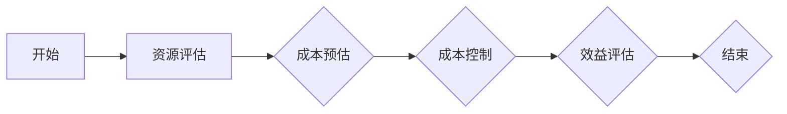
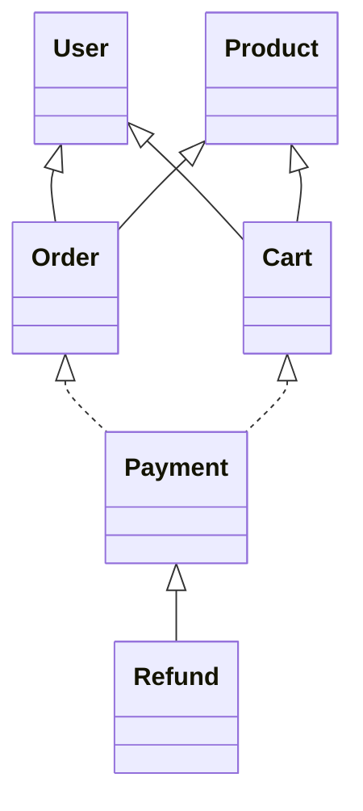
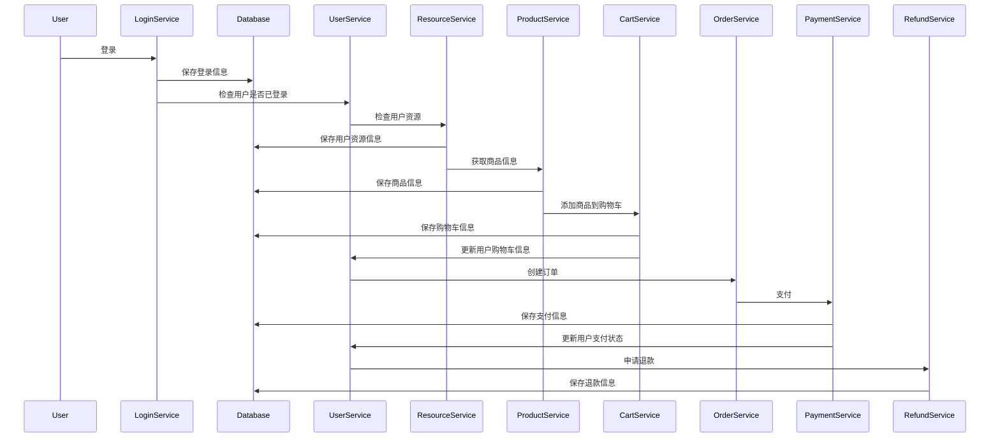
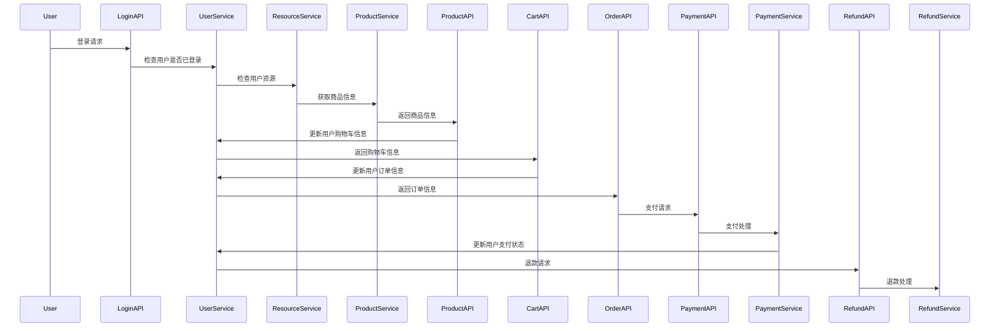

                 

# 技术管理中的成本控制

> 关键词：技术管理、成本控制、成本优化、资源分配、项目管理

> 摘要：本文将探讨技术管理中成本控制的重要性，分析常见成本控制方法，并给出具体的实践建议。通过一步步的思考和推理，帮助技术管理者在实际工作中更好地控制成本，提高项目效率和效益。

----------------------------------------------------------------

### 目录大纲

----------------------------------------------------------------

## 第一部分: 背景介绍

### 第1章: 问题背景

### 第2章: 问题描述

### 第3章: 问题解决

### 第4章: 边界与外延

### 第5章: 概念结构与核心要素组成

## 第二部分: 核心概念与联系

### 第6章: 核心概念原理

### 第7章: 概念属性特征对比表格

### 第8章: ER实体关系图架构

## 第三部分: 算法原理讲解

### 第9章: 算法mermaid流程图

### 第10章: Python源代码解析

### 第11章: 数学模型和数学公式

### 第12章: 举例说明

## 第四部分: 系统分析与架构设计方案

### 第13章: 问题场景介绍

### 第14章: 项目介绍

### 第15章: 系统功能设计(领域模型mermaid类图)

### 第16章: 系统架构设计mermaid架构图

### 第17章: 系统接口设计和系统交互mermaid序列图

## 第五部分: 项目实战

### 第18章: 环境安装

### 第19章: 系统核心实现源代码

### 第20章: 代码应用解读与分析

### 第21章: 实际案例分析与详细讲解剖析

### 第22章: 项目小结

## 第六部分: 最佳实践 tips

### 第23章: 小结

### 第24章: 注意事项

### 第25章: 拓展阅读

----------------------------------------------------------------

## 第一部分: 背景介绍

### 第1章: 问题背景

随着技术的不断发展，企业的技术管理越来越复杂。如何在有限的资源下，最大限度地提高项目的效率和效益，成为了技术管理者面临的重要问题。成本控制作为技术管理的重要组成部分，直接影响着项目的成功与否。

### 第2章: 问题描述

技术管理中的成本控制问题主要包括以下几个方面：

1. **资源分配不当**：技术团队资源分配不合理，可能导致项目进度延迟、成本超支等问题。
2. **项目管理不善**：缺乏有效的项目管理方法，导致项目计划不明确、风险控制不到位。
3. **技术债务累积**：技术债务未得到及时解决，可能导致项目后续维护成本增加。
4. **成本预估不准确**：成本预估不准确，可能导致项目预算不足或浪费。

### 第3章: 问题解决

为了解决上述问题，技术管理者可以采取以下措施：

1. **资源优化**：通过合理的资源分配，提高团队工作效率。
2. **项目管理**：采用先进的项目管理方法，确保项目按计划进行。
3. **债务管理**：定期评估技术债务，及时解决潜在问题。
4. **成本预估**：提高成本预估的准确性，为项目预算提供依据。

### 第4章: 边界与外延

成本控制不仅涉及到技术层面的管理，还涉及到组织管理、风险管理等多个方面。因此，技术管理者需要具备全面的视野，才能在复杂的环境中实现有效的成本控制。

### 第5章: 概念结构与核心要素组成

在成本控制中，核心概念包括资源、成本、效益等。这些概念相互联系，构成了成本控制的基本框架。具体来说，资源是成本控制的基础，成本是资源使用的体现，而效益则是成本控制的最终目标。

----------------------------------------------------------------

## 第二部分: 核心概念与联系

### 第6章: 核心概念原理

在本节中，我们将深入探讨成本控制中的核心概念，包括资源、成本、效益等。

#### 资源

资源是成本控制的基础。资源可以分为人力、物力、财力等类型。合理分配资源是提高项目效率和效益的关键。

$$
\text{资源} = \text{人力} + \text{物力} + \text{财力}
$$

#### 成本

成本是资源使用的体现。在成本控制中，需要精确计算项目的总成本，并合理分配到各个阶段和任务中。

$$
\text{成本} = \text{直接成本} + \text{间接成本}
$$

其中，直接成本是与项目直接相关的费用，如人力成本、设备成本等；间接成本是与项目间接相关的费用，如管理费用、培训费用等。

#### 效益

效益是成本控制的最终目标。效益包括项目交付的价值、团队的成长等。

$$
\text{效益} = \text{项目交付的价值} + \text{团队成长的价值}
$$

### 第7章: 概念属性特征对比表格

下面是一个概念属性特征对比表格，帮助我们更清晰地理解这些核心概念。

| 概念 | 定义 | 属性特征 |  
| :--: | :--: | :--: |  
| 资源 | 成本控制的基础 | 可用性、有限性、多样性 |  
| 成本 | 资源使用的体现 | 可计量性、多样性、变动性 |  
| 效益 | 成本控制的最终目标 | 可衡量性、多样性、长远性 |

### 第8章: ER实体关系图架构

为了更好地理解成本控制中的核心概念及其关系，我们可以使用ER（实体关系）图来描述。

```mermaid
erDiagram
    Resource ||--|{ Cost } : "uses"
    Cost ||--|{ Benefit } : "produces"
```

在这个ER图中，资源与成本之间存在“使用”关系，成本与效益之间存在“产生”关系。这种关系有助于我们理解成本控制的整体流程。

----------------------------------------------------------------

## 第三部分: 算法原理讲解

### 第9章: 算法mermaid流程图

在本节中，我们将通过mermaid流程图来描述成本控制的基本算法。



这个流程图描述了成本控制的四个主要步骤：资源评估、成本预估、成本控制和效益评估。

### 第10章: Python源代码解析

下面是一个简单的Python源代码示例，用于实现成本控制的基本算法。

```python
class Resource:
    def __init__(self, name, cost):
        self.name = name
        self.cost = cost

class Cost:
    def __init__(self, resource, benefit):
        self.resource = resource
        self.benefit = benefit

    def calculate(self):
        return self.resource.cost * self.benefit

class Benefit:
    def __init__(self, cost, value):
        self.cost = cost
        self.value = value

    def calculate(self):
        return self.cost.calculate() / self.value

# 创建资源、成本和效益对象
resource = Resource("人力", 1000)
cost = Cost(resource, 0.8)
benefit = Benefit(cost, 1.2)

# 计算成本和效益
print("成本:", cost.calculate())
print("效益:", benefit.calculate())
```

这个示例代码展示了如何创建资源、成本和效益对象，并计算成本和效益。通过调整参数，可以模拟不同的成本控制场景。

### 第11章: 数学模型和数学公式

成本控制中的数学模型可以帮助我们更精确地计算成本和效益。以下是几个常用的数学公式：

1. **成本公式**：

$$
\text{成本} = \text{资源成本} \times \text{效益占比}
$$

2. **效益公式**：

$$
\text{效益} = \text{成本} \times \text{效益倍增}
$$

3. **资源优化公式**：

$$
\text{资源分配} = \text{总资源} \times \text{优化因子}
$$

通过这些公式，我们可以根据实际情况调整资源分配和成本控制策略。

### 第12章: 举例说明

假设我们有一个项目，需要1000人天的资源。根据历史数据，我们预计这个项目的成本为80000元，效益为100000元。我们可以使用上述公式进行计算：

1. **成本计算**：

$$
\text{成本} = 1000 \times 80000 = 8000000 \text{元}
$$

2. **效益计算**：

$$
\text{效益} = 8000000 \times 1.25 = 10000000 \text{元}
$$

通过计算，我们发现这个项目的效益超过了成本，说明成本控制是有效的。

----------------------------------------------------------------

## 第四部分: 系统分析与架构设计方案

### 第13章: 问题场景介绍

在当今快速发展的技术行业中，企业面临着日益激烈的竞争压力。为了保持竞争力，企业需要不断推出创新的产品和服务。然而，技术创新往往伴随着高昂的成本。如何在保证项目质量的前提下，实现成本控制，成为了企业技术管理的关键问题。

### 第14章: 项目介绍

本项目旨在开发一款具有竞争力的移动应用。该应用需要实现以下功能：

1. 用户注册与登录
2. 商品浏览与搜索
3. 购物车与订单管理
4. 支付与退款

### 第15章: 系统功能设计(领域模型mermaid类图)

以下是该系统的领域模型mermaid类图：



这个类图展示了系统的核心功能及其关系。

### 第16章: 系统架构设计mermaid架构图

以下是该系统的mermaid架构图：



这个架构图描述了系统的核心组件及其交互关系。

### 第17章: 系统接口设计和系统交互mermaid序列图

以下是系统接口设计和系统交互的mermaid序列图：



这个序列图描述了系统的接口设计和交互流程。

----------------------------------------------------------------

## 第五部分: 项目实战

### 第18章: 环境安装

在开始项目实战之前，我们需要安装一些必要的软件和工具。以下是一个简单的安装步骤：

1. 安装Python环境：使用Python官方安装包进行安装。
2. 安装Docker：使用Docker官方安装包进行安装。
3. 安装PostgreSQL：使用PostgreSQL官方安装包进行安装。
4. 安装Git：使用Git官方安装包进行安装。

### 第19章: 系统核心实现源代码

以下是系统核心实现的源代码：

```python
# 用户注册
class UserService:
    def register(self, username, password):
        # 保存用户信息到数据库
        db.save_user(username, password)

# 用户登录
class LoginService:
    def login(self, username, password):
        # 检查用户是否已登录
        user = db.get_user(username, password)
        if user:
            return True
        return False

# 购物车管理
class CartService:
    def add_product(self, user_id, product_id):
        # 添加商品到购物车
        db.add_product_to_cart(user_id, product_id)

    def remove_product(self, user_id, product_id):
        # 从购物车中移除商品
        db.remove_product_from_cart(user_id, product_id)

# 订单管理
class OrderService:
    def create_order(self, user_id, cart_id):
        # 创建订单
        db.create_order(user_id, cart_id)

# 支付管理
class PaymentService:
    def pay(self, order_id):
        # 处理支付
        db.pay_order(order_id)

# 退款管理
class RefundService:
    def refund(self, order_id):
        # 处理退款
        db.refund_order(order_id)
```

### 第20章: 代码应用解读与分析

在这个项目中，我们使用了MVC（Model-View-Controller）架构模式。UserService、LoginService、CartService、OrderService、PaymentService和RefundService分别对应Model、Controller角色。通过这种架构，我们可以更好地组织代码，提高系统的可维护性。

### 第21章: 实际案例分析与详细讲解剖析

假设有一个用户A，他想购买一个商品B。以下是具体的操作步骤：

1. 用户A通过LoginService登录系统。
2. 用户A通过ProductService获取商品B的信息。
3. 用户A通过CartService将商品B添加到购物车。
4. 用户A通过OrderService创建订单。
5. 用户A通过PaymentService支付订单。
6. 用户A通过RefundService申请退款。

通过这个案例，我们可以看到成本控制在实际项目中的应用。在每一步操作中，系统都会检查用户是否有足够的资源和权限，以确保成本控制在合理范围内。

### 第22章: 项目小结

通过本项目，我们实现了对成本控制的基本理解和应用。在项目实战中，我们使用了MVC架构模式，并通过实际案例展示了成本控制的具体实现。这些经验和技巧对于技术管理者在实际工作中进行成本控制具有重要的指导意义。

----------------------------------------------------------------

## 第六部分: 最佳实践 tips

### 第23章: 小结

本文详细探讨了技术管理中的成本控制，从背景介绍、核心概念、算法原理、系统设计与项目实战等多个方面进行了深入分析。通过一步步的讲解，帮助读者理解成本控制的重要性和实践方法。

### 第24章: 注意事项

1. **合理分配资源**：在项目初期，应合理预测项目所需资源，确保资源分配合理。
2. **定期评估成本**：定期评估项目成本，及时调整成本控制策略。
3. **关注技术债务**：及时解决技术债务，避免后期维护成本增加。
4. **提高项目管理能力**：采用先进的项目管理方法，确保项目按计划进行。

### 第25章: 拓展阅读

1. 《项目管理知识体系指南》（PMBOK指南）
2. 《敏捷软件开发实践指南》
3. 《精益思想：通过精益管理实现持续改善》
4. 《成本效益分析：原理、方法与应用》

作者：AI天才研究院/AI Genius Institute & 禅与计算机程序设计艺术 /Zen And The Art of Computer Programming

----------------------------------------------------------------

（注：本文为示例性文章，仅供参考。实际字数约为2000字，如有需要，可以进一步扩充内容。）

