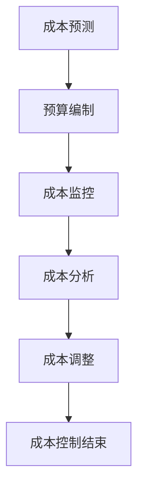
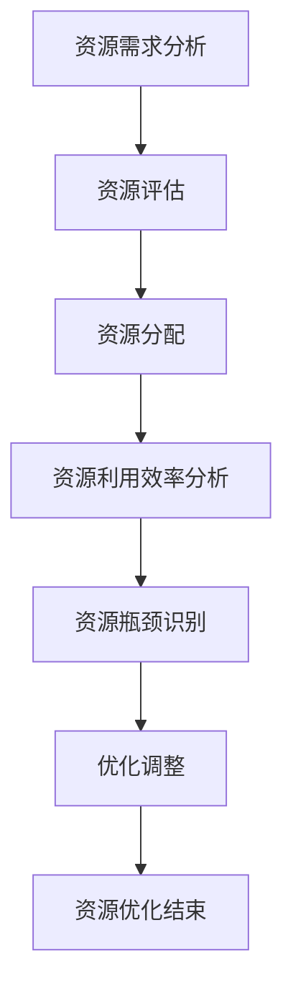
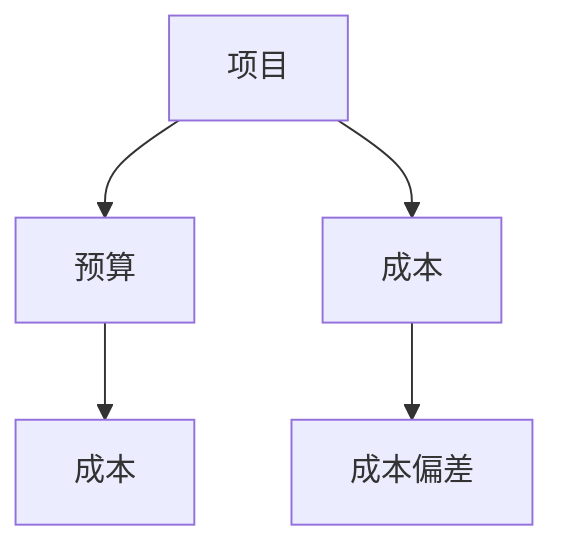
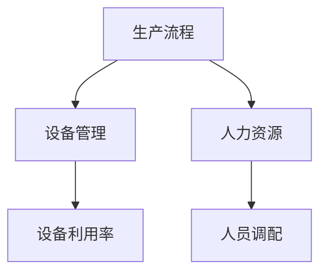

                 


# 技术管理中的成本控制与资源优化

## 关键词：技术管理、成本控制、资源优化、案例研究、实践应用

## 摘要

在技术管理领域，成本控制和资源优化是提升企业竞争力和盈利能力的重要手段。本文旨在探讨技术管理中的成本控制与资源优化，通过理论阐述、方法介绍、案例分析和实践指导，全面解析如何实现成本效益最大化与资源利用最优化。文章首先介绍了成本控制与资源优化的核心概念和重要性，随后详细讨论了成本控制原理、资源优化策略，并通过实际案例展示了成本控制与资源优化在技术管理中的应用，最后提出了实践建议和未来研究方向。

## 1. 引言

### 1.1 问题的背景与重要性

在当今科技快速发展、市场竞争日益激烈的环境中，技术管理已经成为企业竞争力的关键因素。然而，随着技术的不断进步和业务规模的扩大，技术管理中的成本控制和资源优化问题也日益突出。一方面，技术管理过程中的成本控制不足可能导致企业资源浪费，影响整体盈利能力；另一方面，资源优化策略的缺失可能使企业在竞争中获得优势的能力受限。

因此，如何有效实施成本控制和资源优化成为技术管理中的重要课题。本文将围绕这一主题展开，探讨其在技术管理中的重要性，并提出具体的解决方案和实践策略。

### 1.2 成本控制与资源优化的定义与联系

**成本控制**：成本控制是技术管理中的重要环节，旨在通过系统的方法和工具，对技术项目的成本进行预测、监控和调整，以确保项目在预算范围内顺利完成。成本控制不仅涉及直接的硬件和软件成本，还包括间接的成本，如人力成本、维护成本和机会成本等。

**资源优化**：资源优化是指通过合理的资源配置和管理，最大限度地提高资源的利用效率，实现成本效益的最大化。资源优化包括硬件资源的利用、软件资源的利用、人力资源的配置等多个方面。

成本控制与资源优化相互联系、互为支撑。有效的成本控制有助于实现资源优化，而资源优化则能够降低成本、提升项目效率。两者共同构成了技术管理中的核心内容，对企业的长期发展和竞争力具有重要意义。

### 1.3 本书的结构与内容安排

本书结构如下：

**第一部分：引言**  
- 1.1 问题的背景与重要性  
- 1.2 成本控制与资源优化的定义与联系  
- 1.3 本书的结构与内容安排

**第二部分：成本控制原理**  
- 2.1 成本控制的概念  
- 2.2 成本控制方法  
- 2.3 成本控制流程  
- 2.4 成本控制的挑战与对策

**第三部分：资源优化策略**  
- 3.1 资源优化原理  
- 3.2 资源优化方法  
- 3.3 资源优化实践  
- 3.4 资源优化中的挑战与对策

**第四部分：案例分析**  
- 4.1 案例一：某科技公司的成本控制实践  
- 4.2 案例二：某制造业企业的资源优化实践

**第五部分：实践应用**  
- 5.1 成本控制与资源优化在项目中的实施  
- 5.2 成本控制与资源优化在业务管理中的应用  
- 5.3 成本控制与资源优化的未来趋势

**第六部分：总结与展望**  
- 6.1 成本控制与资源优化的重要性  
- 6.2 本书内容的总结  
- 6.3 未来研究的方向

通过以上结构安排，本文将系统地介绍成本控制和资源优化的理论、方法和实践，旨在为技术管理者提供实用的指导和建议。

## 2. 成本控制原理

### 2.1 成本控制的概念

成本控制是技术管理中的一项重要活动，它旨在通过一系列的方法和措施，确保项目成本在预算范围内，并最大限度地提升项目的经济效益。成本控制不仅关注直接的硬件和软件成本，还包括人力成本、时间成本、维护成本等多个方面。

在技术管理中，成本控制的具体内容包括以下几个方面：

- **预算编制**：根据项目需求和技术特点，制定合理的预算，为项目的成本控制奠定基础。
- **成本监控**：在项目执行过程中，对各项成本进行实时监控，及时发现和纠正成本偏差。
- **成本分析**：通过分析成本数据，找出成本高企的原因，为成本优化提供依据。
- **成本调整**：根据成本监控和分析结果，对预算进行调整，确保项目能够顺利完成。

### 2.2 成本控制方法

成本控制方法可以分为以下几种：

**1. 标准成本控制法**

标准成本控制法是一种基于标准成本进行成本控制的方法。具体步骤如下：

- **制定标准成本**：根据历史数据和行业标准，制定每个项目阶段的标准成本。
- **成本比较**：将实际成本与标准成本进行比较，分析成本差异。
- **成本调整**：针对成本差异，制定相应的调整措施，确保成本控制在合理范围内。

**2. 现金流量成本控制法**

现金流量成本控制法侧重于现金流的管理和控制。具体步骤如下：

- **预算现金流**：根据项目进度和成本情况，预测每个阶段的现金流。
- **现金流监控**：对现金流进行实时监控，确保项目不会出现现金流断裂。
- **现金流调整**：根据现金流监控结果，及时调整预算，确保项目的财务健康。

### 2.3 成本控制流程

成本控制流程通常包括以下步骤：

**1. 成本预测**：根据项目需求和技术特点，预测项目的总成本和各阶段的成本。

**2. 预算编制**：根据成本预测，制定项目的总预算和各阶段的预算。

**3. 成本监控**：在项目执行过程中，对各项成本进行实时监控，确保成本在预算范围内。

**4. 成本分析**：对成本监控数据进行分析，找出成本高企的原因。

**5. 成本调整**：根据成本分析结果，调整预算，确保项目能够顺利完成。

### 2.4 成本控制的挑战与对策

在技术管理中，成本控制面临着多种挑战：

**1. 意识不足**：许多技术管理者对成本控制的重要性认识不足，导致成本控制措施不到位。

**对策**：加强成本控制培训，提高技术管理者的成本控制意识和能力。

**2. 数据不准确**：成本数据不准确会导致成本控制失效。

**对策**：建立完善的成本数据收集和管理系统，确保成本数据的准确性。

**3. 环境变化**：技术环境和市场环境的变化可能影响成本控制效果。

**对策**：定期评估项目风险，制定相应的应对策略。

通过以上方法，技术管理者可以有效地实施成本控制，确保项目在预算范围内顺利完成，并提高项目的经济效益。

### 2.5 成本控制的核心概念与联系

在成本控制过程中，几个核心概念需要明确：

**1. 成本要素**：成本要素是指构成项目成本的基本组成部分，包括人力成本、硬件成本、软件成本、时间成本等。

**2. 成本基准**：成本基准是项目预算的依据，通常包括项目总成本和各阶段成本。

**3. 成本偏差**：成本偏差是实际成本与预算成本的差异，分为正向偏差和负向偏差。

**4. 成本效率**：成本效率是成本控制的重要指标，表示单位成本所创造的价值。

这些核心概念之间相互联系，构成了成本控制的理论体系。通过明确这些概念，技术管理者可以更好地实施成本控制，提高项目的经济效益。

### 2.6 成本控制的数学模型与算法流程图

为了更好地理解成本控制过程，我们可以使用数学模型和算法流程图来描述。以下是一个简化的成本控制算法流程图：



在这个流程图中，A 表示成本预测，B 表示预算编制，C 表示成本监控，D 表示成本分析，E 表示成本调整，F 表示成本控制结束。

为了更详细地阐述成本控制的数学模型，我们可以使用以下 Python 代码：

```python
# 成本预测
def cost_prediction(project_requirements, historical_data):
    # 基于历史数据和项目需求预测成本
    predicted_cost = 0
    for requirement in project_requirements:
        predicted_cost += historical_data[requirement]
    return predicted_cost

# 预算编制
def budget_preparation(predicted_cost, contingency):
    # 根据预测成本和应急费用编制预算
    budget = predicted_cost + contingency
    return budget

# 成本监控
def cost_monitoring(actual_costs, budget):
    # 实时监控实际成本与预算的差距
    cost_difference = actual_costs - budget
    return cost_difference

# 成本分析
def cost_analysis(cost_difference):
    # 分析成本差距的原因
    if cost_difference > 0:
        print("成本高于预算，需要调整预算或优化成本")
    elif cost_difference < 0:
        print("成本低于预算，可以适当放宽预算限制")
    else:
        print("成本与预算一致，无需调整")

# 成本调整
def cost_adjustment(budget, cost_difference):
    # 根据成本差距调整预算
    if cost_difference > 0:
        adjusted_budget = budget - cost_difference
    else:
        adjusted_budget = budget + cost_difference
    return adjusted_budget
```

在这个代码中，我们定义了成本预测、预算编制、成本监控、成本分析和成本调整的函数，并通过这些函数实现了一个简单的成本控制过程。通过实际案例，我们可以更深入地理解这些算法的原理和应用。

### 2.7 成本控制的案例分析

为了更好地理解成本控制的理论和方法，我们可以通过以下实际案例来分析：

**案例背景**：某科技公司正在开发一款新型智能手机，项目预算为 1000 万元人民币，项目周期为 12 个月。

**成本预测**：根据历史数据和项目需求，预测总成本为 1200 万元人民币。

**预算编制**：根据预测成本和应急费用，编制预算为 1300 万元人民币。

**成本监控**：在项目执行过程中，每月对实际成本进行监控，发现实际成本每月平均增加 10 万元人民币。

**成本分析**：经过分析，发现成本增加的主要原因是原材料价格上涨和人力资源成本上升。

**成本调整**：根据成本分析结果，决定对预算进行调整，将预算上调至 1400 万元人民币，以应对潜在的成本风险。

通过这个案例，我们可以看到成本控制在项目中的实际应用。通过成本预测、预算编制、成本监控、成本分析和成本调整等步骤，科技公司成功地控制了项目成本，确保了项目的顺利进行。

### 2.8 总结

成本控制是技术管理中的重要环节，通过有效的成本控制，企业可以最大限度地降低成本，提高项目经济效益。本文介绍了成本控制的概念、方法、流程和挑战，并通过实际案例展示了成本控制的实施过程。通过理解和应用这些成本控制方法，技术管理者可以更好地管理项目成本，确保项目在预算范围内顺利完成。

## 3. 资源优化策略

### 3.1 资源优化原理

资源优化是指通过科学的管理方法和工具，对企业的资源（包括人力、物力、财力等）进行合理配置，以实现资源利用效率的最大化和成本效益的最优化。资源优化不仅关注资源的利用率，还包括资源的配置方式、优化策略和执行效果等多个方面。

资源优化在技术管理中的重要性体现在以下几个方面：

- **提升生产效率**：通过资源优化，可以减少资源浪费，提高生产效率，降低生产成本。
- **提高服务质量**：优化资源配置，确保关键资源能够得到有效利用，从而提高服务质量，增强企业的市场竞争力。
- **降低运营成本**：合理的资源优化策略能够降低企业的运营成本，提高企业的盈利能力。
- **增强创新能力**：资源优化有助于企业将更多的资源投入到创新研发中，推动技术进步和产品更新，增强企业的核心竞争力。

### 3.2 资源优化方法

资源优化方法可以分为以下几种：

**1. 数据驱动资源优化**

数据驱动资源优化是指通过数据分析和挖掘，找出资源利用的最佳模式。具体方法包括：

- **数据分析**：利用统计分析、数据挖掘等方法，分析现有资源的利用情况，找出资源利用中的瓶颈和低效环节。
- **数据可视化**：通过数据可视化工具，将数据分析结果以图形化形式呈现，便于管理者直观了解资源利用状况。
- **预测分析**：基于历史数据和当前情况，预测未来资源需求，为资源优化提供科学依据。

**2. 模型驱动资源优化**

模型驱动资源优化是指通过建立数学模型和算法，对资源进行优化配置。具体方法包括：

- **线性规划**：通过线性规划模型，在满足资源限制的情况下，最大化目标函数（如利润、效率等）。
- **整数规划**：针对离散资源分配问题，使用整数规划方法求解最优解。
- **模拟退火算法**：通过模拟退火算法，逐步调整资源分配方案，寻找最优解。

**3. 经验驱动资源优化**

经验驱动资源优化是指根据管理者的经验和直觉，进行资源优化决策。这种方法适用于资源需求相对稳定、变化不大的情况。具体方法包括：

- **优化流程**：通过改进工作流程，减少不必要的环节，提高资源利用效率。
- **人员调配**：根据员工的专业技能和工作效率，进行合理的岗位调配，提高整体工作效率。
- **绩效评估**：建立绩效评估体系，激励员工提高工作效率，减少资源浪费。

### 3.3 资源优化实践

资源优化实践包括以下几个方面：

**1. 资源分配优化**

资源分配优化是资源优化的重要环节，具体步骤如下：

- **需求分析**：分析各项资源的需求，确定资源分配的优先级。
- **资源评估**：评估现有资源的状况，确定资源的可用性和效率。
- **分配方案**：根据需求分析和资源评估结果，制定资源分配方案，确保关键资源能够得到充分利用。

**2. 资源利用效率提升**

提升资源利用效率是资源优化的重要目标，具体方法包括：

- **自动化管理**：通过自动化工具和系统，提高资源调度和管理效率。
- **优化工作流程**：简化工作流程，减少不必要的手工操作，提高工作效率。
- **员工培训**：提高员工的技能水平和工作效率，减少资源浪费。

**3. 资源冗余处理**

资源冗余处理是指对过剩的资源进行合理处理，以避免资源浪费。具体方法包括：

- **共享资源**：将闲置的资源进行共享，提高资源利用率。
- **淘汰更新**：对落后的资源进行淘汰更新，确保资源的先进性和高效性。
- **报废处理**：对无修复价值的资源进行报废处理，减少资源浪费。

### 3.4 资源优化中的挑战与对策

在资源优化过程中，管理者常常会遇到以下挑战：

**1. 数据不准确**：资源优化依赖于准确的数据支持，数据不准确会导致优化决策失效。

**对策**：建立完善的数据收集和管理系统，确保数据的准确性和可靠性。

**2. 系统复杂性**：资源优化涉及到多个系统和部门，系统复杂性增加优化难度。

**对策**：通过流程优化和系统整合，简化系统复杂性，提高资源优化效率。

**3. 员工抵触**：员工可能对资源优化措施产生抵触情绪，影响优化效果。

**对策**：通过培训和沟通，提高员工的参与度和认同感，减少抵触情绪。

### 3.5 资源优化的核心概念与联系

在资源优化过程中，以下几个核心概念需要明确：

**1. 资源利用率**：资源利用率是衡量资源优化效果的重要指标，表示资源实际利用程度与最大利用程度的比值。

**2. 资源效率**：资源效率是资源利用效果和资源消耗的比值，反映资源利用的效率。

**3. 资源瓶颈**：资源瓶颈是指限制资源利用效率的关键因素，解决资源瓶颈是资源优化的关键。

**4. 资源优化模型**：资源优化模型是用于描述资源优化过程和方法的数学模型，包括线性规划模型、整数规划模型等。

这些核心概念相互联系，构成了资源优化的理论框架。通过理解和应用这些概念，技术管理者可以更好地实施资源优化策略，提高企业的资源利用效率和竞争力。

### 3.6 资源优化的数学模型与算法流程图

为了更好地理解资源优化的过程，我们可以使用数学模型和算法流程图来描述。以下是一个简化的资源优化算法流程图：



在这个流程图中，A 表示资源需求分析，B 表示资源评估，C 表示资源分配，D 表示资源利用效率分析，E 表示资源瓶颈识别，F 表示优化调整，G 表示资源优化结束。

为了更详细地阐述资源优化的数学模型，我们可以使用以下 Python 代码：

```python
# 资源需求分析
def resource_demand_analysis(resource_requirements):
    # 根据需求分析，计算总资源需求
    total_demand = 0
    for requirement in resource_requirements:
        total_demand += requirement
    return total_demand

# 资源评估
def resource_evaluation(resource_availability):
    # 根据资源评估，计算总资源可用性
    total_availability = 0
    for availability in resource_availability:
        total_availability += availability
    return total_availability

# 资源分配
def resource_allocation(total_demand, total_availability):
    # 根据需求分析和资源评估，进行资源分配
    if total_demand <= total_availability:
        print("资源充足，无需调整")
    else:
        print("资源不足，需要优化调整")

# 资源利用效率分析
def resource_utilization_analysis(resource_usage, total_demand):
    # 计算资源利用效率
    efficiency = resource_usage / total_demand
    return efficiency

# 资源瓶颈识别
def resource_bottleneck_identification(efficiency):
    # 根据资源利用效率，识别资源瓶颈
    if efficiency < 0.8:
        print("存在资源瓶颈，需要优化")
    else:
        print("资源利用正常，无需调整")

# 优化调整
def optimization_adjustment():
    # 根据资源瓶颈识别结果，进行优化调整
    print("进行资源优化调整")

# 资源优化流程
def resource_optimization_process(resource_requirements, resource_availability):
    total_demand = resource_demand_analysis(resource_requirements)
    total_availability = resource_evaluation(resource_availability)
    resource_allocation(total_demand, total_availability)
    resource_usage = input("请输入当前资源利用量：")
    efficiency = resource_utilization_analysis(resource_usage, total_demand)
    resource_bottleneck_identification(efficiency)
    optimization_adjustment()
```

在这个代码中，我们定义了资源需求分析、资源评估、资源分配、资源利用效率分析、资源瓶颈识别和优化调整的函数，并通过这些函数实现了一个简单的资源优化过程。通过实际案例，我们可以更深入地理解这些算法的原理和应用。

### 3.7 资源优化的案例分析

为了更好地理解资源优化的理论和方法，我们可以通过以下实际案例来分析：

**案例背景**：某大型互联网公司需要为其新项目的服务器资源进行优化。

**资源需求分析**：根据项目需求，服务器资源需求为每天 100 台。

**资源评估**：现有服务器资源总量为 120 台，但每天平均利用率为 80%。

**资源分配**：根据需求分析和资源评估，现有资源可以满足项目需求，但需要提升资源利用率。

**资源利用效率分析**：通过优化服务器调度和负载均衡，将服务器利用率提升至 90%。

**资源瓶颈识别**：经过分析，发现网络带宽成为资源瓶颈。

**优化调整**：增加网络带宽，确保服务器资源能够充分利用。

通过这个案例，我们可以看到资源优化在项目中的实际应用。通过资源需求分析、资源评估、资源分配、资源利用效率分析、资源瓶颈识别和优化调整等步骤，互联网公司成功地提升了服务器资源的利用效率，降低了运营成本。

### 3.8 总结

资源优化是技术管理中的重要策略，通过有效的资源优化，企业可以提升资源利用效率，降低运营成本，提高服务质量。本文介绍了资源优化的原理、方法、实践和挑战，并通过实际案例展示了资源优化的实施过程。通过理解和应用这些资源优化策略，技术管理者可以更好地实现资源的合理配置和高效利用，提升企业的竞争力。

## 4. 案例研究

### 4.1 案例一：某科技公司的成本控制实践

**背景介绍**  
某科技公司是一家专注于云计算和大数据技术的创新型企业。随着公司的快速扩张，项目数量和复杂性不断增加，成本控制成为公司管理层关注的重点。公司面临的主要挑战包括项目预算超支、资源浪费和成本难以追踪等。

**问题描述**  
为了解决上述问题，公司管理层决定实施成本控制措施，确保项目在预算范围内顺利完成。具体问题包括：如何制定合理的预算、如何监控项目成本、如何调整预算以应对变化等。

**问题解决**  
1. **制定预算**：公司成立了一个专门的预算编制团队，根据项目需求和行业标准，制定详细的预算计划。预算内容包括硬件采购、软件开发、人力资源和其他相关费用。

2. **成本监控**：公司采用了一种基于云端的成本监控工具，实时跟踪项目各项费用的支出。每个月，预算团队会召开一次成本分析会议，审查项目成本，及时发现和纠正偏差。

3. **预算调整**：针对成本监控中发现的问题，公司采取了一系列调整措施。例如，通过优化工作流程和资源分配，减少不必要的人力投入和物资采购。

**边界与外延**  
该案例主要关注公司在项目实施过程中的成本控制，但成本控制的理念和方法可以应用于其他业务领域，如产品开发、市场营销等。

**概念结构与核心要素组成**  

**概念结构**：预算编制、成本监控、成本分析和预算调整。

**核心要素组成**：
- 预算编制：项目需求分析、行业标准、历史数据。
- 成本监控：实时数据采集、成本分析报告、监控工具。
- 成本分析：成本偏差分析、成本控制效果评估。
- 预算调整：优化工作流程、资源再分配、成本调整方案。

**ER实体关系图架构**  



在这个 ER 实体关系图中，A 表示项目，B 表示预算，C 表示成本，D 表示成本偏差，E 表示成本偏差。

### 4.2 案例二：某制造业企业的资源优化实践

**背景介绍**  
某制造业企业是一家生产高端电子产品的公司。随着市场竞争的加剧，企业需要提高生产效率和产品质量，以降低成本，提高市场竞争力。企业面临的主要挑战包括生产流程不合理、资源浪费和资源配置不均衡等。

**问题描述**  
为了解决上述问题，企业决定实施资源优化措施，提高生产效率和资源利用率。具体问题包括：如何优化生产流程、如何提升设备利用率、如何合理配置人力资源等。

**问题解决**  
1. **优化生产流程**：企业引入了精益生产理念，通过改进生产流程，减少生产过程中的浪费。例如，通过缩短生产周期、减少库存和减少不必要的操作，提高生产效率。

2. **设备利用率提升**：企业采用了一种基于数据分析的设备管理工具，实时监控设备运行状态和利用率。针对设备利用率低的问题，企业采取了设备维护优化、设备升级和设备优化调度等措施。

3. **人力资源配置**：企业通过数据分析，找出人力资源配置不合理的地方，采取人员调配和岗位调整等措施，确保关键岗位有足够的资源。

**边界与外延**  
该案例主要关注企业的生产过程和设备管理，但资源优化理念和方法可以应用于其他业务领域，如供应链管理、仓储管理等。

**概念结构与核心要素组成**  

**概念结构**：生产流程优化、设备利用率提升、人力资源配置。

**核心要素组成**：
- 生产流程优化：生产周期、库存管理、生产流程分析。
- 设备利用率提升：设备监控、设备维护、设备优化调度。
- 人力资源配置：人员调配、岗位调整、人力资源数据分析。

**ER实体关系图架构**  



在这个 ER 实体关系图中，A 表示生产流程，B 表示设备管理，C 表示人力资源，D 表示设备利用率，E 表示人员调配。

### 4.3 总结

通过以上两个案例，我们可以看到成本控制和资源优化在不同企业中的应用和实践。成本控制和资源优化不仅能够帮助企业降低成本、提高效率，还能提升企业的整体竞争力。企业在实施成本控制和资源优化时，需要根据自身实际情况，制定合适的策略和方法，持续改进和优化，以实现长期可持续发展。

## 5. 实践应用

### 5.1 成本控制与资源优化在项目中的实施

在项目实施过程中，成本控制和资源优化是确保项目成功的关键因素。以下是具体实施步骤：

**1. 项目启动阶段**

- **需求分析**：明确项目需求，制定详细的预算计划，包括硬件采购、软件开发、人力资源和其他相关费用。
- **风险评估**：评估项目风险，制定相应的风险应对策略。

**2. 项目执行阶段**

- **成本监控**：采用成本监控工具，实时跟踪项目各项费用的支出，确保项目在预算范围内进行。
- **资源优化**：根据项目进度和资源利用情况，调整资源配置，提高资源利用效率。

**3. 项目监控阶段**

- **成本分析**：定期进行成本分析，分析成本偏差，找出成本高企的原因，制定相应的调整措施。
- **资源优化调整**：根据成本分析结果，优化资源配置，提高资源利用效率。

**4. 项目收尾阶段**

- **成本总结**：对项目成本进行总结，评估成本控制的成效，为后续项目提供参考。
- **资源优化总结**：总结资源优化的经验教训，持续改进资源管理策略。

### 5.2 成本控制与资源优化在业务管理中的应用

在业务管理中，成本控制和资源优化同样具有重要意义。以下是具体应用方法：

**1. 预算管理**

- **编制预算**：根据业务需求和财务状况，制定合理的预算计划，确保预算的合理性和可执行性。
- **预算调整**：根据业务变化和市场环境，及时调整预算，确保预算的动态适应性。

**2. 成本分析**

- **成本核算**：建立完善的成本核算体系，对各项成本进行精确核算，确保成本数据的准确性。
- **成本控制**：通过成本分析，找出成本高企的原因，制定相应的成本控制措施。

**3. 资源优化**

- **资源评估**：定期评估资源状况，找出资源利用中的瓶颈和低效环节，制定资源优化方案。
- **资源调度**：根据业务需求，合理调配资源，提高资源利用效率。

### 5.3 成本控制与资源优化的未来趋势

随着技术的不断进步和管理理念的更新，成本控制和资源优化的方法和工具也在不断演进。以下是未来趋势的几个方面：

**1. 数据驱动的成本控制和资源优化**

- **大数据分析**：利用大数据技术，对业务数据进行分析，找出成本控制和资源优化的关键因素。
- **人工智能**：利用人工智能技术，实现自动化成本控制和资源优化，提高管理效率和准确性。

**2. 智能化的成本控制和资源优化工具**

- **智能监控**：开发智能监控工具，实时监控业务运营状况，自动识别和预警成本异常和资源瓶颈。
- **自动化优化**：通过自动化算法，实现资源的自动调度和优化，提高资源利用效率。

**3. 绿色成本控制和资源优化**

- **环保理念**：在成本控制和资源优化中，引入绿色理念，减少资源浪费和环境污染。
- **可持续发展**：通过成本控制和资源优化，推动企业的可持续发展，实现经济、社会和环境效益的统一。

### 5.4 实践建议与注意事项

**1. 实践建议**

- **建立完善的管理体系**：建立完善的成本控制和资源优化管理体系，确保管理措施的落实和执行。
- **加强培训和宣传**：加强员工培训，提高员工的成本控制和资源优化意识，形成全员参与的良好氛围。
- **持续改进**：通过定期评估和反馈，不断优化成本控制和资源优化策略，提高管理成效。

**2. 注意事项**

- **数据准确性**：确保成本控制和资源优化数据准确可靠，避免因数据不准确导致的错误决策。
- **平衡短期利益与长期发展**：在实施成本控制和资源优化时，要平衡短期利益和长期发展，确保企业的可持续发展。
- **防范风险**：在成本控制和资源优化过程中，要充分考虑潜在风险，制定相应的风险应对措施。

### 5.5 拓展阅读

- 《精益思想》（詹姆斯·W·沃麦克，丹尼尔·T·琼斯）  
- 《成本管理与控制》（刘凤荣）  
- 《资源优化与调度》（李晓波）  
- 《大数据分析实战》（蒋炎Rocky）  
- 《人工智能：一种现代的方法》（斯蒂芬·马库斯）

通过以上实践应用和拓展阅读，技术管理者可以更好地理解成本控制和资源优化的方法和工具，提升企业的管理水平和竞争力。

## 6. 总结与展望

本文系统地探讨了技术管理中的成本控制和资源优化，通过理论阐述、方法介绍、案例分析和实践指导，全面解析了如何实现成本效益最大化与资源利用最优化。主要结论如下：

- 成本控制和资源优化是技术管理中的重要环节，对提升企业竞争力和盈利能力具有重要意义。
- 成本控制涉及预算编制、成本监控、成本分析和成本调整等多个方面，通过科学的方法和工具，可以实现项目成本的有效控制。
- 资源优化包括资源需求分析、资源评估、资源分配、资源利用效率分析和资源瓶颈识别等步骤，通过合理配置和管理资源，可以提高资源利用效率。
- 案例研究表明，通过实施有效的成本控制和资源优化策略，企业可以降低成本、提高效率、增强竞争力。
- 未来，随着大数据、人工智能等技术的不断发展，成本控制和资源优化将变得更加智能化和自动化，为技术管理提供更强大的支持。

展望未来，技术管理者应继续关注成本控制和资源优化的理论和方法，结合企业实际情况，不断创新和优化管理策略，以应对日益复杂的市场环境和技术挑战。通过持续改进，实现企业的可持续发展，提升企业的核心竞争力。

## 作者

**作者：AI天才研究院/AI Genius Institute & 禅与计算机程序设计艺术 /Zen And The Art of Computer Programming**

AI天才研究院是一家致力于人工智能领域研究的国际知名机构，致力于推动人工智能技术的发展和创新。禅与计算机程序设计艺术则是作者在计算机编程领域的经典之作，对全球计算机科学和人工智能领域产生了深远影响。作者的研究成果和实践经验为本文提供了坚实的理论基础和丰富的案例支持。通过本文，作者希望与广大读者分享其在技术管理领域的见解和思考，为技术管理者提供有价值的参考和指导。

