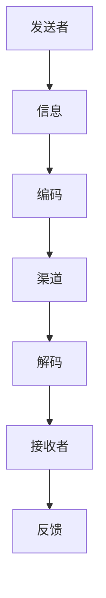

                 

### 沟通在技术管理中的重要性

在现代企业中，技术管理作为推动业务创新和实现技术进步的核心环节，其重要性不言而喻。然而，技术管理的成功不仅依赖于技术能力和项目管理技巧，更依赖于团队之间、上下级之间以及内外部合作伙伴之间的有效沟通。本文将围绕技术管理中的有效沟通策略进行深入探讨。

#### 1.1 技术管理的定义与作用

技术管理涉及的是如何利用技术资源来达到组织的目标。它不仅包括技术规划、技术开发、技术运维等方面，还涉及如何通过技术手段来优化业务流程、提升组织效率。具体来说，技术管理的作用有：

- **资源优化**：合理分配和使用技术资源，确保资源的高效利用。
- **技术创新**：推动技术进步，为组织带来新的商业机会。
- **风险管理**：识别和应对技术风险，保障组织的稳定运行。

#### 1.2 技术管理中的沟通挑战

尽管技术管理的重要性被广泛认可，但在实际操作中，沟通挑战仍然是一个无法回避的问题。技术管理中的沟通挑战主要包括：

- **技术语言障碍**：不同技术人员使用的专业术语和表达方式可能不同，导致沟通不畅。
- **文化差异**：跨部门或跨国团队之间的文化差异可能影响沟通效果。
- **信息冗余与缺失**：信息传递过程中可能存在冗余，同时也可能出现信息缺失。
- **时间压力**：在项目开发过程中，时间压力往往导致沟通时间有限，影响沟通效果。

#### 1.3 有效沟通在技术管理中的关键性

有效沟通在技术管理中具有至关重要的作用。首先，它能够确保团队成员理解项目的目标和期望，从而提高团队的协作效率。其次，通过有效沟通，管理者能够及时了解团队成员的需求和问题，从而做出更加合理的决策。此外，有效沟通还能减少误解和冲突，提升团队凝聚力。

#### 1.4 技术管理中沟通的目标和原则

技术管理中的沟通目标主要包括：

- **信息传递**：确保信息准确、及时地传递给相关人员。
- **共识达成**：通过沟通达成团队共识，统一目标和行动。
- **意见反馈**：鼓励团队成员提出意见和建议，促进团队的创新和发展。

为了实现这些目标，技术管理中应遵循以下沟通原则：

- **尊重与信任**：尊重团队成员的个性和意见，建立信任关系。
- **清晰与简洁**：表达清晰，避免冗余，使信息易于理解。
- **及时与透明**：及时传递信息，保持信息的透明度。
- **个性化与适应性**：根据不同情况和对象，采用适当的沟通方式和风格。

通过上述分析和讨论，我们可以看到，有效沟通是技术管理中不可或缺的一部分。在接下来的章节中，我们将进一步探讨沟通的基本原理、团队沟通策略、技术文档编写技巧、演示与演讲技巧、高效会议管理以及技术冲突管理等方面的内容，以期为大家提供一套全面有效的技术管理沟通策略。

### 沟通的基本原理

要实现有效的技术管理沟通，理解沟通的基本原理是至关重要的。有效的沟通不仅依赖于信息的内容，更取决于信息传递的方式和过程。以下将从沟通模型、沟通障碍与解决方法、非语言沟通的重要性以及提高沟通效果的技巧四个方面，详细探讨沟通的基本原理。

#### 2.1 沟通模型

沟通模型是指信息在发送者、接收者之间传递和转换的过程。一个典型的沟通模型包括以下几个基本元素：

1. **发送者（Source）**：信息源头，负责编码信息并将其传递给接收者。
2. **信息（Message）**：发送者想要传达的内容，可以是语言、文字、图像等。
3. **编码（Encoding）**：将信息转换成适当的符号形式，如语言、文字、图像等。
4. **渠道（Channel）**：信息传递的途径，如面对面交流、电子邮件、电话等。
5. **解码（Decoding）**：接收者将接收到的信息转换成可以理解的形式。
6. **接收者（Receiver）**：信息的接受者，负责解码信息并产生反应。
7. **反馈（Feedback）**：接收者对信息的反应，可以是语言、文字、表情等。

图示：

通过这个模型，我们可以看到，信息传递的每一个环节都可能影响沟通的效果。因此，了解并优化这些环节，对于提高沟通效果至关重要。

#### 2.2 沟通障碍与解决方法

沟通障碍是指阻碍信息有效传递的各种因素。常见的沟通障碍包括：

1. **语言障碍**：不同技术领域和专业背景的人可能使用不同的术语，导致理解困难。
   - **解决方法**：使用简单明了的语言，避免使用专业术语，必要时进行解释。

2. **文化差异**：跨文化团队之间的价值观、行为方式不同，可能导致误解和冲突。
   - **解决方法**：加强跨文化培训，提高团队成员对文化差异的敏感度，尊重不同文化背景。

3. **信息冗余**：过多的信息可能导致接收者难以抓住关键内容。
   - **解决方法**：精简信息，突出重点，使用图表和视觉辅助工具。

4. **信息缺失**：信息在传递过程中可能丢失重要部分，导致接收者理解不完整。
   - **解决方法**：确保信息的完整性，进行多次确认，建立有效的反馈机制。

5. **时间压力**：在紧急情况下，沟通时间有限，可能影响沟通质量。
   - **解决方法**：提前规划沟通时间，确保有充足的时间进行充分讨论。

#### 2.3 非语言沟通的重要性

非语言沟通是指通过肢体语言、面部表情、姿态等非语言方式进行的沟通。非语言沟通在技术管理中同样重要，因为它们可以补充和强化语言沟通的效果。

1. **肢体语言**：如点头、手势、姿态等，可以表达同意、鼓励、关注等态度。
2. **面部表情**：如微笑、皱眉、愤怒等，可以传达情绪和态度。
3. **声音语调**：如语速、音量、语气等，可以影响信息的传达效果。

非语言沟通不仅能增强信息的表达力，还能帮助识别对方的情绪和态度，从而更好地理解对方意图。

#### 2.4 提高沟通效果的技巧

为了提高沟通效果，以下是一些建议：

1. **积极倾听**：不仅关注对方说的话，还要注意对方的非语言信号，全面理解对方的意图。
2. **提问与确认**：通过提问和确认，确保理解对方的意思，避免误解。
3. **表达清晰**：使用简洁、明确的语言，避免歧义和混淆。
4. **适应对方**：根据对方的文化背景和沟通风格，调整自己的沟通方式。
5. **建立反馈机制**：鼓励团队成员提供反馈，不断改进沟通方法。

通过上述分析和讨论，我们可以看到，沟通的基本原理对于技术管理中的有效沟通至关重要。只有理解并运用这些原理，才能实现信息的有效传递，提升团队的协作效率，实现组织目标。

### 团队沟通策略

在技术管理中，团队沟通策略是确保项目顺利进行和团队高效协作的关键。有效的团队沟通不仅能够提高团队成员之间的理解和信任，还能减少误解和冲突，提升整个团队的工作效率。以下将详细探讨团队沟通的重要性、沟通障碍与应对策略、最佳实践以及团队会议的有效组织。

#### 3.1 团队沟通的重要性

团队沟通在技术管理中具有多重重要性：

1. **信息共享**：通过有效的沟通，团队成员能够共享信息、资源和知识，从而提高整个团队的工作效率。
2. **目标统一**：团队成员通过沟通可以共同理解项目的目标和期望，确保个人目标和团队目标的统一。
3. **协作优化**：沟通能够帮助团队成员发现问题和瓶颈，及时调整策略和资源，优化协作流程。
4. **冲突减少**：通过沟通，团队成员可以更好地理解彼此的需求和立场，减少因误解和冲突导致的内耗。
5. **创新促进**：团队成员之间的沟通能够激发创意和灵感，推动技术创新和业务发展。

#### 3.2 团队沟通的障碍与应对策略

尽管沟通的重要性被广泛认可，但团队沟通中仍然存在多种障碍。以下是一些常见的沟通障碍及其应对策略：

1. **技术语言障碍**：不同技术人员可能使用不同的专业术语，导致理解困难。
   - **应对策略**：使用简单明了的语言，避免使用过于专业的术语，必要时进行解释和澄清。

2. **文化差异**：团队成员来自不同的文化背景，可能存在价值观和行为方式的差异。
   - **应对策略**：加强跨文化培训，提高团队成员对文化差异的敏感度，建立包容和尊重的文化氛围。

3. **信息冗余**：过多的信息可能导致团队成员难以抓住关键内容。
   - **应对策略**：精简信息，突出重点，使用图表和视觉辅助工具来传达复杂信息。

4. **信息缺失**：信息在传递过程中可能丢失重要部分，导致误解和错误。
   - **应对策略**：确保信息的完整性，进行多次确认，建立有效的反馈机制，鼓励团队成员提问和反馈。

5. **时间压力**：在项目开发过程中，时间压力可能导致沟通时间有限，影响沟通效果。
   - **应对策略**：提前规划沟通时间，确保有充足的时间进行充分讨论，避免临时突击和匆忙决策。

#### 3.3 团队沟通的最佳实践

为了实现有效的团队沟通，以下是一些最佳实践：

1. **建立明确的沟通目标**：在团队会议或项目启动阶段，明确沟通的目标和期望，确保所有团队成员都清楚了解。
2. **制定沟通计划**：制定详细的沟通计划，包括沟通频率、渠道、内容、负责人等，确保沟通的有序进行。
3. **使用多种沟通渠道**：根据不同的沟通需求和场景，选择合适的沟通渠道，如面对面会议、电子邮件、即时通讯工具等。
4. **积极倾听与反馈**：团队成员在沟通中应积极倾听他人的意见，并及时给予反馈，确保信息的双向流动。
5. **鼓励开放和诚实的沟通**：营造一个开放和诚实的沟通环境，鼓励团队成员表达自己的观点和需求，避免压抑和隐瞒。
6. **定期评估和改进**：定期评估团队沟通的效果和存在的问题，根据反馈进行改进，持续优化沟通策略。

#### 3.4 团队会议的有效组织

团队会议是团队沟通的重要形式之一，以下是一些有效组织团队会议的建议：

1. **明确会议目的和议程**：在会议前明确会议的目的和议程，确保会议内容聚焦，避免偏离主题。
2. **提前通知和准备**：提前通知会议的时间、地点和议程，并提供必要的资料和背景信息，确保团队成员有充足的时间准备。
3. **控制会议时间**：严格控制会议时间，避免冗长和无聊的讨论，确保会议内容高效进行。
4. **鼓励参与和互动**：鼓励团队成员积极参与讨论，提出问题和建议，营造互动和开放的会议氛围。
5. **记录和跟进**：会议结束后，及时记录会议内容和决策，跟进会议决定的执行情况，确保会议成果得到有效落实。
6. **使用会议工具**：利用现代会议工具，如在线会议软件、项目管理工具等，提高会议效率和效果。

通过上述团队沟通策略的探讨，我们可以看到，有效的团队沟通是技术管理中不可或缺的一部分。只有在良好的沟通基础上，团队才能实现高效的协作，共同完成项目目标。在接下来的章节中，我们将继续探讨技术文档与编写技巧、演示与演讲技巧、高效会议管理以及技术冲突管理等方面的内容。

### 技术文档与编写技巧

技术文档是技术管理中至关重要的一环，它不仅是团队协作的基础，也是知识传承和项目延续的重要保障。编写高质量的技术文档，不仅能够帮助团队成员更好地理解和执行任务，还能提高项目的透明度和可维护性。以下将详细探讨技术文档的用途和重要性、编写原则、常见技术文档类型、编写工具与方法。

#### 4.1 技术文档的用途和重要性

技术文档的用途和重要性体现在以下几个方面：

1. **知识传承**：技术文档记录了项目的开发背景、需求、设计思路、实现方法等，为团队成员提供了学习和参考的资料，确保了知识传承。
2. **团队协作**：技术文档为团队成员提供了共同的语言和参考标准，减少了由于信息不对称导致的误解和错误。
3. **项目可维护性**：详细的文档记录有助于新成员快速上手项目，提高项目的可维护性和可扩展性。
4. **质量保障**：通过编写和审查技术文档，可以及时发现和纠正项目中的问题，提高项目质量。
5. **风险管理**：技术文档为项目风险管理和问题解决提供了重要依据，有助于提前预防和应对可能出现的问题。

#### 4.2 技术文档的编写原则

编写高质量的技术文档需要遵循以下原则：

1. **清晰性**：文档应使用简洁明了的语言，避免使用复杂的术语和专业词汇，确保所有读者都能理解。
2. **准确性**：确保文档内容的准确无误，包括技术细节、数据参数、实现方法等，避免误导读者。
3. **完整性**：文档应包含所有必要的信息，包括项目的背景、需求、设计、实现、测试等环节，确保信息的完整性。
4. **一致性**：文档风格应保持一致，包括格式、术语、命名规范等，避免混淆和误解。
5. **可读性**：文档应具有良好的结构，使用标题、段落、列表等格式，提高文档的可读性。
6. **可维护性**：文档应便于更新和维护，包括版本控制和内容更新，确保文档的长期有效性。

#### 4.3 常见技术文档类型

根据技术文档的用途和内容，常见的文档类型包括：

1. **需求文档**：详细记录项目的需求，包括功能需求、性能需求、安全需求等，为后续设计和开发提供依据。
2. **设计文档**：描述项目的设计思路、架构设计、模块划分、接口定义等，帮助团队成员理解项目的整体结构和实现方法。
3. **开发文档**：记录项目的开发过程、实现细节、代码注释、测试方案等，为开发团队成员提供技术指导和参考。
4. **用户手册**：面向最终用户，详细介绍产品的功能和使用方法，帮助用户快速上手和解决问题。
5. **维护文档**：记录项目的维护过程、常见问题、解决方法等，为后续维护和更新提供参考。
6. **测试文档**：记录项目的测试计划、测试用例、测试结果等，确保项目质量满足要求。

#### 4.4 技术文档编写工具与方法

为了提高技术文档的编写效率和质量，可以采用以下工具和方法：

1. **Markdown**：Markdown是一种轻量级的文本格式，支持丰富的格式化功能，如标题、列表、引用、图片等，便于快速编写和格式化文档。
2. **LaTeX**：LaTeX是一种高质量的排版系统，特别适用于编写科学和技术文档，支持复杂的数学公式和图表排版。
3. **版本控制工具**：如Git，可以记录文档的版本历史，方便团队协作和文档管理。
4. **文档管理平台**：如Confluence、Wiki等，提供文档编写、版本控制、共享协作等功能，提高团队协作效率。
5. **自动化工具**：如Jenkins、GitLab CI等，可以自动化生成和部署文档，提高文档生成效率。
6. **模板和样式**：制定统一的文档模板和样式规范，确保文档格式的一致性和专业性。

通过遵循技术文档的编写原则、选择合适的文档类型和工具，以及运用有效的编写方法，可以编写出高质量的技术文档，为技术管理提供有力支持。在接下来的章节中，我们将继续探讨演示与演讲技巧、高效会议管理以及技术冲突管理等方面的内容。

### 演示与演讲技巧

在技术管理中，演示和演讲技巧是技术团队与外部利益相关者沟通的重要方式。通过有效的演示和演讲，技术团队可以清晰地传达项目进展、技术方案和业务价值，增强团队的影响力和公信力。以下将从演示的目的和形式、演示准备、演讲技巧与风格以及演示中的互动与反馈四个方面，详细探讨演示与演讲技巧。

#### 5.1 演示的目的和形式

演示和演讲的目的在于传达信息、引导讨论和获得反馈。具体形式可以分为：

1. **项目汇报**：向管理层或客户展示项目的进展、成果和问题，获得支持和资源。
2. **方案讲解**：向团队成员或外部专家介绍技术方案、设计思路和实现方法，促进理解和共识。
3. **培训授课**：向新员工或合作伙伴传授技术知识和经验，提高技能水平。
4. **会议讨论**：在团队会议中，通过演讲和讨论，解决项目中的问题和挑战，优化项目方案。

#### 5.2 演示准备

成功的演示需要充分的准备，以下是一些关键步骤：

1. **明确目标**：确定演示的目的和受众，明确需要传达的关键信息。
2. **内容梳理**：梳理演讲内容，确保逻辑清晰、结构紧凑，突出重点。
3. **资料准备**：准备必要的演示材料，如PPT、图表、代码片段、测试结果等，确保资料的准确性和相关性。
4. **练习演练**：多次练习演讲，熟悉内容和流程，提高自信心和演讲能力。
5. **技术准备**：确保演示工具和设备正常运行，如投影仪、电脑、网络等，避免突发状况影响演示效果。

#### 5.3 演讲技巧与风格

演讲技巧和风格直接影响观众的接受程度和理解程度。以下是一些关键的演讲技巧和风格建议：

1. **语言表达**：使用清晰、简洁、有感染力的语言，避免使用复杂的术语和专业词汇，确保观众易于理解。
2. **肢体语言**：通过适当的肢体语言，如眼神交流、手势、姿态等，增强演讲的表现力和感染力。
3. **语调与节奏**：运用适当的语调和节奏，如抑扬顿挫、快慢适中，提高演讲的吸引力和表现力。
4. **故事讲述**：通过故事讲述，将复杂的信息和概念变得生动有趣，增强观众的兴趣和理解。
5. **互动与引导**：鼓励观众提问和参与讨论，引导观众思考和互动，增强演讲的参与感和效果。
6. **风格一致**：保持演讲风格的一致性，如语言风格、表达方式、视觉效果等，避免出现杂乱无章的感觉。

#### 5.4 演示中的互动与反馈

互动和反馈是演示过程中的重要环节，以下是一些建议：

1. **提问环节**：设置提问环节，鼓励观众提问，及时解答问题，展示团队的专业性和诚信。
2. **反馈收集**：通过观众的表情、反应和提问，收集反馈信息，了解观众的接受程度和理解程度。
3. **互动工具**：使用互动工具，如在线投票、问答平台等，增加观众的参与度和互动性。
4. **后续跟进**：演示结束后，及时整理反馈信息，跟进问题的解决情况，持续改进演讲内容和效果。

通过上述演示与演讲技巧的探讨，我们可以看到，有效的演示和演讲是技术管理中不可或缺的一部分。在接下来的章节中，我们将继续探讨高效会议管理、技术冲突管理以及技术团队内部沟通协调等方面的内容，以期为技术管理提供全面有效的沟通策略。

### 高效会议管理

在技术管理中，高效会议管理是确保团队协作和信息传递顺畅的关键。通过合理的会议规划和有效的会议执行，可以最大限度地提高会议效率，避免浪费时间和资源。以下将详细探讨会议的目的与类型、会议准备、会议流程与规则以及会议记录与后续跟进。

#### 6.1 会议的目的与类型

会议的目的是为了达成共识、解决问题、传达信息、协调资源等。根据会议的目的和性质，常见的会议类型包括：

1. **项目启动会议**：在项目开始时，明确项目目标、任务分工、时间进度等，确保团队成员对项目有清晰的认识。
2. **项目进度会议**：定期回顾项目进展，讨论遇到的问题和解决方案，调整计划，确保项目按计划推进。
3. **技术评审会议**：对项目的设计方案、代码实现进行评审，确保技术方案和实现符合质量要求。
4. **决策会议**：就项目中的重要决策进行讨论和决策，如技术路线选择、资源分配等。
5. **总结会议**：在项目结束时，总结项目经验，识别问题和改进点，为未来项目提供参考。

#### 6.2 会议准备

为了确保会议的高效性，事前的准备至关重要。以下是一些关键步骤：

1. **明确会议目的**：在会议前明确会议的目的和议程，确保会议内容聚焦，避免偏离主题。
2. **发送会议通知**：提前发送会议通知，包括会议时间、地点、议程和所需材料，确保参会人员做好准备。
3. **准备会议资料**：准备好会议所需的资料和演示材料，如PPT、图表、报告等，确保资料的完整性和准确性。
4. **分配角色**：明确会议的组织者、主持人、记录员等角色，确保会议的有序进行。
5. **设置会场**：根据会议类型和需求，布置会场，确保设备正常运行，如投影仪、音响、白板等。

#### 6.3 会议流程与规则

一个高效的会议应遵循以下流程和规则：

1. **开场**：主持人简要介绍会议目的、议程和参会人员，确保所有参会人员明确会议目标和流程。
2. **会议议程**：按照议程逐项讨论，主持人控制时间，确保每个议题都能得到充分的讨论。
3. **讨论与互动**：鼓励参会人员积极参与讨论，提出问题和建议，确保会议的互动性和参与感。
4. **记录**：记录员负责记录会议内容和关键决策，确保信息的准确性和完整性。
5. **结论与行动项**：对每个议题进行总结，明确结论和后续行动项，确保会议结果得到有效落实。
6. **总结**：会议结束时，主持人进行总结，强调会议结论和行动项，确保参会人员对会议成果有清晰的认识。

#### 6.4 会议记录与后续跟进

会议记录和后续跟进是确保会议效果的重要环节。以下是一些建议：

1. **会议记录**：记录员在会议结束后及时整理会议记录，包括会议议程、讨论内容、结论和行动项等，确保记录的准确性和完整性。
2. **分享会议记录**：将会议记录分享给所有参会人员，确保信息透明和共享。
3. **跟进行动项**：对会议中的行动项进行跟进，确保各项任务得到及时执行，并在后续会议中回顾和评估执行情况。
4. **反馈与改进**：定期收集参会人员的反馈，了解会议效果和存在的问题，根据反馈进行改进，提高会议效率。

通过上述高效会议管理的探讨，我们可以看到，合理的会议规划和有效的会议执行是技术管理中不可或缺的一部分。在接下来的章节中，我们将继续探讨技术冲突管理以及技术团队内部沟通协调等方面的内容，以期为技术管理提供全面有效的沟通策略。

### 技术冲突管理

在技术管理中，冲突是不可避免的。技术团队内部的冲突可能源于技术观点的不同、任务分配的不公、工作压力的释放等多种因素。有效的技术冲突管理不仅能够解决矛盾，提升团队士气，还能促进创新和协作。以下将详细探讨技术冲突的类型与原因、技术冲突管理策略、技术冲突解决技巧以及技术团队内部沟通协调的方法。

#### 7.1 技术冲突的类型与原因

技术冲突可以分为以下几种类型：

1. **技术观点冲突**：团队成员在技术实现方案上存在分歧，例如，对于编程语言的选择、架构设计等。
   - **原因**：技术背景、经验和知识的差异，个人偏好和价值观的不同。
2. **任务分配冲突**：团队成员对任务分配感到不满，例如，工作量不均或任务难度不公。
   - **原因**：任务分配的透明度不足，沟通不畅，管理层决策的不公。
3. **工作压力冲突**：团队成员在高压环境下可能因任务紧迫或工作量过大而产生冲突。
   - **原因**：项目管理不善，时间管理不当，资源分配不足。
4. **沟通障碍冲突**：由于沟通不畅，团队成员对项目目标、任务和期望的理解不一致。
   - **原因**：信息传递过程中的障碍，如语言障碍、文化差异、信息缺失等。

#### 7.2 技术冲突管理策略

为了有效管理技术冲突，可以采取以下策略：

1. **预防措施**：在项目初期就明确团队目标和分工，建立公平的沟通机制，通过透明和公开的方式管理任务和资源。
2. **建立信任**：鼓励团队成员之间建立信任关系，通过共同目标和成功经验来增强团队凝聚力。
3. **沟通机制**：建立有效的沟通渠道和机制，确保信息透明和及时传达，减少误解和冲突。
4. **中立调解**：在冲突发生时，由中立第三方介入调解，避免冲突升级，帮助找到双方都能接受的解决方案。
5. **冲突解决流程**：制定明确的冲突解决流程，包括问题识别、讨论、解决方案制定和执行等步骤。

#### 7.3 技术冲突解决技巧

以下是一些解决技术冲突的具体技巧：

1. **倾听与理解**：倾听对方的观点和需求，尽量站在对方的角度理解问题，避免偏见和情绪化的反应。
2. **共同目标**：强调团队共同的目标和利益，寻找双方都能接受的解决方案，避免单方面的利益诉求。
3. **事实依据**：基于事实和数据来讨论问题，避免主观判断和情绪化的争论，提高解决问题的客观性和有效性。
4. **妥协与折中**：在无法达成一致意见时，通过妥协和折中找到双方都能接受的解决方案，避免僵局。
5. **积极反馈**：在解决冲突后，及时给予正面反馈和认可，巩固解决问题的成果，增强团队的信心和凝聚力。

#### 7.4 技术团队内部沟通协调

为了促进技术团队内部的有效沟通和协调，可以采取以下方法：

1. **定期会议**：定期召开团队会议，讨论项目进展、问题和解决方案，确保团队成员之间信息对称。
2. **透明管理**：保持任务和资源分配的透明度，避免信息不对称导致的问题和冲突。
3. **冲突反馈机制**：建立冲突反馈机制，鼓励团队成员及时报告冲突和问题，确保问题能够及时解决。
4. **培训与辅导**：提供跨文化、沟通技巧和技术培训，提高团队成员的沟通能力和协作意识。
5. **激励机制**：建立公平的激励机制，鼓励团队成员积极参与团队协作和问题解决，提升团队士气。

通过上述技术冲突管理的探讨，我们可以看到，有效的技术冲突管理是技术团队稳定运作和持续创新的重要保障。只有在良好的沟通和协作基础上，技术团队才能克服困难，实现项目目标。在接下来的章节中，我们将对整体文章进行总结，并提供一些最佳实践和注意事项，以期为技术管理中的有效沟通提供更加全面的指导。

### 总结与最佳实践

在本文中，我们系统地探讨了技术管理中的有效沟通策略，从沟通在技术管理中的重要性、沟通的基本原理、团队沟通策略、技术文档与编写技巧、演示与演讲技巧、高效会议管理到技术冲突管理，全面覆盖了技术管理中沟通的各个方面。

**最佳实践**：

1. **建立明确的沟通目标**：确保每次沟通都有清晰的目标和期望结果，有助于提高沟通效率和效果。
2. **使用简单明了的语言**：避免使用过于专业的术语，使用通俗易懂的语言，确保信息传达准确无误。
3. **多种沟通渠道结合**：根据不同场景和需求，灵活使用多种沟通渠道，如面对面会议、电子邮件、即时通讯工具等。
4. **定期培训和评估**：定期组织沟通技巧培训，评估团队沟通效果，持续改进沟通策略。

**注意事项**：

1. **避免信息冗余**：精简信息，突出重点，避免冗余和重复，提高沟通效率。
2. **重视非语言沟通**：注意肢体语言、面部表情和语调等非语言信号，增强沟通的表现力和效果。
3. **建立反馈机制**：鼓励团队成员积极反馈，及时调整沟通方法和策略，确保沟通的持续优化。

**拓展阅读**：

- 《有效沟通：高效人士的沟通策略》
- 《团队沟通技巧：提升团队协作的秘诀》
- 《技术写作：编写高质量技术文档的技巧》
- 《演讲与演示技巧：如何提升演讲效果》

通过遵循上述最佳实践和注意事项，并结合拓展阅读的资源，技术团队可以有效提升沟通质量，实现项目目标，推动企业持续发展。希望本文能为技术管理中的沟通提供有价值的参考和指导。

### 作者介绍

**作者：AI天才研究院/AI Genius Institute & 禅与计算机程序设计艺术 /Zen And The Art of Computer Programming**

本文由AI天才研究院和禅与计算机程序设计艺术共同撰写。AI天才研究院是一家专注于人工智能技术研究和应用的顶级机构，致力于推动人工智能领域的前沿研究和创新。禅与计算机程序设计艺术则是一本经典的编程哲学著作，强调通过禅修和哲学思考来提升编程能力和技术创造力。两位作者凭借丰富的技术背景和深厚的学术造诣，为广大读者提供了深刻且实用的技术管理沟通策略。

