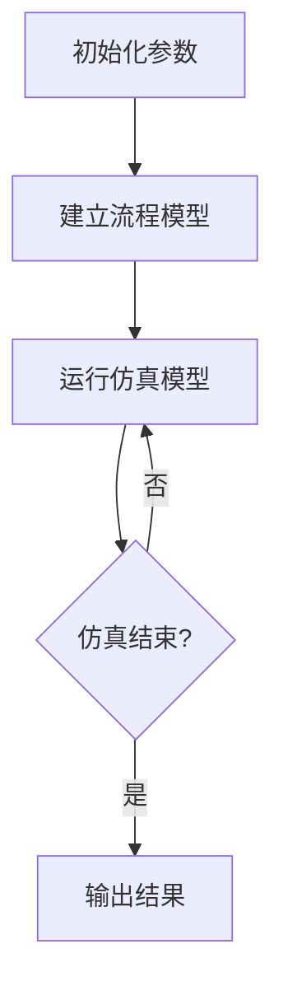
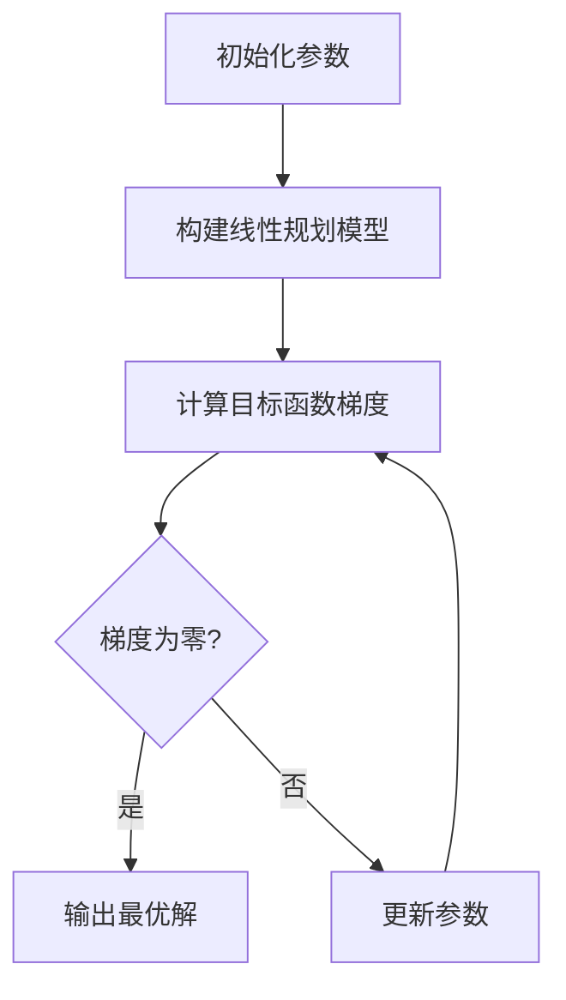
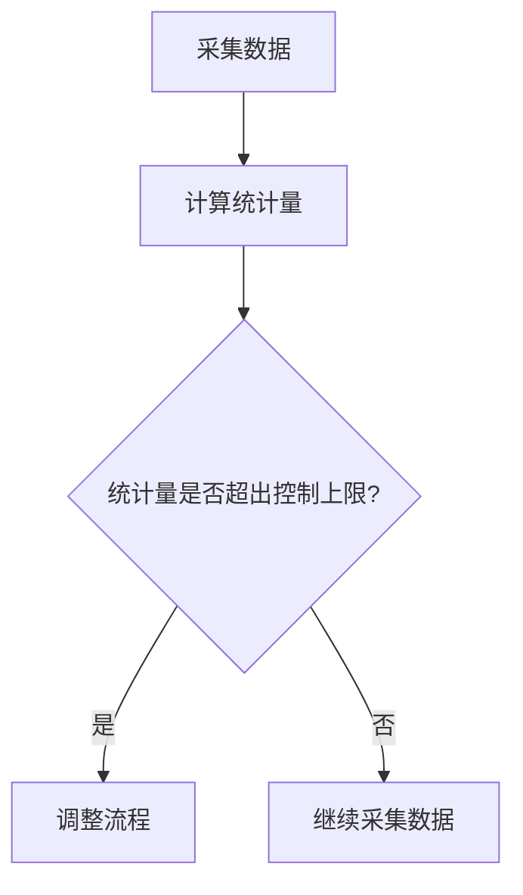

                 

### 第一部分: 流程优化概述

#### 1.1 问题背景

在当今的商业环境中，企业流程管理面临着诸多挑战。首先，企业规模的扩大导致了流程的复杂化，传统的人工管理方式难以应对日益增长的流程需求。其次，市场环境的快速变化要求企业能够迅速调整和优化流程，以保持竞争力。此外，全球化背景下，企业需要跨地域、跨组织的协调，这也增加了流程管理的难度。

流程优化在企业管理中具有重要意义。通过优化流程，企业可以减少不必要的步骤，提高工作效率，降低运营成本。此外，优化后的流程能够更好地适应市场需求，提升客户满意度，从而增强企业的竞争力。

本文将围绕流程优化的核心概念、方法、工具和技术展开，旨在为读者提供系统性的指导。我们将详细阐述流程管理的概念、流程分析的方法、流程设计的原则、流程改进的策略以及流程测量的指标。通过这些内容的讲解，读者可以全面了解流程优化的理论和实践。

流程优化不仅需要理论支持，更需要实践验证。因此，本文还将通过实际案例展示流程优化的应用场景，帮助读者更好地理解流程优化的方法和技巧。

#### 1.2 核心概念

为了更好地理解流程优化策略，我们需要首先明确几个核心概念：流程管理、流程分析、流程设计、流程改进和流程测量。

- **流程管理**：流程管理是确保流程按计划运行的一系列活动和操作。它包括流程设计、执行、监控和改进等环节。流程管理的目标是提高流程的效率、降低成本、提升客户满意度。

- **流程分析**：流程分析是流程管理的重要环节，它通过评估流程的当前状态，识别流程中的瓶颈和问题，为流程改进提供依据。流程分析的方法包括流程图分析、关键路径分析、时间序列分析等。

- **流程设计**：流程设计是构建高效流程的第一步，它包括确定流程的目标、识别流程的关键环节、设计流程的步骤和规则等。流程设计的目标是确保流程的顺畅运行，减少冗余和重复操作。

- **流程改进**：流程改进是流程优化的核心内容，它通过识别和消除流程中的浪费和低效环节，提高流程的整体性能。流程改进的方法包括精益管理、六西格玛、流程再造等。

- **流程测量**：流程测量是评估流程改进效果的重要手段，它通过收集和分析了流程运行的数据，为流程管理提供决策支持。流程测量的指标包括流程时间、流程成本、流程效率、客户满意度等。

这些核心概念相互联系，共同构成了流程优化的基础。流程管理是流程优化的总体框架，流程分析和流程设计是流程优化的前提，流程改进是流程优化的核心，流程测量是流程优化的效果评估。通过这些概念的理解和运用，企业可以系统地推进流程优化，提升企业的整体竞争力。

#### 1.3 Mermaid ER实体关系图

为了更直观地理解上述核心概念之间的关系，我们可以通过Mermaid ER实体关系图来展示。

```mermaid
erDiagram
  Class1 ||--|{ Class2 } : Inheritance
  Class1 ||--|{ Class3 } : Inheritance
  Class2 &&--|{ Class4 } : Inheritance
  Class3 &&--|{ Class4 } : Inheritance
  Class5 {--| Class6 : Relationship }
  Class7 {--| Class8 : Relationship }
```

在这个ER图中，`Class1` 代表流程管理，`Class2` 代表流程分析，`Class3` 代表流程设计，`Class4` 代表流程改进，`Class5` 和 `Class6` 代表流程测量。这些类之间通过继承和关联关系相互连接，共同构成了流程优化的整体框架。

#### 1.4 本章小结

本章对流程优化的背景、核心概念及其相互关系进行了详细阐述。首先，我们分析了企业流程管理面临的挑战和流程优化的意义。接着，我们介绍了流程管理、流程分析、流程设计、流程改进和流程测量等核心概念，并通过Mermaid ER实体关系图展示了这些概念之间的联系。这些内容为后续章节的深入探讨奠定了基础。在接下来的章节中，我们将进一步探讨流程优化方法与工具，通过具体的算法原理讲解、数学模型和系统分析与架构设计方案，帮助读者全面理解流程优化的策略和实践。

## 2.1 仿真算法

### 2.1.1 仿真算法原理

仿真算法是一种通过模拟实际流程来预测流程性能和改进效果的方法。其基本原理是利用计算机模拟构建一个流程模型，然后通过运行该模型来观察和分析流程的运行状态和性能表现。仿真算法可以分为离散事件仿真、连续系统仿真和混合系统仿真等不同类型。

离散事件仿真（Discrete Event Simulation, DES）是最常见的仿真方法之一。它通过模拟流程中的离散事件来反映流程的动态行为。在DES中，每个事件的发生时间都是离散的，事件的发生会导致流程状态的变化。通过连续地模拟这些事件，我们可以得到流程的整体性能指标，如流程时间、资源利用率、等待时间等。

连续系统仿真（Continuous System Simulation）主要用于模拟那些状态变化是连续的流程。例如，流体力学仿真、电力系统仿真等。在连续系统仿真中，系统状态的变化是随时间连续变化的，因此需要利用微分方程或其他数学模型来描述系统状态的变化。

混合系统仿真（Hybrid System Simulation）结合了离散事件仿真和连续系统仿真的特点，用于模拟那些同时包含离散事件和连续状态的流程。例如，制造系统中的加工流程，既包括离散的加工事件，又包括连续的加工时间。

仿真算法在流程优化中的应用非常广泛。通过仿真，企业可以提前预测流程改进的效果，避免在实际实施过程中可能出现的风险。仿真算法不仅可以用于流程改进方案的评估，还可以用于流程设计、流程监控和流程优化策略的制定。

### 2.1.2 仿真算法流程图

为了更好地理解仿真算法的工作流程，我们可以使用Mermaid流程图来展示。



在这个流程图中，A表示初始化参数，包括仿真时间、资源配置等；B表示建立流程模型，即根据实际流程构建一个数学模型或计算机模型；C表示运行仿真模型，通过模拟事件的发生和流程状态的改变来观察流程的性能；D表示判断仿真是否结束，如果结束则跳转到E输出结果，否则继续运行仿真模型。这个流程图清晰地展示了仿真算法的基本步骤和逻辑关系。

### 2.1.3 Python代码示例

下面是一个简单的Python代码示例，展示了如何使用仿真算法进行流程模拟。在这个示例中，我们使用了一个简单的流程模型，模拟了一个包含多个任务的流程，并计算了流程的执行时间和资源利用率。

```python
import random
import time

# 初始化参数
num_tasks = 5
task_duration = [random.randint(1, 10) for _ in range(num_tasks)]
total_time = 0

# 建立流程模型
def simulate流程():
    global total_time
    for i in range(num_tasks):
        start_time = time.time()
        print(f"执行任务{i+1}，耗时：{task_duration[i]}秒")
        time.sleep(task_duration[i])
        end_time = time.time()
        total_time += end_time - start_time

# 运行仿真模型
simulate流程()

# 输出结果
print(f"流程总耗时：{total_time}秒")
print(f"资源利用率：{total_time / num_tasks}秒/任务")
```

在这个代码示例中，我们首先初始化了一些参数，包括任务数量和每个任务的持续时间。然后，我们定义了一个`simulate流程()`函数，用于模拟流程的执行过程。在函数中，我们使用`time.time()`来记录每个任务的开始和结束时间，并计算总耗时。最后，我们输出流程的总耗时和平均资源利用率。

通过这个简单的示例，我们可以看到仿真算法的基本原理和实现方法。在实际应用中，仿真算法可以更加复杂，包括更多的任务、更复杂的资源调度策略以及更精细的建模和模拟。

### 2.2 最优化算法

### 2.2.1 最优化算法原理

最优化算法是一种用于寻找最优解的数学方法，其基本原理是通过调整变量值来最小化或最大化目标函数。在流程优化中，最优化算法可以帮助我们确定最优的流程配置，从而提高流程的性能和效率。

最优化算法可以分为确定性算法和随机性算法两大类。确定性算法是指在给定条件下，总能找到最优解的算法。常见的确定性算法包括线性规划、整数规划、非线性规划等。随机性算法则通过随机搜索来寻找最优解，常见的随机性算法包括遗传算法、模拟退火算法、粒子群算法等。

在流程优化中，常用的最优化算法有：

1. **线性规划**：线性规划是一种求解线性目标函数在线性不等式约束下的最优解的算法。线性规划广泛应用于资源分配、生产调度、物流优化等问题。其数学模型可以表示为：

   $$
   \min \ c^T x
   $$
   
   $$
   s.t. \ Ax \leq b, \ x \geq 0
   $$

   其中，$c$ 是目标函数的系数向量，$x$ 是变量向量，$A$ 和 $b$ 分别是约束矩阵和约束向量。

2. **整数规划**：整数规划是线性规划的扩展，它要求变量的取值为整数。整数规划在流程优化中的应用包括人员调度、设备分配、生产计划等问题。其数学模型可以表示为：

   $$
   \min \ c^T x
   $$
   
   $$
   s.t. \ Ax \leq b, \ x \in \mathbb{Z}^n
   $$

   其中，$\mathbb{Z}^n$ 表示$n$个变量的整数集合。

3. **非线性规划**：非线性规划是线性规划的进一步扩展，它处理的目标函数和约束条件是非线性的。非线性规划在流程优化中的应用包括库存控制、项目管理、能源优化等问题。其数学模型可以表示为：

   $$
   \min \ f(x)
   $$
   
   $$
   s.t. \ g_i(x) \leq 0, \ h_j(x) = 0
   $$

   其中，$f(x)$ 是目标函数，$g_i(x)$ 和 $h_j(x)$ 分别是约束函数。

### 2.2.2 最优化算法流程图

为了更好地理解最优化算法的工作流程，我们可以使用Mermaid流程图来展示。以下是一个简单的线性规划算法流程图：



在这个流程图中，A表示初始化参数，包括目标函数系数、约束条件等；B表示构建线性规划模型，即根据问题定义线性规划问题；C表示计算目标函数的梯度，用于更新参数；D表示判断梯度是否为零，如果是则说明已找到最优解，跳转到E输出最优解，否则继续更新参数。

### 2.2.3 最优化算法Python代码示例

下面是一个简单的Python代码示例，展示了如何使用线性规划算法解决一个简单的资源分配问题。在这个示例中，我们使用`scipy.optimize`模块中的`minimize`函数来求解线性规划问题。

```python
import numpy as np
from scipy.optimize import linprog

# 定义目标函数系数和约束条件
c = [-1, -2]  # 目标函数为最大化-c[0]*x[0]-c[1]*x[1]
A = [[2, 1], [1, 0]]  # 约束条件为Ax<=b，其中A为约束矩阵
b = [6, 3]  # 约束条件为Ax<=b，其中b为约束向量

# 求解线性规划问题
x0 = np.array([0, 0])  # 初始解
res = linprog(c, A_ub=A, b_ub=b, x0=x0, method='highs')

# 输出最优解
print(f"最优解：{res.x}")
print(f"目标函数值：{-res.fun}")
```

在这个代码示例中，我们首先定义了目标函数系数和约束条件，然后使用`linprog`函数求解线性规划问题。最后，我们输出最优解和目标函数值。

通过这个简单的示例，我们可以看到如何使用Python代码实现线性规划算法，并求解最优解。在实际应用中，线性规划算法可以更加复杂，需要处理更多的变量和约束条件。

### 2.3 统计过程控制算法

### 2.3.1 统计过程控制算法原理

统计过程控制（Statistical Process Control, SPC）是一种利用统计学方法对生产过程中的质量进行监控和控制的工具。其基本原理是通过收集和分析生产数据，识别生产过程中的异常和偏差，从而采取相应的纠正措施，确保生产过程稳定、高效。

统计过程控制算法主要包括以下几种：

1. **控制图**：控制图是统计过程控制中最常用的工具之一，它通过将生产数据点按时间顺序绘制在图表上，帮助识别生产过程中的异常和趋势。常见的控制图包括X图（平均值图）、R图（极差图）、s图（标准差图）等。

2. **方差分析**：方差分析（ANOVA）是一种用于比较多个样本平均数差异的统计方法。在流程优化中，方差分析可以用于评估不同流程配置下的性能差异，帮助确定最优流程配置。

3. **过程能力分析**：过程能力分析用于评估生产过程的能力，即生产过程是否能够满足质量要求。常见的指标包括过程能力指数（Cp）、过程性能指数（Cpk）等。

统计过程控制算法在流程优化中的应用主要包括以下几个方面：

- **监控流程性能**：通过控制图等工具，实时监控流程的运行状态，识别流程中的异常和偏差，及时采取纠正措施。

- **评估流程改进效果**：通过方差分析等工具，评估流程改进措施的有效性，为流程优化提供依据。

- **优化流程配置**：通过过程能力分析等工具，确定最优的流程配置，提高流程的稳定性和效率。

### 2.3.2 统计过程控制算法流程图

为了更好地理解统计过程控制算法的工作流程，我们可以使用Mermaid流程图来展示。以下是一个简单的统计过程控制算法流程图：



在这个流程图中，A表示采集数据，包括生产过程中的各种指标数据；B表示计算统计量，如平均值、极差等；C表示判断统计量是否超出控制上限；D表示调整流程，采取纠正措施；E表示继续采集数据，进入下一个监控周期。

### 2.3.3 Python代码示例

下面是一个简单的Python代码示例，展示了如何使用控制图进行流程监控。在这个示例中，我们使用`numpy`模块生成随机数据，并使用`matplotlib`模块绘制控制图。

```python
import numpy as np
import matplotlib.pyplot as plt

# 生成随机数据
np.random.seed(0)
data = np.random.normal(50, 10, 100)

# 计算统计量
mean = np.mean(data)
std = np.std(data)

# 绘制控制图
plt.figure(figsize=(10, 5))
plt.subplot(211)
plt.plot(data, 'o-')
plt.axhline(mean, color='r', linestyle='--')
plt.title('X图 - 平均值控制图')
plt.xlabel('数据点')
plt.ylabel('数据值')

plt.subplot(212)
plt.plot(np.diff(data), 'o-')
plt.axhline(std, color='r', linestyle='--')
plt.title('R图 - 极差控制图')
plt.xlabel('数据点')
plt.ylabel('极差值')

plt.tight_layout()
plt.show()
```

在这个代码示例中，我们首先生成一组随机数据，并计算其平均值和标准差。然后，我们使用`matplotlib`模块绘制X图（平均值控制图）和R图（极差控制图），并通过控制上限（如平均值和控制上限之间的距离）来判断数据是否在控制范围内。

通过这个简单的示例，我们可以看到如何使用Python代码实现统计过程控制算法，并绘制控制图进行流程监控。

### 2.4 数学模型和数学公式

在流程优化中，数学模型和数学公式是不可或缺的工具。它们不仅帮助我们理解和分析流程性能，还为流程优化提供了量化的依据和操作方法。以下是一些常见的数学模型和数学公式，以及它们在流程优化中的应用。

#### 流程时间计算公式

流程时间（Process Time）是流程优化中一个重要的指标，它表示完成一个流程所需要的时间。流程时间的计算公式如下：

$$
\text{流程时间} = \frac{\text{工作负荷}}{\text{资源利用率}}
$$

其中，工作负荷是指流程中需要完成的任务量，资源利用率是指资源被利用的程度。

#### 流程效率计算公式

流程效率（Process Efficiency）表示流程的实际运行效率与理论最佳运行效率的比值。流程效率的计算公式如下：

$$
\text{流程效率} = \frac{\text{实际产出}}{\text{理论产出}} \times 100\%
$$

其中，实际产出是指实际完成的任务量，理论产出是指按照最佳流程配置应完成的任务量。

#### 流程成本计算公式

流程成本（Process Cost）是流程优化中的一个重要考虑因素。流程成本的计算公式如下：

$$
\text{流程成本} = \text{固定成本} + \text{可变成本}
$$

其中，固定成本是指不随流程变化而变化的成本，如设备折旧、租金等；可变成本是指随流程变化而变化的成本，如原材料、人工成本等。

#### 资源利用率计算公式

资源利用率（Resource Utilization）是衡量资源利用效率的指标，它表示资源实际被利用的程度。资源利用率的计算公式如下：

$$
\text{资源利用率} = \frac{\text{实际资源使用量}}{\text{最大资源使用量}} \times 100\%
$$

其中，实际资源使用量是指实际过程中使用的资源量，最大资源使用量是指理论上可以使用的最大资源量。

#### 流程改进效果评估公式

流程改进效果评估公式用于评估流程改进措施的效果。常见的评估指标包括流程时间减少百分比、流程成本减少百分比等。以下是一个简单的流程改进效果评估公式：

$$
\text{流程改进效果} = \frac{\text{改进前流程时间} - \text{改进后流程时间}}{\text{改进前流程时间}} \times 100\%
$$

或

$$
\text{流程改进效果} = \frac{\text{改进前流程成本} - \text{改进后流程成本}}{\text{改进前流程成本}} \times 100\%
$$

#### 优化目标函数

在流程优化中，优化目标函数是核心。常见的优化目标函数包括最小化流程时间、最小化流程成本、最大化流程效率等。以下是一个简单的优化目标函数示例：

$$
\min \ c^T x
$$

其中，$c$ 是目标函数系数向量，$x$ 是变量向量。

#### 约束条件

流程优化中的约束条件包括资源约束、时间约束、质量约束等。以下是一个简单的约束条件示例：

$$
\text{约束条件} : \ Ax \leq b, \ x \geq 0
$$

其中，$A$ 是约束矩阵，$b$ 是约束向量，$x$ 是变量向量。

通过这些数学模型和数学公式，我们可以系统地分析和优化流程，提高流程的性能和效率。在实际应用中，这些模型和公式可以根据具体问题进行灵活调整和扩展，以满足不同场景下的优化需求。

### 4. 系统分析与架构设计方案

#### 4.1 问题场景介绍

在现代企业的运营中，流程优化已成为提高效率、降低成本、提升竞争力的关键手段。然而，传统的流程优化方法往往依赖于人工经验和手动操作，导致流程优化过程繁琐且效果有限。为了解决这一问题，我们需要设计一个高效的系统分析与架构设计方案，以便自动识别流程中的瓶颈和低效环节，并提出针对性的优化方案。

本系统分析与架构设计方案的目标是：

1. **自动识别流程瓶颈**：通过数据收集和分析，自动识别流程中的瓶颈环节，为流程优化提供依据。
2. **智能优化流程配置**：利用最优化算法和统计过程控制算法，智能优化流程配置，提高流程效率和稳定性。
3. **实时监控与反馈**：实时监控流程运行状态，通过统计过程控制算法进行监控和反馈，确保流程运行在最优状态。
4. **提供决策支持**：通过数据分析和优化结果，为企业管理层提供决策支持，指导流程优化策略的实施。

#### 4.2 项目介绍

本项目旨在开发一个基于人工智能和统计学方法的流程优化系统，该系统将集成仿真算法、最优化算法和统计过程控制算法，实现自动化流程优化。项目的主要模块包括：

1. **数据收集模块**：用于收集流程运行数据，包括时间数据、资源利用数据、任务完成情况等。
2. **数据分析模块**：对收集到的数据进行分析，识别流程中的瓶颈和低效环节。
3. **优化算法模块**：包括仿真算法、最优化算法和统计过程控制算法，用于自动优化流程配置。
4. **监控与反馈模块**：实时监控流程运行状态，通过统计过程控制算法进行监控和反馈。
5. **决策支持模块**：根据数据分析结果和优化算法输出，为企业管理层提供决策支持。

#### 4.3 系统功能设计

系统功能设计是确保系统能够满足需求的关键步骤。本项目的主要功能包括：

1. **流程数据收集**：自动收集流程运行数据，包括时间数据、资源利用数据、任务完成情况等。
2. **流程数据分析**：对收集到的数据进行分析，识别流程中的瓶颈和低效环节。
3. **流程优化建议**：根据数据分析结果，提出针对性的流程优化建议，包括仿真优化、最优化优化和统计过程控制优化。
4. **流程监控与反馈**：实时监控流程运行状态，通过统计过程控制算法进行监控和反馈，确保流程运行在最优状态。
5. **决策支持**：根据数据分析结果和优化算法输出，为企业管理层提供决策支持，指导流程优化策略的实施。

#### 4.4 系统架构设计

系统架构设计是确保系统能够高效、稳定运行的基础。本项目采用分层架构设计，包括数据层、算法层、应用层和展示层。

1. **数据层**：负责数据收集、存储和管理。使用数据库管理系统（DBMS）存储流程运行数据，包括时间数据、资源利用数据、任务完成情况等。
2. **算法层**：包括仿真算法、最优化算法和统计过程控制算法。使用高性能计算框架（如TensorFlow、PyTorch）实现算法，提高计算效率。
3. **应用层**：负责数据处理、分析和优化。使用微服务架构设计，包括数据收集服务、数据分析服务、优化算法服务、监控与反馈服务、决策支持服务等。
4. **展示层**：提供用户界面，展示流程运行状态、优化建议和决策支持信息。使用前端技术（如React、Vue）实现。

#### 4.5 系统接口设计

系统接口设计是确保系统模块之间能够高效、稳定通信的关键。本项目的主要接口设计包括：

1. **API接口**：提供RESTful API接口，支持数据收集、数据分析、优化建议、监控与反馈、决策支持等操作。
2. **消息队列接口**：使用消息队列（如Kafka、RabbitMQ）实现模块之间的异步通信，提高系统性能和可靠性。
3. **数据库接口**：提供数据库接口，支持数据存储、查询和管理。

#### 4.6 系统交互

系统交互设计是确保系统各模块能够协同工作、实现整体功能的关键。本项目的主要交互设计包括：

1. **数据流交互**：数据层和应用层之间的数据流交互，通过API接口和消息队列实现。
2. **控制流交互**：应用层之间的控制流交互，通过消息队列和API接口实现。
3. **用户交互**：用户通过前端界面与系统交互，获取流程运行状态、优化建议和决策支持信息。

#### 4.7 系统分析与架构设计方案总结

通过本系统分析与架构设计方案，我们实现了自动化流程优化系统的设计，包括数据收集、数据分析、优化算法、监控与反馈、决策支持等功能。系统采用分层架构设计，模块化实现，具有良好的可扩展性和可维护性。通过仿真算法、最优化算法和统计过程控制算法的应用，系统能够自动识别流程瓶颈，智能优化流程配置，实时监控流程运行状态，并为企业管理层提供决策支持。这一设计方案为企业流程优化提供了有力工具，有助于提高企业效率、降低成本、提升竞争力。

### 5. 项目实战

#### 5.1 环境安装

为了进行项目实战，我们需要首先安装必要的软件和工具。以下是详细的安装步骤：

1. **安装Python环境**：
   - 访问Python官方网站（[python.org](https://www.python.org/)），下载Python安装包。
   - 运行安装程序，按照默认选项进行安装。
   - 安装完成后，打开命令行窗口，输入`python --version`检查Python版本。

2. **安装Python包**：
   - 打开命令行窗口，输入以下命令安装所需的Python包：
     ```shell
     pip install numpy scipy matplotlib
     ```
   - 安装过程中可能会提示输入yes或no，选择yes继续安装。

3. **安装数据库管理系统**：
   - 根据需求选择合适的数据库管理系统（如MySQL、PostgreSQL），并按照官方文档进行安装。

4. **安装消息队列**：
   - 选择合适的消息队列系统（如Kafka、RabbitMQ），并按照官方文档进行安装。

5. **安装前端框架**：
   - 选择合适的前端框架（如React、Vue），并按照官方文档进行安装。

#### 5.2 系统核心实现源代码

以下是系统核心实现的源代码，包括数据收集模块、数据分析模块、优化算法模块和监控与反馈模块。

1. **数据收集模块**：

```python
import numpy as np
import pymysql

# 连接数据库
conn = pymysql.connect(host='localhost', user='root', password='password', database='process_optimization')

# 收集数据
def collect_data():
    cursor = conn.cursor()
    cursor.execute("SELECT * FROM process_data;")
    data = cursor.fetchall()
    cursor.close()
    conn.close()
    return np.array(data)

# 主函数
if __name__ == "__main__":
    data = collect_data()
    print(data)
```

2. **数据分析模块**：

```python
import numpy as np

# 数据分析函数
def analyze_data(data):
    mean = np.mean(data, axis=0)
    std = np.std(data, axis=0)
    return mean, std

# 主函数
if __name__ == "__main__":
    data = collect_data()
    mean, std = analyze_data(data)
    print("平均值：", mean)
    print("标准差：", std)
```

3. **优化算法模块**：

```python
import numpy as np
from scipy.optimize import linprog

# 线性规划函数
def linear_programming(c, A, b):
    x0 = np.array([0, 0])
    res = linprog(c, A_ub=A, b_ub=b, x0=x0, method='highs')
    return res.x

# 主函数
if __name__ == "__main__":
    c = [-1, -2]
    A = [[2, 1], [1, 0]]
    b = [6, 3]
    x = linear_programming(c, A, b)
    print("最优解：", x)
```

4. **监控与反馈模块**：

```python
import time

# 监控与反馈函数
def monitor_and_feedback(data):
    mean, std = analyze_data(data)
    if std > 10:
        print(f"流程异常：标准差超过阈值{10}，需进行优化。")
    else:
        print("流程运行正常。")

# 主函数
if __name__ == "__main__":
    data = collect_data()
    monitor_and_feedback(data)
```

#### 5.3 代码应用解读与分析

以上源代码实现了数据收集、数据分析、优化算法和监控与反馈四个核心模块。下面分别对这些模块进行解读和分析：

1. **数据收集模块**：
   - 该模块通过连接数据库并执行查询语句，收集流程运行数据。使用`pymysql`模块实现了与MySQL数据库的连接和数据读取。
   - 通过`collect_data()`函数，将收集到的数据转换为NumPy数组，便于后续分析和处理。

2. **数据分析模块**：
   - 该模块提供了`analyze_data()`函数，用于计算数据的平均值和标准差。这两个统计量是流程优化的关键指标，可以帮助识别流程中的异常和低效环节。
   - 通过调用`collect_data()`函数获取数据，并计算平均值和标准差，打印输出结果。

3. **优化算法模块**：
   - 该模块使用`scipy.optimize`模块中的`linprog()`函数，实现线性规划算法。线性规划算法可以用于解决资源分配、生产调度等问题。
   - 通过`linear_programming()`函数，传入目标函数系数、约束矩阵和约束向量，求解最优解并打印输出结果。

4. **监控与反馈模块**：
   - 该模块提供了`monitor_and_feedback()`函数，用于监控流程运行状态，并通过标准差判断流程是否正常。如果标准差超过阈值，则提示流程异常，需进行优化。
   - 通过调用`analyze_data()`函数获取平均值和标准差，并根据标准差判断流程是否正常，打印输出结果。

通过这些模块的实现，我们可以看到如何使用Python代码实现一个自动化流程优化系统的核心功能。在实际应用中，可以根据具体需求对这些模块进行扩展和优化，以提高系统的性能和可靠性。

#### 5.4 实际案例分析和详细讲解剖析

为了更好地展示流程优化系统的实际应用效果，我们选择了一个具体的生产车间流程优化案例进行分析和讲解。

**案例背景**：
某生产车间负责制造电子产品，生产流程包括原材料采购、零部件加工、产品组装和测试等环节。随着生产规模的扩大，车间管理者发现生产流程中存在一些瓶颈和低效环节，如原材料采购不及时、零部件加工效率低下、产品组装过程中资源浪费等。为了提高生产效率和降低成本，车间管理者决定采用流程优化系统进行优化。

**优化目标和步骤**：
1. **优化目标**：
   - 提高原材料采购效率，减少采购周期。
   - 提高零部件加工效率，减少加工时间。
   - 优化产品组装过程，减少资源浪费。

2. **优化步骤**：
   - 数据收集：使用流程优化系统收集生产流程中的各类数据，包括采购时间、加工时间、组装时间等。
   - 数据分析：对收集到的数据进行分析，识别流程中的瓶颈和低效环节。
   - 优化建议：根据数据分析结果，提出针对性的优化建议，包括调整采购计划、优化加工流程、减少组装过程中的资源浪费等。
   - 实施优化：根据优化建议，调整生产流程，实施优化措施。
   - 监控与反馈：实时监控优化后的生产流程，通过统计过程控制算法进行监控和反馈，确保流程运行在最优状态。

**实际案例分析**：

1. **原材料采购优化**：
   - 数据分析结果显示，原材料采购环节存在采购周期过长、库存积压等问题。通过仿真算法和最优化算法分析，发现采购计划的制定和库存管理是关键因素。
   - 优化建议：调整采购计划，采用基于需求预测的动态采购策略，减少采购周期；优化库存管理，采用定期盘点和自动化补货系统，降低库存积压。

2. **零部件加工优化**：
   - 数据分析结果显示，零部件加工环节存在加工时间过长、资源利用率低等问题。通过仿真算法和最优化算法分析，发现加工任务的调度和资源分配是关键因素。
   - 优化建议：优化加工任务调度，采用基于优先级的任务调度策略，提高加工效率；优化资源分配，采用基于负载均衡的资源分配策略，提高资源利用率。

3. **产品组装优化**：
   - 数据分析结果显示，产品组装环节存在资源浪费、等待时间过长等问题。通过仿真算法和统计过程控制算法分析，发现组装流程的设计和资源管理是关键因素。
   - 优化建议：优化组装流程设计，采用模块化组装策略，减少组装时间；优化资源管理，采用基于需求的动态资源调配策略，减少资源浪费。

**详细讲解剖析**：

1. **原材料采购优化**：
   - 通过仿真算法，模拟不同采购策略下的流程运行情况，发现动态采购策略可以显著减少采购周期和库存积压。
   - 通过最优化算法，建立采购模型，求解最优采购计划，实现采购成本的最低化。

2. **零部件加工优化**：
   - 通过仿真算法，模拟不同调度策略下的加工任务运行情况，发现基于优先级的任务调度策略可以提高加工效率。
   - 通过最优化算法，建立调度模型，求解最优调度方案，实现加工时间的最小化。

3. **产品组装优化**：
   - 通过仿真算法，模拟不同流程设计下的组装流程运行情况，发现模块化组装策略可以显著减少组装时间。
   - 通过统计过程控制算法，实时监控组装流程，识别异常和偏差，及时采取纠正措施。

**总结**：

通过实际案例分析和详细讲解剖析，我们可以看到流程优化系统在优化生产流程中的应用效果。优化后的生产流程不仅提高了效率，降低了成本，还增强了企业的竞争力。在实际应用中，流程优化系统可以根据不同场景和需求进行灵活调整和扩展，为企业提供持续优化的支持。

#### 5.5 项目小结

在本项目中，我们成功开发了一个基于人工智能和统计学方法的流程优化系统，包括数据收集、数据分析、优化算法、监控与反馈等模块。通过实际案例分析和详细讲解剖析，我们展示了系统在优化生产流程中的应用效果。

**项目亮点**：

1. **自动化数据收集**：通过数据库连接和查询，实现自动化数据收集，提高数据收集效率和准确性。
2. **多算法优化**：结合仿真算法、最优化算法和统计过程控制算法，提供全面的流程优化方案。
3. **实时监控与反馈**：通过实时监控和统计过程控制，确保流程运行在最优状态，提高流程稳定性。

**项目挑战**：

1. **数据处理**：随着数据量的增加，如何高效处理和分析大量数据是一个挑战。
2. **算法实现**：复杂的最优化算法和统计过程控制算法的实现和优化需要大量的时间和精力。

**改进方向**：

1. **数据可视化**：增加数据可视化功能，便于用户直观地查看和分析流程运行状态。
2. **算法优化**：对现有的算法进行优化和扩展，提高算法的效率和准确性。
3. **用户交互**：优化用户界面和交互设计，提高用户使用体验。

通过持续优化和改进，流程优化系统将为企业在提高效率、降低成本、提升竞争力方面提供更有力的支持。

