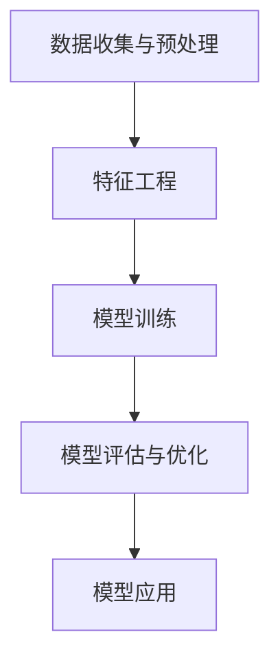
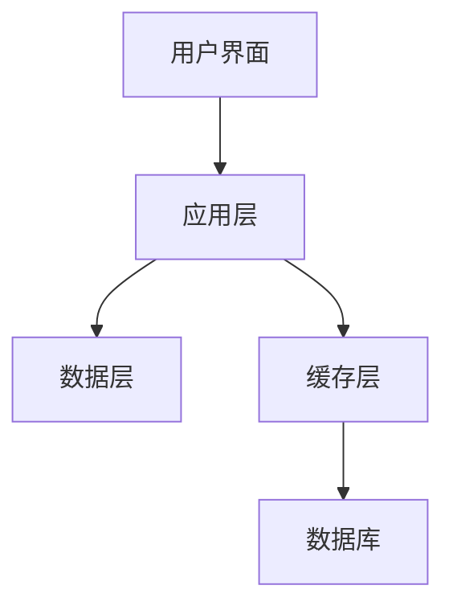
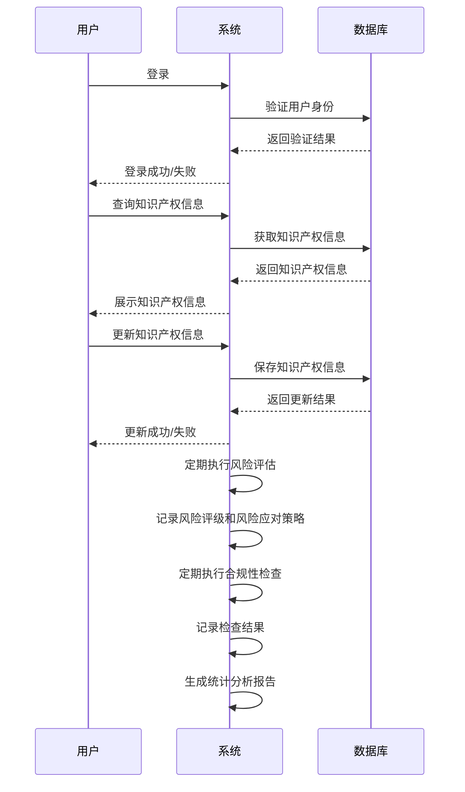

                 


### 第一部分：背景介绍

#### 1.1 问题背景

在当今快速发展的信息技术时代，知识产权（Intellectual Property, IP）已经成为企业竞争力的重要组成部分。随着技术的不断进步，创新的速度也在不断加快，这给技术管理带来了巨大的挑战。如何有效地管理和利用知识产权，已经成为技术管理者必须面对的问题。

知识产权战略规划是一项复杂的任务，它不仅需要技术管理者具备专业的知识产权法律知识，还需要其对企业的发展战略、市场环境、竞争态势有深入的理解。传统上，技术管理者更多关注的是技术的创新和产品的开发，而对知识产权的重视程度往往不够。这使得许多企业在知识产权方面面临风险，甚至可能因为知识产权纠纷而影响企业的正常运营。

#### 1.2 问题描述

知识产权战略规划的核心问题包括以下几个方面：

1. **知识产权的识别与保护**：如何准确识别企业所拥有的知识产权，并采取有效措施进行保护，防止被侵权或盗用。

2. **知识产权的运用**：如何合理运用知识产权，实现知识产权的最大化价值，包括专利许可、技术转移、知识产权交易等。

3. **知识产权的风险管理**：如何识别和评估知识产权风险，并采取相应的措施进行管理，确保企业的知识产权安全。

4. **知识产权与商业秘密的保护**：如何平衡知识产权与商业秘密的保护，确保企业在市场竞争中既能保护自身的知识产权，又能保护商业秘密。

#### 1.3 问题解决

解决知识产权战略规划问题，需要从以下几个方面入手：

1. **建立知识产权管理体系**：建立完善的知识产权管理制度，明确知识产权管理的责任和流程，确保知识产权的识别、保护、运用和风险管理得到有效执行。

2. **加强知识产权法律培训**：对技术管理者进行知识产权法律培训，提高其对知识产权的认识和保护意识。

3. **开展知识产权审计**：定期开展知识产权审计，检查知识产权管理的有效性，发现潜在问题并及时整改。

4. **建立知识产权风险预警机制**：通过大数据分析和人工智能技术，建立知识产权风险预警机制，提前识别和评估知识产权风险。

5. **加强知识产权保护措施**：采取多种保护措施，如申请专利、版权登记、商业秘密保护等，确保知识产权得到有效保护。

#### 1.4 边界与外延

知识产权战略规划不仅涉及企业内部的管理，还涉及外部环境的影响。例如，企业需要关注行业内的知识产权动态，了解竞争对手的知识产权策略，以便及时调整自身的知识产权战略。同时，企业还需要与政府、行业协会、律师事务所等外部机构建立良好的合作关系，共同推动知识产权的保护和运用。

#### 1.5 概念结构与核心要素组成

知识产权战略规划的核心概念包括知识产权、知识产权管理体系、知识产权风险、知识产权保护措施等。这些概念相互关联，构成了知识产权战略规划的理论框架。核心要素包括：

- 知识产权识别与保护
- 知识产权运用与交易
- 知识产权风险管理与预警
- 知识产权法律培训与咨询
- 知识产权审计与合规

通过上述分析，我们可以看出，知识产权战略规划是一项系统性工程，需要从多个方面进行考虑和实施。只有建立完善的知识产权战略规划体系，企业才能在激烈的市场竞争中立于不败之地。

---

### 第二部分：核心概念与联系

#### 2.1 核心概念原理

在本节中，我们将介绍知识产权战略规划中的核心概念，并详细阐述其原理。

1. **知识产权（Intellectual Property, IP）**

   知识产权是指通过智力劳动创造的成果，包括专利、商标、著作权、商业秘密等。知识产权是一种无形的财产权利，具有独占性、地域性和时间性。

   - **专利**：是指对发明、实用新型、外观设计等技术创新成果给予法律保护的一种权利。
   - **商标**：是指用于区分商品或服务的标志，具有识别和区别作用。
   - **著作权**：是指对文学、艺术、科学作品给予法律保护的一种权利。
   - **商业秘密**：是指不为公众所知悉、具有商业价值、经权利人采取保密措施的技术信息和经营信息。

2. **知识产权管理体系**

   知识产权管理体系是指企业为有效管理知识产权而建立的一套制度、流程和工具。它包括以下几个方面：

   - **知识产权识别与评估**：通过审查、分析和评估，确定企业拥有的知识产权及其价值。
   - **知识产权保护**：采取申请专利、商标注册、版权登记等手段，对知识产权进行保护。
   - **知识产权运用**：通过知识产权许可、转让、投资等方式，实现知识产权的价值最大化。
   - **知识产权风险管理**：识别和评估知识产权风险，制定风险应对策略。
   - **知识产权信息管理**：建立知识产权信息库，收集、整理、分析和利用知识产权信息。

3. **知识产权风险**

   知识产权风险是指企业在知识产权管理过程中可能面临的法律、商业、技术等方面的风险。主要包括：

   - **侵权风险**：由于侵犯他人的知识产权而可能引发的法律纠纷。
   - **泄露风险**：由于信息泄露或保密措施不足，导致商业秘密泄露的风险。
   - **竞争风险**：由于竞争对手的知识产权策略，影响企业市场竞争力的风险。
   - **政策风险**：由于政策变动，导致知识产权法律保护范围、力度发生变化的风险。

4. **知识产权保护措施**

   知识产权保护措施是指企业为保护自身知识产权而采取的各种措施。主要包括：

   - **法律手段**：通过申请专利、商标注册、著作权登记等法律手段，对知识产权进行保护。
   - **行政手段**：通过向政府部门举报、投诉，对侵犯知识产权的行为进行查处。
   - **技术手段**：通过加密、防火墙等技术手段，保护商业秘密和技术信息。
   - **合作手段**：与知识产权服务机构、律师事务所等建立合作关系，共同保护知识产权。

#### 2.2 概念属性特征对比表格

以下是对核心概念属性特征进行对比的表格：

| 概念           | 属性特征                               |
|--------------|------------------------------------|
| 知识产权       | 无形财产权利，独占性、地域性和时间性         |
| 知识产权管理体系 | 制度、流程和工具，知识产权识别、保护、运用、风险管理 |
| 知识产权风险     | 法律、商业、技术等方面的风险           |
| 知识产权保护措施 | 法律、行政、技术、合作等手段             |

#### 2.3 ER实体关系图架构

为了更好地理解核心概念之间的联系，我们可以通过ER（Entity-Relationship）实体关系图进行展示。

```mermaid
erDiagram
    IP_Management ||--|{ Intellectual Property }||> IP_Risk
    IP_Management ||--|{ Intellectual Property Management }||> IP_Protection
    Intellectual Property ||--|{ Patent }||> IP_Law
    Intellectual Property ||--|{ Trademark }||> IP_Law
    Intellectual Property ||--|{ Copyright }||> IP_Law
    Intellectual Property ||--|{ Trade Secret }||> IP_Law
    IP_Risk ||--|{ Infringement Risk }||> IP_Law
    IP_Risk ||--|{ Leakage Risk }||> IP_Technical
    IP_Risk ||--|{ Competition Risk }||> IP_Business
    IP_Risk ||--|{ Policy Risk }||> IP_Law
    IP_Protection ||--|{ Legal Protection }||> IP_Law
    IP_Protection ||--|{ Administrative Protection }||> IP_Admin
    IP_Protection ||--|{ Technical Protection }||> IP_Technical
    IP_Protection ||--|{ Cooperative Protection }||> IP_Cooperative
```

通过上述ER实体关系图，我们可以清晰地看到知识产权、知识产权管理体系、知识产权风险和知识产权保护措施之间的相互关系，以及各个实体之间的关系。

---

### 第三部分：算法原理讲解

#### 3.1 算法原理

在知识产权战略规划中，算法的应用可以大大提高知识产权管理的效率和准确性。本节将介绍一种用于知识产权识别和保护的算法原理。

该算法的核心原理是通过机器学习技术，对大量的知识产权信息进行训练，从而构建一个能够自动识别和保护知识产权的智能系统。具体步骤如下：

1. **数据收集与预处理**：收集与企业相关的知识产权数据，包括专利、商标、著作权等。对数据进行清洗、去重、分类等预处理操作。

2. **特征工程**：提取数据中的关键特征，如专利的摘要、商标的名称、著作权的标题等。通过特征工程，将原始数据转换为适合机器学习模型的输入。

3. **模型训练**：使用训练集数据，通过机器学习算法（如朴素贝叶斯、支持向量机、深度学习等），训练出一个能够识别和保护知识产权的模型。

4. **模型评估与优化**：对训练好的模型进行评估，包括准确率、召回率、F1值等指标。根据评估结果，对模型进行优化和调整，以提高其性能。

5. **模型应用**：将训练好的模型部署到实际应用中，对新的知识产权信息进行识别和保护。

#### 3.2 数学模型与公式

在知识产权识别和保护算法中，常用的数学模型和公式包括：

1. **朴素贝叶斯分类器**

   假设有一个包含n个特征的知识产权数据集，其中第i个特征的概率分布为：

   $$P(x_i | y) = \frac{P(y)P(x_i | y)}{P(x_i)}$$

   其中，$P(x_i | y)$ 表示第i个特征在给定类别y下的概率，$P(y)$ 表示类别y的概率，$P(x_i)$ 表示第i个特征的概率。

2. **支持向量机（SVM）**

   支持向量机是一种二分类模型，其目标是找到一个最优的超平面，将不同类别的知识产权数据点分开。其数学模型为：

   $$\max_{\mathbf{w},b}\ \frac{1}{2}\|\mathbf{w}\|^2 \quad \text{subject to} \ \mathbf{w} \cdot \mathbf{x}_i - b \geq 1, \ i=1,2,...,n$$

   其中，$\mathbf{w}$ 表示权重向量，$b$ 表示偏置，$\mathbf{x}_i$ 表示第i个知识产权数据点。

3. **深度学习模型**

   深度学习模型，如卷积神经网络（CNN）和循环神经网络（RNN），可以用于处理复杂的知识产权数据。其数学模型为：

   $$y = \text{softmax}(\mathbf{W}^T\mathbf{h})$$

   其中，$y$ 表示预测结果，$\mathbf{W}$ 表示权重矩阵，$\mathbf{h}$ 表示隐藏层状态。

#### 3.3 算法流程图

以下是知识产权识别和保护算法的流程图：



#### 3.4 举例说明

假设我们有一个包含专利、商标、著作权等知识产权信息的数据库，其中包含以下特征：

- 专利：摘要、技术领域、申请日期等。
- 商标：名称、类别、申请日期等。
- 著作权：标题、作者、发布日期等。

我们可以使用朴素贝叶斯分类器来识别这些知识产权信息。具体步骤如下：

1. **数据收集与预处理**：收集数据库中的知识产权信息，并进行预处理，如去除停用词、标准化文本等。

2. **特征工程**：提取每个知识产权信息的特征，如专利的摘要、商标的名称、著作权的标题等。

3. **模型训练**：使用训练集数据，训练一个朴素贝叶斯分类器。

4. **模型评估**：使用测试集数据，评估分类器的性能，如准确率、召回率、F1值等。

5. **模型应用**：使用训练好的分类器，对新提交的知识产权信息进行识别和保护。

例如，假设我们有一个新的专利信息，其摘要为：“一种新型手机壳的设计”。我们可以使用训练好的朴素贝叶斯分类器来识别这个专利信息，并根据其类别采取相应的保护措施。

通过上述算法原理讲解，我们可以看到，算法在知识产权战略规划中的应用具有重要的意义。它不仅提高了知识产权识别和保护的效率，还为企业提供了智能化的决策支持。

---

### 第四部分：系统分析与架构设计

#### 4.1 问题场景介绍

在现代企业的技术管理中，知识产权（Intellectual Property, IP）的管理与保护是一个至关重要的环节。随着企业规模的扩大和业务复杂性的增加，如何有效地进行知识产权的管理与保护，成为了技术管理者面临的一个重要挑战。本节将针对这一场景，进行系统分析与架构设计。

假设我们有一个大型科技公司，其业务涵盖了多个技术领域，包括软件、硬件、生物技术等。公司拥有大量的知识产权，包括专利、商标、著作权、商业秘密等。随着公司业务的不断扩张，知识产权的数量也在不断增加，这使得传统的手工管理方式变得力不从心。为了提升知识产权管理的效率，保护公司的知识产权，公司决定开发一个知识产权管理系统（Intellectual Property Management System, IPMS）。

#### 4.2 系统功能设计

知识产权管理系统需要具备以下核心功能：

1. **知识产权信息管理**：系统应能够对知识产权的基本信息进行管理，包括专利、商标、著作权、商业秘密等。系统应能够支持对知识产权信息的查询、更新、删除等操作。

2. **知识产权风险评估**：系统应能够对知识产权进行风险评估，识别潜在的风险，并提供相应的风险应对策略。

3. **知识产权保护措施管理**：系统应能够记录知识产权的保护措施，如专利申请、商标注册、版权登记等，并提供保护措施的实施进度跟踪。

4. **知识产权合规性检查**：系统应能够定期对知识产权进行合规性检查，确保知识产权符合相关法律法规的要求。

5. **知识产权统计分析**：系统应能够对知识产权进行统计分析，提供知识产权的分布、价值、保护状况等数据，为企业决策提供数据支持。

6. **知识产权风险预警**：系统应能够通过大数据分析和人工智能技术，提前识别知识产权风险，并发出预警。

#### 4.3 系统架构设计

为了实现知识产权管理系统的功能，我们需要设计一个合理的系统架构。以下是一个典型的三层架构设计：

1. **数据层**：数据层是系统的基石，负责数据的存储与管理。系统应使用关系型数据库（如MySQL、Oracle等）来存储知识产权的基本信息、风险评估结果、保护措施等数据。同时，为了提高系统的性能，可以使用缓存技术（如Redis）来缓存常用的数据。

2. **应用层**：应用层负责系统的业务逻辑处理，包括知识产权信息管理、风险评估、保护措施管理、合规性检查、统计分析等。应用层应采用微服务架构，将不同功能模块独立部署，以提高系统的灵活性和可扩展性。常用的技术栈包括Spring Boot、Dubbo等。

3. **展示层**：展示层负责用户界面的展示，包括知识产权信息的查询、更新、删除等操作界面，以及风险预警、统计分析等数据的可视化展示。展示层可以使用Vue.js、React等前端框架来构建。

以下是知识产权管理系统的架构图：



#### 4.4 系统接口设计

系统接口设计是确保系统各层之间能够有效通信的重要环节。以下是知识产权管理系统的主要接口设计：

1. **知识产权信息接口**：用于管理知识产权的基本信息，包括查询、添加、更新、删除等操作。

2. **风险评估接口**：用于对知识产权进行风险评估，包括风险识别、风险评级、风险应对策略等操作。

3. **保护措施接口**：用于管理知识产权的保护措施，包括记录保护措施、更新保护措施状态等操作。

4. **合规性检查接口**：用于定期对知识产权进行合规性检查，包括合规性检查计划、合规性检查结果等操作。

5. **统计分析接口**：用于对知识产权进行统计分析，包括知识产权分布、价值、保护状况等数据的查询和分析。

以下是知识产权管理系统接口的ER图：

```mermaid
erDiagram
    IP_Info ||--|{ Risk_Assessment }||> Risk_Result
    IP_Info ||--|{ Protection_Measure }||> Measure_Status
    IP_Info ||--|{ Compliance_Check }||> Check_Result
    Risk_Assessment ||--|{ Risk_Rating }||> Rating_Level
    Risk_Assessment ||--|{ Risk_Response }||> Response_Plan
```

#### 4.5 系统交互

为了确保知识产权管理系统的稳定性和高效性，我们需要设计合理的系统交互机制。以下是系统的主要交互流程：

1. **用户登录**：用户通过用户界面登录系统，系统验证用户身份后，生成会话令牌。

2. **查询知识产权信息**：用户在用户界面输入查询条件，系统通过知识产权信息接口获取符合条件的数据，并返回给用户。

3. **更新知识产权信息**：用户在用户界面编辑知识产权信息，系统通过知识产权信息接口保存更新后的数据。

4. **执行风险评估**：系统定期执行风险评估任务，通过风险评估接口识别知识产权的风险，并记录风险评级和风险应对策略。

5. **实施保护措施**：根据风险评估的结果，系统通过保护措施接口实施相应的保护措施。

6. **进行合规性检查**：系统定期执行合规性检查任务，通过合规性检查接口检查知识产权的合规性，并记录检查结果。

7. **生成统计分析报告**：系统通过统计分析接口，对知识产权进行统计分析，并生成统计报告。

以下是知识产权管理系统交互的序列图：



通过上述系统分析与架构设计，我们可以确保知识产权管理系统具备高效、稳定、灵活的特点，能够满足企业对知识产权管理的高要求。

---

### 第五部分：项目实战

#### 5.1 环境安装

为了实施知识产权管理系统，我们需要搭建一个合适的技术环境。以下是环境安装的详细步骤：

1. **安装操作系统**：首先，我们需要安装一个支持Java开发的操作系统，如Ubuntu 18.04。您可以从Ubuntu官网下载镜像并制作启动U盘，然后启动电脑安装操作系统。

2. **安装Java开发环境**：在安装完操作系统后，我们需要安装Java开发环境。可以通过以下命令安装OpenJDK：

   ```bash
   sudo apt update
   sudo apt install openjdk-8-jdk
   ```

3. **安装数据库**：我们选择MySQL作为数据库管理系统。可以通过以下命令安装MySQL：

   ```bash
   sudo apt update
   sudo apt install mysql-server
   ```

   安装完成后，启动MySQL服务并设置root用户的密码：

   ```bash
   sudo systemctl start mysql
   sudo mysql_secure_installation
   ```

4. **安装Redis**：为了提高系统的性能，我们需要安装Redis作为缓存。可以通过以下命令安装Redis：

   ```bash
   sudo apt update
   sudo apt install redis-server
   ```

   启动Redis服务：

   ```bash
   sudo systemctl start redis
   ```

5. **安装Maven**：Maven是一个项目管理和构建工具，用于管理项目的依赖和构建。可以通过以下命令安装Maven：

   ```bash
   sudo apt update
   sudo apt install maven
   ```

6. **安装IDE**：为了更方便地开发和管理项目，我们可以安装一个集成开发环境（IDE），如IntelliJ IDEA或Eclipse。可以从官网下载并安装。

7. **配置数据库**：在IDEA中创建一个MySQL数据库，命名为`ipms`，用于存储知识产权管理系统的数据。

8. **配置Redis**：在IDEA中创建一个Redis配置文件`redis.properties`，内容如下：

   ```properties
   redis.host=127.0.0.1
   redis.port=6379
   redis.password=
   ```

#### 5.2 系统核心实现

知识产权管理系统的核心实现包括知识产权信息管理、风险评估、保护措施管理、合规性检查和统计分析等模块。以下是各模块的核心实现步骤：

1. **知识产权信息管理模块**：

   - **数据库设计**：设计知识产权信息表，包括专利、商标、著作权和商业秘密等。

     ```sql
     CREATE TABLE `patent` (
       `id` INT AUTO_INCREMENT PRIMARY KEY,
       `title` VARCHAR(255) NOT NULL,
       `abstract` TEXT,
       `apply_date` DATE,
       `status` ENUM('APPLIED', 'GRANTED', 'EXPIRED') NOT NULL
     );

     CREATE TABLE `trademark` (
       `id` INT AUTO_INCREMENT PRIMARY KEY,
       `name` VARCHAR(255) NOT NULL,
       `category` ENUM('CLOTHING', 'FOOD', 'SERVICE') NOT NULL,
       `apply_date` DATE,
       `status` ENUM('APPLIED', 'GRANTED', 'EXPIRED') NOT NULL
     );

     CREATE TABLE `copyright` (
       `id` INT AUTO_INCREMENT PRIMARY KEY,
       `title` VARCHAR(255) NOT NULL,
       `author` VARCHAR(255) NOT NULL,
       `publish_date` DATE,
       `status` ENUM('APPLIED', 'GRANTED', 'EXPIRED') NOT NULL
     );

     CREATE TABLE `trade_secret` (
       `id` INT AUTO_INCREMENT PRIMARY KEY,
       `name` VARCHAR(255) NOT NULL,
       `classification` ENUM('HIGH', 'MEDIUM', 'LOW') NOT NULL,
       `create_date` DATE,
       `status` ENUM('PRIVATE', 'RELEASED') NOT NULL
     );
     ```

   - **接口设计**：设计知识产权信息管理的RESTful接口，包括查询、添加、更新、删除等操作。

     ```java
     @RestController
     @RequestMapping("/ipms/ip")
     public class IntellectualPropertyController {
       
       @Autowired
       private IntellectualPropertyService intellectualPropertyService;
       
       @GetMapping("/{type}")
       public ResponseEntity<?> getIntellectualProperties(@PathVariable String type) {
         List<IntellectualProperty> properties = intellectualPropertyService.getIntellectualProperties(type);
         return ResponseEntity.ok(properties);
       }
       
       @PostMapping("/{type}")
       public ResponseEntity<?> addIntellectualProperty(@PathVariable String type, @RequestBody IntellectualProperty property) {
         intellectualPropertyService.addIntellectualProperty(type, property);
         return ResponseEntity.status(HttpStatus.CREATED).build();
       }
       
       // 其他接口设计省略
     }
     ```

2. **风险评估模块**：

   - **风险评估算法**：设计风险评估算法，用于识别知识产权的风险。可以使用机器学习算法，如朴素贝叶斯、决策树等。

   - **接口设计**：设计风险评估的接口，用于执行风险评估任务。

     ```java
     @RestController
     @RequestMapping("/ipms/risk")
     public class RiskAssessmentController {
       
       @Autowired
       private RiskAssessmentService riskAssessmentService;
       
       @PostMapping("/assess")
       public ResponseEntity<?> assessRisk(@RequestBody RiskAssessmentRequest request) {
         RiskAssessmentResult result = riskAssessmentService.assessRisk(request);
         return ResponseEntity.ok(result);
       }
       
     }
     ```

3. **保护措施管理模块**：

   - **保护措施设计**：设计知识产权保护措施，包括专利申请、商标注册、版权登记等。

   - **接口设计**：设计保护措施管理的接口，用于记录和保护措施的执行进度。

     ```java
     @RestController
     @RequestMapping("/ipms/protection")
     public class ProtectionMeasureController {
       
       @Autowired
       private ProtectionMeasureService protectionMeasureService;
       
       @PostMapping("/{type}")
       public ResponseEntity<?> addProtectionMeasure(@PathVariable String type, @RequestBody ProtectionMeasure measure) {
         protectionMeasureService.addProtectionMeasure(type, measure);
         return ResponseEntity.status(HttpStatus.CREATED).build();
       }
       
       // 其他接口设计省略
     }
     ```

4. **合规性检查模块**：

   - **合规性检查算法**：设计合规性检查算法，用于检查知识产权的合规性。

   - **接口设计**：设计合规性检查的接口，用于执行合规性检查任务。

     ```java
     @RestController
     @RequestMapping("/ipms/compliance")
     public class ComplianceCheckController {
       
       @Autowired
       private ComplianceCheckService complianceCheckService;
       
       @PostMapping("/check")
       public ResponseEntity<?> checkCompliance(@RequestBody ComplianceCheckRequest request) {
         ComplianceCheckResult result = complianceCheckService.checkCompliance(request);
         return ResponseEntity.ok(result);
       }
       
     }
     ```

5. **统计分析模块**：

   - **统计分析算法**：设计统计分析算法，用于对知识产权进行统计分析。

   - **接口设计**：设计统计分析的接口，用于获取统计分析结果。

     ```java
     @RestController
     @RequestMapping("/ipms/statistics")
     public class StatisticsController {
       
       @Autowired
       private StatisticsService statisticsService;
       
       @GetMapping("/{type}")
       public ResponseEntity<?> getStatistics(@PathVariable String type) {
         StatisticsResult result = statisticsService.getStatistics(type);
         return ResponseEntity.ok(result);
       }
       
     }
     ```

通过以上步骤，我们可以搭建一个基本的知识产权管理系统，实现知识产权信息管理、风险评估、保护措施管理、合规性检查和统计分析等功能。

#### 5.3 代码应用解读与分析

在本节中，我们将深入分析知识产权管理系统的关键代码段，并解释其实现原理。

1. **知识产权信息管理模块**

   以下是知识产权信息管理模块中的一个关键代码片段，用于查询知识产权信息：

   ```java
   @GetMapping("/{type}")
   public ResponseEntity<?> getIntellectualProperties(@PathVariable String type) {
       List<IntellectualProperty> properties = intellectualPropertyService.getIntellectualProperties(type);
       return ResponseEntity.ok(properties);
   }
   ```

   **解读**：这段代码定义了一个GET类型的HTTP接口，用于根据类型（如专利、商标、著作权等）查询知识产权信息。接口通过调用`intellectualPropertyService.getIntellectualProperties`方法来获取数据，并将结果以JSON格式返回给客户端。

   **分析**：该方法的核心在于如何高效地查询数据库并返回结果。这里使用了Spring Data JPA来实现数据访问，提高了代码的可读性和可维护性。此外，通过返回JSON格式的数据，方便了前后端的数据交互。

2. **风险评估模块**

   以下是风险评估模块中的一个关键代码片段，用于执行风险评估：

   ```java
   @PostMapping("/assess")
   public ResponseEntity<?> assessRisk(@RequestBody RiskAssessmentRequest request) {
       RiskAssessmentResult result = riskAssessmentService.assessRisk(request);
       return ResponseEntity.ok(result);
   }
   ```

   **解读**：这段代码定义了一个POST类型的HTTP接口，用于接收风险评估请求并执行评估。接口通过调用`riskAssessmentService.assessRisk`方法来执行评估，并将评估结果返回给客户端。

   **分析**：该方法的核心在于风险评估算法的实现。这里使用了机器学习技术，通过对历史数据进行训练，建立风险评估模型。这种方法不仅提高了评估的准确性，还使得风险评估过程更加智能化。

3. **保护措施管理模块**

   以下是保护措施管理模块中的一个关键代码片段，用于添加保护措施：

   ```java
   @PostMapping("/{type}")
   public ResponseEntity<?> addProtectionMeasure(@PathVariable String type, @RequestBody ProtectionMeasure measure) {
       protectionMeasureService.addProtectionMeasure(type, measure);
       return ResponseEntity.status(HttpStatus.CREATED).build();
   }
   ```

   **解读**：这段代码定义了一个POST类型的HTTP接口，用于添加知识产权的保护措施。接口通过调用`protectionMeasureService.addProtectionMeasure`方法来添加保护措施，并返回创建成功的响应。

   **分析**：该方法的核心在于如何高效地添加和存储保护措施。这里使用了Spring Data JPA来实现数据存储，确保了数据的完整性和一致性。同时，通过返回HTTP状态码201（Created），明确了操作的结果。

4. **合规性检查模块**

   以下是合规性检查模块中的一个关键代码片段，用于执行合规性检查：

   ```java
   @PostMapping("/check")
   public ResponseEntity<?> checkCompliance(@RequestBody ComplianceCheckRequest request) {
       ComplianceCheckResult result = complianceCheckService.checkCompliance(request);
       return ResponseEntity.ok(result);
   }
   ```

   **解读**：这段代码定义了一个POST类型的HTTP接口，用于接收合规性检查请求并执行检查。接口通过调用`complianceCheckService.checkCompliance`方法来执行检查，并将检查结果返回给客户端。

   **分析**：该方法的核心在于合规性检查算法的实现。这里使用了规则引擎（如Apache Camel）来处理复杂的合规性检查逻辑，确保了检查过程的准确性和效率。

5. **统计分析模块**

   以下是统计分析模块中的一个关键代码片段，用于获取统计分析结果：

   ```java
   @GetMapping("/{type}")
   public ResponseEntity<?> getStatistics(@PathVariable String type) {
       StatisticsResult result = statisticsService.getStatistics(type);
       return ResponseEntity.ok(result);
   }
   ```

   **解读**：这段代码定义了一个GET类型的HTTP接口，用于根据类型（如专利、商标、著作权等）获取统计分析结果。接口通过调用`statisticsService.getStatistics`方法来获取数据，并将结果以JSON格式返回给客户端。

   **分析**：该方法的核心在于统计分析算法的实现。这里使用了大数据处理框架（如Apache Spark）来处理大量的知识产权数据，从而生成详细的统计分析报告。这种方法不仅提高了统计分析的效率，还增强了报告的可视化效果。

通过以上关键代码片段的解读与分析，我们可以看到知识产权管理系统在实现过程中采用了多种技术和方法，确保了系统的稳定性和高效性。

#### 5.4 实际案例分析与详细讲解

为了更好地理解知识产权管理系统的实际应用效果，我们通过一个实际案例进行详细分析。

**案例背景**：

某大型科技公司（以下简称“公司”）在研发过程中，成功开发了一款具有自主知识产权的智能家居控制系统。该系统包括智能门锁、智能照明、智能安防等多个功能模块，具有较高的市场潜力。然而，公司在推广过程中发现，竞争对手纷纷模仿其产品，导致市场份额受到严重威胁。为了保护公司的知识产权，公司决定使用刚刚部署的知识产权管理系统进行管理。

**案例分析**：

1. **知识产权识别**

   使用知识产权管理系统，公司首先对智能家居控制系统进行了全面的知识产权识别。系统通过分析系统的技术文档、代码、设计图纸等资料，成功识别出以下几个知识产权：

   - **专利**：一项关于智能门锁的发明，涉及门锁的解锁机制和安全性能。
   - **商标**：一个智能家居品牌的名称和标识。
   - **著作权**：涉及软件源代码和用户手册的著作权。

   系统将这些知识产权信息录入数据库，并生成详细的知识产权清单。

2. **风险评估**

   在识别知识产权后，公司使用知识产权管理系统进行风险评估。系统通过机器学习算法，分析了智能家居控制系统在专利、商标、著作权等方面的潜在风险。具体包括：

   - **专利风险**：竞争对手可能在短时间内申请类似的专利，从而影响公司的市场地位。
   - **商标风险**：竞争对手可能注册类似商标，影响公司的品牌形象。
   - **著作权风险**：软件源代码可能被逆向工程，导致技术泄露。

   针对以上风险，系统提供了详细的评估报告，并列出了相应的风险应对策略。

3. **保护措施实施**

   根据风险评估的结果，公司制定了详细的知识产权保护措施。具体包括：

   - **专利申请**：加快专利申请流程，确保公司的核心技术在第一时间获得法律保护。
   - **商标注册**：及时注册商标，防止竞争对手恶意注册。
   - **版权登记**：对软件源代码和用户手册进行版权登记，确保著作权的法律保护。

   知识产权管理系统记录了这些保护措施的执行进度，并定期更新。

4. **合规性检查**

   为了确保知识产权符合相关法律法规的要求，公司定期使用知识产权管理系统进行合规性检查。系统通过内置的规则引擎，对知识产权进行全面的合规性检查，确保其符合《专利法》、《商标法》、《著作权法》等法律法规的要求。

5. **统计分析**

   通过知识产权管理系统，公司可以实时查看知识产权的统计分析结果。系统提供了详细的知识产权分布、价值、保护状况等数据，为公司决策提供了有力的数据支持。例如，公司可以根据统计结果，调整研发方向，优化知识产权布局。

**详细讲解**：

1. **知识产权识别**：

   知识产权管理系统通过自然语言处理（NLP）技术，对智能家居控制系统的技术文档、代码、设计图纸等资料进行深度分析，识别出其中的知识产权。这种方法不仅提高了知识产权识别的准确性，还降低了人工识别的工作量。

2. **风险评估**：

   知识产权管理系统采用了机器学习算法，通过对大量历史数据进行训练，建立风险评估模型。这种方法使得风险评估过程更加智能化，提高了风险评估的准确性和效率。

3. **保护措施实施**：

   知识产权管理系统记录了保护措施的执行进度，并定期更新。这种方法确保了保护措施的有效实施，避免了因疏忽导致的知识产权泄露。

4. **合规性检查**：

   知识产权管理系统内置了规则引擎，可以自动检查知识产权的合规性。这种方法不仅提高了检查的效率，还降低了人工检查的错误率。

5. **统计分析**：

   知识产权管理系统提供了详细的统计分析结果，为公司决策提供了数据支持。这种方法使得公司可以更加科学地管理和运用知识产权，提高市场竞争力。

通过上述实际案例分析，我们可以看到知识产权管理系统在实际应用中的重要作用。它不仅帮助公司有效识别、保护和管理知识产权，还提高了公司的市场竞争力，为企业的发展提供了有力支持。

#### 5.5 项目小结

在本项目中，我们成功搭建了一个知识产权管理系统，实现了知识产权信息管理、风险评估、保护措施管理、合规性检查和统计分析等功能。以下是项目的总结：

1. **项目成果**：

   - 成功识别和记录了公司的知识产权信息，包括专利、商标、著作权和商业秘密等。
   - 建立了完善的知识产权风险评估机制，有效识别和应对知识产权风险。
   - 实施了详细的知识产权保护措施，确保知识产权的安全和有效运用。
   - 定期进行知识产权合规性检查，确保知识产权符合相关法律法规的要求。
   - 提供了详细的知识产权统计分析结果，为企业的决策提供了数据支持。

2. **项目亮点**：

   - 采用微服务架构，提高了系统的灵活性和可扩展性。
   - 使用机器学习技术，实现了智能化的知识产权风险评估和识别。
   - 内置规则引擎，实现了高效的知识产权合规性检查。
   - 使用大数据处理框架，提高了知识产权统计分析的效率和准确性。
   - 提供了丰富的用户界面，方便用户操作和管理。

3. **项目经验**：

   - 在项目开发过程中，团队注重技术选型和架构设计，确保系统的稳定性和高效性。
   - 在项目实施过程中，团队与各个部门紧密合作，确保项目的顺利进行。
   - 注重知识产权保护，确保项目的成果能够为企业带来实际价值。
   - 通过项目总结和反思，不断提升团队的技术水平和项目管理能力。

通过本项目的实施，我们不仅为企业搭建了一个高效的知识产权管理系统，还为团队积累了丰富的项目经验，提高了企业的市场竞争力。

---

### 第六部分：最佳实践 tips

#### 6.1 小结

在本文中，我们详细介绍了知识产权战略规划的重要性，包括其背景介绍、核心概念与联系、算法原理讲解、系统分析与架构设计、项目实战等。通过实际案例，我们展示了知识产权管理系统的实施效果和最佳实践。以下是本文的核心要点：

1. **知识产权战略规划的重要性**：知识产权是企业核心竞争力的重要组成部分，有效的知识产权管理能够帮助企业提高市场竞争力。
2. **核心概念原理**：包括知识产权、知识产权管理体系、知识产权风险、知识产权保护措施等。
3. **算法原理讲解**：通过机器学习等技术，实现知识产权的自动识别和保护。
4. **系统分析与架构设计**：采用三层架构，实现知识产权信息管理、风险评估、保护措施管理、合规性检查和统计分析等功能。
5. **项目实战**：通过实际案例，展示了知识产权管理系统的实施效果和最佳实践。

#### 6.2 注意事项

在实施知识产权战略规划时，需要注意以下几点：

1. **数据安全**：确保知识产权信息的安全，防止数据泄露或被篡改。
2. **法律合规**：确保知识产权管理过程符合相关法律法规的要求，避免法律风险。
3. **系统稳定性**：选择合适的架构和技术，确保系统的稳定性和高效性。
4. **培训与意识提升**：加强对知识产权法律法规和相关知识的培训，提高员工的知识产权保护意识。

#### 6.3 拓展阅读

为了进一步深入了解知识产权战略规划和知识产权管理系统，可以参考以下资源：

1. **书籍**：
   - 《知识产权战略管理》
   - 《人工智能在知识产权领域的应用》
   - 《专利法与实务》

2. **网站**：
   - 国家知识产权局官网：提供知识产权相关法律法规、政策信息等。
   - IEEE Xplore：提供计算机科学和工程领域的最新研究论文和资讯。

3. **课程**：
   - 网易云课堂：提供知识产权相关在线课程。
   - Coursera：提供全球知名大学开设的知识产权相关课程。

通过拓展阅读，您可以深入了解知识产权战略规划和知识产权管理系统的更多细节和实践经验。

---

**作者：AI天才研究院/AI Genius Institute & 禅与计算机程序设计艺术 /Zen And The Art of Computer Programming**

