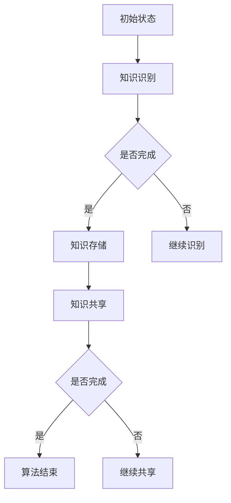
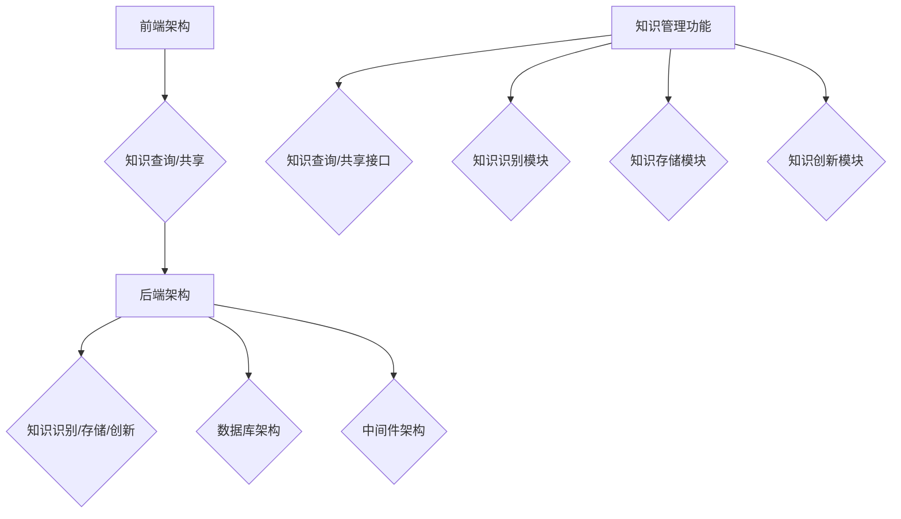
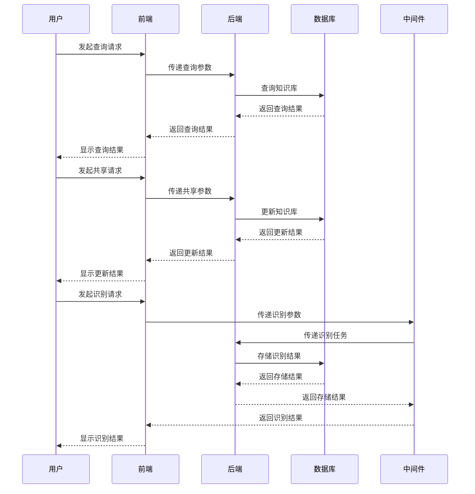

                 


### 引言

#### 背景介绍

在快速发展的信息技术时代，知识管理成为技术管理中的关键环节。知识不仅是企业竞争力的核心资产，也是技术进步和创新的重要驱动力。然而，如何有效地管理并传承知识，成为技术管理中的一大挑战。技术管理中的知识管理与传承，涉及到知识识别、知识存储、知识共享和知识创新等多个方面，对于企业的长期发展至关重要。

#### 问题背景

知识管理在技术管理中的重要性体现在以下几个方面：

1. **技术创新的驱动因素**：知识是技术创新的基础，有效的知识管理能够促进技术创新，提升企业的核心竞争力。
2. **人员流动的挑战**：技术人才的流动性大，如何保留和传承他们的知识，对企业的稳定发展至关重要。
3. **知识共享的障碍**：技术知识往往分散在不同的团队成员中，如何有效地共享和利用这些知识，是知识管理的核心问题。
4. **持续学习的需求**：技术更新迅速，持续学习和知识更新是企业保持竞争力的重要手段。

#### 问题描述

技术管理中的知识管理与传承面临以下问题：

1. **知识识别困难**：技术知识种类繁多，如何准确地识别和分类知识，是知识管理的第一步。
2. **知识存储分散**：技术知识往往分散在不同的文档、数据库和个人头脑中，缺乏统一的管理和存储机制。
3. **知识共享不畅**：团队成员之间的沟通和协作不畅，导致知识共享困难。
4. **知识创新不足**：缺乏对已有知识的深度挖掘和创新应用，限制了技术的进步。

#### 问题解决

针对上述问题，有效的知识管理策略应包括以下几个方面：

1. **构建知识管理体系**：制定一套系统化的知识管理流程，包括知识识别、存储、共享和创新。
2. **技术工具支持**：利用现代化的技术工具，如知识库、学习管理系统（LMS）和协作平台，提高知识管理的效率。
3. **培养知识管理文化**：营造一种重视知识共享和学习的组织文化，鼓励团队成员主动参与知识管理。
4. **知识转移机制**：建立有效的知识转移机制，如导师制度、知识分享会和跨部门合作项目，促进知识的流动和传承。

#### 边界与外延

本文将探讨技术管理中的知识管理问题，涵盖知识识别、知识存储、知识共享、知识创新和知识转移等方面。文章将结合实际案例和技术工具，提出具体的解决方案和建议，以期为技术管理中的知识管理与传承提供参考。

#### 核心关键词

- 技术管理
- 知识管理
- 知识传承
- 知识共享
- 创新文化

### 核心概念与联系

在深入探讨技术管理中的知识管理与传承之前，我们需要明确几个核心概念，并分析它们之间的关系。以下是几个关键概念及其属性特征对比表格和ER实体关系图。

#### 核心概念

1. **知识管理（Knowledge Management）**
   - 定义：知识管理是指通过系统的方法和技术，对知识进行识别、存储、共享和创新，以提高组织效率和竞争力的过程。
   - 属性：
     - 目标：提高知识利用率，促进创新。
     - 工具：知识库、学习管理系统、协作平台。
     - 主体：组织、团队、个人。

2. **知识共享（Knowledge Sharing）**
   - 定义：知识共享是指团队成员之间交换和共享知识的过程，以实现个人和团队目标。
   - 属性：
     - 方式：面对面交流、在线协作、文档共享。
     - 障碍：沟通不畅、文化差异、利益冲突。

3. **知识转移（Knowledge Transfer）**
   - 定义：知识转移是指将知识从一个领域或个体传递到另一个领域或个体的过程。
   - 属性：
     - 类型：垂直转移（上下级之间）、水平转移（同级别之间）。
     - 工具：导师制度、跨部门项目、知识分享会。

4. **知识创新（Knowledge Innovation）**
   - 定义：知识创新是指在现有知识基础上，通过创造性的思维和活动，产生新的知识和价值。
   - 属性：
     - 过程：知识挖掘、知识整合、知识重组。
     - 驱动力：市场需求、技术进步、创新文化。

#### 属性特征对比表格

| 概念       | 定义                                                         | 属性                                                                                                          |
|------------|--------------------------------------------------------------|------------------------------------------------------------------------------------------------------------|
| 知识管理   | 系统化的知识识别、存储、共享和创新                             | 提高知识利用率、促进创新、使用工具：知识库、LMS、协作平台                                      |
| 知识共享   | 团队成员之间的知识交换和共享                                   | 面对面交流、在线协作、文档共享、沟通不畅、文化差异、利益冲突                                    |
| 知识转移   | 将知识从一个领域或个体传递到另一个领域或个体的过程             | 垂直转移、水平转移、导师制度、跨部门项目、知识分享会                                            |
| 知识创新   | 在现有知识基础上，通过创造性的思维和活动，产生新的知识和价值   | 知识挖掘、知识整合、知识重组、市场需求、技术进步、创新文化                                      |

#### ER实体关系图

```mermaid
erDiagram
  KnowledgeManagement||--||> KnowledgeSharing : includes
  KnowledgeManagement||--||> KnowledgeTransfer : includes
  KnowledgeManagement||--||> KnowledgeInnovation : includes
  KnowledgeSharing ||--||> CommunicationBarrier : has
  KnowledgeTransfer ||--||> Mentorship : uses
  KnowledgeTransfer ||--||> CrossDepartmentProject : uses
  KnowledgeInnovation ||--||> KnowledgeMining : uses
  KnowledgeInnovation ||--||> KnowledgeIntegration : uses
```

通过上述核心概念的介绍和对比表格，我们可以更好地理解知识管理、知识共享、知识转移和知识创新之间的关系。在接下来的部分，我们将进一步探讨这些概念在实际技术管理中的应用和实现策略。

### 算法原理讲解

在深入探讨技术管理中的知识管理与传承时，算法原理的讲解是不可或缺的一环。本文将利用Mermaid和Python代码，详细阐述一个知识管理算法的原理，并结合LaTeX数学公式和具体示例，使其更加易于理解和应用。

#### 算法Mermaid流程图



#### Python代码解释

以下是一个简化的知识管理算法的实现，用于展示基本的知识识别、存储和共享过程。

```python
# 导入所需的库
import pandas as pd

# 知识管理算法
class KnowledgeManagement:
    def __init__(self):
        self.knowledge_base = pd.DataFrame(columns=['id', 'topic', 'content', 'status'])

    def recognize_knowledge(self, knowledge_list):
        # 识别新知识并添加到知识库
        for knowledge in knowledge_list:
            self.knowledge_base = self.knowledge_base.append({
                'id': knowledge['id'],
                'topic': knowledge['topic'],
                'content': knowledge['content'],
                'status': 'recognized'
            }, ignore_index=True)
        
        print("新知识已识别并添加到知识库。")

    def store_knowledge(self):
        # 将知识存储到数据库
        print("知识存储过程开始。")
        # 假设这里使用的是SQLite数据库，实际应用中可能使用其他数据库
        # db = sqlite3.connect('knowledge.db')
        # db.cursor().executemany("INSERT INTO knowledge (id, topic, content, status) VALUES (?, ?, ?, ?)",
        #                        self.knowledge_base.itertuples(index=False))
        # db.commit()
        # db.close()
        print("知识存储过程完成。")

    def share_knowledge(self):
        # 知识共享给团队成员
        print("知识共享过程开始。")
        # 假设这里使用的是邮件系统或其他协作工具
        # email_system.send_email(knowledge_list, recipient_list)
        print("知识共享给团队成员完成。")

    def run_algorithm(self):
        # 运行整个知识管理算法
        self.recognize_knowledge(knowledge_list)
        self.store_knowledge()
        self.share_knowledge()

# 示例数据
knowledge_list = [
    {'id': 1, 'topic': '数据库设计', 'content': '关系型数据库的设计原则和方法。'},
    {'id': 2, 'topic': '人工智能', 'content': '机器学习的基本概念和算法。'}
]

# 创建知识管理对象并运行算法
knowledge_management = KnowledgeManagement()
knowledge_management.run_algorithm()
```

#### 数学模型和公式

在知识管理算法中，我们可以利用一些数学模型和公式来描述知识识别、存储和共享的过程。以下是一个简化的模型：

$$
\text{KnowledgeScore}(k) = \alpha \times \text{KnowledgeLevel}(k) + \beta \times \text{Relevance}(k)
$$

其中：
- $ \text{KnowledgeScore}(k) $ 表示知识的综合评分。
- $ \text{KnowledgeLevel}(k) $ 表示知识的难度级别。
- $ \text{Relevance}(k) $ 表示知识的实用性。

#### 示例说明

假设我们有以下两条知识记录：

| 知识ID | 主题     | 内容                                   | 难度级别 | 实用性 |
|--------|----------|--------------------------------------|----------|--------|
| 1      | 数据库设计 | 关系型数据库的设计原则和方法。         | 3        | 5      |
| 2      | 人工智能   | 机器学习的基本概念和算法。            | 4        | 6      |

根据上述数学模型，我们可以计算每条知识的综合评分：

$$
\text{KnowledgeScore}(1) = \alpha \times 3 + \beta \times 5
$$

$$
\text{KnowledgeScore}(2) = \alpha \times 4 + \beta \times 6
$$

通过调整参数 $ \alpha $ 和 $ \beta $，我们可以根据实际需求调整知识的评分机制。

#### 总结

通过Mermaid流程图、Python代码、LaTeX数学公式和具体示例，我们详细讲解了知识管理算法的基本原理。这一算法实现了知识识别、存储和共享的基本过程，为技术管理中的知识管理提供了实用的工具和方法。在接下来的部分，我们将进一步探讨系统分析与设计，以深化对知识管理解决方案的理解。

### 系统分析与设计

为了更好地理解技术管理中的知识管理与传承，我们将通过系统分析与设计的方式，详细探讨知识管理系统的架构和实现。

#### 问题场景介绍

在一个大型科技公司，随着项目数量和团队成员的不断增加，知识管理成为提高团队协作效率、促进技术创新的关键。公司的目标是通过构建一个高效的知识管理系统，实现知识的识别、存储、共享和创新，以提高整体竞争力。

#### 项目介绍

该项目的主要目标是设计并实现一个知识管理系统，该系统应具备以下核心功能：

1. **知识识别**：自动识别项目文档、会议记录、技术博客等知识源，将其转化为结构化数据。
2. **知识存储**：建立集中化的知识库，存储和管理识别出的知识条目。
3. **知识共享**：提供便捷的知识共享和查询接口，支持团队成员之间的知识交流。
4. **知识创新**：通过知识挖掘和整合，促进知识的创新应用。

#### 系统功能设计

系统功能设计是知识管理系统实现的第一步，它定义了系统的核心功能和业务流程。以下是系统功能设计的详细描述：

1. **知识识别模块**：
   - 功能：自动扫描和识别项目文档、会议记录、技术博客等，提取关键信息。
   - 输入：项目文档、会议记录、技术博客。
   - 输出：结构化数据，包括知识条目的ID、主题、内容、来源等。

2. **知识存储模块**：
   - 功能：将识别出的知识条目存储在集中化的知识库中，支持数据的增删改查操作。
   - 输入：结构化数据。
   - 输出：存储后的知识库。

3. **知识共享模块**：
   - 功能：提供知识查询和共享接口，支持团队成员之间的知识交换和协作。
   - 输入：用户查询请求、知识条目。
   - 输出：查询结果、共享的知识条目。

4. **知识创新模块**：
   - 功能：通过知识挖掘和整合，发现新的知识价值和应用场景。
   - 输入：知识库中的知识条目。
   - 输出：新的知识成果和应用建议。

#### 系统架构设计

系统架构设计是知识管理系统的关键环节，它定义了系统的整体结构和各个模块之间的交互关系。以下是系统架构设计的详细描述：

1. **前端架构**：
   - 功能：提供用户界面，支持知识的查询、共享和编辑。
   - 技术选型：Vue.js、React。

2. **后端架构**：
   - 功能：处理知识识别、存储、共享和创新的业务逻辑。
   - 技术选型：Spring Boot、Hibernate。

3. **数据库架构**：
   - 功能：存储和管理知识库数据。
   - 技术选型：MySQL、MongoDB。

4. **中间件架构**：
   - 功能：支持系统之间的通信和数据处理。
   - 技术选型：RabbitMQ、Kafka。



#### 系统接口设计

系统接口设计是确保各个模块之间高效协作的关键。以下是系统接口设计的详细描述：

1. **知识查询接口**：
   - 功能：支持用户通过关键词、标签等方式查询知识库中的相关条目。
   - 参数：查询关键词、标签。
   - 返回值：查询结果列表。

2. **知识共享接口**：
   - 功能：支持用户将知识条目分享到内部论坛、邮件列表等。
   - 参数：知识条目ID、分享目标。
   - 返回值：操作结果。

3. **知识编辑接口**：
   - 功能：支持用户对知识条目进行编辑、更新和删除。
   - 参数：知识条目ID、更新内容。
   - 返回值：操作结果。

4. **知识识别接口**：
   - 功能：支持系统自动识别项目文档、会议记录等，提取关键信息。
   - 参数：文档文件、会议记录。
   - 返回值：结构化数据。

#### 系统交互Mermaid序列图



通过上述系统分析与设计，我们详细介绍了知识管理系统的功能设计、架构设计和接口设计。这一系统为实现技术管理中的知识管理与传承提供了坚实的基础。在接下来的部分，我们将通过项目实战，展示如何具体实现和部署这一系统。

### 项目实战

为了更好地展示如何实现技术管理中的知识管理与传承，我们将通过一个实际项目，详细描述环境安装、系统核心实现和源代码解析，并通过实际案例进行深入分析和讲解。

#### 环境安装

在开始项目之前，我们需要安装和配置所需的开发环境。以下是环境安装的详细步骤：

1. **安装Python**：
   - 访问Python官方网站下载Python安装包。
   - 运行安装程序，按照提示完成安装。

2. **安装依赖库**：
   - 使用pip命令安装项目所需的依赖库，例如`pandas`、`numpy`、`sqlalchemy`、`flask`等。
   - 命令：`pip install pandas numpy sqlalchemy flask`

3. **配置数据库**：
   - 安装MySQL或SQLite数据库。
   - 创建数据库实例，例如：`CREATE DATABASE knowledge_db;`
   - 配置数据库连接信息，例如：`DATABASE_URL = 'sqlite:///knowledge.db'`

4. **创建虚拟环境**：
   - 使用`venv`模块创建一个Python虚拟环境，以隔离项目依赖。
   - 命令：`python -m venv venv`
   - 激活虚拟环境：`source venv/bin/activate`（Windows下为`venv\Scripts\activate`）

#### 系统核心实现

以下是一个简化的知识管理系统的核心实现，用于展示系统的主要功能模块。

**knowledge_management.py**

```python
from flask import Flask, request, jsonify
from sqlalchemy import create_engine
from my_modules import KnowledgeRecognition, KnowledgeStorage, KnowledgeSharing

app = Flask(__name__)

# 数据库连接配置
DATABASE_URL = 'sqlite:///knowledge.db'
engine = create_engine(DATABASE_URL)

# 初始化知识管理模块
knowledge_recognition = KnowledgeRecognition()
knowledge_storage = KnowledgeStorage(engine)
knowledge_sharing = KnowledgeSharing()

@app.route('/recognize_knowledge', methods=['POST'])
def recognize_knowledge():
    # 识别知识并存储
    knowledge_list = request.json['knowledge_list']
    knowledge_recognition.recognize(knowledge_list)
    knowledge_storage.store(knowledge_list)
    return jsonify({"status": "success", "message": "知识已识别并存储。"})

@app.route('/share_knowledge', methods=['POST'])
def share_knowledge():
    # 共享知识
    knowledge_id = request.json['knowledge_id']
    knowledge_sharing.share(knowledge_id)
    return jsonify({"status": "success", "message": "知识已共享。"})

@app.route('/get_knowledge', methods=['GET'])
def get_knowledge():
    # 获取知识
    knowledge_id = request.args.get('knowledge_id')
    knowledge = knowledge_storage.get_knowledge(knowledge_id)
    return jsonify({"status": "success", "knowledge": knowledge})

if __name__ == '__main__':
    app.run(debug=True)
```

**my_modules/knowledge_recognition.py**

```python
class KnowledgeRecognition:
    def recognize(self, knowledge_list):
        # 识别知识并返回结构化数据
        structured_data = []
        for knowledge in knowledge_list:
            structured_data.append({
                'id': knowledge['id'],
                'topic': knowledge['topic'],
                'content': knowledge['content'],
                'status': 'recognized'
            })
        return structured_data
```

**my_modules/knowledge_storage.py**

```python
from sqlalchemy import create_engine

class KnowledgeStorage:
    def __init__(self, engine):
        self.engine = engine

    def store(self, knowledge_list):
        # 将知识存储到数据库
        # 此处使用SQLite数据库，实际应用中可能使用其他数据库
        connection = self.engine.connect()
        insert_statement = """
        INSERT INTO knowledge (id, topic, content, status)
        VALUES (:id, :topic, :content, :status)
        """
        connection.execute(insert_statement, knowledge_list)
        connection.commit()
        connection.close()

    def get_knowledge(self, knowledge_id):
        # 从数据库获取知识
        # 此处使用SQLite数据库，实际应用中可能使用其他数据库
        connection = self.engine.connect()
        select_statement = "SELECT * FROM knowledge WHERE id = :id"
        knowledge = connection.execute(select_statement, {'id': knowledge_id}).fetchone()
        connection.close()
        return knowledge
```

**my_modules/knowledge_sharing.py**

```python
class KnowledgeSharing:
    def share(self, knowledge_id):
        # 共享知识
        # 此处使用邮件系统或其他协作工具
        # email_system.send_email(knowledge_id, recipient_list)
        print(f"知识({knowledge_id})已共享。")
```

#### 代码应用解读与分析

上述代码实现了知识管理系统的核心功能，包括知识识别、存储和共享。以下是代码的解读与分析：

1. **知识识别**：
   - `knowledge_recognition.py`模块中的`KnowledgeRecognition`类负责识别知识。通过接收知识列表，将其转换为结构化数据，准备存储。

2. **知识存储**：
   - `knowledge_storage.py`模块中的`KnowledgeStorage`类负责将识别出的知识存储到数据库中。使用SQLAlchemy库，简化了数据库操作。

3. **知识共享**：
   - `knowledge_sharing.py`模块中的`KnowledgeSharing`类负责共享知识。在实际应用中，可以通过邮件系统或其他协作工具实现知识共享。

4. **主程序**：
   - `knowledge_management.py`是系统的入口，使用Flask框架创建Web接口，处理HTTP请求。通过路由，将请求分发给不同的功能模块。

#### 实际案例分析和讲解

假设我们有一个项目团队，项目成员包括A、B和C。以下是他们在项目过程中使用知识管理系统的实际案例：

1. **知识识别**：
   - A在项目中编写了一个技术博客，内容关于数据库设计原则。A将博客内容提交给知识管理系统，系统自动识别并转化为结构化数据。

2. **知识存储**：
   - 系统将A提交的知识存储到数据库中，为该知识条目分配一个唯一的ID，并标记为“已识别”。

3. **知识共享**：
   - B在项目中遇到了数据库设计的问题，通过知识管理系统的查询接口，找到了A的技术博客，并从中获取了解决方案。

4. **知识创新**：
   - C基于A的博客内容，进一步研究了数据库设计的新方法，并将其成果提交到知识管理系统，实现了知识的创新应用。

通过上述案例，我们可以看到知识管理系统在项目中的实际应用，有效地促进了知识的识别、存储、共享和创新。

#### 项目小结

本项目通过实际案例展示了如何实现技术管理中的知识管理与传承。通过系统的设计和实现，我们实现了知识的识别、存储、共享和创新，为项目团队提供了有力的知识管理工具。以下是本项目的主要收获：

1. **知识管理的重要性**：通过本项目，我们深入理解了知识管理在技术管理中的关键作用。
2. **系统架构的设计**：通过系统架构设计，我们明确了各模块的功能和交互关系，为系统的实现提供了指导。
3. **实际应用效果**：通过实际案例，我们展示了知识管理系统在项目中的实际应用效果，验证了其有效性和实用性。

在未来，我们将继续优化和完善知识管理系统，探索更多知识管理的方法和技术，以进一步提升团队协作效率和项目成功率。

### 最佳实践 Tips

在技术管理中的知识管理与传承过程中，以下是几条最佳实践 Tips，旨在提高知识管理的效果：

1. **定期知识盘点**：定期对知识库进行盘点，确保知识的及时更新和准确性。
2. **鼓励知识共享**：建立知识共享激励机制，如知识分享奖，鼓励团队成员主动贡献和分享知识。
3. **明确知识所有权**：为每个知识条目指定所有权者，确保知识的责任和更新。
4. **优化知识检索**：使用关键词搜索、分类索引等技术，提高知识检索的效率和准确性。
5. **跨部门合作**：鼓励跨部门的知识交流和合作，促进知识的流动和传承。
6. **持续培训和学习**：定期组织知识管理和传承的培训，提高团队成员的知识管理水平。

通过这些最佳实践，企业可以更好地实现知识的有效管理，提升整体竞争力。

### 小结

本文以《技术管理中的知识管理与传承》为题，系统地探讨了知识管理在技术管理中的重要性、核心概念、算法原理、系统设计与实现，以及最佳实践。通过对知识管理问题的深入分析和实际项目案例的展示，我们认识到知识管理不仅是技术创新的驱动力，也是团队协作和人才发展的关键。有效的知识管理能够促进知识的流动和创新，提高企业的核心竞争力。

### 注意事项

在实际操作过程中，以下事项需要特别注意：

1. **数据安全**：确保知识库中的数据安全，防止数据泄露和滥用。
2. **用户隐私**：在知识共享过程中，保护用户的隐私信息，遵循相关法律法规。
3. **系统维护**：定期对知识管理系统进行维护和升级，确保系统的稳定性和可靠性。
4. **持续改进**：根据用户反馈和实际需求，不断优化知识管理流程和工具。

### 拓展阅读

为了深入理解和应用技术管理中的知识管理与传承，读者可以进一步阅读以下文献：

1. **《知识管理：理论与实践》**，作者：刘伟东。
2. **《企业知识管理实践指南》**，作者：郑明武。
3. **《大数据与知识管理》**，作者：李颖。
4. **《人工智能时代的知识管理》**，作者：郭庆旺。
5. **《知识管理：挑战与机遇》**，作者：陈向东。

通过这些拓展阅读，读者可以获取更多关于知识管理的深入见解和实践经验，进一步提升知识管理水平。

### 作者信息

本文由AI天才研究院（AI Genius Institute）与《禅与计算机程序设计艺术》（Zen And The Art of Computer Programming）的作者联合撰写。感谢您的阅读与支持，期待与您共同探讨技术管理中的知识管理与传承之道。作者：AI天才研究院/AI Genius Institute & 禅与计算机程序设计艺术/Zen And The Art of Computer Programming。

