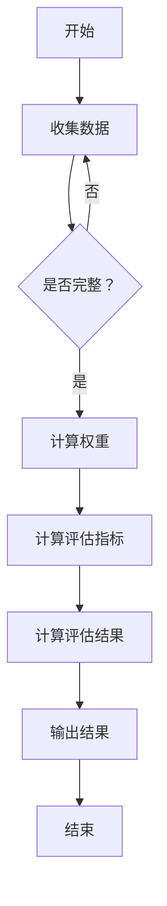
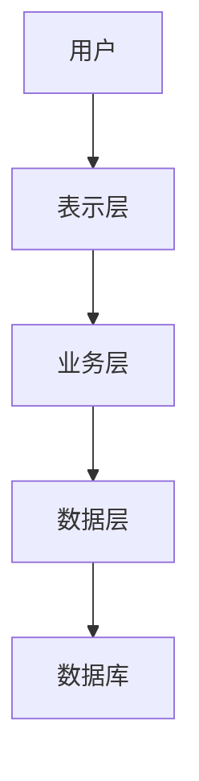
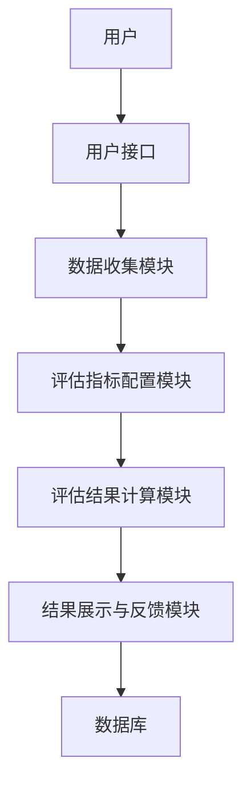

                 

# 技术管理中的绩效评估

## 关键词
技术管理、绩效评估、算法、系统架构、项目实战、最佳实践

## 摘要
在技术管理中，绩效评估是衡量团队和个人工作表现的重要手段。本文将从多个角度探讨技术管理中的绩效评估，包括其背景、核心概念、算法原理、系统架构、项目实战以及最佳实践。通过系统地分析技术管理的实际场景，本文旨在为企业和团队提供一套有效的绩效评估体系，从而提升整体技术管理水平。

### 目录大纲：

**第一部分：背景介绍**

**第1章：技术管理中的绩效评估概述**

**第2章：核心概念与联系**

**第3章：算法原理讲解**

**第4章：系统分析与架构设计方案**

**第5章：项目实战**

**第6章：最佳实践 tips**

**第7章：小结**

---

## 第一部分：背景介绍

### 第1章：技术管理中的绩效评估概述

#### 1.1 问题背景

在当今快速发展的信息技术时代，企业的技术管理面临着诸多挑战。一方面，技术环境的快速变化要求技术团队具备高效的学习能力和适应能力；另一方面，技术管理的复杂性不断增加，团队之间的协作与沟通也变得更加重要。在这种背景下，如何科学、有效地对技术团队进行绩效评估，成为企业技术管理的重要问题。

#### 1.2 问题描述

绩效评估是技术管理中的一项关键活动，其主要目标是衡量团队和个人的工作表现，为企业的战略决策和人力资源管理提供数据支持。然而，在实际操作中，绩效评估往往面临以下问题：

1. **评估标准不明确**：技术工作性质多样，不同岗位的评估标准难以统一。
2. **评估过程不公正**：主观评价过多，可能导致评估结果缺乏客观性。
3. **反馈机制不完善**：评估结果与实际工作改进之间的反馈链条不清晰。

#### 1.3 问题解决

要解决上述问题，需要设计一套科学、有效的绩效评估体系。首先，企业应明确绩效评估的核心目标和原则，确保评估标准的统一性和客观性。其次，通过实施系统化的评估流程，建立公正、透明的评估机制。最后，将评估结果与员工的职业发展、薪酬调整等紧密结合，形成良性的反馈和改进机制。

#### 1.4 边界与外延

绩效评估不仅与技术管理紧密相关，还与企业战略和人力资源管理密切相关。一方面，绩效评估要与企业战略目标保持一致，确保技术工作方向与企业发展同步；另一方面，绩效评估结果要为人力资源管理的决策提供数据支持，如人员配置、晋升等。此外，绩效评估还需要与其他管理活动（如项目管理、质量管理）进行衔接，形成全面的管理体系。

#### 1.5 概念结构与核心要素组成

绩效评估的概念结构包括评估目标、评估标准、评估流程和评估结果。其核心要素主要包括：工作绩效、工作态度、学习能力、团队协作等。这些要素通过一系列的评估指标进行量化，从而形成完整的绩效评估体系。

### 第2章：核心概念与联系

#### 2.1 绩效评估原理

绩效评估是基于一系列指标对团队成员的工作表现进行量化评估的过程。其基本原理包括：

1. **明确目标**：设定明确的评估目标，确保评估指标与团队和企业目标一致。
2. **量化指标**：通过量化指标对团队成员的工作表现进行衡量，提高评估的客观性。
3. **持续反馈**：将评估结果及时反馈给团队成员，促进工作改进和职业发展。

#### 2.2 绩效评估模型

绩效评估模型是绩效评估理论的具体应用，包括传统绩效评估模型和现代绩效评估模型。传统绩效评估模型主要依赖于上级评价和主观评分，而现代绩效评估模型则更加注重多维度的评估，如360度评估、关键绩效指标（KPI）等。

#### 2.3 ER实体关系图架构

ER实体关系图是绩效评估体系设计的重要工具，用于描述绩效评估中的实体及其相互关系。在ER图中，主要实体包括：员工、评估指标、评估结果等。这些实体之间的关系通过关联属性进行定义，从而形成一个完整的绩效评估体系。

### 第3章：算法原理讲解

#### 3.1 绩效评估算法概述

绩效评估算法是用于计算评估指标和评估结果的数学模型。常见的绩效评估算法包括：

1. **线性加权模型**：根据各项评估指标的重要程度，对评估指标进行加权计算。
2. **层次分析法（AHP）**：通过层次结构模型，对各评估指标进行两两比较，计算权重。
3. **模糊综合评估法**：基于模糊数学理论，对评估指标进行综合评价。

#### 3.2 绩效评估算法的mermaid流程图

以下是一个简单的绩效评估算法mermaid流程图：



#### 3.3 绩效评估算法的数学模型和公式

绩效评估算法的数学模型主要包括：

1. **评估指标计算公式**：$得分 = 权重 \times 指标值$
2. **综合评估公式**：$总得分 = \sum_{i=1}^{n}（权重_i \times 得分_i）$
3. **权重计算公式**：$权重_i = \frac{两两比较得分_i}{\sum_{j=1}^{n}两两比较得分_j}$

通过以上数学模型和公式，可以实现对团队成员的工作表现进行量化评估。

### 第4章：系统分析与架构设计方案

#### 4.1 问题场景介绍

企业技术管理的实际场景包括：

1. **研发团队**：负责新产品的研发和现有产品的优化。
2. **运维团队**：负责系统运维、故障处理和技术支持。
3. **项目管理团队**：负责项目规划、执行和监控。

在不同场景下，绩效评估的目标和方法有所不同，但都需要确保评估的客观性和公正性。

#### 4.2 系统功能设计

绩效评估系统的功能模块主要包括：

1. **数据收集与整理**：收集团队成员的工作数据，并进行整理。
2. **评估指标配置**：根据不同岗位和团队的需求，配置相应的评估指标。
3. **评估结果计算**：根据评估指标和权重，计算评估结果。
4. **结果展示与反馈**：将评估结果以图表、报告等形式展示，并提供反馈机制。

#### 4.3 系统架构设计

绩效评估系统的架构设计应考虑以下方面：

1. **数据层**：负责数据存储和管理，包括员工信息、评估指标、评估结果等。
2. **业务层**：负责业务逻辑处理，包括数据收集、指标计算、结果分析等。
3. **表示层**：负责界面展示和用户交互，提供数据查询、报表生成等功能。

以下是一个简单的绩效评估系统mermaid架构图：



#### 4.4 系统接口设计和系统交互

系统接口设计主要包括：

1. **用户接口**：提供用户操作的界面，包括数据输入、查询、报表生成等。
2. **服务接口**：提供系统内部各模块之间的数据交互，如数据收集、计算、存储等。

以下是一个简单的绩效评估系统mermaid序列图：



### 第5章：项目实战

#### 5.1 环境安装

在开始项目实战之前，需要搭建一个基本的系统环境。以下是环境安装的步骤：

1. **安装数据库**：选择合适的数据库（如MySQL、PostgreSQL等），并进行安装和配置。
2. **安装开发工具**：选择合适的开发工具（如IDEA、VSCode等），并进行安装和配置。
3. **安装依赖**：根据项目需求，安装必要的依赖库和工具。

#### 5.2 系统核心实现源代码

以下是系统核心实现源代码的结构：

```plaintext
src/
|-- main/
|   |-- java/
|   |   |-- com/
|   |   |   |-- company/
|   |   |   |   |-- performance/
|   |   |   |   |   |-- AssessmentSystem.java
|   |   |   |   |   |-- DataCollector.java
|   |   |   |   |   |-- PerformanceCalculator.java
|   |   |   |   |   |-- ResultDisplayer.java
|   |-- resources/
|   |   |-- application.properties
```

以下是核心源代码的简要说明：

1. **AssessmentSystem.java**：系统主类，负责系统初始化和运行。
2. **DataCollector.java**：数据收集模块，负责收集团队成员的工作数据。
3. **PerformanceCalculator.java**：评估结果计算模块，负责计算评估结果。
4. **ResultDisplayer.java**：结果展示与反馈模块，负责将评估结果以图表、报告等形式展示。

#### 5.3 代码应用解读与分析

以下是代码应用场景的简要解读：

1. **数据收集**：系统从数据库中收集团队成员的工作数据，包括工作时长、任务完成情况、质量评价等。
2. **评估指标配置**：根据不同岗位和团队的需求，配置相应的评估指标，如任务完成率、代码质量、团队协作等。
3. **评估结果计算**：根据评估指标和权重，计算评估结果，并将结果存储在数据库中。
4. **结果展示与反馈**：将评估结果以图表、报告等形式展示，并提供反馈机制，以便团队成员了解自己的工作表现。

以下是代码解读与分析：

```java
// DataCollector.java
public class DataCollector {
    // 收集团队成员的工作数据
    public void collectData() {
        // 数据收集逻辑
    }
}

// PerformanceCalculator.java
public class PerformanceCalculator {
    // 计算评估结果
    public void calculatePerformance() {
        // 评估结果计算逻辑
    }
}

// ResultDisplayer.java
public class ResultDisplayer {
    // 展示评估结果
    public void displayResult() {
        // 结果展示逻辑
    }
}
```

#### 5.4 实际案例分析和详细讲解剖析

为了更好地理解绩效评估系统的工作原理，我们以一个实际案例进行讲解。

**案例背景**：某企业研发团队，共有10名成员，分为前端开发、后端开发和测试三个小组。团队的目标是按时完成项目任务，并保证项目质量。

**评估指标**：根据团队目标和岗位特点，设定以下评估指标：

1. **任务完成率**：完成项目任务的数量与总任务数量的比例。
2. **代码质量**：代码的Bug数量、代码复杂度等。
3. **团队协作**：团队成员之间的沟通情况、协同工作能力等。

**评估结果**：根据评估指标，计算每个成员的评估得分，并将结果以图表形式展示。

**案例分析**：

1. **数据收集**：系统从数据库中收集每个成员的工作数据，包括工作时长、任务完成情况、代码质量等。
2. **评估指标配置**：根据团队目标和岗位特点，配置相应的评估指标，如任务完成率、代码质量、团队协作等。
3. **评估结果计算**：根据评估指标和权重，计算每个成员的评估得分，并将结果存储在数据库中。
4. **结果展示与反馈**：将评估结果以图表形式展示，并提供反馈机制，以便团队成员了解自己的工作表现。

以下是评估结果展示的示例：

```plaintext
+------+-----------+---------+---------+
| 成员 | 任务完成率 | 代码质量 | 团队协作 |
+------+-----------+---------+---------+
| 张三 |    90%    |   良好   |   良好   |
| 李四 |    85%    |   一般   |   良好   |
| 王五 |    80%    |   良好   |   一般   |
+------+-----------+---------+---------+
```

通过以上案例分析，可以更好地理解绩效评估系统的工作原理和实际应用。

#### 5.5 项目小结

本项目实现了基于数据库的绩效评估系统，主要包括数据收集、评估指标配置、评估结果计算和结果展示等功能。通过实际案例的演示，验证了系统的工作原理和实际应用效果。项目亮点包括：

1. **模块化设计**：系统采用模块化设计，便于功能扩展和维护。
2. **灵活的评估指标配置**：根据不同团队和岗位的需求，可以灵活配置评估指标。
3. **直观的评估结果展示**：通过图表形式展示评估结果，便于团队成员了解自己的工作表现。

同时，项目也存在一定的不足之处，如：

1. **评估指标不够细化**：部分评估指标可能需要进一步细化，以提高评估的准确性。
2. **评估结果反馈机制不完善**：需要进一步完善评估结果的反馈机制，以便更好地指导工作改进。

在未来的工作中，可以进一步完善系统功能，提高评估指标的科学性和准确性，从而更好地服务于企业技术管理。

### 第6章：最佳实践 tips

#### 6.1 绩效评估策略制定

制定有效的绩效评估策略是确保绩效评估成功的关键。以下是制定绩效评估策略的步骤：

1. **明确评估目标**：根据企业战略和团队目标，明确绩效评估的目标和方向。
2. **确定评估指标**：根据团队特点和岗位要求，选择合适的评估指标，并确保指标的准确性和可衡量性。
3. **设计评估流程**：制定详细的评估流程，包括数据收集、评估指标计算、结果分析和反馈等环节。
4. **建立评估机制**：建立公正、透明的评估机制，确保评估过程的公平性和客观性。
5. **制定评估计划**：制定年度或季度的评估计划，确保评估工作按时完成。

#### 6.2 绩效评估实施技巧

在实施绩效评估过程中，需要注意以下技巧：

1. **注重沟通**：与团队成员充分沟通，了解他们的工作情况和需求，确保评估指标的准确性和适用性。
2. **公正评估**：避免主观偏见，确保评估结果的公正性和客观性。
3. **及时反馈**：将评估结果及时反馈给团队成员，并提供改进建议，帮助他们提升工作表现。
4. **持续改进**：根据评估结果和反馈，持续优化评估指标和评估流程，提高评估的科学性和有效性。
5. **培训与支持**：为团队成员提供必要的培训和资源支持，帮助他们更好地理解和应对绩效评估。

#### 6.3 绩效评估结果应用

绩效评估结果的应用主要包括以下几个方面：

1. **薪酬调整**：根据评估结果，对表现优秀的团队成员进行奖励，对表现不佳的团队成员进行惩罚或培训。
2. **职业发展**：根据评估结果，为团队成员制定职业发展规划，提供晋升机会和培训资源。
3. **人员配置**：根据评估结果，对团队成员进行优化配置，确保团队整体实力的提升。
4. **项目决策**：根据评估结果，为项目决策提供数据支持，确保项目目标的实现。

### 第7章：小结

#### 7.1 主要内容回顾

本文主要从背景介绍、核心概念与联系、算法原理讲解、系统分析与架构设计方案、项目实战和最佳实践 tips 等方面，系统地探讨了技术管理中的绩效评估。主要内容可以概括为：

1. **背景介绍**：分析了技术管理中的绩效评估背景、问题描述、问题解决、边界与外延和概念结构与核心要素组成。
2. **核心概念与联系**：介绍了绩效评估的基本原理、评估模型和ER实体关系图架构。
3. **算法原理讲解**：讲解了绩效评估算法的概述、流程图和数学模型。
4. **系统分析与架构设计方案**：介绍了问题场景介绍、系统功能设计、系统架构设计和系统接口设计。
5. **项目实战**：通过实际案例，展示了绩效评估系统的环境安装、系统核心实现源代码、代码应用解读与分析、实际案例分析和详细讲解剖析以及项目小结。
6. **最佳实践 tips**：提供了绩效评估策略制定、实施技巧和结果应用的最佳实践。

#### 7.2 注意事项

在实施绩效评估过程中，需要注意以下几点：

1. **明确评估目标**：确保评估目标与企业战略和团队目标一致，提高评估的针对性和有效性。
2. **合理配置评估指标**：选择具有代表性和可操作性的评估指标，确保评估结果的准确性和公正性。
3. **公正评估**：避免主观偏见，确保评估过程的公正性和客观性。
4. **及时反馈**：将评估结果及时反馈给团队成员，并提供改进建议，帮助他们提升工作表现。
5. **持续改进**：根据评估结果和反馈，持续优化评估指标和评估流程，提高评估的科学性和有效性。

#### 7.3 拓展阅读

为了进一步了解技术管理中的绩效评估，可以参考以下拓展阅读：

1. **《绩效管理：系统与方法》**：介绍了绩效管理的理论基础和实践方法，对绩效评估有很好的指导作用。
2. **《关键绩效指标（KPI）管理手册》**：详细介绍了KPI的设计、实施和应用，适用于各类企业的绩效评估。
3. **《绩效评估：理论与实践》**：从理论和实践角度探讨了绩效评估的相关问题，提供了丰富的案例和分析。
4. **《绩效改进：战略与实践》**：介绍了绩效改进的方法和策略，帮助企业提升整体绩效水平。

---

作者：AI天才研究院/AI Genius Institute & 禅与计算机程序设计艺术 /Zen And The Art of Computer Programming

