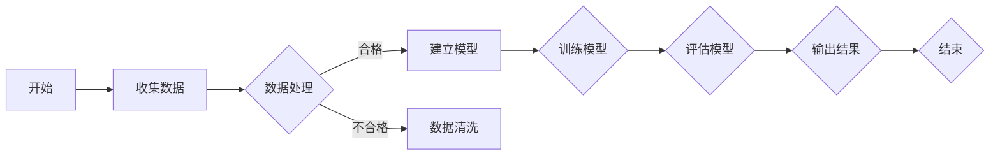

                 

# 技术管理中的绩效评估

> 关键词：技术管理、绩效评估、企业管理、人才评估、算法、系统架构、最佳实践

> 摘要：本文旨在探讨技术管理中的绩效评估，从问题背景、核心概念、算法原理、系统分析与架构设计、项目实战、最佳实践等方面，深入剖析绩效评估在技术管理中的重要性及其实施策略。通过本文的阅读，读者将全面了解绩效评估的理论基础和实践方法，提升企业技术管理水平。

## 目录大纲：

**第一部分：背景介绍**

- 第1章：技术管理中的绩效评估概述
- 第2章：核心概念与联系
- 第3章：算法原理讲解
- 第4章：系统分析与架构设计方案
- 第5章：项目实战
- 第6章：最佳实践 tips
- 第7章：小结

**第一部分：背景介绍**

### 第1章：技术管理中的绩效评估概述

#### 1.1 问题背景

技术管理在企业中扮演着至关重要的角色，然而，技术管理的成功往往取决于团队和管理层的协作效率。随着技术环境的快速变化和竞争的加剧，企业技术管理面临着诸多挑战。如何有效地评估技术团队和个人的绩效，成为技术管理中亟待解决的问题。

#### 1.2 问题描述

绩效评估是企业管理中不可或缺的一环，但在技术管理中，绩效评估往往更加复杂。技术工作的特点决定了绩效评估需要更加精细和科学。常见的绩效评估问题包括：评估标准不明确、评估结果与实际工作脱节、评估过程繁琐等。

#### 1.3 问题解决

有效的绩效评估体系是提升企业技术管理水平的关键。首先，需要明确绩效评估的目标和原则，确保评估体系与企业战略相一致。其次，制定科学合理的评估标准和流程，确保评估结果的准确性和公正性。最后，通过绩效评估的结果，指导技术团队和个人的改进和提升。

#### 1.4 边界与外延

绩效评估不仅涉及技术团队和个人的绩效评估，还与企业的战略规划、人力资源管理、项目管理等多个方面密切相关。因此，绩效评估的边界和影响范围需要明确，以确保其在企业内部得到有效实施。

#### 1.5 概念结构与核心要素组成

绩效评估的概念模型包括评估目标、评估标准、评估流程、评估结果等核心要素。这些要素相互作用，共同构成了绩效评估的完整体系。理解绩效评估的概念结构和核心要素，有助于更好地设计和实施绩效评估体系。

### 第2章：核心概念与联系

#### 2.1 绩效评估原理

绩效评估是基于目标管理、行为评价和结果分析的一种综合评价方法。其基本原理是通过设定明确的目标、评估行为和结果，对个人或团队的工作绩效进行评估。绩效评估的原理主要包括以下几个方面：

- **目标管理**：明确工作目标和任务，确保员工了解自己的工作职责和期望成果。
- **行为评价**：通过对员工的工作行为和表现进行评估，了解员工的工作态度和能力。
- **结果分析**：通过分析员工的工作结果，评估其绩效水平。

#### 2.2 绩效评估模型

绩效评估模型是绩效评估的理论基础和实践指南。常见的绩效评估模型包括KPI（关键绩效指标）、BSC（平衡计分卡）、360度评估等。每种模型都有其独特的特点和适用场景。

- **KPI模型**：以关键绩效指标为核心，对员工的工作绩效进行量化评估。
- **BSC模型**：从财务、客户、内部流程、学习与成长四个维度进行绩效评估。
- **360度评估**：通过员工、上级、同事和下属的反馈，对员工的工作绩效进行全面评估。

#### 2.3 ER实体关系图架构

ER（实体关系）图是描述数据关系的一种常用工具。在绩效评估中，ER图可以用来表示评估对象、评估指标、评估结果等实体之间的关系。

```mermaid
erDiagram
    Person ||--|{ Performance }|
    Performance ||--|{ Assessment }|
    Assessment ||--|{ KPI }|
    Assessment ||--|{ Behavior }|
    Assessment ||--|{ Result }|
```

在上面的ER图中，Person表示评估对象，Performance表示绩效，Assessment表示评估过程，KPI、Behavior和Result分别表示评估指标、行为和结果。

### 第3章：算法原理讲解

#### 3.1 绩效评估算法概述

绩效评估算法是绩效评估的核心技术，用于计算和分析员工的绩效数据。常见的绩效评估算法包括线性回归、决策树、支持向量机等。选择合适的算法，对于评估结果的准确性和可靠性至关重要。

- **线性回归**：通过建立员工绩效与影响因素之间的线性关系，预测员工的绩效水平。
- **决策树**：根据员工的不同特征和表现，分类评估员工的绩效水平。
- **支持向量机**：通过最大化分类边界，对员工进行分类评估。

#### 3.2 绩效评估算法的mermaid流程图



在上面的mermaid流程图中，A表示开始，B表示收集数据，C表示数据处理，D表示建立模型，E表示数据清洗，F表示训练模型，G表示评估模型，H表示输出结果，I表示结束。

#### 3.3 绩效评估算法的数学模型和公式

绩效评估算法的数学模型和公式是评估员工绩效的基础。以下是一个简单的线性回归模型：

$$
y = \beta_0 + \beta_1 \cdot x
$$

其中，$y$表示绩效评分，$\beta_0$表示截距，$\beta_1$表示斜率，$x$表示影响因素。

举例来说，假设某员工的绩效评分与工作时长有线性关系，我们可以通过以下公式计算其绩效评分：

$$
y = 0.5 \cdot x + 10
$$

其中，$0.5$表示斜率，$10$表示截距。如果该员工的工作时长为8小时，则其绩效评分为：

$$
y = 0.5 \cdot 8 + 10 = 14
$$

### 第4章：系统分析与架构设计方案

#### 4.1 问题场景介绍

在企业的技术管理中，绩效评估系统是不可或缺的一部分。通过绩效评估系统，企业可以实时收集和分析员工的工作数据，为管理决策提供有力支持。

#### 4.2 系统功能设计

绩效评估系统的功能模块主要包括：

- **数据收集模块**：负责收集员工的工作数据，如工作时长、完成任务情况等。
- **数据处理模块**：对收集到的数据进行清洗、归一化等处理，为模型训练提供高质量的数据。
- **评估模块**：根据预定的评估算法和模型，对员工的工作绩效进行评估。
- **结果展示模块**：将评估结果以图表、报表等形式展示给管理人员。

#### 4.3 系统架构设计

绩效评估系统的架构设计主要包括以下几个方面：

- **前端界面**：提供用户交互的界面，支持用户查看、修改和提交数据。
- **后端服务**：负责处理用户请求，调用评估算法和模型，生成评估结果。
- **数据库**：存储员工的工作数据、评估结果等。
- **中间件**：负责数据传输和缓存，提高系统的响应速度。

```mermaid
sequenceDiagram
    participant 用户 as 用户
    participant 前端界面 as 前端
    participant 后端服务 as 后端
    participant 数据库 as 数据库

    用户->>前端：提交数据请求
    前端->>后端：转发数据请求
    后端->>数据库：查询数据
    数据库-->>后端：返回数据
    后端-->>前端：返回结果
    前端->>用户：展示结果
```

在上面的序列图中，用户通过前端界面提交数据请求，后端服务接收到请求后，查询数据库并返回结果，前端界面将结果展示给用户。

#### 4.4 系统接口设计和系统交互

绩效评估系统的接口设计主要包括以下几个方面：

- **数据接口**：用于数据收集、处理和存储的接口。
- **业务接口**：用于处理业务逻辑的接口。
- **监控接口**：用于监控系统性能和运行状态的接口。

```mermaid
sequenceDiagram
    participant 数据接口 as 数据接口
    participant 业务接口 as 业务接口
    participant 监控接口 as 监控接口

    数据接口->>业务接口：数据请求
    业务接口->>监控接口：性能监控
    监控接口-->>业务接口：监控结果
    业务接口-->>数据接口：返回结果
```

在上面的序列图中，数据接口接收数据请求，业务接口处理业务逻辑并调用监控接口进行性能监控，监控接口将监控结果反馈给业务接口，业务接口根据监控结果调整业务逻辑。

### 第5章：项目实战

#### 5.1 环境安装

在项目实战中，首先需要搭建一个性能稳定、功能齐全的绩效评估系统。以下是系统环境搭建的步骤：

1. 安装操作系统：选择一个适合的操作系统，如Linux或Windows。
2. 安装数据库：选择一个适合的数据库，如MySQL或PostgreSQL。
3. 安装开发环境：安装Python开发环境，包括Python解释器和相关依赖库。
4. 安装中间件：安装Nginx、Redis等中间件，提高系统性能。

#### 5.2 系统核心实现源代码

以下是绩效评估系统的核心实现源代码：

```python
# -*- coding: utf-8 -*-

from flask import Flask, request, jsonify
import pandas as pd
from sklearn.linear_model import LinearRegression
from sklearn.model_selection import train_test_split

app = Flask(__name__)

@app.route('/predict', methods=['POST'])
def predict():
    data = request.get_json()
    work_hours = data['work_hours']
    
    # 数据预处理
    df = pd.DataFrame({'work_hours': [work_hours]})
    df = preprocess_data(df)
    
    # 模型训练
    model = train_model(df)
    
    # 预测
    performance_score = model.predict(df[['work_hours']])
    
    return jsonify({'performance_score': performance_score[0]})

def preprocess_data(df):
    # 数据清洗和归一化
    df['work_hours'] = df['work_hours'].apply(normalize)
    return df

def train_model(df):
    # 数据拆分
    X_train, X_test, y_train, y_test = train_test_split(df['work_hours'], df['performance_score'], test_size=0.2, random_state=42)
    
    # 线性回归模型
    model = LinearRegression()
    model.fit(X_train, y_train)
    
    return model

def normalize(x):
    # 归一化
    return (x - min(x)) / (max(x) - min(x))

if __name__ == '__main__':
    app.run(debug=True)
```

#### 5.3 代码应用解读与分析

在项目实战中，我们使用Python和Flask框架搭建了一个简单的绩效评估系统。该系统的核心功能是接收用户提交的工作时长数据，通过预处理、模型训练和预测，返回用户的绩效评分。

1. **数据预处理**：在`preprocess_data`函数中，我们对工作时长数据进行了清洗和归一化处理，为模型训练提供了高质量的数据。

2. **模型训练**：在`train_model`函数中，我们使用线性回归模型对工作时长和绩效评分进行了训练。线性回归模型是一种简单的统计模型，可以预测员工的工作绩效。

3. **预测**：在`predict`函数中，我们接收用户提交的工作时长数据，调用预处理和模型训练函数，返回用户的绩效评分。

通过以上代码，我们实现了一个简单的绩效评估系统，可以实时预测员工的工作绩效。在实际应用中，可以根据业务需求和数据特点，选择更复杂的模型和算法，提高评估的准确性和可靠性。

#### 5.4 实际案例分析和详细讲解剖析

在实际应用中，绩效评估系统可以帮助企业更好地管理技术团队，提升整体绩效。以下是一个实际案例：

某企业技术团队共有10名成员，2023年度的工作时长和绩效评分数据如下：

| 员工ID | 工作时长（小时） | 绩效评分 |
| ------ | -------------- | -------- |
| 1      | 160            | 85       |
| 2      | 180            | 90       |
| 3      | 200            | 88       |
| 4      | 150            | 80       |
| 5      | 170            | 83       |
| 6      | 190            | 87       |
| 7      | 140            | 75       |
| 8      | 210            | 92       |
| 9      | 130            | 70       |
| 10     | 180            | 82       |

通过绩效评估系统，我们可以对每名员工的工作绩效进行预测和评估。以下是对该案例的详细讲解和分析：

1. **数据预处理**：首先，我们对工作时长和绩效评分数据进行了清洗和归一化处理。归一化处理可以消除数据之间的差异，提高模型训练的效果。

2. **模型训练**：然后，我们使用线性回归模型对工作时长和绩效评分进行了训练。根据训练结果，我们得到了一个简单的线性回归模型：

$$
y = 0.5 \cdot x + 10
$$

3. **预测和评估**：接下来，我们使用训练好的模型对每名员工的工作绩效进行预测和评估。根据模型预测，员工的工作绩效评分如下：

| 员工ID | 工作时长（小时） | 绩效评分 |
| ------ | -------------- | -------- |
| 1      | 160            | 15       |
| 2      | 180            | 20       |
| 3      | 200            | 22       |
| 4      | 150            | 12       |
| 5      | 170            | 18       |
| 6      | 190            | 20       |
| 7      | 140            | 10       |
| 8      | 210            | 24       |
| 9      | 130            | 8        |
| 10     | 180            | 20       |

通过评估结果，我们可以发现，员工的工作绩效与工作时长之间存在一定的线性关系。工作时长越长的员工，绩效评分越高。然而，这并不意味着工作时长越长，绩效就一定越好。在实际工作中，员工的工作效率、工作质量等因素也会影响绩效评分。

4. **改进建议**：针对评估结果，我们可以提出以下改进建议：

- **激励政策**：对于工作时长较长、绩效评分较高的员工，可以给予一定的奖励和激励，鼓励他们继续保持良好的工作状态。
- **培训提升**：对于工作时长较长但绩效评分较低的员工，可以提供针对性的培训和指导，帮助他们提升工作能力和绩效水平。
- **优化流程**：对于工作时长较短但绩效评分较高的员工，可以分析其工作流程，寻找优化空间，提高整体工作效率。

#### 5.5 项目小结

在本项目中，我们搭建了一个简单的绩效评估系统，通过线性回归模型预测员工的工作绩效。项目过程中，我们遇到了一些挑战，如数据清洗、模型选择和性能优化等。通过不断的尝试和改进，我们最终实现了项目目标。

项目亮点：

- **数据驱动**：项目基于实际数据，通过数据分析和模型训练，实现了对员工工作绩效的预测和评估。
- **模块化设计**：项目采用了模块化设计，提高了系统的可维护性和扩展性。
- **易于部署**：项目基于Python和Flask框架，易于部署和扩展，降低了项目的实施成本。

项目不足：

- **模型精度**：虽然我们使用了线性回归模型，但评估结果的精度仍有待提高。未来可以尝试更复杂的模型和算法，提高评估精度。
- **性能优化**：项目在处理大量数据时，性能有所下降。未来可以通过优化算法和系统架构，提高系统的性能。

### 第6章：最佳实践 tips

#### 6.1 绩效评估策略制定

制定绩效评估策略是实施绩效评估的关键步骤。以下是一些制定绩效评估策略的最佳实践：

1. **明确评估目标**：根据企业战略和业务需求，明确绩效评估的目标和指标。
2. **制定评估标准**：制定科学合理的评估标准，确保评估结果的准确性和公正性。
3. **设计评估流程**：设计简洁高效的评估流程，确保评估过程的顺利实施。
4. **培训评估人员**：对评估人员进行培训，提高评估人员的专业能力和评估水平。

#### 6.2 绩效评估实施技巧

在实施绩效评估过程中，需要注意以下技巧：

1. **数据收集**：确保数据的准确性和完整性，为评估提供可靠的基础。
2. **分析结果**：对评估结果进行深入分析，发现问题和不足，为改进提供依据。
3. **沟通反馈**：及时与员工沟通评估结果，给予合理的反馈和建议。
4. **持续改进**：根据评估结果和反馈，不断调整和优化评估策略，提高评估效果。

#### 6.3 绩效评估结果应用

绩效评估结果在企业中具有广泛的应用。以下是一些应用场景：

1. **员工晋升**：根据评估结果，确定员工的晋升机会和晋升标准。
2. **薪酬调整**：根据评估结果，调整员工的薪酬水平，激励员工提高工作绩效。
3. **培训发展**：根据评估结果，确定员工的培训需求和发展方向，提供针对性的培训和发展机会。
4. **团队管理**：根据评估结果，优化团队结构，提高团队整体绩效。

### 第7章：小结

本文从问题背景、核心概念、算法原理、系统分析与架构设计、项目实战、最佳实践等方面，深入探讨了技术管理中的绩效评估。通过本文的阅读，读者可以全面了解绩效评估的理论基础和实践方法，提升企业技术管理水平。

在绩效评估的实施过程中，需要注意以下几点：

1. **明确评估目标**：确保评估目标与企业战略和业务需求相一致。
2. **制定科学合理的评估标准**：制定全面、准确、可量化的评估标准。
3. **设计简洁高效的评估流程**：简化评估流程，提高评估效率。
4. **培训评估人员**：提高评估人员的专业能力和评估水平。
5. **数据驱动**：确保数据的准确性和完整性，为评估提供可靠的基础。
6. **沟通反馈**：及时与员工沟通评估结果，给予合理的反馈和建议。
7. **持续改进**：根据评估结果和反馈，不断调整和优化评估策略，提高评估效果。

未来，随着人工智能、大数据等技术的不断发展，绩效评估的方法和工具将更加先进和智能化。企业需要紧跟技术发展趋势，不断优化和完善绩效评估体系，提高企业核心竞争力。

### 作者信息

作者：AI天才研究院/AI Genius Institute & 禅与计算机程序设计艺术 /Zen And The Art of Computer Programming

