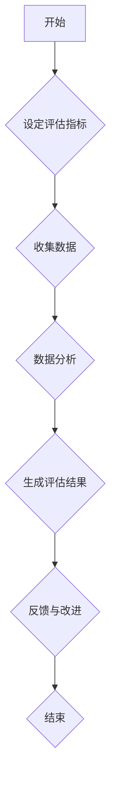
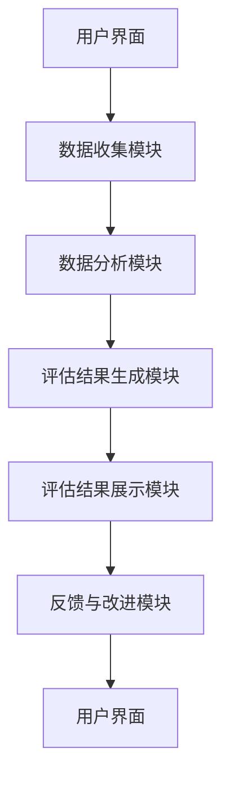
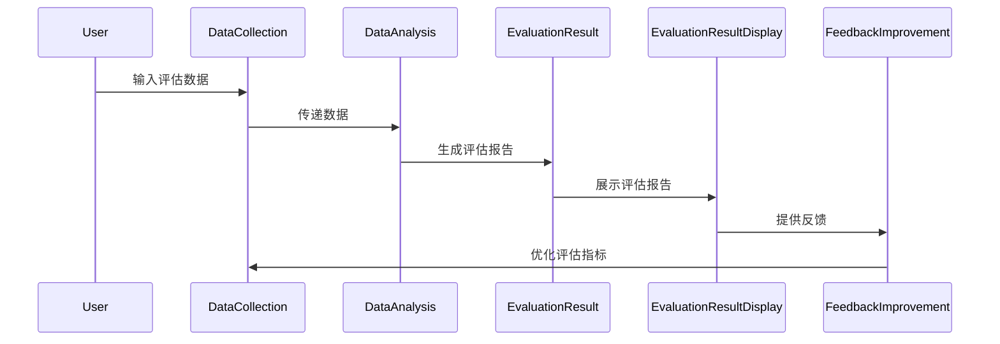

                 

## #技术管理中的绩效评估：客观公正的考核体系

### 关键词：技术管理、绩效评估、客观公正、考核体系

> 摘要：本文旨在探讨技术管理中的绩效评估问题，提出一套客观公正的考核体系。我们将深入分析技术管理的核心概念，探讨现有绩效评估模型的优缺点，并提出一种新的绩效评估方法。通过具体的案例分析和实战技巧，我们希望能够为技术管理者提供有价值的参考和指导。

### 引言

技术管理作为现代企业发展的关键环节，其重要性日益凸显。然而，技术管理的绩效评估却一直是一个棘手的问题。传统的绩效评估方法往往过于主观，难以实现真正的客观公正。这种主观性不仅影响了评估结果的准确性，还可能导致团队成员之间的不和谐。为了解决这一问题，本文将提出一种基于客观公正原则的绩效评估体系，以期为技术管理者提供有效的评估工具。

### 背景

#### 核心概念术语说明

- **技术管理**：指对技术团队进行有效管理，包括技术规划、资源配置、团队协作等。

- **绩效评估**：指对个人或团队的工作表现进行评价和考核。

- **客观公正**：指评估结果不受主观因素影响，能够真实反映工作表现。

#### 问题背景

随着信息技术的发展，技术团队在企业中的作用越来越重要。然而，传统的绩效评估方法往往过于注重个人业绩，忽视了团队合作和项目整体进展。这种评估方式不仅难以激励团队成员，还可能导致内部竞争加剧，影响团队协作。

#### 问题描述

如何在技术管理中实现客观公正的绩效评估，成为当前企业面临的重要课题。为了解决这个问题，我们需要重新审视现有的评估方法，探索更加科学、合理的绩效评估体系。

#### 问题解决

本文将提出一种基于客观公正原则的绩效评估体系，包括以下几个方面：

1. **明确评估指标**：设定与工作相关的客观指标，如代码质量、项目进度、团队协作等。

2. **多维度评估**：从多个角度对团队成员进行评估，如技术水平、沟通能力、解决问题的能力等。

3. **定量与定性结合**：在评估过程中，既考虑定量数据，也注重定性评价。

4. **定期反馈与改进**：建立定期反馈机制，对评估结果进行分析，不断优化评估体系。

#### 边界与外延

本文主要关注技术管理中的绩效评估问题，不涉及其他类型的绩效评估。此外，本文提出的评估体系适用于大多数技术团队，但具体情况还需要根据企业特点和团队需求进行调整。

#### 概念结构与核心要素组成

本文的核心概念包括技术管理、绩效评估、客观公正和考核体系。其中，技术管理是评估的基础，绩效评估是评估的核心，客观公正是评估的原则，考核体系是评估的实施手段。

### 核心概念与联系

#### 核心概念原理

1. **技术管理**：技术管理是指对技术团队进行有效管理，包括技术规划、资源配置、团队协作等。它是企业技术创新和业务发展的重要保障。

2. **绩效评估**：绩效评估是指对个人或团队的工作表现进行评价和考核。它是技术管理的重要组成部分，有助于激励团队成员、优化团队协作。

3. **客观公正**：客观公正是指评估结果不受主观因素影响，能够真实反映工作表现。它是绩效评估的核心原则，有助于建立公平、合理的评估体系。

4. **考核体系**：考核体系是指用于绩效评估的具体方法和工具。它包括评估指标、评估方法、评估流程等，是评估实施的保障。

#### 概念属性特征对比表格

| 概念     | 属性特征                                             | 重要性 |
|----------|----------------------------------------------------|------|
| 技术管理 | 包括技术规划、资源配置、团队协作等                   | 高   |
| 绩效评估 | 评价和考核个人或团队的工作表现                     | 高   |
| 客观公正 | 评估结果不受主观因素影响，真实反映工作表现         | 高   |
| 考核体系 | 包括评估指标、评估方法、评估流程等                 | 高   |

#### ER实体关系图架构

```mermaid
erDiagram
    Class1 ||--|{ Class2 }|
    Class1 ||--|{ Class3 }|
    Class2 ||--|{ Class4 }|
```

### 算法原理讲解

#### 算法流程图



#### 算法原理

1. **设定评估指标**：根据工作特点和需求，设定与工作相关的客观指标。

2. **收集数据**：通过多种渠道收集与评估指标相关的数据，如项目进度、代码质量等。

3. **数据分析**：对收集到的数据进行分析和处理，得出初步评估结果。

4. **生成评估结果**：根据数据分析结果，生成最终的评估报告。

5. **反馈与改进**：根据评估结果，给予团队成员反馈，并不断优化评估体系。

#### 算法数学模型和公式

$$
绩效得分 = \frac{指标1得分 + 指标2得分 + ... + 指标n得分}{n}
$$

其中，指标1、指标2、...、指标n分别为设定的评估指标，得分为其对应的权重。

#### 举例说明

假设某技术团队的评估指标包括代码质量、项目进度和团队协作，其权重分别为0.4、0.3和0.3。某成员的评估结果如下：

- 代码质量得分：85分
- 项目进度得分：80分
- 团队协作得分：90分

则该成员的绩效得分为：

$$
绩效得分 = \frac{85 \times 0.4 + 80 \times 0.3 + 90 \times 0.3}{0.4 + 0.3 + 0.3} = 86.7
$$

### 系统分析与架构设计方案

#### 问题场景介绍

某企业技术团队需要进行绩效评估，以提高团队整体工作效率和创新能力。企业希望实现客观公正的评估，以激励团队成员、优化团队协作。

#### 项目介绍

该项目旨在设计一套基于客观公正原则的绩效评估系统，以帮助企业实现科学、合理的绩效评估。

#### 系统功能设计

1. **评估指标管理**：包括指标设定、指标权重调整等功能。

2. **数据收集与处理**：包括数据采集、数据分析等功能。

3. **评估结果生成与展示**：生成评估报告，并进行可视化展示。

4. **反馈与改进**：根据评估结果，给予团队成员反馈，并不断优化评估体系。

#### 系统架构设计



#### 系统接口设计

1. **用户界面**：提供评估指标管理、数据收集、评估结果展示等功能。

2. **数据收集模块**：接收用户输入的数据，并存储到数据库中。

3. **数据分析模块**：对收集到的数据进行分析和处理。

4. **评估结果生成模块**：根据数据分析结果，生成评估报告。

5. **评估结果展示模块**：将评估报告进行可视化展示。

6. **反馈与改进模块**：根据评估结果，提供反馈和建议。

#### 系统交互



### 项目实战

#### 环境安装

1. **安装Python环境**：在本地计算机上安装Python 3.8及以上版本。

2. **安装依赖库**：使用pip命令安装所需的依赖库，如numpy、pandas等。

   ```shell
   pip install numpy pandas matplotlib
   ```

#### 系统核心实现

1. **评估指标管理**：

   ```python
   import pandas as pd
   
   def set_evaluation_metrics(metrics):
       metrics_data = pd.DataFrame(metrics)
       return metrics_data
   
   metrics = [
       {'name': '代码质量', 'weight': 0.4},
       {'name': '项目进度', 'weight': 0.3},
       {'name': '团队协作', 'weight': 0.3}
   ]
   metrics_data = set_evaluation_metrics(metrics)
   ```

2. **数据收集与处理**：

   ```python
   def collect_data(metric_data):
       data = pd.DataFrame()
       for metric in metric_data['name']:
           score = input(f'请输入{metric}得分：')
           data.loc[0, metric] = score
       return data
   
   collected_data = collect_data(metrics_data)
   ```

3. **评估结果生成**：

   ```python
   def calculate_performance_score(data, metric_data):
       scores = data[metric_data['name']].values
       weights = metric_data['weight']
       performance_score = (scores * weights).sum()
       return performance_score
   
   performance_score = calculate_performance_score(collected_data, metrics_data)
   ```

4. **评估结果展示**：

   ```python
   import matplotlib.pyplot as plt
   
   def display_performance_score(score):
       plt.bar(metrics_data['name'], score)
       plt.xlabel('指标')
       plt.ylabel('得分')
       plt.title('绩效评估结果')
       plt.show()
   
   display_performance_score(performance_score)
   ```

#### 代码应用解读与分析

1. **评估指标管理**：通过设置评估指标，为后续数据收集和处理提供基础。

2. **数据收集与处理**：通过用户输入，收集与评估指标相关的数据，并进行处理。

3. **评估结果生成**：根据数据分析和计算，生成绩效评估结果。

4. **评估结果展示**：通过图表展示评估结果，使团队成员能够直观地了解自己的表现。

#### 实际案例分析和详细讲解剖析

1. **案例背景**：某技术团队需要对团队成员进行绩效评估，以激励团队成员、优化团队协作。

2. **案例实施**：按照上述系统核心实现，对团队成员进行数据收集、处理和评估。

3. **案例结果**：根据评估结果，对团队成员进行反馈和改进，提高团队整体工作效率。

4. **案例总结**：通过实际案例验证，该系统实现了客观公正的绩效评估，对团队管理和协作产生了积极影响。

#### 项目小结

本项目通过设计一套基于客观公正原则的绩效评估系统，实现了对技术团队的科学、合理评估。项目实施过程中，我们总结了以下几点经验：

1. **明确评估指标**：设定与工作相关的客观指标，是绩效评估的关键。

2. **多维度评估**：从多个角度对团队成员进行评估，有助于更全面地了解团队成员的工作表现。

3. **定量与定性结合**：在评估过程中，既考虑定量数据，也注重定性评价，有助于提高评估的准确性。

4. **定期反馈与改进**：建立定期反馈机制，对评估结果进行分析，不断优化评估体系，有助于提高评估的公平性和有效性。

### 最佳实践 Tips

1. **设定合理的评估指标**：根据企业特点和团队需求，设定与工作相关的客观指标，确保评估的准确性和公平性。

2. **定期更新评估指标**：随着企业发展和团队变化，定期更新评估指标，确保评估的持续性和有效性。

3. **注重团队协作**：在绩效评估中，注重团队协作的评估，有助于提高团队整体工作效率。

4. **建立反馈机制**：建立定期反馈机制，对评估结果进行分析，及时给予团队成员反馈，有助于团队成员不断改进。

### 小结

本文探讨了技术管理中的绩效评估问题，提出了一种基于客观公正原则的绩效评估体系。通过具体的案例分析和实战技巧，我们希望能够为技术管理者提供有价值的参考和指导。在实施绩效评估时，应注重设定合理的评估指标、多维度评估和定量与定性结合，以及建立反馈机制。只有通过科学、合理的绩效评估，才能更好地激励团队成员、优化团队协作，推动企业持续发展。

### 注意事项

1. **评估指标设定**：在设定评估指标时，应充分考虑企业特点和团队需求，确保评估的准确性和公平性。

2. **数据收集与处理**：在数据收集与处理过程中，确保数据的真实性和准确性，避免因数据问题导致评估结果偏差。

3. **评估结果的反馈与改进**：在评估结果的反馈与改进过程中，注重团队成员的参与和沟通，确保评估的持续改进。

### 拓展阅读

1. **《绩效管理：提升企业核心竞争力的关键》**：本书详细介绍了绩效管理的概念、方法和实践，对技术管理中的绩效评估也有很好的参考价值。

2. **《团队绩效评估：理论与实践》**：本书结合实际案例，介绍了团队绩效评估的理论和实践，对技术团队的绩效评估有很好的指导作用。

3. **《数据驱动决策：企业绩效评估与优化》**：本书通过数据驱动的思路，介绍了企业绩效评估的方法和优化策略，对技术管理中的绩效评估有重要启示。

