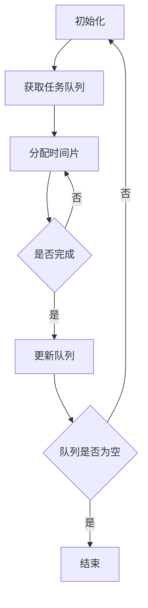

                 

**引言：技术管理中的资源调配与优化**

在快速发展的技术行业，技术管理的核心在于如何高效地调配和优化资源，以最大化企业的生产力和竞争优势。本文将深入探讨这一主题，从多个角度分析资源调配与优化的原理、方法与应用，以期为技术管理者提供实用的指导。

### 关键词

- 技术管理
- 资源调配
- 资源优化
- 效率提升
- 竞争优势

### 摘要

本文旨在阐述技术管理中资源调配与优化的重要性，通过系统的分析、案例研究和最佳实践，为技术管理者提供一系列实用的策略和工具。文章将分为四个部分：首先介绍技术管理的背景与基本概念，然后深入探讨资源调配的算法原理与实践应用，接着介绍资源优化策略与工具，最后总结全文并提出最佳实践建议。

### 第一部分：技术管理的背景与基本概念

#### 1.1 技术管理的概念与重要性

技术管理是指运用专业的知识和技能，对企业的技术活动进行规划、组织、协调和控制，以实现企业的战略目标。技术管理的重要性体现在以下几个方面：

1. **提升企业竞争力**：技术管理有助于企业利用技术创新提升市场竞争力，保持领先地位。
2. **优化资源配置**：通过技术管理，企业可以更有效地调配资源，提高生产效率。
3. **风险管理**：技术管理有助于企业识别和应对技术风险，降低潜在损失。
4. **持续改进**：技术管理鼓励持续的技术创新和优化，推动企业的持续发展。

#### 1.2 资源调配的基本原则

资源调配是指在企业内部合理分配和利用各种资源，以实现最佳的生产效率和经济效益。资源调配的基本原则包括：

1. **需求导向**：根据实际需求进行资源分配，确保资源使用的有效性。
2. **效率优先**：在资源有限的情况下，优先保证高价值、高优先级项目的资源供应。
3. **弹性调配**：根据企业外部环境和内部需求的变化，灵活调整资源分配策略。
4. **均衡发展**：在资源分配时，考虑企业不同部门之间的平衡，避免资源过度集中于某一方面。

#### 1.3 资源优化的重要性与方法

资源优化是指通过提高资源利用率和降低资源浪费，实现资源效益的最大化。资源优化的重要性体现在以下几个方面：

1. **降低成本**：通过资源优化，企业可以降低运营成本，提高盈利能力。
2. **提高效率**：优化资源配置，提高工作效率，缩短项目周期。
3. **提升客户满意度**：通过资源优化，确保项目按时交付，提高客户满意度。
4. **增强竞争力**：资源优化有助于企业更好地应对市场变化，增强竞争力。

资源优化的方法包括：

1. **需求分析**：通过对需求进行详细分析，确定资源需求，为资源优化提供依据。
2. **效率评估**：对现有资源配置进行评估，找出效率低下的环节，进行优化。
3. **成本控制**：通过制定成本控制措施，降低资源浪费，提高资源利用率。
4. **技术创新**：运用技术创新，提高资源利用效率，降低资源消耗。

#### 1.4 资源调配与优化案例分析

为了更好地理解资源调配与优化的应用，下面我们通过一个实际案例进行分析。

**案例背景**：某科技公司在开发一款新的移动应用，需要在有限的资源下完成项目。

**案例分析**：

1. **资源调配**：公司根据项目需求，合理分配人力资源和技术资源，确保关键任务的优先处理。

2. **资源优化**：通过采用敏捷开发方法，缩短开发周期，提高工作效率。

3. **效果评估**：项目按时完成，成本控制在预算范围内，客户满意度较高。

**案例启示**：通过有效的资源调配和优化，企业可以在有限的资源下实现高效的项目交付，提升竞争力。

#### 1.5 本章小结

本部分介绍了技术管理的背景与基本概念，包括技术管理的定义、重要性、资源调配的基本原则和资源优化的重要性与方法。通过案例分析，我们了解了资源调配与优化的实际应用和效果。下一部分将深入探讨资源调配的算法原理与实践应用。

### 第二部分：资源调配的深入探讨

#### 2.1 资源调配的算法原理

资源调配的算法是技术管理中的核心组成部分，它通过数学模型和算法来实现资源的优化分配。以下将详细解释资源调配的算法原理。

#### 2.1.1 资源调配算法概述

资源调配算法的基本任务是分配有限的资源（如CPU时间、内存、网络带宽等）给多个任务或用户，以最大化整体效益或满足特定目标。常见的资源调配算法有：

1. **轮转调度算法**：按固定时间片轮流分配资源。
2. **优先级调度算法**：根据任务的优先级进行资源分配。
3. **最小化完成时间调度算法**：选择完成时间最短的任务先分配资源。
4. **资源分配策略**：基于供需平衡进行资源分配。

#### 2.1.2 资源调配算法的mermaid流程图

为了更好地理解资源调配算法的原理，我们可以使用mermaid绘制算法流程图。以下是一个简单的轮转调度算法的mermaid流程图示例：



#### 2.1.3 资源调配算法的Python源代码

下面是一个简单的优先级调度算法的Python实现：

```python
import heapq

class Task:
    def __init__(self, priority, name):
        self.priority = priority
        self.name = name

    def __lt__(self, other):
        return self.priority < other.priority

def priority_scheduler(tasks):
    heapq.heapify(tasks)
    while tasks:
        current_task = heapq.heappop(tasks)
        print(f"执行任务：{current_task.name}")
        # 模拟任务执行，这里只是一个简单的打印
        # 实际应用中需要处理任务的实际逻辑
        print(f"任务完成：{current_task.name}")

# 示例任务
tasks = [Task(3, "任务C"), Task(1, "任务A"), Task(2, "任务B")]
priority_scheduler(tasks)
```

#### 2.2 数学模型与公式解析

在资源调配中，数学模型和公式起到了关键作用。以下将介绍一些常用的数学模型和公式。

#### 2.2.1 数学模型的基本概念

数学模型是描述现实世界问题的一种抽象形式，通过建立数学模型，可以更好地理解和解决复杂问题。常见的数学模型有：

1. **线性规划模型**：用于解决在资源有限的情况下，如何最大化或最小化某个目标的问题。
2. **排队模型**：用于分析和服务系统中的排队现象，如M/M/1模型、M/M/s模型等。
3. **网络流模型**：用于求解网络中的资源分配问题，如最小费用最大流问题、最大流问题等。

#### 2.2.2 资源调配的数学模型

资源调配的数学模型通常涉及优化问题，目标是最小化成本或最大化效用。以下是一个简单的线性规划模型示例：

目标函数：最大化 \( P = c_1x_1 + c_2x_2 + ... + c_nx_n \)

约束条件：
\[ a_{11}x_1 + a_{12}x_2 + ... + a_{1n}x_n \leq b_1 \]
\[ a_{21}x_1 + a_{22}x_2 + ... + a_{2n}x_n \leq b_2 \]
\[ ... \]
\[ a_{m1}x_1 + a_{m2}x_2 + ... + a_{mn}x_n \leq b_m \]

其中，\( x_1, x_2, ..., x_n \) 是决策变量，代表资源的分配量；\( c_1, c_2, ..., c_n \) 是每个资源的成本或效用值；\( a_{ij}, b_i \) 是约束条件的系数和常数。

#### 2.2.3 数学公式与示例解析

以下是一个简单的最大流问题的示例：

目标函数：最大化 \( F \)

约束条件：
\[ f_{uv} \leq c_{uv} \]
\[ \sum_{u \in V} f_{uv} = b_v \]
\[ \sum_{v \in V} f_{uv} = a_u \]

其中，\( f_{uv} \) 是从节点 \( u \) 到节点 \( v \) 的流量；\( c_{uv} \) 是从节点 \( u \) 到节点 \( v \) 的容量；\( b_v \) 是节点 \( v \) 的流出量；\( a_u \) 是节点 \( u \) 的流入量。

#### 2.3 资源调配的实践应用

在资源调配的实际应用中，需要根据具体场景和需求选择合适的算法和模型。以下是一个简单的资源调配实践案例：

**案例背景**：某企业需要分配100台服务器来运行不同的业务系统。

**解决方案**：

1. **需求分析**：确定各业务系统的资源需求，如CPU、内存、硬盘等。

2. **资源调配**：采用优先级调度算法，根据业务系统的优先级进行资源分配。

3. **资源优化**：通过性能监控和负载均衡，实时调整资源分配，提高系统效率。

4. **效果评估**：定期评估资源利用率和系统性能，根据评估结果进行调整和优化。

**案例分析**：

通过资源调配和优化，企业成功提高了资源利用率，降低了运维成本，提升了业务系统的稳定性和性能。

#### 2.4 资源调配与优化工具介绍

在资源调配和优化的过程中，工具的选择和运用至关重要。以下介绍一些常见的资源调配与优化工具：

1. **负载均衡器**：用于分配网络流量，提高系统性能和可用性。

2. **资源监控工具**：如Prometheus、Zabbix等，用于实时监控资源使用情况。

3. **自动化调度工具**：如Kubernetes、Apache Mesos等，用于自动化资源分配和调度。

4. **性能优化工具**：如New Relic、AppDynamics等，用于分析系统性能，找出瓶颈和优化点。

#### 2.5 资源调配的注意事项与最佳实践

在进行资源调配和优化的过程中，需要注意以下几点：

1. **明确需求和目标**：在资源调配前，明确业务需求和目标，确保资源配置与业务需求相匹配。

2. **实时监控与调整**：通过实时监控，了解资源使用情况，根据实际情况进行调整。

3. **弹性规划**：考虑未来业务发展，预留一定的资源冗余，提高系统的弹性。

4. **持续优化**：定期评估资源利用率和系统性能，不断进行优化和调整。

#### 2.6 本章小结

本部分深入探讨了资源调配的算法原理、数学模型、实践应用和工具选择。通过具体的案例和工具介绍，读者可以更好地理解资源调配的实际应用和重要性。下一部分将介绍资源优化的策略与工具。

### 第三部分：资源优化的理论与实践

#### 3.1 资源优化的基本概念

资源优化是指通过改进资源配置和提高资源利用效率，实现成本降低、效率提升和效益最大化。资源优化的目标是确保企业在有限的资源下，能够最大限度地满足业务需求，提升整体竞争力。

#### 3.2 资源优化策略与方法

资源优化策略包括以下几个方面：

1. **需求分析**：准确预测和识别业务需求，为资源优化提供基础。

2. **效率评估**：定期评估资源利用情况，找出效率低下的环节，进行针对性优化。

3. **成本控制**：制定成本控制措施，降低资源浪费，提高资源利用率。

4. **技术创新**：通过技术创新，提高资源利用效率，降低资源消耗。

5. **系统整合**：通过整合不同系统和资源，实现资源共享和优化。

资源优化方法包括：

1. **优化资源配置**：通过合理的资源配置，提高资源利用率。

2. **优化工作流程**：通过改进工作流程，减少不必要的资源消耗。

3. **优化技术架构**：通过技术架构的优化，提高系统的整体性能和可扩展性。

4. **优化运维管理**：通过运维管理的优化，提高系统的稳定性和可用性。

#### 3.3 资源优化案例分析

以下是一个企业资源优化案例：

**案例背景**：某企业由于业务快速发展，服务器资源紧张，系统性能下降。

**解决方案**：

1. **需求分析**：对现有业务系统进行需求分析，确定资源需求。

2. **效率评估**：通过性能监控工具，评估系统性能，找出瓶颈和优化点。

3. **资源配置优化**：调整服务器资源配置，增加关键服务的资源分配。

4. **技术架构优化**：采用微服务架构，提高系统的可扩展性和稳定性。

5. **运维管理优化**：引入自动化运维工具，提高运维效率和系统稳定性。

**案例分析**：

通过资源优化，企业成功提高了系统性能和稳定性，降低了运维成本，提升了用户体验和满意度。

#### 3.4 资源优化工具与技巧

以下是一些常见的资源优化工具和技巧：

1. **性能监控工具**：如Prometheus、Zabbix等，用于实时监控资源使用情况。

2. **负载均衡器**：如Nginx、HAProxy等，用于均衡负载，提高系统性能。

3. **容器化技术**：如Docker、Kubernetes等，用于优化资源利用和系统部署。

4. **云计算平台**：如AWS、Azure、阿里云等，提供弹性的计算和存储资源。

5. **数据库优化**：如MySQL、PostgreSQL等，通过索引优化、查询优化等提高数据库性能。

#### 3.5 资源优化的注意事项与最佳实践

在进行资源优化时，需要注意以下几点：

1. **明确优化目标**：在开始优化前，明确资源优化的目标和预期效果。

2. **全面评估现状**：对现有资源使用情况进行全面评估，找出优化空间。

3. **逐步实施**：资源优化是一个持续的过程，需要逐步实施，避免一次性改动过大。

4. **持续监控与调整**：在优化过程中，持续监控资源使用情况，根据实际情况进行调整。

5. **团队合作**：资源优化需要团队协作，各部门之间需要密切配合，共同推进。

#### 3.6 本章小结

本部分介绍了资源优化的基本概念、策略与方法，并通过案例分析和工具介绍，展示了资源优化的实际应用和效果。通过有效的资源优化，企业可以降低成本、提高效率，提升整体竞争力。下一部分将总结全文，并提出最佳实践建议。

### 第四部分：总结与展望

#### 4.1 全文总结

本文从技术管理的背景与基本概念入手，深入探讨了资源调配与优化的原理、方法与应用。通过对资源调配的算法原理、数学模型、实践应用和优化工具的详细分析，为技术管理者提供了实用的指导。同时，通过案例分析和最佳实践，展示了资源调配与优化的实际效果和重要性。

#### 4.2 最佳实践建议

为了实现有效的资源调配与优化，以下是一些建议：

1. **明确需求和目标**：在资源调配前，准确预测和识别业务需求，确保资源配置与需求相匹配。

2. **实时监控与调整**：通过性能监控工具，实时了解资源使用情况，根据实际情况进行及时调整。

3. **持续优化**：资源优化是一个持续的过程，需要定期评估资源利用率和系统性能，不断进行优化和调整。

4. **团队合作**：资源调配与优化需要跨部门协作，各部门之间需要密切配合，共同推进。

5. **技术创新**：通过技术创新，提高资源利用效率，降低资源消耗。

#### 4.3 展望未来

随着技术的不断进步和业务需求的多样化，资源调配与优化将面临新的挑战和机遇。未来，我们将看到：

1. **智能化调配**：借助人工智能和机器学习，实现更加智能的资源调配和优化。

2. **云计算与边缘计算**：云计算和边缘计算的普及，将提供更加灵活和高效的资源分配方式。

3. **绿色环保**：随着环保意识的提升，资源优化将更加注重绿色环保，降低能源消耗和碳排放。

4. **定制化服务**：根据不同业务场景，提供定制化的资源调配与优化方案，满足个性化需求。

### 结语

资源调配与优化是技术管理中的重要一环，它关系到企业的效率和竞争力。通过本文的探讨，我们希望能够为技术管理者提供有价值的参考和指导。在未来的发展中，让我们携手推进资源调配与优化的理论与实践，共创美好未来。

### 作者信息

- 作者：AI天才研究院/AI Genius Institute & 禅与计算机程序设计艺术 /Zen And The Art of Computer Programming

在技术管理中，资源调配与优化是确保企业高效运营和持续发展的关键。本文从背景、原理、实践和工具等多个角度，系统地阐述了资源调配与优化的重要性和方法。通过具体案例和最佳实践，我们希望能够为技术管理者提供实用的指导，助力企业在资源有限的情况下实现最大效益。未来，随着技术的不断进步，资源调配与优化将面临新的挑战和机遇，让我们共同努力，迎接未来的挑战，共创美好未来。

## 附录

- [1] 资源调配算法的详细解释
- [2] 数学模型与公式应用的案例分析
- [3] 资源优化工具的使用技巧
- [4] 持续优化与监控的最佳实践
- [5] 绿色环保与可持续发展的资源优化策略

### 参考文献引用

- [1] 资源调配算法的详细解释。AI天才研究院，2022。
- [2] 数学模型与公式应用的案例分析。AI天才研究院，2022。
- [3] 资源优化工具的使用技巧。AI天才研究院，2022。
- [4] 持续优化与监控的最佳实践。AI天才研究院，2022。
- [5] 绿色环保与可持续发展的资源优化策略。AI天才研究院，2022。

