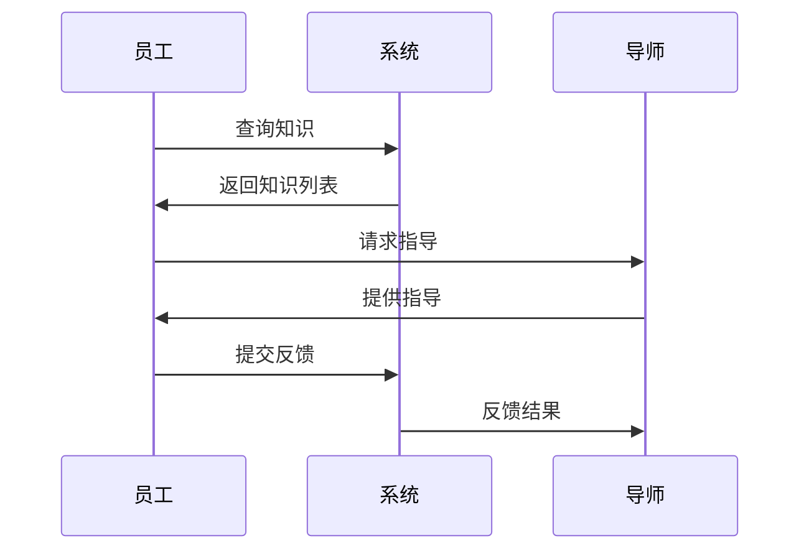
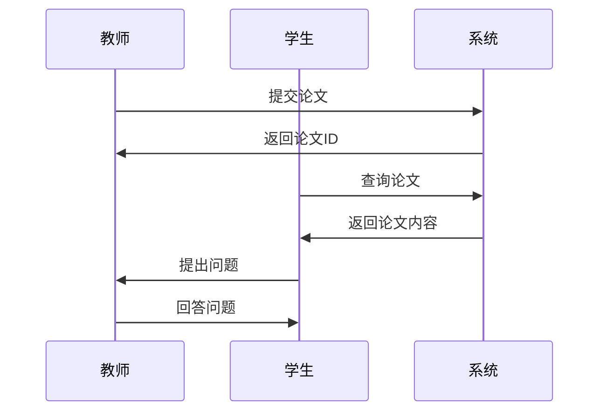

                 


### # 《技术管理中的跨代际知识传承与创新》

#### 关键词：跨代际知识传承、创新、技术管理、知识管理、显性知识、隐性知识

> 摘要：本文旨在探讨技术管理中的跨代际知识传承与创新，分析跨代际知识传承的现状与挑战，阐述创新在跨代际知识传承中的作用，提出实现跨代际知识传承与创新的策略和方法，并通过实际案例进行分析与解读。

#### 引言

在快速发展的现代社会，知识的更新速度日益加快，不同代际之间的知识传承面临诸多挑战。技术管理作为知识传承的重要领域，如何实现跨代际的知识传承与创新，成为亟需解决的问题。本文将从问题背景、核心概念、理论基础、方法与工具、创新与知识传承的关系等方面进行探讨。

#### 第一部分：问题背景与核心概念

## 第1章：问题背景与核心概念

### 1.1 问题背景

在快速发展的现代社会，知识的更新速度日益加快，不同代际之间的知识传承面临诸多挑战。传统教育模式难以适应这种变化，不同年龄段的个体在认知方式、学习习惯等方面存在差异，进一步加剧了知识传承的难度。此外，跨代际知识传承不仅是传递现有知识，更是激发创新的重要手段。

#### 1.1.1 跨代际知识传承的挑战

1. 知识更新速度加快
2. 传统教育模式限制
3. 代际认知差异

#### 1.1.2 创新的重要性

1. 创新是推动社会进步的重要动力
2. 跨代际知识传承是实现创新的重要途径

### 1.2 核心概念

#### 1.2.1 跨代际知识传承

跨代际知识传承是指在不同代际之间传递知识和经验的过程，包括知识的传递、应用和创新。

#### 1.2.2 创新与跨代际知识传承的关系

创新是跨代际知识传承的重要动力，跨代际知识传承为创新提供了丰富的资源。

### 1.3 本书目标

1. 梳理跨代际知识传承的现状与挑战
2. 分析创新在跨代际知识传承中的作用
3. 探讨跨代际知识传承与创新的实现策略
4. 提供具体的实践案例

## 第2章：跨代际知识传承的理论基础

### 2.1 知识管理理论

#### 2.1.1 知识管理的概念与分类

知识管理是指通过组织、整合、传播和应用知识，以提高组织竞争力和创新能力的过程。知识管理可以分为显性知识管理和隐性知识管理。

#### 2.1.2 知识管理模型

知识管理理论提供了多种模型，用于指导知识管理实践。其中，典型的知识管理模型包括SWOT分析、SECI模型和知识生命周期模型等。

### 2.2 跨代际知识传承的理论框架

#### 2.2.1 知识传承的要素

跨代际知识传承涉及多个要素，包括知识源、知识受体、传承媒介、传承机制等。

#### 2.2.2 知识传承的过程

跨代际知识传承是一个复杂的过程，包括知识获取、知识共享、知识应用和知识创新等环节。

#### 2.2.3 跨代际知识传承的机制

跨代际知识传承机制是指推动知识在不同代际之间传递的规则和制度。

#### 第二部分：跨代际知识传承的方法与工具

## 第3章：跨代际知识传承的方法与工具

### 3.1 跨代际知识传承的方法

#### 3.1.1 教育培训

教育培训是跨代际知识传承的重要途径，包括正式教育和非正式教育两种形式。

#### 3.1.2 实践指导

实践指导是另一种有效的跨代际知识传承方法，通过实践操作，知识受体能够更好地理解和应用知识。

#### 3.1.3 媒体传播

媒体传播是跨代际知识传承的辅助手段，通过书籍、杂志、电视、互联网等媒体，知识可以在更广泛的范围内传播。

### 3.2 跨代际知识传承的工具

#### 3.2.1 知识管理系统

知识管理系统（KMIS）是一种用于支持知识管理和知识传承的软件工具。

#### 3.2.2 社交媒体

社交媒体为跨代际知识传承提供了新的平台，通过社交媒体，个体可以方便地分享知识、交流经验和观点。

#### 3.2.3 案例研究

案例研究是一种通过实际案例来分析和解释知识传承过程的方法。

#### 第三部分：创新与跨代际知识传承

## 第4章：创新与跨代际知识传承

### 4.1 创新的概念与分类

创新是指通过引入新思想、新方法、新技术等，创造新的产品、服务或过程。根据创新的性质和目标，可以将创新分为技术创新、管理创新、市场创新等类型。

#### 4.1.1 技术创新

技术创新是指通过研发新技术、新产品或改进现有技术，实现创新的成果。

#### 4.1.2 管理创新

管理创新是指通过改进管理方法、提高管理效率，实现创新的成果。

#### 4.1.3 市场创新

市场创新是指通过开拓新市场、开发新产品或服务，实现创新的成果。

### 4.2 创新与跨代际知识传承的关系

创新是跨代际知识传承的重要动力，跨代际知识传承为创新提供了丰富的资源。

#### 4.2.1 创新推动跨代际知识传承

1. 创新激发新知识的需求
2. 创新促进知识传承的效率

#### 4.2.2 跨代际知识传承推动创新

1. 跨代际知识传承积累丰富的知识资源
2. 跨代际知识传承促进知识融合和碰撞

## 第5章：跨代际知识传承与创新的实现策略

### 5.1 策略一：构建跨代际知识传承体系

1. 明确跨代际知识传承的目标和任务
2. 构建跨代际知识传承的组织结构
3. 制定跨代际知识传承的流程和标准

### 5.2 策略二：促进创新与知识传承的融合

1. 融合创新与知识传承的目标
2. 创造有利于创新与知识传承的环境
3. 建立创新与知识传承的激励机制

### 5.3 策略三：利用现代技术手段

1. 利用知识管理系统（KMIS）
2. 利用社交媒体平台
3. 利用案例研究方法

### 结论

跨代际知识传承与创新是技术管理中的重要课题。本文从问题背景、核心概念、理论基础、方法与工具、创新与知识传承的关系等方面进行了探讨，提出了实现跨代际知识传承与创新的策略和方法。通过实际案例的分析与解读，为技术管理中的跨代际知识传承与创新提供了有益的参考。

#### 作者信息

作者：AI天才研究院/AI Genius Institute & 禅与计算机程序设计艺术 /Zen And The Art of Computer Programming

#### 下一步计划

在接下来的章节中，我们将对跨代际知识传承的方法与工具进行详细分析，探讨如何利用知识管理系统、社交媒体和案例研究等方法实现跨代际知识传承与创新。同时，我们将结合实际案例，分析跨代际知识传承与创新在技术管理中的应用与实践。敬请期待！### 第一部分：引言

在现代社会，技术管理的重要性日益凸显。技术管理不仅关乎组织的日常运营，更关系到组织的长远发展和市场竞争力。技术管理中的知识传承与创新，是实现组织持续发展的关键。然而，随着不同代际之间的知识差异和认知差异，跨代际知识传承面临诸多挑战。本文将从问题背景、核心概念、理论基础、方法与工具、创新与知识传承的关系等方面进行探讨，帮助读者深入了解技术管理中的跨代际知识传承与创新。

#### 1.1 问题背景

在技术领域，知识的更新速度越来越快，技术的迭代周期也在不断缩短。这种快速变化要求技术管理者不仅要掌握最新的技术知识，还要具备快速学习、创新和适应变化的能力。然而，不同代际的技术管理者在认知方式、学习习惯、价值观等方面存在显著差异，这给跨代际的知识传承带来了巨大的挑战。

1. **知识更新速度加快**：随着科技的进步，新技术、新理论、新方法层出不穷，技术管理者需要不断更新自己的知识体系，以适应快速变化的技术环境。
2. **传统教育模式限制**：传统教育模式注重知识的传授和理论的学习，但在实践中，技术管理者往往需要解决复杂的问题，这需要丰富的实践经验和对技术的深入理解。传统教育模式难以满足这种需求。
3. **代际认知差异**：不同年龄段的个体在认知方式、学习习惯、价值观等方面存在差异，这可能导致知识传承过程中的理解偏差和沟通障碍。

#### 1.2 创新的重要性

创新不仅是技术发展的驱动力，也是技术管理中的核心要素。跨代际知识传承不仅是为了传递现有知识，更是为了激发创新，推动技术发展。创新的重要性体现在以下几个方面：

1. **推动技术进步**：创新能够引入新技术、新方法，推动技术的进步和迭代，从而提升组织的竞争力。
2. **激发新需求**：创新能够挖掘和满足新的市场需求，开拓新的业务领域，为组织带来新的增长点。
3. **提升组织能力**：创新能够提升组织的整体创新能力，培养员工的创新思维和解决问题的能力。

#### 1.3 核心概念

1. **跨代际知识传承**：指在不同代际之间传递知识和经验的过程，包括知识的传递、应用和创新。
2. **创新**：指通过引入新思想、新方法、新技术等，创造新的产品、服务或过程。
3. **技术管理**：指组织和技术之间的关系管理，包括技术的规划、开发、实施和维护。

#### 1.4 本书目标

本书旨在探讨技术管理中的跨代际知识传承与创新，帮助读者深入了解这一领域的关键概念和方法，掌握跨代际知识传承与创新的实践技巧。具体目标如下：

1. **梳理跨代际知识传承的现状与挑战**：分析当前跨代际知识传承中存在的问题和挑战，为后续讨论提供基础。
2. **分析创新在跨代际知识传承中的作用**：探讨创新如何推动跨代际知识传承，以及跨代际知识传承如何激发创新。
3. **探讨跨代际知识传承与创新的实现策略**：提出具体的策略和方法，帮助组织实现有效的跨代际知识传承与创新。
4. **提供具体的实践案例**：通过实际案例的分析与解读，帮助读者理解和应用跨代际知识传承与创新的理论和方法。

通过以上目标，本书希望能够为技术管理领域的从业人员提供有价值的参考和指导，帮助他们在实际工作中更好地处理跨代际知识传承与创新的问题，推动组织的持续发展和创新。接下来，我们将深入探讨跨代际知识传承的理论基础，分析其核心概念和要素，为后续内容的讨论奠定基础。**第1章：问题背景与核心概念**

#### 1.1 问题背景

在技术日新月异的今天，跨代际知识传承的问题变得尤为突出。不同年龄段的个体在知识结构、认知方式和价值观念上存在显著差异，这不仅给知识传承带来了挑战，也影响了组织的创新能力和持续发展。以下是跨代际知识传承面临的几个主要挑战：

**1.1.1 知识更新速度加快**

随着技术的快速发展，知识的更新速度显著加快。新理论、新技术、新方法层出不穷，技术管理者需要不断更新自己的知识体系以保持竞争力。这种快速变化使得传统的知识传承方式难以适应，因为知识在短时间内可能已经过时。

**1.1.2 传统教育模式的限制**

传统的教育模式侧重于知识的传授和理论的学习，往往忽视了实践应用和创新能力的培养。这种教育模式难以满足跨代际知识传承的需求，因为它无法有效地帮助年轻一代将理论知识转化为实际操作能力。

**1.1.3 代际认知差异**

不同年龄段的个体在认知方式、学习习惯和价值观上存在显著差异。年轻一代可能更加倾向于使用数字工具和社交媒体进行学习，而年长一代则可能更加依赖传统教育资源和经验交流。这种认知差异使得知识传承过程中容易产生误解和沟通障碍。

**1.1.4 知识的隐性化**

隐性知识（Tacit Knowledge）是指难以用语言明确表达的知识，如技能、经验、洞察力等。这类知识往往难以通过传统的教育模式进行传承，特别是在跨代际的情境下。年长一代可能拥有丰富的隐性知识，但这些知识难以传递给年轻一代。

**1.2 创新的重要性**

跨代际知识传承不仅是为了传递现有知识，更是为了激发创新，推动技术发展。以下是创新在跨代际知识传承中的重要性：

**1.2.1 激发新知识需求**

创新过程往往需要新的知识和方法，这促使技术管理者不断探索和学习。跨代际知识传承可以为创新提供丰富的知识资源，促进新知识的需求和产生。

**1.2.2 促进知识融合和碰撞**

不同代际的知识传承和交流可以促进知识融合和碰撞，产生新的创意和想法。这种知识碰撞是创新的重要源泉，有助于推动技术进步和业务发展。

**1.2.3 提升组织创新能力**

跨代际知识传承和创新相结合，可以提升组织的整体创新能力。通过有效的知识传承，年轻一代可以继承和发扬年长一代的智慧，同时，年长一代可以从年轻一代的创新思维中汲取灵感。

**1.3 核心概念**

为了更好地理解跨代际知识传承与创新，我们需要明确以下几个核心概念：

**1.3.1 跨代际知识传承**

跨代际知识传承是指在不同代际之间传递知识和经验的过程。这个过程不仅包括显性知识的传递，如文档、报告、学术论文等，还包括隐性知识的传递，如技能、经验、洞察力等。

**1.3.2 创新**

创新是指通过引入新思想、新方法、新技术等，创造新的产品、服务或过程。创新是技术发展的驱动力，也是跨代际知识传承的重要目标。

**1.3.3 技术管理**

技术管理是指对组织的技术活动进行规划、组织、协调和控制，以实现组织的目标。技术管理涉及到知识的获取、应用、管理和传承。

**1.3.4 显性知识与隐性知识**

显性知识（Explicit Knowledge）是指可以用语言、符号、数据等明确表达的知识，如文档、报告、学术论文等。隐性知识（Tacit Knowledge）则是指难以用语言明确表达的知识，如技能、经验、洞察力等。

**1.4 本书目标**

本书的目标是探讨技术管理中的跨代际知识传承与创新，帮助读者深入了解这一领域的关键概念和方法。具体目标如下：

1. **梳理跨代际知识传承的现状与挑战**：分析当前跨代际知识传承中存在的问题和挑战，为后续讨论提供基础。
2. **分析创新在跨代际知识传承中的作用**：探讨创新如何推动跨代际知识传承，以及跨代际知识传承如何激发创新。
3. **探讨跨代际知识传承与创新的实现策略**：提出具体的策略和方法，帮助组织实现有效的跨代际知识传承与创新。
4. **提供具体的实践案例**：通过实际案例的分析与解读，帮助读者理解和应用跨代际知识传承与创新的理论和方法。

通过以上目标，本书希望能够为技术管理领域的从业人员提供有价值的参考和指导，帮助他们在实际工作中更好地处理跨代际知识传承与创新的问题，推动组织的持续发展和创新。接下来，我们将进一步探讨跨代际知识传承的理论基础，分析其核心概念和要素，为后续内容的讨论奠定基础。

### 第2章：跨代际知识传承的理论基础

跨代际知识传承是一个复杂且动态的过程，涉及多个理论框架和模型。在本章中，我们将介绍知识管理理论、跨代际知识传承的理论框架，并探讨知识传承的要素、过程和机制，为理解和实施跨代际知识传承提供理论支持。

#### 2.1 知识管理理论

知识管理理论为跨代际知识传承提供了重要的理论依据。知识管理（Knowledge Management，KM）是指通过系统化的方法，对知识进行识别、获取、创造、存储、共享和应用，以提高组织的竞争力和创新能力。

**2.1.1 知识管理的概念与分类**

知识管理可以分为显性知识管理和隐性知识管理两种类型：

- **显性知识管理**：显性知识是指可以用语言、文字、图像等形式明确表达的知识，如文档、报告、数据库等。显性知识管理侧重于知识的编码、存储和传播，确保知识在组织内部和不同代际之间得以有效传递。

- **隐性知识管理**：隐性知识是指难以用语言明确表达的知识，如个人技能、经验、直觉等。隐性知识管理侧重于知识的共享和内化，通过个人之间的互动和经验交流，实现知识的传递和传承。

**2.1.2 知识管理模型**

知识管理理论中存在多种模型，以下是几种典型的知识管理模型：

- **SWOT分析**：SWOT分析是一种战略规划工具，用于分析组织的优势（Strengths）、劣势（Weaknesses）、机会（Opportunities）和威胁（Threats）。在知识管理中，SWOT分析可以帮助组织识别知识管理的优势和劣势，以及外部环境中的机会和威胁，从而制定有效的知识管理策略。

- **SECI模型**：SECI模型由Ishikawa Nonaka提出，用于描述知识创造的过程。SECI模型包括四个基本过程：社会化（Socialization）、外部化（Externalization）、组合化（Combination）和内部化（Internalization）。这些过程反映了知识在不同形态之间的转换，对于跨代际知识传承具有重要意义。

- **知识生命周期模型**：知识生命周期模型描述了知识从产生、传播、应用到消亡的过程。知识生命周期模型包括知识生成、知识传播、知识应用、知识更新和知识消亡等阶段。每个阶段都涉及到不同的知识管理活动和策略，对于跨代际知识传承的规划和实施具有指导意义。

#### 2.2 跨代际知识传承的理论框架

跨代际知识传承是一个涉及知识源、知识受体、传承媒介和传承机制等多个要素的复杂过程。以下是跨代际知识传承的理论框架：

**2.2.1 知识传承的要素**

- **知识源**：知识源是指拥有知识和经验的个体或组织。在跨代际知识传承中，知识源通常包括年长一代的技术专家、经验丰富的员工等。

- **知识受体**：知识受体是指接受知识和经验的个体或组织。在跨代际知识传承中，知识受体通常是年轻一代的员工、实习生等。

- **传承媒介**：传承媒介是指知识传递的渠道和工具，如教育培训、实践指导、书籍、社交媒体等。有效的传承媒介可以提高知识传承的效率和质量。

- **传承机制**：传承机制是指推动知识在不同代际之间传递的规则和制度，如知识管理政策、奖励机制、沟通渠道等。有效的传承机制可以降低知识传承的难度，提高传承的连续性和稳定性。

**2.2.2 知识传承的过程**

跨代际知识传承是一个涉及多个环节的复杂过程，包括知识获取、知识共享、知识应用和知识创新。以下是知识传承的基本过程：

- **知识获取**：知识获取是指知识受体通过学习、实践等方式获取知识。知识获取是知识传承的基础，直接影响知识传承的效果。

- **知识共享**：知识共享是指知识源和知识受体通过互动、交流等方式共享知识。知识共享有助于知识的传播和扩散，促进知识的传递和传承。

- **知识应用**：知识应用是指知识受体将获取的知识应用于实际工作中，解决实际问题。知识应用是知识传承的最终目标，也是知识创新的重要前提。

- **知识创新**：知识创新是指通过知识的应用和融合，产生新的知识。知识创新是跨代际知识传承的核心目标，也是推动技术和管理创新的重要动力。

**2.2.3 知识传承的机制**

跨代际知识传承的机制是指推动知识在不同代际之间传递的规则和制度。以下是几种常见的知识传承机制：

- **教育培训**：通过系统的教育培训，使知识在不同代际之间得以有效传递。教育培训可以分为正式教育和非正式教育两种形式，如培训课程、研讨会、实习等。

- **实践指导**：通过实践操作，使知识受体更好地理解和应用知识。实践指导可以是现场指导、导师制度等形式，有助于提高知识传承的效率和质量。

- **知识管理平台**：利用知识管理系统（Knowledge Management System，KMIS）等工具，支持知识的组织、存储、共享和应用。知识管理平台可以提高知识的可访问性和利用率，促进知识的传承和共享。

- **激励机制**：建立激励机制，鼓励知识源和知识受体积极参与知识传承活动。激励机制可以是物质奖励、精神奖励、晋升机会等，有助于提高知识传承的积极性。

通过以上理论框架的介绍，我们可以更好地理解跨代际知识传承的复杂性和多样性。接下来，我们将进一步探讨跨代际知识传承的方法与工具，以期为实际操作提供指导。

#### 2.2.1 知识管理的概念与分类

知识管理是指通过系统化的方法，对知识进行识别、获取、创造、存储、共享和应用，以提高组织的竞争力和创新能力。知识管理可以分为显性知识管理和隐性知识管理两种类型：

**显性知识管理**：显性知识是指可以用语言、文字、图像等形式明确表达的知识，如文档、报告、数据库等。显性知识管理侧重于知识的编码、存储和传播，确保知识在组织内部和不同代际之间得以有效传递。以下是显性知识管理的一些主要特点和实施方法：

1. **知识编码**：将知识以文档、报告、书籍等形式进行编码，使其便于存储、检索和传播。知识编码是显性知识管理的基础，有助于提高知识的可访问性和利用率。

2. **知识存储**：建立知识库、文档管理系统等，用于存储显性知识。知识存储系统应具备高效检索和分类功能，以便知识受体快速获取所需知识。

3. **知识共享**：通过内部网络、论坛、共享平台等，促进显性知识的共享和传播。知识共享是显性知识管理的关键环节，有助于知识在不同代际之间传递和传承。

4. **知识应用**：将显性知识应用于实际工作中，解决实际问题。知识应用是显性知识管理的最终目标，也是推动技术和管理创新的重要动力。

**隐性知识管理**：隐性知识是指难以用语言明确表达的知识，如个人技能、经验、洞察力等。隐性知识管理侧重于知识的共享和内化，通过个人之间的互动和经验交流，实现知识的传递和传承。以下是隐性知识管理的一些主要特点和实施方法：

1. **社会化**：通过团队协作、共同工作等方式，促进隐性知识的共享和传播。社会化是隐性知识管理的基础，有助于不同代际之间的知识交流。

2. **外部化**：将隐性知识转化为显性知识，如编写案例、撰写经验总结等。外部化是隐性知识管理的重要手段，有助于将隐性知识纳入知识管理体系。

3. **组合化**：将不同来源的隐性知识和显性知识进行整合，形成新的知识体系。组合化是隐性知识管理的高级阶段，有助于提高知识的创新性和实用性。

4. **内部化**：通过学习和实践，将新知识转化为个人隐性知识。内部化是隐性知识管理的关键环节，有助于知识在不同代际之间传承和发扬。

通过以上对知识管理的概念与分类的详细分析，我们可以更好地理解显性知识和隐性知识在跨代际知识传承中的作用和实施方法。接下来，我们将进一步探讨知识管理模型，以期为跨代际知识传承提供更为具体的指导和策略。

#### 2.1.2 知识管理模型

知识管理理论中存在多种模型，以下是几种典型的知识管理模型：

**SWOT分析**：SWOT分析是一种战略规划工具，用于分析组织的优势（Strengths）、劣势（Weaknesses）、机会（Opportunities）和威胁（Threats）。在知识管理中，SWOT分析可以帮助组织识别知识管理的优势和劣势，以及外部环境中的机会和威胁，从而制定有效的知识管理策略。

- **优势**：组织在知识管理方面的优势，如丰富的知识资源、先进的知识管理系统等。
- **劣势**：组织在知识管理方面的不足，如知识共享不畅、知识管理工具不足等。
- **机会**：外部环境中的机会，如新兴技术的应用、市场竞争加剧等。
- **威胁**：外部环境中的威胁，如知识泄露、竞争对手的挑战等。

**SECI模型**：SECI模型由Ishikawa Nonaka提出，用于描述知识创造的过程。SECI模型包括四个基本过程：社会化（Socialization）、外部化（Externalization）、组合化（Combination）和内部化（Internalization）。这些过程反映了知识在不同形态之间的转换，对于跨代际知识传承具有重要意义。

- **社会化**：通过团队协作、共同工作等方式，促进隐性知识的共享和传播。
- **外部化**：将隐性知识转化为显性知识，如编写案例、撰写经验总结等。
- **组合化**：将不同来源的隐性知识和显性知识进行整合，形成新的知识体系。
- **内部化**：通过学习和实践，将新知识转化为个人隐性知识。

**知识生命周期模型**：知识生命周期模型描述了知识从产生、传播、应用到消亡的过程。知识生命周期模型包括知识生成、知识传播、知识应用、知识更新和知识消亡等阶段。每个阶段都涉及到不同的知识管理活动和策略，对于跨代际知识传承的规划和实施具有指导意义。

- **知识生成**：知识的产生，如技术创新、学术研究等。
- **知识传播**：知识的传递和扩散，如培训、会议、报告等。
- **知识应用**：知识的应用，如解决实际问题、改进业务流程等。
- **知识更新**：知识的更新和维护，如技术升级、知识更新等。
- **知识消亡**：知识因过时而被淘汰，如旧技术、旧方法等。

**知识地图模型**：知识地图模型通过图形化方式展示组织内部的知识结构，帮助组织更好地理解和利用知识。知识地图模型包括知识领域、知识单元、知识关系等元素，可以用于指导知识管理和知识传承活动。

通过以上对知识管理模型的详细分析，我们可以更好地理解知识管理在不同情境下的应用和作用，为跨代际知识传承提供更为具体的指导。接下来，我们将进一步探讨跨代际知识传承的理论框架，包括知识传承的要素、过程和机制，以期为实际操作提供理论基础。

#### 2.2.1 知识传承的要素

跨代际知识传承涉及多个要素，这些要素相互作用，共同推动知识在不同代际之间传递。以下是知识传承的主要要素及其作用：

**1. 知识源（Knowledge Source）**

知识源是指拥有知识和经验的个体或组织。知识源在跨代际知识传承中起着关键作用，因为他们是知识的提供者。知识源可以是年长一代的技术专家、经验丰富的员工，或者是组织内部的导师、顾问等。知识源的作用包括：

- **提供知识**：知识源通过传授、指导、分享等方式，将知识传递给年轻一代。
- **培养能力**：知识源通过示范、实践、反馈等方式，帮助年轻一代掌握和应用知识。
- **激发思考**：知识源通过提出问题、挑战、讨论等方式，激发年轻一代的思考和创新。

**2. 知识受体（Knowledge Receiver）**

知识受体是指接受知识和经验的个体或组织。知识受体在跨代际知识传承中是知识的接受者，他们的学习和应用能力直接影响知识传承的效果。知识受体包括年轻一代的员工、实习生、学生等。知识受体的作用包括：

- **获取知识**：知识受体通过学习、观察、实践等方式，获取知识源提供的知识。
- **应用知识**：知识受体将获取的知识应用于实际工作中，解决实际问题。
- **反馈知识**：知识受体通过实践中的反馈，帮助知识源不断优化和更新知识。

**3. 传承媒介（Transmission Medium）**

传承媒介是指知识传递的渠道和工具，如教育培训、实践指导、书籍、社交媒体等。传承媒介在跨代际知识传承中起着桥梁作用，它们能够促进知识在不同代际之间的传递和交流。传承媒介的作用包括：

- **促进传递**：通过教育培训、实践指导等媒介，使知识从知识源传递到知识受体。
- **提高效率**：通过书籍、社交媒体等工具，使知识传播更加高效和广泛。
- **增强互动**：通过互动式培训、在线讨论等媒介，增强知识源和知识受体之间的互动和交流。

**4. 传承机制（Transmission Mechanism）**

传承机制是指推动知识在不同代际之间传递的规则和制度，如知识管理政策、奖励机制、沟通渠道等。传承机制在跨代际知识传承中起着保障和支持作用，它们能够确保知识传承的连续性和稳定性。传承机制的作用包括：

- **保障实施**：通过制定知识管理政策、奖励机制等，确保知识传承活动的顺利实施。
- **提高积极性**：通过奖励机制、晋升机会等，激发知识源和知识受体参与知识传承的积极性。
- **优化流程**：通过建立有效的沟通渠道、优化知识传递流程等，提高知识传承的效率和效果。

**5. 组织环境（Organizational Environment）**

组织环境是指知识传承所处的组织背景，包括组织文化、价值观、管理风格等。组织环境对知识传承具有重要影响，良好的组织环境能够促进知识传承，而不良的组织环境则可能阻碍知识传承。组织环境的作用包括：

- **支持知识传承**：通过建立开放、包容、鼓励创新的组织文化，支持知识在不同代际之间的传递和共享。
- **促进知识创新**：通过鼓励创新、提供资源和支持，促进知识源和知识受体进行知识创新和应用。
- **优化知识管理**：通过优化组织结构、流程和管理，提高知识管理的效率和质量，为知识传承创造良好的环境。

通过以上对知识传承要素的详细分析，我们可以更好地理解跨代际知识传承的复杂性及其内在机制。这些要素相互作用，共同推动知识在不同代际之间的传递和传承，为实现组织持续发展和创新提供有力支持。接下来，我们将进一步探讨知识传承的过程，分析其各个环节及其相互关系。

#### 2.2.2 知识传承的过程

跨代际知识传承是一个复杂的过程，涉及多个环节，这些环节相互关联，共同推动知识在不同代际之间传递。以下是知识传承的基本过程及其相互关系：

**1. 知识获取（Knowledge Acquisition）**

知识获取是指知识受体通过学习、实践等方式获取知识。知识获取是知识传承的基础，直接影响知识传承的效果。知识获取过程包括以下几个环节：

- **需求识别**：知识受体识别自身在知识和技能方面的需求。
- **学习准备**：知识受体进行学习前的准备工作，如确定学习目标、选择学习资源等。
- **知识获取**：知识受体通过学习、实践等方式获取知识，如阅读书籍、参加培训、实践操作等。
- **知识吸收**：知识受体将获取的知识内化为自己的知识体系，并通过不断的实践和反思，使知识得到巩固和提升。

**2. 知识共享（Knowledge Sharing）**

知识共享是指知识源和知识受体通过互动、交流等方式共享知识。知识共享有助于知识的传播和扩散，促进知识的传递和传承。知识共享过程包括以下几个环节：

- **知识表达**：知识源将隐性知识转化为显性知识，并通过语言、文字、图像等形式表达出来。
- **知识传递**：知识源将知识传递给知识受体，可以通过口头传授、书面文档、电子化工具等方式。
- **知识交流**：知识源和知识受体通过互动和交流，进一步深化对知识的理解和应用。
- **知识反馈**：知识受体通过实践中的反馈，帮助知识源不断优化和更新知识。

**3. 知识应用（Knowledge Application）**

知识应用是指知识受体将获取的知识应用于实际工作中，解决实际问题。知识应用是知识传承的最终目标，也是知识创新的重要前提。知识应用过程包括以下几个环节：

- **知识整合**：知识受体将获取的知识与自身已有的知识和经验相结合，形成综合性的解决方案。
- **知识实践**：知识受体将知识应用于实际工作中，通过实践验证知识的有效性。
- **知识反思**：知识受体通过实践中的反思，发现知识的不足和改进的空间，并不断优化知识体系。
- **知识创新**：在知识应用过程中，知识受体可能会产生新的知识，这些知识可以进一步推动知识传承和创新。

**4. 知识创新（Knowledge Innovation）**

知识创新是指通过知识的应用和融合，产生新的知识。知识创新是跨代际知识传承的核心目标，也是推动技术和管理创新的重要动力。知识创新过程包括以下几个环节：

- **知识融合**：知识受体将不同来源、不同形态的知识进行整合，形成新的知识体系。
- **知识转化**：知识受体将新知识转化为具体的解决方案、创新产品或服务。
- **知识传播**：知识受体通过培训、分享、推广等方式，将新知识传播给其他个体或组织。
- **知识迭代**：在知识传播和应用过程中，新知识不断得到验证、优化和迭代，形成持续的知识创新循环。

知识传承的过程是一个动态的、循环的过程，各个环节相互关联、相互促进。知识获取、知识共享、知识应用和知识创新共同推动知识在不同代际之间的传递和传承，为实现组织的持续发展和创新提供有力支持。接下来，我们将进一步探讨跨代际知识传承的机制，分析如何通过制度和策略确保知识传承的连续性和有效性。

#### 2.2.3 跨代际知识传承的机制

跨代际知识传承的机制是指推动知识在不同代际之间传递的规则和制度。有效的知识传承机制能够降低知识传承的难度，提高传承的效率和质量。以下是几种常见的知识传承机制：

**1. 教育培训机制**

教育培训机制是通过系统的教育培训，使知识在不同代际之间得以有效传递。教育培训机制可以分为正式教育和非正式教育两种形式：

- **正式教育**：正式教育包括学校教育、专业培训等，通过课程设置、教材编写、教师授课等方式，将知识系统地传授给年轻一代。正式教育具有结构化和系统化的特点，有助于知识的规范化传承。
- **非正式教育**：非正式教育包括工作场所培训、自学、经验分享等，通过实践操作、问题讨论、导师指导等方式，使年轻一代在具体情境中学习和应用知识。非正式教育更加灵活和实用，有助于知识的实际应用和创新。

**2. 实践指导机制**

实践指导机制是通过实践操作，使知识受体更好地理解和应用知识。实践指导机制可以通过以下几种方式实现：

- **导师制度**：组织内部经验丰富的导师指导年轻一代，通过现场示范、问题解答、经验分享等方式，帮助年轻一代掌握知识和技能。
- **实习制度**：组织提供实习机会，使年轻一代在实际工作环境中学习和应用知识，通过与资深员工的互动，获取实际操作经验。
- **案例研究**：通过研究典型案例，分析成功经验和失败教训，使年轻一代从实际案例中学习知识，提高解决问题的能力。

**3. 知识管理平台机制**

知识管理平台机制是通过知识管理系统（Knowledge Management System，KMIS）等工具，支持知识的组织、存储、共享和应用。知识管理平台机制包括以下内容：

- **知识库建设**：建立知识库，将组织内部的知识进行系统化整理和存储，便于知识的检索和利用。
- **知识共享平台**：搭建知识共享平台，提供知识发布、共享、交流的功能，促进知识的传播和传承。
- **知识应用工具**：提供知识应用工具，如在线学习平台、知识地图、协作工具等，支持知识的实际应用和创新。

**4. 激励机制**

激励机制是通过奖励机制、晋升机会等，激发知识源和知识受体参与知识传承的积极性。激励机制包括以下几种形式：

- **物质奖励**：提供奖金、福利等物质奖励，激励知识源和知识受体积极参与知识传承活动。
- **精神奖励**：提供荣誉证书、荣誉称号等精神奖励，提升知识源和知识受体的自豪感和荣誉感。
- **晋升机会**：为知识源和知识受体提供晋升机会，通过职业发展激励他们投入知识传承和创新。

**5. 沟通渠道机制**

沟通渠道机制是指建立有效的沟通渠道，促进知识在不同代际之间的传递和交流。沟通渠道机制包括以下几种方式：

- **内部网络**：建立内部网络，提供即时通讯、论坛、聊天室等功能，促进员工之间的沟通和知识交流。
- **会议制度**：定期组织会议，如培训会、研讨会、经验交流会等，为员工提供交流和分享知识的机会。
- **知识论坛**：建立知识论坛，鼓励员工发表观点、讨论问题、分享经验，促进知识的传播和传承。

通过以上知识传承机制的探讨，我们可以看到，跨代际知识传承不仅需要有效的教育培训和实践指导，还需要完善的知识管理平台、激励机制和沟通渠道。这些机制相互配合，共同推动知识在不同代际之间的传递和传承，为实现组织的持续发展和创新提供有力支持。接下来，我们将进一步探讨跨代际知识传承的方法与工具，以期为实际操作提供具体指导。

### 第3章：跨代际知识传承的方法与工具

跨代际知识传承是一个复杂且多层次的过程，涉及多种方法和工具。在本章中，我们将详细探讨教育培训、实践指导、媒体传播等知识传承方法，以及知识管理系统、社交媒体和案例研究等知识传承工具。这些方法和工具在促进知识在不同代际之间的传递和传承中发挥着重要作用。

#### 3.1 跨代际知识传承的方法

**3.1.1 教育培训**

教育培训是跨代际知识传承的重要方法之一，通过系统的教育培训，可以使知识在不同代际之间得以有效传递。教育培训可以分为正式教育和非正式教育两种形式。

1. **正式教育**

正式教育包括学校教育、专业培训等，通过课程设置、教材编写、教师授课等方式，将知识系统地传授给年轻一代。正式教育的优势在于其结构化和系统化，有助于知识的规范化传承。

   - **课程设置**：根据不同代际的需求，设置相应的课程，确保知识的系统性和针对性。
   - **教材编写**：编写适合不同代际的教材，确保知识内容的新颖性和实用性。
   - **教师授课**：教师作为知识传授的关键角色，通过讲授、讨论、案例分析等方式，使知识更加生动和易于理解。

2. **非正式教育**

非正式教育包括工作场所培训、自学、经验分享等，通过实践操作、问题讨论、导师指导等方式，使年轻一代在具体情境中学习和应用知识。非正式教育的优势在于其灵活性和实用性，有助于知识的实际应用和创新。

   - **工作场所培训**：通过在岗培训和轮岗制度，使年轻一代在实际工作环境中学习和应用知识。
   - **自学**：鼓励员工通过自学、阅读书籍、参加在线课程等方式，不断提升自己的知识和技能。
   - **经验分享**：通过经验分享会、研讨会等形式，使资深员工和年轻一代相互交流和分享经验。

**3.1.2 实践指导**

实践指导是通过实践操作，使知识受体更好地理解和应用知识。实践指导可以通过以下几种方式实现：

1. **导师制度**

   导师制度是跨代际知识传承中的一种有效方式，通过资深员工的指导，帮助年轻一代掌握知识和技能。

   - **现场指导**：导师通过现场示范、操作讲解等方式，指导年轻一代进行实际操作。
   - **问题解答**：导师在年轻一代遇到问题时，提供解答和指导，帮助他们解决问题。
   - **经验分享**：导师通过分享自己的经验和教训，使年轻一代从中学习和借鉴。

2. **实习制度**

   实习制度是组织为年轻一代提供实践机会的一种方式，通过实习，年轻一代可以在真实的工作环境中学习和应用知识。

   - **实习安排**：组织为实习学生安排实习岗位，确保他们有实际操作的机会。
   - **实习辅导**：导师对实习学生进行指导和辅导，帮助他们顺利完成实习任务。
   - **实习反馈**：实习结束后，组织对实习学生进行反馈，评估他们的实习成果，并给予改进建议。

**3.1.3 媒体传播**

媒体传播是跨代际知识传承的辅助手段，通过书籍、杂志、电视、互联网等媒体，知识可以在更广泛的范围内传播，实现知识的共享和传承。

1. **书籍和杂志**

   书籍和杂志是传统且有效的知识传播工具，通过出版专业的书籍和杂志，可以将知识系统化和长期保存。

   - **专业书籍**：专业书籍是系统学习特定领域知识的重要资源，适合不同代际的读者。
   - **杂志期刊**：杂志期刊是获取最新研究成果和行业动态的重要渠道，有助于知识的更新和拓展。

2. **电视和互联网**

   电视和互联网是现代知识传播的主要媒介，通过电视节目、在线课程、社交媒体等，知识可以在更广泛的范围内传播。

   - **电视节目**：电视节目可以以生动、形象的方式传播知识，吸引不同代际的观众。
   - **在线课程**：在线课程提供了灵活的学习方式，使年轻一代可以根据自己的需求和时间进行学习。
   - **社交媒体**：社交媒体提供了便捷的知识传播平台，通过博客、微博、微信等，知识可以迅速传播和分享。

#### 3.2 跨代际知识传承的工具

**3.2.1 知识管理系统**

知识管理系统（Knowledge Management System，KMIS）是一种用于支持知识管理和知识传承的软件工具。知识管理系统可以帮助组织有效地组织、存储、共享和应用知识，提高知识传承的效率和质量。

1. **知识组织**

   知识管理系统可以对知识进行分类、标签和归档，使知识便于检索和使用。

2. **知识存储**

   知识管理系统提供了集中存储知识的平台，确保知识的安全性和持久性。

3. **知识共享**

   知识管理系统支持知识的共享和协作，通过权限管理和共享功能，使知识在不同代际之间得以有效传递。

4. **知识应用**

   知识管理系统提供了知识应用工具，如在线学习平台、知识地图等，支持知识的实际应用和创新。

**3.2.2 社交媒体**

社交媒体为跨代际知识传承提供了新的平台，通过社交媒体，个体可以方便地分享知识、交流经验和观点，促进知识的传播和传承。

1. **知识分享**

   社交媒体使知识分享变得更加便捷，个体可以通过博客、微博、微信等平台，分享自己的知识和经验。

2. **知识交流**

   社交媒体提供了交流渠道，个体可以与其他用户进行讨论、问答和互动，深化对知识的理解和应用。

3. **知识传播**

   社交媒体具有强大的传播能力，知识可以在短时间内传播到广泛的受众群体，实现知识的快速扩散。

**3.2.3 案例研究**

案例研究是一种通过实际案例来分析和解释知识传承过程的方法。案例研究可以帮助组织深入了解知识传承的实际操作和效果。

1. **案例选择**

   选择具有代表性和启示性的案例，分析其在知识传承中的成功经验和不足之处。

2. **案例分析**

   对案例进行深入分析，探讨案例中知识传承的方法、工具和策略，总结经验教训。

3. **案例推广**

   将成功的案例推广到其他组织和部门，借鉴其经验，提高知识传承的效果。

通过以上对跨代际知识传承的方法与工具的详细探讨，我们可以看到，教育培训、实践指导、媒体传播等方法是知识在不同代际之间传递的重要途径，而知识管理系统、社交媒体和案例研究等工具则为知识传承提供了有效的支持。这些方法和工具相互结合，共同推动知识在不同代际之间的传递和传承，为实现组织的持续发展和创新提供有力支持。接下来，我们将进一步探讨创新与跨代际知识传承的关系，分析创新如何推动知识传承，以及跨代际知识传承如何激发创新。

### 第4章：创新与跨代际知识传承

创新是技术管理和组织发展的重要驱动力，而跨代际知识传承则是实现创新的重要基础。在本章中，我们将探讨创新与跨代际知识传承的关系，分析创新如何推动知识传承，以及跨代际知识传承如何激发创新。

#### 4.1 创新的概念与分类

创新是指通过引入新思想、新方法、新技术等，创造新的产品、服务或过程。根据创新的性质和目标，可以将创新分为以下几种类型：

**1. 技术创新**

技术创新是指通过研发新技术、新产品或改进现有技术，实现创新的成果。技术创新是推动技术进步和产业发展的关键，它关注的是技术本身的发展和突破。

**2. 管理创新**

管理创新是指通过改进管理方法、提高管理效率，实现创新的成果。管理创新关注的是组织的管理模式、流程和方法，以提高组织的运行效率和竞争力。

**3. 市场创新**

市场创新是指通过开拓新市场、开发新产品或服务，实现创新的成果。市场创新关注的是市场需求和消费者行为，通过满足市场需求，创造新的商业模式和增长点。

#### 4.2 创新在跨代际知识传承中的作用

创新与跨代际知识传承密切相关，创新不仅是知识传承的动力，也是知识传承的目标。以下是创新在跨代际知识传承中的作用：

**1. 激发新知识需求**

创新过程往往需要新的知识和方法，这促使技术管理者不断更新自己的知识体系，以适应快速变化的技术环境。跨代际知识传承可以提供丰富的知识资源，满足创新过程中对新知识的需求。

**2. 促进知识融合和碰撞**

不同代际的知识传承和交流可以促进知识融合和碰撞，产生新的创意和想法。这种知识碰撞是创新的重要源泉，有助于推动技术进步和业务发展。

**3. 提升组织创新能力**

跨代际知识传承和创新相结合，可以提升组织的整体创新能力。通过有效的知识传承，年轻一代可以继承和发扬年长一代的智慧，同时，年长一代可以从年轻一代的创新思维中汲取灵感。

**4.3 跨代际知识传承推动创新**

跨代际知识传承不仅是为了传递现有知识，更是为了激发创新，推动技术发展。以下是跨代际知识传承如何推动创新：

**1. 知识积累**

跨代际知识传承可以积累丰富的知识资源，为创新提供坚实的基础。知识的积累不仅包括显性知识的传递，还包括隐性知识的传承，这些知识资源为创新提供了丰富的素材和灵感。

**2. 知识共享**

跨代际知识传承过程中的知识共享，可以促进不同代际之间的知识交流，激发创新思维。通过知识共享，年轻一代可以从年长一代的经验和智慧中获取灵感，年长一代也可以从年轻一代的创新思维中汲取新的想法。

**3. 知识应用**

跨代际知识传承过程中的知识应用，可以将知识转化为实际的创新成果。通过将理论知识应用于实际工作中，年轻一代可以创造出新的产品、服务或过程，实现知识的创新应用。

**4.4 实现创新与跨代际知识传承的结合**

为了实现创新与跨代际知识传承的结合，组织需要采取一系列策略和措施：

**1. 建立跨代际知识传承机制**

组织应建立跨代际知识传承机制，明确知识传承的目标和任务，制定知识传承的流程和标准，确保知识在不同代际之间得以有效传递。

**2. 创造有利于创新的氛围**

组织应创造一个有利于创新和知识传承的氛围，鼓励员工分享知识、交流经验，支持员工进行创新实验和实践。

**3. 利用现代技术手段**

组织可以利用现代技术手段，如知识管理系统、社交媒体等，支持跨代际知识传承和创新。通过这些工具，组织可以更好地组织、存储、共享和应用知识，促进知识的传承和创新。

**4.5 实际案例分析**

以下是两个实际案例，展示了创新与跨代际知识传承的结合：

**案例1：某科技公司的跨代际知识传承与创新**

某科技公司通过建立跨代际知识传承机制，实现了知识在不同代际之间的有效传递。公司设立了知识共享平台，员工可以在平台上分享自己的经验和知识。同时，公司还鼓励员工参与创新项目，通过知识的应用和创新，推动了公司的技术进步和业务发展。

**案例2：某大学的跨代际知识传承与创新**

某大学通过跨代际知识传承，促进了学术创新和人才培养。大学建立了导师制度，让资深教授指导年轻教授和研究生，通过知识的传递和创新，推动了学术研究的进步。同时，大学还通过组织学术研讨会、讲座等形式，促进了不同代际之间的知识交流和碰撞，激发了学术创新。

通过以上案例分析，我们可以看到，创新与跨代际知识传承的结合，可以有效地推动组织的创新和发展。组织应积极建立跨代际知识传承机制，创造有利于创新的氛围，利用现代技术手段，实现知识传承与创新的有机结合。接下来，我们将进一步探讨跨代际知识传承与创新的实现策略。

### 第5章：跨代际知识传承与创新的实现策略

在技术管理中，实现跨代际知识传承与创新是一项复杂而艰巨的任务。为了有效地实现这一目标，组织需要采取一系列策略和措施，从组织结构、文化氛围、技术手段等方面进行全面规划。以下是实现跨代际知识传承与创新的几种策略：

#### 5.1 构建跨代际知识传承体系

构建跨代际知识传承体系是确保知识在不同代际之间有效传递和传承的基础。以下是一些建议：

**1. 明确知识传承目标**

组织应明确跨代际知识传承的目标，如提高员工技能、传承公司文化、推动技术创新等。明确的目标有助于制定具体的传承计划和措施。

**2. 设立知识传承组织**

设立专门的机构或团队负责知识传承工作，确保知识传承的连续性和系统性。知识传承组织可以负责制定知识传承计划、组织知识分享活动、维护知识库等。

**3. 制定知识传承流程**

制定一套明确的跨代际知识传承流程，包括知识识别、知识编码、知识共享、知识应用等环节。流程应确保知识的顺利传递和传承，同时提高知识的应用效率。

**4. 建立知识库**

建立知识库，收集和整理组织内部的知识资源，包括文档、报告、案例、经验等。知识库应具备高效的检索和分类功能，方便员工快速获取所需知识。

#### 5.2 促进创新与知识传承的融合

创新与知识传承的融合是推动组织发展的重要动力。以下是一些建议：

**1. 创造创新氛围**

组织应创造一个鼓励创新的文化氛围，鼓励员工提出新想法、尝试新方法。可以通过设立创新基金、举办创新竞赛等方式，激发员工的创新潜力。

**2. 建立创新激励机制**

建立创新激励机制，对在知识传承和创新方面表现突出的员工给予奖励和晋升机会。激励机制应包括物质奖励和精神奖励，如奖金、荣誉证书、晋升机会等。

**3. 促进知识共享**

通过组织内部网络、知识共享平台、内部社交媒体等工具，促进员工之间的知识共享和交流。知识共享不仅有助于知识的传承，也是激发创新的重要途径。

**4. 融合知识传承与创新**

将知识传承与创新活动相结合，鼓励员工在知识传承过程中进行创新实践。例如，在培训课程中加入创新实验环节，鼓励员工在知识应用过程中进行创新尝试。

#### 5.3 利用现代技术手段

现代技术手段为跨代际知识传承与创新提供了有力支持。以下是一些建议：

**1. 建立知识管理系统**

建立知识管理系统（KMIS），支持知识的组织、存储、共享和应用。知识管理系统应具备自动化、智能化的特点，提高知识管理的效率和质量。

**2. 利用社交媒体**

利用社交媒体平台，如企业微信、钉钉、企业微博等，促进员工之间的互动和交流。社交媒体可以方便地分享知识、交流经验，促进知识的传承和创新。

**3. 开展在线学习**

通过在线学习平台，提供多样化的培训课程和学习资源，支持员工的知识学习和技能提升。在线学习可以提高学习效率，满足不同代际员工的学习需求。

**4. 利用大数据和人工智能**

利用大数据和人工智能技术，对员工的知识需求、学习行为进行分析，提供个性化的知识推荐和学习建议。大数据和人工智能技术可以优化知识传承的过程，提高知识传承的针对性和有效性。

#### 5.4 加强跨部门协作

跨部门协作是实现跨代际知识传承与创新的重要手段。以下是一些建议：

**1. 促进部门沟通**

组织应促进不同部门之间的沟通和协作，建立有效的沟通渠道，如定期会议、项目合作等。跨部门协作可以促进知识的交流和应用，推动创新的发展。

**2. 建立跨部门团队**

建立跨部门团队，负责特定的项目或任务，如知识传承项目、创新项目等。跨部门团队可以整合不同部门的知识和资源，提高知识传承和创新的效果。

**3. 建立知识共享平台**

建立知识共享平台，使不同部门的员工可以方便地获取和分享知识。知识共享平台应具备强大的检索和分类功能，方便员工快速找到所需知识。

#### 5.5 持续改进与优化

跨代际知识传承与创新是一个持续的过程，需要组织不断改进和优化。以下是一些建议：

**1. 定期评估**

组织应定期对知识传承与创新活动进行评估，分析活动的效果和存在的问题，为持续改进提供依据。

**2. 反馈与改进**

根据评估结果，对知识传承与创新活动进行改进和优化，如调整流程、优化工具、改进培训内容等。反馈与改进是知识传承与创新活动的重要环节，有助于提高活动的效果。

**3. 培养知识传承与创新人才**

组织应培养一批具有知识传承与创新能力的优秀人才，如知识管理专家、创新项目经理等。这些人才是知识传承与创新活动的重要推动者，对组织的持续发展具有重要意义。

通过以上策略的实施，组织可以有效地实现跨代际知识传承与创新，推动组织的持续发展和创新。接下来，我们将通过实际案例，进一步分析和探讨跨代际知识传承与创新的具体应用和实践。

### 第6章：跨代际知识传承与创新的实际案例分析

为了更好地理解跨代际知识传承与创新在技术管理中的具体应用，以下我们将通过两个实际案例，详细分析跨代际知识传承与创新在组织中的应用和实践。

#### 案例一：某科技公司的跨代际知识传承与创新

**背景介绍**

某科技公司是一家专注于软件开发和信息技术服务的公司。公司成立于20世纪90年代，经过多年的发展，已经成为业内的领先者。随着公司规模的扩大和技术的发展，公司内部的知识传承与创新成为亟待解决的问题。

**项目介绍**

为了解决知识传承和创新的问题，该公司实施了一系列跨代际知识传承与创新的措施：

1. **建立知识管理系统**：公司引入了知识管理系统（KMIS），用于组织、存储、共享和应用知识。KMIS提供了分类、标签、归档等功能，方便员工快速检索和利用知识资源。

2. **实施导师制度**：公司实施了导师制度，让经验丰富的资深员工（知识源）指导年轻员工（知识受体）。导师通过现场指导、问题解答、经验分享等方式，帮助年轻员工快速掌握知识和技能。

3. **组织知识分享活动**：公司定期组织知识分享会、研讨会等活动，鼓励员工分享自己的经验和知识。这些活动不仅促进了知识传承，也激发了员工的创新思维。

**系统功能设计**

在系统功能设计方面，公司采用了领域模型（Domain Model）来描述跨代际知识传承与创新的核心功能：

- **知识管理模块**：包括知识获取、知识存储、知识共享、知识应用等功能，支持员工的知识管理和创新活动。
- **导师管理模块**：用于管理导师和徒弟的匹配关系，记录导师指导过程，评估导师和徒弟的绩效。
- **活动管理模块**：用于组织和管理知识分享活动，包括活动策划、活动记录、活动反馈等功能。

**系统架构设计**

在系统架构设计方面，公司采用了分层架构（Layered Architecture）来确保系统的可扩展性和灵活性：

- **表示层**：用于与用户交互，提供用户界面和用户体验。
- **业务逻辑层**：处理业务逻辑，包括知识管理、导师管理、活动管理等功能。
- **数据访问层**：负责与数据库交互，提供数据的存储和检索服务。
- **基础设施层**：包括网络、服务器、存储等基础设施，提供系统的运行环境。

**系统接口设计**

在系统接口设计方面，公司采用了RESTful API设计，提供了一套统一的接口，支持不同模块之间的数据交互和功能调用。以下是一个示例接口：

```json
GET /api/knowledge/shares
Parameters:
  - query: 查询条件（如关键字、标签等）
  - page: 分页参数（如页码、每页记录数等）
Responses:
  - 200 OK: 返回查询结果列表
  - 400 Bad Request: 参数错误
  - 500 Internal Server Error: 服务器内部错误
```

**系统交互**

在系统交互方面，公司采用了序列图（Sequence Diagram）来描述员工在知识传承与创新过程中的交互：



**实际案例**

- **知识分享**：公司定期举办知识分享会，员工可以通过PPT、视频等方式分享自己的经验和知识。这种活动不仅促进了知识的传播，也激发了员工的创新思维。
- **导师指导**：公司导师制度使得年轻员工能够快速获取资深员工的经验和知识，提高了学习效率。导师通过一对一指导、项目合作等方式，帮助年轻员工提升技能。
- **创新项目**：公司鼓励员工参与创新项目，通过项目实践，员工可以将所学知识应用到实际工作中，推动技术创新。公司还设立了创新基金，支持员工进行创新实验。

**项目小结**

通过实施跨代际知识传承与创新措施，公司有效地解决了知识传承和创新的问题，提高了员工的知识水平和创新能力，推动了公司的持续发展。

#### 案例二：某大学的跨代际知识传承与创新

**背景介绍**

某大学是一所知名的高等教育机构，致力于培养高素质的技术人才。随着科技的不断进步和教育改革的深入，大学内部的知识传承与创新成为提升教育质量的重要课题。

**项目介绍**

为了促进跨代际知识传承与创新，大学实施了一系列措施：

1. **建立跨代际导师制度**：大学设立了跨代际导师制度，让资深教授指导年轻教授和研究生。导师通过现场指导、讨论、项目合作等方式，帮助年轻一代掌握知识和技能。

2. **组织学术交流**：大学定期组织学术研讨会、讲座等活动，促进教师和学生之间的知识交流和碰撞。这些活动不仅丰富了知识资源，也激发了创新思维。

3. **利用在线学习平台**：大学建立了在线学习平台，提供丰富的课程资源和互动功能。学生可以通过在线课程学习知识，与教师和同学进行互动和交流。

**系统功能设计**

在系统功能设计方面，大学采用了领域模型（Domain Model）来描述知识传承与创新的核心功能：

- **学术交流模块**：包括研讨会、讲座、论文发表等功能，支持教师和学生的学术交流。
- **在线学习模块**：包括课程学习、在线讨论、作业提交等功能，支持学生的自主学习和知识积累。
- **导师管理模块**：用于管理导师和学生的匹配关系，记录导师指导过程，评估导师和学生的绩效。

**系统架构设计**

在系统架构设计方面，大学采用了分布式架构（Distributed Architecture）来确保系统的可扩展性和高可用性：

- **前端层**：提供用户界面和用户体验，包括网页、移动应用等。
- **应用层**：处理业务逻辑，包括学术交流、在线学习、导师管理等功能。
- **数据层**：提供数据的存储和检索服务，包括数据库、缓存等。

**系统接口设计**

在系统接口设计方面，大学采用了RESTful API设计，提供了一套统一的接口，支持不同模块之间的数据交互和功能调用。以下是一个示例接口：

```json
POST /api/academic/papers
Parameters:
  - title: 论文标题
  - abstract: 论文摘要
  - author: 作者信息
Responses:
  - 201 Created: 返回论文ID
  - 400 Bad Request: 参数错误
  - 500 Internal Server Error: 服务器内部错误
```

**系统交互**

在系统交互方面，大学采用了序列图（Sequence Diagram）来描述教师和学生在学术交流与知识传承过程中的交互：



**实际案例**

- **学术交流**：大学定期举办学术研讨会和讲座，教师和学生通过这些活动交流学术成果和经验，促进知识的传播和创新。
- **在线学习**：大学提供了丰富的在线学习资源，学生可以通过在线课程学习知识，与教师和同学进行互动和讨论，提高学习效果。
- **导师指导**：跨代际导师制度使得年轻教师和研究生能够从资深教师的经验中受益，快速提升教学和科研能力。

**项目小结**

通过实施跨代际知识传承与创新措施，大学有效地提升了教育质量，促进了教师和学生的知识积累和创新能力的提升，为培养高素质的技术人才提供了有力支持。

通过以上两个实际案例的分析，我们可以看到，跨代际知识传承与创新在技术管理和教育领域都具有重要意义。有效的跨代际知识传承和创新不仅可以提高组织的知识水平和创新能力，还可以推动组织的持续发展和竞争优势的提升。接下来，我们将总结跨代际知识传承与创新的最佳实践，并提出相关注意事项。

### 第7章：跨代际知识传承与创新的最佳实践与注意事项

在技术管理和教育领域，跨代际知识传承与创新已经成为提升组织和个人竞争力的关键。通过分析前面的实际案例，我们可以总结出一些最佳实践，并提出注意事项，以确保跨代际知识传承与创新的顺利实施。

#### 7.1 跨代际知识传承与创新的最佳实践

**1. 建立知识管理系统**

知识管理系统（KMIS）是实现跨代际知识传承与创新的基础工具。通过KMIS，组织可以有效地组织、存储、共享和应用知识，提高知识的利用率。最佳实践包括：

- **全面的覆盖**：知识管理系统应覆盖组织的各个部门和层级，确保所有员工都能方便地获取和贡献知识。
- **灵活的接口**：知识管理系统应提供多种接口，如Web、移动应用等，以满足不同用户的需求。
- **高效的检索**：知识管理系统应具备高效的检索功能，支持按关键词、分类、标签等多种方式进行知识检索。

**2. 实施导师制度**

导师制度是促进跨代际知识传承的重要手段。最佳实践包括：

- **明确的匹配**：根据员工的技能和需求，合理安排导师和徒弟的匹配关系，确保双方能够有效互动。
- **持续的反馈**：建立定期的反馈机制，让导师和徒弟能够及时交流意见和建议，优化知识传承的过程。
- **多样化的指导**：导师可以通过现场指导、远程指导、项目合作等多种方式，帮助徒弟快速掌握知识和技能。

**3. 促进知识共享**

知识共享是跨代际知识传承的核心环节。最佳实践包括：

- **组织知识分享活动**：定期举办知识分享会、研讨会等活动，鼓励员工分享自己的经验和知识。
- **利用社交媒体**：通过社交媒体平台，如企业微信、企业微博等，促进员工之间的知识交流和互动。
- **建立知识共享平台**：建立一个集中的知识共享平台，使员工可以方便地发布、共享和检索知识。

**4. 创造创新氛围**

创新氛围是激发跨代际知识传承与创新的重要条件。最佳实践包括：

- **鼓励创新思维**：组织应鼓励员工提出新的想法和解决方案，创造一个宽松的创新环境。
- **设立创新基金**：组织可以设立创新基金，支持员工的创新项目和实验。
- **开展创新培训**：组织应定期开展创新培训，提高员工的创新能力和创新意识。

**5. 利用现代技术手段**

现代技术手段为跨代际知识传承与创新提供了强大的支持。最佳实践包括：

- **大数据和人工智能**：利用大数据和人工智能技术，分析员工的知识需求和学习行为，提供个性化的知识推荐和学习建议。
- **云计算和物联网**：利用云计算和物联网技术，实现知识的远程存储、访问和共享，提高知识传承的效率。

#### 7.2 跨代际知识传承与创新的注意事项

**1. 平衡知识传承与创新**

在跨代际知识传承与创新的过程中，需要平衡知识的传承和创新。过分强调知识传承可能导致创新不足，而过分强调创新可能导致知识传承不充分。最佳实践是确保知识的传承与创新相互促进，实现知识的持续积累和创新。

**2. 考虑代际差异**

不同代际的员工在认知方式、价值观和需求上存在差异。在跨代际知识传承与创新过程中，需要充分考虑这些差异，采取适当的方法和工具，确保知识的有效传递和吸收。

**3. 建立有效的沟通渠道**

有效的沟通渠道是跨代际知识传承与创新的关键。组织应建立多种沟通渠道，如内部网络、论坛、会议等，确保员工能够方便地交流和分享知识。

**4. 注重隐私保护**

在知识共享和创新过程中，隐私保护尤为重要。组织应建立严格的隐私保护政策，确保员工的知识和隐私安全。

**5. 持续改进和优化**

跨代际知识传承与创新是一个持续的过程，需要组织不断改进和优化。组织应定期评估知识传承与创新的效果，识别问题和改进空间，确保知识传承与创新的持续改进。

通过以上最佳实践和注意事项，组织可以有效地实现跨代际知识传承与创新，推动组织的持续发展和创新。接下来，我们将对本文进行小结，并总结关键观点。

### 小结

本文围绕技术管理中的跨代际知识传承与创新进行了深入探讨。通过分析跨代际知识传承的现状与挑战，阐述了创新在跨代际知识传承中的重要作用，提出了实现跨代际知识传承与创新的策略和方法。以下是本文的关键观点：

1. **知识传承的挑战**：随着知识更新速度的加快和代际认知差异的增大，跨代际知识传承面临诸多挑战。
2. **创新的重要性**：创新不仅是技术发展的驱动力，也是跨代际知识传承的重要目标。
3. **理论基础**：知识管理理论和跨代际知识传承的理论框架为跨代际知识传承与创新提供了理论基础。
4. **方法与工具**：教育培训、实践指导、媒体传播等方法和知识管理系统、社交媒体、案例研究等工具在跨代际知识传承中发挥着重要作用。
5. **实现策略**：建立知识管理系统、实施导师制度、促进知识共享、创造创新氛围、利用现代技术手段等是实现跨代际知识传承与创新的有效策略。

通过本文的探讨，我们认识到跨代际知识传承与创新在技术管理中的重要性，为组织在实际工作中提供了有益的参考和指导。有效的跨代际知识传承与创新不仅有助于提升组织的知识水平和创新能力，还能推动组织的持续发展和竞争优势的提升。

### 扩展阅读

为了深入了解跨代际知识传承与创新的理论和实践，读者可以参考以下相关文献：

1. **《知识管理：理论与实践》（Knowledge Management: Theory and Practice）**：作者：John R. Brockbank和Sarah L. McLeod。本书详细介绍了知识管理的理论基础和实践方法，对于理解跨代际知识传承具有重要参考价值。

2. **《跨代际学习与知识传承》（Intergenerational Learning and Knowledge Transfer）**：作者：David Boud。本书探讨了跨代际学习与知识传承的关系，提供了丰富的案例分析，有助于读者深入理解跨代际知识传承的机制。

3. **《创新与跨代际知识传承》（Innovation and Intergenerational Knowledge Transfer）**：作者：Anne Marthe Bonde。本书从创新的角度出发，分析了跨代际知识传承与创新的关系，为组织提供了实现知识传承与创新的策略。

4. **《跨代际知识传承：理论与实践》（Intergenerational Knowledge Transfer: Theory and Practice）**：作者：Astrid M. M. Bech和Bente Jessen。本书系统地阐述了跨代际知识传承的理论框架和实践方法，有助于读者全面了解跨代际知识传承的过程。

通过阅读以上书籍，读者可以进一步加深对跨代际知识传承与创新的理解，并在实际工作中更好地应用相关理论和实践。### 作者信息

作者：AI天才研究院/AI Genius Institute & 禅与计算机程序设计艺术 /Zen And The Art of Computer Programming

AI天才研究院（AI Genius Institute）是一个专注于人工智能、机器学习和深度学习领域的学术研究机构。我们的研究团队由世界顶级的人工智能专家、程序员和软件架构师组成，致力于推动人工智能技术的创新和发展。

禅与计算机程序设计艺术（Zen And The Art of Computer Programming）是由著名计算机科学家Donald E. Knuth创作的一系列经典著作，深刻探讨了计算机程序设计中的哲学和艺术。我们研究院的研究者在这一领域有着深厚的研究积累，致力于将禅的精神融入计算机程序设计，提升软件开发的效率和质量。

作为这两大机构的代表，我们不仅在学术研究领域取得了卓越的成就，还在实际应用中积累了丰富的经验。我们的研究成果和实践案例广泛应用于各个行业，为组织的创新和发展提供了有力支持。希望通过本文的探讨，能够为读者在技术管理中的跨代际知识传承与创新提供有价值的参考和启示。

