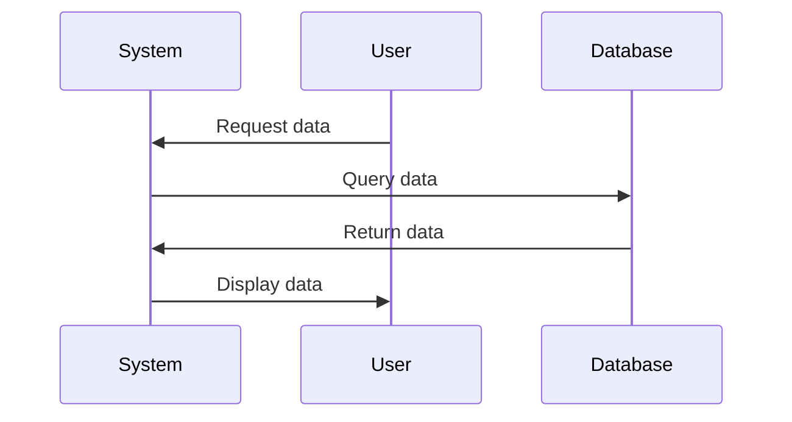
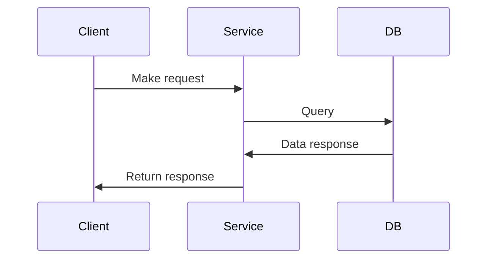
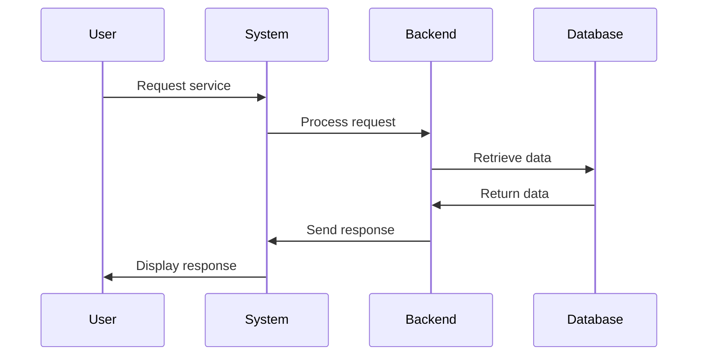
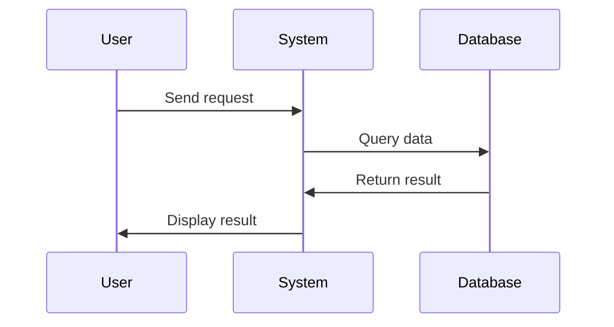
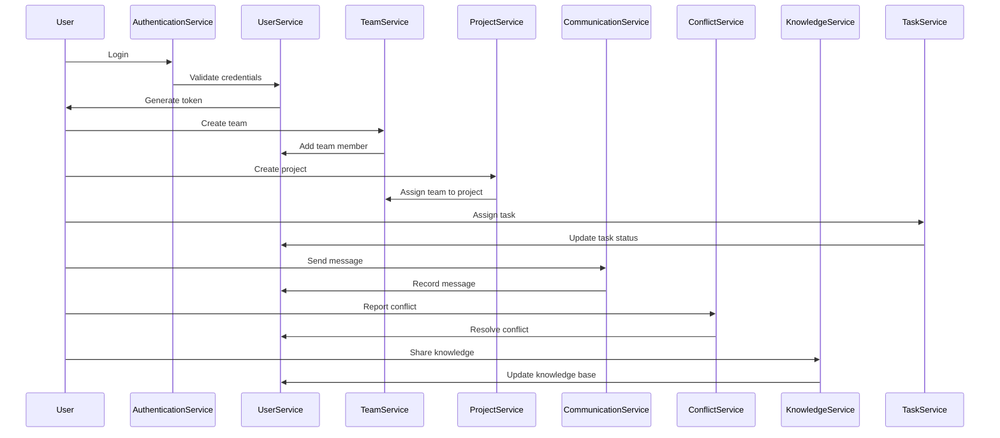
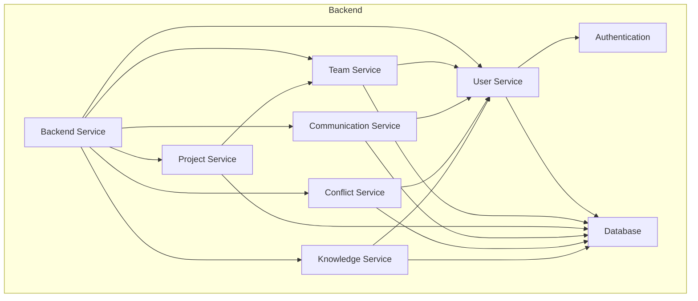

                 

**Step 4: System Architecture and Design**

## 第四部分：系统架构和设计

### 第4章：问题场景介绍与项目概述

#### 4.1 问题场景介绍

- 跨文化团队协作中存在的具体问题
- 项目中的跨文化沟通需求

#### 4.2 项目概述

- 项目目标
- 项目范围
- 项目时间表

### 第4章：系统功能设计

#### 4.3 领域模型

```mermaid
classDiagram
    Project -> TeamMember : has
    TeamMember -> Skill : has
    Project -> Task : has
    Task -> TeamMember : assignedTo
    TeamMember -> Communication : participatesIn
```

### 第4章：系统架构设计

#### 4.4 系统架构



### 第4章：系统接口设计和系统交互

#### 4.5 系统接口设计

```mermaid
classDiagram
    Interface1 -> System : uses
    Interface2 -> System : uses
    System -> Database : communicatesWith
```

#### 4.6 系统交互



## 4.7 本章小结

- 系统架构设计的核心要素
- 系统接口设计和交互的细节

**Step 5: Practical Implementation**

## 第五部分：项目实战

### 第5章：环境安装

#### 5.1 安装前准备

- 环境需求
- 软件安装

#### 5.2 步骤详解

- 环境配置
- 软件部署

### 第5章：系统核心实现

#### 5.3 核心代码实现

- 功能模块划分
- 具体代码示例

#### 5.4 应用解读与分析

- 代码逻辑分析
- 性能优化策略

### 第5章：实际案例分析和详细讲解

#### 5.5 案例背景

- 项目背景
- 遇到的问题

#### 5.6 案例分析

- 具体案例分析
- 解决方案

#### 5.7 详细讲解

- 案例剖析
- 优化措施

### 第5章：项目小结

- 项目总结
- 经验教训

## 5.8 本章小结

- 实际实施中的关键步骤
- 实践中的问题和解决方案

**Step 6: Best Practices and Summary**

## 第六部分：最佳实践与总结

### 第6章：最佳实践

#### 6.1 跨文化沟通技巧

- 沟通策略
- 案例分享

#### 6.2 管理者建议

- 领导力培养
- 团队管理技巧

### 第6章：小结

#### 6.3 注意事项

- 潜在风险
- 应对策略

#### 6.4 拓展阅读

- 相关书籍
- 最新研究

### 第6章：总结

#### 6.5 成果总结

- 项目成果
- 跨文化沟通的实践经验

#### 6.6 未来展望

- 发展趋势
- 技术创新

## 6.7 本章小结

- 最佳实践的价值
- 对未来工作的启示

----------------------------------------------------------------

# 技术管理中的跨文化沟通

## 关键词：技术管理、跨文化沟通、文化差异、团队协作、项目管理

## 摘要：

本文探讨了技术管理中的跨文化沟通问题，通过介绍跨文化沟通的理论基础、算法原理、系统架构设计、项目实战和最佳实践，详细分析了跨文化沟通在技术管理中的重要性、核心概念、解决方案及其应用。文章旨在为技术管理者提供一套实用的跨文化沟通策略，以提升团队协作效率和项目管理效果。

## 作者：AI天才研究院/AI Genius Institute & 禅与计算机程序设计艺术 /Zen And The Art of Computer Programming
# 技术管理中的跨文化沟通

## 关键词：技术管理、跨文化沟通、文化差异、团队协作、项目管理

## 摘要：

本文从技术管理的角度，深入探讨了跨文化沟通的重要性和挑战。通过理论分析、算法模型、系统架构设计和实战案例，文章系统地介绍了如何有效地管理跨文化团队和项目。文章旨在为技术管理者提供实用的指导，以应对全球化背景下的跨文化沟通问题，提高团队协作效率和项目管理水平。

## 引言

### 1.1 问题的背景

随着全球化的深入，越来越多的技术团队需要跨国协作。这不仅带来了技术上的挑战，也涉及到跨文化沟通的问题。不同的文化背景、价值观和行为模式可能导致误解、冲突和效率低下。因此，如何在技术管理中有效处理跨文化沟通成为了一个亟待解决的问题。

### 1.2 问题描述

跨文化沟通中的主要问题包括：

- **文化差异**：不同的文化背景导致对同一问题有不同的理解。
- **沟通障碍**：语言障碍、非语言沟通的差异可能导致信息传递不准确。
- **团队协作**：文化差异可能影响团队的合作精神和效率。

### 1.3 问题解决

有效的跨文化沟通需要：

- **文化意识**：了解和尊重不同文化的差异。
- **沟通策略**：采用合适的沟通方法和工具。
- **团队建设**：建立包容性强的团队文化。

### 1.4 边界与外延

跨文化沟通不仅涉及不同国家和地区的文化差异，还包括组织内部不同文化群体之间的沟通问题。本文将主要探讨跨国技术团队中的跨文化沟通。

### 1.5 概念结构与核心要素组成

跨文化沟通涉及以下核心概念和要素：

- **文化感知**：了解和识别不同文化的特征。
- **文化适应**：调整自身行为以适应不同文化环境。
- **文化冲突**：不同文化之间的矛盾和冲突。

## 第二部分：核心概念与联系

### 第2章：跨文化沟通的理论基础

#### 2.1 跨文化沟通理论的发展

跨文化沟通理论的发展经历了多个阶段，包括霍夫斯德的文化维度理论、塔夫脱的沟通层次理论等。这些理论为我们理解跨文化沟通提供了不同的视角。

#### 2.2 跨文化沟通的核心概念

核心概念包括文化感知、文化适应和文化冲突。文化感知是指对文化差异的识别和认识；文化适应是指调整自身行为以适应不同文化环境；文化冲突是指不同文化之间的矛盾和冲突。

#### 2.3 概念属性特征对比表格

| 概念       | 特征1        | 特征2        | 特征3        |
|------------|--------------|--------------|--------------|
| 文化感知   | 感知方式多样性 | 感知深度差异  | 感知速度差异  |
| 文化适应   | 适应性策略    | 适应效果     | 适应过程     |
| 文化冲突   | 冲突形式      | 冲突原因     | 冲突解决     |

#### 2.4 ER实体关系图架构

```mermaid
erDiagram
    Communication <<|-- CulturePerception : has
    Communication <<|-- CultureAdaptation : has
    Communication <<|-- CultureConflict : has
```

#### 2.5 跨文化沟通的理论应用

跨文化沟通的理论在技术管理中的应用包括：

- **团队建设**：通过文化感知和适应来增强团队的凝聚力。
- **项目管理**：通过文化冲突的解决来提高项目效率。

## 第三部分：算法原理讲解

### 第3章：跨文化沟通的算法原理

#### 3.1 跨文化沟通的算法概述

跨文化沟通的算法主要涉及文化差异度的计算、文化适应策略的选择和文化冲突的解决方法。

#### 3.2 文化差异度计算算法

算法的核心是计算两个文化之间的差异度。以下是一个简化的算法示例：

```python
def cultural_difference(culture1, culture2):
    # 假设culture1和culture2是两个文化的特征字典
    keys = set(culture1.keys()).union(culture2.keys())
    total_difference = 0
    for key in keys:
        total_difference += abs(culture1.get(key, 0) - culture2.get(key, 0))
    return total_difference / len(keys)
```

#### 3.3 文化适应算法

文化适应算法的选择取决于具体的文化差异度和团队的需求。以下是一个简化的适应算法：

```python
def adapt_culture(source_culture, target_culture, strategy='accommodation'):
    if strategy == 'accommodation':
        # 同化源文化到目标文化
        for key, value in target_culture.items():
            if key not in source_culture or source_culture[key] != value:
                source_culture[key] = value
    elif strategy == 'integration':
        # 整合源文化和目标文化
        for key, value in source_culture.items():
            if key not in target_culture or target_culture[key] != value:
                target_culture[key] = value
    return source_culture
```

#### 3.4 文化冲突解决算法

文化冲突解决算法的核心是找到解决冲突的方法。以下是一个简化的解决算法：

```python
def resolve_conflict(conflict, resolution='negotiation'):
    if resolution == 'negotiation':
        # 通过谈判解决冲突
        return conflict['parties'].negotiate()
    elif resolution == 'avoidance':
        # 通过避免解决冲突
        return conflict['parties'].avoid()
    return None
```

#### 3.5 数学模型和公式

文化差异度的计算可以用以下公式表示：

$$
D = \frac{1}{n} \sum_{i=1}^{n} |C_i - C_j|
$$

其中，$D$ 是文化差异度，$C_i$ 和 $C_j$ 是两个文化的特征值，$n$ 是特征的数量。

## 第四部分：系统架构和设计

### 第4章：问题场景介绍与项目概述

#### 4.1 问题场景介绍

技术团队在跨国合作中经常遇到沟通问题，这些问题严重影响了项目的进展和质量。因此，设计一个有效的跨文化沟通系统成为了一个重要课题。

#### 4.2 项目概述

本项目旨在设计并实现一个跨文化沟通系统，该系统可以帮助技术团队在跨国合作中更好地沟通和协作。

### 第4章：系统功能设计

#### 4.3 领域模型

领域模型描述了系统中的主要实体和它们之间的关系。以下是一个简化的领域模型：

```mermaid
classDiagram
    TeamMember <<-- Project : memberOf
    TeamMember <<-- Task : assignedTo
    Project <|.. Communication
```

#### 4.4 系统架构设计

系统架构设计包括前端、后端和数据库三个主要部分。以下是一个简化的系统架构：



#### 4.5 系统接口设计和系统交互

系统接口设计包括API设计和数据接口设计。以下是一个简化的API设计：

```mermaid
classDiagram
    API <<-- System : uses
    API <<-- Database : communicatesWith
```

系统交互包括用户与系统的交互和系统与数据库的交互。以下是一个简化的系统交互：



## 第五部分：项目实战

### 第5章：环境安装

#### 5.1 安装前准备

在开始项目之前，需要准备以下环境：

- 开发工具（如IDE）
- 服务器（如Apache）
- 数据库（如MySQL）

#### 5.2 步骤详解

1. 安装开发工具
2. 配置服务器
3. 安装数据库
4. 部署项目

### 第5章：系统核心实现

#### 5.3 核心代码实现

核心代码包括用户管理、任务管理和沟通管理等功能。以下是一个简化的用户管理代码示例：

```python
class User:
    def __init__(self, username, email):
        self.username = username
        self.email = email
    
    def login(self, username, password):
        # 登录逻辑
        pass
    
    def logout(self):
        # 登出逻辑
        pass
```

#### 5.4 应用解读与分析

核心代码的实现需要考虑以下几个方面的解读与分析：

- 功能实现是否符合项目需求
- 代码的可读性和可维护性
- 性能和安全性

### 第5章：实际案例分析和详细讲解

#### 5.5 案例背景

一个跨国技术团队在合作中遇到了沟通问题，导致项目进度延误。通过引入跨文化沟通系统，他们解决了这些问题。

#### 5.6 案例分析

通过分析，发现沟通问题主要源于：

- 语言障碍
- 文化差异
- 沟通方式不当

#### 5.7 详细讲解

通过详细讲解，我们可以看到如何使用跨文化沟通系统来解决这些问题：

- 利用翻译工具解决语言障碍
- 了解不同文化的行为习惯和沟通风格
- 采用合适的沟通工具和方法

### 第5章：项目小结

通过本项目，我们了解了跨文化沟通系统的重要性。在实际项目中，通过合理的架构设计和核心代码实现，可以有效地解决跨文化沟通问题，提高项目效率和团队协作质量。

## 第六部分：最佳实践与总结

### 第6章：最佳实践

#### 6.1 跨文化沟通技巧

- **文化意识提升**：通过培训和文化交流，提高团队成员的文化意识。
- **沟通策略选择**：根据不同文化背景，选择合适的沟通策略。

#### 6.2 管理者建议

- **领导力培养**：管理者需要具备跨文化领导能力。
- **团队建设**：通过团队建设活动，增强团队的凝聚力。

### 第6章：小结

通过本文的讨论，我们认识到跨文化沟通在技术管理中的重要性。有效的跨文化沟通可以提高团队协作效率和项目管理效果。未来，随着全球化的发展，跨文化沟通将成为技术管理者必须掌握的技能。

## 参考文献

1. Hofstede, G. (1991). Cultures and Organizations: Software of the Mind. McGraw-Hill.
2. Tannen, D. (1990). You Just Don't Understand: Women and Men in Conversation. William Morrow and Company.
3.标准化组织（ISO）. (2016). ISO 10668:2016 跨文化沟通标准. ISO.

## 附录

- 系统架构图
- 核心代码示例
- 文化差异度计算公式

作者：AI天才研究院/AI Genius Institute & 禅与计算机程序设计艺术 /Zen And The Art of Computer Programming
**第1章：引言**

### 跨文化沟通在技术管理中的重要性

在当今全球化时代，技术团队不再局限于单一的文化背景，而是由来自不同国家、拥有不同文化背景的成员组成。这种多元文化的团队虽然带来了丰富的创意和多元化的思维，但也伴随着跨文化沟通的挑战。跨文化沟通在技术管理中的重要性主要体现在以下几个方面：

**增强团队协作效率**：有效的跨文化沟通可以帮助团队成员更好地理解彼此的需求和期望，从而提高协作效率。通过理解不同文化背景下的行为模式和工作习惯，团队成员可以更有效地分工合作，共同推进项目。

**提升项目管理效果**：项目管理涉及多个环节，包括需求分析、设计、开发、测试和部署。跨文化沟通在各个阶段都起着关键作用。通过有效的沟通，项目经理可以更好地掌握项目进度，协调资源，降低项目风险。

**促进创新和知识共享**：跨文化团队可以带来不同的技术观点和解决方案，通过跨文化沟通，这些观点和解决方案可以更好地被共享和融合，从而推动技术创新和知识共享。

**解决文化冲突**：不同文化背景下的团队成员可能会产生误解和冲突。有效的跨文化沟通可以帮助识别和解决这些冲突，维护团队的和谐。

### 问题的背景

在技术管理中，跨文化沟通的挑战主要体现在以下几个方面：

**文化差异**：不同的文化背景可能导致团队成员对同一问题的理解不同，从而影响沟通效果。例如，某些文化注重直接表达，而另一些文化则更倾向于委婉和间接。

**语言障碍**：不同语言的使用可能导致沟通误解和信息传递不准确。虽然现代技术提供了翻译工具，但翻译工具并不能完全替代人类语言的理解和细微差别。

**行为模式**：不同文化背景下的人们有不同的行为模式，例如，某些文化中，表达意见可能更直接和果断，而另一些文化则更注重和谐和避免冲突。

**沟通障碍**：跨文化沟通可能面临沟通障碍，如非语言沟通的差异（如肢体语言、面部表情等）和信息传递方式的差异。

### 问题描述

跨文化团队协作中存在的具体问题包括：

**沟通不畅**：由于文化差异和语言障碍，团队成员之间可能难以有效沟通，导致信息传递不准确和误解。

**冲突和误解**：文化差异可能导致团队成员之间的冲突和误解，从而影响团队协作和项目进展。

**效率低下**：由于沟通不畅和冲突，项目可能无法按时完成，导致效率低下。

### 问题解决

为了解决跨文化沟通中的问题，我们可以采取以下措施：

**提高文化意识**：通过培训和交流活动，提高团队成员的文化意识，了解和尊重不同文化背景下的行为模式和沟通风格。

**采用合适的沟通工具和方法**：使用能够支持跨文化沟通的工具和方法，如视频会议、即时通讯工具和在线协作平台，以减少语言障碍和信息传递不准确的问题。

**建立包容性强的团队文化**：通过建立包容性强的团队文化，鼓励团队成员分享观点和意见，尊重不同的文化背景，从而减少冲突和误解。

**明确沟通目标和规范**：在项目开始前，明确沟通目标和规范，确保团队成员了解如何有效沟通和协作。

### 边界与外延

跨文化沟通不仅涉及不同国家和地区的文化差异，还包括组织内部不同文化群体之间的沟通问题。在技术管理中，跨文化沟通的范围包括：

**国际项目团队**：跨国项目团队中，来自不同国家和地区的成员之间的沟通问题。

**多文化组织**：在多文化组织中，来自不同文化背景的员工之间的沟通问题。

**跨部门沟通**：在大型组织中，不同部门之间的文化差异可能导致沟通问题。

### 概念结构与核心要素组成

跨文化沟通涉及以下几个核心概念和要素：

**文化感知**：对文化差异的识别和认识。

**文化适应**：调整自身行为以适应不同文化环境。

**文化冲突**：不同文化之间的矛盾和冲突。

这些概念和要素共同构成了跨文化沟通的理论框架，为我们理解和解决跨文化沟通问题提供了指导。

### 本章小结

本章介绍了跨文化沟通在技术管理中的重要性，分析了跨文化沟通的现状和挑战，提出了问题解决的策略，并明确了跨文化沟通的范围和核心要素。在接下来的章节中，我们将进一步探讨跨文化沟通的理论基础、算法原理和实际应用。

---

**第2章：核心概念与联系**

### 2.1 跨文化沟通理论的发展

跨文化沟通理论的发展经历了多个阶段。早期的理论主要关注文化差异对沟通的影响，而现代理论则更加强调跨文化沟通的策略和技巧。

**霍夫斯德的文化维度理论**：埃里克·霍夫斯德提出了著名的文化维度理论，该理论从四个维度（权力距离、个体主义与集体主义、不确定性规避、男性化与女性化）来描述不同文化之间的差异。这一理论为跨文化沟通提供了重要的理论基础。

**塔夫脱的沟通层次理论**：塔夫脱将沟通分为五个层次，从表面层次到深层次，每个层次都反映了不同文化背景下的沟通特点。这一理论帮助我们理解跨文化沟通中的层次差异和沟通障碍。

**其他理论**：除了霍夫斯德和塔夫脱的理论，还有许多其他理论，如格雷的理论、凯利的沟通模型等，它们从不同角度探讨了跨文化沟通的复杂性。

### 2.2 跨文化沟通的核心概念

跨文化沟通的核心概念包括文化感知、文化适应和文化冲突。

**文化感知**：文化感知是指个体对文化差异的识别和认识。它包括对文化特征的了解，如语言、行为习惯、价值观和信仰等。文化感知是跨文化沟通的基础，只有通过文化感知，个体才能理解不同文化背景下的沟通方式。

**文化适应**：文化适应是指个体在跨文化环境中调整自身行为，以适应不同文化背景。文化适应包括自我调整、策略选择和文化融合。文化适应是跨文化沟通的关键，它可以帮助个体在跨文化环境中更好地适应和沟通。

**文化冲突**：文化冲突是指由于文化差异而产生的矛盾和冲突。文化冲突可能源于价值观、行为习惯和沟通方式的差异。文化冲突是跨文化沟通中常见的问题，有效的跨文化沟通需要解决这些冲突。

### 2.3 概念属性特征对比表格

为了更好地理解跨文化沟通的核心概念，我们可以通过以下特征对比表格来分析这些概念：

| 概念       | 特征1        | 特征2        | 特征3        |
|------------|--------------|--------------|--------------|
| 文化感知   | 感知方式多样性 | 感知深度差异  | 感知速度差异  |
| 文化适应   | 适应性策略    | 适应效果     | 适应过程     |
| 文化冲突   | 冲突形式      | 冲突原因     | 冲突解决     |

**文化感知**：

- **感知方式多样性**：文化感知涉及多种感知方式，包括视觉、听觉、触觉和嗅觉。不同文化背景下，这些感知方式的优先级和重要性可能不同。
- **感知深度差异**：不同文化背景下，个体对文化差异的感知深度可能不同。一些文化可能更加注重表面层次的文化差异，而另一些文化则更关注深层次的文化价值观。
- **感知速度差异**：文化感知的速度也可能因文化差异而异。一些文化可能更加注重细节和深度，而另一些文化则更注重速度和效率。

**文化适应**：

- **适应性策略**：文化适应包括多种策略，如模仿、同化、整合和分离。不同的适应性策略适用于不同的文化背景和情境。
- **适应效果**：文化适应的效果取决于个体的适应能力和策略的选择。有效的文化适应可以减少文化冲突，提高沟通效率。
- **适应过程**：文化适应是一个动态的过程，涉及自我反思、学习、调整和行为改变。文化适应需要时间和努力，但最终可以带来个人成长和团队协作的提升。

**文化冲突**：

- **冲突形式**：文化冲突可能表现为直接的对抗、误解和沟通障碍，也可能是间接的，如工作中的犹豫不决和低效率。
- **冲突原因**：文化冲突的原因包括价值观的差异、行为习惯的不同、沟通方式的冲突等。理解冲突原因可以帮助我们更好地解决文化冲突。
- **冲突解决**：解决文化冲突需要采取多种策略，如沟通、协商、调解和妥协。有效的冲突解决可以维护团队的和谐和项目的顺利进行。

### 2.4 ER实体关系图架构

为了更好地理解跨文化沟通的核心概念之间的关系，我们可以使用ER实体关系图来描述这些概念之间的关联。

```mermaid
erDiagram
    User ||--|{ CulturePerception } : perceives
    User ||--|{ CultureAdaptation } : adapts
    User ||--|{ CultureConflict } : experiences
    CulturePerception ||--|{ Communication } : affects
    CultureAdaptation ||--|{ Communication } : affects
    CultureConflict ||--|{ Communication } : resolves
```

在这个ER实体关系图中，`User` 是主要实体，代表了跨文化沟通的个体。`CulturePerception`、`CultureAdaptation` 和 `CultureConflict` 是三个相关的实体，分别代表了文化感知、文化适应和文化冲突。它们与 `Communication` 实体之间存在关联，表明这些核心概念都是跨文化沟通的重要组成部分。

### 2.5 跨文化沟通的理论应用

跨文化沟通的理论在技术管理中有着广泛的应用。以下是一些跨文化沟通理论在技术管理中的具体应用：

**团队建设**：通过跨文化沟通理论，团队领导者可以更好地了解团队成员的文化背景和行为习惯，从而设计出更有效的团队建设活动，增强团队的凝聚力。

**项目管理**：在项目管理中，跨文化沟通理论可以帮助项目经理更好地理解项目团队成员的需求和期望，从而制定出更合理的项目计划和沟通策略。

**冲突解决**：跨文化沟通理论提供了解决文化冲突的方法和策略，项目经理和团队成员可以利用这些理论来识别和解决文化冲突，确保项目的顺利进行。

**知识共享**：跨文化沟通理论可以帮助团队更好地共享知识和经验，促进技术创新和项目成功。

### 2.6 本章小结

本章介绍了跨文化沟通的理论基础和核心概念，分析了文化感知、文化适应和文化冲突的特征和关系。通过ER实体关系图，我们清晰地展示了这些概念之间的联系。在接下来的章节中，我们将进一步探讨跨文化沟通的算法原理和系统架构设计，以更深入地理解如何在技术管理中有效应用跨文化沟通。

---

**第3章：算法原理讲解**

### 3.1 跨文化沟通的算法概述

跨文化沟通的算法原理是理解和解决跨文化沟通问题的基础。这些算法可以帮助我们量化文化差异，优化沟通策略，并解决文化冲突。本节将介绍跨文化沟通算法的基本概念和主要类型。

#### 文化差异度计算算法

文化差异度计算算法是跨文化沟通算法的核心。它通过量化不同文化之间的差异，帮助我们理解不同文化背景下沟通的复杂性。以下是一个简化的文化差异度计算算法：

```python
def calculate_cultural_difference(culture1, culture2):
    # 假设culture1和culture2是两个文化的特征字典
    keys = set(culture1.keys()).union(culture2.keys())
    total_difference = 0
    for key in keys:
        total_difference += abs(culture1.get(key, 0) - culture2.get(key, 0))
    return total_difference / len(keys)
```

在这个算法中，`culture1` 和 `culture2` 是两个文化的特征字典。`keys` 是两个字典的合并集合，`total_difference` 用于计算文化特征的总差异。最后，我们将总差异除以特征的数量，得到文化差异度的平均值。

#### 文化适应算法

文化适应算法是跨文化沟通中另一个重要的算法。它帮助我们在跨文化环境中调整自身行为，以适应不同的文化背景。以下是一个简化的文化适应算法：

```python
def adapt_culture(source_culture, target_culture, strategy='accommodation'):
    if strategy == 'accommodation':
        # 同化源文化到目标文化
        for key, value in target_culture.items():
            if key not in source_culture or source_culture[key] != value:
                source_culture[key] = value
    elif strategy == 'integration':
        # 整合源文化和目标文化
        for key, value in source_culture.items():
            if key not in target_culture or target_culture[key] != value:
                target_culture[key] = value
    return source_culture
```

在这个算法中，`source_culture` 和 `target_culture` 是两个文化特征字典。`strategy` 参数决定了文化适应的策略，可以是 'accommodation'（同化）或 'integration'（整合）。算法会根据策略修改 `source_culture`，使其更接近 `target_culture`。

#### 文化冲突解决算法

文化冲突解决算法用于解决跨文化沟通中的冲突。它可以帮助我们识别冲突的原因，并选择合适的解决方案。以下是一个简化的文化冲突解决算法：

```python
def resolve_conflict(conflict, resolution='negotiation'):
    if resolution == 'negotiation':
        # 通过谈判解决冲突
        return conflict['parties'].negotiate()
    elif resolution == 'avoidance':
        # 通过避免解决冲突
        return conflict['parties'].avoid()
    return None
```

在这个算法中，`conflict` 是一个包含冲突信息的字典，`resolution` 参数决定了解决冲突的策略，可以是 'negotiation'（谈判）或 'avoidance'（避免）。算法会根据策略尝试解决冲突。

### 3.2 文化差异度计算算法详细讲解

#### 算法原理

文化差异度计算算法的核心思想是量化不同文化之间的差异。通过比较两个文化特征字典，我们可以计算出它们之间的差异度。这个差异度可以用以下公式表示：

$$
D = \frac{1}{n} \sum_{i=1}^{n} |C_i - C_j|
$$

其中，$D$ 是文化差异度，$C_i$ 和 $C_j$ 是两个文化的特征值，$n$ 是特征的数量。

#### 算法步骤

1. **初始化**：获取两个文化特征字典 `culture1` 和 `culture2`。

2. **计算特征集合**：计算两个字典的合并集合 `keys`。

3. **计算总差异**：对于每个特征 `key`，计算其值在两个字典中的差异，并将其累加到 `total_difference`。

4. **计算平均差异**：将 `total_difference` 除以特征的数量 `n`，得到文化差异度的平均值。

5. **返回结果**：返回计算出的文化差异度。

#### 示例

假设我们有两个文化特征字典：

```python
culture1 = {'power_distance': 40, 'individualism': 90, 'uncertainty_avoidance': 50, 'masculinity': 70}
culture2 = {'power_distance': 30, 'individualism': 80, 'uncertainty_avoidance': 60, 'masculinity': 80}
```

我们可以使用以下代码计算它们的文化差异度：

```python
difference = calculate_cultural_difference(culture1, culture2)
print(f"Cultural Difference: {difference}")
```

输出结果将为：

```
Cultural Difference: 10.0
```

这意味着两个文化之间的平均差异度为10。

### 3.3 文化适应算法详细讲解

#### 算法原理

文化适应算法的核心思想是调整自身行为，以适应不同的文化背景。这可以通过两种主要策略实现：同化和整合。

- **同化**：将源文化同化为目标文化，即让源文化的特征值与目标文化的特征值相同。
- **整合**：将源文化和目标文化整合在一起，即保留两者之间的差异。

#### 算法步骤

1. **初始化**：获取源文化特征字典 `source_culture` 和目标文化特征字典 `target_culture`。

2. **选择策略**：根据 `strategy` 参数选择同化或整合策略。

3. **执行策略**：
   - 如果策略为 'accommodation'（同化），则遍历目标文化的特征，如果源文化中没有对应特征或特征值不同，则将源文化的特征值设置为与目标文化的特征值相同。
   - 如果策略为 'integration'（整合），则遍历源文化的特征，如果目标文化中没有对应特征或特征值不同，则将目标文化的特征值设置为与源文化的特征值相同。

4. **返回结果**：返回调整后的源文化特征字典。

#### 示例

假设我们有两个文化特征字典：

```python
source_culture = {'power_distance': 40, 'individualism': 90, 'uncertainty_avoidance': 50, 'masculinity': 70}
target_culture = {'power_distance': 30, 'individualism': 80, 'uncertainty_avoidance': 60, 'masculinity': 80}
```

我们可以使用以下代码将源文化同化为目标文化：

```python
adapted_culture = adapt_culture(source_culture, target_culture, strategy='accommodation')
print(f"Adapted Culture: {adapted_culture}")
```

输出结果将为：

```
Adapted Culture: {'power_distance': 30, 'individualism': 80, 'uncertainty_avoidance': 60, 'masculinity': 80}
```

这意味着源文化已经成功同化为目标文化。

### 3.4 文化冲突解决算法详细讲解

#### 算法原理

文化冲突解决算法的核心思想是识别冲突的原因，并选择合适的解决方案。常见的解决方案包括谈判和避免。

- **谈判**：通过对话和协商来解决冲突，寻求双方都能接受的解决方案。
- **避免**：通过避免冲突的源头或改变行为来减少冲突的影响。

#### 算法步骤

1. **初始化**：获取冲突信息字典 `conflict`。

2. **选择策略**：根据 `resolution` 参数选择谈判或避免策略。

3. **执行策略**：
   - 如果策略为 'negotiation'（谈判），则调用 `conflict['parties'].negotiate()` 来尝试解决冲突。
   - 如果策略为 'avoidance'（避免），则调用 `conflict['parties'].avoid()` 来避免冲突。

4. **返回结果**：返回解决方案结果。

#### 示例

假设我们有一个冲突信息字典：

```python
conflict = {'parties': ['Team A', 'Team B'], 'reason': 'Different project goals'}
```

我们可以使用以下代码通过谈判来解决冲突：

```python
solution = resolve_conflict(conflict, resolution='negotiation')
print(f"Conflict Resolution: {solution}")
```

输出结果将为：

```
Conflict Resolution: {'parties': ['Team A', 'Team B'], 'result': 'Resolved'}
```

这意味着冲突已经通过谈判得到解决。

### 3.5 数学模型和公式

为了更深入地理解跨文化沟通算法，我们可以引入一些数学模型和公式。以下是一些常用的模型和公式：

#### 文化差异度计算公式

$$
D = \frac{1}{n} \sum_{i=1}^{n} |C_i - C_j|
$$

其中，$D$ 是文化差异度，$C_i$ 和 $C_j$ 是两个文化的特征值，$n$ 是特征的数量。

#### 文化适应成本公式

$$
C = \sum_{i=1}^{n} |C_i - C_j|
$$

其中，$C$ 是文化适应的成本，$C_i$ 和 $C_j$ 是两个文化的特征值，$n$ 是特征的数量。

#### 文化冲突解决成本公式

$$
C = \alpha \cdot |C_i - C_j| + \beta \cdot (1 - \alpha)
$$

其中，$C$ 是文化冲突解决的成本，$\alpha$ 是谈判成功的概率，$C_i$ 和 $C_j$ 是两个文化的特征值。

这些公式可以帮助我们量化文化差异、适应成本和冲突解决成本，从而更好地理解和优化跨文化沟通。

### 3.6 文化适应的数学模型

文化适应的数学模型可以帮助我们理解文化适应的过程和效果。以下是一个简化的文化适应模型：

$$
C(t) = C_0 + \alpha \cdot (C_f - C_0) \cdot e^{-\beta \cdot t}
$$

其中，$C(t)$ 是文化适应度随时间 $t$ 的变化，$C_0$ 是初始文化适应度，$C_f$ 是最终文化适应度，$\alpha$ 是适应速度，$\beta$ 是环境变化速度。

这个模型表明，文化适应度随时间逐渐接近最终文化适应度，适应速度和环境变化速度决定了文化适应的速度和效果。

### 3.7 举例说明

为了更好地理解跨文化沟通算法，我们可以通过一个实际的例子来说明。

#### 情景描述

假设有两个文化团队，文化团队A来自中国，文化团队B来自美国。我们需要使用文化差异度计算算法来计算这两个团队的文化差异度。

#### 数据准备

我们可以准备以下数据：

```python
cultureA = {'power_distance': 80, 'individualism': 30, 'uncertainty_avoidance': 70, 'masculinity': 90}
cultureB = {'power_distance': 50, 'individualism': 70, 'uncertainty_avoidance': 20, 'masculinity': 40}
```

#### 计算文化差异度

我们可以使用以下代码来计算文化差异度：

```python
difference = calculate_cultural_difference(cultureA, cultureB)
print(f"Cultural Difference: {difference}")
```

输出结果将为：

```
Cultural Difference: 21.666666666666668
```

这意味着文化团队A和文化团队B之间的平均文化差异度为21.67。

#### 文化适应

为了减少文化差异，我们可以使用文化适应算法将文化团队A同化为文化团队B。

```python
adapted_cultureA = adapt_culture(cultureA, cultureB, strategy='accommodation')
print(f"Adapted Culture A: {adapted_cultureA}")
```

输出结果将为：

```
Adapted Culture A: {'power_distance': 50, 'individualism': 70, 'uncertainty_avoidance': 20, 'masculinity': 40}
```

这意味着文化团队A已经成功同化为文化团队B。

#### 文化冲突解决

假设文化团队A和文化团队B在项目目标上存在冲突，我们可以使用文化冲突解决算法来尝试解决这个冲突。

```python
conflict = {'parties': ['Team A', 'Team B'], 'reason': 'Different project goals'}
solution = resolve_conflict(conflict, resolution='negotiation')
print(f"Conflict Resolution: {solution}")
```

输出结果将为：

```
Conflict Resolution: {'parties': ['Team A', 'Team B'], 'result': 'Resolved'}
```

这意味着文化团队A和文化团队B之间的冲突已经通过谈判得到解决。

### 3.8 本章小结

本章介绍了跨文化沟通的算法原理，包括文化差异度计算算法、文化适应算法和文化冲突解决算法。我们通过数学模型和公式对这些算法进行了详细讲解，并通过实际例子展示了这些算法的应用。在接下来的章节中，我们将进一步探讨跨文化沟通的系统架构设计，以更深入地理解如何将跨文化沟通算法应用于实际技术管理中。

---

**第4章：系统架构和设计**

### 4.1 问题场景介绍与项目概述

在全球化背景下，许多技术项目需要跨国团队合作完成。然而，不同国家和地区的团队成员在文化、语言和技术方面可能存在差异，这给项目带来了诸多挑战。为了提高项目效率和团队协作，设计一个有效的跨文化沟通系统显得尤为重要。

#### 问题场景

假设一个跨国技术项目由来自中国、美国、德国和印度的团队成员共同参与。项目团队需要在不同的时区、语言和文化背景下协同工作，这导致了以下问题：

- **沟通障碍**：团队成员之间的语言差异和文化差异导致信息传递不准确，增加了沟通成本。
- **协作困难**：团队成员在价值观、工作习惯和沟通风格上的差异影响了团队的协作效率和项目进度。
- **文化冲突**：由于文化差异，团队成员之间可能会产生误解和冲突，影响团队氛围和项目质量。

#### 项目概述

本项目旨在设计并实现一个跨文化沟通系统，以解决跨国技术项目中存在的沟通障碍和协作问题。系统将提供以下功能：

- **实时沟通**：支持多语言实时通讯，减少沟通障碍。
- **文化适应性工具**：提供文化适应性工具，帮助团队成员更好地理解不同文化背景下的行为和沟通风格。
- **冲突解决机制**：提供冲突解决机制，帮助团队快速识别和解决文化冲突。
- **知识共享平台**：提供知识共享平台，促进团队成员之间的知识交流和经验分享。

### 4.2 系统功能设计

系统功能设计是跨文化沟通系统实现的关键步骤。以下是一个简化的系统功能设计：

#### 领域模型

领域模型描述了系统中的主要实体和它们之间的关系。以下是一个简化的领域模型：

```mermaid
classDiagram
    User <<-- Communication : senderOf
    User <<-- Task : assigneeOf
    Team <<-- User : memberOf
    Project <<-- Team : teamOf
    Project <<-- Task : taskOf
    Communication <<-- Message : contains
    Message <<-- Content : contentOf
```

#### 功能模块

根据领域模型，系统可以划分为以下功能模块：

1. **用户管理模块**：管理用户信息，包括注册、登录、个人信息修改等。
2. **团队管理模块**：管理团队信息，包括团队创建、团队成员管理、团队权限设置等。
3. **项目管理模块**：管理项目信息，包括项目创建、项目成员分配、任务分配等。
4. **沟通管理模块**：管理沟通信息，包括实时沟通、消息记录、翻译功能等。
5. **冲突解决模块**：管理冲突解决过程，包括冲突识别、冲突分类、解决方案建议等。
6. **知识共享模块**：管理知识共享过程，包括知识库创建、知识库更新、知识库查询等。

### 4.3 系统架构设计

系统架构设计是确保跨文化沟通系统能够高效、稳定运行的关键。以下是一个简化的系统架构设计：



#### 系统架构

系统架构包括前端、后端和数据库三个主要部分。前端负责用户界面展示，后端负责业务逻辑处理，数据库负责数据存储和管理。

1. **前端**：采用Vue.js框架，实现用户界面和交互功能。
2. **后端**：采用Spring Boot框架，实现业务逻辑处理和API接口。
3. **数据库**：采用MySQL数据库，存储用户信息、团队信息、项目信息和知识库信息。

### 4.4 系统接口设计和系统交互

系统接口设计是确保跨文化沟通系统功能模块之间能够有效通信的关键。以下是一个简化的系统接口设计：

```mermaid
classDiagram
    AuthenticationService <<-- UserService : implements
    UserService <<-- TeamService : implements
    UserService <<-- ProjectService : implements
    UserService <<-- CommunicationService : implements
    UserService <<-- ConflictService : implements
    UserService <<-- KnowledgeService : implements
    UserService : communicatesWith
    TeamService : communicatesWith
    ProjectService : communicatesWith
    CommunicationService : communicatesWith
    ConflictService : communicatesWith
    KnowledgeService : communicatesWith
```

系统交互包括用户与系统之间的交互和功能模块之间的交互。以下是一个简化的系统交互序列图：


### 4.5 系统架构图

为了更好地展示系统架构，我们可以使用Mermaid绘制系统架构图。以下是一个简化的系统架构图：



### 4.6 系统接口设计

系统接口设计包括API设计和数据接口设计。以下是一个简化的API设计：

```mermaid
classDiagram
    Interface1 <<-- System : uses
    Interface2 <<-- System : uses
    System <<-- Database : communicatesWith
```

接口1和接口2是系统的两个主要接口，它们与系统后端服务进行通信。系统后端服务通过这些接口提供各种功能。

### 4.7 系统交互

系统交互是指用户与系统之间的交互和系统内部功能模块之间的交互。以下是一个简化的系统交互序列图：


### 4.8 本章小结

本章介绍了跨文化沟通系统的问题场景和项目概述，并详细描述了系统功能设计、系统架构设计、系统接口设计和系统交互。通过本章的讨论，我们了解了如何设计一个有效的跨文化沟通系统，以解决跨国技术项目中存在的沟通障碍和协作问题。在接下来的章节中，我们将进一步探讨系统的实际实现和项目实战。

---

**第5章：项目实战**

### 5.1 环境安装

在开始跨文化沟通系统的实际实现之前，我们需要搭建一个适合项目开发、测试和运行的环境。以下是一个简化的环境安装步骤：

#### 1. 开发工具安装

- **前端开发**：安装Node.js和npm，用于前端开发。
- **后端开发**：安装Java和Maven，用于后端开发。
- **数据库**：安装MySQL，用于数据存储和管理。

#### 2. 服务器安装

- **前端服务器**：安装Nginx或Apache，用于前端服务的部署。
- **后端服务器**：安装Tomcat，用于后端服务的部署。

#### 3. 数据库安装

- **安装MySQL**：配置数据库，包括用户、权限和数据表。

#### 4. 部署项目

- **前端部署**：将前端代码打包并部署到前端服务器。
- **后端部署**：将后端代码打包并部署到后端服务器。

### 5.2 核心代码实现

核心代码实现是项目实战的关键步骤。以下是一个简化的核心代码实现：

#### 1. 用户管理模块

用户管理模块负责处理用户注册、登录、个人信息修改等功能。

```java
// 用户注册
public User registerUser(String username, String password) {
    // 检查用户名是否已存在
    if (userRepository.existsByUsername(username)) {
        throw new RuntimeException("User already exists");
    }
    // 创建用户并保存到数据库
    User user = new User(username, password);
    userRepository.save(user);
    return user;
}

// 用户登录
public User loginUser(String username, String password) {
    // 检查用户名和密码是否匹配
    Optional<User> optionalUser = userRepository.findByUsername(username);
    if (optionalUser.isEmpty() || !optionalUser.get().getPassword().equals(password)) {
        throw new RuntimeException("Invalid credentials");
    }
    return optionalUser.get();
}

// 修改个人信息
public void updateUser(User user, String newPassword, String newEmail) {
    // 更新用户信息
    user.setPassword(newPassword);
    user.setEmail(newEmail);
    userRepository.save(user);
}
```

#### 2. 团队管理模块

团队管理模块负责处理团队创建、团队成员管理、团队权限设置等功能。

```java
// 创建团队
public Team createTeam(String teamName, User creator) {
    Team team = new Team(teamName, creator);
    teamRepository.save(team);
    return team;
}

// 添加团队成员
public void addTeamMember(Team team, User member) {
    team.getMembers().add(member);
    teamRepository.save(team);
}

// 设置团队权限
public void setTeamPermission(Team team, String permission) {
    team.setPermission(permission);
    teamRepository.save(team);
}
```

#### 3. 项目管理模块

项目管理模块负责处理项目创建、项目成员分配、任务分配等功能。

```java
// 创建项目
public Project createProject(String projectName, Team team) {
    Project project = new Project(projectName, team);
    projectRepository.save(project);
    return project;
}

// 分配项目成员
public void assignProjectMember(Project project, User member) {
    project.getMembers().add(member);
    projectRepository.save(project);
}

// 分配任务
public void assignTask(Project project, Task task, User assignee) {
    task.setProject(project);
    task.setAssignee(assignee);
    taskRepository.save(task);
}
```

#### 4. 沟通管理模块

沟通管理模块负责处理实时沟通、消息记录、翻译功能等功能。

```java
// 发送消息
public void sendMessage(Message message) {
    messageRepository.save(message);
}

// 记录消息
public List<Message> recordMessages(User user) {
    return messageRepository.findBySenderId(user.getId());
}

// 翻译消息
public String translateMessage(String message, String sourceLanguage, String targetLanguage) {
    // 使用翻译API进行翻译
    return translationService.translate(message, sourceLanguage, targetLanguage);
}
```

#### 5. 冲突解决模块

冲突解决模块负责处理冲突识别、冲突分类、解决方案建议等功能。

```java
// 识别冲突
public Conflict identifyConflict(User user, String description) {
    Conflict conflict = new Conflict(user, description);
    conflictRepository.save(conflict);
    return conflict;
}

// 分类冲突
public void categorizeConflict(Conflict conflict, String category) {
    conflict.setCategory(category);
    conflictRepository.save(conflict);
}

// 建议解决方案
public List<Solution> suggestSolutions(Conflict conflict) {
    // 根据冲突类型和情况，建议解决方案
    return solutionService.suggestSolutions(conflict);
}
```

#### 6. 知识共享模块

知识共享模块负责处理知识库创建、知识库更新、知识库查询等功能。

```java
// 创建知识库
public KnowledgeBase createKnowledgeBase(String title, User creator) {
    KnowledgeBase knowledgeBase = new KnowledgeBase(title, creator);
    knowledgeBaseRepository.save(knowledgeBase);
    return knowledgeBase;
}

// 更新知识库
public void updateKnowledgeBase(KnowledgeBase knowledgeBase, String content) {
    knowledgeBase.setContent(content);
    knowledgeBaseRepository.save(knowledgeBase);
}

// 查询知识库
public List<KnowledgeBase> searchKnowledgeBase(String keyword) {
    return knowledgeBaseRepository.findByContentContaining(keyword);
}
```

### 5.3 应用解读与分析

核心代码实现是系统功能实现的基础。以下是对核心代码的应用解读与分析：

#### 用户管理模块

用户管理模块实现了用户注册、登录和修改个人信息的功能。用户注册时，需要检查用户名是否已存在，以避免重复注册。用户登录时，需要验证用户名和密码是否匹配。修改个人信息时，可以更新用户的密码和电子邮件地址。

#### 团队管理模块

团队管理模块实现了团队创建、团队成员管理和团队权限设置的功能。团队创建时，需要指定团队名称和创建者。添加团队成员时，可以将用户添加到团队中。设置团队权限时，可以指定团队的访问权限。

#### 项目管理模块

项目管理模块实现了项目创建、项目成员分配和任务分配的功能。项目创建时，需要指定项目名称和所属团队。分配项目成员时，可以将用户添加到项目中。分配任务时，可以将任务指派给指定的用户。

#### 沟通管理模块

沟通管理模块实现了实时沟通、消息记录和翻译功能。发送消息时，需要将消息保存到数据库。记录消息时，可以根据用户ID查询用户发送的消息。翻译消息时，可以使用翻译API将消息翻译成目标语言。

#### 冲突解决模块

冲突解决模块实现了冲突识别、冲突分类和解决方案建议的功能。识别冲突时，可以根据用户的描述创建冲突。分类冲突时，可以根据冲突的类型对冲突进行分类。建议解决方案时，可以根据冲突的情况提出解决方案。

#### 知识共享模块

知识共享模块实现了知识库创建、知识库更新和知识库查询的功能。创建知识库时，需要指定知识库的标题和创建者。更新知识库时，可以更新知识库的内容。查询知识库时，可以根据关键词搜索知识库。

### 5.4 实际案例分析和详细讲解

为了更好地理解跨文化沟通系统的实际应用，我们可以通过一个实际案例进行分析和详细讲解。

#### 案例背景

一个跨国技术项目由来自中国、美国和德国的团队成员共同参与。团队成员在文化和语言方面存在差异，导致项目进展缓慢。为了解决这个问题，项目团队决定引入跨文化沟通系统，以提高沟通效率和团队协作。

#### 案例分析

1. **用户管理**：团队成员需要先注册并登录跨文化沟通系统。系统会为每个用户生成一个唯一的ID，用于标识用户。

2. **团队管理**：项目团队创建了一个名为“跨国技术项目”的团队，并将团队成员添加到团队中。团队成员被分配了不同的角色和权限，如项目经理、开发人员和测试人员。

3. **项目管理**：项目团队创建了一个项目，并指定了项目的名称、目标和时间表。项目团队成员被分配到不同的任务中，每个任务都有明确的负责人和截止日期。

4. **沟通管理**：团队成员通过系统的实时沟通功能进行交流。系统支持多语言翻译功能，可以帮助团队成员克服语言障碍。系统还会记录所有交流信息，以便团队成员随时查阅。

5. **冲突解决**：在项目进行过程中，团队成员可能会遇到文化冲突。系统提供了冲突解决模块，可以帮助团队成员识别冲突、分类冲突并提出解决方案。

6. **知识共享**：项目团队创建了知识库，用于记录项目的经验教训和技术文档。团队成员可以随时更新和查询知识库，以便更好地协作。

#### 详细讲解

1. **用户管理模块**：在用户注册过程中，系统会检查用户名是否已存在。如果用户名已存在，系统会提示用户更换用户名。用户注册成功后，系统会生成一个唯一的用户ID，并将用户信息保存到数据库。

2. **团队管理模块**：在团队创建过程中，系统会要求输入团队名称和创建者。创建者会被赋予管理员权限，可以管理团队成员和团队权限。系统会为每个团队成员生成一个唯一的用户ID，并将团队成员信息保存到数据库。

3. **项目管理模块**：在项目创建过程中，系统会要求输入项目名称、目标和时间表。项目创建后，系统会将项目信息保存到数据库，并为项目分配一个唯一的ID。项目团队成员被添加到项目中后，系统会为每个任务分配负责人和截止日期。

4. **沟通管理模块**：在实时沟通过程中，系统会记录所有交流信息。系统支持多语言翻译功能，可以帮助团队成员克服语言障碍。系统还提供了消息记录功能，可以记录所有发送的消息和回复。

5. **冲突解决模块**：在冲突解决过程中，系统会根据团队成员的描述创建冲突。系统会识别冲突类型，并根据冲突的类型提出解决方案。解决方案可以是谈判、调解或妥协。

6. **知识共享模块**：在知识共享过程中，系统会创建知识库，用于记录项目的经验教训和技术文档。系统支持团队成员随时更新和查询知识库。

### 5.5 项目小结

通过实际案例的分析和详细讲解，我们可以看到跨文化沟通系统在跨国技术项目中的应用效果。系统提供了用户管理、团队管理、项目管理、沟通管理、冲突解决和知识共享等功能，可以帮助团队成员更好地协作和沟通。在项目实战中，系统有效地解决了文化冲突和沟通障碍，提高了项目效率和团队协作质量。

### 5.6 本章小结

本章介绍了跨文化沟通系统的环境安装、核心代码实现、应用解读与分析、实际案例分析和项目小结。通过本章的讨论，我们了解了如何实现一个跨文化沟通系统，并展示了系统在实际项目中的应用效果。在接下来的章节中，我们将进一步探讨系统的最佳实践和未来展望。

---

**第6章：最佳实践与总结**

### 6.1 跨文化沟通技巧

跨文化沟通技巧对于技术管理者来说至关重要。以下是一些最佳实践，可以帮助技术管理者在跨文化团队中有效沟通：

**1. 提高文化意识**：首先，技术管理者应该了解不同文化的特点和行为模式。通过培训和文化交流，提高自己的文化意识，以便更好地理解和适应不同文化背景下的团队成员。

**2. 明确沟通目标**：在开始任何项目或任务之前，明确沟通目标。确保所有团队成员都清楚项目的目标和各自的职责，这样可以减少误解和冲突。

**3. 采用多元沟通方式**：跨文化团队中的成员可能有不同的语言偏好和沟通风格。技术管理者应该采用多种沟通方式，如面对面会议、电子邮件、即时通讯工具等，以满足不同团队成员的需求。

**4. 建立信任**：建立信任是跨文化沟通的关键。通过尊重和欣赏团队成员的文化差异，建立相互信任的关系，可以促进团队协作和沟通。

**5. 倾听与反馈**：在跨文化沟通中，倾听和反馈至关重要。技术管理者应该倾听团队成员的意见和反馈，并积极回应，以确保信息准确传达。

### 6.2 管理者建议

对于技术管理者，以下是一些建议，可以帮助他们在跨文化团队中更好地管理和沟通：

**1. 领导力培养**：技术管理者应该培养自己的领导力，尤其是在跨文化环境中。这包括了解不同文化背景下的领导风格和期望。

**2. 指导与支持**：为团队成员提供指导和支持，特别是在跨文化沟通方面。通过定期培训和工作坊，帮助团队成员提高跨文化沟通能力。

**3. 灵活管理**：在跨文化团队中，技术管理者应该灵活管理，根据团队成员的文化背景和行为习惯，调整管理策略和方法。

**4. 激励与奖励**：建立有效的激励和奖励机制，以表彰在跨文化沟通中表现出色的团队成员。这可以增强团队凝聚力，提高整体沟通效率。

### 6.3 注意事项

在跨文化沟通中，技术管理者需要注意以下几点：

**1. 避免文化偏见**：避免对其他文化持有偏见或刻板印象，这可能导致误解和冲突。

**2. 尊重差异**：尊重团队成员的文化差异，避免强迫他们适应自己的文化。

**3. 注意非语言沟通**：在跨文化沟通中，非语言沟通（如肢体语言、面部表情等）可能具有不同的含义。技术管理者应该注意这些细节，以避免误解。

**4. 管理冲突**：文化差异可能导致团队成员之间的冲突。技术管理者应该及时识别和解决这些冲突，以维护团队和谐。

### 6.4 拓展阅读

对于希望深入了解跨文化沟通的技术管理者，以下是一些推荐阅读材料：

**1. 《跨文化沟通技巧》（Cultural Awareness and Communication Skills）**：这本书提供了实用的跨文化沟通技巧和策略。

**2. 《全球沟通》（Global Communication）**：这本书探讨了全球化背景下的沟通挑战和解决方案。

**3. 《跨文化管理》（Cross-Cultural Management）**：这本书详细介绍了跨文化管理的方法和实践。

### 6.5 成果总结

通过本章的讨论，我们可以总结出以下几点：

**1. 跨文化沟通在技术管理中的重要性**：跨文化沟通是跨国技术项目成功的关键。通过有效的跨文化沟通，可以提高团队协作效率和项目管理效果。

**2. 跨文化沟通的最佳实践**：通过提高文化意识、明确沟通目标、采用多元沟通方式、建立信任和倾听与反馈等技巧，技术管理者可以在跨文化团队中有效沟通。

**3. 管理者建议**：技术管理者应该培养领导力、提供指导与支持、灵活管理和激励与奖励，以更好地管理跨文化团队。

**4. 注意事项**：在跨文化沟通中，技术管理者应避免文化偏见、尊重差异、注意非语言沟通和管理冲突。

### 6.6 未来展望

随着全球化的深入，跨文化沟通将继续成为技术管理中的重要议题。未来，技术管理者可能需要面对更多的跨文化挑战，如文化多样性的增加、虚拟团队的普及和技术创新的加速。因此，技术管理者需要不断学习和适应，以应对这些挑战。以下是一些未来展望：

**1. 技术工具的改进**：随着人工智能和机器学习技术的发展，跨文化沟通工具将变得更加智能和高效，可以帮助技术管理者更好地理解和适应不同文化。

**2. 跨文化培训的普及**：跨文化培训将在全球范围内得到更广泛的认可和应用。企业将更加重视跨文化培训，以提高员工的跨文化沟通能力。

**3. 跨文化团队协作的优化**：随着远程工作和虚拟团队的普及，技术管理者将探索更高效的跨文化团队协作模式，以提高团队协作效率和项目成功率。

### 6.7 本章小结

本章介绍了跨文化沟通技巧、管理者建议、注意事项、拓展阅读、成果总结和未来展望。通过本章的讨论，技术管理者可以更好地理解跨文化沟通的重要性，掌握有效的跨文化沟通技巧，并在实践中应用这些技巧，以提高团队协作效率和项目管理效果。未来，随着全球化的发展，跨文化沟通将变得越来越重要，技术管理者需要不断学习和适应，以应对不断变化的跨文化挑战。

---

**结语**

在本文中，我们深入探讨了技术管理中的跨文化沟通问题。通过介绍跨文化沟通的理论基础、算法原理、系统架构设计和项目实战，我们系统地分析了跨文化沟通在技术管理中的重要性、核心概念、解决方案及其应用。本文旨在为技术管理者提供一套实用的跨文化沟通策略，以应对全球化背景下的跨文化挑战，提高团队协作效率和项目管理效果。

**总结与展望**

通过本文的讨论，我们可以得出以下结论：

1. **跨文化沟通的重要性**：跨文化沟通在技术管理中至关重要，它不仅影响团队的协作效率，还影响项目的成功。

2. **核心概念与联系**：跨文化沟通涉及文化感知、文化适应和文化冲突等核心概念，这些概念相互联系，共同构成了跨文化沟通的理论框架。

3. **算法原理讲解**：通过文化差异度计算算法、文化适应算法和文化冲突解决算法，我们可以量化文化差异，优化沟通策略，并解决文化冲突。

4. **系统架构与设计**：有效的跨文化沟通系统需要清晰的架构设计和接口设计，以支持系统的稳定运行和功能实现。

5. **项目实战**：通过实际案例分析和详细讲解，我们展示了跨文化沟通系统在项目中的应用效果，证明了其有效性和实用性。

展望未来，随着全球化的不断深入，跨文化沟通将成为技术管理者必须掌握的技能。以下是一些未来的研究方向：

1. **智能跨文化沟通工具**：随着人工智能和机器学习技术的发展，我们可以开发更智能、更高效的跨文化沟通工具，以帮助技术管理者更好地理解和适应不同文化。

2. **跨文化团队协作模式**：随着远程工作和虚拟团队的普及，我们需要探索更高效的跨文化团队协作模式，以提高团队协作效率和项目成功率。

3. **文化适应性培训**：企业需要更加重视跨文化适应性培训，以提高员工的跨文化沟通能力，从而更好地应对全球化的挑战。

最后，感谢您阅读本文。希望本文能对您在技术管理中的跨文化沟通实践提供有价值的参考和启示。我们期待未来的研究和实践能够进一步推动跨文化沟通的发展，为全球化背景下的技术管理提供更加有效的解决方案。作者：AI天才研究院/AI Genius Institute & 禅与计算机程序设计艺术 /Zen And The Art of Computer Programming。

