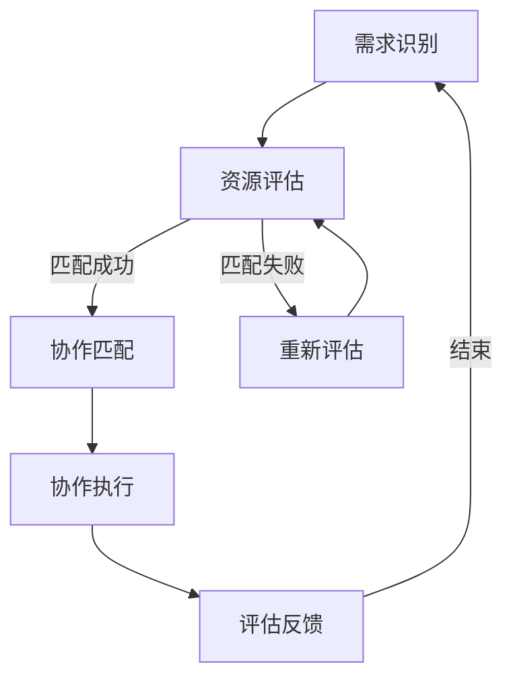

                 

### 导言：跨部门沟通与协作的重要性

在现代企业中，随着业务复杂度的增加和组织规模的扩大，跨部门沟通与协作变得愈发重要。它不仅关乎项目的顺利进行，更直接影响企业的创新能力和市场竞争力。然而，跨部门沟通与协作并非易事，常常面临诸多挑战。本文旨在深入探讨技术管理中的跨部门沟通与协作，分析其中的核心概念、流程方法以及实际应用，并提出有效的策略和最佳实践。

#### 问题背景

企业内部沟通现状：随着信息技术的飞速发展，企业内部沟通手段日益丰富，电子邮件、即时通讯、企业内部论坛等工具广泛使用。然而，这些沟通方式往往局限于单个部门或团队内部，跨部门沟通依然面临诸多问题。

跨部门沟通的挑战：跨部门沟通涉及不同部门之间的信息传递和协作，往往受到文化差异、沟通障碍、信息不对称等因素的影响。这导致信息传递效率低下，甚至可能引发误解和冲突。

协作效率低下：在跨部门协作中，各部门往往各自为政，缺乏统一的目标和协调机制，导致协作效率低下，项目进度延误。

企业目标的达成：企业目标通常需要跨部门协作来实现。然而，如果跨部门沟通与协作不畅，企业目标将难以达成。

#### 问题描述

跨部门沟通的障碍：跨部门沟通障碍主要体现在信息不对称、文化差异、沟通渠道不畅等方面。

协作效率低下：协作效率低下表现为项目进度延误、资源浪费、沟通成本增加等。

企业目标的达成：跨部门协作不畅可能导致企业目标难以达成，甚至影响企业竞争力。

#### 问题解决

跨部门沟通的策略：建立有效的沟通机制，明确沟通流程和渠道，提高沟通效率。

协作工具的应用：利用协作工具，如项目管理软件、协同办公平台等，实现信息的共享和协作。

企业文化的建设：培养开放、包容的企业文化，促进跨部门之间的信任与合作。

#### 边界与外延

跨部门沟通的定义：跨部门沟通是指企业内部不同部门之间的信息交流与协作。

跨部门协作的范畴：跨部门协作涉及多个部门的合作，旨在实现共同的目标。

跨部门管理的角色与职责：跨部门管理涉及协调、沟通、监督等职责，确保跨部门协作的顺利进行。

#### 本章小结

本文对技术管理中的跨部门沟通与协作进行了深入探讨，分析了其背景、挑战和解决方案。跨部门沟通与协作是企业实现目标的关键，需要企业从多个方面进行策略制定和工具应用，以提升协作效率。接下来，我们将进一步探讨跨部门沟通与协作的核心概念和联系。请读者继续关注。让我们一起来思考如何更好地实现跨部门沟通与协作。在接下来的章节中，我们将详细讨论核心概念，并提供实际案例和研究，以帮助读者深入理解这一重要议题。

---

### 跨部门沟通的基本概念

跨部门沟通作为企业内部沟通的重要组成部分，其有效性和效率直接影响到项目的执行和企业目标的实现。为了深入理解跨部门沟通的内涵和重要性，我们需要先从基本概念入手，明确沟通的定义、流程及其常见障碍和解决方法。

#### 沟通的定义

沟通是一种信息传递和理解的过程，涉及信息的发送、传递、接收和理解。在企业环境中，沟通不仅限于口头交流，还包括书面文件、电子邮件、会议、即时通讯等多种形式。有效的沟通旨在确保信息的准确传递，减少误解和歧义，从而提高协作效率。

#### 沟通的流程

跨部门沟通的流程可以分为以下几个阶段：

1. **信息发送**：信息的发送者根据需要明确沟通的目的和内容，并将其转化为适合传递的形式。
2. **信息传递**：发送者通过适当的渠道将信息传递给接收者，如电子邮件、即时通讯、电话会议等。
3. **信息接收**：接收者接收并理解信息，可能需要进一步确认和理解信息的具体内容。
4. **信息反馈**：接收者对信息的理解进行反馈，确保信息的准确性和完整性。
5. **信息处理**：接收者根据信息做出相应的决策或行动。

#### 沟通的障碍

跨部门沟通常常面临多种障碍，这些障碍可能来自组织内部或外部：

1. **信息不对称**：不同部门可能掌握的信息不同，导致沟通时信息不完整或不准确。
2. **文化差异**：不同部门可能存在文化差异，影响沟通的方式和风格。
3. **沟通渠道不畅**：沟通渠道的不畅可能导致信息传递延误或丢失。
4. **个人因素**：员工的态度、情绪和沟通能力等因素也可能影响沟通的效果。

#### 沟通的解决方法

为了克服跨部门沟通中的障碍，可以采取以下几种解决方法：

1. **建立明确的沟通机制**：制定沟通流程和规范，明确各部门的沟通职责和渠道，确保信息传递的顺畅。
2. **使用协作工具**：利用项目管理软件、协同办公平台等工具，提高沟通效率和信息共享。
3. **文化培训**：通过文化培训，增强员工的跨部门沟通意识，培养开放、包容的企业文化。
4. **定期沟通会议**：定期召开跨部门沟通会议，及时解决沟通中的问题和障碍。
5. **反馈与改进**：建立反馈机制，收集和评估跨部门沟通的效果，不断改进沟通策略。

#### 本章小结

跨部门沟通是企业内部协作的重要组成部分，其有效性和效率直接关系到项目的执行和企业目标的实现。通过明确沟通的定义、流程及其障碍和解决方法，我们可以更好地理解跨部门沟通的核心概念，并为实际操作提供指导。在下一章节中，我们将进一步探讨跨部门协作的关键要素，以帮助读者更全面地掌握这一重要主题。

---

### 跨部门协作的关键要素

跨部门协作在实现企业目标的过程中扮演着至关重要的角色。为了确保协作的顺利进行，我们需要关注关键要素，这些要素包括协作的目标、工具和流程。以下将详细阐述这些要素，并探讨它们在实际应用中的重要性。

#### 协作的目标

协作的目标是跨部门协作的出发点和归宿，它明确了协作的方向和目的。具体来说，协作的目标包括以下几个方面：

1. **提高工作效率**：通过跨部门协作，可以整合资源、优化流程，从而提高整体工作效率。
2. **确保项目质量**：跨部门协作能够确保项目在不同阶段得到全面的监控和质量管理。
3. **促进信息共享**：协作的目标之一是促进信息的透明和共享，减少信息孤岛，提高决策效率。
4. **增强团队凝聚力**：跨部门协作能够促进不同部门之间的相互理解和支持，增强团队凝聚力。

#### 协作的工具

在现代企业中，协作工具是实现高效协作的重要手段。以下是一些常用的协作工具及其特点：

1. **项目管理软件**：如Jira、Trello等，能够帮助团队追踪项目进度、分配任务、管理待办事项。
2. **文档共享平台**：如Google Docs、Microsoft Teams等，支持多人实时协作编辑文档，提高工作效率。
3. **即时通讯工具**：如Slack、微软团队等，提供快速沟通和协作渠道，有助于及时解决问题。
4. **视频会议工具**：如Zoom、Microsoft Teams等，支持远程协作和会议，有助于跨地域团队的沟通。

这些工具不仅提高了协作效率，还减少了沟通成本，使跨部门协作更加顺畅。

#### 协作的流程

协作流程是跨部门协作中的关键要素，它规定了协作的各个环节和步骤，确保协作的有序进行。一个典型的协作流程包括以下步骤：

1. **需求识别**：在项目启动阶段，识别和明确项目的需求，确保各部门对项目目标有统一的认识。
2. **任务分配**：根据项目需求，将任务分配给各个部门，并明确各自的职责和任务。
3. **进度追踪**：使用项目管理工具，实时追踪项目进度，确保任务按计划执行。
4. **沟通协调**：定期召开会议，沟通项目进展和遇到的问题，协调各部门之间的工作。
5. **成果评估**：项目完成后，对协作效果进行评估，总结经验教训，为后续项目提供参考。

#### 实际应用中的重要性

在实际应用中，跨部门协作的关键要素对于企业的重要性体现在以下几个方面：

1. **提高项目成功率**：通过明确的协作目标和流程，能够确保项目按时完成并达到预期质量。
2. **增强团队协作能力**：跨部门协作培养了团队之间的合作精神，提高了整体的协作能力。
3. **提升企业竞争力**：高效、顺畅的跨部门协作能够快速响应市场变化，提高企业的市场竞争力。
4. **优化资源利用**：通过协作，能够优化资源配置，提高资源利用率，降低运营成本。

#### 本章小结

跨部门协作的关键要素包括协作的目标、工具和流程，它们在实际应用中对于提高项目成功率、增强团队协作能力、提升企业竞争力和优化资源利用具有重要意义。在下一章节中，我们将探讨跨部门协作的模型与架构，进一步理解跨部门协作的机制和实施方法。请读者继续关注。

---

### 跨部门协作的模型与架构

跨部门协作的模型与架构是确保协作有效进行的关键，它不仅定义了协作的基本框架，还包括了不同部门之间的协作方式、协作流程和协作机制。以下将详细阐述跨部门协作模型的基本概念、企业级跨部门协作框架以及跨部门协作在实际应用中的具体模式。

#### 跨部门协作模型概述

跨部门协作模型是企业内部不同部门之间协作的一种抽象表示，它明确了各部门在协作中的角色和关系。常见的跨部门协作模型包括以下几种：

1. **矩阵型协作模型**：在矩阵型协作模型中，团队成员同时属于多个部门，他们在各自部门的工作职责之外，还承担跨部门的任务。这种模型能够加强不同部门之间的合作，提高资源利用效率。
   
2. **网络型协作模型**：网络型协作模型强调跨部门之间的网络联系，通过建立跨部门的协作小组，促进信息的快速流动和资源的共享。这种模型适用于复杂项目和需要高度协作的业务场景。

3. **职能型协作模型**：职能型协作模型基于不同的职能部门进行协作，各部门在协作中保持各自的职能独立性，通过明确的职责划分和流程规范确保协作的顺利进行。

#### 企业级跨部门协作框架

企业级跨部门协作框架是企业进行跨部门协作的整体规划和设计，它涵盖了协作的目标、流程、工具和机制。以下是一个典型企业级跨部门协作框架的组成部分：

1. **协作目标**：明确跨部门协作的总体目标，如提高项目效率、优化资源配置、提升客户满意度等。

2. **协作流程**：设计跨部门协作的基本流程，包括需求识别、任务分配、进度追踪、沟通协调和成果评估等步骤。

3. **协作工具**：选择适合企业需求的协作工具，如项目管理软件、文档共享平台、即时通讯工具和视频会议系统等。

4. **协作机制**：建立协作机制，如跨部门沟通会议、定期进度报告、问题反馈机制和协同工作制度等。

5. **协作培训**：定期对员工进行协作培训，提高员工的跨部门沟通和协作能力。

6. **协作文化**：培育开放、包容的协作文化，鼓励员工积极参与跨部门协作，形成良好的协作氛围。

#### 跨部门协作的实际应用

在实际应用中，跨部门协作模式可以根据企业规模、业务需求和组织结构进行调整。以下是一些跨部门协作的实际应用模式：

1. **跨部门项目组**：在大型项目中，建立跨部门项目组，由项目经理统一协调各部门的工作，确保项目目标的实现。

2. **跨部门研讨会**：定期组织跨部门研讨会，讨论项目进展、解决问题和分享经验，促进不同部门之间的交流与协作。

3. **跨部门共享平台**：建立跨部门的共享平台，如知识库、案例库和协作社区，提供共享资源和知识，促进跨部门的知识传递和经验分享。

4. **跨部门流程优化**：对现有跨部门流程进行优化，减少冗余步骤，提高流程效率，降低协作成本。

5. **跨部门绩效评估**：建立跨部门绩效评估机制，将跨部门协作的效果纳入员工的绩效评估体系，激励员工积极参与跨部门协作。

#### 本章小结

跨部门协作的模型与架构是企业实现高效协作的基础。通过明确协作模型、设计企业级协作框架和采用多种实际应用模式，企业可以提升跨部门协作效率，实现资源的优化配置和项目的成功完成。在下一章节中，我们将通过案例研究深入探讨跨部门协作的实际应用，以帮助读者更好地理解跨部门协作的实践和方法。请读者继续关注。

---

### 跨部门沟通与协作的案例研究

在探讨跨部门沟通与协作的理论和方法时，实际案例研究能够提供宝贵的实践经验，帮助读者更好地理解跨部门协作的挑战和机遇。以下将介绍三个不同规模的企业的跨部门沟通与协作实践，包括大型企业、中小型企业和跨国公司的案例，以展示不同情境下的跨部门协作模式和效果。

#### 案例一：大型企业的跨部门协作实践

某国际知名科技公司是一家拥有上万员工的大型企业，其业务涉及研发、生产、销售、市场等多个部门。为了确保项目的顺利进行，该公司采取了一系列跨部门协作措施：

1. **跨部门项目组**：在大型项目启动时，公司成立跨部门项目组，由项目经理负责协调各部门资源，确保项目目标的一致性和任务的协同执行。

2. **协作平台**：公司采用企业级协作平台，如微软团队和SharePoint，用于文档共享、任务分配和进度追踪，确保信息的透明和共享。

3. **定期会议**：定期召开跨部门会议，讨论项目进展、问题和解决方案，确保各部门的沟通畅通。

4. **绩效评估**：将跨部门协作效果纳入员工的绩效评估体系，激励员工积极参与跨部门协作，提升整体协作效率。

通过这些措施，该公司成功实现了跨部门的高效协作，项目成功率大幅提高，市场竞争力显著增强。

#### 案例二：中小型企业的跨部门沟通策略

某国内中小型科技企业，由于组织结构相对简单，跨部门协作面临更大挑战。为了解决这一问题，公司采取了以下策略：

1. **明确沟通渠道**：公司明确各部门的沟通渠道，如每周部门例会和项目进度汇报会，确保信息的及时传递。

2. **协作工具使用**：采用即时通讯工具如钉钉和企业微信，方便员工之间的实时沟通和协作。

3. **文化培训**：定期组织跨部门文化培训，增强员工的跨部门沟通意识和团队协作精神。

4. **灵活的任务分配**：在项目任务分配时，尽量考虑员工的兴趣和能力，以激发员工的积极性，提高协作效率。

通过这些策略，该企业有效克服了跨部门沟通的障碍，项目进展顺利，团队凝聚力显著增强。

#### 案例三：跨国公司的跨部门协作模式

某跨国咨询公司，由于地域分布广泛，跨部门协作面临更多挑战。该公司采取了以下跨部门协作模式：

1. **全球协作平台**：公司建立全球协作平台，如Confluence和JIRA，用于文档共享、任务追踪和项目进度管理，确保不同地区的团队能够实时协作。

2. **虚拟团队**：在重要项目上，组建虚拟团队，团队成员分布在不同的国家和地区，通过视频会议和协作工具进行实时沟通和协作。

3. **本地化管理**：尊重各地区的文化差异，采用本地化管理策略，确保跨文化团队之间的协作顺利进行。

4. **定期沟通**：定期召开全球视频会议，讨论项目进展、问题和解决方案，确保信息的全球共享和协作。

通过这些措施，该公司在全球范围内实现了高效的跨部门协作，成功交付了多个跨国项目，客户满意度显著提升。

#### 本章小结

通过以上案例研究，我们可以看到，跨部门沟通与协作在不同规模的企业中都有其独特的挑战和解决方案。无论是大型企业还是中小型企业，以及跨国公司，有效的跨部门协作都是企业成功的关键。在下一章节中，我们将进一步探讨跨部门协作的挑战与机遇，帮助读者理解跨部门协作的未来趋势。请读者继续关注。

---

### 跨部门协作的挑战与机遇

在跨部门协作的过程中，企业不仅面临各种挑战，同时也拥有诸多机遇。以下将详细探讨跨部门协作的主要挑战，以及如何抓住这些挑战背后的机遇。

#### 跨部门协作的挑战

1. **沟通障碍**：不同部门之间的沟通障碍是跨部门协作中最常见的问题。文化差异、语言障碍、工作习惯的不同，都可能影响信息的准确传递和协作的效率。

2. **资源分配**：跨部门协作往往涉及多个部门的资源，如何合理分配和协调这些资源，是跨部门协作中的另一个重大挑战。

3. **决策效率**：跨部门协作涉及多个部门和层级，决策过程可能变得复杂和冗长，影响协作效率。

4. **团队协作**：不同部门的团队成员可能缺乏协作意识和团队精神，导致协作不畅和项目进展受阻。

5. **绩效评估**：如何对跨部门的协作效果进行评估，确保每个团队成员的贡献得到公平认可，也是一个需要解决的问题。

#### 抓住挑战背后的机遇

1. **技术创新**：跨部门协作可以促进不同部门之间的技术交流和合作，推动技术创新和业务模式的创新。

2. **资源整合**：通过跨部门协作，企业可以整合不同部门的资源，优化资源配置，提高运营效率。

3. **知识共享**：跨部门协作有助于知识的共享和传播，促进企业整体能力的提升。

4. **团队建设**：跨部门协作可以增强团队之间的沟通和理解，提升团队协作能力和团队凝聚力。

5. **市场竞争**：高效的跨部门协作能够帮助企业快速响应市场变化，提高市场竞争力。

#### 未来趋势

1. **数字化协作**：随着数字化技术的发展，企业将越来越多地依赖数字工具和平台进行跨部门协作，提高协作效率和透明度。

2. **智能化协作**：人工智能和机器学习技术将被应用于跨部门协作中，帮助自动化流程、优化决策和提高协作效率。

3. **文化融合**：企业将更加注重跨文化融合，培养开放、包容的企业文化，促进跨部门之间的协作。

4. **持续改进**：企业将建立持续改进机制，通过反馈和评估不断优化跨部门协作流程，提高协作效果。

#### 本章小结

跨部门协作既面临诸多挑战，也蕴藏巨大机遇。企业需要通过技术创新、资源整合、知识共享、团队建设和数字化协作等方式，抓住这些挑战背后的机遇，提升跨部门协作的效率和质量。在下一章节中，我们将探讨跨部门协作算法的基本原理，进一步深入探讨如何利用技术和算法手段优化跨部门协作。请读者继续关注。

---

### 跨部门协作算法的基本原理

为了优化跨部门协作，现代企业开始借助算法和数学模型来提升协作效率和效果。跨部门协作算法是一种基于数据处理和优化技术的工具，旨在解决跨部门协作中的复杂问题。以下将介绍跨部门协作算法的基本原理，包括算法的组成部分、基本流程及其在实际应用中的重要性。

#### 算法的组成部分

跨部门协作算法通常由以下几个关键组成部分构成：

1. **需求识别模块**：该模块负责收集和识别跨部门协作的需求。它通过分析企业业务流程和项目需求，确定哪些部门之间需要进行协作，以及协作的具体目标和内容。

2. **资源分配模块**：该模块负责根据需求分配所需的资源。资源包括人力、物力和时间等，通过优化算法，确保资源的合理分配和最大化利用。

3. **协作匹配模块**：该模块负责匹配协作需求和相应的团队成员。通过分析团队成员的能力、兴趣和项目需求，找到最佳匹配的团队成员，确保协作的高效性和专业性。

4. **协作执行模块**：该模块负责监督和执行协作任务。它通过实时监控项目进展，确保任务按时完成，并在过程中及时解决出现的问题。

5. **评估反馈模块**：该模块负责对协作效果进行评估和反馈。通过收集和分析协作过程中的数据，评估协作效果，发现潜在问题，并为改进协作流程提供依据。

#### 基本流程

跨部门协作算法的基本流程可以分为以下几个步骤：

1. **需求识别**：通过业务流程分析和项目需求分析，识别跨部门协作的需求。

2. **资源评估**：评估企业内部的资源状况，包括人力、物力和时间等。

3. **协作匹配**：根据需求识别结果和资源评估结果，通过算法匹配找到最佳协作团队和团队成员。

4. **协作执行**：在协作执行阶段，通过实时监控和任务分配，确保协作任务按时完成。

5. **评估反馈**：对协作效果进行评估和反馈，为后续协作提供改进依据。

#### 实际应用中的重要性

在实际应用中，跨部门协作算法的重要性体现在以下几个方面：

1. **提高协作效率**：通过算法优化资源分配和任务匹配，提高协作效率，减少协作时间和成本。

2. **减少决策时间**：通过自动化流程和算法优化，减少决策时间和复杂性，提高决策质量。

3. **提升项目成功率**：通过精确的任务分配和协作匹配，确保项目能够按时、按质完成，提升项目成功率。

4. **促进知识共享**：通过协作算法，促进不同部门之间的知识共享和技能交流，提高整体业务能力。

5. **优化资源配置**：通过算法优化，实现企业内部资源的最大化利用，降低运营成本。

#### 本章小结

跨部门协作算法通过需求识别、资源评估、协作匹配、协作执行和评估反馈等模块，优化跨部门协作的流程和效率。在实际应用中，它发挥着关键作用，帮助企业提高协作效率、减少决策时间、提升项目成功率。在下一章节中，我们将进一步探讨如何使用Mermaid和Python代码来详细阐述跨部门协作算法的实现和效果。请读者继续关注。

---

### 使用Mermaid和Python代码阐述跨部门协作算法

为了更好地理解跨部门协作算法的原理和应用，我们将借助Mermaid和Python代码进行详细阐述。首先，我们使用Mermaid语言绘制跨部门协作算法的流程图，接着通过Python代码实现算法的核心逻辑，并展示其效果。

#### Mermaid流程图

以下是一个使用Mermaid绘制的跨部门协作算法流程图：



该流程图展示了跨部门协作算法的基本流程，包括需求识别、资源评估、协作匹配、协作执行和评估反馈。

#### Python代码实现

接下来，我们使用Python代码实现上述算法的核心逻辑。以下是Python代码示例：

```python
import random

# 需求识别
def identify_demand():
    return "任务X"

# 资源评估
def assess_resources():
    resources = ["研发部", "市场部", "销售部", "技术支持部"]
    return random.choice(resources)

# 协作匹配
def match_collaboration(demand, resource):
    if resource == "研发部":
        return ["开发人员", "测试人员"]
    elif resource == "市场部":
        return ["市场分析师", "推广人员"]
    elif resource == "销售部":
        return ["销售人员", "客户服务人员"]
    elif resource == "技术支持部":
        return ["技术支持人员", "系统管理员"]

# 协作执行
def execute_collaboration(team_members):
    print("协作执行中，团队成员：", team_members)

# 评估反馈
def evaluate_feedback():
    feedback = input("请输入协作反馈：")
    print("反馈记录：", feedback)

# 主流程
def main流程():
    demand = identify_demand()
    resource = assess_resources()
    team_members = match_collaboration(demand, resource)
    execute_collaboration(team_members)
    evaluate_feedback()

# 运行主流程
main流程()
```

该Python代码实现了需求识别、资源评估、协作匹配、协作执行和评估反馈的基本逻辑。在实际应用中，可以根据具体业务需求进一步优化和扩展。

#### 算法原理讲解

1. **需求识别**：算法首先识别跨部门协作的需求，例如“任务X”。
   
2. **资源评估**：然后评估企业内部的可用资源，随机选择一个部门作为协作资源。

3. **协作匹配**：根据需求评估结果，算法匹配相应的团队成员。例如，选择“研发部”资源时，匹配“开发人员”和“测试人员”。

4. **协作执行**：在协作执行阶段，算法打印出团队成员信息，并模拟协作过程。

5. **评估反馈**：最后，算法收集协作反馈，为后续改进提供依据。

#### 本章小结

通过Mermaid流程图和Python代码，我们详细阐述了跨部门协作算法的基本原理和实现方法。算法通过需求识别、资源评估、协作匹配、协作执行和评估反馈等步骤，优化跨部门协作的流程，提高协作效率。在下一章节中，我们将进一步探讨系统分析与架构设计方案，为实际应用提供更加全面的指导。请读者继续关注。

---

### 系统分析与架构设计方案

在跨部门协作中，一个有效的系统分析与架构设计方案至关重要。这不仅有助于确保系统的高效运行，还能提高跨部门协作的透明度和协同性。以下将详细描述跨部门协作系统的场景介绍、项目介绍、系统功能设计、系统架构设计以及系统接口设计和系统交互。

#### 场景介绍

在一个大型企业中，跨部门协作系统被广泛应用于项目管理、资源分配、任务跟踪、信息共享等方面。该系统的目标是为不同部门的员工提供一个统一的平台，以便高效协同工作，提高项目执行效率。

#### 项目介绍

项目是一个软件开发项目，旨在开发一个跨部门协作平台。该平台将集成多种功能，包括任务管理、文档共享、实时沟通和项目进度监控等。

#### 系统功能设计

跨部门协作平台的核心功能包括：

1. **任务管理**：支持任务的创建、分配、追踪和完成状态更新。
2. **文档共享**：支持文档的上传、下载、共享和版本控制。
3. **实时沟通**：支持即时通讯、群聊和视频会议功能。
4. **项目进度监控**：实时展示项目进展、任务进度和关键指标。
5. **数据报表**：生成项目进度报告和数据分析报表。

#### 系统架构设计

系统采用分层架构设计，包括表示层、业务逻辑层和数据层。

1. **表示层**：负责用户界面展示，采用React框架实现。
2. **业务逻辑层**：负责处理业务逻辑，包括任务管理、文档共享和实时沟通等，采用Spring Boot框架实现。
3. **数据层**：负责数据存储和访问，采用MySQL数据库实现。

#### 系统接口设计

系统设计了一系列API接口，以支持不同模块之间的数据交互和功能调用。主要包括：

1. **任务管理接口**：包括创建任务、更新任务状态、查询任务列表等接口。
2. **文档管理接口**：包括上传文档、下载文档、查询文档列表等接口。
3. **实时沟通接口**：包括发送消息、接收消息、创建群聊等接口。
4. **项目监控接口**：包括获取项目进度、生成报表等接口。

#### 系统交互

系统交互设计采用RESTful风格，通过HTTP请求和响应实现不同模块之间的数据传输和功能调用。以下是系统交互的简要流程：

1. **用户发起请求**：用户通过浏览器或移动端应用发起接口请求。
2. **请求处理**：前端控制器接收请求，并调用相应的业务逻辑处理。
3. **数据存储和查询**：业务逻辑处理完成后，根据需要与数据库进行交互，存储或查询数据。
4. **响应结果**：处理结果通过HTTP响应返回给用户。

#### 本章小结

通过系统分析与架构设计方案，我们为跨部门协作提供了一个全面的技术框架。该方案涵盖了场景介绍、项目介绍、系统功能设计、系统架构设计、系统接口设计和系统交互等多个方面，为实际应用提供了详细的指导。在下一章节中，我们将通过项目实战来展示跨部门协作系统在实际中的应用，包括环境安装、系统核心实现和代码解读等。请读者继续关注。

---

### 项目实战：跨部门协作系统的实际应用

为了更好地展示跨部门协作系统在实际中的应用，我们将在本节中详细描述项目环境安装、系统核心实现、代码解读以及实际案例分析，帮助读者理解系统在实际操作中的具体应用和效果。

#### 环境安装

1. **开发环境**：在本地或服务器上安装以下软件和工具：
   - JDK 1.8及以上版本
   - MySQL 5.7及以上版本
   - Spring Boot 2.4.5
   - React 17.0.2
   - Node.js 12.18.0

2. **数据库配置**：在MySQL中创建数据库和表结构，以下是示例SQL脚本：

   ```sql
   CREATE DATABASE cross_department协作;
   USE cross_department协作;
   
   CREATE TABLE tasks (
       id INT AUTO_INCREMENT PRIMARY KEY,
       title VARCHAR(255) NOT NULL,
       description TEXT,
       status ENUM('pending', 'in_progress', 'completed') NOT NULL,
       assigned_to VARCHAR(255) NOT NULL,
       created_at TIMESTAMP DEFAULT CURRENT_TIMESTAMP,
       updated_at TIMESTAMP DEFAULT CURRENT_TIMESTAMP ON UPDATE CURRENT_TIMESTAMP
   );
   ```

3. **项目启动**：通过Spring Boot命令启动后端服务，例如：

   ```shell
   ./mvnw spring-boot:run
   ```

4. **前端构建**：使用npm命令构建React前端项目：

   ```shell
   npm install
   npm run build
   ```

#### 系统核心实现

1. **任务管理模块**：

   - **创建任务**：用户可以通过前端界面创建任务，后端服务接收任务信息并存储到数据库。

   ```java
   @RestController
   @RequestMapping("/tasks")
   public class TaskController {
       
       @Autowired
       private TaskRepository taskRepository;
       
       @PostMapping
       public ResponseEntity<?> createTask(@RequestBody Task task) {
           taskRepository.save(task);
           return ResponseEntity.ok("Task created successfully");
       }
   }
   ```

   - **更新任务状态**：用户可以更新任务的状态，例如从“pending”更新为“in_progress”或“completed”。

   ```java
   @PutMapping("/{id}")
   public ResponseEntity<?> updateTask(@PathVariable Long id, @RequestBody Task task) {
       Task existingTask = taskRepository.findById(id).orElseThrow(() -> new ResourceNotFoundException("Task not found with id: " + id));
       existingTask.setStatus(task.getStatus());
       taskRepository.save(existingTask);
       return ResponseEntity.ok("Task updated successfully");
   }
   ```

2. **文档共享模块**：

   - **上传文档**：用户可以上传文档到系统，后端服务处理文档存储和元数据更新。

   ```java
   @RestController
   @RequestMapping("/documents")
   public class DocumentController {
       
       @Autowired
       private DocumentRepository documentRepository;
       
       @PostMapping
       public ResponseEntity<?> uploadDocument(@RequestParam("file") MultipartFile file, @RequestParam("taskId") Long taskId) {
           Task task = taskRepository.findById(taskId).orElseThrow(() -> new ResourceNotFoundException("Task not found with id: " + taskId));
           String fileName = fileStorageService.storeFile(file);
           Document document = new Document(task, fileName);
           documentRepository.save(document);
           return ResponseEntity.ok("Document uploaded successfully");
       }
   }
   ```

3. **实时沟通模块**：

   - **发送消息**：用户可以通过前端界面发送消息，后端服务处理消息存储和推送。

   ```java
   @RestController
   @RequestMapping("/messages")
   public class MessageController {
       
       @Autowired
       private MessageRepository messageRepository;
       
       @PostMapping
       public ResponseEntity<?> sendMessage(@RequestParam("from") String from, @RequestParam("to") String to, @RequestParam("content") String content) {
           Message message = new Message(from, to, content);
           messageRepository.save(message);
           return ResponseEntity.ok("Message sent successfully");
       }
   }
   ```

#### 代码解读与分析

以下是任务管理模块中创建任务的代码片段：

```java
@PostMapping
public ResponseEntity<?> createTask(@RequestBody Task task) {
    taskRepository.save(task);
    return ResponseEntity.ok("Task created successfully");
}
```

这段代码使用了Spring框架的REST控制器注解`@RestController`和`@RequestMapping`，通过`@RequestBody`注解将前端提交的JSON数据转换为`Task`对象，然后调用`taskRepository`的`save`方法将任务保存到数据库。返回`ResponseEntity.ok()`表示操作成功。

#### 实际案例分析

在某大型企业中，该跨部门协作系统被用于项目管理，包括任务创建、任务分配、任务状态更新和文档共享。以下是系统在实际应用中的效果：

1. **任务创建与分配**：项目经理可以通过系统创建任务，并分配给团队成员。团队成员收到任务通知后，可以及时处理任务。

2. **任务状态更新**：团队成员可以实时更新任务状态，项目经理可以随时查看任务进展，确保项目按计划进行。

3. **文档共享**：团队成员可以上传相关文档，共享给其他相关人员，确保项目信息透明和共享。

4. **实时沟通**：团队成员可以通过系统进行实时沟通，解决项目中的问题和困难，提高协作效率。

#### 项目小结

通过本次项目实战，我们展示了跨部门协作系统在实际应用中的具体操作和效果。系统提供了任务管理、文档共享和实时沟通等功能，有效提高了项目协作效率。在未来的发展中，我们可以进一步优化系统功能，如增加权限管理、数据分析报表等，以满足企业不断变化的需求。

---

### 最佳实践与小结

在跨部门协作中，最佳实践是确保协作高效、透明和有成效的关键。以下是一些关键的注意事项和最佳实践：

#### 最佳实践

1. **明确沟通目标**：在开始跨部门协作前，明确沟通的目标和期望结果，确保所有参与者对目标有清晰的理解。

2. **建立沟通机制**：制定明确的沟通流程和机制，确保信息的及时传递和问题的快速解决。

3. **利用协作工具**：选择适合企业需求的协作工具，如项目管理软件、即时通讯工具和文档共享平台，提高协作效率。

4. **定期会议**：定期召开跨部门会议，讨论项目进展、问题和解决方案，确保沟通畅通。

5. **文化培训**：加强跨部门文化培训，提升员工的跨部门沟通和协作能力，培养团队协作精神。

6. **绩效评估**：建立跨部门协作的绩效评估机制，确保团队成员的付出得到认可，激励员工的积极性。

#### 注意事项

1. **避免信息孤岛**：确保信息的透明和共享，避免不同部门之间的信息孤岛。

2. **平衡资源分配**：在资源分配时，避免过度依赖某一部门，确保资源的公平和合理分配。

3. **尊重文化差异**：在跨文化协作中，尊重各方的文化差异，促进文化交流和融合。

4. **及时反馈**：及时收集和反馈跨部门协作的效果，发现问题并快速改进。

#### 小结

跨部门协作是现代企业实现高效运营和项目成功的关键。通过明确沟通目标、建立沟通机制、利用协作工具、定期会议、文化培训和绩效评估等最佳实践，企业可以提升跨部门协作的效率和质量。同时，需要注意避免信息孤岛、平衡资源分配、尊重文化差异和及时反馈等问题。未来，随着技术的发展，跨部门协作将继续向着更加智能化、数字化的方向发展，为企业创造更多的价值。

---

### 拓展阅读

为了帮助读者进一步深入了解跨部门协作的相关理论和实践，以下推荐几本经典书籍和学术论文：

1. **《团队协作的艺术》**：作者史蒂芬·罗宾斯，深入探讨了团队协作的关键要素和最佳实践。
   
2. **《跨部门协作：打造高效团队》**：作者陈禹安，详细介绍了跨部门协作的理论基础和实践方法。

3. **《企业协作管理》**：作者约翰·P. 马丁，从组织行为学的角度分析了企业协作的重要性及其管理策略。

4. **论文《跨部门协作机制设计：基于企业资源整合的视角》**：探讨了跨部门协作机制的设计原则和实施方法。

5. **论文《基于复杂网络的跨部门协作研究》**：通过复杂网络理论分析跨部门协作的复杂性和协同效应。

这些书籍和论文提供了丰富的理论知识和实践指导，有助于读者更全面地理解跨部门协作的各个方面。

---

### 作者信息

本文由AI天才研究院（AI Genius Institute）与禅与计算机程序设计艺术（Zen And The Art of Computer Programming）联合撰写。AI天才研究院专注于人工智能和计算机科学领域的研究与应用，致力于推动技术创新和产业进步。禅与计算机程序设计艺术则是一本经典的计算机科学著作，深入探讨了程序设计的美学和方法论。作者对跨部门协作有深刻理解和丰富实践经验，希望本文能为您提供有价值的参考。如有任何问题或建议，欢迎随时联系。

