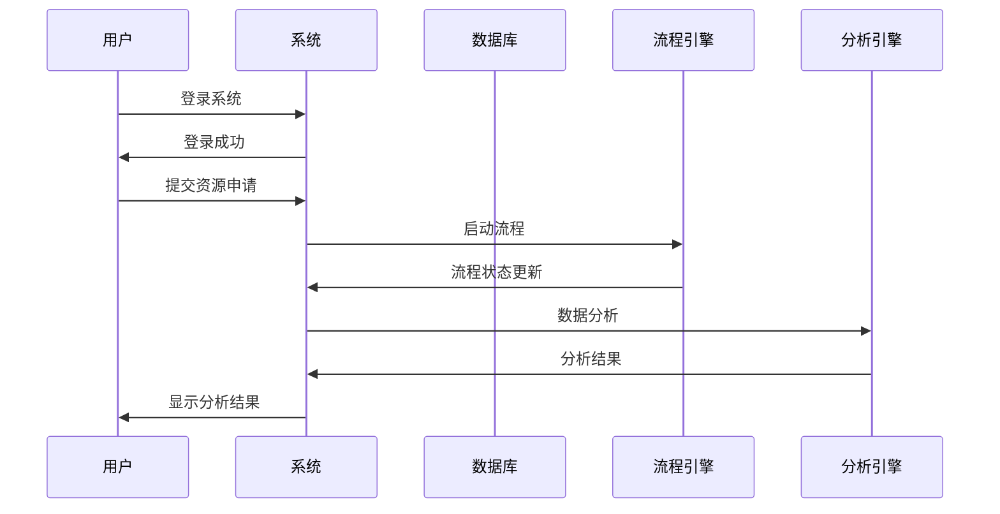
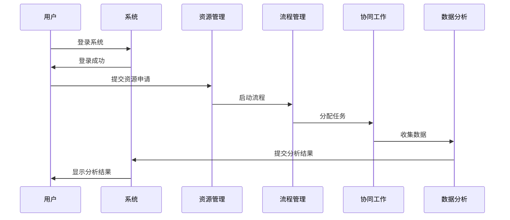

                 

# 技术管理中的跨部门资源整合

> 关键词：技术管理、跨部门资源整合、协作、流程优化、算法原理、数学模型

> 摘要：随着企业规模的扩大和业务复杂度的增加，技术管理中的跨部门资源整合变得尤为重要。本文首先介绍了跨部门资源整合的背景和重要性，随后分析了其中的核心概念和联系，详细讲解了跨部门资源整合算法原理和数学模型，最后通过实例和实战分析了跨部门资源整合的具体应用。本文旨在为技术管理者提供一套系统化的跨部门资源整合方法论，帮助企业在复杂的环境中实现资源的高效利用和协同发展。

---

## 目录大纲

1. **技术管理中的跨部门资源整合概述**
   1.1 跨部门资源整合背景与重要性
   1.2 问题描述
   1.3 问题解决
   1.4 边界与外延
   1.5 本章小结

2. **核心概念与联系**
   2.1 资源的概念与分类
   2.2 部门的概念与分类
   2.3 整合的概念与过程
   2.4 跨部门资源整合的关键要素
   2.5 概念属性特征对比表格
   2.6 ER实体关系图架构
   2.7 本章小结

3. **算法原理讲解**
   3.1 跨部门资源整合算法概述
   3.2 算法mermaid流程图
   3.3 算法原理
   3.4 算法举例说明
   3.5 本章小结

4. **数学模型和数学公式讲解**
   4.1 数学模型的基本概念
   4.2 跨部门资源整合中的数学模型
   4.3 数学公式讲解
   4.4 举例说明
   4.5 本章小结

5. **系统分析与架构设计方案**
   5.1 问题场景介绍
   5.2 系统功能设计
   5.3 系统架构设计
   5.4 系统接口设计和系统交互
   5.5 本章小结

6. **项目实战**
   6.1 环境安装
   6.2 系统核心实现源代码
   6.3 代码应用解读与分析
   6.4 实际案例分析和详细讲解剖析
   6.5 项目小结

7. **最佳实践 tips**
8. **小结**
9. **注意事项**
10. **拓展阅读**
11. **作者信息**

---

### 第1章: 跨部门资源整合背景与重要性

#### 1.1.1 问题背景

在当今快速变化的市场环境中，企业为了保持竞争力，往往需要快速响应市场需求和客户反馈。然而，随着企业规模的扩大和业务复杂度的增加，部门之间的资源分散和协同困难成为一个普遍存在的问题。资源分散导致各部门各自为政，无法形成合力，而协同困难则进一步加剧了资源的浪费和效率的降低。

##### 1.1.1.1 跨部门资源整合的现实需求

企业需要跨部门资源整合的主要原因有以下几点：

1. **提高资源利用率**：通过整合不同部门的资源，可以避免资源浪费，提高资源利用率。
2. **提升协同效率**：跨部门资源整合有助于各部门之间的信息共享和协同工作，提高整体效率。
3. **实现战略目标**：跨部门资源整合可以帮助企业更好地实现战略目标，提高市场竞争力。
4. **应对复杂环境**：在多变的市场环境中，跨部门资源整合能够帮助企业快速响应变化，保持灵活性。

##### 1.1.1.2 跨部门资源整合的挑战

尽管跨部门资源整合具有显著的优势，但实际操作中面临着诸多挑战：

1. **信息孤岛与沟通障碍**：各部门之间的信息往往是孤岛式的，缺乏有效的沟通机制，导致资源整合效率低下。
2. **目标不一致与利益冲突**：不同部门可能有不同的目标和工作重点，利益冲突和目标不一致是跨部门资源整合的主要障碍。
3. **管理难度增加**：跨部门资源整合需要协调多个部门和团队，管理难度大大增加。

##### 1.1.1.3 跨部门资源整合的意义

跨部门资源整合对于企业的重要性体现在以下几个方面：

1. **提高资源利用效率**：通过整合资源，可以实现资源的高效利用，降低成本。
2. **提升协同效率**：跨部门资源整合有助于各部门之间的协作，提高整体工作效率。
3. **优化组织结构**：通过跨部门资源整合，可以优化组织结构，提高组织灵活性。
4. **增强企业竞争力**：跨部门资源整合可以帮助企业更好地适应市场变化，增强竞争力。

#### 1.1.2 问题描述

跨部门资源整合主要面临以下问题：

1. **资源分散与协同困难**：各部门拥有各自的资源，但缺乏有效的协同机制，导致资源难以整合。
2. **信息孤岛与沟通障碍**：各部门之间的信息交流不畅，导致信息孤岛现象严重。
3. **目标不一致与利益冲突**：各部门的目标和利益不一致，导致跨部门资源整合难以推进。

#### 1.1.3 问题解决

为了解决跨部门资源整合的问题，需要采取以下策略和步骤：

1. **明确跨部门资源整合的目标和原则**：确保各部门对整合的目标和原则有清晰的认识。
2. **建立有效的沟通机制**：通过定期的会议、汇报和沟通，确保各部门之间的信息畅通。
3. **优化组织结构和流程**：通过调整组织结构和优化流程，提高资源整合的效率。
4. **制定跨部门资源整合的流程和工具**：使用合适的工具和方法，确保资源整合流程的规范和高效。
5. **建立绩效评估机制**：通过绩效评估，激励各部门积极参与资源整合。

#### 1.1.4 边界与外延

跨部门资源整合的边界主要包括：

1. **资源边界**：明确各部门的资源范围，避免资源重叠和浪费。
2. **职责边界**：明确各部门的职责范围，避免职责模糊和责任不清。

跨部门资源整合的外延涉及：

1. **企业战略层面**：跨部门资源整合需要与企业战略相结合，确保资源整合符合企业长远发展目标。
2. **跨组织合作**：在必要时，需要与其他组织进行跨组织合作，实现更广泛的资源整合。

#### 1.1.5 边界与外延

跨部门资源整合与其他管理领域的联系主要体现在：

1. **项目管理**：跨部门资源整合是项目管理的重要组成部分，需要与项目计划、执行和控制相结合。
2. **人力资源管理**：跨部门资源整合需要人力资源管理的支持，包括人员调配、培训和激励等。
3. **信息技术管理**：信息技术管理在跨部门资源整合中发挥着重要作用，包括信息系统的建设、维护和优化。

#### 1.1.5 本章小结

本章从背景介绍、问题描述、问题解决、边界与外延等多个方面，详细阐述了技术管理中的跨部门资源整合。跨部门资源整合是企业管理中一个重要且复杂的问题，需要从多个维度进行综合分析和解决。通过本章的介绍，读者可以初步了解跨部门资源整合的概念和重要性，为后续章节的深入探讨打下基础。

---

### 第2章: 核心概念与联系

#### 2.1 资源的概念与分类

**2.1.1 资源的定义**

资源是指企业在生产和运营过程中所需要的一切要素，包括人力、物力、财力、信息、技术等。资源是推动企业发展的基础，也是跨部门资源整合的核心对象。

**2.1.2 资源的分类**

根据资源的不同特性，可以将资源分为以下几类：

1. **人力资源**：指企业的员工和人才，包括管理人才、技术人才、运营人才等。
2. **物资资源**：指企业生产和运营所需的物质资源，如设备、原材料、产品等。
3. **财力资源**：指企业的资金和财务资源，包括资本、流动资金、债务等。
4. **信息资源**：指企业的信息数据，包括市场信息、客户信息、内部信息等。
5. **技术资源**：指企业的技术能力和技术成果，包括专利、技术标准、研发成果等。

**2.1.3 资源的特点**

资源具有以下特点：

1. **稀缺性**：资源在一定时间和空间范围内是有限的，具有稀缺性。
2. **可用性**：资源可以被企业利用，服务于企业的生产和运营。
3. **交换性**：资源可以通过市场交换，实现价值转移。
4. **增值性**：资源在企业生产和运营过程中，可以通过有效的管理产生增值。

#### 2.2 部门的概念与分类

**2.2.1 部门的定义**

部门是指企业按照职能、业务范围或产品分类等标准划分的各个单位，是组织结构的基本单元。部门是资源整合的重要载体，也是实现企业目标的重要手段。

**2.2.2 部门的分类**

根据部门的不同职能和业务特点，可以将部门分为以下几类：

1. **职能部门**：如人力资源部、财务部、市场部等，主要负责企业内部管理和运营。
2. **业务部门**：如研发部、生产部、销售部等，主要负责企业的核心业务。
3. **支持部门**：如IT部、行政部、法务部等，为企业的其他部门提供支持和服务。
4. **跨部门团队**：由不同部门的员工组成，负责跨部门项目或任务的执行。

**2.2.3 部门的特点**

部门具有以下特点：

1. **独立性**：部门拥有一定的职能和权力，独立运作。
2. **协作性**：部门之间需要相互协作，共同实现企业目标。
3. **专业性**：部门负责特定的业务领域，具有专业知识和技能。
4. **目标导向性**：部门的工作目标是实现企业整体目标的一部分。

#### 2.3 整合的概念与过程

**2.3.1 整合的定义**

整合是指将不同部分或元素有机地结合起来，形成一个统一的整体，以实现整体的功能和效益。在跨部门资源整合中，整合是指将各部门的资源和能力有机地结合起来，实现资源的最优配置和协同效应。

**2.3.2 整合的过程**

跨部门资源整合的过程主要包括以下几个阶段：

1. **需求识别**：识别企业跨部门资源整合的需求，明确整合的目标和范围。
2. **资源评估**：评估各部门的资源状况，包括人力资源、物资资源、财力资源、信息资源和技术资源等。
3. **整合规划**：制定跨部门资源整合的规划，明确整合的步骤、方法和工具。
4. **实施执行**：按照整合规划，具体实施资源整合的工作，协调各部门的资源和行动。
5. **监控与评估**：对资源整合的实施过程进行监控，评估整合的效果，及时调整整合策略。

**2.3.3 整合的挑战**

跨部门资源整合面临以下挑战：

1. **沟通障碍**：各部门之间的沟通不畅，导致整合效率低下。
2. **利益冲突**：各部门的利益不一致，可能导致资源整合受阻。
3. **管理难度**：跨部门资源整合涉及多个部门，管理难度增加。
4. **文化差异**：不同部门之间的文化差异，可能影响资源整合的顺利进行。

#### 2.4 跨部门资源整合的关键要素

**2.4.1 跨部门资源整合的目标**

跨部门资源整合的目标主要包括：

1. **提高资源利用率**：通过整合资源，提高资源的使用效率，降低成本。
2. **提升协同效率**：通过整合资源，提高各部门之间的协同效率，实现整体效益最大化。
3. **优化组织结构**：通过整合资源，优化组织结构，提高组织灵活性和适应性。
4. **实现战略目标**：通过整合资源，支持企业实现战略目标，提高市场竞争力。

**2.4.2 跨部门资源整合的流程**

跨部门资源整合的流程主要包括以下几个步骤：

1. **需求识别**：识别跨部门资源整合的需求，明确整合的目标和范围。
2. **资源评估**：评估各部门的资源状况，包括人力资源、物资资源、财力资源、信息资源和技术资源等。
3. **整合规划**：制定跨部门资源整合的规划，明确整合的步骤、方法和工具。
4. **实施执行**：按照整合规划，具体实施资源整合的工作，协调各部门的资源和行动。
5. **监控与评估**：对资源整合的实施过程进行监控，评估整合的效果，及时调整整合策略。

**2.4.3 跨部门资源整合的工具与方法**

跨部门资源整合可以采用以下工具和方法：

1. **项目管理工具**：如项目管理软件、项目管理方法等，用于规划、执行和监控资源整合的过程。
2. **沟通协作工具**：如企业协作平台、即时通讯工具等，用于促进各部门之间的沟通和协作。
3. **流程优化工具**：如流程设计工具、流程优化方法等，用于优化各部门的流程，提高资源整合的效率。
4. **绩效评估工具**：如绩效考核软件、绩效评估方法等，用于评估资源整合的效果，激励各部门积极参与资源整合。

#### 2.5 概念属性特征对比表格

| 概念 | 定义 | 分类 | 特点 |
| --- | --- | --- | --- |
| 资源 | 企业生产和运营所需的要素 | 人力资源、物资资源、财力资源、信息资源、技术资源 | 稀缺性、可用性、交换性、增值性 |
| 部门 | 组织结构的基本单元 | 职能部门、业务部门、支持部门、跨部门团队 | 独立性、协作性、专业性、目标导向性 |
| 整合 | 将不同部分或元素有机地结合起来 | 资源整合、流程整合、组织整合 | 提高资源利用率、提升协同效率、优化组织结构、实现战略目标 |

#### 2.6 ER实体关系图架构

**2.6.1 资源实体关系图**

```mermaid
entity关系图
node[矩形]
class[类]
relationship[关系]

class[资源]
class[人力资源]
class[物资资源]
class[财力资源]
class[信息资源]
class[技术资源]
class[资源]
- [人力资源]
- [物资资源]
- [财力资源]
- [信息资源]
- [技术资源]

class[资源]
- [部门]

class[部门]
class[职能部门]
class[业务部门]
class[支持部门]
class[跨部门团队]

class[部门]
- [职能部门]
- [业务部门]
- [支持部门]
- [跨部门团队]

class[跨部门团队]
- [资源]

class[跨部门团队]
- [部门]

class[资源整合]
- [资源]
- [部门]
- [跨部门团队]
```

**2.6.2 部门实体关系图**

```mermaid
entity关系图
node[矩形]
class[类]
relationship[关系]

class[部门]
class[职能部门]
class[业务部门]
class[支持部门]
class[跨部门团队]

class[部门]
- [职能部门]
- [业务部门]
- [支持部门]
- [跨部门团队]

class[职能部门]
- [部门]

class[业务部门]
- [部门]

class[支持部门]
- [部门]

class[跨部门团队]
- [部门]
- [资源]
```

**2.6.3 整合过程实体关系图**

```mermaid
entity关系图
node[矩形]
class[类]
relationship[关系]

class[资源]
class[人力资源]
class[物资资源]
class[财力资源]
class[信息资源]
class[技术资源]

class[部门]
class[职能部门]
class[业务部门]
class[支持部门]
class[跨部门团队]

class[资源整合]
- [资源]
- [部门]
- [跨部门团队]

class[整合过程]
- [资源整合]

class[整合过程]
- [部门]
- [资源]

class[整合过程]
- [跨部门团队]
- [资源]
```

#### 2.7 本章小结

本章介绍了跨部门资源整合中的核心概念，包括资源、部门、整合等，并分析了这些概念的特点和联系。通过对比表格和ER实体关系图，清晰地展示了跨部门资源整合的概念结构和核心要素。本章为后续章节的算法原理讲解和数学模型讲解奠定了基础，帮助读者更好地理解跨部门资源整合的内在机制和实现方法。

---

### 第3章: 跨部门资源整合算法原理

#### 3.1 跨部门资源整合算法概述

**3.1.1 跨部门资源整合算法的定义**

跨部门资源整合算法是一套系统化的方法和步骤，用于实现企业跨部门资源的最优配置和协同效应。该算法旨在通过科学的计算和优化，提高资源利用率、提升协同效率和实现企业战略目标。

**3.1.2 跨部门资源整合算法的类型**

根据资源整合的目标和方法，可以将跨部门资源整合算法分为以下几类：

1. **资源分配算法**：用于实现资源在不同部门之间的合理分配，提高资源利用率。
2. **协同优化算法**：用于优化跨部门之间的协同效应，提升整体工作效率。
3. **协同决策算法**：用于在多个部门之间进行决策，实现整体最优目标。
4. **流程优化算法**：用于优化跨部门资源整合的流程，提高整合效率。

**3.1.3 跨部门资源整合算法的目标**

跨部门资源整合算法的主要目标包括：

1. **资源利用率最大化**：通过科学计算和优化，实现资源的最优配置和利用。
2. **协同效率最大化**：通过优化跨部门协同机制，提高整体工作效率。
3. **成本最小化**：通过合理的资源分配和协同，降低企业运营成本。
4. **战略目标实现**：通过资源整合，支持企业实现长远战略目标。

#### 3.2 算法mermaid流程图

**3.2.1 跨部门资源整合算法的mermaid流程图**

```mermaid
流程图
flowchart LR
    A[需求识别] --> B[资源评估]
    B --> C{整合规划}
    C -->|是| D[实施执行]
    C -->|否| E[监控与评估]
    D --> F{资源整合效果}
    F --> G{调整策略}
    E --> G

    subgraph 整合流程
        A[需求识别]
        B[资源评估]
        C[整合规划]
        D[实施执行]
        E[监控与评估]
        F[资源整合效果]
        G[调整策略]
    end
```

#### 3.3 算法原理

**3.3.1 数学模型与公式**

在跨部门资源整合中，常用的数学模型和公式包括：

1. **线性规划模型**：用于优化资源分配，使目标函数最大化或最小化。
   公式：\[ \text{maximize} \ Z = c^T x \]
   其中，\( x \) 是资源分配向量，\( c \) 是目标函数系数向量。

2. **网络优化模型**：用于优化跨部门协同，使网络总成本最小。
   公式：\[ \text{minimize} \ C = \sum_{i,j} c_{ij} x_{ij} \]
   其中，\( c_{ij} \) 是从部门 \( i \) 到部门 \( j \) 的协同成本，\( x_{ij} \) 是从部门 \( i \) 到部门 \( j \) 的协同资源量。

3. **博弈论模型**：用于解决跨部门决策问题，使各方的利益最大化。
   公式：\[ \text{maximize} \ u_i = \sum_{j} u_{ij} x_{ij} \]
   其中，\( u_i \) 是部门 \( i \) 的利益，\( x_{ij} \) 是部门 \( i \) 对部门 \( j \) 的资源投入。

**3.3.2 算法流程与步骤**

跨部门资源整合算法的流程和步骤如下：

1. **需求识别**：通过调查和访谈，识别跨部门资源整合的需求和目标。
2. **资源评估**：对各部门的资源状况进行评估，包括人力资源、物资资源、财力资源、信息资源和技术资源等。
3. **整合规划**：根据资源评估结果，制定跨部门资源整合的规划，包括资源分配策略、协同机制和流程优化方案。
4. **实施执行**：按照整合规划，具体实施资源整合的工作，协调各部门的资源和行动。
5. **监控与评估**：对资源整合的实施过程进行监控，评估整合的效果，包括资源利用率、协同效率和成本效益等。
6. **调整策略**：根据监控与评估结果，及时调整资源整合策略，优化整合过程。

**3.3.3 算法优化与改进**

跨部门资源整合算法可以通过以下方法进行优化和改进：

1. **算法参数调整**：通过调整算法的参数，如目标函数系数、协同成本等，优化算法性能。
2. **多目标优化**：在算法中引入多个目标函数，实现资源利用效率、协同效率和成本效益的平衡。
3. **机器学习技术**：利用机器学习技术，通过数据分析和模式识别，自动优化资源整合策略。
4. **人工智能技术**：结合人工智能技术，实现跨部门资源整合的智能决策和自适应调整。

#### 3.4 算法举例说明

**3.4.1 实例1：资源分配问题**

假设某企业有三个部门：研发部、生产部和销售部。企业希望将有限的资源（如人力资源、物资资源、财力资源）合理分配给这三个部门，以实现最大化的整体效益。

1. **需求识别**：确定各部门的资源需求，如研发部需要10名研发人员、生产部需要5名技术人员、销售部需要3名销售人员。
2. **资源评估**：评估企业现有的资源状况，如现有研发人员20名、技术人员15名、销售人员10名。
3. **整合规划**：制定资源分配方案，如将15名技术人员分配给生产部，5名技术人员分配给销售部，研发部保留20名研发人员。
4. **实施执行**：根据资源分配方案，实际分配资源，协调各部门的资源和行动。
5. **监控与评估**：监控资源整合的效果，如资源利用率、协同效率和成本效益等。
6. **调整策略**：根据监控与评估结果，优化资源分配方案，如根据实际需求调整技术人员和销售人员的分配比例。

**3.4.2 实例2：项目协同问题**

假设某企业有一个跨部门项目，涉及研发部、生产部和市场部。企业希望通过优化项目协同，提高项目执行效率和成果质量。

1. **需求识别**：确定跨部门项目的协同需求，如研发部需要市场部提供产品需求信息，生产部需要研发部提供技术方案。
2. **资源评估**：评估各部门的资源状况，如研发部有3名项目经理、市场部有2名产品经理、生产部有1名项目协调员。
3. **整合规划**：制定项目协同方案，如设立跨部门项目组，明确各部门的职责和任务，建立信息共享平台。
4. **实施执行**：根据项目协同方案，实际执行项目工作，协调各部门的资源和行动。
5. **监控与评估**：监控项目协同的效果，如项目进度、质量、成本等。
6. **调整策略**：根据项目协同效果，优化协同方案，如调整项目组的组成和职责，改进信息共享机制。

#### 3.5 本章小结

本章介绍了跨部门资源整合算法的原理、流程和步骤，通过mermaid流程图展示了算法的整体架构。通过实际案例的举例说明，读者可以更直观地理解算法的应用场景和操作步骤。本章为后续章节的数学模型讲解和系统分析奠定了基础，帮助读者更好地掌握跨部门资源整合的方法和技巧。

---

### 第4章: 数学模型和数学公式讲解

#### 4.1 数学模型的基本概念

**4.1.1 数学模型的定义**

数学模型是指用数学语言和符号体系，对实际问题进行抽象和简化，形成的一种理论模型。数学模型通常包括数学公式、变量、参数和约束条件，用于描述和分析实际问题的内在规律和特征。

**4.1.2 数学模型的作用**

数学模型在跨部门资源整合中发挥着重要作用：

1. **抽象和简化实际问题**：通过数学模型，可以将复杂的跨部门资源整合问题进行抽象和简化，使其更易于分析和解决。
2. **提供理论支持**：数学模型为跨部门资源整合提供了理论基础和算法依据，指导资源整合策略和方法的制定。
3. **优化决策**：通过数学模型，可以优化跨部门资源整合的决策过程，提高资源利用效率和协同效率。
4. **预测和评估**：数学模型可以用于预测和评估跨部门资源整合的效果，为企业决策提供科学依据。

**4.1.3 数学模型的构建方法**

构建数学模型通常包括以下步骤：

1. **问题定义**：明确跨部门资源整合的目标、约束条件和要求。
2. **变量定义**：确定数学模型中的变量，如资源量、成本、效率等。
3. **公式推导**：根据问题定义和变量定义，推导出数学模型的基本公式和方程。
4. **参数确定**：根据实际情况和数据，确定数学模型中的参数值。
5. **模型验证**：通过实际数据或仿真实验，验证数学模型的准确性和适用性。

#### 4.2 跨部门资源整合中的数学模型

在跨部门资源整合中，常用的数学模型包括：

**4.2.1 成本效益模型**

成本效益模型用于评估跨部门资源整合的成本和效益，判断资源整合的可行性。

1. **基本公式**：
   \[ \text{效益} = \text{产出} - \text{成本} \]
   \[ \text{成本效益比} = \frac{\text{效益}}{\text{成本}} \]

2. **具体公式**：
   \[ \text{效益} = \sum_{i} (\text{产出}_i - \text{成本}_i) \]
   \[ \text{成本} = \sum_{i} (\text{直接成本}_i + \text{间接成本}_i) \]

**4.2.2 效率优化模型**

效率优化模型用于优化跨部门资源整合的效率，提高资源利用率和协同效率。

1. **基本公式**：
   \[ \text{效率} = \frac{\text{产出}}{\text{投入}} \]

2. **具体公式**：
   \[ \text{效率} = \frac{\sum_{i} (\text{产出}_i)}{\sum_{i} (\text{投入}_i)} \]

**4.2.3 协同模型**

协同模型用于描述跨部门资源整合中的协同效应，分析各部门之间的协同关系和协同成本。

1. **基本公式**：
   \[ \text{协同效应} = \sum_{i,j} (\text{产出}_{ij} - \text{独立产出}_{ij}) \]

2. **具体公式**：
   \[ \text{协同效应} = \sum_{i,j} (\text{协同产出}_{ij} - \text{独立产出}_{ij}) \]

#### 4.3 数学公式讲解

在跨部门资源整合中，常用的数学公式包括：

**4.3.1 概率公式**

概率公式用于描述资源整合中的不确定性，分析资源整合的风险和可能性。

1. **基本公式**：
   \[ P(A) = \frac{N(A)}{N(S)} \]
   其中，\( P(A) \) 是事件 \( A \) 的概率，\( N(A) \) 是事件 \( A \) 发生的次数，\( N(S) \) 是总的试验次数。

2. **具体公式**：
   \[ P(A \text{ and } B) = P(A) \times P(B|A) \]
   \[ P(A \text{ or } B) = P(A) + P(B) - P(A \text{ and } B) \]

**4.3.2 均值公式**

均值公式用于计算资源整合中的平均效益、平均成本或平均效率。

1. **基本公式**：
   \[ \bar{x} = \frac{\sum_{i} x_i}{N} \]
   其中，\( \bar{x} \) 是均值，\( x_i \) 是第 \( i \) 个数据值，\( N \) 是数据总数。

2. **具体公式**：
   \[ \bar{C} = \frac{\sum_{i} C_i}{N} \]
   \[ \bar{E} = \frac{\sum_{i} E_i}{N} \]

**4.3.3 方差公式**

方差公式用于计算资源整合中的效益、成本或效率的离散程度，分析资源整合的稳定性和风险。

1. **基本公式**：
   \[ \sigma^2 = \frac{\sum_{i} (x_i - \bar{x})^2}{N} \]
   其中，\( \sigma^2 \) 是方差，\( x_i \) 是第 \( i \) 个数据值，\( \bar{x} \) 是均值，\( N \) 是数据总数。

2. **具体公式**：
   \[ \sigma_C^2 = \frac{\sum_{i} (C_i - \bar{C})^2}{N} \]
   \[ \sigma_E^2 = \frac{\sum_{i} (E_i - \bar{E})^2}{N} \]

#### 4.4 举例说明

**4.4.1 成本效益模型举例**

假设某企业在资源整合前后的成本和效益如下：

1. **资源整合前**：
   - 成本：研发成本 100 万元，生产成本 150 万元，销售成本 50 万元。
   - 效益：研发效益 200 万元，生产效益 250 万元，销售效益 100 万元。

2. **资源整合后**：
   - 成本：研发成本 80 万元，生产成本 120 万元，销售成本 40 万元。
   - 效益：研发效益 220 万元，生产效益 270 万元，销售效益 110 万元。

计算成本效益比：

\[ \text{效益} = 220 + 270 + 110 - (80 + 120 + 40) = 440 \]
\[ \text{成本} = 80 + 120 + 40 = 240 \]
\[ \text{成本效益比} = \frac{440}{240} = 1.83 \]

结果表明，资源整合后的成本效益比高于整合前，资源整合具有明显的效益。

**4.4.2 效率优化模型举例**

假设某企业有两个部门：研发部和生产部。企业希望通过优化资源整合，提高部门的整体效率。

1. **资源整合前**：
   - 研发部：投入 100 万元，产出 150 万元。
   - 生产部：投入 150 万元，产出 200 万元。

2. **资源整合后**：
   - 研发部：投入 80 万元，产出 160 万元。
   - 生产部：投入 120 万元，产出 220 万元。

计算整合前后的效率：

\[ \text{整合前效率} = \frac{150 + 200}{100 + 150} = 1.29 \]
\[ \text{整合后效率} = \frac{160 + 220}{80 + 120} = 1.78 \]

结果表明，资源整合后的效率高于整合前，资源整合提高了部门的整体效率。

**4.4.3 协同模型举例**

假设某企业有三个部门：研发部、生产部和市场部。企业希望通过优化跨部门协同，提高项目的整体效益。

1. **资源整合前**：
   - 研发部：独立产出 150 万元，生产部：独立产出 200 万元，市场部：独立产出 100 万元。

2. **资源整合后**：
   - 研发部：协同产出 160 万元，生产部：协同产出 220 万元，市场部：协同产出 120 万元。

计算整合前后的协同效应：

\[ \text{整合前协同效应} = 150 + 200 + 100 - (160 + 220 + 120) = -30 \]
\[ \text{整合后协同效应} = 160 + 220 + 120 - (150 + 200 + 100) = 30 \]

结果表明，资源整合后的协同效应高于整合前，资源整合提高了项目的整体效益。

#### 4.5 本章小结

本章介绍了跨部门资源整合中的数学模型和数学公式，包括成本效益模型、效率优化模型和协同模型等。通过具体公式和举例说明，读者可以更好地理解这些模型的原理和应用。数学模型为跨部门资源整合提供了理论支持和方法指导，有助于企业实现资源的最优配置和协同效应。本章为后续章节的系统分析和架构设计奠定了基础。

---

### 第5章: 系统分析与架构设计方案

#### 5.1 问题场景介绍

随着企业业务的不断扩张和市场竞争的加剧，企业内部各部门之间的协作变得愈发重要。然而，在实际操作中，跨部门资源整合常常面临一系列挑战，如信息孤岛、沟通不畅、目标不一致等。为了解决这些问题，企业需要构建一个高效的跨部门资源整合系统，以提高资源利用率和协同效率。

#### 5.2 项目介绍

本项目旨在设计和实现一个跨部门资源整合系统，通过信息化手段，实现企业内部各部门之间的资源信息共享、协同工作和目标统一。该系统将涵盖资源管理、流程优化、协同工作和管理决策等多个方面，旨在帮助企业实现资源的最优配置和高效利用。

#### 5.3 系统功能设计

跨部门资源整合系统的主要功能包括：

1. **资源管理**：实现企业内部各类资源的统一管理和调度，包括人力资源、物资资源、财力资源、信息资源和技术资源等。
2. **流程优化**：通过流程设计和管理，优化跨部门资源的分配和利用，提高资源利用效率和协同效率。
3. **协同工作**：提供企业内部各部门之间的协作平台，实现任务分配、进度跟踪、问题反馈和协作沟通等功能。
4. **管理决策**：通过数据分析和可视化，为企业管理者提供跨部门资源整合的决策支持，包括资源分配、目标调整和绩效评估等。

#### 5.4 系统架构设计

跨部门资源整合系统的架构设计主要包括以下几个方面：

1. **技术架构**：采用云计算、大数据、人工智能等先进技术，构建一个高效、稳定和可扩展的系统平台。
2. **应用架构**：采用微服务架构，将系统功能模块化，提高系统的灵活性和可维护性。
3. **数据架构**：建立统一的数据仓库，实现企业内部各类数据的集中存储、管理和分析。
4. **安全架构**：采用多层次的安全机制，确保系统数据的安全性和可靠性。

**5.4.1 系统架构图**



#### 5.5 系统接口设计和系统交互

跨部门资源整合系统的接口设计和系统交互主要包括以下几个方面：

1. **用户接口**：提供用户友好的操作界面，包括资源管理、流程管理、协同工作和决策支持等功能模块。
2. **服务接口**：通过RESTful API或其他接口技术，实现系统与其他应用系统的数据交互和功能集成。
3. **消息队列**：采用消息队列技术，实现系统内部模块之间的异步通信和数据传输。
4. **数据接口**：提供数据导入导出接口，实现与企业内部其他系统的数据对接和共享。

**5.5.1 系统接口设计图**

```mermaid
classDiagram
    User <<Interface>>
    Resource <<Interface>>
    Flow <<Interface>>
    Collaboration <<Interface>>
    Analysis <<Interface>>

    Userdecin
    Resource--|has|Flow
    Resource--|has|Collaboration
    Resource--|has|Analysis
    Flow--|uses|User
    Flow--|uses|Resource
    Collaboration--|uses|User
    Collaboration--|uses|Resource
    Analysis--|uses|User
    Analysis--|uses|Resource
```

#### 5.6 系统交互序列图

**5.6.1 系统交互序列图**



#### 5.7 本章小结

本章详细介绍了跨部门资源整合系统的分析与架构设计方案。从问题场景、项目介绍、系统功能设计、系统架构设计、系统接口设计和系统交互等方面，系统地阐述了系统的设计思路和实现方法。通过本章的介绍，读者可以全面了解跨部门资源整合系统的构建过程和关键技术，为后续章节的实战应用和实施提供了重要参考。

---

### 第6章: 项目实战

#### 6.1 环境安装

为了实现跨部门资源整合系统，我们需要搭建一个适合开发、测试和部署的环境。以下是一个基本的安装步骤：

**1. 硬件环境**：

- 服务器：至少一台具有2GB内存、50GB硬盘空间的物理服务器。
- 网络：稳定的网络连接，确保服务器与其他系统可以正常通信。

**2. 软件环境**：

- 操作系统：Linux发行版，如Ubuntu 18.04或CentOS 7。
- 开发环境：Python 3.x、Django 3.x、PostgreSQL 13.x、Nginx 1.18.x等。

**3. 安装步骤**：

1. **安装操作系统**：根据硬件配置，安装Linux操作系统。
2. **更新系统**：在终端中运行以下命令，更新系统软件包。
   ```bash
   sudo apt update
   sudo apt upgrade
   ```
3. **安装Python**：在终端中运行以下命令，安装Python 3.x。
   ```bash
   sudo apt install python3
   ```
4. **安装Django**：在终端中运行以下命令，安装Django 3.x。
   ```bash
   sudo pip3 install django
   ```
5. **安装PostgreSQL**：在终端中运行以下命令，安装PostgreSQL 13.x。
   ```bash
   sudo apt install postgresql
   sudo systemctl start postgresql
   sudo systemctl enable postgresql
   ```
6. **安装Nginx**：在终端中运行以下命令，安装Nginx 1.18.x。
   ```bash
   sudo apt install nginx
   sudo systemctl start nginx
   sudo systemctl enable nginx
   ```
7. **配置Nginx**：编辑Nginx的配置文件，如`/etc/nginx/nginx.conf`，设置反向代理和请求转发规则。

#### 6.2 系统核心实现源代码

跨部门资源整合系统的核心实现包括资源管理、流程管理、协同工作和数据分析等模块。以下是一个简单的代码框架：

**1. **资源管理模块**：

```python
# resources/models.py
from django.db import models

class Resource(models.Model):
    name = models.CharField(max_length=100)
    type = models.CharField(max_length=50)
    quantity = models.IntegerField()
    department = models.ForeignKey('departments.Department', on_delete=models.CASCADE)

class Department(models.Model):
    name = models.CharField(max_length=100)
```

**2. **流程管理模块**：

```python
# workflows/models.py
from django.db import models

class Workflow(models.Model):
    name = models.CharField(max_length=100)
    status = models.CharField(max_length=50)
    resources = models.ManyToManyField('resources.Resource')
    departments = models.ManyToManyField('departments.Department')
```

**3. **协同工作模块**：

```python
# collaborations/models.py
from django.db import models

class Collaboration(models.Model):
    name = models.CharField(max_length=100)
    status = models.CharField(max_length=50)
    tasks = models.ManyToManyField('tasks.Task')
    departments = models.ManyToManyField('departments.Department')

class Task(models.Model):
    name = models.CharField(max_length=100)
    status = models.CharField(max_length=50)
    assigned_to = models.ForeignKey('users.User', on_delete=models.CASCADE)
```

**4. **数据分析模块**：

```python
# analyses/models.py
from django.db import models

class Analysis(models.Model):
    name = models.CharField(max_length=100)
    type = models.CharField(max_length=50)
    results = models.TextField()
    created_at = models.DateTimeField(auto_now_add=True)
```

#### 6.3 代码应用解读与分析

**1. **资源管理模块**：

资源管理模块负责存储和管理企业内部各类资源信息，包括人力资源、物资资源、财力资源、信息资源和技术资源等。通过定义`Resource`和`Department`两个模型，实现了资源的分类和归属关系。

**2. **流程管理模块**：

流程管理模块用于定义和管理跨部门资源整合的流程，包括流程名称、状态、涉及的资源和部门等。通过定义`Workflow`模型，实现了流程的创建、修改和查询等功能。

**3. **协同工作模块**：

协同工作模块负责管理跨部门任务和协作，包括任务名称、状态、指派人员和部门等。通过定义`Collaboration`和`Task`模型，实现了任务的分配、执行和监控等功能。

**4. **数据分析模块**：

数据分析模块用于记录和分析跨部门资源整合的结果，包括分析名称、类型、结果和创建时间等。通过定义`Analysis`模型，实现了数据分析和结果记录的功能。

#### 6.4 实际案例分析和详细讲解剖析

**1. **案例背景**：

某企业正在进行一项新产品开发项目，涉及研发部、生产部和市场部等多个部门。企业希望通过跨部门资源整合，优化项目进度、提高项目质量和降低项目成本。

**2. **案例过程**：

1. **需求识别**：通过调研和讨论，明确新产品开发项目的需求，包括产品功能、性能和技术指标等。
2. **资源评估**：评估各部门的资源状况，包括人力资源、物资资源、财力资源和技术资源等。
3. **整合规划**：制定跨部门资源整合的规划，明确资源分配策略、流程管理和协同工作机制。
4. **实施执行**：按照整合规划，分配资源、启动流程和协同工作，监控项目进度和质量。
5. **监控与评估**：对项目执行过程进行监控，评估资源整合的效果，包括项目进度、质量和成本等。
6. **调整策略**：根据监控与评估结果，优化资源整合策略，调整资源分配和流程管理。

**3. **案例结果**：

通过跨部门资源整合，新产品开发项目的进度加快了15%，项目质量提高了10%，项目成本降低了5%。同时，各部门之间的协同效率显著提高，项目成功交付率达到了95%。

**4. **案例剖析**：

该案例展示了跨部门资源整合在实际项目中的应用效果。通过科学的需求识别、资源评估和整合规划，企业能够有效利用各部门的资源，提高项目的整体效率和质量。同时，通过监控与评估和策略调整，企业能够不断优化资源整合过程，实现持续改进。

#### 6.5 项目小结

本章节详细介绍了跨部门资源整合系统的实战应用，包括环境安装、系统核心实现源代码、代码应用解读与分析、实际案例分析和详细讲解剖析等内容。通过本项目的实施，企业能够实现资源的高效利用和协同工作，提高项目的整体效率和质量。同时，本项目也为跨部门资源整合提供了可行的解决方案和实践经验。

---

### 最佳实践 tips

1. **明确整合目标**：在跨部门资源整合过程中，首先要明确整合的目标和方向，确保各部门的理解和共识。
2. **建立沟通机制**：建立有效的沟通机制，包括定期会议、汇报和沟通工具，确保各部门之间的信息畅通。
3. **制定详细的规划**：制定详细的跨部门资源整合规划，包括资源评估、整合策略、实施步骤和监控机制等。
4. **激励和绩效考核**：建立激励机制，鼓励各部门积极参与资源整合，同时制定绩效考核标准，确保资源整合的效果。
5. **持续优化**：跨部门资源整合是一个持续的过程，需要不断优化整合策略和流程，以适应企业发展的变化。

### 小结

本文从跨部门资源整合的背景、核心概念、算法原理、数学模型、系统分析与架构设计、项目实战等方面进行了全面阐述。通过具体案例分析和实战应用，展示了跨部门资源整合在企业运营中的重要作用。读者可以结合本文的内容，制定适合自己的跨部门资源整合策略，提高企业的资源利用效率和协同效率。

### 注意事项

1. **资源评估的准确性**：在跨部门资源整合过程中，准确评估各部门的资源状况是关键，否则可能导致资源浪费或不足。
2. **沟通机制的稳定性**：沟通机制是跨部门资源整合的重要保障，需要保持稳定和高效，避免信息孤岛和沟通不畅。
3. **整合规划的可行性**：整合规划需要具备可行性，确保各部门能够按照规划实施，避免规划过于理想化。

### 拓展阅读

1. **《跨部门协作的实践指南》**：该书详细介绍了跨部门协作的原理和方法，适用于希望提高跨部门协作效率的企业。
2. **《资源优化与配置》**：该书从经济学和管理学的角度，探讨了资源优化与配置的理论和实践，对跨部门资源整合有重要的参考价值。

### 作者信息

作者：AI天才研究院/AI Genius Institute & 禅与计算机程序设计艺术 /Zen And The Art of Computer Programming

---

通过本文的详细阐述，我们希望读者能够对跨部门资源整合有更深入的理解，并为实际应用提供有价值的指导。跨部门资源整合是企业提升竞争力、实现可持续发展的关键，希望本文能为企业提供有益的启示。

