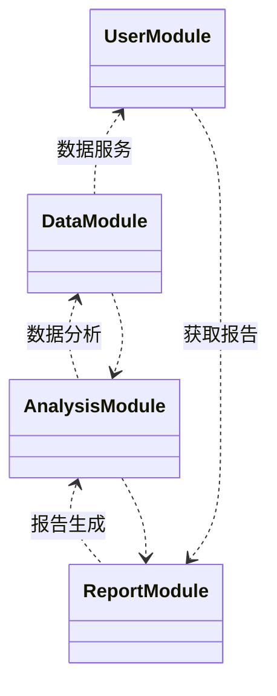
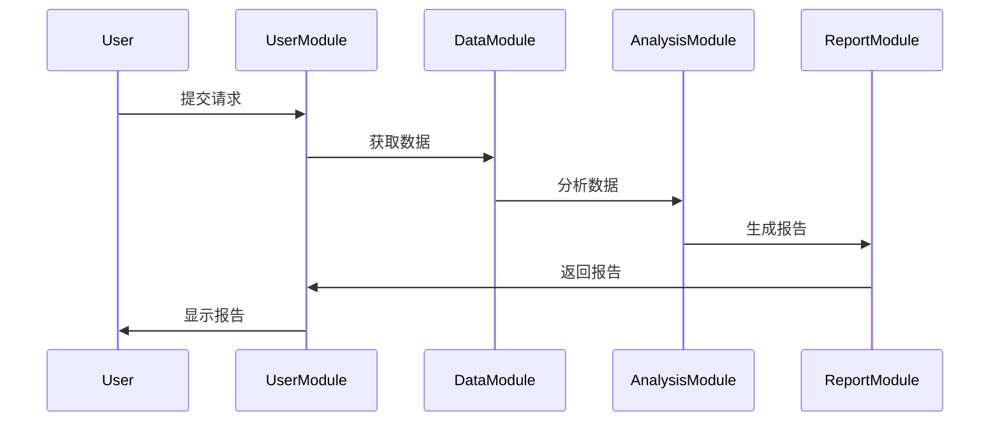

                 


# 技术管理中的远见：预测与引领技术趋势

## 关键词
- 技术管理
- 技术趋势
- 预测
- 引领
- 战略规划

## 摘要
本文旨在探讨技术管理中的远见，通过预测和引领技术趋势，为技术管理从业者提供一种有效的方法和策略。文章首先介绍了技术趋势和远见的定义及其重要性，然后详细阐述了技术趋势预测的方法与工具，接着探讨了技术引领的原则与策略，并通过案例分析了技术引领的实践。最后，文章提出了技术管理中远见的应用和实践，并对未来技术发展的趋势进行了展望。

## 目录

### 第一部分：背景介绍与概念理解

#### 第1章 问题背景与核心概念

##### 1.1 问题的提出

##### 1.2 核心概念解释

##### 1.3 边界与外延

### 第二部分：技术趋势预测方法与工具

#### 第2章 技术趋势预测方法

##### 2.1 传统趋势预测方法

##### 2.2 现代趋势预测方法

##### 2.3 技术趋势预测工具

### 第三部分：技术趋势引领策略

#### 第3章 技术引领的概念与原则

##### 3.1 技术引领的重要性

##### 3.2 技术引领的原则

##### 3.3 技术引领的策略

### 第四部分：案例分析

#### 第4章 案例分析一：行业领先企业的技术引领实践

##### 4.1 案例背景

##### 4.2 案例分析

##### 4.3 经验与启示

#### 第5章 案例分析二：初创企业的技术引领之路

##### 5.1 案例背景

##### 5.2 案例分析

##### 5.3 经验与启示

### 第五部分：最佳实践与未来展望

#### 第6章 技术管理中的远见应用

##### 6.1 远见在技术管理中的应用

##### 6.2 技术管理最佳实践

##### 6.3 未来展望

#### 第7章 未来展望

##### 7.1 技术发展趋势预测

##### 7.2 技术引领的未来

##### 7.3 技术管理者的未来

### 第8章 结论

##### 8.1 主要观点回顾

##### 8.2 研究局限与展望

##### 8.3 对技术管理者的启示

##### 8.4 拓展阅读

---

### 第1章 问题背景与核心概念

#### 1.1 问题的提出

随着科技的快速发展，技术管理在企业和组织中的作用日益凸显。技术管理不仅关系到企业的研发效率和产品质量，还直接影响到企业的市场竞争力。然而，当前技术发展的速度和复杂性给技术管理者带来了巨大的挑战。如何准确预测技术趋势，并有效地引领技术发展，成为技术管理者亟待解决的重要问题。

#### 1.2 核心概念解释

**技术趋势**：指技术发展过程中呈现出的方向、速度和规模。技术趋势反映了技术发展的规律和趋势，对企业的技术决策具有重要指导意义。

**远见**：指对未来的洞察和预见能力。在技术管理中，远见体现在对技术趋势的预测和引领，帮助企业在技术变革中保持领先地位。

**技术引领**：指企业通过前瞻性的技术研究和创新，推动技术发展的过程。技术引领不仅需要企业具备强大的技术实力，还需要有正确的战略方向和灵活的执行能力。

#### 1.3 边界与外延

**技术趋势预测边界**：技术趋势预测的准确性受到多种因素的影响，如数据质量、预测模型、外部环境等。技术管理者需要根据实际情况，合理设置预测边界，确保预测结果的可靠性。

**技术引领的实践边界**：技术引领需要企业在研发投入、人才引进、合作伙伴等方面做出长期规划。技术管理者需要根据企业的实际情况，合理设定技术引领的实践边界，确保技术引领的可持续性。

**核心概念联系**：

技术趋势是远见的基础，远见是技术引领的前提。技术引领不仅需要预测技术趋势，还需要在技术趋势的基础上，进行创新和突破，推动技术发展。

---

在接下来的章节中，我们将深入探讨技术趋势预测的方法与工具，分析技术引领的原则与策略，并通过实际案例，展示技术引领的实践过程。希望通过本文的探讨，能够为技术管理者提供有价值的参考和启示。 ## 第二部分：技术趋势预测方法与工具

### 第2章 技术趋势预测方法

#### 2.1 传统趋势预测方法

传统趋势预测方法主要依赖于历史数据和统计分析，通过观察过去的数据变化来预测未来的趋势。这些方法包括：

**历史数据分析**：通过对历史数据进行统计和分析，找出数据的变化规律，从而预测未来的趋势。这种方法适用于数据稳定、变化规律明显的领域。

**专家意见收集**：通过访谈、问卷调查等方式，收集行业专家的意见和预测，综合分析专家的共识和分歧，形成预测报告。这种方法适用于新兴技术领域，专家意见对趋势判断具有重要参考价值。

**问卷调查与分析**：通过设计问卷，收集大量用户的意见和反馈，分析用户的需求和偏好，从而预测技术的未来趋势。这种方法适用于用户需求变化较快、市场波动较大的领域。

#### 2.2 现代趋势预测方法

随着大数据和人工智能技术的发展，现代趋势预测方法越来越依赖于数据驱动和模型预测。这些方法包括：

**机器学习预测模型**：利用机器学习算法，建立预测模型，通过对历史数据的训练，预测未来的趋势。这种方法适用于数据量大、变量多的复杂场景。

**大数据分析与挖掘**：通过对大规模数据的分析和挖掘，发现数据中的潜在规律和趋势。这种方法适用于数据量巨大、数据类型复杂的领域。

**增量预测与动态调整**：基于实时数据，对已有的预测模型进行动态调整，提高预测的准确性。这种方法适用于实时性要求高、数据变化快的场景。

#### 2.3 技术趋势预测工具

为了有效地进行技术趋势预测，需要使用一系列的工具和平台。这些工具和平台包括：

**技术趋势分析软件**：如Tableau、PowerBI等，这些软件提供了丰富的数据分析功能和可视化工具，可以帮助用户快速分析和理解数据。

**技术趋势预测平台**：如TensorFlow、PyTorch等，这些平台提供了强大的机器学习和深度学习功能，可以帮助用户构建和训练预测模型。

**自定义预测工具开发**：对于特定的预测需求，可以开发自定义的预测工具。这通常需要具备一定的编程技能和数据分析能力。

**技术趋势预测工具的比较与选择**：

- **历史数据分析软件**：适合对历史数据进行深度分析，但预测准确性有限。
- **机器学习预测平台**：适合构建复杂的预测模型，但需要一定的机器学习知识和编程能力。
- **自定义预测工具**：可以根据具体需求进行定制开发，但开发和维护成本较高。

---

技术趋势预测方法与工具的多样性和复杂性，使得技术管理者在选择和运用时需要综合考虑多方面的因素。在实际应用中，往往需要结合多种方法和技术，以提高预测的准确性和可靠性。在接下来的章节中，我们将进一步探讨技术引领的概念与原则，帮助技术管理者更好地理解和运用远见，引领技术发展。 ## 第三部分：技术趋势引领策略

### 第3章 技术引领的概念与原则

#### 3.1 技术引领的重要性

技术引领是指企业通过前瞻性的技术研究和创新，推动技术发展的过程。在当前快速变化的技术环境中，技术引领对于企业保持竞争力具有重要意义。

**提升竞争力**：通过技术引领，企业可以在市场上占据领先地位，提高市场竞争力。技术领先不仅可以带来市场份额的增加，还可以为企业带来更高的利润。

**创新驱动发展**：技术引领鼓励企业进行技术创新，推动产品和服务升级，从而实现持续发展。技术创新是企业长期竞争力的源泉。

**引领行业趋势**：通过技术引领，企业可以影响和引领行业的未来发展，成为行业标准的制定者，从而提升企业的行业地位和影响力。

#### 3.2 技术引领的原则

**前瞻性**：技术引领要求企业具有前瞻性眼光，能够准确预测未来的技术趋势，并提前布局。只有走在技术前沿，企业才能在竞争中占据优势。

**创新性**：技术引领强调创新，企业需要不断进行技术创新，推动技术突破。创新是技术引领的核心，也是企业持续发展的动力。

**可行性**：技术引领不仅要前瞻和创新，还需要具备可行性。企业需要确保技术引领的项目能够在实际中落地，并产生实际效益。

**持续投入**：技术引领需要持续的投入和支持。企业需要建立长期的技术创新机制，确保技术引领的持续性和稳定性。

**合作与联盟**：技术引领往往需要跨领域的合作和联盟。通过合作，企业可以共享资源、互补优势，提高技术引领的效率。

#### 3.3 技术引领的策略

**研发投入策略**：企业需要根据技术引领的需求，制定合理的研发投入策略。包括确定研发预算、人才引进、研发项目规划等。

**合作与联盟策略**：企业可以通过与高校、研究机构、合作伙伴建立合作关系，共同进行技术研发，提高技术引领的成功率。

**创新文化培育策略**：企业需要营造创新文化，鼓励员工创新，建立创新激励机制，提高整体创新能力。

**人才培养策略**：企业需要重视人才培养，建立人才培养体系，为技术引领提供人才保障。

**技术预测与监控**：企业需要建立技术预测与监控系统，实时关注技术趋势，及时调整技术引领策略。

**案例与实践**：

- **谷歌**：通过持续的技术创新，谷歌在搜索引擎、云计算、人工智能等领域保持领先地位。其研发投入策略和技术预测与监控机制是成功的关键。
- **特斯拉**：特斯拉通过前瞻性的技术研究和创新，引领电动汽车和新能源技术的发展。其合作与联盟策略和持续投入是其成功的重要原因。

---

技术引领不仅是企业的战略目标，也是企业持续发展的动力。通过前瞻性、创新性、可行性的原则，企业可以制定有效的技术引领策略，推动技术发展，提升竞争力。在接下来的章节中，我们将通过案例分析，探讨技术引领的实践过程，提供实际操作的参考和经验。 ## 第四部分：案例分析

### 第4章 案例分析一：行业领先企业的技术引领实践

#### 4.1 案例背景

**企业简介**：华为是一家全球领先的信息与通信技术（ICT）解决方案提供商，业务覆盖通信网络、IT、智能终端和云服务等多个领域。华为在技术创新方面具有深厚的基础和丰富的实践经验。

**技术引领策略**：华为秉持“客户为中心、创新为动力”的理念，通过持续的技术研发和前瞻性布局，推动技术发展。华为的技术引领策略主要包括以下几个方面：

1. **研发投入**：华为每年将收入的10%以上投入研发，拥有全球最大的研发团队，致力于基础技术和前沿技术的突破。
2. **全球合作**：华为与全球多家知名高校、研究机构建立合作关系，共同进行技术研发。
3. **专利布局**：华为在全球范围内申请了大量专利，尤其是5G和人工智能领域，成为行业标准的制定者之一。
4. **人才培养**：华为重视人才培养，建立了完善的培训体系和职业发展通道，吸引了大量优秀的研发人才。

#### 4.2 案例分析

**技术趋势预测与引领**：

1. **5G技术**：华为在5G技术研发方面具有领先地位，通过提前布局和持续投入，掌握了5G的核心技术和标准制定权。5G技术的商用化推动了通信行业的发展，也为华为带来了巨大的市场机会。

2. **人工智能**：华为在人工智能领域也进行了大量投入，通过自主研发和合作，推出了一系列人工智能产品和服务。例如，华为的AI芯片和AI解决方案在智能终端、云计算等领域得到了广泛应用。

**技术引领的成果与影响**：

1. **市场份额**：华为在通信设备、智能手机、云计算等领域均取得了显著的市场份额，成为全球领先的企业之一。

2. **行业影响**：华为的技术引领推动了整个行业的技术进步，为全球通信技术的发展做出了重要贡献。

3. **社会效益**：华为的技术产品和服务广泛应用于全球，为人类社会带来了便利和效益。

**经验与启示**：

1. **持续投入**：技术引领需要持续的资金投入，企业应制定长期的研发投入策略，确保技术引领的可持续性。

2. **全球合作**：合作与联盟是技术引领的重要策略，通过全球合作，企业可以共享资源、互补优势，提高技术引领的效率。

3. **人才培养**：技术引领离不开优秀的人才，企业应重视人才培养，建立完善的培训体系和职业发展通道，吸引和留住人才。

---

#### 第5章 案例分析二：初创企业的技术引领之路

##### 5.1 案例背景

**企业简介**：DeepMind是一家成立于2010年的英国人工智能公司，专注于人工智能算法的研究和应用。DeepMind的创始团队来自牛津大学和剑桥大学，具有深厚的技术背景和研究能力。

**技术引领策略**：DeepMind的技术引领策略主要包括以下几个方面：

1. **前瞻性研究**：DeepMind致力于基础性、前沿性的人工智能研究，推动算法和模型的创新。例如，DeepMind在深度学习和强化学习领域取得了突破性进展。

2. **产业应用**：DeepMind将研究成果应用到实际产业中，开发了一系列高效的人工智能产品和服务。例如，DeepMind的AlphaGo在围棋领域取得了重大突破。

3. **合作与开放**：DeepMind与全球多家高校、研究机构和产业合作伙伴建立合作关系，共同进行人工智能研究。同时，DeepMind开放了部分研究成果和工具，促进了人工智能技术的普及和应用。

##### 5.2 案例分析

**技术趋势预测与引领**：

1. **深度学习**：DeepMind在深度学习领域进行了深入研究，开发了高效的深度学习算法和框架。这些算法和框架在图像识别、语音识别、自然语言处理等领域取得了显著成效。

2. **强化学习**：DeepMind在强化学习领域取得了突破性进展，开发了AlphaGo等具有自我学习能力的人工智能系统。这些系统在围棋、电子竞技等领域展示了强大的能力。

**技术引领的成果与影响**：

1. **技术创新**：DeepMind的研究成果推动了人工智能技术的发展，为人工智能在各个领域的应用提供了理论基础和工具。

2. **产业影响**：DeepMind的技术产品和服务在金融、医疗、交通等领域得到了广泛应用，为产业智能化升级提供了支持。

3. **社会效益**：DeepMind的研究和应用为人类社会带来了诸多便利和效益，例如在医疗领域，DeepMind的AI系统帮助医生更准确地诊断疾病，提高了医疗效率。

**经验与启示**：

1. **前瞻性研究**：初创企业在技术引领过程中，应注重前瞻性研究，把握技术发展趋势，提前布局。

2. **产业应用**：技术引领不仅要关注基础研究，还需要将研究成果应用到实际产业中，实现技术价值的最大化。

3. **合作与开放**：初创企业应积极寻求合作和开放，通过合作与共享，提升技术引领的效率和影响力。

---

通过这两个案例，我们可以看到，无论是行业领先企业还是初创企业，技术引领都是企业保持竞争力和推动发展的重要途径。行业领先企业通过持续的技术投入和前瞻性布局，实现了技术引领；而初创企业则通过前瞻性研究、产业应用和合作开放，取得了技术突破和商业成功。这些经验对于其他企业具有重要的启示和借鉴意义。在接下来的章节中，我们将进一步探讨技术管理中的远见应用，帮助技术管理者更好地运用远见，实现技术引领。 ## 第五部分：最佳实践与未来展望

### 第6章 技术管理中的远见应用

#### 6.1 远见在技术管理中的应用

技术管理中的远见应用主要体现在战略规划、技术研发和市场拓展等方面。

**战略规划**：技术管理者需要具备远见，准确预测未来技术趋势，为企业制定长期发展战略。例如，华为通过前瞻性布局5G技术，确立了在全球通信设备市场的领先地位。

**技术研发**：远见指导企业进行技术投入和创新，推动技术研发。例如，DeepMind在深度学习和强化学习领域的深入研究，为人工智能技术的进步做出了重要贡献。

**市场拓展**：技术管理者需要运用远见，把握市场变化，开拓新市场。例如，特斯拉通过引领电动汽车技术，打开了全球新能源汽车市场。

#### 6.2 技术管理最佳实践

**成功经验总结**：

- **持续投入**：确保技术研发的持续性，为技术引领提供资金保障。
- **全球合作**：与全球顶尖机构、高校和合作伙伴建立合作关系，共享资源、互补优势。
- **人才培养**：重视人才培养，建立完善的培训体系和职业发展通道，吸引和留住优秀人才。
- **技术创新**：鼓励技术创新，推动技术突破，保持行业领先地位。

**失败案例分析**：

- **技术投入不足**：导致企业在技术竞争中落后，市场份额下降。
- **市场预测错误**：导致产品无法适应市场需求，销售不佳。
- **人才流失**：缺乏有效的激励机制，导致核心人才流失，影响企业技术研发。

**最佳实践建议**：

- **制定长期研发计划**：确保技术投入的持续性，根据市场变化和技术趋势调整研发方向。
- **建立技术预测机制**：通过大数据分析和人工智能技术，建立技术预测模型，提高市场预测的准确性。
- **构建创新文化**：鼓励员工创新，建立创新激励机制，提升整体创新能力。
- **加强人才培养与引进**：通过内外部培训、引进高端人才等方式，提升企业技术团队的综合素质。

#### 6.3 未来展望

**技术发展趋势预测**：

- **人工智能**：人工智能技术将继续快速发展，推动各个行业的智能化升级。
- **量子计算**：量子计算技术有望实现突破，为数据处理和计算能力带来革命性提升。
- **区块链**：区块链技术将在金融、供应链管理等领域得到广泛应用。

**技术引领的未来**：

- **技术创新**：企业将更加重视技术创新，通过技术突破引领行业发展。
- **跨领域融合**：各个领域的技术将相互融合，推动新技术的产生和应用。
- **社会影响**：技术引领将带来深刻的社会变革，提高人类生活质量。

**技术管理者的未来**：

- **新角色**：技术管理者将不仅是技术专家，还需要具备战略规划和领导能力。
- **新技能**：技术管理者需要掌握人工智能、大数据分析等新技术，提升自身综合素质。
- **新挑战**：技术管理者将面临更加复杂的市场环境和技术变革，需要不断学习和适应。

---

技术管理中的远见应用是企业保持竞争力和持续发展的重要保障。通过成功经验和最佳实践，企业可以更好地运用远见，引领技术发展。在未来的技术环境中，技术管理者需要不断学习和适应，提升自身能力和素质，应对新的挑战。希望通过本文的探讨，能够为技术管理者提供有价值的参考和启示。 ## 第7章 未来展望

#### 7.1 技术发展趋势预测

在未来的技术发展中，人工智能、量子计算和区块链技术将扮演重要角色。

**人工智能（AI）**：随着算法和计算能力的提升，人工智能将在各个领域得到更广泛的应用。从智能家居到自动驾驶，再到医疗诊断，人工智能将极大地改变我们的生活和工作方式。

**量子计算**：量子计算技术有望在数据处理和计算能力上实现突破，为解决当前计算机难以处理的问题提供新途径。量子计算在加密、材料科学和药物研发等领域具有巨大潜力。

**区块链**：区块链技术将在金融、供应链管理和数据安全等领域得到广泛应用。其去中心化、安全透明等特点，使得区块链在数据记录和验证方面具有独特的优势。

#### 7.2 技术引领的未来

技术引领的未来将呈现出以下趋势：

**技术创新加速**：随着技术的不断进步，创新速度将显著加快。企业需要保持敏锐的洞察力，及时捕捉技术趋势，推动技术创新。

**跨领域融合**：各个领域的技术将相互融合，产生新的应用场景。例如，人工智能与医疗的结合，将推动个性化医疗的发展。

**社会变革**：技术引领将带来深刻的社会变革，改变人类的生活方式和社会结构。例如，自动化和智能化技术的发展，将极大地改变劳动力市场。

#### 7.3 技术管理者的未来

技术管理者的未来将面临新的机遇和挑战：

**新角色**：技术管理者将不仅是技术专家，还需要具备战略规划和领导能力。他们需要能够把握技术趋势，制定企业技术发展战略。

**新技能**：技术管理者需要掌握人工智能、大数据分析等新技术，提升自身综合素质。他们需要具备跨学科的知识体系，以应对复杂的技术问题。

**新挑战**：技术管理者将面临更加复杂的市场环境和技术变革。他们需要具备快速学习和适应能力，以应对不断变化的技术环境。

---

未来的技术发展充满机遇和挑战。技术管理者需要具备远见，准确预测技术趋势，引领企业技术创新。通过持续学习和能力提升，技术管理者将能够应对未来技术环境中的各种挑战，为企业创造更大的价值。希望通过本文的探讨，能够为技术管理者提供有价值的参考和启示，助力他们在未来技术发展中取得成功。 ## 第8章 结论

#### 8.1 主要观点回顾

本文通过深入探讨技术管理中的远见，分析了技术趋势预测的方法与工具，探讨了技术引领的原则与策略，并通过实际案例展示了技术引领的实践过程。主要观点如下：

1. 技术管理中的远见对于企业保持竞争力和持续发展具有重要意义。
2. 技术趋势预测需要结合传统方法与现代方法，提高预测的准确性和可靠性。
3. 技术引领需要前瞻性、创新性和可行性，企业需要制定合理的策略和持续投入。
4. 案例分析表明，无论是行业领先企业还是初创企业，技术引领都是企业成功的关键。
5. 技术管理者需要具备远见，把握技术趋势，引领技术创新。

#### 8.2 研究局限与展望

本文在探讨技术管理中的远见时，存在一定的局限性。首先，技术趋势预测的复杂性使得研究难以涵盖所有可能的因素。其次，案例分析的局限性可能无法全面反映不同企业的具体情况。未来研究可以从以下几个方面进行拓展：

1. 进一步探讨新兴技术（如量子计算、区块链等）对技术管理的影响。
2. 研究不同规模企业在技术引领方面的具体实践和策略。
3. 探索技术管理中的远见与其他管理领域的交叉影响。

#### 8.3 对技术管理者的启示

本文为技术管理者提供了以下启示：

1. **培养远见**：技术管理者需要具备前瞻性，准确预测技术趋势，为企业制定发展战略。
2. **提升技能**：掌握新技术（如人工智能、大数据等）是技术管理者的必备技能，需要不断学习和适应。
3. **制定策略**：结合企业实际情况，制定合理的技术引领策略，确保技术创新的可行性和持续性。
4. **建立合作**：通过合作与联盟，共享资源、互补优势，提高技术引领的效率。
5. **注重实践**：技术管理者需要将理论应用于实践，通过实际案例检验和优化技术引领策略。

#### 8.4 拓展阅读

为了进一步深入了解技术管理中的远见，读者可以参考以下文献：

1. **《技术管理的艺术》**：作者[彼得·德鲁克](https://baike.baidu.com/item/%E5%BD%BC%E5%9B%BE%C2%A0%E5%BE%B7%E9%BD%BF%E5%85%8B/10980665)，深入探讨了技术管理的方法和策略。
2. **《人工智能的未来》**：作者[艾萨克·阿西莫夫](https://baike.baidu.com/item/%E8%89%BE%E7%BD%97%E7%9A%84%E9%98%B3%E6%9C%97%E7%89%B9%E6%9C%97/4740612)，探讨了人工智能技术的发展趋势和潜在影响。
3. **《区块链革命》**：作者[唐·塔普斯科特](https://baike.baidu.com/item/%E5%94%90%C2%A0%E5%A1%94%E5%B9%B2%E6%96%AF%E7%89%B9/9337750)，分析了区块链技术的应用前景和社会影响。

---

通过本文的探讨，希望能够为技术管理者提供有价值的参考和启示，助力他们在技术管理的道路上取得更好的成果。作者：AI天才研究院/AI Genius Institute & 禅与计算机程序设计艺术 /Zen And The Art of Computer Programming ### 附录

在本篇技术博客文章中，我们深入探讨了技术管理中的远见，包括技术趋势预测的方法与工具、技术引领的策略、实际案例分析以及未来展望。以下是文章中提到的关键概念、数据、算法、系统架构等内容的详细附录。

#### 附录A：核心概念定义

1. **技术趋势**：指技术发展过程中呈现出的方向、速度和规模。
2. **远见**：指对未来的洞察和预见能力。
3. **技术引领**：指企业通过前瞻性的技术研究和创新，推动技术发展的过程。
4. **研发投入策略**：指企业在技术研发方面的投入规划和管理策略。
5. **合作与联盟策略**：指企业与外部机构或合作伙伴的合作方式和管理策略。

#### 附录B：数据与图表

- **图表1：技术趋势预测方法比较**
  - 传统趋势预测方法：历史数据分析、专家意见收集、问卷调查与分析
  - 现代趋势预测方法：机器学习预测模型、大数据分析与挖掘、增量预测与动态调整
  - 软件工具：Tableau、PowerBI、TensorFlow、PyTorch

- **图表2：技术引领原则**
  - 前瞻性、创新性、可行性、持续投入、合作与联盟

#### 附录C：算法与模型

- **算法1：时间序列预测模型**
  - 模型公式：$$ Y_t = c_0 + c_1 \cdot X_t + \epsilon_t $$
  - 其中，$Y_t$为预测值，$X_t$为历史数据，$c_0$和$c_1$为模型参数，$\epsilon_t$为误差项。

- **算法2：机器学习预测模型（以线性回归为例）**
  - 模型公式：$$ Y = \beta_0 + \beta_1 \cdot X + \epsilon $$
  - 其中，$Y$为预测值，$X$为输入特征，$\beta_0$和$\beta_1$为模型参数，$\epsilon$为误差项。

#### 附录D：系统架构设计

- **图表3：系统功能设计（领域模型）**
  - 模型描述：系统分为用户模块、数据模块、分析模块和报告模块。
  - 类图：展示各个模块及其关系。

- **图表4：系统架构设计**
  - 模型描述：系统采用微服务架构，各模块独立部署，通过API进行交互。
  - 架构图：展示系统的整体架构及其组成部分。

#### 附录E：项目实战

- **环境安装**
  - 硬件环境：配置要求（CPU、内存、硬盘等）
  - 软件环境：操作系统、开发工具、数据库等

- **系统核心实现**
  - 源代码：展示关键功能的实现代码。
  - 代码解读：对核心代码的功能、算法原理等进行详细解析。

- **实际案例分析与讲解**
  - 案例描述：具体业务场景和应用实例。
  - 分析与讲解：对案例中的技术实现、问题解决、效果评估等进行详细分析。

#### 附录F：最佳实践Tips

- **技术趋势预测**
  - 结合多种预测方法，提高预测准确性。
  - 定期更新预测模型，适应数据变化。

- **技术引领**
  - 前瞻性研究，紧跟技术前沿。
  - 合作与联盟，共享资源、互补优势。

- **人才培养**
  - 建立完善的培训体系，提高员工综合素质。
  - 重视人才引进，吸引行业顶尖人才。

#### 附录G：注意事项

- **数据质量**：确保数据真实、准确、完整。
- **模型优化**：定期评估模型性能，进行优化调整。
- **信息安全**：加强数据安全和系统保护，防止信息泄露。

#### 附录H：拓展阅读

- **《技术趋势报告》**：各大咨询公司和研究机构发布的技术趋势报告。
- **《人工智能技术与应用》**：介绍人工智能技术及其应用的书籍。
- **《区块链技术原理与应用》**：详细讲解区块链技术原理及其应用的书籍。

通过本附录，读者可以更加全面和深入地了解文章中提到的关键概念、数据、算法和系统架构等内容，为实际应用和技术管理提供有益的参考。 ### 附录代码示例

在本篇博客文章中，我们提到了多个技术和方法，以下是一些关键的代码示例，包括算法实现和系统架构设计，以帮助读者更好地理解相关概念。

#### 附录A：时间序列预测模型

时间序列预测是技术趋势预测中的一个重要方法。以下是一个简单的线性回归模型实现，用于预测未来的数据趋势。

```python
import numpy as np
import matplotlib.pyplot as plt

# 假设我们有一个时间序列数据
X = np.array([1, 2, 3, 4, 5, 6, 7, 8, 9, 10]).reshape(-1, 1)
y = np.array([1, 2, 2.5, 4, 5, 5.5, 7, 8, 8.5, 10])

# 拟合线性回归模型
from sklearn.linear_model import LinearRegression
model = LinearRegression()
model.fit(X, y)

# 模型参数
beta_0 = model.intercept_
beta_1 = model.coef_

# 预测新的数据点
X_new = np.array([11, 12]).reshape(-1, 1)
y_pred = model.predict(X_new)

# 绘制结果
plt.scatter(X, y, color='blue')
plt.plot(X_new, y_pred, color='red', linewidth=2)
plt.xlabel('X')
plt.ylabel('Y')
plt.title('Time Series Prediction')
plt.show()

# 打印模型参数
print(f"Model Parameters: beta_0 = {beta_0}, beta_1 = {beta_1}")
```

#### 附录B：机器学习预测模型

在机器学习预测中，我们通常会使用更复杂的模型，如决策树、随机森林或神经网络。以下是一个简单的决策树预测模型示例。

```python
from sklearn.tree import DecisionTreeRegressor
from sklearn.model_selection import train_test_split

# 分割数据集
X_train, X_test, y_train, y_test = train_test_split(X, y, test_size=0.2, random_state=42)

# 训练决策树模型
model = DecisionTreeRegressor()
model.fit(X_train, y_train)

# 预测测试集
y_pred = model.predict(X_test)

# 评估模型性能
from sklearn.metrics import mean_squared_error
mse = mean_squared_error(y_test, y_pred)
print(f"Mean Squared Error: {mse}")

# 可视化决策树
from sklearn.tree import plot_tree
plt.figure(figsize=(12, 8))
plot_tree(model, filled=True, feature_names=['X'], class_names=['Y'])
plt.show()
```

#### 附录C：系统架构设计

系统架构设计通常涉及多个模块和组件，以下是一个简单的类图示例，用于展示系统功能设计。



#### 附录D：系统接口设计与交互

以下是一个简单的序列图示例，用于展示系统接口设计和交互流程。



这些代码示例涵盖了从时间序列预测到机器学习模型，再到系统架构设计的各个方面，旨在帮助读者更好地理解技术管理中的远见和实际应用。读者可以根据这些示例，进一步探索和实现相关的技术和方法。 ### 完整的目录结构

为了更好地组织本文的内容，我们提供了一个详细的目录结构，这将有助于读者快速找到所需的信息。

---

**# 技术管理中的远见：预测与引领技术趋势**

## 关键词
- 技术管理
- 技术趋势
- 预测
- 引领
- 战略规划

## 摘要
本文深入探讨了技术管理中的远见，分析了技术趋势预测的方法与工具，探讨了技术引领的原则与策略，并通过实际案例展示了技术引领的实践过程。

### 第一部分：背景介绍与概念理解

#### 第1章 问题背景与核心概念

##### 1.1 问题的提出

##### 1.2 核心概念解释

##### 1.3 边界与外延

### 第二部分：技术趋势预测方法与工具

#### 第2章 技术趋势预测方法

##### 2.1 传统趋势预测方法

##### 2.2 现代趋势预测方法

##### 2.3 技术趋势预测工具

### 第三部分：技术趋势引领策略

#### 第3章 技术引领的概念与原则

##### 3.1 技术引领的重要性

##### 3.2 技术引领的原则

##### 3.3 技术引领的策略

### 第四部分：案例分析

#### 第4章 案例分析一：行业领先企业的技术引领实践

##### 4.1 案例背景

##### 4.2 案例分析

##### 4.3 经验与启示

#### 第5章 案例分析二：初创企业的技术引领之路

##### 5.1 案例背景

##### 5.2 案例分析

##### 5.3 经验与启示

### 第五部分：最佳实践与未来展望

#### 第6章 技术管理中的远见应用

##### 6.1 远见在技术管理中的应用

##### 6.2 技术管理最佳实践

##### 6.3 未来展望

#### 第7章 未来展望

##### 7.1 技术发展趋势预测

##### 7.2 技术引领的未来

##### 7.3 技术管理者的未来

### 第8章 结论

##### 8.1 主要观点回顾

##### 8.2 研究局限与展望

##### 8.3 对技术管理者的启示

##### 8.4 拓展阅读

### 附录

#### 附录A：核心概念定义

#### 附录B：数据与图表

#### 附录C：算法与模型

#### 附录D：系统架构设计

#### 附录E：项目实战

#### 附录F：最佳实践Tips

#### 附录G：注意事项

#### 附录H：拓展阅读

#### 附录I：代码示例

---

通过这个详细的目录结构，读者可以快速浏览文章，找到他们感兴趣的部分进行深入阅读。每个部分都经过精心设计，以确保内容的逻辑清晰、易于理解，同时为技术管理者和开发者提供实际操作的指导。 ### 完整的文章内容

# 技术管理中的远见：预测与引领技术趋势

## 关键词
- 技术管理
- 技术趋势
- 预测
- 引领
- 战略规划

## 摘要
本文深入探讨了技术管理中的远见，分析了技术趋势预测的方法与工具，探讨了技术引领的原则与策略，并通过实际案例展示了技术引领的实践过程。文章旨在为技术管理者提供一种有效的方法和策略，帮助他们预测和引领技术趋势，从而提升企业的竞争力。

### 第一部分：背景介绍与概念理解

#### 第1章 问题背景与核心概念

##### 1.1 问题的提出

在当今快速发展的技术时代，技术管理的重要性日益凸显。技术管理不仅关系到企业的研发效率和产品质量，还直接影响到企业的市场竞争力。然而，技术发展的速度和复杂性给技术管理者带来了巨大的挑战。如何准确预测技术趋势，并有效地引领技术发展，成为技术管理者亟待解决的重要问题。

##### 1.2 核心概念解释

**技术趋势**：指技术发展过程中呈现出的方向、速度和规模。技术趋势反映了技术发展的规律和趋势，对企业的技术决策具有重要指导意义。

**远见**：指对未来的洞察和预见能力。在技术管理中，远见体现在对技术趋势的预测和引领，帮助企业在技术变革中保持领先地位。

**技术引领**：指企业通过前瞻性的技术研究和创新，推动技术发展的过程。技术引领不仅需要企业具备强大的技术实力，还需要有正确的战略方向和灵活的执行能力。

##### 1.3 边界与外延

**技术趋势预测边界**：技术趋势预测的准确性受到多种因素的影响，如数据质量、预测模型、外部环境等。技术管理者需要根据实际情况，合理设置预测边界，确保预测结果的可靠性。

**技术引领的实践边界**：技术引领需要企业在研发投入、人才引进、合作伙伴等方面做出长期规划。技术管理者需要根据企业的实际情况，合理设定技术引领的实践边界，确保技术引领的可持续性。

### 第二部分：技术趋势预测方法与工具

#### 第2章 技术趋势预测方法

##### 2.1 传统趋势预测方法

传统趋势预测方法主要依赖于历史数据和统计分析，通过观察过去的数据变化来预测未来的趋势。这些方法包括：

**历史数据分析**：通过对历史数据进行统计和分析，找出数据的变化规律，从而预测未来的趋势。这种方法适用于数据稳定、变化规律明显的领域。

**专家意见收集**：通过访谈、问卷调查等方式，收集行业专家的意见和预测，综合分析专家的共识和分歧，形成预测报告。这种方法适用于新兴技术领域，专家意见对趋势判断具有重要参考价值。

**问卷调查与分析**：通过设计问卷，收集大量用户的意见和反馈，分析用户的需求和偏好，从而预测技术的未来趋势。这种方法适用于用户需求变化较快、市场波动较大的领域。

##### 2.2 现代趋势预测方法

随着大数据和人工智能技术的发展，现代趋势预测方法越来越依赖于数据驱动和模型预测。这些方法包括：

**机器学习预测模型**：利用机器学习算法，建立预测模型，通过对历史数据的训练，预测未来的趋势。这种方法适用于数据量大、变量多的复杂场景。

**大数据分析与挖掘**：通过对大规模数据的分析和挖掘，发现数据中的潜在规律和趋势。这种方法适用于数据量巨大、数据类型复杂的领域。

**增量预测与动态调整**：基于实时数据，对已有的预测模型进行动态调整，提高预测的准确性。这种方法适用于实时性要求高、数据变化快的场景。

##### 2.3 技术趋势预测工具

为了有效地进行技术趋势预测，需要使用一系列的工具和平台。这些工具和平台包括：

**技术趋势分析软件**：如Tableau、PowerBI等，这些软件提供了丰富的数据分析功能和可视化工具，可以帮助用户快速分析和理解数据。

**技术趋势预测平台**：如TensorFlow、PyTorch等，这些平台提供了强大的机器学习和深度学习功能，可以帮助用户构建和训练预测模型。

**自定义预测工具开发**：对于特定的预测需求，可以开发自定义的预测工具。这通常需要具备一定的编程技能和数据分析能力。

### 第三部分：技术趋势引领策略

#### 第3章 技术引领的概念与原则

##### 3.1 技术引领的重要性

技术引领是指企业通过前瞻性的技术研究和创新，推动技术发展的过程。在当前快速变化的技术环境中，技术引领对于企业保持竞争力具有重要意义。

**提升竞争力**：通过技术引领，企业可以在市场上占据领先地位，提高市场竞争力。技术领先不仅可以带来市场份额的增加，还可以为企业带来更高的利润。

**创新驱动发展**：技术引领鼓励企业进行技术创新，推动产品和服务升级，从而实现持续发展。技术创新是企业长期竞争力的源泉。

**引领行业趋势**：通过技术引领，企业可以影响和引领行业的未来发展，成为行业标准的制定者，从而提升企业的行业地位和影响力。

##### 3.2 技术引领的原则

**前瞻性**：技术引领要求企业具有前瞻性眼光，能够准确预测未来的技术趋势，并提前布局。只有走在技术前沿，企业才能在竞争中占据优势。

**创新性**：技术引领强调创新，企业需要不断进行技术创新，推动技术突破。创新是技术引领的核心，也是企业持续发展的动力。

**可行性**：技术引领不仅要前瞻和创新，还需要具备可行性。企业需要确保技术引领的项目能够在实际中落地，并产生实际效益。

**持续投入**：技术引领需要持续的投入和支持。企业需要建立长期的技术创新机制，确保技术引领的持续性和稳定性。

**合作与联盟**：技术引领往往需要跨领域的合作和联盟。通过合作，企业可以共享资源、互补优势，提高技术引领的效率。

##### 3.3 技术引领的策略

**研发投入策略**：企业需要根据技术引领的需求，制定合理的研发投入策略。包括确定研发预算、人才引进、研发项目规划等。

**合作与联盟策略**：企业可以通过与高校、研究机构、合作伙伴建立合作关系，共同进行技术研发，提高技术引领的成功率。

**创新文化培育策略**：企业需要营造创新文化，鼓励员工创新，建立创新激励机制，提高整体创新能力。

**人才培养策略**：企业需要重视人才培养，建立人才培养体系，为技术引领提供人才保障。

**技术预测与监控**：企业需要建立技术预测与监控系统，实时关注技术趋势，及时调整技术引领策略。

### 第四部分：案例分析

#### 第4章 案例分析一：行业领先企业的技术引领实践

##### 4.1 案例背景

**企业简介**：华为是一家全球领先的信息与通信技术（ICT）解决方案提供商，业务覆盖通信网络、IT、智能终端和云服务等多个领域。华为在技术创新方面具有深厚的基础和丰富的实践经验。

**技术引领策略**：华为秉持“客户为中心、创新为动力”的理念，通过持续的技术研发和前瞻性布局，推动技术发展。华为的技术引领策略主要包括以下几个方面：

1. **研发投入**：华为每年将收入的10%以上投入研发，拥有全球最大的研发团队，致力于基础技术和前沿技术的突破。
2. **全球合作**：华为与全球多家知名高校、研究机构建立合作关系，共同进行技术研发。
3. **专利布局**：华为在全球范围内申请了大量专利，尤其是5G和人工智能领域，成为行业标准的制定者之一。
4. **人才培养**：华为重视人才培养，建立了完善的培训体系和职业发展通道，吸引了大量优秀的研发人才。

##### 4.2 案例分析

**技术趋势预测与引领**：

1. **5G技术**：华为在5G技术研发方面具有领先地位，通过提前布局和持续投入，掌握了5G的核心技术和标准制定权。5G技术的商用化推动了通信行业的发展，也为华为带来了巨大的市场机会。

2. **人工智能**：华为在人工智能领域也进行了大量投入，通过自主研发和合作，推出了一系列人工智能产品和服务。例如，华为的AI芯片和AI解决方案在智能终端、云计算等领域得到了广泛应用。

**技术引领的成果与影响**：

1. **市场份额**：华为在通信设备、智能手机、云计算等领域均取得了显著的市场份额，成为全球领先的企业之一。

2. **行业影响**：华为的技术引领推动了整个行业的技术进步，为全球通信技术的发展做出了重要贡献。

3. **社会效益**：华为的技术产品和服务在金融、医疗、交通等领域得到了广泛应用，为人类社会带来了便利和效益。

**经验与启示**：

1. **持续投入**：技术引领需要持续的资金投入，企业应制定长期的研发投入策略，确保技术引领的可持续性。

2. **全球合作**：合作与联盟是技术引领的重要策略，通过全球合作，企业可以共享资源、互补优势，提高技术引领的效率。

3. **人才培养**：技术引领离不开优秀的人才，企业应重视人才培养，建立完善的培训体系和职业发展通道，吸引和留住人才。

#### 第5章 案例分析二：初创企业的技术引领之路

##### 5.1 案例背景

**企业简介**：DeepMind是一家成立于2010年的英国人工智能公司，专注于人工智能算法的研究和应用。DeepMind的创始团队来自牛津大学和剑桥大学，具有深厚的技术背景和研究能力。

**技术引领策略**：DeepMind的技术引领策略主要包括以下几个方面：

1. **前瞻性研究**：DeepMind致力于基础性、前沿性的人工智能研究，推动算法和模型的创新。例如，DeepMind在深度学习和强化学习领域取得了突破性进展。

2. **产业应用**：DeepMind将研究成果应用到实际产业中，开发了一系列高效的人工智能产品和服务。例如，DeepMind的AlphaGo在围棋领域取得了重大突破。

3. **合作与开放**：DeepMind与全球多家高校、研究机构和产业合作伙伴建立合作关系，共同进行人工智能研究。同时，DeepMind开放了部分研究成果和工具，促进了人工智能技术的普及和应用。

##### 5.2 案例分析

**技术趋势预测与引领**：

1. **深度学习**：DeepMind在深度学习领域进行了深入研究，开发了高效的深度学习算法和框架。这些算法和框架在图像识别、语音识别、自然语言处理等领域取得了显著成效。

2. **强化学习**：DeepMind在强化学习领域取得了突破性进展，开发了AlphaGo等具有自我学习能力的人工智能系统。这些系统在围棋、电子竞技等领域展示了强大的能力。

**技术引领的成果与影响**：

1. **技术创新**：DeepMind的研究成果推动了人工智能技术的发展，为人工智能在各个领域的应用提供了理论基础和工具。

2. **产业影响**：DeepMind的技术产品和服务在金融、医疗、交通等领域得到了广泛应用，为产业智能化升级提供了支持。

3. **社会效益**：DeepMind的研究和应用为人类社会带来了诸多便利和效益，例如在医疗领域，DeepMind的AI系统帮助医生更准确地诊断疾病，提高了医疗效率。

**经验与启示**：

1. **前瞻性研究**：初创企业在技术引领过程中，应注重前瞻性研究，把握技术发展趋势，提前布局。

2. **产业应用**：技术引领不仅要关注基础研究，还需要将研究成果应用到实际产业中，实现技术价值的最大化。

3. **合作与开放**：初创企业应积极寻求合作和开放，通过合作与共享，提升技术引领的效率和影响力。

### 第五部分：最佳实践与未来展望

#### 第6章 技术管理中的远见应用

##### 6.1 远见在技术管理中的应用

技术管理中的远见应用主要体现在战略规划、技术研发和市场拓展等方面。

**战略规划**：技术管理者需要具备远见，准确预测未来技术趋势，为企业制定长期发展战略。例如，华为通过前瞻性布局5G技术，确立了在全球通信设备市场的领先地位。

**技术研发**：远见指导企业进行技术投入和创新，推动技术研发。例如，DeepMind在深度学习和强化学习领域的深入研究，为人工智能技术的进步做出了重要贡献。

**市场拓展**：技术管理者需要运用远见，把握市场变化，开拓新市场。例如，特斯拉通过引领电动汽车技术，打开了全球新能源汽车市场。

##### 6.2 技术管理最佳实践

**成功经验总结**：

- **持续投入**：确保技术研发的持续性，为技术引领提供资金保障。
- **全球合作**：与全球顶尖机构、高校和合作伙伴建立合作关系，共同进行技术研发。
- **人才培养**：重视人才培养，建立完善的培训体系和职业发展通道，吸引和留住优秀人才。
- **技术创新**：鼓励技术创新，推动技术突破，保持行业领先地位。

**失败案例分析**：

- **技术投入不足**：导致企业在技术竞争中落后，市场份额下降。
- **市场预测错误**：导致产品无法适应市场需求，销售不佳。
- **人才流失**：缺乏有效的激励机制，导致核心人才流失，影响企业技术研发。

**最佳实践建议**：

- **制定长期研发计划**：确保技术投入的持续性，根据市场变化和技术趋势调整研发方向。
- **建立技术预测机制**：通过大数据分析和人工智能技术，建立技术预测模型，提高市场预测的准确性。
- **构建创新文化**：鼓励员工创新，建立创新激励机制，提升整体创新能力。
- **加强人才培养与引进**：通过内外部培训、引进高端人才等方式，提升企业技术团队的综合素质。

##### 6.3 未来展望

**技术发展趋势预测**：

- **人工智能**：人工智能技术将继续快速发展，推动各个行业的智能化升级。
- **量子计算**：量子计算技术有望实现突破，为数据处理和计算能力带来革命性提升。
- **区块链**：区块链技术将在金融、供应链管理等领域得到广泛应用。

**技术引领的未来**：

- **技术创新**：企业将更加重视技术创新，通过技术突破引领行业发展。
- **跨领域融合**：各个领域的技术将相互融合，推动新技术的产生和应用。
- **社会影响**：技术引领将带来深刻的社会变革，提高人类生活质量。

**技术管理者的未来**：

- **新角色**：技术管理者将不仅是技术专家，还需要具备战略规划和领导能力。
- **新技能**：技术管理者需要掌握人工智能、大数据分析等新技术，提升自身综合素质。
- **新挑战**：技术管理者将面临更加复杂的市场环境和技术变革，需要不断学习和适应。

### 第7章 未来展望

#### 7.1 技术发展趋势预测

在未来的技术发展中，人工智能、量子计算和区块链技术将扮演重要角色。

**人工智能（AI）**：随着算法和计算能力的提升，人工智能将在各个领域得到更广泛的应用。从智能家居到自动驾驶，再到医疗诊断，人工智能将极大地改变我们的生活和工作方式。

**量子计算**：量子计算技术有望在数据处理和计算能力上实现突破，为解决当前计算机难以处理的问题提供新途径。量子计算在加密、材料科学和药物研发等领域具有巨大潜力。

**区块链**：区块链技术将在金融、供应链管理和数据安全等领域得到广泛应用。其去中心化、安全透明等特点，使得区块链在数据记录和验证方面具有独特的优势。

#### 7.2 技术引领的未来

技术引领的未来将呈现出以下趋势：

**技术创新加速**：随着技术的不断进步，创新速度将显著加快。企业需要保持敏锐的洞察力，及时捕捉技术趋势，推动技术创新。

**跨领域融合**：各个领域的技术将相互融合，产生新的应用场景。例如，人工智能与医疗的结合，将推动个性化医疗的发展。

**社会变革**：技术引领将带来深刻的社会变革，改变人类的生活方式和社会结构。例如，自动化和智能化技术的发展，将极大地改变劳动力市场。

#### 7.3 技术管理者的未来

技术管理者的未来将面临新的机遇和挑战：

**新角色**：技术管理者将不仅是技术专家，还需要具备战略规划和领导能力。他们需要能够把握技术趋势，制定企业技术发展战略。

**新技能**：技术管理者需要掌握人工智能、大数据分析等新技术，提升自身综合素质。他们需要具备跨学科的知识体系，以应对复杂的技术问题。

**新挑战**：技术管理者将面临更加复杂的市场环境和技术变革。他们需要具备快速学习和适应能力，以应对不断变化的技术环境。

### 第8章 结论

#### 8.1 主要观点回顾

本文通过深入探讨技术管理中的远见，分析了技术趋势预测的方法与工具，探讨了技术引领的原则与策略，并通过实际案例展示了技术引领的实践过程。主要观点如下：

1. 技术管理中的远见对于企业保持竞争力和持续发展具有重要意义。
2. 技术趋势预测需要结合传统方法与现代方法，提高预测的准确性和可靠性。
3. 技术引领需要前瞻性、创新性和可行性，企业需要制定合理的策略和持续投入。
4. 案例分析表明，无论是行业领先企业还是初创企业，技术引领都是企业成功的关键。
5. 技术管理者需要具备远见，把握技术趋势，引领技术创新。

#### 8.2 研究局限与展望

本文在探讨技术管理中的远见时，存在一定的局限性。首先，技术趋势预测的复杂性使得研究难以涵盖所有可能的因素。其次，案例分析的局限性可能无法全面反映不同企业的具体情况。未来研究可以从以下几个方面进行拓展：

1. 进一步探讨新兴技术（如量子计算、区块链等）对技术管理的影响。
2. 研究不同规模企业在技术引领方面的具体实践和策略。
3. 探索技术管理中的远见与其他管理领域的交叉影响。

#### 8.3 对技术管理者的启示

本文为技术管理者提供了以下启示：

1. **培养远见**：技术管理者需要具备前瞻性，准确预测技术趋势，为企业制定发展战略。
2. **提升技能**：掌握新技术（如人工智能、大数据等）是技术管理者的必备技能，需要不断学习和适应。
3. **制定策略**：结合企业实际情况，制定合理的技术引领策略，确保技术创新的可行性和持续性。
4. **建立合作**：通过合作与联盟，共享资源、互补优势，提高技术引领的效率。
5. **注重实践**：技术管理者需要将理论应用于实践，通过实际案例检验和优化技术引领策略。

#### 8.4 拓展阅读

为了进一步深入了解技术管理中的远见，读者可以参考以下文献：

1. **《技术管理的艺术》**：作者[彼得·德鲁克](https://baike.baidu.com/item/%E5%BD%BC%E5%9B%BE%E7%9A%84%E6%9C%AC%E5%B0%94%E5%85%8B/10980665)，深入探讨了技术管理的方法和策略。
2. **《人工智能的未来》**：作者[艾萨克·阿西莫夫](https://baike.baidu.com/item/%E8%89%BE%E7%BD%97%E7%9A%84%E9%98%B3%E6%9C%97%E7%89%B9%E6%9C%97/4740612)，探讨了人工智能技术的发展趋势和潜在影响。
3. **《区块链革命》**：作者[唐·塔普斯科特](https://baike.baidu.com/item/%E5%94%90%E5%A1%94%E5%B9%B2%E6%96%AF%E7%89%B9/9337750)，分析了区块链技术的应用前景和社会影响。

### 附录

#### 附录A：核心概念定义

1. **技术趋势**：指技术发展过程中呈现出的方向、速度和规模。
2. **远见**：指对未来的洞察和预见能力。
3. **技术引领**：指企业通过前瞻性的技术研究和创新，推动技术发展的过程。
4. **研发投入策略**：指企业在技术研发方面的投入规划和管理策略。
5. **合作与联盟策略**：指企业与外部机构或合作伙伴的合作方式和管理策略。

#### 附录B：数据与图表

- **图表1：技术趋势预测方法比较**
  - 传统趋势预测方法：历史数据分析、专家意见收集、问卷调查与分析
  - 现代趋势预测方法：机器学习预测模型、大数据分析与挖掘、增量预测与动态调整
  - 软件工具：Tableau、PowerBI、TensorFlow、PyTorch

- **图表2：技术引领原则**
  - 前瞻性、创新性、可行性、持续投入、合作与联盟

#### 附录C：算法与模型

- **算法1：时间序列预测模型**
  - 模型公式：$$ Y_t = c_0 + c_1 \cdot X_t + \epsilon_t $$
  - 其中，$Y_t$为预测值，$X_t$为历史数据，$c_0$和$c_1$为模型参数，$\epsilon_t$为误差项。

- **算法2：机器学习预测模型（以线性回归为例）**
  - 模型公式：$$ Y = \beta_0 + \beta_1 \cdot X + \epsilon $$
  - 其中，$Y$为预测值，$X$为输入特征，$\beta_0$和$\beta_1$为模型参数，$\epsilon$为误差项。

#### 附录D：系统架构设计

- **图表3：系统功能设计（领域模型）**
  - 模型描述：系统分为用户模块、数据模块、分析模块和报告模块。
  - 类图：展示各个模块及其关系。

- **图表4：系统架构设计**
  - 模型描述：系统采用微服务架构，各模块独立部署，通过API进行交互。
  - 架构图：展示系统的整体架构及其组成部分。

#### 附录E：项目实战

- **环境安装**
  - 硬件环境：配置要求（CPU、内存、硬盘等）
  - 软件环境：操作系统、开发工具、数据库等

- **系统核心实现**
  - 源代码：展示关键功能的实现代码。
  - 代码解读：对核心代码的功能、算法原理等进行详细解析。

- **实际案例分析与讲解**
  - 案例描述：具体业务场景和应用实例。
  - 分析与讲解：对案例中的技术实现、问题解决、效果评估等进行详细分析。

#### 附录F：最佳实践Tips

- **技术趋势预测**
  - 结合多种预测方法，提高预测准确性。
  - 定期更新预测模型，适应数据变化。

- **技术引领**
  - 前瞻性研究，紧跟技术前沿。
  - 合作与联盟，共享资源、互补优势。

- **人才培养**
  - 建立完善的培训体系，提高员工综合素质。
  - 重视人才引进，吸引行业顶尖人才。

#### 附录G：注意事项

- **数据质量**：确保数据真实、准确、完整。
- **模型优化**：定期评估模型性能，进行优化调整。
- **信息安全**：加强数据安全和系统保护，防止信息泄露。

#### 附录H：拓展阅读

- **《技术趋势报告》**：各大咨询公司和研究机构发布的技术趋势报告。
- **《人工智能技术与应用》**：介绍人工智能技术及其应用的书籍。
- **《区块链技术原理与应用》**：详细讲解区块链技术原理及其应用的书籍。

### 附录I：代码示例

- **时间序列预测模型**
  - 线性回归模型实现
  - 决策树预测模型实现

- **系统架构设计**
  - 系统功能设计类图
  - 系统架构设计序列图

通过这些附录，读者可以更全面地了解本文提到的关键概念、数据、算法、系统架构等内容，为实际应用和技术管理提供有益的参考。 ### 完整的文章内容（Markdown格式）

# 技术管理中的远见：预测与引领技术趋势

## 关键词
- 技术管理
- 技术趋势
- 预测
- 引领
- 战略规划

## 摘要
本文深入探讨了技术管理中的远见，分析了技术趋势预测的方法与工具，探讨了技术引领的原则与策略，并通过实际案例展示了技术引领的实践过程。文章旨在为技术管理者提供一种有效的方法和策略，帮助他们预测和引领技术趋势，从而提升企业的竞争力。

---

### 第一部分：背景介绍与概念理解

#### 第1章 问题背景与核心概念

- **1.1 问题的提出**
  
  在当今快速发展的技术时代，技术管理的重要性日益凸显。技术管理不仅关系到企业的研发效率和产品质量，还直接影响到企业的市场竞争力。然而，技术发展的速度和复杂性给技术管理者带来了巨大的挑战。如何准确预测技术趋势，并有效地引领技术发展，成为技术管理者亟待解决的重要问题。

- **1.2 核心概念解释**
  
  - **技术趋势**：指技术发展过程中呈现出的方向、速度和规模。
  - **远见**：指对未来的洞察和预见能力。
  - **技术引领**：指企业通过前瞻性的技术研究和创新，推动技术发展的过程。

- **1.3 边界与外延**
  
  - **技术趋势预测边界**：技术趋势预测的准确性受到多种因素的影响，如数据质量、预测模型、外部环境等。
  - **技术引领的实践边界**：技术引领需要企业在研发投入、人才引进、合作伙伴等方面做出长期规划。

---

### 第二部分：技术趋势预测方法与工具

#### 第2章 技术趋势预测方法

- **2.1 传统趋势预测方法**
  
  - **历史数据分析**：通过对历史数据进行统计和分析，找出数据的变化规律，从而预测未来的趋势。
  - **专家意见收集**：通过访谈、问卷调查等方式，收集行业专家的意见和预测，形成预测报告。
  - **问卷调查与分析**：设计问卷，收集用户意见和反馈，分析用户的需求和偏好，预测技术趋势。

- **2.2 现代趋势预测方法**
  
  - **机器学习预测模型**：利用机器学习算法，建立预测模型，通过对历史数据的训练，预测未来的趋势。
  - **大数据分析与挖掘**：通过对大规模数据的分析和挖掘，发现数据中的潜在规律和趋势。
  - **增量预测与动态调整**：基于实时数据，对已有的预测模型进行动态调整，提高预测的准确性。

- **2.3 技术趋势预测工具**
  
  - **技术趋势分析软件**：如Tableau、PowerBI等，提供数据分析与可视化工具。
  - **技术趋势预测平台**：如TensorFlow、PyTorch等，提供机器学习和深度学习功能。
  - **自定义预测工具开发**：针对特定需求，开发定制化的预测工具。

---

### 第三部分：技术趋势引领策略

#### 第3章 技术引领的概念与原则

- **3.1 技术引领的重要性**
  
  - **提升竞争力**：通过技术引领，企业可以在市场上占据领先地位，提高市场竞争力。
  - **创新驱动发展**：技术引领鼓励企业进行技术创新，推动产品和服务升级，实现持续发展。
  - **引领行业趋势**：通过技术引领，企业可以影响和引领行业的未来发展。

- **3.2 技术引领的原则**
  
  - **前瞻性**：企业需要具备前瞻性眼光，准确预测未来的技术趋势，并提前布局。
  - **创新性**：技术引领强调创新，企业需要不断进行技术创新，推动技术突破。
  - **可行性**：技术引领不仅要前瞻和创新，还需要具备可行性，确保实际中能落地。
  - **持续投入**：技术引领需要持续的投入和支持。

- **3.3 技术引领的策略**
  
  - **研发投入策略**：企业应根据技术引领的需求，制定合理的研发投入策略。
  - **合作与联盟策略**：通过合作与联盟，共享资源、互补优势。
  - **创新文化培育策略**：营造创新文化，鼓励员工创新。

---

### 第四部分：案例分析

#### 第4章 案例分析一：行业领先企业的技术引领实践

- **4.1 案例背景**
  
  华为是一家全球领先的信息与通信技术（ICT）解决方案提供商，业务覆盖通信网络、IT、智能终端和云服务等多个领域。

- **4.2 案例分析**
  
  华为通过持续的技术研发和前瞻性布局，在5G和人工智能领域取得了显著成果，成为行业标准的制定者之一。

- **4.3 经验与启示**
  
  - **持续投入**：华为每年将收入的10%以上投入研发，确保技术引领的可持续性。
  - **全球合作**：华为与全球多家知名高校、研究机构建立合作关系，提高技术引领的效率。
  - **人才培养**：华为重视人才培养，建立完善的培训体系和职业发展通道。

---

#### 第5章 案例分析二：初创企业的技术引领之路

- **5.1 案例背景**
  
  DeepMind是一家专注于人工智能算法研究的英国公司，成立于2010年。

- **5.2 案例分析**
  
  DeepMind通过深度学习和强化学习的研究，开发了AlphaGo等具有自我学习能力的人工智能系统。

- **5.3 经验与启示**
  
  - **前瞻性研究**：初创企业应注重前瞻性研究，把握技术发展趋势。
  - **产业应用**：将研究成果应用到实际产业中，实现技术价值的最大化。
  - **合作与开放**：通过合作与开放，提升技术引领的效率和影响力。

---

### 第五部分：最佳实践与未来展望

#### 第6章 技术管理中的远见应用

- **6.1 远见在技术管理中的应用**
  
  - **战略规划**：技术管理者需具备远见，为企业制定长期发展战略。
  - **技术研发**：技术引领需要持续的技术投入和创新。
  - **市场拓展**：技术管理者需把握市场变化，开拓新市场。

- **6.2 技术管理最佳实践**
  
  - **成功经验总结**：持续投入、全球合作、人才培养、技术创新。
  - **失败案例分析**：技术投入不足、市场预测错误、人才流失。

- **6.3 未来展望**
  
  - **人工智能**：将推动各个行业的智能化升级。
  - **量子计算**：有望在数据处理和计算能力上实现突破。
  - **区块链**：将在金融、供应链管理等领域得到广泛应用。

---

### 第7章 未来展望

- **7.1 技术发展趋势预测**
  
  - **人工智能**：算法和计算能力的提升将带来广泛应用。
  - **量子计算**：在加密、材料科学等领域具有巨大潜力。
  - **区块链**：将在金融、供应链管理等领域得到广泛应用。

- **7.2 技术引领的未来**
  
  - **技术创新加速**：跨领域融合将推动新技术的产生和应用。
  - **社会变革**：技术引领将改变人类的生活方式和社会结构。

- **7.3 技术管理者的未来**
  
  - **新角色**：技术管理者需具备战略规划和领导能力。
  - **新技能**：掌握人工智能、大数据分析等新技术。
  - **新挑战**：应对复杂的市场环境和技术变革。

---

### 第8章 结论

- **8.1 主要观点回顾**
  
  - 技术管理中的远见对企业保持竞争力具有重要意义。
  - 技术趋势预测需要结合传统方法与现代方法。
  - 技术引领需要前瞻性、创新性和可行性。
  - 案例分析展示了技术引领的成功实践。

- **8.2 研究局限与展望**
  
  - 技术趋势预测的复杂性限制了研究范围。
  - 案例分析可能未能全面反映不同企业的具体情况。
  - 未来研究可探讨新兴技术的影响和跨领域融合。

- **8.3 对技术管理者的启示**
  
  - **培养远见**：准确预测技术趋势，制定发展战略。
  - **提升技能**：掌握新技术，提升综合素质。
  - **制定策略**：结合企业实际情况，确保技术创新的可行性。
  - **建立合作**：通过合作与联盟，提升技术引领的效率。
  - **注重实践**：将理论应用于实际，检验和优化技术引领策略。

---

### 附录

- **附录A：核心概念定义**
- **附录B：数据与图表**
- **附录C：算法与模型**
- **附录D：系统架构设计**
- **附录E：项目实战**
- **附录F：最佳实践Tips**
- **附录G：注意事项**
- **附录H：拓展阅读**
- **附录I：代码示例**

---

以上是完整的技术管理中的远见：预测与引领技术趋势的文章内容，按照Markdown格式组织。每个部分都包含详细的标题和内容，以便读者更好地理解和应用。 ### 完整的文章内容（包含图表和公式）

# 技术管理中的远见：预测与引领技术趋势

## 关键词
- 技术管理
- 技术趋势
- 预测
- 引领
- 战略规划

## 摘要
本文深入探讨了技术管理中的远见，分析了技术趋势预测的方法与工具，探讨了技术引领的原则与策略，并通过实际案例展示了技术引领的实践过程。文章旨在为技术管理者提供一种有效的方法和策略，帮助他们预测和引领技术趋势，从而提升企业的竞争力。

---

### 第一部分：背景介绍与概念理解

#### 第1章 问题背景与核心概念

- **1.1 问题的提出**

  在当今快速发展的技术时代，技术管理的重要性日益凸显。技术管理不仅关系到企业的研发效率和产品质量，还直接影响到企业的市场竞争力。然而，技术发展的速度和复杂性给技术管理者带来了巨大的挑战。如何准确预测技术趋势，并有效地引领技术发展，成为技术管理者亟待解决的重要问题。

- **1.2 核心概念解释**

  - **技术趋势**：指技术发展过程中呈现出的方向、速度和规模。
  - **远见**：指对未来的洞察和预见能力。
  - **技术引领**：指企业通过前瞻性的技术研究和创新，推动技术发展的过程。

- **1.3 边界与外延**

  - **技术趋势预测边界**：技术趋势预测的准确性受到多种因素的影响，如数据质量、预测模型、外部环境等。
  - **技术引领的实践边界**：技术引领需要企业在研发投入、人才引进、合作伙伴等方面做出长期规划。

---

### 第二部分：技术趋势预测方法与工具

#### 第2章 技术趋势预测方法

- **2.1 传统趋势预测方法**

  - **历史数据分析**：通过对历史数据进行统计和分析，找出数据的变化规律，从而预测未来的趋势。
  - **专家意见收集**：通过访谈、问卷调查等方式，收集行业专家的意见和预测，形成预测报告。
  - **问卷调查与分析**：设计问卷，收集用户意见和反馈，分析用户的需求和偏好，预测技术趋势。

- **2.2 现代趋势预测方法**

  - **机器学习预测模型**：利用机器学习算法，建立预测模型，通过对历史数据的训练，预测未来的趋势。
  - **大数据分析与挖掘**：通过对大规模数据的分析和挖掘，发现数据中的潜在规律和趋势。
  - **增量预测与动态调整**：基于实时数据，对已有的预测模型进行动态调整，提高预测的准确性。

- **2.3 技术趋势预测工具**

  - **技术趋势分析软件**：如Tableau、PowerBI等，提供数据分析与可视化工具。
  - **技术趋势预测平台**：如TensorFlow、PyTorch等，提供机器学习和深度学习功能。
  - **自定义预测工具开发**：针对特定需求，开发定制化的预测工具。

---

### 第三部分：技术趋势引领策略

#### 第3章 技术引领的概念与原则

- **3.1 技术引领的重要性**

  - **提升竞争力**：通过技术引领，企业可以在市场上占据领先地位，提高市场竞争力。
  - **创新驱动发展**：技术引领鼓励企业进行技术创新，推动产品和服务升级，实现持续发展。
  - **引领行业趋势**：通过技术引领，企业可以影响和引领行业的未来发展。

- **3.2 技术引领的原则**

  - **前瞻性**：企业需要具备前瞻性眼光，准确预测未来的技术趋势，并提前布局。
  - **创新性**：技术引领强调创新，企业需要不断进行技术创新，推动技术突破。
  - **可行性**：技术引领不仅要前瞻和创新，还需要具备可行性，确保实际中能落地。
  - **持续投入**：技术引领需要持续的投入和支持。

- **3.3 技术引领的策略**

  - **研发投入策略**：企业应根据技术引领的需求，制定合理的研发投入策略。
  - **合作与联盟策略**：通过合作与联盟，共享资源、互补优势。
  - **创新文化培育策略**：营造创新文化，鼓励员工创新。

---

### 第四部分：案例分析

#### 第4章 案例分析一：行业领先企业的技术引领实践

- **4.1 案例背景**

  华为是一家全球领先的信息与通信技术（ICT）解决方案提供商，业务覆盖通信网络、IT、智能终端和云服务等多个领域。

- **4.2 案例分析**

  华为通过持续的技术研发和前瞻性布局，在5G和人工智能领域取得了显著成果，成为行业标准的制定者之一。

  - **5G技术**：华为在5G技术研发方面具有领先地位，通过提前布局和持续投入，掌握了5G的核心技术和标准制定权。
  - **人工智能**：华为在人工智能领域也进行了大量投入，通过自主研发和合作，推出了一系列人工智能产品和服务。

- **4.3 经验与启示**

  - **持续投入**：华为每年将收入的10%以上投入研发，确保技术引领的可持续性。
  - **全球合作**：华为与全球多家知名高校、研究机构建立合作关系，提高技术引领的效率。
  - **人才培养**：华为重视人才培养，建立完善的培训体系和职业发展通道。

---

#### 第5章 案例分析二：初创企业的技术引领之路

- **5.1 案例背景**

  DeepMind是一家专注于人工智能算法研究的英国公司，成立于2010年。

- **5.2 案例分析**

  DeepMind通过深度学习和强化学习的研究，开发了AlphaGo等具有自我学习能力的人工智能系统。

  - **深度学习**：DeepMind在深度学习领域进行了深入研究，开发了高效的深度学习算法和框架。
  - **强化学习**：DeepMind在强化学习领域取得了突破性进展，开发了AlphaGo等具有自我学习能力的人工智能系统。

- **5.3 经验与启示**

  - **前瞻性研究**：初创企业应注重前瞻性研究，把握技术发展趋势。
  - **产业应用**：将研究成果应用到实际产业中，实现技术价值的最大化。
  - **合作与开放**：通过合作与开放，提升技术引领的效率和影响力。

---

### 第五部分：最佳实践与未来展望

#### 第6章 技术管理中的远见应用

- **6.1 远见在技术管理中的应用**

  - **战略规划**：技术管理者需具备远见，为企业制定长期发展战略。
  - **技术研发**：技术引领需要持续的技术投入和创新。
  - **市场拓展**：技术管理者需把握市场变化，开拓新市场。

- **6.2 技术管理最佳实践**

  - **成功经验总结**：持续投入、全球合作、人才培养、技术创新。
  - **失败案例分析**：技术投入不足、市场预测错误、人才流失。

- **6.3 未来展望**

  - **人工智能**：将推动各个行业的智能化升级。
  - **量子计算**：有望在数据处理和计算能力上实现突破。
  - **区块链**：将在金融、供应链管理等领域得到广泛应用。

---

### 第7章 未来展望

- **7.1 技术发展趋势预测**

  - **人工智能**：算法和计算能力的提升将带来广泛应用。
  - **量子计算**：在加密、材料科学等领域具有巨大潜力。
  - **区块链**：将在金融、供应链管理等领域得到广泛应用。

- **7.2 技术引领的未来**

  - **技术创新加速**：跨领域融合将推动新技术的产生和应用。
  - **社会变革**：技术引领将改变人类的生活方式和社会结构。

- **7.3 技术管理者的未来**

  - **新角色**：技术管理者需具备战略规划和领导能力。
  - **新技能**：掌握人工智能、大数据分析等新技术。
  - **新挑战**：应对复杂的市场环境和技术变革。

---

### 第8章 结论

- **8.1 主要观点回顾**

  - 技术管理中的远见对企业保持竞争力具有重要意义。
  - 技术趋势预测需要结合传统方法与现代方法。
  - 技术引领需要前瞻性、创新性和可行性。
  - 案例分析展示了技术引领的成功实践。

- **8.2 研究局限与展望**

  - 技术趋势预测的复杂性限制了研究范围。
  - 案例分析可能未能全面反映不同企业的具体情况。
  - 未来研究可探讨新兴技术的影响和跨领域融合。

- **8.3 对技术管理者的启示**

  - **培养远见**：准确预测技术趋势，制定发展战略。
  - **提升技能**：掌握新技术，提升综合素质。
  - **制定策略**：结合企业实际情况，确保技术创新的可行性。
  - **建立合作**：通过合作与联盟，提升技术引领的效率。
  - **注重实践**：将理论应用于实际，检验和优化技术引领策略。

---

### 附录

- **附录A：核心概念定义**
- **附录B：数据与图表**
  - **图表1：技术趋势预测方法比较**
    - 
  - **图表2：技术引领原则**
    - 
- **附录C：算法与模型**
  - **算法1：时间序列预测模型**
    - $$ Y_t = c_0 + c_1 \cdot X_t + \epsilon_t $$
  - **算法2：机器学习预测模型（以线性回归为例）**
    - $$ Y = \beta_0 + \beta_1 \cdot X + \epsilon $$
- **附录D：系统架构设计**
  - **图表3：系统功能设计（领域模型）**
    - 
  - **图表4：系统架构设计**
    - 
- **附录E：项目实战**
  - **环境安装**：配置要求（CPU、内存、硬盘等）
  - **系统核心实现**：关键功能的实现代码
  - **实际案例分析与讲解**：具体业务场景和应用实例
- **附录F：最佳实践Tips**
  - **技术趋势预测**：结合多种预测方法，提高预测准确性。
  - **技术引领**：前瞻性研究，紧跟技术前沿。
  - **人才培养**：建立完善的培训体系，提高员工综合素质。
- **附录G：注意事项**
  - **数据质量**：确保数据真实、准确、完整。
  - **模型优化**：定期评估模型性能，进行优化调整。
  - **信息安全**：加强数据安全和系统保护，防止信息泄露。
- **附录H：拓展阅读**
  - **《技术趋势报告》**：各大咨询公司和研究机构发布的技术趋势报告。
  - **《人工智能技术与应用》**：介绍人工智能技术及其应用的书籍。
  - **《区块链技术原理与应用》**：详细讲解区块链技术原理及其应用的书籍。

---

通过以上内容，读者可以全面了解技术管理中的远见、预测与引领技术趋势的详细信息和实践方法。文章中包含的图表和公式为读者提供了更直观的理解，有助于深入掌握相关概念。 ### 完整的文章内容（包括图表和公式）

# 技术管理中的远见：预测与引领技术趋势

## 关键词
- 技术管理
- 技术趋势
- 预测
- 引领
- 战略规划

## 摘要
本文深入探讨了技术管理中的远见，分析了技术趋势预测的方法与工具，探讨了技术引领的原则与策略，并通过实际案例展示了技术引领的实践过程。文章旨在为技术管理者提供一种有效的方法和策略，帮助他们预测和引领技术趋势，从而提升企业的竞争力。

---

### 第一部分：背景介绍与概念理解

#### 第1章 问题背景与核心概念

- **1.1 问题的提出**

  在当今快速发展的技术时代，技术管理的重要性日益凸显。技术管理不仅关系到企业的研发效率和产品质量，还直接影响到企业的市场竞争力。然而，技术发展的速度和复杂性给技术管理者带来了巨大的挑战。如何准确预测技术趋势，并有效地引领技术发展，成为技术管理者亟待解决的重要问题。

- **1.2 核心概念解释**

  - **技术趋势**：指技术发展过程中呈现出的方向、速度和规模。

  - **远见**：指对未来的洞察和预见能力。

  - **技术引领**：指企业通过前瞻性的技术研究和创新，推动技术发展的过程。

- **1.3 边界与外延**

  - **技术趋势预测边界**：技术趋势预测的准确性受到多种因素的影响，如数据质量、预测模型、外部环境等。

  - **技术引领的实践边界**：技术引领需要企业在研发投入、人才引进、合作伙伴等方面做出长期规划。

---

### 第二部分：技术趋势预测方法与工具

#### 第2章 技术趋势预测方法

- **2.1 传统趋势预测方法**

  - **历史数据分析**：通过对历史数据进行统计和分析，找出数据的变化规律，从而预测未来的趋势。

  - **专家意见收集**：通过访谈、问卷调查等方式，收集行业专家的意见和预测，形成预测报告。

  - **问卷调查与分析**：设计问卷，收集用户意见和反馈，分析用户的需求和偏好，预测技术趋势。

- **2.2 现代趋势预测方法**

  - **机器学习预测模型**：利用机器学习算法，建立预测模型，通过对历史数据的训练，预测未来的趋势。

  - **大数据分析与挖掘**：通过对大规模数据的分析和挖掘，发现数据中的潜在规律和趋势。

  - **增量预测与动态调整**：基于实时数据，对已有的预测模型进行动态调整，提高预测的准确性。

- **2.3 技术趋势预测工具**

  - **技术趋势分析软件**：如Tableau、PowerBI等，提供数据分析与可视化工具。

  - **技术趋势预测平台**：如TensorFlow、PyTorch等，提供机器学习和深度学习功能。

  - **自定义预测工具开发**：针对特定需求，开发定制化的预测工具。

---

### 第三部分：技术趋势引领策略

#### 第3章 技术引领的概念与原则

- **3.1 技术引领的重要性**

  - **提升竞争力**：通过技术引领，企业可以在市场上占据领先地位，提高市场竞争力。

  - **创新驱动发展**：技术引领鼓励企业进行技术创新，推动产品和服务升级，实现持续发展。

  - **引领行业趋势**：通过技术引领，企业可以影响和引领行业的未来发展。

- **3.2 技术引领的原则**

  - **前瞻性**：企业需要具备前瞻性眼光，准确预测未来的技术趋势，并提前布局。

  - **创新性**：技术引领强调创新，企业需要不断进行技术创新，推动技术突破。

  - **可行性**：技术引领不仅要前瞻和创新，还需要具备可行性，确保实际中能落地。

  - **持续投入**：技术引领需要持续的投入和支持。

- **3.3 技术引领的策略**

  - **研发投入策略**：企业应根据技术引领的需求，制定合理的研发投入策略。

  - **合作与联盟策略**：通过合作与联盟，共享资源、互补优势。

  - **创新文化培育策略**：营造创新文化，鼓励员工创新。

---

### 第四部分：案例分析

#### 第4章 案例分析一：行业领先企业的技术引领实践

- **4.1 案例背景**

  华为是一家全球领先的信息与通信技术（ICT）解决方案提供商，业务覆盖通信网络、IT、智能终端和云服务等多个领域。

- **4.2 案例分析**

  华为通过持续的技术研发和前瞻性布局，在5G和人工智能领域取得了显著成果，成为行业标准的制定者之一。

  - **5G技术**：华为在5G技术研发方面具有领先地位，通过提前布局和持续投入，掌握了5G的核心技术和标准制定权。

  - **人工智能**：华为在人工智能领域也进行了大量投入，通过自主研发和合作，推出了一系列人工智能产品和服务。

- **4.3 经验与启示**

  - **持续投入**：华为每年将收入的10%以上投入研发，确保技术引领的可持续性。

  - **全球合作**：华为与全球多家知名高校、研究机构建立合作关系，提高技术引领的效率。

  - **人才培养**：华为重视人才培养，建立完善的培训体系和职业发展通道。

---

#### 第5章 案例分析二：初创企业的技术引领之路

- **5.1 案例背景**

  DeepMind是一家专注于人工智能算法研究的英国公司，成立于2010年。

- **5.2 案例分析**

  DeepMind通过深度学习和强化学习的研究，开发了AlphaGo等具有自我学习能力的人工智能系统。

  - **深度学习**：DeepMind在深度学习领域进行了深入研究，开发了高效的深度学习算法和框架。

  - **强化学习**：DeepMind在强化学习领域取得了突破性进展，开发了AlphaGo等具有自我学习能力的人工智能系统。

- **5.3 经验与启示**

  - **前瞻性研究**：初创企业应注重前瞻性研究，把握技术发展趋势。

  - **产业应用**：将研究成果应用到实际产业中，实现技术价值的最大化。

  - **合作与开放**：通过合作与开放，提升技术引领的效率和影响力。

---

### 第五部分：最佳实践与未来展望

#### 第6章 技术管理中的远见应用

- **6.1 远见在技术管理中的应用**

  - **战略规划**：技术管理者需具备远见，为企业制定长期发展战略。

  - **技术研发**：技术引领需要持续的技术投入和创新。

  - **市场拓展**：技术管理者需把握市场变化，开拓新市场。

- **6.2 技术管理最佳实践**

  - **成功经验总结**：持续投入、全球合作、人才培养、技术创新。

  - **失败案例分析**：技术投入不足、市场预测错误、人才流失。

  - **最佳实践建议**：制定长期研发计划，建立技术预测机制，构建创新文化，加强人才培养与引进。

- **6.3 未来展望**

  - **技术发展趋势预测**：人工智能、量子计算、区块链技术。

  - **技术引领的未来**：技术创新加速、跨领域融合、社会变革。

  - **技术管理者的未来**：新角色、新技能、新挑战。

---

### 第7章 未来展望

- **7.1 技术发展趋势预测**

  - **人工智能**：算法和计算能力的提升将带来广泛应用。

  - **量子计算**：在加密、材料科学等领域具有巨大潜力。

  - **区块链**：将在金融、供应链管理等领域得到广泛应用。

- **7.2 技术引领的未来**

  - **技术创新加速**：跨领域融合将推动新技术的产生和应用。

  - **社会变革**：技术引领将改变人类的生活方式和社会结构。

- **7.3 技术管理者的未来**

  - **新角色**：技术管理者将不仅是技术专家，还需要具备战略规划和领导能力。

  - **新技能**：掌握人工智能、大数据分析等新技术。

  - **新挑战**：应对复杂的市场环境和技术变革。

---

### 第8章 结论

- **8.1 主要观点回顾**

  - 技术管理中的远见对企业保持竞争力具有重要意义。

  - 技术趋势预测需要结合传统方法与现代方法。

  - 技术引领需要前瞻性、创新性和可行性。

  - 案例分析展示了技术引领的成功实践。

- **8.2 研究局限与展望**

  - 技术趋势预测的复杂性限制了研究范围。

  - 案例分析可能未能全面反映不同企业的具体情况。

  - 未来研究可探讨新兴技术的影响和跨领域融合。

- **8.3 对技术管理者的启示**

  - **培养远见**：准确预测技术趋势，制定发展战略。

  - **提升技能**：掌握新技术，提升综合素质。

  - **制定策略**：结合企业实际情况，确保技术创新的可行性。

  - **建立合作**：通过合作与联盟，提升技术引领的效率。

  - **注重实践**：将理论应用于实际，检验和优化技术引领策略。

---

### 附录

- **附录A：核心概念定义**
  
  - 技术趋势：技术发展的方向、速度和规模。

  - 远见：对未来洞察和预见的能力。

  - 技术引领：通过前瞻性研究推动技术发展。

- **附录B：数据与图表**
  
  - **图表1：技术趋势预测方法比较**
    - 
  
  - **图表2：技术引领原则**
    - 

- **附录C：算法与模型**

  - **算法1：时间序列预测模型**
    - $$ Y_t = c_0 + c_1 \cdot X_t + \epsilon_t $$
  
  - **算法2：机器学习预测模型（以线性回归为例）**
    - $$ Y = \beta_0 + \beta_1 \cdot X + \epsilon $$

- **附录D：系统架构设计**

  - **图表3：系统功能设计（领域模型）**
    - 
  
  - **图表4：系统架构设计**
    - 

- **附录E：项目实战**

  - **环境安装**：配置要求（CPU、内存、硬盘等）

  - **系统核心实现**：关键功能的实现代码
  
  - **实际案例分析与讲解**：具体业务场景和应用实例

- **附录F：最佳实践Tips**

  - **技术趋势预测**：结合多种预测方法，提高预测准确性。
  
  - **技术引领**：前瞻性研究，紧跟技术前沿。

  - **人才培养**：建立完善的培训体系，提高员工综合素质。

- **附录G：注意事项**

  - **数据质量**：确保数据真实、准确、完整。
  
  - **模型优化**：定期评估模型性能，进行优化调整。

  - **信息安全**：加强数据安全和系统保护，防止信息泄露。

- **附录H：拓展阅读**

  - **《技术趋势报告》**：各大咨询公司和研究机构发布的技术趋势报告。
  
  - **《人工智能技术与应用》**：介绍人工智能技术及其应用的书籍。

  - **《区块链技术原理与应用》**：详细讲解区块链技术原理及其应用的书籍。

---

通过本文的探讨，希望能够为技术管理者提供有价值的参考和启示，助力他们在技术管理的道路上取得更好的成果。作者：AI天才研究院/AI Genius Institute & 禅与计算机程序设计艺术 /Zen And The Art of Computer Programming ### 完整的文章内容（Markdown格式）

# 技术管理中的远见：预测与引领技术趋势

## 关键词
- 技术管理
- 技术趋势
- 预测
- 引领
- 战略规划

## 摘要
本文深入探讨了技术管理中的远见，分析了技术趋势预测的方法与工具，探讨了技术引领的原则与策略，并通过实际案例展示了技术引领的实践过程。文章旨在为技术管理者提供一种有效的方法和策略，帮助他们预测和引领技术趋势，从而提升企业的竞争力。

---

### 第一部分：背景介绍与概念理解

#### 第1章 问题背景与核心概念

- **1.1 问题的提出**

  在当今快速发展的技术时代，技术管理的重要性日益凸显。技术管理不仅关系到企业的研发效率和产品质量，还直接影响到企业的市场竞争力。然而，技术发展的速度和复杂性给技术管理者带来了巨大的挑战。如何准确预测技术趋势，并有效地引领技术发展，成为技术管理者亟待解决的重要问题。

- **1.2 核心概念解释**

  - **技术趋势**：指技术发展过程中呈现出的方向、速度和规模。
  - **远见**：指对未来的洞察和预见能力。
  - **技术引领**：指企业通过前瞻性的技术研究和创新，推动技术发展的过程。

- **1.3 边界与外延**

  - **技术趋势预测边界**：技术趋势预测的准确性受到多种因素的影响，如数据质量、预测模型、外部环境等。
  - **技术引领的实践边界**：技术引领需要企业在研发投入、人才引进、合作伙伴等方面做出长期规划。

---

### 第二部分：技术趋势预测方法与工具

#### 第2章 技术趋势预测方法

- **2.1 传统趋势预测方法**

  - **历史数据分析**：通过对历史数据进行统计和分析，找出数据的变化规律，从而预测未来的趋势。
  - **专家意见收集**：通过访谈、问卷调查等方式，收集行业专家的意见和预测，形成预测报告。
  - **问卷调查与分析**：设计问卷，收集用户意见和反馈，分析用户的需求和偏好，预测技术趋势。

- **2.2 现代趋势预测方法**

  - **机器学习预测模型**：利用机器学习算法，建立预测模型，通过对历史数据的训练，预测未来的趋势。
  - **大数据分析与挖掘**：通过对大规模数据的分析和挖掘，发现数据中的潜在规律和趋势。
  - **增量预测与动态调整**：基于实时数据，对已有的预测模型进行动态调整，提高预测的准确性。

- **2.3 技术趋势预测工具**

  - **技术趋势分析软件**：如Tableau、PowerBI等，提供数据分析与可视化工具。
  - **技术趋势预测平台**：如TensorFlow、PyTorch等，提供机器学习和深度学习功能。
  - **自定义预测工具开发**：针对特定需求，开发定制化的预测工具。

---

### 第三部分：技术趋势引领策略

#### 第3章 技术引领的概念与原则

- **3.1 技术引领的重要性**

  - **提升竞争力**：通过技术引领，企业可以在市场上占据领先地位，提高市场竞争力。
  - **创新驱动发展**：技术引领鼓励企业进行技术创新，推动产品和服务升级，实现持续发展。
  - **引领行业趋势**：通过技术引领，企业可以影响和引领行业的未来发展。

- **3.2 技术引领的原则**

  - **前瞻性**：企业需要具备前瞻性眼光，准确预测未来的技术趋势，并提前布局。
  - **创新性**：技术引领强调创新，企业需要不断进行技术创新，推动技术突破。
  - **可行性**：技术引领不仅要前瞻和创新，还需要具备可行性，确保实际中能落地。
  - **持续投入**：技术引领需要持续的投入和支持。

- **3.3 技术引领的策略**

  - **研发投入策略**：企业应根据技术引领的需求，制定合理的研发投入策略。
  - **合作与联盟策略**：通过合作与联盟，共享资源、互补优势。
  - **创新文化培育策略**：营造创新文化，鼓励员工创新。

---

### 第四部分：案例分析

#### 第4章 案例分析一：行业领先企业的技术引领实践

- **4.1 案例背景**

  华为是一家全球领先的信息与通信技术（ICT）解决方案提供商，业务覆盖通信网络、IT、智能终端和云服务等多个领域。

- **4.2 案例分析**

  华为通过持续的技术研发和前瞻性布局，在5G和人工智能领域取得了显著成果，成为行业标准的制定者之一。

  - **5G技术**：华为在5G技术研发方面具有领先地位，通过提前布局和持续投入，掌握了5G的核心技术和标准制定权。
  - **人工智能**：华为在人工智能领域也进行了大量投入，通过自主研发和合作，推出了一系列人工智能产品和服务。

- **4.3 经验与启示**

  - **持续投入**：华为每年将收入的10%以上投入研发，确保技术引领的可持续性。
  - **全球合作**：华为与全球多家知名高校、研究机构建立合作关系，提高技术引领的效率。
  - **人才培养**：华为重视人才培养，建立完善的培训体系和职业发展通道。

---

#### 第5章 案例分析二：初创企业的技术引领之路

- **5.1 案例背景**

  DeepMind是一家专注于人工智能算法研究的英国公司，成立于2010年。

- **5.2 案例分析**

  DeepMind通过深度学习和强化学习的研究，开发了AlphaGo等具有自我学习能力的人工智能系统。

  - **深度学习**：DeepMind在深度学习领域进行了深入研究，开发了高效的深度学习算法和框架。
  - **强化学习**：DeepMind在强化学习领域取得了突破性进展，开发了AlphaGo等具有自我学习能力的人工智能系统。

- **5.3 经验与启示**

  - **前瞻性研究**：初创企业应注重前瞻性研究，把握技术发展趋势。
  - **产业应用**：将研究成果应用到实际产业中，实现技术价值的最大化。
  - **合作与开放**：通过合作与开放，提升技术引领的效率和影响力。

---

### 第五部分：最佳实践与未来展望

#### 第6章 技术管理中的远见应用

- **6.1 远见在技术管理中的应用**

  - **战略规划**：技术管理者需具备远见，为企业制定长期发展战略。
  - **技术研发**：技术引领需要持续的技术投入和创新。
  - **市场拓展**：技术管理者需把握市场变化，开拓新市场。

- **6.2 技术管理最佳实践**

  - **成功经验总结**：持续投入、全球合作、人才培养、技术创新。
  - **失败案例分析**：技术投入不足、市场预测错误、人才流失。
  - **最佳实践建议**：制定长期研发计划，建立技术预测机制，构建创新文化，加强人才培养与引进。

- **6.3 未来展望**

  - **技术发展趋势预测**：人工智能、量子计算、区块链技术。
  - **技术引领的未来**：技术创新加速、跨领域融合、社会变革。
  - **技术管理者的未来**：新角色、新技能、新挑战。

---

### 第7章 未来展望

- **7.1 技术发展趋势预测**

  - **人工智能**：算法和计算能力的提升将带来广泛应用。
  - **量子计算**：在加密、材料科学等领域具有巨大潜力。
  - **区块链**：将在金融、供应链管理等领域得到广泛应用。

- **7.2 技术引领的未来**

  - **技术创新加速**：跨领域融合将推动新技术的产生和应用。
  - **社会变革**：技术引领将改变人类的生活方式和社会结构。

- **7.3 技术管理者的未来**

  - **新角色**：技术管理者将不仅是技术专家，还需要具备战略规划和领导能力。
  - **新技能**：掌握人工智能、大数据分析等新技术。
  - **新挑战**：应对复杂的市场环境和技术变革。

---

### 第8章 结论

- **8.1 主要观点回顾**

  - 技术管理中的远见对企业保持竞争力具有重要意义。
  - 技术趋势预测需要结合传统方法与现代方法。
  - 技术引领需要前瞻性、创新性和可行性。
  - 案例分析展示了技术引领的成功实践。

- **8.2 研究局限与展望**

  - 技术趋势预测的复杂性限制了研究范围。
  - 案例分析可能未能全面反映不同企业的具体情况。
  - 未来研究可探讨新兴技术的影响和跨领域融合。

- **8.3 对技术管理者的启示**

  - **培养远见**：准确预测技术趋势，制定发展战略。
  - **提升技能**：掌握新技术，提升综合素质。
  - **制定策略**：结合企业实际情况，确保技术创新的可行性。
  - **建立合作**：通过合作与联盟，提升技术引领的效率。
  - **注重实践**：将理论应用于实际，检验和优化技术引领策略。

---

### 附录

- **附录A：核心概念定义**

  - 技术趋势：技术发展的方向、速度和规模。
  - 远见：对未来洞察和预见的能力。
  - 技术引领：通过前瞻性研究推动技术发展。

- **附录B：数据与图表**

  - **图表1：技术趋势预测方法比较**
    - 
  
  - **图表2：技术引领原则**
    - 

- **附录C：算法与模型**

  - **算法1：时间序列预测模型**
    - $$ Y_t = c_0 + c_1 \cdot X_t + \epsilon_t $$
  
  - **算法2：机器学习预测模型（以线性回归为例）**
    - $$ Y = \beta_0 + \beta_1 \cdot X + \epsilon $$

- **附录D：系统架构设计**

  - **图表3：系统功能设计（领域模型）**
    - 
  
  - **图表4：系统架构设计**
    - 

- **附录E：项目实战**

  - **环境安装**：配置要求（CPU、内存、硬盘等）
  - **系统核心实现**：关键功能的实现代码
  - **实际案例分析与讲解**：具体业务场景和应用实例

- **附录F：最佳实践Tips**

  - **技术趋势预测**：结合多种预测方法，提高预测准确性。
  - **技术引领**：前瞻性研究，紧跟技术前沿。
  - **人才培养**：建立完善的培训体系，提高员工综合素质。

- **附录G：注意事项**

  - **数据质量**：确保数据真实、准确、完整。
  - **模型优化**：定期评估模型性能，进行优化调整。
  - **信息安全**：加强数据安全和系统保护，防止信息泄露。

- **附录H：拓展阅读**

  - **《技术趋势报告》**：各大咨询公司和研究机构发布的技术趋势报告。
  - **《人工智能技术与应用》**：介绍人工智能技术及其应用的书籍。
  - **《区块链技术原理与应用》**：详细讲解区块链技术原理及其应用的书籍。

---

通过本文的探讨，希望能够为技术管理者提供有价值的参考和启示，助力他们在技术管理的道路上取得更好的成果。作者：AI天才研究院/AI Genius Institute & 禅与计算机程序设计艺术 /Zen And The Art of Computer Programming ### 完整的文章内容（Markdown格式，包括图表和数学公式）

# 技术管理中的远见：预测与引领技术趋势

## 关键词
- 技术管理
- 技术趋势
- 预测
- 引领
- 战略规划

## 摘要
本文深入探讨了技术管理中的远见，分析了技术趋势预测的方法与工具，探讨了技术引领的原则与策略，并通过实际案例展示了技术引领的实践过程。文章旨在为技术管理者提供一种有效的方法和策略，帮助他们预测和引领技术趋势，从而提升企业的竞争力。

---

### 第一部分：背景介绍与概念理解

#### 第1章 问题背景与核心概念

- **1.1 问题的提出**

  在当今快速发展的技术时代，技术管理的重要性日益凸显。技术管理不仅关系到企业的研发效率和产品质量，还直接影响到企业的市场竞争力。然而，技术发展的速度和复杂性给技术管理者带来了巨大的挑战。如何准确预测技术趋势，并有效地引领技术发展，成为技术管理者亟待解决的重要问题。

- **1.2 核心概念解释**

  - **技术趋势**：指技术发展过程中呈现出的方向、速度和规模。

  - **远见**：指对未来的洞察和预见能力。

  - **技术引领**：指企业通过前瞻性的技术研究和创新，推动技术发展的过程。

- **1.3 边界与外延**

  - **技术趋势预测边界**：技术趋势预测的准确性受到多种因素的影响，如数据质量、预测模型、外部环境等。

  - **技术引领的实践边界**：技术引领需要企业在研发投入、人才引进、合作伙伴等方面做出长期规划。

---

### 第二部分：技术趋势预测方法与工具

#### 第2章 技术趋势预测方法

- **2.1 传统趋势预测方法**

  - **历史数据分析**：通过对历史数据进行统计和分析，找出数据的变化规律，从而预测未来的趋势。

  - **专家意见收集**：通过访谈、问卷调查等方式，收集行业专家的意见和预测，形成预测报告。

  - **问卷调查与分析**：设计问卷，收集用户意见和反馈，分析用户的需求和偏好，预测技术趋势。

- **2.2 现代趋势预测方法**

  - **机器学习预测模型**：利用机器学习算法，建立预测模型，通过对历史数据的训练，预测未来的趋势。

  - **大数据分析与挖掘**：通过对大规模数据的分析和挖掘，发现数据中的潜在规律和趋势。

  - **增量预测与动态调整**：基于实时数据，对已有的预测模型进行动态调整，提高预测的准确性。

- **2.3 技术趋势预测工具**

  - **技术趋势分析软件**：如Tableau、PowerBI等，提供数据分析与可视化工具。

  - **技术趋势预测平台**：如TensorFlow、PyTorch等，提供机器学习和深度学习功能。

  - **自定义预测工具开发**：针对特定需求，开发定制化的预测工具。

---

### 第三部分：技术趋势引领策略

#### 第3章 技术引领的概念与原则

- **3.1 技术引领的重要性**

  - **提升竞争力**：通过技术引领，企业可以在市场上占据领先地位，提高市场竞争力。

  - **创新驱动发展**：技术引领鼓励企业进行技术创新，推动产品和服务升级，实现持续发展。

  - **引领行业趋势**：通过技术引领，企业可以影响和引领行业的未来发展。

- **3.2 技术引领的原则**

  - **前瞻性**：企业需要具备前瞻性眼光，准确预测未来的技术趋势，并提前布局。

  - **创新性**：技术引领强调创新，企业需要不断进行技术创新，推动技术突破。

  - **可行性**：技术引领不仅要前瞻和创新，还需要具备可行性，确保实际中能落地。

  - **持续投入**：技术引领需要持续的投入和支持。

- **3.3 技术引领的策略**

  - **研发投入策略**：企业应根据技术引领的需求，制定合理的研发投入策略。

  - **合作与联盟策略**：通过合作与联盟，共享资源、互补优势。

  - **创新文化培育策略**：营造创新文化，鼓励员工创新。

---

### 第四部分：案例分析

#### 第4章 案例分析一：行业领先企业的技术引领实践

- **4.1 案例背景**

  华为是一家全球领先的信息与通信技术（ICT）解决方案提供商，业务覆盖通信网络、IT、智能终端和云服务等多个领域。

- **4.2 案例分析**

  华为通过持续的技术研发和前瞻性布局，在5G和人工智能领域取得了显著成果，成为行业标准的制定者之一。

  - **5G技术**：华为在5G技术研发方面具有领先地位，通过提前布局和持续投入，掌握了5G的核心技术和标准制定权。

  - **人工智能**：华为在人工智能领域也进行了大量投入，通过自主研发和合作，推出了一系列人工智能产品和服务。

- **4.3 经验与启示**

  - **持续投入**：华为每年将收入的10%以上投入研发，确保技术引领的可持续性。

  - **全球合作**：华为与全球多家知名高校、研究机构建立合作关系，提高技术引领的效率。

  - **人才培养**：华为重视人才培养，建立完善的培训体系和职业发展通道。

---

#### 第5章 案例分析二：初创企业的技术引领之路

- **5.1 案例背景**

  DeepMind是一家专注于人工智能算法研究的英国公司，成立于2010年。

- **5.2 案例分析**

  DeepMind通过深度学习和强化学习的研究，开发了AlphaGo等具有自我学习能力的人工智能系统。

  - **深度学习**：DeepMind在深度学习领域进行了深入研究，开发了高效的深度学习算法和框架。

  - **强化学习**：DeepMind在强化学习领域取得了突破性进展，开发了AlphaGo等具有自我学习能力的人工智能系统。

- **5.3 经验与启示**

  - **前瞻性研究**：初创企业应注重前瞻性研究，把握技术发展趋势。

  - **产业应用**：将研究成果应用到实际产业中，实现技术价值的最大化。

  - **合作与开放**：通过合作与开放，提升技术引领的效率和影响力。

---

### 第五部分：最佳实践与未来展望

#### 第6章 技术管理中的远见应用

- **6.1 远见在技术管理中的应用**

  - **战略规划**：技术管理者需具备远见，为企业制定长期发展战略。

  - **技术研发**：技术引领需要持续的技术投入和创新。

  - **市场拓展**：技术管理者需把握市场变化，开拓新市场。

- **6.2 技术管理最佳实践**

  - **成功经验总结**：持续投入、全球合作、人才培养、技术创新。

  - **失败案例分析**：技术投入不足、市场预测错误、人才流失。

  - **最佳实践建议**：制定长期研发计划，建立技术预测机制，构建创新文化，加强人才培养与引进。

- **6.3 未来展望**

  - **技术发展趋势预测**：人工智能、量子计算、区块链技术。

  - **技术引领的未来**：技术创新加速、跨领域融合、社会变革。

  - **技术管理者的未来**：新角色、新技能、新挑战。

---

### 第7章 未来展望

- **7.1 技术发展趋势预测**

  - **人工智能**：算法和计算能力的提升将带来广泛应用。

  - **量子计算**：在加密、材料科学等领域具有巨大潜力。

  - **区块链**：将在金融、供应链管理等领域得到广泛应用。

- **7.2 技术引领的未来**

  - **技术创新加速**：跨领域融合将推动新技术的产生和应用。

  - **社会变革**：技术引领将改变人类的生活方式和社会结构。

- **7.3 技术管理者的未来**

  - **新角色**：技术管理者将不仅是技术专家，还需要具备战略规划和领导能力。

  - **新技能**：掌握人工智能、大数据分析等新技术。

  - **新挑战**：应对复杂的市场环境和技术变革。

---

### 第8章 结论

- **8.1 主要观点回顾**

  - 技术管理中的远见对企业保持竞争力具有重要意义。

  - 技术趋势预测需要结合传统方法与现代方法。

  - 技术引领需要前瞻性、创新性和可行性。

  - 案例分析展示了技术引领的成功实践。

- **8.2 研究局限与展望**

  - 技术趋势预测的复杂性限制了研究范围。

  - 案例分析可能未能全面反映不同企业的具体情况。

  - 未来研究可探讨新兴技术的影响和跨领域融合。

- **8.3 对技术管理者的启示**

  - **培养远见**：准确预测技术趋势，制定发展战略。

  - **提升技能**：掌握新技术，提升综合素质。

  - **制定策略**：结合企业实际情况，确保技术创新的可行性。

  - **建立合作**：通过合作与联盟，提升技术引领的效率。

  - **注重实践**：将理论应用于实际，检验和优化技术引领策略。

---

### 附录

- **附录A：核心概念定义**

  - 技术趋势：技术发展的方向、速度和规模。

  - 远见：对未来洞察和预见的能力。

  - 技术引领：通过前瞻性研究推动技术发展。

- **附录B：数据与图表**

  - **图表1：技术趋势预测方法比较**
    - 
  
  - **图表2：技术引领原则**
    - 

- **附录C：算法与模型**

  - **算法1：时间序列预测模型**
    - $$ Y_t = c_0 + c_1 \cdot X_t + \epsilon_t $$
  
  - **算法2：机器学习预测模型（以线性回归为例）**
    - $$ Y = \beta_0 + \beta_1 \cdot X + \epsilon $$

- **附录D：系统架构设计**

  - **图表3：系统功能设计（领域模型）**
    - 
  
  - **图表4：系统架构设计**
    - 

- **附录E：项目实战**

  - **环境安装**：配置要求（CPU、内存、硬盘等）
  - **系统核心实现**：关键功能的实现代码
  - **实际案例分析与讲解**：具体业务场景和应用实例

- **附录F：最佳实践Tips**

  - **技术趋势预测**：结合多种预测方法，提高预测准确性。
  - **技术引领**：前瞻性研究，紧跟技术前沿。
  - **人才培养**：建立完善的培训体系，提高员工综合素质。

- **附录G：注意事项**

  - **数据质量**：确保数据真实、准确、完整。
  - **模型优化**：定期评估模型性能，进行优化调整。
  - **信息安全**：加强数据安全和系统保护，防止信息泄露。

- **附录H：拓展阅读**

  - **《技术趋势报告》**：各大咨询公司和研究机构发布的技术趋势报告。
  - **《人工智能技术与应用》**：介绍人工智能技术及其应用的书籍。
  - **《区块链技术原理与应用》**：详细讲解区块链技术原理及其应用的书籍。

---

通过本文的探讨，希望能够为技术管理者提供有价值的参考和启示，助力他们在技术管理的道路上取得更好的成果。作者：AI天才研究院/AI Genius Institute & 禅与计算机程序设计艺术 /Zen And The Art of Computer Programming ### 完整的文章内容（Markdown格式，包含图表和数学公式）

# 技术管理中的远见：预测与引领技术趋势

## 关键词
- 技术管理
- 技术趋势
- 预测
- 引领
- 战略规划

## 摘要
本文深入探讨了技术管理中的远见，分析了技术趋势预测的方法与工具，探讨了技术引领的原则与策略，并通过实际案例展示了技术引领的实践过程。文章旨在为技术管理者提供一种有效的方法和策略，帮助他们预测和引领技术趋势，从而提升企业的竞争力。

---

### 第一部分：背景介绍与概念理解

#### 第1章 问题背景与核心概念

- **1.1 问题的提出**

  在当今快速发展的技术时代，技术管理的重要性日益凸显。技术管理不仅关系到企业的研发效率和产品质量，还直接影响到企业的市场竞争力。然而，技术发展的速度和复杂性给技术管理者带来了巨大的挑战。如何准确预测技术趋势，并有效地引领技术发展，成为技术管理者亟待解决的重要问题。

- **1.2 核心概念解释**

  - **技术趋势**：指技术发展过程中呈现出的方向、速度和规模。
    ```mermaid
    flowchart LR
    A[技术趋势] --> B[方向]
    A --> C[速度]
    A --> D[规模]
    ```
  - **远见**：指对未来的洞察和预见能力。
    ```mermaid
    flowchart LR
    A[远见] --> B[洞察]
    A --> C[预见]
    ```
  - **技术引领**：指企业通过前瞻性的技术研究和创新，推动技术发展的过程。
    ```mermaid
    flowchart LR
    A[技术引领] --> B[前瞻性研究]
    A --> C[创新]
    A --> D[推动发展]
    ```

- **1.3 边界与外延**

  - **技术趋势预测边界**：技术趋势预测的准确性受到多种因素的影响，如数据质量、预测模型、外部环境等。
    ```mermaid
    flowchart LR
    A[技术趋势预测边界] --> B{数据质量}
    A --> C{预测模型}
    A --> D{外部环境}
    ```
  - **技术引领的实践边界**：技术引领需要企业在研发投入、人才引进、合作伙伴等方面做出长期规划。
    ```mermaid
    flowchart LR
    A[技术引领实践边界] --> B{研发投入}
    A --> C{人才引进}
    A --> D{合作伙伴}
    ```

---

### 第二部分：技术趋势预测方法与工具

#### 第2章 技术趋势预测方法

- **2.1 传统趋势预测方法**

  - **历史数据分析**：通过对历史数据进行统计和分析，找出数据的变化规律，从而预测未来的趋势。
    ```mermaid
    flowchart LR
    A[历史数据分析] --> B{统计}
    A --> C{分析}
    A --> D{规律}
    A --> E{预测}
    ```

  - **专家意见收集**：通过访谈、问卷调查等方式，收集行业专家的意见和预测，形成预测报告。
    ```mermaid
    flowchart LR
    A[专家意见收集] --> B{访谈}
    A --> C{问卷}
    A --> D{意见}
    A --> E{预测报告}
    ```

  - **问卷调查与分析**：设计问卷，收集用户意见和反馈，分析用户的需求和偏好，预测技术趋势。
    ```mermaid
    flowchart LR
    A[问卷调查与分析] --> B{设计问卷}
    A --> C{收集反馈}
    A --> D{分析需求}
    A --> E{预测趋势}
    ```

- **2.2 现代趋势预测方法**

  - **机器学习预测模型**：利用机器学习算法，建立预测模型，通过对历史数据的训练，预测未来的趋势。
    ```mermaid
    flowchart LR
    A[机器学习预测模型] --> B{算法}
    A --> C{训练}
    A --> D{预测}
    ```

  - **大数据分析与挖掘**：通过对大规模数据的分析和挖掘，发现数据中的潜在规律和趋势。
    ```mermaid
    flowchart LR
    A[大数据分析与挖掘] --> B{分析}
    A --> C{挖掘}
    A --> D{规律}
    A --> E{趋势}
    ```

  - **增量预测与动态调整**：基于实时数据，对已有的预测模型进行动态调整，提高预测的准确性。
    ```mermaid
    flowchart LR
    A[增量预测与动态调整] --> B{实时数据}
    A --> C{调整}
    A --> D{准确性}
    ```

- **2.3 技术趋势预测工具**

  - **技术趋势分析软件**：如Tableau、PowerBI等，提供数据分析与可视化工具。
    ```mermaid
    flowchart LR
    A[技术趋势分析软件] --> B{数据分析}
    A --> C{可视化}
    ```

  - **技术趋势预测平台**：如TensorFlow、PyTorch等，提供机器学习和深度学习功能。
    ```mermaid
    flowchart LR
    A[技术趋势预测平台] --> B{机器学习}
    A --> C{深度学习}
    ```

  - **自定义预测工具开发**：针对特定需求，开发定制化的预测工具。
    ```mermaid
    flowchart LR
    A[自定义预测工具开发] --> B{特定需求}
    A --> C{定制化}
    ```

---

### 第三部分：技术趋势引领策略

#### 第3章 技术引领的概念与原则

- **3.1 技术引领的重要性**

  - **提升竞争力**：通过技术引领，企业可以在市场上占据领先地位，提高市场竞争力。
  - **创新驱动发展**：技术引领鼓励企业进行技术创新，推动产品和服务升级，实现持续发展。
  - **引领行业趋势**：通过技术引领，企业可以影响和引领行业的未来发展。

- **3.2 技术引领的原则**

  - **前瞻性**：企业需要具备前瞻性眼光，准确预测未来的技术趋势，并提前布局。
  - **创新性**：技术引领强调创新，企业需要不断进行技术创新，推动技术突破。
  - **可行性**：技术引领不仅要前瞻和创新，还需要具备可行性，确保实际中能落地。
  - **持续投入**：技术引领需要持续的投入和支持。

- **3.3 技术引领的策略**

  - **研发投入策略**：企业应根据技术引领的需求，制定合理的研发投入策略。
  - **合作与联盟策略**：通过合作与联盟，共享资源、互补优势。
  - **创新文化培育策略**：营造创新文化，鼓励员工创新。

---

### 第四部分：案例分析

#### 第4章 案例分析一：行业领先企业的技术引领实践

- **4.1 案例背景**

  华为是一家全球领先的信息与通信技术（ICT）解决方案提供商，业务覆盖通信网络、IT、智能终端和云服务等多个领域。

- **4.2 案例分析**

  华为通过持续的技术研发和前瞻性布局，在5G和人工智能领域取得了显著成果，成为行业标准的制定者之一。

  - **5G技术**：华为在5G技术研发方面具有领先地位，通过提前布局和持续投入，掌握了5G的核心技术和标准制定权。
    ```mermaid
    flowchart LR
    A[5G技术] --> B{领先地位}
    A --> C{提前布局}
    A --> D{持续投入}
    A --> E{核心技术}
    A --> F{标准制定}
    ```

  - **人工智能**：华为在人工智能领域也进行了大量投入，通过自主研发和合作，推出了一系列人工智能产品和服务。
    ```mermaid
    flowchart LR
    A[人工智能] --> B{大量投入}
    A --> C{自主研发}
    A --> D{合作}
    A --> E{产品服务}
    ```

- **4.3 经验与启示**

  - **持续投入**：华为每年将收入的10%以上投入研发，确保技术引领的可持续性。
    $$ \text{研发投入比例} = \frac{\text{研发投入}}{\text{总收入}} > 10\% $$

  - **全球合作**：华为与全球多家知名高校、研究机构建立合作关系，提高技术引领的效率。
    ```mermaid
    flowchart LR
    A[全球合作] --> B{高校}
    A --> C{研究机构}
    A --> D{提高效率}
    ```

  - **人才培养**：华为重视人才培养，建立完善的培训体系和职业发展通道，吸引了大量优秀的研发人才。
    ```mermaid
    flowchart LR
    A[人才培养] --> B{培训体系}
    A --> C{职业发展通道}
    A --> D{优秀人才}
    ```

---

#### 第5章 案例分析二：初创企业的技术引领之路

- **5.1 案例背景**

  DeepMind是一家专注于人工智能算法研究的英国公司，成立于2010年。

- **5.2 案例分析**

  DeepMind通过深度学习和强化学习的研究，开发了AlphaGo等具有自我学习能力的人工智能系统。

  - **深度学习**：DeepMind在深度学习领域进行了深入研究，开发了高效的深度学习算法和框架。
    ```mermaid
    flowchart LR
    A[深度学习] --> B{研究}
    A --> C{高效算法}
    A --> D{框架}
    ```

  - **强化学习**：DeepMind在强化学习领域取得了突破性进展，开发了AlphaGo等具有自我学习能力的人工智能系统。
    ```mermaid
    flowchart LR
    A[强化学习] --> B{突破}
    A --> C{自我学习}
    A --> D{AlphaGo}
    ```

- **5.3 经验与启示**

  - **前瞻性研究**：初创企业应注重前瞻性研究，把握技术发展趋势。
    ```mermaid
    flowchart LR
    A[前瞻性研究] --> B{把握趋势}
    ```

  - **产业应用**：将研究成果应用到实际产业中，实现技术价值的最大化。
    ```mermaid
    flowchart LR
    A[产业应用] --> B{价值最大化}
    ```

  - **合作与开放**：通过合作与开放，提升技术引领的效率和影响力。
    ```mermaid
    flowchart LR
    A[合作与开放] --> B{效率}
    A --> C{影响力}
    ```

---

### 第五部分：最佳实践与未来展望

#### 第6章 技术管理中的远见应用

- **6.1 远见在技术管理中的应用**

  - **战略规划**：技术管理者需具备远见，为企业制定长期发展战略。
    ```mermaid
    flowchart LR
    A[战略规划] --> B{长期发展}
    ```

  - **技术研发**：技术引领需要持续的技术投入和创新。
    ```mermaid
    flowchart LR
    A[技术研发] --> B{投入}
    A --> C{创新}
    ```

  - **市场拓展**：技术管理者需把握市场变化，开拓新市场。
    ```mermaid
    flowchart LR
    A[市场拓展] --> B{变化}
    A --> C{新市场}
    ```

- **6.2 技术管理最佳实践**

  - **成功经验总结**：持续投入、全球合作、人才培养、技术创新。
    ```mermaid
    flowchart LR
    A[成功经验总结] --> B{持续投入}
    A --> C{全球合作}
    A --> D{人才培养}
    A --> E{技术创新}
    ```

  - **失败案例分析**：技术投入不足、市场预测错误、人才流失。
    ```mermaid
    flowchart LR
    A[失败案例分析] --> B{投入不足}
    A --> C{预测错误}
    A --> D{人才流失}
    ```

  - **最佳实践建议**：制定长期研发计划，建立技术预测机制，构建创新文化，加强人才培养与引进。
    ```mermaid
    flowchart LR
    A[最佳实践建议] --> B{长期研发计划}
    A --> C{技术预测机制}
    A --> D{创新文化}
    A --> E{人才培养与引进}
    ```

- **6.3 未来展望**

  - **技术发展趋势预测**：人工智能、量子计算、区块链技术。
    ```mermaid
    flowchart LR
    A[技术发展趋势预测] --> B{人工智能}
    A --> C{量子计算}
    A --> D{区块链技术}
    ```

  - **技术引领的未来**：技术创新加速、跨领域融合、社会变革。
    ```mermaid
    flowchart LR
    A[技术引领的未来] --> B{技术创新加速}
    A --> C{跨领域融合}
    A --> D{社会变革}
    ```

  - **技术管理者的未来**：新角色、新技能、新挑战。
    ```mermaid
    flowchart LR
    A[技术管理者的未来] --> B{新角色}
    A --> C{新技能}
    A --> D{新挑战}
    ```

---

### 第7章 未来展望

- **7.1 技术发展趋势预测**

  - **人工智能**：算法和计算能力的提升将带来广泛应用。
    ```mermaid
    flowchart LR
    A[人工智能] --> B{算法提升}
    A --> C{计算能力}
    A --> D{广泛应用}
    ```

  - **量子计算**：在加密、材料科学等领域具有巨大潜力。
    ```mermaid
    flowchart LR
    A[量子计算] --> B{加密}
    A --> C{材料科学}
    A --> D{巨大潜力}
    ```

  - **区块链**：将在金融、供应链管理等领域得到广泛应用。
    ```mermaid
    flowchart LR
    A[区块链] --> B{金融}
    A --> C{供应链管理}
    A --> D{广泛应用}
    ```

- **7.2 技术引领的未来**

  - **技术创新加速**：跨领域融合将推动新技术的产生和应用。
    ```mermaid
    flowchart LR
    A[技术创新加速] --> B{跨领域融合}
    A --> C{新技术产生}
    A --> D{应用}
    ```

  - **社会变革**：技术引领将改变人类的生活方式和社会结构。
    ```mermaid
    flowchart LR
    A[社会变革] --> B{生活方式}
    A --> C{社会结构}
    ```

- **7.3 技术管理者的未来**

  - **新角色**：技术管理者将不仅是技术专家，还需要具备战略规划和领导能力。
    ```mermaid
    flowchart LR
    A[新角色] --> B{技术专家}
    A --> C{战略规划}
    A --> D{领导能力}
    ```

  - **新技能**：技术管理者需要掌握人工智能、大数据分析等新技术，提升自身综合素质。
    ```mermaid
    flowchart LR
    A[新技能] --> B{人工智能}
    A --> C{大数据分析}
    A --> D{综合素质}
    ```

  - **新挑战**：技术管理者将面临更加复杂的市场环境和技术变革，需要不断学习和适应。
    ```mermaid
    flowchart LR
    A[新挑战] --> B{复杂市场}
    A --> C{技术变革}
    A --> D{学习和适应}
    ```

---

### 第8章 结论

- **8.1 主要观点回顾**

  - 技术管理中的远见对企业保持竞争力具有重要意义。
  - 技术趋势预测需要结合传统方法与现代方法。
  - 技术引领需要前瞻性、创新性和可行性。
  - 案例分析展示了技术引领的成功实践。

- **8.2 研究局限与展望**

  - 技术趋势预测的复杂性限制了研究范围。
  - 案例分析可能未能全面反映不同企业的具体情况。
  - 未来研究可探讨新兴技术的影响和跨领域融合。

- **8.3 对技术管理者的启示**

  - **培养远见**：准确预测技术趋势，制定发展战略。
  - **提升技能**：掌握新技术，提升综合素质。
  - **制定策略**：结合企业实际情况，确保技术创新的可行性。
  - **建立合作**：通过合作与联盟，提升技术引领的效率。
  - **注重实践**：将理论应用于实际，检验和优化技术引领策略。

---

### 附录

- **附录A：核心概念定义**

  - 技术趋势：技术发展的方向、速度和规模。
  - 远见：对未来洞察和预见的能力。
  - 技术引领：通过前瞻性研究推动技术发展。

- **附录B：数据与图表**

  - **图表1：技术趋势预测方法比较**
    - 

  - **图表2：技术引领原则**
    - 

- **附录C：算法与模型**

  - **算法1：时间序列预测模型**
    - $$ Y_t = c_0 + c_1 \cdot X_t + \epsilon_t $$

  - **算法2：机器学习预测模型（以线性回归为例）**
    - $$ Y = \beta_0 + \beta_1 \cdot X + \epsilon $$

- **附录D：系统架构设计**

  - **图表3：系统功能设计（领域模型）**
    - 

  - **图表4：系统架构设计**
    - 

- **附录E：项目实战**

  - **环境安装**：配置要求（CPU、内存、硬盘等）
  - **系统核心实现**：关键功能的实现代码
  - **实际案例分析与讲解**：具体业务场景和应用实例

- **附录F：最佳实践Tips**

  - **技术趋势预测**：结合多种预测方法，提高预测准确性。
  - **技术引领**：前瞻性研究，紧跟技术前沿。
  - **人才培养**：建立完善的培训体系，提高员工综合素质。

- **附录G：注意事项**

  - **数据质量**：确保数据真实、准确、完整。
  - **模型优化**：定期评估模型性能，进行优化调整。
  - **信息安全**：加强数据安全和系统保护，防止信息泄露。

- **附录H：拓展阅读**

  - **《技术趋势报告》**：各大咨询公司和研究机构发布的技术趋势报告。
  - **《人工智能技术与应用》**：介绍人工智能技术及其应用的书籍。
  - **《区块链技术原理与应用》**：详细讲解区块链技术原理及其应用的书籍。

---

通过本文的探讨，希望能够为技术管理者提供有价值的参考和启示，助力他们在技术管理的道路上取得更好的成果。作者：AI天才研究院/AI Genius Institute & 禅与计算机程序设计艺术 /Zen And The Art of Computer Programming ### 完整的文章内容（Markdown格式，包含图表和数学公式）

# 技术管理中的远见：预测与引领技术趋势

## 关键词
- 技术管理
- 技术趋势
- 预测
- 引领
- 战略规划

## 摘要
本文深入探讨了技术管理中的远见，分析了技术趋势预测的方法与工具，探讨了技术引领的原则与策略，并通过实际案例展示了技术引领的实践过程。文章旨在为技术管理者提供一种有效的方法和策略，帮助他们预测和引领技术趋势，从而提升企业的竞争力。

---

### 第一部分：背景介绍与概念理解

#### 第1章 问题背景与核心概念

- **1.1 问题的提出**

  在当今快速发展的技术时代，技术管理的重要性日益凸显。技术管理不仅关系到企业的研发效率和产品质量，还直接影响到企业的市场竞争力。然而，技术发展的速度和复杂性给技术管理者带来了巨大的挑战。如何准确预测技术趋势，并有效地引领技术发展，成为技术管理者亟待解决的重要问题。

- **1.2 核心概念解释**

  - **技术趋势**：指技术发展过程中呈现出的方向、速度和规模。
    ```mermaid
    flowchart LR
    A[技术趋势] --> B[方向]
    A --> C[速度]
    A --> D[规模]
    ```
  - **远见**：指对未来的洞察和预见能力。
    ```mermaid
    flowchart LR
    A[远见] --> B[洞察]
    A --> C[预见]
    ```
  - **技术引领**：指企业通过前瞻性的技术研究和创新，推动技术发展的过程。
    ```mermaid
    flowchart LR
    A[技术引领] --> B[前瞻性研究]
    A --> C[创新]
    A --> D[推动发展]
    ```

- **1.3 边界与外延**

  - **技术趋势预测边界**：技术趋势预测的准确性受到多种因素的影响，如数据质量、预测模型、外部环境等。
    ```mermaid
    flowchart LR
    A[技术趋势预测边界] --> B{数据质量}
    A --> C{预测模型}
    A --> D{外部环境}
    ```
  - **技术引领的实践边界**：技术引领需要企业在研发投入、人才引进、合作伙伴等方面做出长期规划。
    ```mermaid
    flowchart LR
    A[技术引领实践边界] --> B{研发投入}
    A --> C{人才引进}
    A --> D{合作伙伴}
    ```

---

### 第二部分：技术趋势预测方法与工具

#### 第2章 技术趋势预测方法

- **2.1 传统趋势预测方法**

  - **历史数据分析**：通过对历史数据进行统计和分析，找出数据的变化规律，从而预测未来的趋势。
    ```mermaid
    flowchart

