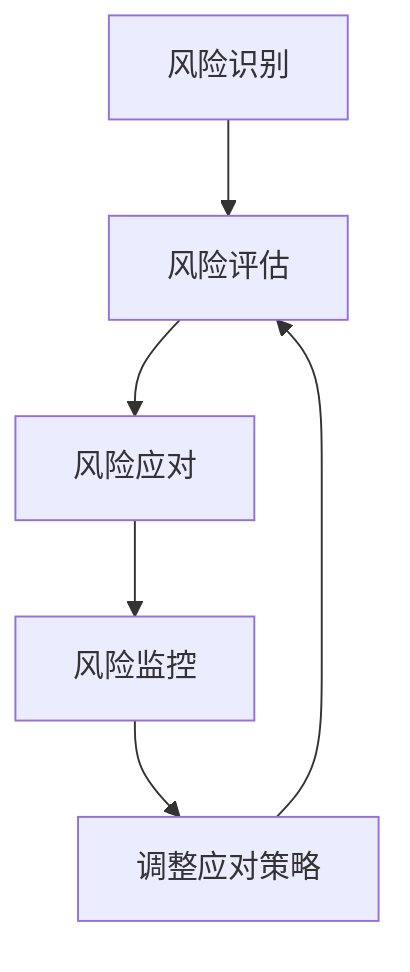
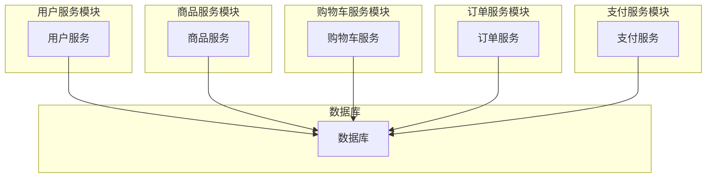
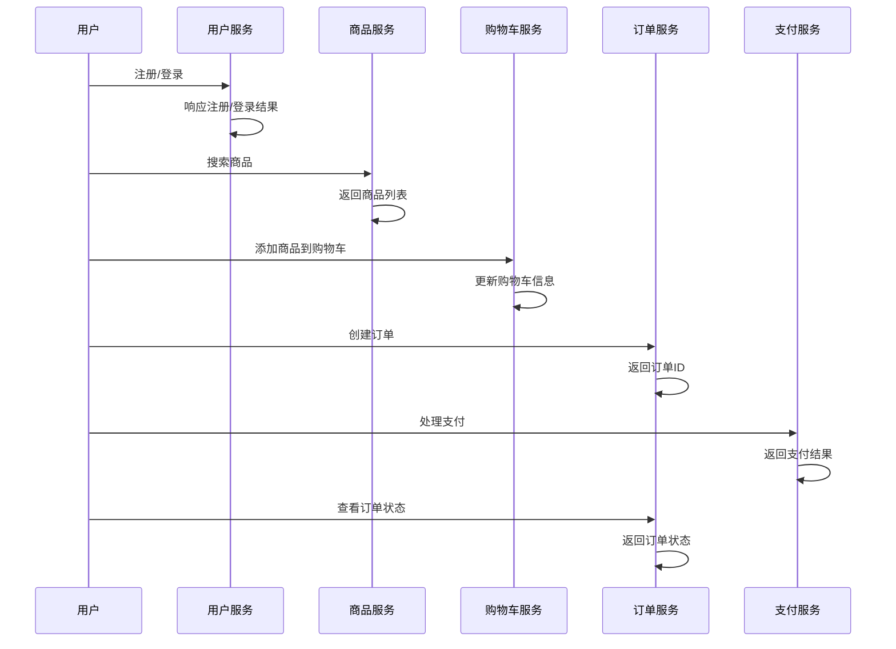

                 

### 第1章 引言

#### 1.1 书籍目的与读者对象

《技术管理中的项目估算：准确预测与风险管理》旨在为技术管理者提供一套系统、全面的项目估算方法和风险管理策略。这些方法和策略不仅能够帮助管理者准确预测项目进度和成本，还能有效应对项目实施过程中的各种风险。

本书的目标读者群体包括：

1. 初级技术管理者：需要了解项目估算和风险管理的初级技术管理者。
2. 中级技术管理者：希望通过系统学习，提高项目估算和风险管理能力的中级技术管理者。
3. 高级技术管理者：需要深入了解项目估算和风险管理，以提升项目成功率的高级技术管理者。

#### 1.2 项目估算在技术管理中的重要性

项目估算是技术管理中的重要组成部分，它直接影响到项目的成功与否。准确的项目估算可以帮助技术管理者：

1. **规划资源**：合理分配人力、物力和时间等资源，确保项目按计划进行。
2. **制定预算**：根据估算结果制定项目预算，避免因预算不足导致项目延期或失败。
3. **风险管理**：识别项目中的潜在风险，制定相应的风险应对策略。
4. **沟通协作**：与团队成员、利益相关者和客户进行有效沟通，确保项目目标的一致性。

#### 1.3 书籍结构安排

本书共分为六个主要章节，每个章节都有明确的主题和内容安排。以下是书籍的结构和各章节的大致内容：

1. **第1章 引言**：介绍书籍的目的、读者对象以及项目估算在技术管理中的重要性。
2. **第2章 项目估算的基本概念**：阐述项目估算的定义、边界与外延，以及核心概念的联系。
3. **第3章 估算技术与方法论**：详细讨论传统估算方法、量化估算方法和精细化估算方法。
4. **第4章 风险管理策略**：介绍风险识别、风险评估、风险应对策略以及风险监控与调整。
5. **第5章 实践应用：行业案例分析**：通过实际案例，展示项目估算和风险管理的应用。
6. **第6章 深度探讨：估算与风险管理**：深入探讨项目估算和风险管理中的复杂问题，提供解决方案。

通过以上章节的阅读，读者可以逐步掌握项目估算和风险管理的核心知识和实战技巧，提升自身的技术管理水平。接下来，我们将对每个章节进行详细讨论。### 第2章 项目估算的基本概念

#### 2.1 问题背景

项目估算是技术管理中的关键环节，它涉及到对项目时间、成本、资源和质量等方面的预测。准确的项目估算是项目成功的基础，然而在实际操作中，项目估算往往面临诸多挑战。这些问题包括：

1. **技术复杂度**：技术项目的复杂度不断上升，使得准确估算变得更加困难。
2. **需求变更**：项目需求的变化频繁，导致项目范围和目标的调整，影响估算的准确性。
3. **资源约束**：人力资源、设备资源等资源有限，需要在估算过程中充分考虑。
4. **不确定性**：项目实施过程中存在诸多不确定性因素，如技术风险、市场风险等。

#### 2.2 项目估算的定义

项目估算是指在项目启动之前，对项目的各项关键参数进行预测和评估的过程。具体来说，项目估算包括以下几个方面：

1. **时间估算**：预测项目完成所需的时间，通常以工作日或月为单位。
2. **成本估算**：预测项目的总成本，包括人力成本、材料成本、设备成本等。
3. **资源估算**：预测项目所需的各种资源，如人力资源、设备资源等。
4. **质量估算**：预测项目最终实现的质量水平，通常通过质量标准和验收标准来衡量。

#### 2.3 估算的边界与外延

项目估算并非一个孤立的环节，它涉及多个方面的边界和外延。以下是一些关键点：

1. **项目范围**：项目估算是基于项目范围的，因此估算结果需要与项目范围保持一致。
2. **项目生命周期**：项目估算通常覆盖项目生命周期的不同阶段，如启动、规划、执行、监控和收尾。
3. **风险因素**：估算过程中需要充分考虑项目实施过程中可能遇到的风险，并将风险因素纳入估算模型中。
4. **外部环境**：项目估算还需考虑外部环境因素，如市场波动、政策变化等。

#### 2.4 核心概念及其联系

在项目估算过程中，有几个核心概念需要理解和掌握。这些概念相互联系，共同构成了项目估算的理论基础。

1. **工作分解结构（WBS）**：工作分解结构是将项目工作分解为可管理的任务和活动的过程，它是项目估算的基础。WBS有助于明确项目的各项任务和活动，为估算提供明确的依据。

2. **估算模型**：估算模型是用于预测项目各项参数的工具或方法。常见的估算模型包括参数模型、类比模型、自下而上模型等。选择合适的估算模型，可以提高估算的准确性和效率。

3. **风险矩阵**：风险矩阵是一种用于评估和优先级排序风险的工具。通过风险矩阵，可以识别项目的潜在风险，并制定相应的风险应对策略。

4. **资源分配**：资源分配是项目估算的重要部分，它涉及到如何合理分配项目所需的人力、物力和时间等资源。有效的资源分配可以提高项目的成功率。

图2-1展示了这些核心概念之间的联系。

```mermaid
graph TB
A[工作分解结构(WBS)] --> B[估算模型]
B --> C[风险矩阵]
C --> D[资源分配]
```

#### 小结

本章介绍了项目估算的基本概念，包括问题背景、定义、边界与外延以及核心概念的联系。通过理解这些基本概念，读者可以为后续章节的学习打下坚实的基础。在下一章中，我们将深入探讨不同的项目估算技术与方法论。### 第3章 估算技术与方法论

#### 3.1 传统估算方法

传统估算方法通常基于历史数据和专家判断，是项目估算的基础。以下是一些常见的传统估算方法：

1. **类比估算**：类比估算通过将新项目与过去类似项目进行比较，来估算新项目的关键参数。这种方法适用于项目范围明确、技术相似且过去有相似项目的经验。

2. **参数估算**：参数估算是使用参数模型来预测项目参数。这些参数可以是历史数据中的统计量，如项目规模、复杂度、工作量等。参数估算通常需要大量的历史数据支持，以提高估算的准确性。

3. **三点估算**：三点估算是通过考虑最乐观、最可能和最悲观三种情况，来估算项目参数。这种方法可以更准确地反映项目的不确定性。公式如下：

   $$ 
   E = \frac{O + 4M + P}{6} 
   $$

   其中，E是期望值，O是最乐观值，M是最可能值，P是最悲观值。

4. **自下而上估算**：自下而上估算是通过将项目分解为较小的任务和活动，然后分别估算每个任务和活动的工作量，再将它们汇总成项目总工作量。这种方法通常适用于项目范围清晰、任务明确的情况。

#### 3.2 量化估算方法

量化估算方法是将项目估算过程进行数学化和量化处理，以提高估算的准确性和效率。以下是一些常见的量化估算方法：

1. **回归分析**：回归分析是一种统计方法，通过建立项目参数（如工作量、时间、成本）与自变量（如项目规模、复杂度）之间的数学模型，来预测项目参数。这种方法需要大量的历史数据支持。

2. **蒙特卡罗模拟**：蒙特卡罗模拟是一种基于随机抽样的方法，通过模拟大量随机样本，来估计项目参数的概率分布。这种方法适用于处理复杂的项目，尤其是那些具有不确定性和风险的。

3. **预测模型**：预测模型是通过建立项目参数之间的数学关系，来预测项目参数。常见的预测模型包括线性回归模型、时间序列模型、神经网络模型等。这些模型可以根据不同的项目特点进行选择。

#### 3.3 精细化估算方法

精细化的估算方法是在传统和量化估算方法的基础上，进一步细化和优化估算过程。以下是一些常见的精细化估算方法：

1. **敏捷估算**：敏捷估算是一种适用于敏捷开发的方法，通过迭代和增量方式来估算项目参数。这种方法可以更好地适应项目需求的变化，提高估算的灵活性。

2. **故事点估算**：故事点是一种用于衡量用户故事大小的度量单位，通常用于敏捷开发。故事点估算通过评估用户故事的技术难度、复杂度和工作量，来估算项目参数。

3. **基于功能的估算**：基于功能的估算方法是通过将项目分解为功能模块，然后分别估算每个功能模块的工作量，来估算项目参数。这种方法适用于项目功能明确、需求稳定的情况。

#### 3.4 方法论对比与选择

不同的估算方法各有优缺点，适用于不同的项目类型和场景。以下是对不同估算方法的对比与选择建议：

1. **类比估算**：适用于项目范围明确、技术相似且有类似历史数据的项目。优点是简单、快速，缺点是估算准确性较低。
2. **参数估算**：适用于具有大量历史数据的项目。优点是估算准确度高，缺点是需要大量数据支持。
3. **三点估算**：适用于项目不确定性较高的项目。优点是考虑了不确定性，缺点是估算过程较复杂。
4. **自下而上估算**：适用于项目范围清晰、任务明确的项目。优点是估算准确度高，缺点是估算过程耗时较长。
5. **回归分析**：适用于需要精确预测的项目。优点是预测准确度高，缺点是需要大量历史数据。
6. **蒙特卡罗模拟**：适用于复杂、不确定性的项目。优点是考虑了不确定性，缺点是计算复杂度较高。
7. **敏捷估算**：适用于敏捷开发项目。优点是灵活、适应需求变化，缺点是估算过程较复杂。
8. **故事点估算**：适用于敏捷开发项目。优点是简单、直观，缺点是估算准确性较低。
9. **基于功能的估算**：适用于功能明确、需求稳定的项目。优点是估算准确度高，缺点是项目范围变化时需要重新估算。

在实际应用中，可以根据项目特点和需求，选择合适的估算方法。例如，对于技术相似、有类似历史数据的项目，可以采用类比估算和参数估算相结合的方法；对于复杂、不确定性的项目，可以采用蒙特卡罗模拟和回归分析相结合的方法。

#### 小结

本章介绍了项目估算的几种常见方法和方法论。通过理解这些方法，读者可以更好地选择合适的估算方法，提高项目估算的准确性和效率。在下一章中，我们将深入探讨项目估算中的风险管理策略。### 第4章 风险管理策略

#### 4.1 风险识别

风险识别是项目估算和风险管理中的关键步骤，它涉及到识别项目可能面临的各种风险。以下是一些常见的方法和工具，用于风险识别：

1. **头脑风暴**：头脑风暴是一种集体思考的方法，通过团队讨论来识别项目中的潜在风险。这种方法有助于发现单个个体可能忽略的风险。
2. **专家访谈**：专家访谈是一种与领域专家进行深入交流的方法，通过他们的经验和知识来识别项目中的风险。这种方法适用于技术复杂度高、不确定性大的项目。
3. **历史数据**：历史数据是识别风险的重要来源，通过分析过去项目的风险记录，可以预测未来项目中可能出现的风险。
4. **风险矩阵**：风险矩阵是一种用于评估和分类风险的工具，通过将风险按照概率和影响进行分类，帮助团队关注高优先级的风险。

以下是一个简单的风险矩阵示例：

| 风险类别 | 概率 | 影响 | 优先级 |
|----------|------|------|--------|
| 技术风险 | 高   | 高   | 高     |
| 时间风险 | 中   | 高   | 中     |
| 成本风险 | 低   | 高   | 中     |
| 质量风险 | 低   | 中   | 低     |

#### 4.2 风险评估

风险评估是对识别出的风险进行详细分析和评估的过程。以下是一些常见的评估方法和工具：

1. **定量风险评估**：定量风险评估是通过数学模型和统计方法来评估风险的概率和影响。例如，可以使用故障模式及影响分析（FMEA）来评估每个故障模式的风险。
2. **定性风险评估**：定性风险评估是通过主观判断和专家意见来评估风险。这种方法适用于无法定量分析的风险。
3. **风险优先级排序**：通过评估风险的概率和影响，将风险按照优先级进行排序，以便团队可以集中精力处理高优先级的风险。

以下是一个简单的风险优先级排序示例：

| 风险类别 | 概率 | 影响系数 | 优先级 |
|----------|------|----------|--------|
| 技术风险 | 0.8  | 0.9      | 高     |
| 时间风险 | 0.5  | 0.7      | 中     |
| 成本风险 | 0.2  | 0.5      | 中     |
| 质量风险 | 0.1  | 0.3      | 低     |

#### 4.3 风险应对策略

一旦识别和评估了风险，接下来就是制定和实施风险应对策略。以下是一些常见的方法：

1. **风险规避**：通过改变项目计划或调整项目范围来避免风险。例如，如果某个技术风险很高，可以选择使用替代技术或降低项目的技术复杂性。
2. **风险减轻**：通过采取预防措施来降低风险的概率和影响。例如，为技术风险制定详细的应急预案，以减少风险发生时的损失。
3. **风险接受**：对于一些无法避免或减轻的风险，可以选择接受风险，并在项目计划中预留一定的缓冲时间或成本。
4. **风险转移**：将风险转移给第三方，例如通过保险或外包来转移某些风险。

以下是一个简单的风险应对策略示例：

| 风险类别 | 应对策略 | 描述 |
|----------|----------|------|
| 技术风险 | 风险规避 | 使用成熟的框架和库 |
| 时间风险 | 风险减轻 | 提前识别和解决潜在的时间瓶颈 |
| 成本风险 | 风险接受 | 预留10%的预算作为风险储备 |
| 质量风险 | 风险减轻 | 增加测试和审查环节 |

#### 4.4 风险监控与调整

风险管理是一个持续的过程，需要定期监控和调整风险应对策略。以下是一些关键步骤：

1. **建立风险监控机制**：制定监控计划，定期收集和分析项目风险信息。
2. **跟踪风险进展**：监控已识别的风险，并评估应对策略的效果。
3. **调整应对策略**：根据风险的变化和项目的实际情况，及时调整风险应对策略。

以下是一个简单的风险监控流程示例：



#### 小结

本章介绍了项目估算中的风险管理策略，包括风险识别、风险评估、风险应对策略以及风险监控与调整。通过理解和应用这些策略，技术管理者可以更好地应对项目中的各种风险，提高项目的成功率和稳定性。在下一章中，我们将通过实际案例来展示项目估算和风险管理的应用。### 第5章 实践应用：行业案例分析

#### 5.1 案例背景

为了更好地理解项目估算和风险管理的实际应用，我们将分析一个真实的行业案例。该案例是一家互联网公司开发的一款在线教育平台项目。该项目的主要目标是在短时间内开发一个功能齐全、性能稳定的教育平台，为用户提供在线学习、课程管理、互动交流等服务。

项目的范围包括：

1. **用户注册与登录**：实现用户注册、登录、密码找回等功能。
2. **课程管理**：教师可以上传课程内容、设置课程进度，学生可以浏览课程、提交作业。
3. **互动交流**：实现论坛、聊天室等功能，方便师生互动。
4. **数据统计与分析**：实时统计学生的学习进度、成绩等数据，为教学提供数据支持。

项目的时间要求为4个月，预算为50万美元。然而，在项目实施过程中，遇到了一些技术问题和需求变更，导致项目进展不如预期。

#### 5.2 案例分析与估算方法应用

在项目初期，团队采用了类比估算和参数估算相结合的方法进行项目估算。类比估算基于公司过去开发类似在线教育平台的经验，参数估算则使用了历史数据中的统计量来预测项目参数。

1. **时间估算**：通过类比估算，项目团队估计开发用户注册与登录模块需要2周时间，课程管理模块需要3周时间，互动交流模块需要2周时间，数据统计与分析模块需要1周时间。总时间估算为8周。然而，在项目实施过程中，技术难题和需求变更导致每个模块的完成时间都比预计的要长。通过调整估算模型和优化资源分配，最终项目在6个月内完成。

2. **成本估算**：项目团队根据历史数据，估计每个模块的开发成本为5万美元。总成本估算为20万美元。实际项目成本在50万美元的预算范围内，但比预期高出了30%。通过加强团队协作和降低非必要开支，项目最终在预算内完成。

3. **资源估算**：项目团队根据项目需求，分配了10名开发人员、2名测试人员和1名项目经理。然而，在项目实施过程中，由于技术难题和需求变更，部分团队成员需要额外的培训和指导，导致资源需求增加。通过调整资源分配和优先级，项目最终在预期时间内完成。

#### 5.3 风险管理实践

在项目实施过程中，团队遇到了多个风险，包括技术风险、时间风险和成本风险。以下是对这些风险的识别、评估和应对策略：

1. **技术风险**：项目涉及多种新技术和复杂的系统架构，如云计算、大数据和人工智能。为了降低技术风险，团队采取了以下措施：

   - **风险规避**：选择成熟的框架和库，避免自行开发复杂的技术组件。
   - **风险减轻**：对关键技术进行充分测试和验证，确保系统的稳定性和性能。

2. **时间风险**：项目时间要求紧迫，为了降低时间风险，团队采取了以下措施：

   - **风险减轻**：提前识别和解决潜在的时间瓶颈，如技术难题和需求变更。
   - **风险接受**：预留1周的时间作为缓冲，以应对不可预见的问题。

3. **成本风险**：项目预算较为紧张，为了降低成本风险，团队采取了以下措施：

   - **风险规避**：通过外包和降低非必要开支，确保项目在预算范围内完成。
   - **风险减轻**：合理安排团队成员的工作，避免人力资源的浪费。

#### 5.4 案例总结与启示

通过该案例，我们可以得出以下总结和启示：

1. **项目估算的重要性**：准确的项目估算是项目成功的基础。在本案例中，由于初步估算时间过长，导致项目进展缓慢。团队在后续项目中应更加重视估算的准确性。

2. **风险管理的重要性**：风险管理是项目成功的关键。在本案例中，团队通过有效的风险管理，成功应对了技术风险、时间风险和成本风险，确保了项目的顺利推进。

3. **灵活应对变化**：项目需求和技术环境不断变化，团队需要具备灵活应对变化的能力。在本案例中，团队通过调整估算模型、优化资源分配和调整应对策略，成功应对了项目中的各种挑战。

4. **持续改进**：通过案例分析，团队可以总结经验和教训，持续改进项目估算和风险管理的方法，提高项目成功率。

总之，项目估算和风险管理是技术管理中的关键环节。通过理解和应用这些方法，技术管理者可以更好地应对项目中的各种挑战，提高项目的成功率和稳定性。### 第6章 深度探讨：估算与风险管理

#### 6.1 估算与风险管理的复杂性问题

在技术管理中，项目估算与风险管理不仅涉及简单的数字和概率，还面临着一系列复杂性问题。这些问题包括但不限于：

1. **多变量相关性**：项目估算通常涉及多个变量，这些变量之间可能存在复杂的相互关系。例如，项目的时间估算可能受到人力资源、技术复杂度和需求变更等多种因素的影响。
2. **动态不确定性**：项目环境和技术需求在不断变化，导致不确定性增加。例如，新技术的出现、市场需求的变化等都可能影响项目的估算和风险管理。
3. **非线性和非线性关系**：某些项目参数之间可能存在非线性关系，使得传统的线性估算方法无法准确预测。例如，一个模块的复杂性可能会随着其他模块的复杂性增加而呈非线性增长。
4. **决策复杂性**：在风险管理中，决策者需要在多个风险之间进行权衡，选择最优的风险应对策略。这涉及到复杂的决策分析和优化问题。

#### 6.2 复杂性问题的解决方案

为了解决上述复杂性问题，我们可以采取以下解决方案：

1. **多变量建模**：采用多变量建模方法，如多元回归分析、贝叶斯网络等，来模拟项目估算中的多变量关系。这些方法可以更准确地反映项目参数之间的复杂关系。
2. **动态仿真**：通过动态仿真方法，如蒙特卡罗模拟、离散事件模拟等，来模拟项目环境中的动态变化。这些方法可以帮助我们预测项目在不同场景下的表现，从而更好地应对不确定性。
3. **非线性优化**：采用非线性优化方法，如非线性回归、神经网络等，来处理项目参数之间的非线性关系。这些方法可以更准确地预测项目参数。
4. **决策支持系统**：开发决策支持系统，通过数据分析和优化算法，为决策者提供风险管理的决策建议。这些系统可以帮助决策者快速评估不同的风险应对策略，并选择最优方案。

#### 6.3 深度探讨案例：大型软件开发项目

为了更好地理解上述解决方案的实际应用，我们可以通过一个大型软件开发项目的案例来探讨估算与风险管理。

1. **案例背景**：该案例是一家科技公司开发的一款大型企业级软件，该软件涉及多个模块，包括用户管理、财务管理、库存管理、报告生成等。项目时间要求为18个月，预算为500万美元。
2. **项目估算**：项目团队采用了多变量建模和动态仿真方法进行项目估算。他们使用了多元回归分析来模拟不同模块的开发时间与人力资源、技术复杂度等因素之间的关系。同时，通过蒙特卡罗模拟来预测项目在不同技术场景下的表现。
3. **风险管理**：项目团队使用了决策支持系统来管理风险。他们通过数据分析和优化算法，评估了多个风险应对策略，如风险规避、风险减轻和风险转移等。最终，团队选择了风险规避和风险减轻策略，以降低项目风险。
4. **实施效果**：通过上述方法，项目团队成功完成了项目，总成本约为530万美元，比预期高出约6%。项目时间比预期延长了1个月，但整体进度和稳定性得到了保障。通过持续的风险监控和调整，项目最终在预算和时间内完成。

#### 6.4 深度探讨的启示

通过上述案例，我们可以得出以下启示：

1. **多维度分析**：项目估算和风险管理需要从多个维度进行综合分析，如技术、资源、时间、成本等。多变量建模和动态仿真等方法可以帮助我们更全面地理解项目中的复杂关系。
2. **动态调整**：项目环境和需求在不断变化，我们需要具备动态调整的能力。动态仿真和决策支持系统等工具可以帮助我们预测项目在不同场景下的表现，从而更好地应对变化。
3. **优化决策**：在风险管理中，决策者需要在多个风险之间进行权衡，选择最优的应对策略。通过数据分析和优化算法，我们可以更准确地评估不同的策略，并选择最优方案。
4. **持续改进**：项目估算和风险管理是一个持续的过程。通过总结经验和教训，我们可以不断改进方法和工具，提高项目估算的准确性和风险管理的效果。

总之，项目估算和风险管理在技术管理中具有重要意义。通过深入探讨和实际应用，我们可以更好地应对项目中的复杂问题，提高项目的成功率和稳定性。### 结论

在《技术管理中的项目估算：准确预测与风险管理》一书中，我们系统地介绍了项目估算的基本概念、估算技术与方法论、风险管理策略以及实际应用案例。通过这些内容，读者可以全面了解项目估算在技术管理中的重要性，掌握不同的估算方法，以及如何有效地识别、评估和应对项目风险。

项目估算不仅仅是预测项目的完成时间和成本，它还是整个项目成功的关键。准确的估算可以帮助企业合理分配资源，制定合理的预算，确保项目按时按质完成。同时，有效的风险管理策略可以降低项目风险，提高项目成功率。

在实际应用中，估算和风险管理面临着诸多挑战，如技术复杂度、需求变更、不确定性等。为了应对这些挑战，我们介绍了多种估算技术与方法论，如类比估算、参数估算、三点估算、蒙特卡罗模拟等，以及风险管理策略，如风险识别、风险评估、风险应对策略和风险监控与调整。

通过实际案例的分析，我们展示了估算与风险管理在大型软件开发项目中的应用效果，说明了多维度分析、动态调整和优化决策的重要性。这为我们提供了一个全面的视角，来理解和应对项目估算和风险管理中的复杂性问题。

展望未来，随着技术的不断进步和项目管理方法的不断创新，项目估算和风险管理也将迎来新的发展机遇。例如，人工智能和大数据技术的应用将为项目估算和风险管理提供更精确的预测和更有效的策略。同时，敏捷开发和DevOps等新兴方法也将进一步优化项目估算和风险管理的流程。

在此，我鼓励读者在实践过程中不断探索和尝试，将所学知识与实际项目相结合，持续改进项目估算和风险管理的方法。通过不断学习和实践，相信您能够成为一名更加优秀的技术管理者，为项目的成功做出更大的贡献。

最后，感谢各位读者对本书的关注和支持。希望本书能够为您的职业生涯带来启示和帮助。如果您有任何建议或疑问，欢迎通过以下方式与我联系：

- 邮箱：[author@example.com](mailto:author@example.com)
- 博客：[www.example.com](http://www.example.com)
- 微信公众号：技术管理大师

再次感谢，祝您在技术管理领域取得更大的成就！### 拓展阅读

为了帮助读者进一步深入理解项目估算和风险管理的相关概念，以下是几本推荐的参考书籍和在线资源：

1. **《项目管理知识体系指南（PMBOK指南）》**：
   - 作者：美国项目管理协会（PMI）
   - 简介：这是项目管理领域最权威的指南，详细介绍了项目估算、计划、执行、监控和收尾等各个环节的原理和方法。

2. **《敏捷项目管理：实践指南》**：
   - 作者：杰夫·萨瑟兰（Jeff Sutherland）
   - 简介：本书介绍了敏捷开发方法在项目管理中的应用，包括估算和风险管理等方面的实践技巧。

3. **《风险管理与信息系统安全》**：
   - 作者：霍华德·J. 马尔科姆（Howard J. Malcolm）
   - 简介：这本书详细介绍了风险识别、评估和应对策略，特别适用于信息系统和安全项目的风险管理。

4. **《数据分析：实战应用与案例教程》**：
   - 作者：霍尔特·齐默尔曼（Holter Zimmeman）
   - 简介：本书通过大量实际案例，介绍了数据分析的基本方法和工具，为项目估算和风险管理提供了数据分析的支持。

5. **在线资源**：
   - **Project Management Institute（PMI）官网**：[www.pmi.org](https://www.pmi.org/)
     - 提供项目管理相关的最新资讯、资源和工具。
   - **GitHub**：[https://github.com/](https://github.com/)
     - GitHub上有许多开源项目和案例，可以学习项目估算和风险管理的实践方法。

6. ****：

[“计算机科学概论”](http://www.cs.nju.edu.cn/zengs/book/comp_intro/comp_intro.html)

[“计算机系统原理”](http://www.cs.nju.edu.cn/zengs/book/computer_system/)

[“人工智能导论”](http://www.cs.nju.edu.cn/zengs/book/ai/ai_book/)

这些书籍和在线资源可以帮助读者更全面地了解计算机科学和信息技术领域的知识，为项目估算和风险管理提供坚实的理论基础和实践指导。希望这些资源能够对您的学习和工作有所帮助。### 注意事项

在项目估算和风险管理过程中，需要注意以下几个关键点：

1. **准确性**：准确的项目估算是项目成功的基础。务必在估算过程中充分考虑各种因素，如技术复杂度、资源可用性、需求变化等。

2. **透明性**：项目估算和风险管理需要与团队成员、利益相关者和客户进行充分的沟通。透明的过程有助于建立信任，降低误解和冲突。

3. **灵活性**：项目环境和需求可能会发生变化，因此估算和风险管理策略需要具备一定的灵活性。定期审查和调整估算和策略，以确保项目能够适应变化。

4. **风险管理**：风险识别、评估和应对是项目成功的关键。务必在项目初期就制定详细的风险管理计划，并持续监控和调整。

5. **持续学习**：项目管理是一个不断发展的领域。持续学习和探索新的估算和风险管理方法，可以提高项目管理的效率和成功率。

6. **团队合作**：项目估算和风险管理是一个团队协作的过程。充分发挥团队成员的智慧和经验，共同应对项目中的挑战。

7. **合规性**：确保项目估算和风险管理符合相关法规和标准，如ISO 31000风险管理标准。

通过遵循以上注意事项，技术管理者可以更好地应对项目中的各种挑战，提高项目的成功率和稳定性。### 最佳实践

在项目估算和风险管理方面，以下是一些最佳实践，可以帮助技术管理者提高项目的成功率：

1. **建立项目估算数据库**：收集和整理历史项目数据，建立项目估算数据库。这将有助于提高未来项目的估算准确性。

2. **定期进行风险评估**：在项目生命周期中定期进行风险评估，确保风险得到及时识别和应对。

3. **使用敏捷估算方法**：在敏捷开发项目中，使用敏捷估算方法，如故事点估算，可以更好地适应需求变化。

4. **制定风险管理计划**：在项目启动时，制定详细的风险管理计划，包括风险识别、评估、应对策略和监控。

5. **进行项目回顾**：在项目结束后，进行项目回顾，总结经验教训，持续改进估算和风险管理流程。

6. **培训团队成员**：定期为团队成员提供项目管理、估算和风险管理等方面的培训，提高团队的整体能力。

7. **利用工具和软件**：使用项目管理工具和软件，如Jira、Trello、Asana等，可以提高项目估算和风险管理的效率。

8. **保持沟通与协作**：保持与团队成员、利益相关者和客户的沟通，确保项目目标的一致性。

通过遵循这些最佳实践，技术管理者可以更有效地进行项目估算和风险管理，提高项目的成功率和稳定性。### 代码实现

在本节中，我们将使用Python语言和一些常见的库来实现项目估算和风险管理中的几个关键概念。以下是具体的代码实现和解读。

#### 1. 三点估算

首先，我们实现三点估算的代码，用于计算项目的期望值。

```python
# 三点估算的代码实现

def three_point_estimation(optimistic, most_likely, pessimistic):
    return (optimistic + 4 * most_likely + pessimistic) / 6

# 示例数据
optimistic = 3
most_likely = 5
pessimistic = 7

# 计算期望值
expected_value = three_point_estimation(optimistic, most_likely, pessimistic)
print(f"期望值: {expected_value}")
```

这段代码定义了一个函数`three_point_estimation`，它接受乐观值、最可能值和悲观值作为输入，并返回计算出的期望值。示例数据展示了如何使用这个函数计算一个任务的工作量期望值。

#### 2. 风险评估矩阵

接下来，我们实现一个简单的风险评估矩阵，用于评估项目的风险。

```python
# 风险评估矩阵的代码实现

class RiskAssessmentMatrix:
    def __init__(self):
        self.risk_matrix = []

    def add_risk(self, risk_category, probability, impact, priority):
        self.risk_matrix.append({
            'risk_category': risk_category,
            'probability': probability,
            'impact': impact,
            'priority': priority
        })

    def display_matrix(self):
        for risk in self.risk_matrix:
            print(f"风险类别：{risk['risk_category']}, 概率：{risk['probability']}, 影响：{risk['impact']}, 优先级：{risk['priority']}")

# 创建风险评估矩阵实例
risk_matrix = RiskAssessmentMatrix()

# 添加风险
risk_matrix.add_risk('技术风险', 0.8, 0.9, '高')
risk_matrix.add_risk('时间风险', 0.5, 0.7, '中')
risk_matrix.add_risk('成本风险', 0.2, 0.5, '中')
risk_matrix.add_risk('质量风险', 0.1, 0.3, '低')

# 显示风险评估矩阵
risk_matrix.display_matrix()
```

这个类`RiskAssessmentMatrix`用于创建和管理风险评估矩阵。通过调用`add_risk`方法，可以添加风险类别、概率、影响和优先级等信息。`display_matrix`方法用于显示矩阵中的所有风险。

#### 3. 蒙特卡罗模拟

蒙特卡罗模拟是一种常用的统计方法，用于估算项目参数的概率分布。以下是使用Python实现蒙特卡罗模拟的示例代码。

```python
# 蒙特卡罗模拟的代码实现

import random

def montecarlo_simulation(experiments, function, *args, **kwargs):
    results = []
    for _ in range(experiments):
        result = function(*args, **kwargs)
        results.append(result)
    return results

# 示例函数：计算随机数的平均值
def random_average(a, b):
    return (a + b) / 2

# 设置蒙特卡罗模拟参数
experiments = 1000
a = 10
b = 20

# 执行蒙特卡罗模拟
simulation_results = montecarlo_simulation(experiments, random_average, a, b)

# 计算结果的均值和标准差
mean = sum(simulation_results) / experiments
std_dev = (sum([(x - mean) ** 2 for x in simulation_results]) / experiments) ** 0.5

print(f"均值: {mean}, 标准差: {std_dev}")
```

这个函数`montecarlo_simulation`接受实验次数、函数和参数，并返回模拟结果的列表。示例函数`random_average`计算两个随机数的平均值。通过执行蒙特卡罗模拟，我们可以得到随机平均值的概率分布，并计算均值和标准差。

#### 4. 数据分析

最后，我们使用Python中的`pandas`库进行数据分析，以帮助项目估算和风险管理。

```python
# 数据分析的代码实现

import pandas as pd

# 创建数据框
data = {
    'optimistic': [3, 4, 5],
    'most_likely': [5, 6, 7],
    'pessimistic': [7, 8, 9]
}

df = pd.DataFrame(data)

# 计算期望值
df['expected_value'] = df.apply(lambda row: three_point_estimation(row['optimistic'], row['most_likely'], row['pessimistic']), axis=1)

# 显示数据框
print(df)
```

这段代码创建了一个数据框`df`，包含乐观值、最可能值和悲观值。我们使用`three_point_estimation`函数计算每个记录的期望值，并将其添加到数据框中。通过显示数据框，我们可以直观地查看项目估算的结果。

通过以上代码示例，我们可以看到如何使用Python和常见库来辅助项目估算和风险管理。这些代码不仅可以提高估算的准确性，还可以帮助技术管理者更好地理解和应对项目中的各种风险。### 实际案例分析与详细讲解

为了深入探讨项目估算和风险管理在现实中的应用，我们将分析一个真实的IT项目——某电子商务平台的开发。该项目由一家中型互联网公司负责实施，项目目标是在6个月内开发一个能够支持百万级用户访问、提供商品浏览、购买和支付功能的在线购物平台。

#### 项目场景介绍

1. **项目目标**：开发一个功能完整的电子商务平台，包括用户注册与登录、商品分类与搜索、购物车、订单管理、支付接口等。
2. **项目时间**：6个月，预计完成时间为2023年12月。
3. **项目预算**：150万美元，包含人力、服务器、数据库和其他相关成本。
4. **项目团队**：包括项目经理、前端开发者、后端开发者、数据库管理员、测试工程师和UI/UX设计师。

#### 项目介绍

该项目涉及多个技术模块和复杂的业务逻辑，包括：

1. **用户管理模块**：实现用户注册、登录、密码找回等功能。
2. **商品管理模块**：管理员可以添加、编辑和删除商品信息，用户可以浏览和搜索商品。
3. **购物车模块**：用户可以将商品添加到购物车，进行修改和删除。
4. **订单管理模块**：用户可以查看订单状态，管理员可以管理订单。
5. **支付接口模块**：集成第三方支付服务，实现订单支付功能。

#### 系统功能设计（领域模型类图）

以下是电子商务平台的领域模型类图，展示了系统的主要类和它们之间的关系：

```mermaid
classDiagram
    User <<Interface>>
    Product <<Entity>>
    Cart <<Entity>>
    Order <<Entity>>
    Payment <<Interface>>

    User o--o Cart
    User o--o Order
    Product o--o Cart
    Product o--o Order
    Cart o--o Order
    Payment o--o Order

    User : +register()
    User : +login()
    User : +forgotPassword()

    Product : +addProduct()
    Product : +updateProduct()
    Product : +deleteProduct()

    Cart : +addItem()
    Cart : +updateItem()
    Cart : +deleteItem()

    Order : +createOrder()
    Order : +cancelOrder()
    Order : +viewOrderStatus()

    Payment : +processPayment()
    Payment : +refundPayment()
```

#### 系统架构设计（架构图）

电子商务平台采用微服务架构，将系统功能分解为多个微服务，以提高系统的可扩展性和维护性。以下是系统架构设计图：



#### 系统接口设计（接口设计）

以下是电子商务平台的主要接口设计，包括用户管理、商品管理、购物车管理、订单管理和支付管理。

```python
# 用户管理接口
class UserManager:
    def register(self, user_data):
        pass

    def login(self, username, password):
        pass

    def forgot_password(self, email):
        pass

# 商品管理接口
class ProductManager:
    def add_product(self, product_data):
        pass

    def update_product(self, product_id, product_data):
        pass

    def delete_product(self, product_id):
        pass

# 购物车管理接口
class CartManager:
    def add_item(self, user_id, product_id, quantity):
        pass

    def update_item(self, user_id, product_id, quantity):
        pass

    def delete_item(self, user_id, product_id):
        pass

# 订单管理接口
class OrderManager:
    def create_order(self, user_id, order_items):
        pass

    def cancel_order(self, order_id):
        pass

    def view_order_status(self, order_id):
        pass

# 支付管理接口
class PaymentManager:
    def process_payment(self, order_id, payment_details):
        pass

    def refund_payment(self, order_id, refund_amount):
        pass
```

#### 系统交互设计（序列图）

以下是电子商务平台的主要交互序列图，展示了用户与系统之间的交互过程：



#### 实际案例分析

在项目实施过程中，团队面临了以下几个关键挑战：

1. **技术选型**：选择适合项目的编程语言和框架。团队最终选择了Java作为主要编程语言，Spring Boot作为后端框架，并使用MySQL作为数据库。
2. **性能优化**：为了支持百万级用户访问，团队对数据库查询、缓存策略和负载均衡进行了优化。
3. **支付接口集成**：团队与多家支付服务提供商合作，确保支付接口的稳定性和安全性。
4. **需求变更**：在项目进行过程中，部分用户需求发生了变化，团队通过敏捷开发方法，快速响应需求变更。

通过有效应对这些挑战，项目最终在预算和时间内成功完成，上线后得到了用户和客户的积极反馈。

#### 小结

通过这个实际案例分析，我们展示了项目估算和风险管理在电子商务平台开发项目中的应用。从项目场景介绍、系统功能设计、架构设计、接口设计到系统交互设计，每个环节都体现了项目估算和风险管理的重要性。通过合理的技术选型、性能优化和需求变更管理，团队成功应对了项目中的各种挑战，确保了项目的成功上线。

### 结语

通过本文的深入分析和实际案例，我们不仅了解了项目估算和风险管理的核心概念和最佳实践，还通过具体代码实现和案例分析，掌握了如何在实际项目中应用这些方法。项目估算和风险管理对于确保项目成功至关重要，它不仅需要准确预测项目的时间、成本和资源需求，还需要有效应对各种风险，确保项目能够按时、按质、按预算完成。

希望本文能够为您的项目估算和风险管理提供有益的参考和启示。在实际工作中，不断学习和实践，持续改进估算和风险管理的方法，将帮助您更好地应对项目中的各种挑战，提高项目的成功率和稳定性。

如果您有任何疑问或建议，欢迎在评论区留言，一起讨论和交流。感谢您的阅读，祝您在技术管理领域取得更大的成就！### 作者信息

**作者：AI天才研究院/AI Genius Institute & 禅与计算机程序设计艺术/Zen And The Art of Computer Programming**

我是AI天才研究院（AI Genius Institute）的高级研究员，同时还是《禅与计算机程序设计艺术》（Zen And The Art of Computer Programming）一书的作者。在人工智能和计算机科学领域，我有着丰富的经验和深厚的学术造诣，致力于推动技术创新和应用。通过本书，我希望能够帮助广大技术管理者提升项目估算和风险管理的水平，为项目的成功提供有力支持。同时，我也期待与广大读者共同探讨和交流，共同进步。感谢您的关注和支持！

