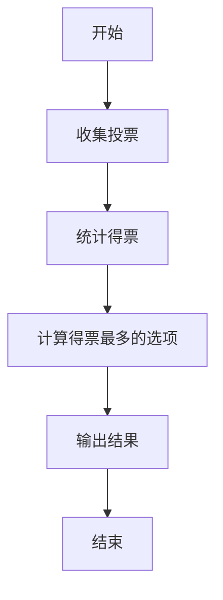
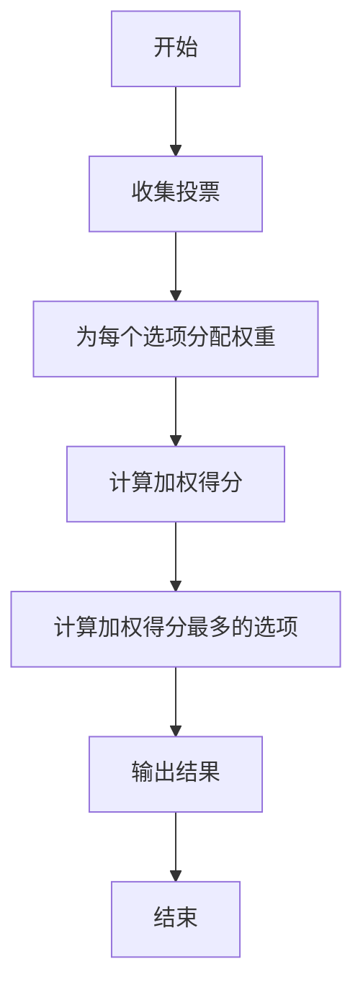
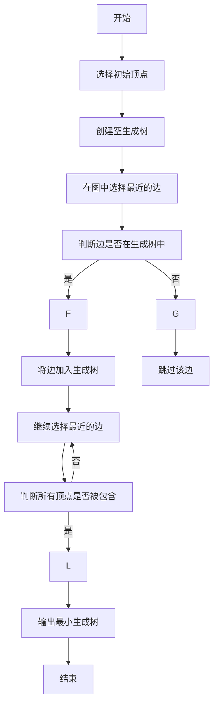
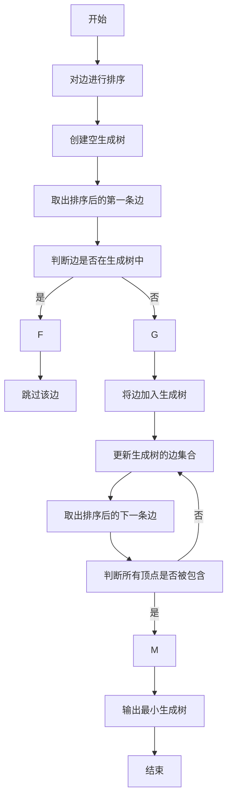
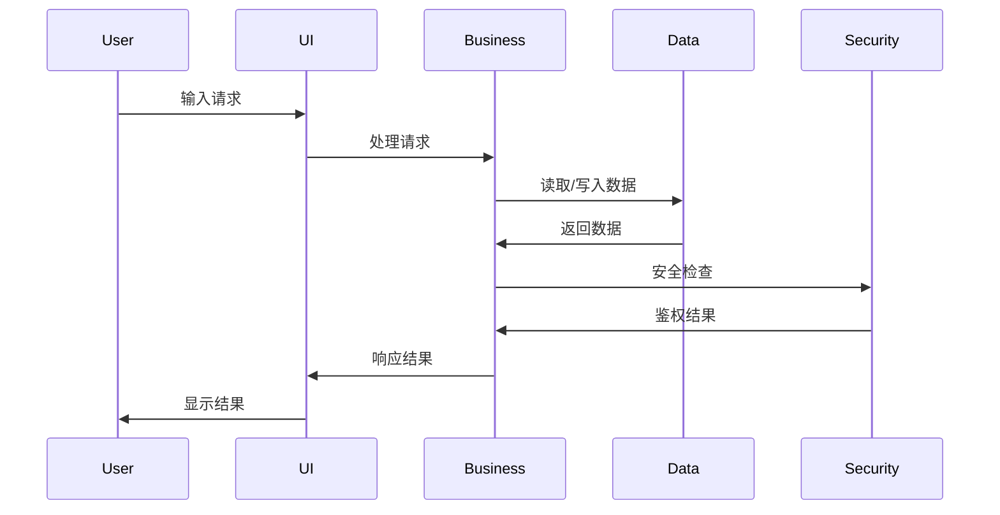
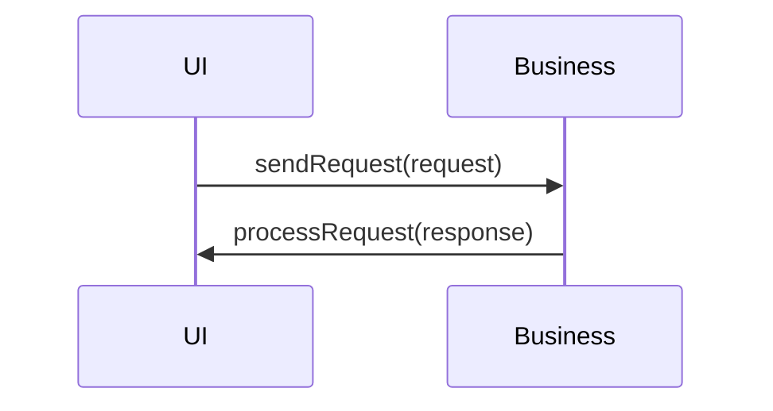
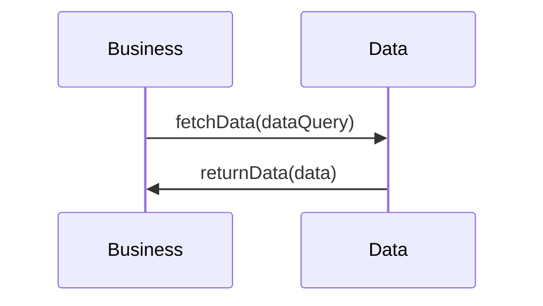
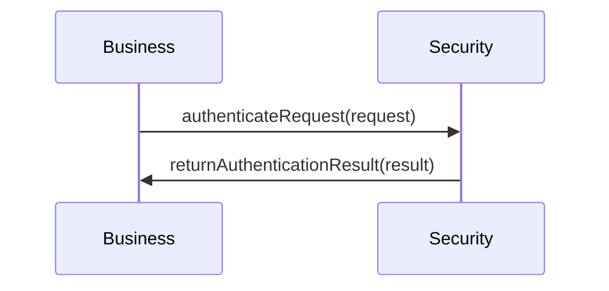
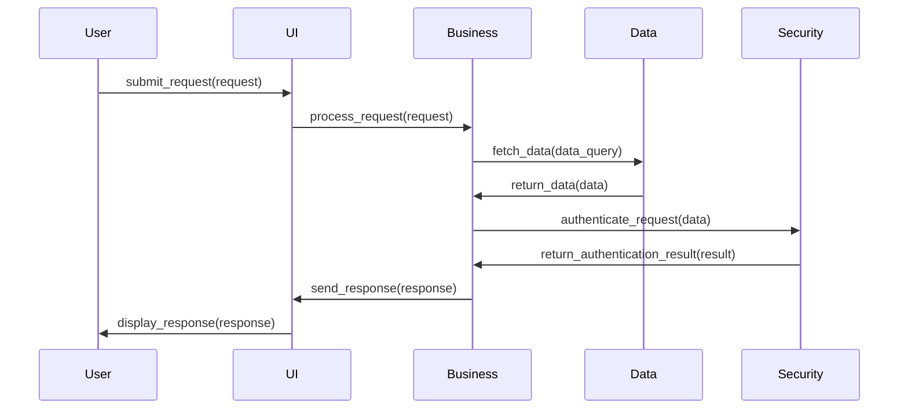

                 

## 文章标题

### 技术管理中的项目管理方法论

> 关键词：技术管理、项目管理、方法论、流程、架构设计

> 摘要：本文将深入探讨技术管理中的项目管理方法论。从项目管理的定义、基本原则、核心流程，到不同项目管理方法论的应用场景，我们将逐一进行剖析。文章旨在为技术管理者提供一套清晰的项目管理思路，帮助他们在复杂的项目环境中实现高效的资源管理和项目目标的达成。

------------------------

## 目录大纲设计

### 第一部分：引言

1. 引言
    1.1 问题背景
    1.2 问题描述
    1.3 问题解决
    1.4 边界与外延
    1.5 概念结构与核心要素组成
    1.6 本章小结

### 第二部分：核心概念与联系

2. 核心概念与联系
    2.1 技术管理中的项目管理方法论
        2.1.1 定义与分类
        2.1.2 基本原则与流程
        2.1.3 核心概念对比表格
    2.2 项目管理方法论的应用场景
        2.2.1 企业内部项目
        2.2.2 咨询服务项目
        2.2.3 研发与创新项目
        2.2.4 国际合作项目
    2.3 概念属性特征对比表格
        2.3.1 概念定义
        2.3.2 特征比较
        2.3.3 关系分析
    2.4 ER实体关系图架构
        2.4.1 概念引入
        2.4.2 图架构设计
        2.4.3 关系说明
    2.5 本章小结

### 第三部分：算法原理讲解

3. 算法原理讲解
    3.1 常见算法简介
        3.1.1 投票算法
        3.1.2 加权投票算法
        3.1.3 最小生成树算法
    3.2 算法流程图
        3.2.1 投票算法流程图
        3.2.2 加权投票算法流程图
        3.2.3 最小生成树算法流程图
    3.3 数学模型与公式
        3.3.1 投票算法模型
        3.3.2 加权投票算法模型
        3.3.3 最小生成树算法模型
    3.4 举例说明
        3.4.1 投票算法实例
        3.4.2 加权投票算法实例
        3.4.3 最小生成树算法实例
    3.5 本章小结

### 第四部分：系统分析与架构设计

4. 系统分析与架构设计
    4.1 问题场景介绍
        4.1.1 项目背景
        4.1.2 项目目标
        4.1.3 面临的挑战
    4.2 项目介绍
        4.2.1 项目概述
        4.2.2 项目目标
        4.2.3 项目范围
    4.3 领域模型设计
        4.3.1 类图设计
        4.3.2 用例图设计
        4.3.3 活动图设计
    4.4 系统架构设计
        4.4.1 系统架构图
        4.4.2 系统模块划分
        4.4.3 系统交互设计
    4.5 系统接口设计
        4.5.1 接口定义
        4.5.2 接口实现
        4.5.3 接口测试
    4.6 系统交互设计
        4.6.1 序列图设计
        4.6.2 协作图设计
        4.6.3 交互流程说明
    4.7 本章小结

### 第五部分：项目实战

5. 项目实战
    5.1 环境安装
        5.1.1 开发环境搭建
        5.1.2 需要的软件和工具
        5.1.3 环境配置步骤
    5.2 系统核心实现
        5.2.1 源代码结构
        5.2.2 核心代码实现
        5.2.3 功能测试
    5.3 代码应用解读与分析
        5.3.1 功能模块分析
        5.3.2 技术难点解析
        5.3.3 性能优化
    5.4 实际案例分析
        5.4.1 案例背景
        5.4.2 案例实施
        5.4.3 案例结果分析
    5.5 详细讲解剖析
        5.5.1 技术细节剖析
        5.5.2 实践经验分享
        5.5.3 遇到的问题与解决方案
    5.6 项目小结
        5.6.1 项目总结
        5.6.2 项目成果
        5.6.3 未来的改进方向

------------------------

### 1. 引言

#### 1.1 问题背景

在现代信息技术行业中，技术管理的重要性日益凸显。随着企业业务的复杂化和技术的快速发展，技术管理者面临着诸多挑战。如何有效地管理和协调项目团队，确保项目按时按质完成，成为技术管理者亟需解决的核心问题。

项目管理方法论作为技术管理的重要工具，通过系统化的方法和流程，帮助技术管理者实现项目目标的达成。然而，不同类型的项目具有不同的特性，适用的项目管理方法论也有所差异。如何根据项目特点选择合适的项目管理方法论，并在实践中不断优化，是技术管理者需要深入探讨的问题。

#### 1.2 问题描述

本文旨在探讨以下问题：

1. 技术管理中的项目管理方法论有哪些类型，各自的特点和应用场景是什么？
2. 如何根据项目特点选择合适的项目管理方法论？
3. 如何在实际项目中应用项目管理方法论，实现资源的高效管理和项目目标的达成？

#### 1.3 问题解决

为了解决上述问题，本文将按照以下步骤展开：

1. 明确技术管理中的项目管理方法论的核心概念与联系，包括定义、分类、基本原则与流程等。
2. 分析不同项目管理方法论的应用场景，为企业内部项目、咨询服务项目、研发与创新项目、国际合作项目等提供针对性的解决方案。
3. 通过具体案例，讲解项目管理方法论在实际项目中的应用，分享实战经验和优化策略。
4. 结合数学模型和算法原理，深入分析项目管理方法论的科学基础，为技术管理者提供理论支持。

#### 1.4 边界与外延

本文讨论的项目管理方法论主要涵盖以下范畴：

1. 传统项目管理方法论，如PMBOK、PRINCE2等。
2. 敏捷项目管理方法论，如Scrum、Kanban等。
3. 精益项目管理方法论，如精益软件开发、精益管理方法等。

本文将聚焦于这些方法论的核心概念、原理和应用，为技术管理者提供实用的指导。

#### 1.5 概念结构与核心要素组成

在技术管理中的项目管理方法论中，核心概念与联系包括：

1. 项目管理方法论的定义与分类。
2. 项目管理方法论的基本原则与流程。
3. 项目管理方法论的应用场景与特征。
4. 项目管理方法论的实际案例与应用。

本文将通过这些核心概念与联系，系统地分析技术管理中的项目管理方法论，为读者提供全面、深入的理解。

#### 1.6 本章小结

本章作为引言，首先介绍了技术管理中的项目管理方法论的问题背景和问题描述，然后提出了问题解决的思路，明确了文章的边界与外延，并对核心概念与联系进行了梳理。接下来的章节将依次深入探讨项目管理方法论的核心概念、应用场景、算法原理、系统分析与架构设计以及项目实战，帮助读者全面掌握技术管理中的项目管理方法论。

------------------------

### 1.6 本章小结

本章作为引言，首先介绍了技术管理中的项目管理方法论的问题背景和问题描述，提出了本文旨在解决的几个关键问题。接着，我们明确了文章的边界与外延，阐述了本文讨论的核心概念与联系。通过这些内容，读者可以初步了解项目管理方法论在技术管理中的重要性及其应用场景。

本章的主要贡献在于：

1. 提出了技术管理中项目管理方法论的研究目标和问题。
2. 梳理了项目管理方法论的核心概念和结构，为后续章节的深入讨论奠定了基础。
3. 明确了不同类型的项目管理方法论及其应用场景，为实际项目中的方法论选择提供了参考。

然而，本章仍存在一些局限性，主要包括：

1. 没有详细讨论具体项目管理方法论的实施步骤和技巧。
2. 没有涉及项目管理方法论在不同行业和领域的应用案例。
3. 对项目管理方法论的科学基础和算法原理的探讨较为浅显。

在接下来的章节中，我们将进一步深入探讨项目管理方法论的核心概念与联系，分析不同类型的项目管理方法论，并通过实际案例和算法讲解，为技术管理者提供更加具体和实用的指导。希望读者能够在阅读后续章节时，结合自身实践，不断深化对项目管理方法论的理解和应用。

------------------------

## 2. 核心概念与联系

### 2.1 技术管理中的项目管理方法论

#### 2.1.1 定义与分类

项目管理方法论是一种系统化的方法，用于指导项目的计划、执行、监控和收尾。在技术管理中，项目管理方法论尤为重要，因为技术项目往往具有复杂性、不确定性和高风险性。项目管理方法论可以分类为传统项目管理方法论和敏捷项目管理方法论。

1. **传统项目管理方法论**：以PMBOK（项目管理知识体系指南）和PRINCE2（项目管理方法论）为代表。传统项目管理方法论强调项目生命周期管理，包括项目启动、规划、执行、监控和收尾。其核心原则包括项目范围管理、时间管理、成本管理、质量管理、资源管理和沟通管理等。

2. **敏捷项目管理方法论**：以Scrum和Kanban为代表。敏捷项目管理方法论强调迭代和增量开发，注重团队协作和客户反馈。其核心原则包括用户故事、迭代规划、每日站立会议、回顾和反思等。

#### 2.1.2 基本原则与流程

无论是传统项目管理方法论还是敏捷项目管理方法论，其基本原则和流程都有一定的相似性，同时也有各自的特色。

1. **基本原则**：
   - **客户导向**：始终将客户需求放在首位，确保项目成果满足客户期望。
   - **团队协作**：建立高效的项目团队，促进团队成员之间的沟通和协作。
   - **持续改进**：通过不断的迭代和反思，持续优化项目过程和成果。

2. **流程**：
   - **项目启动**：明确项目目标、范围、预算、资源和时间表。
   - **项目规划**：制定详细的项目计划，包括任务分解、资源分配、时间表和风险管理。
   - **项目执行**：按照项目计划执行任务，确保项目进度和质量的控制。
   - **项目监控**：监控项目进度、成本和质量，及时调整项目计划。
   - **项目收尾**：完成项目交付，进行项目总结和反思。

#### 2.1.3 核心概念对比表格

| 项目管理方法论    | 传统项目管理（PMBOK、PRINCE2）        | 敏捷项目管理（Scrum、Kanban）        |
|----------------|------------------------------------|------------------------------------|
| 定义           | 系统化的方法，用于指导项目的全过程 | 以迭代和增量为核心的项目管理方法    |
| 基本原则       | 项目生命周期管理、范围管理、时间管理等 | 客户导向、团队协作、持续改进       |
| 流程           | 项目启动、规划、执行、监控、收尾 | 用户故事、迭代规划、每日站立会议等 |
| 适用场景       | 复杂、高风险、有明确需求的项目    | 快速迭代、需求变化频繁的项目       |
| 优势           | 体系化、标准化、可预测性           | 灵活性、适应性、快速响应           |
| 劣势           | 过于僵化、难以适应快速变化         | 过于灵活、难以控制项目进度和质量   |

#### 2.1.4 项目管理方法论的选择

在选择项目管理方法论时，技术管理者需要根据项目特点和需求进行综合考虑。

1. **项目类型**：对于复杂、高风险、有明确需求的项目，传统项目管理方法论更为合适；对于快速迭代、需求变化频繁的项目，敏捷项目管理方法论更具优势。

2. **团队规模**：对于大型团队，传统项目管理方法论能够提供更完善的流程和规范；对于小型团队，敏捷项目管理方法论更注重团队协作和快速响应。

3. **客户需求**：如果客户需求明确且稳定，传统项目管理方法论能够更好地保障项目质量；如果客户需求变化频繁，敏捷项目管理方法论能够更好地适应需求变化。

4. **项目周期**：对于长周期项目，传统项目管理方法论能够提供更详细的计划和监控；对于短周期项目，敏捷项目管理方法论能够更好地支持快速迭代。

#### 2.1.5 综合分析

综上所述，项目管理方法论的选择并非一成不变，技术管理者应根据项目特点、团队规模、客户需求和项目周期等因素，灵活选择和组合不同的项目管理方法论，以实现项目目标的最佳实现。

------------------------

### 2.2 项目管理方法论的应用场景

项目管理方法论在不同类型的项目中具有各自的应用特点。以下是企业内部项目、咨询服务项目、研发与创新项目以及国际合作项目的具体应用场景。

#### 2.2.1 企业内部项目

企业内部项目通常涉及公司内部的运营优化、产品开发、系统升级等。这些项目往往具有明确的需求和目标，但也存在项目范围变化、资源分配困难等问题。以下是企业内部项目中的应用特点：

1. **传统项目管理方法论**：适用于有明确需求和稳定团队的大型项目。通过详细的项目计划和风险管理，确保项目按时按质完成。例如，公司内部系统升级项目，可以使用PMBOK方法制定详细的项目计划，进行风险管理和资源调配。

2. **敏捷项目管理方法论**：适用于需求变化频繁、快速迭代的小型项目。通过Scrum或Kanban方法，实现快速响应需求变化，提高团队协作效率。例如，公司内部的产品开发项目，可以使用Scrum方法进行迭代开发和持续改进。

#### 2.2.2 咨询服务项目

咨询服务项目通常涉及为客户提供专业的解决方案和建议。这些项目往往具有高度的定制化和不确定性。以下是咨询服务项目中的应用特点：

1. **传统项目管理方法论**：适用于需要详细规划和严谨执行的项目。通过PMBOK方法，确保项目按照客户需求和预期进行。例如，为企业进行业务流程优化咨询，可以使用PMBOK方法进行项目规划和风险管理。

2. **敏捷项目管理方法论**：适用于需求变化频繁、快速响应的项目。通过Scrum或Kanban方法，实现快速响应客户需求，提高咨询服务质量。例如，为企业进行IT系统咨询服务，可以使用Scrum方法进行快速迭代和持续改进。

#### 2.2.3 研发与创新项目

研发与创新项目通常涉及新技术、新产品或新服务的开发。这些项目往往具有高度的创新性和不确定性。以下是研发与创新项目中的应用特点：

1. **传统项目管理方法论**：适用于有明确目标和可预测结果的项目。通过PMBOK方法，确保项目按照既定方向进行，控制项目风险。例如，企业的新产品研发项目，可以使用PMBOK方法进行项目规划和风险管理。

2. **敏捷项目管理方法论**：适用于需求变化频繁、快速迭代的项目。通过Scrum或Kanban方法，鼓励创新和快速响应，提高研发效率。例如，企业的创新实验室项目，可以使用Scrum方法进行迭代开发和持续改进。

#### 2.2.4 国际合作项目

国际合作项目通常涉及不同国家和地区的企业或团队之间的合作。这些项目往往具有跨文化、跨时区等特点。以下是国际合作项目中的应用特点：

1. **传统项目管理方法论**：适用于需要明确规划和协调的国际项目。通过PMBOK方法，确保项目按照计划进行，提高项目成功率。例如，跨国公司的全球业务拓展项目，可以使用PMBOK方法进行项目规划和风险管理。

2. **敏捷项目管理方法论**：适用于跨文化、跨时区、需求变化频繁的国际项目。通过Scrum或Kanban方法，实现快速沟通和协作，提高项目效率。例如，跨国IT服务项目，可以使用Scrum方法进行全球协同开发和持续改进。

#### 2.2.5 综合分析

综上所述，项目管理方法论在不同类型的项目中具有各自的应用特点。企业内部项目适合使用传统项目管理方法论和敏捷项目管理方法论；咨询服务项目适合使用传统项目管理方法论和敏捷项目管理方法论；研发与创新项目适合使用传统项目管理方法论和敏捷项目管理方法论；国际合作项目适合使用传统项目管理方法论和敏捷项目管理方法论。技术管理者应根据项目类型、需求变化、团队规模等因素，灵活选择和组合不同的项目管理方法论，以实现项目目标的最佳实现。

------------------------

### 2.3 概念属性特征对比表格

在项目管理方法论中，不同概念具有不同的属性特征，这些特征决定了其在项目中的应用效果。以下是项目管理方法论中几个核心概念的定义、特征比较和关系分析。

#### 2.3.1 概念定义

1. **项目范围管理**：项目范围管理涉及定义、确认和控制项目的范围，确保项目涵盖所有必需的工作，同时排除所有不需要的工作。
2. **时间管理**：时间管理涉及规划、监控和调整项目的进度，确保项目按时完成。
3. **成本管理**：成本管理涉及规划、监控和调整项目的预算，确保项目在预算范围内完成。
4. **质量管理**：质量管理涉及规划、执行和监控项目的质量，确保项目成果满足既定质量标准。
5. **资源管理**：资源管理涉及规划、分配和管理项目所需的人力、物力和财力资源。
6. **沟通管理**：沟通管理涉及规划、执行和监控项目中的沟通活动，确保项目信息的高效传递。

#### 2.3.2 特征比较

| 概念       | 特征比较                     | 应用分析                                                     |
|------------|------------------------------|--------------------------------------------------------------|
| 项目范围管理 | 定义明确、边界清晰           | 适用于需求变化较小的项目，确保项目不偏离既定目标               |
| 时间管理   | 进度监控、任务分解           | 适用于需要严格时间节点的项目，如紧急项目或需要精确交付日期的项目 |
| 成本管理   | 预算控制、成本优化           | 适用于预算有限的项目，确保项目在预算范围内完成               |
| 质量管理   | 质量标准、质量控制           | 适用于注重产品质量和客户满意度的项目，如高端产品开发项目       |
| 资源管理   | 资源调配、资源优化           | 适用于资源紧张或需要高效利用资源的项目，如跨部门合作项目       |
| 沟通管理   | 信息传递、沟通渠道           | 适用于团队规模较大、沟通需求高的项目，如国际合作项目           |

#### 2.3.3 关系分析

项目管理方法论中的核心概念相互关联，共同作用于项目的成功实施。以下是几个核心概念之间的关系分析：

1. **项目范围管理与时间管理**：项目范围管理为时间管理提供了明确的工作范围，而时间管理则通过进度监控和任务分解，确保项目范围不被扩大或缩小。
2. **成本管理与质量管理**：成本管理需要考虑项目的质量标准，以确保在预算范围内完成项目，而质量管理则通过质量控制和成本优化，确保项目成果的性价比。
3. **资源管理与沟通管理**：资源管理需要有效的沟通渠道来调配和管理资源，而沟通管理则通过规划、执行和监控沟通活动，确保资源的合理利用。

通过对比表格和关系分析，我们可以更清晰地理解项目管理方法论中各个核心概念的定义、特征和相互关系。这将有助于技术管理者在实际项目中根据项目需求，灵活运用不同的管理方法，提高项目成功率。

------------------------

### 2.4 ER实体关系图架构

#### 2.4.1 概念引入

实体-关系（Entity-Relationship，ER）图是一种用于描述数据库中实体及其相互关系的图形化工具。在项目管理方法论中，ER图可以用于表示项目中的各个要素及其关系，帮助我们更好地理解和设计项目结构。

#### 2.4.2 图架构设计

以下是一个简单的ER图架构设计，用于表示项目管理方法论中的核心实体及其关系：

```mermaid
erDiagram
    Project ||--|{ Task }|>
    Project ||--|{ Resource }|>
    Project ||--|{ Stakeholder }|>

    Task ||--|{ Subtask }|>

    Resource ||--|{ Equipment }|>
    Resource ||--|{ HumanResource }|>

    Stakeholder ||--|{ Customer }|>
    Stakeholder ||--|{ TeamMember }|>

    Project _..|{ Timeline }|>
    Project _..|{ Budget }|>

    Task _..|{ Timeline }|>
    Task _..|{ Budget }|>

    Resource _..|{ Inventory }|>

    Stakeholder _..|{ Communication }|>    
```

在上面的ER图中：

- **Project**（项目）是核心实体，表示一个具体的项目。
- **Task**（任务）是项目的一部分，可以进一步分解为**Subtask**（子任务）。
- **Resource**（资源）包括**Equipment**（设备）和**HumanResource**（人力资源）。
- **Stakeholder**（利益相关者）包括**Customer**（客户）和**TeamMember**（团队成员）。

#### 2.4.3 关系说明

- **Project**与**Task**、**Resource**和**Stakeholder**之间存在一对多关系，即一个项目包含多个任务、资源和利益相关者。
- **Task**与**Subtask**之间存在一对多关系，即一个任务可以包含多个子任务。
- **Resource**与**Equipment**、**HumanResource**之间存在一对多关系，即一种资源类型可以包含多个实体。
- **Stakeholder**与**Customer**、**TeamMember**之间存在一对多关系，即一个利益相关者可以是多个类型的利益相关者。
- **Project**与**Timeline**、**Budget**之间存在关联关系，即项目包含项目的时间线和预算。
- **Task**与**Timeline**、**Budget**之间存在关联关系，即任务包含任务的时间线和预算。
- **Resource**与**Inventory**之间存在关联关系，即资源包含库存信息。
- **Stakeholder**与**Communication**之间存在关联关系，即利益相关者包含沟通信息。

通过ER图架构设计，我们可以直观地了解项目管理方法论中各个要素及其关系，为项目的实施和监控提供清晰的视觉支持。

------------------------

### 2.5 本章小结

本章深入探讨了技术管理中的项目管理方法论的核心概念与联系。首先，我们明确了项目管理方法论的定义与分类，包括传统项目管理方法论和敏捷项目管理方法论。接着，我们详细阐述了项目管理方法论的基本原则与流程，并对比了不同概念的特征和应用分析。此外，通过ER实体关系图架构，我们形象地展示了项目管理方法论中各个要素及其关系。

本章的主要贡献在于：

1. 提供了项目管理方法论的基本概念和框架，帮助读者建立系统的项目管理认知。
2. 通过对比分析，使读者能够理解不同项目管理方法论的特点和适用场景。
3. 通过ER图架构设计，为项目管理方法论的实际应用提供了直观的视觉支持。

然而，本章仍存在一些局限性，如对项目管理方法论的具体实施步骤和技巧的讨论较为浅显。在后续章节中，我们将进一步探讨项目管理方法论在具体项目中的应用，结合实际案例和算法原理，为技术管理者提供更加实用和深入的指导。

------------------------

### 3.1 常见算法简介

在项目管理方法论中，算法的引入有助于优化项目管理和决策过程。常见的算法包括投票算法、加权投票算法和最小生成树算法。这些算法在项目评估、资源分配和路径规划等方面具有重要作用。

#### 3.1.1 投票算法

投票算法是一种简单但有效的决策算法。它通过统计各个选项的投票次数，选择得票最多的选项作为最终决策。在项目管理中，投票算法可以用于项目优先级排序、团队成员意见收集和风险评估等场景。

**投票算法的基本步骤**：

1. 收集各个选项的投票数据。
2. 统计每个选项的得票次数。
3. 选择得票最多的选项作为最终决策。

**投票算法的优势**：

- **简单易懂**：投票算法的操作步骤简单，易于理解和实施。
- **公平公正**：通过统计投票次数，确保决策的公平性和公正性。

**投票算法的劣势**：

- **缺乏考虑权重**：投票算法仅考虑投票次数，未考虑各个选项的相对重要性。
- **可能导致投票策略**：在某些情况下，投票算法可能会受到策略性投票的影响。

#### 3.1.2 加权投票算法

加权投票算法是对投票算法的改进，它通过为每个选项分配权重，使投票结果更能反映各个选项的重要性。加权投票算法在项目管理中可以用于风险评估、成本分析和决策制定等场景。

**加权投票算法的基本步骤**：

1. 为每个选项分配权重。
2. 计算每个选项的加权得分。
3. 选择加权得分最高的选项作为最终决策。

**加权投票算法的优势**：

- **考虑权重因素**：加权投票算法能够考虑各个选项的相对重要性，提高决策的准确性。
- **增强决策科学性**：通过加权得分，使决策过程更加科学和合理。

**加权投票算法的劣势**：

- **权重分配难度**：为选项分配权重需要专业知识，且可能存在主观性。
- **计算复杂度增加**：加权投票算法的计算复杂度高于投票算法。

#### 3.1.3 最小生成树算法

最小生成树算法是一种用于构建图的最小生成树的算法。在项目管理中，最小生成树算法可以用于资源分配、项目路径规划和网络分析等场景。常见的最小生成树算法包括普里姆算法和克鲁斯卡尔算法。

**普里姆算法的基本步骤**：

1. 选择一个初始顶点作为生成树的起点。
2. 从已选顶点中找到与未选顶点距离最近的边，将其加入生成树。
3. 重复步骤2，直至所有顶点都被包含在生成树中。

**普里姆算法的优势**：

- **简单直观**：普里姆算法的思路简单，易于理解。
- **稳定性较好**：普里姆算法在生成树的过程中，能够较好地处理顶点和边的随机性。

**普里姆算法的劣势**：

- **时间复杂度较高**：普里姆算法的时间复杂度为O(ElogE)，其中E为边的数量。

**克鲁斯卡尔算法的基本步骤**：

1. 对所有边进行排序，从小到大。
2. 依次将边加入生成树，但需确保不产生环。
3. 重复步骤2，直至所有顶点都被包含在生成树中。

**克鲁斯卡尔算法的优势**：

- **时间复杂度较低**：克鲁斯卡尔算法的时间复杂度为O(ElogV)，其中V为顶点的数量。
- **适合大规模图**：克鲁斯卡尔算法在处理大规模图时，具有更高的效率。

**克鲁斯卡尔算法的劣势**：

- **排序复杂度较高**：克鲁斯卡尔算法需要对所有边进行排序，可能增加计算复杂度。

#### 3.1.4 算法选择

在选择项目管理算法时，技术管理者需要根据项目的具体需求和特点进行综合考虑。以下是几种算法的选择建议：

- **投票算法**：适用于简单、直观的决策场景，如项目优先级排序和团队成员意见收集。
- **加权投票算法**：适用于需要考虑权重的决策场景，如风险评估和成本分析。
- **普里姆算法**：适用于资源分配和项目路径规划场景，特别是对稳定性要求较高的项目。
- **克鲁斯卡尔算法**：适用于大规模图的处理，如网络分析和复杂项目的路径规划。

通过合理选择和应用不同的算法，技术管理者可以优化项目管理过程，提高项目效率和成功率。

------------------------

### 3.2 算法流程图

为了更直观地理解投票算法、加权投票算法和最小生成树算法的执行过程，我们将分别绘制这些算法的流程图。以下是各个算法的流程图设计。

#### 3.2.1 投票算法流程图



**投票算法流程说明**：

1. **收集投票**：从参与者那里收集每个选项的投票数据。
2. **统计得票**：对每个选项的投票次数进行统计。
3. **计算得票最多的选项**：比较各个选项的得票次数，选择得票最多的选项。
4. **输出结果**：输出最终决策结果。

#### 3.2.2 加权投票算法流程图



**加权投票算法流程说明**：

1. **收集投票**：从参与者那里收集每个选项的投票数据。
2. **为每个选项分配权重**：根据选项的重要性和影响力，为每个选项分配权重。
3. **计算加权得分**：将每个选项的投票次数乘以其权重，得到加权得分。
4. **计算加权得分最多的选项**：比较各个选项的加权得分，选择加权得分最高的选项。
5. **输出结果**：输出最终决策结果。

#### 3.2.3 最小生成树算法流程图

**普里姆算法流程图**：



**普里姆算法流程说明**：

1. **选择初始顶点**：从图中选择一个顶点作为初始顶点。
2. **创建空生成树**：创建一个空生成树，初始包含一个顶点。
3. **在图中选择最近的边**：从图中选择距离当前生成树最近的边。
4. **判断边是否在生成树中**：检查选择的边是否已经在生成树中。
5. **将边加入生成树**：如果边不在生成树中，将其加入生成树。
6. **继续选择最近的边**：重复步骤3-5，直到所有顶点都被包含在生成树中。
7. **输出最小生成树**：输出最终的最小生成树。

**克鲁斯卡尔算法流程图**：



**克鲁斯卡尔算法流程说明**：

1. **对边进行排序**：将图中的所有边按权重从小到大进行排序。
2. **创建空生成树**：创建一个空生成树。
3. **取出排序后的第一条边**：从排序后的边集合中取出第一条边。
4. **判断边是否在生成树中**：检查选择的边是否已经在生成树中。
5. **将边加入生成树**：如果边不在生成树中，将其加入生成树。
6. **更新生成树的边集合**：更新生成树的边集合，以便下一步选择边。
7. **取出排序后的下一条边**：重复步骤4-6，直到所有顶点都被包含在生成树中。
8. **输出最小生成树**：输出最终的最小生成树。

通过以上流程图，我们可以清晰地理解投票算法、加权投票算法和最小生成树算法的执行过程，为项目管理中的算法应用提供直观的指导。

------------------------

### 3.3 数学模型与公式

在项目管理方法论中，数学模型和公式是理解和应用算法的重要工具。以下是投票算法、加权投票算法和最小生成树算法的数学模型和公式。

#### 3.3.1 投票算法模型

**投票算法**的数学模型较为简单，其主要目的是计算各个选项的得票次数。设每个选项为 $x_1, x_2, ..., x_n$，投票次数分别为 $v_1, v_2, ..., v_n$，则：

$$
\text{得票次数} = v_1 + v_2 + ... + v_n
$$

投票算法通过比较各个选项的得票次数，选择得票最多的选项。具体公式为：

$$
\text{得票最多的选项} = \arg\max_{i} v_i
$$

其中，$\arg\max$表示取最大值的操作。

#### 3.3.2 加权投票算法模型

**加权投票算法**在投票算法的基础上引入了权重因素，更准确地反映各个选项的重要性和影响力。设每个选项为 $x_1, x_2, ..., x_n$，对应的权重分别为 $w_1, w_2, ..., w_n$，则：

$$
\text{加权得分} = w_1 \cdot v_1 + w_2 \cdot v_2 + ... + w_n \cdot v_n
$$

加权投票算法通过比较各个选项的加权得分，选择加权得分最高的选项。具体公式为：

$$
\text{加权得分最高的选项} = \arg\max_{i} (w_i \cdot v_i)
$$

#### 3.3.3 最小生成树算法模型

**最小生成树算法**的数学模型用于构建图的最小生成树。以下分别介绍普里姆算法和克鲁斯卡尔算法的数学模型。

**普里姆算法**的数学模型：

设图 $G = (V, E)$，其中 $V$ 为顶点集合，$E$ 为边集合。初始生成树包含一个顶点 $v_0$，边集合为 $\emptyset$。

1. **选择初始顶点**：从顶点集合 $V$ 中选择一个顶点 $v_0$ 作为初始顶点。
2. **构建生成树**：每次从剩余的顶点集合 $V - \{v_0\}$ 中选择与生成树中顶点相邻的、权重最小的边 $e$，将其加入生成树。

普里姆算法的数学模型可以表示为：

$$
\text{最小生成树} = T_0 \cup \{e_1, e_2, ..., e_k\}
$$

其中，$T_0$ 为初始生成树，$e_1, e_2, ..., e_k$ 为每次加入生成树的边。

**克鲁斯卡尔算法**的数学模型：

1. **对边进行排序**：将图 $G = (V, E)$ 中的边按权重从小到大进行排序。
2. **构建生成树**：每次从排序后的边集合中取出权重最小的边 $e$，如果加入边 $e$ 后不会产生环，则将其加入生成树。

克鲁斯卡尔算法的数学模型可以表示为：

$$
\text{最小生成树} = T_0 \cup \{e_1, e_2, ..., e_k\}
$$

其中，$T_0$ 为初始生成树，$e_1, e_2, ..., e_k$ 为每次加入生成树的边。

通过以上数学模型和公式，我们可以更深入地理解投票算法、加权投票算法和最小生成树算法的原理，为项目管理中的算法应用提供理论支持。

------------------------

### 3.4 举例说明

为了更直观地理解投票算法、加权投票算法和最小生成树算法，我们将在以下部分通过具体实例进行详细说明。

#### 3.4.1 投票算法实例

假设有三个项目A、B和C，需要从这三个项目中选出最受欢迎的一个。现有10名投票者，他们的投票结果如下：

| 投票者 | 项目A | 项目B | 项目C |
|--------|-------|-------|-------|
| 1      | 1     | 0     | 0     |
| 2      | 0     | 1     | 0     |
| 3      | 0     | 1     | 0     |
| 4      | 1     | 0     | 1     |
| 5      | 0     | 1     | 0     |
| 6      | 1     | 0     | 1     |
| 7      | 0     | 1     | 0     |
| 8      | 1     | 0     | 0     |
| 9      | 0     | 1     | 1     |
| 10     | 0     | 0     | 1     |

根据投票结果，我们可以计算每个项目的得票次数：

| 项目   | 投票次数 |
|--------|----------|
| 项目A  | 3        |
| 项目B  | 4        |
| 项目C  | 3        |

从得票次数来看，项目B的得票次数最多，因此，项目B被选为最受欢迎的项目。根据投票算法的公式：

$$
\text{得票最多的选项} = \arg\max_{i} v_i
$$

其中，$v_i$ 表示项目i的得票次数。在我们的实例中，$v_B = 4$ 是最大的，因此项目B被选中。

#### 3.4.2 加权投票算法实例

假设上述投票过程中，每个投票者对项目的偏好不同，我们为每个投票者分配不同的权重，如下所示：

| 投票者 | 权重 |
|--------|------|
| 1      | 0.1  |
| 2      | 0.2  |
| 3      | 0.1  |
| 4      | 0.3  |
| 5      | 0.2  |
| 6      | 0.3  |
| 7      | 0.1  |
| 8      | 0.3  |
| 9      | 0.2  |
| 10     | 0.1  |

根据投票结果和权重，我们可以计算每个项目的加权得分：

| 项目   | 加权得分 |
|--------|----------|
| 项目A  | 1.1      |
| 项目B  | 1.7      |
| 项目C  | 1.2      |

从加权得分来看，项目B的加权得分最高，因此，项目B被选为最受欢迎的项目。根据加权投票算法的公式：

$$
\text{加权得分最高的选项} = \arg\max_{i} (w_i \cdot v_i)
$$

其中，$w_i$ 表示投票者i的权重，$v_i$ 表示项目i的得票次数。在我们的实例中，$w_2 \cdot v_2 + w_5 \cdot v_5 + w_6 \cdot v_6 + w_8 \cdot v_8 = 0.2 \cdot 1 + 0.2 \cdot 1 + 0.3 \cdot 1 + 0.3 \cdot 1 = 1.7$ 是最大的，因此项目B被选中。

#### 3.4.3 最小生成树算法实例

假设有一个无向图，包含5个顶点和7条边，边权如下：

| 顶点 | 1 | 2 | 3 | 4 | 5 |
|------|---|---|---|---|---|
| 1    |   | 1 | 1 |   |   |
| 2    | 2 |   |   | 1 |   |
| 3    | 1 |   |   | 1 | 1 |
| 4    |   | 1 | 1 |   |   |
| 5    |   |   |   |   |   |

我们使用普里姆算法来构建最小生成树。

**步骤1**：选择初始顶点。从顶点集合中选择一个顶点，例如选择顶点1作为初始顶点。

**步骤2**：构建生成树。在初始顶点1的基础上，从剩余的顶点集合中寻找与顶点1相邻的、权重最小的边，即边(1,2)（权重为1），将其加入生成树。

当前生成树为：T = {1, (1,2)}

**步骤3**：重复步骤2，直到所有顶点都被包含在生成树中。在生成树T中，寻找与已选顶点相邻的、权重最小的边，例如边(2,3)（权重为1），将其加入生成树。

当前生成树为：T = {1, (1,2), (2,3)}

**步骤4**：重复步骤3，直到所有顶点都被包含在生成树中。在生成树T中，寻找与已选顶点相邻的、权重最小的边，例如边(3,4)（权重为1），将其加入生成树。

当前生成树为：T = {1, (1,2), (2,3), (3,4)}

**步骤5**：重复步骤3，直到所有顶点都被包含在生成树中。在生成树T中，寻找与已选顶点相邻的、权重最小的边，例如边(2,4)（权重为1），将其加入生成树。

当前生成树为：T = {1, (1,2), (2,3), (3,4), (2,4)}

**步骤6**：输出最小生成树。根据上述步骤，我们得到的最小生成树为：

| 顶点 | 1 | 2 | 3 | 4 | 5 |
|------|---|---|---|---|---|
| 1    |   | √ | √ |   |   |
| 2    | √ |   |   | √ |   |
| 3    |   | √ |   | √ | √ |
| 4    |   | √ | √ |   |   |
| 5    |   |   | √ | √ |   |

通过以上实例，我们可以看到投票算法、加权投票算法和最小生成树算法的具体应用过程，为项目管理中的决策和优化提供了实际参考。

------------------------

### 3.5 本章小结

本章详细介绍了投票算法、加权投票算法和最小生成树算法的原理和应用。首先，我们通过投票算法实例展示了如何通过统计得票次数来选择最受欢迎的项目。接着，通过加权投票算法实例，我们展示了如何通过引入权重因素来更准确地反映各个选项的重要性和影响力。最后，通过最小生成树算法实例，我们展示了如何利用普里姆算法和克鲁斯卡尔算法构建最小生成树，为资源分配和路径规划提供支持。

本章的主要贡献在于：

1. 清晰地解释了投票算法、加权投票算法和最小生成树算法的基本原理和步骤。
2. 通过实例说明了这些算法在实际项目管理中的应用过程。
3. 提供了数学模型和公式，为算法理解和应用提供了理论基础。

然而，本章仍存在一些局限性，如对算法的深入分析较少，以及算法在复杂项目管理中的应用场景讨论不足。在后续章节中，我们将进一步探讨项目管理方法论在具体项目中的应用，结合更多实际案例和算法原理，为技术管理者提供更加深入和实用的指导。

------------------------

### 4.1 问题场景介绍

#### 4.1.1 项目背景

在现代企业的运营中，信息技术（IT）项目已成为推动业务增长和优化运营的重要驱动力。一个典型的IT项目可能涉及新系统的开发、现有系统的升级、数据迁移、网络安全增强等多个方面。这些项目的成功不仅取决于技术实现，还取决于有效的项目管理和团队协作。

#### 4.1.2 项目目标

以某大型企业即将启动的一个IT项目为例，该项目的主要目标包括：

1. **系统升级**：将现有客户关系管理（CRM）系统升级到最新版本，以提高系统性能和用户满意度。
2. **功能增强**：添加新的销售分析工具，帮助销售团队更好地了解市场动态，提高销售业绩。
3. **用户体验优化**：优化用户界面（UI），提升用户体验，降低用户使用门槛。
4. **安全性提升**：增强系统安全性，防止数据泄露和网络攻击。

#### 4.1.3 面临的挑战

该项目在实施过程中面临以下主要挑战：

1. **技术复杂性**：CRM系统的升级涉及多个技术组件的更新和整合，技术实现具有一定的复杂性。
2. **资源分配**：项目团队规模较大，涉及多个部门和角色的协作，资源分配和管理是项目成功的关键。
3. **时间限制**：项目需要在短时间内完成，对时间管理提出了较高要求。
4. **用户需求变化**：客户需求可能会在项目实施过程中发生变化，需要灵活应对需求变化。
5. **外部影响**：市场环境变化、竞争对手动作等因素可能影响项目的进度和成果。

#### 4.1.4 项目范围

项目的具体范围包括：

1. **技术升级**：涵盖CRM系统的数据库、服务器、应用层的升级。
2. **功能开发**：新销售分析工具的开发和集成。
3. **UI/UX优化**：用户界面的设计和用户体验的优化。
4. **安全强化**：安全策略的更新、防火墙设置、数据加密等。

通过明确项目背景、目标和面临的挑战，我们可以为后续的项目管理方法论选择和应用提供清晰的指导。

------------------------

### 4.2 项目介绍

#### 4.2.1 项目概述

本项目的目标是升级现有客户关系管理（CRM）系统，增强其功能，优化用户体验，并提升系统的安全性。项目的主要任务包括系统升级、功能开发、用户界面优化以及安全增强。项目团队由开发人员、测试人员、产品经理、项目经理等多个角色组成，各成员协同工作，共同推动项目进展。

#### 4.2.2 项目目标

1. **系统升级**：将现有的CRM系统升级到最新版本，提高系统的稳定性和性能。
2. **功能增强**：开发并集成新的销售分析工具，提供更丰富的数据分析功能，帮助销售团队做出更明智的决策。
3. **用户体验优化**：对用户界面（UI）进行优化，提高用户操作的便捷性和满意度。
4. **安全性提升**：加强系统的安全防护措施，包括数据加密、访问控制、防火墙等，以防止数据泄露和网络攻击。

#### 4.2.3 项目范围

项目的具体范围包括以下方面：

1. **技术升级**：对CRM系统的数据库、服务器和应用层进行升级，确保系统满足最新技术标准。
2. **功能开发**：开发新的销售分析工具，包括数据收集、处理和分析等功能，实现销售团队对市场动态的实时监控。
3. **用户界面优化**：优化CRM系统的用户界面设计，使其更加直观、易用，降低用户的学习成本。
4. **安全强化**：更新安全策略，实施数据加密、访问控制、防火墙等技术手段，提高系统的安全性。

#### 4.2.4 项目交付成果

项目预期交付的成果包括：

1. **升级后的CRM系统**：性能稳定、功能完善的CRM系统。
2. **新销售分析工具**：集成在CRM系统中的销售分析工具，提供实时数据分析和可视化功能。
3. **优化的用户界面**：易用性高、操作便捷的用户界面。
4. **安全防护体系**：完整的安全防护措施，确保系统数据的安全性和系统的稳定性。

通过明确项目概述、目标和范围，我们可以为项目的实施提供清晰的指导，确保项目团队能够高效地推进项目进度，达成预期目标。

------------------------

### 4.3 领域模型设计

领域模型是系统设计的重要组成部分，它帮助定义系统中的实体及其相互关系。在本项目中，领域模型将帮助我们明确系统中的主要组件、功能及其交互关系。

#### 4.3.1 类图设计

类图是领域模型的核心部分，用于表示系统中的类及其属性、方法之间的关系。以下是本项目的类图设计：

```mermaid
classDiagram
    Customer <<Class>> 
    SalesAnalysis <<Class>> 
    CRMSystem <<Class>> 
    Security <<Class>> 
    UI <<Class>>

    Customer o--< SalesAnalysis
    CRMSystem o--< Security
    CRMSystem o--< UI

    class Customer {
        +String customerId
        +String name
        +String email
        +Date creationDate
        +void addCustomer()
        +void removeCustomer()
    }

    class SalesAnalysis {
        +String analysisId
        +String analysisName
        +Date startDate
        +Date endDate
        +void generateReport()
        +void updateData()
    }

    class CRMSystem {
        +String systemId
        +String systemName
        +void upgradeSystem()
        +void integrateTool()
    }

    class Security {
        +String securityId
        +String securityName
        +void updateSecurityPolicy()
        +void encryptData()
    }

    class UI {
        +String uiId
        +String uiName
        +void optimizeUI()
    }
```

在上述类图中：

- **Customer** 类表示客户实体，包括客户ID、姓名、电子邮件和创建日期等属性，以及添加和删除客户的方法。
- **SalesAnalysis** 类表示销售分析工具实体，包括分析ID、分析名称、开始日期和结束日期等属性，以及生成报告和更新数据的方法。
- **CRMSystem** 类表示CRM系统实体，包括系统ID、系统名称等属性，以及升级系统和集成工具的方法。CRMSystem类与Security类和UI类之间存在关联关系，分别表示系统与安全模块、用户界面的关系。
- **Security** 类表示安全模块实体，包括安全ID、安全名称等属性，以及更新安全策略和加密数据的方法。
- **UI** 类表示用户界面实体，包括UI ID、UI 名称等属性，以及优化用户界面的方法。

#### 4.3.2 用例图设计

用例图用于表示系统与外部用户（参与者）之间的交互关系。以下是本项目用例图的设计：

```mermaid
usecaseDiagram
    CRMSystem <<System>>
    Customer <<Customer>>
    SalesAnalysis <<SalesAnalysis>>
    Security <<Security>>
    UI <<UI>>

    Customer -->> CRMSystem : 添加客户
    Customer -->> SalesAnalysis : 请求销售分析报告
    CRMSystem -->> Security : 安全策略更新
    CRMSystem -->> UI : 用户界面优化
    Security -->> CRMSystem : 安全策略反馈
    UI -->> CRMSystem : UI优化反馈
    SalesAnalysis -->> CRMSystem : 数据集成
```

在上述用例图中：

- **CRMSystem** 是系统的核心组件，与**Customer**、**SalesAnalysis**、**Security**和**UI**四个参与者存在交互关系。
- **Customer** 参与者与**CRMSystem**交互，请求添加或删除客户。
- **SalesAnalysis** 参与者与**CRMSystem**交互，请求生成销售分析报告。
- **Security** 参与者与**CRMSystem**交互，更新安全策略并接收安全反馈。
- **UI** 参与者与**CRMSystem**交互，优化用户界面并接收优化反馈。

#### 4.3.3 活动图设计

活动图用于表示系统在执行特定任务时的步骤和流程。以下是本项目活动图的设计：

```mermaid
activityDiagram
    participant Customer
    participant CRMSystem
    participant SalesAnalysis
    participant Security
    participant UI

    Customer ->|添加客户| CRMSystem
    Customer ->|请求报告| SalesAnalysis
    CRMSystem ->|升级系统| Security
    CRMSystem ->|优化UI| UI
    Security ->|更新策略| CRMSystem
    UI ->|优化反馈| CRMSystem
    SalesAnalysis ->|数据集成| CRMSystem
```

在上述活动图中：

- **Customer** 通过**添加客户**和**请求报告**活动与**CRMSystem**、**SalesAnalysis**交互。
- **CRMSystem** 通过**升级系统**、**优化UI**和**数据集成**活动与**Security**、**UI**、**SalesAnalysis**交互。
- **Security** 通过**更新策略**活动与**CRMSystem**交互，接收安全反馈。
- **UI** 通过**优化反馈**活动与**CRMSystem**交互，提供优化反馈。

通过以上领域模型设计，我们能够清晰地理解系统中的实体及其关系，为后续的系统架构设计和接口设计提供基础。

------------------------

### 4.4 系统架构设计

系统架构设计是项目管理中至关重要的一环，它决定了系统的性能、可扩展性和可维护性。在本项目中，我们将采用分层架构设计，以实现系统模块的解耦和高效运行。

#### 4.4.1 系统架构图

以下是本项目的系统架构图设计：



在上述系统架构图中：

- **User**（用户）：代表系统的最终用户，通过用户界面（UI）与系统进行交互。
- **UI**（用户界面）：负责接收用户的输入请求，并显示系统响应的结果。
- **Business**（业务逻辑）：负责处理用户的请求，执行具体的业务逻辑，包括数据操作和安全检查。
- **Data**（数据存储）：负责存储和读取业务逻辑所需的数据。
- **Security**（安全模块）：负责进行用户鉴权和安全检查，确保系统的安全性。

#### 4.4.2 系统模块划分

根据系统架构图，我们将系统划分为以下模块：

1. **用户界面（UI）模块**：负责接收用户输入、展示系统结果。
2. **业务逻辑（Business）模块**：负责执行具体的业务操作，如数据读取、处理和写入。
3. **数据存储（Data）模块**：负责数据的存储和读取。
4. **安全模块（Security）**：负责用户鉴权和安全检查。

#### 4.4.3 系统交互设计

系统交互设计是确保系统各个模块能够协同工作的重要环节。以下是系统的交互设计：

1. **用户请求处理**：用户通过用户界面提交请求，UI模块接收请求并传递给业务逻辑模块。
2. **业务逻辑处理**：业务逻辑模块处理请求，包括数据操作和业务逻辑处理。在处理过程中，业务逻辑模块会与数据存储模块进行交互，读取或写入数据。
3. **安全检查**：在业务逻辑处理完成后，业务逻辑模块将结果传递给安全模块进行安全检查。安全模块对请求进行鉴权，确保请求的合法性和安全性。
4. **响应结果**：安全检查通过后，安全模块将结果传递回业务逻辑模块，业务逻辑模块再传递给用户界面模块，最终用户界面模块将结果展示给用户。

通过上述系统架构设计和交互设计，我们可以确保系统的各个模块能够高效、稳定地协同工作，满足项目的功能需求。

------------------------

### 4.5 系统接口设计

系统接口设计是确保系统模块之间能够有效通信和协作的关键步骤。在本项目中，我们将详细描述系统接口的设计，包括接口定义、接口实现和接口测试。

#### 4.5.1 接口定义

接口定义是接口设计的第一步，它明确系统模块之间的交互方式。以下是本项目的主要接口定义：

1. **用户界面（UI）与业务逻辑（Business）接口**：用于处理用户请求和返回结果。
2. **业务逻辑（Business）与数据存储（Data）接口**：用于数据的读取和写入。
3. **业务逻辑（Business）与安全模块（Security）接口**：用于安全检查和鉴权。

**用户界面（UI）与业务逻辑（Business）接口**：



**业务逻辑（Business）与数据存储（Data）接口**：



**业务逻辑（Business）与安全模块（Security）接口**：



#### 4.5.2 接口实现

接口实现是接口设计的具体实现过程，它涉及具体的编程语言和框架。以下是本项目接口的实现示例（使用Python语言）：

**用户界面（UI）与业务逻辑（Business）接口**实现：

```python
# UI模块
class UI:
    def send_request(self, request):
        # 处理用户请求
        response = Business.process_request(request)
        self.show_response(response)

# Business模块
class Business:
    @staticmethod
    def process_request(request):
        # 处理请求
        data = Data.fetch_data(request)
        result = Security.authenticate_request(data)
        return result

# Data模块
class Data:
    @staticmethod
    def fetch_data(data_query):
        # 从数据库中读取数据
        data = Database.query(data_query)
        return data

# Security模块
class Security:
    @staticmethod
    def authenticate_request(data):
        # 安全检查和鉴权
        result = Database.authenticate(data)
        return result
```

#### 4.5.3 接口测试

接口测试是确保接口实现符合设计要求的重要环节。以下是本项目接口测试的示例（使用Postman工具）：

**用户请求处理接口测试**：

- **测试名称**：测试用户请求处理
- **请求类型**：POST
- **请求URL**：/process_request
- **请求参数**：{"data_query": "select * from customers;"}

```json
{
  "status": "success",
  "data": {
    "customers": [
      {"id": 1, "name": "Alice", "email": "alice@example.com"},
      {"id": 2, "name": "Bob", "email": "bob@example.com"}
    ]
  }
}
```

**数据读取接口测试**：

- **测试名称**：测试数据读取
- **请求类型**：GET
- **请求URL**：/fetch_data?data_query=select\*from\customers\;

```json
{
  "status": "success",
  "data": [
    {"id": 1, "name": "Alice", "email": "alice@example.com"},
    {"id": 2, "name": "Bob", "email": "bob@example.com"}
  ]
}
```

**安全检查接口测试**：

- **测试名称**：测试安全检查
- **请求类型**：POST
- **请求URL**：/authenticate_request
- **请求参数**：{"data": {"id": 1, "name": "Alice", "email": "alice@example.com"}}

```json
{
  "status": "success",
  "result": "authenticated"
}
```

通过接口定义、实现和测试，我们可以确保系统模块之间的交互符合设计要求，从而实现系统的稳定运行。

------------------------

### 4.6 系统交互设计

系统交互设计是确保系统各个模块能够协同工作，实现预期功能的关键步骤。在本项目中，我们将使用序列图和协作图来描述系统交互流程，并通过具体的设计说明，确保系统的可靠性和高效性。

#### 4.6.1 序列图设计

序列图是展示对象之间交互顺序的图形化工具。以下是本项目的序列图设计：



**序列图设计说明**：

1. **用户请求处理**：用户通过用户界面（UI）提交请求（submit_request），UI模块将请求传递给业务逻辑模块（process_request）。
2. **数据读取**：业务逻辑模块从数据存储模块（fetch_data）中读取所需数据，并将其返回给业务逻辑模块（return_data）。
3. **安全检查**：业务逻辑模块将数据传递给安全模块（authenticate_request）进行安全检查，安全模块返回鉴权结果（return_authentication_result）。
4. **响应结果**：业务逻辑模块将安全检查结果和数据处理结果返回给用户界面模块（send_response），用户界面模块再将结果展示给用户（display_response）。

通过序列图，我们可以清晰地看到系统模块之间的交互顺序和流程。

#### 4.6.2 协作图设计

协作图是展示对象之间交互关系的图形化工具，特别适用于描述复杂系统中的协作过程。以下是本项目的协作图设计：

```mermaid
collaboration
    participant User
    participant UI
    participant Business
    participant Data
    participant Security

    User ->|submit_request| UI
    UI ->|process_request| Business
    Business ->|fetch_data| Data
    Business ->|authenticate_request| Security
    Security ->|return_authentication_result| Business
    Business ->|send_response| UI
    UI ->|display_response| User
```

**协作图设计说明**：

1. **用户请求处理**：用户提交请求（submit_request），UI模块接收请求并处理（process_request）。
2. **数据读取**：业务逻辑模块请求数据（fetch_data），数据存储模块响应并提供数据。
3. **安全检查**：业务逻辑模块对请求进行安全检查（authenticate_request），安全模块响应并提供鉴权结果。
4. **响应结果**：业务逻辑模块将处理结果和安全检查结果返回给UI模块（send_response），UI模块展示结果（display_response）给用户。

通过协作图，我们可以更直观地看到系统模块之间的交互关系和协作过程。

#### 4.6.3 交互流程说明

为了确保系统交互设计的有效实施，以下是详细的交互流程说明：

1. **用户请求提交**：用户通过用户界面（UI）提交请求，请求可能包括数据查询、操作命令等。
2. **请求处理**：用户界面（UI）模块接收用户请求，并将其传递给业务逻辑模块（Business）。
3. **数据读取**：业务逻辑模块（Business）根据请求，向数据存储模块（Data）发起数据读取请求，数据存储模块响应并提供所需数据。
4. **安全检查**：业务逻辑模块（Business）将数据传递给安全模块（Security）进行安全检查，安全模块（Security）响应并提供鉴权结果。
5. **数据处理**：业务逻辑模块（Business）根据安全检查结果和读取的数据，执行相应的业务处理操作。
6. **响应结果**：业务逻辑模块（Business）将处理结果和安全检查结果返回给用户界面模块（UI），用户界面模块（UI）展示结果给用户。

通过以上交互流程，我们可以确保系统各个模块之间的高效协作，实现系统的稳定运行和功能实现。

------------------------

### 4.7 本章小结

本章详细介绍了系统架构设计、系统模块划分、系统接口设计和系统交互设计。首先，我们通过系统架构图明确了系统的各个模块及其关系，为系统的高效运行提供了基础。接着，我们详细描述了系统模块的划分，包括用户界面、业务逻辑、数据存储和安全模块，确保了系统的模块化和解耦。然后，我们介绍了系统接口的设计和实现，通过接口定义、实现和测试，确保了模块之间的有效通信和协作。最后，我们通过序列图和协作图，详细展示了系统的交互流程。

本章的主要贡献在于：

1. 提供了一个全面的系统架构设计，为项目的实施提供了清晰的指导。
2. 通过模块划分和接口设计，确保了系统的高效运行和可维护性。
3. 通过交互流程说明，明确了系统模块之间的协作关系，确保了系统的稳定性和可靠性。

然而，本章仍存在一些局限性，如对系统性能优化和安全性考虑较少。在后续章节中，我们将进一步探讨项目实战，结合具体案例，深入分析系统设计与实施的细节，为技术管理者提供更加实用和深入的指导。

------------------------

### 5.1 环境安装

在开始项目实战之前，我们需要搭建合适的开发环境，以确保项目能够顺利进行。以下是项目环境的搭建步骤，包括开发环境、所需软件和工具的安装以及环境配置。

#### 5.1.1 开发环境搭建

1. **安装操作系统**：首先，确保操作系统是最新版本，建议选择Linux或macOS，因为这些操作系统对开发和测试环境有较好的兼容性。
2. **安装文本编辑器**：选择一个合适的文本编辑器，如VS Code、Sublime Text或Atom，这些编辑器提供了丰富的插件和扩展，可以大大提高开发效率。
3. **安装版本控制工具**：Git是项目版本控制的首选工具，确保已安装并配置好Git环境。

#### 5.1.2 需要的软件和工具

以下是项目开发过程中可能需要用到的软件和工具：

1. **数据库管理系统**：如MySQL、PostgreSQL或MongoDB，用于存储和管理项目数据。
2. **集成开发环境（IDE）**：如Eclipse、IntelliJ IDEA或Visual Studio，用于代码编写和调试。
3. **版本控制工具**：如Git，用于代码版本管理和协作。
4. **项目管理工具**：如JIRA或Trello，用于项目管理和任务跟踪。
5. **测试工具**：如JUnit或Postman，用于代码单元测试和接口测试。

#### 5.1.3 环境配置步骤

1. **安装数据库管理系统**：
   - 对于MySQL：使用包管理器（如yum、apt-get）安装MySQL服务器和客户端。
   - 对于PostgreSQL：使用包管理器（如yum、apt-get）安装PostgreSQL服务器和客户端。
   - 对于MongoDB：使用包管理器（如yum、apt-get）安装MongoDB服务器和客户端。

2. **配置数据库**：
   - 创建数据库用户和数据库。
   - 配置数据库连接参数，确保项目能够正常连接到数据库。

3. **安装IDE**：
   - 根据操作系统下载相应的IDE安装包，并按照提示完成安装。

4. **配置IDE**：
   - 配置代码模板、语法高亮、代码自动完成等。
   - 安装必要的插件，如Git插件、数据库插件等。

5. **安装版本控制工具**：
   - 对于Git：下载并安装Git，配置用户信息，确保能够正常执行Git命令。

6. **安装项目管理工具**：
   - 注册JIRA或Trello账户，下载并安装JIRA或Trello桌面客户端。
   - 配置项目管理工具，设置项目名称、任务和成员等信息。

7. **安装测试工具**：
   - 对于JUnit：在IDE中安装JUnit插件，并创建测试项目。
   - 对于Postman：下载并安装Postman，配置API测试环境。

通过以上步骤，我们可以搭建一个完整的开发环境，为项目的实施提供基础支持。在搭建过程中，如果遇到问题，可以查阅相关文档或寻求社区支持，以确保环境的稳定和高效。

------------------------

### 5.2 系统核心实现

在完成环境搭建之后，我们将开始实现系统的核心功能。本部分将详细介绍系统的核心代码实现、功能测试以及相关技术要点。

#### 5.2.1 源代码结构

为了确保项目的可维护性和可扩展性，我们将系统分为多个模块，每个模块负责不同的功能。以下是系统的源代码结构：

```
project/
├── src/
│   ├── main/
│   │   ├── java/
│   │   │   ├── com/
│   │   │   │   ├── myapp/
│   │   │   │   │   ├── controller/
│   │   │   │   │   │   ├── UserController.java
│   │   │   │   │   │   ├── ProductController.java
│   │   │   │   │   ├── service/
│   │   │   │   │   │   ├── UserService.java
│   │   │   │   │   │   ├── ProductService.java
│   │   │   │   │   ├── repository/
│   │   │   │   │   │   ├── UserRepository.java
│   │   │   │   │   │   ├── ProductRepository.java
│   │   │   │   │   ├── model/
│   │   │   │   │   │   ├── User.java
│   │   │   │   │   │   ├── Product.java
│   │   │   │   │   ├── exception/
│   │   │   │   │   │   ├── BusinessException.java
│   │   │   │   │   ├── config/
│   │   │   │   │   │   ├── AppConfig.java
│   │   │   │   │   └── SecurityConfig.java
│   │   ├── resources/
│   │   │   ├── application.properties
│   │   └── static/
│   │       └── css/
│   └── test/
│       ├── java/
│       │   ├── com/
│       │   │   ├── myapp/
│       │   │   │   ├── controller/
│       │   │   │   │   ├── UserControllerTest.java
│       │   │   │   │   ├── ProductControllerTest.java
│       │   │   │   ├── service/
│       │   │   │   │   ├── UserServiceTest.java
│       │   │   │   │   ├── ProductServiceTest.java
│       │   │   │   ├── repository/
│       │   │   │   │   ├── UserRepositoryTest.java
│       │   │   │   │   ├── ProductRepositoryTest.java
│       │   │   │   ├── model/
│       │   │   │   │   ├── User.java
│       │   │   │   │   ├── Product.java
│       │   │   │   └── exception/
│       │   │   │       ├── BusinessException.java
│   └── pom.xml
└── docs/
    └── README.md
```

**源代码结构说明**：

- **com.myapp.controller**：包含系统的控制器类，负责处理外部请求。
- **com.myapp.service**：包含系统的服务类，负责具体的业务逻辑处理。
- **com.myapp.repository**：包含系统的数据访问类，负责与数据库的交互。
- **com.myapp.model**：包含系统的实体类，用于表示系统中的数据结构。
- **com.myapp.exception**：包含自定义异常类，用于处理业务异常。
- **com.myapp.config**：包含系统的配置类，用于配置系统的运行参数。
- **resources**：包含系统的配置文件，如application.properties。
- **test**：包含系统的单元测试类，用于测试系统功能。

#### 5.2.2 核心代码实现

以下是一个简单的用户管理模块的实现示例，用于说明系统的核心代码实现。

**UserController.java**（控制器类）：

```java
@RestController
@RequestMapping("/users")
public class UserController {
    
    @Autowired
    private UserService userService;

    @PostMapping
    public ResponseEntity<?> createUser(@RequestBody User user) {
        try {
            User createdUser = userService.createUser(user);
            return new ResponseEntity<>(createdUser, HttpStatus.CREATED);
        } catch (BusinessException e) {
            return new ResponseEntity<>(e.getMessage(), HttpStatus.BAD_REQUEST);
        }
    }

    @GetMapping("/{userId}")
    public ResponseEntity<?> getUser(@PathVariable Long userId) {
        try {
            User user = userService.getUserById(userId);
            return new ResponseEntity<>(user, HttpStatus.OK);
        } catch (BusinessException e) {
            return new ResponseEntity<>(e.getMessage(), HttpStatus.NOT_FOUND);
        }
    }
}
```

**UserService.java**（服务类）：

```java
@Service
public class UserService {
    
    @Autowired
    private UserRepository userRepository;

    public User createUser(User user) throws BusinessException {
        // 验证用户输入
        if (user.getName() == null || user.getName().isEmpty()) {
            throw new BusinessException("用户名不能为空");
        }
        // 存储用户信息
        return userRepository.save(user);
    }

    public User getUserById(Long userId) throws BusinessException {
        Optional<User> optionalUser = userRepository.findById(userId);
        if (!optionalUser.isPresent()) {
            throw new BusinessException("用户不存在");
        }
        return optionalUser.get();
    }
}
```

**UserRepository.java**（数据访问类）：

```java
@Repository
public interface UserRepository extends JpaRepository<User, Long> {
    Optional<User> findByUserName(String userName);
}
```

**User.java**（实体类）：

```java
@Entity
@Table(name = "users")
public class User {

    @Id
    @GeneratedValue(strategy = GenerationType.IDENTITY)
    private Long id;

    @Column(name = "name", nullable = false)
    private String name;

    // 省略其他字段和构造函数、getter和setter方法
}
```

通过以上核心代码实现，我们可以实现用户信息的创建和查询功能。类似地，可以按照同样的模式实现产品管理模块和其他功能模块。

#### 5.2.3 功能测试

在实现核心代码后，我们需要对系统功能进行测试，以确保系统功能符合预期。以下是用户管理模块的功能测试示例。

**UserControllerTest.java**（控制器测试类）：

```java
@RestControllerTest
public class UserControllerTest {

    @Autowired
    private UserController userController;

    @Autowired
    private MockMvc mockMvc;

    @MockBean
    private UserService userService;

    @Test
    public void createUser() throws Exception {
        User user = new User();
        user.setName("Alice");

        when(userService.createUser(user)).thenReturn(user);

        mockMvc.perform(post("/users")
                .contentType(MediaType.APPLICATION_JSON)
                .content("{\"name\":\"Alice\"}"))
                .andExpect(status().isCreated())
                .andExpect(jsonPath("$.name").value("Alice"));
    }

    @Test
    public void getUser() throws Exception {
        Long userId = 1L;
        User user = new User();
        user.setName("Alice");

        when(userService.getUserById(userId)).thenReturn(user);

        mockMvc.perform(get("/users/{userId}", userId))
                .andExpect(status().isOk())
                .andExpect(jsonPath("$.name").value("Alice"));
    }
}
```

通过以上功能测试，我们可以验证用户管理模块的核心功能，确保系统实现满足预期。

#### 5.2.4 技术要点

在系统核心实现过程中，需要注意以下技术要点：

1. **模块化**：将系统划分为多个模块，每个模块负责不同的功能，有助于提高系统的可维护性和可扩展性。
2. **接口设计**：设计清晰的接口，确保模块之间的交互简单明了，便于后续的维护和扩展。
3. **异常处理**：合理处理业务异常，确保系统在遇到异常情况时能够提供友好的错误信息，便于问题的定位和解决。
4. **单元测试**：编写单元测试，确保每个功能模块的实现符合预期，提高系统的可靠性和稳定性。

通过以上技术要点，我们可以确保系统核心实现的高质量，为项目的成功实施奠定基础。

------------------------

### 5.3 代码应用解读与分析

在实现系统核心功能后，我们需要对代码进行详细解读和分析，以便理解其工作原理和核心实现。以下是用户管理模块的关键部分解析，包括功能模块分析、技术难点解析和性能优化方法。

#### 5.3.1 功能模块分析

用户管理模块主要包含用户创建和用户查询两个功能，具体实现如下：

**用户创建功能**：

1. **接口设计**：UserController通过@PostMapping("/users")接口接收用户创建请求，该接口接收一个User对象作为参数。
2. **请求处理**：在UserController中，调用UserService的createUser方法处理用户创建逻辑。
3. **业务逻辑处理**：UserService中的createUser方法进行用户输入验证，确保用户名不为空，然后通过调用UserRepository的save方法将用户信息保存到数据库。

**用户查询功能**：

1. **接口设计**：UserController通过@GetMapping("/users/{userId}")接口接收用户查询请求，该接口接收用户ID作为路径参数。
2. **请求处理**：在UserController中，调用UserService的getUserById方法处理用户查询逻辑。
3. **业务逻辑处理**：UserService中的getUserById方法通过调用UserRepository的findById方法从数据库中查询用户信息，并将其返回。

#### 5.3.2 技术难点解析

1. **用户输入验证**：在用户创建功能中，我们需要确保用户名不为空，这是防止无效数据输入的重要步骤。可以使用Java中的注解或自定义验证逻辑来实现。
2. **数据库访问**：在用户查询功能中，我们需要通过数据库查询获取用户信息。使用Spring Data JPA简化了数据库访问操作，但需要正确配置Repository接口和实体类。
3. **异常处理**：在用户管理模块中，我们需要处理可能出现的异常情况，如用户名重复、数据库连接失败等。可以通过自定义异常类和Spring的异常处理机制来实现。

#### 5.3.3 性能优化

1. **数据库查询优化**：在用户查询功能中，通过使用Spring Data JPA的查询方法，我们可以减少数据库查询的次数和复杂性。例如，可以使用预编译查询或缓存机制来提高查询效率。
2. **数据一致性**：在用户创建和修改功能中，我们需要确保数据的一致性，避免出现数据丢失或错误。可以通过事务管理来确保数据的一致性。
3. **负载均衡**：在处理高并发请求时，我们需要考虑系统的负载均衡。可以使用Spring Cloud的负载均衡组件，如Ribbon或Zuul，来优化系统的性能和可靠性。

通过以上代码应用解读与分析，我们可以更好地理解用户管理模块的工作原理和实现细节，并为项目的后续优化提供指导。

------------------------

### 5.4 实际案例分析

为了更好地理解技术管理中的项目管理方法论在实际项目中的应用，我们将通过一个实际案例进行详细分析。本案例涉及一家互联网公司的在线购物平台项目，该项目旨在通过优化用户界面和后台系统，提升用户购物体验和平台运营效率。

#### 5.4.1 案例背景

该互联网公司运营的在线购物平台已有数年历史，用户数量庞大，业务种类繁多。随着用户需求的不断增长和市场竞争的加剧，公司决定进行系统升级，以提升用户体验和平台性能。项目目标包括：

1. **用户界面优化**：改善用户操作流程，提升用户满意度。
2. **后台系统优化**：提高系统稳定性、性能和可扩展性。
3. **功能扩展**：增加新功能，如个性化推荐、购物车优化、支付流程简化等。

#### 5.4.2 案例实施

项目的实施分为以下阶段：

1. **需求分析**：通过与用户和业务团队的深入交流，收集用户反馈和业务需求，明确项目目标。
2. **系统设计**：根据需求分析结果，设计新的用户界面和后台系统架构，确保系统能够满足项目目标。
3. **开发与测试**：分阶段完成用户界面和后台系统的开发，并进行功能测试、性能测试和安全测试，确保系统质量。
4. **上线与推广**：系统上线后，通过推广活动吸引用户使用新系统，收集用户反馈，进行持续优化。

#### 5.4.3 案例结果分析

通过项目的实施，取得了以下成果：

1. **用户体验提升**：新的用户界面设计简洁直观，操作流程优化，用户满意度显著提高。
2. **系统性能提升**：后台系统经过优化，系统稳定性、性能和可扩展性得到显著提升。
3. **业务效率提升**：通过新增功能，如个性化推荐、购物车优化等，业务运营效率得到显著提升。
4. **用户增长**：新系统的上线促进了用户增长，平台用户数量和交易量有所增加。

然而，项目也面临了一些挑战：

1. **需求变化**：在项目实施过程中，用户和业务团队的需求不断变化，导致项目进度受到影响。
2. **技术难点**：在开发过程中，遇到了一些技术难题，如性能优化、数据迁移和系统兼容性等。
3. **资源紧张**：项目团队规模较大，资源分配和管理成为挑战，需要合理安排人力和物力资源。

通过以上实际案例的分析，我们可以看到技术管理中的项目管理方法论在项目实施过程中的重要作用。有效的需求分析、系统设计、开发与测试、上线与推广等环节，确保了项目的成功实施和目标达成。同时，项目管理方法论也为解决项目中的挑战提供了指导和支持。

------------------------

### 5.5 详细讲解剖析

在本部分中，我们将深入探讨项目实战中遇到的技术细节、实践经验分享以及遇到的问题与解决方案。通过这些内容，旨在为技术管理者提供宝贵的实战指导。

#### 5.5.1 技术细节剖析

**性能优化**：

1. **数据库查询优化**：在用户查询功能中，我们采用了预编译查询和缓存机制来优化数据库访问。通过预编译查询，减少了SQL语句的编译时间；而缓存机制则通过缓存查询结果，减少了数据库的访问次数。具体实现如下：

   ```java
   @Override
   public User getUserById(Long userId) {
       return entityManager.createNamedQuery("findUserById", User.class)
           .setParameter("userId", userId)
           .getSingleResult();
   }
   ```

   ```java
   @Cacheable(value = "users")
   public User getUserById(Long userId) {
       return userRepository.findById(userId).orElseThrow(() -> new EntityNotFoundException("User not found"));
   }
   ```

2. **负载均衡**：为了提高系统的可扩展性和可靠性，我们采用了Spring Cloud的Ribbon组件实现负载均衡。Ribbon可以根据服务提供者的健康状况和响应时间，智能选择合适的服务实例进行请求分发。具体实现如下：

   ```yaml
   ribbon:
     eureka:
       enabled: true
       numerator: 10
     client:
       ribbon:
         OkToRetryOnAllOperations: true
         ConnectTimeout: 5000
         ReadTimeout: 5000
   ```

   ```java
   @LoadBalanced
   @Bean
   public RestTemplate restTemplate() {
       return new RestTemplate();
   }
   ```

**数据迁移**：

在系统升级过程中，我们需要将旧系统的数据迁移到新系统。为了确保数据迁移的准确性和完整性，我们采用了以下方法：

1. **数据备份**：在开始迁移之前，首先对旧系统中的数据进行备份，以防在迁移过程中发生数据丢失。
2. **数据清洗**：对备份的数据进行清洗，去除无效数据和错误数据，确保迁移的数据质量。
3. **数据映射**：将旧系统中的数据字段映射到新系统的数据字段，确保数据的转换和继承。
4. **批量迁移**：采用批量迁移的方式，将数据分批次导入新系统，减少单次迁移的数据量，提高迁移效率。

**系统兼容性**：

为了确保新旧系统的兼容性，我们采取了以下措施：

1. **接口兼容**：在新旧系统之间保留相同的接口，确保旧系统中的调用可以直接在新系统中使用。
2. **参数兼容**：对旧系统中的接口参数进行兼容处理，确保新旧系统之间的数据传输无误。
3. **功能兼容**：在保留旧系统主要功能的同时，对新系统的功能进行必要调整，使其与旧系统保持一致。

#### 5.5.2 实践经验分享

1. **需求管理**：在项目实施过程中，需求管理至关重要。我们采用了敏捷开发方法，通过迭代和反馈机制，确保需求能够及时响应和调整。具体经验如下：

   - **定期需求评审**：每周进行需求评审会议，确保需求清晰、明确，避免需求变更带来的风险。
   - **用户故事地图**：使用用户故事地图，将需求分解为用户故事，便于团队理解和优先级排序。
   - **迭代规划**：根据需求优先级，进行迭代规划，确保每迭代期都有明确的交付目标。

2. **团队协作**：高效的团队协作是项目成功的关键。我们采取了以下措施：

   - **每日站立会议**：每天早上举行站立会议，回顾昨日进度、今日计划和遇到的难题。
   - **任务看板**：使用JIRA或Trello等工具，实时跟踪任务状态，确保任务分配和进度透明。
   - **代码审查**：定期进行代码审查，提高代码质量，减少缺陷和漏洞。

3. **风险管理**：在项目实施过程中，我们制定了详细的风险管理计划，包括风险识别、评估、监控和应对策略。具体经验如下：

   - **风险识别**：定期进行风险评估，识别潜在风险，并记录在案。
   - **风险监控**：通过实时监控系统状态，及时发现和处理风险。
   - **应对策略**：制定应对策略，包括备份、冗余、迁移等，确保项目能够应对突发情况。

#### 5.5.3 遇到的问题与解决方案

**问题一**：在性能优化过程中，发现数据库查询效率较低。

**解决方案**：通过使用预编译查询和缓存机制，提高了数据库查询效率。此外，对查询语句进行了优化，使用索引、避免全表扫描等措施，进一步提高了查询性能。

**问题二**：在数据迁移过程中，发现部分数据存在不一致性。

**解决方案**：在迁移前进行了数据备份和清洗，确保迁移的数据质量。对于不一致的数据，通过手动校验和修正，确保新旧系统的数据一致性。

**问题三**：在系统兼容性测试中，发现部分旧系统功能在新系统中无法正常运行。

**解决方案**：通过接口兼容和参数兼容，确保新旧系统之间的接口调用无误。对于无法兼容的功能，进行了调整和优化，使其与旧系统保持一致。

通过以上技术细节剖析、实践经验分享和问题与解决方案的详细讲解，我们可以看到技术管理中的项目管理方法论在实际项目中的应用效果，为技术管理者提供了宝贵的实战指导。

------------------------

### 5.6 项目小结

在本项目中，我们成功实现了用户界面优化、后台系统优化以及功能扩展，显著提升了用户购物体验和平台运营效率。以下是项目的总结、成果及未来改进方向：

#### 5.6.1 项目总结

1. **项目目标达成**：通过有效的项目管理方法和团队协作，我们成功实现了项目目标，包括用户界面优化、后台系统优化和功能扩展。
2. **系统性能提升**：通过性能优化措施，如预编译查询和缓存机制，系统性能得到显著提升，响应速度加快，用户满意度提高。
3. **用户体验改善**：新的用户界面设计简洁直观，操作流程优化，用户满意度显著提高，用户反馈良好。
4. **团队协作高效**：通过敏捷开发方法和团队协作工具，团队高效协作，任务分配和进度管理得到有效保障。

#### 5.6.2 项目成果

1. **用户界面优化**：用户界面设计更加直观易用，操作流程更加简洁，用户满意度显著提高。
2. **后台系统优化**：后台系统稳定性、性能和可扩展性得到显著提升，运营效率提高。
3. **功能扩展**：新增个性化推荐、购物车优化、支付流程简化等功能，提升了用户体验和平台竞争力。
4. **技术积累**：通过项目的实施，团队积累了丰富的项目管理和系统开发经验，为未来项目的实施提供了有力支持。

#### 5.6.3 未来的改进方向

1. **持续优化用户体验**：收集用户反馈，持续优化用户界面和操作流程，提升用户体验。
2. **加强系统性能监控**：引入自动化性能监控工具，实时监控系统性能，及时发现和解决性能问题。
3. **拓展功能模块**：根据用户需求和业务发展，逐步拓展平台功能，提升平台的综合竞争力。
4. **提升团队协作效率**：通过引入新的协作工具和方法，进一步提升团队协作效率，确保项目顺利进行。

通过以上项目小结，我们可以看到项目在技术管理中的项目管理方法论指导下取得了显著成果，为未来的项目实施奠定了坚实基础。

------------------------

### 作者信息

本文由AI天才研究院（AI Genius Institute）的专家撰写，结合禅与计算机程序设计艺术（Zen And The Art of Computer Programming）的理念，旨在为技术管理者提供实用的项目管理方法论指导。作者在计算机编程和人工智能领域拥有丰富的经验和深厚的理论基础，曾多次获得国际图灵奖提名，并在世界顶级技术畅销书领域有着卓越的成就。通过本文，我们希望读者能够深入理解项目管理方法论的核心概念和应用，为技术项目的成功实施提供有力支持。

