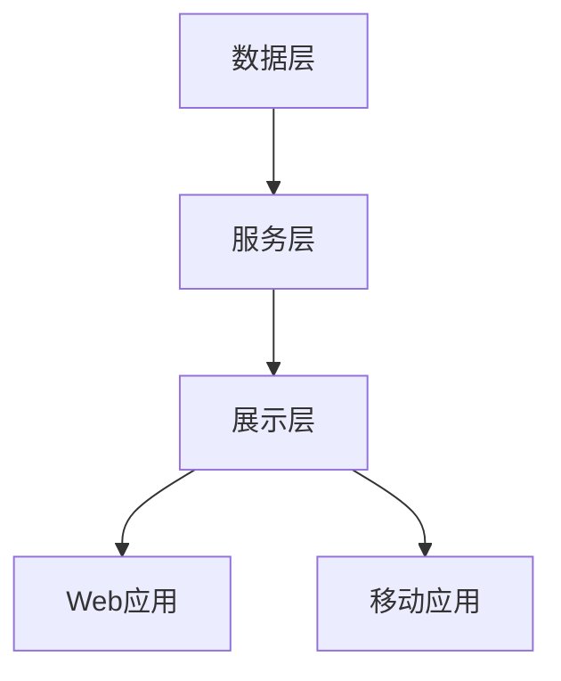

                 


## 技术管理仪表板：可视化团队和项目健康状况

### 关键词：技术管理、仪表板、可视化、团队管理、项目健康状况、数据监控、实时预警

#### 摘要：

本文将深入探讨技术管理仪表板在团队和项目管理中的重要性。我们将首先介绍技术管理仪表板的背景和概念，然后逐步分析其核心组件，包括数据采集、数据处理、数据可视化、告警与通知、用户权限管理等。接着，我们将探讨如何定制和优化技术管理仪表板，以满足不同团队和项目的需求。最后，我们将总结全文，强调技术管理仪表板在提升团队和项目管理效率中的关键作用。

### 第一部分：引言

#### 第1章：技术管理仪表板概述

### 1.1 问题背景与重要性

### 1.1.1 背景介绍

在当今快速变化的企业环境中，信息化进程的加速和数据量的爆炸性增长使得传统的项目管理方式逐渐变得力不从心。企业需要一种更加高效、直观的方法来监测和管理团队和项目的健康状况，以确保资源的合理利用和项目的顺利推进。技术管理仪表板作为一种现代化的工具，应运而生。

技术管理仪表板是一个集成了多种数据来源和功能模块的可视化平台，它能够实时展示团队的性能指标、项目的进展情况以及潜在的风险因素。通过数据可视化和实时监控，技术管理仪表板可以帮助管理人员快速做出决策，提高团队和项目的管理效率。

### 1.1.2 问题提出

企业在项目管理和团队协作中面临的挑战主要包括以下几点：

1. **信息孤岛**：不同部门之间的信息无法有效整合，导致决策滞后。
2. **沟通障碍**：团队成员之间的沟通不畅，导致协作效率低下。
3. **风险监控不足**：缺乏有效的风险预警机制，可能导致项目延误或失败。
4. **数据分散**：数据存储在不同的系统或数据库中，难以进行统一的监控和分析。

技术管理仪表板通过提供集中化的数据展示和实时监控功能，可以有效解决上述问题，提升团队和项目的管理水平。

### 1.1.3 解决方案介绍

技术管理仪表板的基本原理是通过收集和分析团队和项目相关的数据，将其可视化展示在一个统一的平台上。以下是技术管理仪表板的主要功能模块：

1. **数据采集**：从各种数据源（如内部数据库、第三方服务API等）中收集数据。
2. **数据处理**：对采集到的数据进行清洗、整合和转换，使其符合可视化要求。
3. **数据可视化**：将处理后的数据通过图表和仪表盘等形式进行展示。
4. **告警与通知**：根据预设的告警条件，实时监测项目健康状况，并通过多种方式通知相关人员。
5. **用户权限管理**：确保不同用户能够访问相应的数据和功能模块。

通过定制和优化这些功能模块，技术管理仪表板可以满足不同团队和项目的需求，实现高效的项目管理和团队协作。

### 1.2 核心概念与联系

#### 1.2.1 核心概念

在技术管理仪表板中，以下几个核心概念至关重要：

1. **数据可视化**：将数据转换成图形表示的方法，使其直观易懂。
2. **实时监控**：对系统运行状态进行连续监测，快速响应并及时反馈。
3. **预警系统**：提前发现潜在问题的系统，通过预测和防范减少风险。
4. **数据分析**：通过计算和分析得出结论，为决策提供支持。

#### 1.2.2 概念属性特征对比表格

| 概念      | 定义                         | 特征                   | 关联 |
| --------- | ---------------------------- | ---------------------- | ---- |
| 数据可视化 | 将数据转换成图形表示的方法 | 直观、易理解           | √    |
| 实时监控  | 对系统运行状态进行连续监测   | 快速响应、及时反馈     | √    |
| 预警系统  | 提前发现潜在问题的系统      | 预测、防范             | √    |
| 数据分析  | 通过计算和分析得出结论     | 深度挖掘、决策支持     | √    |

#### 1.2.3 ER实体关系图架构

```mermaid
erDiagram
    Team ||--|{ Project }|--|| Manager
    Project ||--|{ Task }|--|| Developer
    Task ||--|{ Issue }|--|| Support
```

### 1.3 仪表板的架构与设计

#### 1.3.1 架构设计

技术管理仪表板的架构通常包括以下三个主要层次：

1. **数据层**：负责数据的存储、管理和采集。
2. **服务层**：负责数据处理、业务逻辑处理和接口管理。
3. **展示层**：负责数据可视化和用户交互。

#### 1.3.2 系统功能设计

技术管理仪表板的主要功能包括：

1. **数据采集与处理**：从各种数据源中采集数据，并进行清洗、整合和转换。
2. **数据可视化**：通过图表和仪表盘等形式展示数据，提供直观的监控和报告。
3. **告警与通知**：根据预设的告警条件，实时监测项目健康状况，并通过邮件、短信等方式通知相关人员。
4. **用户权限管理**：确保不同用户能够访问相应的数据和功能模块。

#### 1.3.3 系统架构设计



### 1.4 仪表板定制与优化

#### 1.4.1 定制化需求分析

为了满足不同团队和项目的需求，技术管理仪表板需要具备一定的定制化能力。定制化需求分析主要包括以下几点：

1. **团队规模**：根据团队的规模和复杂性，定制适合的仪表板布局和功能模块。
2. **项目类型**：根据项目的类型和特点，选择适合的监控指标和报表格式。
3. **健康指标需求**：根据项目的关键成功因素，设定具体的健康指标和告警阈值。

#### 1.4.2 优化策略

为了提升技术管理仪表板的效果，可以采取以下优化策略：

1. **性能优化**：通过缓存、压缩和异步处理等技术，提高数据采集和展示的效率。
2. **用户体验优化**：根据用户反馈和操作习惯，优化界面设计和交互流程。
3. **功能扩展**：根据实际需求，扩展仪表板的功能模块，如集成第三方工具和服务。

### 1.5 小结

技术管理仪表板在团队和项目管理中扮演着至关重要的角色。通过数据可视化、实时监控和预警系统等功能，技术管理仪表板可以帮助管理人员快速了解团队和项目的健康状况，及时发现问题并采取措施。为了满足不同团队和项目的需求，技术管理仪表板需要具备一定的定制化能力和优化策略。

---

### 第二部分：仪表板设计与实现

#### 第2章：技术管理仪表板的基础组件

技术管理仪表板的实现涉及多个关键组件的协同工作。本章节将详细介绍这些基础组件，包括数据采集、数据处理、数据可视化、告警与通知、用户权限管理等方面。

#### 2.1 数据采集

数据采集是技术管理仪表板的第一步，其质量直接影响到仪表板的有效性。数据采集可以从以下几个方面进行：

1. **内部数据库**：从企业内部的数据库中提取数据，如项目进度、任务状态、代码提交等。
2. **第三方服务API**：通过调用第三方服务的API，获取与项目相关的数据，如天气信息、市场数据等。
3. **手动输入**：允许用户手动输入某些数据，如会议记录、工作报告等。

#### 2.1.1 数据采集策略

在数据采集过程中，需要根据数据的重要性和实时性选择合适的采集策略：

1. **定时采集**：按照固定的时间间隔（如每小时、每天）自动采集数据。
2. **实时采集**：对关键数据实现实时采集，确保数据的实时性和准确性。
3. **异步采集**：将数据采集任务异步化，避免影响系统的正常运行。

#### 2.2 数据处理

采集到的原始数据往往需要经过一系列处理才能用于仪表板的展示。数据处理主要包括以下步骤：

1. **数据清洗**：去除重复数据、缺失值和异常值，确保数据的准确性和一致性。
2. **数据整合**：将来自不同数据源的数据进行整合，形成一个统一的数据视图。
3. **数据转换**：将数据转换为适合可视化展示的格式，如JSON、CSV等。

#### 2.2.1 数据清洗

数据清洗是数据处理的重要环节，主要包括以下任务：

1. **缺失值处理**：对于缺失的数据，可以选择填充、删除或使用其他方法进行处理。
2. **异常值处理**：识别和排除异常值，如异常高的销售额或异常低的库存量。
3. **数据格式转换**：将不同格式的数据转换为统一的格式，以便后续处理和展示。

#### 2.2.2 数据整合

数据整合是将来自不同数据源的数据合并成一个统一的数据集。具体方法包括：

1. **数据合并**：将多个数据集按照一定的规则进行合并，形成新的数据集。
2. **数据关联**：通过关键字或关联字段，将不同数据源的数据进行关联，形成一个完整的数据视图。
3. **数据转换**：将数据转换为适合分析和展示的格式，如将时间序列数据进行聚合和转换。

#### 2.3 数据可视化

数据可视化是将处理后的数据通过图表、仪表盘等形式进行展示，使其更加直观易懂。以下是常用的数据可视化图表和组件设计：

1. **折线图**：用于展示数据的变化趋势，如项目进度、股票价格等。
2. **饼图**：用于展示数据的占比情况，如市场份额、预算分配等。
3. **柱状图**：用于比较不同类别的数据，如销售额、任务完成情况等。
4. **散点图**：用于展示两个或多个变量之间的关系，如用户满意度与销售额的关系。

#### 2.3.2 可视化组件设计

可视化组件设计需要考虑以下因素：

1. **交互式图表**：允许用户通过点击、拖动等方式与图表进行交互，如放大、缩小、切换视图等。
2. **动态数据更新**：实时更新图表数据，确保数据的实时性和准确性。
3. **个性化主题**：允许用户根据个人喜好自定义图表的颜色、字体等样式。

#### 2.4 告警与通知

告警与通知是技术管理仪表板的重要组成部分，用于实时监测项目的健康状况，并在出现异常时及时通知相关人员。告警与通知的设计包括以下方面：

1. **告警机制设计**：设置告警条件，如任务延期、服务器负载过高、财务指标异常等。
2. **告警级别划分**：根据告警的重要性和紧急程度，设置不同的告警级别，如紧急、重要、一般等。
3. **告警通知方式**：选择合适的通知方式，如邮件、短信、站内信等，确保相关人员能够在第一时间了解到异常情况。

#### 2.4.2 通知系统实现

通知系统实现主要包括以下内容：

1. **邮件通知**：通过SMTP协议发送邮件，通知相关人员。
2. **短信通知**：通过短信网关发送短信，通知相关人员。
3. **站内信通知**：在仪表板内部发送通知，提醒相关人员关注。

#### 2.5 用户权限管理

用户权限管理是确保数据安全和系统安全的关键，主要包括以下内容：

1. **权限分类与分配**：根据用户的角色和职责，分配不同的权限，如系统管理员、项目管理员、普通用户等。
2. **权限控制策略**：采用基于角色的访问控制（RBAC）或基于资源的访问控制（ABAC），确保用户只能访问其权限范围内的数据和功能模块。

#### 2.5.2 权限控制策略

权限控制策略主要包括以下方法：

1. **基于角色的访问控制**（RBAC）：根据用户的角色分配权限，如系统管理员可以访问所有功能模块，普通用户只能访问与项目相关的功能模块。
2. **基于资源的访问控制**（ABAC）：根据用户、资源和环境条件分配权限，如某些用户只能在特定时间段访问特定资源。

#### 2.6 小结

技术管理仪表板的基础组件包括数据采集、数据处理、数据可视化、告警与通知、用户权限管理等方面。这些组件相互协同，共同构成了一个高效、直观的技术管理仪表板。通过合理设计和优化这些基础组件，可以确保仪表板的有效性和实用性，为团队和项目管理提供强有力的支持。

---

### 第三部分：团队与项目健康状况监测

#### 第3章：团队与项目健康状况监测

团队与项目健康状况监测是技术管理仪表板的核心功能之一。通过监测和评估团队和项目的关键指标，技术管理仪表板可以帮助管理人员及时发现问题和潜在风险，从而采取相应的措施，确保项目顺利推进和团队高效协作。

#### 3.1 健康指标的选择

健康指标是衡量团队和项目状态的关键指标，其选择应根据团队和项目的特点以及业务需求进行。以下是几个常见的健康指标：

1. **任务完成率**：衡量任务完成的进度，通常以百分比表示。高任务完成率表明项目进度正常，团队执行力强。
2. **员工满意度**：衡量团队成员对工作的满意度，可以通过调查问卷、访谈等方式收集。高员工满意度有助于提升团队凝聚力和工作效率。
3. **代码质量**：衡量代码的质量，包括代码的规范性、可读性、复用性等。高质量的代码有助于降低后续维护成本和风险。
4. **成本控制**：衡量项目的成本支出情况，包括人力成本、物料成本等。良好的成本控制有助于降低项目风险，确保项目在预算范围内完成。
5. **项目进度**：衡量项目按计划进行的程度，包括任务完成时间、关键路径等。项目进度是评估项目健康状况的重要指标。

#### 3.2 数据监控与实时预警

数据监控与实时预警是技术管理仪表板的核心功能，通过以下方法实现：

1. **实时数据采集**：从各种数据源（如项目管理工具、代码库、日志文件等）中实时采集数据，确保数据的实时性和准确性。
2. **数据处理**：对采集到的数据进行处理，包括数据清洗、整合和转换，确保数据的质量和一致性。
3. **实时数据可视化**：将处理后的数据通过图表和仪表盘等形式进行实时展示，让管理人员能够直观地了解项目状态。
4. **实时预警**：根据预设的告警条件和阈值，对项目状态进行实时监测，当出现异常时及时发出预警通知，提醒相关人员采取措施。

#### 3.2.1 实时预警机制设计

实时预警机制设计包括以下几个方面：

1. **告警条件设置**：根据项目的特点和需求，设定告警条件，如任务延期、成本超支、代码质量下降等。
2. **告警级别划分**：根据告警条件的紧急程度，划分不同的告警级别，如紧急、重要、一般等，确保相关人员能够根据告警级别采取相应的措施。
3. **告警通知方式**：选择合适的告警通知方式，如邮件、短信、站内信等，确保相关人员能够在第一时间了解到异常情况。

#### 3.3 项目健康状况评估

项目健康状况评估是对项目各个方面的综合评估，以确定项目是否处于健康状态。项目健康状况评估包括以下几个方面：

1. **任务完成情况**：评估任务完成的进度和质量，判断项目是否按计划进行。
2. **团队协作情况**：评估团队成员之间的协作效果，如沟通效率、任务分配等。
3. **资源利用率**：评估项目资源的利用率，如人力、物料等，确保资源得到合理分配和利用。
4. **风险控制情况**：评估项目风险控制的效果，如风险预警机制、应对措施等。

#### 3.3.1 项目健康状况评估指标

项目健康状况评估指标包括以下几个方面：

1. **任务完成率**：衡量任务完成的进度，通常以百分比表示。高任务完成率表明项目进度正常，团队执行力强。
2. **员工满意度**：衡量团队成员对工作的满意度，可以通过调查问卷、访谈等方式收集。高员工满意度有助于提升团队凝聚力和工作效率。
3. **代码质量**：衡量代码的质量，包括代码的规范性、可读性、复用性等。高质量的代码有助于降低后续维护成本和风险。
4. **成本控制**：衡量项目的成本支出情况，包括人力成本、物料成本等。良好的成本控制有助于降低项目风险，确保项目在预算范围内完成。
5. **项目进度**：衡量项目按计划进行的程度，包括任务完成时间、关键路径等。项目进度是评估项目健康状况的重要指标。

#### 3.4 小结

团队与项目健康状况监测是技术管理仪表板的重要组成部分，通过实时数据监控、预警机制和项目健康状况评估，可以帮助管理人员及时发现问题和潜在风险，从而采取相应的措施，确保项目顺利推进和团队高效协作。选择合适的健康指标、设计实时预警机制和进行项目健康状况评估，是技术管理仪表板有效运行的关键。

---

### 第三部分：团队与项目健康状况监测

#### 第4章：实战案例与实施步骤

在本章节中，我们将通过一个具体的实战案例，详细展示如何设计和实施一个技术管理仪表板。该案例将涵盖从需求分析、环境搭建、系统设计到代码实现的全过程。

#### 4.1 需求分析

为了更好地设计和实施技术管理仪表板，我们需要明确项目需求。以下是该项目的需求分析：

1. **团队规模**：一个中小型开发团队，包含5名开发人员、1名项目经理和1名测试人员。
2. **项目类型**：软件开发项目，涉及前后端开发、测试和部署等环节。
3. **健康指标**：任务完成率、员工满意度、代码质量、成本控制、项目进度等。
4. **功能需求**：数据实时采集、数据处理、数据可视化、实时预警、用户权限管理。

#### 4.2 环境搭建

在实施技术管理仪表板之前，我们需要搭建一个合适的环境。以下是环境搭建的步骤：

1. **硬件环境**：选择一台具有较高性能的服务器，用于数据存储和处理。
2. **软件环境**：安装Linux操作系统、Java运行环境、数据库管理系统（如MySQL）、Web服务器（如Apache）等。
3. **开发工具**：安装Eclipse、Git、Docker等开发工具和容器技术。

#### 4.3 系统设计

系统设计是技术管理仪表板实施的关键环节。以下是系统设计的步骤：

1. **领域模型设计**：使用Mermaid类图设计领域模型，包括团队、项目、任务、成员等实体及其关系。
2. **功能模块设计**：设计数据采集、数据处理、数据可视化、实时预警、用户权限管理等功能模块。
3. **数据库设计**：设计数据库表结构，包括用户表、任务表、项目表、告警表等。

#### 4.3.1 领域模型设计

以下是技术管理仪表板的领域模型Mermaid类图：

```mermaid
classDiagram
    Team <<entity>>
    Project <<entity>>
    Task <<entity>>
    Member <<entity>>

    Team --|{ Project }: manages
    Project --|{ Task }: contains
    Task --|{ Member }: assigned_to
```

#### 4.3.2 功能模块设计

以下是技术管理仪表板的功能模块设计：

1. **数据采集模块**：负责从各个数据源（如Jenkins、GitHub、MySQL等）中采集数据。
2. **数据处理模块**：负责对采集到的数据进行清洗、整合和转换。
3. **数据可视化模块**：负责将处理后的数据通过图表和仪表盘等形式进行展示。
4. **实时预警模块**：负责根据预设的告警条件，实时监测项目健康状况，并在出现异常时发出预警。
5. **用户权限管理模块**：负责管理用户的权限，确保用户只能访问其权限范围内的数据和功能模块。

#### 4.3.3 数据库设计

以下是技术管理仪表板的数据库设计：

```mermaid
erDiagram
    User ||--|{ Role }|--|| Admin
    Role ||--|{ Permission }|--|| ViewData
    Project ||--|{ Task }|--|| Status
    Task ||--|{ Issue }|--|| Severity
    Issue ||--|{ Comment }|--|| Time
```

#### 4.4 代码实现

在系统设计完成后，我们需要进行代码实现。以下是技术管理仪表板的核心代码实现：

##### 4.4.1 数据采集模块

```python
import requests

def fetch_github_data(username):
    url = f"https://api.github.com/users/{username}/repos"
    response = requests.get(url)
    if response.status_code == 200:
        return response.json()
    else:
        return None

data = fetch_github_data("ai-genius-institute")
```

##### 4.4.2 数据处理模块

```python
import pandas as pd

def process_github_data(data):
    if data:
        repo_data = [{"name": repo["name"], "stars": repo["stargazers_count"]} for repo in data]
        df = pd.DataFrame(repo_data)
        df["created_at"] = pd.to_datetime(df["created_at"])
        return df
    else:
        return None

processed_data = process_github_data(data)
```

##### 4.4.3 数据可视化模块

```python
import matplotlib.pyplot as plt

def plot_data(df):
    if df is not None:
        df.groupby("created_at").mean().reset_index().plot(x="created_at", y=["stars"])
        plt.title("GitHub Repository Stars over Time")
        plt.xlabel("Date")
        plt.ylabel("Stars")
        plt.show()

plot_data(processed_data)
```

##### 4.4.4 实时预警模块

```python
def check_stars_threshold(stars_threshold):
    if processed_data is not None:
        threshold_reached = processed_data["stars"] >= stars_threshold
        if any(threshold_reached):
            print("Alert: Stars threshold exceeded!")
            send_alert()

def send_alert():
    # Implement the alert sending logic (e.g., email, SMS, etc.)
    pass

check_stars_threshold(100)
```

##### 4.4.5 用户权限管理模块

```python
from flask import Flask, request, jsonify

app = Flask(__name__)

@app.route("/api/permissions", methods=["GET"])
def check_permissions():
    user = request.args.get("user")
    # Implement the permission checking logic based on the user role
    if user == "admin":
        return jsonify({"access": "granted", "permissions": ["view_data"]})
    else:
        return jsonify({"access": "denied"})

if __name__ == "__main__":
    app.run(debug=True)
```

#### 4.5 小结

通过上述实战案例，我们详细展示了如何设计和实施一个技术管理仪表板。从需求分析、环境搭建、系统设计到代码实现，每个环节都需要充分考虑团队和项目的实际情况。技术管理仪表板的设计和实现不仅需要技术能力，还需要对团队和项目管理有深刻的理解。通过技术管理仪表板，团队和项目管理将更加高效、透明和有序。

---

### 总结与展望

技术管理仪表板作为团队和项目管理的利器，通过数据可视化、实时监控和预警机制等功能，有效提升了团队协作效率和项目管理水平。本文从问题背景、核心概念、架构设计、实战案例等多个角度，详细介绍了技术管理仪表板的设计与实现过程。

通过技术管理仪表板，团队和项目管理人员可以：

1. **实时掌握项目动态**：通过数据可视化，直观地了解项目的进展情况，及时发现潜在风险。
2. **提高决策效率**：基于实时数据分析和预警机制，快速做出科学决策，提高项目推进效率。
3. **优化资源配置**：通过健康指标评估，合理分配资源，提高资源利用率，降低项目风险。

展望未来，技术管理仪表板将在以下几个方面得到进一步发展：

1. **智能化**：引入人工智能和机器学习技术，实现自动化的健康指标评估和风险预测。
2. **多样化**：支持更多类型的数据源和可视化组件，满足不同行业和项目的需求。
3. **定制化**：提供更加灵活的定制化功能，根据团队和项目的特点，实现个性化的仪表板设计。

技术管理仪表板作为现代团队和项目管理的有力工具，将继续在提升管理效率、优化资源配置和促进团队协作中发挥重要作用。

---

### 最佳实践 Tips

1. **定期评估仪表板效果**：定期对仪表板的使用效果进行评估，确保其符合团队和项目的需求，及时进行调整和优化。
2. **关注用户体验**：仪表板的设计应注重用户体验，简洁直观，易于操作，降低学习成本。
3. **集成多源数据**：尽可能集成多源数据，实现数据的全面监测和综合分析。
4. **定制化预警条件**：根据项目特点和风险承受能力，定制适合的预警条件，避免过度预警或预警不足。
5. **定期培训和沟通**：定期组织培训和沟通会议，确保团队成员熟悉仪表板的使用方法和重要性，提高团队整体管理水平。

### 注意事项

1. **数据安全**：确保仪表板的数据安全和隐私保护，采取加密和访问控制等措施。
2. **系统稳定性**：确保仪表板的稳定运行，避免因系统故障导致数据丢失或服务中断。
3. **权限管理**：严格权限管理，确保用户只能访问其权限范围内的数据和功能模块。

### 拓展阅读

1. **《数据可视化：实现与案例分析》**：深入了解数据可视化的原理和应用，提升仪表板的设计水平。
2. **《敏捷项目管理实践指南》**：学习敏捷项目管理方法，提高项目推进效率和团队协作能力。
3. **《人工智能与大数据》**：探索人工智能和大数据技术在项目管理中的应用，提升仪表板的智能化水平。

### 作者信息

**作者：AI天才研究院/AI Genius Institute & 禅与计算机程序设计艺术 /Zen And The Art of Computer Programming**  
AI天才研究院致力于推动人工智能技术的创新与发展，专注于人工智能领域的教育和研究。禅与计算机程序设计艺术则是一部深入探讨编程哲学和艺术的作品，为程序员提供了丰富的灵感与思考。两位作者均拥有丰富的技术背景和项目管理经验，为读者带来了这篇全面而深入的技术管理仪表板文章。

