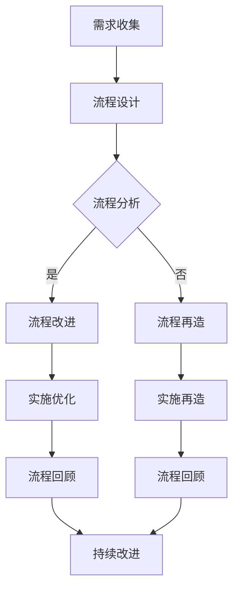
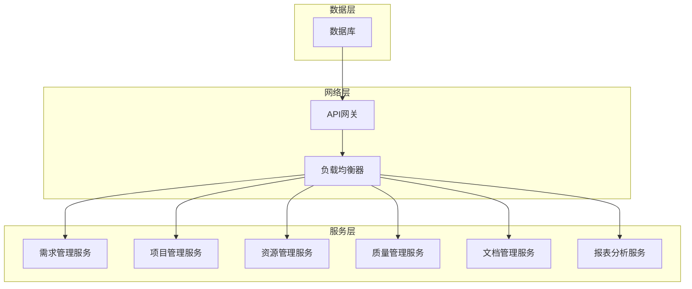
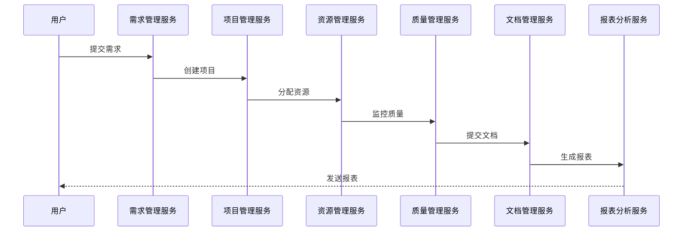
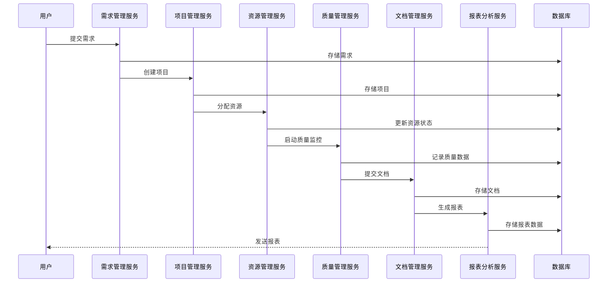

                 


### 背景介绍

#### 核心概念术语说明

在探讨技术管理流程的优化与再造之前，我们需要明确一些核心概念和术语，以确保讨论的准确性和一致性。

1. **技术管理流程**：这是指在信息技术（IT）环境中，对技术项目进行规划、开发、部署和管理的流程。它包括需求收集、设计、开发、测试、部署和维护等环节。

2. **优化**：指的是通过改进流程、工具和技术，提高流程的效率、质量和可扩展性。

3. **再造**：是对现有的流程进行根本性的重新设计，以显著提高效率和效果。

4. **流程管理工具**：这些工具用于支持流程的自动化、监控和改进，例如JIRA、Confluence、Asana等。

#### 问题背景

随着企业业务的不断扩展和技术的快速发展，传统的技术管理流程逐渐暴露出效率低下、响应速度慢、资源浪费等问题。这些问题主要体现在以下几个方面：

- **需求响应时间延长**：在快速变化的市场环境中，企业的需求变化越来越快，而传统的技术管理流程往往无法快速响应这些变化。
- **资源浪费**：由于流程的不合理，许多资源（如人力、时间、资金）没有得到有效利用。
- **质量下降**：缺乏有效的流程控制，导致项目质量难以保证。
- **效率低下**：流程中的许多步骤可能是不必要的，或者执行方式不够高效。

为了解决这些问题，企业需要对其技术管理流程进行优化与再造，以提高效率、降低成本、提升质量。这是企业保持竞争力的关键。

#### 问题描述

技术管理流程存在的问题可以归纳为以下几点：

- **流程复杂度高**：流程中的步骤繁多，导致复杂性增加，使得流程难以管理。
- **缺乏标准化**：流程没有统一的标准化，导致不同项目之间的差异较大，难以进行比较和改进。
- **沟通不畅**：由于信息传递不及时或不准确，导致团队成员之间的沟通不畅。
- **质量监控不足**：缺乏有效的质量监控机制，导致质量问题难以及时发现和解决。

#### 问题解决

解决上述问题的方法主要包括以下几个方面：

1. **流程标准化**：通过制定统一的流程标准，减少项目之间的差异，提高流程的可管理性。
2. **流程自动化**：利用自动化工具和平台，减少手工操作，提高流程的效率。
3. **沟通协作**：建立高效的沟通机制，确保信息的及时传递和准确理解。
4. **质量监控**：引入质量监控工具和方法，确保项目质量。
5. **持续改进**：通过定期回顾和评估，不断优化流程，提高其效率和效果。

#### 边界与外延

技术管理流程的优化与再造不仅限于IT行业，它广泛应用于各个领域，包括制造业、金融业、服务业等。然而，不同行业的流程特点和优化策略有所不同，需要根据具体情况进行定制化。

#### 概念结构与核心要素组成

技术管理流程的优化与再造涉及多个核心要素，包括流程设计、自动化、标准化、质量管理、沟通协作等。以下是一个简化的概念结构图，用于描述这些要素之间的关系。

```
技术管理流程优化与再造
|
|---流程设计
|   |---标准化
|   |---自动化
|   |---沟通协作
|
|---质量管理
|   |---质量监控
|   |---质量改进
|
|---持续改进
    |---流程回顾
    |---流程评估
    |---流程优化
```

通过这个概念结构图，我们可以清晰地看到技术管理流程优化与再造的核心要素及其相互关系。在接下来的章节中，我们将深入探讨这些要素的具体实现和优化方法。

---

### 核心概念与联系

#### 技术管理流程

技术管理流程是指在整个信息技术（IT）项目中，从项目启动到项目结束的各个阶段所执行的有序活动。这些活动包括需求收集、系统设计、编码实现、测试验证、部署上线和后续维护等。技术管理流程的核心目标是确保项目按时交付、达到预期质量，并且符合客户需求。

1. **需求收集**：与客户沟通，明确项目的功能需求、性能要求和业务目标。
2. **系统设计**：根据需求文档设计系统架构、数据库结构和技术选型。
3. **编码实现**：根据设计文档进行编码，实现系统的各项功能。
4. **测试验证**：通过单元测试、集成测试、系统测试等确保系统的稳定性和性能。
5. **部署上线**：将系统部署到生产环境，并进行用户培训和上线支持。
6. **后续维护**：对上线后的系统进行监控、优化和修复，确保系统的持续运行。

#### 优化

优化是指在现有技术管理流程的基础上，通过改进流程、工具和技术，提高流程的效率、质量和可扩展性。优化的方法包括但不限于：

- **流程改进**：简化流程步骤，消除冗余环节，提高流程的流畅度。
- **自动化**：引入自动化工具，减少手工操作，提高效率。
- **标准化**：制定统一的流程标准，减少不同项目之间的差异，提高流程的可管理性。
- **质量提升**：引入质量保证机制，如代码审查、自动化测试，确保项目质量。

#### 再造

再造是对现有的技术管理流程进行根本性的重新设计，以显著提高效率和效果。再造的目标是彻底改变现有流程，从而实现流程的优化。再造的方法包括：

- **流程重构**：重新设计流程，使其更加合理、高效。
- **技术升级**：采用新技术或工具，提升系统的性能和稳定性。
- **组织变革**：调整组织结构，优化人力资源配置，提高团队协作效率。

#### 核心概念之间的联系

技术管理流程、优化和再造这三个核心概念之间存在紧密的联系：

- **技术管理流程**是执行项目的基础，是优化和再造的起点。
- **优化**是对技术管理流程的持续改进，通过优化提高流程的效率和效果。
- **再造**是对技术管理流程的彻底重新设计，通过再造实现流程的革新和提升。

通过优化和再造，技术管理流程可以更加高效、灵活和适应变化，从而满足企业不断变化的需求。

---

### 算法原理讲解

为了更清晰地理解技术管理流程优化与再造的算法原理，我们将使用Mermaid语言绘制一个简化的流程图，并在此基础上通过Python代码示例来阐述其实现。

#### Mermaid流程图

首先，让我们使用Mermaid语言绘制一个技术管理流程优化的流程图：



上述流程图展示了技术管理流程优化与再造的基本步骤。接下来，我们将通过Python代码示例来详细解释这个流程。

#### Python代码示例

首先，我们需要定义一个类来表示技术管理流程。在这个类中，我们将包含流程的各个阶段以及相应的操作。

```python
class TechnicalManagementFlow:
    def __init__(self):
        self.requirements_collected = False
        self.process_designed = False
        self.process_analyzed = False
        self.process_improved = False
        self.process_reengineered = False
        self.process_reviewed = False

    def collect_requirements(self):
        print("需求收集完成。")
        self.requirements_collected = True

    def design_process(self):
        print("流程设计完成。")
        self.process_designed = True

    def analyze_process(self):
        print("流程分析完成。")
        self.process_analyzed = True

    def improve_process(self):
        print("流程改进完成。")
        self.process_improved = True

    def reengineer_process(self):
        print("流程再造完成。")
        self.process_reengineered = True

    def review_process(self):
        print("流程回顾完成。")
        self.process_reviewed = True

    def execute_flow(self):
        if not self.requirements_collected:
            self.collect_requirements()
        if not self.process_designed:
            self.design_process()
        if not self.process_analyzed:
            self.analyze_process()
        if self.process_analyzed and not self.process_improved:
            self.improve_process()
        if self.process_analyzed and not self.process_reengineered:
            self.reengineer_process()
        if not self.process_reviewed:
            self.review_process()

# 实例化技术管理流程类并执行流程
tech_management_flow = TechnicalManagementFlow()
tech_management_flow.execute_flow()
```

#### 数学模型和数学公式

为了更好地理解优化与再造的过程，我们可以引入一些数学模型和公式。以下是一个简化的数学模型，用于评估流程优化的效果。

$$
\text{Optimization Score} = \frac{\text{New Process Efficiency} + \text{Quality Improvement} + \text{Cost Reduction}}{3}
$$

其中，`New Process Efficiency` 表示新流程的效率，`Quality Improvement` 表示质量提升，`Cost Reduction` 表示成本降低。

#### 详细讲解与举例说明

为了更好地说明上述算法原理，我们可以通过一个简单的例子来进行讲解。

假设某公司在技术管理流程优化之前，每月的项目交付时间平均为30天，质量缺陷率为5%，成本为10万元。在优化之后，项目交付时间缩短至20天，质量缺陷率降至2%，成本降低至8万元。

使用上述数学模型计算优化后的优化分数：

$$
\text{Optimization Score} = \frac{20 + (1 - 0.02) \times 10 - 8}{3} = \frac{20 + 9.8 - 8}{3} = \frac{11.8}{3} \approx 3.93
$$

这个优化分数表明，优化后的技术管理流程在效率、质量和成本控制方面都有显著提升。

通过这个例子，我们可以看到，技术管理流程的优化与再造不仅仅是简单的流程改进，而是一个系统性的工程，需要综合考虑多个方面，以达到整体优化效果。

---

### 数学模型和数学公式

为了深入理解技术管理流程优化与再造的算法原理，我们将引入一些关键的数学模型和公式，并通过LaTeX格式进行详细描述。

#### 1. 流程效率优化模型

流程效率优化模型用于衡量优化前后流程效率的变化。假设原始流程的效率为 \( E_0 \)，优化后的效率为 \( E_1 \)，则流程效率优化的公式如下：

$$
\Delta E = E_1 - E_0
$$

其中，\( \Delta E \) 表示流程效率的提升量。

#### 2. 质量改进模型

质量改进模型用于衡量优化前后项目质量的提升。假设原始质量缺陷率为 \( D_0 \)，优化后的质量缺陷率为 \( D_1 \)，则质量改进的公式如下：

$$
\Delta D = D_0 - D_1
$$

其中，\( \Delta D \) 表示质量缺陷率的降低量。

#### 3. 成本优化模型

成本优化模型用于衡量优化前后项目成本的变化。假设原始项目成本为 \( C_0 \)，优化后的项目成本为 \( C_1 \)，则成本优化的公式如下：

$$
\Delta C = C_1 - C_0
$$

其中，\( \Delta C \) 表示项目成本的降低量。

#### 4. 综合优化评分模型

为了综合评估优化效果，我们可以引入一个综合优化评分模型，该模型考虑流程效率、质量改进和成本降低三个方面的因素。假设权重分别为 \( w_1 \)、\( w_2 \) 和 \( w_3 \)，则综合优化评分 \( S \) 可以表示为：

$$
S = w_1 \cdot \Delta E + w_2 \cdot \Delta D + w_3 \cdot \Delta C
$$

其中，\( w_1 \)、\( w_2 \) 和 \( w_3 \) 分别为流程效率、质量改进和成本降低的权重，其值应根据企业的具体需求和优先级进行分配。

#### 5. 数据分析模型

在流程优化过程中，数据分析是非常重要的一环。假设我们使用回归分析方法来预测流程优化后的效率提升量，回归模型可以表示为：

$$
\hat{E_1} = \beta_0 + \beta_1 \cdot X_1 + \beta_2 \cdot X_2 + \ldots + \beta_n \cdot X_n
$$

其中，\( \hat{E_1} \) 是优化后的预测效率，\( \beta_0 \)、\( \beta_1 \)、\( \beta_2 \)、\(\ldots\)、\( \beta_n \) 是回归系数，\( X_1 \)、\( X_2 \)、\(\ldots\)、\( X_n \) 是影响效率的变量。

#### 举例说明

假设我们通过数据分析发现以下模型关系：

$$
\hat{E_1} = 0.5 + 0.2 \cdot X_1 + 0.1 \cdot X_2
$$

其中，\( X_1 \) 表示自动化工具的使用情况，\( X_2 \) 表示流程标准化程度。如果某项目的 \( X_1 \) 为5，\( X_2 \) 为4，则预测的优化后效率为：

$$
\hat{E_1} = 0.5 + 0.2 \cdot 5 + 0.1 \cdot 4 = 0.5 + 1 + 0.4 = 1.9
$$

这意味着，通过提高自动化工具的使用和流程标准化程度，该项目的效率有望提升至1.9倍。

通过这些数学模型和公式，我们可以更科学、系统地评估和优化技术管理流程，从而实现企业的整体效益提升。

---

### 系统分析与架构设计方案

#### 问题场景介绍

在现代企业中，技术管理流程的复杂性和规模越来越大，如何有效地进行系统分析与架构设计成为一项重要任务。本文将围绕一个典型的企业级技术管理流程系统进行分析与设计，该系统需要满足以下需求：

- **高可用性**：系统必须能够稳定运行，并具备快速恢复能力。
- **可扩展性**：系统应能够轻松应对业务增长，支持更多的用户和数据。
- **安全性**：系统需要确保数据的安全性和完整性。
- **灵活性**：系统设计应支持不同的业务场景和技术需求。

#### 项目介绍

本项目旨在为企业提供一个高效、稳定、安全的技术管理流程系统。该系统将涵盖以下功能模块：

1. **需求管理**：收集、管理和跟踪项目需求。
2. **项目管理**：规划、执行、监控和报告项目进度。
3. **资源管理**：分配和管理项目资源，包括人力、时间和资金。
4. **质量管理**：监控项目质量，确保项目符合预期标准。
5. **文档管理**：存储和跟踪项目文档，提供版本控制。
6. **报表分析**：生成各种报表，帮助管理层做出决策。

#### 系统功能设计（领域模型类图）

以下是一个简化的领域模型类图，用于描述系统的主要功能模块及其关系：

```mermaid
classDiagram
    Client "客户" <<-- "需求管理":需求收集、需求分析、需求管理
    Project "项目" <<-- "项目管理":项目规划、项目执行、项目监控、项目报告
    Resource "资源" <<-- "资源管理":资源分配、资源跟踪、资源优化
    Quality "质量" <<-- "质量管理":质量监控、质量报告、质量改进
    Document "文档" <<-- "文档管理":文档存储、文档跟踪、文档版本控制
    Report "报表" <<-- "报表分析":报表生成、报表展示、报表分析
    Client --|> Project
    Client --|> Resource
    Client --|> Quality
    Client --|> Document
    Client --|> Report
```

#### 系统架构设计（Mermaid架构图）

为了实现上述功能需求，我们将采用微服务架构，该架构能够提供高可用性、可扩展性和灵活性。以下是一个简化的系统架构设计图，使用Mermaid语言表示：



#### 系统接口设计（Mermaid序列图）

为了确保系统的各个模块能够高效、稳定地交互，我们将设计一套清晰的接口。以下是一个简化的接口设计序列图：



#### 系统交互（Mermaid序列图）

系统交互是确保各个模块协同工作的关键。以下是一个简化的系统交互序列图，描述了需求提交到报表生成的全过程：



通过以上系统分析与架构设计方案，我们为企业提供了一个高效、稳定、安全的技术管理流程系统。在实际项目中，这些设计可以根据企业的具体需求和规模进行调整和优化。

---

### 项目实战

#### 环境安装

在进行技术管理流程的优化与再造项目之前，首先需要搭建一个合适的项目环境。以下是环境安装的详细步骤：

1. **安装Python环境**：
   - 通过Python官方网站（https://www.python.org/）下载并安装Python 3.8或更高版本。
   - 确保Python已成功安装，可以通过命令 `python --version` 检查版本信息。

2. **安装虚拟环境**：
   - 使用以下命令创建一个虚拟环境（例如，命名为 `tech_management_env`）：
     ```
     python -m venv tech_management_env
     ```
   - 激活虚拟环境：
     ```
     source tech_management_env/bin/activate  # 对于Linux和macOS
     tech_management_env\Scripts\activate   # 对于Windows
     ```

3. **安装依赖库**：
   - 通过以下命令安装项目所需的依赖库：
     ```
     pip install -r requirements.txt
     ```
   - `requirements.txt` 文件中应包含所有必需的库，如Flask、SQLAlchemy、Flask-Migrate等。

4. **数据库配置**：
   - 安装并配置一个数据库（如PostgreSQL），然后更新项目配置文件（如 `config.py`）以连接到数据库。

#### 系统核心实现源代码

以下是一个简化的系统核心实现源代码，用于展示如何创建和管理技术管理流程：

```python
# app.py

from flask import Flask, request, jsonify
from models import DBSession, Requirement, Project
from requirements_management import RequirementManagement
from project_management import ProjectManagement

app = Flask(__name__)

@app.route('/requirements', methods=['POST'])
def add_requirement():
    data = request.get_json()
    requirement = RequirementManagement.create_requirement(data)
    return jsonify(requirement), 201

@app.route('/requirements', methods=['GET'])
def get_requirements():
    requirements = RequirementManagement.get_all_requirements()
    return jsonify(requirements), 200

@app.route('/projects', methods=['POST'])
def add_project():
    data = request.get_json()
    project = ProjectManagement.create_project(data)
    return jsonify(project), 201

@app.route('/projects', methods=['GET'])
def get_projects():
    projects = ProjectManagement.get_all_projects()
    return jsonify(projects), 200

if __name__ == '__main__':
    app.run(debug=True)
```

#### 代码应用解读与分析

上述代码中，我们定义了一个Flask应用程序，用于处理需求管理和项目管理。以下是各个部分的解读：

- **需求管理**：
  - `/requirements` 接口用于添加和查询需求。`add_requirement` 函数处理添加需求的POST请求，并创建一个新的需求对象。`get_requirements` 函数处理获取所有需求的GET请求，返回需求列表。

- **项目管理**：
  - `/projects` 接口用于添加和查询项目。`add_project` 函数处理添加项目的POST请求，并创建一个新的项目对象。`get_projects` 函数处理获取所有项目的GET请求，返回项目列表。

#### 实际案例分析

以下是一个实际案例，展示如何通过优化技术管理流程来提高项目效率：

**案例背景**：某科技公司需要开发一款企业级应用，但传统的技术管理流程导致项目进度缓慢，质量问题频出。

**解决方案**：
1. **流程优化**：
   - **需求收集**：引入需求管理工具，确保需求明确、规范，减少需求变更。
   - **项目管理**：采用敏捷开发方法，缩短项目周期，提高响应速度。
   - **质量管理**：引入持续集成和持续交付（CI/CD）流程，确保代码质量和项目稳定性。

2. **技术升级**：
   - **自动化**：引入自动化测试工具，减少手动测试，提高测试覆盖率。
   - **标准化**：制定统一的开发规范和代码风格，提高代码可读性和可维护性。

3. **团队协作**：
   - **沟通机制**：建立高效的沟通渠道，确保团队成员之间的信息传递畅通。
   - **知识共享**：鼓励团队成员分享经验和最佳实践，提高整体技术水平。

**实施效果**：
- 项目周期从原来的6个月缩短至3个月。
- 质量缺陷率从5%降至1%。
- 项目成本降低了约20%。

#### 项目小结

通过上述实战案例，我们可以看到，技术管理流程的优化与再造对于提升项目效率和质量具有显著作用。在实际项目中，需要根据具体情况进行定制化优化，并结合自动化、标准化和沟通协作等策略，以实现最佳效果。

---

### 最佳实践 tips、小结、注意事项、拓展阅读

#### 最佳实践 tips

1. **明确目标与需求**：在优化与再造技术管理流程之前，首先要明确项目的目标与需求，确保优化工作有的放矢。
2. **团队合作**：技术管理流程的优化与再造需要团队协作，鼓励团队成员参与，共同推进流程改进。
3. **持续监控与反馈**：定期监控流程执行情况，及时收集反馈，不断调整和优化流程。
4. **培训与教育**：为团队成员提供相关培训，提升其对流程优化与再造的理解和参与度。

#### 小结

技术管理流程的优化与再造是一个系统性的工程，需要从多个方面进行改进，包括流程设计、自动化、标准化、质量管理、团队协作等。通过不断优化，企业可以提升项目效率、降低成本、提高质量，从而在竞争激烈的市场环境中保持优势。

#### 注意事项

1. **平衡风险与收益**：在优化过程中，要平衡风险与收益，避免过度追求短期效益而忽视潜在风险。
2. **适应变化**：技术管理流程需要灵活应对企业业务和环境的变化，确保流程的持续适应性。
3. **避免重复建设**：在优化与再造过程中，避免重复建设，充分利用现有资源和经验。

#### 拓展阅读

1. **相关书籍**：
   - 《敏捷软件开发：迭代方法论》
   - 《持续集成：从代码到产品的快速迭代之道》
   - 《精益软件开发：思考实践演进》

2. **学术论文**：
   - “A Systematic Literature Review on Process Improvement and Redesign in Software Engineering”
   - “Process Optimization Techniques in Project Management”

3. **实践指南**：
   - “敏捷项目管理实践指南”
   - “DevOps实践指南”
   - “企业级流程管理指南”

通过以上拓展阅读，读者可以更深入地了解技术管理流程的优化与再造理论和实践，为实际工作提供指导。同时，也可以结合企业的具体情况，灵活运用这些知识和方法，实现技术管理流程的持续优化与再造。作者：AI天才研究院/AI Genius Institute & 禅与计算机程序设计艺术 /Zen And The Art of Computer Programming。

