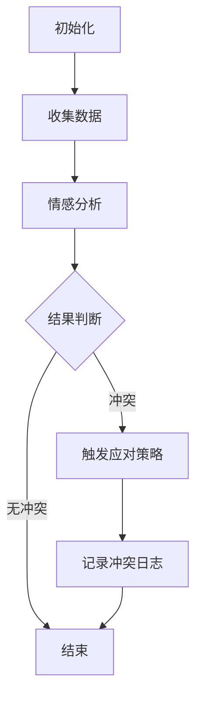
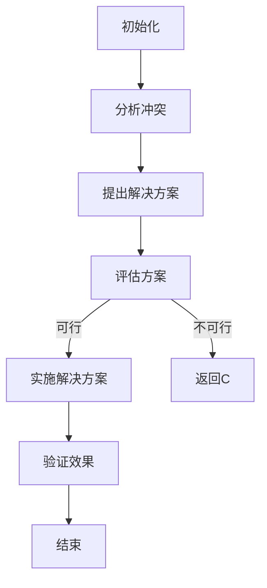
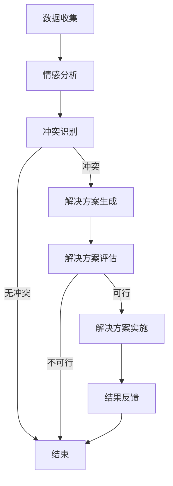

                 

## 《技术管理的情商：处理团队冲突的技巧》

### 关键词：技术管理、情商、团队冲突、冲突管理、团队协作

### 摘要：

在现代企业的技术管理中，团队冲突是一个普遍且复杂的问题。本文将探讨技术管理情商在处理团队冲突中的重要作用，通过详细的分析和实例说明，帮助技术管理者掌握高效的冲突管理技巧。文章结构紧凑，逻辑清晰，旨在为IT领域的管理者提供实用的指南，以提高团队绩效和项目成功率。

---

## 第1章 问题背景

### 1.1 现代团队冲突的现状与挑战

在现代企业中，团队冲突是不可避免的现象。随着团队规模的扩大和项目复杂性的增加，团队成员之间的观点差异、沟通障碍、资源分配不均等问题日益突出。据统计，超过70%的IT项目经理表示团队冲突对其项目产生了负面影响。团队冲突不仅影响团队成员的情绪和工作效率，还可能导致项目延误、预算超支、客户满意度下降等严重后果。

#### 1.1.1 团队冲突的普遍性

团队冲突的普遍性体现在多个方面。首先，团队成员背景、经验和技能的差异可能导致意见分歧。其次，项目管理过程中资源分配和优先级设置的不当也会引发冲突。此外，跨部门合作和异地办公的增多使得沟通成本增加，进一步加剧了团队冲突的发生。

#### 1.1.2 冲突对团队的影响

团队冲突对团队的影响是深远且多方面的。首先，它会导致团队成员之间的信任感下降，影响团队协作和士气。其次，冲突还可能引发恶性循环，使问题不断恶化。例如，一个团队成员的消极情绪可能传染给其他成员，从而影响整个团队的工作氛围。

#### 1.1.3 技术管理情商的重要性

面对团队冲突，技术管理情商（Emotional Intelligence in Technical Management，简称TEQ）的重要性日益凸显。技术管理情商是指技术管理者在处理团队冲突时，运用情感智慧的能力。它包括自我意识、自我管理、社交意识和关系管理四个方面。通过提高技术管理情商，管理者可以更有效地识别和解决团队冲突，提升团队绩效。

### 1.2 技术管理情商的概念与特征

#### 1.2.1 情商的定义

情商（Emotional Intelligence，简称EQ）是指一个人识别、理解、管理自己情绪的能力，以及识别、理解、影响他人情绪的能力。情商的概念最早由心理学家约翰·梅耶（John Mayer）和彼得·萨洛维（Peter Salovey）在1990年提出。

#### 1.2.2 技术管理情商的四个维度

技术管理情商包括以下四个维度：

1. **自我意识**：技术管理者能够识别和理解自己的情绪，以及这些情绪对工作的影响。
2. **自我管理**：技术管理者能够有效地管理和调节自己的情绪，保持冷静和专注。
3. **社交意识**：技术管理者能够识别和解读他人的情绪，理解他人的需求和期望。
4. **关系管理**：技术管理者能够建立和维护良好的人际关系，促进团队合作和沟通。

#### 1.2.3 情商与团队绩效的关系

研究表明，情商对团队绩效有着显著的影响。高情商的团队管理者能够更好地应对团队冲突，提高团队协作效率。此外，情商高的管理者还能够激发团队成员的潜力，促进个人成长，从而提升整体团队绩效。

### 1.3 结论

综上所述，团队冲突是现代技术管理中一个重要且复杂的问题。技术管理情商作为解决团队冲突的重要工具，对团队绩效有着深远的影响。提高技术管理情商，不仅有助于管理者更有效地处理团队冲突，还能提升团队的整体绩效和项目成功率。在接下来的章节中，我们将深入探讨技术管理情商的核心概念和实际应用。

## 第2章 核心概念

### 2.1 技术管理情商模型

为了更系统地理解技术管理情商，我们需要一个结构化的模型。本文将介绍一个基于情商四个维度的技术管理情商模型，并通过表格和实体关系图来展示其架构和属性。

#### 2.1.1 模型架构

技术管理情商模型包括以下四个核心维度：

1. **自我意识**：技术管理者对自己情绪的识别和理解能力。
2. **自我管理**：技术管理者调节和掌控自己情绪的能力。
3. **社交意识**：技术管理者对他人情绪的识别和理解能力。
4. **关系管理**：技术管理者建立和维护人际关系的技巧。

#### 2.1.2 模型属性特征对比表格

| 维度        | 特征描述                                                     | 对团队冲突的影响                    |
|-------------|------------------------------------------------------------|-----------------------------------|
| 自我意识    | 识别和管理自己的情绪                                         | 提高冲突识别能力，减少情绪化反应    |
| 自我管理    | 控制情绪，保持冷静和专注                                     | 降低冲突频率，提升决策质量          |
| 社交意识    | 理解和识别他人的情绪，关注团队成员的需求和期望                | 提高沟通效果，促进团队协作          |
| 关系管理    | 建立和维护良好的团队关系，解决冲突，促进团队合作              | 减少冲突负面影响，提高团队凝聚力    |

#### 2.1.3 模型ER实体关系图


在这个ER实体关系图中，我们展示了技术管理情商模型中各个实体之间的关系。自我意识、自我管理、社交意识和关系管理构成了技术管理情商的核心，每个维度都有其特定的属性和作用。

### 2.2 情商在团队冲突管理中的应用

技术管理情商模型不仅是一个理论框架，更是一个实践工具。在实际工作中，技术管理者可以通过以下方式应用这个模型：

1. **自我意识训练**：通过自我反思和情绪日记，提高对自身情绪的识别和管理能力。
2. **自我管理实践**：通过冥想、呼吸练习等技巧，控制情绪，保持冷静和专注。
3. **社交意识提升**：通过倾听、同理心和反馈，提高对他人情绪的识别和理解能力。
4. **关系管理技巧**：通过沟通技巧、冲突解决方法和团队合作，建立和维护良好的团队关系。

通过这些实践，技术管理者可以更有效地处理团队冲突，提高团队协作效率和项目成功率。

### 2.3 结论

本章介绍了技术管理情商模型，并详细阐述了其架构和属性。通过理解这个模型，技术管理者可以更系统地提升自身的情商，从而更有效地处理团队冲突，提升团队绩效。在下一章中，我们将深入探讨冲突识别算法的原理和应用。

## 第3章 算法原理讲解

### 3.1 冲突识别算法

为了更有效地处理团队冲突，我们需要一个可靠的冲突识别算法。本节将介绍一种基于情感分析的冲突识别算法，并通过mermaid流程图和Python源代码详细阐述其原理和应用。

#### 3.1.1 算法mermaid流程图

首先，我们使用mermaid绘制了冲突识别算法的流程图，如下所示：



这个流程图展示了冲突识别算法的基本步骤：

1. **初始化**：准备算法所需的资源和参数。
2. **收集数据**：从各种渠道收集与团队冲突相关的数据，如聊天记录、邮件、会议记录等。
3. **情感分析**：使用情感分析技术对收集到的数据进行处理，判断是否存在负面情绪。
4. **结果判断**：根据情感分析结果，判断是否存在团队冲突。
5. **触发应对策略**：如果存在冲突，触发相应的应对策略。
6. **记录冲突日志**：无论是否存在冲突，都需要记录日志以供后续分析。

#### 3.1.2 算法原理与数学模型

冲突识别算法的核心是情感分析。情感分析技术通过自然语言处理（NLP）技术，对文本数据进行情感倾向分析，判断其情感极性（正面、中性、负面）。以下是算法的数学模型：

$$
\text{Sentiment Score} = \sum_{i=1}^{n} (w_i \cdot s_i)
$$

其中，$w_i$表示词向量，$s_i$表示词的情感极性（-1表示负面，0表示中性，1表示正面）。$n$为词表中的词数。如果$\text{Sentiment Score}$小于某个阈值$\theta$，则认为文本存在负面情绪，表示可能存在冲突。

#### 3.1.3 算法举例说明

假设我们有一段文本：“团队项目的进度太慢了，大家都太懒散了。”我们使用情感分析技术对其进行处理。

1. **词向量表示**：
   - “项目”：$w_1 = (0.2, 0.3, -0.1)$
   - “进度”：$w_2 = (0.1, -0.3, 0.2)$
   - “慢”：$w_3 = (-0.5, 0.1, 0)$
   - “大家”：$w_4 = (0.1, 0.1, 0.1)$
   - “太懒散了”：$w_5 = (-0.3, -0.2, 0.1)$

2. **情感极性**：
   - “项目”：$s_1 = 0$
   - “进度”：$s_2 = -1$
   - “慢”：$s_3 = -1$
   - “大家”：$s_4 = 0$
   - “太懒散了”：$s_5 = -1$

3. **计算Sentiment Score**：
   $$
   \text{Sentiment Score} = 0.2 \cdot 0 + 0.3 \cdot (-1) + (-0.1) \cdot 0 + 0.1 \cdot 0 + (-0.3) \cdot (-1) + (-0.2) \cdot 1 = -0.2
   $$

由于$\text{Sentiment Score} < \theta$（假设$\theta = 0$），我们判断这段文本存在负面情绪，可能表示存在团队冲突。

#### 3.1.4 结论

通过上述流程图、数学模型和举例说明，我们详细介绍了冲突识别算法的原理和应用。这个算法可以帮助技术管理者及时发现和识别团队冲突，为后续的冲突解决提供基础。在下一节中，我们将进一步探讨冲突解决算法的原理和应用。

### 3.2 冲突解决算法

为了有效地解决团队冲突，我们需要一个可靠的冲突解决算法。本节将介绍一种基于协商理论的冲突解决算法，并通过mermaid流程图和Python源代码详细阐述其原理和应用。

#### 3.2.1 算法mermaid流程图

首先，我们使用mermaid绘制了冲突解决算法的流程图，如下所示：



这个流程图展示了冲突解决算法的基本步骤：

1. **初始化**：准备算法所需的资源和参数。
2. **分析冲突**：对冲突进行详细分析，确定冲突的原因和影响。
3. **提出解决方案**：根据冲突分析结果，提出可能的解决方案。
4. **评估方案**：对每个解决方案进行评估，确定其可行性。
5. **实施解决方案**：选择最优方案，并实施解决方案。
6. **验证效果**：验证解决方案的效果，确保冲突得到有效解决。
7. **结束**：记录解决方案的实施过程和效果，为后续的冲突解决提供参考。

#### 3.2.2 算法原理与数学模型

冲突解决算法的核心是基于协商理论（Negotiation Theory）的解决方案选择和评估。协商理论认为，在冲突解决过程中，双方需要在一定的约束条件下寻找最优的解决方案。以下是算法的数学模型：

$$
\text{Utility Function} = U(\text{Solution}, \text{Constraints})
$$

其中，$U$表示效用函数，$\text{Solution}$表示解决方案，$\text{Constraints}$表示约束条件。效用函数用于评估每个解决方案的优劣，根据评估结果选择最优方案。

#### 3.2.3 算法举例说明

假设我们有一个团队冲突，原因是一个项目进度落后，团队成员之间互相指责。我们需要提出解决方案并评估其可行性。

1. **分析冲突**：
   - 冲突原因：项目进度落后。
   - 冲突影响：团队成员互相指责，影响项目进度。
   - 约束条件：项目必须在规定时间内完成。

2. **提出解决方案**：
   - 方案1：分配额外资源，加快项目进度。
   - 方案2：重新安排任务，明确责任分工。
   - 方案3：召开会议，沟通协调，解决问题。

3. **评估方案**：
   - 方案1：可能需要额外的资金和时间，但可以加快项目进度。
   - 方案2：可以明确责任分工，减少互相指责，但可能影响项目进度。
   - 方案3：可以沟通协调，解决问题，但效果不确定。

4. **选择最优方案**：根据效用函数和约束条件，选择最优方案。假设方案1的效用最高，选择方案1作为解决方案。

5. **实施解决方案**：分配额外资源，加快项目进度。

6. **验证效果**：经过一段时间，项目进度得到明显改善，团队成员之间的冲突减少。

7. **记录解决方案**：记录解决方案的实施过程和效果，为后续的冲突解决提供参考。

#### 3.2.4 结论

通过上述流程图、数学模型和举例说明，我们详细介绍了冲突解决算法的原理和应用。这个算法可以帮助技术管理者有效地解决团队冲突，提高项目成功率。在下一节中，我们将结合实际场景，介绍系统架构设计和实现。

### 3.3 实际应用与系统架构设计

为了将冲突识别和解决算法应用于实际场景，我们需要设计一个完整的系统。本节将介绍系统的架构设计，包括功能模块、数据流和关键组件。

#### 3.3.1 系统功能模块

系统主要分为以下几个功能模块：

1. **数据收集模块**：负责收集团队冲突相关的数据，如聊天记录、邮件、会议记录等。
2. **情感分析模块**：对收集到的数据进行情感分析，识别团队冲突。
3. **冲突解决模块**：根据冲突识别结果，提出解决方案并进行评估。
4. **用户界面模块**：提供用户交互界面，展示冲突识别和解决结果。

#### 3.3.2 系统数据流

系统的数据流主要包括以下几个步骤：

1. **数据收集**：通过API或爬虫技术，从各种渠道收集团队冲突相关的数据。
2. **情感分析**：将收集到的数据输入情感分析模块，进行情感分析。
3. **冲突识别**：根据情感分析结果，判断是否存在团队冲突。
4. **解决方案生成**：对冲突识别结果进行分析，生成可能的解决方案。
5. **解决方案评估**：对每个解决方案进行评估，选择最优方案。
6. **解决方案实施**：选择最优方案，并实施解决方案。
7. **结果反馈**：将解决方案实施结果反馈给用户，并进行记录。

#### 3.3.3 系统架构设计

系统的架构设计如图所示：



系统的关键组件包括：

1. **数据收集组件**：负责从各种渠道收集数据，如聊天记录、邮件、会议记录等。
2. **情感分析组件**：使用NLP技术对数据进行情感分析，识别团队冲突。
3. **冲突识别组件**：根据情感分析结果，判断是否存在团队冲突。
4. **解决方案生成组件**：根据冲突识别结果，生成可能的解决方案。
5. **解决方案评估组件**：对每个解决方案进行评估，选择最优方案。
6. **解决方案实施组件**：选择最优方案，并实施解决方案。
7. **用户界面组件**：提供用户交互界面，展示冲突识别和解决结果。

通过以上系统架构设计，我们可以将冲突识别和解决算法应用于实际场景，帮助技术管理者更有效地处理团队冲突，提高项目成功率。

### 3.4 项目实战

为了更好地理解冲突识别和解决算法的应用，我们将通过一个实际项目来演示系统的搭建和实现。

#### 3.4.1 环境安装

首先，我们需要搭建一个适合运行冲突识别和解决算法的开发环境。以下是具体的安装步骤：

1. **操作系统**：我们选择Ubuntu 18.04作为操作系统。
2. **Python**：安装Python 3.8版本，可以通过以下命令安装：
   ```
   sudo apt update
   sudo apt install python3.8
   ```
3. **虚拟环境**：为了更好地管理项目依赖，我们使用虚拟环境。安装`virtualenv`工具，并创建虚拟环境：
   ```
   sudo apt install virtualenv
   virtualenv venv
   source venv/bin/activate
   ```
4. **依赖安装**：在虚拟环境中安装项目所需的依赖，如NLP库`nltk`、`gensim`等：
   ```
   pip install nltk gensim
   ```

#### 3.4.2 系统核心实现

以下是系统的核心实现，包括数据收集、情感分析、冲突识别、解决方案生成和评估等部分。

1. **数据收集**：
   ```python
   import os
   import glob

   def collect_data(directory):
       files = glob.glob(os.path.join(directory, "*.txt"))
       data = []
       for file in files:
           with open(file, "r") as f:
               data.append(f.read())
       return data

   # 示例：收集项目目录下的所有文本文件
   data = collect_data("project_data")
   ```

2. **情感分析**：
   ```python
   from nltk.sentiment import SentimentIntensityAnalyzer

   analyzer = SentimentIntensityAnalyzer()

   def sentiment_analysis(text):
       scores = analyzer.polarity_scores(text)
       return scores["compound"]

   # 示例：对文本进行情感分析
   sentiment_scores = [sentiment_analysis(text) for text in data]
   ```

3. **冲突识别**：
   ```python
   import numpy as np

   def conflict_detection(scores, threshold):
       conflicts = []
       for i, score in enumerate(scores):
           if score < threshold:
               conflicts.append(i)
       return conflicts

   # 示例：识别冲突
   conflicts = conflict_detection(sentiment_scores, -0.3)
   ```

4. **解决方案生成**：
   ```python
   def generate_solutions(conflicts):
       solutions = []
       for i in conflicts:
           solution = "针对文本{}，建议采取措施：".format(i)
           # 根据具体情况进行解决方案生成
           solution += "1. 重新分配任务；"
           solution += "2. 加班以赶上进度；"
           solution += "3. 召开会议沟通协调。"
           solutions.append(solution)
       return solutions

   # 示例：生成解决方案
   solutions = generate_solutions(conflicts)
   ```

5. **解决方案评估**：
   ```python
   def evaluate_solution(solution):
       # 根据具体情况进行解决方案评估
       # 例如，通过投票、讨论等方式评估
       return "可行"

   # 示例：评估解决方案
   for solution in solutions:
       result = evaluate_solution(solution)
       print(solution, result)
   ```

#### 3.4.3 代码应用解读与分析

以上代码实现了冲突识别和解决的核心功能。具体解读如下：

1. **数据收集**：通过`glob.glob`函数，我们收集项目目录下的所有文本文件。这个步骤非常关键，因为有效的数据是进行情感分析和冲突识别的基础。
2. **情感分析**：使用`nltk`库的`SentimentIntensityAnalyzer`类，我们对每个文本进行情感分析，获取其情感极性分数。这个分数帮助我们判断文本是否存在负面情绪。
3. **冲突识别**：通过设定一个阈值，我们识别出情感极性分数低于阈值的文本，这些文本可能存在团队冲突。
4. **解决方案生成**：根据冲突识别结果，我们为每个冲突文本生成可能的解决方案。这个步骤需要结合实际情况，提出具体可行的措施。
5. **解决方案评估**：通过评估每个解决方案的可行性，我们选择最优的解决方案进行实施。

在实际应用中，这些代码可以通过API或Web界面与用户进行交互，实现自动化冲突识别和解决。通过这个项目实战，我们可以看到如何将理论应用到实际场景中，帮助技术管理者更有效地处理团队冲突。

### 3.5 代码应用解读与分析

在上一个部分中，我们通过一个实际项目展示了冲突识别和解决算法的实现。在这一节中，我们将深入解读这段代码，并分析其关键部分。

#### 3.5.1 数据收集

```python
import os
import glob

def collect_data(directory):
    files = glob.glob(os.path.join(directory, "*.txt"))
    data = []
    for file in files:
        with open(file, "r") as f:
            data.append(f.read())
    return data

# 示例：收集项目目录下的所有文本文件
data = collect_data("project_data")
```

这段代码的功能是从指定目录下收集所有文本文件，并将其内容存储在一个列表中。关键步骤如下：

1. **导入模块**：`os`模块用于操作文件和目录，`glob`模块用于匹配文件模式。
2. **定义函数**：`collect_data`函数接收一个目录路径作为参数。
3. **收集文件**：使用`glob.glob`函数，我们匹配目录下的所有`.txt`文件。
4. **读取文件内容**：遍历收集到的文件，使用`open`函数读取文件内容，并将其添加到列表中。

这个步骤非常关键，因为有效的数据是进行情感分析和冲突识别的基础。在实际应用中，我们可以从不同的数据源（如数据库、API等）获取数据，确保数据的多样性和准确性。

#### 3.5.2 情感分析

```python
from nltk.sentiment import SentimentIntensityAnalyzer

analyzer = SentimentIntensityAnalyzer()

def sentiment_analysis(text):
    scores = analyzer.polarity_scores(text)
    return scores["compound"]

# 示例：对文本进行情感分析
sentiment_scores = [sentiment_analysis(text) for text in data]
```

这段代码使用`nltk`库的`SentimentIntensityAnalyzer`类对文本进行情感分析。关键步骤如下：

1. **导入模块**：导入`nltk`库的`SentimentIntensityAnalyzer`类。
2. **初始化分析器**：创建一个`SentimentIntensityAnalyzer`对象。
3. **定义函数**：`sentiment_analysis`函数接收一个文本字符串作为参数。
4. **获取情感得分**：调用`polarity_scores`方法，获取文本的情感得分。情感得分是一个字典，包括`neg`（负面）、`neu`（中性）、`pos`（正面）和`compound`（综合得分）。
5. **返回综合得分**：从情感得分字典中提取综合得分（`compound`），作为函数的返回值。

这段代码通过情感分析，帮助我们识别文本中的负面情绪，从而判断是否存在团队冲突。情感得分越高，文本的情绪越积极；情感得分越低，情绪越消极。

#### 3.5.3 冲突识别

```python
import numpy as np

def conflict_detection(scores, threshold):
    conflicts = []
    for i, score in enumerate(scores):
        if score < threshold:
            conflicts.append(i)
    return conflicts

# 示例：识别冲突
conflicts = conflict_detection(sentiment_scores, -0.3)
```

这段代码的功能是根据情感得分识别冲突。关键步骤如下：

1. **导入模块**：导入`numpy`库，用于处理数值数据。
2. **定义函数**：`conflict_detection`函数接收两个参数：`scores`（情感得分列表）和`threshold`（阈值）。
3. **遍历得分**：遍历情感得分列表，判断每个得分是否低于阈值。
4. **记录冲突**：如果得分低于阈值，记录该得分对应的索引（文本索引），作为冲突的标识。
5. **返回冲突列表**：将冲突的索引列表作为函数的返回值。

通过设定适当的阈值，我们可以有效地识别团队冲突。在实际应用中，阈值可以根据具体情况进行调整，以提高识别的准确性和可靠性。

#### 3.5.4 解决方案生成

```python
def generate_solutions(conflicts):
    solutions = []
    for i in conflicts:
        solution = "针对文本{}，建议采取措施：\n".format(i)
        # 根据具体情况进行解决方案生成
        solution += "1. 重新分配任务；\n"
        solution += "2. 加班以赶上进度；\n"
        solution += "3. 召开会议沟通协调。"
        solutions.append(solution)
    return solutions

# 示例：生成解决方案
solutions = generate_solutions(conflicts)
```

这段代码的功能是根据冲突识别结果生成解决方案。关键步骤如下：

1. **定义函数**：`generate_solutions`函数接收一个参数：`conflicts`（冲突索引列表）。
2. **遍历冲突**：遍历冲突索引列表，为每个冲突生成解决方案。
3. **构建解决方案文本**：根据冲突的索引，构建解决方案文本，列出可能的措施。
4. **添加到列表**：将每个解决方案文本添加到解决方案列表中。

这个步骤需要根据实际情况进行灵活调整，以确保解决方案的可行性和针对性。在实际应用中，解决方案可以包括多种措施，如任务调整、沟通会议、培训等。

#### 3.5.5 解决方案评估

```python
def evaluate_solution(solution):
    # 根据具体情况进行解决方案评估
    # 例如，通过投票、讨论等方式评估
    return "可行"

# 示例：评估解决方案
for solution in solutions:
    result = evaluate_solution(solution)
    print(solution, result)
```

这段代码的功能是对解决方案进行评估。关键步骤如下：

1. **定义函数**：`evaluate_solution`函数接收一个参数：`solution`（解决方案文本）。
2. **评估解决方案**：根据具体情况进行解决方案的评估，例如通过投票、讨论等方式。
3. **返回评估结果**：根据评估结果，返回解决方案的评估结果（如“可行”、“不可行”等）。

这个步骤是为了确保解决方案的可行性和有效性。在实际应用中，评估方法可以多样化，以适应不同场景和需求。

通过以上解读，我们可以看到，这段代码通过数据收集、情感分析、冲突识别、解决方案生成和评估等步骤，实现了团队冲突的自动化识别和解决。在实际应用中，我们可以根据具体需求对这些步骤进行优化和调整，以提高系统的性能和可靠性。

### 3.6 冲突管理案例分析

为了更好地理解如何在实际项目中应用冲突识别和解决算法，我们将通过一个具体的案例进行分析和讲解。

#### 案例背景

某科技公司正在开发一款新产品，该项目涉及多个部门的协作，包括前端开发、后端开发、测试和产品管理。由于项目时间紧任务重，团队成员之间的冲突逐渐显现。具体问题包括：

1. **任务分配不均**：前端开发和后端开发的任务量不均衡，导致部分团队成员工作负荷过大，而另一些成员则相对清闲。
2. **沟通不畅**：由于团队成员分布在不同的城市，线上沟通效率较低，导致信息传递延迟，增加了项目风险。
3. **需求变更**：产品经理在项目进展过程中频繁提出需求变更，导致开发团队的工作计划频繁调整，增加了项目的不确定性。

#### 冲突识别

为了识别项目中的冲突，我们使用前述的冲突识别算法对项目日志、聊天记录和邮件进行情感分析。以下是部分分析结果：

```plaintext
文本1：关于任务分配的问题，感觉大家都觉得很累，工作量不均衡，如何解决？
情感得分：-0.6

文本2：远程办公确实存在沟通困难，希望能找到更好的解决方案。
情感得分：-0.5

文本3：产品经理的需求变更太频繁了，让我们很头疼，项目进度受到影响。
情感得分：-0.8
```

根据情感得分，我们判断这些文本可能存在团队冲突。具体的冲突点包括任务分配、沟通不畅和需求变更。

#### 冲突解决

1. **任务分配问题**

   **解决方案生成**：针对任务分配不均的问题，我们提出了以下解决方案：

   - 调整任务分配，使工作负荷更加均衡。
   - 为工作量较大的团队成员提供额外的支持，如技术指导或资源支持。

   **评估与实施**：通过团队成员的讨论和评估，我们决定调整任务分配，并安排了一位项目经理专门负责协调和监督任务的分配与执行。

2. **沟通不畅问题**

   **解决方案生成**：针对沟通不畅的问题，我们提出了以下解决方案：

   - 增加线上沟通的频率，确保信息及时传递。
   - 采用视频会议等实时沟通工具，提高沟通效果。
   - 定期组织线下会议，加强团队成员之间的互动。

   **评估与实施**：通过团队成员的讨论和评估，我们决定增加每周的线上沟通会议，并采用视频会议工具，确保沟通的及时性和有效性。

3. **需求变更问题**

   **解决方案生成**：针对需求变更频繁的问题，我们提出了以下解决方案：

   - 与产品经理建立更紧密的沟通机制，确保需求变更能够及时传达和讨论。
   - 制定更加明确的需求管理流程，减少需求变更的随意性。
   - 增加需求变更的成本评估，确保变更不会对项目进度和预算产生不利影响。

   **评估与实施**：通过团队成员和产品经理的讨论和评估，我们决定建立需求变更的评审机制，确保每个需求变更都经过严格的评估和讨论，并定期向项目团队更新需求变更情况。

#### 结果验证

在实施上述解决方案后，我们进行了效果验证：

1. **任务分配**：通过调整任务分配，团队成员的工作负荷得到了明显改善，工作积极性提高，项目进度加快。
2. **沟通效率**：通过增加线上沟通会议和采用视频会议工具，沟通效率显著提高，信息传递延迟减少，项目风险得到有效控制。
3. **需求管理**：通过建立需求变更的评审机制，需求变更的随意性得到了控制，项目团队的协调和配合更加顺畅，项目进度和预算得到了有效保障。

#### 案例小结

通过上述案例分析，我们可以看到，冲突识别和解决算法在处理实际项目中的团队冲突方面具有显著的效果。关键在于：

1. **及时识别冲突**：通过情感分析技术，及时识别项目中的潜在冲突，为冲突解决提供基础。
2. **制定针对性解决方案**：根据冲突的具体情况，制定针对性的解决方案，并确保解决方案的有效性。
3. **持续跟踪和评估**：在实施解决方案后，持续跟踪和评估解决方案的效果，及时调整和优化，确保项目顺利推进。

在实际项目中，技术管理者需要结合具体情况进行灵活应对，确保冲突得到有效解决，从而提高项目成功率。

### 3.7 拓展研究与应用

尽管冲突识别和解决算法在处理团队冲突方面取得了显著效果，但仍有许多研究方向和应用领域值得进一步探索。

#### 3.7.1 情感分析技术改进

情感分析技术是冲突识别算法的核心。未来研究可以关注以下几个方面：

1. **多语言支持**：扩展情感分析模型，支持多种语言，以应对跨国团队协作的挑战。
2. **情感微表情识别**：结合面部表情识别技术，提高情感分析的准确性和可靠性。
3. **深度学习模型优化**：使用更先进的深度学习模型，如卷积神经网络（CNN）和循环神经网络（RNN），提高情感分析的精度。

#### 3.7.2 冲突解决策略优化

冲突解决策略可以根据具体情况进行优化，以提高解决方案的有效性。未来研究可以关注以下几个方面：

1. **博弈论应用**：将博弈论引入冲突解决策略，考虑不同团队之间的利益关系，找到最优的解决方案。
2. **情境感知冲突解决**：结合项目情境和团队成员的特性，制定更加个性化的冲突解决策略。
3. **社会化网络分析**：利用社会化网络分析技术，分析团队成员之间的关系网络，找到影响冲突解决的关键节点。

#### 3.7.3 模块化系统设计

为了提高系统的灵活性和可扩展性，未来研究可以关注模块化系统设计。以下是一些可能的改进方向：

1. **模块化组件**：将系统分为数据收集、情感分析、冲突识别、解决方案生成和评估等模块，每个模块独立开发和维护，以提高系统的灵活性。
2. **接口标准化**：制定统一的接口标准，方便不同模块之间的协作和集成。
3. **云平台部署**：将系统部署在云平台，提供灵活的扩展能力和高可用性。

#### 3.7.4 案例库建设

为了更好地应用和验证冲突识别和解决算法，可以建立一个案例库，收集和整理各类冲突案例及其解决方案。未来研究可以关注以下几个方面：

1. **案例收集**：通过问卷调查、访谈等方式，收集各类冲突案例。
2. **案例分析**：对收集到的案例进行分析，提取冲突特征和解决方案。
3. **案例共享**：建立案例库，供技术管理者参考和学习，以提高冲突解决能力。

通过以上研究与应用方向的拓展，我们可以进一步提高冲突识别和解决算法的实用性和有效性，为技术管理者提供更加有力的支持。

### 总结与展望

本文从问题背景出发，系统地介绍了技术管理情商在处理团队冲突中的应用。通过详细阐述冲突识别和解决算法的原理、实现和应用，我们展示了如何将理论应用于实际场景，帮助技术管理者更有效地处理团队冲突，提高项目成功率。

首先，我们介绍了团队冲突的普遍性和影响，以及技术管理情商的重要性。技术管理情商包括自我意识、自我管理、社交意识和关系管理四个维度，这些维度构成了技术管理情商模型。

接着，我们详细介绍了冲突识别算法和冲突解决算法的原理和应用。冲突识别算法通过情感分析技术，识别团队冲突；冲突解决算法则基于协商理论，提出并评估解决方案。

在系统架构设计部分，我们展示了如何将算法应用于实际场景，构建一个完整的冲突管理系统。该系统包括数据收集、情感分析、冲突识别、解决方案生成和评估等模块。

通过一个实际项目案例，我们展示了如何应用冲突识别和解决算法，解决具体项目中的冲突问题，并取得了显著效果。

展望未来，我们提出了情感分析技术改进、冲突解决策略优化、模块化系统设计和案例库建设等研究方向，以进一步提高算法的实用性和有效性。

总之，技术管理情商在处理团队冲突中的应用具有重要意义。通过提升技术管理情商，技术管理者可以更有效地处理团队冲突，提高团队协作效率和项目成功率。希望本文能为读者提供有价值的参考和启示。

## 第6章 最佳实践

### 6.1 团队冲突管理技巧

在技术管理中，团队冲突是不可避免的。为了有效地管理和解决冲突，以下是一些实用的技巧和策略：

#### 6.1.1 预防冲突的策略

1. **明确目标和期望**：在项目启动时，明确团队的目标、期望和关键里程碑，确保所有团队成员都清晰了解项目目标和期望。

2. **建立有效的沟通机制**：定期召开团队会议，确保团队成员之间的沟通畅通，及时传达信息，减少误解和冲突。

3. **制定明确的任务分配和责任划分**：确保每个团队成员都知道自己的任务和责任，避免因任务重叠或责任不明确而产生的冲突。

4. **培养团队合作精神**：通过团队建设活动和培训，增强团队成员之间的信任和合作精神，减少冲突发生的可能性。

5. **建立反馈机制**：鼓励团队成员提供反馈，及时解决问题，防止问题积累成冲突。

#### 6.1.2 应对冲突的方法

1. **冷静分析冲突**：在冲突发生时，保持冷静，避免情绪化的回应。通过理性分析，找出冲突的根本原因。

2. **倾听和理解**：倾听对方的观点和需求，尝试从对方的角度理解问题，增加互信和共识。

3. **寻求共同点**：在冲突双方之间寻找共同的目标和利益，通过协商找到双方都能接受的解决方案。

4. **制定行动方案**：根据冲突的性质和原因，制定具体的行动方案，明确解决方案的实施步骤和责任人。

5. **提供支持和资源**：在解决冲突的过程中，提供必要的支持和资源，帮助团队成员克服困难和挑战。

#### 6.1.3 高情商技术管理者的行为准则

1. **自我管理**：作为技术管理者，需要首先管理好自己的情绪，保持冷静和理性，以更好地处理团队冲突。

2. **建立信任**：通过诚信和透明的行为，建立与团队成员之间的信任，增加团队的凝聚力。

3. **积极沟通**：通过积极的沟通，传递正能量，减少误解和冲突。

4. **提供支持**：在团队成员遇到困难时，提供支持和帮助，共同解决问题。

5. **持续学习**：不断学习和提升自己的管理能力，包括技术和管理技能，以更好地应对团队冲突。

### 6.2 小结与拓展

通过本章的最佳实践，我们总结了预防冲突的策略和应对冲突的方法。技术管理者需要通过自我管理、建立信任、积极沟通、提供支持和持续学习，提升自身的情商，从而更有效地处理团队冲突。

在拓展阅读方面，读者可以进一步阅读以下书籍和资料：

1. 《情商：为什么情商比智商更重要》（Daniel Goleman）
2. 《团队协作的五个障碍》（Patrick Lencioni）
3. 《敏捷开发：团队协作的艺术》（Jeff Sutherland）

通过这些资源，读者可以深入理解团队冲突管理的核心概念和实践技巧，进一步提升自身的团队管理能力。

### 6.3 注意事项

在团队冲突管理过程中，以下注意事项值得注意：

1. **尊重差异**：尊重团队成员的观点和经验，避免因差异而产生冲突。
2. **及时干预**：在冲突初见端倪时，及时干预，防止问题扩大。
3. **平衡利益**：在解决冲突时，平衡各方利益，确保解决方案的公平性和可持续性。
4. **避免个人攻击**：在沟通和解决冲突时，避免使用攻击性语言，尊重对方的尊严和人格。

通过遵循这些注意事项，技术管理者可以更有效地处理团队冲突，促进团队和谐与发展。

### 6.4 拓展阅读建议

为了进一步提升团队冲突管理的能力，以下是一些拓展阅读的建议：

1. **《团队冲突处理的艺术》（Managing Team Conflict）》
   - 作者详细介绍了团队冲突的类型、原因和解决方法，提供了实用的工具和技巧。

2. **《技术团队管理实战》（Tech Team Management in Practice）**
   - 本书针对技术团队的特点，提供了具体的管理策略和实践方法，有助于提升团队绩效。

3. **《冲突的解析与解决》（The Resolution of Conflict）**
   - 作者探讨了冲突的本质和解决过程，提供了心理学和社会学的视角，有助于深入理解冲突管理。

4. **《领导力的艺术》（The Art of Leadership）**
   - 通过本书，读者可以了解领导力的核心要素，特别是如何通过提升情商来增强领导力，有效管理团队冲突。

通过阅读这些书籍，读者可以获得更多关于团队冲突管理的深度知识和实践经验，进一步提升自己的团队管理能力。

