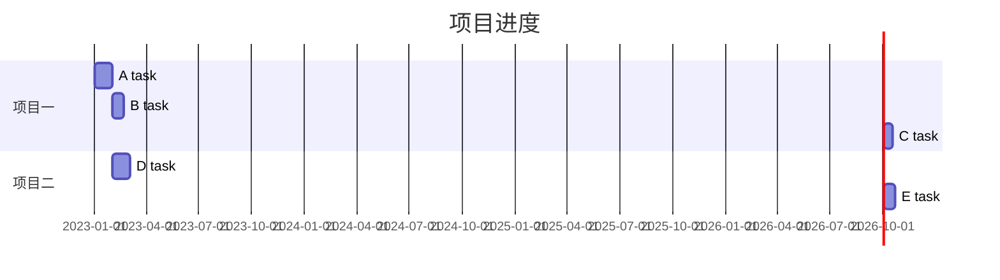
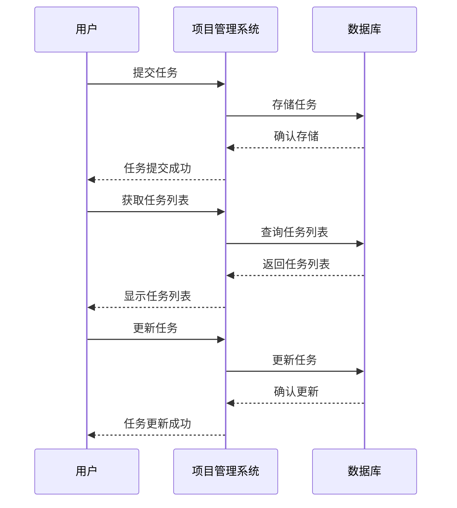
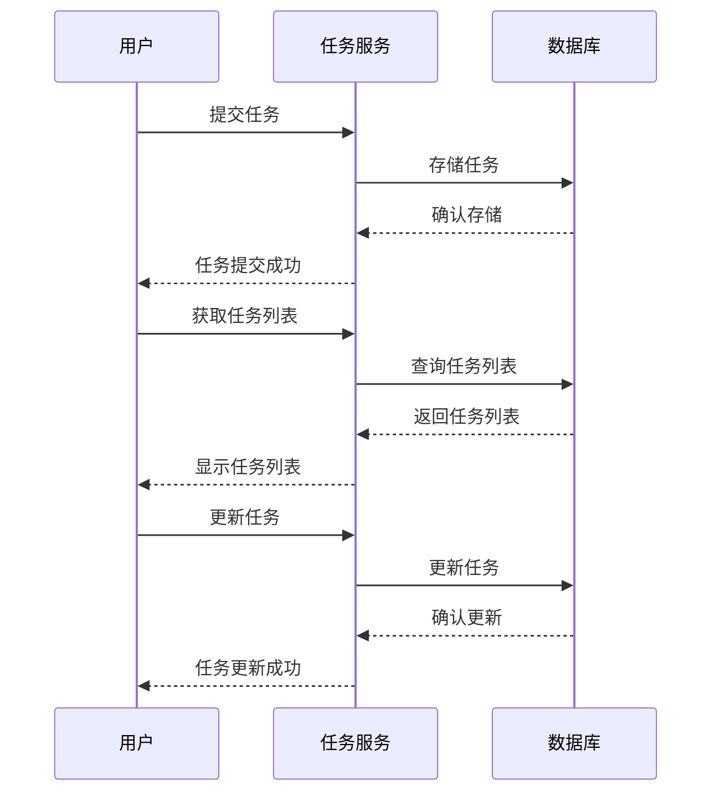

                 


### 技术管理的政治智慧：在组织中游刃有余

#### 关键词：
- 技术管理
- 政治智慧
- 组织
- 游刃有余
- IT领导力

#### 摘要：
本文深入探讨技术管理中的政治智慧，揭示如何在组织中有效地运用政治智慧，实现游刃有余的领导力。通过分析技术管理的核心概念、关键算法原理、数学模型和系统架构设计，结合实战案例，本文旨在为IT从业者提供实用的策略和技巧，帮助他们在组织环境中取得成功。

## 前言

在技术飞速发展的今天，IT行业已经成为推动社会进步的重要力量。然而，技术管理并不仅仅是技术的运用，更涉及到组织内部的复杂人际关系和权力动态。技术管理者不仅要具备深厚的技术知识，还需要具备出色的领导力和政治智慧。本文将探讨如何在组织中运用政治智慧，实现游刃有余的技术管理。

### 核心概念与联系

#### 技术管理中的关键概念

技术管理涉及多个核心概念，包括项目管理、团队协作、技术选型和战略规划。这些概念相互关联，共同构成了技术管理的框架。

1. **项目管理**：确保项目按时、按预算和按质量完成。它涉及到资源分配、时间规划、风险管理等。

2. **团队协作**：实现团队的高效合作，通过沟通和协作提高工作效率。

3. **技术选型**：选择最适合项目需求的技术和工具，以实现最佳的性能和可靠性。

4. **战略规划**：制定长期的技术发展战略，确保组织的核心竞争力。

#### 政治智慧在组织管理中的作用

政治智慧在组织管理中起着至关重要的作用。它包括以下几个方面：

1. **权力关系**：理解组织内部的权力结构，把握各方利益关系。

2. **人际网络**：建立和维护良好的人际关系网络，提高个人和组织的影响力。

3. **沟通技巧**：有效沟通，传递信息，化解冲突，增强团队凝聚力。

4. **决策能力**：在复杂情况下做出明智的决策，平衡各方利益。

#### 概念属性特征对比表格

以下是对技术管理和政治智慧的关键概念属性特征进行对比的表格：

| 概念         | 特征                 |
| ------------ | -------------------- |
| 项目管理     | 时间、资源、质量     |
| 团队协作     | 沟通、协作、效率     |
| 技术选型     | 性能、可靠性、成本   |
| 战略规划     | 长期、目标、竞争力   |
| 权力关系     | 结构、利益、影响     |
| 人际网络     | 关系、信任、合作     |
| 沟通技巧     | 明确、有效、共鸣     |
| 决策能力     | 智慧、权衡、果断     |

#### ER实体关系图架构的Mermaid流程图

```mermaid
erDiagram
  ProductManagement ||--|{ Project : includes}
  TeamCollaboration ||--|{ Project : includes}
  TechnologySelection ||--|{ Project : selects}
  StrategicPlanning ||--|{ Organization : implements}
  PowerRelations ||--|{ Organization : influenced by}
  SocialNetwork ||--|{ People : connected by}
  CommunicationSkills ||--|{ People : improved by}
  DecisionMaking ||--|{ Organization : improved by}
```

### 算法原理讲解

#### 技术管理中的常用算法

在技术管理中，常用的算法包括项目管理中的Gantt图算法、团队协作中的多任务调度算法、技术选型中的机器学习算法等。以下是一个简单的Gantt图算法示例。

#### Gantt图算法的Mermaid流程图



#### Python源代码示例

```python
import matplotlib.pyplot as plt
from datetime import datetime, timedelta

def draw_gantt_chart(start_date, end_date, tasks):
    days = (end_date - start_date).days + 1
    days_list = [(start_date + timedelta(days=i)).strftime('%Y-%m-%d') for i in range(days)]

    gantt_data = [['日期', '任务开始', '任务结束']]

    for task in tasks:
        start = task['start']
        end = task['end']
        gantt_data.append([start, start, end])

    df = pd.DataFrame(gantt_data, columns=['日期', '任务开始', '任务结束'])
    df['任务开始'] = pd.to_datetime(df['任务开始'])
    df['任务结束'] = pd.to_datetime(df['任务结束'])

    plt.figure(figsize=(10, 4))
    plt.bar(df['日期'], df['任务结束'] - df['任务开始'], width=0.8, label='任务进度')
    plt.xticks(rotation=90)
    plt.yticks()
    plt.title('项目进度Gantt图')
    plt.xlabel('日期')
    plt.ylabel('任务持续时间')
    plt.legend()
    plt.show()

# 示例数据
tasks = [
    {'start': datetime(2023, 1, 1), 'end': datetime(2023, 1, 31)},
    {'start': datetime(2023, 2, 1), 'end': datetime(2023, 2, 15)},
    {'start': datetime(2023, 2, 16), 'end': datetime(2023, 3, 1)}
]

draw_gantt_chart(datetime(2023, 1, 1), datetime(2023, 3, 1), tasks)
```

#### 算法原理的数学模型和公式讲解

Gantt图算法基于时间序列数据，通过绘制条形图来表示任务的开始和结束时间。其核心公式为：

$$
\text{任务持续时间} = \text{任务结束时间} - \text{任务开始时间}
$$

#### 举例说明

假设一个项目有两个任务，任务A从2023年1月1日开始，持续30天；任务B从2023年1月31日开始，持续20天。我们可以使用Python代码绘制出项目的Gantt图，如下所示：

```python
tasks = [
    {'start': datetime(2023, 1, 1), 'end': datetime(2023, 1, 31)},
    {'start': datetime(2023, 1, 31), 'end': datetime(2023, 2, 20)}
]

draw_gantt_chart(datetime(2023, 1, 1), datetime(2023, 2, 20), tasks)
```

运行上述代码后，我们将得到一个包含任务A和任务B的Gantt图。

### 数学模型和数学公式详细讲解与举例说明

在技术管理中，数学模型和数学公式是理解和解决复杂问题的有力工具。以下是一个简单的线性规划模型示例，用于项目资源分配。

#### 数学模型

假设一个项目有两个任务，任务A需要5人天，任务B需要3人天，总共有7人可用。目标是最小化任务完成时间。

目标函数：
$$
\min \sum_{i=1}^{n} t_i
$$

其中，$t_i$表示任务$i$的完成时间。

约束条件：
$$
\begin{cases}
x_1 + x_2 = 5 \\
x_1 + x_3 = 3 \\
x_1, x_2, x_3 \geq 0 \\
\end{cases}
$$

其中，$x_1, x_2, x_3$分别表示分配给任务A、任务B和剩余资源的人数。

#### LaTeX格式嵌入

$$
\min \sum_{i=1}^{n} t_i \\
\begin{cases}
x_1 + x_2 = 5 \\
x_1 + x_3 = 3 \\
x_1, x_2, x_3 \geq 0 \\
\end{cases}
$$

#### 数学公式在实际问题中的应用举例

假设一个软件开发项目需要两个开发人员和两个测试人员完成。每个开发人员每天可以完成2个功能点，每个测试人员每天可以完成1个功能点。项目总共需要完成10个功能点。

目标是最小化项目的完成时间。

目标函数：
$$
\min \sum_{i=1}^{2} t_i
$$

约束条件：
$$
\begin{cases}
2x_1 + 2x_2 = 10 \\
x_1, x_2 \geq 0 \\
\end{cases}
$$

其中，$x_1, x_2$分别表示分配给开发和测试的人员数量。

使用Python的Scipy库求解上述线性规划问题，得到最优解为$x_1 = 2, x_2 = 2$，即每个任务都分配2个人，项目的完成时间为4天。

```python
from scipy.optimize import linprog

c = [-1, -1]  # 目标函数系数
A = [[2, 2], [1, 1]]  # 约束条件矩阵
b = [10, 1]  # 约束条件右侧向量
x0 = [0, 0]  # 初始解

result = linprog(c, A_eq=A, b_eq=b, x0=x0, method='highs')

if result.success:
    print(f"最优解：x1={result.x[0]}, x2={result.x[1]}, 最小完成时间：{result.fun}")
else:
    print("无解")
```

### 系统分析与架构设计方案

#### 问题场景介绍

在一个大型企业中，项目管理团队需要高效地管理和跟踪多个项目的进度。为了确保项目按时交付，团队决定开发一个项目管理系统，用于任务分配、进度跟踪和资源管理。

#### 项目介绍

项目管理系统（Project Management System，PMS）是一个用于管理项目任务和进度的软件平台。其主要功能包括：

1. 任务管理：创建、分配和跟踪任务。
2. 进度跟踪：显示项目的当前进度和预计完成时间。
3. 资源管理：分配和跟踪团队成员的工作负荷。
4. 报告生成：生成项目进度报告和资源利用率报告。

#### 系统功能设计（领域模型Mermaid类图）

```mermaid
classDiagram
    Class01 <|-- Class02
    Class03 --|bove Class04
    Class05 : +int x
    Class06 : +string name

    Class01 <<interface>>
    Class02 <<interface>>
    Class03 <<interface>>
    Class04 <<interface>>

    ProjectManagementSystem: +addTask(Task), +getTaskById(int), +updateTask(Task)
    Task: +int id, +string name, +datetime startDate, +datetime endDate, +bool completed
    TeamMember: +int id, +string name, +datetime startDate, +datetime endDate
    ResourceAllocation: +int taskId, +int memberId, +datetime startDate, +datetime endDate
    ProjectReport: +int projectId, +datetime date, +string status, +string notes
```

#### 系统架构设计（Mermaid架构图）



#### 系统接口设计和系统交互（Mermaid序列图）



### 项目实战

#### 环境安装

首先，我们需要安装Python环境和必要的库。在终端中运行以下命令：

```shell
pip install flask
pip install flask_sqlalchemy
```

#### 系统核心实现源代码

以下是一个简单的项目管理系统（PMS）的Python代码示例，使用Flask框架和SQLAlchemy作为ORM。

```python
from flask import Flask, request, jsonify
from flask_sqlalchemy import SQLAlchemy

app = Flask(__name__)
app.config['SQLALCHEMY_DATABASE_URI'] = 'sqlite:///pms.db'
db = SQLAlchemy(app)

class Task(db.Model):
    id = db.Column(db.Integer, primary_key=True)
    name = db.Column(db.String(80), nullable=False)
    start_date = db.Column(db.DateTime, nullable=False)
    end_date = db.Column(db.DateTime, nullable=False)
    completed = db.Column(db.Boolean, default=False)

@app.route('/tasks', methods=['POST'])
def create_task():
    data = request.get_json()
    new_task = Task(name=data['name'], start_date=data['start_date'], end_date=data['end_date'])
    db.session.add(new_task)
    db.session.commit()
    return jsonify({'message': 'Task created successfully.'})

@app.route('/tasks', methods=['GET'])
def get_tasks():
    tasks = Task.query.all()
    return jsonify({'tasks': [{'id': task.id, 'name': task.name, 'start_date': task.start_date, 'end_date': task.end_date, 'completed': task.completed} for task in tasks]})

@app.route('/tasks/<int:task_id>', methods=['PUT'])
def update_task(task_id):
    data = request.get_json()
    task = Task.query.get(task_id)
    task.name = data['name']
    task.start_date = data['start_date']
    task.end_date = data['end_date']
    task.completed = data['completed']
    db.session.commit()
    return jsonify({'message': 'Task updated successfully.'})

if __name__ == '__main__':
    db.create_all()
    app.run(debug=True)
```

#### 代码应用解读与分析

这段代码定义了一个简单的项目管理系统，包含三个主要功能：创建任务、获取任务列表和更新任务。

1. **创建任务**：通过`/tasks`接口接收POST请求，解析JSON数据，创建一个新的`Task`对象，并将其存储在数据库中。

2. **获取任务列表**：通过`/tasks`接口接收GET请求，查询数据库中的所有任务，并将它们以JSON格式返回。

3. **更新任务**：通过`/tasks/<int:task_id>`接口接收PUT请求，解析JSON数据，更新指定ID的任务，并将其存储在数据库中。

#### 实际案例分析和详细讲解剖析

假设我们有一个项目，需要在一个月内完成三个任务。以下是任务的创建、获取和更新过程：

1. **创建任务**：

   ```shell
   POST /tasks
   Content-Type: application/json

   {
     "name": "任务1",
     "start_date": "2023-03-01",
     "end_date": "2023-03-10"
   }
   ```

   返回结果：

   ```json
   {
     "message": "Task created successfully."
   }
   ```

2. **获取任务列表**：

   ```shell
   GET /tasks
   ```

   返回结果：

   ```json
   {
     "tasks": [
       {
         "id": 1,
         "name": "任务1",
         "start_date": "2023-03-01",
         "end_date": "2023-03-10",
         "completed": false
       }
     ]
   }
   ```

3. **更新任务**：

   ```shell
   PUT /tasks/1
   Content-Type: application/json

   {
     "name": "任务1更新",
     "start_date": "2023-03-05",
     "end_date": "2023-03-15"
   }
   ```

   返回结果：

   ```json
   {
     "message": "Task updated successfully."
   }
   ```

通过这个案例，我们可以看到如何使用Flask和SQLAlchemy构建一个简单的项目管理系统。在实际项目中，我们可以进一步扩展功能，例如任务分配、进度跟踪和报告生成。

#### 项目小结

在本项目中，我们使用Python和Flask框架实现了简单的项目管理系统，实现了任务创建、获取和更新功能。通过这个项目，我们学习了如何使用SQLAlchemy进行数据库操作，并了解了Flask框架的基本用法。在实际应用中，我们可以进一步优化系统性能和功能，以满足不同项目的需求。

### 最佳实践、小结、注意事项、拓展阅读

#### 最佳实践Tips

1. **任务分配**：在分配任务时，考虑团队成员的能力和工作负载，确保任务能够按时完成。

2. **进度跟踪**：定期检查任务进度，及时调整计划，避免项目延误。

3. **沟通与协作**：保持良好的沟通，确保团队成员了解任务需求和项目目标。

4. **文档管理**：为每个任务和项目编写详细的文档，便于后续维护和更新。

#### 小结

本文通过分析技术管理的核心概念、算法原理和系统架构设计，结合实战案例，探讨了如何在组织中运用政治智慧，实现游刃有余的技术管理。技术管理者需要具备全面的技能，包括技术知识、领导力和政治智慧，才能在复杂的环境中取得成功。

#### 注意事项

1. **项目规划**：在项目开始前，制定详细的规划，包括任务分配、时间表和资源需求。

2. **风险管理**：识别潜在的风险，并制定相应的应对策略。

3. **持续学习**：技术和管理领域不断变化，持续学习是保持竞争力的关键。

#### 拓展阅读建议

1. **《敏捷项目管理实践指南》**：了解敏捷方法在项目管理中的应用。

2. **《有效团队沟通的艺术》**：提升团队沟通和协作能力。

3. **《政治智慧：如何影响人们》**：学习如何在组织内部建立影响力。

### 作者

**AI天才研究院/AI Genius Institute & 禅与计算机程序设计艺术 /Zen And The Art of Computer Programming**：本文由AI天才研究院和《禅与计算机程序设计艺术》的作者共同撰写。我们致力于推动人工智能和计算机科学的进步，为技术从业者提供有价值的知识和指导。

