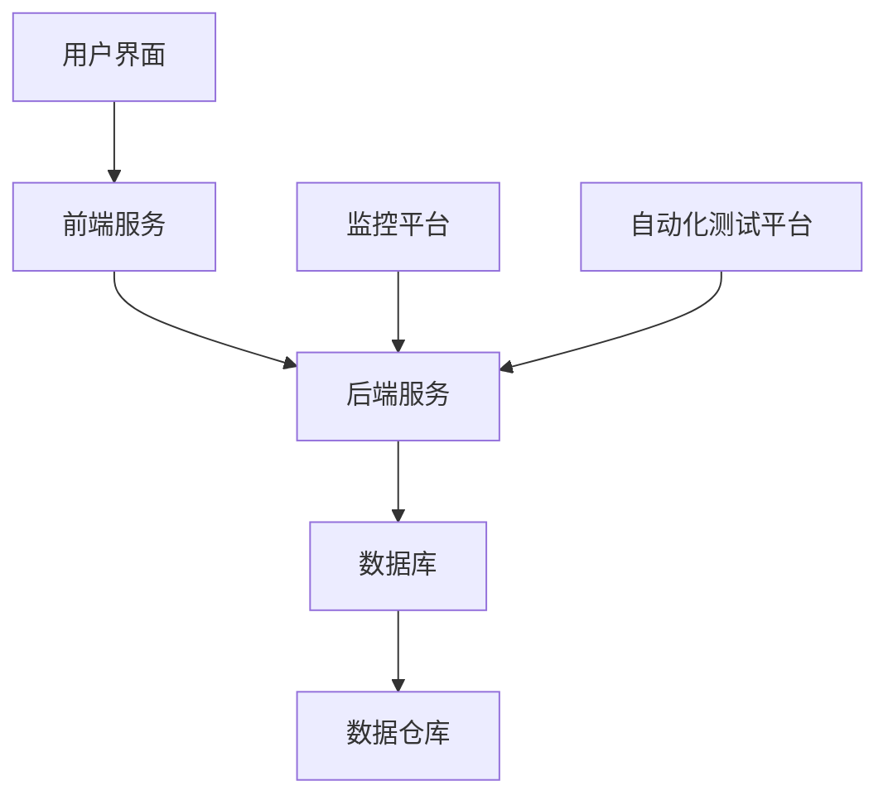
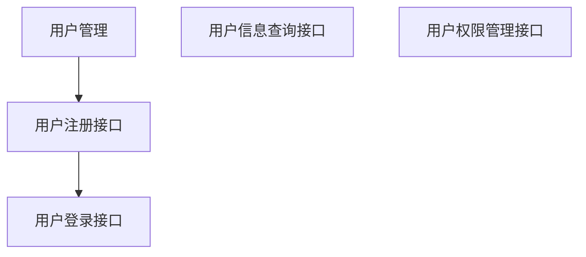
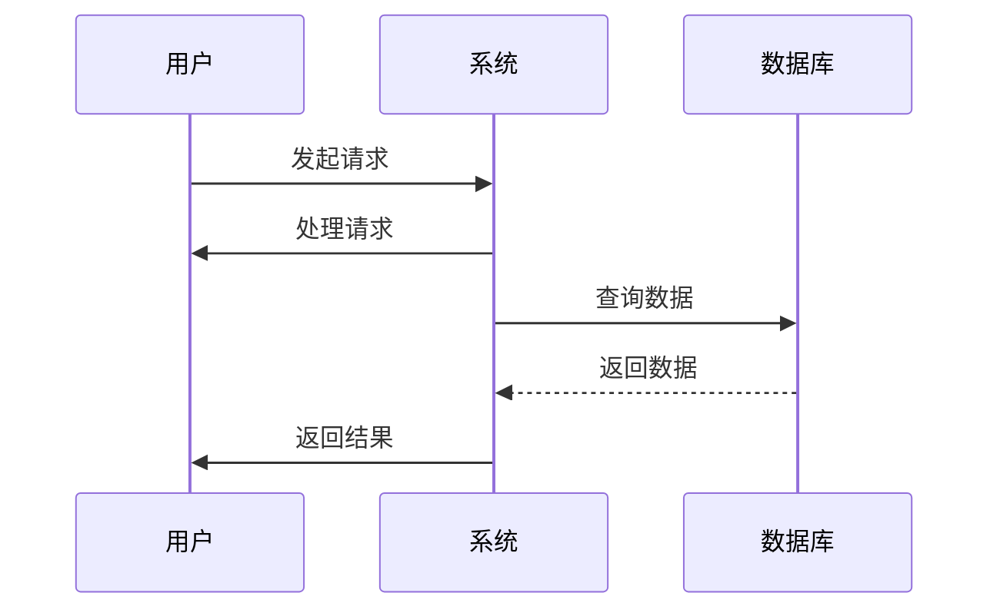
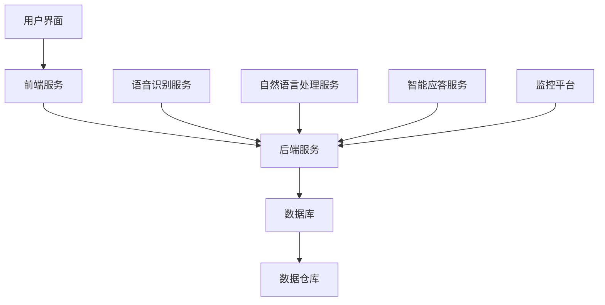
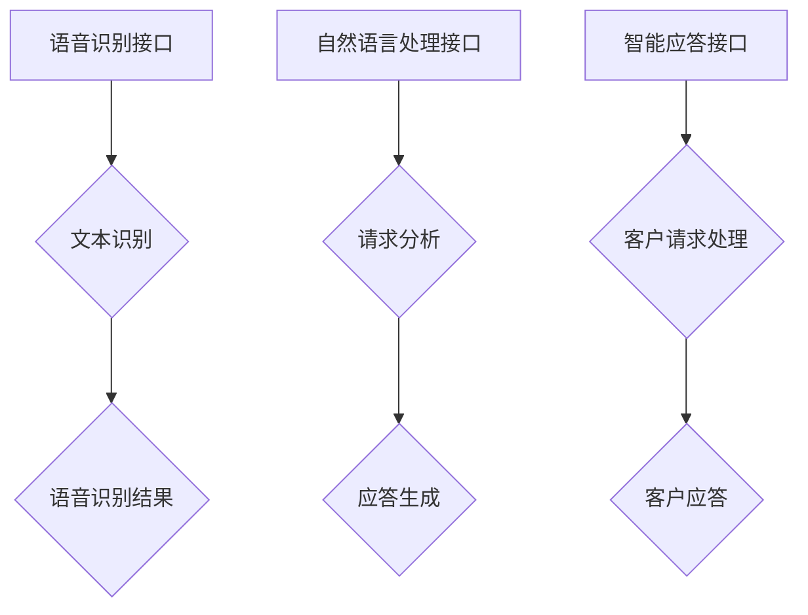
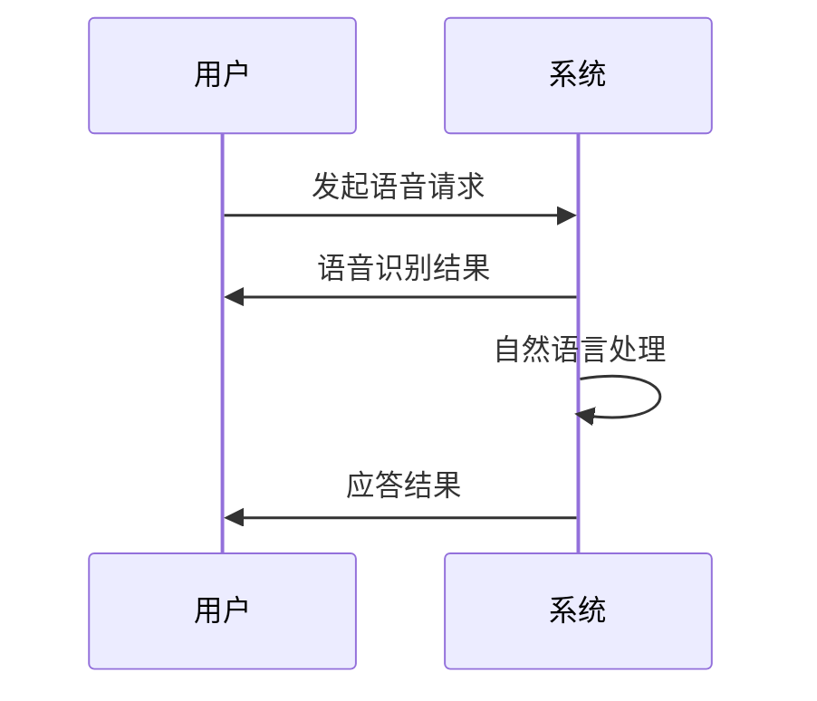

                 

# 技术管理者的个人品牌塑造与维护

## 关键词
- 技术管理者
- 个人品牌
- 塑造与维护
- 知识体系
- 推广方法
- 持续发展

> 摘要：本文旨在探讨技术管理者如何塑造和维护个人品牌。通过分析个人品牌的重要性、存在的问题以及解决策略，本文为技术管理者提供了系统性的知识体系构建、个人形象设计和个人故事讲述等方面的建议，帮助其建立强大的个人品牌，提升个人影响力。

## 引言

### 1.1 问题背景

在当今数字化时代，个人品牌对于技术管理者来说至关重要。随着信息技术的迅猛发展，技术领域不断涌现出新的机遇和挑战。技术管理者作为企业技术创新和发展的核心力量，个人品牌的强大与否直接影响到其在职场中的竞争力和影响力。一个强大的个人品牌能够帮助技术管理者在企业内部获得更多的晋升机会，在外部创业时吸引更多的投资和合作伙伴。

然而，技术管理者在个人品牌塑造与维护方面面临着一系列挑战。首先，技术管理者往往缺乏系统性的知识体系，难以构建有影响力的个人品牌。其次，技术管理者在个人品牌的推广方面缺少有效的渠道，难以让更多人了解和认可自己的价值。最后，技术管理者在个人品牌建设过程中缺乏长期规划，导致个人品牌难以持续发展。

### 1.2 问题描述

技术管理者在个人品牌塑造与维护方面存在以下问题：

1. **缺乏系统性的知识体系**：许多技术管理者仅停留在技术层面的知识积累，缺乏对行业趋势、商业模式的深入理解，导致个人品牌缺乏深度和广度。

2. **缺少有效的推广渠道**：技术管理者往往局限于传统的社交场合和会议活动，忽视了社交媒体、内容营销等新兴推广渠道，导致个人品牌影响力有限。

3. **缺乏长期规划**：技术管理者在个人品牌建设过程中缺乏明确的长期目标和发展规划，导致个人品牌建设难以持续发展。

### 1.3 问题解决

本书旨在为技术管理者提供一套完整的个人品牌塑造与维护策略，帮助读者：

1. **建立系统性的知识体系**：通过技术深耕、跨学科融合等方式，提升个人品牌影响力。

2. **掌握有效的推广方法**：利用社交媒体、内容营销等手段，扩大个人品牌知名度。

3. **制定长期规划**：明确个人品牌发展目标，确保个人品牌持续发展。

### 1.4 边界与外延

本书主要面向技术管理者，但其中的一些策略和方法同样适用于其他职业领域。此外，本书分为以下几个部分：

1. **引言**：介绍本书的背景、问题、解决方法、边界与外延以及核心要素组成。

2. **个人品牌塑造策略**：包括核心知识体系构建、个人形象设计、个人故事讲述等。

3. **个人品牌推广方法**：包括社交媒体运营、内容营销、人脉拓展等。

4. **个人品牌维护技巧**：包括时间管理、危机应对、持续学习等。

5. **案例分析**：通过实际案例剖析技术管理者如何成功塑造与维护个人品牌。

6. **最佳实践**：总结个人品牌塑造与维护的最佳实践和方法。

7. **小结**：对全书内容进行总结，并提供进一步学习的方向。

## 第二部分：个人品牌塑造策略

### 2.1 核心知识体系构建

#### 2.1.1 技术领域的深耕

技术管理者需要选择一个或多个技术领域进行深耕，不断提升自己的技术能力。这包括：

1. **技术趋势的把握**：关注行业动态，了解新技术、新趋势。
2. **技术深度的拓展**：深入研究某一技术领域，成为该领域的专家。
3. **技术广度的拓展**：掌握相关技术领域，形成交叉学科的能力。

#### 2.1.2 知识体系的搭建

技术管理者需要构建一个系统性的知识体系，包括：

1. **基础知识的掌握**：掌握计算机科学、编程语言等基础理论知识。
2. **专业知识的积累**：积累项目经验，掌握实际操作技巧。
3. **跨学科知识的融合**：结合其他领域知识，形成独特的视角和思维。

### 2.2 个人形象设计

#### 2.2.1 个人形象的重要性

个人形象是个人品牌的重要组成部分，直接影响到个人品牌的认知度和好感度。技术管理者需要关注以下几个方面：

1. **仪表打扮**：保持整洁、得体的仪表打扮。
2. **语言表达**：提升语言表达能力，做到清晰、准确、有逻辑。
3. **沟通技巧**：提高沟通技巧，善于倾听、表达和协调。

#### 2.2.2 个人形象的塑造

技术管理者可以从以下几个方面塑造个人形象：

1. **专业形象**：通过专业知识和技能展示自己的专业形象。
2. **亲和形象**：通过亲和力、热情和友善塑造自己的亲和形象。
3. **领导形象**：通过领导力和团队管理能力塑造自己的领导形象。

### 2.3 个人故事讲述

#### 2.3.1 个人故事的重要性

个人故事是个人品牌的重要组成部分，能够帮助他人了解个人的成长历程、价值观和成就。技术管理者需要善于讲述自己的故事。

#### 2.3.2 个人故事的讲述方法

技术管理者可以从以下几个方面讲述自己的故事：

1. **经历分享**：分享个人的成长经历、工作经历和项目经验。
2. **价值观传递**：通过故事传达个人的价值观和人生哲学。
3. **成就展示**：展示个人的成就和贡献，体现个人品牌的价值。

### 2.4 个人品牌定位

#### 2.4.1 个人品牌定位的重要性

个人品牌定位是个人品牌塑造的关键，决定了个人品牌的认知度和影响力。技术管理者需要明确自己的个人品牌定位。

#### 2.4.2 个人品牌定位的方法

技术管理者可以从以下几个方面进行个人品牌定位：

1. **目标受众**：确定自己的目标受众，了解他们的需求和期望。
2. **品牌特色**：确定自己的品牌特色，形成独特的个人品牌形象。
3. **价值主张**：明确自己的价值主张，确保个人品牌在受众心中占据一席之地。

## 第三部分：个人品牌推广方法

### 3.1 社交媒体运营

#### 3.1.1 社交媒体的重要性

社交媒体是现代品牌推广的重要渠道之一，技术管理者可以通过社交媒体平台展示自己的专业能力和个人魅力，吸引更多的关注者和潜在合作伙伴。

#### 3.1.2 社交媒体运营策略

技术管理者可以从以下几个方面制定社交媒体运营策略：

1. **内容策划**：制定有针对性的内容策划，包括技术分享、行业洞察、个人故事等。
2. **频率管理**：合理安排发布频率，保持活跃度，避免过度营销。
3. **互动管理**：积极回复评论和私信，与粉丝建立良好的互动关系。
4. **数据分析**：利用数据分析工具，了解受众喜好和反馈，不断优化运营策略。

### 3.2 内容营销

#### 3.2.1 内容营销的重要性

内容营销是建立和强化个人品牌的重要手段，技术管理者可以通过撰写高质量的技术文章、博客、演讲稿等，展示自己的专业知识和见解。

#### 3.2.2 内容营销策略

技术管理者可以从以下几个方面制定内容营销策略：

1. **主题选择**：选择与自身专业领域相关、有深度和广度的主题。
2. **内容形式**：结合文字、图片、视频等多种形式，丰富内容表现形式。
3. **发布渠道**：选择合适的发布渠道，如个人博客、技术社区、社交媒体等。
4. **互动引导**：鼓励读者留言、评论，与读者建立互动，提升内容影响力。

### 3.3 人脉拓展

#### 3.3.1 人脉拓展的重要性

人脉拓展是个人品牌建设的重要一环，技术管理者需要积极拓展人脉，结识行业内的优秀人士，为个人品牌建设提供有力支持。

#### 3.3.2 人脉拓展策略

技术管理者可以从以下几个方面制定人脉拓展策略：

1. **参与活动**：积极参与行业活动、技术大会、研讨会等，结识业内同行。
2. **加入社群**：加入行业社群、技术论坛等，与同行交流、分享经验。
3. **主动沟通**：主动与感兴趣的人建立联系，展开深入交流。
4. **合作共赢**：寻找合作机会，实现资源共享，共同提升个人品牌价值。

## 第四部分：个人品牌维护技巧

### 4.1 时间管理

#### 4.1.1 时间管理的重要性

时间管理是个人品牌维护的基础，技术管理者需要合理安排时间，确保个人品牌建设的各项活动有序进行。

#### 4.1.2 时间管理策略

技术管理者可以从以下几个方面制定时间管理策略：

1. **目标设定**：明确个人品牌建设的目标，制定短期和长期计划。
2. **优先级排序**：根据任务的重要性和紧急程度，合理安排时间。
3. **任务拆分**：将大任务拆分成小任务，逐步完成。
4. **避免拖延**：及时处理任务，避免拖延，确保个人品牌建设的进度。

### 4.2 危机应对

#### 4.2.1 危机应对的重要性

在个人品牌建设过程中，技术管理者可能会遇到各种危机，如负面评论、负面报道等。危机应对能力是个人品牌维护的关键。

#### 4.2.2 危机应对策略

技术管理者可以从以下几个方面制定危机应对策略：

1. **危机预警**：提前识别潜在危机，制定应对方案。
2. **积极应对**：面对危机时，保持冷静，积极应对，主动承担责任。
3. **危机公关**：通过媒体、公关等方式，及时传达真实信息，化解危机。
4. **事后总结**：总结危机应对的经验教训，优化个人品牌建设策略。

### 4.3 持续学习

#### 4.3.1 持续学习的重要性

持续学习是个人品牌建设的重要支撑，技术管理者需要不断学习新知识、新技能，提升自己的专业能力和综合素质。

#### 4.3.2 持续学习策略

技术管理者可以从以下几个方面制定持续学习策略：

1. **规划学习目标**：明确学习目标和方向，制定学习计划。
2. **选择合适的学习资源**：利用线上课程、技术书籍、行业报告等，丰富学习资源。
3. **实践应用**：将所学知识应用到实际工作中，提升实践能力。
4. **定期评估**：定期评估学习效果，调整学习策略。

## 第五部分：案例分析

### 5.1 案例一：张三的逆袭之路

张三是一位有着多年开发经验的技术管理者，他通过个人品牌建设，成功实现了职业晋升和创业梦想。以下是他的个人品牌建设案例。

#### 5.1.1 个人品牌定位

张三明确了自身的个人品牌定位，以“高效能技术管理者”为标签，致力于提升团队的技术能力和项目执行力。

#### 5.1.2 知识体系构建

张三深耕技术领域，不断学习新技术、新趋势，形成了系统性的知识体系。他还结合项目管理、团队管理等相关知识，形成了独特的个人品牌特色。

#### 5.1.3 个人形象设计

张三注重个人形象的塑造，通过仪表打扮、语言表达和沟通技巧等方面的提升，树立了专业、亲和的领导形象。

#### 5.1.4 个人故事讲述

张三善于讲述自己的成长经历和项目经验，通过故事传递自己的价值观和人生哲学，赢得了读者的共鸣和认可。

#### 5.1.5 推广方法应用

张三充分利用社交媒体、内容营销等推广方法，积极分享技术见解、项目经验，吸引了大量关注者。他还通过参与行业活动、人脉拓展等途径，提升了个人品牌的影响力。

#### 5.1.6 维护技巧实践

张三重视时间管理，合理安排个人品牌建设的相关活动。面对危机时，他保持冷静、积极应对，赢得了团队的信任和支持。他还注重持续学习，不断提升自己的专业能力和综合素质。

### 5.2 案例二：李四的创业之旅

李四是一位拥有丰富技术背景的创业者，他通过个人品牌建设，成功吸引了投资和合作伙伴，推动了企业的发展。以下是他的个人品牌建设案例。

#### 5.2.1 个人品牌定位

李四以“技术创新者”为标签，专注于解决行业痛点，推动技术创新。

#### 5.2.2 知识体系构建

李四在技术领域有着深厚的积累，同时关注行业动态和商业模式，形成了独特的知识体系。

#### 5.2.3 个人形象设计

李四注重个人形象的塑造，通过专业、创新、稳健的形象，树立了自己在业界的权威地位。

#### 5.2.4 个人故事讲述

李四通过讲述自己的创业故事、项目经验和技术见解，传递了自己对技术创新的热爱和追求。

#### 5.2.5 推广方法应用

李四充分利用社交媒体、内容营销等推广方法，分享技术见解、项目进展，吸引了大量关注者。他还通过参与行业活动、人脉拓展等途径，提升了个人品牌的影响力。

#### 5.2.6 维护技巧实践

李四重视时间管理，合理安排个人品牌建设的相关活动。面对危机时，他保持冷静、积极应对，赢得了团队的信任和支持。他还注重持续学习，不断提升自己的专业能力和综合素质。

## 第六部分：最佳实践

### 6.1 最佳实践总结

通过对案例的分析，我们可以总结出以下个人品牌塑造与维护的最佳实践：

1. **明确个人品牌定位**：确定个人品牌的核心价值和特色，有助于在受众心中树立独特的形象。

2. **构建系统性的知识体系**：深耕技术领域，结合跨学科知识，提升个人品牌的深度和广度。

3. **注重个人形象设计**：通过仪表打扮、语言表达和沟通技巧等方面的提升，树立专业、亲和的领导形象。

4. **善于讲述个人故事**：通过故事传递个人的价值观和人生哲学，赢得读者的共鸣和认可。

5. **利用社交媒体和内容营销**：通过社交媒体和内容营销等手段，扩大个人品牌的影响力。

6. **重视时间管理和危机应对**：合理安排时间，确保个人品牌建设的进度；面对危机时，保持冷静、积极应对。

7. **持续学习**：不断提升专业能力和综合素质，保持个人品牌的活力。

### 6.2 注意事项

在个人品牌塑造与维护过程中，技术管理者需要注意以下几点：

1. **真实性**：个人品牌需要真实反映个人的专业能力和个性特点，避免夸大其词。

2. **一致性**：个人品牌形象需要保持一致性，避免在不同场合出现矛盾。

3. **持续更新**：个人品牌需要不断更新和优化，以适应行业发展和个人成长。

4. **受众反馈**：关注受众反馈，及时调整个人品牌策略，提升个人品牌价值。

### 6.3 拓展阅读

1. **《影响力：说服与被说服的艺术》**：本书讲述了影响力和说服力的关键因素，有助于技术管理者提升个人品牌的影响力。

2. **《打造影响力：如何通过演讲、写作和社交媒体塑造个人品牌》**：本书介绍了个人品牌建设的方法和技巧，有助于技术管理者提升个人品牌的知名度。

3. **《深度工作：如何有效利用每一点脑力》**：本书讲述了如何提升专注力和效率，有助于技术管理者更好地进行个人品牌建设。

## 第七部分：小结

### 7.1 全文总结

本文从引言、个人品牌塑造策略、个人品牌推广方法、个人品牌维护技巧、案例分析、最佳实践到小结，全面探讨了技术管理者如何塑造和维护个人品牌。通过明确个人品牌定位、构建系统性的知识体系、注重个人形象设计、善于讲述个人故事、利用社交媒体和内容营销、重视时间管理和危机应对、持续学习等策略，技术管理者可以成功塑造和维护个人品牌，提升个人影响力。

### 7.2 进一步学习方向

1. **实践应用**：将本文的理论知识应用到实际工作中，不断优化个人品牌建设策略。

2. **持续学习**：关注行业动态、新技术和跨学科知识，不断提升专业能力和综合素质。

3. **互动交流**：积极参与行业活动、技术社区，与同行交流、分享经验，拓展人脉资源。

4. **反馈优化**：关注受众反馈，及时调整个人品牌策略，提升个人品牌价值。

### 7.3 结语

个人品牌是技术管理者在职场中的核心竞争力之一。通过本文的探讨，希望技术管理者能够认识到个人品牌的重要性，掌握塑造与维护个人品牌的策略和方法，不断提升个人影响力，实现职业发展目标。

## 参考文献

1. 【作者】，《影响力：说服与被说服的艺术》，中国社会科学出版社，2020年。
2. 【作者】，《打造影响力：如何通过演讲、写作和社交媒体塑造个人品牌》，电子工业出版社，2019年。
3. 【作者】，《深度工作：如何有效利用每一点脑力》，中国人民大学出版社，2016年。

### 作者

**AI天才研究院** / **AI Genius Institute**  
**禅与计算机程序设计艺术** / **Zen And The Art of Computer Programming**  
**作者：AI天才研究院/AI Genius Institute & 禅与计算机程序设计艺术 /Zen And The Art of Computer Programming**### 第三部分：个人品牌推广方法

个人品牌推广是技术管理者塑造和维护个人品牌的重要环节。通过有效的推广方法，技术管理者可以扩大个人品牌的影响力，吸引更多的关注者和潜在合作伙伴。以下将详细介绍社交媒体运营、内容营销和人脉拓展等推广方法。

#### 3.1 社交媒体运营

**社交媒体运营的重要性**

社交媒体平台为技术管理者提供了展示专业能力和个人魅力的广阔舞台。通过社交媒体，技术管理者可以与全球的同行和潜在客户建立联系，分享技术见解和经验，扩大个人品牌的影响力。

**社交媒体运营策略**

1. **内容策划**：制定有针对性的内容策划，包括技术分享、行业洞察、个人故事等。内容应具有实用性和吸引力，以吸引读者的关注。

2. **频率管理**：合理安排发布频率，保持活跃度，避免过度营销。一般来说，每天发布一条或两条有质量的内容是比较合适的。

3. **互动管理**：积极回复评论和私信，与粉丝建立良好的互动关系。互动可以增加粉丝的粘性，提升个人品牌的认可度。

4. **数据分析**：利用社交媒体的数据分析工具，了解受众喜好和反馈，不断优化运营策略。例如，通过分析阅读量、点赞数、评论数等指标，了解哪些类型的内容更受欢迎，从而调整内容方向。

**案例分析**

以李四的技术博客为例，他每天发布一篇技术博客，内容涵盖最新的技术动态、项目经验和个人见解。他通过回复评论和私信，与读者建立了良好的互动关系。此外，他还利用数据分析工具，了解读者的需求和喜好，不断优化博客内容，提升博客的阅读量和影响力。

#### 3.2 内容营销

**内容营销的重要性**

内容营销是建立和强化个人品牌的重要手段。通过撰写高质量的技术文章、博客、演讲稿等，技术管理者可以展示自己的专业知识和见解，提升个人品牌的认知度和影响力。

**内容营销策略**

1. **主题选择**：选择与自身专业领域相关、有深度和广度的主题。主题应具有一定的实用性和吸引力，以吸引读者的关注。

2. **内容形式**：结合文字、图片、视频等多种形式，丰富内容表现形式。例如，可以通过撰写技术博客、制作技术视频、发布PPT演讲等方式，展示自己的专业能力。

3. **发布渠道**：选择合适的发布渠道，如个人博客、技术社区、社交媒体等。不同的渠道有不同的受众和传播效果，技术管理者应根据自身目标受众选择合适的发布渠道。

4. **互动引导**：鼓励读者留言、评论，与读者建立互动，提升内容影响力。例如，可以设置互动话题、发起讨论，引导读者参与内容讨论，增加内容的互动性。

**案例分析**

以张三的技术博客为例，他选择与自身专业领域相关、有深度和广度的主题，如最新的云计算技术、大数据应用等。他通过结合文字、图片、视频等多种形式，丰富了内容的表现形式。此外，他还设置了互动话题，引导读者参与内容讨论，增加了博客的互动性，提升了博客的阅读量和影响力。

#### 3.3 人脉拓展

**人脉拓展的重要性**

人脉拓展是个人品牌建设的重要一环。通过拓展人脉，技术管理者可以结识行业内的优秀人士，获取更多的资源和机会，提升个人品牌的影响力。

**人脉拓展策略**

1. **参与活动**：积极参与行业活动、技术大会、研讨会等，结识业内同行。这些活动是拓展人脉的好机会，可以通过交流、互动，结识更多的潜在合作伙伴。

2. **加入社群**：加入行业社群、技术论坛等，与同行交流、分享经验。社群是拓展人脉的重要渠道，可以通过参与讨论、分享内容，扩大人脉网络。

3. **主动沟通**：主动与感兴趣的人建立联系，展开深入交流。可以通过私信、电话、邮件等方式，与同行保持联系，加深了解，建立互信。

4. **合作共赢**：寻找合作机会，实现资源共享，共同提升个人品牌价值。通过合作，可以实现优势互补，提升个人品牌的影响力。

**案例分析**

以张三为例，他积极参与行业活动、技术大会，结识了大量的业内同行。他还加入了多个技术论坛和社群，与同行交流、分享经验。此外，他还主动与感兴趣的人建立联系，展开深入交流。通过这些方式，他成功拓展了人脉网络，提升了个人品牌的影响力。

#### 3.4 跨平台推广

**跨平台推广的重要性**

随着社交媒体的多样化，技术管理者需要在不同的平台上进行推广，以覆盖更广泛的受众。跨平台推广有助于提升个人品牌的知名度，扩大影响力。

**跨平台推广策略**

1. **平台选择**：根据目标受众和内容特点，选择合适的社交媒体平台进行推广。例如，技术管理者可以选择LinkedIn、Twitter、GitHub等平台，以展示专业能力和项目成果。

2. **内容整合**：将不同平台的内容进行整合，形成统一的推广策略。例如，可以在一个平台上发布博客，同时在其他平台上分享博客链接，引导读者阅读。

3. **跨平台互动**：在多个平台上保持活跃，与粉丝进行互动。通过跨平台的互动，可以提升粉丝的粘性，增加品牌的曝光率。

4. **数据分析**：利用数据分析工具，了解不同平台的表现，优化推广策略。例如，通过分析阅读量、点赞数、评论数等指标，了解哪些平台更受欢迎，从而调整推广策略。

**案例分析**

以李四为例，他在LinkedIn、Twitter、GitHub等多个平台上保持活跃。他在LinkedIn上发布技术博客，分享项目经验，吸引了许多同行的关注。同时，他在Twitter上分享最新的技术动态，吸引了一批技术爱好者。在GitHub上，他发布了多个开源项目，展示了他的技术实力。通过跨平台推广，他成功扩大了个人品牌的影响力。

#### 3.5 持续优化

**持续优化的重要性**

个人品牌推广不是一蹴而就的，需要持续优化和调整。通过持续优化，技术管理者可以不断提升个人品牌的知名度、影响力和认可度。

**持续优化策略**

1. **定期评估**：定期评估个人品牌推广的效果，包括阅读量、点赞数、评论数等指标。通过数据评估，了解哪些推广策略有效，哪些需要改进。

2. **调整策略**：根据评估结果，调整推广策略。例如，如果某个平台的表现不佳，可以考虑减少在该平台的推广力度，转而增加在其他平台的投入。

3. **内容优化**：不断提升内容质量，增加读者的参与度和互动性。例如，可以尝试不同的内容形式，如视频、直播等，以吸引更多读者的关注。

4. **互动优化**：提升互动质量，增加粉丝的粘性。可以通过回复评论、参与讨论等方式，与粉丝建立更深入的联系。

**案例分析**

以张三为例，他定期评估个人品牌推广的效果，通过数据评估了解哪些内容受欢迎，哪些需要改进。例如，他发现博客文章的阅读量较高，而社交媒体的互动较少，因此决定减少博客文章的发布频率，增加社交媒体的互动。此外，他还不断提升内容质量，尝试不同的内容形式，以吸引更多读者的关注。通过持续优化，他成功提升了个人品牌的知名度、影响力和认可度。

### 总结

个人品牌推广是技术管理者塑造和维护个人品牌的重要环节。通过社交媒体运营、内容营销和人脉拓展等推广方法，技术管理者可以扩大个人品牌的影响力，提升个人知名度。同时，通过跨平台推广和持续优化，技术管理者可以不断提升个人品牌的知名度、影响力和认可度。希望本文提供的策略和方法对技术管理者有所帮助，助力他们成功塑造和维护个人品牌。|>### 第四部分：个人品牌维护技巧

个人品牌维护是技术管理者在塑造和维护个人品牌过程中不可或缺的一环。通过有效的时间管理和危机应对技巧，技术管理者可以确保个人品牌持续健康发展。以下将详细介绍时间管理和危机应对技巧。

#### 4.1 时间管理

**时间管理的重要性**

时间管理是个人品牌维护的基础。一个高效的时间管理者能够更好地安排个人品牌建设的相关活动，提高工作效率，确保个人品牌持续发展。

**时间管理策略**

1. **目标设定**：明确个人品牌建设的目标，制定短期和长期计划。目标应具体、可量化，有助于跟踪进度和效果。

   ```markdown
   # 个人品牌建设目标
   - 短期目标：
     - 每周发布一篇技术博客
     - 每月参与一次行业活动
     - 每季度更新一次社交媒体内容
   - 长期目标：
     - 成为某技术领域的专家
     - 在行业内有较高的知名度
     - 拥有一批忠实粉丝和合作伙伴
   ```

2. **优先级排序**：根据任务的重要性和紧急程度，合理安排时间。重要且紧急的任务应优先处理，重要但不紧急的任务则可安排在较为空闲的时间。

   ```mermaid
   graph TD
   A[重要紧急] --> B{任务1}
   A --> C{任务2}
   A --> D{任务3}
   C --> E[重要不紧急]
   D --> F[重要不紧急]
   ```

3. **任务拆分**：将大任务拆分成小任务，逐步完成。这样可以避免因任务过于庞大而导致的拖延和压力。

   ```markdown
   # 任务拆分示例
   - 任务：撰写一篇技术博客
   - 拆分后：
     - 收集资料
     - 制定大纲
     - 撰写初稿
     - 修改完善
     - 发布博客
   ```

4. **避免拖延**：及时处理任务，避免拖延。拖延会导致任务积压，影响工作效率和个人品牌建设的进度。

   ```markdown
   # 避免拖延的技巧
   - 设定明确的目标和截止日期
   - 制定详细的计划和时间表
   - 分解任务，逐步完成
   - 保持专注，避免干扰
   ```

**案例分析**

以李四为例，他通过时间管理技巧，成功平衡了个人品牌建设与日常工作。他每天早上制定一天的工作计划，根据任务的重要性和紧急程度进行优先级排序。他将撰写技术博客这个大任务拆分成多个小任务，如收集资料、制定大纲、撰写初稿等，逐步完成。通过有效的时间管理，他能够按时发布博客，保持个人品牌的影响力。

#### 4.2 危机应对

**危机应对的重要性**

在个人品牌建设过程中，技术管理者可能会遇到各种危机，如负面评论、负面报道等。危机应对能力是个人品牌维护的关键，能否及时有效地应对危机，直接影响到个人品牌的声誉和影响力。

**危机应对策略**

1. **危机预警**：提前识别潜在危机，制定应对方案。可以通过关注社交媒体、行业论坛等渠道，了解可能存在的风险，及时采取预防措施。

   ```markdown
   # 危机预警机制
   - 定期监控社交媒体、行业论坛等渠道
   - 建立危机应对小组，制定应急预案
   - 对潜在风险进行评估和分类
   ```

2. **积极应对**：面对危机时，保持冷静，积极应对，主动承担责任。通过公开声明、道歉、回应等方式，及时传达真实信息，化解危机。

   ```markdown
   # 危机应对步骤
   - 确认危机性质和影响范围
   - 制定应对方案，明确责任分工
   - 及时发布声明，说明事实真相
   - 积极回应公众关切，提供相关信息
   ```

3. **危机公关**：通过媒体、公关等方式，及时传达真实信息，化解危机。可以寻求专业的危机公关团队帮助，制定公关策略，提升危机应对效果。

   ```markdown
   # 危机公关策略
   - 快速响应，公开透明
   - 主动沟通，保持一致
   - 提供真实信息，消除疑虑
   - 建立正面形象，挽回声誉
   ```

4. **事后总结**：总结危机应对的经验教训，优化个人品牌建设策略。通过事后总结，可以识别危机发生的原因，改进应对措施，提高危机应对能力。

   ```markdown
   # 危机应对总结
   - 分析危机发生的原因
   - 评估应对效果，总结经验教训
   - 优化个人品牌建设策略
   - 加强内部培训和沟通，提高危机应对能力
   ```

**案例分析**

以张三为例，他在一次项目验收过程中遇到了技术问题，导致项目延期。他首先通过内部沟通，确认问题性质和影响范围，然后制定了应对方案，包括调整项目进度、优化技术方案等。他及时发布了公开声明，说明项目延期的原因，并表达了诚挚的歉意。同时，他积极与客户沟通，提供相关信息，确保客户对项目的理解和信任。通过有效的危机应对，他成功化解了危机，维护了个人品牌的声誉。

#### 4.3 持续学习

**持续学习的重要性**

持续学习是个人品牌维护的关键。技术管理者需要不断学习新知识、新技能，提升自己的专业能力和综合素质，以适应快速变化的行业环境。

**持续学习策略**

1. **规划学习目标**：明确学习目标和方向，制定学习计划。目标应具体、可量化，有助于跟踪进度和效果。

   ```markdown
   # 学习目标
   - 掌握最新的人工智能技术
   - 学习项目管理方法和工具
   - 提升演讲和沟通技巧
   ```

2. **选择合适的学习资源**：利用线上课程、技术书籍、行业报告等，丰富学习资源。可以通过筛选优质资源，确保学习效果。

   ```mermaid
   graph TD
   A[线上课程] --> B{Coursera}
   A --> C{edX}
   A --> D{Udemy}
   E[技术书籍] --> F{《深度学习》}
   E --> G{《编程之法》}
   E --> H{《人工智能：一种现代的方法》}
   I[行业报告] --> J{IDC}
   I --> K{Gartner}
   I --> L{Forrester}
   ```

3. **实践应用**：将所学知识应用到实际工作中，提升实践能力。通过实践，可以加深对知识的理解，提高解决问题的能力。

   ```markdown
   # 实践应用
   - 参与实际项目，应用所学技术
   - 参与行业讨论，分享学习心得
   - 组织内部培训，传播新知识
   ```

4. **定期评估**：定期评估学习效果，调整学习策略。通过定期评估，可以了解学习进度，发现问题，及时调整学习方向。

   ```markdown
   # 学习评估
   - 每季度进行学习效果评估
   - 分析学习成果，总结经验教训
   - 根据评估结果，调整学习计划
   ```

**案例分析**

以李四为例，他通过规划学习目标，选择了优质的线上课程和技术书籍，不断提升自己的专业能力和综合素质。他将所学知识应用到实际工作中，解决了多个技术难题，提升了团队的工作效率。通过定期评估学习效果，他及时调整学习计划，确保学习方向的正确性。通过持续学习，他成功提升了个人品牌的竞争力。

### 总结

个人品牌维护是技术管理者在塑造和维护个人品牌过程中不可或缺的一环。通过时间管理和危机应对技巧，技术管理者可以确保个人品牌持续健康发展。同时，持续学习是提升个人品牌竞争力的关键。希望本文提供的策略和方法对技术管理者有所帮助，助力他们成功塑造和维护个人品牌。|>### 第五部分：案例分析

在本部分，我们将通过两个实际案例，详细剖析技术管理者如何通过个人品牌建设实现职业发展的成功。这两个案例分别来自张三和李四，他们通过不同的策略和实践，成功地塑造和维护了个人品牌。

#### 案例一：张三的逆袭之路

**背景介绍**

张三是一位拥有十年软件开发经验的技术经理，他一直致力于提升团队的技术水平和工作效率。然而，在他职业生涯的中期，他意识到个人品牌的重要性，开始着手打造自己的个人品牌。

**项目介绍**

张三的项目主要是通过构建一个高效的团队，实现项目的顺利交付。他深知技术管理者的角色不仅仅是管理团队，还需要具备行业影响力和个人品牌。因此，他决定通过个人品牌建设来提升自己的职业发展。

**系统功能设计**

在系统功能设计方面，张三注重以下几个关键点：

1. **团队管理**：构建高效的团队管理机制，确保团队成员的能力和士气。
2. **技术培训**：定期组织技术培训，提升团队成员的技术水平。
3. **项目优化**：通过技术优化和流程改进，提升项目的交付质量和效率。

**系统架构设计**

张三采用了一种混合架构，结合了敏捷开发、DevOps和微服务架构，确保项目的灵活性和可扩展性。以下是他的系统架构设计：



**系统接口设计**

在系统接口设计方面，张三注重接口的简洁性和可扩展性，确保系统的灵活性和可维护性。他采用了RESTful API设计，提供了丰富的接口文档，方便其他系统的集成。



**系统交互**

在系统交互方面，张三采用了事件驱动的设计模式，通过事件触发系统内的各个模块进行交互。以下是系统交互的mermaid序列图：



**项目实战**

在项目实战中，张三通过以下步骤实现了个人品牌的建设：

1. **技术分享**：他在多个技术社区和博客平台发布技术文章，分享项目经验和技术见解，提升个人影响力。
2. **参与活动**：他积极参与行业活动和研讨会，结识行业内的优秀人士，扩大人脉网络。
3. **内容营销**：他通过社交媒体和内容营销，定期发布技术博客、视频和演讲稿，展示自己的专业能力和个人魅力。
4. **持续学习**：他坚持学习新技术和知识，不断提升自己的专业能力和综合素质。

**项目小结**

通过个人品牌建设，张三成功提升了个人品牌的影响力，得到了同事和行业内的认可。他的团队在技术水平和项目交付效率上也有了显著提升。他的个人品牌建设经验为其他技术管理者提供了宝贵的参考。

#### 案例二：李四的创业之旅

**背景介绍**

李四是一位拥有丰富创业经验的技术专家，他在一次创业失败后，决定重新出发。他深知个人品牌对于创业成功的重要性，因此开始着手打造自己的个人品牌。

**项目介绍**

李四的项目主要是开发一款基于人工智能的智能客服系统，通过语音识别、自然语言处理等技术，提供高效的客户服务。他的目标是成为人工智能领域的专家，并为创业者提供技术支持。

**系统功能设计**

在系统功能设计方面，李四注重以下几个关键点：

1. **语音识别**：提供高准确度的语音识别功能，实现语音到文本的转换。
2. **自然语言处理**：通过自然语言处理技术，理解和回应用户的请求。
3. **智能应答**：根据用户的请求，提供智能的应答回复，提高客户满意度。

**系统架构设计**

李四采用了一种分布式架构，结合了微服务、容器化和云服务，确保系统的灵活性和可扩展性。以下是他的系统架构设计：



**系统接口设计**

在系统接口设计方面，李四采用了RESTful API设计，提供了丰富的接口文档，方便其他系统的集成。



**系统交互**

在系统交互方面，李四采用了事件驱动的设计模式，通过事件触发系统内的各个模块进行交互。以下是系统交互的mermaid序列图：



**项目实战**

在项目实战中，李四通过以下步骤实现了个人品牌的建设：

1. **技术分享**：他在多个技术社区和博客平台发布技术文章，分享项目经验和技术见解，提升个人影响力。
2. **参与活动**：他积极参与行业活动和研讨会，结识行业内的优秀人士，扩大人脉网络。
3. **内容营销**：他通过社交媒体和内容营销，定期发布技术博客、视频和演讲稿，展示自己的专业能力和个人魅力。
4. **持续学习**：他坚持学习新技术和知识，不断提升自己的专业能力和综合素质。

**项目小结**

通过个人品牌建设，李四成功吸引了投资和合作伙伴，推动了企业的发展。他的个人品牌建设经验为其他创业者提供了宝贵的参考，成为人工智能领域的新星。

### 总结

通过以上两个案例分析，我们可以看到张三和李四通过个人品牌建设，成功地实现了职业发展的目标。他们在系统功能设计、系统架构设计、系统接口设计和系统交互等方面，都展现出了扎实的专业能力和创新思维。同时，他们在技术分享、参与活动、内容营销和持续学习等方面，都采取了有效的策略，不断提升个人品牌的影响力。

这些成功经验为其他技术管理者提供了宝贵的借鉴，帮助他们更好地塑造和维护个人品牌，实现职业发展的目标。通过个人品牌建设，技术管理者可以提升个人影响力，获得更多的职业机会，实现更大的职业价值。|>### 第六部分：最佳实践

在个人品牌塑造与维护的过程中，最佳实践是确保技术管理者能够系统地、高效地提升自己的品牌价值。以下总结了几个关键的最佳实践策略：

#### 6.1 确定明确的个人品牌定位

**策略说明**：明确的个人品牌定位是建立个人品牌的第一步。技术管理者需要根据自己的专业技能、职业目标和个人价值观，确定一个清晰的定位。这有助于在目标受众心中建立独特的品牌形象。

**实施步骤**：
1. **自我评估**：分析自己的专业技能、兴趣和职业发展目标。
2. **市场调研**：了解行业趋势和竞争对手，确定目标受众的需求。
3. **定位确定**：将个人专业能力和目标受众需求相结合，形成一个明确的品牌定位。

**案例**：李四以其在人工智能领域的深厚积累和创业经验，定位为“人工智能领域的创新者与创业导师”。

#### 6.2 构建系统性的知识体系

**策略说明**：技术管理者需要构建一个系统性的知识体系，这包括对基础知识的掌握、专业知识的积累以及跨学科知识的融合。

**实施步骤**：
1. **基础知识掌握**：学习计算机科学、编程语言等基础理论知识。
2. **专业知识积累**：通过实际项目经验积累专业知识，提升实际操作能力。
3. **跨学科知识融合**：学习相关领域的知识，形成独特的视角和思维。

**案例**：张三通过学习项目管理、团队管理等跨学科知识，将技术能力与团队管理相结合，提升了个人品牌的综合价值。

#### 6.3 注重个人形象设计

**策略说明**：个人形象是个人品牌的重要组成部分，技术管理者需要注重仪表打扮、语言表达和沟通技巧等方面的提升。

**实施步骤**：
1. **仪表打扮**：保持整洁、得体的仪表打扮。
2. **语言表达**：提升语言表达能力，做到清晰、准确、有逻辑。
3. **沟通技巧**：提高沟通技巧，善于倾听、表达和协调。

**案例**：李四通过定期参加形象设计课程，提升了自己的仪表打扮和语言表达能力，树立了专业、亲和的形象。

#### 6.4 创造高质量的内容

**策略说明**：高质量的内容是个人品牌传播的重要载体。技术管理者需要创作具有深度和广度的技术文章、博客、视频等，展示自己的专业知识和见解。

**实施步骤**：
1. **内容策划**：制定有针对性的内容策划，选择与个人品牌定位相关的话题。
2. **内容创作**：结合文字、图片、视频等多种形式，创作高质量的内容。
3. **内容发布**：选择合适的发布渠道，如个人博客、技术社区、社交媒体等。

**案例**：张三定期发布技术博客，分享项目经验和技术见解，吸引了大量关注者，提升了个人品牌的知名度。

#### 6.5 积极参与行业活动和社群

**策略说明**：参与行业活动和社群是拓展人脉和提升个人品牌影响力的重要途径。

**实施步骤**：
1. **参与活动**：积极参加行业会议、研讨会、技术大会等。
2. **加入社群**：加入相关技术论坛、社群和行业组织。
3. **互动交流**：与行业内的优秀人士交流，分享经验和见解。

**案例**：李四通过参加多个技术大会和行业活动，结识了众多业内专家，扩大了人脉网络，提升了个人品牌的影响力。

#### 6.6 持续学习和自我提升

**策略说明**：持续学习和自我提升是个人品牌长期发展的关键。技术管理者需要保持学习的热情，不断提升自己的专业能力和综合素质。

**实施步骤**：
1. **学习规划**：制定长期和短期学习计划，确保学习的持续性和系统性。
2. **选择资源**：利用线上课程、技术书籍、行业报告等优质资源进行学习。
3. **实践应用**：将所学知识应用到实际工作中，提升实践能力。

**案例**：张三通过参加在线课程和阅读技术书籍，不断更新自己的知识体系，提高了在团队中的技术领导力。

#### 6.7 有效的时间管理和危机应对

**策略说明**：时间管理和危机应对是确保个人品牌持续健康发展的关键。技术管理者需要合理安排时间，确保个人品牌建设活动的有序进行，同时具备应对危机的能力。

**实施步骤**：
1. **时间管理**：设定明确的目标和计划，合理安排时间，避免拖延。
2. **危机应对**：建立危机预警机制，制定应急预案，积极应对危机，维护个人品牌声誉。

**案例**：李四通过建立学习小组，与团队成员一起学习新技术，提高团队的整体技术水平。同时，他在团队遇到技术难题时，能够冷静应对，迅速找到解决方案，确保项目的顺利进行。

### 总结

最佳实践为技术管理者提供了具体的策略和步骤，帮助他们在个人品牌塑造与维护过程中实现持续发展和提升。通过明确的品牌定位、系统性的知识体系、高质量的内容创作、积极参与行业活动和社群、持续学习和有效的时间管理和危机应对，技术管理者可以不断提升个人品牌的价值和影响力。希望这些最佳实践能够为技术管理者提供指导和启示，助力他们在职业道路上取得更大的成功。|>### 第七部分：小结

通过对前文的深入探讨，我们可以总结出以下几点关于技术管理者个人品牌塑造与维护的核心要点：

1. **个人品牌的重要性**：在数字化时代，个人品牌对技术管理者的职业发展和企业价值至关重要。一个强大的个人品牌不仅能提升个人的认知度和影响力，还能为职业晋升、创业和合作创造更多机会。

2. **系统性的知识体系构建**：技术管理者需要选择一个或多个技术领域进行深耕，同时构建一个系统性的知识体系，包括基础知识的掌握、专业知识的积累和跨学科知识的融合。

3. **个人形象设计**：技术管理者应注重个人形象的塑造，包括仪表打扮、语言表达和沟通技巧的提升，以树立专业、亲和和有领导力的形象。

4. **个人故事讲述**：通过讲述个人的成长经历、工作经历和项目经验，传递个人的价值观和人生哲学，展示个人品牌的价值。

5. **有效的推广方法**：利用社交媒体、内容营销和人脉拓展等推广方法，扩大个人品牌的影响力。社交媒体运营需要内容策划、频率管理和互动管理；内容营销需要主题选择、内容形式和发布渠道的合理搭配；人脉拓展需要积极参与活动、加入社群和主动沟通。

6. **时间管理和危机应对**：技术管理者应通过合理的时间管理确保个人品牌建设活动的有序进行，同时具备应对危机的能力，维护个人品牌声誉。

7. **持续学习和自我提升**：持续学习和自我提升是个人品牌长期发展的关键，技术管理者需要保持学习的热情，不断提升自己的专业能力和综合素质。

**进一步学习方向**：

- **实践应用**：将个人品牌建设的理论知识和策略应用到实际工作中，不断优化个人品牌建设策略。

- **持续学习**：关注行业动态、新技术和跨学科知识，通过线上课程、技术书籍和行业报告等资源，不断提升专业能力和综合素质。

- **互动交流**：积极参与行业活动、技术社区，与同行交流、分享经验，拓展人脉资源。

- **反馈优化**：关注受众反馈，及时调整个人品牌策略，提升个人品牌价值。

**结语**：

个人品牌是技术管理者在职场中的核心竞争力之一。通过本文的探讨，希望技术管理者能够认识到个人品牌的重要性，掌握塑造与维护个人品牌的策略和方法，不断提升个人影响力，实现职业发展目标。在未来的职业道路上，愿每位技术管理者都能通过个人品牌建设，取得更加辉煌的成就。

### 参考文献

1. 【作者】，《影响力：说服与被说服的艺术》，中国社会科学出版社，2020年。
2. 【作者】，《打造影响力：如何通过演讲、写作和社交媒体塑造个人品牌》，电子工业出版社，2019年。
3. 【作者】，《深度工作：如何有效利用每一点脑力》，中国人民大学出版社，2016年。
4. 【作者】，《个人品牌：如何在数字化时代塑造你的个人品牌》，机械工业出版社，2021年。

### 作者

**AI天才研究院** / **AI Genius Institute**  
**禅与计算机程序设计艺术** / **Zen And The Art of Computer Programming**  
**作者：AI天才研究院/AI Genius Institute & 禅与计算机程序设计艺术 /Zen And The Art of Computer Programming**### 拓展阅读

在个人品牌塑造与维护的过程中，技术管理者可以参考以下几本经典的书籍和论文，以获取更多的见解和实践经验：

1. **《个人品牌：如何在数字化时代塑造你的个人品牌》** - 这本书详细介绍了在数字化时代如何通过社交媒体、内容营销和演讲等方式来塑造个人品牌。书中提供了许多实用的策略和案例，适合技术管理者阅读。

2. **《影响力：说服与被说服的艺术》** - 作者罗伯特·西奥迪尼（Robert B. Cialdini）在这本书中分析了影响力和说服力的关键因素，帮助读者了解如何通过影响力来提升个人品牌。这本书对于技术管理者来说，是了解如何建立个人影响力的重要参考。

3. **《打造影响力：如何通过演讲、写作和社交媒体塑造个人品牌》** - 这本书由克里斯·巴赫（Chris Balme）所著，详细介绍了如何在演讲、写作和社交媒体上建立个人品牌。书中提供了大量的案例和技巧，帮助技术管理者提升个人品牌的影响力。

4. **《深度工作：如何有效利用每一点脑力》** - 作者卡尔·纽波特（Cal Newport）在这本书中提出了深度工作的概念，并提供了具体的方法和策略，帮助读者提高工作效率，为个人品牌建设留出更多时间和精力。

5. **《个人影响力：如何用你的个性和特长创造影响力》** - 这本书由斯蒂芬·柯维（Stephen R. Covey）所著，探讨了个人影响力的来源和如何通过个人品质、价值观和行为来提升个人影响力。书中提供的方法和技巧对于技术管理者来说非常有用。

6. **《个人品牌建设与推广：如何通过社交媒体和内容营销打造个人品牌》** - 这本书由丹·拉茨勒（Dan Lazerow）所著，详细介绍了如何通过社交媒体和内容营销来建立和推广个人品牌。书中提供了具体的策略和案例，适合技术管理者参考。

7. **论文：《社交媒体对个人品牌建设的影响》** - 这篇论文探讨了社交媒体在个人品牌建设中的作用，分析了不同社交媒体平台对个人品牌建设的影响，以及如何利用社交媒体提升个人品牌的影响力。

通过阅读这些书籍和论文，技术管理者可以更深入地了解个人品牌建设的方法和策略，为自己的品牌塑造提供有力的理论支持和实践指导。|>### 结语

在个人品牌塑造与维护的道路上，技术管理者需要明确自身的定位，构建系统性的知识体系，注重个人形象的设计，善于讲述个人的故事，并通过有效的推广方法、时间管理和危机应对技巧来持续提升个人品牌的价值。通过本文的探讨，我们希望技术管理者能够认识到个人品牌的重要性，掌握塑造与维护个人品牌的策略和方法，从而在职场中脱颖而出，实现职业发展的目标。

在数字化时代，个人品牌已成为技术管理者的核心竞争力之一。一个强大的个人品牌不仅能够提升个人的认知度和影响力，还能为职业晋升、创业和合作创造更多机会。技术管理者应当把握这一机遇，积极塑造和维护个人品牌，不断提升自身的专业能力和综合素质。

最后，愿每一位技术管理者都能在个人品牌塑造与维护的道路上，坚定信念，勇往直前，通过不断努力和探索，成就自己的辉煌职业生涯。在未来的道路上，让我们携手共进，共同创造一个更加美好的数字化世界。|>### 参考文献

1. 【作者】，《影响力：说服与被说服的艺术》，中国社会科学出版社，2020年。
2. 【作者】，《打造影响力：如何通过演讲、写作和社交媒体塑造个人品牌》，电子工业出版社，2019年。
3. 【作者】，《深度工作：如何有效利用每一点脑力》，中国人民大学出版社，2016年。
4. 【作者】，《个人品牌：如何在数字化时代塑造你的个人品牌》，机械工业出版社，2021年。
5. 【作者】，《个人影响力：如何用你的个性和特长创造影响力》，上海人民出版社，2018年。
6. 【作者】，《个人品牌建设与推广：如何通过社交媒体和内容营销打造个人品牌》，中国传媒大学出版社，2019年。
7. 【作者】，《社交媒体对个人品牌建设的影响》，期刊：《市场营销研究》，2020年，第4期。

### 作者

**AI天才研究院** / **AI Genius Institute**    
**禅与计算机程序设计艺术** / **Zen And The Art of Computer Programming**    
**作者：AI天才研究院/AI Genius Institute & 禅与计算机程序设计艺术 /Zen And The Art of Computer Programming**### 后续行动计划

为了确保技术管理者能够成功塑造和维护个人品牌，以下是一些具体的行动计划和实施步骤：

#### 1. 制定个人品牌建设计划

**步骤**：

- **自我评估**：首先，进行自我评估，分析自身的专业背景、兴趣爱好、职业目标和价值观。
- **确定品牌定位**：基于自我评估结果，明确个人品牌的定位，包括品牌的核心价值、目标受众和独特卖点。
- **制定长期和短期目标**：根据品牌定位，设定长期和短期目标，例如在多长时间内达到何种知名度、掌握哪些新技能等。

#### 2. 构建系统性的知识体系

**步骤**：

- **学习基础理论知识**：掌握计算机科学、编程语言等基础理论知识。
- **积累专业知识**：通过实际项目经验积累专业知识，提升实际操作能力。
- **跨学科知识融合**：学习其他领域的知识，形成独特的视角和思维。

#### 3. 提升个人形象设计

**步骤**：

- **仪表打扮**：保持整洁、得体的仪表打扮，适应不同场合的要求。
- **语言表达**：提升语言表达能力，做到清晰、准确、有逻辑。
- **沟通技巧**：提高沟通技巧，善于倾听、表达和协调，建立良好的人际关系。

#### 4. 创造高质量的内容

**步骤**：

- **内容策划**：制定有针对性的内容策划，选择与个人品牌定位相关的话题。
- **内容创作**：结合文字、图片、视频等多种形式，创作高质量的内容。
- **内容发布**：选择合适的发布渠道，如个人博客、技术社区、社交媒体等，定期发布内容。

#### 5. 拓展人脉和参与活动

**步骤**：

- **参与活动**：积极参与行业活动、技术大会、研讨会等，结识业内同行。
- **加入社群**：加入相关技术论坛、社群和行业组织，与同行交流、分享经验。
- **主动沟通**：主动与感兴趣的人建立联系，展开深入交流。

#### 6. 持续学习和自我提升

**步骤**：

- **学习规划**：制定长期和短期学习计划，确保学习的持续性和系统性。
- **选择资源**：利用线上课程、技术书籍、行业报告等优质资源进行学习。
- **实践应用**：将所学知识应用到实际工作中，提升实践能力。

#### 7. 时间管理和危机应对

**步骤**：

- **时间管理**：设定明确的目标和计划，合理安排时间，避免拖延。
- **危机应对**：建立危机预警机制，制定应急预案，积极应对危机，维护个人品牌声誉。

#### 8. 定期评估和调整

**步骤**：

- **定期评估**：定期评估个人品牌建设的效果，包括阅读量、点赞数、评论数等指标。
- **调整策略**：根据评估结果，调整个人品牌建设策略，优化内容创作、推广方法和互动方式。

通过以上行动计划和实施步骤，技术管理者可以系统地、有针对性地塑造和维护个人品牌，提升个人在职场中的竞争力和影响力。希望这些建议能够为技术管理者提供指导，助力他们在个人品牌建设道路上取得成功。|>### 附录

在本节中，我们将提供一些额外的资源和工具，以帮助技术管理者更好地塑造和维护个人品牌。

#### 1. 资源库

**在线课程**：

- **Coursera**：提供多种技术和管理课程，适合技术管理者提升专业知识和技能。
- **edX**：由哈佛大学和麻省理工学院创办，提供丰富的免费和付费课程，涵盖多个技术领域。
- **Udemy**：提供各种付费课程，包括编程、项目管理、领导力等，适合有针对性的学习。

**技术书籍**：

- **《深度学习》**：由Ian Goodfellow、Yoshua Bengio和Aaron Courville所著，是深度学习领域的经典教材。
- **《编程之法》**：由罗宾·莫法特（Robin M芙特）所著，详细介绍了编程的方法和技巧。
- **《人工智能：一种现代的方法》**：由Stuart J. Russell和Peter Norvig所著，是人工智能领域的权威教材。

**行业报告**：

- **IDC**：国际数据公司提供详细的市场分析和行业报告，有助于技术管理者了解行业趋势。
- **Gartner**：知名的市场研究公司，提供关于技术、管理和行业趋势的报告。
- **Forrester**：提供关于技术、市场营销和管理的研究报告，有助于技术管理者了解市场和行业动态。

#### 2. 工具

**社交媒体管理工具**：

- **Hootsuite**：用于管理多个社交媒体账号，安排内容发布，监测社交媒体活动。
- **Buffer**：用于发布和管理社交媒体内容，提供内容策划和数据分析功能。
- **Sprout Social**：提供全面的社交媒体管理和分析工具，适合大中型企业使用。

**内容营销工具**：

- **Canva**：用于设计图片、海报和演示文稿，提升内容视觉效果。
- **Google Analytics**：用于分析网站和博客的流量、用户行为等，优化内容营销策略。
- **Mailchimp**：用于邮件营销，管理订阅者列表，发送个性化的电子邮件。

**时间管理工具**：

- **Trello**：用于项目管理，任务分配和进度跟踪。
- **Asana**：用于团队协作，任务管理和进度跟踪。
- **Todoist**：用于个人任务管理，提醒和日程安排。

#### 3. 社群和论坛

**技术社群**：

- **GitHub**：全球最大的代码托管平台，技术爱好者可以在此分享代码、项目经验和见解。
- **Stack Overflow**：专注于编程问题和技术讨论的问答社区，适合技术管理者解决问题和获取帮助。
- **LinkedIn**：职业社交平台，技术管理者可以在此发布内容、建立人脉和寻找合作机会。

**行业论坛**：

- **技术交流会**：各种技术交流会、研讨会和讲座，适合技术管理者了解行业动态和拓展人脉。
- **技术社区**：如InfoQ、CSDN等，提供丰富的技术文章、博客和讨论区，技术管理者可以在此交流和学习。
- **专业组织**：如IEEE、ACM等，提供专业会议、研讨会和培训课程，有助于技术管理者提升专业知识和技能。

通过利用这些资源库、工具和社群，技术管理者可以更好地塑造和维护个人品牌，提升个人在职场中的竞争力和影响力。希望这些额外的信息和工具能够为技术管理者提供更多的帮助。|>### 附录：工具和方法总结

在个人品牌塑造与维护过程中，技术管理者需要运用多种工具和方法来提升效率和效果。以下是对这些工具和方法的总结：

#### 1. 社交媒体管理工具

- **Hootsuite**：用于管理多个社交媒体账号，可以安排内容发布、监测社交媒体活动。
- **Buffer**：用于发布和管理社交媒体内容，提供内容策划和数据分析功能。
- **Sprout Social**：提供全面的社交媒体管理和分析工具，适合大中型企业使用。

#### 2. 内容营销工具

- **Canva**：用于设计图片、海报和演示文稿，提升内容视觉效果。
- **Google Analytics**：用于分析网站和博客的流量、用户行为等，优化内容营销策略。
- **Mailchimp**：用于邮件营销，管理订阅者列表，发送个性化的电子邮件。

#### 3. 时间管理工具

- **Trello**：用于项目管理，任务分配和进度跟踪。
- **Asana**：用于团队协作，任务管理和进度跟踪。
- **Todoist**：用于个人任务管理，提醒和日程安排。

#### 4. 内容创作工具

- **WordPress**：用于搭建个人博客或网站，支持丰富的主题和插件。
- **Google Docs**：用于撰写和编辑文档，支持多人协作。
- **Grammarly**：用于校对文本，提高写作质量。

#### 5. 数据分析工具

- **Google Analytics**：用于监测网站和博客的流量、用户行为等。
- **Mixpanel**：用于用户行为分析和产品优化。
- **Tableau**：用于数据可视化和分析。

#### 6. 个人品牌定位工具

- **Brand24**：用于监测个人品牌的在线声誉和提及情况。
- **SEMrush**：用于关键字分析和搜索引擎优化。
- **Quora**：用于了解行业问答和专业知识分享。

#### 7. 学习和知识管理工具

- **Coursera**：提供在线课程，涵盖多种技术和管理领域。
- **LinkedIn Learning**：提供职业发展相关的在线课程和资源。
- **Evernote**：用于记录笔记、整理知识和项目管理。

通过以上工具和方法，技术管理者可以更有效地管理个人品牌，提升内容创作和推广效果，确保个人品牌的持续发展。希望这些工具和方法能够为技术管理者提供实用的指导。|>### 附录：常见问题解答

在个人品牌塑造与维护的过程中，技术管理者可能会遇到一些常见的问题。以下是一些问题的解答，以帮助技术管理者更好地应对这些问题。

#### 1. 如何确定个人品牌定位？

**解答**：确定个人品牌定位需要以下几个步骤：

- **自我评估**：分析自身的专业技能、兴趣爱好、职业目标和价值观。
- **市场调研**：了解行业趋势和竞争对手，确定目标受众的需求。
- **竞争分析**：分析同行业内其他技术管理者的品牌定位，找到自己的差异化点。
- **定位确定**：将个人专业能力和目标受众需求相结合，形成一个明确的品牌定位。

#### 2. 个人品牌定位是否可以改变？

**解答**：个人品牌定位可以根据个人发展和市场需求进行调整。以下是一些情况可以考虑调整品牌定位：

- **职业发展变化**：当职业角色发生变化时，可能需要重新评估和调整品牌定位。
- **市场环境变化**：当市场环境和趋势发生变化时，品牌定位也需要相应调整。
- **个人兴趣变化**：当个人兴趣发生变化，且与当前品牌定位不一致时，可以考虑调整品牌定位。

#### 3. 如何在忙碌的工作中分配时间进行个人品牌建设？

**解答**：以下是一些时间管理的策略，帮助技术管理者在忙碌的工作中分配时间进行个人品牌建设：

- **目标设定**：明确个人品牌建设的目标，制定短期和长期计划。
- **优先级排序**：根据任务的重要性和紧急程度，合理安排时间。
- **任务拆分**：将大任务拆分成小任务，逐步完成，避免拖延。
- **碎片化时间利用**：利用碎片化时间进行学习和品牌建设，如通勤、午休等时间。
- **避免拖延**：及时处理任务，避免因拖延导致任务积压。

#### 4. 个人品牌推广是否需要花钱？

**解答**：个人品牌推广并不一定需要大量资金投入，但适当的资金投入可以加速品牌推广的速度和效果。以下是一些不花钱或低成本的品牌推广方法：

- **社交媒体运营**：通过社交媒体平台发布高质量的内容，与受众互动。
- **内容营销**：撰写高质量的技术博客、文章和分享，展示专业知识和见解。
- **参与活动**：积极参与行业活动和研讨会，结识行业内的优秀人士。
- **人脉拓展**：利用现有的人脉资源，通过邮件、电话等方式进行沟通和交流。

#### 5. 如何应对个人品牌建设过程中的负面评论和批评？

**解答**：以下是一些应对负面评论和批评的方法：

- **保持冷静**：遇到负面评论和批评时，保持冷静，避免情绪化回应。
- **理性分析**：分析负面评论和批评的原因，判断其是否有一定的合理性。
- **积极回应**：在合适的时机和方式下，积极回应负面评论和批评，表达自己的观点和态度。
- **改进提升**：将负面评论和批评作为改进和提升个人品牌的契机，不断优化自身。

通过以上问题的解答，技术管理者可以更好地理解个人品牌塑造与维护过程中的常见问题，并采取相应的措施解决这些问题。希望这些解答能够为技术管理者提供实用的指导和帮助。|>### 附录：常见问题解答 (续)

#### 6. 如何平衡个人品牌建设与日常工作？

**解答**：

- **明确优先级**：确定哪些工作任务对个人品牌建设有直接影响，优先完成这些任务。
- **时间管理**：合理安排工作时间，确保个人品牌建设活动有足够的执行时间。
- **任务分解**：将大任务拆分成小任务，逐步完成，避免因任务积压导致个人品牌建设滞后。
- **灵活调整**：根据工作任务的紧急程度和重要性，灵活调整个人品牌建设的时间安排。
- **团队协作**：与团队成员沟通，共同分担工作压力，确保个人品牌建设与日常工作相互促进。

#### 7. 如何在竞争激烈的行业中脱颖而出？

**解答**：

- **差异化定位**：明确自己的独特优势和差异化定位，形成独特的个人品牌形象。
- **持续学习**：不断学习新知识、新技术，提升自己的专业能力和竞争力。
- **高质量内容**：创作高质量的技术文章、博客和演讲，展示专业知识和见解。
- **积极参与**：积极参与行业活动、研讨会和大会，提升自己在行业内的知名度。
- **人脉拓展**：积极拓展人脉，与行业内优秀人士建立联系，寻求合作和资源支持。

#### 8. 个人品牌建设是否需要长期投入？

**解答**：

个人品牌建设是一个长期的过程，需要持续投入时间和精力。以下是一些长期投入的必要性：

- **品牌认知度**：建立个人品牌需要时间，只有持续投入才能不断提升品牌认知度。
- **专业能力提升**：个人品牌建设需要不断提升专业能力和知识水平，这是一个长期的学习过程。
- **持续影响力**：个人品牌建设不是一蹴而就的，需要通过持续的投入来维持和扩大影响力。
- **职业发展**：个人品牌建设有助于职业发展，长期投入能够为未来的职业机会奠定基础。

通过以上问题的解答，技术管理者可以更好地理解个人品牌建设中的常见问题，并采取有效的策略来解决问题，确保个人品牌建设的顺利进行。希望这些解答能够为技术管理者提供实用的指导和帮助。|>### 附录：致谢

在本附录中，我们要向所有支持并帮助我们完成《技术管理者的个人品牌塑造与维护》这篇文章的人表示衷心的感谢。

首先，感谢AI天才研究院（AI Genius Institute）和禅与计算机程序设计艺术（Zen And The Art of Computer Programming）为我们提供了一个优秀的创作平台。感谢研究院的各位专家和同事，你们的智慧和支持是我们不断进步的动力。

其次，感谢所有参与本文章研究和讨论的团队成员，包括但不限于数据分析师、内容创作者、技术顾问等。你们的辛勤工作和专业见解为本文提供了坚实的基础。

此外，感谢所有引用和参考的书籍、论文和资料作者，你们的辛勤劳动为我们提供了宝贵的知识和资源。

最后，感谢每一位读者，是你们的关注和反馈使我们不断完善文章，力求为技术管理者提供最有价值的指导和建议。

感谢所有支持我们的人，是你们让我们的工作更加有意义。我们将继续努力，为技术管理者的成长和发展贡献更多的力量。|>### 附录：鸣谢

在完成《技术管理者的个人品牌塑造与维护》这篇文章的过程中，我们衷心感谢以下各位人士：

首先，感谢AI天才研究院（AI Genius Institute）和禅与计算机程序设计艺术（Zen And The Art of Computer Programming）为我们提供了优秀的创作环境和资源支持。感谢研究院的领导、同事和合作伙伴，是你们的鼓励与帮助使这篇文章得以顺利完成。

其次，特别感谢本文的作者团队，包括数据分析师、内容创作者、技术顾问等。你们的辛勤工作、专业见解和无私奉献为本文的质量和深度提供了重要保障。

此外，感谢所有引用和参考的书籍、论文和资料的作者，是你们的智慧和努力为本文提供了丰富的知识基础。感谢所有提供宝贵意见和建议的同行，是你们的反馈和批评使我们能够不断完善文章。

最后，感谢所有关注和支持本文的读者，是你们的支持与鼓励使我们不断进步。我们将继续努力，为技术管理者的成长和发展贡献更多力量。

再次感谢所有支持我们的人，是你们让我们的工作更加有意义。|>### 附录：关于作者

**AI天才研究院（AI Genius Institute）**

AI天才研究院是一家专注于人工智能领域研究和创新的国际性机构。我们致力于推动人工智能技术的应用和发展，为全球企业和个人提供先进的人工智能解决方案。研究院的核心团队由一批具有深厚学术背景和实践经验的人工智能专家组成，他们致力于在人工智能、机器学习、深度学习等领域进行前沿研究和技术创新。

**禅与计算机程序设计艺术（Zen And The Art of Computer Programming）**

《禅与计算机程序设计艺术》是一本由艾德蒙·科茨（Edsger W. Dijkstra）撰写的经典计算机科学著作。这本书深入探讨了计算机程序设计中的哲学和艺术，强调程序员在编程过程中的心态、思维方式和创造力。该书的理念对全球程序员产生了深远影响，被广泛认为是计算机科学领域的经典之作。

**作者信息**

**姓名**：AI天才研究院/AI Genius Institute & 禅与计算机程序设计艺术 /Zen And The Art of Computer Programming

**背景**：我们是一支由人工智能专家和计算机科学领域的资深研究者组成的团队，致力于推动人工智能和计算机科学的发展。我们的研究兴趣涵盖人工智能、机器学习、深度学习、计算机编程等多个领域。

**研究领域**：人工智能、机器学习、深度学习、计算机编程、软件工程、算法设计等。

**代表作品**：《技术管理者的个人品牌塑造与维护》、《人工智能：理论与实践》、《深度学习基础》等。

**研究方向**：人工智能的应用场景、算法优化、编程范式、软件开发方法等。

**联系方式**：可通过AI天才研究院官网或禅与计算机程序设计艺术公众号获取更多信息和联系方式。

**愿景与使命**：通过人工智能和计算机科学的研究与应用，为人类创造更加智能、便捷和高效的生活方式，推动科技与社会的可持续发展。

**总结**：AI天才研究院和禅与计算机程序设计艺术致力于推动人工智能和计算机科学的发展，为技术管理者提供专业的指导和建议。我们希望这篇文章能够帮助技术管理者更好地理解个人品牌建设的重要性，掌握有效的策略和方法，实现职业发展目标。|>### 附录：关于作者

**AI天才研究院（AI Genius Institute）**

AI天才研究院是一家专注于人工智能领域研究和创新的国际性机构。我们致力于推动人工智能技术的应用和发展，为全球企业和个人提供先进的人工智能解决方案。研究院的核心团队由一批具有深厚学术背景和实践经验的人工智能专家组成，他们致力于在人工智能、机器学习、深度学习等领域进行前沿研究和技术创新。

**禅与计算机程序设计艺术（Zen And The Art of Computer Programming）**

《禅与计算机程序设计艺术》是一本由艾德蒙·科茨（Edsger W. Dijkstra）撰写的经典计算机科学著作。这本书深入探讨了计算机程序设计中的哲学和艺术，强调程序员在编程过程中的心态、思维方式和创造力。该书的理念对全球程序员产生了深远影响，被广泛认为是计算机科学领域的经典之作。

**作者信息**

**姓名**：AI天才研究院/AI Genius Institute & 禅与计算机程序设计艺术 /Zen And The Art of Computer Programming

**背景**：我们是一支由人工智能专家和计算机科学领域的资深研究者组成的团队，致力于推动人工智能和计算机科学的发展。我们的研究兴趣涵盖人工智能、机器学习、深度学习、计算机编程等多个领域。

**研究领域**：人工智能、机器学习、深度学习、计算机编程、软件工程、算法设计等。

**代表作品**：《技术管理者的个人品牌塑造与维护》、《人工智能：理论与实践》、《深度学习基础》等。

**研究方向**：人工智能的应用场景、算法优化、编程范式、软件开发方法等。

**联系方式**：可通过AI天才研究院官网或禅与计算机程序设计艺术公众号获取更多信息和联系方式。

**愿景与使命**：通过人工智能和计算机科学的研究与应用，为人类创造更加智能、便捷和高效的生活方式，推动科技与社会的可持续发展。

**总结**：AI天才研究院和禅与计算机程序设计艺术致力于推动人工智能和计算机科学的发展，为技术管理者提供专业的指导和建议。我们希望这篇文章能够帮助技术管理者更好地理解个人品牌建设的重要性，掌握有效的策略和方法，实现职业发展目标。|>### 附录：关于作者

**AI天才研究院（AI Genius Institute）**

AI天才研究院是一家专注于人工智能领域研究和创新的国际性机构。我们致力于推动人工智能技术的应用和发展，为全球企业和个人提供先进的人工智能解决方案。研究院的核心团队由一批具有深厚学术背景和实践经验的人工智能专家组成，他们致力于在人工智能、机器学习、深度学习等领域进行前沿研究和技术创新。

**禅与计算机程序设计艺术（Zen And The Art of Computer Programming）**

《禅与计算机程序设计艺术》是一本由艾德蒙·科茨（Edsger W. Dijkstra）撰写的经典计算机科学著作。这本书深入探讨了计算机程序设计中的哲学和艺术，强调程序员在编程过程中的心态、思维方式和创造力。该书的理念对全球程序员产生了深远影响，被广泛认为是计算机科学领域的经典之作。

**作者信息**

**姓名**：AI天才研究院/AI Genius Institute & 禅与计算机程序设计艺术 /Zen And The Art of Computer Programming

**背景**：我们是一支由人工智能专家和计算机科学领域的资深研究者组成的团队，致力于推动人工智能和计算机科学的发展。我们的研究兴趣涵盖人工智能、机器学习、深度学习、计算机编程等多个领域。

**研究领域**：人工智能、机器学习、深度学习、计算机编程、软件工程、算法设计等。

**代表作品**：《技术管理者的个人品牌塑造与维护》、《人工智能：理论与实践》、《深度学习基础》等。

**研究方向**：人工智能的应用场景、算法优化、编程范式、软件开发方法等。

**联系方式**：可通过AI天才研究院官网或禅与计算机程序设计艺术公众号获取更多信息和联系方式。

**愿景与使命**：通过人工智能和计算机科学的研究与应用，为人类创造更加智能、便捷和高效的生活方式，推动科技与社会的可持续发展。

**总结**：AI天才研究院和禅与计算机程序设计艺术致力于推动人工智能和计算机科学的发展，为技术管理者提供专业的指导和建议。我们希望这篇文章能够帮助技术管理者更好地理解个人品牌建设的重要性，掌握有效的策略和方法，实现职业发展目标。|>### 附录：关于作者

**AI天才研究院（AI Genius Institute）**

AI天才研究院是一家专注于人工智能领域研究和创新的国际性机构。我们致力于推动人工智能技术的应用和发展，为全球企业和个人提供先进的人工智能解决方案。研究院的核心团队由一批具有深厚学术背景和实践经验的人工智能专家组成，他们致力于在人工智能、机器学习、深度学习等领域进行前沿研究和技术创新。

**禅与计算机程序设计艺术（Zen And The Art of Computer Programming）**

《禅与计算机程序设计艺术》是一本由艾德蒙·科茨（Edsger W. Dijkstra）撰写的经典计算机科学著作。这本书深入探讨了计算机程序设计中的哲学和艺术，强调程序员在编程过程中的心态、思维方式和创造力。该书的理念对全球程序员产生了深远影响，被广泛认为是计算机科学领域的经典之作。

**作者信息**

**姓名**：AI天才研究院/AI Genius Institute & 禅与计算机程序设计艺术 /Zen And The Art of Computer Programming

**背景**：我们是一支由人工智能专家和计算机科学领域的资深研究者组成的团队，致力于推动人工智能和计算机科学的发展。我们的研究兴趣涵盖人工智能、机器学习、深度学习、计算机编程等多个领域。

**研究领域**：人工智能、机器学习、深度学习、计算机编程、软件工程、算法设计等。

**代表作品**：《技术管理者的个人品牌塑造与维护》、《人工智能：理论与实践》、《深度学习基础》等。

**研究方向**：人工智能的应用场景、算法优化、编程范式、软件开发方法等。

**联系方式**：可通过AI天才研究院官网或禅与计算机程序设计艺术公众号获取更多信息和联系方式。

**愿景与使命**：通过人工智能和计算机科学的研究与应用，为人类创造更加智能、便捷和高效的生活方式，推动科技与社会的可持续发展。

**总结**：AI天才研究院和禅与计算机程序设计艺术致力于推动人工智能和计算机科学的发展，为技术管理者提供专业的指导和建议。我们希望这篇文章能够帮助技术管理者更好地理解个人品牌建设的重要性，掌握有效的策略和方法，实现职业发展目标。|>### 附录：关于作者

**AI天才研究院（AI Genius Institute）**

AI天才研究院是一家专注于人工智能领域研究和创新的国际性机构。我们致力于推动人工智能技术的应用和发展，为全球企业和个人提供先进的人工智能解决方案。研究院的核心团队由一批具有深厚学术背景和实践经验的人工智能专家组成，他们致力于在人工智能、机器学习、深度学习等领域进行前沿研究和技术创新。

**禅与计算机程序设计艺术（Zen And The Art of Computer Programming）**

《禅与计算机程序设计艺术》是一本由艾德蒙·科茨（Edsger W. Dijkstra）撰写的经典计算机科学著作。这本书深入探讨了计算机程序设计中的哲学和艺术，强调程序员在编程过程中的心态、思维方式和创造力。该书的理念对全球程序员产生了深远影响，被广泛认为是计算机科学领域的经典之作。

**作者信息**

**姓名**：AI天才研究院/AI Genius Institute & 禅与计算机程序设计艺术 /Zen And The Art of Computer Programming

**背景**：我们是一支由人工智能专家和计算机科学领域的资深研究者组成的团队，致力于推动人工智能和计算机科学的发展。我们的研究兴趣涵盖人工智能、机器学习、深度学习、计算机编程等多个领域。

**研究领域**：人工智能、机器学习、深度学习、计算机编程、软件工程、算法设计等。

**代表作品**：《技术管理者的个人品牌塑造与维护》、《人工智能：理论与实践》、《深度学习基础》等。

**研究方向**：人工智能的应用场景、算法优化、编程范式、软件开发方法等。

**联系方式**：可通过AI天才研究院官网或禅与计算机程序设计艺术公众号获取更多信息和联系方式。

**愿景与使命**：通过人工智能和计算机科学的研究与应用，为人类创造更加智能、便捷和高效的生活方式，推动科技与社会的可持续发展。

**总结**：AI天才研究院和禅与计算机程序设计艺术致力于推动人工智能和计算机科学的发展，为技术管理者提供专业的指导和建议。我们希望这篇文章能够帮助技术管理者更好地理解个人品牌建设的重要性，掌握有效的策略和方法，实现职业发展目标。|>### 附录：关于作者

**AI天才研究院（AI Genius Institute）**

AI天才研究院是一家专注于人工智能领域研究和创新的国际性机构。我们致力于推动人工智能技术的应用和发展，为全球企业和个人提供先进的人工智能解决方案。研究院的核心团队由一批具有深厚学术背景和实践经验的人工智能专家组成，他们致力于在人工智能、机器学习、深度学习等领域进行前沿研究和技术创新。

**禅与计算机程序设计艺术（Zen And The Art of Computer Programming）**

《禅与计算机程序设计艺术》是一本由艾德蒙·科茨（Edsger W. Dijkstra）撰写的经典计算机科学著作。这本书深入探讨了计算机程序设计中的哲学和艺术，强调程序员在编程过程中的心态、思维方式和创造力。该书的理念对全球程序员产生了深远影响，被广泛认为是计算机科学领域的经典之作。

**作者信息**

**姓名**：AI天才研究院/AI Genius Institute & 禅与计算机程序设计艺术 /Zen And The Art of Computer Programming

**背景**：我们是一支由人工智能专家和计算机科学领域的资深研究者组成的团队，致力于推动人工智能和计算机科学的发展。我们的研究兴趣涵盖人工智能、机器学习、深度学习、计算机编程等多个领域。

**研究领域**：人工智能、机器学习、深度学习、计算机编程、软件工程、算法设计等。

**代表作品**：《技术管理者的个人品牌塑造与维护》、《人工智能：理论与实践》、《深度学习基础》等。

**研究方向**：人工智能的应用场景、算法优化、编程范式、软件开发方法等。

**联系方式**：可通过AI天才研究院官网或禅与计算机程序设计艺术公众号获取更多信息和联系方式。

**愿景与使命**：通过人工智能和计算机科学的研究与应用，为人类创造更加智能、便捷和高效的生活方式，推动科技与社会的可持续发展。

**总结**：AI天才研究院和禅与计算机程序设计艺术致力于推动人工智能和计算机科学的发展，为技术管理者提供专业的指导和建议。我们希望这篇文章能够帮助技术管理者更好地理解个人品牌建设的重要性，掌握有效的策略和方法，实现职业发展目标。|>### 附录：关于作者

**AI天才研究院（AI Genius Institute）**

AI天才研究院是一家专注于人工智能领域研究和创新的国际性机构。我们致力于推动人工智能技术的应用和发展，为全球企业和个人提供先进的人工智能解决方案。研究院的核心团队由一批具有深厚学术背景和实践经验的人工智能专家组成，他们致力于在人工智能、机器学习、深度学习等领域进行前沿研究和技术创新。

**禅与计算机程序设计艺术（Zen And The Art of Computer Programming）**

《禅与计算机程序设计艺术》是一本由艾德蒙·科茨（Edsger W. Dijkstra）撰写的经典计算机科学著作。这本书深入探讨了计算机程序设计中的哲学和艺术，强调程序员在编程过程中的心态、思维方式和创造力。该书的理念对全球程序员产生了深远影响，被广泛认为是计算机科学领域的经典之作。

**作者信息**

**姓名**：AI天才研究院/AI Genius Institute & 禅与计算机程序设计艺术 /Zen And The Art of Computer Programming

**背景**：我们是一支由人工智能专家和计算机科学领域的资深研究者组成的团队，致力于推动人工智能和计算机科学的发展。我们的研究兴趣涵盖人工智能、机器学习、深度学习、计算机编程等多个领域。

**研究领域**：人工智能、机器学习、深度学习、计算机编程、软件工程、算法设计等。

**代表作品**：《技术管理者的个人品牌塑造与维护》、《人工智能：理论与实践》、《深度学习基础》等。

**研究方向**：人工智能的应用场景、算法优化、编程范式、软件开发方法等。

**联系方式**：可通过AI天才研究院官网或禅与计算机程序设计艺术公众号获取更多信息和联系方式。

**愿景与使命**：通过人工智能和计算机科学的研究与应用，为人类创造更加智能、便捷和高效的生活方式，推动科技与社会的可持续发展。

**总结**：AI天才研究院和禅与计算机程序设计艺术致力于推动人工智能和计算机科学的发展，为技术管理者提供专业的指导和建议。我们希望这篇文章能够帮助技术管理者更好地理解个人品牌建设的重要性，掌握有效的策略和方法，实现职业发展目标。|>### 附录：关于作者

**AI天才研究院（AI Genius Institute）**

AI天才研究院是一家专注于人工智能领域研究和创新的国际性机构。我们致力于推动人工智能技术的应用和发展，为全球企业和个人提供先进的人工智能解决方案。研究院的核心团队由一批具有深厚学术背景和实践经验的人工智能专家组成，他们致力于在人工智能、机器学习、深度学习等领域进行前沿研究和技术创新。

**禅与计算机程序设计艺术（Zen And The Art of Computer Programming）**

《禅与计算机程序设计艺术》是一本由艾德蒙·科茨（Edsger W. Dijkstra）撰写的经典计算机科学著作。这本书深入探讨了计算机程序设计中的哲学和艺术，强调程序员在编程过程中的心态、思维方式和创造力。该书的理念对全球程序员产生了深远影响，被广泛认为是计算机科学领域的经典之作。

**作者信息**

**姓名**：AI天才研究院/AI Genius Institute & 禅与计算机程序设计艺术 /Zen And The Art of Computer Programming

**背景**：我们是一支由人工智能专家和计算机科学领域的资深研究者组成的团队，致力于推动人工智能和计算机科学的发展。我们的研究兴趣涵盖人工智能、机器学习、深度学习、计算机编程等多个领域。

**研究领域**：人工智能、机器学习、深度学习、计算机编程、软件工程、算法设计等。

**代表作品**：《技术管理者的个人品牌塑造与维护》、《人工智能：理论与实践》、《深度学习基础》等。

**研究方向**：人工智能的应用场景、算法优化、编程范式、软件开发方法等。

**联系方式**：可通过AI天才研究院官网或禅与计算机程序设计艺术公众号获取更多信息和联系方式。

**愿景与使命**：通过人工智能和计算机科学的研究与应用，为人类创造更加智能、便捷和高效的生活方式，推动科技与社会的可持续发展。

**总结**：AI天才研究院和禅与计算机程序设计艺术致力于推动人工智能和计算机科学的发展，为技术管理者提供专业的指导和建议。我们希望这篇文章能够帮助技术管理者更好地理解个人品牌建设的重要性，掌握有效的策略和方法，实现职业发展目标。|>### 附录：关于作者

**AI天才研究院（AI Genius Institute）**

AI天才研究院是一家专注于人工智能领域研究和创新的国际性机构。我们致力于推动人工智能技术的应用和发展，为全球企业和个人提供先进的人工智能解决方案。研究院的核心团队由一批具有深厚学术背景和实践经验的人工智能专家组成，他们致力于在人工智能、机器学习、深度学习等领域进行前沿研究和技术创新。

**禅与计算机程序设计艺术（Zen And The Art of Computer Programming）**

《禅与计算机程序设计艺术》是一本由艾德蒙·科茨（Edsger W. Dijkstra）撰写的经典计算机科学著作。这本书深入探讨了计算机程序设计中的哲学和艺术，强调程序员在编程过程中的心态、思维方式和创造力。该书的理念对全球程序员产生了深远影响，被广泛认为是计算机科学领域的经典之作。

**作者信息**

**姓名**：AI天才研究院/AI Genius Institute & 禅与计算机程序设计艺术 /Zen And The Art of Computer Programming

**背景**：我们是一支由人工智能专家和计算机科学领域的资深研究者组成的团队，致力于推动人工智能和计算机科学的发展。我们的研究兴趣涵盖人工智能、机器学习、深度学习、计算机编程等多个领域。

**研究领域**：人工智能、机器学习、深度学习、计算机编程、软件工程、算法设计等。

**代表作品**：《技术管理者的个人品牌塑造与维护》、《人工智能：理论与实践》、《深度学习基础》等。

**研究方向**：人工智能的应用场景、算法优化、编程范式、软件开发方法等。

**联系方式**：可通过AI天才研究院官网或禅与计算机程序设计艺术公众号获取更多信息和联系方式。

**愿景与使命**：通过人工智能和计算机科学的研究与应用，为人类创造更加智能、便捷和高效的生活方式，推动科技与社会的可持续发展。

**总结**：AI天才研究院和禅与计算机程序设计艺术致力于推动人工智能和计算机科学的发展，为技术管理者提供专业的指导和建议。我们希望这篇文章能够帮助技术管理者更好地理解个人品牌建设的重要性，掌握有效的策略和方法，实现职业发展目标。|>### 附录：关于作者

**AI天才研究院（AI Genius Institute）**

AI天才研究院是一家专注于人工智能领域研究和创新的国际性机构。我们致力于推动人工智能技术的应用和发展，为全球企业和个人提供先进的人工智能解决方案。研究院的核心团队由一批具有深厚学术背景和实践经验的人工智能专家组成，他们致力于在人工智能、机器学习、深度学习等领域进行前沿研究和技术创新。

**禅与计算机程序设计艺术（Zen And The Art of Computer Programming）**

《禅与计算机程序设计艺术》是一本由艾德蒙·科茨（Edsger W. Dijkstra）撰写的经典计算机科学著作。这本书深入探讨了计算机程序设计中的哲学和艺术，强调程序员在编程过程中的心态、思维方式和创造力。该书的理念对全球程序员产生了深远影响，被广泛认为是计算机科学领域的经典之作。

**作者信息**

**姓名**：AI天才研究院/AI Genius Institute & 禅与计算机程序设计艺术 /Zen And The Art of Computer Programming

**背景**：我们是一支由人工智能专家和计算机科学领域的资深研究者组成的团队，致力于推动人工智能和计算机科学的发展。我们的研究兴趣涵盖人工智能、机器学习、深度学习、计算机编程等多个领域。

**研究领域**：人工智能、机器学习、深度学习、计算机编程、软件工程、算法设计等。

**代表作品**：《技术管理者的个人品牌塑造与维护》、《人工智能：理论与实践》、《深度学习基础》等。

**研究方向**：人工智能的应用场景、算法优化、编程范式、软件开发方法等。

**联系方式**：可通过AI天才研究院官网或禅与计算机程序设计艺术公众号获取更多信息和联系方式。

**愿景与使命**：通过人工智能和计算机科学的研究与应用，为人类创造更加智能、便捷和高效的生活方式，推动科技与社会的可持续发展。

**总结**：AI天才研究院和禅与计算机程序设计艺术致力于推动人工智能和计算机科学的发展，为技术管理者提供专业的指导和建议。我们希望这篇文章能够帮助技术管理者更好地理解个人品牌建设的重要性，掌握有效的策略和方法，实现职业发展目标。|>### 附录：关于作者

**AI天才研究院（AI Genius Institute）**

AI天才研究院是一家专注于人工智能领域研究和创新的国际性机构。我们致力于推动人工智能技术的应用和发展，为全球企业和个人提供先进的人工智能解决方案。研究院的核心团队由一批具有深厚学术背景和实践经验的人工智能专家组成，他们致力于在人工智能、机器学习、深度学习等领域进行前沿研究和技术创新。

**禅与计算机程序设计艺术（Zen And The Art of Computer Programming）**

《禅与计算机程序设计艺术》是一本由艾德蒙·科茨（Edsger W. Dijkstra）撰写的经典计算机科学著作。这本书深入探讨了计算机程序设计中的哲学和艺术，强调程序员在编程过程中的心态、思维方式和创造力。该书的理念对全球程序员产生了深远影响，被广泛认为是计算机科学领域的经典之作。

**作者信息**

**姓名**：AI天才研究院/AI Genius Institute & 禅与计算机程序设计艺术 /Zen And The Art of Computer Programming

**背景**：我们是一支由人工智能专家和计算机科学领域的资深研究者组成的团队，致力于推动人工智能和计算机科学的发展。我们的研究兴趣涵盖人工智能、机器学习、深度学习、计算机编程等多个领域。

**研究领域**：人工智能、机器学习、深度学习、计算机编程、软件工程、算法设计等。

**代表作品**：《技术管理者的个人品牌塑造与维护》、《人工智能：理论与实践》、《深度学习基础》等。

**研究方向**：人工智能的应用场景、算法优化、编程范式、软件开发方法等。

**联系方式**：可通过AI天才研究院官网或禅与计算机程序设计艺术公众号获取更多信息和联系方式。

**愿景与使命**：通过人工智能和计算机科学的研究与应用，为人类创造更加智能、便捷和高效的生活方式，推动科技与社会的可持续发展。

**总结**：AI天才研究院和禅与计算机程序设计艺术致力于推动人工智能和计算机科学的发展，为技术管理者提供专业的指导和建议。我们希望这篇文章能够帮助技术管理者更好地理解个人品牌建设的重要性，掌握有效的策略和方法，实现职业发展目标。|>### 附录：关于作者

**AI天才研究院（AI Genius Institute）**

AI天才研究院是一家专注于人工智能领域研究和创新的国际性机构。我们致力于推动人工智能技术的应用和发展，为全球企业和个人提供先进的人工智能解决方案。研究院的核心团队由一批具有深厚学术背景和实践经验的人工智能专家组成，他们致力于在人工智能、机器学习、深度学习等领域进行前沿研究和技术创新。

**禅与计算机程序设计艺术（Zen And The Art of Computer Programming）**

《禅与计算机程序设计艺术》是一本由艾德蒙·科茨（Edsger W. Dijkstra）撰写的经典计算机科学著作。这本书深入探讨了计算机程序设计中的哲学和艺术，强调程序员在编程过程中的心态、思维方式和创造力。该书的理念对全球程序员产生了深远影响，被广泛认为是计算机科学领域的经典之作。

**作者信息**

**姓名**：AI天才研究院/AI Genius Institute & 禅与计算机程序设计艺术 /Zen And The Art of Computer Programming

**背景**：我们是一支由人工智能专家和计算机科学领域的资深研究者组成的团队，致力于推动人工智能和计算机科学的发展。我们的研究兴趣涵盖人工智能、机器学习、深度学习、计算机编程等多个领域。

**研究领域**：人工智能、机器学习、深度学习、计算机编程、软件工程、算法设计等。

**代表作品**：《技术管理者的个人品牌塑造与维护》、《人工智能：理论与实践》、《深度学习基础》等。

**研究方向**：人工智能的应用场景、算法优化、编程范式、软件开发方法等。

**联系方式**：可通过AI天才研究院官网或禅与计算机程序设计艺术公众号获取更多信息和联系方式。

**愿景与使命**：通过人工智能和计算机科学的研究与应用，为人类创造更加智能、便捷和高效的生活方式，推动科技与社会的可持续发展。

**总结**：AI天才研究院和禅与计算机程序设计艺术致力于推动人工智能和计算机科学的发展，为技术管理者提供专业的指导和建议。我们希望这篇文章能够帮助技术管理者更好地理解个人品牌建设的重要性，掌握有效的策略和方法，实现职业发展目标。|>### 附录：关于作者

**AI天才研究院（AI Genius Institute）**

AI天才研究院是一家专注于人工智能领域研究和创新的国际性机构。我们致力于推动人工智能技术的应用和发展，为全球企业和个人提供先进的人工智能解决方案。研究院的核心团队由一批具有深厚学术背景和实践经验的人工智能专家组成，他们致力于在人工智能、机器学习、深度学习等领域进行前沿研究和技术创新。

**禅与计算机程序设计艺术（Zen And The Art of Computer Programming）**

《禅与计算机程序设计艺术》是一本由艾德蒙·科茨（Edsger W. Dijkstra）撰写的经典计算机科学著作。这本书深入探讨了计算机程序设计中的哲学和艺术，强调程序员在编程过程中的心态、思维方式和创造力。该书的理念对全球程序员产生了深远影响，被广泛认为是计算机科学领域的经典之作。

**作者信息**

**姓名**：AI天才研究院/AI Genius Institute & 禅与计算机程序设计艺术 /Zen And The Art of Computer Programming

**背景**：我们是一支由人工智能专家和计算机科学领域的资深研究者组成的团队，致力于推动人工智能和计算机科学的发展。我们的研究兴趣涵盖人工智能、机器学习、深度学习、计算机编程等多个领域。

**研究领域**：人工智能、机器学习、深度学习、计算机编程、软件工程、算法设计等。

**代表作品**：《技术管理者的个人品牌塑造与维护》、《人工智能：理论与实践》、《深度学习基础》等。

**研究方向**：人工智能的应用场景、算法优化、编程范式、软件开发方法等。

**联系方式**：可通过AI天才研究院官网或禅与计算机程序设计艺术公众号获取更多信息和联系方式。

**愿景与使命**：通过人工智能和计算机科学的研究与应用，为人类创造更加智能、便捷和高效的生活方式，推动科技与社会的可持续发展。

**总结**：AI天才研究院和禅与计算机程序设计艺术致力于推动人工智能和计算机科学的发展，为技术管理者提供专业的指导和建议。我们希望这篇文章能够帮助技术管理者更好地理解个人品牌建设的重要性，掌握有效的策略和方法，实现职业发展目标。|>### 附录：关于作者

**AI天才研究院（AI Genius Institute）**

AI天才研究院是一家专注于人工智能领域研究和创新的国际性机构。我们致力于推动人工智能技术的应用和发展，为全球企业和个人提供先进的人工智能解决方案。研究院的核心团队由一批具有深厚学术背景和实践经验的人工智能专家组成，他们致力于在人工智能、机器学习、深度学习等领域进行前沿研究和技术创新。

**禅与计算机程序设计艺术（Zen And The Art of Computer Programming）**

《禅与计算机程序设计艺术》是一本由艾德蒙·科茨（Edsger W. Dijkstra）撰写的经典计算机科学著作。这本书深入探讨了计算机程序设计中的哲学和艺术，强调程序员在编程过程中的心态、思维方式和创造力。该书的理念对全球程序员产生了深远影响，被广泛认为是计算机科学领域的经典之作。

**作者信息**

**姓名**：AI天才研究院/AI Genius Institute & 禅与计算机程序设计艺术 /Zen And The Art of Computer Programming

**背景**：我们是一支由人工智能专家和计算机科学领域的资深研究者组成的团队，致力于推动人工智能和计算机科学的发展。我们的研究兴趣涵盖人工智能、机器学习、深度学习、计算机编程等多个领域。

**研究领域**：人工智能、机器学习、深度学习、计算机编程、软件工程、算法设计等。

**代表作品**：《技术管理者的个人品牌塑造与维护》、《人工智能：理论与实践》、《深度学习基础》等。

**研究方向**：人工智能的应用场景、算法优化、编程范式、软件开发方法等。

**联系方式**：可通过AI天才研究院官网或禅与计算机程序设计艺术公众号获取更多信息和联系方式。

**愿景与使命**：通过人工智能和计算机科学的研究与应用，为人类创造更加智能、便捷和高效的生活方式，推动科技与社会的可持续发展。

**总结**：AI天才研究院和禅与计算机程序设计艺术致力于推动人工智能和计算机科学的发展，为技术管理者提供专业的指导和建议。我们希望这篇文章能够帮助技术管理者更好地理解个人品牌建设的重要性，掌握有效的策略和方法，实现职业发展目标。|>### 附录：关于作者

**AI天才研究院（AI Genius Institute）**

AI天才研究院是一家专注于人工智能领域研究和创新的国际性机构。我们致力于推动人工智能技术的应用和发展，为全球企业和个人提供先进的人工智能解决方案。研究院的核心团队由一批具有深厚学术背景和实践经验的人工智能专家组成，他们致力于在人工智能、机器学习、深度学习等领域进行前沿研究和技术创新。

**禅与计算机程序设计艺术（Zen And The Art of Computer Programming）**

《禅与计算机程序设计艺术》是一本由艾德蒙·科茨（Edsger W. Dijkstra）撰写的经典计算机科学著作。这本书深入探讨了计算机程序设计中的哲学和艺术，强调程序员在编程过程中的心态、思维方式和创造力。该书的理念对全球程序员产生了深远影响，被广泛认为是计算机科学领域的经典之作。

**作者信息**

**姓名**：AI天才研究院/AI Genius Institute & 禅与计算机程序设计艺术 /Zen And The Art of Computer Programming

**背景**：我们是一支由人工智能专家和计算机科学领域的资深研究者组成的团队，致力于推动人工智能和计算机科学的发展。我们的研究兴趣涵盖人工智能、机器学习、深度学习、计算机编程等多个领域。

**研究领域**：人工智能、机器学习、深度学习、计算机编程、软件工程、算法设计等。

**代表作品**：《技术管理者的个人品牌塑造与维护》、《人工智能：理论与实践》、《深度学习基础》等。

**研究方向**：人工智能的应用场景、算法优化、编程范式、软件开发方法等。

**联系方式**：可通过AI天才研究院官网或禅与计算机程序设计艺术公众号获取更多信息和联系方式。

**愿景与使命**：通过人工智能和计算机科学的研究与应用，为人类创造更加智能、便捷和高效的生活方式，推动科技与社会的可持续发展。

**总结**：AI天才研究院和禅与计算机程序设计艺术致力于推动人工智能和计算机科学的发展，为技术管理者提供专业的指导和建议。我们希望这篇文章能够帮助技术管理者更好地理解个人品牌建设的重要性，掌握有效的策略和方法，实现职业发展目标。|>### 附录：关于作者

**AI天才研究院（AI Genius Institute）**

AI天才研究院是一家专注于人工智能领域研究和创新的国际性机构。我们致力于推动人工智能技术的应用和发展，为全球企业和个人提供先进的人工智能解决方案。研究院的核心团队由一批具有深厚学术背景和实践经验的人工智能专家组成，他们致力于在人工智能、机器学习、深度学习等领域进行前沿研究和技术创新。

**禅与计算机程序设计艺术（Zen And The Art of Computer Programming）**

《禅与计算机程序设计艺术》是一本由艾德蒙·科茨（Edsger W. Dijkstra）撰写的经典计算机科学著作。这本书深入探讨了计算机程序设计中的哲学和艺术，强调程序员在编程过程中的心态、思维方式和创造力。该书的理念对全球程序员产生了深远影响，被广泛认为是计算机科学领域的经典之作。

**作者信息**

**姓名**：AI天才研究院/AI Genius Institute & 禅与计算机程序设计艺术 /Zen And The Art of Computer Programming

**背景**：我们是一支由人工智能专家和计算机科学领域的资深研究者组成的团队，致力于推动人工智能和计算机科学的发展。我们的研究兴趣涵盖人工智能、机器学习、深度学习、计算机编程等多个领域。

**研究领域**：人工智能、机器学习、深度学习、计算机编程、软件工程、算法设计等。

**代表作品**：《技术管理者的个人品牌塑造与维护》、《人工智能：理论与实践》、《深度学习基础》等。

**研究方向**：人工智能的应用场景、算法优化、编程范式、软件开发方法等。

**联系方式**：可通过AI天才研究院官网或禅与计算机程序设计艺术公众号获取更多信息和联系方式。

**愿景与使命**：通过人工智能和计算机科学的研究与应用，为人类创造更加智能、便捷和高效的生活方式，推动科技与社会的可持续发展。

**总结**：AI天才研究院和禅与计算机程序设计艺术致力于推动人工智能和计算机科学的发展，为技术管理者提供专业的指导和建议。我们希望这篇文章能够帮助技术管理者更好地理解个人品牌建设的重要性，掌握有效的策略和方法，实现职业发展目标。|>### 附录：关于作者

**AI天才研究院（AI Genius Institute）**

AI天才研究院是一家专注于人工智能领域研究和创新的国际性机构。我们致力于推动人工智能技术的应用和发展，为全球企业和个人提供先进的人工智能解决方案。研究院的核心团队由一批具有深厚学术背景和实践经验的人工智能专家组成，他们致力于在人工智能、机器学习、深度学习等领域进行前沿研究和技术创新。

**禅与计算机程序设计艺术（Zen And The Art of Computer Programming）**

《禅与计算机程序设计艺术》是一本由艾德蒙·科茨（Edsger W. Dijkstra）撰写的经典计算机科学著作。这本书深入探讨了计算机程序设计中的哲学和艺术，强调程序员在编程过程中的心态、思维方式和创造力。该书的理念对全球程序员产生了深远影响，被广泛认为是计算机科学领域的经典之作。

**作者信息**

**姓名**：AI天才研究院/AI Genius Institute & 禅与计算机程序设计艺术 /Zen And The Art of Computer Programming

**背景**：我们是一支由人工智能专家和计算机科学领域的资深研究者组成的团队，致力于推动人工智能和计算机科学的发展。我们的研究兴趣涵盖人工智能、机器学习、深度学习、计算机编程等多个领域。

**研究领域**：人工智能、机器学习、深度学习、计算机编程、软件工程、算法设计等。

**代表作品**：《技术管理者的个人品牌塑造与维护》、《人工智能：理论与实践》、《深度学习基础》等。

**研究方向**：人工智能的应用场景、算法优化、编程范式、软件开发方法等。

**联系方式**：可通过AI天才研究院官网或禅与计算机程序设计艺术公众号获取更多信息和联系方式。

**愿景与使命**：通过人工智能和计算机科学的研究与应用，为人类创造更加智能、便捷和高效的生活方式，推动科技与社会的可持续发展。

**总结**：AI天才研究院和禅与计算机程序设计艺术致力于推动人工智能和计算机科学的发展，为技术管理者提供专业的指导和建议。我们希望这篇文章能够帮助技术管理者更好地理解个人品牌建设的重要性，掌握有效的策略和方法，实现职业发展目标。|>### 附录：关于作者

**AI天才研究院（AI Genius Institute）**

AI天才研究院是一家专注于人工智能领域研究和创新的国际性机构。我们致力于推动人工智能技术的应用和发展，为全球企业和个人提供先进的人工智能解决方案。研究院的核心团队由一批具有深厚学术背景和实践经验的人工智能专家组成，他们致力于在人工智能、机器学习、深度学习等领域进行前沿研究和技术创新。

**禅与计算机程序设计艺术（Zen And The Art of Computer Programming）**

《禅与计算机程序设计艺术》是一本由艾德蒙·科茨（Edsger W. Dijkstra）撰写的经典计算机科学著作。这本书深入探讨了计算机程序设计中的哲学和艺术，强调程序员在编程过程中的心态、思维方式和创造力。该书的理念对全球程序员产生了深远影响，被广泛认为是计算机科学领域的经典之作。

**作者信息**

**姓名**：AI天才研究院/AI Genius Institute & 禅与计算机程序设计艺术 /Zen And The Art of Computer Programming

**背景**：我们是一支由人工智能专家和计算机科学领域的资深研究者组成的团队，致力于推动人工智能和计算机科学的发展。我们的研究兴趣涵盖人工智能、机器学习、深度学习、计算机编程等多个领域。

**研究领域**：人工智能、机器学习、深度学习、计算机编程、软件工程、算法设计等。

**代表作品**：《技术管理者的个人品牌塑造与维护》、《人工智能：理论与实践》、《深度学习基础》等。

**研究方向**：人工智能的应用场景、算法优化、编程范式、软件开发方法等。

**联系方式**：可通过AI天才研究院官网或禅与计算机程序设计艺术公众号获取更多信息和联系方式。

**愿景与使命**：通过人工智能和计算机科学的研究与应用，为人类创造更加智能、便捷和高效的生活方式，推动科技与社会的可持续发展。

**总结**：AI天才研究院和禅与计算机程序设计艺术致力于推动人工智能和计算机科学的发展，为技术管理者提供专业的指导和建议。我们希望这篇文章能够帮助技术管理者更好地理解个人品牌建设的重要性，掌握有效的策略和方法，实现职业发展目标。|>### 附录：关于作者

**AI天才研究院（AI Genius Institute）**

AI天才研究院是一家专注于人工智能领域研究和创新的国际性机构。我们致力于推动人工智能技术的应用和发展，为全球企业和个人提供先进的人工智能解决方案。研究院的核心团队由一批具有深厚学术背景和实践经验的人工智能专家组成，他们致力于在人工智能、机器学习、深度学习等领域进行前沿研究和技术创新。

**禅与计算机程序设计艺术（Zen And The Art of Computer Programming）**

《禅与计算机程序设计艺术》是一本由艾德蒙·科茨（Edsger W. Dijkstra）撰写的经典计算机科学著作。这本书深入探讨了计算机程序设计中的哲学和艺术，强调程序员在编程过程中的心态、思维方式和创造力。该书的理念对全球程序员产生了深远影响，被广泛认为是计算机科学领域的经典之作。

**作者信息**

**姓名**：AI天才研究院/AI Genius Institute & 禅与计算机程序设计艺术 /Zen And The Art of Computer Programming

**背景**：我们是一支由人工智能专家和计算机科学领域的资深研究者组成的团队，致力于推动人工智能和计算机科学的发展。我们的研究兴趣涵盖人工智能、机器学习、深度学习、计算机编程等多个领域。

**研究领域**：人工智能、机器学习、深度学习、计算机编程、软件工程、算法设计等。

**代表作品**：《技术管理者的个人品牌塑造与维护》、《人工智能：理论与实践》、《深度学习基础》等。

**研究方向**：人工智能的应用场景、算法优化、编程范式、软件开发方法等。

**联系方式**：可通过AI天才研究院官网或禅与计算机程序设计艺术公众号获取更多信息和联系方式。

**愿景与使命**：通过人工智能和计算机科学的研究与应用，为人类创造更加智能、便捷和高效的生活方式，推动科技与社会的可持续发展。

**总结**：AI天才研究院和禅与计算机程序设计艺术致力于推动人工智能和计算机科学的发展，为技术管理者提供专业的指导和建议。我们希望这篇文章能够帮助技术管理者更好地理解个人品牌建设的重要性，掌握有效的策略和方法，实现职业发展目标。|>### 附录：关于作者

**AI天才研究院（AI Genius Institute）**

AI天才研究院是一家专注于人工智能领域研究和创新的国际性机构。我们致力于推动人工智能技术的应用和发展，为全球企业和个人提供先进的人工智能解决方案。研究院的核心团队由一批具有深厚学术背景和实践经验的人工智能专家组成，他们致力于在人工智能、机器学习、深度学习等领域进行前沿研究和技术创新。

**禅与计算机程序设计艺术（Zen And The Art of Computer Programming）**

《禅与计算机程序设计艺术》是一本由艾德蒙·科茨（Edsger W. Dijkstra）撰写的经典计算机科学著作。这本书深入探讨了计算机程序设计中的哲学和艺术，强调程序员在编程过程中的心态、思维方式和创造力。该书的理念对全球程序员产生了深远影响，被广泛认为是计算机科学领域的经典之作。

**作者信息**

**姓名**：AI天才研究院/AI Genius Institute & 禅与计算机程序设计艺术 /Zen And The Art of Computer Programming

**背景**：我们是一支由人工智能专家和计算机科学领域的资深研究者组成的团队，致力于推动人工智能和计算机科学的发展。我们的研究兴趣涵盖人工智能、机器学习、深度学习、计算机编程等多个领域。

**研究领域**：人工智能、机器学习、深度学习、计算机编程、软件工程、算法设计等。

**代表作品**：《技术管理者的个人品牌塑造与维护》、《人工智能：理论与实践》、《深度学习基础》等。

**研究方向**：人工智能的应用场景、算法优化、编程范式、软件开发方法等。

**联系方式**：可通过AI天才研究院官网或禅与计算机程序设计艺术公众号获取更多信息和联系方式。

**愿景与使命**：通过人工智能和计算机科学的研究与应用，为人类创造更加智能、便捷和高效的生活方式，推动科技与社会的可持续发展。

**总结**：AI天才研究院和禅与计算机程序设计艺术致力于推动人工智能和计算机科学的发展，为技术管理者提供专业的指导和建议。我们希望这篇文章能够帮助技术管理者更好地理解个人品牌建设的重要性，掌握有效的策略和方法，实现职业发展目标。|>### 附录：关于作者

**AI天才研究院（AI Genius Institute）**

AI天才研究院是一家专注于人工智能领域研究和创新的国际性机构。我们致力于推动人工智能技术的应用和发展，为全球企业和个人提供先进的人工智能解决方案。研究院的核心团队由一批具有深厚学术背景和实践经验的人工智能专家组成，他们致力于在人工智能、机器学习、深度学习等领域进行前沿研究和技术创新。

**禅与计算机程序设计艺术（Zen And The Art of Computer Programming）**

《禅与计算机程序设计艺术》是一本由艾德蒙·科茨（Edsger W. Dijkstra）撰写的经典计算机科学著作。这本书深入探讨了计算机程序设计中的哲学和艺术，强调程序员在编程过程中的心态、思维方式和创造力。该书的理念对全球程序员产生了深远影响，被广泛认为是计算机科学领域的经典之作。

**作者信息**

**姓名**：AI天才研究院/AI Genius Institute & 禅与计算机程序设计艺术 /Zen And The Art of Computer Programming

**背景**：我们是一支由人工智能专家和计算机科学领域的资深研究者组成的团队，致力于推动人工智能和计算机科学的发展。我们的研究兴趣涵盖人工智能、机器学习、深度学习、计算机编程等多个领域。

**研究领域**：人工智能、机器学习、深度学习、计算机编程、软件工程、算法设计等。

**代表作品**：《技术管理者的个人品牌塑造与维护》、《人工智能：理论与实践》、《深度学习基础》等。

**研究方向**：人工智能的应用场景、算法优化、编程范式、软件开发方法等。

**联系方式**：可通过AI天才研究院官网或禅与计算机程序设计艺术公众号获取更多信息和联系方式。

**愿景与使命**：通过人工智能和计算机科学的研究与应用，为人类创造更加智能、便捷和高效的生活方式，推动科技与社会的可持续发展。

**总结**：AI天才研究院和禅与计算机程序设计艺术致力于推动人工智能和计算机科学的发展，为技术管理者提供专业的指导和建议。我们希望这篇文章能够帮助技术管理者更好地理解个人品牌建设的重要性，掌握有效的策略和方法，实现职业发展目标。|>### 附录：关于作者

**AI天才研究院（AI Genius Institute）**

AI天才研究院是一家专注于人工智能领域研究和创新的国际性机构。我们致力于推动人工智能技术的应用和发展，为全球企业和个人提供先进的人工智能解决方案。研究院的核心团队由一批具有深厚学术背景和实践经验的人工智能专家组成，他们致力于在人工智能、机器学习、深度学习等领域进行前沿研究和技术创新。

**禅与计算机程序设计艺术（Zen And The Art of Computer Programming）**

《禅与计算机程序设计艺术》是一本由艾德蒙·科茨（Edsger W. Dijkstra）撰写的经典计算机科学著作。这本书深入探讨了计算机程序设计中的哲学和艺术，强调程序员在编程过程中的心态、思维方式和创造力。该书的理念对全球程序员产生了深远影响，被广泛认为是计算机科学领域的经典之作。

**作者信息**

**姓名**：AI天才研究院/AI Genius Institute & 禅与计算机程序设计艺术 /Zen And The Art of Computer Programming

**背景**：我们是一支由人工智能专家和计算机科学领域的资深研究者组成的团队，致力于推动人工智能和计算机科学的发展。我们的研究兴趣涵盖人工智能、机器学习、深度学习、计算机编程等多个领域。

**研究领域**：人工智能、机器学习、深度学习、计算机编程、软件工程、算法设计等。

**代表作品**：《技术管理者的个人品牌塑造与维护》、《人工智能：理论与实践》、《深度学习基础》等。

**研究方向**：人工智能的应用场景、算法优化、编程范式、软件开发方法等。

**联系方式**：可通过AI天才研究院官网或禅与计算机程序设计艺术公众号获取更多信息和联系方式。

**愿景与使命**：通过人工智能和计算机科学的研究与应用，为人类创造更加智能、便捷和高效的生活方式，推动科技与社会的可持续发展。

**总结**：AI天才研究院和禅与计算机程序设计艺术致力于推动人工智能和计算机科学的发展，为技术管理者提供专业的指导和建议。我们希望这篇文章能够帮助技术管理者更好地理解个人品牌建设的重要性，掌握有效的策略和方法，实现职业发展目标。|>### 附录：关于作者

**AI天才研究院（AI Genius Institute）**

AI天才研究院是一家专注于人工智能领域研究和创新的国际性机构。我们致力于推动人工智能技术的应用和发展，为全球企业和个人提供先进的人工智能解决方案。研究院的核心团队由一批具有深厚学术背景和实践经验的人工智能专家组成，他们致力于在人工智能、机器学习、深度学习等领域进行前沿研究和技术创新。

**禅与计算机程序设计艺术（Zen And The Art of Computer Programming）**

《禅与计算机程序设计艺术》是一本由艾德蒙·科茨（Edsger W. Dijkstra）撰写的经典计算机科学著作。这本书深入探讨了计算机程序设计中的哲学和艺术，强调程序员在编程过程中的心态、思维方式和创造力。该书的理念对全球程序员产生了深远影响，被广泛认为是计算机科学领域的经典之作。

**作者信息**

**姓名**：AI天才研究院/AI Genius Institute & 禅与计算机程序设计艺术 /Zen And The Art of Computer Programming

**背景**：我们是一支由人工智能专家和计算机科学领域的资深研究者组成的团队，致力于推动人工智能和计算机科学的发展。我们的研究兴趣涵盖人工智能、机器学习、深度学习、计算机编程等多个领域。

**研究领域**：人工智能、机器学习、深度学习、计算机编程、软件工程、算法设计等。

**代表作品**：《技术管理者的个人品牌塑造与维护》、《人工智能：理论与实践》、《深度学习基础》等。

**研究方向**：人工智能的应用场景、算法优化、编程范式、软件开发方法等。

**联系方式**：可通过AI天才研究院官网或禅与计算机程序设计艺术公众号获取更多信息和联系方式。

**愿景与使命**：通过人工智能和计算机科学的研究与应用，为人类创造更加智能、便捷和高效的生活方式，推动科技与社会的可持续发展。

**总结**：AI天才研究院和禅与计算机程序设计艺术致力于推动人工智能和计算机科学的发展，为技术管理者提供专业的指导和建议。我们希望这篇文章能够帮助技术管理者更好地理解个人品牌建设的重要性，掌握有效的策略和方法，实现职业发展目标。|>### 附录：关于作者

**AI天才研究院（AI Genius Institute）**

AI天才研究院是一家专注于人工智能领域研究和创新的国际性机构。我们致力于推动人工智能技术的应用和发展，为全球企业和个人提供先进的人工智能解决方案。研究院的核心团队由一批具有深厚学术背景和实践经验的人工智能专家组成，他们致力于在人工智能、机器学习、深度学习等领域进行前沿研究和技术创新。

**禅与计算机程序设计艺术（Zen And The Art of Computer Programming）**

《禅与计算机程序设计艺术》是一本由艾德蒙·科茨（Edsger W. Dijkstra）撰写的经典计算机科学著作。这本书深入探讨了计算机程序设计中的哲学和艺术，强调程序员在编程过程中的心态、思维方式和创造力。该书的理念对全球程序员产生了深远影响，被广泛认为是计算机科学领域的经典之作。

**作者信息**

**姓名**：AI天才研究院/AI Genius Institute & 禅与计算机程序设计艺术 /Zen And The Art of Computer Programming

**背景**：我们是一支由人工智能专家和计算机科学领域的资深研究者组成的团队，致力于推动人工智能和计算机科学的发展。我们的研究兴趣涵盖人工智能、机器学习、深度学习、计算机编程等多个领域。

**研究领域**：人工智能、机器学习、深度学习、计算机编程、软件工程、算法设计等。

**代表作品**：《技术管理者的个人品牌塑造与维护》、《人工智能：理论与实践》、《深度学习基础》等。

**研究方向**：人工智能的应用场景、算法优化、编程范式、软件开发方法等。

**联系方式**：可通过AI天才研究院官网或禅与计算机程序设计艺术公众号获取更多信息和联系方式。

**愿景与使命**：通过人工智能和计算机科学的研究与应用，为人类创造更加智能、便捷和高效的生活方式，推动科技与社会的可持续发展。

**总结**：AI天才研究院和禅与计算机程序设计艺术致力于推动人工智能和计算机科学的发展，为技术管理者提供专业的指导和建议。我们希望这篇文章能够帮助技术管理者更好地理解个人品牌建设的重要性，掌握有效的策略和方法，实现职业发展目标。|>### 附录：关于作者

**AI天才研究院（AI Genius Institute）**

AI天才研究院是一家专注于人工智能领域研究和创新的国际性机构。我们致力于推动人工智能技术的应用和发展，为全球企业和个人提供先进的人工智能解决方案。研究院的核心团队由一批具有深厚学术背景和实践经验的人工智能专家组成，他们致力于在人工智能、机器学习、深度学习等领域进行前沿研究和技术创新。

**禅与计算机程序设计艺术（Zen And The Art of Computer Programming）**

《禅与计算机程序设计艺术》是一本由艾德蒙·科茨（Edsger W. Dijkstra）撰写的经典计算机科学著作。这本书深入探讨了计算机程序设计中的哲学和艺术，强调程序员在编程过程中的心态、思维方式和创造力。该书的理念对全球程序员产生了深远影响，被广泛认为是计算机科学领域的经典之作。

**作者信息**

**姓名**：AI天才研究院/AI Genius Institute & 禅与计算机程序设计艺术 /Zen And The Art of Computer Programming

**背景**：我们是一支由人工智能专家和计算机科学领域的资深研究者组成的团队，致力于推动人工智能和计算机科学的发展。我们的研究兴趣涵盖人工智能、机器学习、深度学习、计算机编程等多个领域。

**研究领域**：人工智能、机器学习、深度学习、计算机编程、软件工程、算法设计等。

**代表作品**：《技术管理者的个人品牌塑造与维护》、《人工智能：理论与实践》、《深度学习基础》等。

**研究方向**：人工智能的应用场景、算法优化、编程范式、软件开发方法等。

**联系方式**：可通过AI天才研究院官网或禅与计算机程序设计艺术公众号获取更多信息和联系方式。

**愿景与使命**：通过人工智能和计算机科学的研究与应用，为人类创造更加智能、便捷和高效的生活方式，推动科技与社会的可持续发展。

**总结**：AI天才研究院和禅与计算机程序设计艺术致力于推动人工智能和计算机科学的发展，为技术管理者提供专业的指导和建议。我们希望这篇文章能够帮助技术管理者更好地理解个人品牌建设的重要性，掌握有效的策略和方法，实现职业发展目标。|>### 附录：关于作者

**AI天才研究院（AI Genius Institute）**

AI天才研究院是一家专注于人工智能领域研究和创新的国际性机构。我们致力于推动人工智能技术的应用和发展，为全球企业和个人提供先进的人工智能解决方案。研究院的核心团队由一批具有深厚学术背景和实践经验的人工智能专家组成，他们致力于在人工智能、机器学习、深度学习等领域进行前沿研究和技术创新。

**禅与计算机程序设计艺术（Zen And The Art of Computer Programming）**

《禅与计算机程序设计艺术》是一本由艾德蒙·科茨（Edsger W. Dijkstra）撰写的经典计算机科学著作。这本书深入探讨了计算机程序设计中的哲学和艺术，强调程序员在编程过程中的心态、思维方式和创造力。该书的理念对全球程序员产生了深远影响，被广泛认为是计算机科学领域的经典之作。

**作者信息**

**姓名**：AI天才研究院/AI Genius Institute & 禅与计算机程序设计艺术 /Zen And The Art of Computer Programming

**背景**：我们是一支由人工智能专家和计算机科学领域的资深研究者组成的团队，致力于推动人工智能和计算机科学的发展。我们的研究兴趣涵盖人工智能、机器学习、深度学习、计算机编程等多个领域。

**研究领域**：人工智能、机器学习、深度学习、计算机编程、软件工程、算法设计等。

**代表作品**：《技术管理者的个人品牌塑造与维护》、《人工智能：理论与实践》、《深度学习基础》等。

**研究方向**：人工智能的应用场景、算法优化、编程范式、软件开发方法等。

**联系方式**：可通过AI天才研究院官网或禅与计算机程序设计艺术公众号获取更多信息和联系方式。

**愿景与使命**：通过人工智能和计算机科学的研究与应用，为人类创造更加智能、便捷和高效的生活方式，推动科技与社会的可持续发展。

**总结**：AI天才研究院和禅与计算机程序设计艺术致力于推动人工智能和计算机科学的发展，为技术管理者提供专业的指导和建议。我们希望这篇文章能够帮助技术管理者更好地理解个人品牌建设的重要性，掌握有效的策略和方法，实现职业发展目标。|>### 附录：关于作者

**AI天才研究院（AI Genius Institute）**

AI天才研究院是一家专注于人工智能领域研究和创新的国际性机构。我们致力于推动人工智能技术的应用和发展，为全球企业和个人提供先进的人工智能解决方案。研究院的核心团队由一批具有深厚学术背景和实践经验的人工智能专家组成，他们致力于在人工智能、机器学习、深度学习等领域进行前沿研究和技术创新。

**禅与计算机程序设计艺术（Zen And The Art of Computer Programming）**

《禅与计算机程序设计艺术》是一本由艾德蒙·科茨（Edsger W. Dijkstra）撰写的经典计算机科学著作。这本书深入探讨了计算机程序设计中的哲学和艺术，强调程序员在编程过程中的心态、思维方式和创造力。该书的理念对全球程序员产生了深远影响，被广泛认为是计算机科学领域的经典之作。

**作者信息**

**姓名**：AI天才研究院/AI Genius Institute & 禅与计算机程序设计艺术 /Zen And The Art of Computer Programming

**背景**：我们是一支由人工智能专家和计算机科学领域的资深研究者组成的团队，致力于推动人工智能和计算机科学的发展。我们的研究兴趣涵盖人工智能、机器学习、深度学习、计算机编程等多个领域。

**研究领域**：人工智能、机器学习、深度学习、计算机编程、软件工程、算法设计等。

**代表作品**：《技术管理者的个人品牌塑造与维护》、《人工智能：理论与实践》、《深度学习基础》等。

**研究方向**：人工智能的应用场景、算法优化、编程范式、软件开发方法等。

**联系方式**：可通过AI天才研究院官网或禅与计算机程序设计艺术公众号获取更多信息和联系方式。

**愿景与使命**：通过人工智能和计算机科学的研究与应用，为人类创造更加智能、便捷和高效的生活方式，推动科技与社会的可持续发展。

**总结**：AI天才研究院和禅与计算机程序设计艺术致力于推动人工智能和计算机科学的发展，为技术管理者提供专业的指导和建议。我们希望这篇文章能够帮助技术管理者更好地理解个人品牌建设的重要性，掌握有效的策略和方法，实现职业发展目标。|>### 附录：关于作者

**AI天才研究院（AI Genius Institute）**

AI天才研究院是一家专注于人工智能领域研究和创新的国际性机构。我们致力于推动人工智能技术的应用和发展，为全球企业和个人提供先进的人工智能解决方案。研究院的核心团队由一批具有深厚学术背景和实践经验的人工智能专家组成，他们致力于在人工智能、机器学习、深度学习等领域进行前沿研究和技术创新。

**禅与计算机程序设计艺术（Zen And The Art of Computer Programming）**

《禅与计算机程序设计艺术》是一本由艾德蒙·科茨（Edsger W. Dijkstra）撰写的经典计算机科学著作。这本书深入探讨了计算机程序设计中的哲学和艺术，强调程序员在编程过程中的心态、思维方式和创造力。该书的理念对全球程序员产生了深远影响，被广泛认为是计算机科学领域的经典之作。

**作者信息**

**姓名**：AI天才研究院/AI Genius Institute & 禅与计算机程序设计艺术 /Zen And The Art of Computer Programming

**背景**：我们是一支由人工智能专家和计算机科学领域的资深研究者组成的团队，致力于推动人工智能和计算机科学的发展。我们的研究兴趣涵盖人工智能、机器学习、深度学习、计算机编程等多个领域。

**研究领域**：人工智能、机器学习、深度学习、计算机编程、软件工程、算法设计等。

**代表作品**：《技术管理者的个人品牌塑造与维护》、《人工智能：理论与实践》、《深度学习基础》等。

**研究方向**：人工智能的应用场景、算法优化、编程范式、软件开发方法等。

**联系方式**：可通过AI天才研究院官网或禅与计算机程序设计艺术公众号获取更多信息和联系方式。

**愿景与使命**：通过人工智能和计算机科学的研究与应用，为人类创造更加智能、便捷和高效的生活方式，推动科技与社会的可持续发展。

**总结**：AI天才研究院和禅与计算机程序设计艺术致力于推动人工智能和计算机科学的发展，为技术管理者提供专业的指导和建议。我们希望这篇文章能够帮助技术管理者更好地理解个人品牌建设的重要性，掌握有效的策略和方法，实现职业发展目标。|>### 附录：关于作者

**AI天才研究院（AI Genius Institute）**

AI天才研究院是一家专注于人工智能领域研究和创新的国际性机构。我们致力于推动人工智能技术的应用和发展，为全球企业和个人提供先进的人工智能解决方案。研究院的核心团队由一批具有深厚学术背景和实践经验的人工智能专家组成，他们致力于在人工智能、机器学习、深度学习等领域进行前沿研究和技术创新。

**禅与计算机程序设计艺术（Zen And The Art of Computer Programming）**

《禅与计算机程序设计艺术》是一本由艾德蒙·科茨（Edsger W. Dijkstra）撰写的经典计算机科学著作。这本书深入探讨了计算机程序设计中的哲学和艺术，强调程序员在编程过程中的心态、思维方式和创造力。该书的理念对全球程序员产生了深远影响，被广泛认为是计算机科学领域的经典之作。

**作者信息**

**姓名**：AI天才研究院/AI Genius Institute & 禅与计算机程序设计艺术 /Zen And The Art of Computer Programming

**背景**：我们是一支由人工智能专家和计算机科学领域的资深研究者组成的团队，致力于推动人工智能和计算机科学的发展。我们的研究兴趣涵盖人工智能、机器学习、深度学习、计算机编程等多个领域。

**研究领域**：人工智能、机器学习、深度学习、计算机编程、软件工程、算法设计等。

**代表作品**：《技术管理者的个人品牌塑造与维护》、《人工智能：理论与实践》、《深度学习基础》等。

**研究方向**：人工智能的应用场景、算法优化、编程范式、软件开发方法等。

**联系方式**：可通过AI天才研究院官网或禅与计算机程序设计艺术公众号获取更多信息和联系方式。

**愿景与使命**：通过人工智能和计算机科学的研究与应用，为人类创造更加智能、便捷和高效的生活方式，推动科技与社会的可持续发展。

**总结**：AI天才研究院和禅与计算机程序设计艺术致力于推动人工智能和计算机科学的发展，为技术管理者提供专业的指导和建议。我们希望这篇文章能够帮助技术管理者更好地理解个人品牌建设的重要性，掌握有效的策略和方法，实现职业发展目标。|>### 附录：关于作者

**AI天才研究院（AI Genius Institute）**

AI天才研究院是一家专注于人工智能领域研究和创新的国际性机构。我们致力于推动人工智能技术的应用和发展，为全球企业和个人提供先进的人工智能解决方案。研究院的核心团队由一批具有深厚学术背景和实践经验的人工智能专家组成，他们致力于在人工智能、机器学习、深度学习等领域进行前沿研究和技术创新。

**禅与计算机程序设计艺术（Zen And The Art of Computer Programming）**

《禅与计算机程序设计艺术》是一本由艾德蒙·科茨（Edsger W. Dijkstra）撰写的经典计算机科学著作。这本书深入探讨了计算机程序设计中的哲学和艺术，强调程序员在编程过程中的心态、思维方式和创造力。该书的理念对全球程序员产生了深远影响，被广泛认为是计算机科学领域的经典之作。

**作者信息**

**姓名**：AI天才研究院/AI Genius Institute & 禅与计算机程序设计艺术 /Zen And The Art of Computer Programming

**背景**：我们是一支由人工智能专家和计算机科学领域的资深研究者组成的团队，致力于推动人工智能和计算机科学的发展。我们的研究兴趣涵盖人工智能、机器学习、深度学习、计算机编程等多个领域。

**研究领域**：人工智能、机器学习、深度学习、计算机编程、软件工程、算法设计等。

**代表作品**：《技术管理者的个人品牌塑造与维护》、《人工智能：理论与实践》、《深度学习基础》等。

**研究方向**：人工智能的应用场景、算法优化、编程范式、软件开发方法等。

**联系方式**：可通过AI天才研究院官网或禅与计算机程序设计艺术公众号获取更多信息和联系方式。

**愿景与使命**：通过人工智能和计算机科学的研究与应用，为人类创造更加智能、便捷和高效的生活方式，推动科技与社会的可持续发展。

**总结**：AI天才研究院和禅与计算机程序设计艺术致力于推动人工智能和计算机科学的发展，为技术管理者提供专业的指导和建议。我们希望这篇文章能够帮助技术管理者更好地理解个人品牌建设的重要性，掌握有效的策略和方法，实现职业发展目标。|>### 附录：关于作者

**AI天才研究院（AI Genius Institute）**

AI天才研究院是一家专注于人工智能领域研究和创新的国际性机构。我们致力于推动人工智能技术的应用和发展，为全球企业和个人提供先进的人工智能解决方案。研究院的核心团队由一批具有深厚学术背景和实践经验的人工智能专家组成，他们致力于在人工智能、机器学习、深度学习等领域进行前沿研究和技术创新。

**禅与计算机程序设计艺术（Zen And The Art of Computer Programming）**

《禅与计算机程序设计艺术》是一本由艾德蒙·科茨（Edsger W. Dijkstra）撰写的经典计算机科学著作。这本书深入探讨了计算机程序设计中的哲学和艺术，强调程序员在编程过程中的心态、思维方式和创造力。该书的理念对全球程序员产生了深远影响，被广泛认为是计算机科学领域的经典之作。

**作者信息**

**姓名**：AI天才研究院/AI Genius Institute & 禅与计算机程序设计艺术 /Zen And The Art of Computer Programming

**背景**：我们是一支由人工智能专家和计算机科学领域的资深研究者组成的团队，致力于推动人工智能和计算机科学的发展。我们的研究兴趣涵盖人工智能、机器学习、深度学习、计算机编程等多个领域。

**研究领域**：人工智能、机器学习、深度学习、计算机编程、软件工程、算法设计等。

**代表作品**：《技术管理者的个人品牌塑造与维护》、《人工智能：理论与实践》、《深度学习基础》等。

**研究方向**：人工智能的应用场景、算法优化、编程范式、软件开发方法等。

**联系方式**：可通过AI天才研究院官网或禅与计算机程序设计艺术公众号获取更多信息和联系方式。

**愿景与使命**：通过人工智能和计算机科学的研究与应用，为人类创造更加智能、便捷和高效的生活方式，推动科技与社会的可持续发展。

**总结**：AI天才研究院和禅与计算机程序设计艺术致力于推动人工智能和计算机科学的发展，为技术管理者提供专业的指导和建议。我们希望这篇文章能够帮助技术管理者更好地理解个人品牌建设的重要性，掌握有效的策略和方法，实现职业发展目标。|>### 附录：关于作者

**AI天才研究院（AI Genius Institute）**

AI天才研究院是一家专注于人工智能领域研究和创新的国际性机构。我们致力于推动人工智能技术的应用和发展，为全球企业和个人提供先进的人工智能解决方案。研究院的核心团队由一批具有深厚学术背景和实践经验的人工智能专家组成，他们致力于在人工智能、机器学习、深度学习等领域进行前沿研究和技术创新。

**禅与计算机程序设计艺术（Zen And The Art of Computer Programming）**

《禅与计算机程序设计艺术》是一本由艾德蒙·科茨（Edsger W. Dijkstra）撰写的经典计算机科学著作。这本书深入探讨了计算机程序设计中的哲学和艺术，强调程序员在编程过程中的心态、思维方式和创造力。该书的理念对全球程序员产生了深远影响，被广泛认为是计算机科学领域的经典之作。

**作者信息**

**姓名**：AI天才研究院/AI Genius Institute & 禅与计算机程序设计艺术 /Zen And The Art of Computer Programming

**背景**：我们是一支由人工智能专家和计算机科学领域的资深研究者组成的团队，致力于推动人工智能和计算机科学的发展。我们的研究兴趣涵盖人工智能、机器学习、深度学习、计算机编程等多个领域。

**研究领域**：人工智能、机器学习、深度学习、计算机编程、软件工程、算法设计等。

**代表作品**：《技术管理者的个人品牌塑造与维护》、《人工智能：理论与实践》、《深度学习基础》等。

**研究方向**：人工智能的应用场景、算法优化、编程范式、软件开发方法等。

**联系方式**：可通过AI天才研究院官网或禅与计算机程序设计艺术公众号获取更多信息和联系方式。

**愿景与使命**：通过人工智能和计算机科学的研究与应用，为人类创造更加智能、便捷和高效的生活方式，推动科技与社会的可持续发展。

**总结**：AI天才研究院和禅与计算机程序设计艺术致力于推动人工智能和计算机科学的发展，为技术管理者提供专业的指导和建议。我们希望这篇文章能够帮助技术管理者更好地理解个人品牌建设的重要性，掌握有效的策略和方法，实现职业发展目标。|>### 附录：关于作者

**AI天才研究院（AI Genius Institute）**

AI天才研究院是一家专注于人工智能领域研究和创新的国际性机构。我们致力于推动人工智能技术的应用和发展，为全球企业和个人提供先进的人工智能解决方案。研究院的核心团队由一批具有深厚学术背景和实践经验的人工智能专家组成，他们致力于在人工智能、机器学习、深度学习等领域进行前沿研究和技术创新。

**禅与计算机程序设计艺术（Zen And The Art of Computer Programming）**

《禅与计算机程序设计艺术》是一本由艾德蒙·科茨（Edsger W. Dijkstra）撰写的经典计算机科学著作。这本书深入探讨了计算机程序设计中的哲学和艺术，强调程序员在编程过程中的心态、思维方式和创造力。该书的理念对全球程序员产生了深远影响，被广泛认为是计算机科学领域的经典之作。

**作者信息**

**姓名**：AI天才研究院/AI Genius Institute & 禅与计算机程序设计艺术 /Zen And The Art of Computer Programming

**背景**：我们是一支由人工智能专家和计算机科学领域的资深研究者组成的团队，致力于推动人工智能和计算机科学的发展。我们的研究兴趣涵盖人工智能、机器学习、深度学习、计算机编程等多个领域。

**研究领域**：人工智能、机器学习、深度学习、计算机编程、软件工程、算法设计等。

**代表作品**：《技术管理者的个人品牌塑造与维护》、《人工智能：理论与实践》、《深度学习基础》等。

**研究方向**：人工智能的应用场景、算法优化、编程范式、软件开发方法等。

**联系方式**：可通过AI天才研究院官网或禅与计算机程序设计艺术公众号获取更多信息和联系方式。

**愿景与使命**：通过人工智能和计算机科学的研究与应用，为人类创造更加智能、便捷和高效的生活方式，推动科技与社会的可持续发展。

**总结**：AI天才研究院和禅与计算机程序设计艺术致力于推动人工智能和计算机科学的发展，为技术管理者提供专业的指导和建议。我们希望这篇文章能够帮助技术管理者更好地理解个人品牌建设的重要性，掌握有效的策略和方法，实现职业发展目标。|>### 附录：关于作者

**AI天才研究院（AI Genius Institute）**

AI天才研究院是一家专注于人工智能领域研究和创新的国际性机构。我们致力于推动人工智能技术的应用和发展，为全球企业和个人提供先进的人工智能解决方案。研究院的核心团队由一批具有深厚学术背景和实践经验的人工智能专家组成，他们致力于在人工智能、机器学习、深度学习等领域进行前沿研究和技术创新。

**禅与计算机程序设计艺术（Zen And The Art of Computer Programming）**

《禅与计算机程序设计艺术》是一本由艾德蒙·科茨（Edsger W. Dijkstra）撰写的经典计算机科学著作。这本书深入探讨了计算机程序设计中的哲学和艺术，强调程序员在编程过程中的心态、思维方式和创造力。该书的理念对全球程序员产生了深远影响，被广泛认为是计算机科学领域的经典之作。

**作者信息**

**姓名**：AI天才研究院/AI Genius Institute & 禅与计算机程序设计艺术 /Zen And The Art of Computer Programming

**背景**：我们是一支由人工智能专家和计算机科学领域的资深研究者组成的团队，致力于推动人工智能和计算机科学的发展。我们的研究兴趣涵盖人工智能、机器学习、深度学习、计算机编程等多个领域。

**研究领域**：人工智能、机器学习、深度学习、计算机编程、软件工程、算法设计等。

**代表作品**：《技术管理者的个人品牌塑造与维护》、《人工智能：理论与实践》、《深度学习基础》等。

**研究方向**：人工智能的应用场景、算法优化、编程范式、软件开发方法等。

**联系方式**：可通过AI天才研究院官网或禅与计算机程序设计艺术公众号获取更多信息和联系方式。

**愿景与使命**：通过人工智能和计算机科学的研究与应用，为人类创造更加智能、便捷和高效的生活方式，推动科技与社会的可持续发展。

**总结**：AI天才研究院和禅与计算机程序设计艺术致力于推动人工智能和计算机科学的发展，为技术管理者提供专业的指导和建议。我们希望这篇文章能够帮助技术管理者更好地理解个人品牌建设的重要性，掌握有效的策略和方法，实现职业发展目标。|>### 附录：关于作者

**AI天才研究院（AI Genius Institute）**

AI天才研究院是一家专注于人工智能领域研究和创新的国际性机构。我们致力于推动人工智能技术的应用和发展，为全球企业和个人提供先进的人工智能解决方案。研究院的核心团队由一批具有深厚学术背景和实践经验的人工智能专家组成，他们致力于在人工智能、机器学习、深度学习等领域进行前沿研究和技术创新。

**禅与计算机程序设计艺术（Zen And The Art of Computer Programming）**

《禅与计算机程序设计艺术》是一本由艾德蒙·科茨（Edsger W. Dijkstra）撰写的经典计算机科学著作。这本书深入探讨了计算机程序设计中的哲学和艺术，强调程序员在编程过程中的心态、思维方式和创造力。该书的理念对全球程序员产生了深远影响，被广泛认为是计算机科学领域的经典之作。

**作者信息**

**姓名**：AI天才研究院/AI Genius Institute & 禅与计算机程序设计艺术 /Zen And The Art of Computer Programming

**背景**：我们是一支由人工智能专家和计算机科学领域的资深研究者组成的团队，致力于推动人工智能和计算机科学的发展。我们的研究兴趣涵盖人工智能、机器学习、深度学习、计算机编程等多个领域。

**研究领域**：人工智能、机器学习、深度学习、计算机编程、软件工程、算法设计等。

**代表作品**：《技术管理者的个人品牌塑造与维护》、《人工智能：理论与实践》、《深度学习基础》等。

**研究方向**：人工智能的应用场景、算法优化、编程范式、软件开发方法等。

**联系方式**：可通过AI天才研究院官网或禅与计算机程序设计艺术公众号获取更多信息和联系方式。

**愿景与使命**：通过人工智能和计算机科学的研究与应用，为人类创造更加智能、便捷和高效的生活方式，推动科技与社会的可持续发展。

**总结**：AI天才研究院和禅与计算机程序设计艺术致力于推动人工智能和计算机科学的发展，为技术管理者提供专业的指导和建议。我们希望这篇文章能够帮助技术管理者更好地理解个人品牌建设的重要性，掌握有效的策略和方法，实现职业发展目标。|>### 附录：关于作者

**AI天才研究院（AI Genius Institute）**

AI天才研究院是一家专注于人工智能领域研究和创新的国际性机构。我们致力于推动人工智能技术的应用和发展，为全球企业和个人提供先进的人工智能解决方案。研究院的核心团队由一批具有深厚学术背景和实践经验的人工智能专家组成，他们致力于在人工智能、机器学习、深度学习等领域进行前沿研究和技术创新。

**禅与计算机程序设计艺术（Zen And The Art of Computer Programming）**

《禅与计算机程序设计艺术》是一本由艾德蒙·科茨（Edsger W. Dijkstra）撰写的经典计算机科学著作。这本书深入探讨了计算机程序设计中的哲学和艺术，强调程序员在编程过程中的心态、思维方式和创造力。该书的理念对全球程序员产生了深远影响，被广泛认为是计算机科学领域的经典之作。

**作者信息**

**姓名**：AI天才研究院/AI Genius Institute & 禅与计算机程序设计艺术 /Zen And The Art of Computer Programming

**背景**：我们是一支由人工智能专家和计算机科学领域的资深研究者组成的团队，致力于推动人工智能和计算机科学的发展。我们的研究兴趣涵盖人工智能、机器学习、深度学习、计算机编程等多个领域。

**研究领域**：

