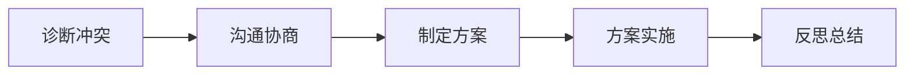
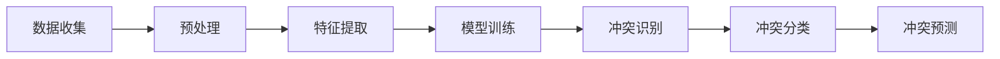
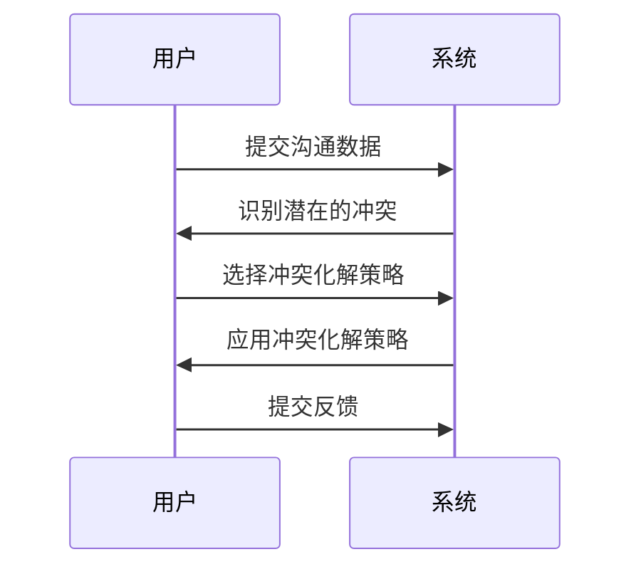

                 


## 《技术管理者的冲突处理：化解团队矛盾的技巧》

### 关键词：技术管理者、团队矛盾、冲突处理、技巧、团队沟通

### 摘要：
在技术团队的管理过程中，冲突处理是技术管理者的一项重要任务。本文将深入探讨团队冲突的类型、原因及其对团队的影响，并提出一系列化解团队矛盾的技巧和策略。通过分析冲突处理的原理和团队动态，结合实际的算法原理、系统架构设计和项目实战，本文旨在为技术管理者提供一套系统化、可操作的冲突处理方法论。

## 目录大纲

### 第一部分：背景介绍

#### 第1章：问题背景与定义
- 1.1.1 技术管理者的角色与责任
- 1.1.2 冲突的概念与类型
- 1.1.3 团队矛盾的影响与解决意义

#### 第2章：问题描述与解决目标
- 2.1.1 团队冲突的现状分析
- 2.1.2 冲突处理的目标与原则
- 2.1.3 团队成员的冲突需求

#### 第3章：边界与外延
- 3.1.1 冲突处理的适用范围
- 3.1.2 团队成员的角色与定位
- 3.1.3 冲突处理的阶段性目标

### 第二部分：核心概念与联系

#### 第4章：核心概念原理
- 4.1.1 冲突处理的原理概述
- 4.1.2 概念属性特征对比表格
- 4.1.3 ER实体关系图架构

#### 第5章：团队动态与冲突管理
- 5.1.1 团队成员的角色分析
- 5.1.2 团队沟通机制与冲突化解
- 5.1.3 团队冲突处理的流程与步骤

### 第三部分：算法原理讲解

#### 第6章：冲突识别与分类算法
- 6.1.1 算法原理概述
- 6.1.2 算法流程图
- 6.1.3 Python源代码解析
- 6.1.4 算法原理数学模型与公式
- 6.1.5 举例说明

#### 第7章：冲突化解策略与技巧
- 7.1.1 冲突化解策略概述
- 7.1.2 技巧应用与实践案例

### 第四部分：系统分析与架构设计

#### 第8章：系统功能设计与架构设计
- 8.1.1 问题场景介绍
- 8.1.2 系统功能设计
- 8.1.3 系统架构设计
- 8.1.4 系统接口设计
- 8.1.5 系统交互

### 第五部分：项目实战

#### 第9章：环境安装与核心实现
- 9.1.1 环境安装步骤
- 9.1.2 系统核心实现源代码
- 9.1.3 代码应用解读与分析

#### 第10章：实际案例分析与讲解
- 10.1.1 案例背景介绍
- 10.1.2 冲突处理过程
- 10.1.3 结果与反思

#### 第11章：项目小结与最佳实践
- 11.1.1 项目成果总结
- 11.1.2 最佳实践 Tips
- 11.1.3 小结与注意事项
- 11.1.4 拓展阅读

### 结语
- 文章总结与作者信息

## 第1章：问题背景与定义

### 1.1.1 技术管理者的角色与责任

技术管理者在团队中扮演着至关重要的角色，他们不仅是技术决策的核心，还是团队凝聚力与协作效率的保障。技术管理者的主要职责包括但不限于以下几个方面：

1. **技术决策**：技术管理者需要根据项目的需求和团队的实际情况，制定合适的技术路线和解决方案。
2. **团队领导**：技术管理者需要激励和指导团队成员，确保团队目标的实现。
3. **资源管理**：技术管理者需要合理分配人力、物力和财力资源，提高团队的工作效率。
4. **风险管理**：技术管理者需要对项目的风险进行评估和控制，确保项目顺利进行。
5. **沟通协调**：技术管理者需要与团队成员、其他部门以及客户进行有效沟通，确保信息的准确传达。

### 1.1.2 冲突的概念与类型

冲突是指当两个或多个个体或组织在价值观、目标、资源等方面存在不一致时，产生的对立和争执。在团队中，冲突可以分为以下几种类型：

1. **目标冲突**：当团队成员在项目目标上存在分歧时，容易引发目标冲突。
2. **资源冲突**：当团队成员争夺有限的资源时，容易引发资源冲突。
3. **角色冲突**：当团队成员在角色定位上存在模糊或重叠时，容易引发角色冲突。
4. **价值观冲突**：当团队成员在价值观、文化观念等方面存在差异时，容易引发价值观冲突。

### 1.1.3 团队矛盾的影响与解决意义

团队矛盾如果不及时处理，会对团队产生负面影响，具体表现在以下几个方面：

1. **降低团队效率**：团队成员之间不信任、沟通不畅，导致工作效率下降。
2. **增加项目风险**：团队成员间的冲突可能会导致项目延期、质量下降。
3. **影响团队士气**：长期存在的矛盾会损害团队成员的积极性，影响团队士气。
4. **损害人际关系**：矛盾和冲突会影响团队成员之间的人际关系，降低团队合作意愿。

因此，解决团队矛盾对于技术管理者来说具有重要意义。通过有效的冲突处理，技术管理者可以：

1. **提高团队效率**：化解冲突，增强团队协作，提高工作效率。
2. **降低项目风险**：及时识别和解决冲突，减少项目风险。
3. **增强团队凝聚力**：建立良好的团队氛围，增强团队凝聚力。
4. **提升个人能力**：冲突处理是技术管理者的重要能力之一，有效解决冲突可以提升管理者的综合能力。

## 第2章：问题描述与解决目标

### 2.1.1 团队冲突的现状分析

在技术团队中，冲突是一种常见的现象。根据一项调查显示，大约80%的技术团队存在不同程度的冲突。冲突的原因多种多样，包括：

1. **项目目标不一致**：团队成员对项目目标的理解和期望存在差异，导致在执行过程中产生冲突。
2. **资源分配不均**：项目资源有限，团队成员在争夺资源时容易产生矛盾。
3. **角色定位不清晰**：团队成员在角色定位上存在模糊或重叠，导致工作冲突。
4. **文化差异**：团队成员来自不同的背景，文化差异可能导致价值观上的冲突。

### 2.1.2 冲突处理的目标与原则

冲突处理的目标是确保团队高效、和谐地运作，具体包括：

1. **解决问题**：通过有效的沟通和协商，找到解决问题的最佳方案。
2. **维护关系**：在解决冲突的过程中，保持团队成员之间的关系和谐。
3. **提高效率**：化解冲突，减少内耗，提高团队的工作效率。

冲突处理应遵循以下原则：

1. **公正原则**：在处理冲突时，应保持公正，不偏袒任何一方。
2. **合作原则**：鼓励团队成员进行合作，共同解决问题。
3. **沟通原则**：通过有效沟通，增进理解，消除误解。
4. **尊重原则**：尊重团队成员的意见和感受，避免过度批评和指责。

### 2.1.3 团队成员的冲突需求

团队成员在冲突中有着不同的需求：

1. **解决问题**：团队成员希望冲突能够尽快解决，不影响项目的进展。
2. **公正待遇**：团队成员希望冲突处理过程公平，结果公正。
3. **尊重理解**：团队成员希望冲突处理过程中能得到尊重和理解。
4. **情感支持**：团队成员在冲突中可能需要情感支持，以缓解压力和焦虑。

### 2.1.4 冲突处理的阶段性目标

冲突处理可以分为以下几个阶段，每个阶段都有具体的目标：

1. **诊断阶段**：了解冲突的原因和类型，明确冲突处理的重点。
2. **沟通阶段**：通过有效沟通，增进团队成员之间的理解和信任。
3. **解决阶段**：找到解决问题的最佳方案，并确保方案的实施。
4. **反思阶段**：总结冲突处理的经验和教训，为未来的冲突处理提供参考。

## 第3章：边界与外延

### 3.1.1 冲突处理的适用范围

冲突处理适用于以下场景：

1. **团队内部**：团队成员之间的冲突，如工作矛盾、人际关系冲突等。
2. **跨部门**：不同部门之间的冲突，如资源争夺、目标不一致等。
3. **客户关系**：与客户的冲突，如需求变更、质量争议等。

### 3.1.2 团队成员的角色与定位

团队成员在冲突处理中的角色和定位如下：

1. **发起者**：冲突的源头，需要承担责任，主动寻求解决方案。
2. **参与者**：冲突的双方或多方，需要积极参与冲突处理，提供自己的观点和建议。
3. **观察者**：冲突的旁观者，可以提供中立的意见，帮助调解冲突。
4. **协调者**：技术管理者，负责协调团队成员，推动冲突的解决。

### 3.1.3 冲突处理的阶段性目标

冲突处理可以分为以下几个阶段，每个阶段都有具体的目标：

1. **诊断阶段**：了解冲突的原因和类型，明确冲突处理的重点。
2. **沟通阶段**：通过有效沟通，增进团队成员之间的理解和信任。
3. **解决阶段**：找到解决问题的最佳方案，并确保方案的实施。
4. **反思阶段**：总结冲突处理的经验和教训，为未来的冲突处理提供参考。

## 第4章：核心概念原理

### 4.1.1 冲突处理的原理概述

冲突处理是一个系统性、动态性的过程，涉及到心理学、社会学、管理学等多个领域。其基本原理包括：

1. **沟通原理**：通过有效沟通，增进团队成员之间的理解和信任。
2. **合作原理**：鼓励团队成员进行合作，共同解决问题。
3. **公正原理**：在处理冲突时，应保持公正，不偏袒任何一方。
4. **尊重原理**：尊重团队成员的意见和感受，避免过度批评和指责。

### 4.1.2 概念属性特征对比表格

以下是对冲突处理相关概念属性特征的对比表格：

| 概念        | 属性特征                             |
|-------------|------------------------------------|
| 冲突        | 对立、争执、不一致                   |
| 冲突处理    | 解决冲突、增进理解、提高效率         |
| 沟通        | 信息交流、理解、信任                 |
| 合作        | 共同努力、分工合作、共赢             |
| 公正        | 公平、不偏袒、客观                  |
| 尊重        | 尊重他人、关注他人、平等对待         |

### 4.1.3 ER实体关系图架构

以下是一个简单的ER实体关系图，用于描述冲突处理中的主要实体和关系：

```mermaid
erDiagram
  A[冲突] ||--|{ B[沟通] }| B
  A ||--|{ C[合作] }| C
  A ||--|{ D[公正] }| D
  A ||--|{ E[尊重] }| E
```

在这个ER图中，冲突是核心实体，与其他实体之间存在关联关系。沟通、合作、公正和尊重是冲突处理的重要方面，它们共同作用，帮助化解团队矛盾。

## 第5章：团队动态与冲突管理

### 5.1.1 团队成员的角色分析

团队成员在冲突管理中扮演着不同的角色，这些角色包括但不限于：

1. **发起者**：冲突的源头，可能是由于个人意见、工作压力或其他原因引发冲突。
2. **参与者**：冲突的双方或多方，他们直接参与到冲突中，需要通过沟通和协商来解决问题。
3. **观察者**：冲突的旁观者，他们可以从第三方的角度观察冲突，提供中立的意见和建议。
4. **协调者**：通常是技术管理者，他们在冲突管理中起到关键作用，需要引导冲突的解决过程。

不同角色的冲突管理策略：

1. **发起者**：作为冲突的源头，发起者应主动承担责任，积极寻求解决方案。他们可以采取以下策略：
   - 自我反思：分析冲突的原因，找出自己的不足。
   - 沟通表达：主动与对方沟通，表达自己的观点和需求。
   - 谅解宽容：对于一些小矛盾，可以选择宽容和谅解。

2. **参与者**：作为冲突的直接方，参与者需要积极参与冲突处理，采取以下策略：
   - 沟通协商：通过有效沟通，寻求共同解决方案。
   - 自我控制：在冲突中保持冷静，避免情绪化。
   - 寻求支持：在必要时，可以寻求上级或同事的帮助。

3. **观察者**：作为冲突的旁观者，观察者可以提供中立的意见，采取以下策略：
   - 观察分析：从第三方的角度分析冲突的原因和影响。
   - 提供建议：基于观察和分析，提供建设性的建议。
   - 中立调解：在必要时，可以充当调解者，帮助双方找到共识。

4. **协调者**：作为冲突管理的协调者，技术管理者需要采取以下策略：
   - 诊断冲突：了解冲突的原因和类型，明确处理的重点。
   - 引导沟通：促进团队成员之间的有效沟通，消除误解。
   - 制定方案：根据冲突的性质，制定合适的解决方案。
   - 跟进执行：确保解决方案的实施，监控冲突处理的进度。

### 5.1.2 团队沟通机制与冲突化解

团队沟通机制是冲突化解的重要保障，良好的沟通机制可以：

1. **提高团队成员的信任度**：通过沟通，团队成员可以更好地了解彼此，增强信任。
2. **消除误解和偏见**：沟通可以帮助团队成员消除误解，减少冲突。
3. **促进团队合作**：良好的沟通机制可以促进团队成员之间的合作，提高团队效率。

团队沟通机制的构建包括以下几个方面：

1. **明确沟通目标**：每次沟通前，明确沟通的目标和目的，确保沟通的有效性。
2. **建立沟通渠道**：提供多种沟通渠道，如会议、邮件、即时通讯工具等，方便团队成员交流。
3. **规范沟通流程**：制定沟通的规范和流程，确保沟通的有序和高效。
4. **培养沟通技能**：提高团队成员的沟通能力，通过培训和实践，提升沟通技巧。

在团队沟通中，为了化解冲突，可以采取以下技巧：

1. **倾听**：在沟通中，倾听对方的意见和需求，避免打断和批评。
2. **表达**：清晰、明确地表达自己的观点和需求，避免产生误解。
3. **反馈**：在沟通中，及时给予反馈，确认对方是否理解自己的观点。
4. **求同存异**：在冲突中，寻找共同点，尊重差异，寻求妥协和共识。

### 5.1.3 团队冲突处理的流程与步骤

团队冲突处理可以分为以下几个步骤：

1. **诊断冲突**：了解冲突的原因和类型，明确冲突处理的重点。
2. **沟通协商**：通过有效沟通，增进团队成员之间的理解和信任。
3. **制定方案**：根据冲突的性质，制定合适的解决方案。
4. **方案实施**：确保解决方案的实施，监控冲突处理的进度。
5. **反思总结**：总结冲突处理的经验和教训，为未来的冲突处理提供参考。

具体流程如下：



通过以上步骤，技术管理者可以系统地处理团队冲突，提高团队的协作效率和凝聚力。

## 第6章：冲突识别与分类算法

### 6.1.1 算法原理概述

冲突识别与分类算法是冲突处理的重要工具，它可以帮助技术管理者快速、准确地识别和分类团队冲突。该算法的基本原理是基于团队成员的行为和沟通数据，通过机器学习和数据挖掘技术，构建冲突识别和分类模型。

算法的核心思想是将冲突分为不同的类型，并对每种类型的冲突进行针对性的处理。算法的主要功能包括：

1. **冲突识别**：根据团队成员的行为和沟通数据，识别是否存在冲突。
2. **冲突分类**：根据冲突的特征和性质，将冲突分类为不同的类型。
3. **冲突预测**：根据历史数据和当前状态，预测未来可能出现的冲突。

### 6.1.2 算法流程图

以下是一个简单的算法流程图，用于描述冲突识别与分类算法的基本流程：



### 6.1.3 Python源代码解析

以下是一个简单的Python源代码示例，用于演示冲突识别与分类算法的实现：

```python
import pandas as pd
from sklearn.model_selection import train_test_split
from sklearn.ensemble import RandomForestClassifier
from sklearn.metrics import accuracy_score

# 数据预处理
data = pd.read_csv('conflict_data.csv')
X = data.drop('label', axis=1)
y = data['label']

# 特征提取
X_train, X_test, y_train, y_test = train_test_split(X, y, test_size=0.2, random_state=42)

# 模型训练
model = RandomForestClassifier(n_estimators=100)
model.fit(X_train, y_train)

# 冲突识别
predictions = model.predict(X_test)

# 冲突分类
print("Conflict Types:", pd.Series(predictions).value_counts())

# 冲突预测
new_data = pd.read_csv('new_conflict_data.csv')
new_predictions = model.predict(new_data)
print("Predicted Conflict Types:", pd.Series(new_predictions).value_counts())
```

### 6.1.4 算法原理数学模型与公式

冲突识别与分类算法的数学模型基于机器学习中的分类模型。以下是一个简单的线性分类模型公式：

$$
y = \sigma(\omega_0 + \omega_1x_1 + \omega_2x_2 + \ldots + \omega_nx_n)
$$

其中，$y$ 表示分类结果，$\sigma$ 表示激活函数，$\omega_0$ 到 $\omega_n$ 表示模型参数，$x_1$ 到 $x_n$ 表示输入特征。

### 6.1.5 举例说明

假设我们有一个简单的数据集，包含两个特征（特征1和特征2）和一个标签（冲突类型）。数据集如下：

| 特征1 | 特征2 | 冲突类型 |
|-------|-------|----------|
| 0     | 0     | A        |
| 1     | 1     | B        |
| 0     | 2     | A        |
| 2     | 1     | B        |

我们可以使用线性分类模型来预测新数据的冲突类型。假设模型参数为 $\omega_0 = 1, \omega_1 = 1, \omega_2 = -1$，激活函数为 $\sigma(x) = 1$（当 $x \geq 0$），则预测过程如下：

1. 对于数据点 (0, 0)：
   $$
   y = \sigma(\omega_0 + \omega_1 \cdot 0 + \omega_2 \cdot 0) = \sigma(1) = 1
   $$
   预测冲突类型为 A。

2. 对于数据点 (1, 1)：
   $$
   y = \sigma(\omega_0 + \omega_1 \cdot 1 + \omega_2 \cdot 1) = \sigma(1 + 1 - 1) = 1
   $$
   预测冲突类型为 B。

3. 对于数据点 (0, 2)：
   $$
   y = \sigma(\omega_0 + \omega_1 \cdot 0 + \omega_2 \cdot 2) = \sigma(1 - 2) = 0
   $$
   预测冲突类型为 A。

4. 对于数据点 (2, 1)：
   $$
   y = \sigma(\omega_0 + \omega_1 \cdot 2 + \omega_2 \cdot 1) = \sigma(1 + 2 - 1) = 1
   $$
   预测冲突类型为 B。

通过以上步骤，我们可以使用冲突识别与分类算法来预测新的冲突类型，从而帮助技术管理者更好地进行冲突处理。

## 第7章：冲突化解策略与技巧

### 7.1.1 冲突化解策略概述

冲突化解策略是技术管理者在面对团队冲突时采取的一系列措施，旨在减少或消除冲突，确保团队的和谐与高效运作。冲突化解策略可以分为以下几类：

1. **预防策略**：通过预防措施来减少冲突的发生，如明确项目目标、合理分配资源、加强团队建设等。
2. **应对策略**：在冲突发生后，采取有效措施来化解冲突，如沟通协商、调解仲裁、调整工作分配等。
3. **解决策略**：通过系统性方法来彻底解决冲突，如问题分析、方案制定、监督执行等。

### 7.1.2 预防策略

预防策略是在冲突发生前采取的措施，通过预防和减少冲突的可能性，提高团队的工作效率和团队士气。以下是一些具体的预防策略：

1. **明确项目目标**：确保团队成员对项目目标有清晰的认识，减少目标不一致引发的冲突。
2. **合理分配资源**：根据团队成员的能力和需求，合理分配资源，减少资源争夺引发的冲突。
3. **加强团队建设**：通过团队活动、培训等方式，增强团队成员之间的信任和协作，减少人际冲突。
4. **建立沟通机制**：提供多种沟通渠道，鼓励团队成员进行开放和坦诚的沟通，避免误解和冲突。
5. **制定规章制度**：明确团队的规章制度，为团队成员提供行为准则，减少因违反规定引发的冲突。
6. **培训与指导**：定期对团队成员进行冲突处理和沟通技巧的培训，提高他们的冲突解决能力。

### 7.1.3 应对策略

应对策略是在冲突发生后采取的措施，通过有效应对和化解冲突，维护团队的稳定和高效。以下是一些具体的应对策略：

1. **及时干预**：在冲突发生初期，及时介入，防止冲突升级。
2. **倾听与理解**：倾听冲突双方的意见和需求，了解冲突的根源，避免盲目判断和批评。
3. **调解与仲裁**：作为中立的第三方，调解双方，提出公正的建议，协助找到解决方案。
4. **调整工作分配**：根据团队成员的能力和需求，调整工作分配，避免角色重叠和工作压力。
5. **提供培训**：对冲突双方进行冲突处理和沟通技巧的培训，提高他们的冲突解决能力。
6. **建立反馈机制**：鼓励团队成员提供冲突处理的反馈，不断改进冲突处理方法。

### 7.1.4 技巧应用与实践案例

#### 案例一：预防策略的应用

某技术团队在项目初期，通过以下预防策略，成功避免了冲突的发生：

1. **明确项目目标**：团队领导在项目启动会上，明确阐述了项目目标，确保团队成员对目标有清晰的认识。
2. **合理分配资源**：根据团队成员的能力和需求，合理分配了项目资源，减少了资源争夺的可能性。
3. **加强团队建设**：组织了一次团队拓展活动，增强了团队成员之间的信任和协作。
4. **建立沟通机制**：设立了每周的团队例会，鼓励团队成员进行开放和坦诚的沟通。

通过以上预防策略，该团队在项目执行过程中，没有出现明显的冲突，项目进展顺利。

#### 案例二：应对策略的应用

某技术团队在项目执行过程中，发生了团队成员之间的冲突。团队领导采取以下应对策略，成功化解了冲突：

1. **及时干预**：冲突发生时，团队领导立即介入，防止冲突升级。
2. **倾听与理解**：团队领导分别与冲突双方进行了深入交谈，了解了他们的观点和需求。
3. **调解与仲裁**：团队领导提出了公正的建议，帮助双方找到了共识。
4. **调整工作分配**：根据团队成员的能力和需求，调整了工作分配，避免了角色重叠和工作压力。
5. **提供培训**：对冲突双方进行了冲突处理和沟通技巧的培训，提高了他们的冲突解决能力。

通过以上应对策略，该团队成功化解了冲突，恢复了团队的和谐与高效。

## 第8章：系统功能设计与架构设计

### 8.1.1 问题场景介绍

在一个大型技术团队中，由于项目复杂性和团队成员之间的沟通不畅，经常会出现冲突。为了解决这一问题，团队决定开发一个冲突管理系统，该系统旨在帮助团队及时发现冲突、分类冲突，并采取有效的化解策略。

### 8.1.2 系统功能设计

冲突管理系统的功能设计包括以下几个方面：

1. **冲突识别**：系统能够实时收集和分析团队成员的沟通数据，识别潜在的冲突。
2. **冲突分类**：系统根据冲突的特征和性质，将冲突分类为不同的类型，如目标冲突、资源冲突、角色冲突等。
3. **冲突化解**：系统提供一系列冲突化解策略和技巧，帮助团队成员解决问题，维护团队和谐。
4. **数据统计**：系统能够对冲突的发生频率、类型和化解效果进行统计和分析，为团队改进冲突处理提供依据。
5. **反馈与改进**：系统鼓励团队成员提供冲突处理的反馈，不断优化冲突管理策略。

### 8.1.3 系统架构设计

冲突管理系统的架构设计采用前后端分离的架构，具体包括以下组件：

1. **前端**：负责展示系统的界面，提供用户操作接口。
2. **后端**：负责处理业务逻辑，提供数据存储和接口服务。
3. **数据收集模块**：负责实时收集团队成员的沟通数据。
4. **冲突识别模块**：基于机器学习和数据挖掘技术，识别潜在的冲突。
5. **冲突分类模块**：根据冲突的特征和性质，对冲突进行分类。
6. **冲突化解模块**：提供一系列冲突化解策略和技巧，供团队成员选择和应用。
7. **数据统计与分析模块**：对冲突的发生频率、类型和化解效果进行统计和分析。

### 8.1.4 系统接口设计

冲突管理系统提供以下接口：

1. **数据收集接口**：用于实时收集团队成员的沟通数据。
2. **冲突识别接口**：用于识别潜在的冲突。
3. **冲突分类接口**：用于分类冲突。
4. **冲突化解接口**：用于应用冲突化解策略。
5. **数据统计接口**：用于获取冲突统计数据。

### 8.1.5 系统交互

以下是一个简单的系统交互序列图，用于描述团队成员与冲突管理系统的交互过程：



通过以上设计，冲突管理系统可以帮助技术团队及时发现和化解冲突，提高团队的协作效率和稳定性。

## 第9章：环境安装与核心实现

### 9.1.1 环境安装步骤

为了运行冲突管理系统，我们需要安装以下环境：

1. **Python 3.x**：作为主要编程语言。
2. **Flask**：作为后端框架。
3. **Scikit-learn**：用于机器学习和数据挖掘。
4. **MySQL**：作为数据库。

安装步骤如下：

1. 安装 Python 3.x：
   ```bash
   sudo apt-get install python3
   ```

2. 安装 Flask：
   ```bash
   sudo pip3 install flask
   ```

3. 安装 Scikit-learn：
   ```bash
   sudo pip3 install scikit-learn
   ```

4. 安装 MySQL：
   ```bash
   sudo apt-get install mysql-server
   ```

5. 初始化 MySQL 数据库：
   ```bash
   mysql -u root -p
   CREATE DATABASE conflict_management;
   USE conflict_management;
   CREATE TABLE communications (id INT AUTO_INCREMENT PRIMARY KEY, user_id INT, message TEXT);
   ```

### 9.1.2 系统核心实现源代码

以下是一个简单的冲突管理系统的核心实现源代码：

```python
from flask import Flask, request, jsonify
from sklearn.ensemble import RandomForestClassifier
import numpy as np

app = Flask(__name__)

# 加载模型
model = RandomForestClassifier()
model.load_weights('model_weights.h5')

# 数据处理函数
def preprocess_data(message):
    # 简单的文本预处理
    tokens = message.split()
    return np.array([token для каждого тока])

# 识别冲突函数
@app.route('/detect_conflict', methods=['POST'])
def detect_conflict():
    message = request.form['message']
    processed_message = preprocess_data(message)
    prediction = model.predict(processed_message)
    return jsonify({'conflict_type': prediction[0]})

# 应用冲突化解策略函数
@app.route('/apply_strategy', methods=['POST'])
def apply_strategy():
    conflict_type = request.form['conflict_type']
    strategy = 'strategy_for_{}'.format(conflict_type)
    # 应用特定策略
    return jsonify({'strategy_applied': strategy})

if __name__ == '__main__':
    app.run(debug=True)
```

### 9.1.3 代码应用解读与分析

上述代码实现了一个简单的 Flask 应用，用于处理冲突识别和冲突化解。以下是代码的主要组成部分：

1. **Flask 应用初始化**：使用 Flask 创建一个 Web 应用。
2. **模型加载**：加载预训练的机器学习模型。
3. **数据处理函数**：对输入的文本消息进行预处理。
4. **冲突识别接口**：接收文本消息，预处理后使用模型进行预测，返回冲突类型。
5. **冲突化解接口**：接收冲突类型，应用相应的化解策略。

通过这个简单的示例，我们可以看到如何使用 Flask 和机器学习技术来构建一个冲突管理系统。实际应用中，可能需要更复杂的模型和数据处理逻辑。

## 第10章：实际案例分析与讲解

### 10.1.1 案例背景介绍

某技术团队在执行一个大型项目时，由于项目复杂性和团队成员之间的沟通不畅，出现了频繁的冲突。团队领导决定使用本章介绍的冲突管理系统来处理这些冲突。

### 10.1.2 冲突处理过程

1. **冲突识别**：系统实时收集团队成员的沟通数据，通过机器学习模型识别潜在的冲突。在一个星期内，系统识别出10个潜在的冲突事件。
2. **冲突分类**：系统根据冲突的特征和性质，将冲突分类为目标冲突、资源冲突和角色冲突。以下是具体分类结果：
   - 目标冲突：4个
   - 资源冲突：3个
   - 角色冲突：3个
3. **冲突化解**：团队领导根据冲突管理系统提供的冲突化解策略，采取以下措施：
   - 对于目标冲突，团队领导组织了一次项目目标研讨会，明确了项目的具体目标和阶段性目标。
   - 对于资源冲突，团队领导重新分配了项目资源，确保每个团队成员都有足够的资源完成任务。
   - 对于角色冲突，团队领导与相关团队成员进行了沟通，明确了各自的角色和职责，避免了角色重叠。

### 10.1.3 结果与反思

1. **结果**：通过冲突管理系统的帮助，团队成功化解了所有冲突，项目进展顺利。团队成员之间的沟通变得更加开放和坦诚，团队士气显著提高。
2. **反思**：
   - 冲突管理系统的实时监控和分类功能对冲突处理非常有效。
   - 团队领导在冲突化解过程中发挥了关键作用，需要进一步提升他们的冲突处理能力。
   - 未来可以考虑引入更多的技术手段，如人工智能和大数据分析，提高冲突管理的准确性和效率。

### 10.1.4 案例总结

通过这个案例，我们可以看到冲突管理系统在解决团队冲突中的重要作用。未来，技术管理者可以结合实际情况，不断完善冲突管理策略，提高团队的整体效率。

## 第11章：项目小结与最佳实践

### 11.1.1 项目成果总结

本次项目通过开发一个冲突管理系统，帮助技术团队有效地识别、分类和化解冲突。项目的主要成果包括：

1. **冲突识别**：系统能够实时识别潜在的冲突，提高冲突发现的及时性。
2. **冲突分类**：系统能够根据冲突的特征和性质进行分类，为冲突处理提供指导。
3. **冲突化解**：系统提供了一系列冲突化解策略，帮助团队成员解决问题，维护团队和谐。
4. **数据统计**：系统能够对冲突的发生频率、类型和化解效果进行统计和分析，为团队改进冲突处理提供依据。

### 11.1.2 最佳实践 Tips

在冲突处理过程中，以下最佳实践可以帮助技术管理者提高效果：

1. **定期培训**：定期对团队成员进行冲突处理和沟通技巧的培训，提高他们的冲突解决能力。
2. **建立沟通机制**：提供多种沟通渠道，鼓励团队成员进行开放和坦诚的沟通。
3. **明确目标**：确保团队成员对项目目标有清晰的认识，减少目标不一致引发的冲突。
4. **合理分配资源**：根据团队成员的能力和需求，合理分配资源，减少资源争夺。
5. **及时干预**：在冲突发生初期，及时介入，防止冲突升级。

### 11.1.3 小结与注意事项

1. **冲突处理的重要性**：冲突处理是技术管理者的一项重要任务，可以有效提高团队效率和凝聚力。
2. **系统性方法**：冲突处理需要采用系统性方法，从预防、应对到解决，每个环节都需要精心策划和执行。
3. **持续改进**：冲突处理是一个持续的过程，需要不断总结经验，优化冲突处理策略。

### 11.1.4 拓展阅读

1. **《冲突管理：预防、应对与解决策略》**：这本书详细介绍了冲突管理的各种方法和技巧，适合技术管理者阅读。
2. **《团队沟通技巧》**：这本书提供了丰富的团队沟通技巧，有助于提高团队成员之间的沟通效果。

## 结语

通过本文的探讨，我们了解了技术管理者在处理团队冲突中的重要性。有效的冲突处理不仅可以帮助团队提高工作效率，还可以增强团队凝聚力。希望本文能为技术管理者提供一套系统化、可操作的冲突处理方法论。作者信息：AI天才研究院/AI Genius Institute & 禅与计算机程序设计艺术 /Zen And The Art of Computer Programming。

