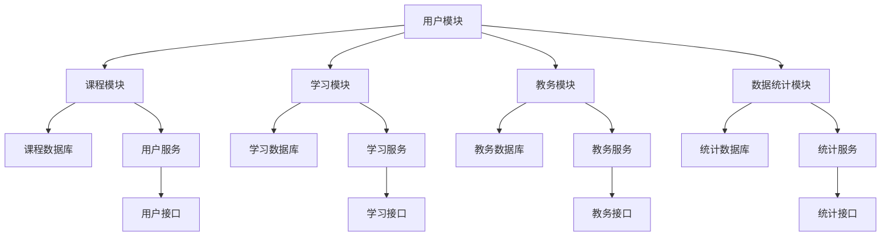
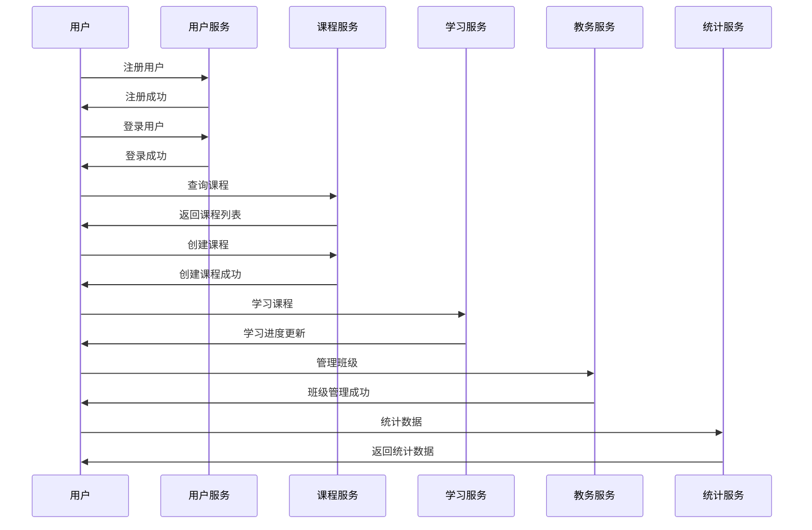

                 

### 技术管理者的决策模型：在复杂环境中做出选择

#### 关键词：技术管理者、决策模型、复杂环境、算法原理、系统架构、项目实战

> 摘要：本文旨在探讨技术管理者在复杂环境中做出有效决策的方法和策略。通过深入分析决策模型的核心概念、算法原理、系统架构以及项目实战，为技术管理者提供一套系统化的决策框架，帮助他们更好地应对挑战，提升管理效能。

----------------------------------------------------------------

#### 第一部分：背景介绍

##### 第1章：问题背景与决策模型概述

**1.1 问题背景**

在当今快速变化和高度竞争的科技行业中，技术管理者面临着诸多挑战。从项目规划、资源分配到技术选型、团队管理，每一个决策都可能影响到项目的成功与否。尤其是当企业面临复杂的市场环境和技术变革时，技术管理者如何做出明智的决策，成为了至关重要的问题。

**1.1.1 技术管理者面临的挑战**

- **技术复杂性**：技术的快速迭代和升级使得管理者需要不断更新知识体系，以适应新的技术趋势。
- **资源限制**：有限的预算和人力资源往往需要分配到最关键的项目和领域。
- **市场不确定性**：市场需求的变化和竞争态势的波动增加了决策的难度。
- **团队协调**：如何在多元文化和多专业团队中实现高效协作，是技术管理者的一大挑战。

**1.1.2 复杂环境中的决策需求**

在复杂环境中，技术管理者需要具备以下决策能力：

- **前瞻性**：能够预见潜在问题和市场趋势，提前做出预防性决策。
- **适应性**：能够灵活调整策略，应对不断变化的环境。
- **系统性**：能够从全局视角出发，综合考虑各个因素，做出最优决策。

**1.1.3 决策模型的重要性**

决策模型是一种系统化的方法，用于分析问题、评估方案和选择最佳行动。它可以帮助技术管理者：

- **提高决策效率**：通过结构化和标准化的流程，减少决策过程中的时间和资源浪费。
- **降低风险**：通过风险评估和预案制定，降低决策带来的不确定性。
- **增强团队协作**：通过共同参与决策过程，增强团队成员的归属感和责任感。

**1.2 决策模型的核心概念**

**1.2.1 决策模型的定义与作用**

决策模型是一种基于逻辑和数学原理的决策工具，用于指导技术管理者在面对复杂问题时做出最优选择。它通常包括以下几个关键组成部分：

- **决策者**：制定决策的人或组织。
- **目标**：决策者希望实现的结果。
- **方案**：可能的行动选择。
- **结果**：执行方案后可能产生的结果。
- **评价标准**：用于评估不同方案优劣的标准。

**1.2.2 决策模型的类型与分类**

根据决策问题性质和解决方法的不同，决策模型可以分为以下几类：

- **确定性决策模型**：在所有输入参数已知的情况下，通过数学计算得到最优解。
- **风险型决策模型**：在部分输入参数不确定的情况下，通过概率分析选择最优方案。
- **不确定性决策模型**：在所有输入参数不确定的情况下，通过模拟和优化选择最优方案。

**1.2.3 决策模型的应用场景**

决策模型在技术管理中有着广泛的应用场景，包括但不限于：

- **项目规划**：用于评估项目进度、资源和风险，制定最佳项目计划。
- **资源分配**：用于优化人力资源、财务资源和技术资源的配置。
- **技术选型**：用于分析不同技术的优缺点，选择最适合企业需求的方案。
- **团队管理**：用于评估团队成员的能力和潜力，制定最佳团队结构和发展策略。

**1.3 决策模型的发展历程**

决策模型的发展经历了从传统到现代的演变过程。以下是几个重要的里程碑：

- **20世纪50年代**：线性规划、整数规划和动态规划等确定性决策模型的诞生，标志着决策模型研究的开始。
- **20世纪60年代**：博弈论、排队论、存储论等风险型决策模型的发展，丰富了决策模型的理论体系。
- **20世纪70年代**：人工智能和计算机科学的兴起，推动了决策模型在复杂问题解决中的应用。
- **20世纪80年代至今**：随着大数据和机器学习技术的发展，决策模型进入了智能化和自动化时代，实现了更高的决策效率和准确性。

**1.3.1 传统决策模型概述**

传统决策模型主要包括以下几种：

- **线性规划**：在资源有限的情况下，寻求最大化或最小化目标函数的解决方案。
- **整数规划**：在决策问题中包含整数变量的线性规划问题。
- **动态规划**：将复杂问题分解为多个子问题，通过递归关系求解最优解。

**1.3.2 现代决策模型的演进**

现代决策模型在传统模型的基础上，引入了更多不确定性和动态性，包括：

- **随机规划**：考虑输入参数的随机性，通过概率分布求解最优解。
- **多目标规划**：在多个目标之间存在冲突时，通过权衡和优化求解综合最优解。
- **智能决策模型**：利用机器学习、深度学习等人工智能技术，实现决策过程的自动化和智能化。

**1.3.3 决策模型的新趋势与未来展望**

未来决策模型的发展趋势将体现在以下几个方面：

- **数据驱动**：更加依赖大数据和人工智能技术，提高决策的准确性和效率。
- **实时决策**：实现实时数据分析和决策，快速响应环境变化。
- **人机协作**：融合人类智慧和机器智能，实现最优决策。
- **可持续发展**：考虑环境和社会因素，实现绿色决策。

##### 第2章：决策模型的要素与属性

**2.1 决策模型的要素**

决策模型通常由以下几个要素构成：

**2.1.1 决策者**

决策者是指制定决策的人或组织，他们通常具备以下特点：

- **明确的目标**：决策者需要清楚自己的目标是什么，以便在决策过程中始终围绕目标进行。
- **理性的判断**：决策者需要基于事实和数据做出理性判断，避免情感和主观偏见的影响。
- **决策能力**：决策者需要具备较强的决策能力，包括分析问题、评估方案和选择最佳行动的能力。

**2.1.2 目标与目标函数**

目标是指决策者希望实现的结果，目标函数则是衡量目标实现程度的量化指标。决策模型需要明确以下内容：

- **目标类型**：目标可以是单一的，也可以是多重的，需要根据实际情况进行权衡。
- **目标函数**：目标函数可以是线性的，也可以是非线性的，需要根据目标类型选择合适的函数形式。

**2.1.3 状态与状态空间**

状态是指决策过程中可能出现的所有情况，状态空间则是所有可能状态的集合。决策模型需要考虑以下内容：

- **状态数量**：状态数量通常会影响决策模型的复杂度和计算效率。
- **状态关系**：状态之间的关系会影响决策的决策路径和结果。

**2.1.4 行动与行动空间**

行动是指决策者在特定状态下可以选择的行动，行动空间则是所有可能行动的集合。决策模型需要考虑以下内容：

- **行动类型**：行动可以是单次的，也可以是连续的，需要根据实际情况进行选择。
- **行动效果**：行动效果是指行动对状态的影响，需要根据行动类型进行评估。

**2.2 决策模型的属性**

决策模型的属性是指决策模型在决策过程中的表现和特点，主要包括以下内容：

**2.2.1 决策模型的准确性**

决策模型的准确性是指模型在决策过程中预测结果的准确性。一个准确的决策模型需要具备以下特点：

- **数据驱动**：决策模型需要基于大量历史数据进行分析和预测，以提高预测准确性。
- **模型训练**：决策模型需要经过多次训练和优化，以提高模型的准确性和可靠性。

**2.2.2 决策模型的效率**

决策模型的效率是指模型在决策过程中的计算速度和资源消耗。一个高效的决策模型需要具备以下特点：

- **算法优化**：决策模型需要采用高效的算法和计算方法，以提高计算速度和资源利用率。
- **分布式计算**：对于大规模数据和高并发场景，决策模型需要支持分布式计算和并行处理。

**2.2.3 决策模型的鲁棒性**

决策模型的鲁棒性是指模型在面临不确定性和异常情况时的稳定性。一个鲁棒的决策模型需要具备以下特点：

- **数据清洗**：决策模型需要对数据进行清洗和预处理，以减少噪声和异常值的影响。
- **模型校验**：决策模型需要定期进行模型校验和更新，以保持模型的鲁棒性和准确性。

**2.2.4 决策模型的适用范围**

决策模型的适用范围是指模型在不同场景下的适应能力和效果。一个适用范围广泛的决策模型需要具备以下特点：

- **模块化设计**：决策模型需要采用模块化设计，以适应不同场景的需求。
- **可扩展性**：决策模型需要具备良好的可扩展性，以支持未来业务的发展。

**2.3 决策模型之间的关系**

决策模型之间存在着密切的联系和相互影响，主要表现在以下几个方面：

**2.3.1 决策模型与博弈论的关系**

博弈论是一种研究决策者之间竞争和合作行为的数学工具，它与决策模型的关系主要体现在以下方面：

- **博弈模型**：决策模型可以借鉴博弈论中的模型，如纳什均衡、协同博弈等，以解决多决策者之间的竞争和合作问题。
- **决策优化**：博弈论中的策略选择和博弈结果可以为决策模型提供优化方向和参考依据。

**2.3.2 决策模型与运筹学的关系**

运筹学是一种研究决策过程和优化策略的数学工具，它与决策模型的关系主要体现在以下方面：

- **优化方法**：决策模型可以采用运筹学中的优化方法，如线性规划、非线性规划等，以求解复杂决策问题。
- **模型构建**：决策模型可以借鉴运筹学中的模型构建方法，如网络优化、多目标优化等，以提高模型的科学性和有效性。

**2.3.3 决策模型与机器学习的关系**

机器学习是一种基于数据驱动的方法，用于发现数据中的规律和模式，它与决策模型的关系主要体现在以下方面：

- **数据驱动**：决策模型可以采用机器学习的方法，如决策树、支持向量机等，以实现数据驱动的决策过程。
- **模型优化**：机器学习的方法可以用于优化决策模型，如模型训练、参数调优等，以提高决策模型的准确性和效率。

#### 第三部分：算法原理讲解

##### 第3章：常见决策模型算法原理

**3.1 决策树算法**

决策树算法是一种常用的分类和回归算法，它通过构建一棵树形结构，对数据进行分类或回归预测。以下是决策树算法的基本概念和原理。

**3.1.1 决策树的基本概念**

决策树由内部节点、分支和叶子节点组成，其中：

- **内部节点**：表示某个特征或属性的测试。
- **分支**：表示测试结果为真的分支和测试结果为假的分支。
- **叶子节点**：表示分类结果或回归值。

**3.1.2 决策树的构建过程**

决策树的构建过程可以分为以下几个步骤：

1. **选择最佳分裂特征**：通过计算信息增益、基尼指数等指标，选择当前节点下具有最大信息增益或最小基尼指数的特征作为分裂特征。
2. **分裂数据**：根据所选特征将数据集划分为若干子集。
3. **递归构建子树**：对每个子集递归执行上述步骤，直到满足停止条件，如节点深度达到最大值、节点包含的样本数过少等。
4. **生成决策树**：将所有节点连接起来，形成一个完整的决策树。

**3.1.3 决策树的剪枝方法**

决策树剪枝是一种防止过拟合的技术，通过剪掉决策树中不必要的分支，减小模型的复杂度。常见的剪枝方法包括：

1. **预剪枝**：在构建决策树的过程中，提前停止生长不必要的分支，如信息增益小于阈值、节点包含的样本数过少等。
2. **后剪枝**：在构建完整的决策树后，从底部向上剪掉贡献较小的分支，以提高模型的泛化能力。

**3.2 贝叶斯网络算法**

贝叶斯网络是一种基于概率论的图形模型，用于表示变量之间的依赖关系。以下是贝叶斯网络的基本概念和原理。

**3.2.1 贝叶斯网络的基本概念**

贝叶斯网络由一个有向无环图（DAG）和一组概率分布组成，其中：

- **有向无环图**：表示变量之间的因果关系。
- **概率分布**：表示每个变量的条件概率分布。

**3.2.2 贝叶斯网络的构建**

贝叶斯网络的构建过程可以分为以下几个步骤：

1. **构建因果图**：根据领域知识和专家意见，构建表示变量之间因果关系的有向无环图。
2. **确定概率分布**：根据领域知识和数据，确定每个变量的条件概率分布。
3. **参数估计**：利用贝叶斯推断方法，估计网络参数的值。

**3.2.3 贝叶斯网络的推理算法**

贝叶斯网络的推理算法是一种基于概率计算的方法，用于计算变量之间的条件概率分布。主要的推理算法包括：

1. **条件概率表（CPT）**：通过计算每个变量的条件概率表，得到变量之间的条件概率分布。
2. **信念传播算法**：通过在网络上传播概率信息，计算每个变量的后验概率分布。

**3.3 马尔可夫决策过程**

马尔可夫决策过程（MDP）是一种基于概率论和动态规划的决策模型，用于解决具有不确定性环境的决策问题。以下是马尔可夫决策过程的基本概念和原理。

**3.3.1 马尔可夫决策过程的基本概念**

马尔可夫决策过程由以下要素组成：

- **状态集合（S）**：表示系统可能的状态。
- **动作集合（A）**：表示决策者可以选择的动作。
- **转移概率矩阵（P）**：表示从状态s到状态s'的概率分布。
- **奖励函数（R）**：表示在状态s执行动作a后的即时奖励。

**3.3.2 马尔可夫决策过程的数学模型**

马尔可夫决策过程的数学模型可以表示为：

\[ 
\begin{aligned}
S_t &\sim P(S_t | S_{t-1}, A_{t-1}) \\
A_t &\sim \pi(A_t | S_t) \\
R_t &\sim R(S_t, A_t)
\end{aligned}
\]

其中，\(S_t\) 表示在时间t的状态，\(A_t\) 表示在时间t执行的动作，\(R_t\) 表示在时间t获得的即时奖励。

**3.3.3 马尔可夫决策过程的求解算法**

马尔可夫决策过程的求解算法包括以下几种：

1. **值迭代算法**：通过迭代计算最优策略和价值函数，直到收敛。
2. **策略迭代算法**：通过迭代计算最优策略和价值函数，直到收敛。
3. **Q-学习算法**：通过经验回放和在线学习，不断更新Q值，直到收敛。

#### 第四部分：系统分析与架构设计方案

##### 第5章：系统功能设计

**5.1 问题场景介绍**

在本文中，我们将以一个在线教育平台为例，介绍系统功能设计。该平台需要实现以下功能：

- **用户管理**：包括用户注册、登录、个人信息维护等功能。
- **课程管理**：包括课程创建、发布、更新和课程分类等功能。
- **学习管理**：包括学习进度跟踪、成绩统计、学习报告生成等功能。
- **教务管理**：包括班级管理、教师管理、考试管理等功能。
- **数据统计**：包括用户数据统计、课程数据统计、学习数据统计等功能。

**5.1.1 场景描述**

在线教育平台是一个面向用户的学习管理平台，用户可以在平台上注册、登录，浏览课程，参与学习，并接受考试。平台需要支持多种学习模式，如视频学习、文本学习、音频学习等，同时提供灵活的课程分类和标签系统，便于用户快速找到感兴趣的课程。此外，平台还需要提供强大的学习管理和教务管理功能，帮助教师和学生高效管理学习过程。

**5.1.2 需求分析**

为了满足上述场景和需求，系统需要实现以下功能模块：

- **用户模块**：实现用户注册、登录、个人信息维护等功能。
- **课程模块**：实现课程创建、发布、更新、分类等功能。
- **学习模块**：实现学习进度跟踪、成绩统计、学习报告生成等功能。
- **教务模块**：实现班级管理、教师管理、考试管理等功能。
- **数据统计模块**：实现用户数据统计、课程数据统计、学习数据统计等功能。

##### 第6章：系统架构设计

**6.1 系统架构设计**

在线教育平台的系统架构设计如下：

- **前端架构**：采用Vue.js框架，实现用户界面和交互逻辑。
- **后端架构**：采用Spring Boot框架，实现业务逻辑和数据存储。
- **数据库架构**：采用MySQL数据库，实现数据存储和管理。
- **缓存架构**：采用Redis缓存，实现数据缓存和加速访问。
- **消息队列**：采用RabbitMQ消息队列，实现异步消息传递和分布式处理。
- **服务框架**：采用Docker容器化和Kubernetes编排，实现微服务架构和容器化部署。

**6.1.1 系统架构Mermaid图**



**6.1.2 系统模块之间的关系**

- **用户模块**：负责用户注册、登录、个人信息维护等功能，与课程模块、学习模块、教务模块和数据统计模块进行交互。
- **课程模块**：负责课程创建、发布、更新、分类等功能，与用户模块、学习模块、教务模块和数据统计模块进行交互。
- **学习模块**：负责学习进度跟踪、成绩统计、学习报告生成等功能，与用户模块、课程模块、教务模块和数据统计模块进行交互。
- **教务模块**：负责班级管理、教师管理、考试管理等功能，与用户模块、课程模块、学习模块和数据统计模块进行交互。
- **数据统计模块**：负责用户数据统计、课程数据统计、学习数据统计等功能，与用户模块、课程模块、学习模块和教务模块进行交互。

##### 第7章：系统接口设计

**7.1 系统接口设计**

在线教育平台的系统接口设计如下：

- **用户接口**：负责处理用户相关的请求，如用户注册、登录、个人信息维护等。
- **课程接口**：负责处理课程相关的请求，如课程创建、发布、更新、分类等。
- **学习接口**：负责处理学习相关的请求，如学习进度跟踪、成绩统计、学习报告生成等。
- **教务接口**：负责处理教务相关的请求，如班级管理、教师管理、考试管理等。
- **统计接口**：负责处理统计相关的请求，如用户数据统计、课程数据统计、学习数据统计等。

**7.1.1 接口定义**

以下为部分接口定义示例：

```java
// 用户接口
public interface IUserService {
    // 用户注册
    void registerUser(String username, String password);

    // 用户登录
    String loginUser(String username, String password);

    // 查询用户信息
    User getUserInfo(String userId);
}

// 课程接口
public interface ICourseService {
    // 创建课程
    void createCourse(Course course);

    // 发布课程
    void publishCourse(String courseId);

    // 更新课程
    void updateCourse(Course course);

    // 分类课程
    List<Course> listCoursesByCategory(String categoryId);
}

// 学习接口
public interface IStudyService {
    // 跟踪学习进度
    void trackStudyProgress(String userId, String courseId);

    // 统计成绩
    Map<String, Integer> calculateScores(String userId, String courseId);

    // 生成学习报告
    Report generateStudyReport(String userId, String courseId);
}

// 教务接口
public interface IAdministrationService {
    // 管理班级
    void manageClass(String classId);

    // 管理教师
    void manageTeacher(String teacherId);

    // 管理考试
    void manageExam(String examId);
}

// 统计接口
public interface IStatisticsService {
    // 统计用户数据
    Map<String, Integer>统计用户数据();

    // 统计课程数据
    Map<String, Integer>统计课程数据();

    // 统计学习数据
    Map<String, Integer>统计学习数据();
}
```

**7.1.2 接口实现**

以下为部分接口实现示例：

```java
// 用户接口实现
@Service
public class UserServiceImpl implements IUserService {

    @Override
    public void registerUser(String username, String password) {
        // 实现用户注册逻辑
    }

    @Override
    public String loginUser(String username, String password) {
        // 实现用户登录逻辑
        return "token";
    }

    @Override
    public User getUserInfo(String userId) {
        // 实现查询用户信息逻辑
        return new User();
    }
}

// 课程接口实现
@Service
public class CourseServiceImpl implements ICourseService {

    @Override
    public void createCourse(Course course) {
        // 实现课程创建逻辑
    }

    @Override
    public void publishCourse(String courseId) {
        // 实现课程发布逻辑
    }

    @Override
    public void updateCourse(Course course) {
        // 实现课程更新逻辑
    }

    @Override
    public List<Course> listCoursesByCategory(String categoryId) {
        // 实现课程分类查询逻辑
        return new ArrayList<>();
    }
}

// 学习接口实现
@Service
public class StudyServiceImpl implements IStudyService {

    @Override
    public void trackStudyProgress(String userId, String courseId) {
        // 实现学习进度跟踪逻辑
    }

    @Override
    public Map<String, Integer> calculateScores(String userId, String courseId) {
        // 实现成绩统计逻辑
        return new HashMap<>();
    }

    @Override
    public Report generateStudyReport(String userId, String courseId) {
        // 实现学习报告生成逻辑
        return new Report();
    }
}

// 教务接口实现
@Service
public class AdministrationServiceImpl implements IAdministrationService {

    @Override
    public void manageClass(String classId) {
        // 实现班级管理逻辑
    }

    @Override
    public void manageTeacher(String teacherId) {
        // 实现教师管理逻辑
    }

    @Override
    public void manageExam(String examId) {
        // 实现考试管理逻辑
    }
}

// 统计接口实现
@Service
public class StatisticsServiceImpl implements IStatisticsService {

    @Override
    public Map<String, Integer>统计用户数据() {
        // 实现用户数据统计逻辑
        return new HashMap<>();
    }

    @Override
    public Map<String, Integer>统计课程数据() {
        // 实现课程数据统计逻辑
        return new HashMap<>();
    }

    @Override
    public Map<String, Integer>统计学习数据() {
        // 实现学习数据统计逻辑
        return new HashMap<>();
    }
}
```

##### 第8章：系统交互设计

**8.1 系统交互设计**

在线教育平台的系统交互设计如下：

- **用户模块**：与课程模块、学习模块、教务模块和数据统计模块进行交互。
- **课程模块**：与用户模块、学习模块、教务模块和数据统计模块进行交互。
- **学习模块**：与用户模块、课程模块、教务模块和数据统计模块进行交互。
- **教务模块**：与用户模块、课程模块、学习模块和数据统计模块进行交互。
- **数据统计模块**：与用户模块、课程模块、学习模块和教务模块进行交互。

**8.1.1 系统交互Mermaid序列图**



**8.1.2 系统交互流程**

1. 用户注册：用户在注册页面填写用户名、密码等信息，提交注册请求。用户服务接收到请求后，验证用户信息的合法性，并将用户信息存储到数据库中。用户服务返回注册成功信息给用户。
2. 用户登录：用户在登录页面填写用户名、密码等信息，提交登录请求。用户服务接收到请求后，验证用户信息的合法性，并生成用户登录令牌。用户服务返回登录成功信息给用户。
3. 查询课程：用户在课程页面提交查询请求，课程服务接收到请求后，从数据库中查询符合条件

