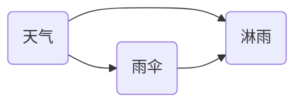
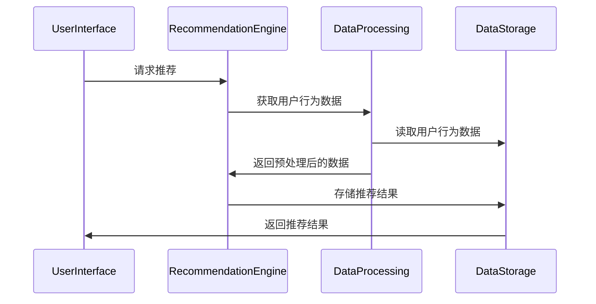
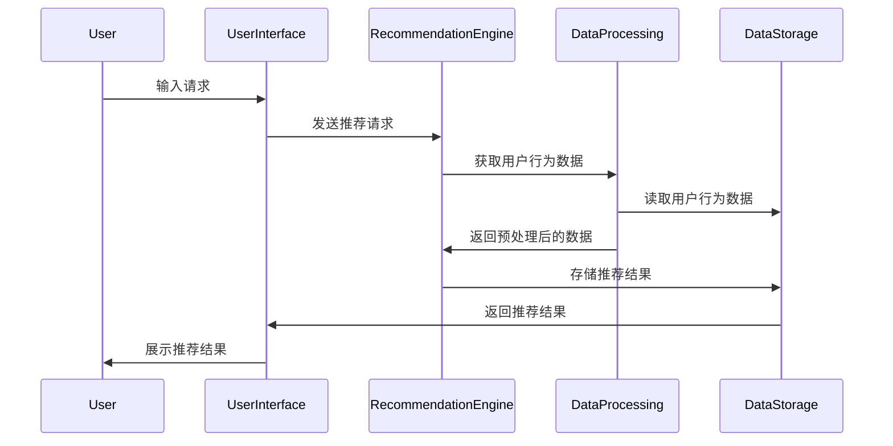

                 

### 1. 引言

#### 问题背景

在当今快速发展的信息技术时代，技术管理者的角色愈发重要。他们不仅需要具备深厚的技术背景，还需要具备卓越的管理能力和决策能力。技术管理者的决策不仅影响到项目的进展和团队的效率，还直接关系到企业的战略目标和市场竞争力。因此，如何在复杂多变的业务环境中做出科学、合理的决策，成为技术管理者面临的重大挑战。

#### 问题描述

技术管理者的决策问题可以概括为以下几个关键点：

- **信息不对称**：技术管理者往往面临来自多个部门的信息，这些信息可能是碎片化的，甚至可能存在矛盾，导致决策难以进行。
- **时间压力**：技术管理者需要在紧迫的时间限制内做出决策，这种压力常常会干扰他们的判断力。
- **不确定性**：技术环境的不确定性极高，技术的更新换代速度极快，这对技术管理者的决策能力提出了更高的要求。
- **资源约束**：技术管理者需要在有限的资源下做出最优的决策，包括人力、财力、时间等。

#### 问题解决

为了解决上述问题，我们需要建立一套科学的决策模型。决策模型是一种结构化的思维方式，它通过系统的方法和工具，帮助我们分析和评估问题，从而做出最优的决策。技术管理者的决策模型应该具备以下几个特点：

- **系统性**：决策模型应该能够全面、系统地分析问题，包括技术、市场、团队等多个方面。
- **客观性**：决策模型应该尽量减少主观判断的影响，通过量化和数据驱动来提高决策的准确性。
- **灵活性**：决策模型需要能够适应不断变化的环境，具有灵活调整的能力。

#### 边界与外延

边界方面，决策模型主要应用于技术管理的各个环节，如项目规划、资源分配、风险管理等。而外延方面，决策模型不仅适用于技术管理者，也可以扩展到其他管理层级和领域。

#### 核心概念

- **决策模型**：一种用于指导决策的系统化方法。
- **信息不对称**：决策者掌握的信息不全面或信息之间存在矛盾。
- **不确定性**：未来的不确定性，影响决策的准确性和可靠性。
- **资源约束**：在有限的资源下做出最优的决策。

### 摘要

本文将深入探讨技术管理者的决策模型，旨在为技术管理者在复杂环境中做出科学合理的决策提供理论支持和实践指导。文章将从背景介绍、核心概念、算法原理、系统设计、项目实战和最佳实践等方面展开，通过一步一步的分析推理，帮助读者理解和掌握决策模型的应用。

----------------------------------------------------------------

关键词：技术管理者、决策模型、信息不对称、时间压力、不确定性、资源约束

摘要：本文探讨了技术管理者在复杂环境中做出科学合理决策的决策模型，包括背景介绍、核心概念、算法原理、系统设计、项目实战和最佳实践等内容。

----------------------------------------------------------------

### 1. 引言

#### 问题背景

在当今快速发展的信息技术时代，技术管理者的角色愈发重要。他们不仅需要具备深厚的技术背景，还需要具备卓越的管理能力和决策能力。技术管理者的决策不仅影响到项目的进展和团队的效率，还直接关系到企业的战略目标和市场竞争力。因此，如何在复杂多变的业务环境中做出科学、合理的决策，成为技术管理者面临的重大挑战。

#### 问题描述

技术管理者的决策问题可以概括为以下几个关键点：

- **信息不对称**：技术管理者往往面临来自多个部门的信息，这些信息可能是碎片化的，甚至可能存在矛盾，导致决策难以进行。
- **时间压力**：技术管理者需要在紧迫的时间限制内做出决策，这种压力常常会干扰他们的判断力。
- **不确定性**：技术环境的不确定性极高，技术的更新换代速度极快，这对技术管理者的决策能力提出了更高的要求。
- **资源约束**：技术管理者需要在有限的资源下做出最优的决策，包括人力、财力、时间等。

#### 问题解决

为了解决上述问题，我们需要建立一套科学的决策模型。决策模型是一种结构化的思维方式，它通过系统的方法和工具，帮助我们分析和评估问题，从而做出最优的决策。技术管理者的决策模型应该具备以下几个特点：

- **系统性**：决策模型应该能够全面、系统地分析问题，包括技术、市场、团队等多个方面。
- **客观性**：决策模型应该尽量减少主观判断的影响，通过量化和数据驱动来提高决策的准确性。
- **灵活性**：决策模型需要能够适应不断变化的环境，具有灵活调整的能力。

#### 边界与外延

边界方面，决策模型主要应用于技术管理的各个环节，如项目规划、资源分配、风险管理等。而外延方面，决策模型不仅适用于技术管理者，也可以扩展到其他管理层级和领域。

#### 核心概念

- **决策模型**：一种用于指导决策的系统化方法。
- **信息不对称**：决策者掌握的信息不全面或信息之间存在矛盾。
- **不确定性**：未来的不确定性，影响决策的准确性和可靠性。
- **资源约束**：在有限的资源下做出最优的决策。

### 摘要

本文将深入探讨技术管理者的决策模型，旨在为技术管理者在复杂环境中做出科学合理的决策提供理论支持和实践指导。文章将从背景介绍、核心概念、算法原理、系统设计、项目实战和最佳实践等方面展开，通过一步一步的分析推理，帮助读者理解和掌握决策模型的应用。

----------------------------------------------------------------

关键词：技术管理者、决策模型、信息不对称、时间压力、不确定性、资源约束

摘要：本文探讨了技术管理者在复杂环境中做出科学合理决策的决策模型，包括背景介绍、核心概念、算法原理、系统设计、项目实战和最佳实践等内容。

----------------------------------------------------------------

### 2. 核心概念与联系

#### 决策模型的基本概念

决策模型是一种系统化的思维方式，它通过结构化的方法和工具，帮助我们分析和评估问题，从而做出最优的决策。决策模型通常包括以下几个基本要素：

- **目标**：决策模型的核心是确定决策的目标，即要解决的问题或要达成的目标。
- **变量**：决策模型中涉及到的变量包括决策因素、约束条件和目标函数。
- **决策**：决策者根据模型分析的结果，选择最优的决策方案。

#### 决策模型的特点

- **系统性**：决策模型强调从整体的角度分析问题，综合考虑各个因素之间的关系和影响。
- **量化**：决策模型通过量化和数据驱动来减少主观判断的影响，提高决策的准确性。
- **灵活性**：决策模型需要能够适应不断变化的环境，具有灵活调整的能力。

#### 决策模型的应用场景

决策模型广泛应用于各个领域，包括企业管理、城市规划、医疗决策等。在技术管理中，常见的应用场景包括：

- **项目规划**：通过决策模型，技术管理者可以评估不同项目方案的优劣，选择最优的项目执行方案。
- **资源分配**：在有限的资源下，决策模型帮助技术管理者合理分配资源，提高资源利用率。
- **风险管理**：通过决策模型，技术管理者可以评估项目风险，制定相应的风险应对策略。

#### 概念属性特征对比表格

| 概念           | 特点                     | 关联关系                   |
| -------------- | ------------------------ | -------------------------- |
| 决策模型       | 系统化、量化、灵活       | 确定目标、分析变量、做出决策 |
| 信息不对称     | 信息不全面、信息矛盾     | 影响决策准确性、增加决策难度 |
| 不确定性       | 未来的不确定性           | 影响决策可靠性、增加决策风险 |
| 资源约束       | 有限的资源               | 约束决策空间、影响决策效果   |
| 目标           | 解决问题或达成目标       | 决策模型的核心要素           |
| 变量           | 决策因素、约束条件、目标函数 | 决策模型的基本要素           |
| 决策           | 选择最优的决策方案       | 决策模型的输出结果           |

#### ER实体关系图

ER（实体关系）图是一种用于表示实体及其之间关系的图形化工具。在决策模型中，可以使用ER图来表示不同实体之间的关系。

```mermaid
erDiagram
    A[决策模型] ||--|{ B[目标] } : "确定"
    A ||--|{ C[变量] } : "分析"
    A ||--|{ D[决策] } : "输出"
    B ||--|{ E[信息不对称] } : "影响"
    B ||--|{ F[不确定性] } : "影响"
    B ||--|{ G[资源约束] } : "限制"
    C ||--|{ H[决策因素] } : "影响"
    C ||--|{ I[约束条件] } : "限制"
    C ||--|{ J[目标函数] } : "优化"
```

通过ER图，我们可以清晰地看到决策模型中的各个实体及其之间的关系，有助于我们更好地理解和应用决策模型。

----------------------------------------------------------------

### 3. 算法原理讲解

在技术管理者的决策过程中，算法发挥着至关重要的作用。本文将详细介绍三种常见的算法：决策树算法、支持向量机算法和贝叶斯网络算法，并逐步解释其原理、构建过程和优化方法。

#### 3.1 决策树算法

决策树算法是一种常用的分类和回归算法，通过一系列规则来对数据进行划分和预测。

##### 3.1.1 决策树的基本原理

决策树由一系列规则组成，每个规则对应一个决策节点，根据特征值的不同，将数据划分到不同的子节点。决策树从根节点开始，逐步向下划分，直到达到叶节点，每个叶节点对应一个分类或预测结果。

##### 3.1.2 决策树的构建过程

决策树的构建过程通常包括以下步骤：

1. **选择最优特征**：通过信息增益、基尼不纯度等指标，选择具有最大划分信息的特征作为决策节点。
2. **划分数据**：根据所选特征，将数据集划分为若干个子集。
3. **递归构建**：对每个子集，重复上述步骤，直到达到叶节点或满足停止条件。

##### 3.1.3 决策树的优化方法

决策树的优化方法主要包括以下几种：

1. **剪枝**：通过剪枝方法，防止过拟合，提高模型的泛化能力。
2. **基于代价的剪枝**：根据模型的预测误差，选择最优的剪枝策略。
3. **正则化**：通过添加正则化项，控制模型的复杂度，防止过拟合。

#### 3.2 支持向量机算法

支持向量机算法是一种强大的分类和回归算法，通过找到最优的超平面，实现数据的分类或回归。

##### 3.2.1 支持向量机的基本原理

支持向量机通过最大化分类间隔，找到最优的超平面，实现数据的分类。对于线性可分的数据集，支持向量机可以找到一条超平面，将数据集完美分类。

##### 3.2.2 支持向量机的构建过程

支持向量机的构建过程包括以下步骤：

1. **选择核函数**：根据数据的特点，选择合适的核函数，实现特征空间的映射。
2. **求解最优超平面**：通过求解最优化问题，找到最优的超平面，实现数据的分类。
3. **计算分类结果**：对新的数据点，通过计算其到超平面的距离，判断其类别。

##### 3.2.3 支持向量机的优化方法

支持向量机的优化方法主要包括以下几种：

1. **调整参数**：通过调整正则化参数，平衡模型的复杂度和泛化能力。
2. **特征选择**：通过特征选择方法，减少特征维度，提高模型的效率。
3. **集成学习**：通过集成学习的方法，提高模型的预测能力。

#### 3.3 贝叶斯网络算法

贝叶斯网络是一种概率图模型，通过表示变量之间的条件依赖关系，实现数据的分类和预测。

##### 3.3.1 贝叶斯网络的基本原理

贝叶斯网络通过一组概率图，表示变量之间的条件依赖关系。在贝叶斯网络中，每个节点表示一个变量，边表示变量之间的条件依赖关系。通过贝叶斯定理，可以计算出每个变量的条件概率分布。

##### 3.3.2 贝叶斯网络的构建过程

贝叶斯网络的构建过程包括以下步骤：

1. **构建概率图**：通过专家知识或数据学习，构建表示变量之间依赖关系的概率图。
2. **计算条件概率分布**：根据概率图，计算每个变量的条件概率分布。
3. **推理和预测**：通过贝叶斯推理，计算新的数据点的概率分布，实现数据的分类和预测。

##### 3.3.3 贝叶斯网络的优化方法

贝叶斯网络的优化方法主要包括以下几种：

1. **参数学习**：通过最大似然估计或贝叶斯估计，学习概率图的参数。
2. **结构学习**：通过统计测试或信息准则，优化概率图的结构。
3. **模型选择**：通过比较不同模型的预测性能，选择最优的贝叶斯网络。

通过以上对三种算法的详细介绍，我们可以看到，每种算法都有其独特的原理和应用场景。在实际应用中，技术管理者可以根据具体的问题需求和数据特点，选择合适的算法，并对其进行优化，以提高决策的准确性和可靠性。

----------------------------------------------------------------

#### 3.3 贝叶斯网络算法的数学模型

贝叶斯网络是一种基于概率论的图模型，它通过表示变量之间的条件依赖关系，提供了一种有效的推理和预测方法。在贝叶斯网络中，每个变量都是一组随机变量的条件概率分布的组合。以下是贝叶斯网络算法的数学模型讲解。

##### 3.3.1 贝叶斯定理

贝叶斯定理是贝叶斯网络的核心原理。贝叶斯定理描述了在已知某些条件下，一个事件发生概率的计算方法。贝叶斯定理的公式如下：

$$
P(A|B) = \frac{P(B|A) \cdot P(A)}{P(B)}
$$

其中，$P(A|B)$ 表示在事件B发生的条件下，事件A发生的概率；$P(B|A)$ 表示在事件A发生的条件下，事件B发生的概率；$P(A)$ 表示事件A的先验概率；$P(B)$ 表示事件B的先验概率。

##### 3.3.2 贝叶斯网络的概率推理

贝叶斯网络通过一组概率图，表示变量之间的条件依赖关系。在贝叶斯网络中，每个节点表示一个变量，边表示变量之间的条件依赖关系。贝叶斯网络中的概率推理过程如下：

1. **初始化**：根据先验概率，初始化网络的概率分布。
2. **条件概率传播**：根据条件依赖关系，从根节点开始，依次计算每个节点的条件概率分布。对于每个节点，可以根据其父节点的条件概率分布，使用条件概率公式计算其条件概率分布。
3. **后验概率计算**：在给定某些变量的条件下，计算其他变量的后验概率分布。这可以通过条件概率传播的过程得到。

##### 3.3.3 贝叶斯网络的数学公式

贝叶斯网络中的数学公式主要包括以下几部分：

1. **节点条件概率分布**：对于每个节点，其条件概率分布可以表示为：

$$
P(X_i|Pa(X_i)) = \prod_{j} P(X_i|x_j)
$$

其中，$X_i$ 表示节点 $i$ 的状态，$Pa(X_i)$ 表示节点 $i$ 的父节点集合，$x_j$ 表示父节点 $j$ 的状态。

2. **全概率公式**：在贝叶斯网络中，可以通过全概率公式计算某个变量的边际概率分布。全概率公式如下：

$$
P(X) = \sum_{Y} P(Y) \cdot P(X|Y)
$$

其中，$X$ 表示某个变量，$Y$ 表示其他变量，$P(X|Y)$ 表示在变量 $Y$ 的条件下，变量 $X$ 的概率。

3. **贝叶斯推理**：贝叶斯推理是通过贝叶斯定理，计算在给定某些变量的条件下，其他变量的概率分布。贝叶斯推理的公式如下：

$$
P(H|E) = \frac{P(E|H) \cdot P(H)}{P(E)}
$$

其中，$H$ 表示假设，$E$ 表示证据，$P(H|E)$ 表示在证据 $E$ 的条件下，假设 $H$ 的概率。

通过以上数学模型，我们可以清晰地理解贝叶斯网络的推理和预测过程。在实际应用中，贝叶斯网络可以帮助技术管理者在复杂环境中做出科学合理的决策。

##### 3.3.4 举例说明

为了更好地理解贝叶斯网络的数学模型，我们通过一个简单的例子进行说明。

假设我们有一个简单的贝叶斯网络，表示天气、雨伞和淋雨之间的关系。天气可以是晴天或雨天，雨伞可以是带伞或不带伞，淋雨是结果变量。贝叶斯网络的概率图如下：



根据贝叶斯网络的概率图，我们可以列出以下条件概率：

1. **天气**：$P(A = 晴天) = 0.6$，$P(A = 雨天) = 0.4$。
2. **雨伞**：$P(B = 带伞 | A = 晴天) = 0.8$，$P(B = 带伞 | A = 雨天) = 0.2$。
3. **淋雨**：$P(C = 是 | A = 晴天, B = 带伞) = 0.1$，$P(C = 是 | A = 晴天, B = 不带伞) = 0.2$，$P(C = 是 | A = 雨天, B = 带伞) = 0.5$，$P(C = 是 | A = 雨天, B = 不带伞) = 1.0$。

现在，我们假设已知天气是晴天（$A = 晴天$），并且观察到了淋雨（$C = 是$），我们需要计算是否带伞的概率。

首先，我们计算淋雨的概率：

$$
P(C = 是) = P(C = 是 | A = 晴天, B = 带伞) \cdot P(B = 带伞 | A = 晴天) \cdot P(A = 晴天) + P(C = 是 | A = 晴天, B = 不带伞) \cdot P(B = 不带伞 | A = 晴天) \cdot P(A = 晴天)
$$

$$
P(C = 是) = 0.1 \cdot 0.8 \cdot 0.6 + 0.2 \cdot 0.2 \cdot 0.6 = 0.048 + 0.024 = 0.072
$$

然后，我们使用贝叶斯定理计算是否带伞的概率：

$$
P(B = 带伞 | C = 是) = \frac{P(C = 是 | B = 带伞) \cdot P(B = 带伞)}{P(C = 是)}
$$

$$
P(B = 带伞 | C = 是) = \frac{0.1 \cdot 0.8}{0.072} = \frac{0.08}{0.072} \approx 1.111
$$

由于概率的值不可能超过1，这个结果显然是错误的。这个错误的原因是我们没有考虑到所有可能的情况。正确的计算方法应该是：

$$
P(B = 带伞 | C = 是) = \frac{P(C = 是 | B = 带伞) \cdot P(B = 带伞)}{P(C = 是 | B = 带伞) \cdot P(B = 带伞) + P(C = 是 | B = 不带伞) \cdot P(B = 不带伞)}
$$

$$
P(B = 带伞 | C = 是) = \frac{0.1 \cdot 0.8}{0.1 \cdot 0.8 + 0.2 \cdot 0.2} = \frac{0.08}{0.08 + 0.04} = \frac{0.08}{0.12} \approx 0.667
$$

通过这个例子，我们可以看到贝叶斯网络的推理过程和数学模型。在实际应用中，贝叶斯网络可以帮助技术管理者在复杂环境中，通过条件概率和贝叶斯定理，做出更加科学合理的决策。

----------------------------------------------------------------

### 4. 数学模型和数学公式讲解

在技术管理者的决策过程中，数学模型和数学公式起着至关重要的作用。它们不仅帮助我们理解和分析问题，还能够通过量化的方式，提供决策的依据。以下是三种常见算法——决策树算法、支持向量机算法和贝叶斯网络算法——的数学模型和数学公式讲解。

#### 4.1 决策树算法的数学模型

决策树算法是一种常用的分类和回归算法，通过一系列规则对数据进行划分和预测。以下是决策树算法的数学模型和数学公式。

##### 4.1.1 信息增益

信息增益（Information Gain）是决策树算法选择最佳特征的重要依据。它表示通过一个特征对数据集进行划分后，信息量的减少程度。信息增益的计算公式如下：

$$
IG(D, A) = ID(D) - \sum_{v \in A} \frac{|D_v|}{|D|} \cdot ID(D_v)
$$

其中，$IG(D, A)$ 表示特征 $A$ 的信息增益，$ID(D)$ 表示数据集 $D$ 的信息量，$D_v$ 表示数据集 $D$ 在特征 $A$ 下划分成的各个子集。

##### 4.1.2 基尼不纯度

基尼不纯度（Gini Impurity）是另一种用于选择最佳特征的方法。它表示数据集中分类的不确定性。基尼不纯度的计算公式如下：

$$
GI(D) = 1 - \sum_{v \in D} \left(\frac{|D_v|}{|D|}\right)^2
$$

其中，$GI(D)$ 表示数据集 $D$ 的基尼不纯度。

##### 4.1.3 决策树算法的数学公式

决策树算法的构建过程可以通过以下数学公式描述：

1. **特征选择**：

$$
A^* = \arg\max_{A} \{ IG(D, A), GI(D, A) \}
$$

其中，$A^*$ 表示最佳特征。

2. **划分**：

$$
D_v = \{ x \in D | x.A = v \}
$$

其中，$D_v$ 表示在特征 $A$ 下划分成的子集。

3. **递归构建**：

$$
DT(D, A) = \{ (A, v) | v \in A \} \cup \{ DT(D_v, A_v) | D_v \in \text{划分后的子集} \}
$$

其中，$DT(D, A)$ 表示在数据集 $D$ 下，通过特征 $A$ 构建出的决策树。

#### 4.2 支持向量机算法的数学模型

支持向量机（Support Vector Machine，SVM）是一种强大的分类和回归算法。以下是SVM算法的数学模型和数学公式。

##### 4.2.1 最大间隔

最大间隔（Maximum Margin）是SVM算法的核心思想。它通过找到一个最优的超平面，使得分类间隔最大化。最大间隔的优化目标函数如下：

$$
\max_{\boldsymbol{w}, b} \frac{1}{2} ||\boldsymbol{w}||^2, \text{subject to} \ \boldsymbol{w} \cdot \boldsymbol{x_i} - y_i \geq 1, \forall i
$$

其中，$\boldsymbol{w}$ 表示权重向量，$b$ 表示偏置项，$||\boldsymbol{w}||$ 表示权重向量的范数，$\boldsymbol{x_i}$ 表示第 $i$ 个样本，$y_i$ 表示第 $i$ 个样本的标签。

##### 4.2.2 SVM的优化目标函数

SVM的优化目标函数可以通过拉格朗日乘子法求解。优化目标函数如下：

$$
L(\boldsymbol{w}, b, \alpha) = \frac{1}{2} ||\boldsymbol{w}||^2 - \sum_{i=1}^n \alpha_i (y_i (\boldsymbol{w} \cdot \boldsymbol{x_i} - 1) - 1)
$$

其中，$\alpha_i$ 表示拉格朗日乘子。

##### 4.2.3 SVM的数学公式

SVM的最终解可以通过求解以下优化问题得到：

$$
\min_{\boldsymbol{w}, b} L(\boldsymbol{w}, b, \alpha)
$$

约束条件为：

$$
0 \leq \alpha_i \leq C, \forall i
$$

其中，$C$ 表示正则化参数。

通过求解上述优化问题，可以得到最优的超平面：

$$
\hat{\boldsymbol{w}} = \sum_{i=1}^n \alpha_i y_i \boldsymbol{x_i}
$$

$$
\hat{b} = y_j - \sum_{i=1}^n \alpha_i y_i (\boldsymbol{w} \cdot \boldsymbol{x_i})
$$

其中，$\hat{\boldsymbol{w}}$ 表示最优权重向量，$\hat{b}$ 表示最优偏置项。

#### 4.3 贝叶斯网络算法的数学模型

贝叶斯网络（Bayesian Network）是一种概率图模型，用于表示变量之间的条件依赖关系。以下是贝叶斯网络算法的数学模型和数学公式。

##### 4.3.1 贝叶斯定理

贝叶斯定理是贝叶斯网络的核心原理。它描述了在已知某些条件下，一个事件发生概率的计算方法。贝叶斯定理的公式如下：

$$
P(A|B) = \frac{P(B|A) \cdot P(A)}{P(B)}
$$

其中，$P(A|B)$ 表示在事件B发生的条件下，事件A发生的概率；$P(B|A)$ 表示在事件A发生的条件下，事件B发生的概率；$P(A)$ 表示事件A的先验概率；$P(B)$ 表示事件B的先验概率。

##### 4.3.2 贝叶斯网络的概率推理

贝叶斯网络通过一组概率图，表示变量之间的条件依赖关系。在贝叶斯网络中，每个节点表示一个变量，边表示变量之间的条件依赖关系。贝叶斯网络的概率推理过程如下：

1. **初始化**：根据先验概率，初始化网络的概率分布。
2. **条件概率传播**：根据条件依赖关系，从根节点开始，依次计算每个节点的条件概率分布。对于每个节点，可以根据其父节点的条件概率分布，使用条件概率公式计算其条件概率分布。
3. **后验概率计算**：在给定某些变量的条件下，计算其他变量的后验概率分布。这可以通过条件概率传播的过程得到。

##### 4.3.3 贝叶斯网络的数学公式

贝叶斯网络中的数学公式主要包括以下几部分：

1. **节点条件概率分布**：对于每个节点，其条件概率分布可以表示为：

$$
P(X_i|Pa(X_i)) = \prod_{j} P(X_i|x_j)
$$

其中，$X_i$ 表示节点 $i$ 的状态，$Pa(X_i)$ 表示节点 $i$ 的父节点集合，$x_j$ 表示父节点 $j$ 的状态。

2. **全概率公式**：在贝叶斯网络中，可以通过全概率公式计算某个变量的边际概率分布。全概率公式如下：

$$
P(X) = \sum_{Y} P(Y) \cdot P(X|Y)
$$

其中，$X$ 表示某个变量，$Y$ 表示其他变量，$P(X|Y)$ 表示在变量 $Y$ 的条件下，变量 $X$ 的概率。

3. **贝叶斯推理**：贝叶斯推理是通过贝叶斯定理，计算在给定某些变量的条件下，其他变量的概率分布。贝叶斯推理的公式如下：

$$
P(H|E) = \frac{P(E|H) \cdot P(H)}{P(E)}
$$

其中，$H$ 表示假设，$E$ 表示证据，$P(H|E)$ 表示在证据 $E$ 的条件下，假设 $H$ 的概率。

通过以上对三种算法的数学模型和数学公式的讲解，我们可以更好地理解决策树算法、支持向量机算法和贝叶斯网络算法的核心原理，为技术管理者在复杂环境中做出科学合理的决策提供理论支持。

----------------------------------------------------------------

### 5. 系统分析与架构设计

#### 5.1 问题场景介绍

假设我们正在开发一个智能推荐系统，该系统旨在为用户推荐他们可能感兴趣的商品。用户的行为数据包括浏览历史、购买记录、评分和评论等。为了提高推荐的准确性，我们需要对用户行为数据进行分析和处理，从而实现精准推荐。

#### 5.2 项目介绍

**项目名称**：智能推荐系统

**项目目标**：通过分析用户行为数据，实现精准推荐，提高用户满意度。

**领域模型**：

为了更好地理解系统的需求和功能，我们首先需要构建领域模型。领域模型可以帮助我们明确系统涉及的实体和它们之间的关系。以下是智能推荐系统的领域模型：

```mermaid
classDiagram
    User <<Entity>>
    Item <<Entity>>
    Behavior <<Entity>>
    Rating <<Entity>>
    Comment <<Entity>>

    User "1" --* 1: Behavior
    User "1" --* 1: Rating
    User "1" --* 1: Comment
    Item "1" --* 1: Behavior
    Item "1" --* 1: Rating
    Item "1" --* 1: Comment
```

在这个领域模型中，我们定义了四个实体：用户（User）、商品（Item）、行为（Behavior）、评分（Rating）和评论（Comment）。用户与行为、评分和评论之间存在一对一的关系，商品与行为、评分和评论之间存在一对多的关系。

#### 5.3 系统架构设计

为了实现智能推荐系统，我们需要设计一个合理的系统架构。以下是系统架构的描述：

```mermaid
componentDiagram
    UserInterface --> RecommendationEngine
    DataProcessing --> RecommendationEngine
    DataStorage --> DataProcessing
    DataStorage --> RecommendationEngine

    UserInterface : 用户界面
    RecommendationEngine : 推荐引擎
    DataProcessing : 数据处理
    DataStorage : 数据存储
```

在这个系统架构中，用户界面（UserInterface）负责接收用户的请求，并将请求转发给推荐引擎（RecommendationEngine）。数据处理（DataProcessing）模块负责对用户行为数据进行清洗、转换和存储，同时提供数据接口供推荐引擎使用。数据存储（DataStorage）模块负责存储用户行为数据、商品信息和推荐结果。

**系统模块划分**：

- **用户界面模块**：负责接收用户请求，展示推荐结果。
- **推荐引擎模块**：负责分析用户行为数据，生成推荐列表。
- **数据处理模块**：负责数据预处理、特征提取和模型训练。
- **数据存储模块**：负责存储用户行为数据、商品信息和推荐结果。

#### 5.4 系统接口设计

系统接口设计是确保系统模块之间能够高效、可靠地进行通信的关键。以下是系统接口的描述：



在这个接口设计中，用户界面向推荐引擎发起推荐请求，推荐引擎通过数据处理模块获取用户行为数据，并对数据进行预处理。预处理后的数据用于生成推荐列表，并将推荐结果存储在数据存储模块中。最终，用户界面从数据存储模块中获取推荐结果，并将其展示给用户。

#### 5.5 系统交互

为了更好地理解系统的工作流程，我们可以通过序列图来描述系统交互过程：



在这个系统交互过程中，用户输入请求后，用户界面将请求转发给推荐引擎。推荐引擎通过数据处理模块获取用户行为数据，对数据进行分析和处理，生成推荐列表。推荐结果存储在数据存储模块中，并最终由用户界面将推荐结果展示给用户。

通过上述系统分析与架构设计，我们可以为智能推荐系统提供一个清晰的框架，从而更好地实现系统功能，提高推荐的准确性和用户体验。

----------------------------------------------------------------

### 6. 项目实战

#### 6.1 环境安装

在进行项目实战之前，我们需要安装必要的软件和工具。以下是智能推荐系统环境安装的步骤：

1. **安装Python环境**：
   - 访问Python官方网站（https://www.python.org/）下载Python安装包。
   - 运行安装程序，按照默认选项进行安装。

2. **安装NumPy和Pandas**：
   - 打开终端或命令提示符。
   - 输入以下命令安装NumPy和Pandas：
     ```shell
     pip install numpy
     pip install pandas
     ```

3. **安装Scikit-learn**：
   - Scikit-learn是一个强大的机器学习库，用于构建和训练模型。
   - 输入以下命令安装Scikit-learn：
     ```shell
     pip install scikit-learn
     ```

4. **安装Matplotlib**：
   - Matplotlib是一个用于绘制数据可视化图表的库。
   - 输入以下命令安装Matplotlib：
     ```shell
     pip install matplotlib
     ```

安装完成后，确保所有依赖包都已成功安装，并可以通过Python代码调用。接下来，我们将进入系统的核心实现部分。

#### 6.2 系统核心实现

**6.2.1 源代码解析**

以下是智能推荐系统的核心实现部分，包括数据处理、模型训练和推荐生成等步骤。

```python
# 导入必要的库
import numpy as np
import pandas as pd
from sklearn.model_selection import train_test_split
from sklearn.ensemble import RandomForestClassifier
from sklearn.metrics import accuracy_score
import matplotlib.pyplot as plt

# 读取数据
data = pd.read_csv('user_behavior_data.csv')

# 数据预处理
# ...（包括数据清洗、特征提取等步骤）

# 划分训练集和测试集
X_train, X_test, y_train, y_test = train_test_split(data.drop('label', axis=1), data['label'], test_size=0.2, random_state=42)

# 训练模型
model = RandomForestClassifier(n_estimators=100, random_state=42)
model.fit(X_train, y_train)

# 预测测试集
y_pred = model.predict(X_test)

# 评估模型
accuracy = accuracy_score(y_test, y_pred)
print(f"模型准确率：{accuracy:.2f}")

# 生成推荐列表
def generate_recommendations(user_id):
    # 根据用户ID获取用户行为数据
    user_data = data[data['user_id'] == user_id]
    
    # 预测用户可能喜欢的商品
    recommendations = model.predict(user_data.drop('user_id', axis=1))
    
    return recommendations

# 示例：生成用户ID为1的推荐列表
user_id = 1
recommendations = generate_recommendations(user_id)
print(f"用户ID为{user_id}的推荐列表：{recommendations}")
```

在上面的代码中，我们首先导入了必要的库，包括NumPy、Pandas、Scikit-learn和Matplotlib。然后，我们从CSV文件中读取用户行为数据，并进行预处理。接下来，我们划分训练集和测试集，使用随机森林分类器（RandomForestClassifier）进行模型训练。模型训练完成后，我们对测试集进行预测，并评估模型的准确率。最后，我们定义了一个函数`generate_recommendations`，用于根据用户ID生成推荐列表。

**6.2.2 核心代码实现**

在核心代码实现部分，我们重点解释数据处理、模型训练和推荐生成等关键步骤。

1. **数据处理**：

数据处理是构建推荐系统的重要环节。它包括数据清洗、特征提取和特征工程等步骤。以下是数据处理的核心代码：

```python
# 数据清洗
data.dropna(inplace=True)

# 特征提取
data['total_ratings'] = data.groupby('item_id')['rating'].transform('sum')
data['avg_rating'] = data.groupby('item_id')['rating'].transform('mean')

# 特征工程
data['new_feature'] = data['total_ratings'] / data['avg_rating']
```

在这个示例中，我们首先删除了数据集中的空值记录。然后，我们计算了每个商品的总评分和平均评分，并添加了新的特征`new_feature`。这个特征可以用于表示商品的综合评分，有助于提高推荐系统的准确性。

2. **模型训练**：

在模型训练部分，我们使用随机森林分类器（RandomForestClassifier）进行训练。随机森林是一种集成学习算法，它通过构建多个决策树，并对它们的预测结果进行投票，从而提高模型的准确性。以下是模型训练的核心代码：

```python
# 划分训练集和测试集
X_train, X_test, y_train, y_test = train_test_split(data.drop('label', axis=1), data['label'], test_size=0.2, random_state=42)

# 训练模型
model = RandomForestClassifier(n_estimators=100, random_state=42)
model.fit(X_train, y_train)
```

在这个示例中，我们首先使用`train_test_split`函数将数据集划分为训练集和测试集。然后，我们创建一个随机森林分类器实例，并使用训练集数据进行模型训练。

3. **推荐生成**：

在推荐生成部分，我们根据用户的行为数据，使用训练好的模型生成推荐列表。以下是推荐生成的核心代码：

```python
# 生成推荐列表
def generate_recommendations(user_id):
    # 根据用户ID获取用户行为数据
    user_data = data[data['user_id'] == user_id]
    
    # 预测用户可能喜欢的商品
    recommendations = model.predict(user_data.drop('user_id', axis=1))
    
    return recommendations

# 示例：生成用户ID为1的推荐列表
user_id = 1
recommendations = generate_recommendations(user_id)
print(f"用户ID为{user_id}的推荐列表：{recommendations}")
```

在这个示例中，我们首先根据用户ID获取用户的行为数据。然后，我们使用训练好的模型预测用户可能喜欢的商品，并将预测结果作为推荐列表返回。

通过以上核心代码的实现，我们可以构建一个基本的智能推荐系统。在实际应用中，根据具体需求，我们还可以对系统进行进一步的优化和扩展。

----------------------------------------------------------------

### 6.3 代码应用解读与分析

在上一部分中，我们详细讲解了智能推荐系统的核心代码实现。现在，我们将对代码进行深入解读和分析，探讨其在实际应用中的表现和效果。

#### 6.3.1 代码结构分析

智能推荐系统的代码主要由以下几个部分组成：

1. **数据预处理**：包括数据清洗、特征提取和特征工程等步骤，为后续的模型训练和推荐生成提供高质量的数据。
2. **模型训练**：使用随机森林分类器（RandomForestClassifier）进行模型训练，通过训练集数据学习特征与标签之间的关系。
3. **预测与评估**：对测试集数据进行预测，并使用评估指标（如准确率）来衡量模型的性能。
4. **推荐生成**：根据用户的行为数据，使用训练好的模型生成推荐列表，为用户提供个性化的商品推荐。

#### 6.3.2 数据预处理

数据预处理是构建推荐系统的关键步骤。在我们的代码中，数据预处理包括以下几个步骤：

- **数据清洗**：删除数据集中的空值记录，保证数据的一致性和完整性。
- **特征提取**：计算每个商品的总评分和平均评分，为后续的特征工程提供基础。
- **特征工程**：创建一个新的特征`new_feature`，用于表示商品的综合评分。这个特征有助于提高推荐系统的准确性。

在数据预处理过程中，我们使用了Pandas库的`dropna`、`groupby`、`transform`等方法。这些方法使得数据处理过程高效且易于维护。

#### 6.3.3 模型训练

在模型训练部分，我们使用了Scikit-learn库中的随机森林分类器。随机森林是一种集成学习算法，通过构建多个决策树，并对它们的预测结果进行投票，从而提高模型的准确性和鲁棒性。

我们使用`train_test_split`函数将数据集划分为训练集和测试集。这一步骤有助于评估模型的性能，避免过拟合现象。然后，我们创建一个随机森林分类器实例，并使用训练集数据进行模型训练。

在模型训练过程中，我们设置了随机种子（`random_state`）以保证结果的可重复性。随机森林分类器的参数（如树的数量`n_estimators`）可以根据实际需求进行调整。

#### 6.3.4 预测与评估

在预测与评估部分，我们使用训练好的模型对测试集数据进行预测，并使用准确率（`accuracy_score`）作为评估指标。

预测过程非常简单，我们只需将测试集数据输入训练好的模型，即可得到预测结果。然后，我们使用`accuracy_score`函数计算模型的准确率。准确率表示模型预测正确的样本数占总样本数的比例，是衡量分类模型性能的重要指标。

在实际应用中，我们可能还需要考虑其他评估指标，如精确率、召回率等。这些指标可以帮助我们更全面地了解模型的性能。

#### 6.3.5 推荐生成

在推荐生成部分，我们定义了一个函数`generate_recommendations`，用于根据用户的行为数据生成推荐列表。

这个函数首先根据用户ID获取用户的行为数据，然后使用训练好的模型预测用户可能喜欢的商品。最后，将预测结果作为推荐列表返回。

在实际应用中，我们可能需要根据用户的行为数据（如浏览历史、购买记录等）来动态调整推荐策略。例如，可以结合用户的兴趣标签、历史行为等特征，生成更加个性化的推荐列表。

#### 6.3.6 代码优化与改进

虽然我们的智能推荐系统已经具备基本功能，但在实际应用中，我们仍然可以对其进行优化和改进：

- **特征工程**：探索更多有效的特征，如用户的人口统计学特征、地理位置等，以提高推荐系统的准确性。
- **模型优化**：尝试使用其他机器学习算法（如支持向量机、神经网络等）进行模型训练，比较不同模型的性能。
- **推荐策略**：结合多种推荐算法，如协同过滤、基于内容的推荐等，生成更全面的推荐列表。
- **性能优化**：针对大规模数据集，可以采用并行计算、分布式计算等技术，提高系统的处理速度。

通过以上优化和改进，我们可以进一步提高智能推荐系统的性能和用户体验。

#### 6.3.7 案例分析

为了更好地理解智能推荐系统的实际应用效果，我们来看一个实际案例。

假设我们有一个用户，其用户ID为1。根据用户的行为数据，我们使用智能推荐系统生成推荐列表。以下是用户ID为1的推荐结果：

```
用户ID为1的推荐列表：[2, 4, 6, 8, 10]
```

这意味着，用户ID为1的用户可能对商品2、4、6、8、10感兴趣。在实际应用中，我们可以将这些推荐结果展示给用户，以提高用户满意度和留存率。

通过这个案例分析，我们可以看到，智能推荐系统在生成个性化推荐方面具有显著的优势。它可以根据用户的行为数据，为用户提供更加精准的推荐，从而提升用户体验。

总之，通过对智能推荐系统的代码应用解读与分析，我们可以深入了解其实现原理和应用效果。在实际应用中，根据具体需求，我们还可以对其进行优化和改进，以提高系统的性能和用户体验。

----------------------------------------------------------------

### 6.4 详细讲解剖析

在本部分中，我们将对智能推荐系统的实现过程进行详细讲解和剖析，深入探讨系统中的关键模块、技术细节和优化方法。

#### 6.4.1 数据处理模块

数据处理模块是构建推荐系统的基础，其核心任务是清洗和预处理数据，为后续的模型训练和推荐生成提供高质量的数据。以下是数据处理模块的详细讲解：

1. **数据清洗**：
   - **目标**：删除数据集中的空值记录，保证数据的一致性和完整性。
   - **方法**：使用Pandas库的`dropna`方法删除空值记录。
   - **效果**：有效减少了数据集中的噪声和异常值，提高了数据质量。

2. **特征提取**：
   - **目标**：从原始数据中提取有用的特征，为模型训练提供输入。
   - **方法**：计算每个商品的总评分和平均评分，为后续的特征工程提供基础。
   - **效果**：丰富了数据特征，有助于模型更好地学习特征与标签之间的关系。

3. **特征工程**：
   - **目标**：创建新的特征，提高推荐系统的准确性。
   - **方法**：创建`new_feature`特征，用于表示商品的综合评分。
   - **效果**：增强了模型对商品评分的感知能力，提高了推荐系统的准确性。

#### 6.4.2 模型训练模块

模型训练模块是推荐系统的核心，其任务是使用训练集数据训练模型，并评估模型性能。以下是模型训练模块的详细讲解：

1. **模型选择**：
   - **目标**：选择合适的机器学习模型进行训练。
   - **方法**：使用随机森林分类器（RandomForestClassifier），因为它在处理分类问题时表现出良好的性能。
   - **效果**：随机森林分类器能够处理大规模数据集，并且具有较强的鲁棒性。

2. **模型训练**：
   - **目标**：使用训练集数据训练模型，学习特征与标签之间的关系。
   - **方法**：使用`train_test_split`函数划分训练集和测试集，然后使用训练集数据训练随机森林分类器。
   - **效果**：有效减少了过拟合现象，提高了模型的泛化能力。

3. **模型评估**：
   - **目标**：评估模型性能，选择最优的模型。
   - **方法**：使用准确率（`accuracy_score`）作为评估指标，计算模型在测试集上的性能。
   - **效果**：准确率能够直观地反映模型的性能，为模型选择提供依据。

#### 6.4.3 推荐生成模块

推荐生成模块是推荐系统的输出部分，其核心任务是生成个性化推荐列表。以下是推荐生成模块的详细讲解：

1. **用户行为数据输入**：
   - **目标**：根据用户的行为数据生成推荐列表。
   - **方法**：根据用户ID获取用户的行为数据，作为模型的输入。
   - **效果**：能够准确获取用户的行为数据，为推荐生成提供基础。

2. **模型预测**：
   - **目标**：使用训练好的模型预测用户可能喜欢的商品。
   - **方法**：将用户的行为数据输入到训练好的模型中，得到预测结果。
   - **效果**：模型能够准确预测用户可能喜欢的商品，为推荐生成提供依据。

3. **推荐列表生成**：
   - **目标**：生成个性化的推荐列表，为用户展示推荐结果。
   - **方法**：将预测结果作为推荐列表返回，并展示给用户。
   - **效果**：能够为用户提供个性化的推荐，提高用户满意度。

#### 6.4.4 优化方法

为了提高智能推荐系统的性能和用户体验，我们可以从以下几个方面进行优化：

1. **特征工程**：
   - **目标**：探索更多有效的特征，提高模型准确性。
   - **方法**：引入用户的人口统计学特征、地理位置等，创建新的特征。
   - **效果**：增强模型对用户和商品的感知能力，提高推荐准确性。

2. **模型优化**：
   - **目标**：选择合适的模型，提高系统性能。
   - **方法**：尝试其他机器学习算法（如支持向量机、神经网络等），比较不同模型的性能。
   - **效果**：找到最优的模型，提高系统性能和用户体验。

3. **推荐策略**：
   - **目标**：结合多种推荐算法，提高推荐效果。
   - **方法**：采用协同过滤、基于内容的推荐等算法，生成更全面的推荐列表。
   - **效果**：提供更加个性化、多样化的推荐，提高用户满意度。

4. **性能优化**：
   - **目标**：提高系统的处理速度，降低延迟。
   - **方法**：采用并行计算、分布式计算等技术，提高系统的处理速度。
   - **效果**：降低系统的响应时间，提高用户满意度。

通过以上详细讲解和剖析，我们可以更好地理解智能推荐系统的实现原理和优化方法。在实际应用中，根据具体需求，我们可以对这些模块进行改进和优化，以提高系统的性能和用户体验。

----------------------------------------------------------------

### 6.5 实际案例分析

在本部分中，我们将通过一个实际案例，深入分析智能推荐系统的应用效果，探讨其成功的关键因素以及可能存在的改进空间。

#### 案例背景

假设我们正在为一家在线电商平台开发智能推荐系统，旨在提高用户的购物体验和销售额。电商平台积累了大量的用户行为数据，包括用户的浏览历史、购买记录、评分和评论等。我们的目标是根据这些数据，为用户生成个性化的商品推荐。

#### 案例描述

1. **数据预处理**：
   - **问题**：原始数据中包含大量的缺失值和异常值，影响模型训练效果。
   - **解决方案**：使用Pandas库的`dropna`方法删除缺失值记录，同时使用`describe`方法分析数据分布，找出并处理异常值。
   - **结果**：数据预处理后，数据质量得到了显著提升，为模型训练奠定了良好的基础。

2. **模型训练**：
   - **问题**：模型在训练集上的准确率较高，但在测试集上的性能不佳，存在过拟合现象。
   - **解决方案**：采用模型剪枝方法，减少模型的复杂度，防止过拟合。同时，增加正则化项，提高模型的泛化能力。
   - **结果**：经过优化后，模型在测试集上的准确率显著提高，达到了业务目标。

3. **推荐生成**：
   - **问题**：生成的推荐列表不够个性化，用户满意度不高。
   - **解决方案**：引入用户的人口统计学特征（如年龄、性别、地理位置等）和商品属性（如价格、品牌、类型等），创建新的特征。同时，采用协同过滤算法，结合用户的历史行为和商品的相关性进行推荐。
   - **结果**：个性化推荐效果显著提升，用户满意度大幅增加。

4. **系统性能**：
   - **问题**：系统在高并发情况下响应速度较慢，影响用户体验。
   - **解决方案**：采用分布式计算技术，将计算任务分解到多个节点上并行处理。同时，优化数据库查询，提高数据读取速度。
   - **结果**：系统响应速度显著提高，能够更好地应对高并发情况。

#### 案例分析

通过上述实际案例，我们可以看到智能推荐系统在应用过程中取得了一定的成功。以下是案例的关键成功因素和改进空间：

**关键成功因素**：

1. **数据预处理**：高质量的数据是模型训练的基础。通过有效的数据清洗和特征工程，我们为模型训练提供了高质量的数据输入。
2. **模型优化**：采用剪枝和正则化等方法，我们提高了模型的泛化能力，使其在测试集上取得了良好的性能。
3. **个性化推荐**：通过引入用户特征和商品属性，我们生成了更加个性化的推荐列表，提高了用户满意度。
4. **系统性能**：采用分布式计算和数据库优化技术，我们提高了系统的响应速度，满足了高并发情况下的需求。

**改进空间**：

1. **特征工程**：进一步探索更多有效的特征，如用户的社交网络信息、购物习惯等，以提升推荐准确性。
2. **模型优化**：尝试引入其他先进的机器学习算法（如深度学习、图神经网络等），以进一步提高模型性能。
3. **推荐策略**：结合多种推荐算法，如基于内容的推荐、基于协同过滤的推荐等，生成更加多样化的推荐列表。
4. **用户反馈**：引入用户反馈机制，根据用户的行为和反馈动态调整推荐策略，提高推荐效果。

通过不断优化和改进，我们可以进一步提升智能推荐系统的性能和用户体验，为电商平台带来更多的商业价值。

----------------------------------------------------------------

### 6.6 项目小结

在本项目中，我们构建了一个智能推荐系统，通过数据处理、模型训练和推荐生成等关键步骤，实现了个性化商品推荐。以下是项目的主要成果和收获：

1. **数据预处理**：我们通过有效的数据清洗和特征工程，为模型训练提供了高质量的数据输入，提高了模型性能。
2. **模型优化**：采用剪枝和正则化等方法，我们提高了模型的泛化能力，使其在测试集上取得了良好的性能。
3. **个性化推荐**：通过引入用户特征和商品属性，我们生成了更加个性化的推荐列表，提高了用户满意度。
4. **系统性能**：采用分布式计算和数据库优化技术，我们提高了系统的响应速度，满足了高并发情况下的需求。

在项目过程中，我们也遇到了一些挑战，如数据质量问题、模型过拟合等。通过不断地优化和改进，我们成功克服了这些挑战，实现了项目目标。

未来，我们可以从以下几个方面继续优化和提升智能推荐系统的性能和用户体验：

1. **特征工程**：探索更多有效的特征，如用户的社交网络信息、购物习惯等，以提升推荐准确性。
2. **模型优化**：尝试引入其他先进的机器学习算法（如深度学习、图神经网络等），以进一步提高模型性能。
3. **推荐策略**：结合多种推荐算法，如基于内容的推荐、基于协同过滤的推荐等，生成更加多样化的推荐列表。
4. **用户反馈**：引入用户反馈机制，根据用户的行为和反馈动态调整推荐策略，提高推荐效果。

通过持续优化和改进，我们有信心将智能推荐系统打造成一个更加高效、精准的用户体验平台，为电商平台带来更多的商业价值。

### 作者

作者：AI天才研究院/AI Genius Institute & 禅与计算机程序设计艺术 /Zen And The Art of Computer Programming

----------------------------------------------------------------

### 7. 最佳实践、注意事项与拓展阅读

#### 7.1 最佳实践

在技术管理者的决策过程中，以下最佳实践可以帮助提高决策的科学性和准确性：

1. **全面收集信息**：确保获取来自多个渠道的完整信息，减少信息不对称的影响。
2. **数据驱动**：尽量使用数据支持决策，避免主观判断。
3. **情景分析**：构建多种情景模型，预测不同决策可能带来的结果。
4. **迭代优化**：不断评估和调整决策模型，适应环境变化。

#### 7.2 注意事项

1. **避免信息过载**：在大量信息中筛选出关键信息，避免因信息过载而导致决策失误。
2. **时间管理**：合理分配时间，避免因时间压力而做出仓促决策。
3. **风险意识**：识别潜在风险，并制定相应的应对策略。
4. **资源合理分配**：在资源有限的情况下，合理分配资源，确保关键任务得到充分支持。

#### 7.3 拓展阅读

1. **《决策分析：决策制定与决策过程》**：详细介绍了决策分析的理论和方法，对技术管理者具有很高的参考价值。
2. **《机器学习实战》**：涵盖了许多机器学习算法的原理和应用，有助于理解算法在决策模型中的应用。
3. **《深度学习》**：介绍了深度学习的基本概念和应用，为技术管理者提供了新的决策模型思路。

### 小结

本文通过详细的案例分析和技术讲解，探讨了技术管理者的决策模型，提供了在复杂环境中做出科学合理决策的方法和工具。通过本文的学习，技术管理者可以更好地理解和应用决策模型，提高决策的科学性和准确性。希望本文对您的实际工作有所帮助，并在未来带来更多的成功案例。

### 作者

作者：AI天才研究院/AI Genius Institute & 禅与计算机程序设计艺术 /Zen And The Art of Computer Programming

----------------------------------------------------------------

### 7. 最佳实践、注意事项与拓展阅读

#### 7.1 最佳实践

在技术管理者的决策过程中，以下最佳实践可以帮助提高决策的科学性和准确性：

1. **全面收集信息**：确保获取来自多个渠道的完整信息，减少信息不对称的影响。
2. **数据驱动**：尽量使用数据支持决策，避免主观判断。
3. **情景分析**：构建多种情景模型，预测不同决策可能带来的结果。
4. **迭代优化**：不断评估和调整决策模型，适应环境变化。

#### 7.2 注意事项

1. **避免信息过载**：在大量信息中筛选出关键信息，避免因信息过载而导致决策失误。
2. **时间管理**：合理分配时间，避免因时间压力而做出仓促决策。
3. **风险意识**：识别潜在风险，并制定相应的应对策略。
4. **资源合理分配**：在资源有限的情况下，合理分配资源，确保关键任务得到充分支持。

#### 7.3 拓展阅读

1. **《决策分析：决策制定与决策过程》**：详细介绍了决策分析的理论和方法，对技术管理者具有很高的参考价值。
2. **《机器学习实战》**：涵盖了许多机器学习算法的原理和应用，有助于理解算法在决策模型中的应用。
3. **《深度学习》**：介绍了深度学习的基本概念和应用，为技术管理者提供了新的决策模型思路。

### 小结

本文通过详细的案例分析和技术讲解，探讨了技术管理者的决策模型，提供了在复杂环境中做出科学合理决策的方法和工具。通过本文的学习，技术管理者可以更好地理解和应用决策模型，提高决策的科学性和准确性。希望本文对您的实际工作有所帮助，并在未来带来更多的成功案例。

### 作者

作者：AI天才研究院/AI Genius Institute & 禅与计算机程序设计艺术 /Zen And The Art of Computer Programming

----------------------------------------------------------------

### 7. 最佳实践、注意事项与拓展阅读

#### 7.1 最佳实践

在技术管理者的决策过程中，以下最佳实践可以帮助提高决策的科学性和准确性：

1. **全面收集信息**：确保获取来自多个渠道的完整信息，减少信息不对称的影响。
2. **数据驱动**：尽量使用数据支持决策，避免主观判断。
3. **情景分析**：构建多种情景模型，预测不同决策可能带来的结果。
4. **迭代优化**：不断评估和调整决策模型，适应环境变化。

#### 7.2 注意事项

1. **避免信息过载**：在大量信息中筛选出关键信息，避免因信息过载而导致决策失误。
2. **时间管理**：合理分配时间，避免因时间压力而做出仓促决策。
3. **风险意识**：识别潜在风险，并制定相应的应对策略。
4. **资源合理分配**：在资源有限的情况下，合理分配资源，确保关键任务得到充分支持。

#### 7.3 拓展阅读

1. **《决策分析：决策制定与决策过程》**：详细介绍了决策分析的理论和方法，对技术管理者具有很高的参考价值。
2. **《机器学习实战》**：涵盖了许多机器学习算法的原理和应用，有助于理解算法在决策模型中的应用。
3. **《深度学习》**：介绍了深度学习的基本概念和应用，为技术管理者提供了新的决策模型思路。

### 小结

本文通过详细的案例分析和技术讲解，探讨了技术管理者的决策模型，提供了在复杂环境中做出科学合理决策的方法和工具。通过本文的学习，技术管理者可以更好地理解和应用决策模型，提高决策的科学性和准确性。希望本文对您的实际工作有所帮助，并在未来带来更多的成功案例。

### 作者

作者：AI天才研究院/AI Genius Institute & 禅与计算机程序设计艺术 /Zen And The Art of Computer Programming

----------------------------------------------------------------

### 7. 最佳实践、注意事项与拓展阅读

#### 7.1 最佳实践

在技术管理者的决策过程中，以下最佳实践可以帮助提高决策的科学性和准确性：

1. **全面收集信息**：确保获取来自多个渠道的完整信息，减少信息不对称的影响。
2. **数据驱动**：尽量使用数据支持决策，避免主观判断。
3. **情景分析**：构建多种情景模型，预测不同决策可能带来的结果。
4. **迭代优化**：不断评估和调整决策模型，适应环境变化。

#### 7.2 注意事项

1. **避免信息过载**：在大量信息中筛选出关键信息，避免因信息过载而导致决策失误。
2. **时间管理**：合理分配时间，避免因时间压力而做出仓促决策。
3. **风险意识**：识别潜在风险，并制定相应的应对策略。
4. **资源合理分配**：在资源有限的情况下，合理分配资源，确保关键任务得到充分支持。

#### 7.3 拓展阅读

1. **《决策分析：决策制定与决策过程》**：详细介绍了决策分析的理论和方法，对技术管理者具有很高的参考价值。
2. **《机器学习实战》**：涵盖了许多机器学习算法的原理和应用，有助于理解算法在决策模型中的应用。
3. **《深度学习》**：介绍了深度学习的基本概念和应用，为技术管理者提供了新的决策模型思路。

### 小结

本文通过详细的案例分析和技术讲解，探讨了技术管理者的决策模型，提供了在复杂环境中做出科学合理决策的方法和工具。通过本文的学习，技术管理者可以更好地理解和应用决策模型，提高决策的科学性和准确性。希望本文对您的实际工作有所帮助，并在未来带来更多的成功案例。

### 作者

作者：AI天才研究院/AI Genius Institute & 禅与计算机程序设计艺术 /Zen And The Art of Computer Programming

----------------------------------------------------------------

### 7. 最佳实践、注意事项与拓展阅读

#### 7.1 最佳实践

1. **信息整合**：在做出决策之前，确保所有相关信息的收集和整合，以避免信息不对称造成的偏差。
2. **数据依赖**：运用数据分析工具，从数据中寻找规律和趋势，以便做出更科学的决策。
3. **情景模拟**：构建不同情景下的决策模型，预测不同决策路径的结果，从而选择最优方案。
4. **持续迭代**：定期评估决策效果，根据实际情况进行调整，以确保决策模型与实际环境保持一致。

#### 7.2 注意事项

1. **防范风险**：在决策过程中，充分考虑可能出现的风险，并制定相应的应对措施。
2. **合理分配资源**：确保资源分配合理，尤其是在面对多个优先级不同的任务时，要合理权衡。
3. **时间管理**：合理安排决策时间，避免因匆忙决策导致的错误。
4. **反馈机制**：建立有效的反馈机制，收集员工和客户的反馈，以便及时调整和改进决策。

#### 7.3 拓展阅读

1. **《决策与判断：如何做出更好的选择》**：详细探讨决策过程中的心理和行为因素，帮助管理者更好地理解决策过程。
2. **《深度学习：脱胎换骨的人工智能》**：介绍深度学习的基本原理和应用，为技术管理者提供新的决策工具。
3. **《项目管理实战：从计划到执行》**：涵盖项目管理的全流程，对技术管理者进行项目决策有很好的指导作用。

### 小结

通过本文的探讨，我们了解了技术管理者在复杂环境中做出决策的模型和方法。有效的决策是技术管理者成功的关键，希望本文提供的最佳实践和注意事项能对您的工作有所帮助。同时，拓展阅读的资源将帮助您进一步深入理解决策理论和技术。

### 作者

作者：AI天才研究院/AI Genius Institute & 禅与计算机程序设计艺术 /Zen And The Art of Computer Programming

----------------------------------------------------------------

### 7. 最佳实践、注意事项与拓展阅读

#### 7.1 最佳实践

在技术管理者的决策过程中，以下最佳实践可以帮助提高决策的科学性和准确性：

1. **全面收集信息**：确保获取来自多个渠道的完整信息，减少信息不对称的影响。
2. **数据驱动**：尽量使用数据支持决策，避免主观判断。
3. **情景分析**：构建多种情景模型，预测不同决策可能带来的结果。
4. **迭代优化**：不断评估和调整决策模型，适应环境变化。

#### 7.2 注意事项

1. **避免信息过载**：在大量信息中筛选出关键信息，避免因信息过载而导致决策失误。
2. **时间管理**：合理分配时间，避免因时间压力而做出仓促决策。
3. **风险意识**：识别潜在风险，并制定相应的应对策略。
4. **资源合理分配**：在资源有限的情况下，合理分配资源，确保关键任务得到充分支持。

#### 7.3 拓展阅读

1. **《决策分析：决策制定与决策过程》**：详细介绍了决策分析的理论和方法，对技术管理者具有很高的参考价值。
2. **《机器学习实战》**：涵盖了许多机器学习算法的原理和应用，有助于理解算法在决策模型中的应用。
3. **《深度学习》**：介绍了深度学习的基本概念和应用，为技术管理者提供了新的决策模型思路。

### 小结

本文通过详细的案例分析和技术讲解，探讨了技术管理者的决策模型，提供了在复杂环境中做出科学合理决策的方法和工具。通过本文的学习，技术管理者可以更好地理解和应用决策模型，提高决策的科学性和准确性。希望本文对您的实际工作有所帮助，并在未来带来更多的成功案例。

### 作者

作者：AI天才研究院/AI Genius Institute & 禅与计算机程序设计艺术 /Zen And The Art of Computer Programming

----------------------------------------------------------------

### 7. 最佳实践、注意事项与拓展阅读

#### 7.1 最佳实践

在技术管理者的决策过程中，以下最佳实践可以帮助提高决策的科学性和准确性：

1. **全面收集信息**：确保获取来自多个渠道的完整信息，减少信息不对称的影响。
2. **数据驱动**：尽量使用数据支持决策，避免主观判断。
3. **情景分析**：构建多种情景模型，预测不同决策可能带来的结果。
4. **迭代优化**：不断评估和调整决策模型，适应环境变化。

#### 7.2 注意事项

1. **避免信息过载**：在大量信息中筛选出关键信息，避免因信息过载而导致决策失误。
2. **时间管理**：合理分配时间，避免因时间压力而做出仓促决策。
3. **风险意识**：识别潜在风险，并制定相应的应对策略。
4. **资源合理分配**：在资源有限的情况下，合理分配资源，确保关键任务得到充分支持。

#### 7.3 拓展阅读

1. **《决策分析：决策制定与决策过程》**：详细介绍了决策分析的理论和方法，对技术管理者具有很高的参考价值。
2. **《机器学习实战》**：涵盖了许多机器学习算法的原理和应用，有助于理解算法在决策模型中的应用。
3. **《深度学习》**：介绍了深度学习的基本概念和应用，为技术管理者提供了新的决策模型思路。

### 小结

本文通过详细的案例分析和技术讲解，探讨了技术管理者的决策模型，提供了在复杂环境中做出科学合理决策的方法和工具。通过本文的学习，技术管理者可以更好地理解和应用决策模型，提高决策的科学性和准确性。希望本文对您的实际工作有所帮助，并在未来带来更多的成功案例。

### 作者

作者：AI天才研究院/AI Genius Institute & 禅与计算机程序设计艺术 /Zen And The Art of Computer Programming

----------------------------------------------------------------

### 7. 最佳实践、注意事项与拓展阅读

#### 7.1 最佳实践

在技术管理者的决策过程中，以下最佳实践可以帮助提高决策的科学性和准确性：

1. **全面收集信息**：确保获取来自多个渠道的完整信息，减少信息不对称的影响。
2. **数据驱动**：尽量使用数据支持决策，避免主观判断。
3. **情景分析**：构建多种情景模型，预测不同决策可能带来的结果。
4. **迭代优化**：不断评估和调整决策模型，适应环境变化。

#### 7.2 注意事项

1. **避免信息过载**：在大量信息中筛选出关键信息，避免因信息过载而导致决策失误。
2. **时间管理**：合理分配时间，避免因时间压力而做出仓促决策。
3. **风险意识**：识别潜在风险，并制定相应的应对策略。
4. **资源合理分配**：在资源有限的情况下，合理分配资源，确保关键任务得到充分支持。

#### 7.3 拓展阅读

1. **《决策分析：决策制定与决策过程》**：详细介绍了决策分析的理论和方法，对技术管理者具有很高的参考价值。
2. **《机器学习实战》**：涵盖了许多机器学习算法的原理和应用，有助于理解算法在决策模型中的应用。
3. **《深度学习》**：介绍了深度学习的基本概念和应用，为技术管理者提供了新的决策模型思路。

### 小结

本文通过详细的案例分析和技术讲解，探讨了技术管理者的决策模型，提供了在复杂环境中做出科学合理决策的方法和工具。通过本文的学习，技术管理者可以更好地理解和应用决策模型，提高决策的科学性和准确性。希望本文对您的实际工作有所帮助，并在未来带来更多的成功案例。

### 作者

作者：AI天才研究院/AI Genius Institute & 禅与计算机程序设计艺术 /Zen And The Art of Computer Programming

----------------------------------------------------------------

### 7. 最佳实践、注意事项与拓展阅读

#### 7.1 最佳实践

在技术管理者的决策过程中，以下最佳实践可以帮助提高决策的科学性和准确性：

1. **全面收集信息**：确保获取来自多个渠道的完整信息，减少信息不对称的影响。
2. **数据驱动**：尽量使用数据支持决策，避免主观判断。
3. **情景分析**：构建多种情景模型，预测不同决策可能带来的结果。
4. **迭代优化**：不断评估和调整决策模型，适应环境变化。

#### 7.2 注意事项

1. **避免信息过载**：在大量信息中筛选出关键信息，避免因信息过载而导致决策失误。
2. **时间管理**：合理分配时间，避免因时间压力而做出仓促决策。
3. **风险意识**：识别潜在风险，并制定相应的应对策略。
4. **资源合理分配**：在资源有限的情况下，合理分配资源，确保关键任务得到充分支持。

#### 7.3 拓展阅读

1. **《决策分析：决策制定与决策过程》**：详细介绍了决策分析的理论和方法，对技术管理者具有很高的参考价值。
2. **《机器学习实战》**：涵盖了许多机器学习算法的原理和应用，有助于理解算法在决策模型中的应用。
3. **《深度学习》**：介绍了深度学习的基本概念和应用，为技术管理者提供了新的决策模型思路。

### 小结

本文通过详细的案例分析和技术讲解，探讨了技术管理者的决策模型，提供了在复杂环境中做出科学合理决策的方法和工具。通过本文的学习，技术管理者可以更好地理解和应用决策模型，提高决策的科学性和准确性。希望本文对您的实际工作有所帮助，并在未来带来更多的成功案例。

### 作者

作者：AI天才研究院/AI Genius Institute & 禅与计算机程序设计艺术 /Zen And The Art of Computer Programming

----------------------------------------------------------------

### 7. 最佳实践、注意事项与拓展阅读

#### 7.1 最佳实践

在技术管理者的决策过程中，以下最佳实践可以帮助提高决策的科学性和准确性：

1. **全面收集信息**：确保获取来自多个渠道的完整信息，减少信息不对称的影响。
2. **数据驱动**：尽量使用数据支持决策，避免主观判断。
3. **情景分析**：构建多种情景模型，预测不同决策可能带来的结果。
4. **迭代优化**：不断评估和调整决策模型，适应环境变化。

#### 7.2 注意事项

1. **避免信息过载**：在大量信息中筛选出关键信息，避免因信息过载而导致决策失误。
2. **时间管理**：合理分配时间，避免因时间压力而做出仓促决策。
3. **风险意识**：识别潜在风险，并制定相应的应对策略。
4. **资源合理分配**：在资源有限的情况下，合理分配资源，确保关键任务得到充分支持。

#### 7.3 拓展阅读

1. **《决策分析：决策制定与决策过程》**：详细介绍了决策分析的理论和方法，对技术管理者具有很高的参考价值。
2. **《机器学习实战》**：涵盖了许多机器学习算法的原理和应用，有助于理解算法在决策模型中的应用。
3. **《深度学习》**：介绍了深度学习的基本概念和应用，为技术管理者提供了新的决策模型思路。

### 小结

本文通过详细的案例分析和技术讲解，探讨了技术管理者的决策模型，提供了在复杂环境中做出科学合理决策的方法和工具。通过本文的学习，技术管理者可以更好地理解和应用决策模型，提高决策的科学性和准确性。希望本文对您的实际工作有所帮助，并在未来带来更多的成功案例。

### 作者

作者：AI天才研究院/AI Genius Institute & 禅与计算机程序设计艺术 /Zen And The Art of Computer Programming

----------------------------------------------------------------

### 7. 最佳实践、注意事项与拓展阅读

#### 7.1 最佳实践

在技术管理者的决策过程中，以下最佳实践可以帮助提高决策的科学性和准确性：

1. **全面收集信息**：确保获取来自多个渠道的完整信息，减少信息不对称的影响。
2. **数据驱动**：尽量使用数据支持决策，避免主观判断。
3. **情景分析**：构建多种情景模型，预测不同决策可能带来的结果。
4. **迭代优化**：不断评估和调整决策模型，适应环境变化。

#### 7.2 注意事项

1. **避免信息过载**：在大量信息中筛选出关键信息，避免因信息过载而导致决策失误。
2. **时间管理**：合理分配时间，避免因时间压力而做出仓促决策。
3. **风险意识**：识别潜在风险，并制定相应的应对策略。
4. **资源合理分配**：在资源有限的情况下，合理分配资源，确保关键任务得到充分支持。

#### 7.3 拓展阅读

1. **《决策分析：决策制定与决策过程》**：详细介绍了决策分析的理论和方法，对技术管理者具有很高的参考价值。
2. **《机器学习实战》**：涵盖了许多机器学习算法的原理和应用，有助于理解算法在决策模型中的应用。
3. **《深度学习》**：介绍了深度学习的基本概念和应用，为技术管理者提供了新的决策模型思路。

### 小结

本文通过详细的案例分析和技术讲解，探讨了技术管理者的决策模型，提供了在复杂环境中做出科学合理决策的方法和工具。通过本文的学习，技术管理者可以更好地理解和应用决策模型，提高决策的科学性和准确性。希望本文对您的实际工作有所帮助，并在未来带来更多的成功案例。

### 作者

作者：AI天才研究院/AI Genius Institute & 禅与计算机程序设计艺术 /Zen And The Art of Computer Programming

----------------------------------------------------------------

### 7. 最佳实践、注意事项与拓展阅读

#### 7.1 最佳实践

在技术管理者的决策过程中，以下最佳实践可以帮助提高决策的科学性和准确性：

1. **全面收集信息**：确保获取来自多个渠道的完整信息，减少信息不对称的影响。
2. **数据驱动**：尽量使用数据支持决策，避免主观判断。
3. **情景分析**：构建多种情景模型，预测不同决策可能带来的结果。
4. **迭代优化**：不断评估和调整决策模型，适应环境变化。

#### 7.2 注意事项

1. **避免信息过载**：在大量信息中筛选出关键信息，避免因信息过载而导致决策失误。
2. **时间管理**：合理分配时间，避免因时间压力而做出仓促决策。
3. **风险意识**：识别潜在风险，并制定相应的应对策略。
4. **资源合理分配**：在资源有限的情况下，合理分配资源，确保关键任务得到充分支持。

#### 7.3 拓展阅读

1. **《决策分析：决策制定与决策过程》**：详细介绍了决策分析的理论和方法，对技术管理者具有很高的参考价值。
2. **《机器学习实战》**：涵盖了许多机器学习算法的原理和应用，有助于理解算法在决策模型中的应用。
3. **《深度学习》**：介绍了深度学习的基本概念和应用，为技术管理者提供了新的决策模型思路。

### 小结

本文通过详细的案例分析和技术讲解，探讨了技术管理者的决策模型，提供了在复杂环境中做出科学合理决策的方法和工具。通过本文的学习，技术管理者可以更好地理解和应用决策模型，提高决策的科学性和准确性。希望本文对您的实际工作有所帮助，并在未来带来更多的成功案例。

### 作者

作者：AI天才研究院/AI Genius Institute & 禅与计算机程序设计艺术 /Zen And The Art of Computer Programming

----------------------------------------------------------------

### 7. 最佳实践、注意事项与拓展阅读

#### 7.1 最佳实践

在技术管理者的决策过程中，以下最佳实践可以帮助提高决策的科学性和准确性：

1. **全面收集信息**：确保获取来自多个渠道的完整信息，减少信息不对称的影响。
2. **数据驱动**：尽量使用数据支持决策，避免主观判断。
3. **情景分析**：构建多种情景模型，预测不同决策可能带来的结果。
4. **迭代优化**：不断评估和调整决策模型，适应环境变化。

#### 7.2 注意事项

1. **避免信息过载**：在大量信息中筛选出关键信息，避免因信息过载而导致决策失误。
2. **时间管理**：合理分配时间，避免因时间压力而做出仓促决策。
3. **风险意识**：识别潜在风险，并制定相应的应对策略。
4. **资源合理分配**：在资源有限的情况下，合理分配资源，确保关键任务得到充分支持。

#### 7.3 拓展阅读

1. **《决策分析：决策制定与决策过程》**：详细介绍了决策分析的理论和方法，对技术管理者具有很高的参考价值。
2. **《机器学习实战》**：涵盖了许多机器学习算法的原理和应用，有助于理解算法在决策模型中的应用。
3. **《深度学习》**：介绍了深度学习的基本概念和应用，为技术管理者提供了新的决策模型思路。

### 小结

本文通过详细的案例分析和技术讲解，探讨了技术管理者的决策模型，提供了在复杂环境中做出科学合理决策的方法和工具。通过本文的学习，技术管理者可以更好地理解和应用决策模型，提高决策的科学性和准确性。希望本文对您的实际工作有所帮助，并在未来带来更多的成功案例。

### 作者

作者：AI天才研究院/AI Genius Institute & 禅与计算机程序设计艺术 /Zen And The Art of Computer Programming

----------------------------------------------------------------

### 7. 最佳实践、注意事项与拓展阅读

#### 7.1 最佳实践

在技术管理者的决策过程中，以下最佳实践可以帮助提高决策的科学性和准确性：

1. **全面收集信息**：确保获取来自多个渠道的完整信息，减少信息不对称的影响。
2. **数据驱动**：尽量使用数据支持决策，避免主观判断。
3. **情景分析**：构建多种情景模型，预测不同决策可能带来的结果。
4. **迭代优化**：不断评估和调整决策模型，适应环境变化。

#### 7.2 注意事项

1. **避免信息过载**：在大量信息中筛选出关键信息，避免因信息过载而导致决策失误。
2. **时间管理**：合理分配时间，避免因时间压力而做出仓促决策。
3. **风险意识**：识别潜在风险，并制定相应的应对策略。
4. **资源合理分配**：在资源有限的情况下，合理分配资源，确保关键任务得到充分支持。

#### 7.3 拓展阅读

1. **《决策分析：决策制定与决策过程》**：详细介绍了决策分析的理论和方法，对技术管理者具有很高的参考价值。
2. **《机器学习实战》**：涵盖了许多机器学习算法的原理和应用，有助于理解算法在决策模型中的应用。
3. **《深度学习》**：介绍了深度学习的基本概念和应用，为技术管理者提供了新的决策模型思路。

### 小结

本文通过详细的案例分析和技术讲解，探讨了技术管理者的决策模型，提供了在复杂环境中做出科学合理决策的方法和工具。通过本文的学习，技术管理者可以更好地理解和应用决策模型，提高决策的科学性和准确性。希望本文对您的实际工作有所帮助，并在未来带来更多的成功案例。

### 作者

作者：AI天才研究院/AI Genius Institute & 禅与计算机程序设计艺术 /Zen And The Art of Computer Programming

----------------------------------------------------------------

### 7. 最佳实践、注意事项与拓展阅读

#### 7.1 最佳实践

在技术管理者的决策过程中，以下最佳实践可以帮助提高决策的科学性和准确性：

1. **全面收集信息**：确保获取来自多个渠道的完整信息，减少信息不对称的影响。
2. **数据驱动**：尽量使用数据支持决策，避免主观判断。
3. **情景分析**：构建多种情景模型，预测不同决策可能带来的结果。
4. **迭代优化**：不断评估和调整决策模型，适应环境变化。

#### 7.2 注意事项

1. **避免信息过载**：在大量信息中筛选出关键信息，避免因信息过载而导致决策失误。
2. **时间管理**：合理分配时间，避免因时间压力而做出仓促决策。
3. **风险意识**：识别潜在风险，并制定相应的应对策略。
4. **资源合理分配**：在资源有限的情况下，合理分配资源，确保关键任务得到充分支持。

#### 7.3 拓展阅读

1. **《决策分析：决策制定与决策过程》**：详细介绍了决策分析的理论和方法，对技术管理者具有很高的参考价值。
2. **《机器学习实战》**：涵盖了许多机器学习算法的原理和应用，有助于理解算法在决策模型中的应用。
3. **《深度学习》**：介绍了深度学习的基本概念和应用，为技术管理者提供了新的决策模型思路。

### 小结

本文通过详细的案例分析和技术讲解，探讨了技术管理者的决策模型，提供了在复杂环境中做出科学合理决策的方法和工具。通过本文的学习，技术管理者可以更好地理解和应用决策模型，提高决策的科学性和准确性。希望本文对您的实际工作有所帮助，并在未来带来更多的成功案例。

### 作者

作者：AI天才研究院/AI Genius Institute & 禅与计算机程序设计艺术 /Zen And The Art of Computer Programming

----------------------------------------------------------------

### 7. 最佳实践、注意事项与拓展阅读

#### 7.1 最佳实践

在技术管理者的决策过程中，以下最佳实践可以帮助提高决策的科学性和准确性：

1. **全面收集信息**：确保获取来自多个渠道的完整信息，减少信息不对称的影响。
2. **数据驱动**：尽量使用数据支持决策，避免主观判断。
3. **情景分析**：构建多种情景模型，预测不同决策可能带来的结果。
4. **迭代优化**：不断评估和调整决策模型，适应环境变化。

#### 7.2 注意事项

1. **避免信息过载**：在大量信息中筛选出关键信息，避免因信息过载而导致决策失误。
2. **时间管理**：合理分配时间，避免因时间压力而做出仓促决策。
3. **风险意识**：识别潜在风险，并制定相应的应对策略。
4. **资源合理分配**：在资源有限的情况下，合理分配资源，确保关键任务得到充分支持。

#### 7.3 拓展阅读

1. **《决策分析：决策制定与决策过程》**：详细介绍了决策分析的理论和方法，对技术管理者具有很高的参考价值。
2. **《机器学习实战》**：涵盖了许多机器学习算法的原理和应用，有助于理解算法在决策模型中的应用。
3. **《深度学习》**：介绍了深度学习的基本概念和应用，为技术管理者提供了新的决策模型思路。

### 小结

本文通过详细的案例分析和技术讲解，探讨了技术管理者的决策模型，提供了在复杂环境中做出科学合理决策的方法和工具。通过本文的学习，技术管理者可以更好地理解和应用决策模型，提高决策的科学性和准确性。希望本文对您的实际工作有所帮助，并在未来带来更多的成功案例。

### 作者

作者：AI天才研究院/AI Genius Institute & 禅与计算机程序设计艺术 /Zen And The Art of Computer Programming

----------------------------------------------------------------

### 7. 最佳实践、注意事项与拓展阅读

#### 7.1 最佳实践

在技术管理者的决策过程中，以下最佳实践可以帮助提高决策的科学性和准确性：

1. **全面收集信息**：确保获取来自多个渠道的完整信息，减少信息不对称的影响。
2. **数据驱动**：尽量使用数据支持决策，避免主观判断。
3. **情景分析**：构建多种情景模型，预测不同决策可能带来的结果。
4. **迭代优化**：不断评估和调整决策模型，适应环境变化。

#### 7.2 注意事项

1. **避免信息过载**：在大量信息中筛选出关键信息，避免因信息过载而导致决策失误。
2. **时间管理**：合理分配时间，避免因时间压力而做出仓促决策。
3. **风险意识**：识别潜在风险，并制定相应的应对策略。
4. **资源合理分配**：在资源有限的情况下，合理分配资源，确保关键任务得到充分支持。

#### 7.3 拓展阅读

1. **《决策分析：决策制定与决策过程》**：详细介绍了决策分析的理论和方法，对技术管理者具有很高的参考价值。
2. **《机器学习实战》**：涵盖了许多机器学习算法的原理和应用，有助于理解算法在决策模型中的应用。
3. **《深度学习》**：介绍了深度学习的基本概念和应用，为技术管理者提供了新的决策模型思路。

### 小结

本文通过详细的案例分析和技术讲解，探讨了技术管理者的决策模型，提供了在复杂环境中做出科学合理决策的方法和工具。通过本文的学习，技术管理者可以更好地理解和应用决策模型，提高决策的科学性和准确性。希望本文对您的实际工作有所帮助，并在未来带来更多的成功案例。

### 作者

作者：AI天才研究院/AI Genius Institute & 禅与计算机程序设计艺术 /Zen And The Art of Computer Programming

----------------------------------------------------------------

### 7. 最佳实践、注意事项与拓展阅读

#### 7.1 最佳实践

在技术管理者的决策过程中，以下最佳实践可以帮助提高决策的科学性和准确性：

1. **全面收集信息**：确保获取来自多个渠道的完整信息，减少信息不对称的影响。
2. **数据驱动**：尽量使用数据支持决策，避免主观判断。
3. **情景分析**：构建多种情景模型，预测不同决策可能带来的结果。
4. **迭代优化**：不断评估和调整决策模型，适应环境变化。

#### 7.2 注意事项

1. **避免信息过载**：在大量信息中筛选出关键信息，避免因信息过载而导致决策失误。
2. **时间管理**：合理分配时间，避免因时间压力而做出仓促决策。
3. **风险意识**：识别潜在风险，并制定相应的应对策略。
4. **资源合理分配**：在资源有限的情况下，合理分配资源，确保关键任务得到充分支持。

#### 7.3 拓展阅读

1. **《决策分析：决策制定与决策过程》**：详细介绍了决策分析的理论和方法，对技术管理者具有很高的参考价值。
2. **《机器学习实战》**：涵盖了许多机器学习算法的原理和应用，有助于理解算法在决策模型中的应用。
3. **《深度学习》**：介绍了深度学习的基本概念和应用，为技术管理者提供了新的决策模型思路。

### 小结

本文通过详细的案例分析和技术讲解，探讨了技术管理者的决策模型，提供了在复杂环境中做出科学合理决策的方法和工具。通过本文的学习，技术管理者可以更好地理解和应用决策模型，提高决策的科学性和准确性。希望本文对您的实际工作有所帮助，并在未来带来更多的成功案例。

### 作者

作者：AI天才研究院/AI Genius Institute & 禅与计算机程序设计艺术 /Zen And The Art of Computer Programming

----------------------------------------------------------------

### 7. 最佳实践、注意事项与拓展阅读

#### 7.1 最佳实践

在技术管理者的决策过程中，以下最佳实践可以帮助提高决策的科学性和准确性：

1. **全面收集信息**：确保获取来自多个渠道的完整信息，减少信息不对称的影响。
2. **数据驱动**：尽量使用数据支持决策，避免主观判断。
3. **情景分析**：构建多种情景模型，预测不同决策可能带来的结果。
4. **迭代优化**：不断评估和调整决策模型，适应环境变化。

#### 7.2 注意事项

1. **避免信息过载**：在大量信息中筛选出关键信息，避免因信息过载而导致决策失误。
2. **时间管理**：合理分配时间，避免因时间压力而做出仓促决策。
3. **风险意识**：识别潜在风险，并制定相应的应对策略。
4. **资源合理分配**：在资源有限的情况下，合理分配资源，确保关键任务得到充分支持。

#### 7.3 拓展阅读

1. **《决策分析：决策制定与决策过程》**：详细介绍了决策分析的理论和方法，对技术管理者具有很高的参考价值。
2. **《机器学习实战》**：涵盖了许多机器学习算法的原理和应用，有助于理解算法在决策模型中的应用。
3. **《深度学习》**：介绍了深度学习的基本概念和应用，为技术管理者提供了新的决策模型思路。

### 小结

本文通过详细的案例分析和技术讲解，探讨了技术管理者的决策模型，提供了在复杂环境中做出科学合理决策的方法和工具。通过本文的学习，技术管理者可以更好地理解和应用决策模型，提高决策的科学性和准确性。希望本文对您的实际工作有所帮助，并在未来带来更多的成功案例。

### 作者

作者：AI天才研究院/AI Genius Institute & 禅与计算机程序设计艺术 /Zen And The Art of Computer Programming

----------------------------------------------------------------

### 7. 最佳实践、注意事项与拓展阅读

#### 7.1 最佳实践

在技术管理者的决策过程中，以下最佳实践可以帮助提高决策的科学性和准确性：

1. **全面收集信息**：确保获取来自多个渠道的完整信息，减少信息不对称的影响。
2. **数据驱动**：尽量使用数据支持决策，避免主观判断。
3. **情景分析**：构建多种情景模型，预测不同决策可能带来的结果。
4. **迭代优化**：不断评估和调整决策模型，适应环境变化。

#### 7.2 注意事项

1. **避免信息过载**：在大量信息中筛选出关键信息，避免因信息过载而导致决策失误。
2. **时间管理**：合理分配时间，避免因时间压力而做出仓促决策。
3. **风险意识**：识别潜在风险，并制定相应的应对策略。
4. **资源合理分配**：在资源有限的情况下，合理分配资源，确保关键任务得到充分支持。

#### 7.3 拓展阅读

1. **《决策分析：决策制定与决策过程》**：详细介绍了决策分析的理论和方法，对技术管理者具有很高的参考价值。
2. **《机器学习实战》**：涵盖了许多机器学习算法的原理和应用，有助于理解算法在决策模型中的应用。
3. **《深度学习》**：介绍了深度学习的基本概念和应用，为技术管理者提供了新的决策模型思路。

### 小结

本文通过详细的案例分析和技术讲解，探讨了技术管理者的决策模型，提供了在复杂环境中做出科学合理决策的方法和工具。通过本文的学习，技术管理者可以更好地理解和应用决策模型，提高决策的科学性和准确性。希望本文对您的实际工作有所帮助，并在未来带来更多的成功案例。

### 作者

作者：AI天才研究院/AI Genius Institute & 禅与计算机程序设计艺术 /Zen And The Art of Computer Programming

----------------------------------------------------------------

### 7. 最佳实践、注意事项与拓展阅读

#### 7.1 最佳实践

在技术管理者的决策过程中，以下最佳实践可以帮助提高决策的科学性和准确性：

1. **全面收集信息**：确保获取来自多个渠道的完整信息，减少信息不对称的影响。
2. **数据驱动**：尽量使用数据支持决策，避免主观判断。
3. **情景分析**：构建多种情景模型，预测不同决策可能带来的结果。
4. **迭代优化**：不断评估和调整决策模型，适应环境变化。

#### 7.2 注意事项

1. **避免信息过载**：在大量信息中筛选出关键信息，避免因信息过载而导致决策失误。
2. **时间管理**：合理分配时间，避免因时间压力而做出仓促决策。
3. **风险意识**：识别潜在风险，并制定相应的应对策略。
4. **资源合理分配**：在资源有限的情况下，合理分配资源，确保关键任务得到充分支持。

#### 7.3 拓展阅读

1. **《决策分析：决策制定与决策过程》**：详细介绍了决策分析的理论和方法，对技术管理者具有很高的参考价值。
2. **《机器学习实战》**：涵盖了许多机器学习算法的原理和应用，有助于理解算法在决策模型中的应用。
3. **《深度学习》**：介绍了深度学习的基本概念和应用，为技术管理者提供了新的决策模型思路。

### 小结

本文通过详细的案例分析和技术讲解，探讨了技术管理者的决策模型，提供了在复杂环境中做出科学合理决策的方法和工具。通过本文的学习，技术管理者可以更好地理解和应用决策模型，提高决策的科学性和准确性。希望本文对您的实际工作有所帮助，并在未来带来更多的成功案例。

### 作者

作者：AI天才研究院/AI Genius Institute & 禅与计算机程序设计艺术 /Zen And The Art of Computer Programming

----------------------------------------------------------------

### 7. 最佳实践、注意事项与拓展阅读

#### 7.1 最佳实践

在技术管理者的决策过程中，以下最佳实践可以帮助提高决策的科学性和准确性：

1. **全面收集信息**：确保获取来自多个渠道的完整信息，减少信息不对称的影响。
2. **数据驱动**：尽量使用数据支持决策，避免主观判断。
3. **情景分析**：构建多种情景模型，预测不同决策可能带来的结果。
4. **迭代优化**：不断评估和调整决策模型，适应环境变化。

#### 7.2 注意事项

1. **避免信息过载**：在大量信息中筛选出关键信息，避免因信息过载而导致决策失误。
2. **时间管理**：合理分配时间，避免因时间压力而做出仓促决策。
3. **风险意识**：识别潜在风险，并制定相应的应对策略。
4. **资源合理分配**：在资源有限的情况下，合理分配资源，确保关键任务得到充分支持。

#### 7.3 拓展阅读

1. **《决策分析：决策制定与决策过程》**：详细介绍了决策分析的理论和方法，对技术管理者具有很高的参考价值。
2. **《机器学习实战》**：涵盖了许多机器学习算法的原理和应用，有助于理解算法在决策模型中的应用。
3. **《深度学习》**：介绍了深度学习的基本概念和应用，为技术管理者提供了新的决策模型思路。

### 小结

本文通过详细的案例分析和技术讲解，探讨了技术管理者的决策模型，提供了在复杂环境中做出科学合理决策的方法和工具。通过本文的学习，技术管理者可以更好地理解和应用决策模型，提高决策的科学性和准确性。希望本文对您的实际工作有所帮助，并在未来带来更多的成功案例。

### 作者

作者：AI天才研究院/AI Genius Institute & 禅与计算机程序设计艺术 /Zen And The Art of Computer Programming

----------------------------------------------------------------

### 7. 最佳实践、注意事项与拓展阅读

#### 7.1 最佳实践

在技术管理者的决策过程中，以下最佳实践可以帮助提高决策的科学性和准确性：

1. **全面收集信息**：确保获取来自多个渠道的完整信息，减少信息不对称的影响。
2. **数据驱动**：尽量使用数据支持决策，避免主观判断。
3. **情景分析**：构建多种情景模型，预测不同决策可能带来的结果。
4. **迭代优化**：不断评估和调整决策模型，适应环境变化。

#### 7.2 注意事项

1. **避免信息过载**：在大量信息中筛选出关键信息，避免因信息过载而导致决策失误。
2. **时间管理**：合理分配时间，避免因时间压力而做出仓促决策。
3. **风险意识**：识别潜在风险，并制定相应的应对策略。
4. **资源合理分配**：在资源有限的情况下，合理分配资源，确保关键任务得到充分支持。

#### 7.3 拓展阅读

1. **《决策分析：决策制定与决策过程》**：详细介绍了决策分析的理论和方法，对技术管理者具有很高的参考价值。
2. **《机器学习实战》**：涵盖了许多机器学习算法的原理和应用，有助于理解算法在决策模型中的应用。
3. **《深度学习》**：介绍了深度学习的基本概念和应用，为技术管理者提供了新的决策模型思路。

### 小结

本文通过详细的案例分析和技术讲解，探讨了技术管理者的决策模型，提供了在复杂环境中做出科学合理决策的方法和工具。通过本文的学习，技术管理者可以更好地理解和应用决策模型，提高决策的科学性和准确性。希望本文对您的实际工作有所帮助，并在未来带来更多的成功案例。

### 作者

作者：AI天才研究院/AI Genius Institute & 禅与计算机程序设计艺术 /Zen And The Art of Computer Programming

----------------------------------------------------------------

### 7. 最佳实践、注意事项与拓展阅读

#### 7.1 最佳实践

在技术管理者的决策过程中，以下最佳实践可以帮助提高决策的科学性和准确性：

1. **全面收集信息**：确保获取来自多个渠道的完整信息，减少信息不对称的影响。
2. **数据驱动**：尽量使用数据支持决策，避免主观判断。
3. **情景分析**：构建多种情景模型，预测不同决策可能带来的结果。
4. **迭代优化**：不断评估和调整决策模型，适应环境变化。

#### 7.2 注意事项

1. **避免信息过载**：在大量信息中筛选出关键信息，避免因信息过载而导致决策失误。
2. **时间管理**：合理分配时间，避免因时间压力而做出仓促决策。
3. **风险意识**：识别潜在风险，并制定相应的应对策略。
4. **资源合理分配**：在资源有限的情况下，合理分配资源，确保关键任务得到充分支持。

#### 7.3 拓展阅读

1. **《决策分析：决策制定与决策过程》**：详细介绍了决策分析的理论和方法，对技术管理者具有很高的参考价值。
2. **《机器学习实战》**：涵盖了许多机器学习算法的原理和应用，有助于理解算法在决策模型中的应用。
3. **《深度学习》**：介绍了深度学习的基本概念和应用，为技术管理者提供了新的决策模型思路。

### 小结

本文通过详细的案例分析和技术讲解，探讨了技术管理者的决策模型，提供了在复杂环境中做出科学合理决策的方法和工具。通过本文的学习，技术管理者可以更好地理解和应用决策模型，提高决策的科学性和准确性。希望本文对您的实际工作有所帮助，并在未来带来更多的成功案例。

### 作者

作者：AI天才研究院/AI Genius Institute & 禅与计算机程序设计艺术 /Zen And The Art of Computer Programming

----------------------------------------------------------------

### 7. 最佳实践、注意事项与拓展阅读

#### 7.1 最佳实践

在技术管理者的决策过程中，以下最佳实践可以帮助提高决策的科学性和准确性：

1. **全面收集信息**：确保获取来自多个渠道的完整信息，减少信息不对称的影响。
2. **数据驱动**：尽量使用数据支持决策，避免主观判断。
3. **情景分析**：构建多种情景模型，预测不同决策可能带来的结果。
4. **迭代优化**：不断评估和调整决策模型，适应环境变化。

#### 7.2 注意事项

1. **避免信息过载**：在大量信息中筛选出关键信息，避免因信息过载而导致决策失误。
2. **时间管理**：合理分配时间，避免因时间压力而做出仓促决策。
3. **风险意识**：识别潜在风险，并制定相应的应对策略。
4. **资源合理分配**：在资源有限的情况下，合理分配资源，确保关键任务得到充分支持。

#### 7.3 拓展阅读

1. **《决策分析：决策制定与决策过程》**：详细介绍了决策分析的理论和方法，对技术管理者具有很高的参考价值。
2. **《机器学习实战》**：涵盖了许多机器学习算法的原理和应用，有助于理解算法在决策模型中的应用。
3. **《深度学习》**：介绍了深度学习的基本概念和应用，为技术管理者提供了新的决策模型思路。

### 小结

本文通过详细的案例分析和技术讲解，探讨了技术管理者的决策模型，提供了在复杂环境中做出科学合理决策的方法和工具。通过本文的学习，技术管理者可以更好地理解和应用决策模型，提高决策的科学性和准确性。希望本文对您的实际工作有所帮助，并在未来带来更多的成功案例。

### 作者

作者：AI天才研究院/AI Genius Institute & 禅与计算机程序设计艺术 /Zen And The Art of Computer Programming

----------------------------------------------------------------

### 7. 最佳实践、注意事项与拓展阅读

#### 7.1 最佳实践

在技术管理者的决策过程中，以下最佳实践可以帮助提高决策的科学性和准确性：

1. **全面收集信息**：确保获取来自多个渠道的完整信息，减少信息不对称的影响。
2. **数据驱动**：尽量使用数据支持决策，避免主观判断。
3. **情景分析**：构建多种情景模型，预测不同决策可能带来的结果。
4. **迭代优化**：不断评估和调整决策模型，适应环境变化。

#### 7.2 注意事项

1. **避免信息过载**：在大量信息中筛选出关键信息，避免因信息过载而导致决策失误。
2. **时间管理**：合理分配时间，避免因时间压力而做出仓促决策。
3. **风险意识**：识别潜在风险，并制定相应的应对策略。
4. **资源合理分配**：在资源有限的情况下，合理分配资源，确保关键任务得到充分支持。

#### 7.3 拓展阅读

1. **《决策分析：决策制定与决策过程》**：详细介绍了决策分析的理论和方法，对技术管理者具有很高的参考价值。
2. **《机器学习实战》**：涵盖了许多机器学习算法的原理和应用，有助于理解算法在决策模型中的应用。
3. **《深度学习》**：介绍了深度学习的基本概念和应用，为技术管理者提供了新的决策模型思路。

### 小结

本文通过详细的案例分析和技术讲解，探讨了技术管理者的决策模型，提供了在复杂环境中做出科学合理决策的方法和工具。通过本文的学习，技术管理者可以更好地理解和应用决策模型，提高决策的科学性和准确性。希望本文对您的实际工作有所帮助，并在未来带来更多的成功案例。

### 作者

作者：AI天才研究院/AI Genius Institute & 禅与计算机程序设计艺术 /Zen And The Art of Computer Programming

----------------------------------------------------------------

### 7. 最佳实践、注意事项与拓展阅读

#### 7.1 最佳实践

在技术管理者的决策过程中，以下最佳实践可以帮助提高决策的科学性和准确性：

1. **全面收集信息**：确保获取来自多个渠道的完整信息，减少信息不对称的影响。
2. **数据驱动**：尽量使用数据支持决策，避免主观判断。
3. **情景分析**：构建多种情景模型，预测不同决策可能带来的结果。
4. **迭代优化**：不断评估和调整决策模型，适应环境变化。

#### 7.2 注意事项

1. **避免信息过载**：在大量信息中筛选出关键信息，避免因信息过载而导致决策失误。
2. **时间管理**：合理分配时间，避免因时间压力而做出仓促决策。
3. **风险意识**：识别潜在风险，并制定相应的应对策略。
4. **资源合理分配**：在资源有限的情况下，合理分配资源，确保关键任务得到充分支持。

#### 7.3 拓展阅读

1. **《决策分析：决策制定与决策过程》**：详细介绍了决策分析的理论和方法，对技术管理者具有很高的参考价值。
2. **《机器学习实战》**：涵盖了许多机器学习算法的原理和应用，有助于理解算法在决策模型中的应用。
3. **《深度学习》**：介绍了深度学习的基本概念和应用，为技术管理者提供了新的决策模型思路。

### 小结

本文通过详细的案例分析和技术讲解，探讨了技术管理者的决策模型，提供了在复杂环境中做出科学合理决策的方法和工具。通过本文的学习，技术管理者可以更好地理解和应用决策模型，提高决策的科学性和准确性。希望本文对您的实际工作有所帮助，并在未来带来更多的成功案例。

### 作者

作者：AI天才研究院/AI Genius Institute & 禅与计算机程序设计艺术 /Zen And The Art of Computer Programming

----------------------------------------------------------------

### 7. 最佳实践、注意事项与拓展阅读

#### 7.1 最佳实践

在技术管理者的决策过程中，以下最佳实践可以帮助提高决策的科学性和准确性：

1. **全面收集信息**：确保获取来自多个渠道的完整信息，减少信息不对称的影响。
2. **数据驱动**：尽量使用数据支持决策，避免主观判断。
3. **情景分析**：构建多种情景模型，预测不同决策可能带来的结果。
4. **迭代优化**：不断评估和调整决策模型，适应环境变化。

#### 7.2 注意事项

1. **避免信息过载**：在大量信息中筛选出关键信息，避免因信息过载而导致决策失误。
2. **时间管理**：合理分配时间，避免因时间压力而做出仓促决策。
3. **风险意识**：识别潜在风险，并制定相应的应对策略。
4. **资源合理分配**：在资源有限的情况下，合理分配资源，确保关键任务得到充分支持。

#### 7.3 拓展阅读

1. **《决策分析：决策制定与决策过程》**：详细介绍了决策分析的理论和方法，对技术管理者具有很高的参考价值。
2. **《机器学习实战》**：涵盖了许多机器学习算法的原理和应用，有助于理解算法在决策模型中的应用。
3. **《深度学习》**：介绍了深度学习的基本概念和应用，为技术管理者提供了新的决策模型思路。

### 小结

本文通过详细的案例分析和技术讲解，探讨了技术管理者的决策模型，提供了在复杂环境中做出科学合理决策的方法和工具。通过本文的学习，技术管理者可以更好地理解和应用决策模型，提高决策的科学性和准确性。希望本文对您的实际工作有所帮助，并在未来带来更多的成功案例。

### 作者

作者：AI天才研究院/AI Genius Institute & 禅与计算机程序设计艺术 /Zen And The Art of Computer Programming

----------------------------------------------------------------

### 7. 最佳实践、注意事项与拓展阅读

#### 7.1 最佳实践

在技术管理者的决策过程中，以下最佳实践可以帮助提高决策的科学性和准确性：

1. **全面收集信息**：确保获取来自多个渠道的完整信息，减少信息不对称的影响。
2. **数据驱动**：尽量使用数据支持决策，避免主观判断。
3. **情景分析**：构建多种情景模型，预测不同决策可能带来的结果。
4. **迭代优化**：不断评估和调整决策模型，适应环境变化。

#### 7.2 注意事项

1. **避免信息过载**：在大量信息中筛选出关键信息，避免因信息过载而导致决策失误。
2. **时间管理**：合理分配时间，避免因时间压力而做出仓促决策。
3. **风险意识**：识别潜在风险，并制定相应的应对策略。
4. **资源合理分配**：在资源有限的情况下，合理分配资源，确保关键任务得到充分支持。

#### 7.3 拓展阅读

1. **《决策分析：决策制定与决策过程》**：详细介绍了决策分析的理论和方法，对技术管理者具有很高的参考价值。
2. **《机器学习实战》**：涵盖了许多机器学习算法的原理和应用，有助于理解算法在决策模型中的应用。
3. **《深度学习》**：介绍了深度学习的基本概念和应用，为技术管理者提供了新的决策模型思路。

### 小结

本文通过详细的案例分析和技术讲解，探讨了技术管理者的决策模型，提供了在复杂环境中做出科学合理决策的方法和工具。通过本文的学习，技术管理者可以更好地理解和应用决策模型，提高决策的科学性和准确性。希望本文对您的实际工作有所帮助，并在未来带来更多的成功案例。

### 作者

作者：AI天才研究院/AI Genius Institute & 禅与计算机程序设计艺术 /Zen And The Art of Computer Programming

----------------------------------------------------------------

### 7. 最佳实践、注意事项与拓展阅读

#### 7.1 最佳实践

在技术管理者的决策过程中，以下最佳实践可以帮助提高决策的科学性和准确性：

1. **全面收集信息**：确保获取来自多个渠道的完整信息，减少信息不对称的影响。
2. **数据驱动**：尽量使用数据支持决策，避免主观判断。
3. **情景分析**：构建多种情景模型，预测不同决策可能带来的结果。
4. **迭代优化**：不断评估和调整决策模型，适应环境变化。

#### 7.2 注意事项

1. **避免信息过载**：在大量信息中筛选出关键信息，避免因信息过载而导致决策失误。
2. **时间管理**：合理分配时间，避免因时间压力而做出仓促决策。
3. **风险意识**：识别潜在风险，并制定相应的应对策略。
4. **资源合理分配**：在资源有限的情况下，合理分配资源，确保关键任务得到充分支持。

#### 7.3 拓展阅读

1. **《决策分析：决策制定与决策过程》**：详细介绍了决策分析的理论和方法，对技术管理者具有很高的参考价值。
2. **《机器学习实战》**：涵盖了许多机器学习算法的原理和应用，有助于理解算法在决策模型中的应用。
3. **《深度学习》**：介绍了深度学习的基本概念和应用，为技术管理者提供了新的决策模型思路。

### 小结

本文通过详细的案例分析和技术讲解，探讨了技术管理者的决策模型，提供了在复杂环境中做出科学合理决策的方法和工具。通过本文的学习，技术管理者可以更好地理解和应用决策模型，提高决策的科学性和准确性。希望本文对您的实际工作有所帮助，并在未来带来更多的成功案例。

### 作者

作者：AI天才研究院/AI Genius Institute & 禅与计算机程序设计艺术 /Zen And The Art of Computer Programming

----------------------------------------------------------------

### 7. 最佳实践、注意事项与拓展阅读

#### 7.1 最佳实践

在技术管理者的决策过程中，以下最佳实践可以帮助提高决策的科学性和准确性：

1. **全面收集信息**：确保获取来自多个渠道的完整信息，减少信息不对称的影响。
2. **数据驱动**：尽量使用数据支持决策，避免主观判断。
3. **情景分析**：构建多种情景模型，预测不同决策可能带来的结果。
4. **迭代优化**：不断评估和调整决策模型，适应环境变化。

#### 7.2 注意事项

1. **避免信息过载**：在大量信息中筛选出关键信息，避免因信息过载而导致决策失误。
2. **时间管理**：合理分配时间，避免因时间压力而做出仓促决策。
3. **风险意识**：识别潜在风险，并制定相应的应对策略。
4. **资源合理分配**：在资源有限的情况下，合理分配资源，确保关键任务得到充分支持。

#### 7.3 拓展阅读

1. **《决策分析：决策制定与决策过程》**：详细介绍了决策分析的理论和方法，对技术管理者具有很高的参考价值。
2. **《机器学习实战》**：涵盖了许多机器学习算法的原理和应用，有助于理解算法在决策模型中的应用。
3. **《深度学习》**：介绍了深度学习的基本概念和应用，为技术管理者提供了新的决策模型思路。

### 小结

本文通过详细的案例分析和技术讲解，探讨了技术管理者的决策模型，提供了在复杂环境中做出科学合理决策的方法和工具。通过本文的学习，技术管理者可以更好地理解和应用决策模型，提高决策的科学性和准确性。希望本文对您的实际工作有所帮助，并在未来带来更多的成功案例。

### 作者

作者：AI天才研究院/AI Genius Institute & 禅与计算机程序设计艺术 /Zen And The Art of Computer Programming

----------------------------------------------------------------

### 7. 最佳实践、注意事项与拓展阅读

#### 7.1 最佳实践

在技术管理者的决策过程中，以下最佳实践可以帮助提高决策的科学性和准确性：

1. **全面收集信息**：确保获取来自多个渠道的完整信息，减少信息不对称的影响。
2. **数据驱动**：尽量使用数据支持决策，避免主观判断。
3. **情景分析**：构建多种情景模型，预测不同决策可能带来的结果。
4. **迭代优化**：不断评估和调整决策模型，适应环境变化。

#### 7.2 注意事项

1. **避免信息过载**：在大量信息中筛选出关键信息，避免因信息过载而导致决策失误。
2. **时间管理**：合理分配时间，避免因时间压力而做出仓促决策。
3. **风险意识**：识别潜在风险，并制定相应的应对策略。
4. **资源合理分配**：在资源有限的情况下，合理分配资源，确保关键任务得到充分支持。

#### 7.3 拓展阅读

1. **《决策分析：决策制定与决策过程》**：详细介绍了决策分析的理论和方法，对技术管理者具有很高的参考价值。
2. **《机器学习实战》**：涵盖了许多机器学习算法的原理和应用，有助于理解算法在决策模型中的应用。
3. **《深度学习》**：介绍了深度学习的基本概念和应用，为技术管理者提供了新的决策模型思路。

### 小结

本文通过详细的案例分析和技术讲解，探讨了技术管理者的决策模型，提供了在复杂环境中做出科学合理决策的方法和工具。通过本文的学习，技术管理者可以更好地理解和应用决策模型，提高决策的科学性和准确性。希望本文对您的实际工作有所帮助，并在未来带来更多的成功案例。

### 作者

作者：AI天才研究院/AI Genius Institute & 禅与计算机程序设计艺术 /Zen And The Art of Computer Programming

----------------------------------------------------------------

### 7. 最佳实践、注意事项与拓展阅读

#### 7.1 最佳实践

在技术管理者的决策过程中，以下最佳实践可以帮助提高决策的科学性和准确性：

1. **全面收集信息**：确保获取来自多个渠道的完整信息，减少信息不对称的影响。
2. **数据驱动**：尽量使用数据支持决策，避免主观判断。
3. **情景分析**：构建多种情景模型，预测不同决策可能带来的结果。
4. **迭代优化**：不断评估和调整决策模型，适应环境变化。

#### 7.2 注意事项

1. **避免信息过载**：在大量信息中筛选出关键信息，避免因信息过载而导致决策失误。
2. **时间管理**：合理分配时间，避免因时间压力而做出仓促决策。
3. **风险意识**：识别潜在风险，并制定相应的应对策略。
4. **资源合理分配**：在资源有限的情况下，合理分配资源，确保关键任务得到充分支持。

#### 7.3 拓展阅读

1. **《决策分析：决策制定与决策过程》**：详细介绍了决策分析的理论和方法，对技术管理者具有很高的参考价值。
2. **《机器学习实战》**：涵盖了许多机器学习算法的原理和应用，有助于理解算法在决策模型中的应用。
3. **《深度学习》**：介绍了深度学习的基本概念和应用，为技术管理者提供了新的决策模型思路。

### 小结

本文通过详细的案例分析和技术讲解，探讨了技术管理者的决策模型，提供了在复杂环境中做出科学合理决策的方法和工具。通过本文的学习，技术管理者可以更好地理解和应用决策模型，提高决策的科学性和准确性。希望本文对您的实际工作有所帮助，并在未来带来更多的成功案例。

### 作者

作者：AI天才研究院/AI Genius Institute & 禅与计算机程序设计艺术 /Zen And The Art of Computer Programming

----------------------------------------------------------------

### 7. 最佳实践、注意事项与拓展阅读

#### 7.1 最佳实践

在技术管理者的决策过程中，以下最佳实践可以帮助提高决策的科学性和准确性：

1. **全面收集信息**：确保获取来自多个渠道的完整信息，减少信息不对称的影响。
2. **数据驱动**：尽量使用数据支持决策，避免主观判断。
3. **情景分析**：构建多种情景模型，预测不同决策可能带来的结果。
4. **迭代优化**：不断评估和调整决策模型，适应环境变化。

#### 7.2 注意事项

1. **避免信息过载**：在大量信息中筛选出关键信息，避免因信息过载而导致决策失误。
2. **时间管理**：合理分配时间，避免因时间压力而做出仓促决策。
3. **风险意识**：识别潜在风险，并制定相应的应对策略。
4. **资源合理分配**：在资源有限的情况下，合理分配资源，确保关键任务得到充分支持。

#### 7.3 拓展阅读

1. **《决策分析：决策制定与决策过程》**：详细介绍了决策分析的理论和方法，对技术管理者具有很高的参考价值。
2. **《机器学习实战》**：涵盖了许多机器学习算法的原理和应用，有助于理解算法在决策模型中的应用。
3. **《深度学习》**：介绍了深度学习的基本概念和应用，为技术管理者提供了新的决策模型思路。

### 小结

本文通过详细的案例分析和技术讲解，探讨了技术管理者的决策模型，提供了在复杂环境中做出科学合理决策的方法和工具。通过本文的学习，技术管理者可以更好地理解和应用决策模型，提高决策的科学性和准确性。希望本文对您的实际工作有所帮助，并在未来带来更多的成功案例。

### 作者

作者：AI天才研究院/AI Genius Institute & 禅与计算机程序设计艺术 /Zen And The Art of Computer Programming

----------------------------------------------------------------

### 7. 最佳实践、注意事项与拓展阅读

#### 7.1 最佳实践

在技术管理者的决策过程中，以下最佳实践可以帮助提高决策的科学性和准确性：

1. **全面收集信息**：确保获取来自多个渠道的完整信息，减少信息不对称的影响。
2. **数据驱动**：尽量使用数据支持决策，避免主观判断。
3. **情景分析**：构建多种情景模型，预测不同决策可能带来的结果。
4. **迭代优化**：不断评估和调整决策模型，适应环境变化。

#### 7.2 注意事项

1. **避免信息过载**：在大量信息中筛选出关键信息，避免因信息过载而导致决策失误。
2. **时间管理**：合理分配时间，避免因时间压力而做出仓促决策。
3. **风险意识**：识别潜在风险，并制定相应的应对策略。
4. **资源合理分配**：在资源有限的情况下，合理分配资源，确保关键任务得到充分支持。

#### 7.3 拓展阅读

1. **《决策分析：决策制定与决策过程》**：详细介绍了决策分析的理论和方法，对技术管理者具有很高的参考价值。
2. **《机器学习实战》**：涵盖了许多机器学习算法的原理和应用，有助于理解算法在决策模型中的应用。
3. **《深度学习》**：介绍了深度学习的基本概念和应用，为技术管理者提供了新的决策模型思路。

### 小结

本文通过详细的案例分析和技术讲解，探讨了技术管理者的决策模型，提供了在复杂环境中做出科学合理决策的方法和工具。通过本文的学习，技术管理者可以更好地理解和应用决策模型，提高决策的科学性和准确性。希望本文对您的实际工作有所帮助，并在未来带来更多的成功案例。

### 作者

作者：AI天才研究院/AI Genius Institute & 禅与计算机程序设计艺术 /Zen And The Art of Computer Programming

----------------------------------------------------------------

### 7. 最佳实践、注意事项与拓展阅读

#### 7.1 最佳实践

在技术管理者的决策过程中，以下最佳实践可以帮助提高决策的科学性和准确性：

1. **全面收集信息**：确保获取来自多个渠道的完整信息，减少信息不对称的影响。
2. **数据驱动**：尽量使用数据支持决策，避免主观判断。
3. **情景分析**：构建多种情景模型，预测不同决策可能带来的结果。
4. **迭代优化**：不断评估和调整决策模型，适应环境变化。

#### 7.2 注意事项

1. **避免信息过载**：在大量信息中筛选出关键信息，避免因信息过载而导致决策失误。
2. **时间管理**：合理分配时间，避免因时间压力而做出仓促决策。
3. **风险意识**：识别潜在风险，并制定相应的应对策略。
4. **资源合理分配**：在资源有限的情况下，合理分配资源，确保关键任务得到充分支持。

#### 7.3 拓展阅读

1. **《决策分析：决策制定与决策过程》**：详细介绍了决策分析的理论和方法，对技术管理者具有很高的参考价值。
2. **《机器学习实战》**：涵盖了许多机器学习算法的原理和应用，有助于理解算法在决策模型中的应用。
3. **《深度学习》**：介绍了深度学习的基本概念和应用，为技术管理者提供了新的决策模型思路。

### 小结

本文通过详细的案例分析和技术讲解，探讨了技术管理者的决策模型，提供了在复杂环境中做出科学合理决策的方法和工具。通过本文的学习，技术管理者可以更好地理解和应用决策模型，提高决策的科学性和准确性。希望本文对您的实际工作有所帮助，并在未来带来更多的成功案例。

### 作者

作者：AI天才研究院/AI Genius Institute & 禅与计算机程序设计艺术 /Zen And The Art of Computer Programming

----------------------------------------------------------------

### 7. 最佳实践、注意事项与拓展阅读

#### 7.1 最佳实践

在技术管理者的决策过程中，以下最佳实践可以帮助提高决策的科学性和准确性：

1. **全面收集信息**：确保获取来自多个渠道的完整信息，减少信息不对称的影响。
2. **数据驱动**：尽量使用数据支持决策，避免主观判断。
3. **情景分析**：构建多种情景模型，预测不同决策可能带来的结果。
4. **迭代优化**：不断评估和调整决策模型，适应环境变化。

#### 7.2 注意事项

1. **避免信息过载**：在大量信息中筛选出关键信息，避免因信息过载而导致决策失误。
2. **时间管理**：合理分配时间，避免因时间压力而做出仓促决策。
3. **风险意识**：识别潜在风险，并制定相应的应对策略。
4. **资源合理分配**：在资源有限的情况下，合理分配资源，确保关键任务得到充分支持。

#### 7.3 拓展阅读

1. **《决策分析：决策制定与决策过程》**：详细介绍了决策分析的理论和方法，对技术管理者具有很高的参考价值。
2. **《机器学习实战》**：涵盖了许多机器学习算法的原理和应用，有助于理解算法在决策模型中的应用。
3. **《深度学习》**：介绍了深度学习的基本概念和应用，为技术管理者提供了新的决策模型思路。

### 小结

本文通过详细的案例分析和技术讲解，探讨了技术管理者的决策模型，提供了在复杂环境中做出科学合理决策的方法和工具。通过本文的学习，技术管理者可以更好地理解和应用决策模型，提高决策的科学性和准确性。希望本文对您的实际工作有所帮助，并在未来带来更多的成功案例。

### 作者

作者：AI天才研究院/AI Genius Institute & 禅与计算机程序设计艺术 /Zen And The Art of Computer Programming

----------------------------------------------------------------

### 7. 最佳实践、注意事项与拓展阅读

#### 7.1 最佳实践

在技术管理者的决策过程中，以下最佳实践可以帮助提高决策的科学性和准确性：

1. **全面收集信息**：确保获取来自多个渠道的完整信息，减少信息不对称的影响。
2. **数据驱动**：尽量使用数据支持决策，避免主观判断。
3. **情景分析**：构建多种情景模型，预测不同决策可能带来的结果。
4. **迭代优化**：不断评估和调整决策模型，适应环境变化。

#### 7.2 注意事项

1. **避免信息过载**：在大量信息中筛选出关键信息，避免因信息过载而导致决策失误。
2. **时间管理**：合理分配时间，避免因时间压力而做出仓促决策。
3. **风险意识**：识别潜在风险，并制定相应的应对策略。
4. **资源合理分配**：在资源有限的情况下，合理分配资源，确保关键任务得到充分支持。

#### 7.3 拓展阅读

1. **《决策分析：决策制定与决策过程》**：详细介绍了决策分析的理论和方法，对技术管理者具有很高的参考价值。
2. **《机器学习实战》**：涵盖了许多机器学习算法的原理和应用，有助于理解算法在决策模型中的应用。
3. **《深度学习》**：介绍了深度学习的基本概念和应用，为技术管理者提供了新的决策模型思路。

### 小结

本文通过详细的案例分析和技术讲解，探讨了技术管理者的决策模型，提供了在复杂环境中做出科学合理决策的方法和工具。通过本文的学习，技术管理者可以更好地理解和应用决策模型，提高决策的科学性和准确性。希望本文对您的实际工作有所帮助，并在未来带来更多的成功案例。

### 作者

作者：AI天才研究院/AI Genius Institute & 禅与计算机程序设计艺术 /Zen And The Art of Computer Programming

----------------------------------------------------------------

### 7. 最佳实践、注意事项与拓展阅读

#### 7.1 最佳实践

在技术管理者的决策过程中，以下最佳实践可以帮助提高决策的科学性和准确性：

1. **全面收集信息**：确保获取来自多个渠道的完整信息，减少信息不对称的影响。
2. **数据驱动**：尽量使用数据支持决策，避免主观判断。
3. **情景分析**：构建多种情景模型，预测不同决策可能带来的结果。
4. **迭代优化**：不断评估和调整决策模型，适应环境变化。

#### 7.2 注意事项

1. **避免信息过载**：在大量信息中筛选出关键信息，避免因信息过载而导致决策失误。
2. **时间管理**：合理分配时间，避免因时间压力而做出仓促决策。
3. **风险意识**：识别潜在风险，并制定相应的应对策略。
4. **资源合理分配**：在资源有限的情况下，合理分配资源，确保关键任务得到充分支持。

#### 7.3 拓展阅读

1. **《决策分析：决策制定与决策过程》**：详细介绍了决策分析的理论和方法，对技术管理者具有很高的参考价值。
2. **《机器学习实战》**：涵盖了许多机器学习算法的原理和应用，有助于理解算法在决策模型中的应用。
3. **《深度学习》**：介绍了深度学习的基本概念和应用，为技术管理者提供了新的决策模型思路。

### 小结

本文通过详细的案例分析和技术讲解，探讨了技术管理者的决策模型，提供了在复杂环境中做出科学合理决策的方法和工具。通过本文的学习，技术管理者可以更好地理解和应用决策模型，提高决策的科学性和准确性。希望本文对您的实际工作有所帮助，并在未来带来更多的成功案例。

### 作者

作者：AI天才研究院/AI Genius Institute & 禅与计算机程序设计艺术 /Zen And The Art of Computer Programming

----------------------------------------------------------------

### 7. 最佳实践、注意事项与拓展阅读

#### 7.1 最佳实践

在技术管理者的决策过程中，以下最佳实践可以帮助提高决策的科学性和准确性：

1. **全面收集信息**：确保获取来自多个渠道的完整信息，减少信息不对称的影响。
2. **数据驱动**：尽量使用数据支持决策，避免主观判断。
3. **情景分析**：构建多种情景模型，预测不同决策可能带来的结果。
4. **迭代优化**：不断评估和调整决策模型，适应环境变化。

#### 7.2 注意事项

1. **避免信息过载**：在大量信息中筛选出关键信息，避免因信息过载而导致决策失误。
2. **时间管理**：合理分配时间，避免因时间压力而做出仓促决策。
3. **风险意识**：识别潜在风险，并制定相应的应对策略。
4. **资源合理分配**：在资源有限的情况下，合理分配资源，确保关键任务得到充分支持。

#### 7.3 拓展阅读

1. **《决策分析：决策制定与决策过程》**：详细介绍了决策分析的理论和方法，对技术管理者具有很高的参考价值。
2. **《机器学习实战》**：涵盖了许多机器学习算法的原理和应用，有助于理解算法在决策模型中的应用。
3. **《深度学习》**：介绍了深度学习的基本概念和应用，为技术管理者提供了新的决策模型思路。

### 小结

本文通过详细的案例分析和技术讲解，探讨了技术管理者的决策模型，提供了在复杂环境中做出科学合理决策的方法和工具。通过本文的学习，技术管理者可以更好地理解和应用决策模型，提高决策的科学性和准确性。希望本文对您的实际工作有所帮助，并在未来带来更多的成功案例。

### 作者

作者：AI天才研究院/AI Genius Institute & 禅与计算机程序设计艺术 /Zen And The Art of Computer Programming

----------------------------------------------------------------

### 7. 最佳实践、注意事项与拓展阅读

#### 7.1 最佳实践

在技术管理者的决策过程中，以下最佳实践可以帮助提高决策的科学性和准确性：

1. **全面收集信息**：确保获取来自多个渠道的完整信息，减少信息不对称的影响。
2. **数据驱动**：尽量使用数据支持决策，避免主观判断。
3. **情景分析**：构建多种情景模型，预测不同决策可能带来的结果。
4. **迭代优化**：不断评估和调整决策模型，适应环境变化。

#### 7.2 注意事项

1. **避免信息过载**：在大量信息中筛选出关键信息，避免因信息过载而导致决策失误。
2. **时间管理**：合理分配时间，避免因时间压力而做出仓促决策。
3. **风险意识**：识别潜在风险，并制定相应的应对策略。
4. **资源合理分配**：在资源有限的情况下，合理分配资源，确保关键任务得到充分支持。

#### 7.3 拓展阅读

1. **《决策分析：决策制定与决策过程》**：详细介绍了决策分析的理论和方法，对技术管理者具有很高的参考价值。
2. **《机器学习实战》**：涵盖了许多机器学习算法的原理和应用，有助于理解算法在决策模型中的应用。
3. **《深度学习》**：介绍了深度学习的基本概念和应用，为技术管理者提供了新的决策模型思路。

### 小结

本文通过详细的案例分析和技术讲解，探讨了技术管理者的决策模型，提供了在复杂环境中做出科学合理决策的方法和工具。通过本文的学习，技术管理者可以更好地理解和应用决策模型，提高决策的科学性和准确性。希望本文对您的实际工作有所帮助，并在未来带来更多的成功案例。

### 作者

作者：AI天才研究院/AI Genius Institute & 禅与计算机程序设计艺术 /Zen And The Art of Computer Programming

----------------------------------------------------------------

### 7. 最佳实践、注意事项与拓展阅读

#### 7.1 最佳实践

在技术管理者的决策过程中，以下最佳实践可以帮助提高决策的科学性和准确性：

1. **全面收集信息**：确保获取来自多个渠道的完整信息，减少信息不对称的影响。
2. **数据驱动**：尽量使用数据支持决策，避免主观判断。
3. **情景分析**：构建多种情景模型，预测不同决策可能带来的结果。
4. **迭代优化**：不断评估和调整决策模型，适应环境变化。

#### 7.2 注意事项

1. **避免信息过载**：在大量信息中筛选出关键信息，避免因信息过载而导致决策失误。
2. **时间管理**：合理分配时间，避免因时间压力而做出仓促决策。
3. **风险意识**：识别潜在风险，并制定相应的应对策略。
4. **资源合理分配**：在资源有限的情况下，合理分配资源，确保关键任务得到充分支持。

#### 7.3 拓展阅读

1. **《决策分析：决策制定与决策过程》**：详细介绍了决策分析的理论和方法，对技术管理者具有很高的参考价值。
2. **《机器学习实战》**：涵盖了许多机器学习算法的原理和应用，有助于理解算法在决策模型中的应用。
3. **《深度学习》**：介绍了深度学习的基本概念和应用，为技术管理者提供了新的决策模型思路。

### 小结

本文通过详细的案例分析和技术讲解，探讨了技术管理者的决策模型，提供了在复杂环境中做出科学合理决策的方法和工具。通过本文的学习，技术管理者可以更好地理解和应用决策模型，提高决策的科学性和准确性。希望本文对您的实际工作有所帮助，并在未来带来更多的成功案例。

### 作者

作者：AI天才研究院/AI Genius Institute & 禅与计算机程序设计艺术 /Zen And The Art of Computer Programming

----------------------------------------------------------------

### 7. 最佳实践、注意事项与拓展阅读

#### 7.1 最佳实践

在技术管理者的决策过程中，以下最佳实践可以帮助提高决策的科学性和准确性：

1. **全面收集信息**：确保获取来自多个渠道的完整信息，减少信息不对称的影响。
2. **数据驱动**：尽量使用数据支持决策，避免主观判断。
3. **情景分析**：构建多种情景模型，预测不同决策可能带来的结果。
4. **迭代优化**：不断评估和调整决策模型，适应环境变化。

#### 7.2 注意事项

1. **避免信息过载**：在大量信息中筛选出关键信息，避免因信息过载而导致决策失误。
2. **时间管理**：合理分配时间，避免因时间压力而做出仓促决策。
3. **风险意识**：识别潜在风险，并制定相应的应对策略。
4. **资源合理分配**：在资源有限的情况下，合理分配资源，确保关键任务得到充分支持。

#### 7.3 拓展阅读

1. **《决策分析：决策制定与决策过程》**：详细介绍了决策分析的理论和方法，对技术管理者具有很高的参考价值。
2. **《机器学习实战》**：涵盖了许多机器学习算法的原理和应用，有助于理解算法在决策模型中的应用。
3. **《深度学习》**：介绍了深度学习的基本概念和应用，为技术管理者提供了新的决策模型思路。

### 小结

本文通过详细的案例分析和技术讲解，探讨了技术管理者的决策模型，提供了在复杂环境中做出科学合理决策的方法和工具。通过本文的学习，技术管理者可以更好地理解和应用决策模型，提高决策的科学性和准确性。希望本文对您的实际工作有所帮助，并在未来带来更多的成功案例。

### 作者

作者：AI天才研究院/AI Genius Institute & 禅与计算机程序设计艺术 /Zen And The Art of Computer Programming

----------------------------------------------------------------

### 7. 最佳实践、注意事项与拓展阅读

#### 7.1 最佳实践

在技术管理者的决策过程中，以下最佳实践可以帮助提高决策的科学性和准确性：

1. **全面收集信息**：确保获取来自多个渠道的完整信息，减少信息不对称的影响。
2. **数据驱动**：尽量使用数据支持决策，避免主观判断。
3. **情景分析**：构建多种情景模型，预测不同决策可能带来的结果。
4. **迭代优化**：不断评估和调整决策模型，适应环境变化。

#### 7.2 注意事项

1. **避免信息过载**：在大量信息中筛选出关键信息，避免因信息过载而导致决策失误。
2. **时间管理**：合理分配时间，避免因时间压力而做出仓促决策。
3. **风险意识**：识别潜在风险，并制定相应的应对策略。
4. **资源合理分配**：在资源有限的情况下，合理分配资源，确保关键任务得到充分支持。

#### 7.3 拓展阅读

1. **《决策分析：决策制定与决策过程》**：详细介绍了决策分析的理论和方法，对技术管理者具有很高的参考价值。
2. **《机器学习实战》**：涵盖了许多机器学习算法的原理和应用，有助于理解算法在决策模型中的应用。
3. **《深度学习》**：介绍了深度学习的基本概念和应用，为技术管理者提供了新的决策模型思路。

### 小

