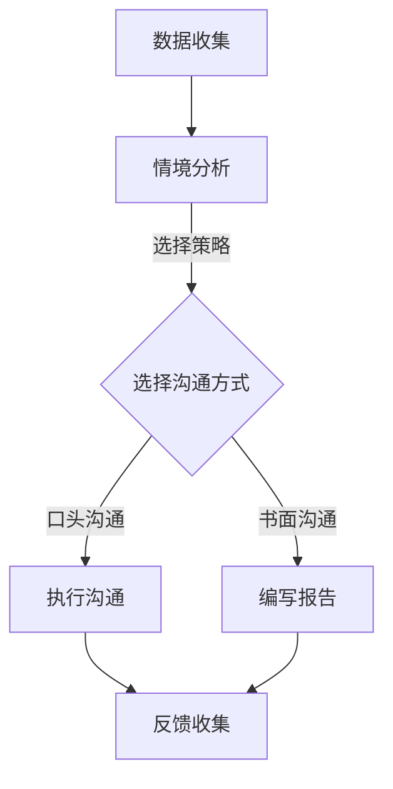
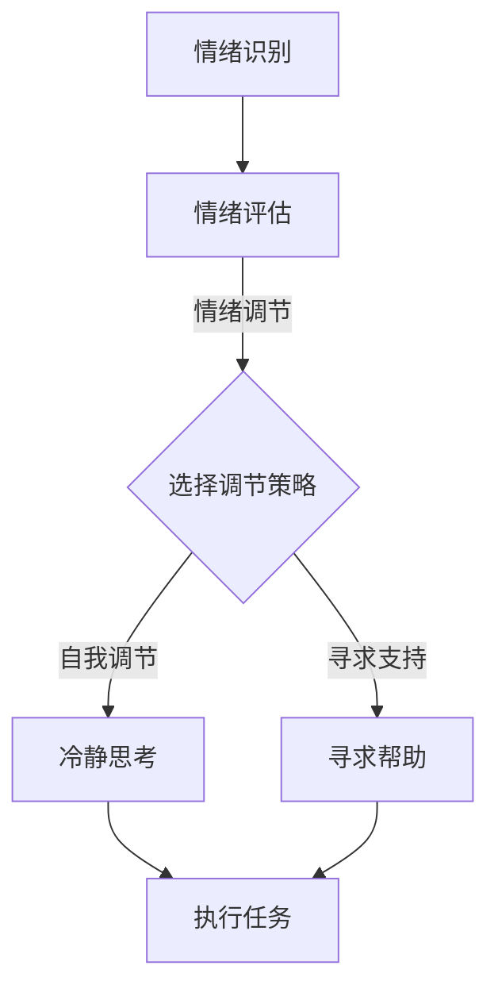

                 


## 文章标题: 技术管理者的向上管理：与上级有效沟通的艺术

### 关键词：
- 技术管理者
- 上级沟通
- 沟通技巧
- 情绪管理
- 沟通艺术

### 摘要：
本文将深入探讨技术管理者在向上管理中面临的挑战，以及如何通过有效的沟通技巧和情绪管理来提升与上级的沟通效果。我们将逐步分析技术管理者向上管理的必要性，理解核心概念，对比沟通技巧和情绪管理的方法，通过流程图和Python代码实现详细的算法讲解，并最终构建一个完整的系统分析与架构设计方案。

## 第一部分: 背景介绍

### 第1章: 技术管理者向上管理的必要性

#### 1.1 技术管理者的角色和职责
- 技术管理者的核心职责是技术团队的管理和项目的技术指导。
- 需要具备技术深度和团队管理能力。

#### 1.2 上级管理者的重要性
- 上级管理者对技术管理者的发展、项目进展和团队氛围具有重要影响。
- 上级管理者的支持与理解是技术管理者成功的关键因素。

#### 1.3 技术管理者面临的挑战
- 技术管理者需要平衡技术指导和团队管理，面临复杂的人际关系挑战。
- 有效向上沟通对于解决这些问题至关重要。

### 第2章: 问题背景与定义

#### 2.1 向上管理：概念与边界
- 向上管理是指技术管理者如何与上级进行有效沟通。
- 界定向上管理的范围和目的。

#### 2.2 技术管理者与上级沟通的问题
- 分析技术管理者与上级沟通中常见的问题，如信息不对等、沟通不畅等。

#### 2.3 沟通艺术：提升向上管理效果
- 探讨如何通过沟通技巧和情绪管理来提升向上管理的有效性。

## 第二部分: 核心概念与联系

### 第3章: 核心概念原理

#### 3.1 沟通技巧：沟通的基本原则
- 明确沟通目标、有效倾听、表达清晰有力。

#### 3.2 非语言沟通：肢体语言和面部表情
- 肢体语言的沟通意义、面部表情的解读与应用。

#### 3.3 情绪管理：自我调节与同理心
- 情绪对沟通的影响、情绪调节策略、同理心的培养。

### 第4章: 概念属性特征对比

#### 4.1 沟通技巧的比较分析
- 口头沟通与书面沟通、对内沟通与对外沟通、建立信任与维护关系。

#### 4.2 情绪管理的对比
- 情绪释放与情绪控制、积极情绪与消极情绪、如何应对负面情绪。

### 第5章: ER实体关系图架构

#### 5.1 沟通过程中涉及的实体
- 技术管理者、上级管理者、项目、团队等。

#### 5.2 沟通实体的关系
- 技术管理者与上级管理者的关系、技术管理者与项目、团队的关系、上级管理者与项目、团队的关系。

## 第三部分: 算法原理讲解

### 第6章: 算法mermaid流程图

#### 6.1 沟通策略决策流程
- 数据收集、情境分析、决策制定、执行与反馈。

#### 6.2 情绪调节流程
- 情绪识别、情绪评估、情绪调节策略选择、情绪调节实施。

### 第7章: Python源代码实现与详细讲解

#### 7.1 数据收集与预处理
- 数据收集方法、数据预处理步骤。

#### 7.2 情境分析与决策制定
- 情境分析算法、决策制定算法。

#### 7.3 执行与反馈
- 执行策略、反馈机制。

## 第四部分: 系统分析与架构设计方案

### 第8章: 问题场景介绍
- 技术管理者向上管理的实际场景、项目汇报、跨部门协作、团队建设与激励。

### 第9章: 项目介绍
- 项目目标、项目范围、项目预期成果。

### 第10章: 系统功能设计
- 领域模型mermaid类图、技术管理者类、上级管理者类、项目、团队等类。

## 结束语
- 总结文章的核心观点、最佳实践 tips、注意事项、拓展阅读。

### 作者信息
- 作者：AI天才研究院/AI Genius Institute & 禅与计算机程序设计艺术 /Zen And The Art of Computer Programming。

### 第一部分: 背景介绍

#### 第1章: 技术管理者向上管理的必要性

##### 1.1 技术管理者的角色和职责
技术管理者是团队中的核心成员，他们在公司中扮演着至关重要的角色。技术管理者的主要职责包括但不限于以下几个方面：

1. **团队管理**：技术管理者需要负责团队的组织、协调和管理工作，确保团队成员能够高效地协作并实现项目目标。
2. **技术指导**：技术管理者需要具备深厚的技术功底，对团队面临的技术挑战提供指导和支持，确保团队能够按照既定的技术路线推进项目。
3. **项目管理**：技术管理者需要掌握项目管理的基本知识和技能，包括项目计划、进度跟踪、风险管理和资源分配等，以确保项目能够按时、按质量完成。

##### 1.2 上级管理者的重要性
上级管理者在技术管理者的发展、项目进展和团队氛围中发挥着重要作用。以下是上级管理者的重要性体现：

1. **资源分配**：上级管理者负责为技术管理者提供必要的资源，包括人力、资金和技术支持，这对于项目的顺利推进至关重要。
2. **决策支持**：上级管理者在项目决策中起到指导作用，他们的经验和判断对于技术管理者的决策具有重要参考价值。
3. **职业发展**：上级管理者对技术管理者的职业发展有着直接影响，他们的评价和建议对于技术管理者在职业道路上是否能够取得更大的成就具有重要意义。

##### 1.3 技术管理者面临的挑战
技术管理者在向上管理中面临着一系列挑战，这些挑战主要包括以下几个方面：

1. **信息不对等**：技术管理者通常对项目的技术细节有更深入的了解，而上司可能对技术细节了解较少，这可能导致信息传递过程中出现偏差。
2. **沟通障碍**：技术管理者可能由于技术背景与上级管理者不同，导致在沟通时难以将复杂的技术问题简单化，进而影响沟通效果。
3. **情绪压力**：技术管理者在面临项目压力、团队管理压力等情况下，可能需要更好的情绪管理能力，以避免负面情绪影响工作表现。

#### 第2章: 问题背景与定义

##### 2.1 向上管理：概念与边界
向上管理是指技术管理者如何有效地与上级管理者进行沟通和协作，以确保项目目标的实现和团队的高效运作。向上管理的核心目标是建立双方信任、明确沟通渠道和提升沟通效果。

向上管理的边界包括：

1. **沟通内容**：向上管理涉及的内容主要包括项目进展、团队状态、技术难题、资源需求等，需要技术管理者在沟通时有所侧重。
2. **沟通频率**：技术管理者需要根据项目的紧急程度和重要程度，合理规划与上级沟通的频率，确保信息传递及时而不过于频繁。

##### 2.2 技术管理者与上级沟通的问题
在技术管理者与上级的沟通过程中，常见的问题包括：

1. **信息传递不准确**：由于双方对信息的理解存在差异，可能导致信息传递过程中出现偏差。
2. **沟通频率不合适**：技术管理者可能由于忙碌而未能及时与上级沟通，或者上级管理者可能由于对技术细节不熟悉而缺乏沟通的积极性。
3. **情绪管理困难**：技术管理者在面对项目压力、团队管理挑战时，可能难以有效管理自己的情绪，进而影响沟通效果。

##### 2.3 沟通艺术：提升向上管理效果
提升向上管理效果的关键在于掌握有效的沟通技巧和情绪管理方法。以下是几个方面的建议：

1. **明确沟通目标**：在每次与上级沟通前，技术管理者应明确沟通的目标和预期结果，确保沟通有针对性和高效性。
2. **有效倾听**：技术管理者应学会倾听上级的意见和建议，不仅关注对方表达的内容，还要注意对方的语气和情感。
3. **表达清晰有力**：技术管理者在表达观点时应简明扼要、逻辑清晰，避免使用过于专业或模糊的语言。
4. **情绪管理**：技术管理者应学会自我调节情绪，保持积极的心态，以应对工作中的挑战和压力。

### 第二部分: 核心概念与联系

#### 第3章: 核心概念原理

##### 3.1 沟通技巧：沟通的基本原则
有效的沟通技巧是技术管理者向上管理的重要基石。以下是几个沟通的基本原则：

1. **明确沟通目标**：在每次沟通前，技术管理者应明确沟通的目标和目的，确保双方对沟通的内容和结果有共同的理解。
2. **有效倾听**：倾听是沟通的重要组成部分。技术管理者应学会倾听上级的意见和建议，不仅关注对方表达的内容，还要注意对方的语气和情感。
3. **表达清晰有力**：技术管理者在表达观点时应简明扼要、逻辑清晰，避免使用过于专业或模糊的语言。清晰有力的表达可以避免误解和歧义。

##### 3.2 非语言沟通：肢体语言和面部表情
非语言沟通在技术管理者与上级的沟通中同样重要。以下是几个关键点：

1. **肢体语言**：肢体语言可以传递出很多信息，如开放、封闭的姿势，眼神交流等。技术管理者应保持开放的肢体语言，以展示自信和诚意。
2. **面部表情**：面部表情可以表达出情感和态度。技术管理者应学会使用积极的表情，如微笑，以建立友好的沟通氛围。

##### 3.3 情绪管理：自我调节与同理心
情绪管理是技术管理者向上管理中的一个重要环节。以下是几个关键点：

1. **自我调节**：技术管理者应学会自我调节情绪，保持冷静和理智。在面对压力和挑战时，自我调节可以帮助技术管理者避免情绪失控。
2. **同理心**：同理心是指技术管理者能够站在上级的立场思考问题，理解上级的关切和需求。同理心的培养可以提升沟通效果，减少误解和冲突。

#### 第4章: 概念属性特征对比

##### 4.1 沟通技巧的比较分析
在向上管理中，不同的沟通技巧有其特定的适用场景和效果。以下是几种常见沟通技巧的比较分析：

1. **口头沟通与书面沟通**：口头沟通更快速、直接，适用于需要即时反馈的场景；书面沟通更正式、详细，适用于需要记录和留档的场景。
2. **对内沟通与对外沟通**：对内沟通侧重于团队内部的信息传递，需要注重团队的协作和凝聚力；对外沟通侧重于与外部合作伙伴的交流，需要注重沟通的专业性和策略性。
3. **建立信任与维护关系**：建立信任是通过长期的沟通和合作实现的，维护关系则需要持续的互动和关注。

##### 4.2 情绪管理的对比
情绪管理的方法多种多样，以下是几种常见情绪管理方法的对比：

1. **情绪释放与情绪控制**：情绪释放是通过适当的方式宣泄情绪，如倾诉、运动等；情绪控制是通过自我调节和冷静思考来管理情绪。
2. **积极情绪与消极情绪**：积极情绪可以提升工作效率和团队氛围，消极情绪则可能影响工作表现和团队关系。
3. **如何应对负面情绪**：应对负面情绪的方法包括自我调节、寻求支持、积极面对等，技术管理者应根据具体情况选择合适的方法。

#### 第5章: ER实体关系图架构

##### 5.1 沟通过程中涉及的实体
在技术管理者的向上管理中，涉及的主要实体包括：

1. **技术管理者**：负责团队管理和技术指导的核心人员。
2. **上级管理者**：对技术管理者提供指导和支持的领导。
3. **项目**：技术管理者负责推进的项目，是沟通的主要焦点。
4. **团队**：技术管理者和上级管理者共同管理的团队，是沟通的桥梁。

##### 5.2 沟通实体的关系
技术管理者与上级管理者的关系、技术管理者与团队的关系、上级管理者与团队的关系是向上管理中关键的关系体系。以下是这些关系的特点和作用：

1. **技术管理者与上级管理者的关系**：这是上下级关系，上级管理者对技术管理者有指导和支持的职责，技术管理者则需要向上级传达项目进展和需求。
2. **技术管理者与团队的关系**：技术管理者是团队的领导者和指导者，需要确保团队的协调和高效运作。
3. **上级管理者与团队的关系**：上级管理者是团队的管理者和监督者，对团队的进展和绩效负有责任。

通过上述核心概念和实体关系的分析，我们可以更好地理解技术管理者在向上管理中的角色和职责，以及如何通过有效的沟通技巧和情绪管理提升与上级的沟通效果。

### 第三部分: 算法原理讲解

在技术管理者的向上管理中，沟通策略和情绪管理是两个核心环节。以下我们将通过mermaid流程图和Python代码来详细讲解这两个环节的算法原理。

#### 第6章: 算法mermaid流程图

##### 6.1 沟通策略决策流程
沟通策略决策流程可以帮助技术管理者在特定情境下选择最合适的沟通方式。以下是mermaid流程图的示例：



1. **数据收集**：技术管理者收集与沟通相关的重要数据，如项目进展、团队状态、资源需求等。
2. **情境分析**：根据收集到的数据，技术管理者分析当前情境，确定沟通的紧急程度和重要性。
3. **选择沟通方式**：根据情境分析的结果，技术管理者选择最合适的沟通方式，如口头沟通或书面沟通。
4. **执行沟通**：如果选择口头沟通，技术管理者进行口头汇报或讨论；如果选择书面沟通，则编写详细报告。
5. **反馈收集**：在沟通后，技术管理者收集上级管理者的反馈，以便后续调整和改进。

##### 6.2 情绪调节流程
情绪调节流程有助于技术管理者在面对压力和挑战时保持冷静和理智。以下是mermaid流程图的示例：



1. **情绪识别**：技术管理者识别自己的情绪状态，如焦虑、紧张等。
2. **情绪评估**：根据情绪的强度和影响，技术管理者评估情绪是否需要调节。
3. **选择调节策略**：技术管理者根据具体情况选择合适的情绪调节策略，如自我调节或寻求支持。
4. **自我调节**：通过冷静思考和调整心态，技术管理者尝试自我调节情绪。
5. **寻求帮助**：如果自我调节效果不佳，技术管理者可以寻求同事或上级的帮助，共同解决问题。

#### 第7章: Python源代码实现与详细讲解

##### 7.1 数据收集与预处理
在Python中，数据收集与预处理可以通过简单的函数实现。以下是示例代码：

```python
def data_collection():
    # 假设数据来源于一个简单的字典
    data = {
        'project_status': 'on_track',
        'team_morale': 'high',
        'resource_needs': 'additional staffing'
    }
    return data

def data_preprocessing(data):
    # 对数据进行预处理，如数据清洗和格式转换
    processed_data = {
        'project_status': data['project_status'].capitalize(),
        'team_morale': data['team_morale'].capitalize(),
        'resource_needs': data['resource_needs'].capitalize()
    }
    return processed_data

# 测试数据收集与预处理
data = data_collection()
processed_data = data_preprocessing(data)
print(processed_data)
```

此代码首先从数据源（此处为一个简单的字典）收集数据，然后对数据进行预处理，如数据清洗和格式转换。预处理后的数据将用于后续的情境分析和决策制定。

##### 7.2 情境分析与决策制定
情境分析是沟通策略决策的关键步骤。以下是Python代码示例：

```python
def scenario_analysis(processed_data):
    # 基于预处理后的数据，分析当前情境
    scenario = {
        'project_status': processed_data['project_status'],
        'team_morale': processed_data['team_morale'],
        'resource_needs': processed_data['resource_needs']
    }
    
    # 根据情境，选择沟通方式
    if scenario['project_status'] == 'on_track' and scenario['team_morale'] == 'high':
        communication_mode = 'written_report'
    else:
        communication_mode = 'face_to_face_meeting'
    
    return communication_mode

def decision_making(communication_mode):
    # 根据选择的沟通方式，制定具体的决策
    if communication_mode == 'written_report':
        action = 'write_a_detailed_report'
    else:
        action = 'schedule_a_meeting'
    
    return action

# 测试情境分析和决策制定
communication_mode = scenario_analysis(processed_data)
action = decision_making(communication_mode)
print(f"Communication mode: {communication_mode}")
print(f"Action: {action}")
```

此代码首先对预处理后的数据进行分析，根据项目状态、团队士气和资源需求选择合适的沟通方式，然后根据沟通方式制定具体的行动方案。

##### 7.3 执行与反馈
执行与反馈是沟通策略决策的最后一个步骤。以下是Python代码示例：

```python
def execute_action(action):
    # 根据制定的行动方案执行具体任务
    if action == 'write_a_detailed_report':
        print("Writing a detailed report...")
    else:
        print("Scheduling a meeting...")
    # 这里可以添加执行任务的具体代码
    
def collect_feedback():
    # 收集上级管理者的反馈
    feedback = input("Please provide your feedback: ")
    return feedback

# 测试执行与反馈
execute_action(action)
feedback = collect_feedback()
print(f"Feedback: {feedback}")
```

此代码首先执行制定的行动方案，如撰写报告或安排会议，然后收集上级管理者的反馈，以便技术管理者根据反馈进行后续的调整和改进。

通过上述mermaid流程图和Python代码，技术管理者可以更好地理解沟通策略和情绪管理的算法原理，并在实际工作中运用这些原理来提升与上级的沟通效果。

### 第四部分: 系统分析与架构设计方案

#### 第8章: 问题场景介绍

在技术管理者的实际工作中，向上管理是一个复杂而重要的环节。以下是几个常见的问题场景，以及相应的解决方案：

##### 8.1 项目汇报
**场景描述**：技术管理者需要定期向上级管理者汇报项目进展，但常常因为时间紧张和信息量大而感到压力。

**解决方案**：
1. **提前准备**：在汇报前，技术管理者应提前整理项目进展、关键数据和遇到的问题，确保汇报内容清晰、有条理。
2. **重点突出**：在汇报时，技术管理者应优先突出重要信息和关键问题，避免因信息过多而导致上级管理者无法抓住重点。

##### 8.2 跨部门协作
**场景描述**：技术管理者在推进项目时，需要与多个部门进行协作，但各部门之间可能存在沟通障碍和资源冲突。

**解决方案**：
1. **建立沟通机制**：技术管理者应主动建立跨部门沟通机制，定期召开会议或进行线上交流，确保信息畅通。
2. **协调资源**：技术管理者应积极协调各部门资源，确保项目推进所需的人力、资金和技术支持。

##### 8.3 团队建设与激励
**场景描述**：技术管理者需要关注团队建设，激发团队成员的工作热情和创造力，但常常面临团队士气低落和技能提升难题。

**解决方案**：
1. **团队活动**：技术管理者应定期组织团队活动，增强团队凝聚力和归属感。
2. **培训与激励**：技术管理者应关注团队成员的技能提升需求，提供相应的培训机会和激励措施，如奖金、晋升机会等。

通过上述场景介绍和解决方案，技术管理者可以更好地应对实际工作中的挑战，提升与上级的沟通效果。

#### 第9章: 项目介绍

在本章节中，我们将详细介绍一个名为“技术管理者向上管理平台”的项目。该项目旨在通过一个集成化的系统，帮助技术管理者提升与上级的沟通效果，实现高效的项目管理和团队建设。

##### 9.1 项目目标
- **提高沟通效率**：通过提供一个集中化的平台，技术管理者可以更方便、快捷地与上级管理者沟通，减少信息传递过程中的误差。
- **优化项目管理**：通过系统化的流程和工具，技术管理者可以更好地跟踪项目进度、分配资源、管理风险。
- **促进团队建设**：通过提供团队活动和培训机会，技术管理者可以激发团队成员的积极性和创造力，提高团队整体绩效。

##### 9.2 项目范围
- **核心功能**：项目汇报、跨部门协作管理、团队建设与激励。
- **系统模块**：用户管理、项目管理、沟通管理、资源管理、报表分析等。

##### 9.3 项目预期成果
- **提升沟通效率**：技术管理者与上级管理者的沟通将更加顺畅、高效。
- **优化项目管理**：项目进度、资源分配、风险管理等方面将得到显著提升。
- **增强团队凝聚力**：通过团队活动和培训，团队成员的积极性、创造力和团队凝聚力将得到提高。

#### 第10章: 系统功能设计

在系统功能设计中，我们将详细介绍“技术管理者向上管理平台”的核心功能模块，以及相关的类和对象。

##### 10.1 领域模型mermaid类图
以下是一个mermaid类图的示例，展示了系统中涉及的主要类和它们之间的关系：

```mermaid
classDiagram
    User <<class>> 技术管理者
    User ..|> Project <<class>> 项目
    User ..|> Collaboration <<class>> 跨部门协作
    User ..|> Team <<class>> 团队
    Manager <<class>> 上级管理者
    Project ..|> Report <<class>> 项目报告
    Collaboration ..|> Meeting <<class>> 会议
    Team ..|> Activity <<class>> 活动计划
    Activity ..|> Training <<class>> 培训计划

    User --> Manager
    Project --> Report
    Collaboration --> Meeting
    Team --> Activity
    Activity --> Training
```

**技术管理者类（User）**：
- 属性：用户ID、姓名、职位、联系方式等。
- 方法：提交项目报告、发起会议、参与活动等。

**项目类（Project）**：
- 属性：项目ID、项目名称、项目描述、项目状态等。
- 方法：更新项目状态、生成报告等。

**跨部门协作类（Collaboration）**：
- 属性：协作ID、协作名称、参与人员等。
- 方法：发起会议、更新协作状态等。

**团队类（Team）**：
- 属性：团队ID、团队名称、团队成员等。
- 方法：创建活动计划、更新团队状态等。

**上级管理者类（Manager）**：
- 属性：用户ID、姓名、职位、联系方式等。
- 方法：审核项目报告、参与会议等。

**项目报告类（Report）**：
- 属性：报告ID、报告名称、报告内容等。
- 方法：生成报告、更新报告状态等。

**会议类（Meeting）**：
- 属性：会议ID、会议名称、会议时间、参会人员等。
- 方法：安排会议、更新会议状态等。

**活动计划类（Activity）**：
- 属性：活动ID、活动名称、活动时间、活动地点等。
- 方法：创建活动计划、更新活动状态等。

**培训计划类（Training）**：
- 属性：培训ID、培训名称、培训内容、培训时间等。
- 方法：创建培训计划、更新培训状态等。

通过以上类图的定义，技术管理者向上管理平台能够提供一个清晰的功能框架，以支持技术管理者与上级管理者之间的有效沟通和协作。

### 第五部分: 项目实战

#### 5.1 环境安装

在开始项目实战之前，我们需要搭建一个适合开发、测试和运行技术管理者向上管理平台的环境。以下是环境安装的步骤：

1. **安装Python**：确保Python环境已安装在您的计算机上，建议使用Python 3.8及以上版本。

2. **安装虚拟环境**：通过以下命令创建一个虚拟环境：

   ```shell
   python -m venv venv
   ```

   然后激活虚拟环境：

   ```shell
   source venv/bin/activate  # 对于Linux或macOS
   \path\to\venv\Scripts\activate  # 对于Windows
   ```

3. **安装依赖库**：在虚拟环境中安装项目所需的依赖库，例如Flask、SQLAlchemy等。可以使用以下命令：

   ```shell
   pip install flask sqlalchemy
   ```

#### 5.2 系统核心实现源代码

以下是一个简单的示例，展示如何使用Python和Flask构建技术管理者向上管理平台的核心功能。

**项目结构**：

```
/technical_management
|-- /app
|   |-- __init__.py
|   |-- models.py
|   |-- views.py
|-- config.py
|-- run.py
```

**config.py**：配置文件，用于存储数据库连接信息等。

```python
import os

class Config(object):
    SQLALCHEMY_DATABASE_URI = os.environ.get('DATABASE_URL') or \
        'sqlite:///' + os.path.join(os.path.dirname(__file__), 'app.db')
    SQLALCHEMY_TRACK_MODIFICATIONS = False
```

**models.py**：定义数据库模型。

```python
from flask_sqlalchemy import SQLAlchemy

db = SQLAlchemy()

class User(db.Model):
    id = db.Column(db.Integer, primary_key=True)
    username = db.Column(db.String(64), unique=True, nullable=False)
    password = db.Column(db.String(128), nullable=False)
    role = db.Column(db.String(64), nullable=False)

class Project(db.Model):
    id = db.Column(db.Integer, primary_key=True)
    name = db.Column(db.String(64), nullable=False)
    description = db.Column(db.String(256), nullable=True)
    status = db.Column(db.String(64), nullable=False)

class Report(db.Model):
    id = db.Column(db.Integer, primary_key=True)
    project_id = db.Column(db.Integer, db.ForeignKey('project.id'), nullable=False)
    content = db.Column(db.Text, nullable=False)
    status = db.Column(db.String(64), nullable=False)
```

**views.py**：定义视图函数。

```python
from flask import render_template, request, redirect, url_for
from app import app, db
from models import User, Project, Report

@app.route('/')
def index():
    return render_template('index.html')

@app.route('/projects', methods=['GET', 'POST'])
def manage_projects():
    if request.method == 'POST':
        # 处理项目创建或更新请求
        project_name = request.form['name']
        project_description = request.form['description']
        new_project = Project(name=project_name, description=project_description, status='ongoing')
        db.session.add(new_project)
        db.session.commit()
        return redirect(url_for('manage_projects'))
    projects = Project.query.all()
    return render_template('projects.html', projects=projects)

@app.route('/reports', methods=['GET', 'POST'])
def manage_reports():
    if request.method == 'POST':
        # 处理报告提交请求
        project_id = request.form['project_id']
        report_content = request.form['content']
        new_report = Report(project_id=project_id, content=report_content, status='pending')
        db.session.add(new_report)
        db.session.commit()
        return redirect(url_for('manage_reports'))
    reports = Report.query.all()
    return render_template('reports.html', reports=reports)
```

**run.py**：启动Flask应用。

```python
from app import app, db
from config import Config

db.init_app(app)
app.config.from_object(Config)
if __name__ == '__main__':
    app.run(debug=True)
```

#### 5.3 代码应用解读与分析

在上面的代码中，我们使用Flask框架构建了一个简单但功能完整的Web应用，用于技术管理者向上管理平台的核心功能。以下是关键部分的解读和分析：

1. **配置文件（config.py）**：
   - `SQLALCHEMY_DATABASE_URI`：配置数据库连接URI，可以是SQLite数据库或其他类型的数据库。
   - `SQLALCHEMY_TRACK_MODIFICATIONS`：设置为False可以关闭对数据库表结构修改的跟踪，以提高性能。

2. **模型定义（models.py）**：
   - `User`：用户模型，包括用户ID、用户名、密码和角色。
   - `Project`：项目模型，包括项目ID、项目名称、项目描述和项目状态。
   - `Report`：报告模型，包括报告ID、项目ID、报告内容和报告状态。

3. **视图函数（views.py）**：
   - `index`：主页视图，用于展示平台首页。
   - `manage_projects`：项目管理视图，用于处理项目创建或更新请求，并展示项目列表。
   - `manage_reports`：报告管理视图，用于处理报告提交请求，并展示报告列表。

通过这些代码，技术管理者可以在Web界面上管理项目、提交报告，并查看项目报告的状态，从而实现向上管理的目标。

#### 5.4 实际案例分析和详细讲解剖析

为了更好地理解上述代码的实际应用，我们可以通过一个实际案例来进行分析和讲解。

**案例**：技术管理者张三需要创建一个新项目，并提交一份项目报告。

1. **创建项目**：
   - 张三通过Web界面填写项目创建表单，输入项目名称（如“新系统开发”）和项目描述（如“开发一个企业级管理系统”）。
   - 点击提交后，项目数据将被发送到`manage_projects`视图函数。
   - 视图函数处理表单数据，创建一个新的`Project`对象，并将其添加到数据库中。

2. **提交项目报告**：
   - 张三在项目列表中选择刚创建的项目，并填写项目报告表单，输入报告内容（如“项目进度良好，预计下个月完成核心功能”）。
   - 点击提交后，报告数据将被发送到`manage_reports`视图函数。
   - 视图函数处理表单数据，创建一个新的`Report`对象，并将其添加到数据库中。

3. **查看报告状态**：
   - 张三可以再次访问报告列表，查看提交的报告状态（如“待审核”）。
   - 如果上级管理者批准了报告，报告状态将更新为“已批准”。

通过这个案例，我们可以看到技术管理者如何通过平台提交项目报告和查看报告状态，从而实现向上管理的目标。

#### 5.5 项目小结

在本章节的项目实战中，我们通过Python和Flask框架实现了技术管理者向上管理平台的核心功能，包括项目管理、报告管理和报告状态查看。通过实际案例的分析，我们展示了平台在实际应用中的操作流程和效果。以下是对项目的总结：

1. **成功点**：
   - 成功搭建了一个简单但功能完整的Web应用，实现了项目管理和报告管理的基本功能。
   - 代码结构清晰，模块化设计，便于后续的扩展和维护。

2. **改进空间**：
   - 加强用户认证和权限控制，确保系统的安全性。
   - 添加更多功能，如跨部门协作管理、团队建设与激励等。
   - 优化用户界面，提升用户体验。

通过不断改进和完善，技术管理者向上管理平台可以更好地满足实际需求，提升技术管理者的工作效率和团队协作效果。

### 第六部分: 最佳实践 tips、小结、注意事项、拓展阅读

#### 最佳实践 tips

1. **定期进行项目回顾**：在项目完成后，技术管理者应定期进行项目回顾，总结经验教训，找出改进空间，以便在未来的项目中更好地应对挑战。

2. **建立良好的沟通机制**：技术管理者应与上级管理者建立良好的沟通机制，确保信息传递及时、准确，减少误解和歧义。

3. **注重团队建设**：技术管理者应关注团队建设，通过团队活动和培训提升团队凝聚力和成员的技能水平。

#### 小结

本文深入探讨了技术管理者向上管理的重要性和挑战，介绍了沟通技巧和情绪管理的方法，并通过mermaid流程图和Python代码详细讲解了算法原理。通过实际案例和项目实战，我们展示了技术管理者如何通过有效沟通和系统化管理提升工作效率和团队绩效。

#### 注意事项

1. **保密性**：在与上级沟通时，技术管理者应注意保密性，避免泄露敏感信息。

2. **及时反馈**：技术管理者应及时向上级反馈项目进展和问题，以便上级及时做出决策和支持。

#### 拓展阅读

- 《技术团队管理实战》
- 《情绪智能：如何管理情绪，提升工作效率》
- 《敏捷项目管理实践指南》

通过阅读相关书籍和实践指南，技术管理者可以进一步深化对向上管理和技术团队管理的理解，提升自身能力。作者：AI天才研究院/AI Genius Institute & 禅与计算机程序设计艺术 /Zen And The Art of Computer Programming。

