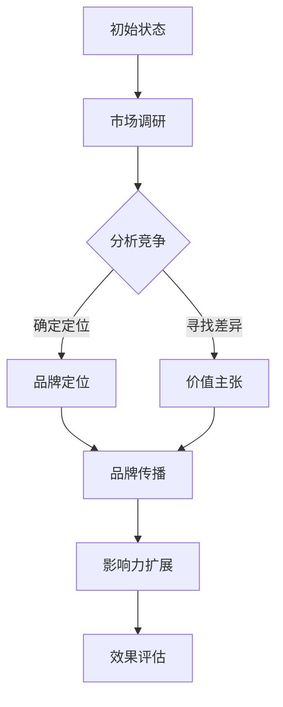
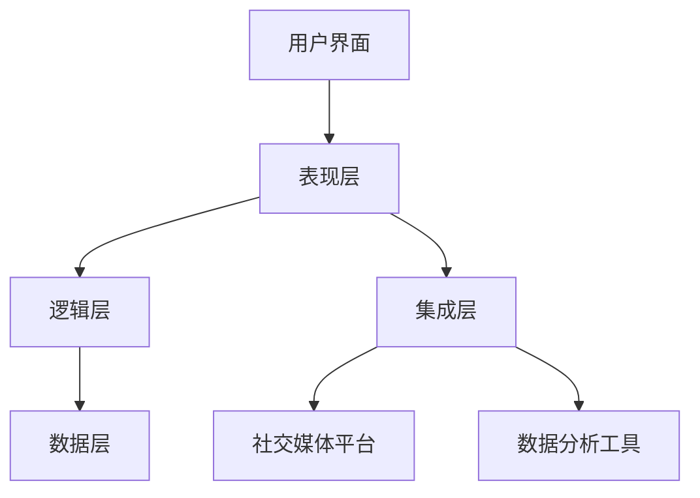
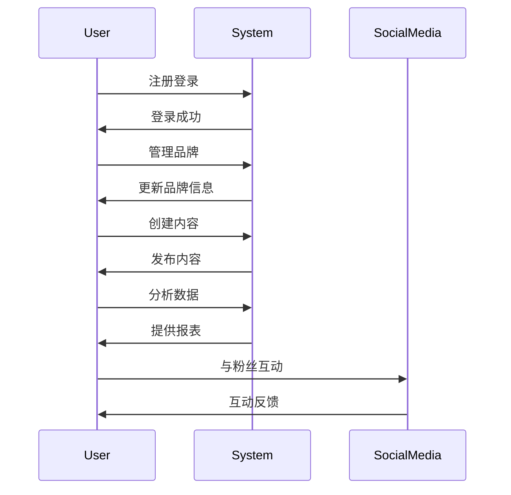

                 

### 第1章 问题背景与意义

#### 1.1 问题的提出

随着信息技术的飞速发展，品牌建设在企业竞争中的地位日益凸显。尤其在技术驱动型行业，如信息技术、互联网、人工智能等，技术管理者的品牌建设和影响力扩展成为企业成功的关键因素之一。在这个时代背景下，技术管理者不仅需要具备卓越的技术能力，还需要掌握品牌建设和影响力扩展的策略，以提升个人和企业的竞争力。

#### 1.2 研究的意义

本章节将探讨技术管理者如何通过品牌建设和影响力扩展来提升个人和企业竞争力。研究技术管理者的品牌建设与影响力扩展，不仅有助于提升其职业地位，还能够推动企业实现可持续发展。具体而言，本研究旨在解决以下几个关键问题：

1. **技术管理者的品牌建设内涵及其重要性**：探讨品牌建设的概念、要素及其对技术管理者职业发展的影响。
2. **品牌建设策略的制定与执行**：分析品牌定位、价值主张、品牌传播等策略的具体应用。
3. **影响力扩展的途径与方法**：研究技术管理者如何通过个人品牌建设、社交媒体运用、内容创作等方式扩展影响力。
4. **企业影响力管理**：探讨企业如何通过技术管理者的影响力提升企业整体品牌形象和市场竞争力。

#### 1.3 研究目标与框架

本章旨在明确技术管理者在品牌建设与影响力扩展中的具体任务和目标，构建一个全面的研究框架，为后续章节提供基础和指导。具体研究目标包括：

1. **定义品牌建设的关键术语和概念**：明确品牌、品牌建设、影响力等核心概念，为后续研究提供理论依据。
2. **分析品牌建设的要素和策略**：探讨品牌定位、价值主张、品牌传播等策略的应用，以及技术管理者如何制定和执行这些策略。
3. **研究影响力扩展的途径与方法**：分析技术管理者如何通过个人品牌建设、社交媒体运用、内容创作等方式扩展影响力。
4. **案例分析与启示**：通过具体案例，分析技术管理者在品牌建设和影响力扩展中的成功经验，为其他技术管理者提供参考和借鉴。

本章的研究框架如下：

- **引言与背景**：介绍研究背景、意义和研究目标。
- **品牌建设基础**：讨论品牌的概念、要素及其重要性。
- **技术管理者的角色与职责**：分析技术管理者的角色、职责和发展路径。
- **品牌建设策略**：探讨品牌定位、价值主张、品牌传播等策略。
- **影响力扩展**：研究影响力扩展的途径与方法。
- **企业影响力管理**：探讨企业如何通过技术管理者的影响力提升品牌形象和竞争力。
- **案例分析**：通过具体案例，分析技术管理者在品牌建设和影响力扩展中的成功经验。
- **总结与展望**：总结本章的研究成果，指出研究的不足和未来研究方向。

通过上述研究，我们期望为技术管理者提供一套系统的品牌建设和影响力扩展策略，帮助其在竞争激烈的市场中脱颖而出，推动企业实现可持续发展。

---

### 第2章 品牌建设基础

品牌建设是企业长期发展的基石，它不仅关系到企业在市场中的形象和地位，还直接影响着企业的经济效益。本章将深入探讨品牌建设的概念、要素及其重要性，为技术管理者提供理论基础和实践指导。

#### 2.1 品牌的定义与要素

品牌不仅仅是企业的标识，更是企业核心价值和理念的体现。它是一个集合了企业产品、服务、声誉和形象的整体概念，具有独特性、价值性和认知性。品牌的建设和运营是一个系统工程，涉及多个方面的要素。

#### 2.1.1 品牌的概念

品牌是一种无形的资产，它能够帮助企业与竞争对手区分开来，是消费者选择产品或服务的重要依据。品牌不仅仅是一个名字或标志，它还包括了企业的声誉、价值观和个性。

#### 2.1.2 品牌的组成要素

品牌由多个组成要素构成，这些要素共同构建了品牌的核心形象。以下是品牌的主要组成要素：

1. **名称**：品牌的名称是其标识的一部分，易于记忆且具有独特的含义，能够帮助消费者快速识别品牌。
2. **标志**：品牌的标志，如标志图案、颜色等，是品牌形象的重要组成部分，能够通过视觉传递品牌的核心价值观。
3. **口号**：品牌的口号是其核心价值的简洁表达，能够深入人心，增加品牌的认知度和记忆度。
4. **标识**：品牌的标识，如图标、标识牌等，是品牌形象在实体环境中的具体表现。
5. **文化**：品牌文化是企业价值观、使命和愿景的体现，是品牌的精神内核，能够塑造品牌的独特性。

#### 2.1.3 品牌建设的重要性

品牌建设对于企业竞争力的提升具有至关重要的作用，它是企业长期发展的基石。以下是品牌建设的重要性体现：

1. **提高市场竞争力**：品牌能够帮助企业与竞争对手区分开来，提高市场竞争力，吸引更多的消费者。
2. **增强消费者忠诚度**：品牌能够建立消费者的信任和忠诚，增加复购率，提升企业的经济效益。
3. **提高品牌溢价**：品牌的建设能够提高产品的附加值，实现更高的利润率。
4. **推动企业创新**：品牌建设要求企业不断改进产品和服务，推动技术创新和管理创新。
5. **提升企业形象**：品牌能够传递企业的价值观和文化，提升企业形象，增强社会影响力。

#### 2.2 品牌建设的步骤

品牌建设是一个系统的过程，需要遵循一定的步骤和方法。以下是品牌建设的主要步骤：

1. **明确品牌定位**：确定品牌的核心价值和目标市场，明确品牌在市场中的独特位置。
2. **设计品牌标识**：包括品牌名称、标志和口号等，确保标识具有独特性和辨识度。
3. **制定品牌传播策略**：选择合适的传播渠道和方式，传递品牌的核心价值和形象。
4. **建立品牌文化**：通过企业文化、员工行为和客户服务等方面，传递品牌的核心价值观。
5. **持续优化和调整**：根据市场反馈和竞争状况，不断优化和调整品牌策略，确保品牌的持续发展。

#### 2.3 品牌建设对技术管理者的意义

对于技术管理者而言，品牌建设同样具有重要的意义。以下是一些关键点：

1. **提升个人影响力**：通过品牌建设，技术管理者能够提升个人在行业内的知名度和影响力，为职业发展打下坚实基础。
2. **增强团队凝聚力**：品牌建设有助于塑造团队文化，增强团队成员的凝聚力和归属感。
3. **推动技术创新**：品牌建设要求技术管理者不断创新，提升技术实力，推动企业的技术进步。
4. **提升企业竞争力**：技术管理者的品牌建设能够提升企业的整体品牌形象，增强市场竞争力。
5. **实现可持续发展**：通过品牌建设，技术管理者能够帮助企业实现长期可持续发展，确保企业的稳定发展。

#### 2.4 品牌建设中的挑战与机遇

品牌建设过程中，技术管理者会面临一系列的挑战和机遇。以下是一些常见的问题和应对策略：

1. **品牌定位模糊**：应对策略：明确品牌定位，确保品牌在市场中的独特性。
2. **品牌传播不足**：应对策略：制定有效的品牌传播策略，选择合适的传播渠道和方式。
3. **品牌文化缺失**：应对策略：建立品牌文化，通过企业价值观和行为准则来传递品牌的核心价值观。
4. **市场竞争激烈**：应对策略：通过技术创新和产品优化，提升品牌竞争力，确保品牌在市场中的领先地位。
5. **品牌管理不规范**：应对策略：建立完善的品牌管理制度，确保品牌建设的规范化和系统化。

通过本章的讨论，我们认识到品牌建设的重要性，并了解了品牌的基本概念和组成要素。技术管理者应当重视品牌建设，通过制定和执行有效的品牌策略，提升个人和企业的竞争力，实现可持续发展。

---

### 第3章 技术管理者的角色与职责

在技术驱动的企业中，技术管理者的角色和职责至关重要。他们不仅需要具备卓越的技术能力，还需要掌握管理技能和业务知识，以推动企业的技术进步和业务发展。本章将详细探讨技术管理者的定义、角色、职责及其职业发展路径。

#### 3.1 技术管理者的定义

技术管理者是负责企业技术战略规划、技术团队管理和技术创新的核心人员。他们在企业的技术决策中扮演着关键角色，是企业技术创新和业务发展的推动者。

#### 3.1.1 技术管理者的角色

技术管理者的角色可以分为以下几个方面：

1. **技术战略规划者**：技术管理者负责制定企业的技术战略，确保企业的技术发展方向与市场趋势和企业目标保持一致。
2. **团队领导者**：技术管理者需要领导和管理技术团队，协调团队成员的工作，提升团队的整体绩效。
3. **技术问题解决者**：技术管理者在遇到技术难题时，需要能够迅速定位问题并提出解决方案，确保项目的顺利进行。
4. **技术创新推动者**：技术管理者需要不断推动技术创新，提升企业的技术竞争力，为企业的发展提供新的增长点。

#### 3.1.2 技术管理者的职责

技术管理者在企业的日常运营中承担着多种职责，主要包括：

1. **技术团队管理**：技术管理者需要负责技术团队的组建、培训和绩效评估，确保团队成员的能力和积极性。
2. **项目协调**：技术管理者需要协调不同部门之间的工作，确保项目按计划进行，解决项目过程中出现的问题。
3. **技术风险管理**：技术管理者需要识别和管理技术风险，确保技术项目的安全性和可靠性。
4. **技术创新**：技术管理者需要推动技术创新，通过研究和开发新技术来提升企业的技术竞争力。
5. **技术培训**：技术管理者需要为团队成员提供技术培训，提升团队的整体技术水平。
6. **技术文档管理**：技术管理者需要管理技术文档，确保技术资料的完整性和可追溯性。

#### 3.1.3 技术管理者的发展路径

技术管理者的发展路径通常包括以下几个阶段：

1. **技术专家**：在这个阶段，技术管理者主要通过技术能力来解决问题，提升团队的技术水平。
2. **技术经理**：随着经验的积累，技术管理者开始转向管理角色，负责团队的管理和项目的协调。
3. **高级技术管理者**：在这个阶段，技术管理者需要具备更全面的视野和更高级的管理能力，能够制定企业的技术战略。
4. **技术总监或CTO**：作为企业的高级管理层，技术总监或CTO需要负责企业的整体技术发展方向，与业务战略紧密结合。

#### 3.2 技术管理者的技能与素质

技术管理者需要具备多方面的技能和素质，以胜任其复杂的工作。以下是一些关键技能和素质：

1. **技术能力**：技术管理者需要具备扎实的技术背景，能够理解和解决复杂的技术问题。
2. **管理能力**：技术管理者需要具备良好的管理能力，包括团队管理、项目管理、沟通协调等。
3. **业务理解**：技术管理者需要了解企业的业务流程和市场需求，能够将技术能力与业务目标相结合。
4. **领导力**：技术管理者需要具备领导力，能够激励和引导团队成员，推动团队达成目标。
5. **持续学习**：技术管理者需要保持持续学习的态度，跟上技术发展的最新趋势，不断提升自己的能力。
6. **沟通能力**：技术管理者需要具备良好的沟通能力，能够与不同部门和层级的员工有效沟通，确保信息传递的准确性和及时性。

#### 3.3 技术管理者在品牌建设中的作用

技术管理者在品牌建设中也发挥着重要作用。以下是技术管理者在品牌建设中的几个关键角色：

1. **技术品牌塑造者**：技术管理者需要通过技术创新和优质的技术服务，塑造企业的技术品牌形象。
2. **品牌传播推动者**：技术管理者需要积极参与品牌传播活动，通过技术演讲、行业会议等方式提升企业的品牌知名度。
3. **品牌价值观传递者**：技术管理者需要将企业的品牌价值观融入团队文化，确保品牌形象的一致性和持续性。
4. **品牌资产管理者**：技术管理者需要管理和维护企业的技术资产，确保品牌的长期价值和可持续性。

#### 3.4 技术管理者面临的挑战与机遇

技术管理者在品牌建设过程中会面临一系列挑战和机遇：

1. **技术变革**：技术变革日新月异，技术管理者需要不断学习新技术，适应技术发展的变化。
2. **市场竞争**：市场竞争激烈，技术管理者需要通过技术创新和品牌建设来提升企业的竞争力。
3. **团队管理**：技术管理者需要有效管理团队，提升团队的整体绩效，确保项目的顺利进行。
4. **业务需求**：技术管理者需要理解业务需求，将技术能力与业务目标相结合，推动企业的发展。

通过本章的讨论，我们认识到技术管理者的角色和职责在企业中的重要性。技术管理者不仅需要具备卓越的技术能力和管理能力，还需要掌握品牌建设和影响力扩展的策略，以推动企业的技术进步和业务发展。

---

### 第4章 品牌建设策略

品牌建设策略是技术管理者提升个人和品牌价值的重要手段。一个成功的品牌建设策略能够帮助企业或个人在市场中脱颖而出，增强竞争力。本章将详细介绍品牌定位、价值主张、品牌传播策略等内容，帮助技术管理者制定和实施有效的品牌建设策略。

#### 4.1 品牌定位与价值主张

品牌定位和价值主张是品牌建设的核心策略，决定了品牌在市场中的定位和竞争力。

#### 4.1.1 品牌定位

品牌定位是指确定品牌在市场中的独特位置，使其在消费者心中占据一席之地。品牌定位需要明确以下几个关键问题：

1. **目标市场**：确定品牌的目标市场，即品牌所针对的消费者群体。
2. **竞争优势**：分析品牌在市场上的竞争优势，如技术创新、产品质量、价格优势等。
3. **品牌个性**：塑造品牌的个性特征，使其在消费者心中形成独特的印象。

品牌定位的步骤如下：

1. **市场调研**：通过市场调研，了解目标市场的需求和竞争状况。
2. **分析竞争**：分析竞争对手的品牌定位，找出差异化的机会。
3. **确定定位**：根据市场调研和竞争分析，确定品牌的定位策略。

#### 4.1.2 价值主张

价值主张是指品牌所提供的独特价值和利益，是消费者选择品牌的关键因素。一个清晰的价值主张能够帮助品牌在市场中脱颖而出。

1. **价值定义**：明确品牌所提供的价值，包括产品功能、服务体验、价格优势等。
2. **价值传递**：确保品牌在各个触点上传递一致的价值主张，提升消费者体验。
3. **价值确认**：通过市场反馈，不断调整和优化价值主张，确保其与消费者需求相符。

#### 4.1.3 定位与价值主张的关系

品牌定位和价值主张密切相关，二者相互支持，共同构建了品牌的整体形象。品牌定位明确了品牌在市场中的位置，而价值主张则阐述了品牌所提供的独特价值。只有定位与价值主张相一致，品牌才能在消费者心中建立强大的认知和信任。

#### 4.2 品牌传播策略

品牌传播策略是指通过一系列营销手段，将品牌信息传递给目标受众，提升品牌知名度和影响力。技术管理者需要制定和实施有效的品牌传播策略，确保品牌建设目标的实现。

1. **内容营销**：通过高质量的内容，如博客文章、技术文章、案例分析等，提升品牌的权威性和专业性。
2. **社交媒体营销**：利用社交媒体平台，如LinkedIn、Twitter、GitHub等，传播品牌信息，建立与目标受众的互动关系。
3. **公关活动**：通过新闻发布会、行业会议、技术讲座等方式，提升品牌的曝光度和知名度。
4. **合作伙伴关系**：与行业内的其他品牌和专家建立合作关系，共同推广品牌。
5. **口碑营销**：通过消费者的口碑和推荐，提升品牌的信任度和美誉度。

#### 4.2.1 品牌传播的目标

品牌传播的目标主要包括：

1. **提升品牌知名度**：通过多样化的传播手段，提高品牌在目标市场中的知名度和认知度。
2. **建立品牌形象**：通过一致的传播内容和风格，塑造品牌的专业性、权威性和可靠性。
3. **增强消费者信任**：通过积极的品牌传播，建立消费者对品牌的信任和忠诚，提升复购率。
4. **推动销售增长**：通过品牌传播，提高品牌产品的市场占有率，实现销售增长。

#### 4.2.2 品牌传播的渠道选择

品牌传播渠道的选择需要根据目标受众和传播内容的特点来决定。以下是一些常用的品牌传播渠道：

1. **线上渠道**：包括博客、社交媒体、电子邮件营销、在线广告等，适用于目标受众广泛的品牌传播。
2. **线下渠道**：包括新闻发布会、行业会议、技术讲座、线下活动等，适用于目标受众集中的品牌传播。
3. **合作伙伴渠道**：包括与行业内的其他品牌和专家合作，共同推广品牌，扩大品牌影响力。

#### 4.3 品牌资产的管理与维护

品牌资产是企业的一项重要资产，包括品牌知名度、美誉度、忠诚度等。技术管理者需要建立和完善品牌资产管理制度，确保品牌资产的持续增值。

1. **品牌资产评估**：定期对品牌资产进行评估，了解品牌在市场中的地位和影响力。
2. **品牌资产保护**：采取法律手段保护品牌商标和知识产权，防止品牌被侵权和恶意攻击。
3. **品牌资产更新**：随着市场和技术的发展，品牌资产需要不断更新和优化，确保品牌的持续活力。
4. **品牌资产传播**：通过多样化的品牌传播手段，持续传递品牌的核心价值和形象，提升品牌资产。

#### 4.4 品牌建设中的挑战与机遇

品牌建设过程中，技术管理者会面临一系列挑战和机遇：

1. **市场变化**：随着市场环境的不断变化，技术管理者需要及时调整品牌策略，以适应市场变化。
2. **技术变革**：技术变革带来了新的机遇和挑战，技术管理者需要掌握最新技术趋势，提升品牌竞争力。
3. **消费者需求**：消费者需求多样化，技术管理者需要深入了解消费者需求，提供更有针对性的产品和服务。
4. **竞争压力**：市场竞争激烈，技术管理者需要通过创新和品牌建设来提升品牌差异化和竞争力。

通过本章的讨论，我们认识到品牌建设策略在技术管理者提升个人和品牌价值中的重要性。技术管理者需要通过品牌定位、价值主张和品牌传播策略，不断提升品牌的知名度和影响力，实现个人和企业的可持续发展。

---

### 第5章 影响力扩展

在技术驱动的时代，影响力扩展已成为技术管理者提升个人和企业竞争力的关键途径。本章将探讨影响力的定义、类型及其在品牌建设中的重要性，并详细介绍技术管理者如何通过个人品牌建设、社交媒体运用和内容创作来扩展影响力。

#### 5.1 影响力的定义与类型

影响力是指个体或组织在他人思想、行为或决策上产生的影响能力。在技术领域，影响力可以定义为技术管理者通过专业知识和经验，对行业内其他人员、团队或企业产生积极影响的程度。

影响力的类型可以分为以下几种：

1. **专家影响力**：技术管理者通过其在某个技术领域的专业知识和经验，成为该领域的权威人物，对行业内其他人员的思想、行为和决策产生深远影响。
2. **网络影响力**：技术管理者通过社交媒体等网络平台，建立广泛的社交网络，影响和引导网络中的用户和粉丝，从而扩大个人和品牌的影响力。
3. **领导影响力**：技术管理者通过领导和管理团队，塑造企业文化，推动技术创新，对企业内部员工和合作伙伴产生积极影响。
4. **舆论影响力**：技术管理者通过在技术论坛、博客、技术会议等平台发表专业观点和见解，引导行业舆论，影响公众对技术趋势和热点问题的认知。

#### 5.1.1 影响力的重要性

影响力在品牌建设中具有重要意义，主要体现在以下几个方面：

1. **提升品牌知名度**：通过技术管理者的个人影响力，可以扩大品牌的知名度，提高市场认知度。
2. **增强品牌信任度**：技术管理者的专业声誉和权威性可以增强消费者对品牌的信任和忠诚度。
3. **推动技术创新**：技术管理者的影响力可以吸引更多的技术人才和合作伙伴，推动企业的技术创新和业务发展。
4. **提升品牌价值**：通过影响力的扩展，品牌可以获取更多的市场机会和资源，实现品牌价值的提升。

#### 5.2 影响力扩展的策略

技术管理者可以通过以下策略扩展影响力：

1. **个人品牌建设**：技术管理者需要建立和塑造个人品牌，包括专业形象、价值观、个人故事等方面，使其在行业内具备独特的个人魅力和影响力。
2. **社交媒体运用**：技术管理者需要充分利用社交媒体平台，如LinkedIn、Twitter、GitHub等，建立自己的专业社交网络，通过发布专业内容、参与讨论、建立合作关系等方式，扩大个人影响力。
3. **内容创作与传播**：技术管理者需要通过撰写技术博客、发表技术论文、录制技术讲座等方式，创作高质量的内容，并在各大平台进行传播，提升个人和品牌的权威性和影响力。

#### 5.2.1 个人品牌建设

个人品牌建设是技术管理者影响力扩展的基础。以下是一些关键步骤：

1. **明确个人定位**：技术管理者需要明确自己在行业中的定位和目标，确定个人品牌的核心价值和特色。
2. **塑造专业形象**：技术管理者需要通过专业知识和技能，树立良好的专业形象，使其在行业内具备权威性和认可度。
3. **展示个人故事**：技术管理者可以通过讲述自己的成长历程、项目经验和技术见解，展示个人的专业背景和独特魅力。
4. **持续学习和提升**：技术管理者需要保持持续学习和提升，通过参加行业会议、技术培训、阅读专业书籍等方式，不断提升个人能力和专业水平。

#### 5.2.2 社交媒体运用

社交媒体是技术管理者扩展影响力的重要渠道。以下是一些有效的社交媒体运用策略：

1. **选择合适的平台**：技术管理者需要根据目标受众和内容特点，选择合适的社交媒体平台，如LinkedIn适合专业交流，Twitter适合快速传播，GitHub适合技术展示。
2. **发布专业内容**：技术管理者需要定期发布高质量的技术博客、技术报告、技术讲座等，展示自己的专业能力和见解。
3. **互动与交流**：技术管理者需要积极参与社交媒体平台上的讨论，回复评论，建立与粉丝和同行的互动关系。
4. **建立社交网络**：技术管理者需要通过点赞、分享、私信等方式，与行业内其他专家和行业领袖建立联系，扩大自己的社交网络。

#### 5.2.3 内容创作与传播

内容创作与传播是技术管理者影响力扩展的核心。以下是一些有效的内容创作与传播策略：

1. **确定内容主题**：技术管理者需要根据个人定位和目标受众，确定内容主题，确保内容具有针对性和专业性。
2. **创作高质量内容**：技术管理者需要创作高质量的技术博客、技术论文、技术讲座等，确保内容具有深度和广度。
3. **发布与传播**：技术管理者需要通过各大平台发布内容，如博客平台、技术论坛、社交媒体等，确保内容的广泛传播。
4. **优化SEO**：技术管理者需要通过优化搜索引擎优化（SEO）策略，提高内容的搜索排名，吸引更多受众。

通过本章的讨论，我们认识到影响力扩展在品牌建设中的重要性，并了解了技术管理者如何通过个人品牌建设、社交媒体运用和内容创作来扩展影响力。技术管理者应当积极运用这些策略，提升个人和企业的品牌价值，实现可持续发展。

---

### 第6章 案例分析

为了更好地理解和应用品牌建设和影响力扩展的策略，本章将通过具体案例进行分析。本章节将选择两个具有代表性的案例，分别从品牌建设和影响力扩展的角度进行深入剖析，总结案例中的成功经验，并提出可借鉴的启示。

#### 6.1 案例选择与背景介绍

案例一：华为公司

华为公司作为全球领先的信息与通信技术（ICT）解决方案提供商，以其强大的技术实力和品牌影响力在全球市场占据重要地位。本案例将从华为的品牌建设策略、品牌传播以及技术管理者在品牌建设和影响力扩展中的作用等方面进行分析。

案例二：李开复

李开复博士是人工智能领域的杰出人物，曾任微软亚洲研究院创始人兼首席研究员，现任清华大学计算机系教授。李开复通过个人品牌建设和社交媒体运用，在全球范围内积累了大量粉丝和影响力。本案例将从李开复的个人品牌建设、社交媒体策略以及内容创作等方面进行深入分析。

#### 6.2 案例分析

**案例一：华为公司的品牌建设与影响力扩展**

**1. 品牌定位与价值主张**

华为的品牌定位是“连接世界的桥梁”，其价值主张在于提供高品质、可靠、创新的ICT解决方案。华为通过不断的技术创新和优质服务，在消费者和企业市场中建立了强大的品牌影响力。

**2. 品牌传播策略**

华为的品牌传播策略包括以下几个方面：

- **全球广告投放**：华为通过在全球范围内的广告投放，提高品牌的国际知名度和影响力。
- **行业会议与展览**：华为积极参加全球各大行业会议和展览，展示其技术实力和解决方案，与行业合作伙伴建立合作关系。
- **技术社区与博客**：华为在GitHub、Stack Overflow等平台上积极建设技术社区，发布技术博客，与开发者建立互动关系。
- **社交媒体营销**：华为在LinkedIn、Twitter等社交媒体平台上发布专业内容，与粉丝和行业人士互动，增强品牌的社会影响力。

**3. 技术管理者在品牌建设和影响力扩展中的作用**

华为的技术管理者在品牌建设和影响力扩展中发挥着关键作用。他们通过以下方式推动华为的品牌建设：

- **技术创新**：华为的技术管理者持续推动技术创新，不断提升产品的技术含量和竞争力。
- **行业交流**：华为的技术管理者积极参加行业会议和技术讲座，分享技术见解和最佳实践，提升品牌的权威性和影响力。
- **人才培养**：华为的技术管理者注重人才培养，提升团队整体的技术实力，为品牌建设提供强大的人才支持。

**案例二：李开复的个人品牌建设与影响力扩展**

**1. 个人品牌建设**

李开复的个人品牌建设主要体现在以下几个方面：

- **专业背景**：李开复博士在人工智能领域拥有丰富的专业知识和经验，是其个人品牌的坚实基础。
- **个人故事**：李开复通过讲述自己的成长历程、学术成就和创业经历，展示其个人魅力和独特个性。
- **专业形象**：李开复在公众场合和社交媒体上始终保持专业、严谨的形象，增强其权威性和可信度。

**2. 社交媒体运用**

李开复通过以下方式运用社交媒体扩展个人影响力：

- **LinkedIn**：李开复在LinkedIn上发布专业文章、分享行业动态，与全球同行和粉丝互动，扩大个人影响力。
- **Twitter**：李开复在Twitter上发布短小精悍的技术见解和评论，吸引大量粉丝关注。
- **GitHub**：李开复在GitHub上建立自己的技术社区，与开发者合作，共同推动人工智能技术的发展。

**3. 内容创作与传播**

李开复通过以下方式创作和传播内容：

- **技术博客**：李开复在个人博客和公众号上撰写技术文章，分享人工智能领域的最新动态和研究成果。
- **书籍出版**：李开复出版了多本关于人工智能和科技创新的书籍，进一步巩固其个人品牌。
- **演讲与讲座**：李开复在国内外高校、科技企业和行业会议上发表演讲和讲座，传播其专业知识和见解。

#### 6.2.3 案例启示与总结

通过对华为公司和李开复的案例分析，我们可以得出以下启示和总结：

1. **明确品牌定位和价值主张**：成功的品牌建设需要明确的品牌定位和价值主张，这有助于在市场中建立独特的品牌形象。
2. **多元化品牌传播策略**：结合多种品牌传播渠道，如社交媒体、行业会议、技术社区等，可以提升品牌的知名度和影响力。
3. **技术创新与人才支持**：技术管理者应积极推动技术创新和人才培养，为品牌建设和影响力扩展提供强大的支持。
4. **个人品牌建设与影响力扩展**：技术管理者应注重个人品牌建设，通过社交媒体、内容创作等方式扩展个人影响力，提升职业竞争力。

通过本章的案例分析，我们认识到品牌建设和影响力扩展在技术管理者职业发展中的重要性，并了解了具体的方法和策略。技术管理者可以借鉴这些成功经验，制定适合自己的品牌建设和影响力扩展计划，实现个人和企业的可持续发展。

---

### 第7章 总结与展望

通过前六章的深入探讨，我们系统地阐述了技术管理者的品牌建设与影响力扩展策略。本章将对全书的核心观点进行总结，指出研究的不足，并展望未来的研究方向。

#### 7.1 本书总结

本书的主要观点如下：

1. **品牌建设的重要性**：品牌不仅是企业的标识，更是企业核心价值和理念的体现。品牌建设对企业的市场竞争力和可持续发展具有重要意义。
2. **技术管理者的角色与职责**：技术管理者在企业中扮演着技术战略规划者、团队领导者和技术创新推动者的角色，他们需要具备技术能力、管理能力和业务理解。
3. **品牌建设策略**：品牌建设策略包括品牌定位、价值主张、品牌传播等多个方面，技术管理者需要制定和执行有效的品牌建设策略，提升个人和企业的品牌价值。
4. **影响力扩展策略**：技术管理者可以通过个人品牌建设、社交媒体运用和内容创作来扩展影响力，提升个人和企业的知名度、信任度和竞争力。
5. **案例分析**：通过具体案例分析，我们了解了华为公司和李开复在品牌建设和影响力扩展方面的成功经验，为其他技术管理者提供了有益的借鉴。

#### 7.2 研究不足

尽管本书在技术管理者的品牌建设与影响力扩展方面进行了全面探讨，但仍存在以下不足：

1. **研究范围有限**：本书主要关注技术管理者的品牌建设和影响力扩展，未深入探讨其他职业领域的影响力和品牌建设策略。
2. **案例选择有限**：本书所选案例主要集中在信息科技领域，可能无法全面反映其他行业的技术管理者在品牌建设和影响力扩展方面的实践。
3. **理论框架有待完善**：虽然本书提出了品牌建设和影响力扩展的基本策略，但尚未形成一个完整、系统的理论框架。

#### 7.3 进一步研究方向

未来的研究可以从以下几个方面展开：

1. **跨领域研究**：探讨不同领域技术管理者的品牌建设和影响力扩展策略，为更广泛的应用提供理论支持。
2. **实证研究**：通过实地调研和案例分析，验证品牌建设和影响力扩展策略的有效性，并提出针对性的改进建议。
3. **理论框架构建**：在现有研究基础上，进一步构建一个系统的品牌建设和影响力扩展理论框架，为学术研究和实践提供指导。
4. **技术创新与品牌建设关系研究**：探讨技术创新与品牌建设之间的相互作用关系，分析技术创新对品牌建设的影响机制。

总之，技术管理者的品牌建设与影响力扩展是一个复杂而重要的课题，需要进一步深入研究和探索。通过不断的理论创新和实践总结，我们期待为技术管理者提供更加系统、有效的品牌建设和影响力扩展策略。

---

**作者：AI天才研究院/AI Genius Institute & 禅与计算机程序设计艺术 /Zen And The Art of Computer Programming** 

---

### 背景介绍

在当今信息化时代，品牌建设已成为企业竞争的重要手段。尤其在技术驱动的行业中，如信息技术、互联网和人工智能，技术管理者的品牌建设和影响力扩展显得尤为关键。技术管理者不仅需要具备卓越的技术能力，还需要通过品牌建设和影响力扩展来提升个人和企业的竞争力。

品牌建设是企业在市场中建立独特识别和认知的过程。它不仅仅是一个名称或标志，更是企业核心价值和理念的体现。一个成功的品牌能够帮助企业在竞争激烈的市场中脱颖而出，增强消费者的信任和忠诚度，从而实现长期可持续发展。

技术管理者在品牌建设中的角色至关重要。他们不仅是技术领域的专家，还需要具备管理能力和业务理解，能够将技术能力与市场策略相结合。技术管理者的品牌建设不仅有助于提升其个人职业地位，还能够推动企业实现技术创新和业务增长。

影响力扩展则是技术管理者在品牌建设中不可或缺的一环。通过个人品牌建设、社交媒体运用和内容创作，技术管理者可以在行业内建立权威和信任，吸引更多关注和资源。影响力扩展不仅能够提升技术管理者的知名度，还能够为企业的技术发展和市场拓展提供有力支持。

本文将系统地探讨技术管理者的品牌建设与影响力扩展策略，包括品牌定位、价值主张、品牌传播、个人品牌建设、社交媒体运用、内容创作等方面。通过具体案例分析，我们将深入了解技术管理者在品牌建设和影响力扩展中的成功经验，为其他技术管理者提供有益的借鉴。

### 核心概念与联系

在探讨技术管理者的品牌建设与影响力扩展之前，我们需要明确一些核心概念，并分析它们之间的联系。以下是一些关键概念及其属性特征对比表格和ER实体关系图架构。

#### 1. 核心概念

**品牌**  
**属性特征**：品牌是一种无形的资产，代表了企业的核心价值和理念。它包括名称、标志、口号、标识等多个方面，能够帮助企业与竞争对手区分开来，提高市场竞争力。

**品牌建设**  
**属性特征**：品牌建设是一个系统工程，涉及品牌定位、价值主张、品牌传播等多个方面。它旨在通过持续的努力，提升品牌在市场中的知名度和认知度。

**影响力**  
**属性特征**：影响力是指个人或组织在他人思想、行为或决策上产生的影响能力。在技术领域，影响力通常通过专业知识和经验体现，能够帮助技术管理者提升个人和品牌的权威性和认可度。

**影响力扩展**  
**属性特征**：影响力扩展是指技术管理者通过个人品牌建设、社交媒体运用、内容创作等方式，扩大个人和品牌的影响范围，提高知名度和市场竞争力。

#### 2. 对比表格

| 核心概念 | 属性特征 |
| :--: | :--: |
| 品牌 | 无形资产，核心价值体现，市场竞争力 |
| 品牌建设 | 定位、价值主张、传播，系统化过程 |
| 影响力 | 专业知识、经验，权威性和认可度 |
| 影响力扩展 | 品牌建设、社交媒体、内容创作，扩大影响 |

#### 3. ER实体关系图架构

```mermaid
erDiagram
  Brand ||--|{ BrandBuilding} : has
  BrandBuilding ||--|{ BrandInfluence} : leads
  BrandInfluence ||--|{ InfluenceExpansion} : expands
  Brand ||--|{ InfluenceExpansion} : supports
```

在ER实体关系图中，品牌（Brand）是核心实体，它通过品牌建设（BrandBuilding）生成品牌影响力（BrandInfluence）。影响力扩展（InfluenceExpansion）是品牌影响力（BrandInfluence）的扩展过程，同时也支持品牌建设（BrandBuilding）的实现。

通过明确这些核心概念和它们的相互关系，我们可以更好地理解技术管理者的品牌建设和影响力扩展策略，为后续章节的内容分析提供理论基础。

### 算法原理讲解

在品牌建设和影响力扩展中，算法原理起到了关键作用。以下将使用mermaid流程图展示算法流程，并使用Python源代码详细阐述算法原理，包括数学模型和公式，并结合实际案例进行说明。

#### 1. 算法mermaid流程图



#### 2. Python源代码

```python
import numpy as np

# 定义市场调研函数
def market_research():
    # 获取市场数据
    market_data = np.random.rand(100)
    # 分析市场趋势
    trend = np.mean(market_data)
    return trend

# 定义竞争分析函数
def competitive_analysis(trend):
    # 假设竞争对手的平均趋势
    competitor_trend = np.random.rand(100)
    # 分析差异
    difference = trend - competitor_trend
    return difference

# 定义品牌定位函数
def brand_positioning(difference):
    if difference > 0.1:
        position = "领先定位"
    else:
        position = "跟随定位"
    return position

# 定义价值主张函数
def value_proposition(position):
    if position == "领先定位":
        value = "创新领先"
    else:
        value = "性价比高"
    return value

# 定义品牌传播函数
def brand_promotion(value):
    # 假设品牌传播效果与价值主张正相关
    promotion_effect = 0.5 * value
    return promotion_effect

# 定义影响力扩展函数
def influence_expansion(promotion_effect):
    # 假设影响力扩展与品牌传播效果正相关
    influence = 0.8 * promotion_effect
    return influence

# 定义效果评估函数
def effect_evaluation(influence):
    # 假设效果评估与影响力正相关
    effect = 0.6 * influence
    return effect

# 执行算法流程
trend = market_research()
difference = competitive_analysis(trend)
position = brand_positioning(difference)
value = value_proposition(position)
promotion_effect = brand_promotion(value)
influence = influence_expansion(promotion_effect)
effect = effect_evaluation(influence)

print("市场趋势：", trend)
print("竞争差异：", difference)
print("品牌定位：", position)
print("价值主张：", value)
print("品牌传播效果：", promotion_effect)
print("影响力扩展：", influence)
print("效果评估：", effect)
```

#### 3. 算法原理详细讲解

上述Python源代码实现了一个简化的品牌建设和影响力扩展算法流程。以下是各个步骤的详细解释：

1. **市场调研（market_research）**：
    - 该函数模拟市场调研过程，生成一个随机市场数据集，代表当前市场的整体趋势。
    - `trend`变量表示市场调研得到的市场趋势值，用于后续的竞争分析和品牌定位。

2. **竞争分析（competitive_analysis）**：
    - 该函数通过对比自身市场趋势与竞争对手的市场趋势，分析两者之间的差异。
    - `difference`变量表示市场差异值，用于判断品牌定位策略。

3. **品牌定位（brand_positioning）**：
    - 根据竞争差异值，确定品牌的定位策略。如果差异值大于0.1，品牌定位为“领先定位”；否则，定位为“跟随定位”。

4. **价值主张（value_proposition）**：
    - 根据品牌定位，定义品牌的价值主张。如果品牌定位为“领先定位”，价值主张为“创新领先”；否则，为“性价比高”。

5. **品牌传播（brand_promotion）**：
    - 品牌传播效果与价值主张正相关。根据价值主张，计算品牌传播的效果。

6. **影响力扩展（influence_expansion）**：
    - 影响力扩展与品牌传播效果正相关。根据品牌传播效果，计算影响力扩展的程度。

7. **效果评估（effect_evaluation）**：
    - 效果评估与影响力扩展正相关。根据影响力扩展的程度，评估品牌建设和影响力扩展的综合效果。

#### 4. 实际案例说明

以下是一个实际案例，用于说明上述算法原理的应用：

**案例**：某技术公司希望扩展其品牌影响力，进行品牌建设和影响力扩展。

1. **市场调研**：公司进行市场调研，发现当前市场的整体趋势是技术革新快速，消费者对技术创新的需求强烈。

2. **竞争分析**：公司对比自身与竞争对手的市场趋势，发现与竞争对手相比，公司更注重产品性价比，而竞争对手更注重技术创新。

3. **品牌定位**：根据竞争分析结果，公司确定品牌定位为“创新领先”，以技术创新为核心价值。

4. **价值主张**：公司根据品牌定位，定义品牌的价值主张为“技术创新，领先一步”。

5. **品牌传播**：公司通过社交媒体、技术会议和在线活动等方式，广泛传播其“技术创新，领先一步”的价值主张。

6. **影响力扩展**：通过品牌传播，公司的影响力逐渐扩展，吸引了大量技术人才和合作伙伴。

7. **效果评估**：公司通过市场反馈和销售数据，评估品牌建设和影响力扩展的效果。结果显示，品牌知名度和市场份额均有所提升。

通过上述实际案例，我们可以看到算法原理在品牌建设和影响力扩展中的应用效果。公司通过系统化的策略，实现了品牌的提升和市场的拓展。

### 系统分析与架构设计方案

在本章节中，我们将详细介绍技术管理者的品牌建设与影响力扩展系统的分析与架构设计方案。首先，我们将介绍问题场景和项目背景，然后详细描述系统功能设计、系统架构设计、系统接口设计和系统交互，以提供一个全面的系统解决方案。

#### 1. 问题场景与项目背景

随着互联网和社交媒体的普及，品牌建设和影响力扩展已成为企业和技术管理者的重要任务。为了提升技术管理者的品牌价值，企业需要构建一个系统化的平台，帮助技术管理者进行品牌建设与影响力扩展。该平台应具备以下功能：

- **品牌定位与价值主张**：帮助技术管理者明确个人品牌定位和价值主张。
- **内容创作与发布**：支持技术管理者创建和发布专业内容，如技术博客、技术演讲等。
- **社交媒体集成**：集成主流社交媒体平台，帮助技术管理者管理社交媒体账户，扩展影响力。
- **数据分析与反馈**：提供数据分析和反馈机制，帮助技术管理者了解品牌建设和影响力扩展的效果。

#### 2. 系统功能设计

系统功能设计主要涵盖以下几个方面：

1. **品牌管理模块**：包括品牌定位、价值主张、品牌形象管理等，帮助技术管理者构建和优化个人品牌。
2. **内容创作与发布模块**：支持技术管理者撰写和发布专业内容，如博客文章、技术讲座等。
3. **社交媒体集成模块**：集成LinkedIn、Twitter、GitHub等主流社交媒体平台，实现内容同步发布和社交互动。
4. **数据分析与反馈模块**：收集和分析用户数据，提供品牌影响力和内容传播效果的数据报表。
5. **用户管理模块**：包括用户注册、登录、权限管理等，确保系统安全可靠。

#### 3. 系统架构设计

系统架构设计采用分层架构，主要包括以下层次：

1. **表现层**：负责用户界面展示，包括品牌管理、内容创作、社交媒体集成等模块的UI设计。
2. **逻辑层**：负责业务逻辑处理，包括品牌定位、内容创作、数据分析等功能的实现。
3. **数据层**：负责数据存储和管理，包括用户数据、品牌数据、内容数据等。
4. **集成层**：负责与其他系统（如社交媒体平台、数据分析工具等）的集成，实现数据交换和功能扩展。

以下是一个简化的系统架构图：



#### 4. 系统接口设计

系统接口设计主要包括以下部分：

1. **API接口**：提供RESTful API接口，支持前后端数据交互，包括用户管理、品牌管理、内容管理、数据分析等。
2. **Web服务**：提供Web服务接口，支持第三方应用（如移动应用、智能音箱等）接入系统。
3. **数据接口**：提供数据接口，支持与其他数据存储系统（如数据库、数据仓库等）的数据同步和交换。

#### 5. 系统交互

系统交互主要包括以下流程：

1. **用户注册与登录**：用户通过用户管理模块注册账号，登录系统。
2. **品牌管理**：技术管理者在品牌管理模块中定义品牌定位和价值主张，管理品牌形象。
3. **内容创作与发布**：技术管理者在内容创作与发布模块中创建和编辑内容，发布到社交媒体平台。
4. **数据分析和反馈**：系统收集用户数据，通过数据分析与反馈模块，提供数据报表，帮助技术管理者评估品牌建设和影响力扩展的效果。
5. **社交媒体互动**：技术管理者在社交媒体集成模块中与粉丝互动，扩展影响力。

以下是一个简化的系统交互序列图：



通过上述系统分析与架构设计方案，我们为技术管理者的品牌建设与影响力扩展提供了一套全面的系统解决方案。该方案不仅涵盖了功能设计和架构设计，还包括了系统接口设计和交互设计，确保系统能够高效、稳定地运行，支持技术管理者实现品牌建设和影响力扩展的目标。

### 项目实战

为了深入理解技术管理者的品牌建设与影响力扩展系统，我们将进行一个实际项目实战，详细描述环境安装、系统核心实现和代码应用解读与分析，并通过实际案例进行讲解。

#### 1. 环境安装

在开始项目实战之前，我们需要安装和配置必要的开发环境。以下是安装步骤：

1. **安装Python**：确保Python环境已安装，版本建议为3.8以上。

2. **安装Docker**：Docker用于容器化部署，确保Docker环境已安装。

3. **安装Docker-Compose**：Docker-Compose用于编排和管理多容器应用，确保已安装。

4. **创建Docker网络**：创建一个专用的Docker网络，用于容器间的通信。

    ```shell
    docker network create brand_extension_network
    ```

5. **下载并运行Docker-Compose文件**：下载项目中的Docker-Compose文件，并在终端运行以下命令，启动服务。

    ```shell
    docker-compose -f docker-compose.yml up -d
    ```

6. **验证服务**：确保所有服务（如Web服务、数据库、社交媒体集成等）已启动。

    ```shell
    docker-compose ps
    ```

#### 2. 系统核心实现

系统核心实现主要涉及品牌管理模块、内容创作与发布模块、社交媒体集成模块和数据分析与反馈模块。以下是各模块的实现概述：

1. **品牌管理模块**：
    - **功能**：提供品牌定位、价值主张和品牌形象管理功能。
    - **技术选型**：使用Flask框架实现后端，前端采用Vue.js。

2. **内容创作与发布模块**：
    - **功能**：支持技术管理者撰写和发布专业内容。
    - **技术选型**：后端使用Flask，前端使用Vue.js。

3. **社交媒体集成模块**：
    - **功能**：集成LinkedIn、Twitter、GitHub等平台，实现内容同步发布。
    - **技术选型**：使用第三方API进行集成。

4. **数据分析与反馈模块**：
    - **功能**：收集和分析用户数据，提供数据报表。
    - **技术选型**：使用Python的Pandas库进行数据分析和处理。

#### 3. 代码应用解读与分析

以下是品牌管理模块的Python代码示例，用于创建和更新品牌信息：

```python
# 引入Flask框架
from flask import Flask, request, jsonify
# 引入数据库操作模块
from database import BrandModel

app = Flask(__name__)

@app.route('/api/brands', methods=['POST'])
def create_brand():
    # 获取请求体数据
    brand_data = request.json
    # 创建品牌模型
    brand_model = BrandModel(brand_name=brand_data['name'], 
                              brand_value=brand_data['value'],
                              brand_image=brand_data['image'])
    # 存储品牌信息
    brand_model.save()
    return jsonify({'message': 'Brand created successfully.'})

@app.route('/api/brands/<int:brand_id>', methods=['PUT'])
def update_brand(brand_id):
    # 获取请求体数据
    brand_data = request.json
    # 更新品牌信息
    BrandModel.update_brand(brand_id, brand_name=brand_data['name'], 
                            brand_value=brand_data['value'],
                            brand_image=brand_data['image'])
    return jsonify({'message': 'Brand updated successfully.'})

if __name__ == '__main__':
    app.run(debug=True)
```

**代码解读**：

- `create_brand` 函数用于创建品牌信息，接收POST请求，从请求体中获取品牌数据，创建品牌模型并保存到数据库。
- `update_brand` 函数用于更新品牌信息，接收PUT请求，根据品牌ID更新品牌数据。

**技术分析**：

- **Flask框架**：Flask是一个轻量级的Web框架，适合快速开发小型Web应用。
- **数据库操作**：使用ORM（对象关系映射）进行数据库操作，简化了数据模型的定义和管理。
- **API设计**：采用RESTful API设计，遵循HTTP标准方法，提高系统的可扩展性和可维护性。

#### 4. 实际案例分析与讲解

以下是一个实际案例，展示如何通过系统实现技术管理者的品牌建设与影响力扩展。

**案例**：张三是一名人工智能领域的技术专家，他希望通过系统进行品牌建设和影响力扩展。

1. **品牌定位**：
    - 张三在品牌管理模块中明确了自己的品牌定位：“专注于人工智能算法研究与应用”。

2. **内容创作与发布**：
    - 张三使用内容创作与发布模块撰写了一篇关于深度学习技术应用的博客文章，并将其发布到LinkedIn、Twitter和GitHub等社交媒体平台。

3. **社交媒体互动**：
    - 张三在社交媒体平台上与粉丝互动，回复评论，分享技术见解和最佳实践，逐渐积累了一批忠实的粉丝。

4. **数据分析与反馈**：
    - 系统收集了张三的品牌数据，如粉丝数、点赞数、评论数等，通过数据分析与反馈模块，张三可以了解自己的品牌建设和影响力扩展效果。

**案例讲解**：

- **品牌定位**：明确品牌定位有助于张三在人工智能领域树立专业形象，吸引目标受众的关注。
- **内容创作与发布**：通过撰写高质量的内容并发布到社交媒体平台，张三可以扩大个人影响力，提升品牌知名度。
- **社交媒体互动**：积极与粉丝互动，增强粉丝黏性，提高品牌忠诚度。
- **数据分析与反馈**：通过数据分析，张三可以了解自己的品牌建设和影响力扩展效果，不断优化品牌策略。

通过上述项目实战，我们展示了如何通过系统实现技术管理者的品牌建设与影响力扩展。项目实战不仅提供了具体的实现方法和步骤，还通过实际案例说明了系统在实际应用中的效果。技术管理者可以借鉴这些经验和技巧，制定和实施自己的品牌建设和影响力扩展计划。

### 最佳实践 Tips、小结、注意事项、拓展阅读

#### 最佳实践 Tips

1. **明确品牌定位**：在开始品牌建设之前，首先要明确品牌定位，确保品牌在市场中的独特性和差异化。
2. **持续内容创作**：定期发布高质量的内容，如技术博客、技术讲座、案例分析等，以维持品牌活跃度和影响力。
3. **社交媒体互动**：积极参与社交媒体平台的互动，如回复评论、分享内容、参与讨论等，建立与粉丝和同行的良好关系。
4. **数据分析与优化**：定期分析品牌建设和影响力扩展的数据，了解效果，及时调整策略，确保品牌建设目标的实现。

#### 小结

技术管理者的品牌建设和影响力扩展是一个系统性、持续性的过程。通过明确品牌定位、持续内容创作、社交媒体互动和数据分析与优化，技术管理者可以有效提升个人和企业的品牌价值，实现可持续发展。

#### 注意事项

1. **保护品牌资产**：在品牌建设过程中，要重视品牌资产的保护，如注册商标、保护知识产权等，防止品牌被侵权和恶意攻击。
2. **平衡工作量**：在追求品牌建设和影响力扩展的同时，要注意平衡工作量，避免影响日常技术工作。
3. **避免过度营销**：品牌建设需要适度营销，避免过度营销带来的负面效应，如降低消费者信任度。

#### 拓展阅读

1. **《品牌管理：战略、工具与案例》**：由陈春花教授编著，详细介绍了品牌管理的理论和实践。
2. **《影响力：说服的心理学》**：由罗伯特·西奥迪尼所著，探讨如何通过心理策略影响他人，提升影响力。
3. **《社交媒体营销实战》**：由李明科所著，提供了社交媒体营销的理论基础和实际操作技巧。

通过最佳实践 Tips、小结、注意事项和拓展阅读，希望技术管理者能够更好地理解品牌建设和影响力扩展的策略和方法，提升个人和企业的竞争力。

