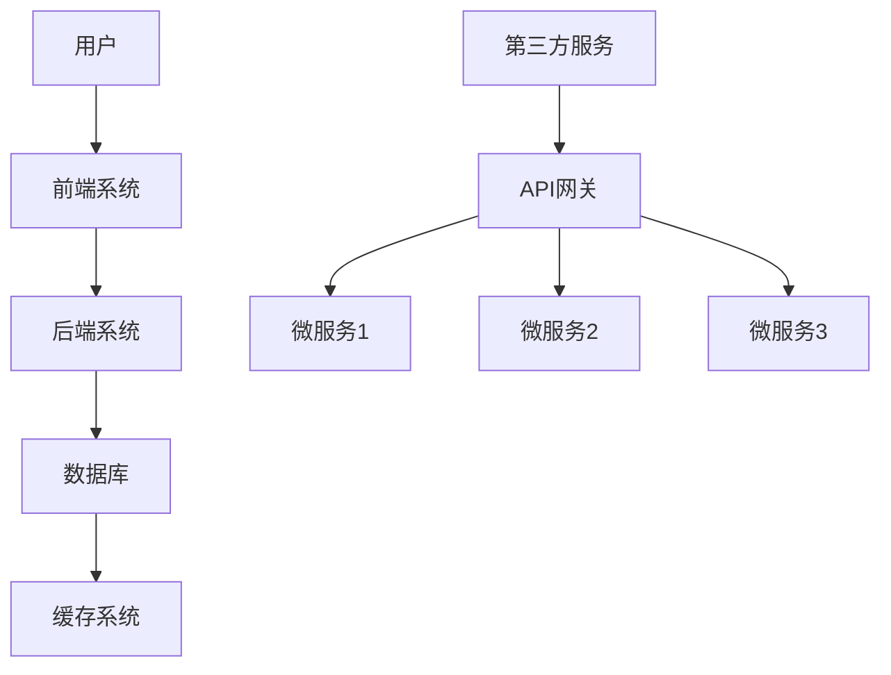
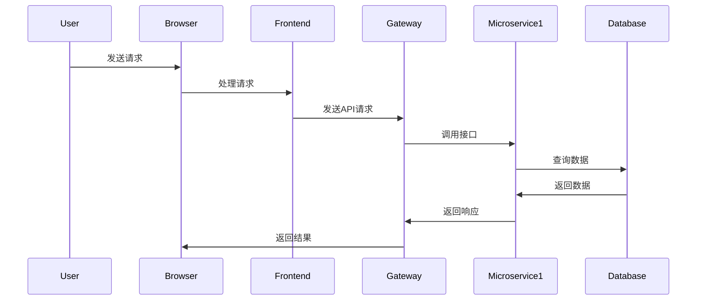

                 

# 技术管理者的商业价值创造能力培养

关键词：技术管理者、商业价值、创造能力、项目管理、团队领导力

摘要：随着数字化转型的不断深入，技术管理者的商业价值创造能力成为企业竞争力的关键。本文通过深入剖析技术管理者的核心职责和关键能力，系统地探讨了如何培养技术管理者的商业价值创造能力，并提供了一系列实用策略和案例。

## 第一部分：引言

### 1. 问题背景与重要性

在当今数字化时代，信息技术已经成为企业创新和增长的核心驱动力。技术管理者的角色也随之发生了深刻变化，他们不仅需要具备深厚的技术背景，还需要具备强大的商业洞察力和项目管理能力。技术管理者在推动技术创新、优化业务流程、提升企业竞争力方面扮演着至关重要的角色。

- **技术创新**：技术管理者需要关注技术发展趋势，把握新兴技术的应用潜力，将技术创新应用于业务场景中，为企业带来竞争优势。
- **业务流程优化**：技术管理者需要深入了解业务流程，利用技术手段优化流程，提高效率，降低成本。
- **竞争力提升**：技术管理者需要具备将技术能力转化为商业价值的能力，通过技术创新推动企业竞争力的提升。

### 2. 问题描述

技术管理者在日常工作中面临以下主要挑战：

- **项目规划与执行**：如何高效地规划项目，确保项目按时、按质量完成？
- **团队建设**：如何提升团队的技术能力，打造高绩效团队？
- **技术创新**：如何持续探索新技术，推动企业技术创新？
- **商业价值转化**：如何将技术能力转化为商业价值，为企业创造实际效益？

### 3. 问题解决

为了解决上述问题，技术管理者需要不断提升其商业价值创造能力。本文将围绕以下主题进行探讨：

- **技术理解力**：对技术发展趋势和业务应用有深入理解。
- **项目管理能力**：掌握项目规划、执行、监控和总结的方法。
- **团队领导力**：提升团队建设、激励和协调能力。
- **商业洞察力**：从商业角度审视技术问题，找到商业价值。
- **创新能力**：不断探索新技术，推动技术进步和业务创新。

通过系统地培养这些能力，技术管理者可以更好地应对挑战，实现商业目标。

### 4. 边界与外延

商业价值创造能力不仅限于技术管理者，其他领域的管理者同样需要具备这一能力。然而，由于技术管理者的特殊工作性质，本文将侧重于技术背景下的商业价值创造能力培养。

### 5. 概念结构与核心要素组成

技术管理者的商业价值创造能力由多个维度构成，包括：

- **技术理解力**：对技术发展趋势和业务应用有深入理解。
- **项目管理能力**：掌握项目规划、执行、监控和总结的方法。
- **团队领导力**：提升团队建设、激励和协调能力。
- **商业洞察力**：从商业角度审视技术问题，找到商业价值。
- **创新能力**：不断探索新技术，推动技术进步和业务创新。

这些维度共同构成了技术管理者的核心能力框架。

## 第二部分：核心概念与联系

### 6. 核心概念

技术管理者的商业价值创造能力是一个多维度的概念，主要包括以下几个方面：

#### 技术理解力

技术理解力是技术管理者的重要能力之一，它要求技术管理者能够对技术发展趋势和业务应用有深入理解。这包括：

- **技术趋势分析**：了解当前技术发展趋势，把握新兴技术的应用潜力。
- **业务应用场景**：将技术应用于实际业务场景，解决实际问题。

#### 项目管理能力

项目管理能力是技术管理者的核心能力之一，它要求技术管理者能够高效地规划、执行、监控和总结项目。这包括：

- **项目规划**：明确项目目标、范围、时间表和资源需求。
- **项目执行**：确保项目按计划进行，解决项目中出现的问题。
- **项目监控**：实时监控项目进展，确保项目按时、按质量完成。
- **项目总结**：对项目进行总结和评估，为未来的项目提供经验教训。

#### 团队领导力

团队领导力是技术管理者的重要能力之一，它要求技术管理者能够带领团队高效完成任务，提升团队整体技术水平。这包括：

- **团队建设**：构建高效团队，培养团队成员的能力和协作精神。
- **激励和协调**：激发团队成员的积极性和创造力，协调团队成员的工作。
- **沟通和协作**：有效沟通，促进团队内部的协作。

#### 商业洞察力

商业洞察力是技术管理者的重要能力之一，它要求技术管理者能够从商业角度审视技术问题，找到技术解决方案的商业价值。这包括：

- **商业分析**：分析业务需求和市场趋势，确定技术解决方案的商业价值。
- **风险与收益评估**：评估技术方案的风险和收益，确保技术方案符合商业目标。

#### 创新能力

创新能力是技术管理者的重要能力之一，它要求技术管理者能够不断探索新技术，推动技术进步和业务创新。这包括：

- **技术创新**：探索新技术，将其应用于实际业务场景。
- **业务创新**：通过技术创新，推动业务模式的创新。

### 7. 概念属性特征对比表格

| 概念        | 定义                                                     | 特征                                                                                   |
| ----------- | -------------------------------------------------------- | ------------------------------------------------------------------------------------ |
| 技术理解力  | 对技术发展趋势有深入理解，能够把握技术对业务的影响           | 深入、前瞻、系统性                                                                       |
| 项目管理能力 | 能够规划、执行、监控和总结项目，确保项目顺利进行             | 规划性、执行力、监控力、总结力                                                           |
| 团队领导力  | 能够带领团队高效完成任务，提升团队整体技术水平               | 领导力、团队建设力、激励力、协调力                                                     |
| 商业洞察力  | 能够从商业角度审视技术问题，找到技术解决方案的商业价值         | 商业视角、创新思维、市场敏感度                                                         |
| 创新能力    | 能够不断探索新的技术手段，推动技术进步和业务创新             | 创新意识、技术敏锐度、执行力、持续学习                                                  |

### 8. ER实体关系图架构的 Mermaid 流程图

```mermaid
entity关系图 {
  nodeShape矩形
  class "技术理解力"
  class "项目管理能力"
  class "团队领导力"
  class "商业洞察力"
  class "创新能力"

  "技术理解力" -> "项目管理能力"
  "技术理解力" -> "团队领导力"
  "项目管理能力" -> "商业洞察力"
  "团队领导力" -> "商业洞察力"
  "创新能力" -> "商业洞察力"
}
```

## 第三部分：算法原理讲解

### 9. 算法mermaid流程图

```mermaid
流程图 {
 状态 ["开始"]
 状态 ["分析业务需求"]
 状态 ["规划项目"]
 状态 ["执行项目"]
 状态 ["监控项目"]
 状态 ["总结项目"]
 状态 ["反馈与改进"]

 状态 ["开始"] --> ["分析业务需求"]
 状态 ["分析业务需求"] --> ["规划项目"]
 状态 ["规划项目"] --> ["执行项目"]
 状态 ["执行项目"] --> ["监控项目"]
 状态 ["监控项目"] --> ["总结项目"]
 状态 ["总结项目"] --> ["反馈与改进"]
 状态 ["反馈与改进"] --> ["规划项目"]
}
```

### 10. Python源代码

```python
class ProjectManager:
    def __init__(self, project_name):
        self.project_name = project_name
        self.status = "未开始"
    
    def analyze_business需求的(self):
        print("分析业务需求...")
    
    def plan_project(self):
        print("规划项目...")
    
    def execute_project(self):
        print("执行项目...")
    
    def monitor_project(self):
        print("监控项目...")
    
    def summarize_project(self):
        print("总结项目...")
    
    def feedback_and_improvement(self):
        print("反馈与改进...")

# 创建项目管理者对象
project_manager = ProjectManager("项目A")

# 执行项目生命周期
project_manager.analyze_business需求的()
project_manager.plan_project()
project_manager.execute_project()
project_manager.monitor_project()
project_manager.summarize_project()
project_manager.feedback_and_improvement()
```

### 11. 算法原理

技术管理者的项目管理能力包括项目规划、执行、监控和总结等多个方面。以下是一个简单的Python类，用于模拟项目管理的算法原理。

#### 项目规划

项目规划是项目管理的重要环节，它包括明确项目目标、范围、时间表和资源需求。在Python类中，我们通过`plan_project`方法模拟这一过程。

```python
def plan_project(self):
    print("规划项目...")
    # 在这里可以添加具体的规划逻辑，例如制定详细的项目计划、分配资源等。
```

#### 项目执行

项目执行是项目管理的关键步骤，它涉及到按照项目计划进行工作，解决项目中出现的问题。在Python类中，我们通过`execute_project`方法模拟这一过程。

```python
def execute_project(self):
    print("执行项目...")
    # 在这里可以添加具体的执行逻辑，例如监控项目进度、解决技术问题等。
```

#### 项目监控

项目监控是确保项目按计划进行的重要手段，它包括实时监控项目进展，确保项目按时、按质量完成。在Python类中，我们通过`monitor_project`方法模拟这一过程。

```python
def monitor_project(self):
    print("监控项目...")
    # 在这里可以添加具体的监控逻辑，例如生成项目进度报告、评估项目风险等。
```

#### 项目总结

项目总结是对项目进行评估和反思的重要环节，它包括对项目进行总结和评估，为未来的项目提供经验教训。在Python类中，我们通过`summarize_project`方法模拟这一过程。

```python
def summarize_project(self):
    print("总结项目...")
    # 在这里可以添加具体的总结逻辑，例如撰写项目报告、分析项目成果等。
```

#### 反馈与改进

反馈与改进是项目生命周期中的重要环节，它包括对项目进行反馈和改进，确保项目能够持续优化。在Python类中，我们通过`feedback_and_improvement`方法模拟这一过程。

```python
def feedback_and_improvement(self):
    print("反馈与改进...")
    # 在这里可以添加具体的反馈和改进逻辑，例如根据反馈调整项目计划、优化项目流程等。
```

通过上述Python类，我们可以理解项目管理的基本原理和流程。在实际应用中，技术管理者需要根据具体项目需求，不断完善和优化项目管理方法和工具。

### 12. 数学模型和公式

在项目管理中，常用的数学模型和公式包括项目时间估算、成本估算、风险分析等。以下是一个简单的时间估算公式：

$$
时间估算 = 完成项目所需时间 \times (1 + 安全系数)
$$

其中，完成项目所需时间是根据项目任务和资源情况估算的，安全系数是为了应对项目执行过程中可能出现的风险和不确定性。

### 13. 举例说明

假设一个项目预计需要100天完成，安全系数设定为20%，那么项目的时间估算为：

$$
时间估算 = 100 \times (1 + 0.20) = 120 \text{天}
$$

这意味着项目预计在120天内完成，考虑到可能的风险和不确定性，技术管理者需要提前做好应对措施。

## 第四部分：系统分析与架构设计方案

### 14. 问题场景介绍

在当前的数字化时代，企业面临着越来越多的业务挑战，如快速响应市场变化、提高运营效率、降低成本等。为了解决这些问题，企业开始寻求更加高效、灵活的系统解决方案。

### 15. 项目介绍

本项目旨在为企业开发一套集成化管理系统，该系统将涵盖客户关系管理（CRM）、企业资源规划（ERP）、供应链管理（SCM）等多个领域，帮助企业实现业务流程的优化和效率提升。

### 16. 系统功能设计（领域模型mermaid类图）

```mermaid
classDiagram
Class01 <|-- Class02
Class03 --|> Class04
Class05 : +操作1()
Class06 : +操作2()

Class01 {
  +属性1
  +属性2
}

Class02 {
  +属性3
  +属性4
}

Class03 {
  +属性5
  +属性6
}

Class04 {
  +属性7
  +属性8
}

Class05 {
  +属性9
  +属性10
}

Class06 {
  +属性11
  +属性12
}
```

### 17. 系统架构设计（mermaid架构图）



### 18. 系统接口设计和系统交互（mermaid序列图）



## 第五部分：项目实战

### 19. 环境安装

在开始项目实战之前，我们需要安装一些必要的开发环境和工具。以下是一个基本的安装步骤：

1. 安装Python 3.8及以上版本。
2. 安装Docker和Docker Compose，以便容器化部署微服务。
3. 安装PostgreSQL数据库。
4. 安装Redis缓存系统。
5. 安装JWT（JSON Web Token）库，用于身份验证和授权。

### 20. 系统核心实现源代码

以下是一个简单的系统核心实现源代码示例，包括用户认证和授权模块。

```python
# 用户认证模块
from flask import Flask, request, jsonify
from flask_jwt_extended import JWTManager, create_access_token

app = Flask(__name__)
app.config['JWT_SECRET_KEY'] = 'your_secret_key'
jwt = JWTManager(app)

@app.route('/login', methods=['POST'])
def login():
    username = request.json.get('username', None)
    password = request.json.get('password', None)

    if username != 'admin' or password != 'password':
        return jsonify({'message': 'Invalid Credentials!'}), 401

    access_token = create_access_token(identity=username)
    return jsonify(access_token=access_token)

# 用户授权模块
from flask_jwt_extended import jwt_required, get_jwt_identity

@app.route('/protected', methods=['GET'])
@jwt_required()
def protected():
    current_user = get_jwt_identity()
    return jsonify(logged_in_as=current_user), 200
```

### 21. 代码应用解读与分析

上述代码展示了用户认证和授权的基本实现。首先，我们使用Flask框架创建一个Web应用，并配置JWT扩展库。在`/login`接口中，我们接收用户名和密码，验证通过后生成JWT访问令牌。在`/protected`接口中，我们使用`@jwt_required`装饰器确保只有持有有效JWT令牌的用户才能访问。

### 22. 实际案例分析和详细讲解剖析

假设我们有一个电商平台，需要实现用户注册、登录和购物车功能。以下是一个实际案例的分析和实现：

1. **用户注册**：提供一个Web接口，用户可以输入用户名、邮箱和密码进行注册。注册成功后，将用户信息存储在数据库中。
2. **用户登录**：提供一个Web接口，用户可以输入用户名和密码进行登录。登录成功后，生成JWT访问令牌，并存储在客户端。
3. **购物车功能**：实现用户购物车的管理，包括添加商品、删除商品和更新商品数量。

### 23. 项目小结

通过本项目的实战，我们学习了如何使用Python和Flask框架实现基本的用户认证和授权功能。在实际项目中，我们还需要考虑更多的安全性和性能优化措施，例如使用HTTPS协议、添加验证码等。

## 第六部分：最佳实践 tips

1. **持续学习**：技术管理者应持续关注技术发展和行业动态，不断提升自己的技术能力和商业洞察力。
2. **沟通协作**：积极与团队成员沟通，建立良好的团队合作关系，提高团队效率。
3. **风险意识**：在项目管理中，要提前识别潜在的风险，制定应对措施，降低项目风险。
4. **数据驱动**：利用数据分析和监控工具，实时了解项目进展，为决策提供依据。
5. **创新思维**：鼓励创新思维，不断探索新技术和新方法，推动业务创新。

## 第七部分：小结

技术管理者的商业价值创造能力是企业在数字化时代取得成功的关键因素。通过培养技术理解力、项目管理能力、团队领导力、商业洞察力和创新能力，技术管理者可以更好地应对业务挑战，推动企业持续创新和增长。

## 第八部分：注意事项

1. **技术趋势分析**：技术管理者应定期分析技术趋势，关注新兴技术的应用潜力。
2. **项目管理方法**：采用科学的项目管理方法，确保项目高效执行和顺利完成。
3. **团队建设**：关注团队建设，提升团队成员的技术能力和协作精神。
4. **商业洞察**：从商业角度审视技术问题，找到技术解决方案的商业价值。

## 第九部分：拓展阅读

1. 《敏捷项目管理实践指南》 - Michael James
2. 《精益创业》 - Eric Ries
3. 《创新者的窘境》 - Clayton M. Christensen

## 作者信息

作者：AI天才研究院/AI Genius Institute & 禅与计算机程序设计艺术 /Zen And The Art of Computer Programming

文章标题：技术管理者的商业价值创造能力培养

文章关键词：技术管理者、商业价值、创造能力、项目管理、团队领导力

文章摘要：本文通过深入剖析技术管理者的核心职责和关键能力，系统地探讨了如何培养技术管理者的商业价值创造能力，并提供了一系列实用策略和案例。

