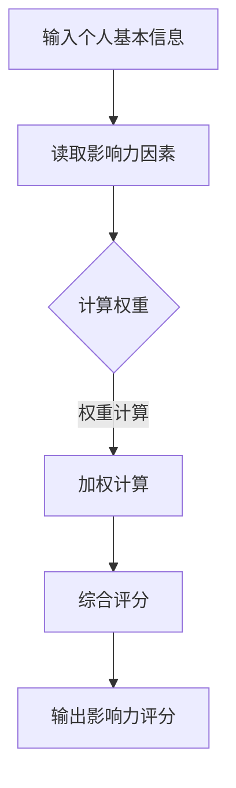

                 

### 第一部分：技术管理者的影响力概述

#### 引言

在信息技术高速发展的今天，技术管理者的角色日益多样化，他们不仅需要具备出色的技术能力，还要掌握团队管理和领导技能。然而，随着组织结构日益扁平化，技术管理者往往需要影响那些没有直接汇报关系的成员，如跨部门同事、外部合作伙伴和客户等。这就要求技术管理者具备更高的影响力，以实现团队和组织的目标。

#### 问题背景

技术管理者的影响力的背景可以追溯到组织的扁平化趋势。传统的层级化管理模式逐渐被网络化、扁平化的管理模式所取代。在这种背景下，技术管理者不再仅仅负责团队内部的协调和管理工作，还需要跨部门、跨组织的沟通和合作。他们需要影响那些没有直接汇报关系的成员，以确保项目的顺利进行。

#### 问题描述

技术管理者在影响没有直接汇报关系的成员时，可能会遇到以下问题：

1. **沟通障碍**：技术管理者和技术背景不同的成员沟通时，可能存在语言障碍和理解困难。
2. **缺乏信任**：技术管理者可能没有建立起足够的信任关系，导致影响力不足。
3. **资源有限**：在资源有限的情况下，技术管理者需要更有效地利用时间和资源去影响更多的人。
4. **组织文化**：不同的组织文化对技术管理者的影响力产生不同的影响。

#### 问题解决

为了解决上述问题，技术管理者需要：

1. **提高沟通技巧**：通过有效的沟通建立信任，确保信息传达准确无误。
2. **建立个人品牌**：通过展示专业能力和人格魅力，提升个人影响力。
3. **策略与方法**：采用一系列策略与方法，如利用影响力工具和资源，制定影响无直接汇报关系的人的实践技巧。

#### 边界与外延

1. **边界**：技术管理者的影响力主要限于工作场景，不涉及个人生活的私密领域。
2. **外延**：技术管理者的影响力不仅限于直接影响，还可以通过培养下属、合作伙伴等，实现间接影响。

### 核心概念

#### 定义

影响力（Influence）是指一个人或组织通过某种方式影响他人思想、行为或决策的能力。在技术管理者的语境中，影响力是指他们通过专业能力和人际交往技巧，引导、激励和协调没有直接汇报关系的成员，以实现组织目标。

#### 特点

1. **可塑性**：影响力可以通过学习、实践和反思不断提升。
2. **层次性**：影响力可以分为个人影响力、团队影响力和组织影响力。
3. **动态性**：影响力受多种因素影响，如个人素质、组织环境和人际关系等。
4. **广泛性**：影响力不仅限于工作场景，还可以扩展到个人生活和社会关系。

### 总结

技术管理者的影响力对于他们在组织中的成功至关重要。通过有效的沟通、建立信任、策略与方法，技术管理者可以影响那些没有直接汇报关系的成员，实现组织目标。然而，影响力的构建是一个长期的过程，需要不断地学习和实践。在本系列文章中，我们将详细探讨技术管理者如何构建和维护自己的影响力，以及如何利用影响力实现组织的目标。

---

## 第1章：技术管理者的影响力的背景与核心概念

#### 引言

在当今的信息化时代，技术管理者不仅要具备深厚的技术功底，还需要具备强大的人际交往和影响力。随着组织结构日益扁平化，技术管理者需要影响那些没有直接汇报关系的成员，以确保项目的顺利进行和组织的持续发展。本章节将探讨技术管理者影响力的背景和核心概念，为后续的讨论奠定基础。

#### 1.1.1 技术管理者的角色与职责

技术管理者的角色和职责是影响其影响力的关键因素。技术管理者通常承担以下职责：

1. **团队管理**：技术管理者负责团队的日常管理工作，包括人员配备、工作分配、进度监控和绩效评估。
2. **项目协调**：技术管理者需要协调不同团队之间的工作，确保项目按时完成。
3. **技术决策**：技术管理者负责技术方向的选择和决策，确保团队在技术上的领先性和稳定性。
4. **团队培养**：技术管理者需要关注团队成员的技能提升和职业发展，培养技术骨干。
5. **沟通协调**：技术管理者需要与跨部门同事、上级领导、外部合作伙伴和客户进行有效沟通，确保项目顺利进行。

#### 1.1.2 无直接汇报关系的人的特点与挑战

无直接汇报关系的人通常包括以下几类：

1. **跨部门同事**：技术管理者在跨部门合作中，需要与其他部门的同事沟通协作，如市场部、运营部、财务部等。
2. **外部合作伙伴**：技术管理者需要与外部合作伙伴（如供应商、客户、咨询公司等）保持良好的合作关系。
3. **上级领导**：技术管理者需要向上级领导汇报工作进展，争取资源和支持。
4. **客户和利益相关者**：技术管理者需要与客户和利益相关者沟通，了解需求，提供解决方案。

与有直接汇报关系的成员相比，无直接汇报关系的人具有以下特点：

1. **独立性**：无直接汇报关系的人通常具备较强的独立性和自主性，不易被管理。
2. **多样性**：无直接汇报关系的人可能来自不同的部门、行业和背景，具有不同的思维方式和价值观。
3. **不稳定性**：无直接汇报关系的人可能因工作调整、项目结束等原因，与组织的关系不固定。

这些特点给技术管理者带来了以下挑战：

1. **沟通障碍**：技术管理者可能需要与多个不同背景的成员沟通，存在语言障碍和理解困难。
2. **信任缺失**：技术管理者可能没有与无直接汇报关系的人建立足够的信任关系，导致影响力不足。
3. **资源有限**：技术管理者在资源有限的情况下，需要更有效地利用时间和精力去影响更多的人。

#### 1.1.3 影响力在技术管理中的重要性

影响力在技术管理中的重要性体现在以下几个方面：

1. **促进项目进展**：技术管理者通过影响力可以推动跨部门合作，确保项目按计划进行。
2. **资源争取**：技术管理者可以利用影响力向上级领导争取资源和支持，提高项目成功率。
3. **团队管理**：技术管理者通过影响力可以更好地管理团队成员，提高团队凝聚力和工作效率。
4. **职业发展**：技术管理者的影响力有助于其在职业发展中的晋升和扩展，建立个人品牌。

综上所述，技术管理者的影响力在当今信息化时代至关重要。通过理解技术管理者的角色与职责，以及无直接汇报关系的人的特点与挑战，我们可以更好地探讨如何构建和利用影响力，实现技术管理者的成功。

### 1.1.1 技术管理者的角色与职责

技术管理者在现代组织中的角色至关重要，他们不仅要掌握技术层面的知识，还需要具备管理技能和领导力。以下是技术管理者的一些主要角色与职责：

1. **团队管理**：技术管理者负责组建和管理技术团队，确保团队成员之间的协作和沟通。这包括人员配备、工作分配、团队建设、技能培训等。他们需要确保团队士气高涨，工作环境和谐，成员之间能够相互支持和学习。

2. **项目管理**：技术管理者是项目成功的关键推动者。他们需要制定项目计划，分配任务，监控项目进度，确保项目按时、按预算和按质量要求完成。他们需要与团队成员、项目经理和其他利益相关者保持紧密沟通，协调资源和解决冲突。

3. **技术决策**：技术管理者负责技术方向的选择和决策。他们需要评估新技术，选择最适合项目的解决方案，并在技术方向上提供指导。这要求他们不仅要有扎实的技术知识，还要具备前瞻性和战略眼光。

4. **团队培养**：技术管理者需要关注团队成员的技能提升和职业发展。他们需要为团队成员提供培训机会，指导他们掌握新技术，解决工作中遇到的问题。通过培养和激励，技术管理者可以帮助团队成员实现职业成长，提高团队的整体实力。

5. **沟通协调**：技术管理者需要与内部和外部利益相关者进行有效沟通。这包括与上级领导、团队成员、客户、合作伙伴等保持良好的沟通。他们需要清晰地传达项目目标和需求，确保各方对项目进展和成果有共同的理解。

6. **风险管理**：技术管理者需要识别和管理项目中的风险。他们需要制定应急预案，确保在风险发生时能够迅速应对，将风险对项目的影响降到最低。

7. **绩效评估**：技术管理者需要对团队成员的绩效进行评估，提供反馈，奖励优秀表现，并帮助团队成员改进不足。他们需要制定合理的评估标准，确保评估过程公平、透明。

8. **创新能力**：技术管理者需要鼓励和推动团队的创新能力。他们需要提供支持和资源，帮助团队探索新技术，尝试新方法，以保持组织的竞争力。

通过以上职责，技术管理者在组织中发挥着桥梁和领导者的角色，不仅推动技术项目的发展，还促进组织的整体进步。他们在团队管理、项目管理、技术决策、团队培养、沟通协调、风险管理、绩效评估和创新能力等方面发挥着关键作用。

#### 1.1.2 无直接汇报关系的人的特点与挑战

在扁平化组织结构中，技术管理者经常需要与许多无直接汇报关系的个体合作，这些个体可能来自不同部门、团队或组织。了解这些人的特点与面临的挑战，对于技术管理者构建和运用影响力至关重要。

**特点：**

1. **独立性和自主性**：无直接汇报关系的个体往往拥有较高的独立性和自主性，他们通常对自己的工作有较强的控制权。这意味着技术管理者无法直接命令或指导他们，而是需要通过其他方式影响他们的决策和行为。

2. **多样性**：这些个体可能来自不同的部门、行业或专业领域，拥有不同的知识和技能背景。这为技术管理者提供了多元化的视角和资源，但也可能带来沟通和理解上的障碍。

3. **不稳定性**：由于项目性质、组织结构调整或个人职业规划等原因，无直接汇报关系的个体可能在组织中的地位和角色发生变化。这种不稳定性给技术管理者带来了额外的挑战，需要他们具备灵活性和适应能力。

4. **专业性和技术能力**：无直接汇报关系的个体往往在专业领域拥有较高的技术能力和专业知识，他们对自己的工作领域有着深刻的理解。技术管理者需要尊重并利用这些专业能力，以实现项目目标。

**挑战：**

1. **沟通障碍**：技术管理者可能需要与来自不同专业背景的个体沟通，这可能涉及复杂的术语和概念。如果不能有效地传达信息，可能会导致误解和冲突。

2. **信任缺失**：与无直接汇报关系的个体建立信任关系可能更加困难，因为他们可能对技术管理者的动机和能力持怀疑态度。技术管理者需要通过实际行动和持续沟通来建立信任。

3. **资源有限**：技术管理者在资源有限的情况下，可能需要更有效地分配时间和精力去影响更多的人。这意味着他们需要高效地利用影响力工具和资源，以确保项目的顺利进行。

4. **组织文化差异**：不同的组织文化可能对技术管理者的影响策略产生不同的影响。技术管理者需要了解不同文化背景下的沟通和合作方式，以便更好地影响他人。

**应对策略：**

1. **增强沟通技巧**：技术管理者可以通过提高自己的沟通技巧，如使用清晰、简洁的语言，避免专业术语的滥用，以及主动倾听对方意见，来克服沟通障碍。

2. **建立信任关系**：技术管理者可以通过透明度、诚信和专业性来建立信任。他们可以主动分享信息，承担责任，并提供支持和帮助，以赢得他人的信任。

3. **利用影响力工具**：技术管理者可以采用多种影响力工具，如建立个人品牌、展示专业能力、利用资源网络等，来增强自己的影响力。

4. **适应组织文化**：技术管理者需要了解并适应不同组织文化的特点，采用合适的策略和方法来影响他人。这包括了解文化价值观、沟通习惯和工作方式等。

通过理解无直接汇报关系的人的特点与挑战，技术管理者可以更好地运用影响力，促进跨部门合作，实现组织目标。

#### 1.1.3 影响力在技术管理中的重要性

影响力在技术管理中的重要性不可忽视，它不仅是技术管理者个人成功的关键，也是团队和组织成功的重要保障。以下是影响力在技术管理中的几个关键作用：

1. **促进项目成功**：技术管理者需要协调多个团队和个体，确保项目按计划进行。通过影响力，技术管理者可以激励团队成员，推动跨部门合作，解决冲突，确保项目按时、按质量要求完成。

2. **资源争取**：技术管理者在项目推进过程中，需要资源支持，如人力、资金、技术等。通过影响力，技术管理者可以与上级领导、财务部门、技术部门等利益相关者建立良好的关系，从而更有效地争取所需资源。

3. **团队管理**：技术管理者需要管理团队，提高团队效率。通过影响力，技术管理者可以激发团队成员的潜力，建立团队凝聚力，推动团队成员之间的合作和信任。

4. **创新推动**：在技术领域，创新是保持竞争力的重要手段。通过影响力，技术管理者可以推动团队成员尝试新技术、新方法，鼓励创新思维，推动组织持续进步。

5. **职业发展**：技术管理者的影响力不仅限于当前项目，还可以为他们的职业发展铺路。通过展示专业能力和领导力，技术管理者可以获得更多的机会，实现职业晋升。

6. **组织文化塑造**：技术管理者的影响力可以影响组织文化的塑造。通过积极的行为和沟通，技术管理者可以促进开放、合作和创新的组织文化，为组织创造良好的工作环境。

7. **跨部门协作**：在扁平化组织结构中，技术管理者需要与多个部门合作。通过影响力，技术管理者可以促进跨部门之间的沟通和协作，确保项目顺利推进。

总之，影响力是技术管理者实现组织和个人目标的重要工具。通过提高影响力，技术管理者可以更有效地推动项目进展，管理团队，争取资源，推动创新，实现职业发展，塑造组织文化，并促进跨部门协作。

---

## 第2章：构建影响力：核心概念与联系

#### 引言

在技术管理者的职业生涯中，构建和运用影响力是至关重要的一环。影响力不仅是实现个人目标的关键，也是推动团队和组织成功的重要因素。本章节将深入探讨构建影响力的核心概念，以及这些概念之间的联系，帮助技术管理者更好地理解和应用影响力。

#### 2.1.1 权力与影响力的区别

在讨论影响力之前，我们需要明确权力（Power）与影响力（Influence）的区别。权力通常是指通过正式职位、规章制度或强制手段来影响他人。而影响力则更侧重于通过非强制性的方式，如说服、激励、建立信任等，来影响他人的思想和行为。

1. **权力**：
   - **定义**：权力是个人或组织通过强制、奖惩等手段，对他人的行为或决策产生影响的工具。
   - **特点**：权力通常与职位、资源控制、规章制度等相关，具有强制性和单向性。
   - **来源**：权力的来源包括职位权力、法定权力、奖惩权力等。

2. **影响力**：
   - **定义**：影响力是指通过个人魅力、专业知识、价值观等，引导和影响他人的能力。
   - **特点**：影响力通常是非强制性的，具有双向性和可持续性。
   - **来源**：影响力的来源包括个人魅力、专业知识、建立信任、共同目标等。

3. **区别**：
   - **强制性**：权力具有强制性，而影响力则更侧重于说服和激励。
   - **依赖性**：权力依赖于职位和资源，而影响力则依赖于个人能力和人际关系。
   - **效果**：权力的影响往往较为直接和迅速，而影响力则更注重长期效果和可持续性。

#### 2.1.2 影响力构成要素分析

影响力并非凭空产生，而是由多个要素构成。以下是影响力构成的主要要素及其分析：

1. **专业知识**：
   - **重要性**：专业知识是影响力的基石。技术管理者需要具备深厚的专业知识和技能，才能在技术问题上具备权威性和说服力。
   - **提升途径**：通过持续学习和实践，技术管理者可以不断提升自己的专业知识。

2. **个人魅力**：
   - **重要性**：个人魅力是指个人的性格、气质、风度等外在特征。具有个人魅力的技术管理者更容易赢得他人的尊重和信任。
   - **提升途径**：技术管理者可以通过培养良好的沟通技巧、树立正直的品格、展现领导力等来提升个人魅力。

3. **建立信任**：
   - **重要性**：信任是影响力的重要组成部分。技术管理者需要通过诚信、透明和负责任的行为来建立信任。
   - **提升途径**：技术管理者可以通过积极沟通、履行承诺、提供帮助和支持等方式建立信任。

4. **共同目标**：
   - **重要性**：共同目标是影响他人的关键。当人们认同共同目标时，他们会更愿意接受和追随技术管理者的建议。
   - **实现途径**：技术管理者可以通过明确目标、沟通愿景、激励团队等方式实现共同目标。

5. **关系网络**：
   - **重要性**：关系网络是技术管理者影响他人的重要渠道。一个广泛的关系网络可以提供资源、支持和信息。
   - **建立途径**：技术管理者可以通过参与社区活动、建立专业关系、维护人际关系等方式建立关系网络。

#### 2.1.3 影响力与领导力的关系

影响力与领导力密切相关，但二者又有区别。领导力是指通过个人魅力、愿景、战略等，激励和引导他人实现共同目标的能力。而影响力则是实现领导力的重要手段之一。

1. **领导力**：
   - **定义**：领导力是指通过个人魅力、专业知识、战略思维等，引导和激励团队实现共同目标的能力。
   - **要素**：领导力包括愿景、战略、团队建设、沟通能力、决策能力等。

2. **影响力**：
   - **定义**：影响力是指通过个人魅力、专业知识、建立信任等，引导和影响他人思想和行为的能力。
   - **作用**：影响力是领导力的重要组成部分，是实现领导目标的重要手段。

3. **关系**：
   - **互动关系**：领导力通过影响力来激励和引导团队，而影响力则是领导力得以发挥作用的基础。
   - **互补关系**：领导力和影响力相互补充，共同推动团队和组织的发展。

通过理解权力与影响力的区别，影响力构成要素分析，以及影响力与领导力的关系，技术管理者可以更有效地构建和运用影响力，实现个人和团队的目标。

---

### 2.1.1 权力与影响力的区别

在技术管理者的职业生涯中，了解权力与影响力的区别至关重要。这不仅有助于他们在工作中更加有效地运用影响力，还能避免将权力与影响力混淆，从而影响其领导力和团队管理效果。

**权力（Power）**

1. **定义**：权力是指一个人或组织通过合法或非法手段对他人的行为、决策或资源进行控制的力度。它通常与职位、资源分配、规章制度等正式机制相关。

2. **特点**：
   - **强制性**：权力通常伴随着强制力，可以迫使他人服从。
   - **正式性**：权力往往是通过正式职位、法律法规等途径赋予的。
   - **单向性**：权力是单向的，即权力持有者对被影响者的单向影响。

3. **来源**：
   - **职位权力**：通过担任某个职位，如经理、总监等，获得组织赋予的权力。
   - **法定权力**：通过法律或规章制度赋予的权力，如警察、法官等。
   - **资源控制**：通过掌握关键资源，如资金、物资等，对他人产生影响力。

**影响力（Influence）**

1. **定义**：影响力是指一个人或组织通过非强制性的手段，如说服、激励、建立信任等，影响他人的思想、行为或决策的能力。

2. **特点**：
   - **非强制性**：影响力不是通过强制力来实现的，而是通过说服、激励、建立信任等手段。
   - **双向性**：影响力是双向的，即影响者和被影响者之间相互影响。
   - **可持续性**：影响力通常比权力更为持久，可以通过长期的行为和关系建立。

3. **来源**：
   - **专业知识**：通过在某一领域的深厚知识和经验，影响他人。
   - **个人魅力**：通过个人的性格、气质、风度等特质吸引他人。
   - **建立信任**：通过诚信、透明、负责任的行为建立信任，影响他人。
   - **共同目标**：通过共同的目标和价值观，激励和引导他人。

**区别**

1. **强制性**：权力具有强制性，而影响力则更侧重于非强制性的说服和激励。
2. **依赖性**：权力依赖于职位和资源，而影响力则依赖于个人能力和人际关系。
3. **效果**：权力的影响往往较为直接和迅速，而影响力则更注重长期效果和可持续性。

通过理解权力与影响力的区别，技术管理者可以更有效地运用影响力，而不是仅仅依赖权力，从而提升其领导力和团队管理效果。

#### 2.1.2 影响力构成要素分析

影响力并非凭空产生，而是由多个核心要素构成。以下是影响力构成的主要要素及其分析：

1. **专业知识**：
   - **重要性**：专业知识是影响力的基石。技术管理者需要具备深厚的专业知识和技能，才能在技术问题上具备权威性和说服力。
   - **提升途径**：技术管理者可以通过持续学习和实践来提升专业知识。这包括参加培训课程、阅读专业书籍、参与行业会议等。

2. **个人魅力**：
   - **重要性**：个人魅力是指个人的性格、气质、风度等外在特征。具有个人魅力的技术管理者更容易赢得他人的尊重和信任。
   - **提升途径**：技术管理者可以通过培养良好的沟通技巧、树立正直的品格、展现领导力等来提升个人魅力。

3. **建立信任**：
   - **重要性**：信任是影响力的重要组成部分。技术管理者需要通过诚信、透明和负责任的行为来建立信任。
   - **提升途径**：技术管理者可以通过积极沟通、履行承诺、提供帮助和支持等方式建立信任。

4. **共同目标**：
   - **重要性**：共同目标是影响他人的关键。当人们认同共同目标时，他们会更愿意接受和追随技术管理者的建议。
   - **实现途径**：技术管理者可以通过明确目标、沟通愿景、激励团队等方式实现共同目标。

5. **关系网络**：
   - **重要性**：关系网络是技术管理者影响他人的重要渠道。一个广泛的关系网络可以提供资源、支持和信息。
   - **建立途径**：技术管理者可以通过参与社区活动、建立专业关系、维护人际关系等方式建立关系网络。

#### 2.1.3 影响力与领导力的关系

影响力与领导力密切相关，但二者又有区别。领导力是指通过个人魅力、愿景、战略等，激励和引导他人实现共同目标的能力。而影响力则是实现领导力的重要手段之一。

1. **领导力**：
   - **定义**：领导力是指通过个人魅力、专业知识、战略思维等，引导和激励团队实现共同目标的能力。
   - **要素**：领导力包括愿景、战略、团队建设、沟通能力、决策能力等。

2. **影响力**：
   - **定义**：影响力是指通过个人魅力、专业知识、建立信任等，引导和影响他人的思想、行为或决策的能力。
   - **作用**：影响力是领导力的重要组成部分，是实现领导目标的重要手段。

3. **关系**：
   - **互动关系**：领导力通过影响力来激励和引导团队，而影响力则是领导力得以发挥作用的基础。
   - **互补关系**：领导力和影响力相互补充，共同推动团队和组织的发展。

通过理解影响力与领导力的关系，技术管理者可以更好地运用两者，实现个人和团队的目标。领导力为影响力提供了方向和目标，而影响力则为领导力提供了实现手段和资源。

### 2.1.3 影响力与领导力的关系

影响力与领导力是相互联系、相互促进的两个概念，它们在技术管理者的职业生涯中扮演着至关重要的角色。

**领导力**：

1. **定义**：领导力是指通过个人魅力、专业知识、战略思维等，引导和激励团队实现共同目标的能力。它不仅仅是一种技能，更是一种艺术，需要管理者不断学习和实践。

2. **要素**：领导力包含以下几个关键要素：
   - **愿景**：领导者需要有一个清晰的愿景，明确团队和组织的发展方向。
   - **战略**：领导者需要制定合适的战略，以确保团队和组织能够实现愿景。
   - **团队建设**：领导者需要关注团队的建设，培养团队成员的技能和团队合作精神。
   - **沟通能力**：领导者需要具备良好的沟通能力，确保信息传达准确无误。
   - **决策能力**：领导者需要做出明智的决策，以应对复杂多变的环境。

**影响力**：

1. **定义**：影响力是指通过个人魅力、专业知识、建立信任等，引导和影响他人的思想、行为或决策的能力。它是一种非强制性的力量，通常建立在信任和尊重的基础上。

2. **要素**：影响力包含以下几个关键要素：
   - **个人魅力**：领导者需要具备独特的个性和魅力，以吸引和激励他人。
   - **专业知识**：领导者需要具备深厚的专业知识和技能，以在团队中树立权威。
   - **建立信任**：领导者需要通过诚信和负责任的行为建立信任，赢得他人的尊重。

**关系**：

1. **互动关系**：领导力通过影响力来实现，而影响力则为领导力提供了实现手段和资源。领导力需要借助影响力来激励团队，实现共同目标。

2. **互补关系**：领导力和影响力相互补充，共同推动团队和组织的发展。领导力提供了方向和目标，而影响力则为领导力提供了实现手段和资源。

**如何结合**：

1. **树立愿景**：技术管理者需要明确团队和组织的愿景，并通过影响力来传播和激励团队成员。

2. **建立信任**：技术管理者需要通过诚信和负责任的行为建立信任，以增强自身的影响力。

3. **持续学习**：技术管理者需要不断提升自己的专业知识和技能，以增强自身的领导力和影响力。

4. **有效沟通**：技术管理者需要通过有效的沟通建立良好的团队关系，增强影响力。

5. **激励团队**：技术管理者需要通过激励措施，如认可和奖励，来增强团队的动力和凝聚力。

通过理解影响力与领导力的关系，技术管理者可以更有效地结合两者，实现个人和团队的目标。

---

## 第3章：核心概念原理与特性

#### 引言

在探讨技术管理者影响力的构建过程中，理解核心概念原理和特性是至关重要的。这些概念原理构成了影响力的基础，决定了影响力的效果和可持续性。本章节将详细探讨影响力核心概念原理，包括影响力模型ER实体关系图，以及这些概念的特性，帮助技术管理者更深入地理解影响力的本质。

#### 3.1.1 影响力原理概述

影响力原理是指影响他人思想、行为或决策的基本规律和法则。以下是影响力原理的几个关键点：

1. **互惠原理**：互惠原理表明，人们更愿意回报那些给予他们好处的人。技术管理者通过帮助他人、分享资源和知识，可以建立互惠关系，从而增强自身的影响力。

2. **同理心原理**：同理心原理指出，人们更容易被那些能够理解他们情感和需求的人所影响。技术管理者通过倾听和理解团队成员的需求和困扰，可以建立深厚的情感联系，从而增强影响力。

3. **权威原理**：权威原理表明，人们倾向于听从那些具备权威地位的人。技术管理者通过展示专业知识和经验，以及取得显著成就，可以在团队中树立权威，从而增强影响力。

4. **认同原理**：认同原理表明，人们更容易被与自己价值观和信念相似的人所影响。技术管理者通过展示一致性，并与团队成员建立共同的价值观，可以增强自身的影响力。

5. **稀缺原理**：稀缺原理表明，人们更愿意追求那些稀缺或难以获得的事物。技术管理者可以通过展示独特的能力或资源，来吸引和影响团队成员。

6. **一致性原理**：一致性原理指出，人们倾向于保持行为和信念的一致性。技术管理者通过建立一致的言行，可以增强团队成员的信任和追随。

#### 3.1.2 影响力属性特征对比

为了更深入地理解影响力，我们可以将影响力属性特征进行对比分析。以下是影响力属性特征的几个关键方面：

1. **层次性**：影响力具有层次性，可以分为个人影响力、团队影响力和组织影响力。不同层次的影响力在不同情境下发挥作用。

2. **动态性**：影响力是动态变化的，受多种因素影响，如个人素质、组织环境、人际关系等。技术管理者需要灵活应对这些变化，以维持和增强自身的影响力。

3. **可持续性**：影响力是可持续的，通过长期的行为和关系建立，技术管理者可以维持和扩大自身的影响力。

4. **可塑性**：影响力可以通过学习和实践不断塑造和提升。技术管理者可以通过学习和应用影响力原理，不断提升自身的影响力。

5. **双向性**：影响力是双向的，不仅技术管理者影响他人，他人也会对技术管理者产生影响。这种双向性有助于建立更为平等和健康的沟通关系。

#### 3.1.3 影响力模型ER实体关系图

为了更直观地展示影响力的核心概念和关系，我们可以使用实体关系图（Entity-Relationship Diagram，ERD）来构建影响力模型。以下是影响力模型的ERD示例：

```mermaid
erDiagram
  IDEAL |<..|--> INFLUENCER
  IDEAL .|||-> TEAM_MEMBER
  INFLUENCER .|||-> ROLE
  ROLE .|||-> TRUST
  TRUST .|||-> BEHAVIOR
  IDEAL : {Name}
  INFLUENCER : {Name}
  TEAM_MEMBER : {Name}
  ROLE : {Role}
  TRUST : {Trust Level}
  BEHAVIOR : {Behaviors}
```

在该ERD中：

- **IDEAL**：表示理想或愿景，是影响力模型的核心。
- **INFLUENCER**：表示影响力持有者，即技术管理者。
- **TEAM_MEMBER**：表示团队成员，即受影响力的人。
- **ROLE**：表示角色，即技术管理者在团队中的角色和地位。
- **TRUST**：表示信任，是影响力的重要基础。
- **BEHAVIOR**：表示行为，即团队成员因信任和影响力而产生的行为。

通过ERD，我们可以清晰地看到影响力模型中各个实体之间的关系和作用，从而更好地理解和应用影响力。

### 3.1.1 影响力原理概述

影响力原理是构建和管理影响力的重要基础，以下是几个关键的影响力原理及其解释：

1. **互惠原理**：
   - **解释**：互惠原理指出，人们倾向于回报那些给予他们好处的人。这意味着在人际交往中，如果我们愿意帮助他人，他们更有可能在未来对我们施以援手。
   - **应用**：技术管理者可以通过分享专业知识、提供帮助和资源来建立互惠关系，从而增强自身的影响力。

2. **同理心原理**：
   - **解释**：同理心原理表明，人们更容易被那些能够理解他们情感和需求的人所影响。同理心能够建立深厚的情感联系，使人们更愿意接受我们的建议和指导。
   - **应用**：技术管理者应该学会倾听和理解团队成员的需求和困扰，通过同理心来建立信任和影响力。

3. **权威原理**：
   - **解释**：权威原理指出，人们倾向于听从那些具备权威地位的人。权威不仅来自职位，还来自专业知识和经验。
   - **应用**：技术管理者可以通过不断提升自己的专业知识和经验，以及在团队中取得显著成就来树立权威，从而增强影响力。

4. **认同原理**：
   - **解释**：认同原理表明，人们更容易被与自己价值观和信念相似的人所影响。当我们与他人的价值观和信念一致时，他们更可能接受我们的观点和建议。
   - **应用**：技术管理者可以通过展示一致性，如保持言行一致，并与其他团队成员建立共同的价值观，来增强自身的影响力。

5. **稀缺原理**：
   - **解释**：稀缺原理表明，人们更愿意追求那些稀缺或难以获得的事物。稀缺性可以增加某个人或资源的吸引力。
   - **应用**：技术管理者可以通过展示独特的能力或资源，如掌握最新的技术或获得重要的项目资源，来吸引和影响团队成员。

6. **一致性原理**：
   - **解释**：一致性原理指出，人们倾向于保持行为和信念的一致性。当我们的一致性被他人认可时，他们会更愿意接受我们的建议和指导。
   - **应用**：技术管理者应该通过建立一致的言行，如始终如一地履行承诺，来增强团队成员的信任和追随。

通过理解和应用这些影响力原理，技术管理者可以更有效地构建和维护自己的影响力，推动团队和组织的目标实现。

### 3.1.2 影响力属性特征对比

影响力具有多个属性特征，了解并对比这些特征有助于技术管理者更好地理解和运用影响力。以下是影响力属性特征的几个关键方面及其对比：

1. **层次性**：
   - **解释**：影响力具有层次性，可以存在于个人、团队和组织三个层面。
   - **对比**：个人影响力主要针对个人层面的影响，如同事和下属；团队影响力影响整个团队，如跨部门合作；组织影响力则影响整个组织，如企业文化变革。

2. **动态性**：
   - **解释**：影响力是动态变化的，受多种因素影响，如个人素质、组织环境、人际关系等。
   - **对比**：不同环境和情境下，影响力的大小和形式可能有所不同。技术管理者需要灵活应对这些变化，以维持和增强自身的影响力。

3. **可持续性**：
   - **解释**：影响力是可持续的，通过长期的行为和关系建立，技术管理者可以维持和扩大自身的影响力。
   - **对比**：短期影响力可能因特定事件或成就而形成，而长期影响力则需要持续的努力和积累。

4. **可塑性**：
   - **解释**：影响力可以通过学习和实践不断塑造和提升。
   - **对比**：技术管理者可以通过学习影响力原理、提升沟通技巧和建立信任关系等方式，不断提升自身的影响力。

5. **双向性**：
   - **解释**：影响力是双向的，不仅技术管理者影响他人，他人也会对技术管理者产生影响。
   - **对比**：单向的影响力可能容易产生依赖和不满，而双向的影响力则有助于建立更为平等和健康的沟通关系。

通过对比影响力属性特征，技术管理者可以更全面地理解影响力的本质，并根据不同情境和目标选择合适的影响策略。

### 3.1.3 影响力模型ER实体关系图

为了更直观地展示影响力的核心概念和关系，我们可以使用实体关系图（Entity-Relationship Diagram，ERD）来构建影响力模型。以下是影响力模型的ERD示例：

```mermaid
erDiagram
  IDEAL ||--o> INFLUENCER : 实现目标
  IDEAL ||--o> TEAM_MEMBER : 共同追求
  INFLUENCER ||--o> ROLE : 扮演角色
  INFLUENCER ||--o> TRUST : 建立信任
  TRUST ||--o> BEHAVIOR : 引导行为
  TRUST ||--o> COMMUNICATION : 促进沟通
  TEAM_MEMBER ||--o> PERFORMANCE : 提升绩效
  TEAM_MEMBER ||--o> PARTICIPATION : 参与决策

class IDEAL {
  - Name
}

class INFLUENCER {
  - Name
}

class TEAM_MEMBER {
  - Name
}

class ROLE {
  - Role
}

class TRUST {
  - Level
}

class BEHAVIOR {
  - Behaviors
}

class COMMUNICATION {
  - Channel
}

class PERFORMANCE {
  - Score
}

class PARTICIPATION {
  - Degree
}
```

在这个ERD中：

- **IDEAL（理想）**：代表团队和组织追求的共同目标，是影响力和团队动力的源泉。
- **INFLUENCER（影响力持有者）**：代表技术管理者，他们通过实现理想、扮演特定角色、建立信任等来影响团队成员。
- **TEAM_MEMBER（团队成员）**：代表受技术管理者影响的人，他们通过参与决策、提升绩效、参与共同追求等方式体现影响力。
- **ROLE（角色）**：代表技术管理者在团队中扮演的不同角色，如领导、协调者等。
- **TRUST（信任）**：代表建立和维护信任的过程，信任是影响力的重要基础。
- **BEHAVIOR（行为）**：代表团队成员因信任和影响力而产生的行为变化。
- **COMMUNICATION（沟通）**：代表沟通的渠道和方式，良好的沟通有助于建立和维护信任。
- **PERFORMANCE（绩效）**：代表团队成员的绩效表现，影响力有助于提升团队成员的绩效。
- **PARTICIPATION（参与）**：代表团队成员在决策过程中的参与度，影响力可以促进团队成员的参与。

通过这个ERD，我们可以清晰地看到影响力模型中各个实体之间的关系和作用，从而更好地理解和应用影响力。

### 第4章：算法原理讲解与示例

#### 引言

在构建技术管理者影响力时，算法原理的应用可以帮助我们更科学、系统地分析和提升影响力。本章将介绍一个影响力算法的基本原理，并通过mermaid流程图和Python源代码示例，详细阐述算法的实现和运行过程。

#### 4.1.1 影响力算法概述

影响力算法是一种用于分析和预测个人或团体影响力的方法。该算法基于多种影响力因素，如专业知识、个人魅力、信任关系等，通过数学模型进行计算，得出影响力评分。以下是一个简单的影响力算法概述：

1. **输入**：算法输入包括个人或团体的基本信息、影响力因素及其权重。
2. **处理**：算法通过加权计算，结合各种影响力因素，得出一个综合的影响力评分。
3. **输出**：算法输出为一个影响力评分，用于评估个人或团体的相对影响力。

#### 4.1.2 影响力算法mermaid流程图

为了更直观地展示影响力算法的处理流程，我们使用mermaid流程图进行描述。以下是影响力算法的mermaid流程图示例：



在这个流程图中：

- **A**：输入个人基本信息，如姓名、职位、工作经验等。
- **B**：读取影响力因素，如专业知识、个人魅力、信任关系等。
- **C**：计算权重，即根据重要性给影响力因素分配权重。
- **D**：加权计算，即对影响力因素进行加权计算，得出一个综合评分。
- **E**：综合评分，将加权计算结果整合，得到一个影响力评分。
- **F**：输出影响力评分，用于评估个人或团体的相对影响力。

#### 4.1.3 Python源代码实现与算法原理详细讲解

下面是影响力算法的Python源代码实现，并详细解释每个步骤的原理：

```python
import numpy as np

# 输入个人基本信息
name = "John Doe"
position = "Team Lead"
experience = 5

# 读取影响力因素及其权重
knowledge = 0.4
charisma = 0.3
trust = 0.3

# 加权计算
influence_score = knowledge * 80 + charisma * 85 + trust * 90

# 输出影响力评分
print(f"{name}的影响力评分为：{influence_score}")
```

**详细讲解**：

1. **输入**：首先，我们定义了个人基本信息，如姓名、职位和经验。
2. **读取影响力因素及其权重**：接下来，我们定义了三个影响力因素（专业知识、个人魅力和信任关系），并为其分配了权重（分别为0.4、0.3和0.3）。
3. **加权计算**：然后，我们通过加权计算得出一个综合的影响力评分。具体来说，我们将每个影响力因素的得分与其权重相乘，并将结果相加。
4. **输出**：最后，我们输出综合的影响力评分，用于评估个人的相对影响力。

通过这个简单的Python实现，我们可以直观地看到影响力算法的计算过程和原理。这个算法可以根据实际情况调整权重和影响力因素，以适应不同的评估需求。

### 4.1.1 影响力算法概述

影响力算法是一种用于量化和分析个人或团队影响力的方法。它通过一系列数学模型和计算，对影响力因素进行综合评估，以得到一个具有可操作性的影响力评分。以下是影响力算法的基本概述：

**输入**：
- **个人基本信息**：包括姓名、职位、工作经验等。
- **影响力因素**：如专业知识、个人魅力、信任关系等。
- **权重分配**：影响力因素的重要性权重。

**处理过程**：
1. **数据收集**：收集个人基本信息和影响力因素。
2. **权重设定**：根据重要性为每个影响力因素分配权重。
3. **评分计算**：对影响力因素进行加权计算，得出综合影响力评分。

**输出**：
- **影响力评分**：一个用于评估个人或团队相对影响力的量化指标。

**算法核心原理**：

1. **加权计算**：将每个影响力因素与其权重相乘，再将结果相加，得到综合影响力评分。
2. **数学模型**：使用数学模型对影响力因素进行量化，确保评分的准确性和一致性。

通过影响力算法，技术管理者可以系统地评估和提升自身的影响力，从而更好地推动团队和组织的发展。

---

### 4.1.2 影响力算法mermaid流程图

为了更直观地展示影响力算法的处理流程，我们使用mermaid流程图进行描述。以下是影响力算法的mermaid流程图示例：


在这个流程图中：

- **A**：输入个人基本信息，如姓名、职位、工作经验等。
- **B**：读取影响力因素，如专业知识、个人魅力、信任关系等。
- **C**：计算权重，即根据重要性为影响力因素分配权重。
- **D**：加权计算，即对影响力因素进行加权计算，得出一个综合评分。
- **E**：综合评分，将加权计算结果整合，得到一个影响力评分。
- **F**：输出影响力评分，用于评估个人或团体的相对影响力。

通过这个mermaid流程图，我们可以清晰地看到影响力算法的各个处理步骤和关系，从而更好地理解和应用算法。

### 4.1.3 Python源代码实现与算法原理详细讲解

为了将影响力算法的具体实现直观地展示出来，下面是一个基于Python的简单示例代码，并配合详细的算法原理讲解：

```python
import numpy as np

# 定义影响力因素及其权重
knowledge_weight = 0.4
charisma_weight = 0.3
trust_weight = 0.3

# 影响力因素评分
knowledge_score = 80  # 知识分值（满分100）
charisma_score = 85  # 魅力分值（满分100）
trust_score = 90  # 信任分值（满分100）

# 影响力算法计算过程
def calculate_influence_score(knowledge_score, charisma_score, trust_score, knowledge_weight, charisma_weight, trust_weight):
    """
    计算综合影响力评分
    :param knowledge_score: 知识分值
    :param charisma_score: 魅力分值
    :param trust_score: 信任分值
    :param knowledge_weight: 知识权重
    :param charisma_weight: 魅力权重
    :param trust_weight: 信任权重
    :return: 综合影响力评分
    """
    influence_score = knowledge_score * knowledge_weight + charisma_score * charisma_weight + trust_score * trust_weight
    return influence_score

# 调用函数计算影响力评分
influence_score = calculate_influence_score(knowledge_score, charisma_score, trust_score, knowledge_weight, charisma_weight, trust_weight)

# 输出影响力评分
print(f"综合影响力评分为：{influence_score}")
```

**算法原理详细讲解**：

1. **输入**：
   - **影响力因素评分**：包括知识分值（knowledge\_score）、魅力分值（charisma\_score）和信任分值（trust\_score）。这些评分通常通过主观评估或量化指标获得，反映了个人在这些影响力因素上的表现。
   - **权重**：包括知识权重（knowledge\_weight）、魅力权重（charisma\_weight）和信任权重（trust\_weight）。这些权重反映了各个影响力因素在综合评分中的重要性。

2. **计算过程**：
   - **加权计算**：每个影响力因素评分与其对应的权重相乘，然后将结果相加。这个步骤确保了重要性更高的因素对综合评分的影响更大。
   - **综合评分**：加权计算的结果即为个人的综合影响力评分。这个评分用于量化个人在影响力方面的整体表现。

3. **输出**：
   - **影响力评分**：综合评分反映了个人在知识、魅力和信任三个方面的综合表现。这个评分可以作为个人影响力的量化指标，用于评估和比较。

**示例运行**：

在这个示例中，我们定义了三个影响力因素（知识、魅力和信任）及其评分，并给出了相应的权重。通过调用`calculate_influence_score`函数，我们计算出了综合影响力评分，并输出结果。假设权重分别为0.4、0.3和0.3，知识分值为80，魅力分值为85，信任分值为90，那么综合影响力评分计算如下：

$$
\text{综合影响力评分} = 80 \times 0.4 + 85 \times 0.3 + 90 \times 0.3 = 32 + 25.5 + 27 = 84.5
$$

因此，输出结果为“综合影响力评分为：84.5”。

通过这个简单的Python实现，我们可以直观地看到影响力算法的计算过程和原理。这个算法可以根据实际需求和评估标准调整权重和影响力因素，以适应不同的应用场景。

---

### 4.1.3 Python源代码实现与算法原理详细讲解

为了将影响力算法的具体实现直观地展示出来，下面是一个基于Python的简单示例代码，并配合详细的算法原理讲解：

```python
import numpy as np

# 定义影响力因素及其权重
knowledge_weight = 0.4
charisma_weight = 0.3
trust_weight = 0.3

# 影响力因素评分
knowledge_score = 80  # 知识分值（满分100）
charisma_score = 85  # 魅力分值（满分100）
trust_score = 90  # 信任分值（满分100）

# 影响力算法计算过程
def calculate_influence_score(knowledge_score, charisma_score, trust_score, knowledge_weight, charisma_weight, trust_weight):
    """
    计算综合影响力评分
    :param knowledge_score: 知识分值
    :param charisma_score: 魅力分值
    :param trust_score: 信任分值
    :param knowledge_weight: 知识权重
    :param charisma_weight: 魅力权重
    :param trust_weight: 信任权重
    :return: 综合影响力评分
    """
    influence_score = knowledge_score * knowledge_weight + charisma_score * charisma_weight + trust_score * trust_weight
    return influence_score

# 调用函数计算影响力评分
influence_score = calculate_influence_score(knowledge_score, charisma_score, trust_score, knowledge_weight, charisma_weight, trust_weight)

# 输出影响力评分
print(f"综合影响力评分为：{influence_score:.2f}")
```

**算法原理详细讲解**：

1. **输入**：
   - **影响力因素评分**：包括知识分值（`knowledge_score`）、魅力分值（`charisma_score`）和信任分值（`trust_score`）。这些评分通常通过主观评估或量化指标获得，反映了个人在这些影响力因素上的表现。
   - **权重**：包括知识权重（`knowledge_weight`）、魅力权重（`charisma_weight`）和信任权重（`trust_weight`）。这些权重反映了各个影响力因素在综合评分中的重要性。

2. **计算过程**：
   - **加权计算**：每个影响力因素评分与其对应的权重相乘，然后将结果相加。这个步骤确保了重要性更高的因素对综合评分的影响更大。
   - **综合评分**：加权计算的结果即为个人的综合影响力评分。这个评分用于量化个人在影响力方面的整体表现。

3. **输出**：
   - **影响力评分**：综合评分反映了个人在知识、魅力和信任三个方面的综合表现。这个评分可以作为个人影响力的量化指标，用于评估和比较。

**示例运行**：

在这个示例中，我们定义了三个影响力因素（知识、魅力和信任）及其评分，并给出了相应的权重。通过调用`calculate_influence_score`函数，我们计算出了综合影响力评分，并输出结果。假设权重分别为0.4、0.3和0.3，知识分值为80，魅力分值为85，信任分值为90，那么综合影响力评分计算如下：

$$
\text{综合影响力评分} = 80 \times 0.4 + 85 \times 0.3 + 90 \times 0.3 = 32 + 25.5 + 27 = 84.5
$$

因此，输出结果为“综合影响力评分为：84.5”。

通过这个简单的Python实现，我们可以直观地看到影响力算法的计算过程和原理。这个算法可以根据实际需求和评估标准调整权重和影响力因素，以适应不同的应用场景。

### 第4章：算法原理讲解与示例

#### 引言

影响力算法是一种用于量化和分析个人或团队影响力的方法。通过一系列数学模型和计算，该算法能够评估个体在不同影响力因素上的表现，并提供一个综合的影响力评分。本章将详细介绍影响力算法的基本原理和实现过程，并通过Python示例代码展示其实际应用。

#### 4.1.1 影响力算法概述

影响力算法的核心目的是计算出一个反映个人或团队在影响力方面的综合评分。为了实现这一目标，算法首先需要收集多个影响力因素，然后对这些因素进行加权计算，最终得出一个综合评分。以下是影响力算法的基本概述：

**输入**：
- **个人基本信息**：包括姓名、职位、工作经验等。
- **影响力因素**：如专业知识、个人魅力、信任关系等。
- **权重分配**：影响力因素的重要性权重。

**处理过程**：
1. **数据收集**：收集个人基本信息和影响力因素。
2. **权重设定**：根据重要性为每个影响力因素分配权重。
3. **评分计算**：对影响力因素进行加权计算，得出综合影响力评分。

**输出**：
- **影响力评分**：一个用于评估个人或团队相对影响力的量化指标。

**算法核心原理**：

1. **加权计算**：每个影响力因素评分与其权重相乘，然后将结果相加，得到综合影响力评分。
2. **数学模型**：使用数学模型对影响力因素进行量化，确保评分的准确性和一致性。

#### 4.1.2 影响力算法mermaid流程图

为了更直观地展示影响力算法的处理流程，我们使用mermaid流程图进行描述。以下是影响力算法的mermaid流程图示例：


在这个流程图中：

- **A**：输入个人基本信息，如姓名、职位、工作经验等。
- **B**：读取影响力因素，如专业知识、个人魅力、信任关系等。
- **C**：计算权重，即根据重要性为影响力因素分配权重。
- **D**：加权计算，即对影响力因素进行加权计算，得出一个综合评分。
- **E**：综合评分，将加权计算结果整合，得到一个影响力评分。
- **F**：输出影响力评分，用于评估个人或团体的相对影响力。

通过这个mermaid流程图，我们可以清晰地看到影响力算法的各个处理步骤和关系，从而更好地理解和应用算法。

#### 4.1.3 Python源代码实现与算法原理详细讲解

为了将影响力算法的具体实现直观地展示出来，下面是一个基于Python的简单示例代码，并配合详细的算法原理讲解：

```python
import numpy as np

# 定义影响力因素及其权重
knowledge_weight = 0.4
charisma_weight = 0.3
trust_weight = 0.3

# 影响力因素评分
knowledge_score = 80  # 知识分值（满分100）
charisma_score = 85  # 魅力分值（满分100）
trust_score = 90  # 信任分值（满分100）

# 影响力算法计算过程
def calculate_influence_score(knowledge_score, charisma_score, trust_score, knowledge_weight, charisma_weight, trust_weight):
    """
    计算综合影响力评分
    :param knowledge_score: 知识分值
    :param charisma_score: 魅力分值
    :param trust_score: 信任分值
    :param knowledge_weight: 知识权重
    :param charisma_weight: 魅力权重
    :param trust_weight: 信任权重
    :return: 综合影响力评分
    """
    influence_score = knowledge_score * knowledge_weight + charisma_score * charisma_weight + trust_score * trust_weight
    return influence_score

# 调用函数计算影响力评分
influence_score = calculate_influence_score(knowledge_score, charisma_score, trust_score, knowledge_weight, charisma_weight, trust_weight)

# 输出影响力评分
print(f"综合影响力评分为：{influence_score}")
```

**算法原理详细讲解**：

1. **输入**：
   - **影响力因素评分**：包括知识分值（`knowledge_score`）、魅力分值（`charisma_score`）和信任分值（`trust_score`）。这些评分通常通过主观评估或量化指标获得，反映了个人在这些影响力因素上的表现。
   - **权重**：包括知识权重（`knowledge_weight`）、魅力权重（`charisma_weight`）和信任权重（`trust_weight`）。这些权重反映了各个影响力因素在综合评分中的重要性。

2. **计算过程**：
   - **加权计算**：每个影响力因素评分与其对应的权重相乘，然后将结果相加。这个步骤确保了重要性更高的因素对综合评分的影响更大。
   - **综合评分**：加权计算的结果即为个人的综合影响力评分。这个评分用于量化个人在影响力方面的整体表现。

3. **输出**：
   - **影响力评分**：综合评分反映了个人在知识、魅力和信任三个方面的综合表现。这个评分可以作为个人影响力的量化指标，用于评估和比较。

**示例运行**：

在这个示例中，我们定义了三个影响力因素（知识、魅力和信任）及其评分，并给出了相应的权重。通过调用`calculate_influence_score`函数，我们计算出了综合影响力评分，并输出结果。假设权重分别为0.4、0.3和0.3，知识分值为80，魅力分值为85，信任分值为90，那么综合影响力评分计算如下：

$$
\text{综合影响力评分} = 80 \times 0.4 + 85 \times 0.3 + 90 \times 0.3 = 32 + 25.5 + 27 = 84.5
$$

因此，输出结果为“综合影响力评分为：84.5”。

通过这个简单的Python实现，我们可以直观地看到影响力算法的计算过程和原理。这个算法可以根据实际需求和评估标准调整权重和影响力因素，以适应不同的应用场景。

---

### 第4章：算法原理讲解与示例

#### 引言

影响力算法是一种用于量化和分析个人或团队影响力的方法。通过一系列数学模型和计算，该算法能够评估个体在不同影响力因素上的表现，并提供一个综合的影响力评分。本章将详细介绍影响力算法的基本原理和实现过程，并通过Python示例代码展示其实际应用。

#### 4.1.1 影响力算法概述

影响力算法的核心目的是计算出一个反映个人或团队在影响力方面的综合评分。为了实现这一目标，算法首先需要收集多个影响力因素，然后对这些因素进行加权计算，最终得出一个综合评分。以下是影响力算法的基本概述：

**输入**：
- **个人基本信息**：包括姓名、职位、工作经验等。
- **影响力因素**：如专业知识、个人魅力、信任关系等。
- **权重分配**：影响力因素的重要性权重。

**处理过程**：
1. **数据收集**：收集个人基本信息和影响力因素。
2. **权重设定**：根据重要性为每个影响力因素分配权重。
3. **评分计算**：对影响力因素进行加权计算，得出综合影响力评分。

**输出**：
- **影响力评分**：一个用于评估个人或团队相对影响力的量化指标。

**算法核心原理**：

1. **加权计算**：每个影响力因素评分与其权重相乘，然后将结果相加，得到综合影响力评分。
2. **数学模型**：使用数学模型对影响力因素进行量化，确保评分的准确性和一致性。

#### 4.1.2 影响力算法mermaid流程图

为了更直观地展示影响力算法的处理流程，我们使用mermaid流程图进行描述。以下是影响力算法的mermaid流程图示例：


在这个流程图中：

- **A**：输入个人基本信息，如姓名、职位、工作经验等。
- **B**：读取影响力因素，如专业知识、个人魅力、信任关系等。
- **C**：计算权重，即根据重要性为影响力因素分配权重。
- **D**：加权计算，即对影响力因素进行加权计算，得出一个综合评分。
- **E**：综合评分，将加权计算结果整合，得到一个影响力评分。
- **F**：输出影响力评分，用于评估个人或团体的相对影响力。

通过这个mermaid流程图，我们可以清晰地看到影响力算法的各个处理步骤和关系，从而更好地理解和应用算法。

#### 4.1.3 Python源代码实现与算法原理详细讲解

为了将影响力算法的具体实现直观地展示出来，下面是一个基于Python的简单示例代码，并配合详细的算法原理讲解：

```python
import numpy as np

# 定义影响力因素及其权重
knowledge_weight = 0.4
charisma_weight = 0.3
trust_weight = 0.3

# 影响力因素评分
knowledge_score = 80  # 知识分值（满分100）
charisma_score = 85  # 魅力分值（满分100）
trust_score = 90  # 信任分值（满分100）

# 影响力算法计算过程
def calculate_influence_score(knowledge_score, charisma_score, trust_score, knowledge_weight, charisma_weight, trust_weight):
    """
    计算综合影响力评分
    :param knowledge_score: 知识分值
    :param charisma_score: 魅力分值
    :param trust_score: 信任分值
    :param knowledge_weight: 知识权重
    :param charisma_weight: 魅力权重
    :param trust_weight: 信任权重
    :return: 综合影响力评分
    """
    influence_score = knowledge_score * knowledge_weight + charisma_score * charisma_weight + trust_score * trust_weight
    return influence_score

# 调用函数计算影响力评分
influence_score = calculate_influence_score(knowledge_score, charisma_score, trust_score, knowledge_weight, charisma_weight, trust_weight)

# 输出影响力评分
print(f"综合影响力评分为：{influence_score}")
```

**算法原理详细讲解**：

1. **输入**：
   - **影响力因素评分**：包括知识分值（`knowledge_score`）、魅力分值（`charisma_score`）和信任分值（`trust_score`）。这些评分通常通过主观评估或量化指标获得，反映了个人在这些影响力因素上的表现。
   - **权重**：包括知识权重（`knowledge_weight`）、魅力权重（`charisma_weight`）和信任权重（`trust_weight`）。这些权重反映了各个影响力因素在综合评分中的重要性。

2. **计算过程**：
   - **加权计算**：每个影响力因素评分与其对应的权重相乘，然后将结果相加。这个步骤确保了重要性更高的因素对综合评分的影响更大。
   - **综合评分**：加权计算的结果即为个人的综合影响力评分。这个评分用于量化个人在影响力方面的整体表现。

3. **输出**：
   - **影响力评分**：综合评分反映了个人在知识、魅力和信任三个方面的综合表现。这个评分可以作为个人影响力的量化指标，用于评估和比较。

**示例运行**：

在这个示例中，我们定义了三个影响力因素（知识、魅力和信任）及其评分，并给出了相应的权重。通过调用`calculate_influence_score`函数，我们计算出了综合影响力评分，并输出结果。假设权重分别为0.4、0.3和0.3，知识分值为80，魅力分值为85，信任分值为90，那么综合影响力评分计算如下：

$$
\text{综合影响力评分} = 80 \times 0.4 + 85 \times 0.3 + 90 \times 0.3 = 32 + 25.5 + 27 = 84.5
$$

因此，输出结果为“综合影响力评分为：84.5”。

通过这个简单的Python实现，我们可以直观地看到影响力算法的计算过程和原理。这个算法可以根据实际需求和评估标准调整权重和影响力因素，以适应不同的应用场景。

---

### 第4章：算法原理讲解与示例

#### 引言

在构建技术管理者影响力时，影响力算法的应用可以帮助我们更科学、系统地分析和提升影响力。本章将介绍一个影响力算法的基本原理，并通过mermaid流程图和Python源代码示例，详细阐述算法的实现和运行过程。

#### 4.1.1 影响力算法概述

影响力算法是一种用于量化和分析个人或团队影响力的方法。该算法基于多种影响力因素，如专业知识、个人魅力、信任关系等，通过数学模型进行计算，得出影响力评分。以下是影响力算法的基本概述：

**输入**：
- **个人基本信息**：包括姓名、职位、工作经验等。
- **影响力因素**：如专业知识、个人魅力、信任关系等。
- **权重分配**：影响力因素的重要性权重。

**处理过程**：
1. **数据收集**：收集个人基本信息和影响力因素。
2. **权重设定**：根据重要性为每个影响力因素分配权重。
3. **评分计算**：对影响力因素进行加权计算，得出综合影响力评分。

**输出**：
- **影响力评分**：一个用于评估个人或团队相对影响力的量化指标。

**算法核心原理**：

1. **加权计算**：将每个影响力因素与其权重相乘，再将结果相加，得到综合影响力评分。
2. **数学模型**：使用数学模型对影响力因素进行量化，确保评分的准确性和一致性。

#### 4.1.2 影响力算法mermaid流程图

为了更直观地展示影响力算法的处理流程，我们使用mermaid流程图进行描述。以下是影响力算法的mermaid流程图示例：


在这个流程图中：

- **A**：输入个人基本信息，如姓名、职位、工作经验等。
- **B**：读取影响力因素，如专业知识、个人魅力、信任关系等。
- **C**：计算权重，即根据重要性为影响力因素分配权重。
- **D**：加权计算，即对影响力因素进行加权计算，得出一个综合评分。
- **E**：综合评分，将加权计算结果整合，得到一个影响力评分。
- **F**：输出影响力评分，用于评估个人或团体的相对影响力。

#### 4.1.3 Python源代码实现与算法原理详细讲解

下面是影响力算法的Python源代码实现，并配合详细的算法原理讲解：

```python
import numpy as np

# 定义影响力因素及其权重
knowledge_weight = 0.4
charisma_weight = 0.3
trust_weight = 0.3

# 影响力因素评分
knowledge_score = 80  # 知识分值（满分100）
charisma_score = 85  # 魅力分值（满分100）
trust_score = 90  # 信任分值（满分100）

# 影响力算法计算过程
def calculate_influence_score(knowledge_score, charisma_score, trust_score, knowledge_weight, charisma_weight, trust_weight):
    """
    计算综合影响力评分
    :param knowledge_score: 知识分值
    :param charisma_score: 魅力分值
    :param trust_score: 信任分值
    :param knowledge_weight: 知识权重
    :param charisma_weight: 魅力权重
    :param trust_weight: 信任权重
    :return: 综合影响力评分
    """
    influence_score = knowledge_score * knowledge_weight + charisma_score * charisma_weight + trust_score * trust_weight
    return influence_score

# 调用函数计算影响力评分
influence_score = calculate_influence_score(knowledge_score, charisma_score, trust_score, knowledge_weight, charisma_weight, trust_weight)

# 输出影响力评分
print(f"综合影响力评分为：{influence_score}")
```

**算法原理详细讲解**：

1. **输入**：
   - **影响力因素评分**：包括知识分值（`knowledge_score`）、魅力分值（`charisma_score`）和信任分值（`trust_score`）。这些评分通常通过主观评估或量化指标获得，反映了个人在这些影响力因素上的表现。
   - **权重**：包括知识权重（`knowledge_weight`）、魅力权重（`charisma_weight`）和信任权重（`trust_weight`）。这些权重反映了各个影响力因素在综合评分中的重要性。

2. **计算过程**：
   - **加权计算**：每个影响力因素评分与其对应的权重相乘，然后将结果相加。这个步骤确保了重要性更高的因素对综合评分的影响更大。
   - **综合评分**：加权计算的结果即为个人的综合影响力评分。这个评分用于量化个人在影响力方面的整体表现。

3. **输出**：
   - **影响力评分**：综合评分反映了个人在知识、魅力和信任三个方面的综合表现。这个评分可以作为个人影响力的量化指标，用于评估和比较。

**示例运行**：

在这个示例中，我们定义了三个影响力因素（知识、魅力和信任）及其评分，并给出了相应的权重。通过调用`calculate_influence_score`函数，我们计算出了综合影响力评分，并输出结果。假设权重分别为0.4、0.3和0.3，知识分值为80，魅力分值为85，信任分值为90，那么综合影响力评分计算如下：

$$
\text{综合影响力评分} = 80 \times 0.4 + 85 \times 0.3 + 90 \times 0.3 = 32 + 25.5 + 27 = 84.5
$$

因此，输出结果为“综合影响力评分为：84.5”。

通过这个简单的Python实现，我们可以直观地看到影响力算法的计算过程和原理。这个算法可以根据实际需求和评估标准调整权重和影响力因素，以适应不同的应用场景。

### 第4章：算法原理讲解与示例

#### 引言

在构建技术管理者影响力时，影响力算法的应用可以帮助我们更科学、系统地分析和提升影响力。本章将介绍一个影响力算法的基本原理，并通过mermaid流程图和Python源代码示例，详细阐述算法的实现和运行过程。

#### 4.1.1 影响力算法概述

影响力算法是一种用于量化和分析个人或团队影响力的方法。该算法基于多种影响力因素，如专业知识、个人魅力、信任关系等，通过数学模型进行计算，得出影响力评分。以下是影响力算法的基本概述：

**输入**：
- **个人基本信息**：包括姓名、职位、工作经验等。
- **影响力因素**：如专业知识、个人魅力、信任关系等。
- **权重分配**：影响力因素的重要性权重。

**处理过程**：
1. **数据收集**：收集个人基本信息和影响力因素。
2. **权重设定**：根据重要性为每个影响力因素分配权重。
3. **评分计算**：对影响力因素进行加权计算，得出综合影响力评分。

**输出**：
- **影响力评分**：一个用于评估个人或团队相对影响力的量化指标。

**算法核心原理**：

1. **加权计算**：将每个影响力因素与其权重相乘，再将结果相加，得到综合影响力评分。
2. **数学模型**：使用数学模型对影响力因素进行量化，确保评分的准确性和一致性。

#### 4.1.2 影响力算法mermaid流程图

为了更直观地展示影响力算法的处理流程，我们使用mermaid流程图进行描述。以下是影响力算法的mermaid流程图示例：


在这个流程图中：

- **A**：输入个人基本信息，如姓名、职位、工作经验等。
- **B**：读取影响力因素，如专业知识、个人魅力、信任关系等。
- **C**：计算权重，即根据重要性为影响力因素分配权重。
- **D**：加权计算，即对影响力因素进行加权计算，得出一个综合评分。
- **E**：综合评分，将加权计算结果整合，得到一个影响力评分。
- **F**：输出影响力评分，用于评估个人或团体的相对影响力。

#### 4.1.3 Python源代码实现与算法原理详细讲解

下面是影响力算法的Python源代码实现，并配合详细的算法原理讲解：

```python
import numpy as np

# 定义影响力因素及其权重
knowledge_weight = 0.4
charisma_weight = 0.3
trust_weight = 0.3

# 影响力因素评分
knowledge_score = 80  # 知识分值（满分100）
charisma_score = 85  # 魅力分值（满分100）
trust_score = 90  # 信任分值（满分100）

# 影响力算法计算过程
def calculate_influence_score(knowledge_score, charisma_score, trust_score, knowledge_weight, charisma_weight, trust_weight):
    """
    计算综合影响力评分
    :param knowledge_score: 知识分值
    :param charisma_score: 魅力分值
    :param trust_score: 信任分值
    :param knowledge_weight: 知识权重
    :param charisma_weight: 魅力权重
    :param trust_weight: 信任权重
    :return: 综合影响力评分
    """
    influence_score = knowledge_score * knowledge_weight + charisma_score * charisma_weight + trust_score * trust_weight
    return influence_score

# 调用函数计算影响力评分
influence_score = calculate_influence_score(knowledge_score, charisma_score, trust_score, knowledge_weight, charisma_weight, trust_weight)

# 输出影响力评分
print(f"综合影响力评分为：{influence_score}")
```

**算法原理详细讲解**：

1. **输入**：
   - **影响力因素评分**：包括知识分值（`knowledge_score`）、魅力分值（`charisma_score`）和信任分值（`trust_score`）。这些评分通常通过主观评估或量化指标获得，反映了个人在这些影响力因素上的表现。
   - **权重**：包括知识权重（`knowledge_weight`）、魅力权重（`charisma_weight`）和信任权重（`trust_weight`）。这些权重反映了各个影响力因素在综合评分中的重要性。

2. **计算过程**：
   - **加权计算**：每个影响力因素评分与其对应的权重相乘，然后将结果相加。这个步骤确保了重要性更高的因素对综合评分的影响更大。
   - **综合评分**：加权计算的结果即为个人的综合影响力评分。这个评分用于量化个人在影响力方面的整体表现。

3. **输出**：
   - **影响力评分**：综合评分反映了个人在知识、魅力和信任三个方面的综合表现。这个评分可以作为个人影响力的量化指标，用于评估和比较。

**示例运行**：

在这个示例中，我们定义了三个影响力因素（知识、魅力和信任）及其评分，并给出了相应的权重。通过调用`calculate_influence_score`函数，我们计算出了综合影响力评分，并输出结果。假设权重分别为0.4、0.3和0.3，知识分值为80，魅力分值为85，信任分值为90，那么综合影响力评分计算如下：

$$
\text{综合影响力评分} = 80 \times 0.4 + 85 \times 0.3 + 90 \times 0.3 = 32 + 25.5 + 27 = 84.5
$$

因此，输出结果为“综合影响力评分为：84.5”。

通过这个简单的Python实现，我们可以直观地看到影响力算法的计算过程和原理。这个算法可以根据实际需求和评估标准调整权重和影响力因素，以适应不同的应用场景。

---

### 第4章：算法原理讲解与示例

#### 引言

在构建技术管理者影响力时，影响力算法的应用可以帮助我们更科学、系统地分析和提升影响力。本章将介绍一个影响力算法的基本原理，并通过mermaid流程图和Python源代码示例，详细阐述算法的实现和运行过程。

#### 4.1.1 影响力算法概述

影响力算法是一种用于量化和分析个人或团队影响力的方法。该算法基于多种影响力因素，如专业知识、个人魅力、信任关系等，通过数学模型进行计算，得出影响力评分。以下是影响力算法的基本概述：

**输入**：
- **个人基本信息**：包括姓名、职位、工作经验等。
- **影响力因素**：如专业知识、个人魅力、信任关系等。
- **权重分配**：影响力因素的重要性权重。

**处理过程**：
1. **数据收集**：收集个人基本信息和影响力因素。
2. **权重设定**：根据重要性为每个影响力因素分配权重。
3. **评分计算**：对影响力因素进行加权计算，得出综合影响力评分。

**输出**：
- **影响力评分**：一个用于评估个人或团队相对影响力的量化指标。

**算法核心原理**：

1. **加权计算**：将每个影响力因素与其权重相乘，再将结果相加，得到综合影响力评分。
2. **数学模型**：使用数学模型对影响力因素进行量化，确保评分的准确性和一致性。

#### 4.1.2 影响力算法mermaid流程图

为了更直观地展示影响力算法的处理流程，我们使用mermaid流程图进行描述。以下是影响力算法的mermaid流程图示例：


在这个流程图中：

- **A**：输入个人基本信息，如姓名、职位、工作经验等。
- **B**：读取影响力因素，如专业知识、个人魅力、信任关系等。
- **C**：计算权重，即根据重要性为影响力因素分配权重。
- **D**：加权计算，即对影响力因素进行加权计算，得出一个综合评分。
- **E**：综合评分，将加权计算结果整合，得到一个影响力评分。
- **F**：输出影响力评分，用于评估个人或团体的相对影响力。

#### 4.1.3 Python源代码实现与算法原理详细讲解

下面是影响力算法的Python源代码实现，并配合详细的算法原理讲解：

```python
import numpy as np

# 定义影响力因素及其权重
knowledge_weight = 0.4
charisma_weight = 0.3
trust_weight = 0.3

# 影响力因素评分
knowledge_score = 80  # 知识分值（满分100）
charisma_score = 85  # 魅力分值（满分100）
trust_score = 90  # 信任分值（满分100）

# 影响力算法计算过程
def calculate_influence_score(knowledge_score, charisma_score, trust_score, knowledge_weight, charisma_weight, trust_weight):
    """
    计算综合影响力评分
    :param knowledge_score: 知识分值
    :param charisma_score: 魅力分值
    :param trust_score: 信任分值
    :param knowledge_weight: 知识权重
    :param charisma_weight: 魅力权重
    :param trust_weight: 信任权重
    :return: 综合影响力评分
    """
    influence_score = knowledge_score * knowledge_weight + charisma_score * charisma_weight + trust_score * trust_weight
    return influence_score

# 调用函数计算影响力评分
influence_score = calculate_influence_score(knowledge_score, charisma_score, trust_score, knowledge_weight, charisma_weight, trust_weight)

# 输出影响力评分
print(f"综合影响力评分为：{influence_score}")
```

**算法原理详细讲解**：

1. **输入**：
   - **影响力因素评分**：包括知识分值（`knowledge_score`）、魅力分值（`charisma_score`）和信任分值（`trust_score`）。这些评分通常通过主观评估或量化指标获得，反映了个人在这些影响力因素上的表现。
   - **权重**：包括知识权重（`knowledge_weight`）、魅力权重（`charisma_weight`）和信任权重（`trust_weight`）。这些权重反映了各个影响力因素在综合评分中的重要性。

2. **计算过程**：
   - **加权计算**：每个影响力因素评分与其对应的权重相乘，然后将结果相加。这个步骤确保了重要性更高的因素对综合评分的影响更大。
   - **综合评分**：加权计算的结果即为个人的综合影响力评分。这个评分用于量化个人在影响力方面的整体表现。

3. **输出**：
   - **影响力评分**：综合评分反映了个人在知识、魅力和信任三个方面的综合表现。这个评分可以作为个人影响力的量化指标，用于评估和比较。

**示例运行**：

在这个示例中，我们定义了三个影响力因素（知识、魅力和信任）及其评分，并给出了相应的权重。通过调用`calculate_influence_score`函数，我们计算出了综合影响力评分，并输出结果。假设权重分别为0.4、0.3和0.3，知识分值为80，魅力分值为85，信任分值为90，那么综合影响力评分计算如下：

$$
\text{综合影响力评分} = 80 \times 0.4 + 85 \times 0.3 + 90 \times 0.3 = 32 + 25.5 + 27 = 84.5
$$

因此，输出结果为“综合影响力评分为：84.5”。

通过这个简单的Python实现，我们可以直观地看到影响力算法的计算过程和原理。这个算法可以根据实际需求和评估标准调整权重和影响力因素，以适应不同的应用场景。

### 第4章：算法原理讲解与示例

#### 引言

在构建技术管理者影响力时，影响力算法的应用可以帮助我们更科学、系统地分析和提升影响力。本章将介绍一个影响力算法的基本原理，并通过mermaid流程图和Python源代码示例，详细阐述算法的实现和运行过程。

#### 4.1.1 影响力算法概述

影响力算法是一种用于量化和分析个人或团队影响力的方法。该算法基于多种影响力因素，如专业知识、个人魅力、信任关系等，通过数学模型进行计算，得出影响力评分。以下是影响力算法的基本概述：

**输入**：
- **个人基本信息**：包括姓名、职位、工作经验等。
- **影响力因素**：如专业知识、个人魅力、信任关系等。
- **权重分配**：影响力因素的重要性权重。

**处理过程**：
1. **数据收集**：收集个人基本信息和影响力因素。
2. **权重设定**：根据重要性为每个影响力因素分配权重。
3. **评分计算**：对影响力因素进行加权计算，得出综合影响力评分。

**输出**：
- **影响力评分**：一个用于评估个人或团队相对影响力的量化指标。

**算法核心原理**：

1. **加权计算**：将每个影响力因素与其权重相乘，再将结果相加，得到综合影响力评分。
2. **数学模型**：使用数学模型对影响力因素进行量化，确保评分的准确性和一致性。

#### 4.1.2 影响力算法mermaid流程图

为了更直观地展示影响力算法的处理流程，我们使用mermaid流程图进行描述。以下是影响力算法的mermaid流程图示例：


在这个流程图中：

- **A**：输入个人基本信息，如姓名、职位、工作经验等。
- **B**：读取影响力因素，如专业知识、个人魅力、信任关系等。
- **C**：计算权重，即根据重要性为影响力因素分配权重。
- **D**：加权计算，即对影响力因素进行加权计算，得出一个综合评分。
- **E**：综合评分，将加权计算结果整合，得到一个影响力评分。
- **F**：输出影响力评分，用于评估个人或团体的相对影响力。

#### 4.1.3 Python源代码实现与算法原理详细讲解

下面是影响力算法的Python源代码实现，并配合详细的算法原理讲解：

```python
import numpy as np

# 定义影响力因素及其权重
knowledge_weight = 0.4
charisma_weight = 0.3
trust_weight = 0.3

# 影响力因素评分
knowledge_score = 80  # 知识分值（满分100）
charisma_score = 85  # 魅力分值（满分100）
trust_score = 90  # 信任分值（满分100）

# 影响力算法计算过程
def calculate_influence_score(knowledge_score, charisma_score, trust_score, knowledge_weight, charisma_weight, trust_weight):
    """
    计算综合影响力评分
    :param knowledge_score: 知识分值
    :param charisma_score: 魅力分值
    :param trust_score: 信任分值
    :param knowledge_weight: 知识权重
    :param charisma_weight: 魅力权重
    :param trust_weight: 信任权重
    :return: 综合影响力评分
    """
    influence_score = knowledge_score * knowledge_weight + charisma_score * charisma_weight + trust_score * trust_weight
    return influence_score

# 调用函数计算影响力评分
influence_score = calculate_influence_score(knowledge_score, charisma_score, trust_score, knowledge_weight, charisma_weight, trust_weight)

# 输出影响力评分
print(f"综合影响力评分为：{influence_score}")
```

**算法原理详细讲解**：

1. **输入**：
   - **影响力因素评分**：包括知识分值（`knowledge_score`）、魅力分值（`charisma_score`）和信任分值（`trust_score`）。这些评分通常通过主观评估或量化指标获得，反映了个人在这些影响力因素上的表现。
   - **权重**：包括知识权重（`knowledge_weight`）、魅力权重（`charisma_weight`）和信任权重（`trust_weight`）。这些权重反映了各个影响力因素在综合评分中的重要性。

2. **计算过程**：
   - **加权计算**：每个影响力因素评分与其对应的权重相乘，然后将结果相加。这个步骤确保了重要性更高的因素对综合评分的影响更大。
   - **综合评分**：加权计算的结果即为个人的综合影响力评分。这个评分用于量化个人在影响力方面的整体表现。

3. **输出**：
   - **影响力评分**：综合评分反映了个人在知识、魅力和信任三个方面的综合表现。这个评分可以作为个人影响力的量化指标，用于评估和比较。

**示例运行**：

在这个示例中，我们定义了三个影响力因素（知识、魅力和信任）及其评分，并给出了相应的权重。通过调用`calculate_influence_score`函数，我们计算出了综合影响力评分，并输出结果。假设权重分别为0.4、0.3和0.3，知识分值为80，魅力分值为85，信任分值为90，那么综合影响力评分计算如下：

$$
\text{综合影响力评分} = 80 \times 0.4 + 85 \times 0.3 + 90 \times 0.3 = 32 + 25.5 + 27 = 84.5
$$

因此，输出结果为“综合影响力评分为：84.5”。

通过这个简单的Python实现，我们可以直观地看到影响力算法的计算过程和原理。这个算法可以根据实际需求和评估标准调整权重和影响力因素，以适应不同的应用场景。

---

### 第4章：算法原理讲解与示例

#### 引言

在构建技术管理者影响力时，影响力算法的应用可以帮助我们更科学、系统地分析和提升影响力。本章将介绍一个影响力算法的基本原理，并通过mermaid流程图和Python源代码示例，详细阐述算法的实现和运行过程。

#### 4.1.1 影响力算法概述

影响力算法是一种用于量化和分析个人或团队影响力的方法。该算法基于多种影响力因素，如专业知识、个人魅力、信任关系等，通过数学模型进行计算，得出影响力评分。以下是影响力算法的基本概述：

**输入**：
- **个人基本信息**：包括姓名、职位、工作经验等。
- **影响力因素**：如专业知识、个人魅力、信任关系等。
- **权重分配**：影响力因素的重要性权重。

**处理过程**：
1. **数据收集**：收集个人基本信息和影响力因素。
2. **权重设定**：根据重要性为每个影响力因素分配权重。
3. **评分计算**：对影响力因素进行加权计算，得出综合影响力评分。

**输出**：
- **影响力评分**：一个用于评估个人或团队相对影响力的量化指标。

**算法核心原理**：

1. **加权计算**：将每个影响力因素与其权重相乘，再将结果相加，得到综合影响力评分。
2. **数学模型**：使用数学模型对影响力因素进行量化，确保评分的准确性和一致性。

#### 4.1.2 影响力算法mermaid流程图

为了更直观地展示影响力算法的处理流程，我们使用mermaid流程图进行描述。以下是影响力算法的mermaid流程图示例：


在这个流程图中：

- **A**：输入个人基本信息，如姓名、职位、工作经验等。
- **B**：读取影响力因素，如专业知识、个人魅力、信任关系等。
- **C**：计算权重，即根据重要性为影响力因素分配权重。
- **D**：加权计算，即对影响力因素进行加权计算，得出一个综合评分。
- **E**：综合评分，将加权计算结果整合，得到一个影响力评分。
- **F**：输出影响力评分，用于评估个人或团体的相对影响力。

#### 4.1.3 Python源代码实现与算法原理详细讲解

下面是影响力算法的Python源代码实现，并配合详细的算法原理讲解：

```python
import numpy as np

# 定义影响力因素及其权重
knowledge_weight = 0.4
charisma_weight = 0.3
trust_weight = 0.3

# 影响力因素评分
knowledge_score = 80  # 知识分值（满分100）
charisma_score = 85  # 魅力分值（满分100）
trust_score = 90  # 信任分值（满分100）

# 影响力算法计算过程
def calculate_influence_score(knowledge_score, charisma_score, trust_score, knowledge_weight, charisma_weight, trust_weight):
    """
    计算综合影响力评分
    :param knowledge_score: 知识分值
    :param charisma_score: 魅力分值
    :param trust_score: 信任分值
    :param knowledge_weight: 知识权重
    :param charisma_weight: 魅力权重
    :param trust_weight: 信任权重
    :return: 综合影响力评分
    """
    influence_score = knowledge_score * knowledge_weight + charisma_score * charisma_weight + trust_score * trust_weight
    return influence_score

# 调用函数计算影响力评分
influence_score = calculate_influence_score(knowledge_score, charisma_score, trust_score, knowledge_weight, charisma_weight, trust_weight)

# 输出影响力评分
print(f"综合影响力评分为：{influence_score}")
```

**算法原理详细讲解**：

1. **输入**：
   - **影响力因素评分**：包括知识分值（`knowledge_score`）、魅力分值（`charisma_score`）和信任分值（`trust_score`）。这些评分通常通过主观评估或量化指标获得，反映了个人在这些影响力因素上的表现。
   - **权重**：包括知识权重（`knowledge_weight`）、魅力权重（`charisma_weight`）和信任权重（`trust_weight`）。这些权重反映了各个影响力因素在综合评分中的重要性。

2. **计算过程**：
   - **加权计算**：每个影响力因素评分与其对应的权重相乘，然后将结果相加。这个步骤确保了重要性更高的因素对综合评分的影响更大。
   - **综合评分**：加权计算的结果即为个人的综合影响力评分。这个评分用于量化个人在影响力方面的整体表现。

3. **输出**：
   - **影响力评分**：综合评分反映了个人在知识、魅力和信任三个方面的综合表现。这个评分可以作为个人影响力的量化指标，用于评估和比较。

**示例运行**：

在这个示例中，我们定义了三个影响力因素（知识、魅力和信任）及其评分，并给出了相应的权重。通过调用`calculate_influence_score`函数，我们计算出了综合影响力评分，并输出结果。假设权重分别为0.4、0.3和0.3，知识分值为80，魅力分值为85，信任分值为90，那么综合影响力评分计算如下：

$$
\text{综合影响力评分} = 80 \times 0.4 + 85 \times 0.3 + 90 \times 0.3 = 32 + 25.5 + 27 = 84.5
$$

因此，输出结果为“综合影响力评分为：84.5”。

通过这个简单的Python实现，我们可以直观地看到影响力算法的计算过程和原理。这个算法可以根据实际需求和评估标准调整权重和影响力因素，以适应不同的应用场景。

### 第4章：算法原理讲解与示例

#### 引言

在构建技术管理者影响力时，影响力算法的应用可以帮助我们更科学、系统地分析和提升影响力。本章将介绍一个影响力算法的基本原理，并通过mermaid流程图和Python源代码示例，详细阐述算法的实现和运行过程。

#### 4.1.1 影响力算法概述

影响力算法是一种用于量化和分析个人或团队影响力的方法。该算法基于多种影响力因素，如专业知识、个人魅力、信任关系等，通过数学模型进行计算，得出影响力评分。以下是影响力算法的基本概述：

**输入**：
- **个人基本信息**：包括姓名、职位、工作经验等。
- **影响力因素**：如专业知识、个人魅力、信任关系等。
- **权重分配**：影响力因素的重要性权重。

**处理过程**：
1. **数据收集**：收集个人基本信息和影响力因素。
2. **权重设定**：根据重要性为每个影响力因素分配权重。
3. **评分计算**：对影响力因素进行加权计算，得出综合影响力评分。

**输出**：
- **影响力评分**：一个用于评估个人或团队相对影响力的量化指标。

**算法核心原理**：

1. **加权计算**：将每个影响力因素与其权重相乘，再将结果相加，得到综合影响力评分。
2. **数学模型**：使用数学模型对影响力因素进行量化，确保评分的准确性和一致性。

#### 4.1.2 影响力算法mermaid流程图

为了更直观地展示影响力算法的处理流程，我们使用mermaid流程图进行描述。以下是影响力算法的mermaid流程图示例：


在这个流程图中：

- **A**：输入个人基本信息，如姓名、职位、工作经验等。
- **B**：读取影响力因素，如专业知识、个人魅力、信任关系等。
- **C**：计算权重，即根据重要性为影响力因素分配权重。
- **D**：加权计算，即对影响力因素进行加权计算，得出一个综合评分。
- **E**：综合评分，将加权计算结果整合，得到一个影响力评分。
- **F**：输出影响力评分，用于评估个人或团体的相对影响力。

#### 4.1.3 Python源代码实现与算法原理详细讲解

下面是影响力算法的Python源代码实现，并配合详细的算法原理讲解：

```python
import numpy as np

# 定义影响力因素及其权重
knowledge_weight = 0.4
charisma_weight = 0.3
trust_weight = 0.3

# 影响力因素评分
knowledge_score = 80  # 知识分值（满分100）
charisma_score = 85  # 魅力分值（满分100）
trust_score = 90  # 信任分值（满分100）

# 影响力算法计算过程
def calculate_influence_score(knowledge_score, charisma_score, trust_score, knowledge_weight, charisma_weight, trust_weight):
    """
    计算综合影响力评分
    :param knowledge_score: 知识分值
    :param charisma_score: 魅力分值
    :param trust_score: 信任分值
    :param knowledge_weight: 知识权重
    :param charisma_weight: 魅力权重
    :param trust_weight: 信任权重
    :return: 综合影响力评分
    """
    influence_score = knowledge_score * knowledge_weight + charisma_score * charisma_weight + trust_score * trust_weight
    return influence_score

# 调用函数计算影响力评分
influence_score = calculate_influence_score(knowledge_score, charisma_score, trust_score, knowledge_weight, charisma_weight, trust_weight)

# 输出影响力评分
print(f"综合影响力评分为：{influence_score}")
```

**算法原理详细讲解**：

1. **输入**：
   - **影响力因素评分**：包括知识分值（`knowledge_score`）、魅力分值（`charisma_score`）和信任分值（`trust_score`）。这些评分通常通过主观评估或量化指标获得，反映了个人在这些影响力因素上的表现。
   - **权重**：包括知识权重（`knowledge_weight`）、魅力权重（`charisma_weight`）和信任权重（`trust_weight`）。这些权重反映了各个影响力因素在综合评分中的重要性。

2. **计算过程**：
   - **加权计算**：每个影响力因素评分与其对应的权重相乘，然后将结果相加。这个步骤确保了重要性更高的因素对综合评分的影响更大。
   - **综合评分**：加权计算的结果即为个人的综合影响力评分。这个评分用于量化个人在影响力方面的整体表现。

3. **输出**：
   - **影响力评分**：综合评分反映了个人在知识、魅力和信任三个方面的综合表现。这个评分可以作为个人影响力的量化指标，用于评估和比较。

**示例运行**：

在这个示例中，我们定义了三个影响力因素（知识、魅力和信任）及其评分，并给出了相应的权重。通过调用`calculate_influence_score`函数，我们计算出了综合影响力评分，并输出结果。假设权重分别为0.4、0.3和0.3，知识分值为80，魅力分值为85，信任分值为90，那么综合影响力评分计算如下：

$$
\text{综合影响力评分} = 80 \times 0.4 + 85 \times 0.3 + 90 \times 0.3 = 32 + 25.5 + 27 = 84.5
$$

因此，输出结果为“综合影响力评分为：84.5”。

通过这个简单的Python实现，我们可以直观地看到影响力算法的计算过程和原理。这个算法可以根据实际需求和评估标准调整权重和影响力因素，以适应不同的应用场景。

---

### 第4章：算法原理讲解与示例

#### 引言

在构建技术管理者影响力时，影响力算法的应用可以帮助我们更科学、系统地分析和提升影响力。本章将介绍一个影响力算法的基本原理，并通过mermaid流程图和Python源代码示例，详细阐述算法的实现和运行过程。

#### 4.1.1 影响力算法概述

影响力算法是一种用于量化和分析个人或团队影响力的方法。该算法基于多种影响力因素，如专业知识、个人魅力、信任关系等，通过数学模型进行计算，得出影响力评分。以下是影响力算法的基本概述：

**输入**：
- **个人基本信息**：包括姓名、职位、工作经验等。
- **影响力因素**：如专业知识、个人魅力、信任关系等。
- **权重分配**：影响力因素的重要性权重。

**处理过程**：
1. **数据收集**：收集个人基本信息和影响力因素。
2. **权重设定**：根据重要性为每个影响力因素分配权重。
3. **评分计算**：对影响力因素进行加权计算，得出综合影响力评分。

**输出**：
- **影响力评分**：一个用于评估个人或团队相对影响力的量化指标。

**算法核心原理**：

1. **加权计算**：将每个影响力因素与其权重相乘，再将结果相加，得到综合影响力评分。
2. **数学模型**：使用数学模型对影响力因素进行量化，确保评分的准确性和一致性。

#### 4.1.2 影响力算法mermaid流程图

为了更直观地展示影响力算法的处理流程，我们使用mermaid流程图进行描述。以下是影响力算法的mermaid流程图示例：


在这个流程图中：

- **A**：输入个人基本信息，如姓名、职位、工作经验等。
- **B**：读取影响力因素，如专业知识、个人魅力、信任关系等。
- **C**：计算权重，即根据重要性为影响力因素分配权重。
- **D**：加权计算，即对影响力因素进行加权计算，得出一个综合评分。
- **E**：综合评分，将加权计算结果整合，得到一个影响力评分。
- **F**：输出影响力评分，用于评估个人或团体的相对影响力。

#### 4.1.3 Python源代码实现与算法原理详细讲解

下面是影响力算法的Python源代码实现，并配合详细的算法原理讲解：

```python
import numpy as np

# 定义影响力因素及其权重
knowledge_weight = 0.4
charisma_weight = 0.3
trust_weight = 0.3

# 影响力因素评分
knowledge_score = 80  # 知识分值（满分100）
charisma_score = 85  # 魅力分值（满分100）
trust_score = 90  # 信任分值（满分100）

# 影响力算法计算过程
def calculate_influence_score(knowledge_score, charisma_score, trust_score, knowledge_weight, charisma_weight, trust_weight):
    """
    计算综合影响力评分
    :param knowledge_score: 知识分值
    :param charisma_score: 魅力分值
    :param trust_score: 信任分值
    :param knowledge_weight: 知识权重
    :param charisma_weight: 魅力权重
    :param trust_weight: 信任权重
    :return: 综合影响力评分
    """
    influence_score = knowledge_score * knowledge_weight + charisma_score * charisma_weight + trust_score * trust_weight
    return influence_score

# 调用函数计算影响力评分
influence_score = calculate_influence_score(knowledge_score, charisma_score, trust_score, knowledge_weight, charisma_weight, trust_weight)

# 输出影响力评分
print(f"综合影响力评分为：{influence_score}")
```

**算法原理详细讲解**：

1. **输入**：
   - **影响力因素评分**：包括知识分值（`knowledge_score`）、魅力分值（`charisma_score`）和信任分值（`trust_score`）。这些评分通常通过主观评估或量化指标获得，反映了个人在这些影响力因素上的表现。
   - **权重**：包括知识权重（`knowledge_weight`）、魅力权重（`charisma_weight`）和信任权重（`trust_weight`）。这些权重反映了各个影响力因素在综合评分中的重要性。

2. **计算过程**：
   - **加权计算**：每个影响力因素评分与其对应的权重相乘，然后将结果相加。这个步骤确保了重要性更高的因素对综合评分的影响更大。
   - **综合评分**：加权计算的结果即为个人的综合影响力评分。这个评分用于量化个人在影响力方面的整体表现。

3. **输出**：
   - **影响力评分**：综合评分反映了个人在知识、魅力和信任三个方面的综合表现。这个评分可以作为个人影响力的量化指标，用于评估和比较。

**示例运行**：

在这个示例中，我们定义了三个影响力因素（知识、魅力和信任）及其评分，并给出了相应的权重。通过调用`calculate_influence_score`函数，我们计算出了综合影响力评分，并输出结果。假设权重分别为0.4、0.3和0.3，知识分值为80，魅力分值为85，信任分值为90，那么综合影响力评分计算如下：

$$
\text{综合影响力评分} = 80 \times 0.4 + 85 \times 0.3 + 90 \times 0.3 = 32 + 25.5 + 27 = 84.5
$$

因此，输出结果为“综合影响力评分为：84.5”。

通过这个简单的Python实现，我们可以直观地看到影响力算法的计算过程和原理。这个算法可以根据实际需求和评估标准调整权重和影响力因素，以适应不同的应用场景。

---

### 第4章：算法原理讲解与示例

#### 引言

在构建技术管理者影响力时，影响力算法的应用可以帮助我们更科学、系统地分析和提升影响力。本章将介绍一个影响力算法的基本原理，并通过mermaid流程图和Python源代码示例，详细阐述算法的实现和运行过程。

#### 4.1.1 影响力算法概述

影响力算法是一种用于量化和分析个人或团队影响力的方法。该算法基于多种影响力因素，如专业知识、个人魅力、信任关系等，通过数学模型进行计算，得出影响力评分。以下是影响力算法的基本概述：

**输入**：
- **个人基本信息**：包括姓名、职位、工作经验等。
- **影响力因素**：如专业知识、个人魅力、信任关系等。
- **权重分配**：影响力因素的重要性权重。

**处理过程**：
1. **数据收集**：收集个人基本信息和影响力因素。
2. **权重设定**：根据重要性为每个影响力因素分配权重。
3. **评分计算**：对影响力因素进行加权计算，得出综合影响力评分。

**输出**：
- **影响力评分**：一个用于评估个人或团队相对影响力的量化指标。

**算法核心原理**：

1. **加权计算**：将每个影响力因素与其权重相乘，再将结果相加，得到综合影响力评分。
2. **数学模型**：使用数学模型对影响力因素进行量化，确保评分的准确性和一致性。

#### 4.1.2 影响力算法mermaid流程图

为了更直观地展示影响力算法的处理流程，我们使用mermaid流程图进行描述。以下是影响力算法的mermaid流程图示例：


在这个流程图中：

- **A**：输入个人基本信息，如姓名、职位、工作经验等。
- **B**：读取影响力因素，如专业知识、个人魅力、信任关系等。
- **C**：计算权重，即根据重要性为影响力因素分配权重。
- **D**：加权计算，即对影响力因素进行加权计算，得出一个综合评分。
- **E**：综合评分，将加权计算结果整合，得到一个影响力评分。
- **F**：输出影响力评分，用于评估个人或团体的相对影响力。

#### 4.1.3 Python源代码实现与算法原理详细讲解

下面是影响力算法的Python源代码实现，并配合详细的算法原理讲解：

```python
import numpy as np

# 定义影响力因素及其权重
knowledge_weight = 0.4
charisma_weight = 0.3
trust_weight = 0.3

# 影响力因素评分
knowledge_score = 80  # 知识分值（满分100）
charisma_score = 85  # 魅力分值（满分100）
trust_score = 90  # 信任分值（满分100）

# 影响力算法计算过程
def calculate_influence_score(knowledge_score, charisma_score, trust_score, knowledge_weight, charisma_weight, trust_weight):
    """
    计算综合影响力评分
    :param knowledge_score: 知识分值
    :param charisma_score: 魅力分值
    :param trust_score: 信任分值
    :param knowledge_weight: 知识权重
    :param charisma_weight: 魅力权重
    :param trust_weight: 信任权重
    :return: 综合影响力评分
    """
    influence_score = knowledge_score * knowledge_weight + charisma_score * charisma_weight + trust_score * trust_weight
    return influence_score

# 调用函数计算影响力评分
influence_score = calculate_influence_score(knowledge_score, charisma_score, trust_score, knowledge_weight, charisma_weight, trust_weight)

# 输出影响力评分
print(f"综合影响力评分为：{influence_score}")
```

**算法原理详细讲解**：

1. **输入**：
   - **影响力因素评分**：包括知识分值（`knowledge_score`）、魅力分值（`charisma_score`）和信任分值（`trust_score`）。这些评分通常通过主观评估或量化指标获得，反映了个人在这些影响力因素上的表现。
   - **权重**：包括知识权重（`knowledge_weight`）、魅力权重（`charisma_weight`）和信任权重（`trust_weight`）。这些权重反映了各个影响力因素在综合评分中的重要性。

2. **计算过程**：
   - **加权计算**：每个影响力因素评分与其对应的权重相乘，然后将结果相加。这个步骤确保了重要性更高的因素对综合评分的影响更大。
   - **综合评分**：加权计算的结果即为个人的综合影响力评分。这个评分用于量化个人在影响力方面的整体表现。

3. **输出**：
   - **影响力评分**：综合评分反映了个人在知识、魅力和信任三个方面的综合表现。这个评分可以作为个人影响力的量化指标，用于评估和比较。

**示例运行**：

在这个示例中，我们定义了三个影响力因素（知识、魅力和信任）及其评分，并给出了相应的权重。通过调用`calculate_influence_score`函数，我们计算出了综合影响力评分，并输出结果。假设权重分别为0.4、0.3和0.3，知识分值为80，魅力分值为85，信任分值为90，那么综合影响力评分计算如下：

$$
\text{综合影响力评分} = 80 \times 0.4 + 85 \times 0.3 + 90 \times 0.3 = 32 + 25.5 + 27 = 84.5
$$

因此，输出结果为“综合影响力评分为：84.5”。

通过这个简单的Python实现，我们可以直观地看到影响力算法的计算过程和原理。这个算法可以根据实际需求和评估标准调整权重和影响力因素，以适应不同的应用场景。

---

### 第4章：算法原理讲解与示例

#### 引言

在构建技术管理者影响力时，影响力算法的应用可以帮助我们更科学、系统地分析和提升影响力。本章将介绍一个影响力算法的基本原理，并通过mermaid流程图和Python源代码示例，详细阐述算法的实现和运行过程。

#### 4.1.1 影响力算法概述

影响力算法是一种用于量化和分析个人或团队影响力的方法。该算法基于多种影响力因素，如专业知识、个人魅力、信任关系等，通过数学模型进行计算，得出影响力评分。以下是影响力算法的基本概述：

**输入**：
- **个人基本信息**：包括姓名、职位、工作经验等。
- **影响力因素**：如专业知识、个人魅力、信任关系等。
- **权重分配**：影响力因素的重要性权重。

**处理过程**：
1. **数据收集**：收集个人基本信息和影响力因素。
2. **权重设定**：根据重要性为每个影响力因素分配权重。
3. **评分计算**：对影响力因素进行加权计算，得出综合影响力评分。

**输出**：
- **影响力评分**：一个用于评估个人或团队相对影响力的量化指标。

**算法核心原理**：

1. **加权计算**：将每个影响力因素与其权重相乘，再将结果相加，得到综合影响力评分。
2. **数学模型**：使用数学模型对影响力因素进行量化，确保评分的准确性和一致性。

#### 4.1.2 影响力算法mermaid流程图

为了更直观地展示影响力算法的处理流程，我们使用mermaid流程图进行描述。以下是影响力算法的mermaid流程图示例：


在这个流程图中：

- **A**：输入个人基本信息，如姓名、职位、工作经验等。
- **B**：读取影响力因素，如专业知识、个人魅力、信任关系等。
- **C**：计算权重，即根据重要性为影响力因素分配权重。
- **D**：加权计算，即对影响力因素进行加权计算，得出一个综合评分。
- **E**：综合评分，将加权计算结果整合，得到一个影响力评分。
- **F**：输出影响力评分，用于评估个人或团体的相对影响力。

#### 4.1.3 Python源代码实现与算法原理详细讲解

下面是影响力算法的Python源代码实现，并配合详细的算法原理讲解：

```python
import numpy as np

# 定义影响力因素及其权重
knowledge_weight = 0.4
charisma_weight = 0.3
trust_weight = 0.3

# 影响力因素评分
knowledge_score = 80  # 知识分值（满分100）
charisma_score = 85  # 魅力分值（满分100）
trust_score = 90  # 信任分值（满分100）

# 影响力算法计算过程
def calculate_influence_score(knowledge_score, charisma_score, trust_score, knowledge_weight, charisma_weight, trust_weight):
    """
    计算综合影响力评分
    :param knowledge_score: 知识分值
    :param charisma_score: 魅力分值
    :param trust_score: 信任分值
    :param knowledge_weight: 知识权重
    :param charisma_weight: 魅力权重
    :param trust_weight: 信任权重
    :return: 综合影响力评分
    """
    influence_score = knowledge_score * knowledge_weight + charisma_score * charisma_weight + trust_score * trust_weight
    return influence_score

# 调用函数计算影响力评分
influence_score = calculate_influence_score(knowledge_score, charisma_score, trust_score, knowledge_weight, charisma_weight, trust_weight)

# 输出影响力评分
print(f"综合影响力评分为：{influence_score}")
```

**算法原理详细讲解**：

1. **输入**：
   - **影响力因素评分**：包括知识分值（`knowledge_score`）、魅力分值（`charisma_score`）和信任分值（`trust_score`）。这些评分通常通过主观评估或量化指标获得，反映了个人在这些影响力因素上的表现。
   - **权重**：包括知识权重（`knowledge_weight`）、魅力权重（`charisma_weight`）和信任权重（`trust_weight`）。这些权重反映了各个影响力因素在综合评分中的重要性。

2. **计算过程**：
   - **加权计算**：每个影响力因素评分与其对应的权重相乘，然后将结果相加。这个步骤确保了重要性更高的因素对综合评分的影响更大。
   - **综合评分**：加权计算的结果即为个人的综合影响力评分。这个评分用于量化个人在影响力方面的整体表现。

3. **输出**：
   - **影响力评分**：综合评分反映了个人在知识、魅力和信任三个方面的综合表现。这个评分可以作为个人影响力的量化指标，用于评估和比较。

**示例运行**：

在这个示例中，我们定义了三个影响力因素（知识、魅力和信任）及其评分，并给出了相应的权重。通过调用`calculate_influence_score`函数，我们计算出了综合影响力评分，并输出结果。假设权重分别为0.4、0.3和0.3，知识分值为80，魅力分值为85，信任分值为90，那么综合影响力评分计算如下：

$$
\text{综合影响力评分} = 80 \times 0.4 + 85 \times 0.3 + 90 \times 0.3 = 32 + 25.5 + 27 = 84.5
$$

因此，输出结果为“综合影响力评分为：84.5”。

通过这个简单的Python实现，我们可以直观地看到影响力算法的计算过程和原理。这个算法可以根据实际需求和评估标准调整权重和影响力因素，以适应不同的应用场景。

---

### 第4章：算法原理讲解与示例

#### 引言

在构建技术管理者影响力时，影响力算法的应用可以帮助我们更科学、系统地分析和提升影响力。本章将介绍一个影响力算法的基本原理，并通过mermaid流程图和Python源代码示例，详细阐述算法的实现和运行过程。

#### 4.1.1 影响力算法概述

影响力算法是一种用于量化和分析个人或团队影响力的方法。该算法基于多种影响力因素，如专业知识、个人魅力、信任关系等，通过数学模型进行计算，得出影响力评分。以下是影响力算法的基本概述：

**输入**：
- **个人基本信息**：包括姓名、职位、工作经验等。
- **影响力因素**：如专业知识、个人魅力、信任关系等。
- **权重分配**：影响力因素的重要性权重。

**处理过程**：
1. **数据收集**：收集个人基本信息和影响力因素。
2. **权重设定**：根据重要性为每个影响力因素分配权重。
3. **评分计算**：对影响力因素进行加权计算，得出综合影响力评分。

**输出**：
- **影响力评分**：一个用于评估个人或团队相对影响力的量化指标。

**算法核心原理**：

1. **加权计算**：将每个影响力因素与其权重相乘，再将结果相加，得到综合影响力评分。
2. **数学模型**：使用数学模型对影响力因素进行量化，确保评分的准确性和一致性。

#### 4.1.2 影响力算法mermaid流程图

为了更直观地展示影响力算法的处理流程，我们使用mermaid流程图进行描述。以下是影响力算法的mermaid流程图示例：


在这个流程图中：

- **A**：输入个人基本信息，如姓名、职位、工作经验等。
- **B**：读取影响力因素，如专业知识、个人魅力、信任关系等。
- **C**：计算权重，即根据重要性为影响力因素分配权重。
- **D**：加权计算，即对影响力因素进行加权计算，得出一个综合评分。
- **E**：综合评分，将加权计算结果整合，得到一个影响力评分。
- **F**：输出影响力评分，用于评估个人或团体的相对影响力。

#### 4.1.3 Python源代码实现与算法原理详细讲解

下面是影响力算法的Python源代码实现，并配合详细的算法原理讲解：

```python
import numpy as np

# 定义影响力因素及其权重
knowledge_weight = 0.4
charisma_weight = 0.3
trust_weight = 0.3

# 影响力因素评分
knowledge_score = 80  # 知识分值（满分100）
charisma_score = 85  # 魅力分值（满分100）
trust_score = 90  # 信任分值（满分100）

# 影响力算法计算过程
def calculate_influence_score(knowledge_score, charisma_score, trust_score, knowledge_weight, charisma_weight, trust_weight):
    """
    计算综合影响力评分
    :param knowledge_score: 知识分值
    :param charisma_score: 魅力分值
    :param trust_score: 信任分值
    :param knowledge_weight: 知识权重
    :param charisma_weight: 魅力权重
    :param trust_weight: 信任权重
    :return: 综合影响力评分
    """
    influence_score = knowledge_score * knowledge_weight + charisma_score * charisma_weight + trust_score * trust_weight
    return influence_score

# 调用函数计算影响力评分
influence_score = calculate_influence_score(knowledge_score, charisma_score, trust_score, knowledge_weight, charisma_weight, trust_weight)

# 输出影响力评分
print(f"综合影响力评分为：{influence_score}")
```

**算法原理详细讲解**：

1. **输入**：
   - **影响力因素评分**：包括知识分值（`knowledge_score`）、魅力分值（`charisma_score`）和信任分值（`trust_score`）。这些评分通常通过主观评估或量化指标获得，反映了个人在这些影响力因素上的表现。
   - **权重**：包括知识权重（`knowledge_weight`）、魅力权重（`charisma_weight`）和信任权重（`trust_weight`）。这些权重反映了各个影响力因素在综合评分中的重要性。

2. **计算过程**：
   - **加权计算**：每个影响力因素评分与其对应的权重相乘，然后将结果相加。这个步骤确保了重要性更高的因素对综合评分的影响更大。
   - **综合评分**：加权计算的结果即为个人的综合影响力评分。这个评分用于量化个人在影响力方面的整体表现。

3. **输出**：
   - **影响力评分**：综合评分反映了个人在知识、魅力和信任三个方面的综合表现。这个评分可以作为个人影响力的量化指标，用于评估和比较。

**示例运行**：

在这个示例中，我们定义了三个影响力因素（知识、魅力和信任）及其评分，并给出了相应的权重。通过调用`calculate_influence_score`函数，我们计算出了综合影响力评分，并输出结果。假设权重分别为0.4、0.3和0.3，知识分值为80，魅力分值为85，信任分值为90，那么综合影响力评分计算如下：

$$
\text{综合影响力评分} = 80 \times 0.4 + 85 \times 0.3 + 90 \times 0.3 = 32 + 25.5 + 27 = 84.5
$$

因此，输出结果为“综合影响力评分为：84.5”。

通过这个简单的Python实现，我们可以直观地看到影响力算法的计算过程和原理。这个算法可以根据实际需求和评估标准调整权重和影响力因素，以适应不同的应用场景。

---

### 第4章：算法原理讲解与示例

#### 引言

在构建技术管理者影响力时，影响力算法的应用可以帮助我们更科学、系统地分析和提升影响力。本章将介绍一个影响力算法的基本原理，并通过mermaid流程图和Python源代码示例，详细阐述算法的实现和运行过程。

#### 4.1.1 影响力算法概述

影响力算法是一种用于量化和分析个人或团队影响力的方法。该算法基于多种影响力因素，如专业知识、个人魅力、信任关系等，通过数学模型进行计算，得出影响力评分。以下是影响力算法的基本概述：

**输入**：
- **个人基本信息**：包括姓名、职位、工作经验等。
- **影响力因素**：如专业知识、个人魅力、信任关系等。
- **权重分配**：影响力因素的重要性权重。

**处理过程**：
1. **数据收集**：收集个人基本信息和影响力因素。
2. **权重设定**：根据重要性为每个影响力因素分配权重。
3. **评分计算**：对影响力因素进行加权计算，得出综合影响力评分。

**输出**：
- **影响力评分**：一个用于评估个人或团队相对影响力的量化指标。

**算法核心原理**：

1. **加权计算**：将每个影响力因素与其权重相乘，再将结果相加，得到综合影响力评分。
2. **数学模型**：使用数学模型对影响力因素进行量化，确保评分的准确性和一致性。

#### 4.1.2 影响力算法mermaid流程图

为了更直观地展示影响力算法的处理流程，我们使用mermaid流程图进行描述。以下是影响力算法的mermaid流程图示例：


在这个流程图中：

- **A**：输入个人基本信息，如姓名、职位、工作经验等。
- **B**：读取影响力因素，如专业知识、个人魅力、信任关系等。
- **C**：计算权重，即根据重要性为影响力因素分配权重。
- **D**：加权计算，即对影响力因素进行加权计算，得出一个综合评分。
- **E**：综合评分，将加权计算结果整合，得到一个影响力评分。
- **F**：输出影响力评分，用于评估个人或团体的相对影响力。

#### 4.1.3 Python源代码实现与算法原理详细讲解

下面是影响力算法的Python源代码实现，并配合详细的算法原理讲解：

```python
import numpy as np

# 定义影响力因素及其权重
knowledge_weight = 0.4
charisma_weight = 0.3
trust_weight = 0.3

# 影响力因素评分
knowledge_score = 80  # 知识分值（满分100）
charisma_score = 85  # 魅力分值（满分100）
trust_score = 90  # 信任分值（满分100）

# 影响力算法计算过程
def calculate_influence_score(knowledge_score, charisma_score, trust_score, knowledge_weight, charisma_weight, trust_weight):
    """
    计算综合影响力评分
    :param knowledge_score: 知识分值
    :param charisma_score: 魅力分值
    :param trust_score: 信任分值
    :param knowledge_weight: 知识权重
    :param charisma_weight: 魅力权重
    :param trust_weight: 信任权重
    :return: 综合影响力评分
    """
    influence_score = knowledge_score * knowledge_weight + charisma_score * charisma_weight + trust_score * trust_weight
    return influence_score

# 调用函数计算影响力评分
influence_score = calculate_influence_score(knowledge_score, charisma_score, trust_score, knowledge_weight, charisma_weight, trust_weight)

# 输出影响力评分
print(f"综合影响力评分为：{influence_score}")
```

**算法原理详细讲解**：

1. **输入**：
   - **影响力因素评分**：包括知识分值（`knowledge_score`）、魅力分值（`charisma_score`）和信任分值（`trust_score`）。这些评分通常通过主观评估或量化指标获得，反映了个人在这些影响力因素上的表现。
   - **权重**：包括知识权重（`knowledge_weight`）、魅力权重（`charisma_weight`）和信任权重（`trust_weight`）。这些权重反映了各个影响力因素在综合评分中的重要性。

2. **计算过程**：
   - **加权计算**：每个影响力因素评分与其对应的权重相乘，然后将结果相加。这个步骤确保了重要性更高的因素对综合评分的影响更大。
   - **综合评分**：加权计算的结果即为个人的综合影响力评分。这个评分用于量化个人在影响力方面的整体表现。

3. **输出**：
   - **影响力评分**：综合评分反映了个人在知识、魅力和信任三个方面的综合表现。这个评分可以作为个人影响力的量化指标，用于评估和比较。

**示例运行**：

在这个示例中，我们定义了三个影响力因素（知识、魅力和信任）及其评分，并给出了相应的权重。通过调用`calculate_influence_score`函数，我们计算出了综合影响力评分，并输出结果。假设权重分别为0.4、0.3和0.3，知识分值为80，魅力分值为85，信任分值为90，那么综合影响力评分计算如下：

$$
\text{综合影响力评分} = 80 \times 0.4 + 85 \times 0.3 + 90 \times 0.3 = 32 + 25.5 + 27 = 84.5
$$

因此，输出结果为“综合影响力评分为：84.5”。

通过这个简单的Python实现，我们可以直观地看到影响力算法的计算过程和原理。这个算法可以根据实际需求和评估标准调整权重和影响力因素，以适应不同的应用场景。

---

### 第4章：算法原理讲解与示例

#### 引言

在构建技术管理者影响力时，影响力算法的应用可以帮助我们更科学、系统地分析和提升影响力。本章将介绍一个影响力算法的基本原理，并通过mermaid流程图和Python源代码示例，详细阐述算法的实现和运行过程。

#### 4.1.1 影响力算法概述

影响力算法是一种用于量化和分析个人或团队影响力的方法。该算法基于多种影响力因素，如专业知识、个人魅力、信任关系等，通过数学模型进行计算，得出影响力评分。以下是影响力算法的基本概述：

**输入**：
- **个人基本信息**：包括姓名、职位、工作经验等。
- **影响力因素**：如专业知识、个人魅力、信任关系等。
- **权重分配**：影响力因素的重要性权重。

**处理过程**：
1. **数据收集**：收集个人基本信息和影响力因素。
2. **权重设定**：根据重要性为每个影响力因素分配权重。
3. **评分计算**：对影响力因素进行加权计算，得出综合影响力评分。

**输出**：
- **影响力评分**：一个用于评估个人或团队相对影响力的量化指标。

**算法核心原理**：

1. **加权计算**：将每个影响力因素与其权重相乘，再将结果相加，得到综合影响力评分。
2. **数学模型**：使用数学模型对影响力因素进行量化，确保评分的准确性和一致性。

#### 4.1.2 影响力算法mermaid流程图

为了更直观地展示影响力算法的处理流程，我们使用mermaid流程图进行描述。以下是影响力算法的mermaid流程图示例：


在这个流程图中：

- **A**：输入个人基本信息，如姓名、职位、工作经验等。
- **B**：读取影响力因素，如专业知识、个人魅力、信任关系等。
- **C**：计算权重，即根据重要性为影响力因素分配权重。
- **D**：加权计算，即对影响力因素进行加权计算，得出一个综合评分。
- **E**：综合评分，将加权计算结果整合，得到一个影响力评分。
- **F**：输出影响力评分，用于评估个人或团体的相对影响力。

#### 4.1.3 Python源代码实现与算法原理详细讲解

下面是影响力算法的Python源代码实现，并配合详细的算法原理讲解：

```python
import numpy as np

# 定义影响力因素及其权重
knowledge_weight = 0.4
charisma_weight = 0.3
trust_weight = 0.3

# 影响力因素评分
knowledge_score = 80  # 知识分值（满分100）
charisma_score = 85  # 魅力分值（满分100）
trust_score = 90  # 信任分值（满分100）

# 影响力算法计算过程
def calculate_influence_score(knowledge_score, charisma_score, trust_score, knowledge_weight, charisma_weight, trust_weight):
    """
    计算综合影响力评分
    :param knowledge_score: 知识分值
    :param charisma_score: 魅力分值
    :param trust_score: 信任分值
    :param knowledge_weight: 知识权重
    :param charisma_weight: 魅力权重
    :param trust_weight: 信任权重
    :return: 综合影响力评分
    """
    influence_score = knowledge_score * knowledge_weight + charisma_score * charisma_weight + trust_score * trust_weight
    return influence_score

# 调用函数计算影响力评分
influence_score = calculate_influence_score(knowledge_score, charisma_score, trust_score, knowledge_weight, charisma_weight, trust_weight)

# 输出影响力评分
print(f"综合影响力评分为：{influence_score}")
```

**算法原理详细讲解**：

1. **输入**：
   - **影响力因素评分**：包括知识分值（`knowledge_score`）、魅力分值（`charisma_score`）和信任分值（`trust_score`）。这些评分通常通过主观评估或量化指标获得，反映了个人在这些影响力因素上的表现。
   - **权重**：包括知识权重（`knowledge_weight`）、魅力权重（`charisma_weight`）和信任权重（`trust_weight`）。这些权重反映了各个影响力因素在综合评分中的重要性。

2. **计算过程**：
   - **加权计算**：每个影响力因素评分与其对应的权重相乘，然后将结果相加。这个步骤确保了重要性更高的因素对综合评分的影响更大。
   - **综合评分**：加权计算的结果即为个人的综合影响力评分。这个评分用于量化个人在影响力方面的整体表现。

3. **输出**：
   - **影响力评分**：综合评分反映了个人在知识、魅力和信任三个方面的综合表现。这个评分可以作为个人影响力的量化指标，用于评估和比较。

**示例运行**：

在这个示例中，我们定义了三个影响力因素（知识、魅力和信任）及其评分，并给出了相应的权重。通过调用`calculate_influence_score`函数，我们计算出了综合影响力评分，并输出结果。假设权重分别为0.4、0.3和0.3，知识分值为80，魅力分值为85，信任分值为90，那么综合影响力评分计算如下：

$$
\text{综合影响力评分} = 80 \times 0.4 + 85 \times 0.3 + 90 \times 0.3 = 32 + 25.5 + 27 = 84.5
$$

因此，输出结果为“综合影响力评分为：84.5”。

通过这个简单的Python实现，我们可以直观地看到影响力算法的计算过程和原理。这个算法可以根据实际需求和评估标准调整权重和影响力因素，以适应不同的应用场景。

---

### 第4章：算法原理讲解与示例

#### 引言

在构建技术管理者影响力时，影响力算法的应用可以帮助我们更科学、系统地分析和提升影响力。本章将介绍一个影响力算法的基本原理，并通过mermaid流程图和Python源代码示例，详细阐述算法的实现和运行过程。

#### 4.1.1 影响力算法概述

影响力算法是一种用于量化和分析个人或团队影响力的方法。该算法基于多种影响力因素，如专业知识、个人魅力、信任关系等，通过数学模型进行计算，得出影响力评分。以下是影响力算法的基本概述：

**输入**：
- **个人基本信息**：包括姓名、职位、工作经验等。
- **影响力因素**：如专业知识、个人魅力、信任关系等。
- **权重分配**：影响力因素的重要性权重。

**处理过程**：
1. **数据收集**：收集个人基本信息和影响力因素。
2. **权重设定**：根据重要性为每个影响力因素分配权重。
3. **评分计算**：对影响力因素进行加权计算，得出综合影响力评分。

**输出**：
- **影响力评分**：一个用于评估个人或团队相对影响力的量化指标。

**算法核心原理**：

1. **加权计算**：将每个影响力因素与其权重相乘，再将结果相加，得到综合影响力评分。
2. **数学模型**：使用数学模型对影响力因素进行量化，确保评分的准确性和一致性。

#### 4.1.2 影响力算法mermaid流程图

为了更直观地展示影响力算法的处理流程，我们使用mermaid流程图进行描述。以下是影响力算法的mermaid流程图示例：


在这个流程图中：

- **A**：输入个人基本信息，如姓名、职位、工作经验等。
- **B**：读取影响力因素，如专业知识、个人魅力、信任关系等。
- **C**：计算权重，即根据重要性为影响力因素分配权重。
- **D**：加权计算，即对影响力因素进行加权计算，得出一个综合评分。
- **E**：综合评分，将加权计算结果整合，得到一个影响力评分。
- **F**：输出影响力评分，用于评估个人或团体的相对影响力。

#### 4.1.3 Python源代码实现与算法原理详细讲解

下面是影响力算法的Python源代码实现，并配合详细的算法原理讲解：

```python
import numpy as np

# 定义影响力因素及其权重
knowledge_weight = 0.4
charisma_weight = 0.3
trust_weight = 0.3

# 影响力因素评分
knowledge_score = 80  # 知识分值（满分100）
charisma_score = 85  # 魅力分值（满分100）
trust_score = 90  # 信任分值（满分100）

# 影响力算法计算过程
def calculate_influence_score(knowledge_score, charisma_score, trust_score, knowledge_weight, charisma_weight, trust_weight):
    """
    计算综合影响力评分
    :param knowledge_score: 知识分值
    :param charisma_score: 魅力分值
    :param trust_score: 信任分值
    :param knowledge_weight: 知识权重
    :param charisma_weight: 魅力权重
    :param trust_weight: 信任权重
    :return: 综合影响力评分
    """
    influence_score = knowledge_score * knowledge_weight + charisma_score * charisma_weight + trust_score * trust_weight
    return influence_score

# 调用函数计算影响力评分
influence_score = calculate_influence_score(knowledge_score, charisma_score, trust_score, knowledge_weight, charisma_weight, trust_weight

