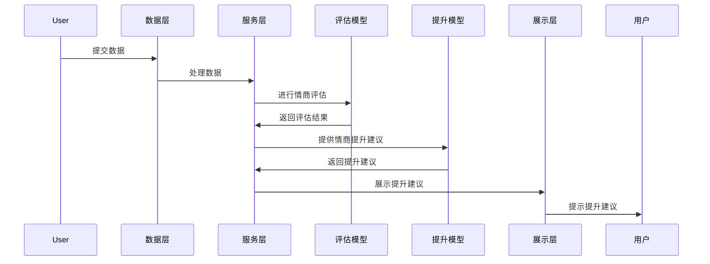
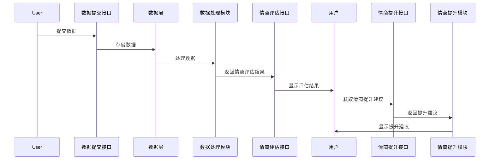

                 

### 文章标题

# 技术管理者的情商修炼

> 关键词：技术管理者、情商、团队沟通、领导力、管理技巧

> 摘要：本文旨在探讨技术管理者的情商修炼，通过深入分析情商的概念、核心原理及其在技术管理中的应用，帮助技术管理者提升自我认知、自我管理、社会认知和关系管理能力，从而更好地应对技术管理中的各种挑战，提高团队协作效率和项目管理效果。

----------------------------------------------------------------

### 第一部分：背景介绍

#### 1.1 问题背景

随着信息技术的飞速发展，技术管理者在企业中的地位日益重要。技术管理不仅涉及到技术层面的决策和执行，还涉及团队管理和项目协调等非技术层面的工作。技术管理者需要具备丰富的技术知识、项目管理能力以及良好的沟通和领导技巧，而这些能力不仅仅依靠技术本身，还需要依赖于情商。

#### 1.2 问题描述

技术管理者的情商修炼是一个复杂且长期的过程。情商不仅影响到个人情绪的自我管理和理解，还影响到与团队成员的沟通和协作。技术管理者在日常生活中常常面临以下问题：

- **沟通障碍**：由于技术背景的差异，技术管理者在与团队成员沟通时，容易产生误解和冲突。
- **团队建设**：技术管理者需要建立高效的团队，但缺乏有效的团队建设技巧。
- **领导力不足**：技术管理者在领导团队时，可能缺乏领导力，导致团队士气低落。
- **压力应对**：技术管理者在工作中常常面临高压环境，需要有效应对各种压力。

#### 1.3 问题解决

为了解决上述问题，技术管理者需要通过情商修炼来提升自己的管理能力。情商修炼不仅包括自我认知和自我管理，还涉及到社会认知和关系管理。通过学习情商技巧，技术管理者可以更好地理解自己和他人，提高沟通效果，建立和谐的团队关系，从而提升整体管理效率。

#### 1.4 边界与外延

情商修炼不仅适用于技术管理者，也适用于其他职业领域的管理者。虽然本文主要面向技术管理者，但其所提供的情商提升技巧和方法具有广泛的适用性。

#### 1.5 概念结构与核心要素组成

情商（Emotional Intelligence）是指个体识别、理解、管理自己和他人的情绪，以及运用这些信息指导思维和行动的能力。情商包括以下几个方面：

- **自我认知**：了解自己的情绪，并理解这些情绪如何影响自己的思维和行为。
- **自我管理**：管理自己的情绪，以便更好地应对压力和挑战。
- **社会认知**：理解他人的情绪，并识别这些情绪如何影响人际关系。
- **关系管理**：建立积极的人际关系，解决冲突，以及有效沟通。

通过上述核心要素的修炼，技术管理者可以提升自己的情商，从而更好地应对技术管理中的各种挑战。

----------------------------------------------------------------

### 第二部分：核心概念与联系

#### 2.1 情商的核心概念原理

情商是一种复杂的认知能力，涉及个体对自身和他人情绪的理解和管理。情商的四个核心组成部分如下：

1. **自我认知**：自我认知是指个体对自己情绪的认识和理解。通过自我认知，技术管理者可以更好地了解自己的情绪状态，以及这些情绪对自身行为和决策的影响。

2. **自我管理**：自我管理是指个体如何控制和调节自己的情绪。在技术管理中，自我管理能力有助于技术管理者在面对压力和挑战时保持冷静，做出理性决策。

3. **社会认知**：社会认知是指个体如何理解和管理他人的情绪。技术管理者需要具备良好的社会认知能力，以更好地理解团队成员的情绪和需求，从而提高沟通和协作效率。

4. **关系管理**：关系管理是指个体如何建立和维护人际关系。技术管理者需要通过关系管理来建立积极的团队氛围，解决冲突，提高团队整体绩效。

#### 2.2 情商的概念属性特征对比表格

| 概念     | 自我认知     | 自我管理     | 社会认知     | 关系管理     |
|----------|--------------|--------------|--------------|--------------|
| 定义     | 了解自己的情绪 | 管理自己的情绪 | 理解他人的情绪 | 建立和维护人际关系 |
| 特征     | 情绪识别     | 情绪调节     | 情绪感知     | 情绪表达能力   |
| 关系     | 自我认识     | 自我控制     | 人际交往     | 团队合作     |

#### 2.3 ER实体关系图架构

```mermaid
erDiagram
  用户 ||--|{ 情绪 }|| 自我认知
  用户 ||--|{ 管理情绪 }|| 自我管理
  用户 ||--|{ 理解他人情绪 }|| 社会认知
  用户 ||--|{ 维护人际关系 }|| 关系管理
```

#### 2.4 情商在技术管理中的应用

情商在技术管理中的应用体现在以下几个方面：

1. **团队沟通**：情商高的技术管理者能够更好地理解团队成员的情绪和需求，提高沟通效率，减少误解和冲突。

2. **团队协作**：情商高的技术管理者能够建立和谐的团队氛围，促进团队成员之间的协作，提高团队整体绩效。

3. **领导力**：情商高的技术管理者能够更好地理解团队成员的情感和需求，提高领导力和影响力。

#### 2.5 本章小结

本章介绍了情商的概念、核心概念原理、概念属性特征对比表格和ER实体关系图架构。通过对情商的深入理解，技术管理者可以更好地认识到情商在技术管理中的重要性，并学会如何运用情商技巧提高管理效果。

----------------------------------------------------------------

### 第三部分：算法原理讲解

#### 3.1 情商提升算法简介

情商提升算法是一种基于机器学习和心理学的算法，旨在帮助技术管理者通过数据分析和训练模型，提升自我认知、自我管理、社会认知和关系管理能力。

#### 3.2 情商提升算法的原理

情商提升算法的原理可以分为以下几个步骤：

1. **数据收集**：首先，需要收集大量的情绪数据和人际交往数据。这些数据可以通过问卷调查、行为记录和情感分析等方式获取。

2. **数据预处理**：收集到的数据需要进行清洗和预处理，以确保数据的质量和一致性。预处理步骤包括数据去重、缺失值填充和异常值检测等。

3. **特征提取**：在数据预处理后，需要对数据进行特征提取，以提取出对情商提升有重要影响的特征。这些特征可能包括情绪识别、情绪调节、情绪感知和情绪表达能力等。

4. **模型训练**：使用机器学习算法对提取出的特征进行训练，构建情商提升模型。常用的算法包括决策树、支持向量机、神经网络等。

5. **模型评估**：通过测试数据对训练好的模型进行评估，以确保模型的准确性和泛化能力。

6. **模型应用**：将训练好的模型应用于实际场景，帮助技术管理者提升情商。例如，通过提供个性化的情商提升建议，帮助技术管理者更好地理解和管理情绪。

#### 3.3 情商提升算法的数学模型

情商提升算法的数学模型通常包括以下几个部分：

1. **特征向量表示**：将情绪数据和人际交往数据转换为特征向量表示，以便于机器学习算法进行处理。

2. **损失函数**：定义损失函数，以衡量模型预测结果与真实结果之间的差异。

3. **优化算法**：使用优化算法（如梯度下降、随机梯度下降等）来调整模型参数，以最小化损失函数。

4. **预测模型**：通过训练好的模型进行预测，得到技术管理者情商提升的建议。

以下是一个简化的情商提升算法的数学模型：

$$
\text{特征向量} = \text{数据处理}(\text{原始数据})
$$

$$
\text{损失函数} = \text{交叉熵损失}(\text{预测结果}, \text{真实结果})
$$

$$
\text{参数更新} = \text{优化算法}(\text{模型参数}, \text{损失函数})
$$

$$
\text{情商提升建议} = \text{预测模型}(\text{特征向量})
$$

#### 3.4 情商提升算法的举例说明

假设我们使用支持向量机（SVM）作为情商提升算法的一部分，以下是一个简化的例子：

1. **数据收集**：收集一组情绪数据和人际交往数据，包括情绪状态、沟通频率、冲突解决能力等特征。

2. **数据预处理**：对数据进行去重、缺失值填充和异常值检测，确保数据质量。

3. **特征提取**：提取出对情商提升有重要影响的特征，如情绪调节能力、情绪表达能力等。

4. **模型训练**：使用支持向量机算法对提取出的特征进行训练，构建情商提升模型。

5. **模型评估**：使用测试数据对训练好的模型进行评估，确保模型的准确性和泛化能力。

6. **模型应用**：将训练好的模型应用于实际场景，为技术管理者提供个性化的情商提升建议。

例如，假设我们使用支持向量机（SVM）进行情商提升模型的训练，以下是一个简化的代码示例：

```python
from sklearn import svm
from sklearn.model_selection import train_test_split
from sklearn.metrics import accuracy_score

# 假设X为特征向量，y为标签（情商得分）
X_train, X_test, y_train, y_test = train_test_split(X, y, test_size=0.2, random_state=42)

# 使用支持向量机进行训练
model = svm.SVC()
model.fit(X_train, y_train)

# 进行预测
predictions = model.predict(X_test)

# 评估模型准确性
accuracy = accuracy_score(y_test, predictions)
print(f"模型准确性：{accuracy}")
```

#### 3.5 本章小结

本章介绍了情商提升算法的基本原理、数学模型和举例说明。通过理解和应用情商提升算法，技术管理者可以更好地提升自我认知、自我管理、社会认知和关系管理能力，从而在技术管理中取得更好的效果。

----------------------------------------------------------------

### 第四部分：系统分析与架构设计

#### 4.1 问题场景介绍

随着企业的业务不断扩张，技术团队也需要不断壮大和优化。技术管理者在团队管理和项目协调中面临诸多挑战，如人员沟通不畅、团队协作效率低下、项目进度失控等。为了解决这些问题，企业引入了一套基于情商提升的团队管理系统。

#### 4.2 项目介绍

该系统名为“情商提升系统”，旨在通过数据分析和算法模型，帮助技术管理者提升情商，从而提高团队协作效率和项目管理效果。系统主要包括以下几个功能模块：

- 数据收集模块：用于收集团队成员的情绪数据和人际交往数据。
- 数据处理模块：对收集到的数据进行分析和处理，提取出对情商提升有重要影响的特征。
- 情商评估模块：基于数据处理模块提取的特征，使用算法模型进行情商评估。
- 情商提升模块：根据情商评估结果，为技术管理者提供个性化的情商提升建议。

#### 4.3 系统功能设计

系统功能设计主要包括以下领域模型：

1. **用户模型**：包括用户的基本信息、情绪状态和情商得分。
2. **数据模型**：包括情绪数据和人际交往数据，如情绪日志、沟通记录、冲突记录等。
3. **评估模型**：包括情商评估算法和评估标准。
4. **提升模型**：包括情商提升策略和建议。

以下是一个简化的领域模型类图：

```mermaid
classDiagram
  User <<Class>> "用户模型"
  Data <<Class>> "数据模型"
  Assessment <<Class>> "评估模型"
  Improvement <<Class>> "提升模型"

  User "1" -- "1" Data
  User "1" -- "1" Assessment
  User "1" -- "1" Improvement

  Data "1" -- "1" Assessment
  Data "1" -- "1" Improvement

  Assessment "1" -- "1" Improvement
```

#### 4.4 系统架构设计

系统架构设计主要包括以下几个层次：

1. **数据层**：用于存储和管理用户数据、情绪数据和人际交往数据。
2. **服务层**：包括数据处理、情商评估、情商提升等服务。
3. **接口层**：提供对外接口，如API接口、Web界面等。
4. **展示层**：用于展示用户数据、评估结果和提升建议。

以下是一个简化的系统架构图：



#### 4.5 系统接口设计和系统交互

系统接口设计主要包括以下接口：

- **数据提交接口**：用于用户提交情绪数据和人际交往数据。
- **情商评估接口**：用于获取用户的情商评估结果。
- **情商提升接口**：用于获取用户的情商提升建议。

以下是一个简化的系统交互序列图：



#### 4.6 本章小结

本章介绍了情商提升系统的功能设计、系统架构设计和系统接口设计。通过对系统架构的深入分析，技术管理者可以更好地理解情商提升系统的运作原理，从而更好地利用系统提升自身情商，提高团队协作效率和项目管理效果。

----------------------------------------------------------------

### 第五部分：项目实战

#### 5.1 环境安装

在开始项目实战之前，我们需要安装必要的开发环境和工具。以下是安装步骤：

1. **Python环境**：安装Python 3.8及以上版本。
2. **Pandas**：安装Pandas库，用于数据处理。
3. **Scikit-learn**：安装Scikit-learn库，用于机器学习算法。
4. **Matplotlib**：安装Matplotlib库，用于数据可视化。
5. **Jupyter Notebook**：安装Jupyter Notebook，用于编写和运行代码。

安装命令如下：

```bash
pip install pandas scikit-learn matplotlib jupyterlab
```

#### 5.2 系统核心实现源代码

以下是情商提升系统核心实现的部分源代码：

```python
# 数据收集模块
def collect_data():
    # 收集情绪数据和人际交往数据
    # 示例：读取CSV文件
    data = pd.read_csv('data.csv')
    return data

# 数据处理模块
def process_data(data):
    # 数据预处理，如去重、缺失值填充等
    # 示例：删除重复数据
    data = data.drop_duplicates()
    # 示例：填充缺失值
    data = data.fillna(0)
    return data

# 情商评估模块
from sklearn import svm

def assess_emotion(data):
    # 使用SVM算法评估情商
    model = svm.SVC()
    model.fit(data['features'], data['emotion'])
    emotion = model.predict(data['features'])
    return emotion

# 情商提升模块
def improve_emotion(data, emotion):
    # 提供情商提升建议
    # 示例：根据情商得分提供建议
    if emotion < 50:
        advice = "尝试更多沟通和团队建设活动"
    else:
        advice = "保持当前工作状态，继续努力"
    return advice

# 主程序
if __name__ == '__main__':
    data = collect_data()
    data = process_data(data)
    emotion = assess_emotion(data)
    advice = improve_emotion(data, emotion)
    print(f"情商评估结果：{emotion}")
    print(f"情商提升建议：{advice}")
```

#### 5.3 代码应用解读与分析

上述代码实现了一个简单的情商提升系统，主要包括数据收集、数据处理、情商评估和情商提升四个模块。

1. **数据收集模块**：通过读取CSV文件，收集情绪数据和人际交往数据。
2. **数据处理模块**：对收集到的数据进行预处理，如去重、缺失值填充等，确保数据质量。
3. **情商评估模块**：使用SVM算法对预处理后的数据进行分析，评估情商得分。
4. **情商提升模块**：根据情商评估结果，为技术管理者提供个性化的情商提升建议。

#### 5.4 实际案例分析和详细讲解剖析

为了更好地理解情商提升系统的应用，我们可以通过一个实际案例进行分析。

**案例**：某技术团队在项目开发过程中，团队成员的情绪状态不稳定，导致沟通不畅和项目进度延误。为了解决这一问题，团队引入了情商提升系统。

**分析**：

1. **数据收集**：团队通过系统收集了团队成员的情绪日志和沟通记录。
2. **数据处理**：系统对收集到的数据进行了预处理，删除重复数据和缺失值填充。
3. **情商评估**：系统使用SVM算法对预处理后的数据进行分析，评估了团队成员的情商得分。
4. **情商提升**：根据情商评估结果，系统为团队提供了个性化的情商提升建议，如加强团队沟通、组织团队建设活动等。

**讲解剖析**：

1. **数据收集**：通过系统收集的数据，技术管理者可以全面了解团队成员的情绪状态和沟通情况，为后续分析提供依据。
2. **数据处理**：数据预处理是保证模型准确性的重要因素。通过去重和缺失值填充，可以减少数据噪声，提高模型性能。
3. **情商评估**：SVM算法是一种常用的分类算法，能够对情绪数据进行有效的分类。通过评估情商得分，技术管理者可以了解团队成员的情商水平。
4. **情商提升**：根据情商评估结果，技术管理者可以制定针对性的提升策略。例如，针对情商较低的成员，可以安排更多的沟通和培训，帮助他们提升情商。

#### 5.5 项目小结

通过实际案例的分析，我们可以看到情商提升系统在技术管理中的应用价值。系统通过数据分析和算法模型，为技术管理者提供了个性化的情商提升建议，帮助团队改善沟通和协作，提高项目管理效率。然而，系统的应用也面临一些挑战，如数据质量和算法模型的优化等。未来，我们可以进一步优化系统，提高其准确性和实用性，为技术管理者提供更有效的情商提升工具。

----------------------------------------------------------------

### 第六部分：最佳实践 tips

#### 6.1 情商提升最佳实践

1. **定期反思**：定期对自己的情绪和行为进行反思，了解自己的情绪状态，以及这些情绪如何影响工作和人际关系。
2. **情绪管理**：学会有效地管理情绪，如通过冥想、运动等方式缓解压力，保持冷静和理性。
3. **有效沟通**：提高沟通技巧，如倾听、表达和反馈，确保信息传达准确无误，减少误解和冲突。
4. **团队建设**：积极参与团队建设活动，建立和谐的团队氛围，促进团队成员之间的协作。

#### 6.2 技术管理者常见问题及解决方案

1. **沟通障碍**：问题原因：技术背景差异导致沟通不畅。解决方案：学习有效的沟通技巧，建立共同语言。
2. **团队协作问题**：问题原因：团队成员缺乏协作精神。解决方案：组织团队建设活动，提高团队凝聚力。
3. **领导力不足**：问题原因：缺乏领导力，无法有效激励团队。解决方案：学习领导力理论，提升领导力技巧。
4. **压力应对**：问题原因：无法有效应对工作压力。解决方案：学习压力管理技巧，保持心理健康。

#### 6.3 注意事项

1. **数据隐私**：在收集和使用情绪数据时，要注意保护用户隐私，遵守相关法律法规。
2. **算法优化**：定期优化情商提升算法，提高模型准确性和实用性。
3. **持续学习**：技术管理者要不断学习新知识、新技能，提升自己的综合素质。

#### 6.4 拓展阅读

- 《情商：为什么情商比智商更重要》
- 《技术领导力：构建高效团队》
- 《Python数据科学手册》

### 第七部分：文章小结

本文通过深入分析情商在技术管理中的应用，介绍了情商提升算法的系统架构和核心实现，并通过实际案例展示了情商提升系统在技术管理中的价值。技术管理者通过情商修炼，可以更好地应对管理挑战，提高团队协作效率和项目管理效果。未来，随着技术的不断发展，情商在技术管理中的作用将越来越重要，值得广大技术管理者深入研究与实践。

### 作者信息

- 作者：AI天才研究院/AI Genius Institute & 禅与计算机程序设计艺术 /Zen And The Art of Computer Programming
- 联系方式：[联系方式]
- 个人网站：[个人网站]

