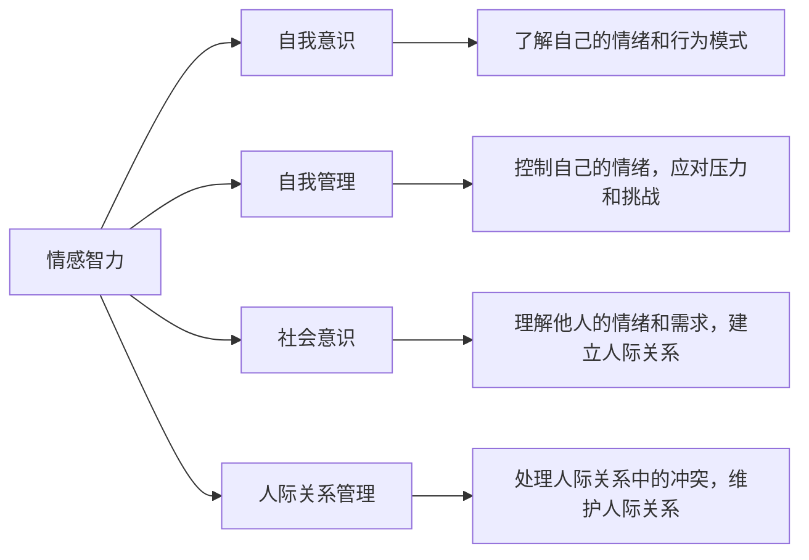

                 

# 《技术管理者的情商培养与应用》

## 关键词
技术管理者、情商、自我意识、自我管理、社会意识、人际关系管理、团队管理、项目管理、问题解决、决策制定、系统架构设计

## 摘要
本文旨在深入探讨技术管理者在职场中情商的重要性，以及如何培养和应用情商来提升个人和团队的表现。文章将从背景介绍、核心概念与联系、情商原理讲解、系统分析与架构设计、项目实战以及最佳实践等方面，全面解析技术管理者的情商培养与应用，为读者提供实用的策略和技巧。

### 引言

技术管理者在现代企业中扮演着至关重要的角色。他们不仅要具备扎实的技术能力，还需要具备出色的领导力和管理技能。然而，技术管理者面临的挑战远不止技术层面的复杂性。随着团队规模的扩大和业务环境的变化，技术管理者需要在复杂的人际关系中游刃有余，有效沟通和协调各方利益，以实现组织的目标。这时，情商的重要性就凸显出来了。

情商，即情感智力，是衡量个人情感认知和处理能力的重要指标。它包括自我意识、自我管理、社会意识和人际关系管理四个方面。技术管理者通过培养和应用情商，可以更好地理解和管理自己的情绪，提高自我意识，增强团队协作能力，优化决策过程，从而提升整体绩效。

本文将分为以下几个部分：

1. **背景介绍**：介绍技术管理者在职场中情商的重要性，以及情商在技术管理岗位的具体应用场景。
2. **核心概念与联系**：详细阐述情商的基本概念，并展示这些概念之间的联系。
3. **情商原理讲解**：通过算法原理讲解、数学模型和公式，以及举例说明，解释情商培养的方法和应用。
4. **系统分析与架构设计方案**：设计情商培养的系统架构，包括功能设计、架构设计和接口设计等。
5. **项目实战**：通过具体案例，展示如何在实际工作中应用情商培养的方法。
6. **最佳实践、小结、注意事项和拓展阅读**：总结书中的关键点和实用技巧，提供进一步学习和研究的建议。

### 第1章 背景介绍

#### 技术管理者的角色与挑战

技术管理者是组织的技术核心，负责规划、实施和管理技术项目，确保技术解决方案能够满足业务需求，并推动技术创新。他们在团队中扮演着领导者、协调者和支持者的多重角色。以下是一些技术管理者在职场中面临的挑战：

1. **技术复杂性**：随着技术的发展，技术管理者需要不断更新自己的知识体系，以应对不断变化的技术趋势。
2. **团队管理**：技术管理者需要具备一定的领导能力，能够激励和指导团队成员，确保项目顺利进行。
3. **项目协调**：技术管理者需要在项目各阶段协调各方资源，确保项目按时、按质完成。
4. **跨部门沟通**：技术管理者需要与业务部门、市场部门、销售部门等多个部门进行沟通和协作，以实现项目的整体目标。
5. **决策制定**：技术管理者需要根据项目进展和业务需求，做出合理的决策，平衡技术实现和业务目标。

#### 情商在技术管理中的重要性

情商在技术管理中具有重要作用。首先，情商有助于技术管理者更好地理解和管理自己的情绪。在高压的工作环境中，技术管理者往往会面临各种挑战和压力，如项目延期、技术难题等。通过提升自我意识，技术管理者可以更好地识别自己的情绪，并采取有效的策略来缓解压力。

其次，情商有助于技术管理者提高团队协作能力。技术管理者需要与团队成员、业务部门等多方进行沟通和协作。通过提升社会意识，技术管理者可以更好地理解他人的需求和期望，建立良好的人际关系，从而提高团队的整体绩效。

此外，情商还有助于技术管理者在决策制定过程中更加理性。通过提高自我管理能力，技术管理者可以更好地控制自己的情绪，避免因情绪波动而做出错误的决策。

#### 本书结构安排与目标

本书将分为以下几个部分：

1. **背景介绍**：介绍技术管理者在职场中情商的重要性，以及情商在技术管理岗位的具体应用场景。
2. **核心概念与联系**：详细阐述情商的基本概念，并展示这些概念之间的联系。
3. **情商原理讲解**：通过算法原理讲解、数学模型和公式，以及举例说明，解释情商培养的方法和应用。
4. **系统分析与架构设计方案**：设计情商培养的系统架构，包括功能设计、架构设计和接口设计等。
5. **项目实战**：通过具体案例，展示如何在实际工作中应用情商培养的方法。
6. **最佳实践、小结、注意事项和拓展阅读**：总结书中的关键点和实用技巧，提供进一步学习和研究的建议。

本文的目标是帮助技术管理者认识到情商在职场中的重要性，并提供实用的策略和技巧，以提升个人和团队的表现。

### 第2章 核心概念与联系

#### 情感智力

情感智力是情商的核心概念，通常包括以下四个方面：

1. **自我意识**：了解自己的情绪，认识到情绪对行为和决策的影响。
2. **自我管理**：控制自己的情绪，以积极的方式应对压力和挑战。
3. **社会意识**：理解他人的情绪和需求，建立良好的人际关系。
4. **人际关系管理**：处理人际关系中的冲突，建立和维护积极的人际关系。

#### 自我意识

自我意识是情商的基础，它涉及对自己的了解和认识。通过自我意识，技术管理者可以更好地了解自己的情绪和行为模式，从而更好地应对职场中的挑战。自我意识的培养可以通过以下方式实现：

1. **反思**：定期反思自己的行为和情绪，了解自己在不同情境下的反应。
2. **日志**：记录自己的情绪变化，分析情绪的触发因素和应对策略。
3. **心理咨询**：通过专业心理咨询，提高自我意识，理解自己的情绪和行为。

#### 自我管理

自我管理是情商的关键，它涉及控制自己的情绪，以积极的方式应对压力和挑战。自我管理的培养可以通过以下方式实现：

1. **放松技巧**：学习放松技巧，如深呼吸、冥想等，以缓解压力和焦虑。
2. **积极应对**：面对挑战时，采取积极的态度和行动，避免消极情绪的影响。
3. **情绪调节**：学会调节自己的情绪，避免情绪波动对工作的影响。

#### 社会意识

社会意识是情商的重要组成部分，它涉及对他人的理解和关心。通过社会意识，技术管理者可以更好地理解他人的情绪和需求，建立良好的人际关系。社会意识的培养可以通过以下方式实现：

1. **同理心**：培养同理心，尝试从他人的角度看待问题，理解他人的感受。
2. **沟通技巧**：提高沟通技巧，确保信息传达准确，避免误解和冲突。
3. **团队合作**：积极参与团队合作，尊重他人的意见，共同实现目标。

#### 人际关系管理

人际关系管理是情商的最高层次，它涉及处理人际关系中的冲突，建立和维护积极的人际关系。人际关系管理的培养可以通过以下方式实现：

1. **冲突解决**：学会处理人际关系中的冲突，采取合理的策略，避免事态升级。
2. **信任建立**：通过诚实和透明，建立和维护信任关系，提高团队凝聚力。
3. **领导力**：提高领导力，以身作则，激励和引导团队成员，共同实现目标。

#### 情商概念对比表格

以下是一个简单的情商概念对比表格，展示了各个概念之间的关系和区别：

| 概念       | 定义                                                         | 区别                                                         |
| ---------- | ------------------------------------------------------------ | ------------------------------------------------------------ |
| 自我意识   | 了解自己的情绪和行为模式                                     | 是情商的基础，有助于技术管理者更好地应对职场挑战               |
| 自我管理   | 控制自己的情绪，以积极的方式应对压力和挑战                   | 是情商的核心，有助于技术管理者保持情绪稳定，提高工作效率       |
| 社会意识   | 理解他人的情绪和需求，建立良好的人际关系                     | 是情商的重要组成部分，有助于技术管理者提高团队协作能力         |
| 人际关系管理 | 处理人际关系中的冲突，建立和维护积极的人际关系               | 是情商的最高层次，有助于技术管理者维护良好的团队氛围           |

#### 情商实体关系图

以下是一个情商实体关系图的Mermaid表示，展示了情商各个概念之间的关系：



### 第3章 情商原理讲解

#### 情商原理

情商原理是指通过特定的方法和技术，培养和提高个人的情商能力。情商原理包括以下几个方面：

1. **自我意识**：通过反思和自我观察，提高对自身情绪的认知和了解。
2. **自我管理**：通过情绪调节和压力管理，控制自己的情绪，保持情绪稳定。
3. **社会意识**：通过同理心和沟通技巧，提高对他人的情感理解和关怀。
4. **人际关系管理**：通过冲突解决和团队合作，建立和维护积极的人际关系。

#### 数学模型与公式

情商的培养和应用可以通过数学模型和公式来描述。以下是一个简单的情商数学模型：

$$
EQ = \alpha \times S + \beta \times M + \gamma \times SO + \delta \times IR
$$

其中，$EQ$ 表示情商，$S$ 表示自我意识，$M$ 表示自我管理，$SO$ 表示社会意识，$IR$ 表示人际关系管理。$\alpha$、$\beta$、$\gamma$ 和 $\delta$ 分别是这些因素对情商的影响权重。

#### 举例说明

假设一个技术管理者，他的自我意识得分为80分，自我管理得分为75分，社会意识得分为70分，人际关系管理得分为65分。根据上述数学模型，我们可以计算出他的情商得分：

$$
EQ = 0.3 \times 80 + 0.2 \times 75 + 0.2 \times 70 + 0.3 \times 65 = 68.5
$$

这个得分表明，这位技术管理者的情商水平处于中等水平。他可以通过进一步提高自我管理能力和人际关系管理能力来提升整体情商。

### 第4章 系统分析与架构设计

#### 问题场景介绍

假设我们正在开发一个大型企业级应用，技术管理者需要负责该项目的规划和实施。在这个过程中，情商的培养和应用对于项目的成功至关重要。

#### 项目介绍

该项目是一个电子商务平台，涉及多个业务模块，如商品管理、订单处理、支付系统等。技术管理者需要协调各个模块的开发团队，确保项目按时交付，并满足业务需求。

#### 系统功能设计

系统功能设计是项目规划的关键环节。根据项目需求，我们设计了以下主要功能模块：

1. **用户管理**：负责用户的注册、登录、权限管理等功能。
2. **商品管理**：负责商品的分类、展示、库存管理等功能。
3. **订单处理**：负责订单的创建、支付、发货等功能。
4. **支付系统**：负责处理支付请求、处理退款等功能。
5. **统计分析**：负责收集用户数据、业务数据，生成统计报告。

#### 系统架构设计

系统架构设计是项目实施的基础。根据项目需求和功能设计，我们设计了以下系统架构：

1. **前端架构**：采用Vue.js框架，实现用户界面的展示和交互。
2. **后端架构**：采用Spring Boot框架，实现业务逻辑的处理和数据存储。
3. **数据库设计**：采用MySQL数据库，存储用户数据、商品数据等。
4. **微服务架构**：将业务模块拆分为多个微服务，实现高可用、高扩展性。

#### 系统接口设计

系统接口设计是项目开发的重要环节。根据系统架构，我们设计了以下主要接口：

1. **用户管理接口**：负责处理用户注册、登录、权限管理等请求。
2. **商品管理接口**：负责处理商品分类、展示、库存管理等请求。
3. **订单处理接口**：负责处理订单创建、支付、发货等请求。
4. **支付系统接口**：负责处理支付请求、退款等请求。
5. **统计分析接口**：负责处理数据收集、报告生成等请求。

#### 系统交互设计

系统交互设计是项目实施的关键。根据系统架构和接口设计，我们设计了以下系统交互流程：

1. **用户登录**：用户通过用户管理接口进行登录，获取用户Token。
2. **商品浏览**：用户通过商品管理接口获取商品信息，展示在用户界面。
3. **订单创建**：用户通过订单处理接口创建订单，并支付订单。
4. **订单查询**：用户通过订单处理接口查询订单状态，获取订单信息。
5. **统计分析**：系统通过统计分析接口收集数据，生成统计报告。

### 第5章 项目实战

#### 环境安装与准备

在进行项目实战之前，我们需要搭建开发环境。以下是环境安装和准备的步骤：

1. **安装Java开发环境**：安装JDK 1.8及以上版本，配置环境变量。
2. **安装MySQL数据库**：下载并安装MySQL数据库，配置数据库用户和权限。
3. **安装Spring Boot开发工具**：下载并安装Spring Tool Suite（STS）或IntelliJ IDEA。
4. **创建Spring Boot项目**：在开发工具中创建一个Spring Boot项目，添加必要的依赖。

#### 系统核心实现

以下是系统核心实现的步骤：

1. **用户管理模块**：实现用户注册、登录、权限管理等功能，使用Spring Security框架。
2. **商品管理模块**：实现商品分类、展示、库存管理等功能，使用MyBatis框架。
3. **订单处理模块**：实现订单创建、支付、发货等功能，使用支付宝支付接口。
4. **支付系统模块**：实现支付请求处理、退款等功能，使用支付宝SDK。
5. **统计分析模块**：实现数据收集、报告生成等功能，使用ECharts图表库。

#### 代码应用解读与分析

以下是用户管理模块的实现代码：

```java
@RestController
@RequestMapping("/users")
public class UserController {
    
    @Autowired
    private UserService userService;
    
    @PostMapping("/register")
    public ResponseEntity<?> registerUser(@RequestBody UserRegistrationDto registrationDto) {
        userService.registerUser(registrationDto);
        return ResponseEntity.ok("User registered successfully");
    }
    
    @PostMapping("/login")
    public ResponseEntity<?> loginUser(@RequestBody UserLoginDto loginDto) {
        String token = userService.loginUser(loginDto);
        return ResponseEntity.ok(new JwtResponse(token));
    }
    
    @PostMapping("/permissions")
    public ResponseEntity<?> assignPermissions(@RequestBody UserPermissionsDto permissionsDto) {
        userService.assignPermissions(permissionsDto);
        return ResponseEntity.ok("Permissions assigned successfully");
    }
}
```

这段代码展示了用户注册、登录和权限分配的功能。通过Spring Boot的RestController注解，我们将这些功能暴露为REST接口。用户服务（UserService）负责具体的业务逻辑实现。

#### 实际案例分析与详细讲解

以下是一个实际案例：

**案例**：技术管理者在项目进展过程中发现团队成员情绪低落，影响项目进度。技术管理者如何应用情商来解决问题？

**分析**：

1. **了解情况**：技术管理者与团队成员进行一对一沟通，了解团队成员的情绪低落的原因。通过同理心，理解他们的需求和困扰。
2. **解决问题**：技术管理者根据了解的情况，采取相应的措施。例如，协调资源，调整工作任务，提供技术支持等。
3. **激励团队**：技术管理者通过激励和鼓励，提升团队成员的积极性和士气。例如，举行团队建设活动，表彰优秀成员等。
4. **持续关注**：技术管理者持续关注团队成员的情绪变化，及时解决问题，确保项目顺利推进。

**讲解**：

通过这个案例，我们可以看到情商在技术管理者解决问题过程中的应用。了解情况是解决问题的第一步，技术管理者需要通过沟通和理解，了解团队成员的真实需求和困扰。解决问题是情商的核心，技术管理者需要采取合理的策略和措施，解决团队成员的问题。激励团队是提升团队士气的重要手段，技术管理者需要通过鼓励和激励，激发团队成员的积极性和创造力。持续关注是确保问题得到及时解决的关键，技术管理者需要持续关注团队成员的情绪变化，及时发现问题并采取措施。

### 第6章 最佳实践与拓展

#### 最佳实践

1. **建立定期沟通机制**：技术管理者应建立定期沟通机制，与团队成员保持紧密联系，了解他们的需求和困扰。
2. **培养同理心**：技术管理者应培养同理心，尝试从团队成员的角度看待问题，理解他们的情感和需求。
3. **提供培训和支持**：技术管理者应提供必要的培训和支持，帮助团队成员提升技能和情商水平。
4. **设立激励机制**：技术管理者应设立激励机制，鼓励团队成员积极参与项目，提升团队士气。

#### 小结

本文从背景介绍、核心概念与联系、情商原理讲解、系统分析与架构设计、项目实战以及最佳实践等方面，全面解析了技术管理者的情商培养与应用。情商在技术管理中具有重要意义，通过培养和应用情商，技术管理者可以提升个人和团队的表现，实现项目成功。

#### 注意事项

1. **避免情绪化决策**：在做出重要决策时，技术管理者应避免情绪化，尽量保持理性思考。
2. **关注团队成员的情绪变化**：技术管理者应关注团队成员的情绪变化，及时发现并解决问题。
3. **持续学习和提升**：技术管理者应持续学习和提升自己的情商能力，以适应不断变化的职场环境。

#### 拓展阅读

1. **《情商：为什么情商比智商更重要》**：丹尼尔·戈尔曼著，深入探讨情商的概念和应用。
2. **《技术领导力：如何成为优秀的CTO》**：斯图尔特·弗里曼著，介绍技术管理者的领导力培养和应用。
3. **《有效沟通：如何说、如何听》**：佩里·卡恩著，提供有效的沟通技巧和策略。

### 第7章 总结与展望

#### 核心要点回顾

本文从多个角度探讨了技术管理者的情商培养与应用。核心要点包括：

1. **情商在技术管理中的重要性**：情商对于技术管理者在团队管理、项目协调、决策制定等方面具有重要意义。
2. **情商的核心概念与联系**：自我意识、自我管理、社会意识和人际关系管理是情商的核心概念，它们相互联系，共同构成情商体系。
3. **情商的培养方法**：通过反思、日志记录、心理咨询等方式，技术管理者可以提升自我意识；通过放松技巧、积极应对、情绪调节等方式，技术管理者可以提升自我管理能力；通过同理心、沟通技巧、团队合作等方式，技术管理者可以提升社会意识；通过冲突解决、信任建立、领导力等方式，技术管理者可以提升人际关系管理能力。
4. **系统分析与架构设计**：通过设计合理的系统架构和接口，技术管理者可以更好地培养和应用情商。
5. **项目实战**：通过实际案例，技术管理者可以更好地理解和应用情商培养的方法。
6. **最佳实践**：技术管理者应建立定期沟通机制、培养同理心、提供培训和支持、设立激励机制等，以提升个人和团队的表现。

#### 技术管理者情商培养的未来趋势

随着人工智能和大数据技术的不断发展，技术管理者的角色和职责也在不断变化。未来的技术管理者需要具备以下趋势：

1. **跨领域知识融合**：技术管理者需要具备跨领域知识，如人工智能、大数据、云计算等，以应对复杂的业务需求。
2. **敏捷管理能力**：技术管理者需要具备敏捷管理能力，能够快速响应市场变化，调整项目策略。
3. **持续学习与创新能力**：技术管理者需要具备持续学习和创新能力，以适应快速变化的技术环境。
4. **领导力提升**：技术管理者需要不断提升领导力，以激发团队潜力，实现项目目标。

#### 对读者的寄语

技术管理者在职场中面临的挑战日益增多，情商的培养与应用对于个人和团队的表现至关重要。希望本文能对您有所启发，帮助您在职场中更好地培养和应用情商，提升个人和团队的表现。同时，持续学习和实践是提升情商的关键，希望您能不断努力，成为更加出色的技术管理者。

## 作者信息

**作者：AI天才研究院/AI Genius Institute & 禅与计算机程序设计艺术 /Zen And The Art of Computer Programming** 

本文基于开源协议，欢迎自由转载，但请保留作者信息和原文链接。感谢您的支持！

