                 

### 文章标题

# 技术管理者的情绪管理：在压力下保持冷静与理性

> 关键词：技术管理者、情绪管理、压力应对、团队管理、项目管理

> 摘要：本文旨在探讨技术管理者如何在高压环境下保持冷静与理性，有效管理情绪。通过分析技术管理者所面临的主要压力来源，情绪管理的基本概念与方法，以及情绪管理在技术管理中的应用，本文为技术管理者提供了一套实用的情绪管理策略，旨在帮助其在职业生涯中实现长期稳定与成长。

## 目录大纲

----------------------------------------------------------------

## 第一部分：情绪管理的基础理论

### 第1章：技术管理者情绪管理的背景与重要性

- 1.1 技术管理者面临的压力来源
- 1.2 情绪管理的重要性
- 1.3 情绪管理的基本概念

### 第2章：情绪的类型与表现

- 2.1 情绪的类型
  - 2.1.1 情绪的生理反应
  - 2.1.2 情绪的心理反应
- 2.2 情绪的表现
  - 2.2.1 表面情绪
  - 2.2.2 隐匿情绪

### 第3章：情绪管理的方法

- 3.1 认知行为疗法
  - 3.1.1 认知重构
  - 3.1.2 行为调整
- 3.2 情绪调节技巧
  - 3.2.1 深呼吸
  - 3.2.2 冥想
  - 3.2.3 肌肉放松

### 第4章：情绪管理在技术管理中的应用

- 4.1 团队管理中的情绪管理
  - 4.1.1 建立积极的工作氛围
  - 4.1.2 处理团队成员的情绪问题
- 4.2 项目管理中的情绪管理
  - 4.2.1 时间管理
  - 4.2.2 风险管理

### 第5章：情绪管理与个人成长

- 5.1 情绪管理对个人成长的影响
- 5.2 情绪管理与职业发展
- 5.3 情绪管理与心理健康

## 第二部分：压力下的情绪应对策略

### 第6章：压力管理策略

- 6.1 压力的定义与类型
- 6.2 压力对情绪的影响
- 6.3 压力管理的策略
  - 6.3.1 预防策略
  - 6.3.2 应对策略

### 第7章：危机情境下的情绪应对

- 7.1 危机情境的识别
- 7.2 危机情境下的情绪反应
- 7.3 危机情境下的应对策略
  - 7.3.1 保持冷静
  - 7.3.2 制定应急计划
  - 7.3.3 寻求支持

### 第8章：培养情绪稳定性

- 8.1 情绪稳定性的重要性
- 8.2 提高情绪稳定性的方法
  - 8.2.1 增强自我意识
  - 8.2.2 增强情绪调节能力
  - 8.2.3 增强心理韧性

## 第三部分：情绪管理的实践与应用

### 第9章：情绪管理案例分析

- 9.1 案例背景
- 9.2 情绪问题分析
- 9.3 情绪管理策略实施
- 9.4 案例结果与启示

### 第10章：情绪管理在技术团队建设中的应用

- 10.1 技术团队情绪管理的挑战
- 10.2 情绪管理策略在团队建设中的应用
- 10.3 情绪管理对团队绩效的影响

### 第11章：情绪管理的长期规划与自我提升

- 11.1 情绪管理的长期规划
- 11.2 自我提升策略
- 11.3 持续学习与成长

----------------------------------------------------------------

在接下来的内容中，我们将详细探讨技术管理者在高压环境下如何进行情绪管理，包括理论基础、具体方法以及实际应用，帮助读者在技术管理职业生涯中保持冷静与理性。### 第一部分：情绪管理的基础理论

#### 第1章：技术管理者情绪管理的背景与重要性

**1.1 技术管理者面临的压力来源**

作为技术管理者，他们往往肩负着项目成功、团队发展和组织效率的多重责任。这些压力来源主要包括以下几个方面：

- **项目压力**：技术管理者需要确保项目的进度和质量，项目延期或失败会给管理者带来巨大压力。
- **团队管理压力**：组建、管理和激励团队是技术管理者的核心工作。团队成员的个性差异、工作冲突和绩效问题都可能成为压力源。
- **技术复杂性**：随着技术的快速发展，技术管理者需要不断更新自己的知识储备，这对他们的时间和精力提出了挑战。
- **组织期望**：组织对技术管理者的期望往往较高，管理者需要满足各种业务需求，同时保持技术的先进性和可持续性。

**1.2 情绪管理的重要性**

情绪管理对于技术管理者至关重要，原因如下：

- **决策能力**：情绪稳定有助于技术管理者做出更加理性和客观的决策，避免因情绪波动而影响项目判断。
- **团队凝聚力**：情绪稳定的领导者能够营造一个积极、和谐的工作氛围，提高团队的凝聚力和合作效率。
- **健康长寿**：长期的职场压力和情绪问题可能对管理者的身心健康造成负面影响，情绪管理有助于维持身心健康。

**1.3 情绪管理的基本概念**

情绪管理涉及以下基本概念：

- **情绪**：情绪是指个体对特定事件或刺激的主观体验，通常包括愉悦、愤怒、悲伤等。
- **情绪识别**：识别自己的情绪是情绪管理的基础，只有了解自己的情绪状态，才能对其进行有效管理。
- **情绪调节**：情绪调节是指通过一系列策略来改变或控制自己的情绪状态，以适应不同的环境和需求。
- **自我意识**：自我意识是指个体对自己情绪状态、行为和思维过程的认知和反思能力。

**图1-1 情绪管理的核心概念**

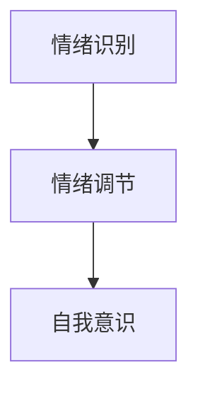

**图1-2 情绪管理的核心要素**

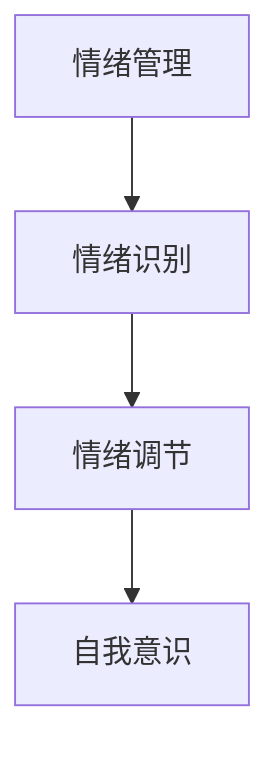

通过上述核心概念和要素的分析，我们可以看出情绪管理对于技术管理者的重要性。在接下来的章节中，我们将进一步探讨情绪的类型与表现、情绪管理的方法，以及情绪管理在技术管理中的应用。这些内容将为技术管理者提供实用的工具和方法，帮助他们在高压环境下保持冷静与理性。

#### 第2章：情绪的类型与表现

**2.1 情绪的类型**

情绪是人类在特定情境下产生的复杂心理体验，常见的情绪类型包括：

- **愉悦**：愉悦是一种积极的情绪，通常与满足、快乐和成就感相关联。愉悦能够提升个体的心理健康和幸福感。
- **愤怒**：愤怒是一种强烈的情绪，通常与挫折、不满和威胁相关联。过度的愤怒可能导致冲突和关系破裂。
- **悲伤**：悲伤是一种与失去、失落和失望相关的情绪。适当的悲伤有助于个体接受现实，但过度的悲伤可能导致抑郁。
- **恐惧**：恐惧是一种与危险、威胁和不确定性相关的情绪。恐惧可以激发个体的警觉性和自我保护意识。
- **焦虑**：焦虑是一种与不确定性和未来担忧相关的情绪。适度的焦虑可以激发个体的积极性，但过度的焦虑可能导致心理压力和身体症状。

**2.1.1 情绪的生理反应**

情绪不仅仅是心理体验，还会引起一系列生理反应，这些生理反应可以通过神经系统和内分泌系统进行调节。以下是一些常见的情绪生理反应：

- **愉悦**：愉悦时，大脑会释放多巴胺等神经递质，导致身体产生愉悦感，心跳加速，呼吸急促。
- **愤怒**：愤怒时，肾上腺素和去甲肾上腺素分泌增加，导致血压升高，心跳加速，身体进入“战斗或逃跑”状态。
- **悲伤**：悲伤时，脑垂体会分泌皮质醇等激素，导致身体疲劳，免疫力下降。
- **恐惧**：恐惧时，大脑会释放肾上腺素和去甲肾上腺素，导致心跳加速，呼吸急促，瞳孔放大。
- **焦虑**：焦虑时，大脑会持续分泌皮质醇等激素，导致身体紧张，失眠，食欲减退。

**2.1.2 情绪的心理反应**

情绪不仅影响生理反应，还会对个体的心理状态产生深远的影响。以下是一些常见的情绪心理反应：

- **愉悦**：愉悦可以提高个体的自信心和积极性，促进团队合作和创新思维。
- **愤怒**：愤怒可能导致个体产生攻击性行为，影响人际关系和工作效率。
- **悲伤**：悲伤可以促进个体对失去的反思和接受，但过度的悲伤可能导致心理创伤和抑郁。
- **恐惧**：恐惧可以激发个体的自我保护意识，但也可能导致过度谨慎和逃避行为。
- **焦虑**：焦虑可以激发个体的积极应对策略，但也可能导致压力过大和效率下降。

**2.2 情绪的表现**

情绪的表现可以分为表面情绪和隐匿情绪：

- **表面情绪**：表面情绪是指个体在他人面前表现出的情绪状态。表面情绪通常受到社会规范和人际关系的影响，个体可能会根据情境调整自己的情绪表现。
- **隐匿情绪**：隐匿情绪是指个体内心实际感受到的情绪状态，但未在表面情绪中表现出来的情绪。隐匿情绪可能是由于个体的心理防御机制、文化背景或社会期望等因素导致的。

**图2-1 情绪的类型与表现**

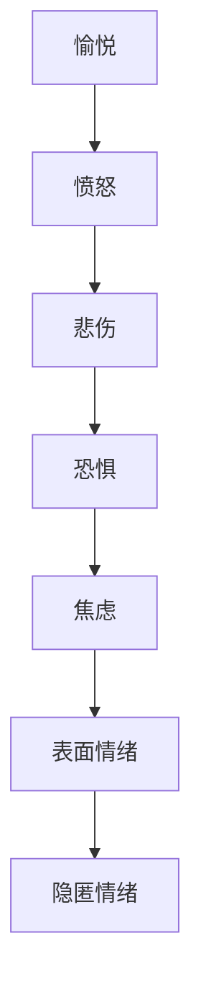

通过分析情绪的类型、生理反应和心理反应，以及情绪的表现形式，我们可以更好地理解情绪的本质和情绪管理的重要性。在技术管理者的角色中，认识到情绪的类型和表现对于有效管理情绪、应对压力具有重要作用。在接下来的章节中，我们将探讨情绪管理的方法，包括认知行为疗法和情绪调节技巧，以帮助技术管理者在高压环境下保持冷静与理性。

#### 第3章：情绪管理的方法

**3.1 认知行为疗法**

认知行为疗法（Cognitive Behavioral Therapy, CBT）是一种广泛应用的心理学治疗方法，旨在通过改变负面思维模式和行为习惯来改善情绪状态。以下是认知行为疗法中常用的两种方法：

**3.1.1 认知重构**

认知重构是指通过识别和挑战负面思维模式，将其转变为更加积极和理性的思维方式。以下是一种常见的认知重构步骤：

1. **识别负面思维**：首先，技术管理者需要识别出自己当前存在的负面思维，例如“我无法完成这个项目”、“我的团队表现很差”等。

2. **记录思维日志**：将负面思维记录在思维日志中，包括思维内容、出现情境和影响。

3. **挑战负面思维**：分析负面思维的合理性和证据，寻找替代性思维。例如，将“我无法完成这个项目”改为“虽然项目很艰巨，但我有足够的资源和团队来完成任务”。

4. **替代性思维**：用积极的、合理的替代性思维来替代负面思维，例如“我可以从过去的经验中学习，并制定有效的计划来应对挑战”。

5. **实践和应用**：在实际情境中应用替代性思维，观察其对情绪和行为的影响。

**图3-1 认知重构流程**

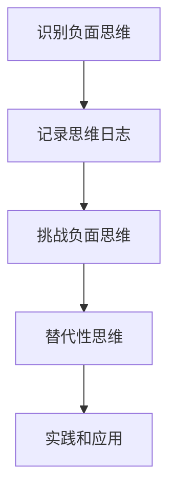

**3.1.2 行为调整**

行为调整是指通过改变行为习惯和环境来改善情绪状态。以下是一些行为调整的方法：

1. **建立日常习惯**：制定并坚持日常习惯，如定时锻炼、健康饮食、规律作息等，这些习惯有助于提高情绪稳定性和生活质量。

2. **积极应对压力**：学会应对压力的技巧，如时间管理、目标设定和优先级排序，有助于减轻压力和焦虑。

3. **社交互动**：与他人建立积极的关系，参与社交活动，寻求支持和理解，有助于缓解负面情绪。

4. **参与兴趣爱好**：培养兴趣爱好，如阅读、旅行、绘画等，这些活动能够带来乐趣和放松，有助于改善情绪。

**图3-2 行为调整方法**

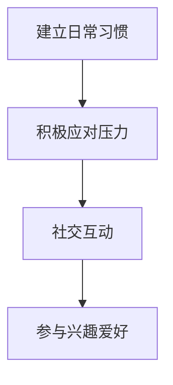

**3.2 情绪调节技巧**

情绪调节技巧是指通过一系列简单易行的方法来调节情绪，帮助技术管理者在压力和挑战面前保持冷静和理性。以下是一些有效的情绪调节技巧：

**3.2.1 深呼吸**

深呼吸是一种简单有效的情绪调节方法，通过深呼吸可以帮助放松身心，减轻焦虑和压力。以下是一种深呼吸的步骤：

1. **坐姿或站立**：选择一个舒适的姿势，确保身体放松。
2. **吸气**：用鼻子深吸气，尽量让肺部充满空气，感受腹部膨胀。
3. **屏住呼吸**：保持呼吸，感受氧气在体内循环。
4. **呼气**：用口慢慢呼气，感受身体放松。
5. **重复**：重复上述步骤，每次深呼吸持续约5-10秒。

**图3-3 深呼吸流程**

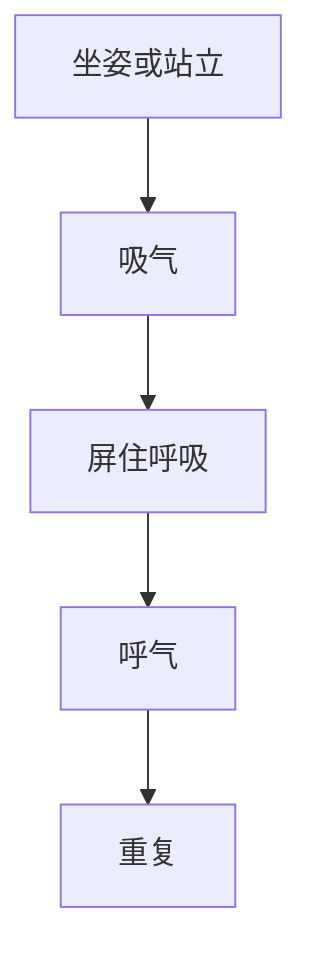

**3.2.2 冥想**

冥想是一种通过专注呼吸和冥想冥思来调节情绪的方法。以下是一种简单的冥想步骤：

1. **选择环境**：选择一个安静舒适的环境，确保不会被打扰。
2. **坐姿或站立**：选择一个舒适的姿势，确保身体放松。
3. **专注呼吸**：将注意力集中在呼吸上，感受吸气和呼气的过程。
4. **放空思绪**：当思绪跑偏时，将其引导回呼吸，持续这个过程。
5. **结束冥想**：当感觉心情平静、放松时，慢慢结束冥想。

**图3-4 冥想流程**

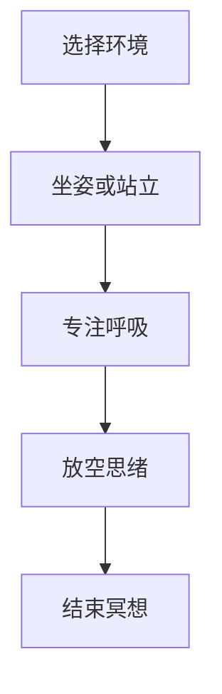

**3.2.3 肌肉放松**

肌肉放松是通过逐步放松身体各个部位的肌肉来减轻紧张和压力的方法。以下是一种肌肉放松的步骤：

1. **坐姿或站立**：选择一个舒适的姿势，确保身体放松。
2. **从头到脚放松**：从头部开始，逐步放松身体的各个部位，包括肩膀、手臂、胸部、腹部、腿部等。
3. **深呼吸**：在放松每个部位时，配合深呼吸，感受肌肉的放松和呼吸的节奏。
4. **保持放松**：保持整体放松的状态，感受身体的舒适和宁静。

**图3-5 肌肉放松流程**

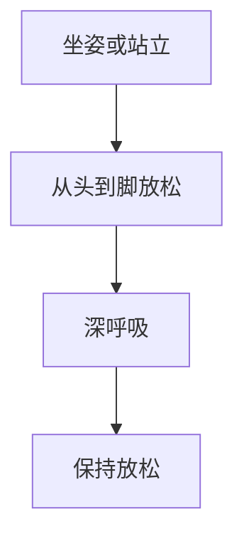

通过认知行为疗法和情绪调节技巧，技术管理者可以更好地管理自己的情绪，保持冷静与理性。这些方法不仅有助于应对日常压力，还能提升个人素质和团队效能，为技术管理者的职业生涯提供坚实支持。在接下来的章节中，我们将探讨情绪管理在技术管理中的应用，帮助技术管理者在实际工作中有效运用情绪管理策略。

#### 第4章：情绪管理在技术管理中的应用

**4.1 团队管理中的情绪管理**

团队管理是技术管理者的重要职责之一，情绪管理在团队管理中起着至关重要的作用。有效的情绪管理有助于建立积极的工作氛围，提升团队凝聚力和工作效率。以下是情绪管理在团队管理中的应用：

**4.1.1 建立积极的工作氛围**

建立积极的工作氛围是情绪管理的第一步。技术管理者可以通过以下方法营造积极的工作环境：

- **激励与认可**：及时给予团队成员认可和奖励，激发他们的积极性和创造力。
- **沟通与反馈**：保持开放的沟通渠道，鼓励团队成员表达自己的想法和意见，提供及时的反馈和指导。
- **共同目标**：明确团队目标，让每个成员都明确自己的责任和贡献，增强团队的凝聚力。
- **透明度**：保持信息的透明度，让团队成员了解项目进展和挑战，增强他们的责任感和参与感。

**图4-1 建立积极工作氛围的方法**

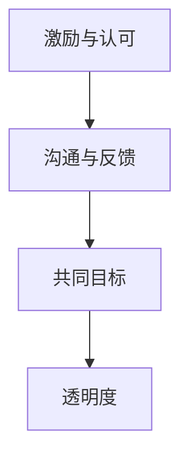

**4.1.2 处理团队成员的情绪问题**

在团队管理中，技术管理者需要处理团队成员的情绪问题，确保团队成员的身心健康和士气。以下是一些处理团队成员情绪问题的方法：

- **倾听与理解**：当团队成员情绪波动时，管理者应该耐心倾听他们的想法和感受，给予理解和支持。
- **提供资源**：为团队成员提供心理健康资源，如心理咨询、健康讲座等，帮助他们应对情绪问题。
- **冲突调解**：在团队成员之间出现冲突时，管理者应采取中立的态度，通过沟通和调解来解决问题，避免情绪升级。
- **心理辅导**：对于严重的情绪问题，管理者可以推荐团队成员寻求专业的心理辅导，帮助他们恢复心理健康。

**图4-2 处理团队成员情绪问题的方法**

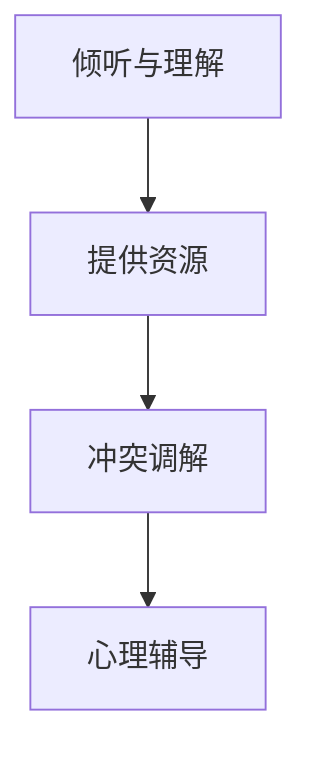

**4.2 项目管理中的情绪管理**

项目管理是技术管理者的重要工作内容之一，情绪管理在项目管理中同样具有重要意义。有效的情绪管理有助于确保项目进度、质量和团队士气。以下是情绪管理在项目管理中的应用：

**4.2.1 时间管理**

时间管理是项目管理中的核心任务，情绪管理有助于提高时间管理的效果。以下是一些时间管理的方法：

- **优先级排序**：根据项目的紧急程度和重要性，对任务进行优先级排序，确保关键任务得到优先处理。
- **时间分配**：合理分配时间，避免过度劳累和压力积累。
- **时间记录**：记录每天的工作时间和任务完成情况，分析时间利用效率，不断优化时间管理策略。
- **灵活调整**：在项目进展过程中，根据实际情况灵活调整任务和时间安排，以应对突发事件和变化。

**图4-3 时间管理的方法**

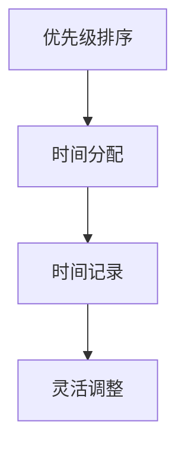

**4.2.2 风险管理**

风险管理是项目管理中的关键环节，情绪管理有助于提高风险管理的效果。以下是一些风险管理的方法：

- **识别风险**：通过风险评估和预测，识别项目中的潜在风险，制定相应的风险应对策略。
- **评估风险**：对已识别的风险进行评估，分析其可能性和影响，确定优先级。
- **应对策略**：制定具体的应对策略，包括风险规避、风险减轻、风险接受和风险转移等。
- **监控与调整**：在项目执行过程中，持续监控风险的变化，根据实际情况进行调整，确保风险得到有效控制。

**图4-4 风险管理的方法**

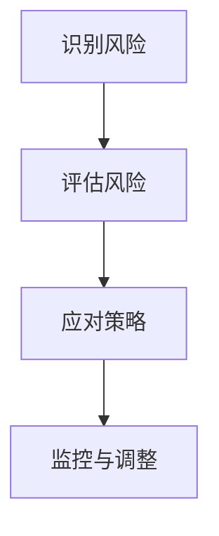

通过情绪管理在团队管理和项目管理中的应用，技术管理者可以更好地应对职场压力，提高工作效率和团队士气。情绪管理不仅有助于个人的职业发展，还能促进团队和项目的成功。在接下来的章节中，我们将进一步探讨情绪管理对个人成长的影响，帮助技术管理者实现长期的稳定与成长。

#### 第5章：情绪管理与个人成长

**5.1 情绪管理对个人成长的影响**

情绪管理对于个人成长具有重要意义，它不仅影响个人的心理健康，还直接影响职业发展和生活质量。以下是情绪管理对个人成长的具体影响：

**5.1.1 心理健康**

情绪管理有助于提高个人的心理健康水平。通过情绪管理，技术管理者能够更好地应对压力和挑战，减少焦虑、抑郁等负面情绪的发生。良好的情绪管理能力有助于：

- **缓解压力**：有效的情绪管理策略可以帮助管理者在面对压力时保持冷静和理性，减少心理负担。
- **改善心情**：情绪管理能够提升个人的情绪状态，使其更加乐观、自信和积极，从而提高生活质量。
- **提高心理韧性**：通过情绪管理，管理者能够增强心理韧性，在面对困难和挫折时更加坚韧和适应。

**5.1.2 职业发展**

情绪管理对职业发展有显著的推动作用。情绪稳定、管理能力强的技术管理者通常能够：

- **提升决策能力**：情绪稳定的管理者能够在复杂和压力巨大的情况下做出更为理性和客观的决策，从而提高项目成功率和职业信誉。
- **增强领导力**：情绪管理能力强的管理者能够更好地与团队成员沟通和协作，建立积极的工作氛围，提高团队凝聚力和工作效率。
- **扩展职业机会**：良好的情绪管理能力有助于管理者在职业生涯中获得更多的发展机会和晋升空间。

**图5-1 情绪管理对职业发展的影响**

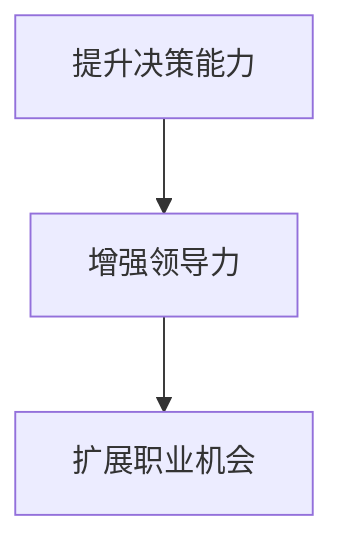

**5.1.3 生活质量**

情绪管理不仅影响职业发展，还对生活质量产生深远的影响。良好的情绪管理能力有助于：

- **改善人际关系**：情绪稳定的管理者能够更好地处理人际关系，减少冲突和误解，建立和谐的家庭和工作环境。
- **提高生活质量**：通过情绪管理，管理者能够减少因情绪波动导致的健康问题，保持身体健康和活力。
- **培养积极心态**：情绪管理有助于培养积极的看待问题的习惯，使个人更加乐观和满足，提高生活满意度。

**图5-2 情绪管理对生活质量的影响**

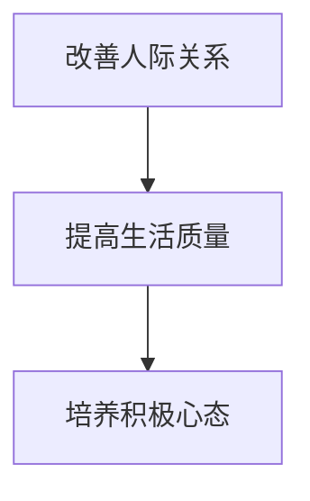

**5.2 情绪管理与职业发展**

情绪管理在职业发展过程中发挥着关键作用。以下是如何通过情绪管理来推动职业发展的策略：

- **持续自我反思**：定期对自己的情绪进行反思，了解自己在不同情境下的情绪表现，识别情绪管理的弱点，并制定改进计划。
- **学习情绪管理技巧**：通过阅读相关书籍、参加培训课程、寻求专业咨询等方式，学习并掌握情绪管理的有效技巧和方法。
- **应用情绪管理策略**：在日常工作中，将学到的情绪管理策略应用到实际情境中，如面对冲突时的冷静沟通、应对压力时的深呼吸放松等。
- **寻求支持和反馈**：向同事、导师或专业人士寻求支持和反馈，了解自己的情绪管理能力，获取改进建议。

**图5-3 情绪管理对职业发展的推动策略**

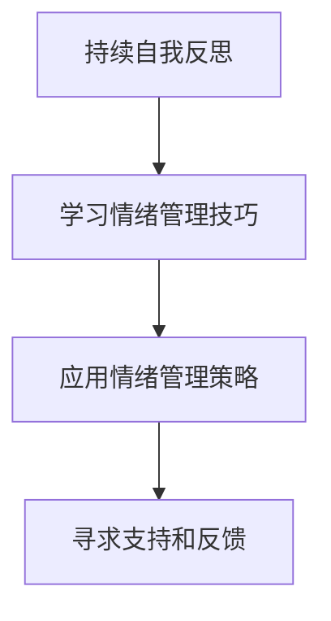

**5.3 情绪管理与心理健康**

情绪管理与心理健康密切相关，良好的情绪管理能力有助于保持心理健康。以下是情绪管理对心理健康的具体帮助：

- **减轻焦虑和抑郁**：通过情绪管理，管理者能够有效减轻焦虑和抑郁等负面情绪，提高心理健康水平。
- **增强心理韧性**：情绪管理能够增强个体的心理韧性，使其在面对挫折和压力时更加坚韧和适应。
- **改善人际关系**：情绪管理有助于建立和谐的人际关系，减少因情绪问题导致的冲突和误解，提高生活质量。

**图5-4 情绪管理对心理健康的具体帮助**

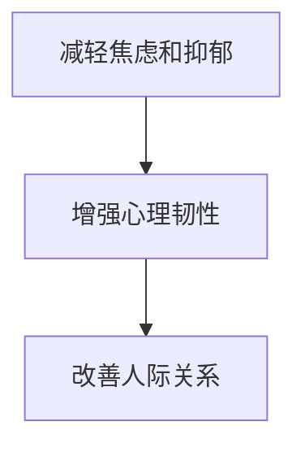

情绪管理是个人成长的重要一环，它不仅对心理健康和职业发展产生深远影响，还能提高生活质量。技术管理者应重视情绪管理，通过学习和实践情绪管理策略，提升自己的情绪管理能力，从而实现长期的稳定与成长。

### 第二部分：压力下的情绪应对策略

#### 第6章：压力管理策略

**6.1 压力的定义与类型**

压力是指个体在面对外界要求和挑战时所感受到的紧张和不安。在技术管理者的职业生涯中，压力是一个普遍存在的问题。了解压力的定义和类型有助于更好地管理压力。

**6.1.1 压力的定义**

压力是一种主观体验，它涉及个体对环境要求的感知和评估。压力可以来源于工作、家庭、社会等多方面，对个体产生身体和心理上的影响。压力的定义可以从以下几个方面理解：

- **生理反应**：压力会导致一系列生理反应，如心跳加快、血压升高、免疫系统功能下降等。
- **心理反应**：压力会引发负面情绪，如焦虑、愤怒、悲伤等，影响个体的认知和行为。
- **社会反应**：压力还会影响个体与他人的互动，可能导致人际关系紧张和工作效率下降。

**6.1.2 压力的类型**

根据压力的来源和性质，可以将压力分为以下几种类型：

- **慢性压力**：慢性压力是指长期存在的、持续的压力源，如工作负担重、家庭纠纷等。长期处于慢性压力下，个体容易产生身体和心理问题。
- **急性压力**：急性压力是指突然发生的、强烈的压力源，如项目截止日期临近、突发事件等。急性压力会导致短时间内的高强度生理和心理反应。
- **环境压力**：环境压力是指来自外部环境的要求和挑战，如竞争压力、工作环境变化等。环境压力会影响个体的情绪和行为。
- **心理压力**：心理压力是指个体内在的感受和情绪，如焦虑、恐惧、悲伤等。心理压力会直接影响个体的心理状态和应对能力。

**图6-1 压力的类型**

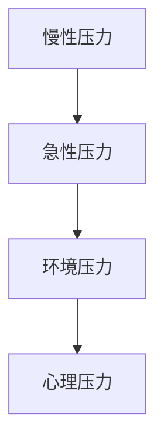

**6.2 压力对情绪的影响**

压力对情绪的影响是显著的，它会导致一系列负面情绪，如焦虑、愤怒、抑郁等。以下分析压力对情绪的具体影响：

**6.2.1 焦虑**

焦虑是一种常见的情绪反应，当个体面对不确定性和挑战时，焦虑感会加剧。焦虑会导致以下症状：

- **心理症状**：如紧张、不安、恐惧、易怒等。
- **生理症状**：如心跳加速、呼吸急促、失眠、头痛等。

**6.2.2 愤怒**

愤怒是另一种常见的情绪反应，当个体感受到不公平、挫败或威胁时，愤怒感会加剧。愤怒会导致以下症状：

- **心理症状**：如情绪失控、攻击性行为、社交障碍等。
- **生理症状**：如血压升高、心率加快、肌肉紧张等。

**6.2.3 抑郁**

抑郁是一种严重的情绪问题，当个体面对长期压力和挫败时，抑郁感会加剧。抑郁会导致以下症状：

- **心理症状**：如情绪低落、兴趣丧失、自卑感等。
- **生理症状**：如食欲减退、体重下降、睡眠障碍等。

**图6-2 压力对情绪的影响**

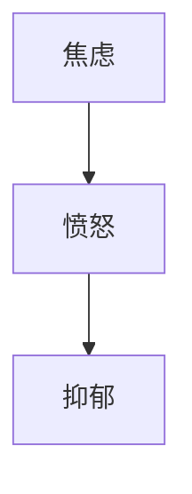

**6.3 压力管理的策略**

压力管理是技术管理者情绪管理的重要部分，有效的压力管理策略可以帮助管理者更好地应对压力。以下介绍几种常见的压力管理策略：

**6.3.1 预防策略**

预防策略是在压力发生之前采取的措施，通过预防措施可以减少压力的产生。以下是一些预防策略：

- **时间管理**：合理规划时间，避免过度工作，确保有足够的休息和放松时间。
- **任务分解**：将复杂任务分解为小步骤，逐步完成，减少压力积累。
- **健康生活习惯**：保持健康的饮食、规律的运动和充足的睡眠，提高身体和心理的抗压能力。
- **积极心态**：培养积极乐观的心态，面对挑战时保持冷静和理性。

**图6-3 预防策略**

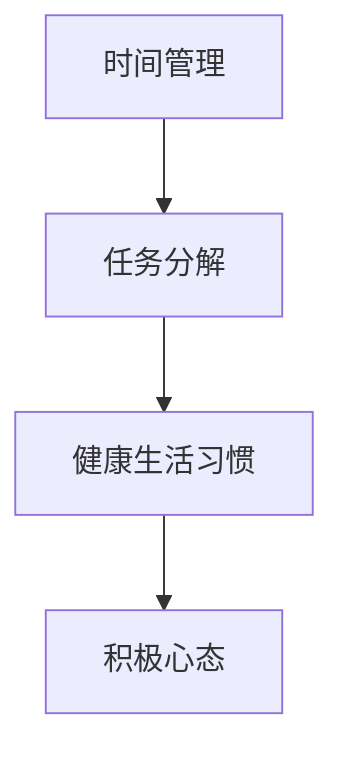

**6.3.2 应对策略**

应对策略是在压力发生时采取的措施，通过应对策略可以减轻压力的影响。以下是一些应对策略：

- **深呼吸**：在感到紧张和焦虑时，通过深呼吸来放松身心，缓解压力。
- **冥想**：通过冥想来平静心情，减少负面情绪，提升心理韧性。
- **寻求支持**：向家人、朋友或同事寻求支持和帮助，分享压力，获得安慰和建议。
- **放松技巧**：通过瑜伽、按摩、温泉等放松技巧来缓解身体和心理的紧张感。

**图6-4 应对策略**

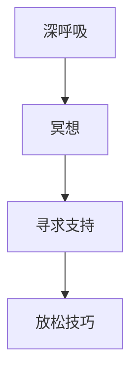

通过预防策略和应对策略，技术管理者可以更好地管理压力，保持情绪稳定和心理健康。在接下来的章节中，我们将探讨在危机情境下如何应对情绪，帮助管理者在突发情况下保持冷静与理性。

### 第7章：危机情境下的情绪应对

**7.1 危机情境的识别**

危机情境是指那些突然发生的、具有高度不确定性和潜在威胁的情境。在技术管理者的职业生涯中，危机情境可能会以各种形式出现，如项目失败、团队冲突、技术故障等。及时识别危机情境是有效应对的第一步。以下是几种常见的危机情境：

**7.1.1 项目失败**

项目失败可能是技术管理者面临的最严重危机之一。项目失败可能由于时间、资源、团队协作或技术问题导致。项目失败会导致项目团队的士气受挫、组织信任度下降，甚至可能影响技术管理者的职业前景。

**7.1.2 团队冲突**

团队冲突是另一个常见的危机情境。当团队成员之间存在严重分歧、沟通不畅或利益冲突时，团队冲突就可能发生。团队冲突可能导致项目进度延误、工作效率下降，甚至导致团队成员的离职。

**7.1.3 技术故障**

技术故障，如系统崩溃、数据丢失或网络中断，可能是技术管理者面临的突发危机。技术故障会影响组织的运营，导致客户不满、项目延期，甚至可能引发安全漏洞和声誉损害。

**7.2 危机情境下的情绪反应**

在危机情境下，技术管理者可能会经历一系列情绪反应。以下是一些常见的情绪反应及其影响：

**7.2.1 惊慌失措**

在危机情境初期，技术管理者可能会感到惊慌失措。这种情绪反应可能导致决策能力下降、沟通不畅，甚至可能导致团队士气的崩溃。

**7.2.2 焦虑与紧张**

随着危机情境的发展，技术管理者可能会感到焦虑和紧张。焦虑和紧张会影响个体的思维清晰度和决策能力，可能导致问题解决的效率降低。

**7.2.3 愤怒与沮丧**

在危机情境中，技术管理者可能会感到愤怒或沮丧。这些情绪反应可能会导致情绪失控，影响与团队成员的沟通和协作，甚至可能导致冲突加剧。

**7.3 危机情境下的应对策略**

为了有效应对危机情境，技术管理者需要采取一系列策略来保持冷静与理性。以下是一些具体的应对策略：

**7.3.1 保持冷静**

保持冷静是危机情境下最重要的策略之一。以下是一些保持冷静的方法：

- **深呼吸**：在感到紧张时，通过深呼吸来放松身心，缓解焦虑。
- **冷静分析**：在危机情境中，避免冲动行为，冷静分析问题，确定优先事项。
- **合理规划**：制定明确的行动计划，分步解决问题，避免混乱和压力积累。

**图7-1 保持冷静的方法**

```mermaid
graph TB
A[深呼吸] --> B[冷静分析]
B --> C[合理规划]
```

**7.3.2 制定应急计划**

制定应急计划是应对危机情境的关键步骤。以下是一些制定应急计划的步骤：

- **识别潜在风险**：分析项目的潜在风险，制定相应的应急措施。
- **资源准备**：确保在危机情境下有足够的资源，如人力、技术支持等。
- **测试与演练**：定期进行应急演练，确保应急计划的可行性和有效性。

**图7-2 制定应急计划的步骤**

```mermaid
graph TB
A[识别潜在风险] --> B[资源准备]
B --> C[测试与演练]
```

**7.3.3 寻求支持**

在危机情境中，寻求支持是缓解压力和恢复信心的重要策略。以下是一些寻求支持的方法：

- **内部支持**：向团队成员、上级领导或同事寻求支持和建议，共同解决问题。
- **外部支持**：如果内部资源不足以解决问题，可以寻求外部专家的支持，如咨询公司、技术供应商等。
- **心理支持**：在危机情境中，技术管理者可能需要专业的心理支持，如心理咨询、团队心理辅导等。

**图7-3 寻求支持的方法**

```mermaid
graph TB
A[内部支持] --> B[外部支持]
B --> C[心理支持]
```

通过保持冷静、制定应急计划和寻求支持，技术管理者可以更好地应对危机情境，保持情绪稳定和理性决策。在接下来的章节中，我们将探讨如何培养情绪稳定性，以帮助技术管理者在长期职业生涯中保持心理健康和职业发展。

### 第8章：培养情绪稳定性

**8.1 情绪稳定性的重要性**

情绪稳定性是指个体在面对外界变化和挑战时，能够保持情绪平稳、不易受到外界干扰的心理状态。情绪稳定性对于技术管理者来说尤为重要，因为它直接影响个人的心理健康、工作效率和职业发展。以下是情绪稳定性的几个关键重要性：

**8.1.1 心理健康**

情绪稳定性有助于减少焦虑、抑郁等负面情绪的发生，提升个人的心理健康水平。在技术管理者的角色中，保持心理健康至关重要，因为它直接影响决策能力、创造力和工作积极性。

**8.1.2 工作效率**

情绪稳定性能够提高技术管理者的工作效率和专注度。稳定的情绪状态有助于更好地应对工作中的挑战，提高任务完成质量和速度。

**8.1.3 团队关系**

情绪稳定的领导者能够建立和谐的工作氛围，增强团队凝聚力。稳定的情绪状态有助于处理团队成员之间的冲突和问题，提高团队协作效率。

**8.1.4 职业发展**

情绪稳定性是职业发展的关键因素之一。稳定的情绪状态能够帮助技术管理者在职业竞争中保持优势，提升领导力和管理能力，为职业晋升和长远发展打下坚实基础。

**8.2 提高情绪稳定性的方法**

为了提高情绪稳定性，技术管理者可以采取以下几种方法：

**8.2.1 增强自我意识**

自我意识是指个体对自己情绪状态、行为和思维过程的认知和反思能力。增强自我意识有助于更好地理解和管理自己的情绪。以下是一些建议：

- **情绪日记**：记录每天的情绪变化和触发因素，通过分析情绪日记，可以更好地了解自己的情绪模式。
- **自我反思**：定期进行自我反思，了解自己的情绪反应和行为习惯，识别情绪管理的弱点，并制定改进计划。
- **情绪觉察**：学会在情绪波动时，及时觉察并识别自己的情绪状态，从而更好地控制情绪。

**图8-1 增强自我意识的方法**

```mermaid
graph TB
A[情绪日记] --> B[自我反思]
B --> C[情绪觉察]
```

**8.2.2 增强情绪调节能力**

情绪调节能力是指个体通过一系列策略来调节和控制自己的情绪状态。以下是一些建议：

- **认知重构**：通过认知行为疗法（CBT）等方法，识别和挑战负面思维，将其转变为积极的、理性的思维模式。
- **行为调整**：改变不良行为习惯，如过度工作、回避问题等，培养健康的生活习惯，如定时锻炼、健康饮食、规律作息等。
- **情绪释放**：通过运动、写日记、倾诉等方式，释放情绪压力，缓解负面情绪。
- **积极心理训练**：通过冥想、正念练习等积极心理训练，增强情绪稳定性，提高心理韧性。

**图8-2 增强情绪调节能力的方法**

```mermaid
graph TB
A[认知重构] --> B[行为调整]
B --> C[情绪释放]
C --> D[积极心理训练]
```

**8.2.3 增强心理韧性**

心理韧性是指个体在面对逆境和挑战时，能够迅速恢复和适应的能力。以下是一些建议：

- **设定目标**：设定短期和长期目标，帮助自己保持动力和方向，提高面对挑战的积极性。
- **学习应对策略**：学习并掌握应对挑战的策略和方法，如时间管理、问题解决、心理调适等。
- **积极心态**：培养积极乐观的心态，相信自己的能力和潜力，面对逆境时保持冷静和理性。
- **寻求支持**：在面临挑战时，及时向家人、朋友、同事或专业人士寻求支持和帮助。

**图8-3 增强心理韧性的方法**

```mermaid
graph TB
A[设定目标] --> B[学习应对策略]
B --> C[积极心态]
C --> D[寻求支持]
```

通过增强自我意识、情绪调节能力和心理韧性，技术管理者可以显著提高情绪稳定性，从而更好地应对职场压力和挑战。在接下来的章节中，我们将通过案例分析来进一步探讨情绪管理的实践与应用。

### 第9章：情绪管理案例分析

**9.1 案例背景**

某知名互联网公司的一名高级技术经理李先生，在工作中经常面临巨大的压力。他的团队负责公司核心产品的开发与维护，项目复杂且具有高度不确定性。李先生的工作负担重，需要同时处理多个项目，并且经常需要与不同部门的同事进行协调。长期的紧张工作和压力导致李先生情绪波动较大，有时在会议上对团队成员发脾气，影响了团队的氛围和工作效率。

**9.2 情绪问题分析**

通过对李先生的情绪问题进行深入分析，可以发现以下几个方面的情绪问题：

**9.2.1 感知压力**

李先生对工作压力的感知较为强烈，尤其是在项目截止日期临近或出现技术问题时，他感到压力倍增。这种高强度的压力感知导致他在情绪上容易出现波动。

**9.2.2 情绪表达不当**

李先生在情绪管理方面存在一定问题，尤其是在面对困难和挑战时，容易情绪表达不当。他有时会在会议上对团队成员发脾气，这可能导致团队成员产生抵触情绪，影响团队协作。

**9.2.3 情绪调节能力不足**

李先生在压力下情绪调节能力不足，缺乏有效的应对策略来缓解情绪压力。这导致他在面对挑战时，情绪波动较大，影响了决策质量和工作效率。

**9.3 情绪管理策略实施**

为了帮助李先生改善情绪管理，公司提供了以下情绪管理策略：

**9.3.1 认知行为疗法**

通过认知行为疗法（CBT），李先生学会了识别和挑战自己的负面思维。他开始记录情绪日记，分析自己在面对压力时的思维模式，并通过认知重构将其转变为更加理性的思维方式。

**9.3.2 情绪调节技巧**

公司为李先生提供了一系列情绪调节技巧的培训，包括深呼吸、冥想和肌肉放松等。李先生开始将这些技巧应用到实际工作中，如项目压力较大时，他会通过深呼吸来放松身心，缓解紧张情绪。

**9.3.3 时间管理培训**

为了帮助李先生更好地管理时间，公司为其提供了时间管理培训。通过学习时间管理技巧，李先生能够更有效地分配工作时间，减少因时间安排不当导致的压力。

**9.4 案例结果与启示**

通过一系列情绪管理策略的实施，李先生的情绪状况显著改善。他开始能够更理性地处理工作中的挑战，情绪波动减少，与团队成员的沟通也更加和谐。以下是案例结果与启示：

**9.4.1 情绪管理对工作效率的影响**

李先生在情绪管理策略实施后，工作效率显著提高。他能够更好地应对项目中的挑战，减少因情绪波动导致的错误和失误，提升了团队的总体效率。

**9.4.2 情绪管理对团队氛围的影响**

情绪管理策略的实施不仅改善了李先生个人的情绪状态，还改善了团队的整体氛围。团队成员感受到李先生的积极变化，团队协作更加顺畅，团队凝聚力增强。

**9.4.3 情绪管理对个人成长的影响**

通过情绪管理，李先生在职业发展方面取得了显著进步。他学会了更好地管理情绪，提高了领导力和决策能力，这为他未来的职业发展奠定了坚实基础。

**9.4.4 启示与建议**

该案例为其他技术管理者提供了重要的启示和建议：

- **重视情绪管理**：技术管理者应重视情绪管理，学会识别和调节自己的情绪，以更好地应对工作压力。
- **持续学习与培训**：通过定期参加情绪管理培训和学习，技术管理者可以不断提升情绪管理能力。
- **建立支持系统**：建立家庭、同事和专业人士的支持系统，在面临压力和挑战时获得帮助和支持。

通过这个案例，我们可以看到情绪管理策略在改善技术管理者情绪状态、提高工作效率和促进团队氛围方面的显著效果。情绪管理不仅对个人职业发展有积极影响，也对整个组织的效能产生重要推动作用。

### 第10章：情绪管理在技术团队建设中的应用

**10.1 技术团队情绪管理的挑战**

在技术团队建设中，情绪管理是一个关键且复杂的挑战。技术团队的工作往往涉及复杂的代码编写、项目开发和持续集成，团队成员之间需要高度协作和沟通。以下是技术团队情绪管理面临的几个主要挑战：

**10.1.1 工作压力**

技术团队通常面临高工作压力。项目时间紧迫、技术难题、绩效压力等因素可能导致团队成员感到焦虑和紧张。长时间的工作压力会影响团队成员的情绪稳定性，进而影响团队的整体表现。

**10.1.2 团队协作**

技术团队需要高效协作，但在实际工作中，团队成员之间可能存在沟通障碍、角色冲突和文化差异。这些问题可能导致情绪上的摩擦，影响团队的凝聚力和工作效率。

**10.1.3 情绪表达**

在技术团队中，情绪表达可能不够直接和有效。有些成员可能不愿意表达自己的不满或困惑，导致问题积压，最终引发更严重的情绪问题。

**10.1.4 领导力**

技术团队的管理者需要在情绪管理方面起到榜样作用。如果领导者情绪管理能力不足，可能导致团队成员的情绪问题没有得到妥善处理，影响团队氛围和工作效率。

**10.2 情绪管理策略在团队建设中的应用**

为了解决上述挑战，以下是一些有效的情绪管理策略，这些策略可以应用于技术团队的建设中：

**10.2.1 建立开放的沟通渠道**

建立开放的沟通渠道是情绪管理的基础。技术团队应该有一个安全的环境，团队成员可以自由表达自己的情绪和观点。领导者可以定期组织团队会议，鼓励成员分享他们的感受和挑战。

**图10-1 开放的沟通渠道**

```mermaid
graph TB
A[定期团队会议] --> B[鼓励自由表达]
B --> C[解决情绪问题]
```

**10.2.2 提供情绪支持资源**

技术团队应该提供情绪支持资源，如心理咨询、压力管理课程等。这些资源可以帮助团队成员更好地应对工作压力和情绪问题，提高情绪稳定性。

**图10-2 提供情绪支持资源**

```mermaid
graph TB
A[心理咨询] --> B[压力管理课程]
B --> C[提高情绪稳定性]
```

**10.2.3 强化团队建设活动**

通过团队建设活动，如团队建设训练、团队旅行、团建活动等，可以增强团队成员之间的情感联系和信任感。这些活动有助于改善团队氛围，提高团队凝聚力。

**图10-3 强化团队建设活动**

```mermaid
graph TB
A[团队建设训练] --> B[团队旅行]
B --> C[团建活动]
```

**10.2.4 培养积极的领导风格**

领导者应该培养积极的领导风格，关注团队成员的情绪和需求。通过提供反馈、鼓励和支持，领导者可以增强团队成员的情绪稳定性，提高团队士气和工作效率。

**图10-4 培养积极的领导风格**

```mermaid
graph TB
A[提供反馈] --> B[鼓励支持]
B --> C[提高团队士气]
```

**10.3 情绪管理对团队绩效的影响**

情绪管理对技术团队的绩效有显著影响。以下是情绪管理对团队绩效的几个关键影响：

**10.3.1 提高工作效率**

情绪稳定的团队成员能够更高效地工作。他们在面对挑战时能够保持冷静和专注，减少错误和重复工作的发生，从而提高整体工作效率。

**10.3.2 增强团队凝聚力**

通过有效的情绪管理，团队成员之间的信任和协作增强，团队凝聚力得到提升。团队成员更加愿意分享信息和资源，共同解决问题，从而提高团队的总体绩效。

**10.3.3 减少离职率**

情绪稳定的工作环境有助于减少团队成员的离职率。当团队成员感到被尊重和支持时，他们更有可能留在团队中，为组织带来长期的稳定性和发展。

**图10-5 情绪管理对团队绩效的影响**

```mermaid
graph TB
A[提高工作效率] --> B[增强团队凝聚力]
B --> C[减少离职率]
```

通过应用情绪管理策略，技术团队能够更好地应对挑战，提高工作效率和团队凝聚力。情绪管理不仅有助于解决团队中的情绪问题，还能为团队带来长期的积极影响。在技术团队的建设中，领导者应重视情绪管理，通过建立开放的沟通渠道、提供情绪支持资源、强化团队建设活动和培养积极的领导风格，帮助团队成员在压力下保持情绪稳定，从而实现团队绩效的提升。

### 第11章：情绪管理的长期规划与自我提升

**11.1 情绪管理的长期规划**

情绪管理不仅是一种短期策略，更是一种长期的职业发展目标。为了实现情绪管理的长期目标，技术管理者可以采取以下规划步骤：

**11.1.1 设定个人目标**

首先，技术管理者应明确自己的情绪管理目标。这些目标可以包括：提高情绪稳定性、增强心理韧性、提升领导力等。设定具体、可衡量的目标有助于跟踪进度并保持动力。

**11.1.2 制定行动计划**

为了实现情绪管理的长期目标，技术管理者应制定详细的行动计划。行动计划可以包括参加情绪管理培训、学习相关书籍、定期进行自我反思等。通过具体的行动计划，技术管理者可以逐步提升情绪管理能力。

**11.1.3 定期评估与调整**

情绪管理是一个动态的过程，技术管理者应定期评估自己的情绪管理进展，并根据实际情况进行调整。通过定期评估，技术管理者可以识别情绪管理的不足之处，并采取相应的改进措施。

**11.2 自我提升策略**

情绪管理的自我提升是一个持续的过程，以下是一些有效的自我提升策略：

**11.2.1 持续学习**

技术管理者应持续学习情绪管理相关的知识和技能。通过阅读相关书籍、参加培训课程、观看专业讲座等方式，不断更新自己的知识储备。

**11.2.2 实践与应用**

理论学习是基础，但实践与应用是关键。技术管理者应在实际工作中应用所学的情绪管理技巧，如认知重构、情绪调节等。通过实践，技术管理者可以更好地理解和掌握情绪管理方法。

**11.2.3 寻求反馈**

为了提升情绪管理能力，技术管理者应主动寻求他人的反馈。通过向同事、领导或专业人士请教，技术管理者可以获得不同的视角和建议，从而改进自己的情绪管理方法。

**11.3 持续学习与成长**

情绪管理是一个不断发展的领域，技术管理者应保持持续学习的态度。以下是一些建议：

**11.3.1 关注行业动态**

技术行业不断进步，技术管理者应关注行业动态，了解新兴技术和趋势。这有助于他们在情绪管理中采用更先进的方法和工具。

**11.3.2 参与专业活动**

参与专业活动和会议是提升情绪管理能力的重要途径。通过参加研讨会、工作坊和行业会议，技术管理者可以与同行交流，学习他们的经验和方法。

**11.3.3 培养终身学习习惯**

终身学习是一种生活方式，技术管理者应培养这一习惯。通过持续学习，他们可以不断更新知识和技能，适应不断变化的工作环境。

**图11-1 持续学习与成长的方法**

```mermaid
graph TB
A[关注行业动态] --> B[参与专业活动]
B --> C[培养终身学习习惯]
```

通过长期的规划与自我提升，技术管理者可以显著提高情绪管理能力，从而在职业生涯中实现稳定与成长。情绪管理的长期规划不仅有助于个人发展，还能为团队和组织带来积极的影响。技术管理者应持续关注情绪管理领域的发展，不断学习和实践，以应对职场中的各种挑战。

### 总结与展望

情绪管理对于技术管理者在职业生涯中的稳定与发展至关重要。通过本文的探讨，我们了解到情绪管理的基础理论、具体方法以及在技术管理中的应用策略。技术管理者面临的压力来源多样，情绪管理的重要性不容忽视。有效的情绪管理不仅有助于提高决策能力和工作效率，还能增强团队凝聚力和个人职业发展。

在第一部分，我们分析了技术管理者面临的压力来源、情绪管理的重要性以及基本概念。通过认知行为疗法和情绪调节技巧，技术管理者可以学会识别和调节自己的情绪，以保持冷静和理性。在第二部分，我们探讨了情绪管理在团队管理和项目管理中的应用策略，强调了建立积极的工作氛围、时间管理和风险管理的重要性。在第三部分，我们通过案例分析和实际应用，展示了情绪管理在技术团队建设中的重要作用。

情绪管理不仅对技术管理者的个人成长有积极影响，还能为团队和组织带来长远的效益。为了实现长期的情绪管理目标，技术管理者需要制定明确的规划，持续学习和实践，并在职业发展中不断提升情绪管理能力。

展望未来，随着技术环境的不断变化，情绪管理的重要性将愈发凸显。技术管理者应保持开放的心态，关注行业动态，不断学习和适应新的管理方法。通过持续的学习与实践，技术管理者可以更好地应对职场挑战，实现个人与团队的共同成长。

本文为技术管理者提供了全面、实用的情绪管理指南，旨在帮助其在职业生涯中保持冷静与理性，实现长期稳定与发展。希望读者能够在实际工作中运用本文所介绍的策略，提升自己的情绪管理能力，为技术管理贡献更大的力量。

### 作者信息

作者：AI天才研究院/AI Genius Institute & 禅与计算机程序设计艺术 /Zen And The Art of Computer Programming

感谢您的阅读，希望本文对您在情绪管理方面有所启发和帮助。在技术管理的道路上，持续学习与实践是关键，祝愿您在职业生涯中取得更大的成就！

