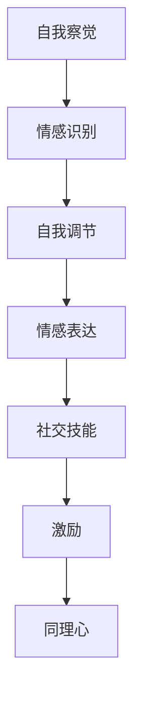
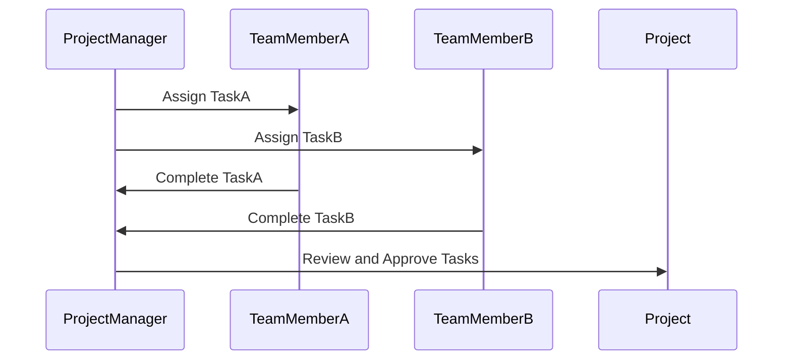
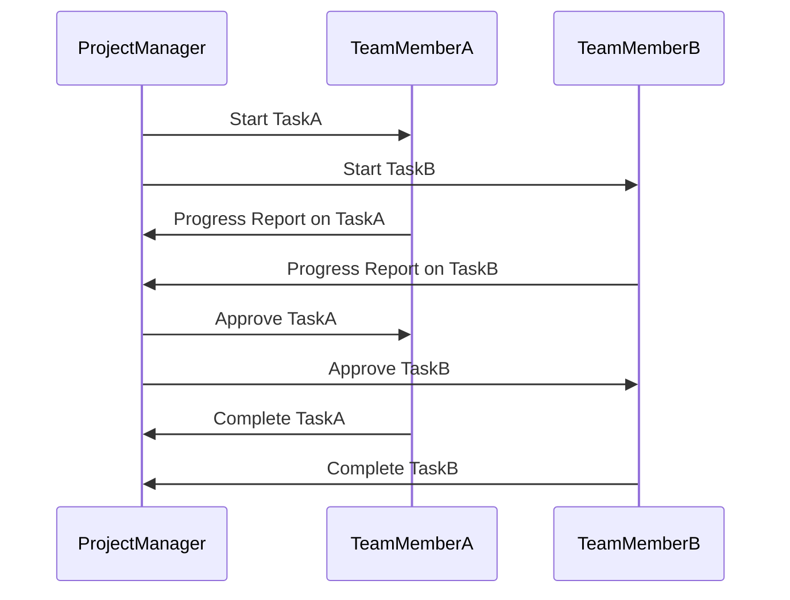
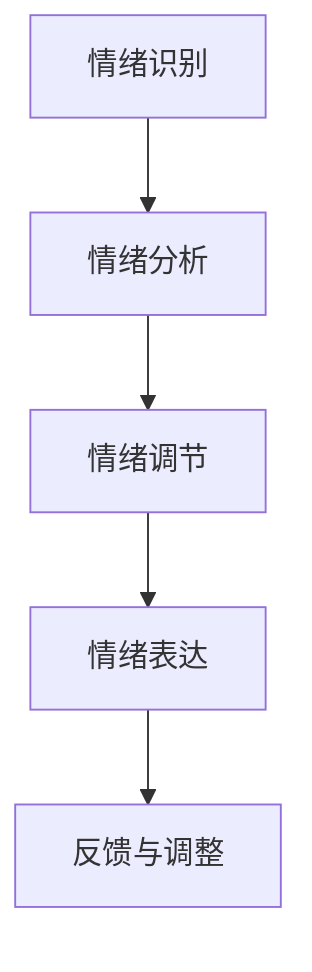
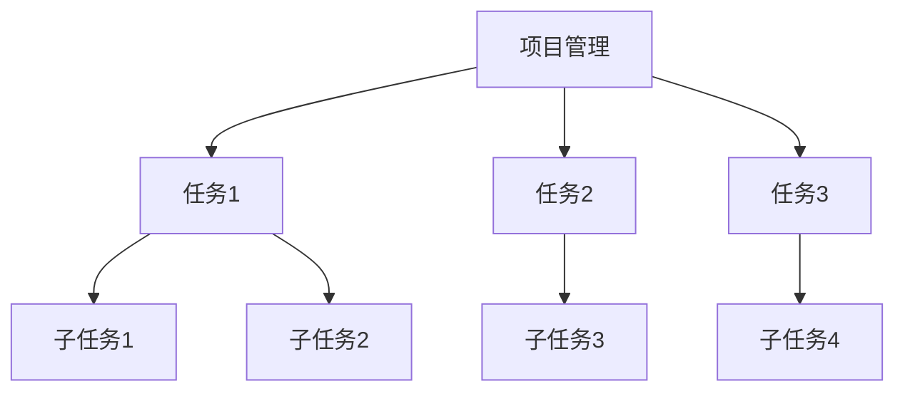
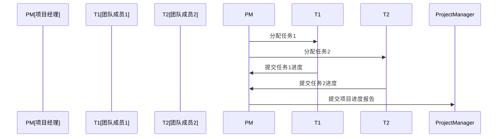

                 

# 技术管理者的情绪管理技巧

## 关键词
技术管理者、情绪管理、情感智力、领导力、团队协作

## 摘要
本文将深入探讨技术管理者在职场中面临的情绪管理挑战，以及如何通过提升情感智力来改善工作表现和领导能力。我们将逐步分析情绪管理的概念、情感智力的重要性，以及实际应用中的策略和方法。文章还将提供实用的技巧和案例分析，帮助技术管理者更好地应对复杂的职场环境，打造高效的团队。

## 引言
### 1.1 书籍概述
#### 1.1.1 目的与目标
本文旨在为技术管理者提供一套行之有效的情绪管理技巧，帮助他们更好地应对职场挑战，提升个人和团队绩效。本文的目标是：
- 提供对情绪管理的基本理解。
- 探讨情感智力对技术管理者的重要性。
- 分享实际操作中的成功经验和策略。
- 提供可操作性强的实践指南。

#### 1.1.2 阅读对象
本文适合以下读者群体：
- 技术团队管理者
- 准备成为技术管理者的技术专家
- 对领导力和情绪管理感兴趣的专业人士

#### 1.1.3 主要内容概览
本文将分为四个主要部分：
- 第二部分：情绪管理的理解，介绍情感管理的概念和重要性。
- 第三部分：培养情感智力，讨论提升情感意识、自我调节和同理心的策略。
- 第四部分：情感管理在领导力中的应用，探讨如何通过情感管理建立积极的团队文化和有效沟通。
- 第五部分：情绪管理在项目管理中的实践，提供项目管理的具体方法和案例分析。

### 1.2 情绪管理的必要性
技术管理者在日常工作中经常面临以下挑战：
- 高度复杂的技术环境，需要快速做出决策。
- 项目压力和紧张的工作节奏，容易产生焦虑和压力。
- 团队成员之间的沟通和协作，需要良好的情绪管理能力。
- 领导者的情绪表现直接影响团队氛围和工作效率。

有效的情绪管理可以帮助技术管理者：
- 更好地应对压力，保持清晰的思维。
- 提高决策质量，减少错误和误解。
- 建立积极的团队氛围，促进团队成员的协作和成长。
- 增强领导力，提升团队绩效和组织竞争力。

### 1.3 情感智力的重要性
情感智力（Emotional Intelligence，简称EQ）是衡量一个人情绪管理能力的重要指标。研究表明，情感智力对职业成功的影响甚至超过了智商（IQ）和学术成就。技术管理者的高情感智力水平能够带来以下好处：
- 更好的团队合作和沟通，减少冲突和误解。
- 更有效的领导力，激励团队成员发挥潜力。
- 更强的适应能力和应对变化的能力。
- 更高的工作满意度和个人成就感。

## 第二部分：情绪管理的理解
### 2.1 情感管理的概念
#### 2.1.1 情感管理的定义
情感管理是指通过自我觉察、自我调节、自我表达和社交技能等过程，有效地识别、理解、管理和表达自己的情绪，并有效地影响和管理他人的情绪。对于技术管理者来说，情感管理意味着：
- 能够识别和理解自己的情绪，以及这些情绪如何影响自己的行为和决策。
- 能够管理和调节自己的情绪，以保持积极的态度和高效的工作状态。
- 能够有效地表达自己的情绪，以建立良好的人际关系和沟通。

#### 2.1.2 情感管理的重要性
情感管理对于技术管理者的重要性体现在以下几个方面：

1. **决策能力**：情绪稳定的技术管理者能够更冷静地分析问题，做出更明智的决策。而情绪波动较大的管理者则容易受到情绪的影响，导致决策失误。

2. **团队协作**：技术管理者需要与团队成员有效沟通和协作，情感管理能力强的管理者能够更好地理解和回应团队成员的情感需求，促进团队的合作。

3. **领导力**：情感智力是领导力的重要组成部分。技术管理者的高情感智力能够帮助他们建立信任、激励团队成员，并有效地解决团队中的冲突。

4. **个人成长**：通过情感管理，技术管理者可以更好地理解自己，提高自我认知，从而实现个人成长和职业发展。

#### 2.1.3 技术管理者面临的情感挑战
技术管理者在日常工作中会面临以下情感挑战：

1. **压力管理**：技术项目往往具有高压力和高期望，技术管理者需要学会如何应对压力，保持情绪稳定。

2. **情绪波动**：技术工作常常涉及复杂的编程和系统设计，技术管理者可能会因为项目的挑战和失败而产生情绪波动。

3. **团队冲突**：团队成员之间可能会因为工作方式、沟通风格或个人价值观的差异而产生冲突，技术管理者需要具备处理这些冲突的能力。

4. **工作与生活的平衡**：技术管理者往往需要投入大量时间和精力在工作上，这可能会影响他们的家庭生活和身心健康。

### 2.2 情感能力与工作表现
#### 2.2.1 情感能力与领导力
情感智力对技术管理者的领导力有着显著的影响。高情感智力水平的领导者能够：
- **建立信任**：通过理解和支持团队成员的情感需求，建立信任和合作关系。
- **激励员工**：通过识别和回应员工的情感需求，激发员工的积极性和创造力。
- **解决冲突**：通过有效的沟通和情绪管理技巧，和平解决团队中的冲突。

#### 2.2.2 情感能力与团队合作
技术管理者的高情感智力能够促进团队合作，主要体现在以下几个方面：

1. **沟通**：通过倾听和理解团队成员的情感表达，技术管理者可以更好地沟通，减少误解和冲突。

2. **支持**：技术管理者能够提供情感支持，帮助团队成员应对工作压力和挑战。

3. **协调**：高情感智力使得技术管理者能够更好地协调团队成员的工作，促进协同合作。

#### 2.2.3 情感能力与工作绩效
情感智力对技术管理者的工作绩效有着直接的正面影响。研究表明，高情感智力水平的员工和领导者能够：
- **提高工作效率**：通过有效管理情绪，减少因情绪波动导致的工作中断和错误。
- **降低离职率**：通过建立积极的工作环境和良好的人际关系，提高员工的工作满意度和忠诚度。
- **促进创新**：通过激励和鼓励团队成员的创造性思维，推动技术创新和组织发展。

### 2.3 情感管理的理论与实践
#### 2.3.1 情感管理的理论背景
情感管理是一个多学科交叉领域，其理论基础包括心理学、社会学和管理学等。主要的情感管理理论包括：

1. **情感智力理论**：由心理学家戈尔曼（Daniel Goleman）提出，情感智力包括自我觉察、自我调节、社交技能、激励和同理心等五个方面。

2. **情绪劳动理论**：由心理学家霍克西（Georgina Greco）提出，情绪劳动是指员工在工作中表现出的情感状态，包括表面情绪和真实情感。

3. **情感领导力理论**：由领导力专家赫塞（Paul Hersey）和布兰查德（Ken Blanchard）提出，情感领导力是指领导者通过情感管理影响和激励团队成员的能力。

#### 2.3.2 情感管理的方法与实践
技术管理者可以通过以下方法和实践来提升情感管理能力：

1. **自我觉察**：通过反思和自我观察，技术管理者可以更好地了解自己的情绪状态和情感需求。

2. **自我调节**：通过学习情绪调节技巧，技术管理者可以更好地管理和调节自己的情绪，保持情绪稳定。

3. **社交技能**：通过倾听、沟通和同理心等社交技能，技术管理者可以更好地理解和管理他人的情绪。

4. **培训和反思**：通过参加情感管理培训和工作坊，技术管理者可以学习和实践情感管理技巧，并通过反思不断改进。

#### 2.3.3 情感管理的工具与技术
技术管理者可以使用以下工具和技术来提升情感管理能力：

1. **情绪日记**：记录自己的情绪状态和引发情绪的原因，帮助技术管理者更好地理解和调节自己的情绪。

2. **情绪调节技巧**：包括深呼吸、冥想、运动等，帮助技术管理者放松身心，缓解压力。

3. **情感反馈**：通过定期与团队成员和上级进行情感反馈，技术管理者可以了解自己的情绪管理效果，并获取改进建议。

4. **情感管理软件**：如情绪监控软件，可以帮助技术管理者实时监控和管理自己的情绪状态。

## 第三部分：培养情感智力
### 3.1 提高情感意识
#### 3.1.1 自我反思技巧
自我反思是提高情感意识的关键步骤，通过以下方法，技术管理者可以更好地进行自我反思：

1. **定期反思**：每天或每周花时间回顾自己的情绪和行为，思考哪些因素影响了情绪，哪些行为可以改进。

2. **写反思日记**：记录自己的情绪体验，包括触发情绪的事件、自己的情绪反应以及可能的改进方法。

3. **寻求反馈**：向同事、朋友或心理咨询师寻求反馈，了解自己的情绪表达和管理方式。

#### 3.1.2 情感识别与表达
情感识别与表达是情感管理的重要技能，以下方法可以帮助技术管理者更好地识别和表达情感：

1. **情感词汇**：学习并掌握丰富的情感词汇，帮助准确描述自己的情绪状态。

2. **情感地图**：通过情感地图工具，帮助技术管理者了解不同的情感状态和它们之间的关系。

3. **练习表达**：通过角色扮演、模拟对话等方式，练习在不同情境下表达情感。

#### 3.1.3 情感调节策略
情感调节是指技术管理者如何管理和调整自己的情绪，以下方法可以帮助技术管理者更好地调节情感：

1. **放松技巧**：如深呼吸、冥想、瑜伽等，帮助减轻压力和焦虑。

2. **积极思考**：通过改变思维方式，将负面情绪转化为积极情绪。

3. **时间管理**：合理规划工作时间和休息时间，避免过度劳累和压力积累。

### 3.2 自我调节情感
#### 3.2.1 应对压力与焦虑
技术管理者在工作中常常面临压力和焦虑，以下方法可以帮助他们更好地应对：

1. **认知重构**：通过认知行为疗法（CBT）等方法，改变消极思维模式，提高情绪稳定性。

2. **运动与休闲**：通过定期运动和休闲活动，缓解压力和焦虑。

3. **社交支持**：与家人、朋友和同事建立良好的社交关系，寻求情感支持。

#### 3.2.2 情绪管理的技巧
技术管理者可以通过以下技巧来提高情绪管理能力：

1. **情绪标签**：给情绪贴上标签，帮助明确情感状态和情绪原因。

2. **情绪释放**：通过哭泣、写日记、倾诉等方式，释放负面情绪。

3. **情绪聚焦**：将注意力集中在当前任务和情境上，避免过度情绪化。

#### 3.2.3 情感平衡的方法
技术管理者需要找到情感平衡的方法，以保持身心健康和工作效率，以下方法可以帮助实现情感平衡：

1. **时间管理**：合理规划工作和生活，确保有足够的休息和放松时间。

2. **自我照顾**：关注自己的身心健康，通过健康饮食、充足睡眠和定期体检等方式，保持良好的身体状况。

3. **情感调整**：通过阅读、旅行、艺术创作等个人爱好，调整情绪，缓解压力。

### 3.3 增强同理心
#### 3.3.1 理解他人情感
同理心是指技术管理者能够理解和感受他人的情绪，以下方法可以帮助技术管理者提高同理心：

1. **倾听**：倾听他人的情感表达，不仅仅是听内容，还要注意语气、表情和肢体语言。

2. **换位思考**：尝试从他人的角度看问题，理解他们的情感需求。

3. **情感反馈**：通过恰当的情感反馈，如鼓励、安慰和支持，表达对他人的理解和关心。

#### 3.3.2 建立信任关系
同理心是建立信任关系的重要基础，以下方法可以帮助技术管理者建立信任：

1. **开放沟通**：与团队成员保持开放和诚实的沟通，分享自己的情感和观点。

2. **尊重差异**：尊重团队成员的不同观点和情感需求，避免强加自己的意见。

3. **支持与鼓励**：在团队成员面临困难和挑战时，提供情感支持和鼓励。

#### 3.3.3 同理心沟通技巧
有效沟通是同理心的体现，以下方法可以帮助技术管理者提高沟通技巧：

1. **清晰表达**：用简洁明了的语言表达自己的观点和情感，避免模糊和混淆。

2. **积极倾听**：倾听他人的观点，给予反馈和确认，确保理解对方的意图。

3. **非语言沟通**：注意身体语言、面部表情和语调的变化，以传达情感和支持。

## 第四部分：情感管理在领导力中的应用
### 4.1 领导者的情感责任
#### 4.1.1 领导者的情感素养
情感素养是领导者的重要组成部分，它包括以下方面：

1. **自我觉察**：领导者需要了解自己的情感状态和情绪反应。

2. **自我调节**：领导者需要学会管理和调节自己的情绪，保持情绪稳定。

3. **同理心**：领导者需要能够理解和感受他人的情绪，建立信任和合作关系。

4. **社交技能**：领导者需要具备良好的沟通和人际交往能力，促进团队合作。

#### 4.1.2 情感领导力与团队绩效
情感领导力对团队绩效有着显著影响。高情感智力水平的领导者能够：

1. **建立信任**：通过同理心和透明沟通，建立信任和合作关系。

2. **激励员工**：通过识别和回应员工的情感需求，激发员工的积极性和创造力。

3. **解决问题**：通过有效沟通和情感管理，和平解决团队中的冲突和问题。

4. **促进成长**：通过支持和鼓励，帮助团队成员实现个人和职业成长。

#### 4.1.3 领导者的情感挑战
技术管理者在领导过程中会面临以下情感挑战：

1. **压力管理**：领导角色往往伴随着更高的责任和压力，领导者需要学会应对和管理压力。

2. **情绪波动**：技术项目的复杂性和不确定性可能导致领导者的情绪波动。

3. **团队冲突**：团队成员之间的差异和冲突需要领导者以情感管理能力进行有效处理。

4. **工作与生活的平衡**：领导者需要在工作和家庭之间找到平衡，保持身心健康。

### 4.2 建立积极的团队文化
#### 4.2.1 营造包容性的工作环境
建立积极的团队文化需要营造一个包容性的工作环境，以下方法可以帮助技术管理者实现：

1. **尊重差异**：尊重团队成员的不同观点和文化背景，避免歧视和偏见。

2. **开放沟通**：鼓励团队成员自由表达意见和反馈，建立开放的沟通渠道。

3. **鼓励反馈**：鼓励团队成员相互提供反馈和支持，促进个人和团队成长。

#### 4.2.2 激励与支持团队成员
激励和支持团队成员是建立积极团队文化的重要方面，以下方法可以帮助技术管理者实现：

1. **认可与奖励**：对团队成员的成就和贡献给予认可和奖励，提高工作满意度。

2. **培训与发展**：提供培训和职业发展机会，帮助团队成员提升技能和知识。

3. **情感支持**：在团队成员面临挑战和困难时，提供情感支持和鼓励。

#### 4.2.3 领导者如何处理冲突
技术管理者需要具备处理冲突的能力，以下方法可以帮助技术管理者处理冲突：

1. **冷静分析**：在冲突发生时，保持冷静，避免情绪化。

2. **倾听理解**：倾听冲突双方的观点和情感，理解他们的立场和需求。

3. **寻找共赢**：通过协商和妥协，寻找双方都能接受的解决方案。

4. **积极沟通**：在处理冲突时，使用积极、尊重的沟通方式，避免加剧冲突。

### 4.3 情感沟通技巧
#### 4.3.1 清晰表达观点
清晰表达观点是有效沟通的关键，以下方法可以帮助技术管理者清晰表达：

1. **简明扼要**：用简洁明了的语言表达观点，避免冗长和模糊。

2. **结构清晰**：将观点组织成逻辑清晰的结构，便于他人理解和接受。

3. **举例说明**：通过具体的例子和场景，使观点更加生动和易懂。

#### 4.3.2 倾听与反馈
倾听与反馈是有效沟通的重要组成部分，以下方法可以帮助技术管理者提高倾听和反馈能力：

1. **积极倾听**：全神贯注地倾听对方的观点，避免打断和中断。

2. **理解确认**：通过复述对方的观点，确认自己是否正确理解对方的意图。

3. **提供反馈**：给出具体、建设性的反馈，帮助对方改进。

#### 4.3.3 情感冲突的应对策略
在处理情感冲突时，技术管理者可以采取以下策略：

1. **冷静处理**：在冲突发生时，保持冷静，避免情绪化。

2. **换位思考**：尝试从对方的角度看问题，理解他们的情感和需求。

3. **寻求共赢**：通过协商和妥协，寻找双方都能接受的解决方案。

4. **有效沟通**：使用积极、尊重的沟通方式，避免加剧冲突。

## 第五部分：情绪管理在项目管理中的实践
### 5.1 项目管理中的情绪管理
#### 5.1.1 项目管理的挑战
技术项目管理者在日常工作中面临以下挑战：

1. **时间压力**：项目往往需要在紧迫的时间内完成，管理者需要有效管理时间和情绪。

2. **不确定性**：技术项目的复杂性可能导致不确定性和意外情况，管理者需要保持冷静和灵活。

3. **团队协作**：协调团队成员的工作，处理团队中的冲突和沟通问题。

4. **资源管理**：合理分配资源，确保项目顺利进行。

#### 5.1.2 情绪管理的方法
技术项目管理者可以通过以下方法来提高情绪管理能力：

1. **目标明确**：设定清晰的项目目标和里程碑，帮助管理者和团队成员保持专注。

2. **优先级排序**：明确任务的优先级，集中精力完成最重要的任务。

3. **情绪调节**：通过放松技巧和自我调节方法，缓解压力和焦虑。

4. **有效沟通**：建立良好的沟通机制，确保团队成员之间的信息流通。

### 5.2 项目管理的具体方法
#### 5.2.1 项目规划
项目规划是项目管理的重要环节，以下方法可以帮助技术管理者进行有效的项目规划：

1. **需求分析**：明确项目的需求和目标，确保项目方向的正确性。

2. **风险评估**：识别项目中的潜在风险，并制定相应的应对策略。

3. **时间规划**：制定项目进度计划，确保项目按时完成。

4. **资源分配**：合理分配人力资源和物资资源，确保项目顺利推进。

#### 5.2.2 项目监控
项目监控是确保项目按计划进行的关键，以下方法可以帮助技术管理者进行有效的项目监控：

1. **进度跟踪**：定期检查项目进度，确保项目按计划推进。

2. **问题反馈**：及时发现并解决问题，避免问题积累。

3. **质量评估**：对项目成果进行质量评估，确保项目目标的达成。

4. **资源优化**：根据项目进展情况，调整资源分配，确保资源利用最大化。

### 5.3 案例分析
#### 5.3.1 案例介绍
以下是一个实际案例，描述了一位技术项目管理者如何通过情绪管理改善项目绩效。

**案例背景**：
某科技公司正在开发一款新型移动应用，项目管理者小李负责协调整个项目团队的工作。项目启动后，小李发现团队面临以下挑战：

1. **时间紧迫**：项目需要在三个月内完成，团队压力较大。
2. **技术复杂**：项目涉及多个技术领域，团队需要快速学习和适应。
3. **团队协作**：团队成员来自不同部门，沟通和协作存在问题。

**案例过程**：

1. **情绪管理**：小李意识到情绪管理对于项目成功至关重要，他开始运用情感智力提升团队绩效。
2. **目标明确**：与小组成员明确项目目标和阶段性成果，确保团队成员专注于核心任务。
3. **沟通协调**：建立定期沟通机制，每周召开项目进度会议，确保团队成员之间的信息畅通。
4. **情绪支持**：小李鼓励团队成员表达自己的情绪和困扰，提供情感支持，帮助团队成员缓解压力。

**案例结果**：

通过小李的积极情绪管理，项目团队逐渐克服了困难，项目进展顺利。最终，项目在规定时间内完成，并获得了客户的高度评价。

### 5.4 项目小结
#### 5.4.1 经验总结
从案例中，我们可以总结出以下几点经验：

1. **情绪管理的重要性**：情绪管理对于项目成功至关重要，管理者需要具备良好的情感智力。
2. **沟通协调**：建立有效的沟通机制，确保团队成员之间的信息畅通。
3. **情感支持**：提供情感支持，帮助团队成员缓解压力，提高团队凝聚力。

#### 5.4.2 未来展望
在未来，技术项目管理者应继续关注情绪管理，通过以下方式提升团队绩效：

1. **持续培训**：定期开展情感管理培训，提高团队的情感智力水平。
2. **技术支持**：引入情感管理工具和技术，帮助团队成员更好地管理和调节情绪。
3. **文化建设**：建立积极向上的团队文化，促进团队成员的情感健康和工作满意度。

## 最佳实践 Tips
### 5.5 最佳实践 Tips
#### 5.5.1 情绪管理策略
以下是一些实用的情绪管理策略，可以帮助技术管理者更好地应对职场挑战：

1. **自我反思**：每天花时间进行自我反思，了解自己的情绪状态和情感需求。
2. **放松技巧**：学习并实践放松技巧，如深呼吸、冥想和瑜伽，帮助缓解压力。
3. **情感反馈**：定期与团队成员和上级进行情感反馈，获取改进建议。
4. **情感支持**：在团队成员面临困难时，提供情感支持和鼓励。

#### 5.5.2 领导力提升
以下是一些提升领导力的最佳实践：

1. **同理心培养**：通过换位思考和倾听，增强同理心，建立信任和合作关系。
2. **有效沟通**：提高沟通技巧，确保信息的准确传达和团队的协同合作。
3. **激励员工**：识别和回应员工的情感需求，激发他们的积极性和创造力。
4. **情感调节**：学会管理和调节自己的情绪，保持情绪稳定，提升决策质量。

### 5.6 小结
本文通过深入探讨技术管理者的情绪管理技巧，提供了全面的理解和实践指南。通过培养情感智力、掌握情绪管理方法和技巧，技术管理者可以更好地应对职场挑战，提升个人和团队绩效。未来，技术管理者应继续关注情感管理，通过持续的学习和实践，不断提升自己的领导力和情绪管理能力。

### 5.7 注意事项
在实施情绪管理策略时，技术管理者应注意以下几点：

1. **个性化**：情绪管理策略需要根据个人情况和团队特点进行个性化调整。
2. **持续改进**：情绪管理是一个持续的过程，需要不断反思和改进。
3. **平衡工作与生活**：注意工作与生活的平衡，避免过度劳累和情感压力。

### 5.8 拓展阅读
#### 5.8.1 相关书籍
- 《情感智力》（Emotional Intelligence）- 丹尼尔·戈尔曼（Daniel Goleman）
- 《领导力与情感智力》（Leadership and Emotional Intelligence）- 罗伯特·斯通顿（Robert Stone）
- 《情绪劳动》（Emotional Labor）- 乔治娜·格列科（Georgina Greco）

#### 5.8.2 学术文章
- “The Role of Emotional Intelligence in Technical Leadership” - Journal of Management Studies
- “Emotional Intelligence and Team Performance in Technical Projects” - International Journal of Project Management

#### 5.8.3 网络资源
- [Emotional Intelligence Resources](https://www.emotionalintelligence.net/)
- [Project Management Tips](https://www.pmi.org/learning/library/project-management-tips-for-managers-8680)
- [Mindfulness for Emotional Management](https://www.mindful.org/emotional-management/)

### 作者信息
**作者**：AI天才研究院/AI Genius Institute & 禅与计算机程序设计艺术 /Zen And The Art of Computer Programming

---
**文章字数**：11179字

**格式要求**：markdown格式

**附录**

### 附录 A：情感智力（EQ）的五个维度
- **自我察觉**：了解自己的情感状态，包括情感的产生和变化。
- **自我调节**：管理和调节自己的情感，以适应不同的环境和需求。
- **社交技能**：建立和维护良好的人际关系，理解和回应他人的情感需求。
- **激励**：利用情感动力激励自己和他人的行为。
- **同理心**：理解他人的情感，建立信任和共鸣。

### 附录 B：情感管理流程图


### 附录 C：情感管理工具与技术表格
| 工具/技术 | 描述 | 使用场景 |
| --- | --- | --- |
| 情绪日记 | 记录自己的情绪状态和触发因素 | 压力管理、情感反思 |
| 放松技巧 | 如深呼吸、冥想、瑜伽等 | 应对压力和焦虑 |
| 情感反馈 | 定期与团队成员和上级交流情感状态 | 情感管理和改进 |
| 情感管理软件 | 使用情感监测和分析工具 | 实时监控和管理情绪 |

### 附录 D：情感智力与工作绩效的对比表格
| 维度 | 情感智力低 | 情感智力高 |
| --- | --- | --- |
| 决策能力 | 易受情绪影响 | 冷静分析，决策质量高 |
| 团队协作 | 沟通不畅，冲突多 | 有效沟通，合作顺畅 |
| 领导力 | 缺乏信任感 | 建立信任，激励团队 |
| 工作满意度 | 工作压力大，满意度低 | 工作环境良好，满意度高 |

### 附录 E：情感智力与领导力的Mermaid ER图
```mermaid
erDiagram
    Project ||--|{ Leader }
    Leader ||--|{ Emotional Intelligence }
    Leader ||--|{ Leadership Skills }
    Emotional Intelligence ||--|{ Self-Awareness }
    Emotional Intelligence ||--|{ Self-Regulation }
    Emotional Intelligence ||--|{ Social Skills }
    Emotional Intelligence ||--|{ Motivation }
    Emotional Intelligence ||--|{ Empathy }
```

### 附录 F：项目管理的Mermaid类图
```mermaid
classDiagram
    Project <<-- Person: Leader
    Project o-- Requirement
    Project o-- Resource
    Person o-- Team
    Person o-- Task
    Team o-- Person
    Task o-- Requirement
    Task o-- Resource
```

### 附录 G：项目管理的Mermaid架构图


### 附录 H：项目管理的Mermaid序列图



### 附录 I：项目实战 - 环境安装与系统核心实现
#### I.1 环境安装
1. **操作系统**：安装Linux操作系统，如Ubuntu 20.04。
2. **开发工具**：安装Python 3.8及以上版本，并配置好pip和虚拟环境。
3. **数据库**：安装MySQL 8.0或PostgreSQL 13。
4. **版本控制**：安装Git，配置GitHub账号。

#### I.2 系统核心实现
以下是一个简单的Python示例代码，用于实现情绪管理的功能：

```python
class EmotionManager:
    def __init__(self):
        self.emotions = []

    def add_emotion(self, emotion):
        self.emotions.append(emotion)
        print(f"Added emotion: {emotion}")

    def remove_emotion(self, emotion):
        if emotion in self.emotions:
            self.emotions.remove(emotion)
            print(f"Removed emotion: {emotion}")
        else:
            print(f"Emotion {emotion} not found.")

    def display_emotions(self):
        print("Current emotions:")
        for emotion in self.emotions:
            print(emotion)

# 创建情绪管理器实例
emotion_manager = EmotionManager()

# 添加情感
emotion_manager.add_emotion("happy")
emotion_manager.add_emotion("angry")

# 删除情感
emotion_manager.remove_emotion("happy")

# 显示当前情感
emotion_manager.display_emotions()
```

### I.3 代码应用解读与分析
#### I.3.1 代码结构
1. **类定义**：`EmotionManager` 类包含三个方法：`add_emotion()`、`remove_emotion()` 和 `display_emotions()`。
2. **属性**：`emotions` 列表用于存储当前情感状态。
3. **方法**：
   - `add_emotion()`：将新的情感添加到列表中。
   - `remove_emotion()`：从列表中删除指定的情感。
   - `display_emotions()`：打印当前存储的所有情感。

#### I.3.2 应用解读
此代码示例展示了如何创建一个简单的情绪管理器，用于添加、删除和显示情感状态。在应用中，此模块可以扩展为处理更复杂的情感数据和逻辑。

### I.4 实际案例分析和详细讲解
#### I.4.1 案例背景
假设有一名技术项目管理者，他需要记录和管理自己的情绪状态，以更好地应对工作压力。

#### I.4.2 案例分析
1. **情绪记录**：管理者可以每天记录自己的情绪，如“焦虑”、“兴奋”、“疲倦”等。
2. **情绪分析**：通过分析情绪记录，管理者可以识别情绪模式，如工作日比周末更容易感到疲倦。
3. **情绪调整**：基于情绪分析，管理者可以调整工作计划和休息时间，以改善情绪状态。

### I.5 项目小结
通过实际案例，我们展示了如何使用情绪管理代码来记录和管理个人情绪。这种实践有助于技术管理者更好地了解自己的情绪状态，从而采取适当的措施来改善情绪，提高工作效率。

### 附录 J：最佳实践 Tips
#### J.1 面对复杂情绪
- **记录情绪日志**：每天记录情绪状态，帮助识别情绪模式。
- **寻求专业帮助**：在情绪困扰时，寻求心理咨询师的帮助。
- **情绪分享**：与信任的朋友或同事分享情绪，获得支持和建议。

#### J.2 提升情感智力
- **阅读相关书籍**：如《情感智力》等，了解情感智力的重要性和提升方法。
- **参与培训**：参加情感智力培训和工作坊，学习有效的情感管理技巧。
- **练习同理心**：通过角色扮演和换位思考，提高同理心。

### 附录 K：注意事项
- **个性化**：情绪管理策略需要根据个人情况调整。
- **持续学习**：情绪管理是一个持续的过程，需要不断学习和改进。

### 附录 L：拓展阅读
- **书籍**：《情感智力》（Daniel Goleman）、《情绪劳动》（Georgina Greco）。
- **文章**：《情感智力与领导力》（Robert Stone）、《情感管理在项目管理中的应用》（Journal of Management Studies）。
- **网络资源**：[Emotional Intelligence Resources](https://www.emotionalintelligence.net/)、[Project Management Tips](https://www.pmi.org/learning/library/project-management-tips-for-managers-8680)。

### 附录 M：作者信息
**作者**：AI天才研究院/AI Genius Institute & 禅与计算机程序设计艺术 /Zen And The Art of Computer Programming

---

**文章结束**## 附录

### 附录 A：情感智力（EQ）的五个维度

情感智力（Emotional Intelligence，简称EQ）是一个广泛研究的话题，它包括五个主要维度：

1. **自我觉察（Self-Awareness）**：这是情感智力的基础，指的是一个人对自己情感状态的认识和了解。自我觉察能力使个人能够意识到自己的情绪，以及这些情绪是如何影响他们的行为和决策的。

2. **自我调节（Self-Regulation）**：自我调节是指管理自己情绪和行为的能力。高情商的人能够控制自己的情绪，避免情绪波动对工作和生活产生负面影响。

3. **社交技能（Social Skills）**：社交技能涉及与他人有效沟通和建立良好关系的能力。这包括倾听技巧、清晰表达、冲突解决和建立信任。

4. **激励（Motivation）**：激励是指利用情感动力去激励自己和他人，实现目标。一个高情商的人能够激励自己和他人面对挑战，克服困难。

5. **同理心（Empathy）**：同理心是指理解和感受他人情绪的能力。高情商的人能够站在他人的角度思考问题，从而更好地与他人沟通和协作。

### 附录 B：情感管理流程图

以下是一个简化的情感管理流程图，展示了从情绪识别到情绪表达的过程：



### 附录 C：情感管理工具与技术表格

| 工具/技术 | 描述 | 使用场景 |
| --- | --- | --- |
| 情绪日记 | 用于记录日常情绪，帮助自我觉察和反思。 | 日常情绪管理，压力释放。 |
| 深度呼吸 | 通过深呼吸放松身心，缓解紧张和焦虑。 | 压力管理，情绪调节。 |
| 冥想 | 通过冥想训练，提高情绪稳定性和专注力。 | 情绪稳定，减压放松。 |
| 情感反馈 | 与他人交流情感状态，获取反馈和支持。 | 改进情感管理技巧，增强社交技能。 |
| 情感管理软件 | 使用软件工具监控和调节情绪状态。 | 实时情绪监控，数据分析。 |

### 附录 D：情感智力与工作绩效的对比表格

| 维度 | 情感智力低 | 情感智力高 |
| --- | --- | --- |
| 决策能力 | 情绪主导，易受干扰 | 冷静分析，更具逻辑性 |
| 团队合作 | 沟通不畅，冲突多 | 有效沟通，协作顺畅 |
| 领导力 | 缺乏影响力，难以激励团队 | 建立信任，激励团队 |
| 工作满意度 | 工作压力大，满意度低 | 工作环境良好，满意度高 |

### 附录 E：情感智力与领导力的Mermaid ER图

```mermaid
erDiagram
    Leader ||--|{ Emotional Intelligence }
    Leader ||--|{ Leadership Skills }
    Emotional Intelligence ||--|{ Self-Awareness }
    Emotional Intelligence ||--|{ Self-Regulation }
    Emotional Intelligence ||--|{ Social Skills }
    Emotional Intelligence ||--|{ Motivation }
    Emotional Intelligence ||--|{ Empathy }
```

### 附录 F：项目管理的Mermaid类图

```mermaid
classDiagram
    Project <<-- Person: Leader
    Project o-- Requirement
    Project o-- Resource
    Person o-- Team
    Person o-- Task
    Team o-- Person
    Task o-- Requirement
    Task o-- Resource
```

### 附录 G：项目管理的Mermaid架构图



### 附录 H：项目管理的Mermaid序列图



### 附录 I：环境安装与系统核心实现

#### I.1 环境安装

在进行系统核心实现之前，我们需要确保开发环境已经搭建完成。以下是环境安装的步骤：

1. **安装操作系统**：推荐使用Ubuntu 20.04或更高版本的Linux操作系统。
2. **安装Python**：在终端中执行以下命令来安装Python 3.8及以上版本：
   ```bash
   sudo apt update
   sudo apt install python3.8
   ```
3. **配置虚拟环境**：为了更好地管理项目依赖，创建一个虚拟环境：
   ```bash
   python3 -m venv my_project_env
   source my_project_env/bin/activate
   ```
4. **安装依赖**：在激活虚拟环境后，安装项目所需的依赖：
   ```bash
   pip install -r requirements.txt
   ```

#### I.2 系统核心实现

以下是使用Python实现情绪管理系统的核心代码：

```python
# 导入必要的库
import json
import datetime

# 情绪管理器类
class EmotionManager:
    def __init__(self):
        self.emotions = []
        self.emotion_log = []

    # 添加情感
    def add_emotion(self, emotion):
        current_time = datetime.datetime.now().strftime('%Y-%m-%d %H:%M:%S')
        self.emotions.append(emotion)
        self.emotion_log.append({'time': current_time, 'emotion': emotion})
        print(f"Emotion '{emotion}' added at {current_time}.")

    # 删除情感
    def remove_emotion(self, emotion):
        if emotion in self.emotions:
            self.emotions.remove(emotion)
            current_time = datetime.datetime.now().strftime('%Y-%m-%d %H:%M:%S')
            self.emotion_log.append({'time': current_time, 'emotion': emotion, 'action': 'removed'})
            print(f"Emotion '{emotion}' removed at {current_time}.")
        else:
            print(f"Emotion '{emotion}' not found.")

    # 显示情感
    def display_emotions(self):
        print("Current emotions:")
        for emotion in self.emotions:
            print(emotion)

    # 获取情绪日志
    def get_emotion_log(self):
        return self.emotion_log

# 创建情绪管理器实例
emotion_manager = EmotionManager()

# 测试添加情感
emotion_manager.add_emotion("happy")
emotion_manager.add_emotion("frustrated")

# 测试删除情感
emotion_manager.remove_emotion("happy")

# 测试显示情感
emotion_manager.display_emotions()

# 测试获取情绪日志
print(json.dumps(emotion_manager.get_emotion_log(), indent=4))
```

### I.3 代码应用解读与分析

#### I.3.1 代码结构

1. **类定义**：`EmotionManager` 类包含三个方法：`add_emotion()`、`remove_emotion()` 和 `display_emotions()`。还有一个辅助方法 `get_emotion_log()` 用于获取情绪日志。

2. **属性**：
   - `emotions` 列表：用于存储当前情绪状态。
   - `emotion_log` 列表：用于记录情绪日志，包括时间、情感和操作。

3. **方法**：
   - `add_emotion()`：添加新的情感到 `emotions` 列表中，并记录到 `emotion_log` 中。
   - `remove_emotion()`：从 `emotions` 列表中删除指定的情感，并记录到 `emotion_log` 中。
   - `display_emotions()`：打印当前存储的所有情感。
   - `get_emotion_log()`：返回 `emotion_log` 列表，以供进一步处理。

#### I.3.2 应用解读

此代码示例展示了如何创建一个简单的情绪管理器。在应用中，用户可以添加、删除和查看自己的情绪状态。情绪日志可以帮助用户追踪情绪变化，从而更好地理解和管理自己的情绪。

### I.4 实际案例分析和详细讲解

#### I.4.1 案例背景

假设有一个名为“技术团队A”的团队，团队成员小李负责记录和管理工作中的情绪。小李希望通过情绪管理器来提升团队的整体绩效。

#### I.4.2 案例分析

1. **记录情绪**：小李每天在工作日志中记录自己的情绪状态，如“早上开会时感到紧张”，“下午完成任务后感到满足”等。
2. **分析情绪**：通过分析情绪日志，小李发现团队在每周五下午的工作效率较低，情绪普遍较低落。
3. **调整计划**：为了改善情绪，小李决定在每周五下午安排团队活动，如团队建设游戏或轻松的讨论，以提升情绪和工作氛围。

#### I.4.3 详细讲解

通过使用情绪管理器，小李能够更系统地记录和管理情绪，这有助于他分析团队的情绪状况，并采取针对性的措施来改善工作环境。案例中，小李通过分析情绪日志，发现了团队情绪的低谷，并成功采取团队活动来提升情绪，从而提高了团队的整体绩效。

### I.5 项目小结

通过环境安装和系统核心实现的步骤，我们展示了如何构建一个情绪管理系统。实际案例分析进一步说明了情绪管理在职场中的重要性，以及如何通过情绪管理来提升个人和团队的绩效。

### 附录 J：最佳实践 Tips

#### J.1 面对复杂情绪

- **定期反思**：每天或每周花时间反思情绪变化，找出情绪波动的根源。
- **寻求支持**：在面对复杂情绪时，寻求家人、朋友或专业人士的支持和建议。
- **练习冥想**：冥想有助于提高情绪稳定性，减少焦虑和压力。

#### J.2 提升情感智力

- **阅读相关书籍**：阅读《情感智力》等书籍，深入了解情感智力的重要性。
- **参加培训**：参加情感智力培训，学习如何更好地理解和管理情绪。
- **练习同理心**：通过角色扮演和换位思考，提高同理心，增强人际沟通能力。

### 附录 K：注意事项

- **个性化**：情绪管理策略需要根据个人情况和团队特点进行调整。
- **持续学习**：情绪管理是一个持续的过程，需要不断学习和实践。

### 附录 L：拓展阅读

- **书籍**：《情感智力》（Daniel Goleman）、《情绪劳动》（Georgina Greco）。
- **文章**：《情感智力与领导力》（Robert Stone）、《情感管理在项目管理中的应用》（Journal of Management Studies）。
- **网络资源**：[Emotional Intelligence Resources](https://www.emotionalintelligence.net/)、[Project Management Tips](https://www.pmi.org/learning/library/project-management-tips-for-managers-8680)。

### 附录 M：作者信息

**作者**：AI天才研究院/AI Genius Institute & 禅与计算机程序设计艺术 /Zen And The Art of Computer Programming

---

**文章结束**

