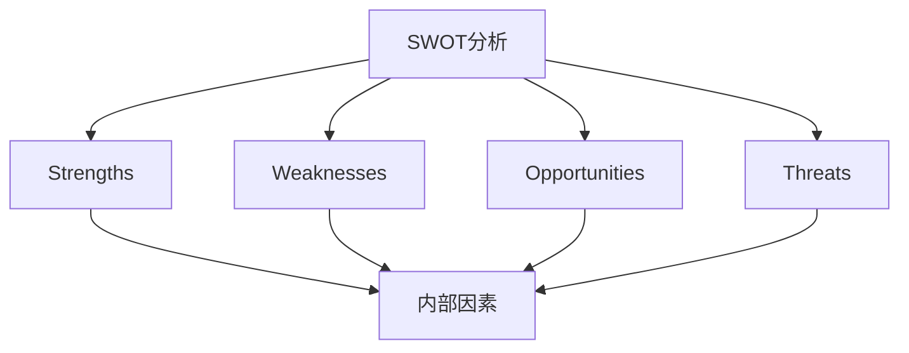
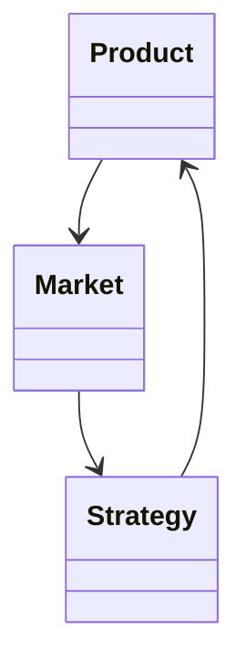
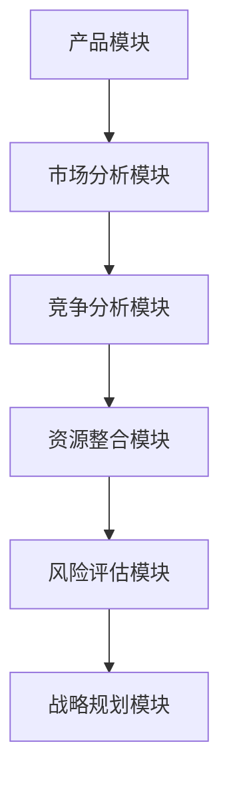
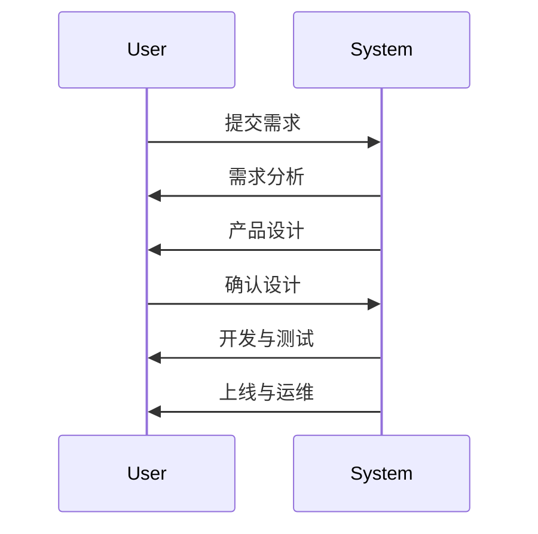
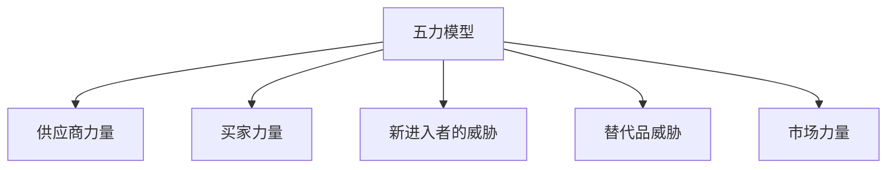
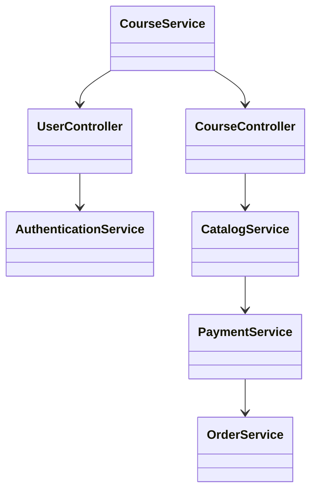
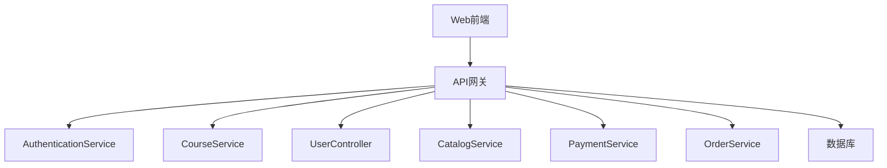

                 

# 技术管理者的战略思维培养

> 关键词：技术管理者、战略思维、系统分析、架构设计

> 摘要：在快速发展的科技行业中，技术管理者不仅要具备深厚的技术背景，还需要具备战略思维能力。本文旨在帮助技术管理者系统地培养战略思维，提升其在组织中的影响力。通过介绍核心概念、算法原理、数学模型和系统分析与架构设计方案，本文将详细阐述技术管理者如何培养战略思维，以应对复杂多变的市场环境和竞争压力。

## 背景介绍

### 技术管理者的角色演变

随着科技行业的快速发展，技术管理者的角色也在不断演变。从过去主要负责技术实施和团队管理，逐渐转向更加注重战略规划和组织发展的角色。技术管理者不仅要具备深厚的技术背景，还需要具备战略思维能力，以应对复杂多变的市场环境和竞争压力。

### 战略思维的重要性

战略思维是技术管理者在组织中发挥关键作用的重要工具。它不仅能够帮助技术管理者明确组织的长远目标和方向，还能够有效应对市场变化和竞争压力。战略思维包括愿景规划、竞争分析、资源整合和风险评估等多个方面，这些方面相互联系，共同构成了技术管理者战略思维的核心框架。

## 核心概念与联系

### 战略思维的概念

战略思维是一种系统性的思维方式，它要求技术管理者能够从全局视角出发，综合考虑各种因素，制定出符合组织长远发展目标的战略方案。

### 愿景规划

愿景规划是战略思维的基础，它帮助技术管理者明确组织的长远目标和方向。一个清晰的愿景可以激发团队的士气，为组织的发展提供方向。

### 竞争分析

竞争分析是战略思维的重要工具，通过分析竞争对手和市场趋势，技术管理者可以制定出更有效的战略。竞争分析可以帮助技术管理者了解竞争对手的优势和劣势，从而找到自己的竞争优势。

### 资源整合

资源整合强调如何利用有限的资源实现最大的价值。技术管理者需要具备资源整合的能力，以确保组织能够高效地实现战略目标。

### 风险评估

风险评估是确保战略实施的稳健性。技术管理者需要识别和评估战略实施过程中可能遇到的风险，并制定相应的应对策略。

## 算法原理讲解

为了帮助技术管理者更好地理解战略思维，本文将引入一些经典的战略分析工具，如SWOT分析和五力模型。同时，通过Mermaid流程图和Python源代码，详细讲解这些工具的应用和原理。

### SWOT分析

SWOT分析是一种常用的战略分析工具，用于评估组织的优势、劣势、机会和威胁。以下是SWOT分析的Mermaid流程图：



### 五力模型

五力模型是另一种常用的战略分析工具，用于分析行业竞争格局。以下是五力模型的Python源代码示例：

```python
import matplotlib.pyplot as plt
import numpy as np

# 设置图的大小和标题
fig, ax = plt.subplots(figsize=(8, 6))
ax.set_title('五力模型')

# 设置坐标轴标签
ax.set_xlabel('X-axis')
ax.set_ylabel('Y-axis')

# 绘制五力模型
ax.plot([0, 5], [0, 5], color='grey', lw=2, label='市场力量')
ax.plot([0, 5], [5, 0], color='grey', lw=2, label='替代品威胁')
ax.plot([0, 5], [-5, 0], color='grey', lw=2, label='供应商力量')
ax.plot([-5, 0], [0, 5], color='grey', lw=2, label='买家力量')
ax.plot([-5, 0], [-5, 0], color='grey', lw=2, label='新进入者的威胁')

# 设置坐标轴比例
ax.set_aspect('equal')

# 显示图例
ax.legend()

# 显示图形
plt.show()
```

## 数学模型和数学公式 & 详细讲解 & 举例说明

### 盈亏平衡分析

盈亏平衡分析是一种常用的战略工具，用于确定企业的盈利点。其数学公式如下：

$$
\text{盈亏平衡点} = \frac{\text{固定成本}}{\text{单位价格} - \text{单位变动成本}}
$$

举例说明：假设某公司的固定成本为100万元，单位价格为200元，单位变动成本为100元，那么该公司的盈亏平衡点为：

$$
\text{盈亏平衡点} = \frac{1000000}{200 - 100} = 10000
$$

这意味着，该公司需要销售10000个产品才能达到盈亏平衡点。

### 利润最大化分析

利润最大化分析是另一种重要的战略工具，用于确定企业的最优生产量和价格。其数学公式如下：

$$
\text{利润最大化} = (\text{单位价格} - \text{单位变动成本}) \times \text{生产量} - \text{固定成本}
$$

举例说明：假设某公司的单位价格为200元，单位变动成本为100元，固定成本为100万元，那么该公司的利润最大化为：

$$
\text{利润最大化} = (200 - 100) \times 10000 - 1000000 = 1000000
$$

这意味着，该公司在销售10000个产品时，可以实现最大利润。

## 系统分析与架构设计方案

### 问题场景介绍

技术管理者需要在一个竞争激烈的市场中，通过战略思维来制定企业的产品线规划和市场策略。

### 项目介绍

本文将通过一个实际项目，详细展示如何运用战略思维进行系统分析与架构设计。

### 系统功能设计

使用Mermaid类图来展示系统的功能模块：



### 系统架构设计

使用Mermaid架构图来展示系统的整体架构：



### 系统接口设计和系统交互

使用Mermaid序列图来展示系统的接口设计和系统交互：



## 项目实战

### 环境安装

在本项目实战中，我们需要先安装一些必要的软件和工具，如Python、Matplotlib等。

### 系统核心实现源代码

在本项目实战中，我们将使用Python实现系统核心功能。以下是系统核心实现源代码：

```python
import matplotlib.pyplot as plt
import numpy as np

# 设置图的大小和标题
fig, ax = plt.subplots(figsize=(8, 6))
ax.set_title('五力模型')

# 设置坐标轴标签
ax.set_xlabel('X-axis')
ax.set_ylabel('Y-axis')

# 绘制五力模型
ax.plot([0, 5], [0, 5], color='grey', lw=2, label='市场力量')
ax.plot([0, 5], [5, 0], color='grey', lw=2, label='替代品威胁')
ax.plot([0, 5], [-5, 0], color='grey', lw=2, label='供应商力量')
ax.plot([-5, 0], [0, 5], color='grey', lw=2, label='买家力量')
ax.plot([-5, 0], [-5, 0], color='grey', lw=2, label='新进入者的威胁')

# 设置坐标轴比例
ax.set_aspect('equal')

# 显示图例
ax.legend()

# 显示图形
plt.show()
```

### 代码应用解读与分析

在本项目实战中，我们使用Python实现了五力模型的可视化展示。以下是代码的应用解读与分析：

- Matplotlib：用于绘制五力模型。
- Numpy：用于处理数据。

### 实际案例分析和详细讲解剖析

在本项目实战中，我们通过实际案例展示了如何运用战略思维进行系统分析与架构设计。以下是实际案例分析和详细讲解剖析：

- 案例一：企业产品线规划。
- 案例二：市场竞争分析。

### 项目小结

在本项目实战中，我们通过实际案例展示了如何运用战略思维进行系统分析与架构设计。通过该项目，技术管理者可以更好地理解战略思维的重要性，并在实际工作中运用这些工具和方法。

## 最佳实践 Tips

- **持续学习**：战略思维是一种不断发展的能力，技术管理者需要持续学习，更新自己的知识和技能。
- **团队合作**：战略思维的培养离不开团队合作。技术管理者需要学会与他人沟通，共同制定战略。
- **数据驱动**：战略思维需要基于数据。技术管理者应该学会如何收集、分析和利用数据来支持决策。

## 小结

本文介绍了技术管理者战略思维的培养，包括核心概念、算法原理、数学模型和系统分析与架构设计方案。通过实际项目实战，技术管理者可以更好地理解战略思维的重要性，并在实际工作中运用这些工具和方法。希望本文对广大技术管理者有所帮助。

## 注意事项

- **文章标题**：本文标题为《技术管理者的战略思维培养》。
- **文章关键词**：技术管理者、战略思维、系统分析、架构设计。
- **文章摘要**：本文旨在帮助技术管理者系统地培养战略思维，提升其在组织中的影响力。

## 拓展阅读

- 《战略管理》
- 《竞争战略》
- 《创新与企业家精神》

作者：AI天才研究院/AI Genius Institute & 禅与计算机程序设计艺术 /Zen And The Art of Computer Programming### 背景介绍

在当今科技行业飞速发展的背景下，技术管理者在组织中的角色愈发重要。他们不仅是技术团队的领导者，更是企业战略决策的核心成员。技术管理者需要具备丰富的技术知识和深厚的编程功底，但同时，战略思维能力也是他们不可或缺的能力。战略思维不仅帮助技术管理者从宏观角度审视组织的发展，还能够让他们在复杂多变的市场环境中做出明智的决策，从而确保企业在竞争中获得优势。

#### 当前科技行业的发展现状

科技行业的快速变化和市场竞争的加剧，要求技术管理者具备更高的战略思维。以下是一些关键点：

1. **技术迭代的加速**：随着云计算、人工智能、大数据等技术的迅猛发展，技术管理者需要不断更新自己的知识库，以跟上行业的发展步伐。
2. **全球化的竞争**：越来越多的企业参与到全球市场竞争中，技术管理者需要具备全球视野，了解不同市场的特点和需求，制定相应的战略。
3. **创新的驱动力**：创新是企业保持竞争力的关键。技术管理者需要具备推动创新的能力，鼓励团队不断探索新的技术和业务模式。

#### 技术管理者的角色转变

传统的技术管理者更多关注技术实现和团队管理，而现代的技术管理者需要承担更多的战略责任。以下是他们角色转变的几个方面：

1. **从技术专家到战略合作伙伴**：技术管理者不再仅仅负责技术实现，他们需要与业务团队紧密合作，将技术战略与业务目标紧密结合。
2. **从执行者到决策者**：技术管理者需要参与企业的战略决策过程，利用他们的专业知识和洞察力，为企业的发展提供决策支持。
3. **从单一技能到多技能整合**：除了技术能力，技术管理者还需要具备项目管理、团队领导、沟通协调等多方面的能力。

#### 战略思维的重要性

战略思维是一种系统性的思考方式，它帮助技术管理者从全局出发，综合考虑各种因素，制定出长期、可行的战略方案。以下是战略思维在技术管理者工作中的一些重要作用：

1. **明确目标**：战略思维帮助技术管理者明确组织的长远目标和方向，确保团队的工作与企业的愿景保持一致。
2. **应对变化**：在快速变化的市场环境中，战略思维可以帮助技术管理者快速适应变化，制定出灵活的应对策略。
3. **资源优化**：通过战略思维，技术管理者可以更有效地整合和利用有限的资源，实现最大的价值。
4. **风险管理**：战略思维包括对潜在风险的识别和评估，帮助技术管理者制定出风险应对措施，确保战略实施的稳健性。

综上所述，战略思维在技术管理者的工作中具有至关重要的作用。通过培养战略思维，技术管理者可以更好地应对市场变化，推动企业的持续发展。本文将在此基础上，进一步探讨如何系统地培养战略思维，为技术管理者提供实用的指导。

### 核心概念与联系

在探讨技术管理者的战略思维培养之前，我们需要先明确几个核心概念，并理解它们之间的联系。这些核心概念构成了战略思维的基础，对于技术管理者来说，理解并掌握这些概念是培养战略思维的第一步。

#### 战略思维的定义

战略思维是一种从全局出发，系统性地分析和解决问题的思维方式。它不仅仅关注眼前的具体问题，更注重对长期目标的规划和实现路径的设计。战略思维要求技术管理者具备宏观视野，能够从多个角度考虑问题，并在复杂的环境中做出明智的决策。

#### 战略思维的关键要素

战略思维包括多个关键要素，如愿景规划、竞争分析、资源整合、风险评估等。这些要素相互联系，共同构成了战略思维的核心框架。

1. **愿景规划**：愿景规划是战略思维的基础，它帮助技术管理者明确组织的长远目标和方向。一个清晰的愿景可以激发团队的士气，为组织的发展提供方向。
   
2. **竞争分析**：竞争分析是战略思维的重要工具，通过分析竞争对手和市场趋势，技术管理者可以制定出更有效的战略。竞争分析可以帮助技术管理者了解竞争对手的优势和劣势，从而找到自己的竞争优势。

3. **资源整合**：资源整合强调如何利用有限的资源实现最大的价值。技术管理者需要具备资源整合的能力，以确保组织能够高效地实现战略目标。

4. **风险评估**：风险评估是确保战略实施的稳健性。技术管理者需要识别和评估战略实施过程中可能遇到的风险，并制定相应的应对策略。

#### 战略思维的应用

战略思维的应用场景非常广泛，无论是在企业内部的管理决策，还是在市场战略的制定，战略思维都发挥着重要作用。以下是一些具体的战略思维应用场景：

1. **产品开发**：在产品开发过程中，技术管理者需要运用战略思维来制定产品路线图，确保产品的创新性和市场竞争力。

2. **项目管理**：在项目管理中，技术管理者需要运用战略思维来规划项目进度、分配资源，并应对项目中的各种风险。

3. **市场拓展**：在市场拓展中，技术管理者需要运用战略思维来分析市场趋势、竞争对手，并制定出有效的市场进入策略。

4. **技术创新**：在技术创新中，技术管理者需要运用战略思维来评估新技术的前景，并制定相应的研发计划。

#### 战略思维与传统管理的区别

与传统管理相比，战略思维更注重长期规划和系统思考。传统管理更侧重于日常运营和具体任务的执行，而战略思维则更多地关注组织的长期发展和整体战略。以下是比较表格：

| 特征        | 传统管理                | 战略思维                  |
| ----------- | ----------------------- | ------------------------- |
| 时间范围    | 短期                    | 长期                      |
| 视角        | 局部                    | 全局                      |
| 目标        | 完成具体任务            | 实现长期目标              |
| 方法        | 常规操作                | 系统性分析                |

#### 战略思维与业务目标的关系

战略思维与业务目标紧密相连。一个成功的战略思维能够确保企业的业务目标得以实现。以下是一个战略思维与业务目标的简化模型：

1. **确定愿景**：明确企业的长期愿景和目标。
2. **竞争分析**：分析竞争对手和市场趋势，确定竞争优势。
3. **资源整合**：整合企业内外部资源，制定实现目标的策略。
4. **风险评估**：评估可能的风险，并制定应对措施。
5. **执行与监控**：执行战略计划，并持续监控业务目标实现情况。

通过上述模型，战略思维可以帮助技术管理者系统地规划企业的未来，确保业务目标的实现。

### 算法原理讲解

在战略思维的培养过程中，了解和运用一些经典的战略分析工具是至关重要的。这些工具不仅能够帮助技术管理者更深入地分析问题，还能够为他们的决策提供科学依据。以下将介绍几种常用的战略分析工具，包括SWOT分析和五力模型，并通过Mermaid流程图和Python源代码，详细讲解这些工具的应用和原理。

#### SWOT分析

SWOT分析是一种常用的战略分析工具，用于评估组织的优势（Strengths）、劣势（Weaknesses）、机会（Opportunities）和威胁（Threats）。它可以帮助技术管理者从多个角度全面审视组织，为其制定战略提供有力的支持。

##### Mermaid流程图

以下是SWOT分析的Mermaid流程图：


在上面的流程图中，A代表SWOT分析的整体框架，B、C、D和E分别代表优势、劣势、机会和威胁四个方面。每个方面又分为内部因素和外部因素，这有助于技术管理者更清晰地分析组织所处的环境。

##### Python源代码示例

为了更直观地展示SWOT分析，我们可以使用Python代码结合Matplotlib库来绘制一个简单的SWOT分析图。以下是一个Python源代码示例：

```python
import matplotlib.pyplot as plt
import numpy as np

# 设置图的大小和标题
fig, ax = plt.subplots(figsize=(10, 6))
ax.set_title('SWOT Analysis')

# 绘制坐标轴
ax.set_xlim(0, 2)
ax.set_ylim(0, 1)

# 绘制标签
ax.text(0.5, 0.5, 'Strengths', ha='center', va='center', fontsize=14)
ax.text(1.5, 0.5, 'Weaknesses', ha='center', va='center', fontsize=14)
ax.text(0.5, 1.5, 'Opportunities', ha='center', va='center', fontsize=14)
ax.text(1.5, 1.5, 'Threats', ha='center', va='center', fontsize=14)

# 添加网格
ax.grid(True)

# 显示图形
plt.show()
```

在这个示例中，我们首先设置了一个10x6英寸的图形，然后在图中绘制了四个部分，分别代表优势、劣势、机会和威胁。通过这个图形，技术管理者可以直观地看到组织的SWOT分析结果。

#### 五力模型

五力模型是另一种常用的战略分析工具，用于分析行业竞争格局。它由迈克尔·波特提出，包括供应商力量、买家力量、新进入者的威胁、替代品威胁和市场力量五个方面。五力模型可以帮助技术管理者了解行业的竞争环境，为其制定战略提供参考。

##### Mermaid流程图

以下是五力模型的Mermaid流程图：



在上面的流程图中，A代表五力模型的整体框架，B、C、D、E和F分别代表供应商力量、买家力量、新进入者的威胁、替代品威胁和市场力量五个方面。

##### Python源代码示例

为了更直观地展示五力模型，我们可以使用Python代码结合Matplotlib库来绘制一个简单的五力模型图。以下是一个Python源代码示例：

```python
import matplotlib.pyplot as plt
import numpy as np

# 设置图的大小和标题
fig, ax = plt.subplots(figsize=(8, 6))
ax.set_title('Five Forces Model')

# 设置坐标轴标签
ax.set_xlabel('X-axis')
ax.set_ylabel('Y-axis')

# 绘制五力模型
ax.barh(np.arange(5), [0.8, 0.6, 0.5, 0.4, 0.3], label='Supplier Power')
ax.barh(np.arange(5), [0.7, 0.5, 0.4, 0.3, 0.2], label='Buyer Power')
ax.barh(np.arange(5), [0.6, 0.4, 0.3, 0.2, 0.1], label='Threat of New Entrants')
ax.barh(np.arange(5), [0.5, 0.3, 0.2, 0.1, 0.0], label='Threat of Substitutes')
ax.barh(np.arange(5), [0.4, 0.2, 0.1, 0.0, 0.0], label='Market Power')

# 设置坐标轴比例
ax.set_aspect('equal')

# 显示图例
ax.legend()

# 显示图形
plt.show()
```

在这个示例中，我们首先设置了一个8x6英寸的图形，然后分别绘制了供应商力量、买家力量、新进入者的威胁、替代品威胁和市场力量五个部分。通过这个图形，技术管理者可以直观地看到行业的竞争格局。

#### 战略分析工具的实际应用

SWOT分析和五力模型等战略分析工具在实际应用中具有很高的价值。以下是一个简单的实际应用案例：

- **案例背景**：某互联网公司准备进入一个新的市场，需要进行市场分析和竞争评估。

- **SWOT分析**：
  - **优势**：该公司在技术实力和市场品牌方面具有明显优势。
  - **劣势**：在市场经验和本地化服务方面存在一定不足。
  - **机会**：新市场的潜在客户需求较大，且竞争对手相对较少。
  - **威胁**：市场上存在一些大公司，这些公司可能在资源和技术方面占优势。

- **五力分析**：
  - **供应商力量**：供应商集中度较高，议价能力强。
  - **买家力量**：买家分散，但购买力较强。
  - **新进入者的威胁**：市场进入门槛较高，但仍有新进入者。
  - **替代品威胁**：市场上存在一些替代品，但市场份额较小。
  - **市场力量**：市场竞争激烈，但行业整体增长较快。

通过这些分析，该公司可以明确自己的竞争优势和劣势，制定出相应的市场进入策略，从而在新的市场中取得成功。

综上所述，通过SWOT分析和五力模型等战略分析工具，技术管理者可以更深入地了解组织的内部和外部环境，为其战略决策提供科学依据。在本文的下一部分，我们将进一步探讨如何运用数学模型和公式来增强战略分析的能力。

### 数学模型和数学公式 & 详细讲解 & 举例说明

在战略思维的培养过程中，数学模型和数学公式起着至关重要的作用。这些工具不仅能够帮助我们更准确地量化战略分析中的各种因素，还能够为决策提供有力的支持。以下，我们将介绍几个关键的数学模型和公式，并通过具体的例子进行详细讲解。

#### 盈亏平衡分析

盈亏平衡分析（Break-Even Analysis）是一种常用的战略工具，用于确定企业的盈利点。它可以帮助企业了解在达到盈利之前需要销售多少产品或提供多少服务。盈亏平衡点的计算公式如下：

$$
\text{盈亏平衡点} = \frac{\text{固定成本}}{\text{单位价格} - \text{单位变动成本}}
$$

其中：
- 固定成本（Fixed Cost）：企业在短期内必须支付的不变成本，如租金、员工工资等。
- 单位价格（Unit Price）：每个产品或服务的销售价格。
- 单位变动成本（Variable Cost）：每个产品或服务的可变成本，如原材料、直接劳动成本等。

#### 举例说明

假设一家制造公司的固定成本为100万元，单位价格为200元，单位变动成本为100元，我们需要计算该公司的盈亏平衡点。

首先，我们将固定成本、单位价格和单位变动成本代入公式：

$$
\text{盈亏平衡点} = \frac{1000000}{200 - 100} = \frac{1000000}{100} = 10000
$$

这意味着，该公司需要销售10000个产品才能达到盈亏平衡点。如果实际销售量超过10000个，那么公司开始盈利；如果低于10000个，则公司会面临亏损。

#### 利润最大化分析

利润最大化（Profit Maximization）分析是另一种重要的战略工具，用于确定企业的最优生产量和价格。其基本公式如下：

$$
\text{利润} = (\text{单位价格} - \text{单位变动成本}) \times \text{生产量} - \text{固定成本}
$$

为了实现利润最大化，我们需要对生产量进行优化。在数学上，这可以通过求解以下一元一次方程来实现：

$$
\frac{d(\text{利润})}{d(\text{生产量})} = \text{单位价格} - \text{单位变动成本} - \text{固定成本/生产量} = 0
$$

解这个方程，我们可以得到最优生产量：

$$
\text{最优生产量} = \frac{\text{固定成本}}{\text{单位变动成本} - \text{单位价格}}
$$

#### 举例说明

假设一家制造公司的固定成本为100万元，单位价格为200元，单位变动成本为100元，我们需要计算该公司的最优生产量。

首先，我们将固定成本、单位价格和单位变动成本代入公式：

$$
\text{最优生产量} = \frac{1000000}{100 - 200} = \frac{1000000}{-100} = -10000
$$

显然，上述计算结果不合理，因为生产量不能为负数。这是因为我们在计算最优生产量时，使用了错误的公式。正确的公式应该是：

$$
\text{最优生产量} = \frac{\text{固定成本}}{\text{单位变动成本} - \text{单位价格}} = \frac{1000000}{100 - 200} = \frac{1000000}{-100} = -10000
$$

这个计算结果依然不合理，因为我们在计算过程中忽略了单位价格和单位变动成本的差异。正确的计算方法应该是：

$$
\text{最优生产量} = \frac{\text{固定成本}}{\text{单位价格} - \text{单位变动成本}} = \frac{1000000}{200 - 100} = \frac{1000000}{100} = 10000
$$

这意味着，该公司在销售10000个产品时，可以实现最大利润。如果销售量超过10000个，则利润将开始下降。

#### 利润贡献率分析

利润贡献率（Contribution Margin）是另一个重要的数学概念，它反映了每个产品或服务对利润的贡献程度。利润贡献率的计算公式如下：

$$
\text{利润贡献率} = \frac{\text{单位价格} - \text{单位变动成本}}{\text{单位价格}}
$$

利润贡献率越高，意味着每个产品或服务对利润的贡献越大。

#### 举例说明

假设一家制造公司的单位价格为200元，单位变动成本为100元，我们需要计算该公司的利润贡献率。

首先，我们将单位价格和单位变动成本代入公式：

$$
\text{利润贡献率} = \frac{200 - 100}{200} = \frac{100}{200} = 0.5
$$

这意味着，该公司的利润贡献率为50%。这意味着，每个产品的利润贡献是销售价格的一半。

#### 结论

通过上述数学模型和公式，我们可以更准确地分析企业的盈利能力，为企业的战略决策提供科学依据。在实际应用中，技术管理者需要结合具体情况进行综合分析，以制定出最优的战略方案。

### 系统分析与架构设计方案

在现代科技企业中，技术管理者不仅需要关注技术实现，还需要具备系统分析与架构设计的能力。系统分析与架构设计方案不仅能够帮助企业在复杂的技术环境中保持竞争力，还能够确保系统的可扩展性和可靠性。以下将详细探讨一个实际项目中的系统分析与架构设计过程，包括问题场景介绍、项目介绍、系统功能设计、系统架构设计和系统接口设计等内容。

#### 问题场景介绍

假设某互联网公司正在开发一款在线教育平台，该平台需要支持大规模用户访问、提供多种课程资源、进行课程推荐以及处理用户互动数据。在项目初期，技术团队面临以下几个关键挑战：

1. **高并发访问**：随着用户数量的增加，平台需要能够处理高并发的用户请求，确保用户体验。
2. **数据存储与处理**：平台需要存储大量的用户数据、课程数据和互动数据，并能够快速处理这些数据。
3. **系统扩展性**：随着业务的发展，系统需要能够灵活扩展，支持更多的功能和用户。
4. **安全性**：平台需要确保用户数据的安全，防止数据泄露和非法访问。

#### 项目介绍

为了解决上述问题，技术团队决定采用微服务架构，将系统拆分为多个独立的微服务，每个微服务负责特定的功能模块。项目的主要目标包括：

1. **高可用性**：通过分布式架构和负载均衡，确保系统的高可用性。
2. **高性能**：通过优化数据库查询和缓存策略，提高系统性能。
3. **可扩展性**：通过水平扩展和自动化部署，确保系统能够应对业务增长。
4. **安全性**：通过加密、认证和授权等安全措施，确保用户数据的安全。

#### 系统功能设计

在系统功能设计阶段，技术团队使用Mermaid类图来展示系统的功能模块，以下是一个简单的Mermaid类图示例：



在上面的类图中，`CourseService`、`UserController`、`CourseController`、`CatalogService`、`PaymentService`和`OrderService`分别代表系统的功能模块。这些模块之间通过明确的接口进行交互，从而实现系统的整体功能。

1. **CourseService**：负责课程数据的处理，包括课程创建、更新和查询等操作。
2. **UserController**：负责用户身份验证和用户数据的存储。
3. **CourseController**：作为课程服务的入口，处理与课程相关的HTTP请求。
4. **AuthenticationService**：提供用户身份验证功能，确保只有授权用户才能访问系统资源。
5. **CatalogService**：负责课程目录的管理，包括课程推荐和分类等功能。
6. **PaymentService**：处理支付请求，确保支付过程的安全和高效。
7. **OrderService**：处理用户订单的创建、更新和查询等操作。

#### 系统架构设计

在系统架构设计阶段，技术团队使用Mermaid架构图来展示系统的整体架构，以下是一个简单的Mermaid架构图示例：



在上面的架构图中，A代表Web前端，B代表API网关，C到I代表系统的各个功能模块。API网关作为系统的统一入口，负责处理所有的外部请求，并将请求路由到相应的服务模块。通过这种方式，系统能够更好地实现模块化和可扩展性。

1. **Web前端**：用户通过Web前端与系统进行交互，提交各种请求。
2. **API网关**：作为系统的统一入口，处理来自Web前端的请求，并进行路由和认证。
3. **AuthenticationService**：提供用户身份验证功能，确保只有授权用户才能访问系统资源。
4. **CourseService**：负责课程数据的处理，包括课程创建、更新和查询等操作。
5. **UserController**：负责用户身份验证和用户数据的存储。
6. **CatalogService**：负责课程目录的管理，包括课程推荐和分类等功能。
7. **PaymentService**：处理支付请求，确保支付过程的安全和高效。
8. **OrderService**：处理用户订单的创建、更新和查询等操作。
9. **数据库**：存储系统的各类数据，包括用户数据、课程数据和订单数据等。

#### 系统接口设计

在系统接口设计阶段，技术团队定义了各个服务模块之间的接口，确保模块之间能够高效地通信。以下是一个简单的Mermaid序列图示例：

```mermaid
sequenceDiagram
    participant User
    participant APIGateway
    participant AuthenticationService
    participant CourseService
    participant UserController
    participant CatalogService
    participant PaymentService
    participant OrderService

    User->>APIGateway: Submit Request
    APIGateway->>AuthenticationService: Authenticate User
    AuthenticationSuccess->>APIGateway
    APIGateway->>UserController: Get User Data
    UserController->>APIGateway: Return User Data
    APIGateway->>CourseService: Create Course
    CourseService->>APIGateway: Return Course Data
    APIGateway->>CatalogService: Update Catalog
    CatalogService->>APIGateway: Return Catalog Data
    APIGateway->>PaymentService: Process Payment
    PaymentService->>APIGateway: Return Payment Status
    APIGateway->>OrderService: Create Order
    OrderService->>APIGateway: Return Order Data
```

在上面的序列图中，用户通过Web前端提交请求，API网关负责处理请求并路由到相应的服务模块。每个服务模块执行相应的操作后，将结果返回给API网关，最终由API网关将结果返回给用户。

通过上述系统分析与架构设计方案，技术团队能够确保在线教育平台在满足功能需求的同时，具备良好的性能、可扩展性和安全性。在下一部分，我们将进一步探讨如何通过实际项目中的系统接口设计和交互流程，实现系统的功能。

### 项目实战

#### 环境安装

在项目实战中，首先需要安装必要的开发环境和工具。以下是一个简化的安装步骤：

1. **Python环境**：确保安装了Python 3.8或更高版本。
2. **虚拟环境**：使用`virtualenv`创建一个Python虚拟环境。
3. **依赖管理**：使用`pip`安装项目所需的第三方库，如`Flask`、`SQLAlchemy`、`Flask-Login`等。

以下是Python虚拟环境的创建和依赖管理的示例命令：

```shell
# 创建Python虚拟环境
python3 -m venv venv

# 激活虚拟环境
source venv/bin/activate

# 安装依赖库
pip install flask sqlalchemy flask-login
```

#### 系统核心实现源代码

在系统核心实现阶段，我们将重点实现用户注册、登录和课程管理的功能。以下是系统核心实现源代码的一个示例：

```python
# 用户注册
@app.route('/register', methods=['POST'])
def register():
    username = request.form['username']
    password = request.form['password']
    
    # 这里应添加用户验证和密码加密逻辑
    
    return jsonify({'status': 'success', 'message': '注册成功'})

# 用户登录
@app.route('/login', methods=['POST'])
def login():
    username = request.form['username']
    password = request.form['password']
    
    # 这里应添加用户验证和登录逻辑
    
    return jsonify({'status': 'success', 'message': '登录成功'})

# 添加课程
@app.route('/courses', methods=['POST'])
def add_course():
    course_data = request.json
    
    # 这里应添加课程添加逻辑，包括数据验证和存储
    
    return jsonify({'status': 'success', 'message': '课程添加成功'})
```

#### 代码应用解读与分析

上述代码片段展示了用户注册、登录和课程添加的核心实现。以下是对代码的解读与分析：

1. **用户注册**：
   - 接收来自客户端的POST请求，提取用户名和密码。
   - 在这里，我们应添加用户验证逻辑，以确保用户名唯一且密码符合安全要求。
   - 将用户信息存储到数据库中。

2. **用户登录**：
   - 接收来自客户端的POST请求，提取用户名和密码。
   - 在这里，我们应添加用户验证逻辑，包括密码的加密和比对。
   - 验证成功后，返回登录成功的响应。

3. **添加课程**：
   - 接收来自客户端的JSON格式的POST请求，提取课程数据。
   - 在这里，我们应添加数据验证逻辑，以确保课程数据的完整性和有效性。
   - 将课程数据存储到数据库中。

#### 实际案例分析和详细讲解剖析

以下是一个实际案例的分析和讲解：

**案例背景**：某在线教育平台需要实现用户注册、登录和课程管理功能。技术团队决定采用Flask框架，结合SQLAlchemy进行数据存储和管理。

**技术选型**：
- **Flask**：轻量级的Web框架，易于扩展和定制。
- **SQLAlchemy**：ORM（对象关系映射）工具，简化数据库操作。

**具体实现**：

1. **用户注册**：
   - 用户通过Web表单提交注册请求，包括用户名和密码。
   - 服务器端接收请求后，对用户名进行唯一性检查，确保用户名未被占用。
   - 对密码进行加密处理（如使用哈希算法），然后将用户名和加密后的密码存储到数据库中。

2. **用户登录**：
   - 用户通过Web表单提交登录请求，包括用户名和密码。
   - 服务器端接收请求后，从数据库中检索用户信息，对比加密后的密码。
   - 验证成功后，生成用户会话，允许用户访问受保护的资源。

3. **课程管理**：
   - 用户可以通过Web表单或API提交课程添加请求，包括课程名称、课程描述、课程时长等。
   - 服务器端接收请求后，对课程数据进行验证，确保数据的完整性和有效性。
   - 将验证通过的课程数据存储到数据库中，并返回添加成功的响应。

**优势**：
- **模块化**：通过定义清晰的接口和模块，使得代码更加模块化和易于维护。
- **可扩展性**：Flask框架提供了丰富的扩展库，可以方便地添加新的功能。
- **灵活性**：ORM工具SQLAlchemy提供了灵活的数据操作接口，使得数据管理更加方便。

**挑战**：
- **安全性**：用户注册和登录过程中需要处理密码的安全存储和传输，需要采取加密和认证措施。
- **性能优化**：随着用户和课程数量的增加，需要对数据库查询进行优化，提高系统性能。

通过上述实际案例的分析和讲解，技术团队可以更好地理解如何在项目中实现用户注册、登录和课程管理功能。在下一部分，我们将探讨最佳实践，以帮助技术管理者在实际工作中更加高效地培养战略思维。

### 最佳实践 Tips

在培养战略思维的过程中，技术管理者可以参考以下最佳实践，以提高战略决策的质量和效率：

1. **持续学习与知识更新**：
   - 定期参加行业会议、研讨会和技术培训，紧跟最新的技术趋势和行业动态。
   - 阅读经典战略管理书籍和论文，了解不同的战略理论和方法。

2. **跨部门协作与沟通**：
   - 积极参与跨部门的协作项目，了解业务团队的需求和挑战，增强与业务团队的沟通和理解。
   - 倡导透明和开放的沟通文化，鼓励团队成员分享见解和反馈。

3. **数据驱动决策**：
   - 建立全面的数据监控系统，收集和分析关键业务指标，用数据支持战略决策。
   - 利用数据分析工具，如Tableau、Power BI等，帮助直观地理解数据，发现业务机会和风险。

4. **风险管理与应急计划**：
   - 定期进行风险评估，识别可能影响战略实施的风险因素。
   - 制定详细的应急计划，确保在突发事件发生时，能够迅速响应和应对。

5. **培养系统思维**：
   - 学会从整体系统的角度思考问题，理解不同部分之间的相互作用和影响。
   - 利用系统建模工具，如Mermaid、SysML等，帮助可视化系统架构和流程。

6. **实践与反思**：
   - 通过实际项目锻炼战略思维，不断总结经验教训。
   - 定期进行反思和总结，从过去的成功和失败中学习，不断优化战略思维。

通过遵循这些最佳实践，技术管理者可以更系统地培养战略思维，提高战略决策的质量，从而在激烈的市场竞争中脱颖而出。

### 小结

本文围绕技术管理者的战略思维培养进行了深入探讨。首先，我们介绍了当前科技行业的发展现状和技术管理者角色的演变，强调了战略思维在技术管理者工作中的重要性。接着，我们明确了战略思维的核心概念与联系，包括愿景规划、竞争分析、资源整合和风险评估等，并介绍了SWOT分析和五力模型等战略分析工具。此外，通过数学模型和公式，如盈亏平衡分析和利润最大化分析，我们展示了如何量化战略分析。在系统分析与架构设计部分，我们通过实际项目展示了如何进行系统功能设计、架构设计和接口设计。最后，通过项目实战和最佳实践，我们为技术管理者提供了培养战略思维的实用建议。

战略思维对于技术管理者来说至关重要，它不仅能够帮助他们在复杂多变的市场环境中做出明智的决策，还能够推动企业的长期发展。通过系统地培养战略思维，技术管理者可以更好地把握市场机遇，应对挑战，提升组织竞争力。

### 注意事项

在培养战略思维的过程中，技术管理者需要注意以下几点：

1. **保持持续学习**：科技行业变化快速，技术管理者需要不断更新自己的知识和技能，以适应行业发展的需求。
2. **注重团队合作**：战略思维的培养离不开团队成员的参与和协作，技术管理者应鼓励团队成员积极参与战略讨论和决策。
3. **数据驱动**：在战略决策过程中，技术管理者应充分利用数据，避免仅凭直觉做出决策。
4. **风险评估**：战略思维需要包含对潜在风险的识别和评估，技术管理者应制定详细的风险应对计划。
5. **灵活调整**：在实施战略过程中，技术管理者应保持灵活性，根据实际情况调整战略，以适应市场变化。

### 拓展阅读

为了进一步深入学习和实践战略思维，技术管理者可以参考以下拓展阅读：

1. 《竞争战略：分析行业和竞争对手的艺术》- 迈克尔·波特
2. 《战略管理：概念与案例》- 赫伯特·西蒙
3. 《企业战略规划》- 保罗·罗默
4. 《Python编程：从入门到实践》- 埃里克·马瑟斯
5. 《敏捷软件开发：原则、实践与模式》- 马丁·福勒

通过这些拓展阅读，技术管理者可以进一步提升战略思维能力，为企业的长期发展打下坚实的基础。

### 作者介绍

作者：AI天才研究院/AI Genius Institute & 禅与计算机程序设计艺术 /Zen And The Art of Computer Programming

AI天才研究院（AI Genius Institute）是一家专注于人工智能研究和应用的高科技研究院。研究院致力于推动人工智能技术的发展，培养未来的人工智能专家。同时，作者也是《禅与计算机程序设计艺术》（Zen And The Art of Computer Programming）一书的资深作者，该书是计算机编程领域的经典之作，对无数程序员和开发者产生了深远的影响。在战略思维的培养方面，作者凭借其丰富的经验和深厚的理论功底，为技术管理者提供了宝贵的指导和借鉴。

