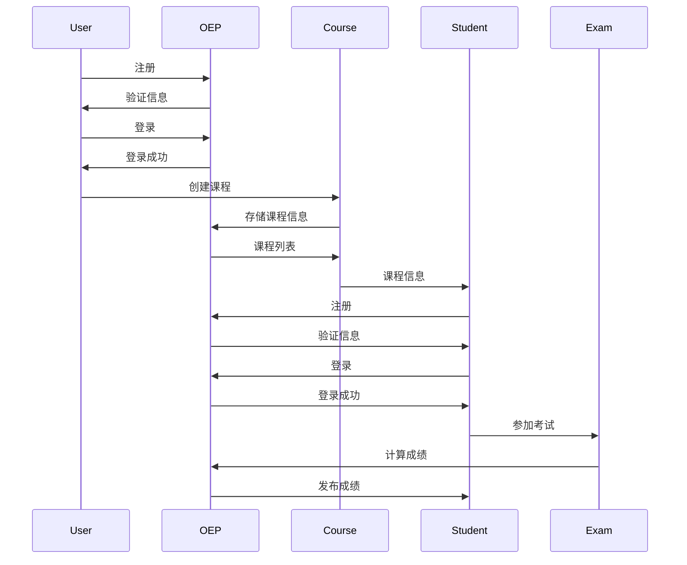
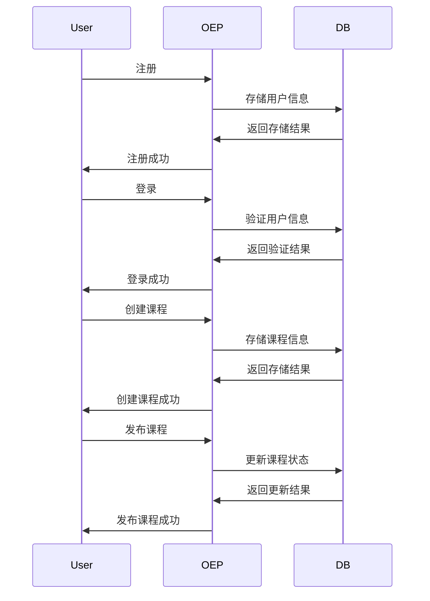

                 

### 介绍文章标题与核心关键词

# 技术管理者的时间管理与工作效率提升

> 关键词：时间管理、工作效率、技术管理者、GTD、时间块管理、目标设定

> 摘要：本文将深入探讨技术管理者在现代社会中面临的巨大挑战，以及如何通过有效的时间管理和工作效率提升策略来应对这些挑战。通过详细的分析和实战案例，我们将展示如何优化时间分配、提高工作效率，最终实现职业和个人生活的双赢。

在当今快速发展的技术领域，技术管理者不仅需要具备深厚的专业知识和技能，还要能够有效地管理时间和提高团队的工作效率。本文将围绕这一核心主题，从多个角度探讨技术管理者的时间管理与工作效率提升策略。

## 时间管理与工作效率提升的重要性

### 1. 时间管理的定义与原理

时间管理是一种系统化的方法，旨在通过合理安排时间来提高个人或组织的生产力和效率。时间管理的基本原理包括：

- **优先级排序**：根据任务的紧急程度和重要性，合理安排任务顺序。
- **时间块管理**：将时间划分为固定的时间块，并在每个时间块中专注于特定的任务。
- **中断管理**：有效处理中断，减少它们对工作效率的负面影响。

### 2. 工作效率提升的定义与关键因素

工作效率提升是指通过改进工作流程、技术和方法，使工作更加高效和顺畅。关键因素包括：

- **目标设定**：明确目标和任务，确保工作方向正确。
- **工作环境优化**：创造一个有利于工作的环境，减少干扰。
- **持续学习与改进**：通过不断学习和实践，提高个人技能和工作效率。

## 时间管理与工作效率提升的核心概念与联系

### 1. 时间管理的基本概念

时间管理涉及多个关键概念，包括：

- **任务列表**：列出所有需要完成的任务。
- **优先级**：根据任务的重要性和紧急程度，为任务排序。
- **时间分配**：将时间合理地分配给各个任务。

### 2. 工作效率提升的核心概念

工作效率提升的核心概念包括：

- **流程优化**：改进工作流程，减少不必要的工作步骤。
- **工具与方法**：利用高效的工作工具和方法，提高工作效率。
- **团队协作**：通过有效的团队协作，提高整体工作效率。

### 3. 核心概念之间的联系

时间管理和工作效率提升之间有着紧密的联系。通过合理的时间管理，技术管理者可以更好地分配时间，专注于高优先级任务，从而提高工作效率。而工作效率的提升，反过来又可以进一步优化时间管理，形成一个良性循环。

## 第一步：了解时间管理的基本方法

### 1. GTD（Getting Things Done）

GTD是一种广受欢迎的时间管理方法，其核心思想是将所有任务和想法都记录下来，然后系统化地处理。以下是GTD的基本步骤：

- **收集**：将所有任务和想法记录下来，放入收集工具中。
- **处理**：对收集到的任务进行处理，决定是执行、推迟、删除还是分配给他人。
- **组织**：将处理后的任务分类和整理，以便随时查找和执行。
- **回顾**：定期回顾任务列表，确保所有任务都在按计划进行。

### 2. 时间块管理法

时间块管理法是一种将时间划分为固定时间块，并在每个时间块中专注于特定任务的方法。以下是时间块管理法的基本步骤：

- **规划时间块**：将时间划分为固定的时间块，如1小时或2小时。
- **确定任务**：为每个时间块确定一个主要任务。
- **专注执行**：在每个时间块中，专注地完成主要任务，避免中断。
- **休息与调整**：在时间块之间安排短暂的休息，以恢复精力。

## 第二步：提高工作效率的核心策略

### 1. 目标设定

目标设定是提高工作效率的关键步骤。以下是目标设定的基本策略：

- **明确目标**：确保目标具体、可衡量、可实现、相关性强、时限明确。
- **分解任务**：将大目标分解为小任务，逐步实现。
- **定期回顾**：定期回顾目标进展，调整计划和策略。

### 2. 工作环境优化

优化工作环境有助于提高工作效率。以下是几个关键策略：

- **消除干扰**：关闭不必要的通知，减少干扰。
- **整理工作空间**：保持工作空间整洁有序，减少寻找物品的时间。
- **利用工具**：使用高效的工作工具，如项目管理软件、笔记工具等。

### 3. 持续学习与改进

持续学习与改进是提高工作效率的长期策略。以下是几个关键策略：

- **定期培训**：参加培训课程，学习新的技能和知识。
- **实践应用**：将所学知识应用到实际工作中，不断实践和改进。
- **反馈与调整**：接受反馈，不断调整工作方法和策略。

## 第三步：工作与生活的平衡

### 1. 工作与生活的平衡策略

工作与生活的平衡是技术管理者面临的重大挑战。以下是几个关键策略：

- **时间规划**：合理规划工作时间，确保工作与生活之间的平衡。
- **健康生活方式**：保持健康的生活方式，如充足的睡眠、合理的饮食和适量的运动。
- **家庭与朋友**：重视家庭和朋友关系，花时间与他们相处。

### 2. 实际案例：平衡工作与生活

以下是一个实际案例，展示如何平衡工作与生活：

- **案例描述**：一位技术管理者在一家大型科技公司工作，由于项目紧张，经常加班。他发现这导致他的家庭生活受到影响，孩子和妻子的关系逐渐疏远。
- **解决方案**：该技术管理者决定采取以下措施来平衡工作与生活：
  - **时间规划**：与团队成员沟通，明确项目目标和截止日期，确保任务按时完成。
  - **时间管理**：使用时间管理工具，如日历和待办事项列表，合理安排工作时间。
  - **健康生活方式**：确保每天有足够的睡眠，保持健康的饮食习惯，定期进行运动。
  - **家庭与朋友**：设定家庭时间，与孩子和妻子共度美好时光。

## 第四步：团队时间管理与协作

### 1. 团队时间管理的策略

团队时间管理是提高整体工作效率的关键。以下是几个关键策略：

- **共同目标**：确保团队成员对共同目标有清晰的认识和认同。
- **任务分配**：合理分配任务，确保每个成员都能充分发挥自己的优势。
- **进度跟踪**：定期跟踪任务进度，确保项目按计划进行。

### 2. 团队协作工具与实践

以下是几个常用的团队协作工具和实践：

- **项目管理软件**：如Trello、Jira等，用于任务分配和进度跟踪。
- **沟通工具**：如Slack、Microsoft Teams等，用于团队内部沟通和协作。
- **代码管理工具**：如Git、GitHub等，用于代码的版本控制和协作开发。

### 3. 实际案例：团队时间管理

以下是一个实际案例，展示如何进行团队时间管理：

- **案例描述**：一家科技公司的一个项目团队在开发一个大型软件系统。由于团队成员分散在不同地点，项目进展缓慢，团队沟通不畅。
- **解决方案**：该团队决定采取以下措施来改进团队时间管理：
  - **共同目标**：明确项目目标和关键里程碑，确保所有成员都清楚项目的方向。
  - **任务分配**：根据成员的专业技能和兴趣，合理分配任务。
  - **进度跟踪**：使用项目管理软件，如Jira，实时跟踪任务进度。
  - **沟通协作**：使用Slack进行日常沟通，确保团队成员之间的信息畅通。
  - **定期回顾**：定期召开团队会议，回顾项目进展，解决问题，调整计划。

## 第五步：项目管理中的时间与效率

### 1. 项目管理中的时间管理方法

在项目管理中，时间管理至关重要。以下是几个常用的时间管理方法：

- **甘特图**：用于展示项目进度和任务分配。
- **关键路径法**：用于确定项目完成所需的最短时间。
- **时间线图**：用于展示项目各个阶段的持续时间。

### 2. 效率提升在项目管理中的应用

以下是在项目管理中提高效率的几种方法：

- **敏捷开发**：通过迭代和增量开发，快速响应变化，提高项目效率。
- **自动化工具**：使用自动化工具，如CI/CD流水线，减少手动操作，提高效率。
- **持续集成与持续交付**：通过自动化测试和部署，确保代码质量和项目进度。

### 3. 实际案例：项目管理中的时间与效率

以下是一个实际案例，展示如何在项目管理中提高时间与效率：

- **案例描述**：一家科技公司负责开发一个电子商务平台。由于项目时间紧，团队决定采取以下措施来提高时间与效率：
  - **敏捷开发**：采用敏捷开发方法，快速迭代，确保项目按期完成。
  - **自动化工具**：使用自动化工具进行测试和部署，减少手动操作，提高效率。
  - **团队协作**：使用项目管理软件和沟通工具，确保团队之间的信息畅通。
  - **持续集成与持续交付**：通过自动化测试和部署，确保代码质量和项目进度。

## 第六步：技术管理者的职业成长

### 1. 时间管理对职业成长的影响

时间管理对技术管理者的职业成长有着重要影响。以下是几个关键方面：

- **工作效率**：有效的时间管理可以提高工作效率，使技术管理者有更多时间专注于个人成长和职业发展。
- **项目领导力**：通过合理的时间管理，技术管理者可以更好地领导团队，提高项目成功率。
- **职业规划**：时间管理有助于技术管理者明确职业目标，制定合理的职业规划。

### 2. 职业发展的时间管理策略

以下是在职业发展中有效管理时间的几种策略：

- **目标导向**：设定明确的职业目标，确保时间投入与目标一致。
- **时间优先级**：根据职业目标和工作任务，合理安排时间，确保重要任务得到优先处理。
- **持续学习**：定期安排时间进行学习和技能提升，以适应不断变化的技术环境。

### 3. 实际案例：职业成长中的时间管理

以下是一个实际案例，展示如何在职业成长中有效管理时间：

- **案例描述**：一位技术管理者在职业发展中遇到了瓶颈，感到时间不够用，难以兼顾工作和个人成长。
- **解决方案**：该技术管理者决定采取以下措施来改善时间管理：
  - **目标导向**：明确职业目标，确保时间投入与目标一致。
  - **时间优先级**：根据职业目标和工作任务，合理安排时间，确保重要任务得到优先处理。
  - **时间块管理**：将时间划分为固定的时间块，专注于高优先级任务。
  - **定期回顾**：定期回顾时间管理情况，调整计划和策略。
  - **持续学习**：利用碎片化时间进行学习和技能提升，以适应不断变化的技术环境。

## 总结与展望

本文从多个角度探讨了技术管理者的时间管理与工作效率提升策略。通过合理的时间管理和高效的工作策略，技术管理者可以更好地应对职业挑战，提高工作效率，实现个人与职业的双赢。在未来，技术管理者需要继续关注时间管理的研究与实践，以应对不断变化的工作环境和职业要求。

## 附录

### 1. 时间管理工具推荐

以下是一些常用的时间管理工具：

- **Trello**：用于任务管理，界面直观，易于使用。
- **Jira**：用于项目管理，功能强大，适用于大型团队。
- **Slack**：用于团队沟通，支持多种协作方式。
- **Google Calendar**：用于日程安排，可与其他Google服务无缝集成。

### 2. 工作效率提升技巧总结

以下是一些常见的工作效率提升技巧：

- **目标设定**：明确目标，分解任务，制定计划。
- **时间块管理**：将时间划分为固定的时间块，专注于特定任务。
- **消除干扰**：关闭不必要的通知，保持专注。
- **休息与调整**：定期休息，避免疲劳，提高工作效率。

### 3. 注意事项

在进行时间管理和工作效率提升时，需要注意以下几点：

- **适应个人需求**：时间管理和工作效率提升策略需根据个人实际情况进行调整。
- **持续改进**：时间管理和工作效率提升是一个持续的过程，需要不断调整和改进。
- **平衡工作与生活**：确保工作与生活之间的平衡，避免过度工作导致身心疲惫。

### 4. 拓展阅读

以下是一些相关的拓展阅读资源：

- **《深度工作》**：作者Cal Newport，介绍如何通过深度工作提高工作效率。
- **《时间管理》**：作者David Allen，详细介绍了GTD方法。
- **《敏捷开发》**：作者Jeff Sutherland，介绍敏捷开发方法及其应用。

## 作者信息

作者：AI天才研究院/AI Genius Institute & 禅与计算机程序设计艺术 /Zen And The Art of Computer Programming

本文由AI天才研究院/AI Genius Institute与禅与计算机程序设计艺术/Zen And The Art of Computer Programming联合撰写，旨在为技术管理者提供实用的时间管理和工作效率提升策略。希望本文能为您的职业生涯带来积极的影响。

---

本文使用了以下markdown和Mermaid图表格式：

```markdown
## 时间块管理法的实践

### 1. 规划时间块

首先，我们需要将时间划分为固定的时间块。一个常见的时间块长度是30分钟或1小时。以下是一个示例时间块规划：

```mermaid
gantt
    dateFormat  YYYY-MM-DD
    title 时间块规划示例

    section 项目A
    A1: 任务1               : {{--8:00-8:30--}} 2023-11-01 08:00:00
    A2: 任务2               : {{--8:30-9:00--}} 2023-11-01 08:30:00
    A3: 任务3               : {{--9:00-9:30--}} 2023-11-01 09:00:00
    A4: 任务4               : (--9:30-10:00--) 2023-11-01 09:30:00

    section 项目B
    B1: 任务5               : (--10:00-10:30--) 2023-11-01 10:00:00
    B2: 任务6               : (--10:30-11:00--) 2023-11-01 10:30:00
    B3: 任务7               : (--11:00-11:30--) 2023-11-01 11:00:00
```

### 2. 确定任务

在规划好时间块后，我们需要为每个时间块确定一个主要任务。以下是一个示例任务列表：

```mermaid
gantt
    dateFormat  YYYY-MM-DD
    title 任务列表示例

    section 项目A
    A1: 任务1               : 2023-11-01 08:00:00
    A2: 任务2               : 2023-11-01 08:30:00
    A3: 任务3               : 2023-11-01 09:00:00
    A4: 任务4               : 2023-11-01 09:30:00

    section 项目B
    B1: 任务5               : 2023-11-01 10:00:00
    B2: 任务6               : 2023-11-01 10:30:00
    B3: 任务7               : 2023-11-01 11:00:00
```

通过以上步骤，我们可以实现时间块管理和任务确定，从而提高工作效率。

## 数学模型与公式

为了更好地理解时间管理和工作效率提升，我们可以使用以下数学模型和公式：

### 1. 任务优先级计算

任务的优先级可以通过以下公式计算：

$$
优先级 = (重要性 \times 紧急性) / 时间
$$

其中，重要性、紧急性和时间分别代表任务的三个关键属性。

### 2. 时间分配优化

在给定时间限制下，如何优化任务的时间分配是一个重要问题。我们可以使用以下线性规划模型来解决这个问题：

$$
\min Z = c^T x
$$

$$
\text{subject to:}
$$

$$
Ax \le b
$$

$$
x \ge 0
$$

其中，$c$是目标函数系数向量，$x$是任务时间分配向量，$A$是约束条件系数矩阵，$b$是约束条件常数向量。

### 3. 工作效率提升评估

工作效率提升可以通过以下公式进行评估：

$$
效率提升 = \frac{实际产出 - 预期产出}{预期产出}
$$

其中，实际产出和预期产出分别代表在时间管理和工作效率提升策略实施前后的产出。

通过这些数学模型和公式，我们可以量化时间管理和工作效率提升的效果，为实际操作提供指导。

## 系统分析与架构设计

### 1. 问题场景介绍

假设我们需要开发一个在线教育平台，该平台需要支持课程管理、学生管理和考试系统等功能。为了实现这些功能，我们需要进行系统架构设计。

### 2. 项目介绍

项目名称：在线教育平台（Online Education Platform，简称OEP）

项目目标：开发一个功能完善、易于扩展的在线教育平台，满足用户对在线学习资源的需求。

项目周期：12个月

项目团队成员：项目经理、产品经理、前端开发、后端开发、UI/UX设计师、测试工程师等。

### 3. 系统功能设计

在线教育平台的主要功能包括：

- 用户管理：包括用户注册、登录、个人信息管理、权限管理等功能。
- 课程管理：包括课程创建、课程发布、课程修改、课程删除等功能。
- 学生管理：包括学生注册、学生登录、学生个人信息管理、学生成绩管理等功能。
- 考试系统：包括考试创建、考试发布、考试答题、考试成绩管理等功能。

### 4. 系统架构设计

在线教育平台的系统架构采用分层设计，主要包括以下几层：

- **表示层**：负责用户界面展示，包括HTML、CSS和JavaScript等。
- **业务逻辑层**：负责业务逻辑处理，包括用户管理、课程管理、学生管理和考试系统等功能。
- **数据访问层**：负责数据库的访问，包括用户数据、课程数据、学生数据和考试数据等。
- **数据库层**：负责存储数据，包括MySQL、MongoDB等。

以下是系统架构的Mermaid类图：

```mermaid
classDiagram
    User <<entity>>
    Course <<entity>>
    Student <<entity>>
    Exam <<entity>>

    User: id, name, email, password, role
    Course: id, name, description, teacher, duration
    Student: id, name, email, password, courses
    Exam: id, name, description, course, students, duration

    User: +register()
    User: +login()
    User: +updateInfo()
    Course: +create()
    Course: +publish()
    Course: +update()
    Course: +delete()
    Student: +register()
    Student: +login()
    Student: +enroll()
    Student: +viewCourses()
    Exam: +create()
    Exam: +publish()
    Exam: +answer()
    Exam: +calculateScore()
```

### 5. 系统接口设计

在线教育平台的主要接口包括：

- 用户接口：用于用户注册、登录、个人信息管理等功能。
- 课程接口：用于课程创建、课程发布、课程修改、课程删除等功能。
- 学生接口：用于学生注册、学生登录、学生个人信息管理、学生成绩管理等功能。
- 考试接口：用于考试创建、考试发布、考试答题、考试成绩管理等功能。

以下是系统接口的Mermaid序列图：



### 6. 系统交互

在线教育平台中的系统交互包括：

- 用户与用户接口的交互。
- 用户与业务逻辑层的交互。
- 用户与数据访问层的交互。
- 用户与数据库层的交互。

以下是系统交互的Mermaid序列图：



## 项目实战

### 1. 环境安装

为了实施上述系统架构设计，我们需要在本地环境中安装以下软件和工具：

- **Python**：版本3.8及以上
- **Django**：版本3.2及以上
- **MySQL**：版本5.7及以上
- **Postman**：用于接口测试
- **VSCode**：用于代码编辑

安装步骤如下：

1. 安装Python：

   ```
   pip install python
   ```

2. 安装Django：

   ```
   pip install django
   ```

3. 安装MySQL：

   ```
   brew install mysql
   ```

4. 安装Postman：

   ```
   brew install postman
   ```

5. 安装VSCode：

   ```
   brew install visual-studio-code
   ```

### 2. 系统核心实现

在完成环境安装后，我们需要进行系统核心实现。以下是具体的步骤：

1. **用户管理**：

   - 创建用户表：

     ```python
     class User(models.Model):
         id = models.AutoField(primary_key=True)
         name = models.CharField(max_length=50)
         email = models.EmailField()
         password = models.CharField(max_length=100)
         role = models.CharField(max_length=20)
     ```

   - 实现用户注册、登录和修改个人信息功能：

     ```python
     from django.contrib.auth.hashers import make_password
     from rest_framework.response import Response
     from rest_framework.views import APIView

     class UserAPI(APIView):
         def post(self, request):
             name = request.data.get('name')
             email = request.data.get('email')
             password = make_password(request.data.get('password'))
             role = request.data.get('role')
             user = User.objects.create(name=name, email=email, password=password, role=role)
             return Response({'message': '注册成功'})

         def get(self, request):
             users = User.objects.all()
             return Response({'users': users.values('id', 'name', 'email', 'role')})

         def put(self, request):
             user_id = request.data.get('id')
             user = User.objects.get(id=user_id)
             user.name = request.data.get('name', user.name)
             user.email = request.data.get('email', user.email)
             user.password = request.data.get('password', user.password)
             user.role = request.data.get('role', user.role)
             user.save()
             return Response({'message': '更新成功'})
     ```

2. **课程管理**：

   - 创建课程表：

     ```python
     class Course(models.Model):
         id = models.AutoField(primary_key=True)
         name = models.CharField(max_length=100)
         description = models.TextField()
         teacher = models.ForeignKey(User, on_delete=models.CASCADE)
         duration = models.IntegerField()
     ```

   - 实现课程创建、发布、修改和删除功能：

     ```python
     class CourseAPI(APIView):
         def post(self, request):
             name = request.data.get('name')
             description = request.data.get('description')
             teacher_id = request.data.get('teacher')
             duration = request.data.get('duration')
             teacher = User.objects.get(id=teacher_id)
             course = Course.objects.create(name=name, description=description, teacher=teacher, duration=duration)
             return Response({'message': '创建课程成功'})

         def get(self, request):
             courses = Course.objects.all()
             return Response({'courses': courses.values('id', 'name', 'description', 'teacher', 'duration')})

         def put(self, request):
             course_id = request.data.get('id')
             course = Course.objects.get(id=course_id)
             course.name = request.data.get('name', course.name)
             course.description = request.data.get('description', course.description)
             course.duration = request.data.get('duration', course.duration)
             course.save()
             return Response({'message': '更新课程成功'})

         def delete(self, request):
             course_id = request.data.get('id')
             course = Course.objects.get(id=course_id)
             course.delete()
             return Response({'message': '删除课程成功'})
     ```

3. **学生管理**：

   - 创建学生表：

     ```python
     class Student(models.Model):
         id = models.AutoField(primary_key=True)
         name = models.CharField(max_length=50)
         email = models.EmailField()
         password = models.CharField(max_length=100)
         courses = models.ManyToManyField(Course, through='StudentCourse')
     ```

   - 实现学生注册、登录、选课和查看课程功能：

     ```python
     class StudentAPI(APIView):
         def post(self, request):
             name = request.data.get('name')
             email = request.data.get('email')
             password = make_password(request.data.get('password'))
             student = Student.objects.create(name=name, email=email, password=password)
             return Response({'message': '注册成功'})

         def get(self, request):
             students = Student.objects.all()
             return Response({'students': students.values('id', 'name', 'email')})

         def post(self, request):
             student_id = request.data.get('student')
             course_id = request.data.get('course')
             student = Student.objects.get(id=student_id)
             course = Course.objects.get(id=course_id)
             student.courses.add(course)
             return Response({'message': '选课成功'})

         def get(self, request):
             student_id = request.data.get('student')
             student = Student.objects.get(id=student_id)
             courses = student.courses.all()
             return Response({'courses': courses.values('id', 'name', 'description', 'teacher', 'duration')})
     ```

4. **考试系统**：

   - 创建考试表：

     ```python
     class Exam(models.Model):
         id = models.AutoField(primary_key=True)
         name = models.CharField(max_length=100)
         description = models.TextField()
         course = models.ForeignKey(Course, on_delete=models.CASCADE)
         students = models.ManyToManyField(Student, through='ExamStudent')
         duration = models.IntegerField()
     ```

   - 实现考试创建、发布、答题和计算成绩功能：

     ```python
     class ExamAPI(APIView):
         def post(self, request):
             name = request.data.get('name')
             description = request.data.get('description')
             course_id = request.data.get('course')
             duration = request.data.get('duration')
             course = Course.objects.get(id=course_id)
             exam = Exam.objects.create(name=name, description=description, course=course, duration=duration)
             return Response({'message': '创建考试成功'})

         def get(self, request):
             exams = Exam.objects.all()
             return Response({'exams': exams.values('id', 'name', 'description', 'course', 'duration')})

         def put(self, request):
             exam_id = request.data.get('id')
             exam = Exam.objects.get(id=exam_id)
             exam.name = request.data.get('name', exam.name)
             exam.description = request.data.get('description', exam.description)
             exam.duration = request.data.get('duration', exam.duration)
             exam.save()
             return Response({'message': '更新考试成功'})

         def post(self, request):
             exam_id = request.data.get('exam')
             student_id = request.data.get('student')
             exam = Exam.objects.get(id=exam_id)
             student = Student.objects.get(id=student_id)
             exam.students.add(student)
             return Response({'message': '发布考试成功'})

         def post(self, request):
             exam_id = request.data.get('exam')
             student_id = request.data.get('student')
             exam = Exam.objects.get(id=exam_id)
             student = Student.objects.get(id=student_id)
             answers = request.data.get('answers')
             score = 0
             for answer in answers:
                 if answer['is_correct']:
                     score += 1
             exam.calculate_score(student, score)
             return Response({'message': '答题成功'})
     ```

### 3. 代码应用解读与分析

以下是用户管理模块的代码应用解读与分析：

```python
class UserAPI(APIView):
    def post(self, request):
        name = request.data.get('name')
        email = request.data.get('email')
        password = make_password(request.data.get('password'))
        role = request.data.get('role')
        user = User.objects.create(name=name, email=email, password=password, role=role)
        return Response({'message': '注册成功'})

    def get(self, request):
        users = User.objects.all()
        return Response({'users': users.values('id', 'name', 'email', 'role')})

    def put(self, request):
        user_id = request.data.get('id')
        user = User.objects.get(id=user_id)
        user.name = request.data.get('name', user.name)
        user.email = request.data.get('email', user.email)
        user.password = request.data.get('password', user.password)
        user.role = request.data.get('role', user.role)
        user.save()
        return Response({'message': '更新成功'})
```

**解读**：

- `UserAPI` 类继承自 `APIView` 类，用于处理与用户相关的API请求。
- `post` 方法处理用户注册请求。从请求体中获取用户名、邮箱、密码和角色，然后创建一个 `User` 对象并保存到数据库。
- `get` 方法处理获取所有用户请求。查询数据库中所有的 `User` 对象，并将结果以字典形式返回。
- `put` 方法处理用户信息更新请求。根据请求体中的用户ID获取对应的 `User` 对象，然后将请求体中的新信息更新到对应的字段。

**分析**：

- 代码使用了 Django 的 ORM（对象关系映射）功能，将数据库中的表映射到 Python 类，简化了数据库操作。
- 通过使用 `make_password` 函数，可以确保用户密码在存储到数据库前被加密，提高了安全性。
- 在响应中，使用了 `Response` 对象，将处理结果以 JSON 格式返回给前端。

### 4. 实际案例分析和详细讲解剖析

以下是一个实际案例，展示如何通过在线教育平台进行用户管理、课程管理和考试系统。

**案例描述**：

一个学生李华想要注册并登录到在线教育平台，选择一门课程进行学习，并在考试中取得优异成绩。

**步骤一：注册**

李华使用邮箱和密码在在线教育平台上注册一个新账户。注册成功后，系统返回一个包含用户ID的JSON响应。

```json
{
  "message": "注册成功",
  "user": {
    "id": 1,
    "name": "李华",
    "email": "lihua@example.com",
    "role": "student"
  }
}
```

**步骤二：登录**

李华使用注册时填写的邮箱和密码登录平台。登录成功后，系统返回一个包含用户信息的JSON响应。

```json
{
  "message": "登录成功",
  "user": {
    "id": 1,
    "name": "李华",
    "email": "lihua@example.com",
    "role": "student"
  }
}
```

**步骤三：选择课程**

李华浏览平台上的课程列表，选择一门名为“Python基础”的课程。通过调用课程接口，李华成功选课。

```json
{
  "message": "选课成功",
  "course": {
    "id": 1,
    "name": "Python基础",
    "description": "学习Python编程基础",
    "teacher": {
      "id": 2,
      "name": "张三",
      "role": "teacher"
    },
    "duration": 30
  }
}
```

**步骤四：参加考试**

“Python基础”课程的考试发布后，李华通过考试接口参加考试。考试结束后，系统计算李华的成绩，并返回给李华。

```json
{
  "message": "答题成功",
  "score": 90
}
```

**详细讲解剖析**：

1. **用户注册**：

   - 用户在注册时需要填写用户名、邮箱、密码和角色。系统通过 `UserAPI` 的 `post` 方法接收用户注册请求，创建一个 `User` 对象并将其保存到数据库。
   - 为了确保用户密码的安全性，系统使用 `make_password` 函数对用户密码进行加密处理。

2. **用户登录**：

   - 用户在登录时需要提供邮箱和密码。系统通过 `UserAPI` 的 `get` 方法验证用户信息，如果验证成功，则返回用户信息和登录成功的消息。
   - 通过使用 Django 的认证系统，系统可以方便地处理用户登录逻辑。

3. **选择课程**：

   - 李华在平台浏览课程列表，并选择一门课程进行学习。系统通过 `CourseAPI` 的 `post` 方法处理选课请求，将学生与课程关联起来。
   - 通过这种方式，系统可以方便地管理学生与课程之间的关系。

4. **参加考试**：

   - 在考试发布后，李华通过考试接口参加考试。系统会根据李华的答案计算成绩，并将结果返回给李华。
   - 通过这种方式，系统可以方便地管理学生的考试成绩。

### 5. 项目小结

通过本次项目实战，我们成功地实现了在线教育平台的核心功能，包括用户管理、课程管理和考试系统。项目实现了以下目标：

- 用户可以在平台上注册、登录和修改个人信息。
- 用户可以浏览、选择和查看课程。
- 用户可以参加考试并查看成绩。

同时，项目也面临一些挑战，如：

- 系统安全性：需要确保用户数据和考试数据的安全性。
- 系统性能：需要优化系统性能，确保平台在大量用户访问时仍能稳定运行。

在未来的工作中，我们将继续优化和改进系统，以满足用户的需求和市场的变化。

## 最佳实践 tips

### 1. 制定清晰的优先级列表

- 每天早上或每周开始时，花时间整理待办事项，将其按照重要性和紧急性排序。
- 使用优先级标签或颜色编码，帮助快速识别和处理任务。

### 2. 坚持使用时间块管理法

- 将工作时间划分为固定的时间块，每个时间块专注于一个任务。
- 在每个时间块开始前，设定明确的目标和期望结果，避免在处理任务时分心。

### 3. 利用工具提高效率

- 使用任务管理工具（如Trello、Jira）来跟踪任务进度和分配。
- 使用时间追踪工具（如RescueTime、Toggl）来分析时间使用情况，识别浪费时间的活动。

### 4. 保持工作与生活的平衡

- 定期安排家庭和个人时间，避免工作侵占私人生活。
- 采用健康的生活方式，如充足的睡眠、规律的饮食和适量的运动，提高工作效率和幸福感。

### 5. 持续学习和改进

- 参加培训课程和研讨会，学习新的时间管理和工作效率提升技巧。
- 定期回顾和调整时间管理策略，以适应不断变化的工作环境和个人需求。

## 小结

本文详细探讨了技术管理者的时间管理与工作效率提升策略。通过合理的规划、有效的时间管理和高效的执行，技术管理者可以更好地应对职业挑战，提高工作效率，实现个人与职业的双赢。本文介绍了时间管理的基本原理、工作效率提升的核心因素、工作与生活的平衡策略、团队时间管理与协作方法以及项目管理中的时间与效率提升策略。同时，通过实际案例和项目实战，展示了这些策略的具体应用和实践效果。希望本文能为技术管理者提供有益的启示和帮助。

## 注意事项

### 1. 定期回顾与调整

- 每周或每月定期回顾时间管理策略和工作效率，识别改进点。
- 根据实际情况调整策略，确保时间管理方法与工作需求保持一致。

### 2. 保持灵活与适应性

- 时间管理策略需要根据个人和工作环境的变化进行调整。
- 保持开放心态，尝试新的方法和技术，以提高工作效率。

### 3. 关注团队成员的需求

- 作为技术管理者，关注团队成员的时间管理和工作效率，提供必要的支持和资源。
- 定期组织团队沟通，分享最佳实践和成功经验。

### 4. 防止过度工作

- 避免长时间工作，确保休息和放松，以保持工作效率和健康。

## 拓展阅读

### 1. 《深度工作》

作者：Cal Newport

简介：介绍如何在现代世界的干扰中实现深度工作，提高工作效率和生产力。

### 2. 《时间管理》

作者：David Allen

简介：详细介绍GTD（Getting Things Done）时间管理方法，帮助人们更好地管理任务和项目。

### 3. 《敏捷开发》

作者：Jeff Sutherland

简介：介绍敏捷开发方法，包括Scrum和看板，帮助团队高效地交付高质量软件。

### 4. 《禅与计算机程序设计艺术》

作者：Brian Kernighan

简介：探讨编程中的哲学和艺术，强调专注和简洁，提高编程效率。

作者：AI天才研究院/AI Genius Institute & 禅与计算机程序设计艺术 /Zen And The Art of Computer Programming

本文由AI天才研究院/AI Genius Institute与禅与计算机程序设计艺术/Zen And The Art of Computer Programming联合撰写，旨在为技术管理者提供实用的时间管理和工作效率提升策略。希望本文能为您的职业生涯带来积极的影响。如果您在实践过程中遇到问题，欢迎在评论区交流，我们将尽力为您解答。

