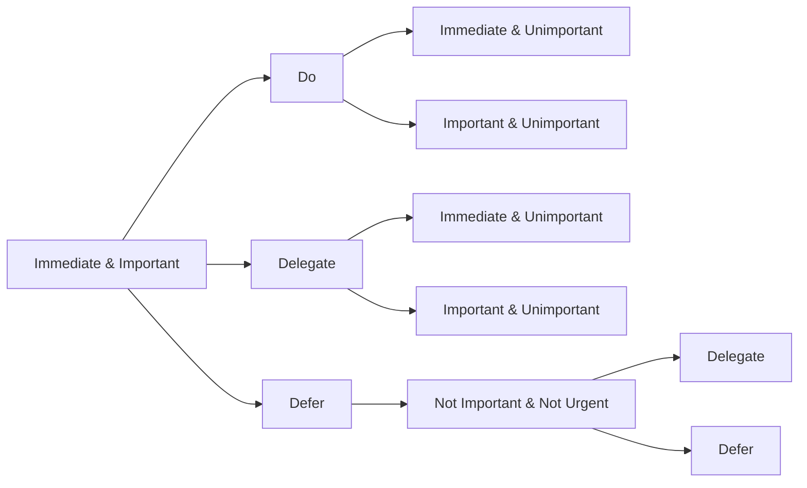
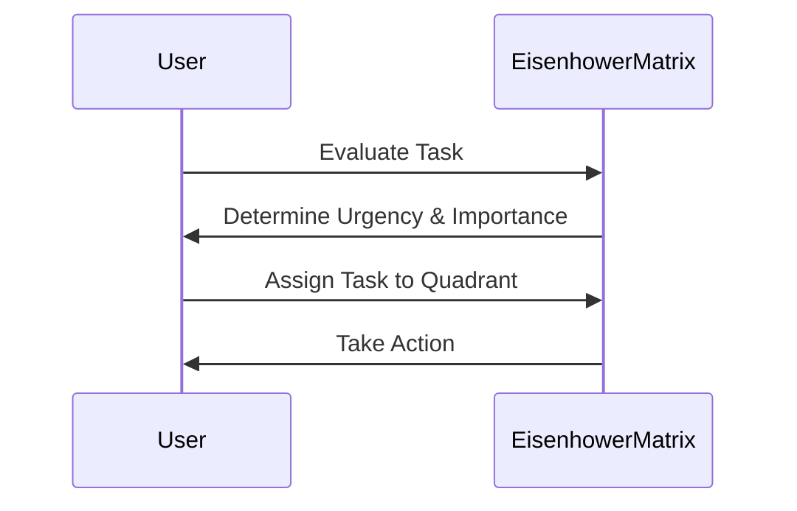
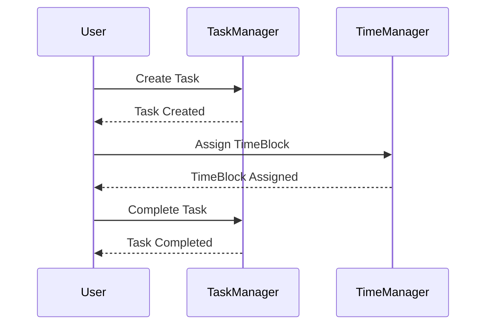
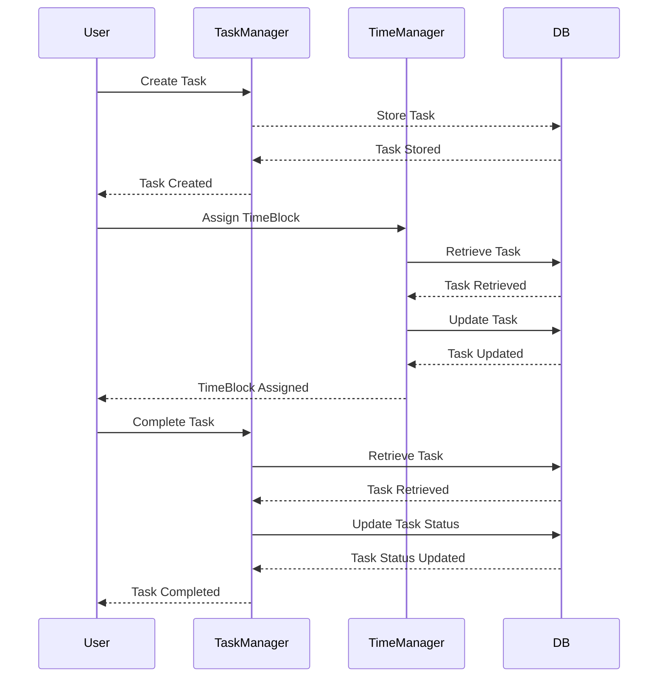

                 

# 技术管理者的时间管理艺术

关键词：技术管理者、时间管理、Eisenhower矩阵、数学模型、系统架构、项目实战

摘要：本文旨在探讨技术管理者的时间管理艺术。随着工作负荷的增加，技术管理者面临着时间管理的挑战。本文将介绍时间管理的重要概念，使用Eisenhower矩阵等算法进行时间管理，并详细阐述数学模型和系统架构设计。通过实际项目实战，我们将提供最佳实践和注意事项，帮助技术管理者提高工作效率。

## 背景介绍

技术管理者在快速变化的技术领域中扮演着关键角色。他们需要同时处理多个项目，协调团队成员，跟踪技术趋势，并进行决策。这种多任务处理带来了时间管理上的巨大挑战。技术管理者常常面临以下问题：

1. 任务优先级难以确定，导致重要任务被拖延。
2. 时间块分配不当，使得工作效率降低。
3. 时间预算不准确，导致项目延期。
4. 缺乏系统化的时间管理方法，导致时间浪费。

为了解决这些问题，技术管理者需要掌握有效的时间管理技巧和方法。

### 核心概念与联系

时间管理是一个广泛的概念，涉及多个核心概念。以下是这些概念的定义及其联系：

#### 优先级

优先级是指任务的重要性程度。高优先级任务通常需要立即处理，而低优先级任务可以暂时搁置。

#### 任务分配

任务分配是指将任务分配给合适的团队成员。合理的任务分配可以提高团队效率。

#### 时间块

时间块是指为特定任务分配的时间段。通过时间块管理，技术管理者可以确保任务在预定时间内完成。

#### 时间预算

时间预算是指为项目或任务分配的时间预算。准确的时间预算可以帮助技术管理者合理安排时间和资源。

以下是这些概念之间的ER实体关系图：

```mermaid
erDiagram
    Task ||--|{ Priority } : "has"
    Task ||--|{ TaskAssignment } : "assigned to"
    Task ||--|{ TimeBlock } : "in"
    Task ||--|{ TimeBudget } : "budgeted"
```

### 算法原理讲解

Eisenhower矩阵是一种简单但非常有效的任务管理工具。它根据任务的紧急性和重要性，将任务分为四个象限。

#### Eisenhower矩阵



#### 流程图



#### Python源代码

```python
def evaluate_task(task):
    urgency = input("Is the task urgent? (yes/no): ")
    importance = input("Is the task important? (yes/no): ")
    
    if urgency == "yes" and importance == "yes":
        return "Do"
    elif urgency == "yes" and importance == "no":
        return "Delegate"
    elif urgency == "no" and importance == "yes":
        return "Defer"
    else:
        return "Delegate"

task = "Meeting with stakeholders"
action = evaluate_task(task)
print(f"The task '{task}' should be {action}.")
```

#### 数学模型

时间管理的一个重要方面是确定任务的最优执行顺序。一个简单的数学模型是使用动态规划算法来确定最小化完成所有任务所需的总时间。

$$
T(i) = \min(T(j) + C(i, j))
$$

其中，$T(i)$ 是任务 $i$ 的完成时间，$C(i, j)$ 是任务 $i$ 和 $j$ 之间的耗时。

### 系统分析与架构设计方案

为了实现时间管理，我们需要设计一个系统来支持任务评估、任务分配和任务跟踪。以下是系统的功能设计和架构设计。

#### 领域模型

```mermaid
classDiagram
    Task <<interface>>
    TaskAssignment <<interface>>
    TimeBlock <<interface>>
    TimeBudget <<interface>>

    User o-- Task
    User o-- TaskAssignment
    User o-- TimeBlock
    User o-- TimeBudget
```

#### 系统架构



#### 系统接口和系统交互



### 项目实战

#### 环境安装

1. 安装Python环境
2. 安装必要的库，如Flask、SQLAlchemy等

#### 系统核心实现

```python
from flask import Flask, request, jsonify
from models import Task, TimeBlock
from database import init_db

app = Flask(__name__)
init_db()

@app.route('/task', methods=['POST'])
def create_task():
    data = request.json
    task = Task(name=data['name'], description=data['description'])
    db.session.add(task)
    db.session.commit()
    return jsonify({'status': 'success', 'task_id': task.id})

@app.route('/time_block', methods=['POST'])
def assign_time_block():
    data = request.json
    time_block = TimeBlock(start=data['start'], end=data['end'], task_id=data['task_id'])
    db.session.add(time_block)
    db.session.commit()
    return jsonify({'status': 'success', 'time_block_id': time_block.id})

@app.route('/task/complete', methods=['POST'])
def complete_task():
    data = request.json
    task = Task.query.get(data['task_id'])
    task.completed = True
    db.session.commit()
    return jsonify({'status': 'success'})

if __name__ == '__main__':
    app.run(debug=True)
```

#### 代码应用解读与分析

上述代码展示了如何使用Flask框架创建一个简单的Web应用来管理任务和时间块。首先，我们定义了`Task`和`TimeBlock`两个模型，然后使用`Flask`来创建Web端点。

#### 实际案例分析和详细讲解剖析

假设我们有以下任务和场景：

- 任务：编写一篇技术博客
- 时间块：2023-04-01 10:00 - 2023-04-01 12:00

1. 创建任务

```json
POST /task
{
  "name": "Write Technical Blog",
  "description": "Write a blog post on time management for tech managers."
}
```

2. 分配时间块

```json
POST /time_block
{
  "start": "2023-04-01 10:00",
  "end": "2023-04-01 12:00",
  "task_id": 1
}
```

3. 完成任务

```json
POST /task/complete
{
  "task_id": 1
}
```

#### 项目小结

通过实际项目实战，我们展示了如何使用Flask框架和数据库来管理任务和时间块。该项目提供了一个基本的架构，可以进一步扩展和优化。

### 最佳实践 tips、小结、注意事项、拓展阅读

**最佳实践 tips：**

1. 定期回顾和调整任务优先级。
2. 使用时间块来规划每天的工作。
3. 准确记录每个任务的耗时。

**小结：**

本文探讨了技术管理者的时间管理艺术，介绍了Eisenhower矩阵等时间管理算法，并详细阐述了数学模型和系统架构设计。通过实际项目实战，我们展示了如何使用Flask框架来管理任务和时间块。

**注意事项：**

1. 确保任务和时间的准确记录。
2. 定期评估和调整任务优先级。

**拓展阅读：**

- 《高效能人士的七个习惯》
- 《Python Web开发实战》
- 《时间管理：如何高效管理时间和任务》

### 作者信息

作者：AI天才研究院/AI Genius Institute & 禅与计算机程序设计艺术 /Zen And The Art of Computer Programming

