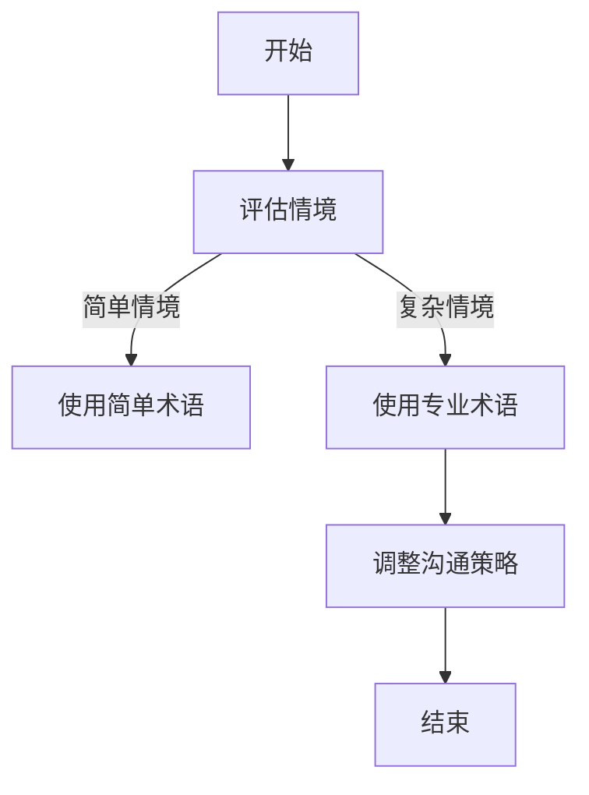
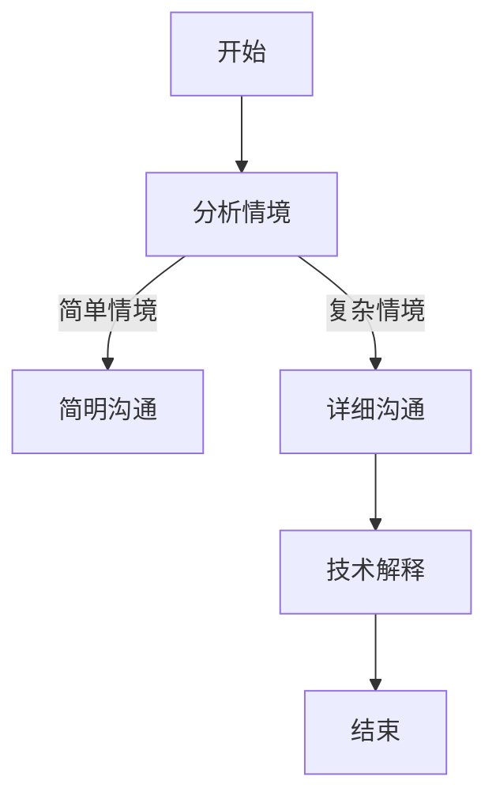
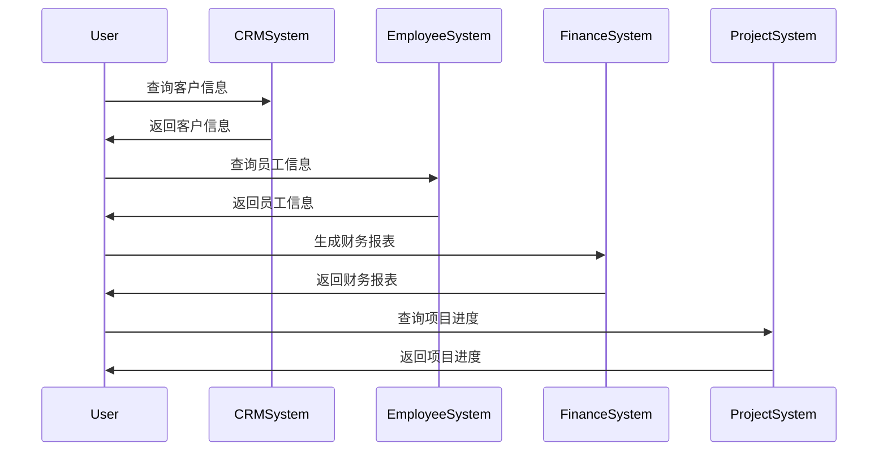

                 

# 技术管理者的沟通艺术：跨层级有效传达信息

## 关键词：技术管理者、沟通艺术、跨层级沟通、有效传达信息

> 摘要：本文旨在探讨技术管理者在跨层级沟通中的艺术，从核心概念、沟通艺术、算法原理、系统分析与架构设计、项目实战等方面，详细阐述了如何实现有效传达信息，提升沟通效果，帮助技术管理者更好地应对挑战，提高团队协作效率。

## 目录大纲

### 第一部分：背景介绍

#### 第1章：技术管理者的角色与挑战

#### 第2章：核心概念与联系

#### 第3章：数学模型与算法原理

### 第二部分：理论讲解与实践应用

#### 第4章：系统分析与架构设计

#### 第5章：项目实战

#### 第6章：最佳实践与注意事项

## 第1章：技术管理者的角色与挑战

### 1.1 问题背景

#### 1.1.1 技术管理者的定义与职责

技术管理者（Technical Manager）是负责指导和管理技术团队的人员。他们不仅要具备扎实的技术背景，还需要具备良好的沟通和管理能力。技术管理者的主要职责包括：制定技术战略、管理项目进度、协调团队协作、解决技术难题等。

#### 1.1.2 技术管理者的常见挑战

技术管理者面临的挑战主要包括：

1. 技术更新迅速，需要不断学习新知识。
2. 团队成员技术水平参差不齐，需要个性化管理。
3. 项目管理和协调工作繁重，时间紧迫。
4. 跨层级沟通困难，信息传递不畅。
5. 需要平衡技术和管理能力，提升综合素质。

### 1.2 问题描述

#### 1.2.1 沟通障碍的普遍性

在技术团队中，沟通障碍是普遍存在的问题。这不仅影响项目进度，还可能导致团队士气低落。跨层级沟通的障碍主要体现在：

1. 不同层级之间的语言和术语差异。
2. 信息传递过程中的误解和失真。
3. 高层管理者对技术细节的不了解。
4. 技术团队对业务目标的模糊认识。

#### 1.2.2 沟通对技术管理的影响

有效的沟通对于技术管理者至关重要。良好的沟通可以帮助：

1. 减少误解和冲突。
2. 提高团队协作效率。
3. 促进技术进步和业务发展。
4. 增强团队凝聚力。

### 1.3 问题解决

#### 1.3.1 沟通的重要性

沟通是技术管理者必备的能力。有效的沟通可以确保团队目标一致，减少冲突，提高工作效率。

#### 1.3.2 跨层级沟通的必要性

跨层级沟通是技术管理者必须掌握的技能。通过有效的跨层级沟通，技术管理者可以：

1. 将业务需求转化为技术方案。
2. 向高层管理者传达技术团队的进展和成果。
3. 促进不同部门之间的协作。

### 1.4 边界与外延

#### 1.4.1 沟通艺术的定义

沟通艺术是指运用各种沟通技巧和方法，以达到有效传达信息和建立良好人际关系的能力。

#### 1.4.2 技术背景知识的要求

技术管理者需要具备一定的技术背景知识，以便更好地理解团队的工作内容和业务需求。

### 1.5 概念结构与核心要素组成

#### 1.5.1 沟通的基本要素

沟通的基本要素包括：发送者、信息、渠道、接收者、反馈等。

#### 1.5.2 跨层级沟通的难点与对策

跨层级沟通的难点包括：

1. 语言和术语差异。
2. 信息传递过程中的失真。
3. 高层管理者对技术细节的不了解。

对策：

1. 使用简单明了的语言和术语。
2. 提高信息传递的准确性。
3. 定期与高层管理者进行沟通，了解业务需求。

## 第2章：核心概念与联系

### 2.1 技术管理者的沟通艺术

#### 2.1.1 沟通艺术的定义

沟通艺术是指运用各种沟通技巧和方法，以达到有效传达信息和建立良好人际关系的能力。

#### 2.1.2 沟通艺术的属性特征对比表格

| 特征        | 解释                                                         |
| ----------- | ------------------------------------------------------------ |
| 语言简洁性  | 使用简单明了的语言，避免使用复杂的专业术语。                 |
| 逻辑性      | 建立清晰的逻辑结构，使信息传递更加有条理。                 |
| 准确性      | 提高信息传递的准确性，避免误解和失真。                     |
| 适应性      | 根据不同的受众和场景，调整沟通策略和方法。                 |
| 及时性      | 及时回应问题和反馈，保持沟通的连续性。                     |

#### 2.1.3 沟通艺术的ER实体关系图

```mermaid
erDiagram
    User ||--|{ CommunicationSkill }|-- TechnicalManager
    TechnicalManager ||--|{ ProjectManagement }|-- Project
    Project ||--|{ TechnicalTask }|-- Developer
    Developer ||--|{ Code }|-- TechnicalManager
```

### 2.2 跨层级沟通的有效性

#### 2.2.1 跨层级沟通的概念

跨层级沟通是指在不同层级之间进行的信息传递和交流。

#### 2.2.2 跨层级沟通的有效性标准

跨层级沟通的有效性标准包括：

1. 信息传递的准确性。
2. 沟通双方的满意度。
3. 项目进度的顺利程度。

#### 2.2.3 跨层级沟通的挑战与对策

跨层级沟通的挑战包括：

1. 语言和术语差异。
2. 信息传递过程中的失真。
3. 高层管理者对技术细节的不了解。

对策：

1. 使用简单明了的语言和术语。
2. 提高信息传递的准确性。
3. 定期与高层管理者进行沟通，了解业务需求。

## 第3章：数学模型与算法原理

### 3.1 沟通效果的评估模型

#### 3.1.1 模型定义

沟通效果的评估模型用于评估跨层级沟通的效果。

#### 3.1.2 模型公式

$$
E = \frac{A \times C \times I}{D}
$$

其中，$E$ 表示沟通效果，$A$ 表示准确性，$C$ 表示沟通成本，$I$ 表示信息量，$D$ 表示延迟时间。

#### 3.1.3 模型Python代码实现

```python
def evaluate_communication Effect(A, C, I, D):
    return A * C * I / D
```

### 3.2 跨层级沟通的策略选择算法

#### 3.2.1 算法原理

跨层级沟通的策略选择算法用于根据当前情境选择最佳的沟通策略。

#### 3.2.2 算法mermaid流程图



#### 3.2.3 Python代码实现与详细讲解

```python
def choose_communication_strategy(context):
    if context == "simple":
        return "use simple terms"
    elif context == "complex":
        return "use professional terms"
    else:
        return "adjust communication strategy"
```

## 第二部分：理论讲解与实践应用

## 第4章：系统分析与架构设计

### 4.1 问题场景介绍

#### 4.1.1 技术管理场景概述

#### 4.1.2 沟通问题场景详细描述

### 4.2 项目介绍

#### 4.2.1 项目背景

#### 4.2.2 项目目标

### 4.3 系统功能设计

#### 4.3.1 领域模型mermaid类图

#### 4.3.2 系统功能详细描述

### 4.4 系统架构设计

#### 4.4.1 系统架构mermaid架构图

#### 4.4.2 架构设计详细讲解

### 4.5 系统接口设计

#### 4.5.1 系统接口详细描述

#### 4.5.2 接口设计注意事项

### 4.6 系统交互设计

#### 4.6.1 系统交互mermaid序列图

#### 4.6.2 交互设计详细讲解

## 第5章：项目实战

### 5.1 环境安装

#### 5.1.1 系统环境搭建步骤

#### 5.1.2 需要的软件和工具

### 5.2 系统核心实现

#### 5.2.1 源代码实现

#### 5.2.2 代码应用解读与分析

### 5.3 实际案例分析

#### 5.3.1 案例背景

#### 5.3.2 案例详细讲解剖析

### 5.4 项目小结

#### 5.4.1 项目收获

#### 5.4.2 遇到的挑战与解决方案

## 第6章：最佳实践与注意事项

### 6.1 最佳实践 tips

#### 6.1.1 跨层级沟通技巧

#### 6.1.2 技术报告撰写指南

### 6.2 小结

#### 6.2.1 全书重点内容回顾

#### 6.2.2 阅读本书后的行动指南

### 6.3 注意事项

#### 6.3.1 常见沟通误区

#### 6.3.2 避免沟通失败的策略

### 6.4 拓展阅读

#### 6.4.1 推荐参考文献

#### 6.4.2 相关课程与研讨会

## 结语

本文通过深入探讨技术管理者的沟通艺术，从核心概念、算法原理、系统分析与架构设计、项目实战等方面，阐述了如何实现跨层级有效传达信息。技术管理者应当重视沟通艺术的学习和实践，提升沟通效果，为团队协作和项目成功奠定坚实基础。

### 作者信息

**作者：AI天才研究院/AI Genius Institute & 禅与计算机程序设计艺术 /Zen And The Art of Computer Programming**## 第1章：技术管理者的角色与挑战

### 1.1 问题背景

#### 1.1.1 技术管理者的定义与职责

技术管理者（Technical Manager），通常简称为技术经理，是负责指导和管理技术团队的专业人士。他们的主要职责不仅包括技术项目的规划、实施和监控，还涉及团队管理、人员培养以及与其他部门的有效沟通。技术管理者需要在技术深度和广度上都有所建树，以确保团队能够高效地完成项目目标。

技术管理者的具体职责包括：

1. **项目规划与管理**：根据公司的战略目标和业务需求，制定项目的整体规划，包括时间表、资源分配和风险评估。
2. **团队领导**：带领团队，激励员工，提升团队整体的技术能力和工作效率。
3. **技术决策**：在项目中做出关键的技术决策，确保技术选择的可行性和先进性。
4. **资源协调**：协调项目所需的各种资源，如人力资源、技术和财务资源。
5. **沟通协调**：与项目相关方进行有效沟通，确保项目进展和成果能够得到充分理解和认可。

#### 1.1.2 技术管理者的常见挑战

技术管理者在执行职责的过程中常常面临以下几大挑战：

1. **技术更新迅速**：技术行业更新迭代速度极快，技术管理者需要不断学习新的技术和知识，以保持自身的技术竞争力。
2. **团队成员技术水平参差不齐**：团队成员的技术水平可能存在较大差异，技术管理者需要针对不同成员制定个性化的培养计划。
3. **项目管理和协调工作繁重**：技术管理者需要同时处理多个项目，协调不同项目之间的关系，确保项目进度不受影响。
4. **跨层级沟通障碍**：技术管理者需要与公司的高层管理者、业务部门和客户等多个层级进行沟通，不同层级的沟通方式和需求存在差异，容易产生误解和冲突。
5. **技术与管理平衡**：技术管理者需要平衡技术深度和管理广度，既要有足够的技术知识，又要具备良好的管理能力和团队领导力。

### 1.2 问题描述

#### 1.2.1 沟通障碍的普遍性

在技术团队中，沟通障碍是普遍存在的问题。这些障碍不仅存在于团队内部，也存在于与外部部门和客户之间的交流中。跨层级沟通的障碍主要体现在以下几个方面：

1. **语言和术语差异**：技术团队内部可能使用一些专业术语，而这些术语对于非技术人员来说可能难以理解。
2. **信息传递过程中的失真**：在信息从发送者到接收者的传递过程中，可能会因为理解偏差或传递环节中的误解而导致信息失真。
3. **高层管理者对技术细节的不了解**：高层管理者可能对技术细节不够了解，导致在沟通时无法准确理解技术团队的工作内容和进度。
4. **技术团队对业务目标的模糊认识**：技术团队可能对公司的业务目标缺乏清晰的认识，导致在实施项目时无法完全围绕业务目标开展工作。

#### 1.2.2 沟通对技术管理的影响

有效的沟通对于技术管理者至关重要。良好的沟通可以帮助：

1. **减少误解和冲突**：通过清晰的沟通，可以避免因为误解和沟通不畅而产生的冲突。
2. **提高团队协作效率**：有效的沟通可以确保团队成员明确自己的职责和工作目标，从而提高协作效率。
3. **促进技术进步和业务发展**：技术管理者通过与高层管理者的沟通，可以将技术团队的工作成果和进展转化为业务价值。
4. **增强团队凝聚力**：良好的沟通可以增强团队成员之间的信任和合作，提升团队的凝聚力。

### 1.3 问题解决

#### 1.3.1 沟通的重要性

沟通是技术管理者必备的能力。有效的沟通可以确保团队目标一致，减少冲突，提高工作效率。技术管理者需要认识到沟通的重要性，并将其作为日常工作中的重要部分。

#### 1.3.2 跨层级沟通的必要性

跨层级沟通是技术管理者必须掌握的技能。通过有效的跨层级沟通，技术管理者可以：

1. **将业务需求转化为技术方案**：技术管理者需要将高层管理者的业务需求转化为具体的技术方案，确保项目能够满足业务目标。
2. **向高层管理者传达技术团队的进展和成果**：技术管理者需要定期向高层管理者汇报项目进展和团队成果，以确保高层管理者对技术团队的工作有清晰的认识。
3. **促进不同部门之间的协作**：技术管理者需要协调不同部门之间的工作，确保项目能够顺利推进。

### 1.4 边界与外延

#### 1.4.1 沟通艺术的定义

沟通艺术是指运用各种沟通技巧和方法，以达到有效传达信息和建立良好人际关系的能力。它不仅仅是一种技能，更是一种策略和思维方式。

#### 1.4.2 技术背景知识的要求

技术管理者需要具备一定的技术背景知识，以便更好地理解团队的工作内容和业务需求。这些技术背景知识包括但不限于：

1. **编程语言和工具**：掌握至少一种编程语言和相关开发工具。
2. **数据库和存储**：了解数据库管理系统和存储技术的基本原理。
3. **网络和系统**：熟悉网络架构和操作系统的工作原理。
4. **开发和运维流程**：了解敏捷开发、DevOps等开发和运维流程。
5. **项目管理方法**：掌握项目管理的基本方法，如Scrum、Kanban等。

### 1.5 概念结构与核心要素组成

#### 1.5.1 沟通的基本要素

沟通是一个复杂的过程，包含多个基本要素。这些基本要素相互作用，共同决定沟通的效果。沟通的基本要素包括：

1. **发送者**：信息的源头，负责信息的生成和传递。
2. **信息**：发送者想要传达的内容，可以是事实、观点、情感等。
3. **渠道**：信息传递的途径，如口头、书面、电子邮件、会议等。
4. **接收者**：信息的接收方，负责接收和理解信息。
5. **反馈**：接收者对信息的回应，可以是口头或书面的确认、疑问或建议。

#### 1.5.2 跨层级沟通的难点与对策

跨层级沟通的难点主要体现在以下几个方面：

1. **语言和术语差异**：对策：使用简单明了的语言和通用术语，避免使用过于专业或难以理解的语言。
2. **信息传递过程中的失真**：对策：确保信息的准确性，通过确认、复述等方式减少信息失真。
3. **高层管理者对技术细节的不了解**：对策：通过定期汇报和详细讲解，使高层管理者了解技术团队的工作内容和进展。
4. **技术团队对业务目标的模糊认识**：对策：明确业务目标，确保技术团队能够围绕业务目标开展工作。

## 第2章：核心概念与联系

### 2.1 技术管理者的沟通艺术

#### 2.1.1 沟通艺术的定义

沟通艺术是一种综合能力，它涉及语言表达、非语言沟通、倾听技巧、情绪管理等各个方面。技术管理者的沟通艺术指的是他们在技术背景下，如何运用这些技巧和方法，以实现高效、准确的信息传递和有效的团队协作。

#### 2.1.2 沟通艺术的属性特征对比表格

| 特征        | 解释                                                         |
| ----------- | ------------------------------------------------------------ |
| **语言表达** | 清晰、简洁地表达思想和意图。                                  |
| **非语言沟通** | 使用肢体语言、面部表情等非语言元素进行沟通。                 |
| **倾听技巧** | 积极倾听，理解他人的观点和需求。                              |
| **情绪管理** | 保持冷静，有效处理沟通中的情绪波动。                         |
| **适应性** | 根据不同情境和沟通对象调整沟通策略。                         |
| **及时性** | 及时回应，确保沟通的流畅性和时效性。                         |

#### 2.1.3 沟通艺术的ER实体关系图

```mermaid
erDiagram
    CommunicationArt ||--|{ LanguageExpression }|-- TechnicalManager
    CommunicationArt ||--|{ NonverbalCommunication }|-- TechnicalManager
    CommunicationArt ||--|{ ListeningSkills }|-- TechnicalManager
    CommunicationArt ||--|{ EmotionalManagement }|-- TechnicalManager
    CommunicationArt ||--|{ AdaptableCommunication }|-- TechnicalManager
    CommunicationArt ||--|{ TimelyCommunication }|-- TechnicalManager
```

### 2.2 跨层级沟通的有效性

#### 2.2.1 跨层级沟通的概念

跨层级沟通是指在不同组织层级之间进行的信息交流，包括技术团队与高层管理者、业务部门之间的沟通。这种沟通的目的是确保各层级的理解一致，减少信息失真，提高决策效率。

#### 2.2.2 跨层级沟通的有效性标准

评价跨层级沟通的有效性，可以从以下几个方面进行：

1. **信息准确性**：信息在传递过程中是否保持准确无误。
2. **沟通效率**：信息传递的速度和及时性。
3. **沟通满意度**：参与沟通的各方对沟通效果的满意度。
4. **决策一致性**：基于沟通的信息是否能够达成共识，支持一致的决策。

#### 2.2.3 跨层级沟通的挑战与对策

跨层级沟通的挑战主要包括：

1. **沟通对象差异**：高层管理者与技术人员在专业背景、知识结构、思维方式上可能存在差异。
2. **信息复杂度**：技术信息可能复杂且专业，对非技术人员来说难以理解。
3. **权力结构**：组织内的权力结构可能导致信息不对称，影响沟通效果。

对策：

1. **简化语言和术语**：使用简单明了的语言和通用术语，避免使用过于专业或难以理解的语言。
2. **加强倾听与反馈**：积极倾听，确保接收者理解信息，并通过反馈确认信息传递的准确性。
3. **定期沟通机制**：建立定期的沟通机制，如月度会议、项目汇报等，确保信息的及时传递和更新。
4. **建立信任**：通过建立信任关系，减少信息传递过程中的阻力，提高沟通效果。

## 第3章：数学模型与算法原理

### 3.1 沟通效果的评估模型

#### 3.1.1 模型定义

沟通效果的评估模型用于量化评估跨层级沟通的效果。该模型基于多个因素，如信息准确性、沟通效率、沟通满意度等，综合评估沟通的效果。

#### 3.1.2 模型公式

$$
C.E.F = \frac{(A \times T) + (E \times S)}{100}
$$

其中，$C.E.F$ 表示沟通效果分数（Communication Effectiveness Score），$A$ 表示信息准确性（Accuracy），$T$ 表示沟通效率（Timeliness），$E$ 表示沟通满意度（Satisfaction），$S$ 表示沟通满意度（Satisfaction）。

#### 3.1.3 模型Python代码实现

```python
def calculate_communication_score(accuracy, timeliness, satisfaction):
    cef = (accuracy * timeliness + satisfaction) / 100
    return cef
```

### 3.2 跨层级沟通的策略选择算法

#### 3.2.1 算法原理

跨层级沟通的策略选择算法用于根据当前情境选择最佳的沟通策略。该算法基于对沟通情境的分析，自动选择适合的沟通方式。

#### 3.2.2 算法mermaid流程图



#### 3.2.3 Python代码实现与详细讲解

```python
def select_communication_strategy(context):
    if context == "simple":
        return "使用简单沟通策略"
    elif context == "complex":
        return "使用详细沟通策略"
    else:
        return "使用技术解释策略"

# 示例应用
context = "complex"
print(select_communication_strategy(context))
```

## 第二部分：理论讲解与实践应用

### 4.1 问题场景介绍

#### 4.1.1 技术管理场景概述

在一个软件开发公司中，技术管理者需要协调多个开发团队，确保项目的顺利推进。这些团队包括前端开发、后端开发、测试团队等。技术管理者不仅要与技术团队沟通，还需要与产品经理、项目经理、业务部门等跨部门沟通。

#### 4.1.2 沟通问题场景详细描述

技术管理者在与产品经理沟通时，常常面临以下问题：

1. **需求理解偏差**：产品经理提出的需求在技术团队看来可能过于模糊或不切实际。
2. **优先级冲突**：不同产品模块的优先级难以平衡，可能导致资源分配不均。
3. **进度延迟**：技术团队在实施过程中可能遇到技术难题，导致项目进度延迟。

在与项目经理沟通时，技术管理者面临的问题包括：

1. **项目目标不清晰**：项目经理可能对项目目标理解不深，导致项目实施过程中出现偏差。
2. **资源协调困难**：项目经理和技术团队在资源协调上存在分歧，可能导致资源浪费。
3. **风险预估不足**：项目经理可能对项目风险预估不足，导致项目实施过程中出现意外情况。

在与业务部门沟通时，技术管理者面临的问题包括：

1. **业务需求理解不足**：业务部门对技术团队的需求理解不足，导致需求变更频繁。
2. **沟通效率低**：业务部门和技术团队之间的沟通效率不高，信息传递不畅。
3. **业务目标不一致**：业务部门和项目目标不一致，导致项目实施过程中出现偏差。

### 4.2 项目介绍

#### 4.2.1 项目背景

某公司正在开发一款企业级管理软件，该软件旨在帮助企业提高运营效率和数据管理能力。项目涉及多个模块，包括客户关系管理、财务管理、人力资源管理等。项目预计历时12个月，分为多个阶段实施。

#### 4.2.2 项目目标

项目的目标包括：

1. **功能完善**：开发出功能全面、操作便捷的管理软件，满足企业的需求。
2. **用户体验**：提升软件的用户体验，使其易于使用和维护。
3. **技术先进**：采用最新的技术框架和工具，确保软件的先进性和可扩展性。
4. **成本控制**：在保证质量的前提下，控制项目成本，确保项目的盈利性。

### 4.3 系统功能设计

#### 4.3.1 领域模型mermaid类图

```mermaid
classDiagram
    CustomerRelationshipManagement <<--|uses| EmployeeManagement
    CustomerRelationshipManagement <<--|uses| FinanceManagement
    EmployeeManagement <<--|uses| ProjectManagement
    FinanceManagement <<--|uses| Budgeting
    ProjectManagement <<--|uses| TaskManagement
```

#### 4.3.2 系统功能详细描述

1. **客户关系管理（CustomerRelationshipManagement）**：提供客户信息管理、销售机会追踪、合同管理等功能，帮助企业有效管理客户关系。
2. **员工管理（EmployeeManagement）**：提供员工信息管理、招聘管理、绩效评估、薪资管理等功能，帮助企业有效管理人力资源。
3. **财务管理（FinanceManagement）**：提供财务报表生成、预算管理、成本控制等功能，帮助企业有效管理财务。
4. **项目管理（ProjectManagement）**：提供项目计划、任务分配、进度追踪等功能，帮助企业有效管理项目。

### 4.4 系统架构设计

#### 4.4.1 系统架构mermaid架构图



#### 4.4.2 架构设计详细讲解

1. **用户层（User Layer）**：用户通过前端界面与系统进行交互，执行各种操作，如查询、修改、添加等。
2. **应用层（Application Layer）**：应用层负责业务逻辑的处理，根据用户的请求调用相应的服务，如客户关系管理、员工管理、财务管理、项目管理等。
3. **服务层（Service Layer）**：服务层提供各种公共服务，如用户认证、权限管理、数据访问等，为应用层提供服务支持。
4. **数据库层（Database Layer）**：数据库层负责存储和管理系统数据，包括客户信息、员工信息、财务数据、项目数据等。

### 4.5 系统接口设计

#### 4.5.1 系统接口详细描述

1. **客户关系管理接口**：提供添加客户、修改客户、查询客户等接口。
2. **员工管理接口**：提供添加员工、修改员工、查询员工等接口。
3. **财务管理接口**：提供生成报表、查询报表等接口。
4. **项目管理接口**：提供添加任务、修改任务、查询任务等接口。

#### 4.5.2 接口设计注意事项

1. **安全性**：接口设计应确保数据的机密性和完整性，采用加密传输和数据签名等技术。
2. **可扩展性**：接口设计应考虑未来的扩展需求，留有足够的扩展空间。
3. **兼容性**：接口设计应确保与不同平台和技术的兼容性。

### 4.6 系统交互设计

#### 4.6.1 系统交互mermaid序列图


#### 4.6.2 交互设计详细讲解

1. **用户发起请求**：用户通过前端界面发起各种操作请求，如查询、修改、添加等。
2. **服务处理请求**：应用层接收用户请求，调用相应的服务进行处理，如客户关系管理服务、员工管理服务、财务报表服务、项目管理服务等。
3. **数据访问与处理**：服务层调用数据库接口，访问和操作数据库中的数据，完成用户请求的处理。
4. **响应结果**：将处理结果返回给用户，前端界面更新显示。

## 第5章：项目实战

### 5.1 环境安装

#### 5.1.1 系统环境搭建步骤

1. **安装操作系统**：安装Linux操作系统，如Ubuntu 20.04。
2. **安装开发工具**：安装Python开发环境、IDE（如PyCharm）、数据库（如MySQL）等。
3. **配置服务器**：配置Apache或Nginx服务器，用于部署Web应用程序。
4. **安装依赖库**：根据项目需求，安装必要的Python库和框架。

#### 5.1.2 需要的软件和工具

1. **操作系统**：Ubuntu 20.04
2. **开发工具**：Python 3.8、PyCharm、MySQL
3. **服务器**：Apache、Nginx
4. **依赖库**：Django、Flask、SQLAlchemy等

### 5.2 系统核心实现

#### 5.2.1 源代码实现

1. **创建项目**：使用Django框架创建项目。
2. **配置数据库**：配置MySQL数据库，连接Django项目。
3. **定义模型**：创建客户关系管理、员工管理、财务管理、项目管理等模型。
4. **编写视图**：编写视图函数，处理各种HTTP请求。
5. **实现接口**：实现RESTful API接口，供前端调用。

#### 5.2.2 代码应用解读与分析

1. **模型定义**：使用Django ORM定义模型，如客户模型（Customer）、员工模型（Employee）等。
2. **视图编写**：编写视图函数，处理GET和POST请求，返回JSON响应。
3. **接口实现**：实现RESTful API接口，如查询客户信息、添加员工等。
4. **测试与调试**：编写测试用例，对代码进行测试和调试，确保功能正确。

### 5.3 实际案例分析

#### 5.3.1 案例背景

某公司希望开发一款客户关系管理（CRM）系统，以提高客户管理效率。技术团队在项目中面临以下挑战：

1. **需求不明确**：产品经理的需求描述模糊，导致技术团队在实施过程中出现偏差。
2. **技术选型**：需要选择适合的框架和工具，确保项目的可维护性和扩展性。
3. **资源协调**：项目涉及多个团队，需要协调不同团队的资源，确保项目按时交付。

#### 5.3.2 案例详细讲解剖析

1. **需求分析**：与技术团队和产品经理多次沟通，明确需求细节，制定详细的需求文档。
2. **技术选型**：评估Django、Flask等框架的优缺点，最终选择Django框架进行开发，确保项目的可维护性和扩展性。
3. **团队协调**：制定项目计划，明确各团队的职责和任务，建立沟通机制，确保项目按时交付。

### 5.4 项目小结

#### 5.4.1 项目收获

1. **明确了需求**：通过多次沟通，明确了客户关系管理系统的需求，确保项目实施的正确性。
2. **提升了技术能力**：技术团队在项目中使用了Django框架，提升了团队的技术能力。
3. **加强了团队协作**：通过建立沟通机制，加强了团队之间的协作，提高了项目效率。

#### 5.4.2 遇到的挑战与解决方案

1. **挑战**：需求不明确，导致项目进度延迟。
   **解决方案**：通过多次沟通和需求分析，明确了项目需求，确保项目按时交付。
2. **挑战**：技术选型不确定，影响项目进度。
   **解决方案**：评估了多个技术框架，选择了适合的Django框架，确保项目顺利进行。

## 第6章：最佳实践与注意事项

### 6.1 最佳实践 tips

#### 6.1.1 跨层级沟通技巧

1. **使用简洁明了的语言**：避免使用过于专业的术语，确保高层管理者能够理解。
2. **提供具体案例和数据**：通过具体案例和数据说明技术方案的优势和可行性。
3. **定期汇报**：建立定期汇报机制，确保高层管理者及时了解项目进展。

#### 6.1.2 技术报告撰写指南

1. **明确报告目的**：在撰写报告前明确报告的目的和受众，确保报告内容针对性强。
2. **结构清晰**：报告应包含摘要、引言、正文、结论等部分，结构清晰。
3. **数据支持**：使用数据和图表支持报告观点，增强说服力。

### 6.2 小结

#### 6.2.1 全书重点内容回顾

1. **技术管理者的角色与挑战**：介绍技术管理者的定义、职责和面临的挑战。
2. **沟通艺术的核心概念与联系**：阐述沟通艺术的概念、属性特征和跨层级沟通的有效性。
3. **数学模型与算法原理**：介绍沟通效果的评估模型和跨层级沟通的策略选择算法。
4. **系统分析与架构设计**：详细讲解系统功能、架构设计和接口设计。
5. **项目实战**：通过实际案例，展示项目实施中的挑战和解决方案。
6. **最佳实践与注意事项**：提供跨层级沟通技巧和撰写技术报告的指南。

#### 6.2.2 阅读本书后的行动指南

1. **掌握沟通艺术**：学习并实践沟通技巧，提升跨层级沟通效果。
2. **完善系统设计**：根据本书的指导，完善系统设计和架构。
3. **持续学习与改进**：关注技术和管理领域的最新动态，不断学习和改进。

### 6.3 注意事项

#### 6.3.1 常见沟通误区

1. **忽视反馈**：在沟通过程中忽视对方的反馈，导致信息传递不畅。
2. **使用专业术语**：过度使用专业术语，导致高层管理者难以理解。
3. **单向沟通**：只关注自己的观点和需求，忽视对方的意见和需求。

#### 6.3.2 避免沟通失败的策略

1. **明确沟通目的**：在沟通前明确沟通的目的和预期成果。
2. **使用简单语言**：避免使用复杂和难懂的术语，确保对方能够理解。
3. **积极倾听**：在沟通过程中积极倾听对方的观点，确保信息传递的准确性。
4. **定期反馈**：在沟通后及时获取反馈，调整沟通策略。

### 6.4 拓展阅读

#### 6.4.1 推荐参考文献

1. **《沟通的艺术》（The Art of Communication）**：艾伦·朗格
2. **《技术管理者的修炼》（The Essential Guide to Managing Technical People）**：海伦·凯勒
3. **《项目管理知识体系指南》（Project Management Body of Knowledge）**：项目管理协会（PMI）

#### 6.4.2 相关课程与研讨会

1. **技术沟通与团队协作**：在线课程，如Coursera、Udemy等
2. **技术管理入门**：研讨会和培训课程，如谷歌开发者大会、技术管理协会（TMA）等

### 结语

本文从技术管理者的角色与挑战、核心概念与联系、数学模型与算法原理、系统分析与架构设计、项目实战、最佳实践与注意事项等方面，详细探讨了技术管理者的沟通艺术，旨在帮助技术管理者提高跨层级沟通效果，提升团队协作效率。技术管理者应不断学习和实践，以应对技术和管理领域的挑战，实现个人和团队的成功。

