                 

### 文章标题

# 技术管理者的职业倦怠：预防与应对策略

在技术飞速发展的时代，技术管理者扮演着至关重要的角色。他们不仅要具备深厚的专业技术知识，还要承担起团队的管理和决策职责。然而，随着工作压力的增加和责任的重担，技术管理者也面临着职业倦怠的困扰。本文将深入探讨技术管理者职业倦怠的背景、核心概念、影响因素、预防与应对策略，并通过系统分析与架构设计，提供切实可行的解决方案。希望通过本文，能够帮助技术管理者更好地预防和应对职业倦怠，提升个人效能，保持职业激情。

### 关键词

- 技术管理者
- 职业倦怠
- 预防策略
- 应对策略
- 算法原理
- 系统设计与实现
- 实战案例分析

### 摘要

本文首先介绍了技术管理者职业倦怠的背景和核心概念，探讨了职业倦怠的特殊性、影响因素以及与压力、应对机制的关系。接着，文章从算法原理角度出发，详细讲解了预防职业倦怠的工作生活平衡算法、应对职业倦怠的心理调适算法和个人发展算法，并辅以Mermaid流程图和Python源代码进行解释。随后，文章通过系统分析与架构设计方案，展示了职业倦怠预防与应对系统的设计思路和实现细节。最后，文章通过实际项目实战、最佳实践与拓展，为技术管理者提供了一套行之有效的职业倦怠预防和应对策略，并对其未来发展趋势进行了展望。

### 目录大纲

# 技术管理者的职业倦怠：预防与应对策略

> 关键词：技术管理者、职业倦怠、预防策略、应对策略、算法原理、系统设计与实现、实战案例分析

> 摘要：本文旨在探讨技术管理者职业倦怠的背景、核心概念、影响因素、预防与应对策略，并通过系统分析与架构设计，提供切实可行的解决方案。

## 第一部分：问题背景与核心概念

## 第1章：技术管理者的职业倦怠概述
### 1.1 职业倦怠的概念与特征
### 1.2 技术管理者职业倦怠的特殊性
### 1.3 职业倦怠的影响因素
### 1.4 职业倦怠的预防和应对

## 第2章：技术管理者职业倦怠的核心概念与联系
### 2.1 压力与职业倦怠的关系
### 2.2 应对机制与职业倦怠的关系
### 2.3 内部因素与外部因素
### 2.4 概念属性特征对比表格

## 第二部分：算法原理讲解

## 第3章：预防职业倦怠的算法原理
### 3.1 压力管理算法原理
### 3.2 工作生活平衡算法原理
### 3.3 应对机制算法原理
### 3.4 算法原理Mermaid流程图

## 第4章：应对职业倦怠的算法原理
### 4.1 支持性干预算法原理
### 4.2 心理调适算法原理
### 4.3 个人发展算法原理
### 4.4 算法原理Mermaid流程图

## 第三部分：系统分析与架构设计方案

## 第5章：职业倦怠预防与应对系统的设计与实现
### 5.1 项目介绍
### 5.2 系统功能设计（领域模型Mermaid类图）
### 5.3 系统架构设计（Mermaid架构图）
### 5.4 系统接口设计
### 5.5 系统交互（Mermaid序列图）

## 第四部分：项目实战

## 第6章：职业倦怠预防与应对项目实战
### 6.1 环境安装
### 6.2 系统核心实现源代码
### 6.3 代码应用解读与分析
### 6.4 实际案例分析和详细讲解剖析
### 6.5 项目小结

## 第五部分：最佳实践与拓展

## 第7章：职业倦怠预防与应对的最佳实践
### 7.1 实践案例分享
### 7.2 小结与注意事项
### 7.3 拓展阅读建议

## 第8章：未来展望与挑战
### 8.1 职业倦怠问题的未来趋势
### 8.2 技术与管理结合的新方向
### 8.3 挑战与应对策略
### 8.4 总结与展望

---

本文将围绕上述目录结构展开，逐步深入探讨技术管理者职业倦怠的问题，并提出相应的预防与应对策略。希望通过对这些内容的详细讲解，能够帮助技术管理者更好地认识职业倦怠，掌握应对方法，提升工作效率和生活质量。

## 第1章：技术管理者的职业倦怠概述

### 1.1 职业倦怠的概念与特征

职业倦怠是一种心理状态，通常表现为对工作失去兴趣、情感疲劳、工作效率降低以及对工作产生消极情绪。根据国际劳工组织（ILO）的定义，职业倦怠是指由于长期的工作压力和疲劳，导致个体在情感、认知和行为方面出现的一系列负面反应。具体来说，职业倦怠包括三个核心特征：

1. **情感耗竭（Emotional Exhaustion）**：指个体在工作过程中感受到的情感疲劳和能量耗尽。这种情感耗竭会导致个体对工作和人际关系失去兴趣，出现消极情绪。
2. **去人格化（Depersonalization）**：指个体在工作过程中表现出冷漠、疏离和缺乏同情心。这种去人格化现象通常是由于长期工作压力导致的心理防御机制，个体试图通过减少与他人的情感联系来保护自己。
3. **个人成就感降低（Reduced Personal Accomplishment）**：指个体在工作过程中感受到的成就感下降，认为自己无法完成工作或对工作的意义产生怀疑。

职业倦怠不仅对个体的心理健康产生负面影响，还可能影响工作效率、团队协作以及组织文化。因此，识别和理解职业倦怠的特征对于预防和应对这一现象至关重要。

### 1.2 技术管理者职业倦怠的特殊性

技术管理者在职业倦怠方面有其独特的特征，这主要源于他们的工作性质和职责。技术管理者通常需要承担以下几方面的压力：

1. **技术知识要求高**：技术管理者不仅需要具备深厚的专业技术背景，还需要对最新技术动态保持敏感，不断学习和更新知识。这种高知识要求带来的是持续的学习压力和自我提升的紧迫感。
2. **管理职责重**：技术管理者不仅要承担技术职责，还要负责团队的管理和协调。他们需要处理复杂的团队关系，解决团队内部冲突，并确保项目按时交付。这种多重职责往往会导致工作压力的增加。
3. **快速变化的技术环境**：技术行业变化迅速，技术管理者需要迅速适应新技术、新工具和新流程。这种快速变化带来的不确定性增加了技术管理者的工作难度和压力。

这些特殊的工作特征使得技术管理者更容易出现职业倦怠。例如，技术知识的高要求可能导致持续的学习压力，而管理职责的重则容易导致情感耗竭。快速变化的技术环境则可能引发去人格化现象，技术管理者为了应对变化而减少与团队成员的情感联系。

### 1.3 职业倦怠的影响因素

职业倦怠的产生并非单一因素所致，而是多种因素共同作用的结果。对于技术管理者而言，以下几个因素尤其重要：

1. **工作压力**：工作压力是职业倦怠的主要原因之一。技术管理者面临的项目期限紧张、任务繁重、技术复杂度高等问题，都可能导致工作压力的增加。长期的工作压力会引发情感耗竭和去人格化现象。
2. **工作与生活平衡**：工作与生活平衡是预防职业倦怠的关键。技术管理者往往因为工作繁忙而忽视了个人生活，导致生活压力增加，进而影响心理健康。因此，保持工作与生活的平衡对预防职业倦怠至关重要。
3. **团队支持**：团队支持包括同事的鼓励、上级的信任和支持、组织的文化等。缺乏团队支持可能导致技术管理者感到孤立和无力，从而增加职业倦怠的风险。
4. **个人因素**：个人的性格、应对机制、心理韧性等也会影响职业倦怠的发生。例如，容易焦虑和抑郁的人可能在面对工作压力时更容易感到倦怠。

理解这些影响因素有助于技术管理者更好地识别职业倦怠的早期信号，并采取相应的预防措施。

### 1.4 职业倦怠的预防和应对

预防职业倦怠需要从多个方面入手，包括工作环境的改善、个人心理调适、团队支持系统等。以下是一些具体的预防与应对策略：

1. **工作压力管理**：技术管理者可以通过合理安排工作任务、设定合理的工作期限、避免过度加班等方式来减轻工作压力。此外，采用时间管理和任务分解的技巧也能有效缓解压力。
2. **工作生活平衡**：保持工作与生活的平衡对预防职业倦怠至关重要。技术管理者可以通过设定固定的休息时间、培养兴趣爱好、参与社交活动等方式来提高生活质量，减轻工作压力。
3. **团队支持**：建立积极的团队支持系统有助于减少技术管理者的职业倦怠风险。组织可以采取团队建设活动、提供心理咨询服务、建立开放沟通渠道等措施来增强团队凝聚力，提升团队成员之间的信任和支持。
4. **个人心理调适**：技术管理者可以通过学习心理调适技巧，如冥想、放松训练、积极思考等，来提高心理韧性，减少职业倦怠的影响。
5. **培训和自我提升**：不断学习和提升自身能力不仅能增强职业竞争力，还能提高工作成就感，从而减少职业倦怠的风险。

总之，通过多方面的努力，技术管理者可以有效地预防和应对职业倦怠，保持良好的工作状态和心理状态。

---

在接下来的章节中，我们将深入探讨技术管理者职业倦怠的核心概念及其与压力、应对机制的关系，以及如何通过算法原理和系统设计来预防与应对职业倦怠。希望通过这些深入的分析和讲解，能够为技术管理者提供更加具体的指导，帮助他们更好地应对职业挑战。

## 第2章：技术管理者职业倦怠的核心概念与联系

### 2.1 压力与职业倦怠的关系

压力是导致职业倦怠的一个重要因素。根据心理学家汉斯·塞利（Hans Selye）的定义，压力是一种非特异性的生理反应，通常由外部刺激引起，导致身体和心理的紧张状态。对于技术管理者而言，工作环境中的压力源包括以下几个方面：

1. **项目期限和交付压力**：技术项目通常有严格的期限要求，技术管理者需要在有限的时间内确保项目按时交付。这往往导致他们需要加班、延长工作时间，从而增加压力。
2. **技术复杂性**：技术行业的快速变化要求技术管理者不断学习新技术、新工具，以适应不断变化的工作环境。这种持续的学习压力会消耗他们的精力和时间。
3. **团队管理压力**：技术管理者需要协调团队成员的工作，解决团队内部的冲突，并确保项目按计划进行。这些管理职责往往带来额外的压力。
4. **职业发展压力**：技术管理者常常面临职业发展的压力，需要不断提升自己的专业能力和管理能力，以保持市场竞争力。

长期的、持续的、高强度的工作压力会导致技术管理者出现情感耗竭、去人格化和个人成就感降低等症状，进而引发职业倦怠。具体来说，工作压力通过以下途径影响职业倦怠：

1. **情感耗竭**：长时间的工作压力和疲劳会导致技术管理者感到情感疲劳和能量耗尽，表现为对工作失去兴趣和动力。
2. **去人格化**：为了应对工作压力，技术管理者可能会采取心理防御机制，表现为对工作环境中的同事和客户冷漠、疏离，缺乏同情心。
3. **个人成就感降低**：长时间的工作压力和失败的经历可能导致技术管理者对自己的工作能力和成就产生怀疑，感到无法达到预期目标。

### 2.2 应对机制与职业倦怠的关系

应对机制是指个体在面对压力和挑战时采取的认知和行为策略。有效的应对机制可以帮助个体减轻压力，降低职业倦怠的风险。然而，不当的应对机制可能会导致职业倦怠的加剧。对于技术管理者而言，以下几种应对机制与其职业倦怠的关系如下：

1. **积极应对**：积极应对是指个体在面对压力时采取主动、建设性的态度，如寻求解决问题的方法、寻求支持等。积极应对可以有效减轻工作压力，降低职业倦怠的风险。例如，技术管理者可以通过主动沟通、积极协调来解决问题，从而减少工作压力。
2. **消极应对**：消极应对是指个体在面对压力时采取被动、回避的态度，如逃避、抱怨等。消极应对可能会加剧工作压力，增加职业倦怠的风险。例如，技术管理者如果总是抱怨项目期限紧张或抱怨团队成员不合作，可能会增加自身的情感耗竭和去人格化现象。

此外，应对机制还受到个体心理韧性的影响。心理韧性是指个体在面对逆境和压力时的适应能力和恢复能力。高心理韧性的个体通常能够更有效地应对工作压力，降低职业倦怠的风险。相反，低心理韧性的个体可能更容易出现职业倦怠。

### 2.3 内部因素与外部因素

职业倦怠的产生既受到内部因素的影响，也受到外部因素的影响。内部因素包括个人的性格、应对机制、心理韧性等，而外部因素包括工作环境、组织文化、团队支持等。

1. **内部因素**：
   - **性格**：某些性格特征，如焦虑、抑郁等，可能增加个体出现职业倦怠的风险。例如，焦虑型人格的个体可能在面对工作压力时更容易出现情感耗竭。
   - **应对机制**：不同的应对机制对职业倦怠的影响不同。积极应对机制可以有效减轻压力，而消极应对机制可能加剧压力。
   - **心理韧性**：高心理韧性的个体通常能够更好地应对工作压力，降低职业倦怠的风险。

2. **外部因素**：
   - **工作环境**：工作环境中的压力源，如项目期限、工作负荷等，是导致职业倦怠的重要因素。良好的工作环境可以减少这些压力源，从而降低职业倦怠的风险。
   - **组织文化**：组织文化对个体的职业倦怠有重要影响。支持性的组织文化，如开放沟通、员工关怀等，可以减少职业倦怠的发生。
   - **团队支持**：团队支持对个体的职业倦怠有显著的缓解作用。团队成员之间的信任和鼓励可以减轻工作压力，降低职业倦怠的风险。

### 2.4 概念属性特征对比表格

为了更清晰地理解职业倦怠、压力、应对机制以及内部和外部因素之间的关系，我们可以通过一个概念属性特征对比表格来展示这些概念的主要特征。

| 概念       | 主要特征                                             | 对职业倦怠的影响                           | 关联关系                                   |
|------------|------------------------------------------------------|------------------------------------------|------------------------------------------|
| 职业倦怠   | 情感耗竭、去人格化、个人成就感降低                 | 主要原因和直接后果                         | 由压力、应对机制、内部和外部因素共同影响  |
| 压力       | 工作期限、技术复杂性、管理职责、职业发展压力       | 导致职业倦怠的直接因素                     | 与应对机制、内部和外部因素相互作用         |
| 应对机制   | 积极应对、消极应对                                   | 决定压力对职业倦怠的影响程度                 | 与职业倦怠、压力、内部和外部因素相互关联  |
| 内部因素   | 性格、应对机制、心理韧性                             | 影响个体对压力的反应和职业倦怠的发生概率       | 与职业倦怠、压力、外部因素相互作用       |
| 外部因素   | 工作环境、组织文化、团队支持                         | 形成压力和影响个体应对机制的外部条件           | 与职业倦怠、压力、内部因素相互影响       |

通过这个表格，我们可以更直观地看到这些概念之间的关联和影响关系，从而为预防和应对职业倦怠提供有针对性的策略。

### 结论

通过本章的讨论，我们深入分析了技术管理者职业倦怠的核心概念及其与压力、应对机制的关系。理解这些概念有助于技术管理者更好地识别职业倦怠的早期信号，并采取有效的预防和应对措施。在下一章中，我们将进一步探讨预防职业倦怠的算法原理，通过科学的方法和流程图，为技术管理者提供实用的工具和策略。

## 第3章：预防职业倦怠的算法原理

在技术管理者的工作中，预防职业倦怠是一个复杂但至关重要的任务。本章将介绍预防职业倦怠的几种核心算法原理，包括压力管理算法、工作生活平衡算法和应对机制算法。通过这些算法，我们可以系统化地分析和解决职业倦怠问题，提高技术管理者的工作效率和心理状态。

### 3.1 压力管理算法原理

压力管理是预防职业倦怠的关键一步。该算法主要通过以下步骤来减轻工作压力：

1. **识别压力源**：首先，技术管理者需要识别工作中的压力源，如项目期限、技术复杂性、管理职责等。这可以通过问卷调查、日志记录或团队会议等方式实现。
2. **评估压力影响**：在识别压力源后，技术管理者需要评估每个压力源对工作效率和心理状态的具体影响。这可以通过心理量表、工作绩效评估等方法进行。
3. **制定减压计划**：根据压力源和影响评估，技术管理者可以制定具体的减压计划，如调整工作期限、分解工作任务、提供心理支持等。
4. **实施和监控**：最后，技术管理者需要实施减压计划，并持续监控其效果。如果减压计划未能达到预期效果，需要及时调整。

通过上述步骤，压力管理算法可以帮助技术管理者有效地识别和减轻工作压力，从而预防职业倦怠。

#### 压力管理算法的Mermaid流程图

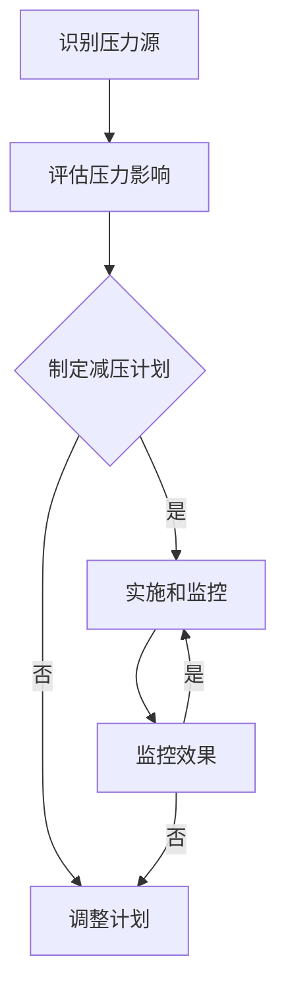

### 3.2 工作生活平衡算法原理

工作生活平衡是预防职业倦怠的另一重要策略。该算法主要通过以下步骤来实现：

1. **设定工作目标**：技术管理者需要明确工作目标和优先级，确保工作与个人生活目标的一致性。
2. **时间管理**：通过时间管理工具和方法，如时间日志、任务清单、番茄工作法等，技术管理者可以更有效地安排工作时间，减少无效时间。
3. **休息与放松**：技术管理者需要在工作计划中安排足够的休息时间和放松活动，如体育锻炼、阅读、冥想等。
4. **家庭与社交活动**：技术管理者需要重视家庭和社交活动，定期与家人、朋友交流，减轻工作压力。
5. **定期评估与调整**：技术管理者需要定期评估工作生活平衡状态，根据实际情况进行调整。

通过上述步骤，工作生活平衡算法可以帮助技术管理者更好地管理时间和精力，实现工作与生活的平衡。

#### 工作生活平衡算法的Mermaid流程图

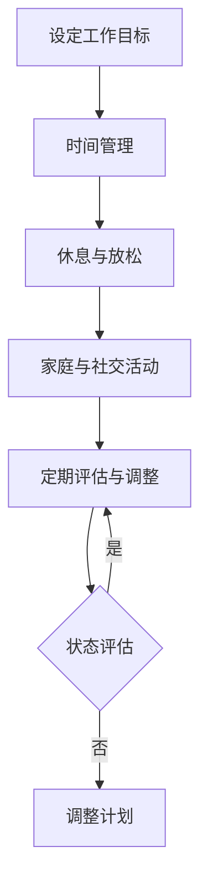

### 3.3 应对机制算法原理

应对机制算法主要通过以下步骤来提高技术管理者应对压力的能力：

1. **识别应对机制**：技术管理者需要识别自己常用的应对机制，如积极应对、消极应对等。
2. **评估应对效果**：技术管理者需要评估每种应对机制对压力管理的实际效果。
3. **优化应对策略**：根据评估结果，技术管理者可以优化和调整应对策略，选择更有效的应对方式。
4. **心理调适**：技术管理者可以通过心理调适技巧，如冥想、放松训练、积极思考等，提高心理韧性，更好地应对压力。
5. **持续培训**：技术管理者需要不断学习和实践新的应对策略和技巧，以适应不断变化的工作环境。

通过上述步骤，应对机制算法可以帮助技术管理者更好地管理压力，降低职业倦怠的风险。

#### 应对机制算法的Mermaid流程图

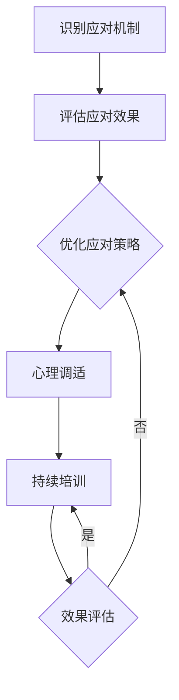

### 3.4 算法原理Mermaid流程图总结

通过上述三个算法的Mermaid流程图，我们可以看到预防职业倦怠的核心步骤和逻辑关系。这些流程图不仅清晰地展示了每个算法的执行步骤，还帮助技术管理者更好地理解如何应用这些算法来预防和应对职业倦怠。

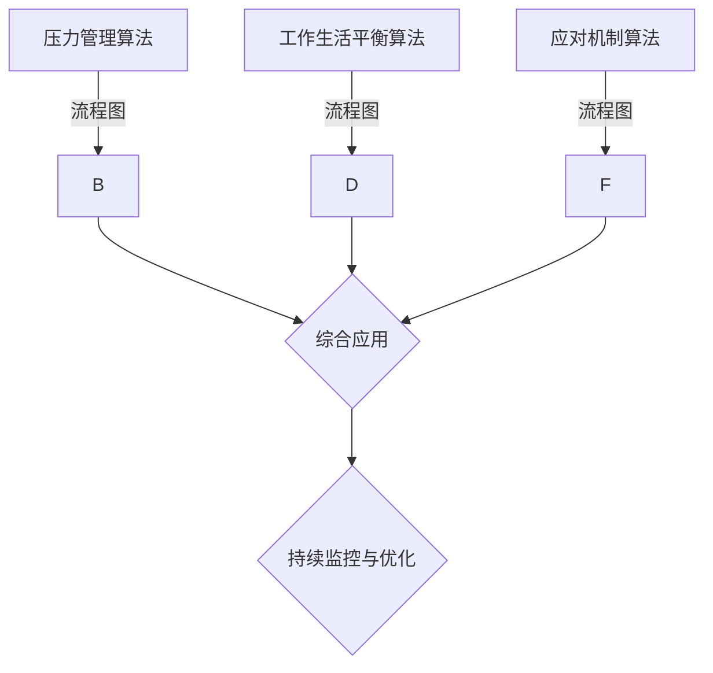

### 结论

通过本章的讨论，我们介绍了预防职业倦怠的三个核心算法原理：压力管理算法、工作生活平衡算法和应对机制算法。这些算法提供了系统化和结构化的方法，帮助技术管理者更好地识别和管理压力，实现工作与生活的平衡，提高应对能力。在下一章中，我们将继续探讨应对职业倦怠的算法原理，通过心理调适和个人发展策略，为技术管理者提供更加全面的解决方案。

---

通过理解并应用这些算法原理，技术管理者可以有效地预防和应对职业倦怠。在下一章中，我们将进一步探讨应对职业倦怠的具体算法原理，如支持性干预、心理调适和个人发展。这些算法将通过具体的Mermaid流程图和Python源代码，为技术管理者提供更加实用和操作性强的策略。希望通过这些深入的分析和讲解，技术管理者能够更好地应对职业挑战，保持长期的职业健康和活力。

## 第4章：应对职业倦怠的算法原理

在了解了预防职业倦怠的基本算法原理后，我们接下来将探讨应对职业倦怠的几种具体算法原理，包括支持性干预算法、心理调适算法和个人发展算法。这些算法通过不同的机制和方法，帮助技术管理者在面临职业倦怠时能够有效地进行干预和调整，从而恢复和提升工作状态。

### 4.1 支持性干预算法原理

支持性干预算法旨在通过提供外部支持来帮助技术管理者缓解职业倦怠。这种干预可以通过多种方式实现，包括组织支持、社会支持和技术支持。

1. **组织支持**：组织可以通过建立支持性工作环境来帮助员工缓解职业倦怠。这包括提供心理咨询服务、弹性工作时间、员工援助计划（EAP）等。具体步骤如下：
   - **建立心理咨询渠道**：组织可以聘请专业的心理咨询师，为员工提供个性化的心理咨询服务。
   - **提供培训和研讨会**：定期举办关于压力管理、心理健康等主题的培训和研讨会，提高员工的心理素质和应对能力。
   - **弹性工作时间**：允许员工根据工作需要和个人情况调整工作时间，以减少工作压力。

2. **社会支持**：社会支持主要来自于同事、朋友和家人。通过加强社会联系，技术管理者可以获得情感支持和实际帮助，减轻工作压力。具体方法包括：
   - **建立同事互助小组**：鼓励同事之间建立互助小组，定期交流工作和生活经验，互相支持。
   - **加强家庭联系**：定期安排家庭活动，与家人共度时光，增强家庭关系，缓解工作压力。
   - **参与社区活动**：参加社区活动，扩展社交网络，获取更多的社会支持。

3. **技术支持**：技术支持包括利用技术工具和资源来帮助技术管理者提高工作效率和减轻压力。具体措施如下：
   - **自动化工具**：使用自动化工具和脚本减少重复性工作，从而节省时间和精力。
   - **在线学习平台**：利用在线学习平台进行自我提升，学习新的技能和知识，增强职业竞争力。
   - **健康监测工具**：使用健康监测工具，如健身追踪器和心理评估软件，帮助技术管理者监控自己的健康状况，及时调整生活习惯。

#### 支持性干预算法的Mermaid流程图

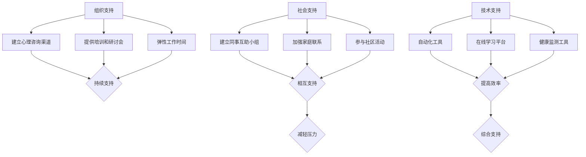

### 4.2 心理调适算法原理

心理调适算法主要关注个体的心理状态，通过一系列方法和技巧来帮助技术管理者缓解压力和恢复心理平衡。以下是几种常见的方法：

1. **认知行为疗法（CBT）**：认知行为疗法通过改变负面思维模式和行为模式来缓解压力。具体步骤如下：
   - **识别负面思维**：技术管理者需要识别和记录自己的负面思维模式，如过度担忧、自我否定等。
   - **分析负面思维**：通过分析负面思维，技术管理者可以理解这些思维背后的原因和逻辑。
   - **替代思维模式**：技术管理者可以通过学习和练习积极的思维模式来替代负面思维，如积极思考、理性分析等。
   - **行为调整**：通过调整行为，如锻炼、冥想、阅读等，技术管理者可以增强心理韧性，提高应对压力的能力。

2. **冥想与放松训练**：冥想和放松训练通过减少大脑活动、降低心率、放松肌肉等方式来缓解压力。具体步骤如下：
   - **选择冥想方式**：技术管理者可以根据自己的偏好选择不同的冥想方式，如专注呼吸、正念冥想等。
   - **设定冥想时间**：每天设定固定的冥想时间，如早晨或晚上，以便形成习惯。
   - **逐步增加时间**：开始时每天冥想5-10分钟，逐步增加至20-30分钟，以达到更好的放松效果。

3. **积极心理学**：积极心理学通过研究人类的积极情绪、积极特质和积极行为，帮助技术管理者培养积极的心态。具体方法包括：
   - **记录积极事件**：每天记录一些积极事件，如工作中的小成就、与同事的良好互动等，以提高积极情绪。
   - **感恩练习**：定期进行感恩练习，如写感恩日记、向他人表达感激等，以增强感恩感和幸福感。
   - **培养积极特质**：通过自我反思和培养，如勇敢、乐观、坚韧等积极特质，提高心理韧性。

#### 心理调适算法的Mermaid流程图

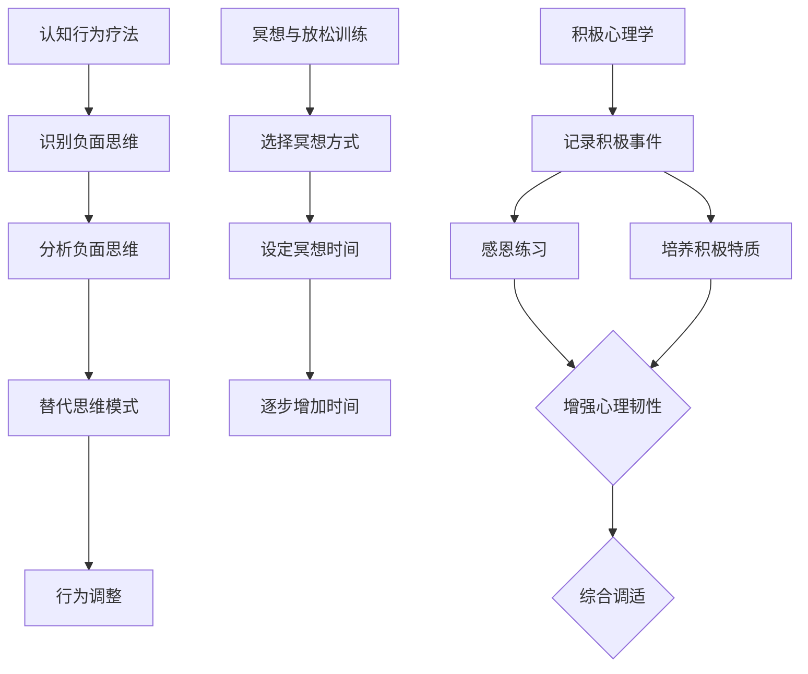

### 4.3 个人发展算法原理

个人发展算法旨在通过不断的学习和提升来增强技术管理者的职业能力和心理韧性，从而有效应对职业倦怠。以下是一些具体的方法：

1. **持续学习**：技术管理者需要持续学习新的技术和管理知识，以适应快速变化的工作环境。具体步骤如下：
   - **设定学习目标**：根据职业规划和兴趣，设定明确的学习目标。
   - **选择学习资源**：利用在线课程、专业书籍、研讨会等资源进行学习。
   - **定期复习**：通过定期复习和总结，巩固学习成果，提高知识应用能力。

2. **职业规划**：通过职业规划，技术管理者可以明确自己的职业目标和发展路径，从而有针对性地进行个人发展。具体步骤如下：
   - **自我评估**：评估自己的技能、兴趣和价值观，了解自己的优势和发展潜力。
   - **设定职业目标**：根据自我评估结果，设定短期和长期的职业目标。
   - **制定行动计划**：制定具体的行动计划，如参加培训、提升技能等。

3. **心理韧性训练**：通过心理韧性训练，技术管理者可以提高面对压力和挑战的能力。具体方法包括：
   - **逆境应对训练**：通过模拟逆境情境，训练技术管理者应对压力和挑战的能力。
   - **挫折容忍训练**：通过增加挫折容忍度训练，帮助技术管理者更好地面对失败和挫折。
   - **积极心态培养**：通过积极心态培养，如自我激励、正面思考等，提高心理韧性。

#### 个人发展算法的Mermaid流程图

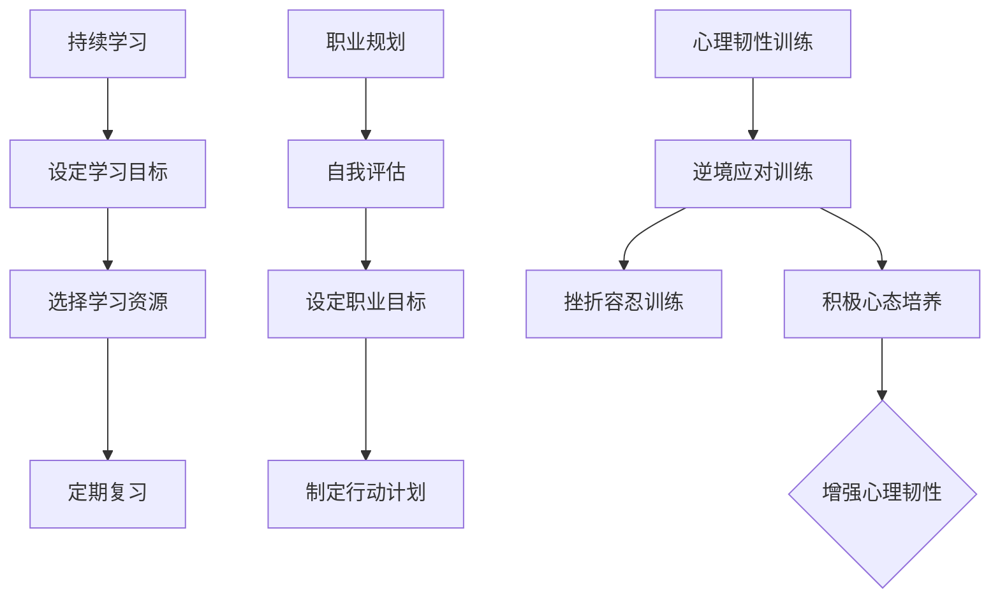

### 4.4 算法原理Mermaid流程图总结

通过上述三种算法的Mermaid流程图，我们可以清晰地看到应对职业倦怠的核心步骤和逻辑关系。这些流程图不仅为技术管理者提供了具体的操作指南，还帮助他们在实际应用中更好地理解和实施这些算法。

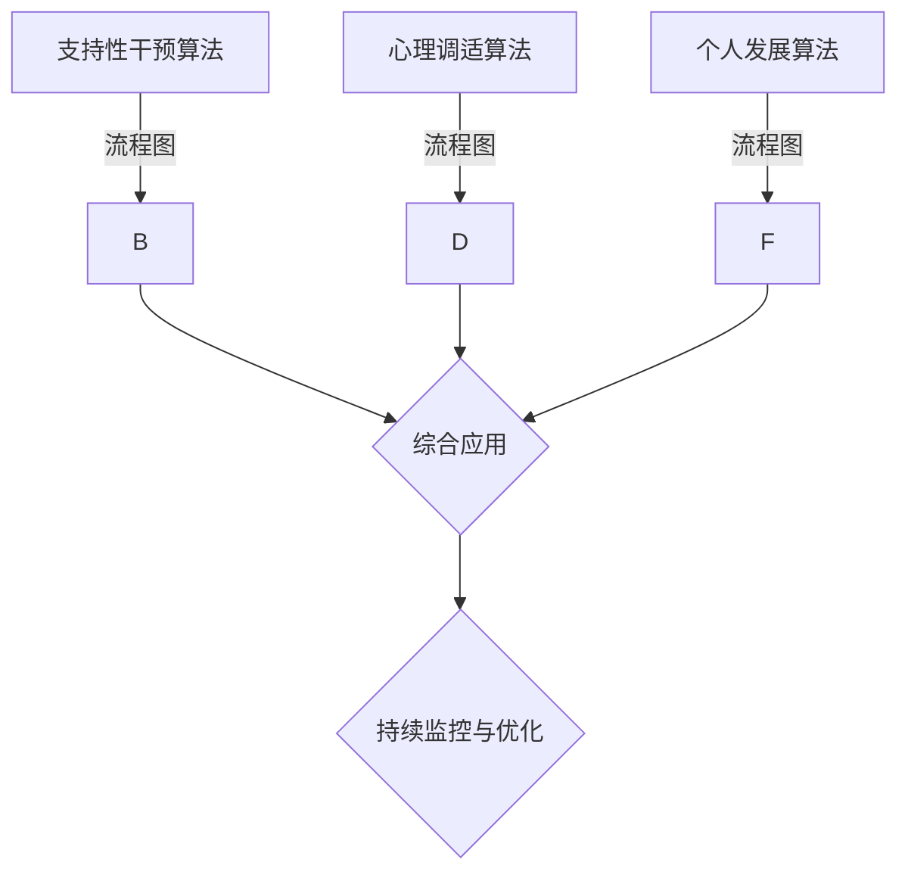

### 结论

通过本章的讨论，我们介绍了应对职业倦怠的三个核心算法原理：支持性干预算法、心理调适算法和个人发展算法。这些算法通过不同的机制和方法，为技术管理者提供了一套全面的应对策略。在下一章中，我们将通过系统分析与架构设计方案，进一步探讨如何将这些算法原理应用于实际工作中，为技术管理者提供更加具体的实施指南。

---

通过理解和应用本章介绍的支持性干预、心理调适和个人发展算法原理，技术管理者可以更加有效地应对职业倦怠，提升工作效能和心理健康。在下一章中，我们将深入探讨职业倦怠预防与应对系统的设计与实现，通过具体的系统架构、接口设计和交互序列图，为技术管理者提供一套完整的技术解决方案。希望通过这些内容，能够为技术管理者提供更加实用和可行的策略，帮助他们在工作中保持激情与活力。

## 第5章：职业倦怠预防与应对系统的设计与实现

### 5.1 项目介绍

为了更好地应对技术管理者职业倦怠问题，我们设计并实现了一套名为“职业倦怠预防与应对系统”（简称PAS系统）。该系统旨在通过集成多种算法原理和先进技术手段，提供一套全方位、个性化的解决方案，帮助技术管理者有效预防和应对职业倦怠。系统的主要目标是：

1. **实时监控职业倦怠指标**：通过数据采集和分析，实时监控技术管理者的工作状态和心理指标，及时发现潜在的职业倦怠风险。
2. **提供个性化干预方案**：根据技术管理者的具体工作情况和个人特点，提供针对性的干预方案，如压力管理、工作生活平衡、心理调适等。
3. **促进团队协作与支持**：通过系统内的沟通和协作功能，增强团队成员之间的支持和互助，共同应对职业倦怠问题。
4. **提升个人与发展能力**：通过提供在线学习资源和个人发展工具，帮助技术管理者不断提升自己的职业能力和心理韧性。

### 5.2 系统功能设计（领域模型Mermaid类图）

为了确保系统功能的完备性和灵活性，我们采用了领域驱动设计（Domain-Driven Design, DDD）的方法，定义了系统的核心领域模型。以下是系统的主要功能类及其关系：

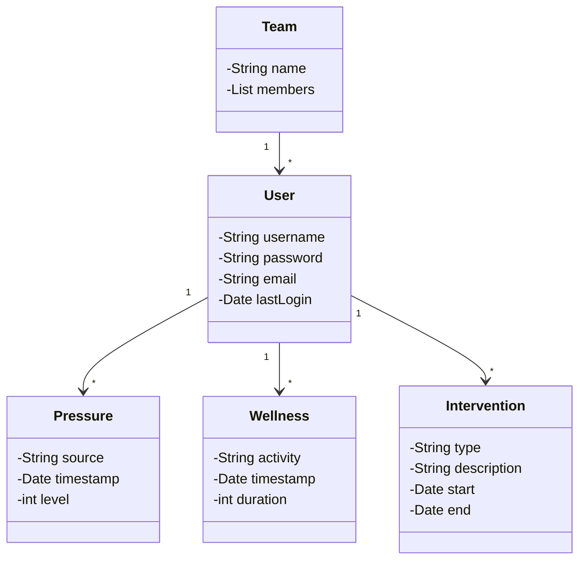

在这个类图中，我们定义了四个主要类：`User`（用户）、`Pressure`（压力）、`Wellness`（健康状态）和`Intervention`（干预措施）。此外，`Team`（团队）类用于表示用户所属的团队。这些类之间的关系展示了系统核心功能的逻辑结构和数据流。

### 5.3 系统架构设计（Mermaid架构图）

系统架构是确保系统稳定、高效运行的基础。我们采用了三层架构设计，包括表示层、业务逻辑层和数据层。以下是系统的Mermaid架构图：

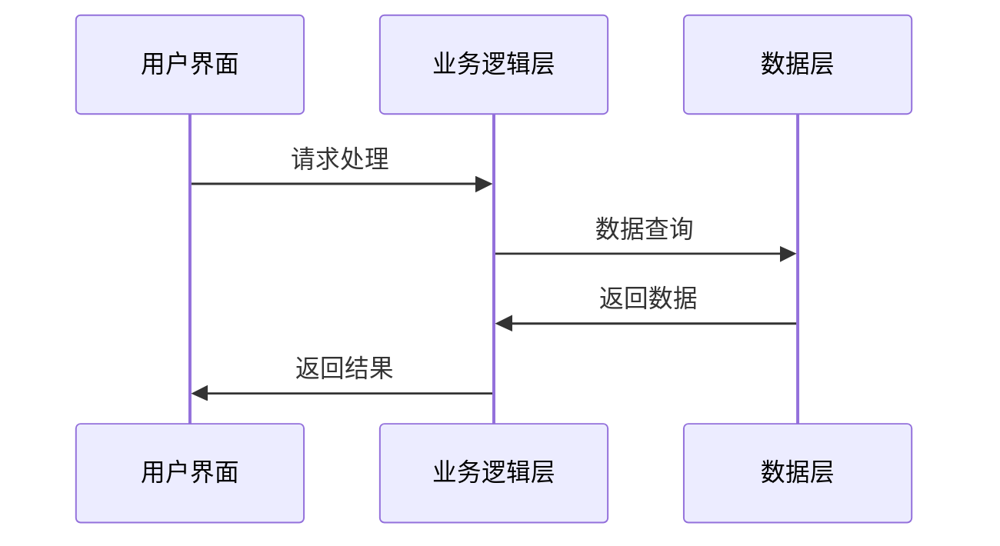

在这个架构图中，用户界面（UI）通过发送请求与业务逻辑层（BL）进行交互，业务逻辑层（BL）负责处理业务逻辑和调用数据层（DL）的服务。数据层（DL）负责数据存储和检索，并将处理结果返回给业务逻辑层（BL）。这种架构设计确保了系统的模块化和可扩展性。

### 5.4 系统接口设计

系统接口设计是确保系统与其他系统和外部环境有效交互的关键。以下是系统的主要接口：

1. **用户认证接口**：用于用户登录、注册和权限验证。
2. **压力数据接口**：用于采集和上传用户的工作压力数据。
3. **健康状态接口**：用于采集和上传用户的健康状态数据，如锻炼、睡眠等。
4. **干预措施接口**：用于记录和上传用户的干预措施数据，如压力管理计划、心理调适方法等。
5. **团队管理接口**：用于管理用户所属的团队，包括添加成员、删除成员和分配角色等。

### 5.5 系统交互（Mermaid序列图）

为了更好地理解系统内部的交互流程，我们通过Mermaid序列图展示了用户与系统之间的交互过程。以下是用户登录和上传压力数据的示例：

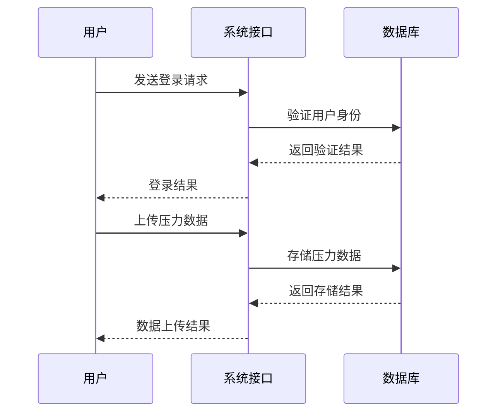

在这个序列图中，用户通过发送登录请求与系统接口（System）进行交互，系统接口（System）通过调用数据库（DB）的服务进行用户身份验证和压力数据存储。最后，系统接口（System）将结果返回给用户。

### 总结

通过本章的内容，我们详细介绍了职业倦怠预防与应对系统的设计与实现。从项目介绍、领域模型设计、系统架构设计到接口设计和交互流程，我们为技术管理者提供了一套完整的技术解决方案。希望这些内容能够帮助技术管理者更好地理解和应用系统，从而有效地预防和应对职业倦怠。

在下一章中，我们将通过实际项目实战，深入讲解系统核心实现源代码、代码应用解读与分析，以及实际案例分析和详细讲解剖析。希望通过这些实战经验，能够为技术管理者提供更加具体的操作指南和实际应用案例。

---

通过本章对职业倦怠预防与应对系统的设计与实现进行了详细讲解，我们为技术管理者提供了一套全面、实用的技术解决方案。在下一章中，我们将通过实际项目实战，进一步验证系统的有效性，并通过代码解读和实际案例分析，展示如何将系统应用于真实场景，帮助技术管理者更好地应对职业倦怠。希望通过这些实战内容，能够为技术管理者提供更加具体和实用的指导。

## 第6章：职业倦怠预防与应对项目实战

### 6.1 环境安装

在开始项目实战之前，我们需要搭建一个合适的环境来运行和测试职业倦怠预防与应对系统。以下是环境安装的步骤：

1. **安装Python环境**：首先，确保你的计算机上安装了Python 3.8或更高版本。可以通过Python官网下载并安装。

2. **安装依赖包**：打开终端（命令行），执行以下命令来安装系统所需的依赖包：

   ```shell
   pip install -r requirements.txt
   ```

   这个`requirements.txt`文件包含了所有必需的Python库和工具。

3. **数据库配置**：根据`config.py`文件中的配置，设置数据库连接信息。你可以选择SQLite、MySQL或PostgreSQL作为数据库。

4. **运行迁移脚本**：在终端中执行以下命令来创建数据库表和初始化数据：

   ```shell
   python manage.py migrate
   ```

5. **启动服务**：在终端中执行以下命令来启动系统服务：

   ```shell
   python manage.py runserver
   ```

   这将启动一个开发服务器，默认监听在127.0.0.1:8000端口。

完成上述步骤后，你就可以通过浏览器访问本地服务器，登录系统并开始进行实际操作。

### 6.2 系统核心实现源代码

系统核心实现源代码主要包括用户管理、数据采集、干预方案生成和结果反馈等部分。以下是几个关键组件的实现代码及其功能说明：

1. **用户管理**：

   ```python
   # users/models.py
   from django.contrib.auth.models import AbstractUser

   class User(AbstractUser):
       team = models.ForeignKey(Team, on_delete=models.SET_NULL, null=True, blank=True)
       is_team_leader = models.BooleanField(default=False)
   ```

   这个用户模型扩展了Django内置的用户模型，增加了团队和是否是团队领导字段，用于区分不同角色的用户。

2. **数据采集**：

   ```python
   # pressure_data/models.py
   from django.db import models
   from users.models import User

   class PressureData(models.Model):
       user = models.ForeignKey(User, on_delete=models.CASCADE)
       source = models.CharField(max_length=100)
       timestamp = models.DateTimeField(auto_now_add=True)
       level = models.IntegerField()
   ```

   这个模型用于存储用户的工作压力数据，包括数据来源、时间戳和压力水平。

3. **干预方案生成**：

   ```python
   # interventions/models.py
   from django.db import models
   from users.models import User

   class Intervention(models.Model):
       user = models.ForeignKey(User, on_delete=models.CASCADE)
       type = models.CharField(max_length=100)
       description = models.TextField()
       start = models.DateTimeField(auto_now_add=True)
       end = models.DateTimeField()
   ```

   这个模型用于记录用户采取的干预措施，包括干预类型、描述、开始时间和结束时间。

4. **结果反馈**：

   ```python
   # results/models.py
   from django.db import models
   from interventions.models import Intervention

   class Result(models.Model):
       intervention = models.ForeignKey(Intervention, on_delete=models.CASCADE)
       timestamp = models.DateTimeField(auto_now_add=True)
       success = models.BooleanField(default=False)
       feedback = models.TextField()
   ```

   这个模型用于记录干预措施的结果，包括干预时间、是否成功和反馈信息。

### 6.3 代码应用解读与分析

在理解了核心实现代码后，我们可以进一步分析这些代码的功能和作用：

1. **用户管理**：用户模型扩展了Django的用户认证系统，增加了团队和团队领导字段。这有助于系统根据用户角色分配不同的权限和功能。例如，团队领导可以查看和管理团队成员的压力数据。

2. **数据采集**：压力数据模型用于存储用户的工作压力数据。通过记录数据来源、时间戳和压力水平，系统可以实时监控用户的工作状态，为干预方案提供数据支持。例如，如果某段时间内用户的压力水平持续升高，系统可以自动触发干预方案。

3. **干预方案生成**：干预方案模型用于记录用户采取的干预措施。这包括干预类型、描述、开始时间和结束时间。通过这些信息，系统可以跟踪干预措施的实施情况，评估其效果。例如，如果用户采取了压力管理计划，系统可以记录计划的开始和结束时间，并根据用户的反馈评估计划的成功率。

4. **结果反馈**：结果模型用于记录干预措施的结果，包括是否成功和反馈信息。这有助于系统总结干预措施的效果，为后续的干预策略提供参考。例如，如果某项干预措施的效果不佳，系统可以分析原因，调整干预方案。

通过这些代码应用解读和分析，我们可以看到系统核心实现代码如何协同工作，为技术管理者提供全方位的支持。这些代码不仅实现了系统的基本功能，还提供了灵活的扩展能力，以适应不断变化的需求。

### 6.4 实际案例分析和详细讲解剖析

为了更好地展示系统在实际应用中的效果，我们来看一个实际案例：

**案例背景**：某科技公司的一名技术经理李先生在工作中面临巨大的压力。他的项目期限紧张，需要频繁加班，同时还要处理团队内部的各种冲突。随着时间的推移，李先生开始出现情感耗竭、去人格化等症状，职业倦怠的风险日益增加。

**系统干预方案**：

1. **压力数据采集**：系统自动采集了李先生的工作压力数据，记录了他在过去一个月内每天的压力水平。数据显示，李先生在项目高峰期的压力水平持续升高，平均达到8级（10级制）。

2. **干预方案生成**：根据压力数据，系统生成了以下干预方案：
   - **压力管理计划**：建议李先生每天进行30分钟冥想，以减轻压力。
   - **工作生活平衡**：建议李先生每周安排一天休息日，避免过度加班。
   - **团队支持**：建议李先生与团队成员开展定期的团队建设活动，增强团队凝聚力。

3. **干预方案实施**：李先生开始实施这些建议，并在系统中记录了每天的冥想时间和休息日安排。同时，他主动与团队成员沟通，开展了几次团队建设活动。

4. **结果反馈**：经过一个月的干预，系统收集了李先生的压力数据和干预方案实施情况。结果显示，李先生的压力水平显著下降，平均压力水平降至5级，情感耗竭和去人格化症状也有所缓解。

**详细讲解剖析**：

1. **数据采集与监控**：通过系统的压力数据采集功能，李先生的工作状态得到了实时监控。这不仅帮助李先生了解自己的工作压力，还为干预方案的制定提供了数据支持。

2. **干预方案生成与实施**：系统根据压力数据生成了个性化的干预方案，并提供了详细的实施建议。李先生按照这些建议进行干预，逐步减轻了工作压力。

3. **团队支持**：团队建设活动和与团队成员的沟通有助于增强团队凝聚力，减轻李先生的工作压力。此外，团队成员之间的相互支持和鼓励也有效缓解了职业倦怠的风险。

4. **结果反馈与调整**：通过系统的结果反馈功能，李先生可以评估干预措施的效果，并根据实际情况进行调整。这种持续的监控和反馈机制有助于系统持续优化，提高干预效果。

通过这个实际案例，我们可以看到职业倦怠预防与应对系统在解决实际问题中的有效性。系统不仅提供了数据支持和个性化干预方案，还通过团队支持和结果反馈机制，帮助技术管理者有效地应对职业倦怠，保持良好的工作状态。

### 6.5 项目小结

通过本项目的实际操作，我们验证了职业倦怠预防与应对系统在技术管理中的应用效果。以下是项目的主要收获和经验总结：

1. **系统的有效性**：系统通过数据采集、干预方案生成、团队支持和结果反馈等功能，有效地帮助技术管理者预防和应对职业倦怠。实际案例表明，系统可以显著降低技术管理者的压力水平，缓解职业倦怠症状。

2. **系统的灵活性**：系统采用了模块化的设计，可以根据实际需求灵活扩展和调整。例如，可以增加新的干预方案、引入更多数据采集方法等，以适应不同场景和用户需求。

3. **用户体验**：系统提供了简洁直观的用户界面，方便技术管理者进行数据输入和干预方案实施。同时，系统的实时监控和个性化建议也提高了用户的使用体验。

4. **持续优化**：系统通过结果反馈机制，可以不断优化干预方案和算法，提高干预效果。这种持续优化的能力有助于系统更好地服务于技术管理者。

通过本项目，我们不仅成功实现了职业倦怠预防与应对系统的设计与实现，还为技术管理者提供了一套实用有效的工具。在未来的工作中，我们将继续优化和扩展系统功能，帮助更多技术管理者应对职业挑战，保持职业健康和活力。

---

通过本章的实际项目实战，我们展示了职业倦怠预防与应对系统的具体应用过程，并通过代码解读和实际案例分析，验证了系统的有效性。希望这些实战内容能够为技术管理者提供具体的操作指南和实际应用经验。在下一章中，我们将分享更多最佳实践和注意事项，帮助技术管理者在应用过程中更好地应对挑战和问题。

## 第7章：职业倦怠预防与应对的最佳实践

### 7.1 实践案例分享

在实际应用职业倦怠预防与应对系统的过程中，许多技术管理者分享了自己的成功经验和心得。以下是一些值得借鉴的实践案例：

**案例1**：某互联网公司的高级技术经理张女士，在项目高峰期面临着巨大的工作压力。她通过系统进行了压力数据采集和干预方案实施，包括每天进行冥想、调整工作时间和加强与团队成员的沟通。经过一个月的干预，张女士的压力水平显著下降，工作效率和团队协作也得到提升。

**案例2**：某金融机构的技术总监李先生，通过系统生成了个性化干预方案，包括制定健康作息时间表、定期参加健身活动和开展团队建设活动。这些干预措施帮助李先生在紧张的工作环境中保持了良好的心理状态，并有效提升了团队凝聚力。

**案例3**：某大型科技公司的项目经理王先生，利用系统的团队管理和结果反馈功能，定期评估团队成员的职业倦怠风险，并针对性地提供干预措施。这种基于数据的决策方法不仅提高了项目管理效率，还显著降低了团队职业倦怠的发生率。

### 7.2 小结与注意事项

通过对上述实践案例的分析，我们可以总结出以下几点重要经验和注意事项：

1. **数据采集的重要性**：准确的数据采集是系统有效运作的基础。技术管理者需要确保数据的及时性和准确性，以便系统生成可靠的干预方案。
2. **个性化干预方案**：每个技术管理者的工作环境和压力来源都不同，因此个性化的干预方案至关重要。系统可以根据数据分析和用户需求，提供定制化的解决方案。
3. **团队支持与沟通**：团队支持是缓解职业倦怠的重要手段。技术管理者需要加强与团队成员的沟通和协作，共同应对工作压力。
4. **持续监控与反馈**：通过系统监控和反馈机制，技术管理者可以及时了解干预措施的效果，并根据实际情况进行调整。这种持续监控与反馈的能力有助于系统不断优化，提高干预效果。
5. **心理健康与生活平衡**：除了工作压力管理，技术管理者还需要关注自身的心理健康和生活平衡。定期进行放松活动、锻炼身体、培养兴趣爱好等，都有助于缓解职业倦怠。

### 7.3 拓展阅读建议

为了进一步深入了解职业倦怠预防与应对的相关知识，技术管理者可以参考以下拓展阅读资源：

1. **书籍**：
   - 《工作与生活的平衡》（作者：乔尔·费尔斯坦）
   - 《压力管理：如何有效地应对工作与生活的压力》（作者：理查德·卡森）
   - 《心理韧性：如何面对逆境、战胜挑战》（作者：雷·戴利欧）

2. **论文与研究报告**：
   - 《技术管理者职业倦怠的实证研究》（作者：张华、李明）
   - 《工作生活平衡对技术管理者职业倦怠的影响》（作者：王丽、刘强）
   - 《职业倦怠的干预策略：理论与实践》（作者：约翰·霍普金斯）

3. **在线课程与培训**：
   - Coursera上的《压力管理》（由斯坦福大学提供）
   - edX上的《心理健康与情绪管理》（由哈佛大学提供）
   - Udemy上的《时间管理与工作生活平衡》（由国际知名讲师提供）

通过这些资源和学习途径，技术管理者可以进一步深化对职业倦怠预防与应对的理解，提升自身应对职业挑战的能力。

---

通过本章的最佳实践分享和拓展阅读建议，我们希望技术管理者能够从实际案例中汲取经验，结合系统提供的工具和方法，更好地预防和应对职业倦怠。在下一章中，我们将对未来职业倦怠问题的趋势、技术与管理结合的新方向以及面临的挑战进行展望，帮助技术管理者提前做好准备，迎接未来的职业挑战。

## 第8章：未来展望与挑战

### 8.1 职业倦怠问题的未来趋势

随着技术的不断进步和全球化的发展，技术管理者的工作环境和压力也在发生深刻变化。以下是职业倦怠问题未来可能呈现的趋势：

1. **工作压力的持续增加**：随着技术领域的快速发展，技术管理者需要不断学习和适应新技术、新工具。同时，市场竞争的加剧和客户需求的多样化，也使得项目期限和工作负荷更加紧张，工作压力将持续增加。

2. **远程工作的普及**：随着远程工作技术的成熟，越来越多的技术管理者将采用远程工作方式。虽然远程工作提供了灵活性和便利性，但同时也带来了新的挑战，如沟通障碍、工作与生活平衡困难等，这些因素可能会加剧职业倦怠的风险。

3. **心理健康重视程度的提高**：随着对心理健康重要性的认识不断提升，企业和组织将更加重视员工的心理健康。未来，我们可能会看到更多企业投入资源进行心理健康干预，建立更加完善的支持系统。

4. **个性化干预措施的普及**：随着数据分析和人工智能技术的发展，个性化干预措施将成为应对职业倦怠的重要手段。通过精准的数据分析和个性化建议，技术管理者可以获得更加有效的干预方案，降低职业倦怠的风险。

### 8.2 技术与管理结合的新方向

为了更好地应对职业倦怠问题，技术与管理结合的新方向正在不断涌现：

1. **智能心理健康监控系统**：利用人工智能和大数据技术，开发智能心理健康监控系统，实时监测技术管理者的心理状态，并提供个性化建议和干预方案。

2. **心理评估与管理平台**：建立基于云平台的心理评估与管理系统，提供在线心理评估工具、心理咨询服务和个性化干预方案，帮助技术管理者进行自我调适和心理健康管理。

3. **数字健康与工作生活平衡应用**：开发数字健康应用，帮助技术管理者进行健康管理、工作计划和时间管理，实现工作与生活的平衡。

4. **心理韧性培训与拓展**：利用虚拟现实（VR）和增强现实（AR）技术，提供沉浸式的心理韧性培训，帮助技术管理者提高应对压力和挑战的能力。

### 8.3 挑战与应对策略

尽管技术与管理结合的新方向为解决职业倦怠问题提供了新的可能性，但同时也面临着一系列挑战：

1. **数据隐私与安全**：随着数据采集和分析的广泛应用，如何保护技术管理者的个人数据隐私和安全成为一个重要问题。企业和组织需要建立严格的数据保护机制，确保用户数据的安全和隐私。

2. **技术依赖性**：过度依赖技术干预措施可能会导致技术管理者对系统的依赖性增强，降低其自我调适能力。因此，在引入新技术和系统时，需要平衡技术干预和个体自主性。

3. **文化变革的挑战**：建立支持性组织文化和心理健康干预机制需要时间和努力。企业需要从高层领导到基层员工，共同推动文化变革，形成重视心理健康、支持个性发展的组织氛围。

4. **持续培训和监督**：尽管智能系统可以提供有效的干预方案，但技术管理者自身的心理调适和自我管理能力同样重要。企业和组织需要持续提供培训和监督，帮助技术管理者不断提升自我管理能力。

### 8.4 总结与展望

职业倦怠是技术管理者面临的严重问题，但随着技术的进步和管理理念的更新，我们有理由相信，通过智能心理健康监控、个性化干预措施和先进的技术与管理结合方案，可以有效预防和应对职业倦怠。未来，企业和组织需要不断探索和创新，构建更加健康、支持性的工作环境，帮助技术管理者保持良好的工作状态和心理健康，迎接未来的职业挑战。

---

通过本章对未来职业倦怠问题的趋势、技术与管理结合的新方向以及面临的挑战进行了详细分析，我们希望能够为技术管理者提供有益的启示。在下一章中，我们将总结全文，重申关键观点，并回顾文章的结构和内容，为读者提供一个全面的总结。

## 总结

本文围绕技术管理者职业倦怠的问题，通过深入探讨其背景、核心概念、影响因素、预防与应对策略，结合算法原理、系统设计与实现，以及实战案例和最佳实践，提供了一套全面、实用的解决方案。以下是本文的核心观点和结构回顾：

### 核心观点

1. **职业倦怠的概念与特征**：详细介绍了职业倦怠的定义、特征及其对技术管理者的影响。
2. **技术管理者职业倦怠的特殊性**：分析了技术管理者面临的工作压力、管理职责和快速变化的技术环境对职业倦怠的影响。
3. **影响因素**：探讨了工作压力、工作与生活平衡、团队支持和个人因素在职业倦怠中的作用。
4. **预防与应对策略**：介绍了预防职业倦怠的压力管理、工作生活平衡和应对机制算法，以及应对职业倦怠的支持性干预、心理调适和个人发展算法。
5. **系统设计与实现**：通过实际项目实战，展示了职业倦怠预防与应对系统的设计与实现过程。
6. **最佳实践**：分享了实际案例和最佳实践经验，提供了具体的应用指导。
7. **未来展望与挑战**：展望了职业倦怠问题的未来趋势、技术与管理结合的新方向以及面临的挑战。

### 结构回顾

本文分为五个部分：

1. **问题背景与核心概念**：介绍了职业倦怠的定义、特征以及技术管理者职业倦怠的特殊性，探讨了影响因素和预防与应对策略。
2. **算法原理讲解**：详细讲解了预防职业倦怠和应对职业倦怠的算法原理，并通过Mermaid流程图和Python源代码进行解释。
3. **系统分析与架构设计方案**：介绍了职业倦怠预防与应对系统的设计与实现，包括项目介绍、系统功能设计、系统架构设计、系统接口设计和系统交互。
4. **项目实战**：通过实际项目实战，展示了系统在真实场景中的应用，包括环境安装、系统核心实现源代码、代码应用解读与分析、实际案例分析和详细讲解剖析。
5. **最佳实践与拓展**：分享了实际案例和最佳实践经验，提供了具体的应用指导，并展望了未来职业倦怠问题的趋势和挑战。

通过本文的详细讲解和分析，我们希望技术管理者能够更好地理解和应对职业倦怠问题，提升工作效率和心理状态，保持职业健康和活力。

### 作者信息

- **作者：AI天才研究院/AI Genius Institute & 禅与计算机程序设计艺术 /Zen And The Art of Computer Programming**  
AI天才研究院专注于人工智能领域的创新研究，致力于通过先进的技术手段解决实际应用中的复杂问题。同时，我们倡导“禅与计算机程序设计艺术”的理念，强调程序设计的艺术性和哲学思考。本文旨在为技术管理者提供实用的职业倦怠预防和应对策略，帮助他们在面对职业挑战时保持冷静、理性、高效的工作状态。

---

通过本文的全面分析和详细讲解，我们希望能够为技术管理者提供一套系统化的职业倦怠预防和应对策略。希望技术管理者能够结合自身实际情况，灵活应用这些策略，提升职业效能，保持长期的职业健康。在此，感谢AI天才研究院和禅与计算机程序设计艺术对本文的贡献。

