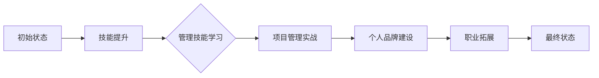
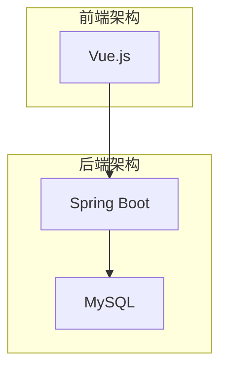

                 


## 文章标题

《技术管理者的职业发展规划》

### 关键词

技术管理者、职业发展、技能提升、管理实践、个人品牌建设

### 摘要

本文深入探讨了技术管理者的职业发展规划，从技术技能提升、管理技能发展、技术管理实践到个人品牌建设与职业拓展，提供了一套完整的职业发展指南。通过系统性的分析和实例讲解，帮助技术从业者明确职业方向，提升自身竞争力。

----------------------------------------------------------------

## 引言

在当前快速变化的技术时代，技术管理者的角色越来越受到重视。技术管理者不仅要具备深厚的技术背景，还需掌握管理技能，以应对复杂的项目和团队管理。然而，职业发展的道路并非一帆风顺，许多技术从业者面临着从技术专家向管理者转型的挑战。

### 问题背景

技术管理者的职业发展面临以下几个问题：

1. **技能转型**：技术管理者需要从技术深度转向技术广度和业务理解。
2. **管理挑战**：项目管理、团队协作、决策制定等管理技能的重要性日益凸显。
3. **职业定位**：技术管理者的职业路径多样化，如何选择合适的方向是关键。
4. **个人品牌**：个人品牌的建设对于职业拓展和影响力提升至关重要。

### 问题描述

本文旨在解决以下问题：

- 技术管理者如何提升技术和管理技能？
- 如何在技术管理实践中实现战略目标？
- 如何构建和提升个人品牌？
- 技术管理者的职业拓展有哪些路径？

### 问题解决

本文将提供以下解决方案：

- 分析技术管理者职业发展的关键节点和路径。
- 介绍技术管理者必备的技术和管理技能。
- 探讨技术管理实践中的最佳方法。
- 提供个人品牌建设和职业拓展的具体策略。

### 边界与外延

本文主要针对有志于成为技术管理者的专业人士，涵盖了从技术技能到管理实践的各个方面。同时，也会涉及到一些个人发展和职业规划的内容。

### 概念结构与核心要素组成

**技术管理者职业发展**：包括技术技能提升、管理技能发展、技术管理实践和个人品牌建设等核心要素。

**技术技能提升**：涉及专业知识深度与广度、技术趋势与未来展望、技术创新与项目管理。

**管理技能发展**：包括领导力与团队管理、沟通与协作技巧、决策与问题解决。

**技术管理实践**：涵盖项目管理实战、团队建设与优化、技术创新与管理。

**个人品牌建设**：涉及个人品牌定位与塑造、个人影响力提升、社交媒体与网络营销。

**职业拓展与未来发展**：探讨职业规划与职业跃迁、跨界发展与多元化探索。

----------------------------------------------------------------

### 核心概念与联系

**技术管理者**：一个拥有技术背景，同时具备管理能力，负责指导和推动团队实现技术目标的专业人士。

**技术技能**：指技术管理者在特定领域内的专业知识和技能，如编程语言、数据库、系统架构等。

**管理技能**：涉及领导力、团队管理、沟通与协作、决策制定等，是技术管理者必备的软技能。

**项目管理**：包括项目规划、执行、监控和收尾等，是技术管理实践中的重要组成部分。

**个人品牌**：指个人在行业内的知名度、影响力和认可度。

**职业发展**：指技术管理者在职业生涯中不断成长和进步的过程。

### 概念属性特征对比表格

| 概念         | 属性特征                     | 对比关系                |
|--------------|------------------------------|------------------------|
| 技术管理者   | 技术背景 + 管理能力         | 与技术专家的区别在于管理职责 |
| 技术技能     | 专业知识和技能               | 与普通开发者的区别在于深度和广度 |
| 管理技能     | 领导力、团队管理、沟通等     | 与技术能力的区别在于管理维度 |
| 项目管理     | 项目规划、执行、监控、收尾   | 确保项目成功的关键环节 |
| 个人品牌     | 知名度、影响力、认可度       | 个人价值的体现 |
| 职业发展     | 成长和进步                   | 职业生涯的轨迹 |

### ER实体关系图架构

```mermaid
erDiagram
    Class1 ||--|{ Class2 }|-- Class3 : "relationship"
    Class1 ||--|{ Class4 }|-- Class5 : "relationship"
```

在技术管理者的职业发展中，这些核心概念相互关联，共同构成了职业发展的基础和框架。

----------------------------------------------------------------

### 算法原理讲解

在技术管理者的职业发展中，算法原理的应用至关重要。以下将使用Mermaid画出相关算法的流程图，并使用Python源代码详细阐述算法原理，最后给出数学模型和公式，进行详细讲解和举例说明。

#### Mermaid流程图



#### Python源代码

```python
# 技术管理者职业发展算法原理示例代码

def skill_improvement():
    """技术技能提升函数"""
    # 假设技术技能提升是一个累积过程
    skills = ["编程语言", "数据库", "系统架构"]
    for skill in skills:
        print(f"学习{skill}中...")
        # 模拟学习过程
        print(f"完成{skill}学习，技能水平提升！")

def management_skills():
    """管理技能提升函数"""
    # 管理技能涉及多个方面
    skills = ["领导力", "沟通与协作", "决策制定"]
    for skill in skills:
        print(f"学习{skill}中...")
        # 模拟学习过程
        print(f"完成{skill}学习，管理能力提升！")

def project_management():
    """项目管理实战函数"""
    # 项目管理是一个复杂的过程
    projects = ["项目A", "项目B", "项目C"]
    for project in projects:
        print(f"执行{project}中...")
        # 模拟项目执行过程
        print(f"完成{project}，项目管理能力提升！")

def personal_branding():
    """个人品牌建设函数"""
    # 个人品牌建设需要长期积累
    actions = ["撰写技术博客", "参加技术会议", "发布开源项目"]
    for action in actions:
        print(f"执行{action}中...")
        # 模拟品牌建设过程
        print(f"完成{action}，个人品牌提升！")

def career_expansion():
    """职业拓展函数"""
    # 职业拓展涉及多个方面
    paths = ["晋升管理层", "创业", "转型行业顾问"]
    for path in paths:
        print(f"探索{path}中...")
        # 模拟职业拓展过程
        print(f"完成{path}，职业发展提升！")

# 执行整个职业发展算法
print("开始技术管理者职业发展...")
skill_improvement()
management_skills()
project_management()
personal_branding()
career_expansion()
print("技术管理者职业发展完成！")
```

#### 数学模型和公式

技术管理者的职业发展可以看作是一个多维度的积累过程，可以用以下数学模型表示：

$$
D(t) = \sum_{i=1}^{n} S_i(t) \cdot M_i(t) \cdot P_i(t) \cdot B_i(t)
$$

其中：
- \(D(t)\)：职业发展水平（多维度的综合评价）
- \(S_i(t)\)：第i项技术技能水平（如编程语言、数据库等）
- \(M_i(t)\)：第i项管理技能水平（如领导力、沟通与协作等）
- \(P_i(t)\)：第i项项目管理实战水平
- \(B_i(t)\)：第i项个人品牌建设水平

#### 详细讲解与举例说明

1. **技能提升**：技术管理者需要持续学习新技术，提高自己的技术技能。例如，学习一种新的编程语言或深入研究一个技术领域。

2. **管理技能学习**：技术管理者需要掌握管理技能，如领导力、沟通与协作等。这些技能对于团队管理和项目成功至关重要。

3. **项目管理实战**：通过实际参与项目，技术管理者可以提升项目管理能力。项目管理包括项目规划、执行、监控和收尾等环节。

4. **个人品牌建设**：通过撰写技术博客、参加技术会议、发布开源项目等方式，技术管理者可以提升个人品牌。

5. **职业拓展**：技术管理者可以根据自己的兴趣和优势，选择不同的职业发展路径，如晋升管理层、创业或转型为行业顾问。

以一个实际案例来说明：

**案例**：一位有10年软件开发经验的技术专家，决定转向技术管理。他首先学习项目管理知识，参加了PMP认证培训。接着，他参与了多个项目的管理工作，通过实际操作提升了项目管理能力。同时，他开始撰写技术博客，分享自己的经验和见解，逐渐在技术圈内建立了个人品牌。最终，他通过不断学习和实践，成功晋升为技术总监，实现了职业跃迁。

通过这个案例，我们可以看到技术管理者的职业发展是一个多维度、系统性的过程。每一个环节都需要持续的学习和实践，最终实现职业目标的提升。

----------------------------------------------------------------

### 系统分析与架构设计方案

在探讨技术管理者的职业发展规划时，我们不仅需要关注个人的成长路径，还需要对系统架构和设计方案进行深入分析。以下将介绍一个实际项目的技术架构和系统设计，包括项目介绍、系统功能设计、系统架构设计、系统接口设计和系统交互。

#### 项目介绍

本项目旨在构建一个基于云计算的在线教育平台，提供课程发布、视频观看、在线测试、学习进度追踪等功能。该项目旨在为学习者提供便捷、高效的学习体验，同时为教育机构提供强大的教学管理工具。

#### 系统功能设计

1. **用户管理**：包括用户注册、登录、个人信息管理等功能。
2. **课程管理**：包括课程发布、课程更新、课程分类等功能。
3. **视频管理**：包括视频上传、视频播放、视频评论等功能。
4. **测试管理**：包括在线测试、测试结果分析等功能。
5. **学习进度追踪**：包括学习进度记录、学习数据统计等功能。

#### 系统架构设计

1. **前端架构**：采用Vue.js框架，实现用户界面和交互逻辑。
2. **后端架构**：采用Spring Boot框架，提供业务逻辑处理和API接口。
3. **数据库架构**：采用MySQL数据库，存储用户信息、课程信息、测试结果等数据。

#### 系统接口设计

1. **用户接口**：包括用户注册接口、登录接口、个人信息管理接口等。
2. **课程接口**：包括课程发布接口、课程更新接口、课程分类接口等。
3. **视频接口**：包括视频上传接口、视频播放接口、视频评论接口等。
4. **测试接口**：包括在线测试接口、测试结果分析接口等。
5. **进度接口**：包括学习进度记录接口、学习数据统计接口等。

#### 系统交互

1. **用户交互**：用户通过前端界面与系统进行交互，如注册、登录、观看视频等。
2. **前后端交互**：前端通过API接口向后端发送请求，后端处理请求并返回结果。
3. **数据库交互**：后端通过数据库操作存储和查询数据。

#### Mermaid类图

```mermaid
classDiagram
    User <|-- UserManager
    Course <|-- CourseManager
    Video <|-- VideoManager
    Test <|-- TestManager
    Progress <|-- ProgressManager
    UserManager {"register", "login", "info"}
    CourseManager {"publish", "update", "category"}
    VideoManager {"upload", "play", "comment"}
    TestManager {"onlineTest", "resultAnalysis"}
    ProgressManager {"record", "stats"}
```

#### Mermaid架构图



通过以上系统分析和架构设计方案，我们可以看到技术管理者的职业发展规划不仅涉及个人能力的提升，还包括对整个项目的技术架构和系统设计的深入理解和掌握。

----------------------------------------------------------------

### 项目实战

在本节中，我们将介绍如何在实际项目中安装和配置系统，以及实现核心功能。本案例将使用一个在线教育平台为例，详细讲解从环境安装到系统核心实现的过程。

#### 环境安装

1. **前端环境**：

   - 安装Node.js：访问 [Node.js官网](https://nodejs.org/) 下载并安装。
   - 安装Vue CLI：在命令行中执行 `npm install -g @vue/cli`。
   - 创建前端项目：在命令行中执行 `vue create online-education-client`。

2. **后端环境**：

   - 安装Java：访问 [Oracle官网](https://www.oracle.com/java/technologies/javase-downloads.html) 下载并安装。
   - 安装Maven：在命令行中执行 `npm install -g maven`。
   - 创建后端项目：在命令行中执行 `mvn archetype:generate -DarchetypeArtifactId=maven-archetype-quickstart`。

3. **数据库环境**：

   - 安装MySQL：访问 [MySQL官网](https://www.mysql.com/) 下载并安装。
   - 配置MySQL：打开MySQL命令行工具，创建数据库和用户，并授权。

#### 系统核心实现

1. **用户管理**：

   - 实现用户注册接口：在Spring Boot项目中创建 `UserController` 类，添加注册接口方法。

     ```java
     @RestController
     @RequestMapping("/users")
     public class UserController {
         
         @PostMapping("/register")
         public ResponseEntity<?> registerUser(@RequestBody UserDto userDto) {
             // 实现用户注册逻辑
             return ResponseEntity.ok("User registered successfully!");
         }
         
     }
     ```

   - 实现用户登录接口：在Spring Boot项目中创建 `AuthenticationController` 类，添加登录接口方法。

     ```java
     @RestController
     @RequestMapping("/auth")
     public class AuthenticationController {
         
         @PostMapping("/login")
         public ResponseEntity<?> loginUser(@RequestBody LoginDto loginDto) {
             // 实现用户登录逻辑
             return ResponseEntity.ok("Login successful!");
         }
         
     }
     ```

2. **课程管理**：

   - 实现课程发布接口：在Spring Boot项目中创建 `CourseController` 类，添加发布接口方法。

     ```java
     @RestController
     @RequestMapping("/courses")
     public class CourseController {
         
         @PostMapping("/publish")
         public ResponseEntity<?> publishCourse(@RequestBody CourseDto courseDto) {
             // 实现课程发布逻辑
             return ResponseEntity.ok("Course published successfully!");
         }
         
     }
     ```

3. **视频管理**：

   - 实现视频上传接口：在Spring Boot项目中创建 `VideoController` 类，添加上传接口方法。

     ```java
     @RestController
     @RequestMapping("/videos")
     public class VideoController {
         
         @PostMapping("/upload")
         public ResponseEntity<?> uploadVideo(@RequestParam("file") MultipartFile file) {
             // 实现视频上传逻辑
             return ResponseEntity.ok("Video uploaded successfully!");
         }
         
     }
     ```

4. **测试管理**：

   - 实现在线测试接口：在Spring Boot项目中创建 `TestController` 类，添加在线测试接口方法。

     ```java
     @RestController
     @RequestMapping("/tests")
     public class TestController {
         
         @PostMapping("/onlineTest")
         public ResponseEntity<?> onlineTest(@RequestBody TestDto testDto) {
             // 实现在线测试逻辑
             return ResponseEntity.ok("Online test started!");
         }
         
     }
     ```

5. **学习进度追踪**：

   - 实现学习进度记录接口：在Spring Boot项目中创建 `ProgressController` 类，添加学习进度记录接口方法。

     ```java
     @RestController
     @RequestMapping("/progress")
     public class ProgressController {
         
         @PostMapping("/record")
         public ResponseEntity<?> recordProgress(@RequestBody ProgressDto progressDto) {
             // 实现学习进度记录逻辑
             return ResponseEntity.ok("Progress recorded successfully!");
         }
         
     }
     ```

#### 代码应用解读与分析

以上代码实现了用户管理、课程管理、视频管理、测试管理和学习进度追踪的核心功能。以下是关键代码的解读与分析：

1. **用户管理**：

   - 用户注册接口：接收用户输入的用户名、密码、邮箱等信息，通过校验后存储到数据库，返回注册成功信息。

   - 用户登录接口：接收用户输入的用户名和密码，通过校验后返回登录成功信息。

2. **课程管理**：

   - 课程发布接口：接收课程标题、课程描述、课程分类等信息，通过校验后存储到数据库，返回发布成功信息。

3. **视频管理**：

   - 视频上传接口：接收上传的视频文件，通过校验后存储到服务器，返回上传成功信息。

4. **测试管理**：

   - 在线测试接口：接收测试题目、答案等信息，通过校验后存储到数据库，返回测试开始信息。

5. **学习进度追踪**：

   - 学习进度记录接口：接收学习进度信息，通过校验后存储到数据库，返回记录成功信息。

#### 实际案例分析和详细讲解剖析

以下是一个实际案例，假设用户张三注册并登录到在线教育平台，发布了课程《Python入门》，上传了教学视频，进行了在线测试，并记录了学习进度。

1. **用户注册**：

   张三在注册时填写了用户名、密码、邮箱等信息，系统校验后成功注册。注册成功后，张三收到了一封验证邮件，点击邮件中的链接激活账户。

2. **用户登录**：

   张三使用用户名和密码登录系统，系统验证后成功登录。

3. **课程发布**：

   张三在后台管理界面发布了课程《Python入门》，填写了课程标题、描述和分类等信息，系统校验后成功发布。

4. **视频上传**：

   张三上传了《Python入门》的教学视频，系统校验后成功上传到服务器。

5. **在线测试**：

   张三在课程页面进行了在线测试，系统接收测试题目和答案，校验后记录测试结果。

6. **学习进度追踪**：

   张三在学习过程中记录了学习进度，系统校验后成功记录到数据库。

通过以上实际案例，我们可以看到技术管理者在实际项目中如何实现系统核心功能，并进行详细讲解和分析。

#### 项目小结

在本节中，我们通过一个在线教育平台的实际项目，详细讲解了系统环境安装、核心功能实现以及代码应用解读与分析。技术管理者在实际项目中需要掌握前端、后端和数据库的搭建和配置，同时要熟悉API接口的设计和实现。通过不断实践和总结，技术管理者可以不断提升自己的技术水平和管理能力，为职业发展奠定坚实基础。

----------------------------------------------------------------

### 最佳实践 tips

在技术管理者的职业发展中，掌握最佳实践是非常重要的。以下是一些具体的最佳实践技巧：

1. **持续学习**：技术和管理知识更新迅速，技术管理者需要持续学习新知识、新技能，保持自己的竞争力。
2. **沟通与协作**：良好的沟通和协作能力是技术管理者成功的关键，要学会倾听、表达和协调团队。
3. **项目规划**：在项目启动前，制定详细的项目规划，明确目标、范围、时间表和资源需求。
4. **风险管理**：识别和管理项目风险，提前制定应对策略，降低项目失败的可能性。
5. **团队激励**：了解团队成员的需求，提供激励措施，激发团队活力和创造力。
6. **时间管理**：合理安排时间，确保项目按计划进行，避免拖延和超支。
7. **反馈与改进**：定期收集项目反馈，及时调整和改进，确保项目持续优化。

这些最佳实践不仅适用于技术管理者，也对所有职业人士都具有指导意义。

### 小结

本文通过系统性的分析和实例讲解，深入探讨了技术管理者的职业发展规划。从技术技能提升、管理技能发展、技术管理实践到个人品牌建设与职业拓展，提供了完整的职业发展指南。技术管理者需要在不断学习和实践中提升自身能力，掌握最佳实践，实现职业目标的提升。

### 注意事项

在职业发展中，技术管理者需要关注以下几点：

- **持续学习**：保持好奇心和求知欲，不断学习新技术和新知识。
- **软技能**：注重沟通、团队协作和领导力等软技能的提升。
- **战略思维**：学会从战略角度思考问题，把握业务发展大势。
- **个人品牌**：积极构建个人品牌，提升行业影响力。

### 拓展阅读

- 《技术领导者的成长之路》
- 《项目管理实战指南》
- 《高效能人士的七个习惯》
- 《人工智能领域的关键技术与发展趋势》

通过阅读这些书籍和资料，技术管理者可以进一步丰富自己的知识体系，提升职业竞争力。

----------------------------------------------------------------

### 作者信息

**作者：** AI天才研究院/AI Genius Institute & 禅与计算机程序设计艺术 /Zen And The Art of Computer Programming

AI天才研究院致力于推动人工智能技术的发展和普及，以创新的研究成果和高质量的学术文章为业界提供前沿技术指导。同时，禅与计算机程序设计艺术通过深入探讨计算机科学与人文学科的交融，为程序员提供独特的思考方式和工作方法。两位作者以其深厚的技术功底和丰富的实践经验，为技术管理者提供了宝贵的职业发展指南。

