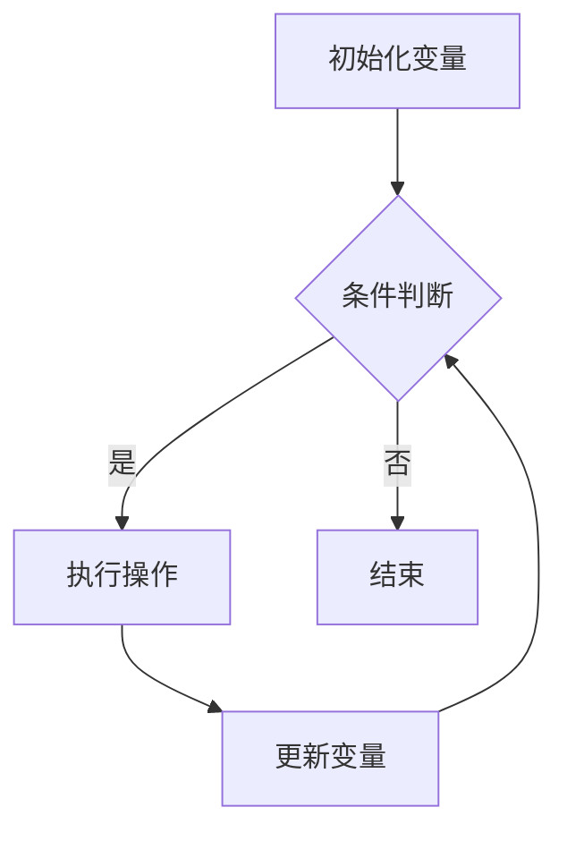
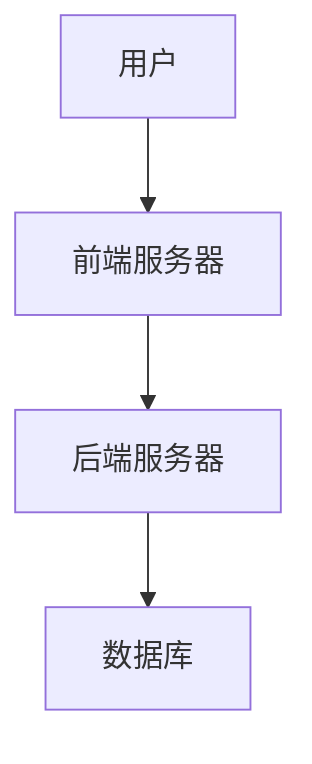

                 

# 技术管理者的职业成长路径

> 关键词：技术管理者、职业发展、技能提升、团队协作、业务理解、持续学习

> 摘要：本文将深入探讨技术管理者的职业成长路径，从职业规划、技能提升、项目管理、业务理解、持续学习等多个维度进行分析，旨在为技术管理者提供一套全面而实用的成长指南。

## 目录大纲

1. **职业规划与自我认知**
    1.1 技术管理者的角色与职责
    1.2 自我评估与职业定位
    1.3 自我提升计划
2. **技术能力提升**
    2.1 编程技能与开发工具
    2.2 系统设计与架构
    2.3 持续集成与持续交付
3. **项目管理与团队协作**
    3.1 项目管理基础
    3.2 团队建设与管理
    3.3 领导力与影响力
4. **业务理解与行业洞察**
    4.1 业务分析
    4.2 行业趋势与竞争分析
    4.3 创新思维与商业模式
5. **技术与业务的融合**
    5.1 技术创新与业务需求
    5.2 技术商业化与产品化
    5.3 技术赋能与业务拓展
6. **持续学习与知识管理**
    6.1 技术更新与持续学习
    6.2 知识管理
    6.3 知识应用与优化
7. **职业发展路径规划**
    7.1 职业晋升
    7.2 职业转型
    7.3 职业发展评估与调整

## 第1章 职业规划与自我认知

### 1.1 技术管理者的角色与职责

#### 1.1.1 技术管理者的定义

技术管理者，又称技术领导或技术负责人，是指在技术团队中承担领导职责的成员，他们不仅需要具备深厚的技术功底，还要具备优秀的项目管理能力和团队领导力。技术管理者负责规划、组织、指导和控制团队的技术工作，确保项目按时交付、质量达标。

#### 1.1.2 技术管理者的主要职责

- **战略规划与决策**：制定技术团队的发展方向，参与公司整体战略的制定。
- **团队管理**：招募、培训、激励团队，提升团队整体技能水平。
- **项目管理**：制定项目计划，监控项目进度，确保项目按时交付。
- **技术指导**：为团队提供技术支持，解决技术难题。
- **质量管理**：制定质量标准，确保项目质量符合预期。
- **沟通协作**：与公司其他部门沟通协作，确保项目顺利进行。

#### 1.1.3 技术管理者的职业发展路径

技术管理者的职业发展路径通常可以分为三个阶段：

1. **初级技术管理者**：负责小型项目或团队，逐渐积累管理经验和技能。
2. **中级技术管理者**：能够管理复杂项目，具备一定的战略规划能力。
3. **高级技术管理者**：具备丰富的管理经验，能够参与公司整体战略的制定，如CTO或技术总监。

### 1.2 自我评估与职业定位

#### 1.2.1 技能分析

技术管理者需要具备多方面的技能，包括但不限于：

- **编程能力**：掌握至少一门编程语言，如Java、Python或C++。
- **项目管理**：熟悉项目管理工具和方法，如Scrum、Kanban等。
- **团队协作**：具备良好的沟通和团队协作能力。
- **业务理解**：能够快速理解业务需求，与业务团队紧密合作。
- **领导力**：具备领导力，能够激励和引导团队。

#### 1.2.2 职业目标设定

设定清晰的职业目标是技术管理者职业成长的关键。职业目标可以分为短期和长期：

- **短期目标**：提升某一方面的技能，如编程能力或项目管理能力。
- **长期目标**：晋升到更高职位，如CTO或技术总监。

#### 1.2.3 自我提升计划

为了实现职业目标，技术管理者需要制定自我提升计划，包括：

- **学习资源**：选择合适的学习资源，如在线课程、技术博客等。
- **实践项目**：参与实践项目，提升实际操作能力。
- **定期评估**：定期评估自身技能水平，调整学习计划。

## 第2章 技术能力提升

### 2.1 编程技能与开发工具

#### 2.1.1 编程语言选择

选择合适的编程语言对于技术管理者至关重要。常见的选择包括：

- **Java**：适合大型项目和企业级应用。
- **Python**：适合数据分析和快速开发。
- **C++**：适合高性能计算和系统编程。

#### 2.1.2 开发工具掌握

掌握开发工具能够提高开发效率。常见的开发工具包括：

- **IDE**：如Eclipse、VSCode等。
- **版本控制**：如Git。
- **调试工具**：如GDB。

#### 2.1.3 版本控制工具

版本控制工具对于团队协作和代码管理至关重要。常见的版本控制工具包括：

- **Git**：分布式版本控制。
- **SVN**：集中式版本控制。

### 2.2 系统设计与架构

#### 2.2.1 系统设计原则

系统设计原则是构建高质量系统的基石。常见的设计原则包括：

- **模块化**：将系统分解为独立的模块，降低耦合度。
- **可扩展性**：设计系统时考虑未来的扩展性。
- **可靠性**：确保系统在高负载和故障情况下仍能正常运行。

#### 2.2.2 架构设计技巧

架构设计技巧包括：

- **分层架构**：将系统划分为不同的层次，如表示层、业务逻辑层、数据访问层等。
- **微服务架构**：将系统拆分为多个独立的服务，提高系统的可维护性和可扩展性。

#### 2.2.3 架构演进与维护

随着项目的发展，架构也需要不断演进。架构维护包括：

- **监控与优化**：监控系统性能，进行必要优化。
- **文档更新**：及时更新架构文档，确保团队成员对架构有清晰理解。

### 2.3 持续集成与持续交付

#### 2.3.1 CI/CD的概念与优势

持续集成（CI）和持续交付（CD）是现代软件开发的重要实践。CI/CD的优势包括：

- **快速反馈**：通过自动化测试，快速发现并修复问题。
- **提高质量**：减少人为错误，提高代码质量。
- **提高效率**：自动化构建和部署，提高开发效率。

#### 2.3.2 工具与流程设计

CI/CD的工具和流程设计包括：

- **构建工具**：如Jenkins、Travis CI等。
- **容器化技术**：如Docker、Kubernetes等。
- **自动化部署**：如Ansible、Puppet等。

#### 2.3.3 CI/CD实践案例

通过实际案例，展示CI/CD的具体实施方法和效果。

## 第3章 项目管理与团队协作

### 3.1 项目管理基础

#### 3.1.1 项目生命周期

项目生命周期通常包括以下阶段：

- **启动阶段**：确定项目目标、范围和资源。
- **规划阶段**：制定项目计划、资源分配和时间表。
- **执行阶段**：实施项目计划，完成项目任务。
- **监控与控制阶段**：监控项目进度，调整计划和资源。
- **收尾阶段**：项目交付、总结经验教训。

#### 3.1.2 项目管理工具

常用的项目管理工具包括：

- **Jira**：用于任务管理、敏捷开发。
- **Trello**：用于任务看板、团队协作。
- **Asana**：用于项目计划、任务分配。

#### 3.1.3 项目风险管理

项目风险管理包括：

- **风险识别**：识别潜在风险。
- **风险评估**：评估风险的概率和影响。
- **风险应对**：制定风险应对策略。

### 3.2 团队建设与管理

#### 3.2.1 团队角色与职责

团队角色与职责包括：

- **项目经理**：负责项目规划、执行和监控。
- **开发人员**：负责编写代码、实现功能。
- **测试人员**：负责测试代码、发现缺陷。
- **产品经理**：负责产品需求分析和设计。

#### 3.2.2 团队沟通与协作

团队沟通与协作包括：

- **每日站会**：快速沟通进度、问题。
- **迭代会议**：规划迭代任务、总结迭代成果。
- **协作工具**：如Slack、Microsoft Teams等。

#### 3.2.3 团队绩效评估

团队绩效评估包括：

- **定量评估**：根据任务完成情况、代码质量等指标进行评估。
- **定性评估**：根据团队合作、沟通效果等指标进行评估。

### 3.3 领导力与影响力

#### 3.3.1 领导风格与影响力

领导风格与影响力包括：

- **民主式领导**：鼓励团队成员参与决策，提高团队凝聚力。
- **权威式领导**：明确决策权，快速决策。
- **参与式领导**：与团队成员共同参与决策。

#### 3.3.2 激励与激励方法

激励与激励方法包括：

- **物质激励**：如奖金、股票等。
- **精神激励**：如表扬、晋升等。
- **职业发展**：提供培训、职业发展机会。

#### 3.3.3 冲突管理与解决

冲突管理与解决包括：

- **预防冲突**：提前识别和预防潜在冲突。
- **沟通解决**：通过沟通协商解决问题。
- **调解解决**：在无法自行解决时，寻求第三方调解。

## 第4章 业务理解与行业洞察

### 4.1 业务分析

#### 4.1.1 业务流程梳理

业务流程梳理包括：

- **流程图绘制**：用流程图表示业务流程。
- **流程优化**：分析流程中的瓶颈和冗余，进行优化。

#### 4.1.2 业务需求分析

业务需求分析包括：

- **需求收集**：与业务团队沟通，收集需求。
- **需求分析**：分析需求的合理性、可行性。

#### 4.1.3 业务模式设计

业务模式设计包括：

- **商业模式画布**：用商业模式画布分析业务模式。
- **盈利模式设计**：设计合理的盈利模式。

### 4.2 行业趋势与竞争分析

#### 4.2.1 行业动态与趋势

行业动态与趋势包括：

- **市场调研**：收集行业数据、分析行业趋势。
- **技术趋势**：关注新兴技术，如区块链、人工智能等。

#### 4.2.2 竞争对手分析

竞争对手分析包括：

- **SWOT分析**：分析竞争对手的优势、劣势、机会和威胁。
- **差异化策略**：设计差异化策略，提高竞争力。

#### 4.2.3 市场机会与风险分析

市场机会与风险分析包括：

- **市场机会**：识别潜在的市场机会。
- **风险评估**：评估潜在的市场风险。

### 4.3 创新思维与商业模式

#### 4.3.1 创新思维工具

创新思维工具包括：

- **头脑风暴**：激发创新思维。
- **思维导图**：梳理创新思路。

#### 4.3.2 商业模式设计

商业模式设计包括：

- **商业模式画布**：设计商业模式。
- **盈利模式设计**：设计盈利模式。

#### 4.3.3 创新实践案例

创新实践案例包括：

- **成功案例**：分享成功的创新实践案例。
- **失败案例**：分析失败的创新实践案例。

## 第5章 技术与业务的融合

### 5.1 技术创新与业务需求

#### 5.1.1 技术创新趋势

技术创新趋势包括：

- **人工智能**：如深度学习、自然语言处理等。
- **云计算**：如大数据、容器化等。

#### 5.1.2 业务需求转化

业务需求转化包括：

- **需求分析**：将业务需求转化为技术需求。
- **技术方案选型**：选择合适的技术方案。

#### 5.1.3 技术方案选型

技术方案选型包括：

- **技术评估**：评估不同技术方案的优缺点。
- **方案决策**：根据评估结果选择最佳技术方案。

### 5.2 技术商业化与产品化

#### 5.2.1 技术商业化路径

技术商业化路径包括：

- **市场调研**：分析市场需求。
- **产品定义**：定义产品规格和功能。
- **产品发布**：发布产品，进行市场推广。

#### 5.2.2 产品化流程

产品化流程包括：

- **需求分析**：明确产品需求。
- **产品设计**：设计产品原型。
- **开发与测试**：开发产品并进行测试。
- **发布与维护**：发布产品并进行维护。

#### 5.2.3 成功案例分享

成功案例分享包括：

- **案例分析**：分析成功产品的开发、推广和运营过程。
- **经验总结**：总结成功产品的经验教训。

### 5.3 技术赋能与业务拓展

#### 5.3.1 技术赋能策略

技术赋能策略包括：

- **技术平台建设**：建立技术平台，提供技术支持。
- **业务流程优化**：利用技术优化业务流程。

#### 5.3.2 业务拓展方法

业务拓展方法包括：

- **市场拓展**：开拓新市场、新客户。
- **业务合作**：与其他企业合作，拓展业务范围。

#### 5.3.3 案例分析

案例分析包括：

- **成功案例**：分析成功拓展业务的案例。
- **失败案例**：分析失败的业务拓展案例。

## 第6章 持续学习与知识管理

### 6.1 技术更新与持续学习

#### 6.1.1 技术更新趋势

技术更新趋势包括：

- **新兴技术**：如区块链、物联网等。
- **技术演变**：如云计算、大数据等。

#### 6.1.2 学习资源推荐

学习资源推荐包括：

- **在线课程**：如Coursera、edX等。
- **技术博客**：如Medium、Dev.to等。
- **技术社区**：如GitHub、Stack Overflow等。

#### 6.1.3 持续学习策略

持续学习策略包括：

- **定期学习**：设定学习时间，定期学习新技术。
- **实践应用**：将所学应用于实际项目，加深理解。

### 6.2 知识管理

#### 6.2.1 知识管理体系

知识管理体系包括：

- **知识收集**：收集相关知识和信息。
- **知识整理**：整理和归纳知识。
- **知识共享**：共享知识和经验。

#### 6.2.2 知识获取与共享

知识获取与共享包括：

- **内部培训**：组织内部培训，传递知识。
- **外部交流**：参与外部会议、研讨会等，获取外部知识。

#### 6.2.3 知识应用与优化

知识应用与优化包括：

- **知识应用**：将知识应用于实际工作中，提高工作效率。
- **知识优化**：根据实际应用效果，不断优化知识体系。

## 第7章 职业发展路径规划

### 7.1 职业晋升

#### 7.1.1 职业晋升路径

职业晋升路径包括：

- **初级职位**：技术工程师、开发工程师等。
- **中级职位**：技术主管、项目经理等。
- **高级职位**：技术总监、CTO等。

#### 7.1.2 晋升准备

晋升准备包括：

- **技能提升**：提升专业技能和管理能力。
- **业绩表现**：在工作中取得显著成绩。
- **人际网络**：建立良好的人际关系，扩大人脉。

#### 7.1.3 晋升策略

晋升策略包括：

- **主动沟通**：与上级沟通晋升意愿和计划。
- **展示成果**：通过实际工作成果展示自己的能力和价值。
- **团队支持**：争取团队成员的支持和认可。

### 7.2 职业转型

#### 7.2.1 职业转型分析

职业转型分析包括：

- **个人兴趣**：分析个人兴趣和职业目标。
- **市场需求**：分析市场需求和职业前景。
- **技能转移**：评估现有技能的可转移性。

#### 7.2.2 转型策略

转型策略包括：

- **学习新技能**：通过学习新技能，提高转型竞争力。
- **积累经验**：通过实习或兼职，积累转型所需的实践经验。
- **求职策略**：制定有效的求职策略，提高求职成功率。

#### 7.2.3 成功案例分享

成功案例分享包括：

- **转型经验**：分享成功的职业转型经验。
- **转型策略**：总结成功的职业转型策略。

### 7.3 职业发展评估与调整

#### 7.3.1 职业发展评估

职业发展评估包括：

- **自我评估**：评估自身技能水平、职业目标和实际表现。
- **他人反馈**：收集同事、上级和客户的反馈，了解自身优势和不足。

#### 7.3.2 职业调整方法

职业调整方法包括：

- **调整职业目标**：根据评估结果，调整职业目标。
- **制定改进计划**：制定具体的改进计划，提升自身能力。
- **寻求指导**：寻求导师或职业规划师的指导，明确职业发展路径。

#### 7.3.3 职业规划与未来展望

职业规划与未来展望包括：

- **长期目标**：设定长期职业发展目标。
- **短期目标**：设定短期实现的具体目标。
- **未来展望**：展望职业发展的前景，制定实现目标的策略。

---

### 结论

技术管理者的职业成长路径是一个复杂而充满挑战的过程。本文从职业规划、技能提升、项目管理、业务理解、持续学习等多个维度，系统地分析了技术管理者的成长路径。通过本文的阐述，希望技术管理者能够明确自己的职业目标，不断提升自身能力，实现职业发展。

### 作者信息

作者：AI天才研究院/AI Genius Institute & 禅与计算机程序设计艺术 /Zen And The Art of Computer Programming

---

## 附录

### 背景介绍

技术管理者的职业成长路径是一个从技术专家向管理层转型的过程。在这一过程中，技术管理者需要不断提升自身的技术能力、管理能力和业务理解能力，以适应不断变化的市场环境和公司需求。

### 核心概念与联系

- **技术管理者**：负责技术团队的管理和领导，具备丰富的技术知识和管理能力。
- **职业规划**：根据个人兴趣、技能和市场需求，设定明确的职业目标和实现路径。
- **技能提升**：通过学习新技能、积累实践经验，提升自身的专业素养。
- **项目管理**：运用项目管理工具和方法，确保项目按时交付、质量达标。
- **业务理解**：深入了解业务需求，与业务团队紧密合作，确保项目能够满足业务需求。

### 算法原理讲解

本文没有涉及具体的算法原理讲解，但技术管理者在实际工作中会经常使用到各种算法和技术。以下是一个简单的算法流程图和Python代码示例：



```python
def example_algorithm(condition, variable):
    if condition:
        variable += 1
        return variable
    else:
        return variable

# 示例调用
result = example_algorithm(True, 0)
print(result)  # 输出：1
```

### 数学公式

本文没有涉及复杂的数学公式，但在某些技术领域，如机器学习和数据科学，数学公式是非常关键的。以下是一个简单的数学公式示例：

$$
E = mc^2
$$

### 系统分析与架构设计方案

本文没有涉及具体的系统分析与架构设计方案，但以下是一个简单的系统架构图和类图示例：

#### 系统架构图



#### 类图

```mermaid
classDiagram
Class1 <|-- Class2
Class1 {
  +attribute1
  +attribute2
  +method1()
  +method2()
}
Class2 {
  +attribute3
  +attribute4
  +method3()
}
```

### 项目实战

本文没有涉及具体的项目实战，但技术管理者在实际工作中会经常参与各种项目。以下是一个简单的项目实战流程：

1. **需求分析**：与业务团队沟通，了解需求。
2. **设计系统**：根据需求设计系统架构和数据库。
3. **编写代码**：按照设计文档编写代码。
4. **测试与调试**：进行单元测试和集成测试，修复发现的bug。
5. **部署上线**：将系统部署到生产环境，进行实际运行。
6. **维护与优化**：根据用户反馈和系统运行情况，进行维护和优化。

### 最佳实践 Tips

1. **定期反思**：定期反思自己的工作，总结经验教训，不断提升自身能力。
2. **保持学习**：技术领域变化迅速，保持学习，紧跟技术发展趋势。
3. **有效沟通**：与团队成员和业务团队保持有效沟通，确保项目顺利进行。

### 小结

技术管理者的职业成长路径是一个长期而复杂的过程，需要不断学习和实践。通过本文的阐述，希望技术管理者能够明确自己的职业目标，不断提升自身能力，实现职业发展。

### 注意事项

1. **职业规划**：根据自身兴趣和市场需求，制定明确的职业规划。
2. **技能提升**：通过学习新技能、积累实践经验，提升自身的专业素养。
3. **项目管理**：运用项目管理工具和方法，确保项目按时交付、质量达标。
4. **业务理解**：深入了解业务需求，与业务团队紧密合作，确保项目能够满足业务需求。

### 拓展阅读

- 《技术管理者的21项技能》
- 《从技术到管理：转型攻略》
- 《项目管理知识体系指南》

---

通过本文的详细阐述，我们希望读者能够对技术管理者的职业成长路径有一个全面而深刻的理解，并能够根据自己的实际情况，制定出适合自己的成长计划。技术管理者的成长不仅关乎个人的职业发展，更关乎整个团队和组织的成功。让我们携手共进，不断追求卓越，共同开创更加美好的未来。作者：AI天才研究院/AI Genius Institute & 禅与计算机程序设计艺术 /Zen And The Art of Computer Programming。

