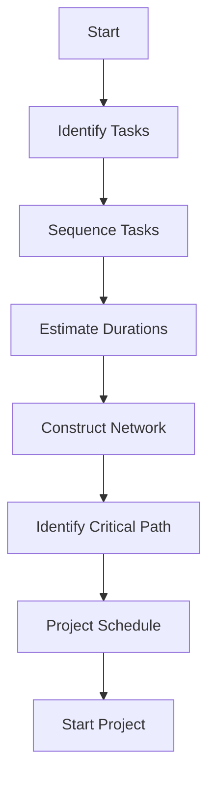
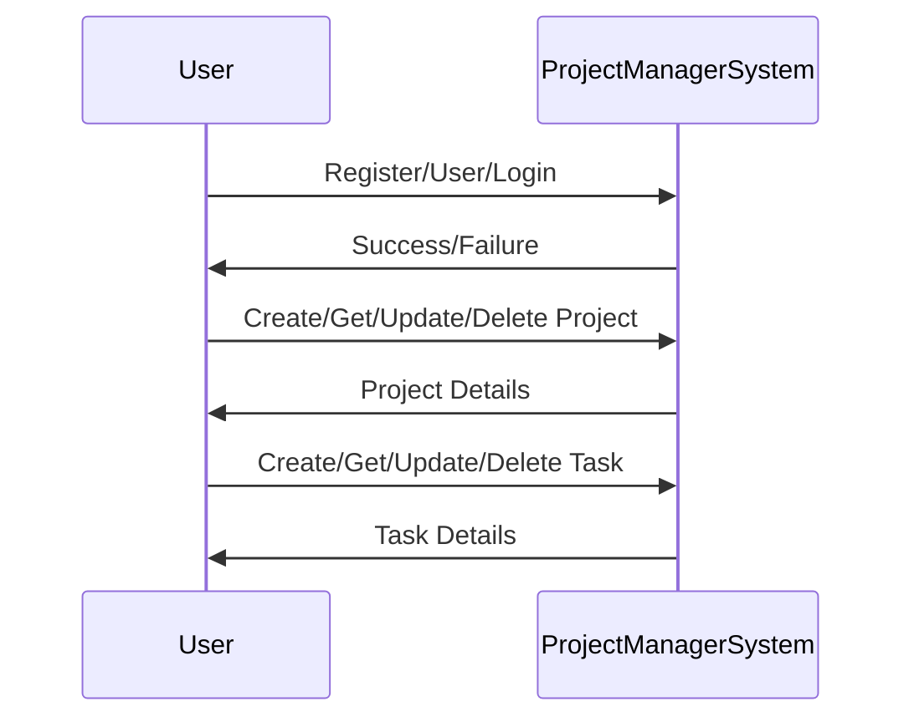

                 

## Technical Manager's Career Planning

### Keywords: Technical Management, Career Development, Leadership, Skills, Career Planning

> In the rapidly evolving landscape of technology, a technical manager's career requires meticulous planning, continuous learning, and strategic decision-making. This article aims to provide a comprehensive guide for aspiring and experienced technical managers to navigate their career paths effectively. By understanding the core concepts, building essential skills, and making informed decisions, technical managers can achieve professional growth and success.

#### Background Introduction

In today's digital age, technology plays a pivotal role in every industry. Technical managers are responsible for overseeing software development, leading teams, and aligning technical initiatives with business goals. This role demands not only technical expertise but also strong leadership and management skills. With the tech industry's constant evolution, technical managers must stay updated with the latest technologies and trends to remain relevant and drive innovation within their organizations.

### Core Concept and Its Applications

**Technical Management** refers to the process of planning, organizing, and controlling resources to achieve specific technical goals within an organization. It involves managing technical projects, leading development teams, and ensuring that technical solutions align with business objectives. Technical management is essential for organizations as it ensures efficient utilization of resources, timely project delivery, and the implementation of innovative solutions.

#### Comparison Table of Core Technical Management Concepts

| Concept                  | Description                                                                                         | Application Examples                |
|--------------------------|---------------------------------------------------------------------------------------------------|-------------------------------------|
| Project Management       | Managing resources to deliver projects within scope, time, and budget.                     | Planning and executing software projects |
| Team Management          | Leading and coordinating team activities to achieve goals.                               | Managing software development teams   |
| Technical Debt           | The consequence of choosing quick solutions over maintainable ones.                       | Addressing code maintainability issues |
| Agile Methodology        | An iterative approach to project management and software development.                     | Implementing Scrum or Kanban practices |
| Strategic Planning       | Aligning technical initiatives with long-term business goals.                             | Developing a technology roadmap       |

#### Entity Relationship Diagram (ERD)

```mermaid
erDiagram
  Project ||--|{ Technical Manager } : manages
  Technical Manager ||--|{ Skill } : has
  Skill ||--|{ Certification } : has
  Team ||--|{ Technical Manager } : leads
  Team ||--|{ Member } : has
  Project ||--|{ Task } : has
```

### Algorithm and Its Implementation

#### Project Management Algorithm

**Algorithm**: Critical Path Method (CPM)

**Flowchart**:


**Python Code**:
```python
def cpm(tasks, durations):
    # Create a network diagram using adjacency list
    network = {task: [] for task in tasks}
    for task in tasks:
        for successor in tasks[task]:
            network[task].append(successor)

    # Perform topological sorting to find the critical path
    sorted_tasks = topological_sort(network)
    critical_path = [sorted_tasks[0]]
    for task in sorted_tasks[1:]:
        if durations[task] > durations[critical_path[-1]]:
            critical_path.append(task)

    return critical_path

def topological_sort(network):
    sorted_tasks = []
    visited = set()

    def dfs(node):
        visited.add(node)
        for successor in network[node]:
            if successor not in visited:
                dfs(successor)
        sorted_tasks.append(node)

    for task in network:
        if task not in visited:
            dfs(task)
    return sorted_tasks[::-1]

# Example usage
tasks = {
    'A': ['B', 'C'],
    'B': [],
    'C': ['D'],
    'D': ['E'],
    'E': []
}
durations = {'A': 5, 'B': 3, 'C': 2, 'D': 4, 'E': 6}

cpm(tasks, durations)
```

**Mathematical Model**:
$$
\text{CPM} = \sum_{i=1}^{n} \text{duration}_{i} \times \text{path}_{i}
$$
where \( \text{duration}_{i} \) is the duration of task \( i \) and \( \text{path}_{i} \) is the presence of task \( i \) in the critical path.

### System Analysis and Design

#### Problem Scenario

As a technical manager, you are tasked with developing a project management tool that helps teams track tasks, set deadlines, and monitor progress. The goal is to streamline project workflows and ensure timely delivery.

#### System Design

**Project Overview**:
The project management tool will be a web-based application that allows users to create projects, assign tasks, set deadlines, and track progress. The system will support multiple users and provide real-time updates.

**Functional Requirements**:
1. User registration and authentication
2. Project creation and management
3. Task creation, assignment, and tracking
4. Real-time progress updates
5. Reporting and analytics

**System Architecture**:
- **Frontend**: React.js
- **Backend**: Node.js with Express
- **Database**: PostgreSQL

**API Design**:
- **POST /users/register**: Register a new user
- **POST /users/login**: Authenticate a user
- **GET /projects**: List all projects
- **POST /projects**: Create a new project
- **GET /projects/{id}**: Get project details
- **PUT /projects/{id}**: Update project details
- **DELETE /projects/{id}**: Delete a project
- **POST /tasks**: Create a new task
- **GET /tasks**: List all tasks
- **GET /tasks/{id}**: Get task details
- **PUT /tasks/{id}**: Update task details
- **DELETE /tasks/{id}**: Delete a task

**Sequence Diagram**:


### Project Implementation and Analysis

#### Environment Setup

1. Install Node.js and npm
2. Install React.js and other dependencies
3. Set up a PostgreSQL database

#### Core Implementation

**User Authentication**:
- Implement registration and login using JSON Web Tokens (JWT)
- Use bcrypt for password hashing

**Project Management**:
- Implement CRUD operations for projects
- Implement role-based access control

**Task Management**:
- Implement CRUD operations for tasks
- Implement real-time updates using WebSocket

**Real-time Updates**:
- Set up a WebSocket server using socket.io
- Update the frontend in real-time when tasks are created, updated, or deleted

**Example Code**:
```javascript
// Backend: Express route for creating a new project
app.post('/projects', async (req, res) => {
    const { name, description, ownerId } = req.body;
    const newProject = await Project.create({ name, description, ownerId });
    io.emit('project-created', newProject);
    res.status(201).json(newProject);
});

// Frontend: React component for creating a new project
const CreateProjectForm = () => {
    const [name, setName] = useState('');
    const [description, setDescription] = useState('');

    const handleSubmit = async (e) => {
        e.preventDefault();
        try {
            const response = await axios.post('/projects', { name, description, ownerId: currentUser.id });
            setProjects([...projects, response.data]);
            setName('');
            setDescription('');
        } catch (error) {
            console.error(error);
        }
    };

    return (
        <form onSubmit={handleSubmit}>
            <input
                type="text"
                value={name}
                onChange={(e) => setName(e.target.value)}
                placeholder="Project Name"
            />
            <input
                type="text"
                value={description}
                onChange={(e) => setDescription(e.target.value)}
                placeholder="Description"
            />
            <button type="submit">Create Project</button>
        </form>
    );
};
```

#### Case Study and Analysis

A case study involving the development of the project management tool reveals several key insights:

1. **Team Collaboration**: The tool facilitates seamless collaboration among team members by providing real-time updates and centralized task management.
2. **Improved Efficiency**: The system simplifies project workflows, reducing the time spent on task tracking and progress updates.
3. **Scalability**: The architecture supports scalability, allowing the addition of new features and handling increased user load.
4. **User Experience**: The intuitive user interface enhances user satisfaction and encourages regular usage.

### Best Practices, Summary, and Considerations

#### Best Practices

- **Agile Methodologies**: Adopt Agile methodologies like Scrum or Kanban to enhance project management efficiency and adaptability.
- **Continuous Integration**: Implement continuous integration and deployment (CI/CD) to ensure code quality and minimize downtime.
- **User Feedback**: Collect and incorporate user feedback to improve system functionality and user satisfaction.

#### Summary

This article has provided a comprehensive guide to technical manager's career planning, covering essential concepts, skills, and strategies. By following the outlined steps and incorporating best practices, technical managers can achieve professional growth and success in their careers.

#### Considerations

- **Continuous Learning**: Stay updated with the latest technologies and industry trends to remain competitive.
- **Work-Life Balance**: Maintain a healthy work-life balance to prevent burnout and enhance productivity.
- **Leadership Development**: Continuously improve leadership skills to effectively manage teams and projects.

### References and Further Reading

- [Project Management Institute (PMI) - Project Management Knowledge Areas](https://www.pmi.org/learning/library/project-management-knowledge-areas-8859)
- [Agile Alliance - Agile Methodology Overview](https://www.agilealliance.org/agile101/)
- [GraphQL - API Design Best Practices](https://graphql.org/learn/best-practices/)

### Conclusion

By understanding the core concepts, developing essential skills, and making informed decisions, technical managers can navigate their career paths effectively. This article serves as a guide to help aspiring and experienced technical managers achieve success in their professional lives. Let's continue to learn, innovate, and grow together in the ever-evolving world of technology.

---

**作者**：AI天才研究院/AI Genius Institute & 禅与计算机程序设计艺术 /Zen And The Art of Computer Programming

----------------------------------------------------------------

# 第一部分: 引言与基础

## 第1章: 技术管理者的职业定位与挑战

### 1.1.1 技术管理者的角色与责任

技术管理者的角色在当今的数字化时代变得越来越重要。他们不仅是技术团队的领导，还是组织内部的关键决策者。作为技术管理者，他们的主要职责包括以下几个方面：

1. **项目领导**：技术管理者负责监督和管理技术项目，确保项目按时、按预算和按质量要求完成。他们需要制定项目计划，分配任务，监控进度，并解决项目中出现的问题。

2. **团队管理**：技术管理者需要领导和管理技术团队，培养团队成员的技能，激励团队成员，协调团队内部的沟通和合作，确保团队高效运转。

3. **技术决策**：技术管理者需要根据业务需求和技术趋势，做出技术方向和架构的决策，确保技术方案符合组织的发展目标。

4. **风险管理**：技术管理者需要识别和评估项目中的风险，制定风险应对策略，确保项目在可控的风险范围内进行。

5. **沟通协调**：技术管理者需要与组织内部的其他部门进行沟通协调，确保技术项目的顺利进行，同时也需要与外部供应商或合作伙伴进行有效的沟通。

### 1.1.2 技术管理面临的挑战

技术管理者在职业生涯中会面临许多挑战，以下是一些典型的挑战：

1. **技术快速变革**：随着技术的快速变革，技术管理者需要不断学习新技能和新技术，以保持竞争力。

2. **团队管理**：技术管理者需要具备出色的团队管理能力，包括人员调配、团队激励、沟通协调等。

3. **资源分配**：技术管理者需要在有限的资源下，合理分配人力、时间和预算，确保项目的高效运行。

4. **沟通障碍**：技术管理者需要与业务部门、管理层和其他技术团队进行有效沟通，以确保项目目标的实现。

5. **技术债务**：技术管理者需要管理技术债务，确保项目的可维护性和可扩展性。

6. **项目管理**：技术管理者需要具备项目管理的能力，包括时间管理、风险管理、质量保证等。

### 1.1.3 技术管理者的职业发展路径

技术管理者的职业发展路径可以分为以下几个阶段：

1. **初级技术管理者**：在这个阶段，技术管理者通常是技术团队的领导者，负责团队的技术工作。

2. **中级技术管理者**：在这个阶段，技术管理者开始参与更高级别的决策，如技术选型、架构设计等。

3. **高级技术管理者**：在这个阶段，技术管理者可能担任技术总监、CTO等职位，负责整个技术部门的运营和管理。

4. **战略技术领导者**：在这个阶段，技术管理者参与组织的战略决策，如技术创新、市场定位等。

### 1.1.4 技术管理者的核心素质

技术管理者需要具备以下核心素质：

1. **技术能力**：技术管理者需要具备扎实的编程基础和丰富的技术经验，以便对技术问题做出明智的决策。

2. **领导力**：技术管理者需要具备出色的领导力，能够激励和培养团队成员，协调团队工作。

3. **商业意识**：技术管理者需要具备商业意识，了解业务需求，能够将技术解决方案与商业目标相结合。

4. **沟通能力**：技术管理者需要具备良好的沟通能力，能够与不同部门和层级的员工进行有效沟通。

5. **决策能力**：技术管理者需要具备快速决策的能力，能够在复杂的情况下做出明智的决策。

### 1.1.5 技术管理者的职业规划

技术管理者的职业规划应该包括以下几个方面：

1. **设定目标**：技术管理者需要明确自己的职业目标，如晋升至更高职位、成为技术领域的专家等。

2. **持续学习**：技术管理者需要不断学习新的技术和管理方法，提升自己的能力。

3. **积累经验**：技术管理者需要在工作中积累经验，学会如何处理各种复杂的情况。

4. **建立人脉**：技术管理者需要建立广泛的人脉，这有助于职业发展和获取更多的机会。

5. **自我反思**：技术管理者需要定期进行自我反思，评估自己的工作表现和职业发展，制定改进计划。

## 第2章: 技术管理的基本素养

### 2.1.1 技术能力的发展

技术管理者的核心素养之一是技术能力。技术能力的发展不仅需要扎实的编程基础，还需要持续的学习和实践。以下是一些关键步骤：

1. **基础知识**：掌握计算机科学的基本概念，包括数据结构、算法、操作系统、网络等。

2. **编程语言**：熟练掌握至少一门编程语言，如Java、Python、C++等。

3. **技术栈**：了解和掌握多个技术领域，如前端、后端、数据库、云计算等。

4. **框架和工具**：熟悉常用的开发框架和工具，如React、Angular、Spring Boot、Docker、Kubernetes等。

5. **实践经验**：通过实际项目积累经验，解决实际问题。

6. **持续学习**：关注技术趋势，学习新技术，如人工智能、大数据、区块链等。

### 2.1.2 领导力和团队管理

技术管理者不仅需要具备技术能力，还需要具备出色的领导力和团队管理能力。以下是一些关键点：

1. **领导力**：了解领导力的基本原则，如激励员工、建立愿景、决策能力等。

2. **团队建设**：培养团队凝聚力，建立有效的沟通机制。

3. **人员管理**：了解团队成员的特长和需求，合理安排工作任务。

4. **冲突管理**：学会处理团队内部的冲突，确保团队和谐。

5. **绩效评估**：制定合理的绩效评估标准，公正评估团队成员的表现。

6. **培训与发展**：提供团队成员培训和职业发展机会。

### 2.1.3 商业意识和战略规划

技术管理者需要具备商业意识和战略规划能力，以下是一些关键点：

1. **业务理解**：了解公司的业务模式、市场定位和目标客户。

2. **成本意识**：了解项目成本，合理安排资源。

3. **风险控制**：识别和管理项目风险，确保项目顺利进行。

4. **战略规划**：参与公司战略规划，为技术发展提供建议。

5. **技术规划**：制定长期的技术规划，确保技术方向与公司目标一致。

### 2.1.4 沟通协调能力

技术管理者需要具备出色的沟通协调能力，以下是一些关键点：

1. **倾听**：积极倾听团队成员和利益相关者的意见和建议。

2. **表达**：清晰、准确地表达自己的想法和意见。

3. **跨部门协作**：与公司内部的其他部门进行有效沟通和协作。

4. **会议管理**：有效组织和参与会议，确保会议高效、有序。

5. **报告撰写**：撰写清晰、详细的报告，向管理层和利益相关者传达信息。

### 2.1.5 决策能力

技术管理者需要具备快速决策的能力，以下是一些关键点：

1. **数据驱动**：基于数据和分析做出决策。

2. **权衡利弊**：在多个选择中权衡利弊，做出最优决策。

3. **风险意识**：识别潜在的风险，制定应对措施。

4. **执行能力**：确保决策得到有效执行。

5. **反思与调整**：对决策的结果进行反思和调整，提高决策能力。

### 2.1.6 自我提升与职业发展

技术管理者需要不断自我提升，以下是一些关键点：

1. **持续学习**：不断学习新知识和技能，跟上技术发展趋势。

2. **参加培训**：参加专业培训和研讨会，提升自己的专业素养。

3. **阅读和研究**：阅读专业书籍、研究论文，了解前沿技术。

4. **实践应用**：将所学知识应用到实际工作中，不断提高实践能力。

5. **建立人脉**：参加行业活动，建立广泛的人脉，获取职业发展机会。

6. **设定目标**：设定明确的职业目标，制定实现目标的计划。

## 第3章: 技术管理者的核心技能

### 3.1.1 项目管理技巧

项目管理是技术管理者的核心技能之一。以下是一些关键的项目管理技巧：

1. **项目计划**：制定详细的项目计划，包括项目目标、任务分解、时间表和资源分配。

2. **任务分配**：根据团队成员的能力和特长，合理分配任务。

3. **进度监控**：定期检查项目进度，确保项目按计划进行。

4. **风险管理**：识别和管理项目风险，制定应对措施。

5. **沟通协调**：与团队成员和利益相关者保持有效沟通，确保信息畅通。

6. **质量保证**：确保项目交付物的质量和满足用户需求。

### 3.1.2 沟通协调能力

良好的沟通协调能力是技术管理者成功的关键。以下是一些提升沟通协调能力的技巧：

1. **倾听**：积极倾听他人的意见和需求，理解他们的观点。

2. **表达**：清晰、准确地表达自己的想法和意见。

3. **会议技巧**：有效组织和参与会议，确保会议高效、有序。

4. **跨部门协作**：与公司内部的其他部门进行有效沟通和协作。

5. **冲突管理**：学会处理团队内部的冲突，确保团队和谐。

6. **报告撰写**：撰写清晰、详细的报告，向管理层和利益相关者传达信息。

### 3.1.3 技术趋势与前瞻性

技术管理者需要具备前瞻性，了解技术趋势，以下是一些关键点：

1. **技术调研**：定期进行技术调研，了解最新的技术动态。

2. **行业洞察**：关注行业趋势，了解竞争对手的技术发展。

3. **创新思维**：培养创新思维，探索新的技术解决方案。

4. **技术选型**：根据业务需求和技术趋势，选择合适的技术方案。

5. **技术规划**：制定长期的技术规划，确保技术方向与公司目标一致。

6. **技术培训**：为团队成员提供技术培训，提高团队的技术能力。

### 3.1.4 团队领导力

技术管理者需要具备出色的团队领导力，以下是一些关键点：

1. **愿景激励**：为团队设定清晰的愿景和目标，激励团队成员。

2. **激励员工**：了解团队成员的需求，提供适当的激励措施。

3. **团队建设**：组织团队建设活动，增强团队凝聚力。

4. **角色定位**：明确团队成员的角色和职责，确保团队高效运作。

5. **冲突管理**：学会处理团队内部的冲突，确保团队和谐。

6. **职业发展**：为团队成员提供职业发展机会，帮助他们成长。

### 3.1.5 时间管理

良好的时间管理能力对于技术管理者至关重要。以下是一些提升时间管理能力的技巧：

1. **任务分解**：将大任务分解为小任务，确保每个任务都有明确的完成时间。

2. **优先级排序**：根据任务的紧急程度和重要性，合理分配时间。

3. **避免拖延**：设定明确的时间限制，避免拖延任务。

4. **定期回顾**：定期回顾时间管理的效果，调整策略。

5. **有效利用工具**：利用时间管理工具，如待办事项列表、时间表等。

6. **平衡工作与生活**：合理安排工作和生活时间，保持身心健康。

### 3.1.6 问题解决能力

技术管理者需要具备出色的问题解决能力，以下是一些关键点：

1. **分析问题**：深入分析问题，了解问题的根本原因。

2. **提出解决方案**：根据分析结果，提出有效的解决方案。

3. **评估风险**：评估解决方案的风险，制定应对措施。

4. **实施解决方案**：实施解决方案，确保问题得到解决。

5. **反思与改进**：对解决方案的效果进行反思，不断改进。

6. **团队协作**：与团队成员协作，共同解决问题。

### 3.1.7 商业意识

技术管理者需要具备商业意识，以下是一些关键点：

1. **了解业务**：了解公司的业务模式、市场定位和目标客户。

2. **成本意识**：了解项目成本，合理安排资源。

3. **风险控制**：识别和管理项目风险，确保项目顺利进行。

4. **技术规划**：制定长期的技术规划，确保技术方向与公司目标一致。

5. **战略思维**：参与公司战略规划，为技术发展提供建议。

6. **决策能力**：基于数据分析，做出明智的决策。

## 第4章: 职业规划与自我提升

### 4.1.1 职业发展路径选择

技术管理者在职业生涯中面临着多种发展路径的选择。以下是一些常见的发展路径：

1. **技术专家路线**：专注于技术领域，成为某一技术的专家或权威。

2. **项目管理路线**：专注于项目管理，成为项目经理或项目总监。

3. **技术领导路线**：成为技术团队的领导者，如技术主管或技术总监。

4. **战略规划路线**：参与公司的战略规划，成为技术总监或CTO。

5. **创业路线**：利用技术背景和经验，创业创办自己的公司。

选择职业发展路径时，需要考虑个人兴趣、技能优势和职业目标。以下是一些建议：

- **评估自身优势**：了解自己的技能和兴趣，选择最适合自己的发展路径。

- **设定目标**：明确自己的职业目标，制定实现目标的计划。

- **持续学习**：不断学习新知识和技能，提升自己的能力。

- **寻求导师指导**：寻找经验丰富的导师，获得职业发展的建议和指导。

### 4.1.2 职业转型与持续学习

随着技术的发展和个人职业目标的变化，技术管理者可能需要考虑职业转型。以下是一些建议：

1. **识别转型机会**：关注行业趋势和市场需求，识别适合自己的转型机会。

2. **评估转型成本**：评估转型的成本，包括时间、金钱和机会成本。

3. **制定转型计划**：制定详细的转型计划，包括学习目标、学习资源和学习进度。

4. **积极行动**：付诸实践，不断尝试和探索。

5. **持续学习**：保持对新技术和新知识的好奇心，不断学习。

持续学习是职业发展的关键。以下是一些建议：

1. **定期学习**：设定学习计划，定期学习新知识和技能。

2. **参加培训**：参加专业培训和研讨会，提升自己的专业素养。

3. **阅读和研究**：阅读专业书籍、研究论文，了解前沿技术。

4. **实践经验**：通过实际项目积累经验，提高实践能力。

5. **建立人脉**：参加行业活动，建立广泛的人脉，获取职业发展机会。

### 4.1.3 自我评估与职业规划

自我评估是职业规划的重要步骤。以下是一些自我评估的方法：

1. **技能评估**：评估自己的技能和知识，了解自己的优势与不足。

2. **兴趣评估**：了解自己的兴趣和偏好，选择最适合自己的职业方向。

3. **价值观评估**：了解自己的价值观，选择符合自己价值观的职业。

4. **职业目标评估**：明确自己的职业目标，制定实现目标的计划。

自我评估后，可以制定以下职业规划：

1. **短期目标**：设定短期目标，如提高某一技能、完成某一项目等。

2. **中期目标**：设定中期目标，如晋升至更高职位、获得某一认证等。

3. **长期目标**：设定长期目标，如成为技术专家、创业等。

4. **行动计划**：制定详细的行动计划，包括学习目标、学习资源和学习进度。

5. **定期回顾**：定期回顾职业规划的实施情况，调整计划。

## 第5章: 拓展视野：技术管理者的跨界思维

### 5.1.1 跨部门协作与资源整合

技术管理者在组织中的角色不仅仅是管理技术团队，还需要与其他部门进行跨部门协作，实现资源的有效整合。以下是一些关键点：

1. **了解业务**：了解其他部门的工作内容和业务需求，确保技术团队能够提供有效的支持。

2. **建立联系**：主动与其他部门建立联系，建立良好的工作关系。

3. **沟通渠道**：建立有效的沟通渠道，确保信息畅通。

4. **协作机制**：制定协作机制，明确各部门的职责和协作流程。

5. **资源共享**：整合各部门资源，实现资源的最大化利用。

### 5.1.2 创新思维与方法

创新思维是技术管理者的重要素质。以下是一些培养创新思维的方法：

1. **思维训练**：通过思维训练，提高思维的灵活性和创造性。

2. **跨学科学习**：学习其他学科的知识，拓宽视野，激发创新思维。

3. **头脑风暴**：组织头脑风暴会议，鼓励团队成员提出创新的想法。

4. **原型设计**：快速构建原型，验证创新想法的可行性。

5. **持续学习**：关注行业动态，学习最新的创新方法和技术。

### 5.1.3 引领行业变革

技术管理者有机会成为行业变革的引领者。以下是一些关键点：

1. **行业洞察**：了解行业趋势，洞察行业变革的方向。

2. **技术前瞻**：关注技术前沿，探索新的技术解决方案。

3. **战略规划**：制定公司的技术战略，引领行业变革。

4. **合作与创新**：与行业内的合作伙伴共同创新，推动行业进步。

5. **持续改进**：不断改进技术和管理方法，提升组织竞争力。

## 第6章: 职业生涯中的关键决策

### 6.1.1 职位选择与职业发展

在职业生涯中，技术管理者会面临多个职位选择，以下是一些关键点：

1. **职位要求**：了解每个职位的要求和职责，确保自己符合职位要求。

2. **职业目标**：考虑自己的职业目标，选择能够帮助自己实现目标的职位。

3. **工作内容**：了解每个职位的工作内容，确保自己对该职位有足够的兴趣和热情。

4. **职业发展**：考虑每个职位的职业发展潜力，选择能够为自己提供更多发展机会的职位。

5. **薪资待遇**：评估每个职位的薪资待遇，确保薪资与职位要求相匹配。

### 6.1.2 薪资谈判与职业回报

在求职和晋升过程中，薪资谈判是重要的一环。以下是一些关键点：

1. **市场调研**：了解行业和市场的薪资水平，确保自己的薪资要求合理。

2. **价值评估**：评估自己的能力和对公司的贡献，提出合理的薪资要求。

3. **谈判策略**：制定谈判策略，准备好支持自己薪资要求的证据和理由。

4. **薪资结构**：了解不同薪资结构的特点，选择最有利于自己的薪资结构。

5. **职业回报**：考虑职业回报的不仅仅是薪资，还包括福利、发展机会和职业满足感。

### 6.1.3 工作与生活的平衡

在职业生涯中，工作与生活的平衡是一个重要的挑战。以下是一些关键点：

1. **时间管理**：合理安排时间，确保工作与生活的平衡。

2. **优先级排序**：明确工作与生活的优先级，确保重要的事情得到妥善处理。

3. **学会放松**：学会放松和休息，保持身心健康。

4. **家庭支持**：寻求家庭的支持，共同创造和谐的家庭环境。

5. **工作与生活相结合**：尝试将工作与生活相结合，寻找工作与生活的平衡点。

## 第7章: 成功技术管理者的特质与经验分享

### 7.1.1 成功技术管理者的特质

成功的技术管理者通常具备以下特质：

1. **技术能力**：具备扎实的编程基础和丰富的技术经验，能够解决复杂的技术问题。

2. **领导力**：具备出色的领导力，能够激励和培养团队成员，带领团队实现目标。

3. **沟通能力**：具备良好的沟通能力，能够与不同部门和层级的员工进行有效沟通。

4. **决策能力**：具备快速决策的能力，能够在复杂的情况下做出明智的决策。

5. **商业意识**：具备商业意识，能够将技术解决方案与商业目标相结合。

6. **持续学习**：具备持续学习的能力，能够不断学习新知识和技能，跟上技术发展趋势。

7. **适应能力**：具备适应变化的能力，能够在不确定和快速变化的环境中保持稳定。

### 7.1.2 经验教训与反思

成功的技术管理者通常会从自己的经验中吸取教训，并进行反思。以下是一些常见的经验教训：

1. **项目管理**：项目成功的关键在于有效的项目管理，包括计划、执行、监控和风险管理。

2. **团队管理**：团队的成功取决于团队成员的协作和沟通，管理者需要关注团队成员的需求和反馈。

3. **沟通**：有效的沟通是项目管理成功的关键，管理者需要确保信息的透明和畅通。

4. **决策**：管理者需要基于数据和事实做出决策，避免盲目决策。

5. **学习**：技术发展迅速，管理者需要不断学习新知识和技能，以保持竞争力。

6. **平衡**：工作与生活的平衡对于管理者的身心健康和长期职业发展至关重要。

### 7.1.3 给新晋技术管理者的建议

对于新晋技术管理者，以下是一些建议：

1. **学习项目管理**：了解项目管理的基本原理和方法，提升项目管理能力。

2. **培养领导力**：学习领导力理论，提升领导力技能，成为团队的领导者。

3. **关注团队沟通**：建立有效的沟通机制，确保团队内部的沟通顺畅。

4. **持续学习**：保持对新技术和新知识的好奇心，不断学习。

5. **寻求反馈**：主动寻求团队成员和上级的反馈，不断改进自己的工作。

6. **平衡工作与生活**：合理安排工作和生活，保持身心健康。

7. **建立人脉**：参加行业活动，建立广泛的人脉，获取职业发展机会。

### 总结

技术管理者的职业生涯规划是一个持续的过程，需要不断地学习和调整。通过了解自己的优势、设定职业目标、培养核心技能和做出明智的决策，技术管理者可以成功地实现职业发展目标。希望本篇博客能够为技术管理者提供有价值的指导和启示。让我们一起在技术管理的道路上不断前行，创造更美好的未来。

