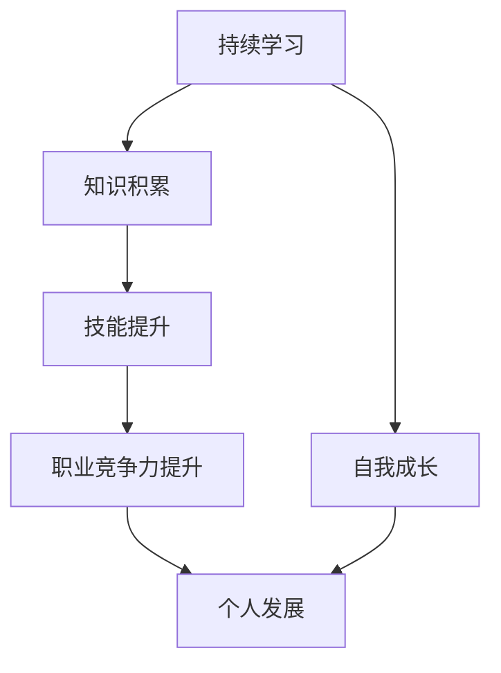

                 

### 第1章：技术管理者的职业发展背景

#### 1.1 产业发展与职业需求

##### 1.1.1 信息时代的到来

信息时代的到来标志着人类社会进入了一个全新的阶段，信息技术以不可逆转的趋势迅猛发展。计算机技术、互联网技术、大数据技术等新兴技术不断涌现，改变了人们的生活方式和工作方式。在这样的大背景下，企业对技术管理者的需求也发生了显著变化。

首先，企业对于技术管理者的角色和职责有了新的期待。传统技术管理者主要负责维护和更新技术设施，而在信息时代，技术管理者需要更多地参与企业的战略规划，推动技术创新，以及管理跨部门协作。他们需要具备更全面的技术视野和战略思维，能够从企业的全局角度出发，制定和实施技术发展战略。

其次，企业对于技术管理者的能力要求也在不断提高。随着技术的快速迭代，技术管理者需要不断更新自己的知识体系，掌握最新的技术趋势和应用。同时，他们还需要具备优秀的管理能力，包括团队管理、项目管理、跨部门沟通等，以确保技术团队能够高效运作，并能够与其他部门密切配合，共同推动企业的发展。

##### 1.1.2 技术管理者的角色演变

技术管理者的角色演变可以追溯到计算机技术的早期发展阶段。最初的计算机技术管理者主要负责硬件设备的维护和软件系统的安装与配置。随着计算机技术的不断发展，他们的职责逐渐扩展到软件的开发和维护，以及网络的构建和管理。

在互联网时代，技术管理者的角色进一步演变。他们不仅需要掌握传统的计算机和网络技术，还需要了解和掌握新兴的互联网技术和应用，如云计算、大数据、人工智能等。技术管理者开始更多地参与企业的业务流程优化，推动企业的数字化转型。

进入信息时代，技术管理者的角色再次发生变化。他们不再只是技术问题的解决者，更是企业的战略合作伙伴。技术管理者需要具备更高的战略思维和领导力，能够从企业的全局角度出发，制定和实施技术发展战略，推动企业的创新和持续发展。

##### 1.1.3 行业发展趋势

信息时代的发展趋势主要表现在以下几个方面：

1. **数字化转型**：数字化转型已经成为各行各业的发展趋势。企业通过数字化手段，优化业务流程，提高生产效率，降低成本，提升客户满意度。技术管理者在这个过程中扮演着关键角色，他们需要推动企业的数字化转型，确保技术基础设施的完善和业务应用的顺利实施。

2. **技术创新**：技术创新是推动企业发展的重要动力。技术管理者需要密切关注行业前沿技术动态，掌握最新的技术趋势和应用，推动企业进行技术创新，保持企业的竞争优势。

3. **人工智能应用**：人工智能技术的快速发展为各行各业带来了巨大的变革。技术管理者需要了解和掌握人工智能技术，探索其在企业中的应用，提升企业的智能化水平。

4. **全球化**：随着全球化的深入发展，企业的业务范围越来越广，技术管理者需要具备跨文化的沟通能力和全球视野，能够有效地管理跨国团队，推动全球化业务的发展。

#### 1.2 技术管理者的职业挑战

##### 1.2.1 技术变革的应对

技术变革的应对是技术管理者面临的重要挑战之一。随着技术的快速迭代，技术管理者需要不断更新自己的知识体系，掌握最新的技术趋势和应用。这要求技术管理者具备良好的学习能力和持续学习的意识。

首先，技术管理者需要建立持续学习的机制。通过参加培训课程、阅读专业书籍、关注行业动态等方式，不断更新自己的知识体系。同时，企业也应该为技术管理者提供良好的学习资源和支持，鼓励他们进行持续学习。

其次，技术管理者需要具备快速学习能力。在面对新的技术挑战时，能够迅速掌握关键技术，并应用到实际工作中。快速学习能力不仅有助于技术管理者应对技术变革，还能够提升其个人竞争力。

##### 1.2.2 团队管理与协作

团队管理与协作是技术管理者的重要职责之一。技术管理者需要具备优秀的管理能力，包括团队组建、团队成员激励、团队绩效评估等。同时，技术管理者还需要提升跨部门协作能力，确保技术团队能够与其他部门密切配合，共同推动企业的发展。

首先，技术管理者需要建立高效的团队管理机制。通过明确团队成员的职责和目标，建立有效的沟通机制，提升团队协作效率。同时，技术管理者还需要关注团队成员的职业发展，提供培训和发展机会，激励团队成员不断提升自身能力。

其次，技术管理者需要提升跨部门协作能力。在数字化转型的背景下，技术管理者需要与其他部门紧密合作，共同推动企业的业务发展。技术管理者需要具备跨文化的沟通能力和团队合作精神，确保跨部门协作的高效进行。

##### 1.2.3 领导力与战略思维

领导力与战略思维是技术管理者的重要素质。在信息时代，技术管理者不仅需要具备优秀的管理能力，还需要具备领导力，能够带领团队实现目标。同时，技术管理者还需要具备战略思维，能够从企业的全局角度出发，制定和实施技术发展战略。

首先，技术管理者需要培养领导力。通过参与领导力培训课程、实践领导力技巧等方式，提升自己的领导能力。技术管理者需要具备良好的沟通能力、决策能力和团队管理能力，能够有效地激励和引导团队成员。

其次，技术管理者需要提升战略思维。通过学习战略管理理论、分析企业战略案例等方式，提升自己的战略思维能力。技术管理者需要能够从企业的全局角度出发，制定和实施技术发展战略，确保企业能够在激烈的市场竞争中保持优势。

##### 1.2.4 职业挑战与应对策略

技术管理者面临的职业挑战包括技术变革、团队管理、领导力提升等方面。为了应对这些挑战，技术管理者可以采取以下策略：

1. **持续学习**：通过参加培训课程、阅读专业书籍、关注行业动态等方式，不断更新自己的知识体系，提升个人竞争力。

2. **提升管理能力**：通过实践管理技巧、参加管理培训等方式，提升团队管理能力，建立高效的团队管理机制。

3. **培养领导力**：通过参与领导力培训课程、实践领导力技巧等方式，提升领导能力，带领团队实现目标。

4. **战略规划**：通过学习战略管理理论、分析企业战略案例等方式，提升战略思维能力，制定和实施技术发展战略。

#### 1.3 技术管理者的职业路径

##### 1.3.1 职业发展初期

在职业发展的初期，技术管理者需要明确自己的职业规划和定位，积累相关技能和经验。这一阶段，技术管理者可以通过以下方式提升自身能力：

1. **技能积累**：通过参加项目实践、学习新技术等方式，积累相关技能和经验。

2. **职业规划**：明确自己的职业发展方向，设定短期和长期目标，制定职业发展规划。

3. **团队合作**：积极参与团队项目，提升团队协作能力和沟通能力。

4. **学习与成长**：通过参加培训课程、阅读专业书籍等方式，不断学习和成长。

##### 1.3.2 职业发展中期

在职业发展的中期，技术管理者需要进一步提升管理能力和领导力，探索职业转型的可能性。这一阶段，技术管理者可以通过以下方式提升自身能力：

1. **管理能力提升**：通过参与管理培训、实际管理项目等方式，提升管理能力。

2. **领导力培养**：通过参与领导力培训课程、实践领导力技巧等方式，提升领导能力。

3. **职业转型**：根据个人兴趣和发展方向，探索职业转型的可能性，如从技术岗位转向管理岗位。

4. **行业交流**：参加行业会议、交流活动，拓宽视野，建立人脉关系。

##### 1.3.3 职业发展高级阶段

在职业发展的高级阶段，技术管理者需要具备较高的战略思维和领导力，能够参与企业的高层决策，推动企业的持续发展。这一阶段，技术管理者可以通过以下方式提升自身能力：

1. **战略规划**：参与企业战略规划，提升战略思维能力。

2. **高层管理**：担任企业高层管理职位，提升领导力和决策能力。

3. **持续学习**：通过参加高级培训课程、阅读专业书籍等方式，持续学习，提升个人能力。

4. **个人品牌建设**：通过建立个人品牌，提升行业影响力，为职业发展创造更多机会。

### 第2章：技术管理者的核心技能

技术管理者在职业发展过程中需要掌握一系列核心技能，这些技能包括技术能力、管理能力和沟通能力等。以下将详细探讨这些技能的重要性和应用。

#### 2.1 技术能力

技术能力是技术管理者的基础技能，也是其核心竞争力之一。技术管理者需要具备扎实的技术素养和广博的知识体系，能够掌握并应用各种前沿技术。

##### 2.1.1 技术素养与知识体系

技术素养是指技术管理者对基本技术的理解能力、应用能力和创新能力。一个合格的技术管理者应该具备以下方面的技术素养：

1. **计算机科学基础**：理解计算机科学的基本概念，如数据结构、算法、操作系统、计算机网络等。

2. **软件开发知识**：掌握软件开发的流程、方法和工具，能够进行高效的软件开发和项目管理。

3. **新兴技术了解**：了解并掌握最新的技术趋势，如人工智能、大数据、云计算等，以便能够应用于企业的实际业务中。

##### 2.1.2 技术研发能力

技术研发能力是技术管理者的核心技能之一，它包括以下方面：

1. **技术项目研发流程**：熟悉技术项目的全过程，包括需求分析、设计、开发、测试和部署等。

2. **技术难题解决方法**：具备解决技术难题的能力，能够快速找到问题的根源，并制定有效的解决方案。

3. **技术创新**：能够进行技术创新，推动企业的技术进步和业务发展。

#### 2.2 管理能力

管理能力是技术管理者的重要素质，它决定了技术团队的工作效率和企业整体的技术实力。

##### 2.2.1 团队管理

团队管理是技术管理者的一项重要职责，它包括以下几个方面：

1. **团队组建与管理**：能够根据项目需求组建合适的团队，并管理团队的工作。

2. **团队成员激励与发展**：通过激励措施和发展机会，激发团队成员的积极性，促进团队成员的职业发展。

3. **团队绩效评估**：制定合理的绩效评估机制，对团队成员的工作进行公正的评估。

##### 2.2.2 项目管理

项目管理是技术管理者的重要技能之一，它包括以下几个方面：

1. **项目计划与执行**：能够制定详细的项目计划，并确保项目按计划执行。

2. **项目风险管理**：识别项目风险，制定风险应对策略，降低项目风险。

3. **项目沟通协调**：确保项目团队与其他部门之间的有效沟通和协作。

#### 2.3 沟通能力

沟通能力是技术管理者必备的软技能，它决定了技术管理者能否有效地传达信息、解决问题和推动项目进展。

##### 2.3.1 内部沟通

内部沟通主要涉及技术部门内部成员之间的沟通，包括以下几个方面：

1. **技术交流**：定期进行技术分享和讨论，促进团队成员之间的技术交流。

2. **团队协作**：建立有效的团队协作机制，确保团队成员能够高效合作。

3. **问题解决**：在遇到技术问题时，能够快速找到解决方案，确保项目顺利进行。

##### 2.3.2 外部沟通

外部沟通主要涉及与技术部门外部的其他部门、客户和供应商之间的沟通，包括以下几个方面：

1. **跨部门协作**：与其他部门建立良好的合作关系，确保项目能够顺利进行。

2. **客户沟通**：理解客户需求，提供专业的技术支持和服务，确保客户满意度。

3. **供应商协作**：与供应商建立稳定的合作关系，确保供应链的顺畅。

#### 2.4 综合能力提升

技术管理者的综合能力提升是一个持续的过程，需要不断地学习和实践。以下是一些提升综合能力的建议：

1. **参加培训课程**：参加专业培训课程，提升管理技能和技术能力。

2. **阅读专业书籍**：阅读专业书籍，了解最新的技术趋势和应用。

3. **实践项目**：参与实际项目，提升实践能力和解决问题的能力。

4. **跨部门交流**：积极参加跨部门交流活动，拓宽视野，提升跨部门协作能力。

### 第3章：技术管理者的职业规划

#### 3.1 职业规划的重要性

职业规划对于技术管理者来说至关重要。一个明确的职业规划可以帮助技术管理者更好地定位自己的职业目标，制定合理的发展策略，提升个人竞争力。以下是职业规划的重要性：

1. **明确职业目标**：通过职业规划，技术管理者可以明确自己的职业目标，包括短期目标和长期目标。这有助于他们更好地规划职业生涯，避免盲目发展。

2. **制定发展策略**：职业规划可以帮助技术管理者制定合理的发展策略，包括技能提升、管理能力提升和职业转型等。这有助于他们有针对性地提升自身能力，实现职业目标。

3. **提升个人竞争力**：一个明确的职业规划有助于技术管理者在职业发展中不断提升个人竞争力，从而在职场中获得更多的机会。

4. **优化职业路径**：通过职业规划，技术管理者可以优化自己的职业路径，避免不必要的弯路，提高职业发展的效率。

##### 3.1.1 职业目标设定

设定明确的职业目标是职业规划的第一步。职业目标的设定需要考虑以下几个方面：

1. **短期目标**：短期目标通常设定在1-3年内，包括技能提升、管理能力提升、项目完成等。例如，学习某项新技术、完成某个关键项目、提升团队管理能力等。

2. **长期目标**：长期目标通常设定在3-5年内，包括职业晋升、职位转型、职业突破等。例如，担任技术部门主管、担任公司高层管理职位、实现职业转型等。

3. **具体可行**：职业目标需要具体可行，具有实际操作性。设定目标时，要考虑个人的兴趣、能力、行业趋势和企业需求等因素。

##### 3.1.2 职业路径选择

职业路径的选择是职业规划的重要组成部分。技术管理者可以根据自己的兴趣、能力和职业目标，选择以下几种职业路径：

1. **技术路径**：技术路径是技术管理者的传统职业路径，主要包括技术专家、技术经理等职位。选择技术路径的技术管理者需要在技术领域不断深耕，提升自己的技术能力和知识水平。

2. **管理路径**：管理路径是技术管理者向管理层发展的职业路径，主要包括项目经理、技术总监、CTO等职位。选择管理路径的技术管理者需要提升自己的管理能力和领导力，具备良好的团队管理和项目组织能力。

3. **跨界路径**：跨界路径是技术管理者跳出传统技术领域，向其他领域发展的职业路径。选择跨界路径的技术管理者需要具备跨学科的知识和技能，能够适应不同领域的工作环境。

##### 3.1.3 职业发展策略

职业发展策略是实现职业目标的重要手段。以下是一些常见的职业发展策略：

1. **技能提升**：通过学习新技术、参加培训课程、获取专业证书等方式，不断提升自己的技能水平。

2. **管理能力提升**：通过参与管理培训、实际管理项目、领导力提升课程等方式，提升自己的管理能力。

3. **人脉建设**：通过参加行业会议、交流活动、建立个人品牌等方式，扩大自己的人脉圈，获取更多的职业机会。

4. **职业转型**：根据个人兴趣和职业目标，适时进行职业转型，如从技术岗位转向管理岗位，或从技术领域转向其他领域。

#### 3.2 职业规划的实施

职业规划的实施是职业规划的关键环节。以下是一些实施职业规划的建议：

1. **定期评估与调整**：定期评估自己的职业发展进度，根据实际情况调整职业规划，确保职业规划的实施效果。

2. **设定具体行动计划**：将职业规划分解为具体的行动计划，设定明确的时间表和目标，确保每一步行动都落到实处。

3. **持续学习和成长**：持续学习和成长是实现职业目标的基础。通过不断学习新知识、提升技能、扩展视野，保持自己在职业发展中的竞争力。

4. **寻求支持和帮助**：在职业规划的实施过程中，可以寻求导师、同事和朋友的帮助和支持，他们可以提供宝贵的建议和指导，帮助自己更好地实现职业目标。

### 第4章：技术管理者的软技能

#### 4.1 领导力

领导力是技术管理者必须具备的重要软技能。一个优秀的领导力不仅能够带领团队实现目标，还能够激发团队成员的积极性和创造力，提升团队的整体绩效。

##### 4.1.1 领导风格

领导风格是指领导者在领导过程中所采用的方式和手段。根据情境领导理论，领导风格可以分为四种：

1. **指导型领导**：领导者对团队成员给予明确的指导和指示，告诉他们应该做什么、怎么做。这种领导风格适用于任务复杂、团队成员经验不足的情况。

2. **支持型领导**：领导者关心团队成员的需求，提供支持和帮助，鼓励团队成员自主决策和发挥创造力。这种领导风格适用于团队成员自主性较强、任务较为简单的情况。

3. **参与型领导**：领导者与团队成员共同参与决策，尊重团队成员的意见和建议，促进团队成员之间的沟通和协作。这种领导风格适用于需要团队合作和创新的任务。

4. **授权型领导**：领导者赋予团队成员更多的自主权和决策权，让团队成员自主管理自己的工作和任务。这种领导风格适用于高度自治和自我管理的团队。

##### 4.1.2 领导力提升

提升领导力是技术管理者职业发展的重要环节。以下是一些提升领导力的方法：

1. **领导力培训**：参加专业的领导力培训课程，学习领导力的理论知识和管理技巧。

2. **实践经验**：通过实际工作中的领导实践，不断积累经验和提升领导力。

3. **反思与总结**：定期反思自己的领导行为和团队表现，总结经验教训，不断改进自己的领导方式。

4. **寻求反馈**：向导师、同事和下属寻求反馈，了解自己的领导风格和团队成员的需求，针对性地改进自己的领导能力。

##### 4.1.3 领导力的应用

领导力在技术管理中的具体应用包括：

1. **团队管理**：通过领导力，技术管理者可以有效地组建和管理团队，提升团队的协作效率和绩效。

2. **项目管理**：在项目管理中，技术管理者需要运用领导力来规划项目、协调资源、控制风险，确保项目按计划完成。

3. **创新推动**：通过领导力，技术管理者可以激发团队成员的创新意识，推动技术创新和业务发展。

#### 4.2 创新能力

创新能力是技术管理者在快速变化的科技环境中不可或缺的软技能。一个具备创新能力的技术管理者能够推动团队和企业持续发展，保持竞争优势。

##### 4.2.1 创新思维

创新思维是指运用创造性思维方法和技巧，提出新观念、新方案、新产品的能力。以下是一些创新思维的技巧：

1. **头脑风暴**：通过集体讨论，激发团队成员的创意思维，快速产生新的想法。

2. **思维导图**：利用思维导图工具，将创新想法可视化，帮助团队成员更好地理解和协作。

3. **反向思维**：从相反的角度思考问题，寻找突破性的解决方案。

4. **跨学科融合**：结合不同学科的知识和观点，进行跨界创新。

##### 4.2.2 创新管理

创新管理是指运用系统的方法和工具，推动创新项目的实施和管理。以下是一些创新管理的策略：

1. **创新激励机制**：建立创新的奖励机制，鼓励团队成员提出和实施创新想法。

2. **创新流程优化**：通过流程优化，缩短创新项目的时间周期，提高创新效率。

3. **资源保障**：为创新项目提供必要的资源支持，包括资金、技术和人力等。

4. **风险管理**：识别创新项目中的风险，制定风险应对策略，降低创新失败的风险。

##### 4.2.3 创新实践

在技术管理者的日常工作中，创新实践是提升创新能力的重要途径。以下是一些创新实践的方法：

1. **定期创新会议**：组织定期的创新会议，让团队成员分享创新想法，进行讨论和评估。

2. **创新实验室**：建立创新实验室，为团队成员提供创新的实验环境和资源，鼓励他们进行探索和实践。

3. **跨部门合作**：与其他部门的团队合作，整合不同领域的知识和资源，推动创新项目的实施。

4. **用户反馈**：通过与用户的互动，了解用户需求和痛点，为创新提供实际依据。

#### 4.3 软技能提升

软技能的提升是技术管理者职业发展的关键。以下是一些提升软技能的方法：

1. **领导力培训**：通过参加领导力培训课程，提升领导力和团队管理能力。

2. **沟通技巧培训**：通过沟通技巧培训，提升与团队成员、上级和客户的沟通能力。

3. **时间管理**：通过时间管理培训，提升工作效率和时间利用率。

4. **职业规划**：制定明确的职业规划，提升职业发展目标和管理能力。

5. **持续学习**：通过学习新知识、新技能，不断提升自身能力和竞争力。

### 第5章：技术管理者的成长路径

技术管理者的成长路径可以分为三个阶段：初级阶段、中级阶段和高级阶段。每个阶段都有不同的目标和要求，以下将详细探讨这些阶段的特点和发展方向。

#### 5.1 初级阶段

初级阶段是技术管理者职业生涯的起始阶段，这一阶段的主要目标是积累技术和管理经验，建立基本的知识体系。

##### 5.1.1 技术入门

在初级阶段，技术管理者需要掌握基本的技术知识和技能。这包括：

1. **计算机科学基础**：理解计算机科学的基本概念，如数据结构、算法、操作系统、计算机网络等。
2. **编程语言**：掌握至少一门编程语言，如Java、Python、C++等。
3. **软件开发流程**：熟悉软件开发的基本流程，包括需求分析、设计、编码、测试和部署等。
4. **工具使用**：掌握常用的开发工具，如IDE、版本控制工具、调试工具等。

##### 5.1.2 团队协作

团队协作能力是初级阶段的重要技能。技术管理者需要学会如何在团队中沟通、合作和解决问题。具体包括：

1. **沟通技巧**：学会有效沟通，包括清晰表达自己的想法、倾听他人的意见和反馈。
2. **团队合作**：积极参与团队项目，与团队成员紧密合作，共同完成任务。
3. **项目管理**：了解项目管理的基本知识，如项目计划、任务分配、进度跟踪等。

##### 5.1.3 技术实践

初级阶段的技术管理者应积极参与实际项目，通过实践来提升自己的技术能力和解决问题的能力。具体包括：

1. **参与项目**：参与公司的实际项目，从项目中学习技术和项目管理经验。
2. **技术难题解决**：面对实际的技术难题，学会独立分析和解决问题。
3. **代码审查**：参与代码审查，提升自己的代码质量和编程能力。

#### 5.2 中级阶段

中级阶段是技术管理者职业生涯的关键阶段，这一阶段的主要目标是提升管理能力，培养团队领导力。

##### 5.2.1 管理能力提升

在中级阶段，技术管理者需要提升自己的管理能力，以更好地领导和指导团队。具体包括：

1. **团队管理**：学会如何管理团队，包括团队建设、成员激励、绩效评估等。
2. **项目管理**：掌握项目管理的方法和工具，如Scrum、Kanban等，能够有效地规划和控制项目进度。
3. **风险管理**：学会识别和管理项目风险，确保项目顺利进行。
4. **决策能力**：提升决策能力，能够在复杂的环境中做出正确的决策。

##### 5.2.2 技术深度

在中级阶段，技术管理者还需要在技术领域进行深入学习和研究，以提升自己的技术深度。具体包括：

1. **技术领域知识**：深入学习某一技术领域，成为该领域的专家。
2. **技术趋势**：关注技术发展趋势，掌握最新的技术动态。
3. **技术分享**：定期进行技术分享，提升自己的技术表达能力。

##### 5.2.3 职业发展

中级阶段的技术管理者应考虑自己的职业发展，包括：

1. **晋升机会**：寻求晋升机会，如成为技术团队主管或项目经理。
2. **职业规划**：制定清晰的职业规划，包括短期和长期目标。
3. **职业转型**：根据个人兴趣和职业目标，考虑是否进行职业转型。

#### 5.3 高级阶段

高级阶段是技术管理者职业生涯的成熟阶段，这一阶段的主要目标是成为企业的技术战略合作伙伴，参与企业的高层决策。

##### 5.3.1 领导力培养

在高级阶段，技术管理者需要进一步提升自己的领导力，以更好地带领团队和企业发展。具体包括：

1. **领导风格**：根据团队和企业的实际情况，选择合适的领导风格，如指导型、支持型、参与型等。
2. **领导力培训**：参加高级领导力培训课程，提升领导能力和影响力。
3. **团队建设**：构建高效的团队，激发团队成员的潜力和创造力。

##### 5.3.2 战略思维

在高级阶段，技术管理者需要具备战略思维能力，能够从企业的全局角度出发，制定和实施技术发展战略。具体包括：

1. **战略规划**：参与企业的战略规划，提出技术发展的建议和方案。
2. **技术创新**：推动企业的技术创新，保持企业的技术竞争力。
3. **业务对接**：将技术战略与企业的业务战略紧密结合，推动企业的业务发展。

##### 5.3.3 高层管理

在高级阶段，技术管理者应考虑进入企业的高层管理层，如CTO、CIO等职位。具体包括：

1. **职位晋升**：寻求职位晋升机会，提升自己的职业地位和影响力。
2. **决策参与**：参与企业的高层决策，为企业的发展提供技术指导。
3. **企业影响力**：提升自己的行业影响力，成为企业的重要技术顾问。

#### 5.4 成长路径规划

为了在技术管理者的成长路径上取得成功，以下是一些规划建议：

1. **自我评估**：定期进行自我评估，了解自己的优势和不足，制定相应的提升计划。
2. **持续学习**：保持持续学习的态度，通过培训、阅读、实践等方式不断提升自己。
3. **职业规划**：制定明确的职业规划，包括短期和长期目标，并制定实现目标的行动计划。
4. **人脉建设**：积极参与行业活动，建立广泛的人脉关系，获取更多的职业机会。
5. **反馈与改进**：积极寻求反馈，根据反馈调整自己的职业规划和发展策略。

### 第6章：技术管理者的职业机会

#### 6.1 行业趋势

随着科技的快速发展，技术管理者的职业机会也在不断增多。以下是一些重要的行业趋势，为技术管理者提供了广阔的职业机会：

##### 6.1.1 数字化转型

数字化转型已成为全球企业的战略重点，技术管理者在推动企业数字化转型中扮演着关键角色。数字化转型涉及到企业的方方面面，包括业务流程、组织结构、技术架构等。技术管理者需要具备以下技能：

1. **数字化战略规划**：制定企业的数字化战略，明确数字化转型的目标和路径。
2. **技术选型与实施**：选择合适的技术方案，并推动技术的落地实施。
3. **数据管理**：负责数据治理、数据分析和数据安全，确保数据的有效利用。

##### 6.1.2 人工智能应用

人工智能技术的快速发展为各行各业带来了巨大的变革，技术管理者在人工智能应用领域也面临着新的职业机会。以下是一些具体的应用领域：

1. **智能制造**：通过人工智能技术提升生产效率和质量，降低成本。
2. **智能客服**：利用自然语言处理技术，提供智能化的客户服务。
3. **智能医疗**：利用人工智能技术，提高医疗诊断的准确性和效率。

##### 6.1.3 云计算与大数据

云计算和大数据技术的广泛应用，为技术管理者提供了丰富的职业机会。技术管理者需要具备以下技能：

1. **云计算架构设计**：设计并实施云计算平台，提高企业的计算能力和数据存储能力。
2. **大数据处理与分析**：负责大数据的处理和分析，为企业的决策提供数据支持。
3. **数据安全和隐私保护**：确保数据的安全和隐私，遵守相关的法律法规。

#### 6.2 职业机会

技术管理者的职业机会不仅局限于技术创新和数字化转型，还包括以下方面：

##### 6.2.1 技术岗位

技术岗位是技术管理者的传统职业路径，以下是一些热门的技术岗位：

1. **软件工程师**：负责软件的开发和维护，解决技术难题。
2. **系统架构师**：负责系统的架构设计和技术选型，确保系统的稳定性和可扩展性。
3. **数据工程师**：负责数据的存储、处理和分析，构建数据平台。

##### 6.2.2 管理岗位

随着技术管理者的经验和能力的提升，他们可以转向管理岗位，发挥更大的领导作用。以下是一些管理岗位：

1. **项目经理**：负责项目的规划、执行和监控，确保项目按时完成。
2. **技术经理**：负责技术团队的管理，提升团队的技术能力和工作效率。
3. **技术总监**：负责整个技术部门的管理，制定技术发展战略。

##### 6.2.3 创业机会

技术管理者在积累了一定的经验和资源后，也可以选择创业。创业机会主要包括：

1. **技术创新企业**：专注于技术创新，开发具有竞争力的产品和服务。
2. **技术咨询服务**：为企业提供技术咨询服务，帮助他们解决技术难题。
3. **技术培训与教育**：开设技术培训课程，为企业培养技术人才。

#### 6.3 职业发展路径

技术管理者的职业发展路径可以分为以下几个阶段：

##### 6.3.1 初级阶段

初级阶段主要关注技术技能的积累和管理基础的建立。技术管理者需要：

1. **掌握基础技术**：学习编程语言、数据库、网络等基础技术。
2. **参与项目**：参与实际项目，积累项目管理经验。
3. **提升团队协作能力**：学会与团队成员有效沟通和协作。

##### 6.3.2 中级阶段

中级阶段主要关注管理能力的提升和技术深度的加强。技术管理者需要：

1. **提升管理能力**：学习项目管理、团队管理等方面的知识。
2. **深化技术领域**：成为某一技术领域的专家，提升技术水平。
3. **拓宽视野**：了解行业动态，关注新兴技术趋势。

##### 6.3.3 高级阶段

高级阶段主要关注战略思维的培养和企业高层管理的参与。技术管理者需要：

1. **制定战略规划**：参与企业的战略规划，提供技术发展方向的建议。
2. **领导技术创新**：推动企业的技术创新，保持企业的竞争力。
3. **参与高层决策**：参与企业的高层决策，为企业的发展提供技术支持。

#### 6.4 职业发展建议

为了在技术管理者的职业发展中取得成功，以下是一些建议：

1. **持续学习**：不断学习新技术、新管理理念，提升自身能力。
2. **积累经验**：通过实际项目和管理经验，不断提升自己的职业素养。
3. **建立人脉**：积极参与行业活动和社交，扩大人脉圈，获取更多的职业机会。
4. **规划职业路径**：明确自己的职业目标和发展方向，制定合理的职业规划。
5. **勇于挑战**：敢于接受新的挑战，勇于承担更多的责任，提升自己的领导力和影响力。

### 第7章：技术管理者的持续学习与个人发展

#### 7.1 学习方式

持续学习是技术管理者保持竞争力和适应行业发展变化的关键。以下是一些有效的学习方式：

##### 7.1.1 线上学习

线上学习具有灵活性和高效性的优势，适合技术管理者利用碎片时间进行学习。以下是一些线上学习的资源：

1. **MOOC平台**：如Coursera、edX、Udacity等，提供丰富的课程，涵盖计算机科学、数据科学、人工智能等多个领域。

2. **技术博客和社区**：如GitHub、Stack Overflow、Medium等，可以获取最新的技术动态和最佳实践。

3. **在线论坛和研讨会**：如Reddit、LinkedIn等，可以参与讨论和交流，扩大知识面。

##### 7.1.2 线下学习

线下学习具有互动性和实践性的优势，能够更好地促进知识的内化和应用。以下是一些线下学习的资源：

1. **技术会议和研讨会**：如Google I/O、AWS re:Invent、TED等，可以了解行业最新趋势和前沿技术。

2. **技术培训班**：如IT培训中心、专业培训机构等，提供系统的课程和实战演练。

3. **大学和研究生课程**：参加大学和研究生课程，获取正规的教育认证。

##### 7.1.3 混合式学习

混合式学习结合了线上和线下学习的优点，能够更全面地满足技术管理者的学习需求。以下是一些混合式学习的建议：

1. **在线课程与线下实践相结合**：通过在线课程学习理论知识，再通过实际项目或实验室进行实践，加深对知识的理解和应用。

2. **学术交流与实际应用相结合**：参加学术交流，了解最新的研究成果，并将其应用于实际工作中。

3. **团队学习和个人学习相结合**：与技术团队一起学习，分享知识和经验，同时保持个人的独立学习和思考。

#### 7.2 个人发展

个人发展是技术管理者职业生涯的重要组成部分。以下是一些个人发展的策略：

##### 7.2.1 职业规划调整

职业规划调整是技术管理者个人发展的重要步骤。以下是一些建议：

1. **定期评估**：定期评估自己的职业发展进度，了解自己在职业发展中的优势和不足。

2. **设定新目标**：根据评估结果，设定新的职业目标，包括短期和长期目标。

3. **调整发展路径**：根据新的职业目标，调整自己的职业发展路径，选择适合自己的职业方向。

##### 7.2.2 个人品牌建设

个人品牌建设是技术管理者提升行业影响力和职业竞争力的重要途径。以下是一些建议：

1. **社交媒体**：利用LinkedIn、Twitter、GitHub等社交媒体平台，展示自己的专业技能和成果。

2. **技术博客**：定期撰写技术博客，分享自己的知识和经验，提高自己在行业中的知名度。

3. **演讲和讲座**：参加技术会议和研讨会，进行演讲和讲座，扩大自己的人脉和影响力。

##### 7.2.3 行业影响力

提升行业影响力是技术管理者实现个人发展的重要目标。以下是一些建议：

1. **参与行业组织**：加入行业协会、技术社区等组织，参与行业活动和讨论。

2. **技术贡献**：在开源项目中贡献代码，分享技术方案，成为行业内的技术专家。

3. **撰写论文和报告**：在学术期刊和会议上发表技术论文，撰写行业报告，为行业的发展做出贡献。

##### 7.2.4 拓展阅读

持续阅读是技术管理者扩展知识面和提升思维能力的重要方式。以下是一些建议：

1. **经典书籍**：《计算机网络》、《算法导论》、《软件工程》等经典书籍，可以帮助技术管理者建立扎实的技术基础。

2. **最新研究报告**：关注行业研究报告，了解最新的技术趋势和行业发展动态。

3. **技术博客**：阅读技术大牛的博客，学习他们的思路和经验，开阔自己的视野。

#### 7.3 持续学习与个人发展的关系

持续学习与个人发展密切相关。持续学习是个人发展的基础，通过不断学习新的知识和技能，技术管理者能够不断提升自己的职业竞争力。而个人发展则是持续学习的目的和动力，通过个人发展，技术管理者可以实现职业目标，提升生活质量。

以下是一个图表，展示持续学习与个人发展的关系：

通过持续学习和自我成长，技术管理者可以实现知识的积累和技能的提升，从而提升职业竞争力，实现个人发展的目标。

### 总结

技术管理者的职业规划是一个持续的过程，需要不断地学习和适应行业变化。通过明确职业目标、提升核心技能、持续学习和个人发展，技术管理者可以不断提升自己的职业竞争力，实现职业生涯的成功。在这个快速变化的科技时代，技术管理者需要保持学习的热情和勇气，勇于面对挑战，抓住机遇，实现自己的职业梦想。作者：AI天才研究院/AI Genius Institute & 禅与计算机程序设计艺术 /Zen And The Art of Computer Programming

