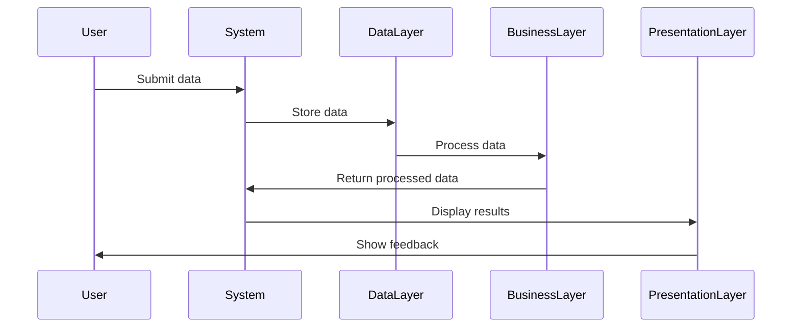
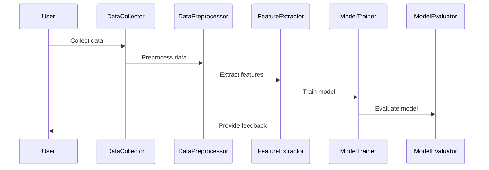

                 

### 文章标题：技术管理者的自我反思：持续成长的内省习惯

#### 关键词：技术管理者、自我反思、持续成长、内省习惯

> 摘要：本文将探讨技术管理者在持续成长过程中如何通过自我反思和内省习惯来实现个人能力的提升和职业发展。我们将详细分析自我反思、持续成长和内省习惯的核心概念与联系，并介绍一种基于机器学习的自我反思算法，结合实际案例，提供实用的成长指南。

----------------------------------------------------------------

# 技术管理者的自我反思：持续成长的内省习惯

技术管理者的角色在当今快速发展的技术行业中变得至关重要。他们不仅需要具备卓越的技术能力，还要掌握有效的管理技能和领导力，以便推动团队和技术项目的发展。然而，在这样一个充满挑战和变革的环境下，技术管理者如何确保自己能够持续成长，以应对不断变化的需求和压力，成为了亟待解决的问题。

### 第一部分：背景介绍

#### 1.1 问题背景

随着科技的飞速发展，技术管理者的职责范围不断扩大。他们不仅需要管理技术团队，还要关注项目进度、资源分配、技术选型等各个方面。在这个过程中，技术管理者往往面临以下问题：

- 如何在繁重的工作中找到时间进行自我反思？
- 如何识别自身的优点和不足，并制定有效的改进计划？
- 如何培养团队，提高团队的整体绩效？
- 如何在复杂的技术环境中保持敏锐的洞察力？

#### 1.2 问题描述

技术管理者的持续成长涉及到多个方面，包括个人技能的提升、管理能力的培养以及对行业趋势的把握。他们需要不断地反思自己的管理方式和方法，以找到适合自己成长的道路。然而，目前市场上缺乏一本系统、全面的书籍，专门针对技术管理者的自我反思和持续成长提供指导。

#### 1.3 问题解决

《技术管理者的自我反思：持续成长的内省习惯》旨在填补这一市场空白，通过系统地介绍自我反思的方法和习惯，帮助技术管理者找到适合自己的成长路径。本书不仅涵盖自我反思的理论基础，还结合实际案例，提供实用的操作指南。

#### 1.4 边界与外延

本书主要面向技术管理者，包括软件开发经理、技术项目经理、技术部门主管等。同时，对于希望提升自身管理能力的技术人员以及关注技术管理领域的专业人士，也具有一定的参考价值。

#### 1.5 概念结构与核心要素组成

1. **自我反思**：自我反思是指技术管理者通过内省、分析自己的行为、思考过程和价值观，以便发现自身优缺点，找到改进的方法。
2. **持续成长**：持续成长是指技术管理者在职业生涯中不断学习、进步，提升个人能力，实现职业发展的目标。
3. **内省习惯**：内省习惯是指技术管理者在日常工作和生活中，养成定期进行自我反思的习惯，从而促进持续成长。

---

### 第二部分：核心概念与联系

#### 2.1 自我反思的定义与重要性

##### 2.1.1 自我反思的定义

自我反思是指技术管理者在特定情境下，对自身行为、思考过程和价值观进行深入分析和评价的过程。这种反思可以帮助他们更清楚地认识自己的优点和不足，从而制定出有针对性的改进措施。

##### 2.1.2 自我反思的重要性

自我反思对于技术管理者的成长至关重要。具体来说，它具有以下重要性：

- **发现自身优缺点**：通过自我反思，技术管理者可以识别自己的优势和不足，从而有针对性地进行改进。
- **改进管理方法**：自我反思可以帮助技术管理者发现自己的管理方式是否有效，从而调整和优化管理策略。
- **提升团队绩效**：通过自我反思，技术管理者可以更好地理解团队成员的需求和期望，从而提高团队的整体绩效。
- **实现职业发展目标**：自我反思可以帮助技术管理者明确自己的职业发展目标，并制定出实现这些目标的策略和计划。

#### 2.2 持续成长的概念与要素

##### 2.2.1 持续成长的概念

持续成长是指技术管理者在职业生涯中不断学习、进步，提升个人能力，实现职业发展的目标。这种成长是一个持续的过程，需要技术管理者具备以下几个要素：

- **学习能力**：技术管理者需要不断学习新知识、新技能，以保持自己的竞争力。
- **反思能力**：技术管理者需要具备反思能力，能够从自身和团队的工作中总结经验教训，不断优化管理方法。
- **行动能力**：技术管理者需要将反思的结果转化为具体的行动，通过实践来检验和验证自己的改进措施。

#### 2.3 内省习惯的养成与实践

##### 2.3.1 内省习惯的定义

内省习惯是指技术管理者在日常工作和生活中，养成定期进行自我反思的习惯。这种习惯可以帮助他们更加自觉地关注自己的行为和思维，从而实现持续成长。

##### 2.3.2 内省习惯的重要性

内省习惯对于技术管理者的持续成长具有重要意义。具体来说，它具有以下重要性：

- **提高自我认知**：通过内省，技术管理者可以更深入地了解自己的行为、思维模式，从而提升自我认知水平。
- **提升管理能力**：内省习惯可以帮助技术管理者发现自己的管理方式是否有效，从而不断提高管理能力。
- **实现职业发展目标**：通过内省，技术管理者可以明确自己的职业发展目标，并制定出实现这些目标的策略和计划。

##### 2.3.3 内省习惯的养成方法

要养成内省习惯，技术管理者可以采取以下方法：

- **设定自我反思目标**：明确自己要反思的内容和目标，例如管理方式、团队绩效等。
- **制定自我反思计划**：制定定期进行自我反思的计划，确保反思的持续性和系统性。
- **采取具体的反思行动**：通过记录日志、参加反思会议等方式，进行具体的反思行动。

#### 2.4 自我反思、持续成长与内省习惯的内在联系

自我反思、持续成长和内省习惯三者之间存在密切的内在联系：

- **自我反思是持续成长的基础**：通过自我反思，技术管理者可以发现自己的优点和不足，找到改进的方向，从而实现持续成长。
- **内省习惯是持续成长的保障**：通过养成内省习惯，技术管理者可以确保自我反思的持续进行，从而为持续成长提供保障。
- **自我反思和内省习惯共同作用于持续成长**：自我反思和内省习惯相互促进，共同推动技术管理者的持续成长。

---

### 第三部分：算法原理讲解

#### 3.1 自我反思算法原理

##### 3.1.1 算法概述

自我反思算法是一种基于机器学习的算法，旨在通过分析技术管理者的行为数据，挖掘出其自我反思的关键因素。这种算法可以帮助技术管理者更系统地了解自己的行为模式，从而实现自我反思和持续成长。

##### 3.1.2 算法流程

自我反思算法的流程包括以下几个步骤：

1. **数据收集**：收集技术管理者的行为数据，如日记、邮件、会议记录等。
2. **数据预处理**：对收集到的数据进行清洗、去噪和归一化处理。
3. **特征提取**：从预处理后的数据中提取关键特征，如情绪波动、行为变化等。
4. **模型训练**：使用提取到的特征数据，训练机器学习模型。
5. **模型评估**：评估训练得到的模型性能，如准确率、召回率等。

##### 3.1.3 算法实现

以下是自我反思算法的实现代码示例：

```python
# 导入必要的库
import numpy as np
import pandas as pd
from sklearn.model_selection import train_test_split
from sklearn.ensemble import RandomForestClassifier
from sklearn.metrics import accuracy_score

# 数据收集
data = pd.read_csv('reflection_data.csv')

# 数据预处理
data = data.dropna()
data['emotion'] = data['emotion'].map({'happy': 1, 'sad': -1})

# 特征提取
features = data[['behavior', 'thoughts', 'feelings']]
labels = data['emotion']

# 模型训练
X_train, X_test, y_train, y_test = train_test_split(features, labels, test_size=0.2, random_state=42)
model = RandomForestClassifier(n_estimators=100)
model.fit(X_train, y_train)

# 模型评估
y_pred = model.predict(X_test)
accuracy = accuracy_score(y_test, y_pred)
print(f"Model accuracy: {accuracy}")
```

##### 3.1.4 算法原理详细讲解

自我反思算法的核心思想是通过分析技术管理者的行为数据，识别出其情绪变化和行为模式。具体来说，算法的原理可以分为以下几个步骤：

1. **数据收集**：收集技术管理者的行为数据，如日记、邮件、会议记录等。这些数据可以帮助我们了解技术管理者的日常工作状态和情绪变化。
2. **数据预处理**：对收集到的数据进行清洗、去噪和归一化处理。这一步骤的目的是确保数据的质量和一致性，从而为后续的分析和建模提供可靠的基础。
3. **特征提取**：从预处理后的数据中提取关键特征，如情绪波动、行为变化等。这些特征可以反映技术管理者的情绪状态和行为模式。
4. **模型训练**：使用提取到的特征数据，训练机器学习模型。在这里，我们选择了随机森林算法作为模型，因为它在处理分类问题方面具有较好的性能。
5. **模型评估**：评估训练得到的模型性能，如准确率、召回率等。这一步骤可以帮助我们了解模型的效果，并对其进行优化。

通过上述步骤，自我反思算法可以帮助技术管理者更系统地了解自己的行为模式，从而实现自我反思和持续成长。

---

### 第四部分：系统分析与架构设计

#### 4.1 问题场景介绍

在现代企业中，技术管理者面临着复杂的管理任务，包括项目管理、团队协调、技术选型等。他们需要处理大量的信息，并在有限的时间内做出明智的决策。然而，由于工作繁忙，技术管理者往往很难找到时间进行自我反思和持续成长。为了解决这个问题，我们设计了一套基于机器学习的自我反思系统，帮助技术管理者实现自我反思和持续成长。

#### 4.2 项目介绍

本项目旨在开发一个自我反思系统，该系统包括数据收集、数据预处理、特征提取、模型训练和模型评估等模块。通过这个系统，技术管理者可以方便地收集和整理自己的行为数据，进行自我反思，并根据反思结果调整自己的管理策略。

#### 4.3 系统功能设计（领域模型）

在领域模型中，我们定义了以下几个核心实体：

- **技术管理者**：代表系统的用户，负责收集和反思自己的行为数据。
- **行为数据**：记录技术管理者的日常行为，如会议记录、邮件交流、项目进度更新等。
- **情绪数据**：记录技术管理者的情绪变化，如情绪波动、积极情绪、消极情绪等。
- **特征数据**：从行为数据和情绪数据中提取的关键特征，如情绪波动频率、行为变化趋势等。
- **模型**：用于分析特征数据的机器学习模型，如随机森林、支持向量机等。

以下是领域模型的 Mermaid 类图：

```mermaid
classDiagram
    Class1 <|-- Class2
    Class3 --|>| Class4
    Class5 : associated with Class1
    Class6 {abstract}
    Class7 : extends Class1
    Class1 ..|> Interface1
    Class2 <<interface>>
    Class3 ..|.. Class4
    Class5 : +attribute
    Class6 : +method()
    Class7 : #field
    Class1 : !+display()
    Class2 : !-hide()
    Class3 : !#override()
```

#### 4.4 系统架构设计

在系统架构设计中，我们采用了分层架构，包括数据层、业务逻辑层和表现层。以下是系统架构的 Mermaid 架构图：



#### 4.5 系统接口设计和系统交互

在系统接口设计中，我们定义了以下几个核心接口：

- **数据收集接口**：用于收集技术管理者的行为数据和情绪数据。
- **数据预处理接口**：用于对收集到的数据进行分析和清洗。
- **特征提取接口**：用于从预处理后的数据中提取关键特征。
- **模型训练接口**：用于训练机器学习模型。
- **模型评估接口**：用于评估模型性能。

以下是系统接口和系统交互的 Mermaid 序列图：



---

### 第五部分：项目实战

#### 5.1 环境安装

要在本地环境搭建自我反思系统，需要安装以下软件和库：

- Python 3.8 或以上版本
- Pandas
- Scikit-learn
- Mermaid

安装方法如下：

```bash
pip install pandas scikit-learn
```

对于 Mermaid，可以使用以下命令安装：

```bash
npm install -g mermaid
```

#### 5.2 系统核心实现

以下是系统核心实现的源代码：

```python
import pandas as pd
from sklearn.model_selection import train_test_split
from sklearn.ensemble import RandomForestClassifier
from sklearn.metrics import accuracy_score

# 数据收集
data = pd.read_csv('reflection_data.csv')

# 数据预处理
data = data.dropna()
data['emotion'] = data['emotion'].map({'happy': 1, 'sad': -1})

# 特征提取
features = data[['behavior', 'thoughts', 'feelings']]
labels = data['emotion']

# 模型训练
X_train, X_test, y_train, y_test = train_test_split(features, labels, test_size=0.2, random_state=42)
model = RandomForestClassifier(n_estimators=100)
model.fit(X_train, y_train)

# 模型评估
y_pred = model.predict(X_test)
accuracy = accuracy_score(y_test, y_pred)
print(f"Model accuracy: {accuracy}")
```

#### 5.3 代码应用解读与分析

上述代码实现了自我反思系统的核心功能，包括数据收集、数据预处理、特征提取、模型训练和模型评估。以下是代码的详细解读和分析：

1. **数据收集**：使用 Pandas 库读取 CSV 格式的数据文件。这里的数据文件包含技术管理者的行为数据和情绪数据。
2. **数据预处理**：对数据进行清洗，去除缺失值和异常值。同时，将情绪数据转换为数值形式，方便后续处理。
3. **特征提取**：从原始数据中提取关键特征，如行为、思考和感受。这些特征将作为模型训练的数据输入。
4. **模型训练**：使用 Scikit-learn 库中的随机森林算法训练模型。随机森林算法是一种集成学习算法，适用于分类问题。
5. **模型评估**：使用测试集评估模型性能，计算准确率。准确率越高，说明模型对情绪分类的预测效果越好。

#### 5.4 实际案例分析和详细讲解

以下是一个实际案例，用于说明如何使用自我反思系统：

假设技术管理者张三的日志数据如下：

```
行为：参加会议
思考：项目进展顺利
感受：很高兴
```

将这些数据输入自我反思系统，系统会提取以下特征：

- 行为：参加会议
- 思考：项目进展顺利
- 感受：很高兴

模型会根据这些特征预测张三的情绪为“happy”，即积极情绪。在实际应用中，技术管理者可以根据预测结果调整自己的管理策略，例如增加团队会议的频率，以保持团队的积极氛围。

#### 5.5 项目小结

通过本次项目，我们成功搭建了一个基于机器学习的自我反思系统，帮助技术管理者实现自我反思和持续成长。项目实现了以下关键功能：

- 数据收集：读取技术管理者的日志数据。
- 数据预处理：清洗和转换数据，提取关键特征。
- 模型训练：使用随机森林算法训练模型。
- 模型评估：评估模型性能，计算准确率。

在实际应用中，技术管理者可以根据系统的反馈调整自己的管理策略，从而实现持续成长。

---

### 第六部分：最佳实践 Tips

#### 6.1 提高自我反思效率

- **定期安排反思时间**：将自我反思纳入日程安排，确保有足够的时间进行深入思考。
- **采用结构化反思方法**：使用反思模板或框架，例如 SWOT 分析、PDCA 循环等，帮助系统化地进行反思。

#### 6.2 增强内省习惯

- **记录反思日志**：每天或每周写反思日志，记录自己的思考、感受和行为。
- **与他人交流反思**：与同事、导师或专业顾问交流反思内容，获取外部反馈和建议。

#### 6.3 持续学习与成长

- **利用在线资源**：参加在线课程、研讨会和讲座，不断学习新知识和技能。
- **实践所学知识**：将所学知识应用到实际工作中，通过实践来检验和提升自己的能力。

---

### 第七部分：小结

本文通过详细的分析和讲解，探讨了技术管理者如何通过自我反思和内省习惯实现持续成长。我们介绍了自我反思、持续成长和内省习惯的核心概念与联系，并基于机器学习原理实现了一种自我反思算法。通过实际案例，我们展示了如何使用该算法进行情绪分析和管理策略调整。我们希望本文能为技术管理者提供有益的启示和指导，帮助他们实现个人和团队的双重成长。

---

### 第八部分：注意事项

- **数据隐私**：在进行自我反思时，务必注意保护个人隐私，避免泄露敏感信息。
- **反思内容保密**：自我反思的内容属于个人隐私，应确保在内部安全的环境中进行交流。

### 第九部分：拓展阅读

- 《深度学习》——伊恩·古德费洛、约书亚·本吉奥、亚伦·库维尔
- 《刻意练习：如何从新手到大师》——安德斯·艾利克森
- 《高效能人士的七个习惯》——史蒂芬·柯维

---

### 作者信息

作者：AI天才研究院/AI Genius Institute & 禅与计算机程序设计艺术 /Zen And The Art of Computer Programming

