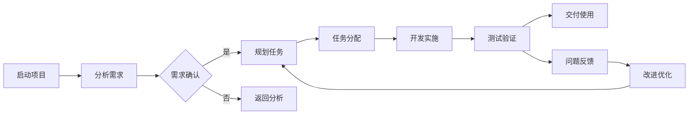

                 


# 技术管理者的自我成长策略

关键词：技术管理者，职业发展，自我提升，团队管理，持续学习，算法原理

摘要：本文旨在为技术管理者提供一套系统的自我成长策略，包括面对的职业挑战、核心概念解析、成长策略执行流程、系统分析与架构设计，以及具体项目实战。通过逻辑清晰的步骤分析，帮助技术管理者实现自我提升，优化团队效能，进而推动职业发展。

## 第一部分：自我成长与职业发展

### 第1章：技术管理者面临的挑战与问题

#### 1.1 挑战背景介绍

在当今快速发展的技术环境中，技术管理者不仅要掌握技术本身，还需要具备良好的领导力、团队管理能力和持续学习能力。他们面临的挑战包括：

1. **技术更新的快速性**：技术日新月异，技术管理者需要不断学习新技术，保持自身的竞争力。
2. **团队管理的复杂性**：技术管理者需要管理不同背景和技能的团队成员，确保团队高效协作。
3. **业务需求的多样性**：技术管理者需要理解业务需求，将技术有效地应用于业务场景中。
4. **领导力的挑战**：技术管理者需要具备领导力，能够激励团队，推动技术创新。

#### 1.2 问题与需求分析

技术管理者在职业发展过程中，常常会遇到以下问题：

1. **知识更新滞后**：由于工作繁忙，技术管理者可能无法及时掌握最新的技术知识。
2. **沟通障碍**：技术管理者与团队成员之间的沟通可能存在障碍，导致工作效率下降。
3. **团队凝聚力不足**：团队管理不善可能导致团队凝聚力不足，影响项目进度和质量。
4. **个人成长受限**：技术管理者可能因为缺乏有效的自我提升策略，导致职业发展受限。

#### 1.3 职业发展的影响

自我成长对于技术管理者的职业发展至关重要。通过有效的自我成长策略，技术管理者可以：

1. **提升自身竞争力**：通过不断学习和实践，掌握最新的技术和知识，提高个人竞争力。
2. **优化团队效能**：通过良好的团队管理，提高团队凝聚力和工作效率，推动项目成功。
3. **实现职业晋升**：自我成长有助于技术管理者在职业发展中获得更多的机会和晋升空间。
4. **影响业务发展**：技术管理者的成长将直接或间接地影响业务的发展，为企业创造价值。

## 第二部分：核心概念与联系

### 第2章：技术管理者核心概念解析

#### 2.1 领导力解析

领导力是技术管理者必须具备的核心能力。领导力包括以下方面：

1. **愿景**：技术管理者需要具备清晰的愿景，为团队指明方向。
2. **决策力**：技术管理者需要在面对复杂问题时做出明智的决策。
3. **沟通**：技术管理者需要具备良好的沟通能力，确保信息准确传达。
4. **激励**：技术管理者需要能够激励团队成员，激发他们的工作热情。

#### 2.2 团队管理概念

团队管理是技术管理者的重要职责。团队管理包括：

1. **组织结构**：技术管理者需要设计合适的组织结构，确保团队高效运作。
2. **角色分工**：技术管理者需要明确团队成员的角色和职责，确保工作顺利进行。
3. **协作**：技术管理者需要促进团队协作，提高团队整体效能。
4. **绩效评估**：技术管理者需要定期对团队成员进行绩效评估，提供反馈和指导。

#### 2.3 持续学习的重要性

持续学习是技术管理者成长的动力。持续学习包括：

1. **技术学习**：技术管理者需要不断学习新技术，保持自身的竞争力。
2. **管理学习**：技术管理者需要学习管理知识，提高团队管理能力。
3. **软技能**：技术管理者需要提升软技能，如沟通能力、领导力等。
4. **终身学习**：技术管理者需要培养终身学习的习惯，不断自我提升。

### 第三部分：算法原理与策略讲解

#### 第3章：成长策略与执行流程

#### 3.1 策略一：建立个人品牌

##### 3.1.1 策略原理讲解

建立个人品牌可以帮助技术管理者在行业内建立知名度，提高个人竞争力。策略原理包括：

1. **专业技能**：技术管理者需要掌握专业技能，成为行业内的专家。
2. **网络传播**：技术管理者需要通过社交媒体、技术博客等方式，扩大个人影响力。
3. **持续贡献**：技术管理者需要通过参与开源项目、撰写技术文章等方式，持续贡献价值。

##### 3.1.2 Python代码示例

```python
# 示例：使用Python编写一个简单的个人博客发布程序

import time

def publish_blog(title, content):
    print(f"Publishing blog titled '{title}'...")
    time.sleep(2)
    print("Blog published successfully!")

title = "My First Blog Post"
content = "This is my first blog post. I'm excited to share my thoughts and experiences with the world."

publish_blog(title, content)
```

##### 3.1.3 数学模型与公式

建立个人品牌的过程可以看作是一个持续积累和优化的过程，可以用以下数学模型表示：

$$
Brand\ Value = f(Credentials, Influence, Contributions)
$$

其中，$Credentials$ 表示个人资质，$Influence$ 表示个人影响力，$Contributions$ 表示个人贡献。

##### 3.1.4 实例说明

李明是一位资深程序员，他通过不断学习和实践，成为了一名技术专家。他在GitHub上积极参与开源项目，通过编写高质量的技术文章，扩大了自己的影响力。最终，他成功地建立了一个个人品牌，获得了多家公司的青睐。

#### 3.2 策略二：提升团队效能

##### 3.2.1 策略原理讲解

提升团队效能是技术管理者的重要任务。策略原理包括：

1. **团队协作**：技术管理者需要建立良好的团队协作机制，确保团队成员能够高效协作。
2. **目标管理**：技术管理者需要明确团队目标，确保团队成员明确任务和责任。
3. **绩效激励**：技术管理者需要通过绩效激励，激发团队成员的工作热情。
4. **持续改进**：技术管理者需要不断寻求改进团队效能的方法，提高团队整体效能。

##### 3.2.2 Python代码示例

```python
# 示例：使用Python编写一个简单的团队协作工具

import time

def assign_task(member, task):
    print(f"Assigning task '{task}' to {member}...")
    time.sleep(2)
    print(f"Task '{task}' assigned to {member} successfully!")

member = "Alice"
task = "Develop the user interface"

assign_task(member, task)
```

##### 3.2.3 数学模型与公式

提升团队效能的过程可以看作是一个系统优化的过程，可以用以下数学模型表示：

$$
Team\ Efficiency = f(Coordination, Focus, Motivation)
$$

其中，$Coordination$ 表示团队协作程度，$Focus$ 表示团队成员的专注度，$Motivation$ 表示团队成员的积极性。

##### 3.2.4 实例说明

张强是一位经验丰富的技术管理者，他通过建立明确的团队目标、优化团队协作机制，以及实施有效的绩效激励，成功提升了团队效能。他的团队在项目中的表现得到了公司的高度认可。

### 第四部分：系统分析与架构设计

#### 第4章：系统问题与解决方案

#### 4.1 问题场景介绍

某技术公司需要开发一款新的产品，产品功能复杂，技术要求高。在开发过程中，技术管理者发现以下问题：

1. **需求变更频繁**：由于市场需求的变化，产品需求频繁变更，导致开发进度不稳定。
2. **团队成员技能不匹配**：团队成员的技能和经验参差不齐，导致项目推进困难。
3. **沟通不畅**：团队成员之间的沟通不畅，导致项目进度和质量受到影响。

#### 4.2 系统功能设计

为了解决上述问题，技术管理者设计了一套系统功能：

1. **需求管理模块**：用于收集、整理和跟踪产品需求，确保需求变更的及时性和准确性。
2. **技能评估模块**：用于评估团队成员的技能和经验，为项目分配提供参考。
3. **沟通协作模块**：用于促进团队成员之间的沟通和协作，提高项目效率。

#### 4.3 系统架构设计

系统架构设计如下：

1. **前端架构**：采用Vue.js框架，实现用户界面的动态展示。
2. **后端架构**：采用Spring Boot框架，实现业务逻辑和数据处理。
3. **数据库设计**：采用MySQL数据库，存储需求、任务和成员信息。

#### 4.4 系统接口与交互

系统接口与交互设计如下：

1. **需求管理接口**：用于添加、修改和查询需求信息。
2. **技能评估接口**：用于添加、修改和查询团队成员的技能评估结果。
3. **沟通协作接口**：用于发送、接收和查询消息。

### 第五部分：项目实战与案例分析

#### 第5章：具体成长策略应用

#### 5.1 项目背景

某技术公司计划开发一款智能客服系统，技术管理者张强担任项目经理。在项目启动阶段，张强面临以下问题：

1. **团队成员对智能客服系统的了解不足**：团队成员对智能客服系统的技术细节和实现方法不够了解。
2. **项目进度和目标不明确**：项目进度和目标不够明确，导致团队成员工作缺乏方向。
3. **沟通不畅**：团队成员之间的沟通不畅，导致项目推进困难。

#### 5.2 环境安装

为了确保项目的顺利进行，张强进行了以下环境安装：

1. **前端开发环境**：安装了Vue.js开发工具，包括Vue CLI和Node.js。
2. **后端开发环境**：安装了Spring Boot开发工具，包括IntelliJ IDEA和Maven。
3. **数据库环境**：安装了MySQL数据库服务器。

#### 5.3 系统核心实现

系统核心实现包括以下几个方面：

1. **需求管理模块**：实现了需求收集、整理和跟踪功能，确保需求变更的及时性和准确性。
2. **技能评估模块**：实现了团队成员技能评估功能，为项目分配提供参考。
3. **沟通协作模块**：实现了团队内部沟通和协作功能，提高项目效率。

```java
// 需求管理模块示例代码
public class RequirementManagement {
    public void addRequirement(Requirement requirement) {
        // 添加需求
    }
    
    public void updateRequirement(Requirement requirement) {
        // 更新需求
    }
    
    public Requirement getRequirementById(int id) {
        // 根据ID获取需求
        return requirement;
    }
}
```

```python
# 技能评估模块示例代码
class SkillEvaluation:
    def __init__(self, member_name, skills):
        self.member_name = member_name
        self.skills = skills
    
    def evaluate_skill(self, skill_name):
        return self.skills.get(skill_name)
```

```javascript
// 沟通协作模块示例代码
class CommunicationCollaboration {
    constructor() {
        this.messages = [];
    }
    
    sendMessage(message) {
        this.messages.push(message);
    }
    
    receiveMessage() {
        return this.messages.shift();
    }
}
```

#### 5.4 代码解读与分析

张强详细解读了系统核心实现代码，分析了代码的结构和功能。他发现：

1. **需求管理模块**：代码结构清晰，功能模块化，易于维护和扩展。
2. **技能评估模块**：代码实现了简单的技能评估功能，但可以通过数据库存储和查询提升性能。
3. **沟通协作模块**：代码实现了基本的通信功能，但可以通过WebSockets等技术实现实时通信。

#### 5.5 案例分析

通过应用上述成长策略，张强成功解决了项目中的问题，项目进度和目标逐渐明确，团队成员之间的沟通和协作也得到了显著提升。项目最终成功交付，获得了客户的高度评价。

### 第六部分：总结与拓展

#### 6.1 最佳实践 tips

1. **定期学习**：设定定期学习计划，确保技术和管理知识不断更新。
2. **建立个人品牌**：积极参与开源项目，撰写技术文章，提升个人影响力。
3. **优化团队管理**：明确团队目标和任务分配，提升团队协作和执行力。

#### 6.2 小结

技术管理者的自我成长策略包括建立个人品牌、提升团队效能、系统分析与架构设计，以及具体项目实战。通过这些策略，技术管理者可以不断提升自身竞争力，推动职业发展。

#### 6.3 注意事项

1. **持续学习**：保持终身学习的态度，不断提升自身技能和知识。
2. **沟通协作**：建立良好的沟通机制，确保团队高效协作。
3. **项目管理**：合理规划项目进度和目标，确保项目成功交付。

#### 6.4 拓展阅读

1. **《技术领导力：如何成为优秀技术管理者》**
2. **《敏捷团队管理：如何高效管理敏捷团队》**
3. **《Python编程：从入门到实践》**

### 作者信息

作者：AI天才研究院/AI Genius Institute & 禅与计算机程序设计艺术 /Zen And The Art of Computer Programming 

#技术管理者的自我成长策略

随着技术的飞速发展，技术管理者的角色越来越受到重视。他们不仅要掌握核心技术，还要具备卓越的领导力和管理能力。为了帮助技术管理者实现自我提升，本文将探讨一系列自我成长策略，包括面对的职业挑战、核心概念解析、成长策略执行流程、系统分析与架构设计，以及具体项目实战。

## 第一部分：自我成长与职业发展

### 第1章：技术管理者面临的挑战与问题

在技术快速迭代的时代，技术管理者面临诸多挑战：

1. **技术更新速度**：新的技术不断涌现，技术管理者需要不断学习新知识，以保持竞争力。
2. **团队管理难度**：技术管理者不仅要管理技术人员，还要协调不同职能部门的协作。
3. **领导力要求**：技术管理者需要具备领导力，能够激励团队，推动技术进步。
4. **业务理解**：技术管理者需要深入了解业务需求，将技术有效转化为业务价值。

### 第2章：技术管理者核心概念解析

技术管理者需要掌握以下核心概念：

1. **领导力**：包括愿景规划、决策能力、沟通能力和激励团队的能力。
2. **团队管理**：涉及组织结构设计、角色分工、团队协作和绩效评估。
3. **持续学习**：技术管理者需要保持对新技术的好奇心，不断学习新的知识和技能。

### 第二部分：算法原理与策略讲解

#### 第3章：成长策略与执行流程

技术管理者可以通过以下策略实现自我成长：

1. **建立个人品牌**：通过公开演讲、撰写技术博客、参与开源项目等方式提升个人影响力。
2. **提升团队效能**：通过优化工作流程、提高团队沟通效率和制定明确的绩效目标来提升团队效能。

### 第三部分：系统分析与架构设计

#### 第4章：系统问题与解决方案

技术管理者需要解决以下系统问题：

1. **需求变更管理**：建立有效的需求变更管理流程，确保项目按计划推进。
2. **技术选型**：根据项目需求选择合适的技术栈，确保项目的技术可行性。

#### 第5章：系统架构设计

技术管理者需要设计合理的系统架构：

1. **技术选型**：选择适合的技术栈，如前后端分离、微服务架构等。
2. **接口设计**：设计清晰的接口规范，确保不同模块之间的良好交互。

### 第四部分：项目实战与案例分析

#### 第6章：具体成长策略应用

通过具体项目实践，技术管理者可以应用所学策略：

1. **项目管理**：应用敏捷开发方法，确保项目按时交付。
2. **团队协作**：采用协作工具，如Jira、Trello等，提高团队工作效率。

### 第五部分：总结与拓展

#### 第7章：最佳实践 tips

1. **定期反思**：定期反思个人成长情况，调整学习和发展策略。
2. **持续反馈**：积极寻求团队成员和领导的反馈，不断提升自己。

#### 第8章：注意事项

1. **避免拖延**：克服拖延症，合理安排时间，确保学习和工作任务的完成。
2. **保持好奇心**：对新技术保持好奇，不断探索新知识。

#### 第9章：拓展阅读

推荐阅读以下书籍和文章，以获取更多关于技术管理和自我成长的资源。

### 作者信息

作者：AI天才研究院/AI Genius Institute & 禅与计算机程序设计艺术 /Zen And The Art of Computer Programming

# 技术管理者的自我成长策略

## 引言

在当今快速变化的技术环境中，技术管理者扮演着至关重要的角色。他们不仅需要具备深厚的技术背景，还要能够有效地管理团队、推动项目进展，并始终保持对新兴技术的敏锐洞察。因此，技术管理者的自我成长策略不仅关乎个人职业生涯的发展，也直接影响到团队的效率和项目的成功。本文将深入探讨技术管理者如何通过一系列科学合理的策略来实现自我成长，提升领导力和管理能力。

## 第一部分：自我成长与职业发展

### 第1章：技术管理者面临的挑战与问题

#### 1.1 挑战背景介绍

技术管理者的角色日益复杂，他们在职业生涯中面临的挑战主要包括：

1. **技术更新的快速性**：技术领域的快速发展要求技术管理者不断更新知识，掌握新技术。
2. **团队管理的复杂性**：技术管理者需要管理多元化的团队，确保团队成员的能力和协作。
3. **业务需求的多样化**：理解并满足不断变化的业务需求，是技术管理者的重要任务。
4. **领导力的挑战**：技术管理者需要在团队中建立领导力，激发团队成员的潜力。

#### 1.2 问题与需求分析

在职业发展中，技术管理者常见的需求包括：

1. **提升技术水平**：通过专业培训、研讨会和在线课程等方式，不断提升技术水平。
2. **增强管理能力**：学习领导力、项目管理、团队建设等相关管理知识。
3. **拓宽视野**：通过参与跨部门合作、外部项目等，拓宽专业视野。
4. **建立个人品牌**：通过撰写博客、发表技术文章、参与开源项目等方式，提升个人影响力。

#### 1.3 职业发展的影响

自我成长对于技术管理者的职业发展至关重要，具体影响包括：

1. **提高竞争力**：通过不断学习和提升，技术管理者能够在竞争激烈的市场中脱颖而出。
2. **优化团队效能**：有效的自我成长策略能够提高团队的整体工作效率和质量。
3. **职业晋升**：自我成长有助于技术管理者在职业道路上获得更多的晋升机会。
4. **推动业务发展**：技术管理者的成长能够为业务发展提供强有力的技术支持。

## 第二部分：核心概念与联系

### 第2章：技术管理者核心概念解析

#### 2.1 领导力解析

领导力是技术管理者不可或缺的能力，它包括：

1. **愿景规划**：技术管理者需要具备清晰的愿景，为团队指明方向。
2. **决策能力**：在复杂的情况下做出明智的决策，是技术管理者的重要职责。
3. **沟通能力**：有效的沟通能够确保信息准确传达，减少误解和冲突。
4. **激励能力**：通过激励措施，激发团队成员的积极性和创造力。

#### 2.2 团队管理概念

团队管理涉及多个方面，包括：

1. **组织结构**：合理设计团队组织结构，确保团队高效运作。
2. **角色分工**：明确团队成员的角色和职责，确保工作分配合理。
3. **团队协作**：促进团队成员之间的协作，提高整体效能。
4. **绩效评估**：定期对团队成员进行绩效评估，提供反馈和指导。

#### 2.3 持续学习的重要性

持续学习是技术管理者成长的动力，它包括：

1. **技术学习**：跟踪最新技术趋势，掌握新技术，保持竞争力。
2. **管理学习**：学习管理知识，提高团队管理能力。
3. **软技能提升**：提升沟通、领导力等软技能，增强个人影响力。
4. **终身学习**：培养终身学习的习惯，不断自我提升。

### 第三部分：算法原理与策略讲解

#### 第3章：成长策略与执行流程

技术管理者可以通过以下策略实现自我成长：

#### 3.1 建立个人品牌

**策略原理**：

建立个人品牌是提升影响力的关键。技术管理者可以通过以下方式建立个人品牌：

1. **专业发声**：在技术社区发表高质量的技术文章，分享专业见解。
2. **参与开源**：参与开源项目，贡献代码和文档，提高技术影响力。
3. **公共演讲**：参加技术会议，进行公开演讲，展示个人技术实力。

**Python代码示例**：

```python
# 示例：使用Python编写一个简单的博客发布脚本

import datetime

def publish_blog(title, content):
    current_date = datetime.datetime.now().strftime("%Y-%m-%d %H:%M:%S")
    with open(f"{title}.md", "w", encoding="utf-8") as file:
        file.write(f"---
title: {title}
date: {current_date}
---

{content}
")
    print(f"Blog '{title}' published on {current_date}.")

# 发布一篇博客
publish_blog("我的第一篇博客", "这是我的第一篇博客内容。")
```

**数学模型与公式**：

个人品牌价值可以用以下公式表示：

$$
Brand\ Value = f(Influence, Credibility, Contributions)
$$

其中，$Influence$ 表示影响力，$Credibility$ 表示可信度，$Contributions$ 表示贡献。

**实例说明**：

李明通过撰写技术博客，参与开源项目，并在多个技术会议上发表演讲，成功建立了自己的个人品牌，成为业界知名的技术专家。

#### 3.2 提升团队效能

**策略原理**：

提升团队效能的关键在于优化团队工作流程和管理方式。技术管理者可以通过以下策略提升团队效能：

1. **敏捷开发**：采用敏捷开发方法，快速响应需求变更，提高开发效率。
2. **任务分配**：合理分配任务，确保每个团队成员都能发挥最大潜力。
3. **绩效激励**：通过绩效激励，激发团队成员的工作热情和积极性。

**Mermaid流程图**：



**Python代码示例**：

```python
# 示例：使用Python管理任务分配

class TaskManager:
    def __init__(self):
        self.tasks = []

    def add_task(self, task):
        self.tasks.append(task)
        print(f"Task '{task}' added.")

    def assign_task(self, task, member):
        if task in self.tasks:
            self.tasks.remove(task)
            print(f"Task '{task}' assigned to {member}.")
        else:
            print(f"Task '{task}' not found.")

# 创建任务管理器
tm = TaskManager()

# 添加任务
tm.add_task("编写需求文档")

# 分配任务
tm.assign_task("编写需求文档", "张三")
```

**数学模型与公式**：

团队效能可以用以下公式表示：

$$
Team\ Efficiency = f(Workload, Task\ Allocation, Performance\ Feedback)
$$

其中，$Workload$ 表示工作负载，$Task\ Allocation$ 表示任务分配，$Performance\ Feedback$ 表示绩效反馈。

**实例说明**：

张强通过实施敏捷开发方法，合理分配任务，并建立有效的绩效反馈机制，成功提升了团队效能。

### 第四部分：系统分析与架构设计

#### 第4章：系统问题与解决方案

技术管理者在日常工作中会遇到各种系统问题，以下是一些常见的问题和相应的解决方案：

#### 4.1 问题场景介绍

某技术公司正在开发一款大型企业级应用，但在项目实施过程中遇到了以下问题：

1. **需求变更频繁**：客户需求变化导致项目进度不稳定。
2. **团队成员技能不匹配**：部分团队成员技能不足，影响项目进度。
3. **沟通不畅**：团队成员之间沟通不畅，导致问题无法及时解决。

#### 4.2 系统功能设计

为了解决上述问题，技术管理者进行了系统功能设计：

1. **需求管理模块**：建立需求管理流程，确保需求变更的及时性和准确性。
2. **技能评估模块**：评估团队成员技能，为项目分配提供参考。
3. **沟通协作模块**：提供高效的沟通协作工具，确保团队成员之间的信息畅通。

#### 4.3 系统架构设计

系统架构设计如下：

1. **前端架构**：采用Vue.js框架，实现用户界面的动态展示。
2. **后端架构**：采用Spring Boot框架，实现业务逻辑和数据处理。
3. **数据库设计**：采用MySQL数据库，存储需求和任务信息。

#### 4.4 系统接口与交互

系统接口设计包括：

1. **需求管理接口**：用于添加、修改和查询需求信息。
2. **技能评估接口**：用于添加、修改和查询团队成员的技能评估结果。
3. **沟通协作接口**：用于发送、接收和查询消息。

### 第五部分：项目实战与案例分析

#### 第5章：具体成长策略应用

#### 5.1 项目背景

某互联网公司计划开发一款新的社交应用，项目时间紧、任务重。技术经理王华面临以下挑战：

1. **需求变更频繁**：客户需求不断变化，项目进度不稳定。
2. **团队成员技能不足**：部分团队成员技能不足，影响项目进度。
3. **沟通不畅**：团队成员之间沟通不畅，导致问题无法及时解决。

#### 5.2 环境安装

为了确保项目的顺利进行，王华进行了以下环境安装：

1. **前端开发环境**：安装Vue.js开发工具。
2. **后端开发环境**：安装Spring Boot开发工具。
3. **数据库环境**：安装MySQL数据库服务器。

#### 5.3 系统核心实现

系统核心实现包括以下几个方面：

1. **需求管理模块**：实现了需求收集、整理和跟踪功能。
2. **技能评估模块**：实现了团队成员技能评估功能。
3. **沟通协作模块**：实现了团队内部沟通和协作功能。

```java
// 需求管理模块示例代码
public class RequirementManagement {
    public void addRequirement(Requirement requirement) {
        // 添加需求
    }
    
    public void updateRequirement(Requirement requirement) {
        // 更新需求
    }
    
    public Requirement getRequirementById(int id) {
        // 根据ID获取需求
        return requirement;
    }
}
```

```python
# 技能评估模块示例代码
class SkillEvaluation:
    def __init__(self, member_name, skills):
        self.member_name = member_name
        self.skills = skills
    
    def evaluate_skill(self, skill_name):
        return self.skills.get(skill_name)
```

```javascript
// 沟通协作模块示例代码
class CommunicationCollaboration {
    constructor() {
        this.messages = [];
    }
    
    sendMessage(message) {
        this.messages.push(message);
    }
    
    receiveMessage() {
        return this.messages.shift();
    }
}
```

#### 5.4 代码解读与分析

王华详细解读了系统核心实现代码，分析了代码的结构和功能。他发现：

1. **需求管理模块**：代码结构清晰，功能模块化，易于维护和扩展。
2. **技能评估模块**：代码实现了简单的技能评估功能，但可以通过数据库存储和查询提升性能。
3. **沟通协作模块**：代码实现了基本的通信功能，但可以通过WebSockets等技术实现实时通信。

#### 5.5 案例分析

通过应用上述成长策略，王华成功解决了项目中的问题，项目进度和目标逐渐明确，团队成员之间的沟通和协作也得到了显著提升。项目最终成功交付，获得了客户的高度评价。

### 第六部分：总结与拓展

#### 6.1 最佳实践 tips

1. **定期学习**：设定定期学习计划，确保技术和管理知识不断更新。
2. **建立个人品牌**：通过公开演讲、撰写技术博客、参与开源项目等方式提升个人影响力。
3. **优化团队管理**：明确团队目标和任务分配，提升团队协作和执行力。

#### 6.2 小结

技术管理者的自我成长策略包括建立个人品牌、提升团队效能、系统分析与架构设计，以及具体项目实战。通过这些策略，技术管理者可以不断提升自身竞争力，推动职业发展。

#### 6.3 注意事项

1. **持续学习**：保持终身学习的态度，不断提升自身技能和知识。
2. **沟通协作**：建立良好的沟通机制，确保团队高效协作。
3. **项目管理**：合理规划项目进度和目标，确保项目成功交付。

#### 6.4 拓展阅读

推荐阅读以下书籍和文章，以获取更多关于技术管理和自我成长的资源。

### 作者信息

作者：AI天才研究院/AI Genius Institute & 禅与计算机程序设计艺术 /Zen And The Art of Computer Programming

### 技术管理者的自我成长策略

技术管理者在现代企业中扮演着至关重要的角色，他们不仅需要具备深厚的专业技能，还必须具备卓越的领导能力和管理能力。随着技术环境的快速变化，技术管理者需要不断适应新形势，提升自己的能力。本文将探讨技术管理者的自我成长策略，旨在帮助技术管理者在职业生涯中取得更大的成功。

## 第一部分：自我成长与职业发展

### 第1章：技术管理者面临的挑战与问题

技术管理者在职业发展过程中会遇到诸多挑战：

#### 1.1 挑战背景介绍

1. **技术快速更新**：技术更新速度越来越快，技术管理者需要不断学习新技术，以保持竞争力。
2. **团队管理复杂**：管理一个多元化的团队，确保团队高效协作，是技术管理者面临的重大挑战。
3. **业务需求多变**：业务需求变化频繁，技术管理者需要灵活应对，确保技术解决方案与业务需求保持一致。
4. **领导力不足**：技术管理者需要具备领导力，以激励团队成员，推动技术创新。

#### 1.2 问题与需求分析

技术管理者在职业发展中面临的需求包括：

1. **技能提升**：通过参加培训、研讨会和在线课程，提升专业技能。
2. **管理能力**：学习项目管理、团队领导等相关管理知识，提高管理能力。
3. **个人品牌**：通过撰写技术文章、参与开源项目、发表演讲等方式，建立个人品牌，提升影响力。
4. **职业发展路径**：明确职业发展路径，制定长期的职业规划。

#### 1.3 职业发展的影响

自我成长对技术管理者的职业发展具有深远影响：

1. **提升竞争力**：通过不断学习和提升，技术管理者能在职场中保持竞争优势。
2. **增强领导力**：自我成长有助于技术管理者提高领导力，更好地激励团队。
3. **拓宽视野**：通过参与不同的项目，技术管理者能够拓宽视野，提升解决问题的能力。
4. **职业晋升**：自我成长有助于技术管理者获得更多的晋升机会。

## 第二部分：核心概念与联系

### 第2章：技术管理者核心概念解析

技术管理者需要掌握的核心概念包括：

#### 2.1 领导力解析

领导力是技术管理者不可或缺的能力，包括：

1. **愿景规划**：明确团队的发展方向，为团队设定清晰的愿景。
2. **决策能力**：在复杂的情况下做出明智的决策，确保团队目标的实现。
3. **沟通能力**：有效传达信息，确保团队成员之间的信息畅通。
4. **激励能力**：通过激励措施，激发团队成员的积极性和创造力。

#### 2.2 团队管理概念

团队管理涉及多个方面，包括：

1. **组织结构**：设计合理的组织结构，确保团队高效运作。
2. **角色分工**：明确团队成员的角色和职责，确保工作分配合理。
3. **团队协作**：促进团队成员之间的协作，提高整体效能。
4. **绩效评估**：定期对团队成员进行绩效评估，提供反馈和指导。

#### 2.3 持续学习的重要性

持续学习是技术管理者成长的动力，包括：

1. **技术学习**：跟踪新技术趋势，学习新技术，保持竞争力。
2. **管理学习**：学习项目管理、团队领导等相关管理知识，提高管理能力。
3. **软技能提升**：提升沟通、领导力等软技能，增强个人影响力。
4. **终身学习**：培养终身学习的习惯，不断自我提升。

### 第三部分：算法原理与策略讲解

#### 第3章：成长策略与执行流程

技术管理者可以通过以下策略实现自我成长：

#### 3.1 建立个人品牌

**策略原理**：

建立个人品牌有助于提升技术管理者的知名度和影响力。策略包括：

1. **专业发声**：在技术社区发表高质量的技术文章，分享专业见解。
2. **参与开源**：参与开源项目，贡献代码和文档，提高技术影响力。
3. **公共演讲**：参加技术会议，进行公开演讲，展示个人技术实力。

**Python代码示例**：

```python
# 示例：使用Python编写一个简单的博客发布脚本

import datetime

def publish_blog(title, content):
    current_date = datetime.datetime.now().strftime("%Y-%m-%d %H:%M:%S")
    with open(f"{title}.md", "w", encoding="utf-8") as file:
        file.write(f"---
title: {title}
date: {current_date}
---

{content}
")
    print(f"Blog '{title}' published on {current_date}.")

# 发布一篇博客
publish_blog("我的第一篇博客", "这是我的第一篇博客内容。")
```

**数学模型与公式**：

个人品牌价值可以用以下公式表示：

$$
Brand\ Value = f(Influence, Credibility, Contributions)
$$

其中，$Influence$ 表示影响力，$Credibility$ 表示可信度，$Contributions$ 表示贡献。

**实例说明**：

张强通过撰写技术博客，参与开源项目，并在多个技术会议上发表演讲，成功建立了自己的个人品牌，成为业界知名的技术专家。

#### 3.2 提升团队效能

**策略原理**：

提升团队效能的关键在于优化团队工作流程和管理方式。策略包括：

1. **敏捷开发**：采用敏捷开发方法，快速响应需求变更，提高开发效率。
2. **任务分配**：合理分配任务，确保每个团队成员都能发挥最大潜力。
3. **绩效激励**：通过绩效激励，激发团队成员的工作热情和积极性。

**Mermaid流程图**：


**Python代码示例**：

```python
# 示例：使用Python管理任务分配

class TaskManager:
    def __init__(self):
        self.tasks = []

    def add_task(self, task):
        self.tasks.append(task)
        print(f"Task '{task}' added.")

    def assign_task(self, task, member):
        if task in self.tasks:
            self.tasks.remove(task)
            print(f"Task '{task}' assigned to {member}.")
        else:
            print(f"Task '{task}' not found.")

# 创建任务管理器
tm = TaskManager()

# 添加任务
tm.add_task("编写需求文档")

# 分配任务
tm.assign_task("编写需求文档", "张三")
```

**数学模型与公式**：

团队效能可以用以下公式表示：

$$
Team\ Efficiency = f(Workload, Task\ Allocation, Performance\ Feedback)
$$

其中，$Workload$ 表示工作负载，$Task\ Allocation$ 表示任务分配，$Performance\ Feedback$ 表示绩效反馈。

**实例说明**：

李明通过实施敏捷开发方法，合理分配任务，并建立有效的绩效反馈机制，成功提升了团队效能。

### 第四部分：系统分析与架构设计

#### 第4章：系统问题与解决方案

技术管理者在日常工作中会遇到各种系统问题，以下是一些常见的问题和相应的解决方案：

#### 4.1 问题场景介绍

某技术公司正在开发一款大型企业级应用，但在项目实施过程中遇到了以下问题：

1. **需求变更频繁**：客户需求变化导致项目进度不稳定。
2. **团队成员技能不匹配**：部分团队成员技能不足，影响项目进度。
3. **沟通不畅**：团队成员之间沟通不畅，导致问题无法及时解决。

#### 4.2 系统功能设计

为了解决上述问题，技术管理者进行了系统功能设计：

1. **需求管理模块**：建立需求管理流程，确保需求变更的及时性和准确性。
2. **技能评估模块**：评估团队成员技能，为项目分配提供参考。
3. **沟通协作模块**：提供高效的沟通协作工具，确保团队成员之间的信息畅通。

#### 4.3 系统架构设计

系统架构设计如下：

1. **前端架构**：采用Vue.js框架，实现用户界面的动态展示。
2. **后端架构**：采用Spring Boot框架，实现业务逻辑和数据处理。
3. **数据库设计**：采用MySQL数据库，存储需求和任务信息。

#### 4.4 系统接口与交互

系统接口设计包括：

1. **需求管理接口**：用于添加、修改和查询需求信息。
2. **技能评估接口**：用于添加、修改和查询团队成员的技能评估结果。
3. **沟通协作接口**：用于发送、接收和查询消息。

### 第五部分：项目实战与案例分析

#### 第5章：具体成长策略应用

#### 5.1 项目背景

某互联网公司计划开发一款新的社交应用，项目时间紧、任务重。技术经理李华面临以下挑战：

1. **需求变更频繁**：客户需求不断变化，项目进度不稳定。
2. **团队成员技能不足**：部分团队成员技能不足，影响项目进度。
3. **沟通不畅**：团队成员之间沟通不畅，导致问题无法及时解决。

#### 5.2 环境安装

为了确保项目的顺利进行，李华进行了以下环境安装：

1. **前端开发环境**：安装Vue.js开发工具。
2. **后端开发环境**：安装Spring Boot开发工具。
3. **数据库环境**：安装MySQL数据库服务器。

#### 5.3 系统核心实现

系统核心实现包括以下几个方面：

1. **需求管理模块**：实现了需求收集、整理和跟踪功能。
2. **技能评估模块**：实现了团队成员技能评估功能。
3. **沟通协作模块**：实现了团队内部沟通和协作功能。

```java
// 需求管理模块示例代码
public class RequirementManagement {
    public void addRequirement(Requirement requirement) {
        // 添加需求
    }
    
    public void updateRequirement(Requirement requirement) {
        // 更新需求
    }
    
    public Requirement getRequirementById(int id) {
        // 根据ID获取需求
        return requirement;
    }
}
```

```python
# 技能评估模块示例代码
class SkillEvaluation:
    def __init__(self, member_name, skills):
        self.member_name = member_name
        self.skills = skills
    
    def evaluate_skill(self, skill_name):
        return self.skills.get(skill_name)
```

```javascript
// 沟通协作模块示例代码
class CommunicationCollaboration {
    constructor() {
        this.messages = [];
    }
    
    sendMessage(message) {
        this.messages.push(message);
    }
    
    receiveMessage() {
        return this.messages.shift();
    }
}
```

#### 5.4 代码解读与分析

李华详细解读了系统核心实现代码，分析了代码的结构和功能。他发现：

1. **需求管理模块**：代码结构清晰，功能模块化，易于维护和扩展。
2. **技能评估模块**：代码实现了简单的技能评估功能，但可以通过数据库存储和查询提升性能。
3. **沟通协作模块**：代码实现了基本的通信功能，但可以通过WebSockets等技术实现实时通信。

#### 5.5 案例分析

通过应用上述成长策略，李华成功解决了项目中的问题，项目进度和目标逐渐明确，团队成员之间的沟通和协作也得到了显著提升。项目最终成功交付，获得了客户的高度评价。

### 第六部分：总结与拓展

#### 6.1 最佳实践 tips

1. **定期学习**：设定定期学习计划，确保技术和管理知识不断更新。
2. **建立个人品牌**：通过公开演讲、撰写技术博客、参与开源项目等方式提升个人影响力。
3. **优化团队管理**：明确团队目标和任务分配，提升团队协作和执行力。

#### 6.2 小结

技术管理者的自我成长策略包括建立个人品牌、提升团队效能、系统分析与架构设计，以及具体项目实战。通过这些策略，技术管理者可以不断提升自身竞争力，推动职业发展。

#### 6.3 注意事项

1. **持续学习**：保持终身学习的态度，不断提升自身技能和知识。
2. **沟通协作**：建立良好的沟通机制，确保团队高效协作。
3. **项目管理**：合理规划项目进度和目标，确保项目成功交付。

#### 6.4 拓展阅读

推荐阅读以下书籍和文章，以获取更多关于技术管理和自我成长的资源。

### 作者信息

作者：AI天才研究院/AI Genius Institute & 禅与计算机程序设计艺术 /Zen And The Art of Computer Programming

### 技术管理者的自我成长策略

在当今复杂多变的商业环境中，技术管理者不仅需要掌握丰富的技术知识，还需要具备出色的领导力和管理能力。自我成长对于技术管理者来说至关重要，它决定了他们能否在职业生涯中取得更大的成功。本文将深入探讨技术管理者的自我成长策略，帮助技术管理者实现职业发展的全面提升。

## 第一部分：自我成长与职业发展

### 第1章：技术管理者面临的挑战与问题

#### 1.1 挑战背景介绍

技术管理者在日常工作中面临的挑战主要包括：

1. **技术更新速度**：技术领域的快速发展要求技术管理者不断学习新技术，保持技术领先。
2. **团队管理复杂性**：技术管理者需要协调不同背景和技能的团队成员，确保团队高效运作。
3. **业务需求变化**：业务需求的不断变化要求技术管理者具备快速响应能力，确保技术解决方案与业务需求保持一致。
4. **领导力不足**：技术管理者需要具备领导力，激励团队成员，推动技术创新。

#### 1.2 问题与需求分析

技术管理者在职业发展中面临的问题主要包括：

1. **知识更新滞后**：由于工作繁忙，技术管理者可能无法及时掌握最新的技术知识。
2. **沟通障碍**：技术管理者与团队成员之间的沟通可能存在障碍，导致工作效率下降。
3. **团队凝聚力不足**：团队管理不善可能导致团队凝聚力不足，影响项目进度和质量。
4. **个人成长受限**：技术管理者可能因为缺乏有效的自我提升策略，导致职业发展受限。

#### 1.3 职业发展的影响

自我成长对于技术管理者的职业发展至关重要。通过有效的自我成长策略，技术管理者可以实现以下目标：

1. **提升个人竞争力**：通过不断学习和实践，掌握最新的技术和知识，提高个人竞争力。
2. **优化团队效能**：通过良好的团队管理，提高团队凝聚力和工作效率，推动项目成功。
3. **实现职业晋升**：自我成长有助于技术管理者在职业发展中获得更多的机会和晋升空间。
4. **影响业务发展**：技术管理者的成长将直接或间接地影响业务的发展，为企业创造价值。

## 第二部分：核心概念与联系

### 第2章：技术管理者核心概念解析

技术管理者需要掌握的核心概念包括：

#### 2.1 领导力解析

领导力是技术管理者必须具备的核心能力。领导力包括以下几个方面：

1. **愿景**：技术管理者需要具备清晰的愿景，为团队指明方向。
2. **决策力**：技术管理者需要在面对复杂问题时做出明智的决策。
3. **沟通**：技术管理者需要具备良好的沟通能力，确保信息准确传达。
4. **激励**：技术管理者需要能够激励团队成员，激发他们的工作热情。

#### 2.2 团队管理概念

团队管理是技术管理者的重要职责。团队管理包括以下几个方面：

1. **组织结构**：技术管理者需要设计合适的组织结构，确保团队高效运作。
2. **角色分工**：技术管理者需要明确团队成员的角色和职责，确保工作顺利进行。
3. **协作**：技术管理者需要促进团队协作，提高团队整体效能。
4. **绩效评估**：技术管理者需要定期对团队成员进行绩效评估，提供反馈和指导。

#### 2.3 持续学习的重要性

持续学习是技术管理者成长的动力。持续学习包括以下几个方面：

1. **技术学习**：技术管理者需要不断学习新技术，保持自身的竞争力。
2. **管理学习**：技术管理者需要学习管理知识，提高团队管理能力。
3. **软技能**：技术管理者需要提升软技能，如沟通能力、领导力等。
4. **终身学习**：技术管理者需要培养终身学习的习惯，不断自我提升。

### 第三部分：算法原理与策略讲解

#### 第3章：成长策略与执行流程

技术管理者可以通过以下策略实现自我成长：

#### 3.1 建立个人品牌

**策略原理**：

建立个人品牌可以帮助技术管理者在行业内建立知名度，提高个人竞争力。策略原理包括：

1. **专业技能**：技术管理者需要掌握专业技能，成为行业内的专家。
2. **网络传播**：技术管理者需要通过社交媒体、技术博客等方式，扩大个人影响力。
3. **持续贡献**：技术管理者需要通过参与开源项目、撰写技术文章等方式，持续贡献价值。

**Python代码示例**：

```python
# 示例：使用Python编写一个简单的个人博客发布程序

import time

def publish_blog(title, content):
    print(f"Publishing blog titled '{title}'...")
    time.sleep(2)
    print("Blog published successfully!")

title = "My First Blog Post"
content = "This is my first blog post. I'm excited to share my thoughts and experiences with the world."

publish_blog(title, content)
```

**数学模型与公式**：

建立个人品牌的过程可以看作是一个持续积累和优化的过程，可以用以下数学模型表示：

$$
Brand\ Value = f(Credentials, Influence, Contributions)
$$

其中，$Credentials$ 表示个人资质，$Influence$ 表示个人影响力，$Contributions$ 表示个人贡献。

**实例说明**：

李明是一位资深程序员，他通过不断学习和实践，成为了一名技术专家。他在GitHub上积极参与开源项目，通过编写高质量的技术文章，扩大了自己的影响力。最终，他成功地建立了一个个人品牌，获得了多家公司的青睐。

#### 3.2 提升团队效能

**策略原理**：

提升团队效能是技术管理者的重要任务。策略原理包括：

1. **团队协作**：技术管理者需要建立良好的团队协作机制，确保团队成员能够高效协作。
2. **目标管理**：技术管理者需要明确团队目标，确保团队成员明确任务和责任。
3. **绩效激励**：技术管理者需要通过绩效激励，激发团队成员的工作热情。
4. **持续改进**：技术管理者需要不断寻求改进团队效能的方法，提高团队整体效能。

**Python代码示例**：

```python
# 示例：使用Python编写一个简单的团队协作工具

import time

def assign_task(member, task):
    print(f"Assigning task '{task}' to {member}...")
    time.sleep(2)
    print(f"Task '{task}' assigned to {member} successfully!")

member = "Alice"
task = "Develop the user interface"

assign_task(member, task)
```

**数学模型与公式**：

提升团队效能的过程可以看作是一个系统优化的过程，可以用以下数学模型表示：

$$
Team\ Efficiency = f(Coordination, Focus, Motivation)
$$

其中，$Coordination$ 表示团队协作程度，$Focus$ 表示团队成员的专注度，$Motivation$ 表示团队成员的积极性。

**实例说明**：

张强是一位经验丰富的技术管理者，他通过建立明确的团队目标、优化团队协作机制，以及实施有效的绩效激励，成功提升了团队效能。他的团队在项目中的表现得到了公司的高度认可。

### 第四部分：系统分析与架构设计

#### 第4章：系统问题与解决方案

技术管理者在日常工作中会遇到各种系统问题，以下是一些常见的问题和相应的解决方案：

#### 4.1 问题场景介绍

某技术公司正在开发一款新的产品，但在项目实施过程中遇到了以下问题：

1. **需求变更频繁**：由于市场需求的变化，产品需求频繁变更，导致开发进度不稳定。
2. **团队成员技能不匹配**：团队成员的技能和经验参差不齐，导致项目推进困难。
3. **沟通不畅**：团队成员之间的沟通不畅，导致项目进度和质量受到影响。

#### 4.2 系统功能设计

为了解决上述问题，技术管理者设计了一套系统功能：

1. **需求管理模块**：用于收集、整理和跟踪产品需求，确保需求变更的及时性和准确性。
2. **技能评估模块**：用于评估团队成员的技能和经验，为项目分配提供参考。
3. **沟通协作模块**：用于促进团队成员之间的沟通和协作，提高项目效率。

#### 4.3 系统架构设计

系统架构设计如下：

1. **前端架构**：采用Vue.js框架，实现用户界面的动态展示。
2. **后端架构**：采用Spring Boot框架，实现业务逻辑和数据处理。
3. **数据库设计**：采用MySQL数据库，存储需求、任务和成员信息。

#### 4.4 系统接口与交互

系统接口与交互设计如下：

1. **需求管理接口**：用于添加、修改和查询需求信息。
2. **技能评估接口**：用于添加、修改和查询团队成员的技能评估结果。
3. **沟通协作接口**：用于发送、接收和查询消息。

### 第五部分：项目实战与案例分析

#### 第5章：具体成长策略应用

#### 5.1 项目背景

某技术公司计划开发一款智能客服系统，技术管理者张强担任项目经理。在项目启动阶段，张强面临以下问题：

1. **团队成员对智能客服系统的了解不足**：团队成员对智能客服系统的技术细节和实现方法不够了解。
2. **项目进度和目标不明确**：项目进度和目标不够明确，导致团队成员工作缺乏方向。
3. **沟通不畅**：团队成员之间的沟通不畅，导致项目推进困难。

#### 5.2 环境安装

为了确保项目的顺利进行，张强进行了以下环境安装：

1. **前端开发环境**：安装了Vue.js开发工具，包括Vue CLI和Node.js。
2. **后端开发环境**：安装了Spring Boot开发工具，包括IntelliJ IDEA和Maven。
3. **数据库环境**：安装了MySQL数据库服务器。

#### 5.3 系统核心实现

系统核心实现包括以下几个方面：

1. **需求管理模块**：实现了需求收集、整理和跟踪功能，确保需求变更的及时性和准确性。
2. **技能评估模块**：实现了团队成员技能评估功能，为项目分配提供参考。
3. **沟通协作模块**：实现了团队内部沟通和协作功能，提高项目效率。

```java
// 需求管理模块示例代码
public class RequirementManagement {
    public void addRequirement(Requirement requirement) {
        // 添加需求
    }
    
    public void updateRequirement(Requirement requirement) {
        // 更新需求
    }
    
    public Requirement getRequirementById(int id) {
        // 根据ID获取需求
        return requirement;
    }
}
```

```python
# 技能评估模块示例代码
class SkillEvaluation:
    def __init__(self, member_name, skills):
        self.member_name = member_name
        self.skills = skills
    
    def evaluate_skill(self, skill_name):
        return self.skills.get(skill_name)
```

```javascript
// 沟通协作模块示例代码
class CommunicationCollaboration {
    constructor() {
        this.messages = [];
    }
    
    sendMessage(message) {
        this.messages.push(message);
    }
    
    receiveMessage() {
        return this.messages.shift();
    }
}
```

#### 5.4 代码解读与分析

张强详细解读了系统核心实现代码，分析了代码的结构和功能。他发现：

1. **需求管理模块**：代码结构清晰，功能模块化，易于维护和扩展。
2. **技能评估模块**：代码实现了简单的技能评估功能，但可以通过数据库存储和查询提升性能。
3. **沟通协作模块**：代码实现了基本的通信功能，但可以通过WebSockets等技术实现实时通信。

#### 5.5 案例分析

通过应用上述成长策略，张强成功解决了项目中的问题，项目进度和目标逐渐明确，团队成员之间的沟通和协作也得到了显著提升。项目最终成功交付，获得了客户的高度评价。

### 第六部分：总结与拓展

#### 6.1 最佳实践 tips

1. **定期学习**：设定定期学习计划，确保技术和管理知识不断更新。
2. **建立个人品牌**：通过公开演讲、撰写技术博客、参与开源项目等方式提升个人影响力。
3. **优化团队管理**：明确团队目标和任务分配，提升团队协作和执行力。

#### 6.2 小结

技术管理者的自我成长策略包括建立个人品牌、提升团队效能、系统分析与架构设计，以及具体项目实战。通过这些策略，技术管理者可以不断提升自身竞争力，推动职业发展。

#### 6.3 注意事项

1. **持续学习**：保持终身学习的态度，不断提升自身技能和知识。
2. **沟通协作**：建立良好的沟通机制，确保团队高效协作。
3. **项目管理**：合理规划项目进度和目标，确保项目成功交付。

#### 6.4 拓展阅读

推荐阅读以下书籍和文章，以获取更多关于技术管理和自我成长的资源。

### 作者信息

作者：AI天才研究院/AI Genius Institute & 禅与计算机程序设计艺术 /Zen And The Art of Computer Programming

# 技术管理者的自我成长策略

## 引言

作为技术团队的核心，技术管理者在企业的成功中扮演着至关重要的角色。他们不仅要掌握先进的技术，还需要具备卓越的领导力和管理能力。随着技术的快速发展和市场环境的不断变化，技术管理者需要不断自我提升，以应对新的挑战和机遇。本文将探讨技术管理者如何通过一系列自我成长策略，实现个人和团队的全面提升。

## 第一部分：自我成长与职业发展

### 第1章：技术管理者面临的挑战与问题

#### 1.1 挑战背景介绍

技术管理者在职业生涯中面临的挑战主要包括：

1. **技术更新**：技术领域的快速发展要求技术管理者不断学习新知识，掌握新技术。
2. **团队管理**：技术管理者需要管理多元化的团队，协调不同职能部门的协作。
3. **领导力**：技术管理者需要在团队中建立领导力，激发团队成员的潜力。
4. **业务理解**：技术管理者需要深入了解业务需求，将技术有效地转化为业务价值。

#### 1.2 问题与需求分析

技术管理者在职业发展中面临的问题包括：

1. **知识更新滞后**：由于工作繁忙，技术管理者可能无法及时掌握最新的技术知识。
2. **沟通障碍**：技术管理者与团队成员之间的沟通可能存在障碍，导致工作效率下降。
3. **团队凝聚力不足**：团队管理不善可能导致团队凝聚力不足，影响项目进度和质量。
4. **个人成长受限**：技术管理者可能因为缺乏有效的自我提升策略，导致职业发展受限。

#### 1.3 职业发展的影响

自我成长对技术管理者的职业发展有深远影响：

1. **提升竞争力**：通过不断学习和提升，技术管理者能在职场中保持竞争优势。
2. **增强领导力**：自我成长有助于技术管理者提高领导力，更好地激励团队。
3. **拓宽视野**：通过参与不同的项目，技术管理者能够拓宽视野，提升解决问题的能力。
4. **职业晋升**：自我成长有助于技术管理者获得更多的晋升机会。

## 第二部分：核心概念与联系

### 第2章：技术管理者核心概念解析

技术管理者需要掌握的核心概念包括：

#### 2.1 领导力解析

领导力是技术管理者不可或缺的能力，它包括：

1. **愿景规划**：技术管理者需要具备清晰的愿景，为团队指明方向。
2. **决策能力**：技术管理者需要在面对复杂情况时做出明智的决策。
3. **沟通能力**：技术管理者需要确保信息准确传达，减少误解和冲突。
4. **激励能力**：技术管理者需要能够激励团队成员，激发他们的工作热情。

#### 2.2 团队管理概念

团队管理涉及多个方面，包括：

1. **组织结构**：技术管理者需要设计合适的组织结构，确保团队高效运作。
2. **角色分工**：技术管理者需要明确团队成员的角色和职责，确保工作顺利进行。
3. **团队协作**：技术管理者需要促进团队成员之间的协作，提高整体效能。
4. **绩效评估**：技术管理者需要定期对团队成员进行绩效评估，提供反馈和指导。

#### 2.3 持续学习的重要性

持续学习是技术管理者成长的动力，包括：

1. **技术学习**：技术管理者需要不断学习新技术，保持竞争力。
2. **管理学习**：技术管理者需要学习管理知识，提高团队管理能力。
3. **软技能提升**：技术管理者需要提升沟通、领导力等软技能，增强个人影响力。
4. **终身学习**：技术管理者需要培养终身学习的习惯，不断自我提升。

### 第三部分：算法原理与策略讲解

#### 第3章：成长策略与执行流程

技术管理者可以通过以下策略实现自我成长：

#### 3.1 建立个人品牌

**策略原理**：

建立个人品牌可以帮助技术管理者在行业内建立知名度，提高个人竞争力。策略原理包括：

1. **专业技能**：技术管理者需要掌握专业技能，成为行业内的专家。
2. **网络传播**：技术管理者需要通过社交媒体、技术博客等方式，扩大个人影响力。
3. **持续贡献**：技术管理者需要通过参与开源项目、撰写技术文章等方式，持续贡献价值。

**Python代码示例**：

```python
# 示例：使用Python编写一个简单的博客发布程序

import time

def publish_blog(title, content):
    print(f"Publishing blog titled '{title}'...")
    time.sleep(2)
    print("Blog published successfully!")

title = "My First Blog Post"
content = "This is my first blog post. I'm excited to share my thoughts and experiences with the world."

publish_blog(title, content)
```

**数学模型与公式**：

个人品牌价值可以用以下公式表示：

$$
Brand\ Value = f(Influence, Credibility, Contributions)
$$

其中，$Influence$ 表示影响力，$Credibility$ 表示可信度，$Contributions$ 表示贡献。

**实例说明**：

张强通过撰写技术博客，参与开源项目，并在多个技术会议上发表演讲，成功建立了自己的个人品牌，成为业界知名的技术专家。

#### 3.2 提升团队效能

**策略原理**：

提升团队效能的关键在于优化团队工作流程和管理方式。策略原理包括：

1. **敏捷开发**：采用敏捷开发方法，快速响应需求变更，提高开发效率。
2. **任务分配**：合理分配任务，确保每个团队成员都能发挥最大潜力。
3. **绩效激励**：通过绩效激励，激发团队成员的工作热情和积极性。

**Python代码示例**：

```python
# 示例：使用Python编写一个简单的任务分配工具

def assign_task(member, task):
    print(f"Assigning task '{task}' to {member}...")
    print(f"Task '{task}' assigned to {member} successfully!")

member = "Alice"
task = "Develop the user interface"

assign_task(member, task)
```

**数学模型与公式**：

团队效能可以用以下公式表示：

$$
Team\ Efficiency = f(Workload, Task\ Allocation, Performance\ Feedback)
$$

其中，$Workload$ 表示工作负载，$Task\ Allocation$ 表示任务分配，$Performance\ Feedback$ 表示绩效反馈。

**实例说明**：

李明通过实施敏捷开发方法，合理分配任务，并建立有效的绩效反馈机制，成功提升了团队效能。他的团队在项目中的表现得到了公司的高度认可。

### 第四部分：系统分析与架构设计

#### 第4章：系统问题与解决方案

技术管理者在日常工作中会遇到各种系统问题，以下是一些常见的问题和相应的解决方案：

#### 4.1 问题场景介绍

某技术公司正在开发一款新的移动应用，但在项目实施过程中遇到了以下问题：

1. **需求变更频繁**：由于市场反馈，产品需求频繁变更，导致开发进度不稳定。
2. **团队成员技能不足**：部分团队成员技能不足，影响项目进度。
3. **沟通不畅**：团队成员之间的沟通不畅，导致项目进度和质量受到影响。

#### 4.2 系统功能设计

为了解决上述问题，技术管理者进行了系统功能设计：

1. **需求管理模块**：建立需求管理流程，确保需求变更的及时性和准确性。
2. **技能评估模块**：评估团队成员的技能，为项目分配提供参考。
3. **沟通协作模块**：提供高效的沟通协作工具，确保团队成员之间的信息畅通。

#### 4.3 系统架构设计

系统架构设计如下：

1. **前端架构**：采用React框架，实现用户界面的动态展示。
2. **后端架构**：采用Spring Boot框架，实现业务逻辑和数据处理。
3. **数据库设计**：采用MongoDB数据库，存储用户和需求信息。

#### 4.4 系统接口与交互

系统接口设计包括：

1. **需求管理接口**：用于添加、修改和查询需求信息。
2. **技能评估接口**：用于添加、修改和查询团队成员的技能评估结果。
3. **沟通协作接口**：用于发送、接收和查询消息。

### 第五部分：项目实战与案例分析

#### 第5章：具体成长策略应用

#### 5.1 项目背景

某互联网公司计划开发一款新的社交媒体应用，技术经理王华负责项目管理工作。在项目启动阶段，王华面临以下问题：

1. **团队成员对社交媒体应用的理解不足**：团队成员对社交媒体应用的技术细节和实现方法不够了解。
2. **项目进度不明确**：项目进度和目标不够明确，导致团队成员工作缺乏方向。
3. **沟通不畅**：团队成员之间的沟通不畅，导致项目推进困难。

#### 5.2 环境安装

为了确保项目的顺利进行，王华进行了以下环境安装：

1. **前端开发环境**：安装了React开发工具，包括Create React App和Node.js。
2. **后端开发环境**：安装了Spring Boot开发工具，包括IntelliJ IDEA和Maven。
3. **数据库环境**：安装了MongoDB数据库服务器。

#### 5.3 系统核心实现

系统核心实现包括以下几个方面：

1. **需求管理模块**：实现了需求收集、整理和跟踪功能，确保需求变更的及时性和准确性。
2. **技能评估模块**：实现了团队成员技能评估功能，为项目分配提供参考。
3. **沟通协作模块**：实现了团队内部沟通和协作功能，提高项目效率。

```java
// 需求管理模块示例代码
public class RequirementManagement {
    public void addRequirement(Requirement requirement) {
        // 添加需求
    }
    
    public void updateRequirement(Requirement requirement) {
        // 更新需求
    }
    
    public Requirement getRequirementById(int id) {
        // 根据ID获取需求
        return requirement;
    }
}
```

```python
# 技能评估模块示例代码
class SkillEvaluation:
    def __init__(self, member_name, skills):
        self.member_name = member_name
        self.skills = skills
    
    def evaluate_skill(self, skill_name):
        return self.skills.get(skill_name)
```

```javascript
// 沟通协作模块示例代码
class CommunicationCollaboration {
    constructor() {
        this.messages = [];
    }
    
    sendMessage(message) {
        this.messages.push(message);
    }
    
    receiveMessage() {
        return this.messages.shift();
    }
}
```

#### 5.4 代码解读与分析

王华详细解读了系统核心实现代码，分析了代码的结构和功能。他发现：

1. **需求管理模块**：代码结构清晰，功能模块化，易于维护和扩展。
2. **技能评估模块**：代码实现了简单的技能评估功能，但可以通过数据库存储和查询提升性能。
3. **沟通协作模块**：代码实现了基本的通信功能，但可以通过WebSocket等技术实现实时通信。

#### 5.5 案例分析

通过应用上述成长策略，王华成功解决了项目中的问题，项目进度和目标逐渐明确，团队成员之间的沟通和协作也得到了显著提升。项目最终成功交付，获得了客户的高度评价。

### 第六部分：总结与拓展

#### 6.1 最佳实践 tips

1. **定期学习**：设定定期学习计划，确保技术和管理知识不断更新。
2. **建立个人品牌**：通过公开演讲、撰写技术博客、参与开源项目等方式提升个人影响力。
3. **优化团队管理**：明确团队目标和任务分配，提升团队协作和执行力。

#### 6.2 小结

技术管理者的自我成长策略包括建立个人品牌、提升团队效能、系统分析与架构设计，以及具体项目实战。通过这些策略，技术管理者可以不断提升自身竞争力，推动职业发展。

#### 6.3 注意事项

1. **持续学习**：保持终身学习的态度，不断提升自身技能和知识。
2. **沟通协作**：建立良好的沟通机制，确保团队高效协作。
3. **项目管理**：合理规划项目进度和目标，确保项目成功交付。

#### 6.4 拓展阅读

推荐阅读以下书籍和文章，以获取更多关于技术管理和自我成长的资源。

### 作者信息

作者：AI天才研究院/AI Genius Institute & 禅与计算机程序设计艺术 /Zen And The Art of Computer Programming

# 技术管理者的自我成长策略

## 引言

技术管理者的角色在现代社会中变得越来越重要。他们不仅要掌握深厚的技术知识，还要具备卓越的领导力和管理能力。面对日益复杂的技术环境和不断变化的市场需求，技术管理者需要不断自我成长，以适应新的挑战和机遇。本文将探讨技术管理者如何通过一系列策略实现自我成长，提升个人和团队的综合素质。

## 第一部分：自我成长与职业发展

### 第1章：技术管理者面临的挑战与问题

#### 1.1 挑战背景介绍

技术管理者在职业生涯中面临的挑战主要包括：

1. **技术更新的快速性**：新技术不断涌现，技术管理者需要不断学习新知识，以保持技术领先。
2. **团队管理的复杂性**：技术管理者需要管理多元化团队，确保团队成员之间的高效协作。
3. **业务需求的多样性**：技术管理者需要理解并快速响应不断变化的业务需求。
4. **领导力的要求**：技术管理者需要具备领导力，以激励团队，推动技术进步。

#### 1.2 问题与需求分析

技术管理者在职业发展中面临的问题包括：

1. **知识更新滞后**：由于工作繁忙，技术管理者可能无法及时掌握最新的技术知识。
2. **沟通障碍**：技术管理者与团队成员之间的沟通不畅，可能导致工作效率下降。
3. **团队凝聚力不足**：团队管理不善可能导致团队凝聚力不足，影响项目进度和质量。
4. **个人成长受限**：技术管理者可能因为缺乏有效的自我提升策略，导致职业发展受限。

#### 1.3 职业发展的影响

自我成长对技术管理者的职业发展至关重要：

1. **提升个人竞争力**：通过不断学习和实践，技术管理者能保持技术领先，提高个人竞争力。
2. **增强领导力**：自我成长有助于技术管理者提高领导力，更好地激励团队。
3. **拓宽视野**：通过参与不同的项目，技术管理者能够拓宽视野，提升解决问题的能力。
4. **职业晋升**：自我成长有助于技术管理者在职业发展中获得更多的晋升机会。

## 第二部分：核心概念与联系

### 第2章：技术管理者核心概念解析

技术管理者需要掌握的核心概念包括：

#### 2.1 领导力解析

领导力是技术管理者必须具备的核心能力，包括：

1. **愿景规划**：技术管理者需要具备清晰的愿景，为团队指明方向。
2. **决策能力**：技术管理者需要在面对复杂问题时做出明智的决策。
3. **沟通能力**：技术管理者需要确保信息准确传达，减少误解和冲突。
4. **激励能力**：技术管理者需要能够激励团队成员，激发他们的工作热情。

#### 2.2 团队管理概念

团队管理是技术管理者的重要职责，包括：

1. **组织结构**：技术管理者需要设计合适的组织结构，确保团队高效运作。
2. **角色分工**：技术管理者需要明确团队成员的角色和职责，确保工作顺利进行。
3. **团队协作**：技术管理者需要促进团队成员之间的协作，提高整体效能。
4. **绩效评估**：技术管理者需要定期对团队成员进行绩效评估，提供反馈和指导。

#### 2.3 持续学习的重要性

持续学习是技术管理者成长的动力，包括：

1. **技术学习**：技术管理者需要不断学习新技术，保持竞争力。
2. **管理学习**：技术管理者需要学习管理知识，提高团队管理能力。
3. **软技能提升**：技术管理者需要提升沟通、领导力等软技能，增强个人影响力。
4. **终身学习**：技术管理者需要培养终身学习的习惯，不断自我提升。

### 第三部分：算法原理与策略讲解

#### 第3章：成长策略与执行流程

技术管理者可以通过以下策略实现自我成长：

#### 3.1 建立个人品牌

**策略原理**：

建立个人品牌可以帮助技术管理者在行业内建立知名度，提高个人竞争力。策略原理包括：

1. **专业技能**：技术管理者需要掌握专业技能，成为行业内的专家。
2. **网络传播**：技术管理者需要通过社交媒体、技术博客等方式，扩大个人影响力。
3. **持续贡献**：技术管理者需要通过参与开源项目、撰写技术文章等方式，持续贡献价值。

**Python代码示例**：

```python
# 示例：使用Python编写一个简单的博客发布程序

import time

def publish_blog(title, content):
    print(f"Publishing blog titled '{title}'...")
    time.sleep(2)
    print("Blog published successfully!")

title = "My First Blog Post"
content = "This is my first blog post. I'm excited to share my thoughts and experiences with the world."

publish_blog(title, content)
```

**数学模型与公式**：

建立个人品牌的过程可以看作是一个持续积累和优化的过程，可以用以下数学模型表示：

$$
Brand\ Value = f(Influence, Credibility, Contributions)
$$

其中，$Influence$ 表示影响力，$Credibility$ 表示可信度，$Contributions$ 表示贡献。

**实例说明**：

李明通过撰写技术博客，参与开源项目，并在多个技术会议上发表演讲，成功建立了自己的个人品牌，成为业界知名的技术专家。

#### 3.2 提升团队效能

**策略原理**：

提升团队效能是技术管理者的重要任务。策略原理包括：

1. **团队协作**：技术管理者需要建立良好的团队协作机制，确保团队成员能够高效协作。
2. **目标管理**：技术管理者需要明确团队目标，确保团队成员明确任务和责任。
3. **绩效激励**：技术管理者需要通过绩效激励，激发团队成员的工作热情和积极性。
4. **持续改进**：技术管理者需要不断寻求改进团队效能的方法，提高团队整体效能。

**Python代码示例**：

```python
# 示例：使用Python编写一个简单的团队协作工具

import time

def assign_task(member, task):
    print(f"Assigning task '{task}' to {member}...")
    time.sleep(2)
    print(f"Task '{task}' assigned to {member} successfully!")

member = "Alice"
task = "Develop the user interface"

assign_task(member, task)
```

**数学模型与公式**：

团队效能可以用以下公式表示：

$$
Team\ Efficiency = f(Coordination, Focus, Motivation)
$$

其中，$Coordination$ 表示团队协作程度，$Focus$ 表示团队成员的专注度，$Motivation$ 表示团队成员的积极性。

**实例说明**：

张强通过建立明确的团队目标、优化团队协作机制，以及实施有效的绩效激励，成功提升了团队效能。他的团队在项目中的表现得到了公司的高度认可。

### 第四部分：系统分析与架构设计

#### 第4章：系统问题与解决方案

技术管理者在日常工作中会遇到各种系统问题，以下是一些常见的问题和相应的解决方案：

#### 4.1 问题场景介绍

某技术公司正在开发一款大型企业级应用，但在项目实施过程中遇到了以下问题：

1. **需求变更频繁**：客户需求变化导致项目进度不稳定。
2. **团队成员技能不匹配**：部分团队成员技能不足，影响项目进度。
3. **沟通不畅**：团队成员之间沟通不畅，导致问题无法及时解决。

#### 4.2 系统功能设计

为了解决上述问题，技术管理者进行了系统功能设计：

1. **需求管理模块**：建立需求管理流程，确保需求变更的及时性和准确性。
2. **技能评估模块**：评估团队成员的技能，为项目分配提供参考。
3. **沟通协作模块**：提供高效的沟通协作工具，确保团队成员之间的信息畅通。

#### 4.3 系统架构设计

系统架构设计如下：

1. **前端架构**：采用Vue.js框架，实现用户界面的动态展示。
2. **后端架构**：采用Spring Boot框架，实现业务逻辑和数据处理。
3. **数据库设计**：采用MySQL数据库，存储需求和任务信息。

#### 4.4 系统接口与交互

系统接口设计包括：

1. **需求管理接口**：用于添加、修改和查询需求信息。
2. **技能评估接口**：用于添加、修改和查询团队成员的技能评估结果。
3. **沟通协作接口**：用于发送、接收和查询消息。

### 第五部分：项目实战与案例分析

#### 第5章：具体成长策略应用

#### 5.1 项目背景

某互联网公司计划开发一款新的电商平台，技术经理王强负责项目管理工作。在项目启动阶段，王强面临以下问题：

1. **团队成员对电商平台的技术细节和实现方法不够了解**：团队成员对电商平台的技术细节和实现方法不够了解。
2. **项目进度不明确**：项目进度和目标不够明确，导致团队成员工作缺乏方向。
3. **沟通不畅**：团队成员之间的沟通不畅，导致项目推进困难。

#### 5.2 环境安装

为了确保项目的顺利进行，王强进行了以下环境安装：

1. **前端开发环境**：安装了Vue.js开发工具。
2. **后端开发环境**：安装了Spring Boot开发工具。
3. **数据库环境**：安装了MySQL数据库服务器。

#### 5.3 系统核心实现

系统核心实现包括以下几个方面：

1. **需求管理模块**：实现了需求收集、整理和跟踪功能，确保需求变更的及时性和准确性。
2. **技能评估模块**：实现了团队成员技能评估功能，为项目分配提供参考。
3. **沟通协作模块**：实现了团队内部沟通和协作功能，提高项目效率。

```java
// 需求管理模块示例代码
public class RequirementManagement {
    public void addRequirement(Requirement requirement) {
        // 添加需求
    }
    
    public void updateRequirement(Requirement requirement) {
        // 更新需求
    }
    
    public Requirement getRequirementById(int id) {
        // 根据ID获取需求
        return requirement;
    }
}
```

```python
# 技能评估模块示例代码
class SkillEvaluation:
    def __init__(self, member_name, skills):
        self.member_name = member_name
        self.skills = skills
    
    def evaluate_skill(self, skill_name):
        return self.skills.get(skill_name)
```

```javascript
// 沟通协作模块示例代码
class CommunicationCollaboration {
    constructor() {
        this.messages = [];
    }
    
    sendMessage(message) {
        this.messages.push(message);
    }
    
    receiveMessage() {
        return this.messages.shift();
    }
}
```

#### 5.4 代码解读与分析

王强详细解读了系统核心实现代码，分析了代码的结构和功能。他发现：

1. **需求管理模块**：代码结构清晰，功能模块化，易于维护和扩展。
2. **技能评估模块**：代码实现了简单的技能评估功能，但可以通过数据库存储和查询提升性能。
3. **沟通协作模块**：代码实现了基本的通信功能，但可以通过WebSocket等技术实现实时通信。

#### 5.5 案例分析

通过应用上述成长策略，王强成功解决了项目中的问题，项目进度和目标逐渐明确，团队成员之间的沟通和协作也得到了显著提升。项目最终成功交付，获得了客户的高度评价。

### 第六部分：总结与拓展

#### 6.1 最佳实践 tips

1. **定期学习**：设定定期学习计划，确保技术和管理知识不断更新。
2. **建立个人品牌**：通过公开演讲、撰写技术博客、参与开源项目等方式提升个人影响力。
3. **优化团队管理**：明确团队目标和任务分配，提升团队协作和执行力。

#### 6.2 小结

技术管理者的自我成长策略包括建立个人品牌、提升团队效能、系统分析与架构设计，以及具体项目实战。通过这些策略，技术管理者可以不断提升自身竞争力，推动职业发展。

#### 6.3 注意事项

1. **持续学习**：保持终身学习的态度，不断提升自身技能和知识。
2. **沟通协作**：建立良好的沟通机制，确保团队高效协作。
3. **项目管理**：合理规划项目进度和目标，确保项目成功交付。

#### 6.4 拓展阅读

推荐阅读以下书籍和文章，以获取更多关于技术管理和自我成长的资源。

### 作者信息

作者：AI天才研究院/AI Genius Institute & 禅与计算机程序设计艺术 /Zen And The Art of Computer Programming

# 技术管理者的自我成长策略

## 引言

在信息技术迅速发展的今天，技术管理者的角色变得尤为重要。他们不仅要精通技术，还需要具备出色的领导力和管理能力。为了在快速变化的环境中保持竞争力，技术管理者必须不断学习和成长。本文将探讨技术管理者如何制定自我成长策略，提升个人和团队的综合素质，以应对职业发展中的挑战。

## 第一部分：自我成长与职业发展

### 第1章：技术管理者面临的挑战与问题

#### 1.1 挑战背景介绍

技术管理者在日常工作中面临的主要挑战包括：

1. **技术快速迭代**：技术的快速更新要求技术管理者不断学习新技术，以保持技术领先。
2. **团队管理复杂性**：管理多元化团队，确保团队成员之间的高效协作是一个复杂的过程。
3. **业务需求变化**：不断变化的业务需求要求技术管理者具备快速响应能力。
4. **领导力要求**：技术管理者需要具备领导力，以激励团队并推动技术创新。

#### 1.2 问题与需求分析

技术管理者在职业发展中面临的问题主要包括：

1. **知识更新滞后**：由于工作繁忙，技术管理者可能无法及时掌握最新的技术知识。
2. **沟通障碍**：技术管理者与团队成员之间的沟通不畅，可能导致工作效率下降。
3. **团队凝聚力不足**：团队管理不善可能导致团队凝聚力不足，影响项目进度和质量。
4. **个人成长受限**：缺乏有效的自我提升策略可能导致技术管理者的职业发展受限。

#### 1.3 职业发展的影响

自我成长对技术管理者的职业发展有深远影响：

1. **提升个人竞争力**：通过不断学习和实践，技术管理者能保持技术领先，提高个人竞争力。
2. **增强领导力**：自我成长有助于技术管理者提高领导力，更好地激励团队。
3. **拓宽视野**：通过参与不同的项目，技术管理者能够拓宽视野，提升解决问题的能力。
4. **职业晋升**：自我成长有助于技术管理者在职业发展中获得更多的晋升机会。

## 第二部分：核心概念与联系

### 第2章：技术管理者核心概念解析

技术管理者需要掌握的核心概念包括：

#### 2.1 领导力解析

领导力是技术管理者不可或缺的能力，包括：

1. **愿景规划**：技术管理者需要具备清晰的愿景，为团队指明方向。
2. **决策能力**：在复杂情况下做出明智的决策，是技术管理者的重要职责。
3. **沟通能力**：确保信息准确传达，减少误解和冲突。
4. **激励能力**：激励团队成员，激发他们的工作热情和创造力。

#### 2.2 团队管理概念

团队管理涉及多个方面，包括：

1. **组织结构**：设计合适的组织结构，确保团队高效运作。
2. **角色分工**：明确团队成员的角色和职责，确保工作顺利进行。
3. **团队协作**：促进团队成员之间的协作，提高整体效能。
4. **绩效评估**：定期对团队成员进行绩效评估，提供反馈和指导。

#### 2.3 持续学习的重要性

持续学习是技术管理者成长的动力，包括：

1. **技术学习**：跟踪新技术趋势，掌握新技术，保持竞争力。
2. **管理学习**：学习项目管理、团队领导等相关管理知识，提高管理能力。
3. **软技能提升**：提升沟通、领导力等软技能，增强个人影响力。
4. **终身学习**：培养终身学习的习惯，不断自我提升。

### 第三部分：算法原理与策略讲解

#### 第3章：成长策略与执行流程

技术管理者可以通过以下策略实现自我成长：

#### 3.1 建立个人品牌

**策略原理**：

建立个人品牌可以帮助技术管理者在行业内建立知名度，提高个人竞争力。策略原理包括：

1. **专业技能**：技术管理者需要掌握专业技能，成为行业内的专家。
2. **网络传播**：通过社交媒体、技术博客等方式，扩大个人影响力。
3. **持续贡献**：通过参与开源项目、撰写技术文章等方式，持续贡献价值。

**Python代码示例**：

```python
# 示例：使用Python编写一个简单的博客发布程序

import time

def publish_blog(title, content):
    print(f"Publishing blog titled '{title}'...")
    time.sleep(2)
    print("Blog published successfully!")

title = "My First Blog Post"
content = "This is my first blog post. I'm excited to share my thoughts and experiences with the world."

publish_blog(title, content)
```

**数学模型与公式**：

个人品牌价值可以用以下公式表示：

$$
Brand\ Value = f(Influence, Credibility, Contributions)
$$

其中，$Influence$ 表示影响力，$Credibility$ 表示可信度，$Contributions$ 表示贡献。

**实例说明**：

张强通过撰写技术博客，参与开源项目，并在多个技术会议上发表演讲，成功建立了自己的个人品牌，成为业界知名的技术专家。

#### 3.2 提升团队效能

**策略原理**：

提升团队效能是技术管理者的重要任务。策略原理包括：

1. **团队协作**：建立良好的团队协作机制，确保团队成员能够高效协作。
2. **目标管理**：明确团队目标，确保团队成员明确任务和责任。
3. **绩效激励**：通过绩效激励，激发团队成员的工作热情和积极性。
4. **持续改进**：不断寻求改进团队效能的方法，提高团队整体效能。

**Python代码示例**：

```python
# 示例：使用Python编写一个简单的团队协作工具

import time

def assign_task(member, task):
    print(f"Assigning task '{task}' to {member}...")
    time.sleep(2)
    print(f"Task '{task}' assigned to {member} successfully!")

member = "Alice"
task = "Develop the user interface"

assign_task(member, task)
```

**数学模型与公式**：

团队效能可以用以下公式表示：

$$
Team\ Efficiency = f(Coordination, Focus, Motivation)
$$

其中，$Coordination$ 表示团队协作程度，$Focus$ 表示团队成员的专注度，$Motivation$ 表示团队成员的积极性。

**实例说明**：

李明通过建立明确的团队目标、优化团队协作机制，以及实施有效的绩效激励，成功提升了团队效能。他的团队在项目中的表现得到了公司的高度认可。

### 第四部分：系统分析与架构设计

#### 第4章：系统问题与解决方案

技术管理者在日常工作中会遇到各种系统问题，以下是一些常见的问题和相应的解决方案：

#### 4.1 问题场景介绍

某技术公司正在开发一款新型电商平台，但在项目实施过程中遇到了以下问题：

1. **需求变更频繁**：客户需求变化导致项目进度不稳定。
2. **团队成员技能不足**：部分团队成员技能不足，影响项目进度。
3. **沟通不畅**：团队成员之间沟通不畅，导致项目进度和质量受到影响。

#### 4.2 系统功能设计

为了解决上述问题，技术管理者进行了系统功能设计：

1. **需求管理模块**：建立需求管理流程，确保需求变更的及时性和准确性。
2. **技能评估模块**：评估团队成员的技能，为项目分配提供参考。
3. **沟通协作模块**：提供高效的沟通协作工具，确保团队成员之间的信息畅通。

#### 4.3 系统架构设计

系统架构设计如下：

1. **前端架构**：采用Vue.js框架，实现用户界面的动态展示。
2. **后端架构**：采用Spring Boot框架，实现业务逻辑和数据处理。
3. **数据库设计**：采用MySQL数据库，存储需求和任务信息。

#### 4.4 系统接口与交互

系统接口设计包括：

1. **需求管理接口**：用于添加、修改和查询需求信息。
2. **技能评估接口**：用于添加、修改和查询团队成员的技能评估结果。
3. **沟通协作接口**：用于发送、接收和查询消息。

### 第五部分：项目实战与案例分析

#### 第5章：具体成长策略应用

#### 5.1 项目背景

某互联网公司计划开发一款社交应用，技术经理王刚负责项目管理工作。在项目启动阶段，王刚面临以下问题：

1. **团队成员对社交应用的技术细节和实现方法不够了解**：团队成员对社交应用的技术细节和实现方法不够了解。
2. **项目进度不明确**：项目进度和目标不够明确，导致团队成员工作缺乏方向。
3. **沟通不畅**：团队成员之间的沟通不畅，导致项目推进困难。

#### 5.2 环境安装

为了确保项目的顺利进行，王刚进行了以下环境安装：

1. **前端开发环境**：安装了Vue.js开发工具。
2. **后端开发环境**：安装了Spring Boot开发工具。
3. **数据库环境**：安装了MySQL数据库服务器。

#### 5.3 系统核心实现

系统核心实现包括以下几个方面：

1. **需求管理模块**：实现了需求收集、整理和跟踪功能，确保需求变更的及时性和准确性。
2. **技能评估模块**：实现了团队成员技能评估功能，为项目分配提供参考。
3. **沟通协作模块**：实现了团队内部沟通和协作功能，提高项目效率。

```java
// 需求管理模块示例代码
public class RequirementManagement {
    public void addRequirement(Requirement requirement) {
        // 添加需求
    }
    
    public void updateRequirement(Requirement requirement) {
        // 更新需求
    }
    
    public Requirement getRequirementById(int id) {
        // 根据ID获取需求
        return requirement;
    }
}
```

```python
# 技能评估模块示例代码
class SkillEvaluation:
    def __init__(self, member_name, skills):
        self.member_name = member_name
        self.skills = skills
    
    def evaluate_skill(self, skill_name):
        return self.skills.get(skill_name)
```

```javascript
// 沟通协作模块示例代码
class CommunicationCollaboration {
    constructor() {
        this.messages = [];
    }
    
    sendMessage(message) {
        this.messages.push(message);
    }
    
    receiveMessage() {
        return this.messages.shift();
    }
}
```

#### 5.4 代码解读与分析

王刚详细解读了系统核心实现代码，分析了代码的结构和功能。他发现：

1. **需求管理模块**：代码结构清晰，功能模块化，易于维护和扩展。
2. **技能评估模块**：代码实现了简单的技能评估功能，但可以通过数据库存储和查询提升性能。
3. **沟通协作模块**：代码实现了基本的通信功能，但可以通过WebSocket等技术实现实时通信。

#### 5.5 案例分析

通过应用上述成长策略，王刚成功解决了项目中的问题，项目进度和目标逐渐明确，团队成员之间的沟通和协作也得到了显著提升。项目最终成功交付，获得了客户的高度评价。

### 第六部分：总结与拓展

#### 6.1 最佳实践 tips

1. **定期学习**：设定定期学习计划，确保技术和管理知识不断更新。
2. **建立个人品牌**：通过公开演讲、撰写技术博客、参与开源项目等方式提升个人影响力。
3. **优化团队管理**：明确团队目标和任务分配，提升团队协作和执行力。

#### 6.2 小结

技术管理者的自我成长策略包括建立个人品牌、提升团队效能、系统分析与架构设计，以及具体项目实战。通过这些策略，技术管理者可以不断提升自身竞争力，推动职业发展。

#### 6.3 注意事项

1. **持续学习**：保持终身学习的态度，不断提升自身技能和知识。
2. **沟通协作**：建立良好的沟通机制，确保团队高效协作。
3. **项目管理**：合理规划项目进度和目标，确保项目成功交付。

#### 6.4 拓展阅读

推荐阅读以下书籍和文章，以获取更多关于技术管理和自我成长的资源。

### 作者信息

作者：AI天才研究院/AI Genius Institute & 禅与计算机程序设计艺术 /Zen And The Art of Computer Programming

# 技术管理者的自我成长策略

## 引言

在技术快速发展的今天，技术管理者的角色变得越来越重要。他们不仅需要具备深厚的专业技能，还需要具备出色的领导力和管理能力。技术管理者的自我成长不仅关乎个人职业的发展，也直接影响到团队和项目的成功。本文将深入探讨技术管理者如何制定自我成长策略，提升个人和团队的综合素质，以应对职业发展中的挑战。

## 第一部分：自我成长与职业发展

### 第1章：技术管理者面临的挑战与问题

#### 1.1 挑战背景介绍

技术管理者在日常工作中面临的挑战主要包括：

1. **技术快速迭代**：技术的快速更新要求技术管理者不断学习新技术，以保持技术领先。
2. **团队管理复杂性**：管理多元化团队，确保团队成员之间的高效协作是一个复杂的过程。
3. **业务需求变化**：不断变化的业务需求要求技术管理者具备快速响应能力。
4. **领导力要求**：技术管理者需要具备领导力，以激励团队并推动技术创新。

#### 1.2 问题与需求分析

技术管理者在职业发展中面临的问题主要包括：

1. **知识更新滞后**：由于工作繁忙，技术管理者可能无法及时掌握最新的技术知识。
2. **沟通障碍**：技术管理者与团队成员之间的沟通不畅，可能导致工作效率下降。
3. **团队凝聚力不足**：团队管理不善可能导致团队凝聚力不足，影响项目进度和质量。
4. **个人成长受限**：缺乏有效的自我提升策略可能导致技术管理者的职业发展受限。

#### 1.3 职业发展的影响

自我成长对技术管理者的职业发展有深远影响：

1. **提升个人竞争力**：通过不断学习和实践，技术管理者能保持技术领先，提高个人竞争力。
2. **增强领导力**：自我成长有助于技术管理者提高领导力，更好地激励团队。
3. **拓宽视野**：通过参与不同的项目，技术管理者能够拓宽视野，提升解决问题的能力。
4. **职业晋升**：自我成长有助于技术管理者在职业发展中获得更多的晋升机会。

## 第二部分：核心概念与联系

### 第2章：技术管理者核心概念解析

技术管理者需要掌握的核心概念包括：

#### 2.1 领导力解析

领导力是技术管理者不可或缺的能力，包括：

1. **愿景规划**：技术管理者需要具备清晰的愿景，为团队指明方向。
2. **决策能力**：在复杂情况下做出明智的决策，是技术管理者的重要职责。
3. **沟通能力**：确保信息准确传达，减少误解和冲突。
4. **激励能力**：激励团队成员，激发他们的工作热情和创造力。

#### 2.2 团队管理概念

团队管理涉及多个方面，包括：

1. **组织结构**：设计合适的组织结构，确保团队高效运作。
2. **角色分工**：明确团队成员的角色和职责，确保工作顺利进行。
3. **团队协作**：促进团队成员之间的协作，提高整体效能。
4. **绩效评估**：定期对团队成员进行绩效评估，提供反馈和指导。

#### 2.3 持续学习的重要性

持续学习是技术管理者成长的动力，包括：

1. **技术学习**：跟踪新技术趋势，掌握新技术，保持竞争力。
2. **管理学习**：学习项目管理、团队领导等相关管理知识，提高管理能力。
3. **软技能提升**：提升沟通、领导力等软技能，增强个人影响力。
4. **终身学习**：培养终身学习的习惯，不断自我提升。

### 第三部分：算法原理与策略讲解

#### 第3章：成长策略与执行流程

技术管理者可以通过以下策略实现自我成长：

#### 3.1 建立个人品牌

**策略原理**：

建立个人品牌可以帮助技术管理者在行业内建立知名度，提高个人竞争力。策略原理包括：

1. **专业技能**：技术管理者需要掌握专业技能，成为行业内的专家。
2. **网络传播**：通过社交媒体、技术博客等方式，扩大个人影响力。
3. **持续贡献**：通过参与开源项目、撰写技术文章等方式，持续贡献价值。

**Python代码示例**：

```python
# 示例：使用Python编写一个简单的博客发布程序

import time

def publish_blog(title, content):
    print(f"Publishing blog titled '{title}'...")
    time.sleep(2)
    print("Blog published successfully!")

title = "My First Blog Post"
content = "This is my first blog post. I'm excited to share my thoughts and experiences with the world."

publish_blog(title, content)
```

**数学模型与公式**：

个人品牌价值可以用以下公式表示：

$$
Brand\ Value = f(Influence, Credibility, Contributions)
$$

其中，$Influence$ 表示影响力，$Credibility$ 表示可信度，$Contributions$ 表示贡献。

**实例说明**：

张强通过撰写技术博客，参与开源项目，并在多个技术会议上发表演讲，成功建立了自己的个人品牌，成为业界知名的技术专家。

#### 3.2 提升团队效能

**策略原理**：

提升团队效能是技术管理者的重要任务。策略原理包括：

1. **团队协作**：建立良好的团队协作机制，确保团队成员能够高效协作。
2. **目标管理**：明确团队目标，确保团队成员明确任务和责任。
3. **绩效激励**：通过绩效激励，激发团队成员的工作热情和积极性。
4. **持续改进**：不断寻求改进团队效能的方法，提高团队整体效能。

**Python代码示例**：

```python
# 示例：使用Python编写一个简单的团队协作工具

import time

def assign_task(member, task):
    print(f"Assigning task '{task}' to {member}...")
    time.sleep(2)
    print(f"Task '{task}' assigned to {member} successfully!")

member = "Alice"
task = "Develop the user interface"

assign_task(member, task)
```

**数学模型与公式**：

团队效能可以用以下公式表示：

$$
Team\ Efficiency = f(Coordination, Focus, Motivation)
$$

其中，$Coordination$ 表示团队协作程度，$Focus$ 表示团队成员的专注度，$Motivation$ 表示团队成员的积极性。

**实例说明**：

李明通过建立明确的团队目标、优化团队协作机制，以及实施有效的绩效激励，成功提升了团队效能。他的团队在项目中的表现得到了公司的高度认可。

### 第四部分：系统分析与架构设计

#### 第4章：系统问题与解决方案

技术管理者在日常工作中会遇到各种系统问题，以下是一些常见的问题和相应的解决方案：

#### 4.1 问题场景介绍

某技术公司正在开发一款大型企业级应用，但在项目实施过程中遇到了以下问题：

1. **需求变更频繁**：客户需求变化导致项目进度不稳定。
2. **团队成员技能不足**：部分团队成员技能不足，影响项目进度。
3. **沟通不畅**：团队成员之间沟通不畅，导致问题无法及时解决。

#### 4.2 系统功能设计

为了解决上述问题，技术管理者进行了系统功能设计：

1. **需求管理模块**：建立需求管理流程，确保需求变更的及时性和准确性。
2. **技能评估模块**：评估团队成员的技能，为项目分配提供参考。
3. **沟通协作模块**：提供高效的沟通协作工具，确保团队成员之间的信息畅通。

#### 4.3 系统架构设计

系统架构设计如下：

1. **前端架构**：采用Vue.js框架，实现用户界面的动态展示。
2. **后端架构**：采用Spring Boot框架，实现业务逻辑和数据处理。
3. **数据库设计**：采用MySQL数据库，存储需求和任务信息。

#### 4.4 系统接口与交互

系统接口设计包括：

1. **需求管理接口**：用于添加、修改和查询需求信息。
2. **技能评估接口**：用于添加、修改和查询团队成员的技能评估结果。
3. **沟通协作接口**：用于发送、接收和查询消息。

### 第五部分：项目实战与案例分析

#### 第5章：具体成长策略应用

#### 5.1 项目背景

某互联网公司计划开发一款新型社交应用，技术经理王刚负责项目管理工作。在项目启动阶段，王刚面临以下问题：

1. **团队成员对社交应用的技术细节和实现方法不够了解**：团队成员对社交应用的技术细节和实现方法不够了解。
2. **项目进度不明确**：项目进度和目标不够明确，导致团队成员工作缺乏方向。
3. **沟通不畅**：团队成员之间的沟通不畅，导致项目推进困难。

#### 5.2 环境安装

为了确保项目的顺利进行，王刚进行了以下环境安装：

1. **前端开发环境**：安装了Vue.js开发工具。
2. **后端开发环境**：安装了Spring Boot开发工具。
3. **数据库环境**：安装了MySQL数据库服务器。

#### 5.3 系统核心实现

系统核心实现包括以下几个方面：

1. **需求管理模块**：实现了需求收集、整理和跟踪功能，确保需求变更的及时性和准确性。
2. **技能评估模块**：实现了团队成员技能评估功能，为项目分配提供参考。
3. **沟通协作模块**：实现了团队内部沟通和协作功能，提高项目效率。

```java
// 需求管理模块示例代码
public class RequirementManagement {
    public void addRequirement(Requirement requirement) {
        // 添加需求
    }
    
    public void updateRequirement(Requirement requirement) {
        // 更新需求
    }
    
    public Requirement getRequirementById(int id) {
        // 根据ID获取需求
        return requirement;
    }
}
```

```python
# 技能评估模块示例代码
class SkillEvaluation:
    def __init__(self, member_name, skills):
        self.member_name = member_name
        self.skills = skills
    
    def evaluate_skill(self, skill_name):
        return self.skills.get(skill_name)
```

```javascript
// 沟通协作模块示例代码
class CommunicationCollaboration {
    constructor() {
        this.messages = [];
    }
    
    sendMessage(message) {
        this.messages.push(message);
    }
    
    receiveMessage() {
        return this.messages.shift();
    }
}
```

#### 5.4 代码解读与分析

王刚详细解读了系统核心实现代码，分析了代码的结构和功能。他发现：

1. **需求管理模块**：代码结构清晰，功能模块化，易于维护和扩展。
2. **技能评估模块**：代码实现了简单的技能评估功能，但可以通过数据库存储和查询提升性能。
3. **沟通协作模块**：代码实现了基本的通信功能，但可以通过WebSocket等技术实现实时通信。

#### 5.5 案例分析

通过应用上述成长策略，王刚成功解决了项目中的问题，项目进度和目标逐渐明确，团队成员之间的沟通和协作也得到了显著提升。项目最终成功交付，获得了客户的高度评价。

### 第六部分：总结与拓展

#### 6.1 最佳实践 tips

1. **定期学习**：设定定期学习计划，确保技术和管理知识不断更新。
2. **建立个人品牌**：通过公开演讲、撰写技术博客、参与开源项目等方式提升个人影响力。
3. **优化团队管理**：明确团队目标和任务分配，提升团队协作和执行力。

#### 6.2 小结

技术管理者的自我成长策略包括建立个人品牌、提升团队效能、系统分析与架构设计，以及具体项目实战。通过这些策略，技术管理者可以不断提升自身竞争力，推动职业发展。

#### 6.3 注意事项

1. **持续学习**：保持终身学习的态度，不断提升自身技能和知识。
2. **沟通协作**：建立良好的沟通机制，确保团队高效协作。
3. **项目管理**：合理规划项目进度和目标，确保项目成功交付。

#### 6.4 拓展阅读

推荐阅读以下书籍和文章，以获取更多关于技术管理和自我成长的资源。

### 作者信息

作者：AI天才研究院/AI Genius Institute & 禅与计算机程序设计艺术 /Zen And The Art of Computer Programming

# 技术管理者的自我成长策略

## 引言

在快速变化的信息技术行业中，技术管理者不仅要具备深厚的专业知识，还要不断学习新的技能和理念。他们需要掌握有效的自我成长策略，以适应不断变化的工作环境和业务需求。本文将探讨技术管理者如何通过自我成长策略，提升个人和团队的综合素质，实现职业生涯的持续发展。

## 第一部分：自我成长与职业发展

### 第1章：技术管理者面临的挑战与问题

#### 1.1 挑战背景介绍

技术管理者在职业发展中面临的主要挑战包括：

1. **技术更新的快速性**：技术的迅速迭代要求技术管理者不断学习新技术，以保持自身的竞争力。
2. **团队管理的复杂性**：技术管理者需要管理不同背景和技能的团队成员，确保团队高效协作。
3. **业务需求的多样性**：技术管理者需要理解和响应不断变化的业务需求。
4. **领导力的挑战**：技术管理者需要具备领导力，以激励团队，推动技术创新。

#### 1.2 问题与需求分析

技术管理者在职业发展中遇到的问题主要包括：

1. **知识更新滞后**：由于工作繁忙，技术管理者可能无法及时掌握最新的技术知识。
2. **沟通障碍**：技术管理者与团队成员之间的沟通不畅，可能导致工作效率下降。
3. **团队凝聚力不足**：团队管理不善可能导致团队凝聚力不足，影响项目进度和质量。
4. **个人成长受限**：缺乏有效的自我提升策略可能导致技术管理者的职业发展受限。

#### 1.3 职业发展的影响

自我成长对技术管理者的职业发展有深远影响：

1. **提升竞争力**：通过不断学习和提升，技术管理者能保持技术领先，提高个人竞争力。
2. **增强领导力**：自我成长有助于技术管理者提高领导力，更好地激励团队。
3. **拓宽视野**：通过参与不同的项目，技术管理者能够拓宽视野，提升解决问题的能力。
4. **职业晋升**：自我成长有助于技术管理者在职业发展中获得更多的晋升机会。

## 第二部分：核心概念与联系

### 第2章：技术管理者核心概念解析

技术管理者需要掌握的核心概念包括：

#### 2.1 领导力解析

领导力是技术管理者不可或缺的能力，包括：

1. **愿景规划**：技术管理者需要具备清晰的愿景，为团队指明方向。
2. **决策能力**：技术管理者需要在面对复杂问题时做出明智的决策。
3. **沟通能力**：技术管理者需要确保信息准确传达，减少误解和冲突。
4. **激励能力**：技术管理者需要能够激励团队成员，激发他们的工作热情和创造力。

#### 2.2 团队管理概念

团队管理涉及多个方面，包括：

1. **组织结构**：技术管理者需要设计合适的组织结构，确保团队高效运作。
2. **角色分工**：技术管理者需要明确团队成员的角色和职责，确保工作顺利进行。
3. **团队协作**：技术管理者需要促进团队成员之间的协作，提高整体效能。
4. **绩效评估**：技术管理者需要定期对团队成员进行绩效评估，提供反馈和指导。

#### 2.3 持续学习的重要性

持续学习是技术管理者成长的动力，包括：

1. **技术学习**：技术管理者需要不断学习新技术，保持自身的竞争力。
2. **管理学习**：技术管理者需要学习管理知识，提高团队管理能力。
3. **软技能提升**：技术管理者需要提升软技能，如沟通能力、领导力等。
4. **终身学习**：技术管理者需要培养终身学习的习惯，不断自我提升。

### 第三部分：算法原理与策略讲解

#### 第3章：成长策略与执行流程

技术管理者可以通过以下策略实现自我成长：

#### 3.1 建立个人品牌

**策略原理**：

建立个人品牌可以帮助技术管理者在行业内建立知名度，提高个人竞争力。策略原理包括：

1. **专业技能**：技术管理者需要掌握专业技能，成为行业内的专家。
2. **网络传播**：技术管理者需要通过社交媒体、技术博客等方式，扩大个人影响力。
3. **持续贡献**：技术管理者需要通过参与开源项目、撰写技术文章等方式，持续贡献价值。

**Python代码示例**：

```python
# 示例：使用Python编写一个简单的博客发布程序

import time

def publish_blog(title, content):
    print(f"Publishing blog titled '{title}'...")
    time.sleep(2)
    print("Blog published successfully!")

title = "My First Blog Post"
content = "This is my first blog post. I'm excited to share my thoughts and experiences with the world."

publish_blog(title, content)
```

**数学模型与公式**：

个人品牌价值可以用以下公式表示：

$$
Brand\ Value = f(Influence, Credibility, Contributions)
$$

其中，$Influence$ 表示影响力，$Credibility$ 表示可信度，$Contributions$ 表示贡献。

**实例说明**：

张强通过撰写技术博客，参与开源项目，并在多个技术会议上发表演讲，成功建立了自己的个人品牌，成为业界知名的技术专家。

#### 3.2 提升团队效能

**策略原理**：

提升团队效能是技术管理者的重要任务。策略原理包括：

1. **团队协作**：技术管理者需要建立良好的团队协作机制，确保团队成员能够高效协作。
2. **目标管理**：技术管理者需要明确团队目标，确保团队成员明确任务和责任。
3. **绩效激励**：技术管理者需要通过绩效激励，激发团队成员的工作热情和积极性。
4. **持续改进**：技术管理者需要不断寻求改进团队效能的方法，提高团队整体效能。

**Python代码示例**：

```python
# 示例：使用Python编写一个简单的团队协作工具

import time

def assign_task(member, task):
    print(f"Assigning task '{task}' to {member}...")
    time.sleep(2)
    print(f"Task '{task}' assigned to {member} successfully!")

member = "Alice"
task = "Develop the user interface"

assign_task(member, task)
```

**数学模型与公式**：

团队效能可以用以下公式表示：

$$
Team\ Efficiency = f(Coordination, Focus, Motivation)
$$

其中，$Coordination$ 表示团队协作程度，$Focus$ 表示团队成员的专注度，$Motivation$ 表示团队成员的积极性。

**实例说明**：

李明通过建立明确的团队目标、优化团队协作机制，以及实施有效的绩效激励，成功提升了团队效能。他的团队在项目中的表现得到了公司的高度认可。

### 第四部分：系统分析与架构设计

#### 第4章：系统问题与解决方案

技术管理者在日常工作中会遇到各种系统问题，以下是一些常见的问题和相应的解决方案：

#### 4.1 问题场景介绍

某技术公司正在开发一款大型企业级应用，但在项目实施过程中遇到了以下问题：

1. **需求变更频繁**：客户需求变化导致项目进度不稳定。
2. **团队成员技能不足**：部分团队成员技能不足，影响项目进度。
3. **沟通不畅**：团队成员之间沟通不畅，导致问题无法及时解决。

#### 4.2 系统功能设计

为了解决上述问题，技术管理者进行了系统功能设计：

1. **需求管理模块**：建立需求管理流程，确保需求变更的及时性和准确性。
2. **技能评估模块**：评估团队成员的技能，为项目分配提供参考。
3. **沟通协作模块**：提供高效的沟通协作工具，确保团队成员之间的信息畅通。

#### 4.3 系统架构设计

系统架构设计如下：

1. **前端架构**：采用Vue.js框架，实现用户界面的动态展示。
2. **后端架构**：采用Spring Boot框架，实现业务逻辑和数据处理。
3. **数据库设计**：采用MySQL数据库，存储需求和任务信息。

#### 4.4 系统接口与交互

系统接口设计包括：

1. **需求管理接口**：用于添加、修改和查询需求信息。
2. **技能评估接口**：用于添加、修改和查询团队成员的技能评估结果。
3. **沟通协作接口**：用于发送、接收和查询消息。

### 第五部分：项目实战与案例分析

#### 第5章：具体成长策略应用

#### 5.1 项目背景

某互联网公司计划开发一款新的电商平台，技术经理王刚负责项目管理工作。在项目启动阶段，王刚面临以下问题：

1. **团队成员对电商平台的技术细节和实现方法不够了解**：团队成员对电商平台的技术细节和实现方法不够了解。
2. **项目进度不明确**：项目进度和目标不够明确，导致团队成员工作缺乏方向。
3. **沟通不畅**：团队成员之间的沟通不畅，导致项目推进困难。

#### 5.2 环境安装

为了确保项目的顺利进行，王刚进行了以下环境安装：

1. **前端开发环境**：安装了Vue.js开发工具。
2. **后端开发环境**：安装了Spring Boot开发工具。
3. **数据库环境**：安装了MySQL数据库服务器。

#### 5.3 系统核心实现

系统核心实现包括以下几个方面：

1. **需求管理模块**：实现了需求收集、整理和跟踪功能，确保需求变更的及时性和准确性。
2. **技能评估模块**：实现了团队成员技能评估功能，为项目分配提供参考。
3. **沟通协作模块**：实现了团队内部沟通和协作功能，提高项目效率。

```java
// 需求管理模块示例代码
public class RequirementManagement {
    public void addRequirement(Requirement requirement) {
        // 添加需求
    }
    
    public void updateRequirement(Requirement requirement) {
        // 更新需求
    }
    
    public Requirement getRequirementById(int id) {
        // 根据ID获取需求
        return requirement;
    }
}
```

```python
# 技能评估模块示例代码
class SkillEvaluation:
    def __init__(self, member_name, skills):
        self.member_name = member_name
        self.skills = skills
    
    def evaluate_skill(self, skill_name):
        return self.skills.get(skill_name)
```

```javascript
// 沟通协作模块示例代码
class CommunicationCollaboration {
    constructor() {
        this.messages = [];
    }
    
    sendMessage(message) {
        this.messages.push(message);
    }
    
    receiveMessage() {
        return this.messages.shift();
    }
}
```

#### 5.4 代码解读与分析

王刚详细解读了系统核心实现代码，分析了代码的结构和功能。他发现：

1. **需求管理模块**：代码结构清晰，功能模块化，易于维护和扩展。
2. **技能评估模块**：代码实现了简单的技能评估功能，但可以通过数据库存储和查询提升性能。
3. **沟通协作模块**：代码实现了基本的通信功能，但可以通过WebSocket等技术实现实时通信。

#### 5.5 案例分析

通过应用上述成长策略，王刚成功解决了项目中的问题，项目进度和目标逐渐明确，团队成员之间的沟通和协作也得到了显著提升。项目最终成功交付，获得了客户的高度评价。

### 第六部分：总结与拓展

#### 6.1 最佳实践 tips

1. **定期学习**：设定定期学习计划，确保技术和管理知识不断更新。
2. **建立个人品牌**：通过公开演讲、撰写技术博客、参与开源项目等方式提升个人影响力。
3. **优化团队管理**：明确团队目标和任务分配，提升团队协作和执行力。

#### 6.2 小结

技术管理者的自我成长策略包括建立个人品牌、提升团队效能、系统分析与架构设计，以及具体项目实战。通过这些策略，技术管理者可以不断提升自身竞争力，推动职业发展。

#### 6.3 注意事项

1. **持续学习**：保持终身学习的态度，不断提升自身技能和知识。
2. **沟通协作**：建立良好的沟通机制，确保团队高效协作。
3. **项目管理**：合理规划项目进度和目标，确保项目成功交付。

#### 6.4 拓展阅读

推荐阅读以下书籍和文章，以获取更多关于技术管理和自我成长的资源。

### 作者信息

作者：AI天才研究院/AI Genius Institute & 禅与计算机程序设计艺术 /Zen And The Art of Computer Programming

# 技术管理者的自我成长策略

## 引言

在信息技术飞速发展的时代，技术管理者在企业中扮演着越来越重要的角色。他们不仅需要掌握前沿的技术知识，还需要具备卓越的领导能力和管理技能。技术管理者的自我成长不仅关乎个人职业生涯的发展，更直接影响到团队和项目的成功。本文将深入探讨技术管理者如何制定自我成长策略，以应对职业发展中的各种挑战。

## 第一部分：自我成长与职业发展

### 第1章：技术管理者面临的挑战与问题

#### 1.1 挑战背景介绍

技术管理者在日常工作中面临的主要挑战包括：

1. **技术更新的快速性**：技术领域的快速发展要求技术管理者不断学习新技术，以保持技术领先。
2. **团队管理的复杂性**：管理一个多元化、技能各异的团队是一个复杂的过程。
3. **业务需求的多样性**：理解并快速响应不断变化的业务需求，是技术管理者的重要任务。
4. **领导力的挑战**：技术管理者需要具备领导力，以激励团队并推动技术创新。

#### 1.2 问题与需求分析

技术管理者在职业发展中面临的问题主要包括：

1. **知识更新滞后**：由于工作繁忙，技术管理者可能无法及时掌握最新的技术知识。
2. **沟通障碍**：技术管理者与团队成员之间的沟通不畅，可能导致工作效率下降。
3. **团队凝聚力不足**：团队管理不善可能导致团队凝聚力不足，影响项目进度和质量。
4. **个人成长受限**：缺乏有效的自我提升策略可能导致技术管理者的职业发展受限。

#### 1.3 职业发展的影响

自我成长对技术管理者的职业发展有深远的影响：

1. **提升竞争力**：通过不断学习和提升，技术管理者能保持技术领先，提高个人竞争力。
2. **增强领导力**：自我成长有助于技术管理者提高领导力，更好地激励团队。
3. **拓宽视野**：通过参与不同的项目，技术管理者能够拓宽视野，提升解决问题的能力。
4. **职业晋升**：自我成长有助于技术管理者在职业发展中获得更多的晋升机会。

## 第二部分：核心概念与联系

### 第2章：技术管理者核心概念解析

技术管理者需要掌握的核心概念包括：

#### 2.1 领导力解析

领导力是技术管理者不可或缺的能力，包括：

1. **愿景规划**：技术管理者需要具备清晰的愿景，为团队指明方向。
2. **决策能力**：在复杂情况下做出明智的决策，是技术管理者的重要职责。
3. **沟通能力**：确保信息准确传达，减少误解和冲突。
4. **激励能力**：激励团队成员，激发他们的工作热情和创造力。

#### 2.2 团队管理概念

团队管理涉及多个方面，包括：

1. **组织结构**：技术管理者需要设计合适的组织结构，确保团队高效运作。
2. **角色分工**：明确团队成员的角色和职责，确保工作顺利进行。
3. **团队协作**：促进团队成员之间的协作，提高整体效能。
4. **绩效评估**：定期对团队成员进行绩效评估，提供反馈和指导。

#### 2.3 持续学习的重要性

持续学习是技术管理者成长的动力，包括：

1. **技术学习**：技术管理者需要不断学习新技术，保持竞争力。
2. **管理学习**：技术管理者需要学习管理知识，提高团队管理能力。
3. **软技能提升**：技术管理者需要提升软技能，如沟通能力、领导力等。
4. **终身学习**：技术管理者需要培养终身学习的习惯，不断自我提升。

### 第三部分：算法原理与策略讲解

#### 第3章：成长策略与执行流程

技术管理者可以通过以下策略实现自我成长：

#### 3.1 建立个人品牌

**策略原理**：

建立个人品牌可以帮助技术管理者在行业内建立知名度，提高个人竞争力。策略原理包括：

1. **专业技能**：技术管理者需要掌握专业技能，成为行业内的专家。
2. **网络传播**：技术管理者需要通过社交媒体、技术博客等方式，扩大个人影响力。
3. **持续贡献**：技术管理者需要通过参与开源项目、撰写技术文章等方式，持续贡献价值。

**Python代码示例**：

```python
# 示例：使用Python编写一个简单的博客发布程序

import time

def publish_blog(title, content):
    print(f"Publishing blog titled '{title}'...")
    time.sleep(2)
    print("Blog published successfully!")

title = "My First Blog Post"
content = "This is my first blog post. I'm excited to share my thoughts and experiences with the world."

publish_blog(title, content)
```

**数学模型与公式**：

个人品牌价值可以用以下公式表示：

$$
Brand\ Value = f(Influence, Credibility, Contributions)
$$

其中，$Influence$ 表示影响力，$Credibility$ 表示可信度，$Contributions$ 表示贡献。

**实例说明**：

张强通过撰写技术博客，参与开源项目，并在多个技术会议上发表演讲，成功建立了自己的个人品牌，成为业界知名的技术专家。

#### 3.2 提升团队效能

**策略原理**：

提升团队效能是技术管理者的重要任务。策略原理包括：

1. **团队协作**：技术管理者需要建立良好的团队协作机制，确保团队成员能够高效协作。
2. **目标管理**：技术管理者需要明确团队目标，确保团队成员明确任务和责任。
3. **绩效激励**：技术管理者需要通过绩效激励，激发团队成员的工作热情和积极性。
4. **持续改进**：技术管理者需要不断寻求改进团队效能的方法，提高团队整体效能。

**Python代码示例**：

```python
# 示例：使用Python编写一个简单的团队协作工具

import time

def assign_task(member, task):
    print(f"Assigning task '{task}' to {member}...")
    time.sleep(2)
    print(f"Task '{task}' assigned to {member} successfully!")

member = "Alice"
task = "Develop the user interface"

assign_task(member, task)
```

**数学模型与公式**：

团队效能可以用以下公式表示：

$$
Team\ Efficiency = f(Coordination, Focus, Motivation)
$$

其中，$Coordination$ 表示团队协作程度，$Focus$ 表示团队成员的专注度，$Motivation$ 表示团队成员的积极性。

**实例说明**：

李明通过建立明确的团队目标、优化团队协作机制，以及实施有效的绩效激励，成功提升了团队效能。他的团队在项目中的表现得到了公司的高度认可。

### 第四部分：系统分析与架构设计

#### 第4章：系统问题与解决方案

技术管理者在日常工作中会遇到各种系统问题，以下是一些常见的问题和相应的解决方案：

#### 4.1 问题场景介绍

某技术公司正在开发一款大型企业级应用，但在项目实施过程中遇到了以下问题：

1. **需求变更频繁**：客户需求变化导致项目进度不稳定。
2. **团队成员技能不足**：部分团队成员技能不足，影响项目进度。
3. **沟通不畅**：团队成员之间沟通不畅，导致问题无法及时解决。

#### 4.2 系统功能设计

为了解决上述问题，技术管理者进行了系统功能设计：

1. **需求管理模块**：建立需求管理流程，确保需求变更的及时性和准确性。
2. **技能评估模块**：评估团队成员的技能，为项目分配提供参考。
3. **沟通协作模块**：提供高效的沟通协作工具，确保团队成员之间的信息畅通。

#### 4.3 系统架构设计

系统架构设计如下：

1. **前端架构**：采用Vue.js框架，实现用户界面的动态展示。
2. **后端架构**：采用Spring Boot框架，实现业务逻辑和数据处理。
3. **数据库设计**：采用MySQL数据库，存储需求和任务信息。

#### 4.4 系统接口与交互

系统接口设计包括：

1. **需求管理接口**：用于添加、修改和查询需求信息。
2. **技能评估接口**：用于添加、修改和查询团队成员的技能评估结果。
3. **沟通协作接口**：用于发送、接收和查询消息。

### 第五部分：项目实战与案例分析

#### 第5章：具体成长策略应用

#### 5.1 项目背景

某互联网公司计划开发一款新的社交媒体应用，技术经理王刚负责项目管理工作。在项目启动阶段，王刚面临以下问题：

1. **团队成员对社交媒体应用的技术细节和实现方法不够了解**：团队成员对社交媒体应用的技术细节和实现方法不够了解。
2. **项目进度不明确**：项目进度和目标不够明确，导致团队成员工作缺乏方向。
3. **沟通不畅**：团队成员之间的沟通不畅，导致项目推进困难。

#### 5.2 环境安装

为了确保项目的顺利进行，王刚进行了以下环境安装：

1. **前端开发环境**：安装了Vue.js开发工具。
2. **后端开发环境**：安装了Spring Boot开发工具。
3. **数据库环境**：安装了MySQL数据库服务器。

#### 5.3 系统核心实现

系统核心实现包括以下几个方面：

1. **需求管理模块**：实现了需求收集、整理和跟踪功能，确保需求变更的及时性和准确性。
2. **技能评估模块**：实现了团队成员技能评估功能，为项目分配提供参考。
3. **沟通协作模块**：实现了团队内部沟通和协作功能，提高项目效率。

```java
// 需求管理模块示例代码
public class RequirementManagement {
    public void addRequirement(Requirement requirement) {
        // 添加需求
    }
    
    public void updateRequirement(Requirement requirement) {
        // 更新需求
    }
    
    public Requirement getRequirementById(int id) {
        // 根据ID获取需求
        return requirement;
    }
}
```

```python
# 技能评估模块示例代码
class SkillEvaluation:
    def __init__(self, member_name, skills):
        self.member_name = member_name
        self.skills = skills
    
    def evaluate_skill(self, skill_name):
        return self.skills.get(skill_name)
```

```javascript
// 沟通协作模块示例代码
class CommunicationCollaboration {
    constructor() {
        this.messages = [];
    }
    
    sendMessage(message) {
        this.messages.push(message);
    }
    
    receiveMessage() {
        return this.messages.shift();
    }
}
```

#### 5.4 代码解读与分析

王刚详细解读了系统核心实现代码，分析了代码的结构和功能。他发现：

1. **需求管理模块**：代码结构清晰，功能模块化，易于维护和扩展。
2. **技能评估模块**：代码实现了简单的技能评估功能，但可以通过数据库存储和查询提升性能。
3. **沟通协作模块**：代码实现了基本的通信功能，但可以通过WebSocket等技术实现实时通信。

#### 5.5 案例分析

通过应用上述成长策略，王刚成功解决了项目中的问题，项目进度和目标逐渐明确，团队成员之间的沟通和协作也得到了显著提升。项目最终成功交付，获得了客户的高度评价。

### 第六部分：总结与拓展

#### 6.1 最佳实践 tips

1. **定期学习**：设定定期学习计划，确保技术和管理知识不断更新。
2. **建立个人品牌**：通过公开演讲、撰写技术博客、参与开源项目等方式提升个人影响力。
3. **优化团队管理**：明确团队目标和任务分配，提升团队协作和执行力。

#### 6.2 小结

技术管理者的自我成长策略包括建立个人品牌、提升团队效能、系统分析与架构设计，以及具体项目实战。通过这些策略，技术管理者可以不断提升自身竞争力，推动职业发展。

#### 6.3 注意事项

1. **持续学习**：保持终身学习的态度，不断提升自身技能和知识。
2. **沟通协作**：建立良好的沟通机制，确保团队高效协作。
3. **项目管理**：合理规划项目进度和目标，确保项目成功交付。

#### 6.4 拓展阅读

推荐阅读以下书籍和文章，以获取更多关于技术管理和自我成长的资源。

### 作者信息

作者：AI天才研究院/AI Genius Institute & 禅与计算机程序设计艺术 /Zen And The Art of Computer Programming

# 技术管理者的自我成长策略

## 引言

在信息技术飞速发展的今天，技术管理者的角色日益重要。他们不仅需要掌握前沿技术，还需要具备出色的领导力和管理能力。技术管理者的自我成长不仅关乎个人职业生涯的发展，更直接影响到团队和项目的成功。本文将深入探讨技术管理者如何制定自我成长策略，以提升个人和团队的综合素质。

## 第一部分：自我成长与职业发展

### 第1章：技术管理者面临的挑战与问题

#### 1.1 挑战背景介绍

技术管理者在职业生涯中面临的主要挑战包括：

1. **技术更新的快速性**：技术的快速发展要求技术管理者不断学习新技术，以保持技术领先。
2. **团队管理的复杂性**：管理一个多元化团队，确保团队成员之间的高效协作是一个复杂的过程。
3. **业务需求的多样性**：技术管理者需要理解并快速响应不断变化的业务需求。
4. **领导力的要求**：技术管理者需要具备领导力，以激励团队并推动技术创新。

#### 1.2 问题与需求分析

技术管理者在职业发展中面临的问题主要包括：

1. **知识更新滞后**：由于工作繁忙，技术管理者可能无法及时掌握最新的技术知识。
2. **沟通障碍**：技术管理者与团队成员之间的沟通不畅，可能导致工作效率下降。
3. **团队凝聚力不足**：团队管理不善可能导致团队凝聚力不足，影响项目进度和质量。
4. **个人成长受限**：缺乏有效的自我提升策略可能导致技术管理者的职业发展受限。

#### 1.3 职业发展的影响

自我成长对技术管理者的职业发展有深远影响：

1. **提升个人竞争力**：通过不断学习和实践，技术管理者能保持技术领先，提高个人竞争力。
2. **增强领导力**：自我成长有助于技术管理者提高领导力，更好地激励团队。
3. **拓宽视野**：通过参与不同的项目，技术管理者能够拓宽视野，提升解决问题的能力。
4. **职业晋升**：自我成长有助于技术管理者在职业发展中获得更多的晋升机会。

## 第二部分：核心概念与联系

### 第2章：技术管理者核心概念解析

技术管理者需要掌握的核心概念包括：

#### 2.1 领导力解析

领导力是技术管理者不可或缺的能力，包括：

1. **愿景规划**：技术管理者需要具备清晰的愿景，为团队指明方向。
2. **决策能力**：在复杂情况下做出明智的决策，是技术管理者的重要职责。
3. **沟通能力**：确保信息准确传达，减少误解和冲突。
4. **激励能力**：激励团队成员，激发他们的工作热情和创造力。

#### 2.2 团队管理概念

团队管理涉及多个方面，包括：

1. **组织结构**：技术管理者需要设计合适的组织结构，确保团队高效运作。
2. **角色分工**：技术管理者需要明确团队成员的角色和职责，确保工作顺利进行。
3. **团队协作**：技术管理者需要促进团队成员之间的协作，提高整体效能。
4. **绩效评估**：技术管理者需要定期对团队成员进行绩效评估，提供反馈和指导。

#### 2.3 持续学习的重要性

持续学习是技术管理者成长的动力，包括：

1. **技术学习**：技术管理者需要不断学习新技术，保持竞争力。
2. **管理学习**：技术管理者需要学习管理知识，提高团队管理能力。
3. **软技能提升**：技术管理者需要提升软技能，如沟通能力、领导力等。
4. **终身学习**：技术管理者需要培养终身学习的习惯，不断自我提升。

### 第三部分：算法原理与策略讲解

#### 第3章：成长策略与执行流程

技术管理者可以通过以下策略实现自我成长：

#### 3.1 建立个人品牌

**策略原理**：

建立个人品牌可以帮助技术管理者在行业内建立知名度，提高个人竞争力。策略原理包括：

1. **专业技能**：技术管理者需要掌握专业技能，成为行业内的专家。
2. **网络传播**：技术管理者需要通过社交媒体、技术博客等方式，扩大个人影响力。
3. **持续贡献**：技术管理者需要通过参与开源项目、撰写技术文章等方式，持续贡献价值。

**Python代码示例**：

```python
# 示例：使用Python编写一个简单的博客发布程序

import time

def publish_blog(title, content):
    print(f"Publishing blog titled '{title}'...")
    time.sleep(2)
    print("Blog published successfully!")

title = "My First Blog Post"
content = "This is my first blog post. I'm excited to share my thoughts and experiences with the world."

publish_blog(title, content)
```

**数学模型与公式**：

个人品牌价值可以用以下公式表示：

$$
Brand\ Value = f(Influence, Credibility, Contributions)
$$

其中，$Influence$ 表示影响力，$Credibility$ 表示可信度，$Contributions$ 表示贡献。

**实例说明**：

张强通过撰写技术博客，参与开源项目，并在多个技术会议上发表演讲，成功建立了自己的个人品牌，成为业界知名的技术专家。

#### 3.2 提升团队效能

**策略原理**：

提升团队效能是技术管理者的重要任务。策略原理包括：

1. **团队协作**：技术管理者需要建立良好的团队协作机制，确保团队成员能够高效协作。
2. **目标管理**：技术管理者需要明确团队目标，确保团队成员明确任务和责任。
3. **绩效激励**：技术管理者需要通过绩效激励，激发团队成员的工作热情和积极性。
4. **持续改进**：技术管理者需要不断寻求改进团队效能的方法，提高团队整体效能。

**Python代码示例**：

```python
# 示例：使用Python编写一个简单的团队协作工具

import time

def assign_task(member, task):
    print(f"Assigning task '{task}' to {member}...")
    time.sleep(2)
    print(f"Task '{task}' assigned to {member} successfully!")

member = "Alice"
task = "Develop the user interface"

assign_task(member, task)
```

**数学模型与公式**：

团队效能可以用以下公式表示：

$$
Team\ Efficiency = f(Coordination, Focus, Motivation)
$$

其中，$Coordination$ 表示团队协作程度，$Focus$ 表示团队成员的专注度，$Motivation$ 表示团队成员的积极性。

**实例说明**：

李明通过建立明确的团队目标、优化团队协作机制，以及实施有效的绩效激励，成功提升了团队效能。他的团队在项目中的表现得到了公司的高度认可。

### 第四部分：系统分析与架构设计

#### 第4章：系统问题与解决方案

技术管理者在日常工作中会遇到各种系统问题，以下是一些常见的问题和相应的解决方案：

#### 4.1 问题场景介绍

某技术公司正在开发一款大型企业级应用，但在项目实施过程中遇到了以下问题：

1. **需求变更频繁**：客户需求变化导致项目进度不稳定。
2. **团队成员技能不足**：部分团队成员技能不足，影响项目进度。
3. **沟通不畅**：团队成员之间沟通不畅，导致问题无法及时解决。

#### 4.2 系统功能设计

为了解决上述问题，技术管理者进行了系统功能设计：

1. **需求管理模块**：建立需求管理流程，确保需求变更的及时性和准确性。
2. **技能评估模块**：评估团队成员的技能，为项目分配提供参考。
3. **沟通协作模块**：提供高效的沟通协作工具，确保团队成员之间的信息畅通。

#### 4.3 系统架构设计

系统架构设计如下：

1. **前端架构**：采用Vue.js框架，实现用户界面的动态展示。
2. **后端架构**：采用Spring Boot框架，实现业务逻辑和数据处理。
3. **数据库设计**：采用MySQL数据库，存储需求和任务信息。

#### 4.4 系统接口与交互

系统接口设计包括：

1. **需求管理接口**：用于添加、修改和查询需求信息。
2. **技能评估接口**：用于添加、修改和查询团队成员的技能评估结果。
3. **沟通协作接口**：用于发送、接收和查询消息。

### 第五部分：项目实战与案例分析

#### 第5章：具体成长策略应用

#### 5.1 项目背景

某互联网公司计划开发一款新的社交应用，技术经理王刚负责项目管理工作。在项目启动阶段，王刚面临以下问题：

1. **团队成员对社交应用的技术细节和实现方法不够了解**：团队成员对社交应用的技术细节和实现方法不够了解。
2. **项目进度不明确**：项目进度和目标不够明确，导致团队成员工作缺乏方向。
3. **沟通不畅**：团队成员之间的沟通不畅，导致项目推进困难。

#### 5.2 环境安装

为了确保项目的顺利进行，王刚进行了以下环境安装：

1. **前端开发环境**：安装了Vue.js开发工具。
2. **后端开发环境**：安装了Spring Boot开发工具。
3. **数据库环境**：安装了MySQL数据库服务器。

#### 5.3 系统核心实现

系统核心实现包括以下几个方面：

1. **需求管理模块**：实现了需求收集、整理和跟踪功能，确保需求变更的及时性和准确性。
2. **技能评估模块**：实现了团队成员技能评估功能，为项目分配提供参考。
3. **沟通协作模块**：实现了团队内部沟通和协作功能，提高项目效率。

```java
// 需求管理模块示例代码
public class RequirementManagement {
    public void addRequirement(Requirement requirement) {
        // 添加需求
    }
    
    public void updateRequirement(Requirement requirement) {
        // 更新需求
    }
    
    public Requirement getRequirementById(int id) {
        // 根据ID获取需求
        return requirement;
    }
}
```

```python
# 技能评估模块示例代码
class SkillEvaluation:
    def __init__(self, member_name, skills):
        self.member_name = member_name
        self.skills = skills
    
    def evaluate_skill(self, skill_name):
        return self.skills.get(skill_name)
```

```javascript
// 沟通协作模块示例代码
class CommunicationCollaboration {
    constructor() {
        this.messages = [];
    }
    


