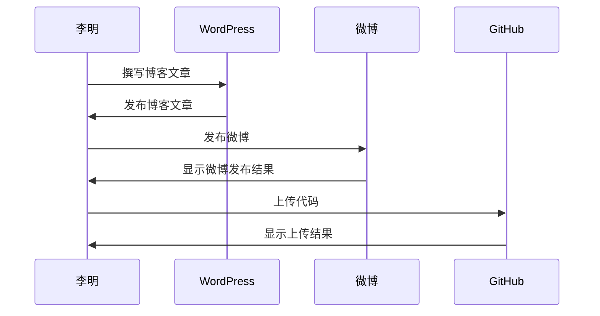
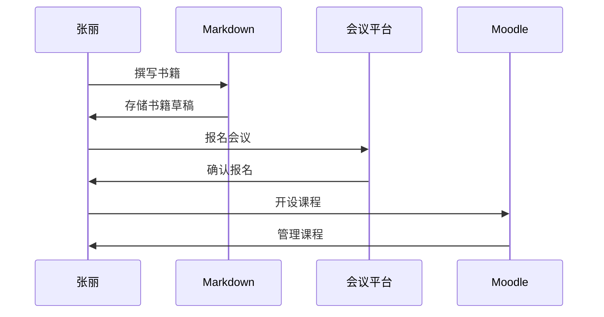

                 

### 第1章: 技术管理者的自我营销与品牌建设概述

#### 1.1 问题的背景

在数字化时代，技术管理者的角色日益重要。他们不仅是技术团队的领导者，更是公司战略决策的关键参与者和创新推动者。随着技术的发展，技术管理者的职责也从单纯的技术指导扩展到团队管理、项目管理、业务拓展等多个层面。然而，在这个过程中，技术管理者们逐渐意识到，提升个人品牌和影响力，对于职业发展和个人价值的实现至关重要。

当前，技术管理者的自我营销和品牌建设面临着诸多挑战。一方面，市场竞争激烈，同质化现象严重，技术管理者需要找到独特的个人定位，以在众多竞争者中脱颖而出；另一方面，信息传播速度快，社交媒体的崛起使得个人品牌的建设和传播变得更加复杂和多样化。此外，技术管理者在自我展示、自信心培养等方面也存在一定的短板，这使得他们在自我营销和品牌建设上感到困惑和无力。

#### 1.2 问题描述

技术管理者在自我营销和品牌建设方面主要面临以下问题：

1. **缺乏清晰的个人定位和目标**：许多技术管理者对自己的职业发展方向不明确，缺乏长期和短期的职业规划，导致个人品牌建设缺乏方向性。
   
2. **缺少有效的营销策略和渠道**：技术管理者往往专注于技术本身，忽视了自我营销的重要性，缺乏系统化的营销策略和渠道选择。

3. **不擅长利用社交媒体和网络平台**：虽然社交媒体和网络平台是提高个人品牌影响力的有效工具，但许多技术管理者对此不熟悉，不知道如何有效利用。

4. **对自己的知识和技能缺乏自信展示**：技术管理者可能对自己的技术知识和技能有信心，但在公众面前展示时，往往表现出紧张和不自信，无法充分展现个人价值。

#### 1.3 问题解决

为了解决上述问题，技术管理者可以采取以下措施：

1. **明确个人定位和目标**：通过深入自我反思和职业规划，明确个人在职场中的定位和目标，制定具体的职业发展路径。

2. **制定系统化的营销策略**：结合个人优势和市场需求，制定一套系统化的营销策略，包括内容创作、渠道选择、推广方法等。

3. **学会利用社交媒体和网络平台**：积极注册并熟练使用各类社交媒体和网络平台，通过持续的内容输出和互动，提高个人品牌知名度和影响力。

4. **提升自信心，展示个人知识和技能**：通过演讲、写作、技术分享等多种方式，不断提升个人自信心，展示自己的技术知识和技能。

#### 1.4 边界与外延

本书旨在为技术管理者提供自我营销和品牌建设的策略和方法，但并不局限于某一特定行业或技术领域。无论是软件开发、数据科学、人工智能，还是云计算、网络安全等领域，技术管理者都可以从本书中汲取通用性的方法和策略，应用到自己的职业发展中。

#### 1.5 概念结构与核心要素组成

为了更好地理解技术管理者的自我营销与品牌建设，我们可以将其核心概念和要素进行结构化分析。

1. **个人品牌**：这是技术管理者在职场中的独特形象和价值认同，包括技术专长、管理能力、个人品质等多个方面。

2. **营销策略**：这是为了提高个人品牌影响力而采取的一系列行动计划，包括内容创作、渠道选择、推广方法等。

3. **社交媒体**：这是技术管理者可以运用的网络平台，如微博、微信公众号、LinkedIn等，通过这些平台，技术管理者可以更有效地传播个人品牌。

4. **职业发展**：这是技术管理者通过自我营销和品牌建设，实现职业晋升和拓展机会的过程。

通过以上结构和要素的解析，我们可以更清晰地看到技术管理者自我营销与品牌建设的整体框架，为后续章节的深入探讨奠定基础。

### 第2章: 明确个人定位和目标

#### 2.1 核心概念原理

个人定位是指技术管理者在职场中明确自己的角色和地位，而目标则是为实现个人职业发展设定具体的目标和计划。个人定位和目标对于技术管理者的职业发展至关重要，它们不仅是个人职业规划的起点，也是提升个人品牌和影响力的关键。

**个人定位**：个人定位涉及对自身职业角色的识别和定义，包括技术专长、管理能力、个人风格等。一个清晰的个人定位有助于技术管理者在职场中找到自己的独特价值，从而在竞争激烈的市场中脱颖而出。

**目标**：目标是具体且可衡量的职业发展指标，它们指引着技术管理者前进的方向，提供行动的依据。目标可以是短期的，如完成某个项目或提升某项技能；也可以是长期的，如晋升为高级管理者或创业。

**核心概念原理**：

1. **自我反思**：技术管理者需要通过自我反思，深入了解自己的兴趣、优势和劣势，从而明确个人定位。
   
2. **市场需求**：个人定位不仅需要符合自身的特长，还要与市场需求相结合，确保个人的价值能够得到市场的认可。

3. **目标设定**：目标设定应具备明确性、可行性和挑战性，从而激励技术管理者不断前进。

4. **动态调整**：随着外部环境和个人发展的变化，技术管理者需要不断调整个人定位和目标，以保持职业发展的活力。

**概念属性特征对比表格**：

| 特征             | 个人定位                   | 目标                                |
|------------------|----------------------------|-----------------------------------|
| 定义             | 确定自己在职场中的角色和地位 | 制定实现个人职业发展的具体目标和计划 |
| 目的             | 明确个人发展方向           | 激发个人潜能，实现职业晋升          |
| 关系             | 与职业规划密切相关          | 是职业规划的组成部分               |
| 影响因素         | 个人兴趣、能力和市场需求   | 职业机会、行业趋势和个人成长速度   |

**ER实体关系图架构**：

```mermaid
erDiagram
    A[个人定位] ||--|{ B[职业规划] }
    B ||--|{ C[目标] }
```

在个人定位和目标的制定过程中，技术管理者需要全面分析自身条件，包括专业技能、管理能力、行业知识等，并结合市场环境和发展趋势，制定出切实可行的目标和计划。通过持续的自我反思和调整，技术管理者可以不断提升个人品牌，实现职业发展。

### 第3章: 制定系统化的营销策略

#### 3.1 核心概念原理

营销策略是技术管理者为提高个人品牌影响力而制定的具体行动计划。它不仅包括对个人优势和市场的分析，还涵盖了内容创作、渠道选择、推广方法等多个方面。一个有效的营销策略可以帮助技术管理者在众多竞争者中脱颖而出，提升个人知名度和职业影响力。

**核心概念原理**：

1. **个人优势分析**：技术管理者需要深入分析自己的优势，包括专业技能、管理能力、个人特质等，找出自己独特的卖点。

2. **市场需求分析**：了解市场需求，把握行业动态，识别潜在的职业发展机会，确保个人品牌建设符合市场趋势。

3. **内容创作**：内容是个人品牌的核心，技术管理者需要创作高质量的内容，包括技术博客、教程、演讲稿等，以展示个人专业知识和经验。

4. **渠道选择**：选择合适的渠道进行内容传播，如社交媒体、专业论坛、技术会议等，确保内容能够触达到目标受众。

5. **推广方法**：运用多种推广方法，如SEO优化、社交媒体广告、合作伙伴推荐等，扩大个人品牌的影响力。

**概念属性特征对比表格**：

| 特征             | 营销策略                   | 个人品牌                    |
|------------------|----------------------------|---------------------------|
| 定义             | 提高个人品牌影响力的行动计划 | 技术管理者在职场中的独特形象和价值认同 |
| 目的             | 拓展人脉、提高知名度、增加机会 | 建立信任、树立权威、形成口碑     |
| 关系             | 与个人品牌建设密切相关      | 是个人品牌建设的重要手段       |
| 影响因素         | 职场环境、行业趋势、个人特质 | 营销策略的效果、执行力、持续投入 |

#### 3.2 营销策略的具体内容

1. **个人优势分析**：

   - **专业技能**：评估自己在技术领域的专业能力和成就，如掌握的编程语言、解决复杂问题的能力等。
   - **管理能力**：评估自己的团队管理能力，如项目管理、人员调配、冲突解决等。
   - **个人特质**：分析自己的性格、价值观、沟通能力等，确保这些特质与个人品牌形象相符。

2. **市场需求分析**：

   - **行业趋势**：关注技术领域的最新趋势和发展方向，确保自己的技能和知识与时俱进。
   - **职业机会**：识别行业内的高需求岗位和职业发展路径，了解自己的目标岗位所需技能和经验。

3. **内容创作**：

   - **技术博客**：定期撰写技术博客，分享技术心得、解决方案和最佳实践，展示专业知识和创新能力。
   - **教程和演讲稿**：编写教程和演讲稿，通过线上或线下的方式分享自己的知识和经验，提升个人影响力。

4. **渠道选择**：

   - **社交媒体**：利用微博、微信公众号、LinkedIn等社交媒体平台，发布个人内容，与粉丝和同行互动。
   - **专业论坛**：参与技术论坛和社区，如Stack Overflow、GitHub等，分享技术见解和问题解决方案。
   - **技术会议**：参加行业会议和技术交流活动，结识业内专家，提升个人品牌知名度。

5. **推广方法**：

   - **SEO优化**：通过搜索引擎优化（SEO），提高个人博客和社交媒体内容的排名，增加曝光率。
   - **社交媒体广告**：在社交媒体平台上投放广告，针对特定受众进行精准推广。
   - **合作伙伴推荐**：与行业内的合作伙伴建立联系，通过他们的推荐提升个人品牌的信誉度。

#### 3.3 营销策略的执行步骤

1. **制定营销策略**：结合个人优势和市场需求，制定一套系统化的营销策略，明确目标受众、内容主题和推广渠道。

2. **内容创作**：根据营销策略，持续创作高质量的内容，保持内容的更新和互动。

3. **渠道推广**：选择合适的渠道进行内容传播，确保内容能够触达到目标受众。

4. **监测与评估**：定期监测营销策略的执行效果，通过数据分析和用户反馈，评估营销策略的成效，并进行调整和优化。

通过以上步骤，技术管理者可以逐步构建起一套有效的个人品牌营销策略，提升个人品牌影响力，实现职业发展的目标。

### 第4章: 学会运用社交媒体和网络平台

#### 4.1 核心概念原理

社交媒体和网络平台是技术管理者提高个人品牌影响力的关键工具。通过这些平台，技术管理者可以有效地传播个人知识和经验，扩大人脉，提升职业知名度。本章节将探讨如何运用社交媒体和网络平台，为技术管理者的自我营销和品牌建设提供有效策略。

**核心概念原理**：

1. **社交媒体**：社交媒体平台如微博、微信公众号、LinkedIn等，是技术管理者进行内容传播和社交互动的主要渠道。通过这些平台，技术管理者可以发布技术博客、教程、行业见解等，与受众建立联系。

2. **网络平台**：专业网络平台如GitHub、Stack Overflow等，是技术管理者展示技术能力和参与技术讨论的重要场所。通过这些平台，技术管理者可以分享代码、解决方案，参与技术社区，提升个人专业形象。

3. **内容创作**：高质量的内容是个人品牌建设的基础。技术管理者应定期创作技术博客、教程、演讲稿等，分享专业知识和实践经验，展示个人技术实力。

4. **社交互动**：通过社交媒体和网络平台，技术管理者可以与同行、潜在雇主和合作伙伴建立联系。积极参与行业讨论、回答问题、参与活动，扩大人脉，提升个人知名度。

**概念属性特征对比表格**：

| 特征             | 社交媒体                   | 网络平台                    |
|------------------|----------------------------|---------------------------|
| 定义             | 用户生成内容的社交媒体平台 | 专业技术社区和网络平台       |
| 目的             | 内容传播和社交互动         | 展示技术能力和参与讨论       |
| 关系             | 与个人品牌建设密切相关     | 与专业技能展示和交流紧密相关 |
| 影响因素         | 用户数量和活跃度           | 社区活跃度和专业知识深度     |

**ER实体关系图架构**：

```mermaid
erDiagram
    A[内容创作] ||--|{ B[社交媒体] }
    B ||--|{ C[社交互动] }
    C ||--|{ D[个人品牌建设] }
    A ||--|{ E[网络平台] }
```

#### 4.2 社交媒体和网络平台的运用

1. **社交媒体的运用**：

   - **内容创作**：定期发布技术博客、行业分析、技术趋势等，展示专业知识和见解。

   - **社交互动**：积极参与评论、点赞、转发等，与粉丝和同行建立互动，扩大影响力。

   - **社交媒体广告**：利用社交媒体广告，针对特定受众进行推广，提高个人品牌知名度。

   - **内容多样化**：结合文字、图片、视频等多种形式，丰富内容表现形式，吸引更多关注。

2. **网络平台的运用**：

   - **代码分享**：在GitHub上分享自己的代码项目，展示技术能力和实践经验。

   - **问题解答**：在Stack Overflow等平台上回答技术问题，提供解决方案，提升专业形象。

   - **技术社区参与**：积极参与技术论坛和社区，分享见解，参与讨论，扩大人脉。

   - **活动参与**：参加线上或线下的技术活动，结识业内专家，提升个人品牌知名度。

通过合理运用社交媒体和网络平台，技术管理者可以有效地传播个人知识和经验，提升职业影响力，实现自我品牌建设。

### 第5章: 提升自信心，展示个人知识和技能

#### 5.1 核心概念原理

提升自信心和展示个人知识和技能是技术管理者在自我营销和品牌建设过程中至关重要的环节。自信心不仅是个人魅力的体现，也是赢得他人信任和尊重的重要因素。而展示个人知识和技能，则是技术管理者实现职业发展的关键途径。通过有效的展示，技术管理者能够得到更多机会，提升职业地位。

**核心概念原理**：

1. **自信心**：自信心是个人心理素质的重要表现，它使技术管理者在面对挑战和压力时保持积极和坚定。提升自信心有助于技术管理者在自我营销和品牌建设中更加自信地展示自己的价值。

2. **展示个人知识和技能**：通过演讲、写作、技术分享等多种方式，技术管理者可以有效地展示自己的专业知识、技术能力和实践经验。这不仅能够增强个人品牌的影响力，还能够为技术管理者赢得更多的职业机会。

**概念属性特征对比表格**：

| 特征             | 自信心                     | 展示个人知识和技能                 |
|------------------|----------------------------|----------------------------------|
| 定义             | 个人心理素质的重要表现      | 通过多种方式展示专业知识和实践经验 |
| 目的             | 保持积极和坚定             | 赢得更多机会，提升职业地位          |
| 关系             | 与个人品牌建设密切相关      | 是个人品牌建设的重要手段            |
| 影响因素         | 个人经历、心态调整、心理支持 | 专业技能、实践经验、表达能力       |

**ER实体关系图架构**：

```mermaid
erDiagram
    A[自信心] ||--|{ B[自我营销] }
    B ||--|{ C[个人品牌建设] }
    C ||--|{ D[展示个人知识和技能] }
```

#### 5.2 提升自信心的方法

1. **自我反思**：通过自我反思，深入了解自己的优势和不足，认识到自己的价值和潜力，从而增强自信心。

2. **积极心态**：保持积极的心态，面对挑战和失败时不气馁，而是从中吸取经验和教训，不断提升自己。

3. **心理支持**：寻求家人、朋友或专业人士的支持和鼓励，建立良好的心理支持体系，增强自信心。

4. **成功经验**：回顾过去取得的成功经历，总结成功的原因和方法，将其应用到未来的工作中，增强自信心。

#### 5.3 展示个人知识和技能的方法

1. **演讲**：参加技术会议、行业论坛等，通过演讲分享自己的专业知识和经验，提升个人品牌知名度。

2. **写作**：撰写技术博客、技术文章，分享技术见解和最佳实践，展示专业能力和创新思维。

3. **技术分享**：在GitHub、Stack Overflow等平台上分享代码、解决方案和技术文档，提升技术影响力。

4. **在线课程**：开设在线课程，教授技术知识和实践经验，吸引更多学员，扩大个人影响力。

5. **专业认证**：参加专业认证考试，获得行业认可的证书，证明自己的专业技能和知识水平。

通过以上方法，技术管理者可以不断提升自信心，有效展示个人知识和技能，实现个人品牌的建设和职业发展的目标。

### 第6章: 实战案例分析

在本章中，我们将通过两个具体的实战案例，详细解析技术管理者在自我营销和品牌建设过程中的成功策略。这些案例展示了如何通过明确个人定位、制定营销策略、运用社交媒体和提升自信心等步骤，最终实现职业发展的目标。

#### 案例一：李明的成功之路

**背景介绍**：

李明是一位资深的技术管理者，拥有丰富的软件开发和管理经验。然而，他在职业发展中遇到了瓶颈，感觉自己的能力并未得到充分认可。为了提升个人品牌和职业影响力，他决定进行自我营销和品牌建设。

**项目介绍**：

李明的目标是在技术社区中建立自己的声誉，成为某一领域的专家。为此，他制定了一套系统化的营销策略，包括内容创作、社交媒体运用、技术分享等。

**系统功能设计（领域模型）**：

李明的领域模型包括以下几个核心功能：

- **内容创作**：撰写技术博客和教程，分享专业知识和经验。
- **社交媒体运用**：利用微博、微信公众号等平台，发布内容并与读者互动。
- **技术分享**：在GitHub和Stack Overflow上分享代码和解决方案。

**系统架构设计**：

李明的系统架构设计如下：

1. **内容创作平台**：使用WordPress搭建个人博客，定期更新技术文章。
2. **社交媒体平台**：注册微博、微信公众号，发布博客文章的链接，并定期与读者互动。
3. **技术分享平台**：在GitHub上创建个人仓库，分享开源项目和解决方案。

**系统接口设计和系统交互**：

李明通过以下接口和交互方式，实现个人品牌的建设：

- **博客文章接口**：通过WordPress的API，管理博客内容。
- **社交媒体接口**：使用微博和微信公众号的API，实现内容同步和互动。
- **GitHub接口**：利用GitHub API，管理个人仓库和分享代码。



**系统实现源代码**：

以下是一个简单的Python脚本，用于在GitHub上上传文件。

```python
import requests
import json

class GitHubUploader:
    def __init__(self, token, repository, branch, path):
        self.token = token
        self.repository = repository
        self.branch = branch
        self.path = path

    def upload_file(self, file_path, commit_message):
        headers = {
            'Authorization': f'token {self.token}',
            'Accept': 'application/vnd.github.v3+json'
        }
        data = {
            'message': commit_message,
            'name': file_path,
            'content': open(file_path, 'rb').read()
        }
        response = requests.post(
            f'https://api.github.com/repos/{self.repository}/git/blobs',
            headers=headers,
            data=data
        )
        blob = response.json()
        data = {
            'message': commit_message,
            'ref': f'heads/{self.branch}',
            'sha': blob['sha'],
            'commit': {
                'message': commit_message,
                'author': {
                    'name': '李明',
                    'email': 'liming@example.com',
                    'date': '2023-11-01T08:00:00Z'
                }
            }
        }
        response = requests.post(
            f'https://api.github.com/repos/{self.repository}/git/commits',
            headers=headers,
            data=json.dumps(data)
        )
        return response.json()

uploader = GitHubUploader(
    token='your_github_token',
    repository='your_repository',
    branch='main',
    path='example.txt'
)

response = uploader.upload_file('example.txt', 'Upload example file')
print(response)
```

**实际案例分析和详细讲解剖析**：

1. **内容创作**：李明通过定期发布高质量的技术博客，分享自己在软件开发和管理方面的见解。他的博客内容不仅涵盖技术细节，还涉及项目管理、团队协作等广泛话题。

2. **社交媒体运用**：李明通过微博和微信公众号发布博客文章链接，并与读者进行互动。他积极回复评论，解答读者的问题，逐渐积累了大量粉丝。

3. **技术分享**：李明在GitHub上分享了自己的开源项目，包括一个用于自动化部署的脚本和一个项目管理工具。这些项目受到了技术社区的广泛关注，为李明赢得了良好的口碑。

**项目小结**：

通过系统的自我营销和品牌建设策略，李明成功地提升了个人品牌影响力。他的博客和社交媒体账号吸引了大量关注，GitHub项目也获得了广泛的认可。这些成就为李明的职业发展奠定了坚实的基础。

#### 案例二：张丽的职场逆袭

**背景介绍**：

张丽是一位拥有多年软件开发经验的技术管理者，她在公司内享有较高的声誉，但在职业发展上遇到了瓶颈。为了进一步提升自己的职业地位，她决定通过自我营销和品牌建设来突破现状。

**项目介绍**：

张丽的自我营销和品牌建设目标是在行业内成为知名的技术专家，她制定了一系列策略，包括撰写技术书籍、参加技术会议、开设在线课程等。

**系统功能设计（领域模型）**：

张丽的领域模型包括以下几个核心功能：

- **书籍撰写**：撰写技术书籍，分享专业知识。
- **会议参与**：参加行业会议，进行技术演讲。
- **在线课程**：开设在线课程，教授技术知识和实践经验。

**系统架构设计**：

张丽的系统架构设计如下：

1. **书籍撰写平台**：使用Markdown编辑器撰写书籍草稿。
2. **会议平台**：注册行业会议，准备演讲稿和演示材料。
3. **在线课程平台**：使用Moodle等在线教育平台，开设课程。

**系统接口设计和系统交互**：

张丽通过以下接口和交互方式，实现个人品牌的建设：

- **书籍撰写接口**：使用Markdown编辑器进行书籍创作。
- **会议接口**：通过邮件和会议平台管理系统进行会议报名和演讲准备。
- **在线课程接口**：使用在线教育平台的API，管理课程内容和学员互动。



**系统实现源代码**：

以下是一个简单的Python脚本，用于在Moodle平台上创建课程。

```python
import requests
import json

class MoodleCreator:
    def __init__(self, base_url, token):
        self.base_url = base_url
        self.token = token

    def create_course(self, course_name, summary):
        headers = {
            'Authorization': f'Bearer {self.token}',
            'Content-Type': 'application/json'
        }
        data = {
            'course': {
                'fullname': course_name,
                'summary': summary
            }
        }
        response = requests.post(
            f'{self.base_url}/api/cli/courses.php',
            headers=headers,
            data=json.dumps(data)
        )
        return response.json()

moodle = MoodleCreator(
    base_url='https://your_moodle_instance.com',
    token='your_moodle_token'
)

response = moodle.create_course('Advanced Software Engineering', 'A comprehensive course on software engineering principles and practices.')
print(response)
```

**实际案例分析和详细讲解剖析**：

1. **书籍撰写**：张丽撰写了一本关于软件工程领域的入门书籍，书中涵盖了大量的实际案例和最佳实践。这本书不仅帮助初学者入门，还为行业内专业人士提供了宝贵的参考。

2. **会议参与**：张丽多次参加行业会议，并在大会上进行技术演讲。她的演讲内容深入浅出，得到了与会者的好评和关注。

3. **在线课程**：张丽在多个在线教育平台开设了课程，教授软件工程相关的知识。她的课程内容丰富，互动性强，吸引了大量学员，为她的个人品牌建设增添了重要的一环。

**项目小结**：

通过撰写书籍、参与会议和开设在线课程，张丽成功地提升了个人品牌和职业影响力。她的专业知识和授课能力得到了广泛认可，为她赢得了更多的职业机会和更高的职业地位。

通过以上两个案例，我们可以看到，技术管理者通过明确的自我营销和品牌建设策略，可以实现个人职业发展的目标。这些策略不仅适用于特定的技术领域，也可以为其他领域的专业人士提供参考和启示。

### 第7章: 最佳实践与注意事项

#### 7.1 最佳实践

在技术管理者的自我营销与品牌建设中，有一些最佳实践可以帮助他们更高效地实现目标：

1. **内容为王**：高质量的内容是个人品牌的核心。技术管理者应专注于创作有价值的技术博客、教程和演讲稿，确保内容具有深度和实用性。

2. **持续更新**：定期发布内容，保持社交媒体和博客的活跃度。持续的内容输出可以吸引和保持受众的关注，提升个人品牌的活跃度。

3. **互动交流**：积极与读者和同行互动，回应评论和提问。通过互动，技术管理者可以建立更深层次的联系，增强个人影响力。

4. **利用网络资源**：充分利用专业论坛、GitHub、Stack Overflow等网络平台，展示技术能力和专业知识。这些平台是技术社区的重要资源，可以帮助技术管理者提升知名度。

5. **明确目标**：制定清晰的职业发展目标，并制定相应的计划和策略。明确的目标有助于技术管理者集中精力，有针对性地进行自我营销和品牌建设。

#### 7.2 注意事项

在进行自我营销和品牌建设时，技术管理者需要注意以下几点：

1. **避免过度自我营销**：虽然个人品牌建设很重要，但过度营销可能会适得其反。技术管理者应确保内容的真实性和专业性，避免过度夸大自己的能力和成就。

2. **保持内容一致性**：在社交媒体和博客上，技术管理者应保持内容的一致性，确保品牌形象的一致性和专业性。

3. **注意隐私保护**：在公开分享内容时，技术管理者应注意保护个人隐私，避免泄露敏感信息。

4. **持续学习和提升**：技术管理者的技能和知识应不断更新和提升，以适应不断变化的技术和市场环境。

通过遵循这些最佳实践和注意事项，技术管理者可以更有效地进行自我营销和品牌建设，实现职业发展的目标。

### 总结与展望

本文详细探讨了技术管理者的自我营销与品牌建设，通过明确个人定位、制定系统化的营销策略、学会运用社交媒体和网络平台，以及提升自信心和展示个人知识和技能等步骤，帮助技术管理者实现职业发展的目标。以下是本文的主要结论：

1. **个人定位和目标**：明确个人定位和目标是技术管理者品牌建设的起点，有助于他们在职场中找到独特的价值。
2. **系统化的营销策略**：通过分析自身优势和市场需求，制定有效的营销策略，技术管理者可以提升个人品牌影响力。
3. **社交媒体和网络平台**：合理运用社交媒体和网络平台，可以扩大技术管理者的受众范围，提升知名度。
4. **自信心和技能展示**：提升自信心，并通过多种方式展示个人知识和技能，有助于技术管理者赢得更多的职业机会。

展望未来，随着技术的不断进步和数字化转型的加速，技术管理者的角色和职责将进一步拓展。因此，技术管理者需要不断学习和适应，保持自身的竞争力。同时，他们应更加注重个人品牌的建设，通过有效的自我营销，实现职业发展的新高度。让我们共同期待技术管理者在未来的舞台上绽放光彩。作者：AI天才研究院/AI Genius Institute & 禅与计算机程序设计艺术 /Zen And The Art of Computer Programming

