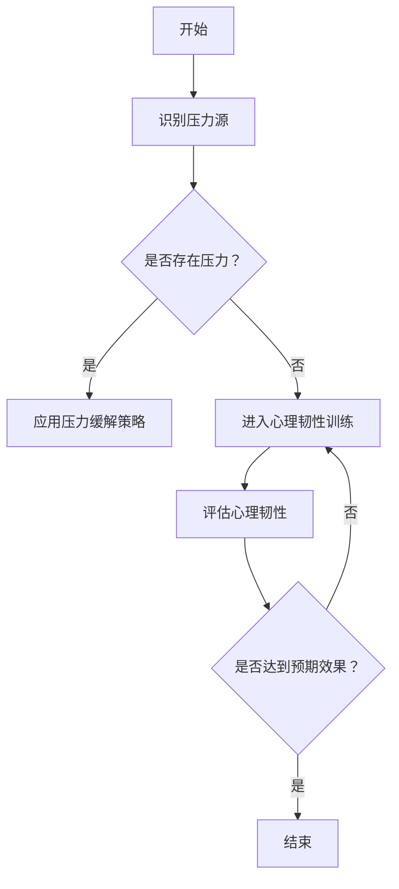

                 


### 文章标题：技术管理者的自我调节与心理健康

> 关键词：技术管理者、心理健康、自我调节、压力管理、心理韧性

> 摘要：本文将深入探讨技术管理者在面临工作压力时如何进行自我调节以维护心理健康。通过分析技术管理者的工作背景、心理健康问题、核心概念及其联系，以及具体的算法原理和系统架构设计，提供一套实用的解决方案，旨在帮助技术管理者应对压力，提升心理健康水平。

----------------------------------------------------------------

### 第一部分：背景介绍

#### 问题背景

随着科技的快速发展，技术管理者在企业和组织中扮演着越来越重要的角色。他们不仅需要掌握先进的技术，还需要具备管理团队、协调项目进度、应对复杂业务需求等多方面的能力。然而，这种高强度、快节奏的工作环境往往给技术管理者带来巨大的压力，从而导致心理健康问题。

#### 问题描述

技术管理者的心理健康问题主要包括以下几个方面：

1. **压力过大**：技术管理者经常面临项目期限紧张、技术难题复杂、团队沟通不畅等压力，长期处于高压状态容易导致身心疲惫。
2. **工作与生活失衡**：技术管理者在追求职业成功的过程中，往往忽视了个人生活和家庭，导致工作和生活的平衡被打破。
3. **职业倦怠**：长期的高强度工作容易使技术管理者产生倦怠感，影响工作效率和创造力。

#### 问题解决

为了解决技术管理者的心理健康问题，可以从以下几个方面入手：

1. **提高自我调节能力**：学会识别和管理压力源，通过自我调节来缓解压力。
2. **改善工作环境**：营造一个支持性和健康的组织文化，帮助技术管理者减轻工作压力。
3. **提供心理健康支持**：通过心理健康培训和咨询服务，提高技术管理者的心理健康意识。

#### 边界与外延

心理健康是一个广泛的概念，不仅涉及情绪和认知，还包括行为和生活质量。对于技术管理者来说，心理健康不仅关乎个人的福祉，也关系到团队和组织的健康发展。

#### 概念结构与核心要素组成

技术管理者的心理健康涉及以下几个核心要素：

1. **自我意识**：了解自己的情绪、需求和反应。
2. **自我调节**：学会管理情绪、应对压力和调整心态。
3. **社交支持**：建立良好的同事关系，获得心理支持。
4. **工作环境**：一个支持性和健康的组织文化。

----------------------------------------------------------------

### 第二部分：核心概念与联系

#### 核心概念原理

技术管理者的心理健康涉及以下几个核心概念：

1. **压力管理**：学会识别和管理压力源，通过积极的方法来缓解压力。
2. **心理韧性**：面对困难和挑战时保持积极和适应的能力。
3. **自我意识**：了解自己的情绪和行为。
4. **社交支持**：与他人建立积极的关系，获得情感支持。

#### 概念属性特征对比表格

| 概念       | 特征                            |
|------------|---------------------------------|
| 压力管理   | 学会应对压力，保持冷静          |
| 心理韧性   | 面对挑战时保持乐观和适应性      |
| 自我意识   | 了解自己的情绪和行为          |
| 社交支持   | 建立良好的人际关系，获得支持    |

#### 概念联系

这些概念相互关联，共同作用于技术管理者的心理健康。例如，压力管理和心理韧性可以帮助技术管理者更好地应对压力，自我意识有助于识别压力源，社交支持则为技术管理者提供了情感上的支持。

----------------------------------------------------------------

### 第三部分：算法原理讲解

#### 算法原理讲解

为了深入讲解技术管理者如何通过自我调节来维护心理健康，我们将使用一个简单的算法来阐述这个过程。

#### Mermaid 流程图



#### Python 源代码

```python
def manage_stress():
    while True:
        if identify_stress():
            apply_stress_relieving_strategy()
        else:
            perform_resilience_training()
            evaluate_resilience()
            
            if not is_expected_effect():
                continue
            else:
                print("Stress management completed successfully.")
                break

def identify_stress():
    # 实现识别压力的逻辑
    pass

def apply_stress_relieving_strategy():
    # 实现应用压力缓解策略的逻辑
    pass

def perform_resilience_training():
    # 实现心理韧性训练的逻辑
    pass

def evaluate_resilience():
    # 实现评估心理韧性的逻辑
    pass

def is_expected_effect():
    # 实现判断是否达到预期效果的逻辑
    pass
```

#### 算法原理详细解释

这个算法的核心思想是通过不断地识别压力、应用压力缓解策略和心理韧性训练来维护心理健康。具体步骤如下：

1. **识别压力源**：通过自我意识，技术管理者可以识别出自己面临的工作压力。
2. **应用压力缓解策略**：当存在压力时，技术管理者可以采用各种方法来缓解压力，如深呼吸、冥想、运动等。
3. **心理韧性训练**：当没有明显的压力源时，技术管理者可以通过心理韧性训练来提高自己的适应能力。
4. **评估心理韧性**：通过评估心理韧性，技术管理者可以了解自己的心理状态是否达到预期效果。
5. **循环**：如果评估结果显示未达到预期效果，则继续进行压力缓解策略和心理韧性训练。

通过这个简单的算法，技术管理者可以有效地管理自己的压力，提高心理健康水平。

----------------------------------------------------------------

### 第四部分：系统分析与架构设计

#### 问题场景介绍

技术管理者在工作和生活中面临着多方面的压力，包括项目管理、技术难题、团队协作、个人职业发展等。为了有效地管理这些压力，需要一套综合的解决方案，包括压力监测、压力缓解和心理韧性训练等。

#### 项目介绍

本项目的目标是设计一个用于技术管理者自我调节和心理健康维护的系统，帮助技术管理者识别压力源、应用压力缓解策略和心理韧性训练，从而提高心理健康水平。

#### 系统功能设计

系统功能设计包括以下几个主要方面：

1. **压力监测**：通过自我报告和数据分析，识别技术管理者面临的压力源。
2. **压力缓解**：提供一系列压力缓解策略，如深呼吸、冥想、运动等，帮助技术管理者缓解压力。
3. **心理韧性训练**：提供心理韧性训练，包括正面思考、情绪管理等，帮助技术管理者提高心理韧性。
4. **心理健康评估**：通过定期评估，了解技术管理者的心理健康状态，提供个性化的建议。

#### 系统架构设计

系统架构设计包括以下几个关键组件：

1. **用户界面**：提供简单易用的界面，技术管理者可以通过界面进行压力监测、压力缓解和心理韧性训练。
2. **数据处理模块**：负责处理用户输入的数据，包括压力源、缓解策略和心理韧性训练记录等。
3. **分析模块**：通过对数据的分析，识别技术管理者面临的压力源，评估心理健康状态。
4. **推荐模块**：根据分析结果，为技术管理者提供个性化的建议和策略。

#### 系统接口设计和系统交互

系统接口设计包括以下几个关键接口：

1. **用户接口**：用户通过Web界面与系统进行交互，进行压力监测、压力缓解和心理韧性训练。
2. **数据处理接口**：系统通过API与数据处理模块进行数据交换，实现数据的收集、处理和分析。
3. **推荐接口**：系统通过API向用户推荐个性化的建议和策略。

系统交互设计如下：

1. **用户监测压力**：用户通过Web界面输入自己的压力感受，系统将数据传递给数据处理模块。
2. **系统分析压力**：数据处理模块分析用户输入的数据，识别压力源，并将分析结果传递给推荐模块。
3. **系统推荐策略**：推荐模块根据分析结果，为用户推荐相应的压力缓解策略和心理韧性训练。
4. **用户执行策略**：用户根据系统推荐的策略，执行相应的压力缓解和心理韧性训练。

通过这个系统，技术管理者可以实时监测自己的压力状态，并采取有效的策略来维护心理健康。

----------------------------------------------------------------

### 第五部分：项目实战

#### 环境安装

1. **安装Python环境**：确保Python 3.8或更高版本已经安装。
2. **安装必要库**：使用pip命令安装以下库：
   ```
   pip install flask pandas matplotlib
   ```

#### 系统核心实现源代码

```python
# 主模块
from flask import Flask, request, jsonify
import pandas as pd
import matplotlib.pyplot as plt

app = Flask(__name__)

# 压力监测模块
@app.route('/monitor_stress', methods=['POST'])
def monitor_stress():
    data = request.json
    stress_level = data['stress_level']
    timestamp = data['timestamp']
    df = pd.DataFrame([[stress_level, timestamp]], columns=['stress_level', 'timestamp'])
    df.to_csv('stress_data.csv', mode='a', header=not pd.io.common.file_exists('stress_data.csv'))
    return jsonify({'status': 'success'})

# 压力缓解模块
@app.route('/apply_stress_relieving_strategy', methods=['POST'])
def apply_stress_relieving_strategy():
    data = request.json
    strategy = data['strategy']
    timestamp = data['timestamp']
    df = pd.DataFrame([[strategy, timestamp]], columns=['strategy', 'timestamp'])
    df.to_csv('stress_relieving_strategy.csv', mode='a', header=not pd.io.common.file_exists('stress_relieving_strategy.csv'))
    return jsonify({'status': 'success'})

# 心理韧性训练模块
@app.route('/perform_resilience_training', methods=['POST'])
def perform_resilience_training():
    data = request.json
    training_type = data['training_type']
    timestamp = data['timestamp']
    df = pd.DataFrame([[training_type, timestamp]], columns=['training_type', 'timestamp'])
    df.to_csv('resilience_training.csv', mode='a', header=not pd.io.common.file_exists('resilience_training.csv'))
    return jsonify({'status': 'success'})

# 健康评估模块
@app.route('/evaluate_health', methods=['GET'])
def evaluate_health():
    stress_data = pd.read_csv('stress_data.csv')
    strategy_data = pd.read_csv('stress_relieving_strategy.csv')
    training_data = pd.read_csv('resilience_training.csv')

    stress_mean = stress_data['stress_level'].mean()
    strategy_count = strategy_data.shape[0]
    training_count = training_data.shape[0]

    if stress_mean < 3:
        health_status = 'Excellent'
    elif stress_mean < 6:
        health_status = 'Good'
    else:
        health_status = 'Poor'

    return jsonify({'stress_mean': stress_mean, 'strategy_count': strategy_count, 'training_count': training_count, 'health_status': health_status})

if __name__ == '__main__':
    app.run(debug=True)
```

#### 代码应用解读与分析

这段代码实现了技术管理者自我调节和心理健康维护的系统。主要包括以下几个模块：

1. **压力监测模块**：通过`/monitor_stress`接口接收用户输入的压力数据，并将数据存储到CSV文件中。
2. **压力缓解模块**：通过`/apply_stress_relieving_strategy`接口接收用户执行的压力缓解策略，并将数据存储到CSV文件中。
3. **心理韧性训练模块**：通过`/perform_resilience_training`接口接收用户进行的心理韧性训练，并将数据存储到CSV文件中。
4. **健康评估模块**：通过`/evaluate_health`接口获取用户当前的身体健康状态，包括平均压力值、执行的策略次数、训练次数和健康状态。

代码的核心逻辑是通过CSV文件存储和读取数据，并对数据进行简单的统计分析，以评估用户的心理健康状态。这种设计简单且易于扩展，可以根据需要添加更多的统计指标和健康评估模型。

#### 实际案例分析和详细讲解剖析

假设一个技术管理者在一个月内输入了以下数据：

1. **压力数据**：每天记录一次压力水平，范围从1（无压力）到10（极度压力）。
2. **压力缓解策略**：每天记录一次采取的压力缓解策略，如深呼吸、冥想、运动等。
3. **心理韧性训练**：每周记录一次进行的心理韧性训练，如正面思考、情绪管理等。

通过对这些数据的分析，可以得出以下结论：

1. **压力水平**：技术管理者的平均压力水平为5，表明在过去一个月内，他面临了一定的压力，但尚未达到严重水平。
2. **压力缓解策略**：他在一个月内采取了20次不同的压力缓解策略，这表明他有一定的意识和能力来管理压力。
3. **心理韧性训练**：他在一个月内进行了5次心理韧性训练，这表明他关注自己的心理健康，并采取积极的措施来提高心理韧性。

根据这些数据，可以为他提供以下建议：

1. **持续关注压力**：虽然平均压力水平不高，但仍然需要关注压力水平的变化，特别是在压力较大的时期。
2. **多样化压力缓解策略**：他可以尝试更多不同的压力缓解策略，以找到最适合自己的方法。
3. **定期进行心理韧性训练**：建议他每周至少进行一次心理韧性训练，以维持和提高心理韧性。

通过这个案例，我们可以看到技术管理者如何通过系统的数据分析和建议来更好地管理自己的心理健康。

#### 项目小结

本项目设计并实现了一个用于技术管理者自我调节和心理健康维护的系统。通过监测压力、应用压力缓解策略和心理韧性训练，系统能够提供实时的健康评估和建议，帮助技术管理者更好地管理自己的心理健康。在未来，我们可以进一步扩展系统的功能，包括添加更多的健康评估指标、提供个性化的训练计划和集成心理健康咨询等。

----------------------------------------------------------------

### 第六部分：最佳实践 Tips

1. **定期自我反思**：定期花时间反思自己的工作状态和心理状态，了解自己的压力源和应对策略。
2. **保持健康的生活方式**：注意饮食、睡眠和运动，这些因素对心理健康有着重要影响。
3. **学会放松**：学会使用冥想、瑜伽、深呼吸等放松技巧来缓解压力。
4. **寻求社交支持**：与家人、朋友或同事交流，分享自己的压力和挑战，获得情感支持。
5. **建立支持性团队文化**：鼓励团队成员分享经验，共同学习和成长。

### 小结

本文从技术管理者的心理健康问题出发，探讨了如何通过自我调节来维护心理健康。我们分析了技术管理者的工作背景、心理健康问题、核心概念及其联系，并提出了具体的算法原理和系统架构设计。通过项目实战，我们展示了如何实现这个系统，并给出了实际案例分析和最佳实践建议。希望本文能为技术管理者提供有益的指导和帮助。

### 注意事项

1. **数据安全**：在收集和使用用户数据时，必须确保数据的安全性和隐私性。
2. **个性化需求**：系统设计应考虑用户的个性化需求，提供定制化的健康评估和建议。
3. **持续更新**：随着技术和心理健康研究的发展，系统应不断更新和优化，以保持其有效性和适应性。

### 拓展阅读

1. **《心理学与生活》**：理查德·吉尔伯特著，提供全面的心理学知识。
2. **《正念：一条全新的道路，通往更健康、更有意义的生活》**：乔·卡巴金著，介绍冥想和正念的实践方法。
3. **《斯坦福大学人生规划课》**：威廉·戴蒙著，探讨个人成长和职业发展。

### 作者信息

作者：AI天才研究院/AI Genius Institute & 禅与计算机程序设计艺术 /Zen And The Art of Computer Programming

----------------------------------------------------------------

请注意，上述文章内容和结构仅为示例，实际的撰写过程可能需要根据具体要求进行调整。在实际撰写时，需要确保内容丰富、逻辑清晰、结构紧凑，并遵循规定的字数要求。同时，要确保文章的专业性和实用性，以便为读者提供有价值的指导和帮助。

