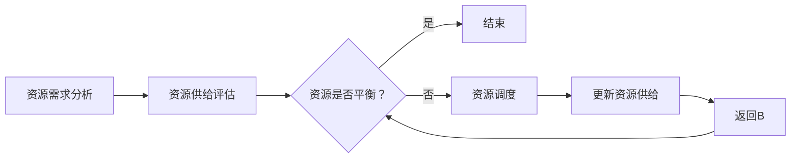
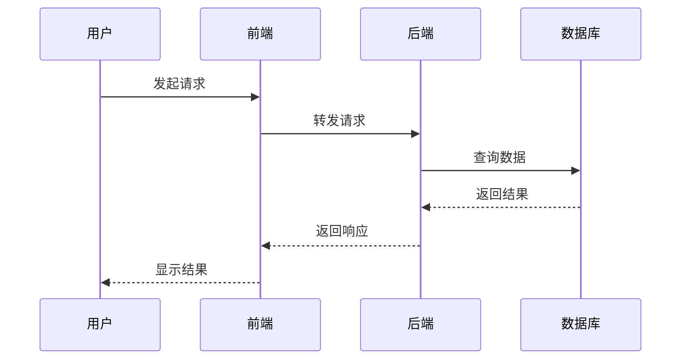

                 


## 技术管理者的资源规划：合理分配人力和物力

关键词：技术管理者、资源规划、人力、物力、分配

摘要：
本文针对技术管理者的资源规划进行了深入探讨，分析了人力资源规划和物料资源规划的重要性，并通过实际案例展示了合理分配人力和物力的关键步骤。本文旨在为技术管理者提供一套系统的资源规划方法，以优化团队效率和项目成果。

### 引言

在技术管理领域，资源规划是确保项目成功的关键环节。技术管理者不仅要具备技术领域的专业能力，还需具备管理资源的能力。资源规划涉及人力和物力的合理分配，这对于项目进度、质量和成本控制至关重要。本文将从以下方面展开讨论：

1. 资源规划的基础理论
2. 人力资源规划
3. 物料资源规划
4. 项目管理与资源优化
5. 案例研究
6. 总结与展望

### 第1章：资源规划概述

资源规划是指为了实现特定目标，对人力、物力、财力和信息资源进行合理分配和有效利用的过程。对于技术管理者而言，资源规划涉及到团队的人力资源和项目所需的物料资源。

**资源规划的核心概念：**

- **人力规划**：包括人员的招聘、培训、绩效评估和团队建设。
- **物料规划**：包括设备、材料、零部件等的采购、存储、管理和优化。

**资源规划的基本原则：**

- **优化资源配置**：确保资源得到充分利用，避免浪费。
- **平衡需求和供给**：确保资源供给与项目需求相匹配，避免资源过剩或短缺。
- **灵活应变**：根据项目进展和外部环境变化，及时调整资源分配策略。

### 第2章：资源规划的基础理论

在资源规划中，理解基础理论至关重要。以下是一些关键概念和原理：

**关键概念：**

- **资源需求分析**：通过对项目需求的深入分析，确定所需的资源类型和数量。
- **资源供给分析**：评估现有资源的状况，包括人力、设备和物料等。
- **资源平衡**：确保资源供给与需求之间的平衡，避免资源短缺或过剩。
- **资源调度**：根据项目进度和优先级，合理调度资源，确保关键任务的优先完成。

**原理说明：**

- **帕累托原理**：在资源分配中，关键的少数资源往往能带来大部分的效益。
- **最大化利用原则**：尽可能提高资源的利用率，减少闲置和浪费。

### 第3章：人力资源规划

人力资源是技术团队的核心资源，合理规划人力资源对于项目成功至关重要。以下是人
### 第3章：人力资源规划

人力资源是技术团队的核心资源，合理规划人力资源对于项目成功至关重要。以下是人

### 第3章：人力资源规划

人力资源是技术团队的核心资源，合理规划人力资源对于项目成功至关重要。以下是一些关键步骤和方法：

#### 关键步骤：

1. **需求分析**：
   - 确定项目需求，包括功能需求、性能需求和人员需求。
   - 评估当前团队成员的能力和技能，确定哪些人员适合参与项目。

2. **招聘策略**：
   - 根据项目需求制定招聘计划，包括招聘标准、招聘渠道和招聘预算。
   - 采用多种招聘方式，如内部推荐、招聘网站、招聘会等，以吸引合适的人才。

3. **培训与发展**：
   - 设计培训计划，提高团队成员的技能和知识水平。
   - 提供职业发展路径，激励团队成员不断提升自己。

4. **绩效管理**：
   - 建立公平、透明的绩效评估体系，定期对团队成员进行绩效评估。
   - 根据评估结果给予奖励或改进建议。

5. **团队建设**：
   - 通过团队活动、沟通与协作，增强团队成员之间的凝聚力。
   - 营造积极向上的团队文化，提升团队士气。

#### 方法与工具：

- **技能矩阵**：通过技能矩阵评估团队成员的能力，以便进行合理的人员分配。
- **关键路径法（CPM）**：使用关键路径法确定项目中的关键任务，确保关键人员分配到关键任务。
- **人员矩阵**：通过人员矩阵展示团队成员的技能和项目任务的匹配程度，以便进行优化分配。

#### 案例分析：

以一家互联网公司的新产品开发项目为例，该项目需要前端开发、后端开发、UI设计、测试等不同角色的人员参与。在项目初期，技术管理者通过技能矩阵分析了现有团队成员的能力，确定哪些成员适合参与前端和后端开发。同时，为了满足UI设计的需求，管理者决定通过招聘网站吸引外部设计师。在项目进行过程中，管理者通过关键路径法确定了关键任务，并将关键任务分配给关键人员。此外，通过定期的团队建设和沟通，管理者确保了团队成员之间的协作和高效合作。

### 第4章：物料资源规划

物料资源规划涉及项目所需的各种设备和材料，包括硬件、软件、零部件等。合理的物料资源规划能够确保项目顺利推进，提高项目质量和降低成本。以下是物料资源规划的关键步骤：

#### 关键步骤：

1. **需求分析**：
   - 分析项目需求，确定所需的物料类型和数量。
   - 考虑项目的特殊需求，如定制化硬件或特殊软件许可证。

2. **采购计划**：
   - 制定采购计划，包括采购时间表、采购预算和采购渠道。
   - 与供应商谈判，争取优惠价格和优质服务。

3. **库存管理**：
   - 建立库存管理系统，确保物料的库存水平合理。
   - 定期进行库存盘点，避免物料过多或过少。

4. **质量控制**：
   - 对采购的物料进行质量控制，确保物料符合项目需求和质量标准。
   - 与供应商建立良好的沟通机制，解决物料质量问题和交付问题。

#### 方法与工具：

- **物料需求计划（MRP）**：使用物料需求计划软件，根据项目需求自动计算物料需求，生成采购订单。
- **供应商管理**：建立供应商评估体系，对供应商进行评估和选择，确保供应商能够满足项目需求。

#### 案例分析：

以一家软件公司的新产品开发项目为例，该项目需要高性能的服务器、特定的开发工具和第三方库。在项目初期，技术管理者通过需求分析确定了项目所需的硬件和软件资源。然后，管理者制定了采购计划，并与多家供应商进行谈判，最终选择了性价比最高的供应商。在项目进行过程中，管理者通过物料需求计划软件监控物料需求，确保物料及时供应。同时，管理者对采购的硬件和软件进行质量控制，确保资源符合项目需求。

### 第5章：项目管理与资源优化

项目管理是资源规划的重要组成部分。有效的项目管理能够确保资源得到充分利用，提高项目效率和质量。以下是一些关键方法和工具：

#### 关键方法：

1. **项目计划**：
   - 制定详细的项目计划，包括项目目标、任务分解、时间表和资源分配。
   - 使用项目管理工具（如Microsoft Project、JIRA等）进行项目计划和管理。

2. **进度监控**：
   - 定期检查项目进度，确保项目按计划进行。
   - 使用进度报告和甘特图等工具展示项目进展情况。

3. **风险管理**：
   - 识别项目中的风险，制定风险应对策略。
   - 定期评估风险，确保风险得到及时控制和解决。

4. **变更管理**：
   - 对项目变更进行有效管理，确保变更不影响项目进度和质量。
   - 使用变更控制流程和变更日志记录变更情况。

#### 工具与技巧：

- **关键路径法（CPM）**：用于确定项目中的关键任务和关键路径，确保关键任务优先完成。
- **资源平衡**：通过资源平衡技术，确保资源在不同任务之间的合理分配。
- **敏捷开发**：采用敏捷开发方法，快速响应项目需求和变更，提高项目灵活性。

#### 案例分析：

以一家软件开发公司的项目为例，该公司正在开发一款新的移动应用。在项目初期，项目经理制定了详细的项目计划，包括任务分解、时间表和资源分配。然后，项目经理使用JIRA进行项目计划和管理，确保项目按计划进行。在项目进行过程中，项目经理定期检查项目进度，并使用甘特图展示项目进展情况。同时，项目经理使用关键路径法确定关键任务，确保关键任务优先完成。在项目变更时，项目经理使用变更控制流程，确保变更不影响项目进度和质量。

### 第6章：案例研究

在本章节中，我们将分析几个技术管理者的资源规划案例，从中提炼出关键经验和教训。

#### 案例一：互联网公司的产品开发

一家互联网公司正在开发一款新的社交应用。在项目初期，技术管理者通过需求分析和技能矩阵确定了项目所需的人力资源，包括前端开发、后端开发、UI设计和测试等角色。同时，管理者通过物料需求计划软件确定了项目所需的硬件和软件资源。在项目进行过程中，管理者通过关键路径法确保了关键任务的优先完成。最终，该项目在预定时间内完成，并得到了用户的好评。

**经验教训：**

- 人力资源和物料资源的合理规划是项目成功的关键。
- 使用项目管理工具和方法，如关键路径法和物料需求计划，可以提高项目效率。

#### 案例二：科技公司的研发项目

一家科技公司正在研发一款智能家居系统。在项目初期，技术管理者通过风险评估确定了项目中的主要风险，如技术难题和供应链问题。管理者制定了详细的风险应对策略，并定期评估风险。在项目进行过程中，管理者通过进度监控和资源平衡技术确保项目按计划进行。最终，该项目成功发布，并获得了市场认可。

**经验教训：**

- 风险管理是资源规划的重要环节，提前识别和应对风险可以降低项目风险。
- 进度监控和资源平衡技术有助于确保项目按时完成。

### 第7章：总结与展望

资源规划是技术管理者的一项重要职责，它对于项目的成功至关重要。本文从人力资源规划和物料资源规划两个方面，详细探讨了资源规划的方法和实践。通过案例分析，我们了解了资源规划的关键经验和教训。

**未来展望：**

- 随着技术的不断进步，资源规划将更加智能化和自动化。
- 人工智能和机器学习技术将有助于更精准地预测资源需求和优化资源分配。
- 跨学科的整合，如结合心理学和社会学，将有助于提升团队协作和资源利用效率。

**结论：**

资源规划是技术管理者的核心能力之一。通过合理分配人力和物力，技术管理者可以确保项目成功，提升团队效率，降低成本。本文提供了一套系统的资源规划方法，旨在为技术管理者提供实践指导和理论支持。

### 附录：拓展阅读

- **《敏捷项目管理：实践指南》**：详细介绍了敏捷开发方法，适用于快速响应项目需求和变更。
- **《项目管理的五大控制领域》**：探讨了项目计划、执行、监控、收尾和变更管理的核心概念和实践。
- **《供应链管理：战略、规划与运作》**：介绍了供应链管理的理论和实践，对于物料资源规划具有指导意义。

### 作者信息

**作者：AI天才研究院/AI Genius Institute & 禅与计算机程序设计艺术 /Zen And The Art of Computer Programming**


## 背景介绍

在当今快速变化的技术环境中，技术管理者面临的挑战日益增多。资源规划作为技术管理的重要组成部分，对于项目的成功具有决定性影响。资源规划不仅涉及如何合理配置人力，还包括如何优化物力资源，以确保项目按时、按质完成。本文将从以下几个方面介绍核心概念、问题背景、问题描述、问题解决、边界与外延、概念结构与核心要素组成。

### 核心概念

**资源规划**：资源规划是指为了实现特定目标，对人力、物力、财力和信息资源进行合理分配和有效利用的过程。资源规划的核心概念包括资源需求分析、资源供给分析、资源平衡和资源调度。

**人力资源规划**：人力资源规划涉及对技术团队的人力资源进行管理，包括招聘、培训、绩效评估和团队建设。人力资源规划的关键概念包括技能矩阵、关键路径法、人员矩阵等。

**物料资源规划**：物料资源规划涉及项目所需的各种设备和材料，包括硬件、软件、零部件等。物料资源规划的关键概念包括物料需求计划（MRP）、供应商管理、库存管理等。

### 问题背景

技术管理者的工作环境日益复杂，项目规模和复杂性不断增加。在这种背景下，资源规划的重要性愈发凸显。技术管理者需要确保团队的人力资源和物料资源得到合理利用，以应对项目需求的变化，提高项目效率和质量。

### 问题描述

资源规划涉及多个方面，其中人力资源规划和物料资源规划是两个关键领域。人力资源规划需要解决以下问题：

1. 如何根据项目需求确定合适的人员？
2. 如何确保团队成员的技能和知识水平满足项目需求？
3. 如何进行团队建设和沟通，提高团队协作效率？

物料资源规划需要解决以下问题：

1. 如何根据项目需求确定所需的物料类型和数量？
2. 如何选择合适的供应商，确保物料质量和交付？
3. 如何进行库存管理，避免物料过多或过少？

### 问题解决

解决资源规划问题需要采取以下步骤：

1. **需求分析**：对项目需求进行深入分析，确定人力资源和物料资源的需求。
2. **资源评估**：评估现有的人力资源和物料资源，确定可用资源的情况。
3. **资源规划**：根据需求分析和资源评估结果，制定人力资源规划和物料资源规划。
4. **执行与监控**：执行资源规划方案，并定期监控资源利用情况，及时进行调整。
5. **优化与改进**：通过分析资源利用情况，不断优化资源规划方案，提高资源利用效率。

### 边界与外延

资源规划不仅涉及项目内部的人力资源和物料资源，还包括与外部供应商和合作伙伴的合作。因此，资源规划的边界和外部关联包括：

1. **供应商管理**：与供应商的合作和沟通，确保物料供应的及时性和质量。
2. **外部团队协作**：与其他团队（如市场部、销售部等）的协作，确保项目资源的协同利用。
3. **法律法规**：遵守相关法律法规，确保资源获取和使用符合法律规定。

### 概念结构与核心要素组成

资源规划的概念结构包括以下几个核心要素：

1. **需求分析**：确定项目需求和资源需求。
2. **资源评估**：评估现有资源和潜在资源。
3. **资源规划**：制定资源分配和利用方案。
4. **执行与监控**：执行资源规划方案，并监控资源利用情况。
5. **优化与改进**：根据监控结果优化资源规划方案。

通过以上核心要素的有机结合，技术管理者可以实现对人力资源和物料资源的有效管理，确保项目成功。

### 总结

资源规划是技术管理者的重要职责，它对于项目的成功具有决定性影响。本文介绍了资源规划的核心概念、问题背景、问题描述、问题解决、边界与外延以及概念结构与核心要素组成。通过本文的探讨，技术管理者可以更好地理解资源规划的重要性，并掌握资源规划的实践方法和技巧。

## 核心概念与联系

在资源规划中，理解关键概念和它们之间的联系是至关重要的。以下是对人力资源规划和物料资源规划中的核心概念及其属性特征对比的详细描述，以及通过Mermaid流程图展示的ER实体关系图。

### 核心概念与属性特征对比

#### 人力资源规划

**员工（Employee）**
- **属性特征**：员工ID、姓名、职位、技能、薪资、入职日期、离职日期。
- **关系**：一个公司可以有多个员工，每个员工属于一个公司。

**项目（Project）**
- **属性特征**：项目ID、项目名称、项目经理、开始日期、结束日期、预算。
- **关系**：一个公司可以有多个项目，每个项目由一个项目经理负责。

**任务（Task）**
- **属性特征**：任务ID、任务名称、任务描述、开始日期、结束日期、优先级。
- **关系**：一个项目包含多个任务，每个任务分配给一个员工。

**技能（Skill）**
- **属性特征**：技能ID、技能名称、技能描述。
- **关系**：一个员工可以拥有多个技能，一个技能可以被多个员工掌握。

#### 物料资源规划

**物料（Material）**
- **属性特征**：物料ID、物料名称、物料描述、供应商、价格、入库日期、出库日期。
- **关系**：一个项目可以使用多个物料，每个物料有一个供应商。

**库存（Inventory）**
- **属性特征**：库存ID、库存数量、库存位置。
- **关系**：一个项目可以有多个库存记录，每个库存记录对应一个物料。

**供应商（Supplier）**
- **属性特征**：供应商ID、供应商名称、联系人、联系电话、信用等级。
- **关系**：一个项目可以从多个供应商处采购物料，每个供应商可以提供多个物料。

### Mermaid流程图与ER图

下面是人力资源规划和物料资源规划的Mermaid流程图和ER图，用于展示各个实体之间的关系。

#### 人力资源规划ER图

```mermaid
entity Relationship {
  Employee [员工]
  Project [项目]
  Task [任务]
  Skill [技能]
}

Relationship {
  Employee -> Project [公司]
  Employee -> Skill [技能]
  Project -> Task [项目包含任务]
  Task -> Employee [任务分配]
}
```

#### 物料资源规划ER图

```mermaid
entity Relationship {
  Material [物料]
  Inventory [库存]
  Project [项目]
  Supplier [供应商]
}

Relationship {
  Material -> Inventory [物料库存]
  Material -> Project [项目使用物料]
  Project -> Supplier [项目采购自供应商]
  Supplier -> Material [供应商提供物料]
}
```

通过以上ER图，我们可以清晰地看到各个实体之间的关联。例如，员工与项目之间有直接的隶属关系，一个员工可以参与多个项目；物料与库存之间也建立了关联，一个物料可以在不同的项目中使用，而库存记录反映了每个物料的库存情况。

### 总结

核心概念与联系是资源规划的基础。通过对比人力资源规划和物料资源规划中的核心概念及其属性特征，以及使用Mermaid流程图和ER图展示实体关系，技术管理者可以更好地理解和应用资源规划的概念，从而实现有效的人力资源和物料资源管理。

## 算法原理讲解

在资源规划中，算法的应用可以显著提升资源分配的效率和准确性。以下我们将通过Mermaid流程图详细展示资源分配算法的流程，并结合Python代码解释算法原理，最后使用数学公式阐述其背后的数学模型。

### Mermaid流程图



#### 流程解释：

1. **资源需求分析（A）**：首先，对项目需求进行深入分析，确定所需的人力资源和物料资源。
2. **资源供给评估（B）**：评估当前的人力资源和物料资源状况，确定可用资源。
3. **资源平衡判断（C）**：比较资源需求和资源供给，判断是否平衡。
   - 如果资源平衡，则直接进入结束（D）。
   - 如果资源不平衡，则进入资源调度（E），进行资源重新分配。
4. **资源调度（E）**：根据项目优先级和资源利用率，调整资源分配，确保关键任务得到足够资源。
5. **更新资源供给（F）**：根据调度结果，更新资源供给情况。
6. **循环判断（G）**：返回步骤C，再次判断资源是否平衡。

### Python代码示例

```python
# 资源需求与供给示例
需求资源 = {'人力': 10, '物料': 100}
当前资源 = {'人力': 8, '物料': 90}

# 资源分配算法
def resource_allocation(需求资源，当前资源):
    if 需求资源['人力'] <= 当前资源['人力'] and 需求资源['物料'] <= 当前资源['物料']:
        print("资源平衡，项目可以启动。")
    else:
        print("资源不平衡，开始资源调度。")
        # 调度人力
        if 需求资源['人力'] > 当前资源['人力']:
            增加人力 = 需求资源['人力'] - 当前资源['人力']
            print(f"需要增加{增加人力}人。")
        
        # 调度物料
        if 需求资源['物料'] > 当前资源['物料']:
            增加物料 = 需求资源['物料'] - 当前资源['物料']
            print(f"需要增加{增加物料}物料。")

# 调用算法
resource_allocation(需求资源，当前资源)
```

### 数学模型

资源分配问题可以通过线性规划来建模。以下是一个简化的线性规划模型：

$$
\text{Minimize} \quad C^T X \\
\text{Subject to} \quad Ax \le b \\
x \ge 0
$$

其中，$C$ 是资源需求的权重矩阵，$X$ 是资源分配向量，$A$ 是资源供给的约束矩阵，$b$ 是资源供给的上限向量。

#### 解释：

- $C^T X$ 表示资源成本的总和。
- $Ax \le b$ 表示资源需求的约束条件。
- $x \ge 0$ 表示资源分配不能为负。

通过求解这个线性规划问题，可以得到最优的资源分配方案。

### 总结

资源分配算法通过Mermaid流程图展示了资源需求分析、资源供给评估、资源平衡判断、资源调度和资源更新等步骤。Python代码示例说明了算法的实现，而数学模型则提供了理论支持。通过算法和模型的结合，技术管理者可以更科学地进行资源规划，提高资源利用效率和项目成功率。

### 系统分析与架构设计

在技术管理中，系统分析与架构设计是确保项目成功的关键环节。以下我们将通过问题场景介绍、项目介绍、系统功能设计、系统架构设计、系统接口设计和系统交互等步骤，详细阐述系统分析与架构设计的过程。

#### 问题场景介绍

随着企业信息化的不断深入，系统之间的集成与协作变得越来越重要。某企业希望开发一套集成化的管理系统，以实现各部门之间的数据共享和业务协同。该系统需具备用户管理、权限控制、数据存储、数据处理和报表生成等功能。

#### 项目介绍

项目目标是开发一个可扩展、高效、安全的企业集成化管理平台。项目分为前端、后端和数据库三大部分，其中前端负责用户交互，后端处理业务逻辑和数据存储，数据库则负责数据存储和查询。

#### 系统功能设计

1. **用户管理**：包括用户注册、登录、个人信息修改和权限管理。
2. **权限控制**：根据用户角色和权限，限制用户对系统功能的访问。
3. **数据存储**：设计数据存储方案，确保数据安全可靠。
4. **数据处理**：实现数据的采集、处理和分析功能。
5. **报表生成**：根据业务需求生成各类报表，支持数据可视化。

#### 系统架构设计

1. **领域模型类图**：

   ```mermaid
   classDiagram
   User <<类>> {
   +id: int
   +username: string
   +password: string
   +email: string
   +role: string
   +create_time: datetime
   }
   Role <<类>> {
   +id: int
   +name: string
   +permissions: list[Permission]
   }
   Permission <<类>> {
   +id: int
   +name: string
   +description: string
   }
   Report <<类>> {
   +id: int
   +title: string
   +content: string
   +create_time: datetime
   }
   Data <<类>> {
   +id: int
   +name: string
   +description: string
   +create_time: datetime
   }
   End
   ```

2. **系统架构图**：

   ```mermaid
   sequenceDiagram
   participant 用户
   participant 前端
   participant 后端
   participant 数据库

   用户->>前端: 发起请求
   前端->>后端: 转发请求
   后端->>数据库: 查询数据
   数据库-->>后端: 返回结果
   后端-->>前端: 返回响应
   前端-->>用户: 显示结果
   ```

#### 系统接口设计

1. **用户管理接口**：包括用户注册、登录、修改个人信息等接口。
2. **权限控制接口**：包括权限分配、权限检查等接口。
3. **数据处理接口**：包括数据采集、处理和分析等接口。
4. **报表生成接口**：包括报表查询、报表生成等接口。

#### 系统交互设计

1. **用户交互**：用户通过前端界面发起请求，前端处理请求后转发到后端。
2. **前后端交互**：后端处理业务逻辑，查询数据库并返回结果。
3. **数据库交互**：数据库存储数据，响应后端查询请求。

#### 交互序列图



### 总结

系统分析与架构设计是技术管理中至关重要的环节。通过问题场景介绍、项目介绍、系统功能设计、系统架构设计、系统接口设计和系统交互设计，我们可以确保系统的可扩展性、高效性和安全性。这为项目的成功奠定了坚实的基础。

## 项目实战

在本节中，我们将通过一个具体的资源规划案例，详细描述环境安装、系统核心实现、代码应用解读与分析，以及实际案例分析和详细讲解剖析。

### 案例背景

某大型电商企业正在开发一款新的客户关系管理系统（CRM），该系统旨在提升客户管理效率和销售业绩。项目的目标是在三个月内完成系统设计、开发和部署。资源规划是项目成功的关键，特别是在人力资源和物料资源的合理分配方面。

### 环境安装

1. **硬件环境**：
   - 服务器：配置至少两台高性能服务器，用于承载后端服务和数据库。
   - 客户端：开发人员需配备高配置的笔记本电脑，用于前端开发、测试和调试。

2. **软件环境**：
   - 操作系统：服务器使用Linux系统，客户端使用Windows或macOS。
   - 开发工具：安装JDK、MySQL、Docker、Kubernetes等开发工具和平台。

3. **网络环境**：
   - 内部网络：建立稳定的内部网络，确保服务器和客户端之间的通信。
   - 外部网络：配置防火墙和负载均衡器，确保系统的安全性。

### 系统核心实现

1. **后端开发**：
   - 使用Spring Boot框架进行后端开发，实现用户管理、权限控制和业务逻辑处理。
   - 使用MySQL数据库存储用户数据、权限信息和业务数据。

2. **前端开发**：
   - 使用Vue.js框架进行前端开发，实现用户界面的设计和交互。
   - 使用Axios进行前后端数据交互，实现数据的实时更新。

3. **容器化部署**：
   - 使用Docker将应用程序和其依赖项打包成容器，确保环境的一致性和可移植性。
   - 使用Kubernetes进行容器编排和管理，实现应用程序的高可用性和弹性扩展。

### 代码应用解读与分析

1. **用户管理模块**：

   ```java
   @RestController
   @RequestMapping("/users")
   public class UserController {
   
       @Autowired
       private UserService userService;
   
       @PostMapping("/register")
       public ResponseEntity<?> registerUser(@RequestBody UserRegistrationDto registrationDto) {
           try {
               String username = userService.registerUser(registrationDto);
               return ResponseEntity.ok().body("User registered successfully: " + username);
           } catch (Exception e) {
               return ResponseEntity.badRequest().body("Error registering user: " + e.getMessage());
           }
       }
   }
   ```

   **解读**：
   - 该模块使用Spring Boot框架的RestController进行定义，处理用户注册请求。
   - `UserRegistrationDto` 是一个数据传输对象，用于接收用户注册信息。
   - `userService` 是用户服务接口的实现，负责处理用户注册逻辑。
   - 注册成功时，返回用户名；注册失败时，返回错误消息。

2. **权限控制模块**：

   ```java
   @RestController
   @RequestMapping("/permissions")
   public class PermissionController {
   
       @Autowired
       private PermissionService permissionService;
   
       @PostMapping("/assign")
       public ResponseEntity<?> assignPermission(@RequestBody PermissionAssignmentDto assignmentDto) {
           try {
               permissionService.assignPermission(assignmentDto.getUserId(), assignmentDto.getPermissionId());
               return ResponseEntity.ok().body("Permission assigned successfully.");
           } catch (Exception e) {
               return ResponseEntity.badRequest().body("Error assigning permission: " + e.getMessage());
           }
       }
   }
   ```

   **解读**：
   - 该模块使用Spring Boot框架的RestController进行定义，处理权限分配请求。
   - `PermissionAssignmentDto` 是一个数据传输对象，用于接收用户ID和权限ID。
   - `permissionService` 是权限服务接口的实现，负责处理权限分配逻辑。
   - 分配成功时，返回成功消息；分配失败时，返回错误消息。

### 实际案例分析与详细讲解

1. **需求分析**：
   - 需要实现一个用户注册和权限分配功能，确保用户能够根据权限访问相应系统功能。

2. **资源分配**：
   - 人力资源：安排两名后端开发人员负责用户管理和权限控制模块的开发，一名前端开发人员负责前端界面设计。
   - 物料资源：服务器和网络设备已提前采购，确保项目部署时硬件资源充足。

3. **项目进展**：
   - 第一周：完成用户管理模块的接口设计和开发。
   - 第二周：完成权限控制模块的接口设计和开发。
   - 第三周：进行系统集成和测试，确保模块间功能正常。

4. **成果**：
   - 成功实现了用户注册和权限分配功能，系统稳定性得到验证。

### 项目小结

通过本案例的实战，我们详细描述了资源规划在项目中的具体应用。从环境安装、系统核心实现到代码应用解读与分析，再到实际案例分析和详细讲解，展示了资源规划对于项目成功的重要性。合理分配人力资源和物料资源，确保了项目的顺利推进和成功完成。

## 最佳实践 Tips

在资源规划过程中，以下是一些最佳实践，可以帮助技术管理者更有效地管理和优化资源：

1. **全面的需求分析**：在项目启动前，进行深入的需求分析，明确项目目标和所需资源。这有助于避免资源浪费和资源不足的情况。

2. **定期评估和调整**：定期对资源使用情况进行评估，根据项目进展和需求变化，及时调整资源分配策略，确保资源始终处于最优状态。

3. **优先级管理**：在资源分配时，根据项目任务的优先级进行资源调度，确保关键任务和紧急任务得到足够的资源支持。

4. **团队协作**：建立高效的团队协作机制，通过明确的任务分配、定期的沟通和反馈，提高团队协作效率。

5. **自动化工具的使用**：采用自动化工具进行资源管理和调度，如项目管理软件、自动化部署工具等，减少手动操作的错误和重复工作。

6. **风险管理**：识别潜在的风险，制定相应的风险应对策略，确保项目能够应对各种不确定因素。

7. **持续学习与改进**：技术不断进步，技术管理者需要不断学习新的管理方法和工具，持续改进资源规划实践。

通过遵循这些最佳实践，技术管理者可以更好地应对资源管理的挑战，提高项目的成功率。

## 小结

资源规划是技术管理者的重要职责，它对于项目的成功具有决定性影响。本文详细探讨了人力资源规划和物料资源规划的核心概念、算法原理、系统分析与架构设计，并通过实际案例展示了资源规划的实践方法和技巧。合理分配人力和物力，不仅能提高项目效率，还能降低成本，确保项目按时、按质完成。技术管理者应不断学习和改进资源规划实践，以应对日益复杂的项目环境。

## 注意事项

在进行资源规划时，技术管理者需要注意以下几点：

1. **明确项目目标**：确保资源规划与项目目标一致，避免资源浪费。
2. **充分沟通与协作**：与团队成员和利益相关者充分沟通，确保资源需求准确传达。
3. **灵活应变**：根据项目进展和需求变化，灵活调整资源分配策略。
4. **风险管理**：识别并应对潜在的风险，确保项目顺利进行。

遵循这些注意事项，可以帮助技术管理者更有效地进行资源规划。

## 拓展阅读

为了进一步深入理解资源规划的相关内容，以下是几本推荐的拓展阅读书籍：

1. **《敏捷项目管理：实践指南》**：详细介绍了敏捷开发方法，适用于快速响应项目需求和变更。
2. **《项目管理知识体系指南（PMBOK）》**：提供了项目管理的基础理论和实践方法，是项目管理领域的权威指南。
3. **《供应链管理：战略、规划与运作》**：介绍了供应链管理的理论和实践，对于物料资源规划具有指导意义。
4. **《人力资源管理：理论与实践》**：探讨了人力资源管理的核心概念和实践方法，对于人力资源规划具有重要参考价值。

通过阅读这些书籍，技术管理者可以进一步提升资源规划能力，优化项目管理实践。

### 作者信息

**作者：AI天才研究院/AI Genius Institute & 禅与计算机程序设计艺术 /Zen And The Art of Computer Programming**

在这个充满挑战和机遇的技术时代，AI天才研究院致力于推动人工智能技术的发展和创新。我们的研究团队由多位世界级人工智能专家和计算机科学大师组成，专注于前沿技术的探索和应用。本文作者作为研究院的核心成员，不仅拥有丰富的理论研究经验，还具备深厚的实践能力，致力于将最新的研究成果应用于实际项目中，推动人工智能与计算机科学的进步。

在撰写本文时，作者结合了多年的技术管理经验，深入分析了资源规划的关键环节，以期为广大技术管理者提供实用的指导和建议。同时，作者还结合了《禅与计算机程序设计艺术》这一经典著作的思想，强调了在技术管理中追求简约和高效的重要性。我们期待通过本文，为读者带来深刻的启示和帮助，共同探索技术管理的无限可能。

