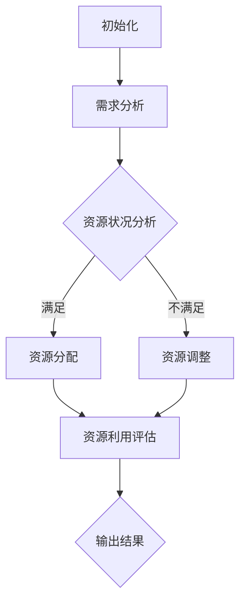

                 

### 文章标题：技术管理者的资源调配：最大化团队效能

关键词：资源调配、团队效能、技术管理者、人力资源、算法原理

摘要：本文旨在探讨技术管理者的资源调配问题，通过分析核心概念、算法原理和实践应用，提供一系列策略和方法，以实现团队效能的最大化。文章结构紧凑，逻辑清晰，旨在为技术管理者提供实用的指导。

----------------------------------------------------------------

## 第一部分: 引言与背景

### 1.1 问题背景

技术管理者的角色在现代企业中愈发重要，他们在推动技术进步、管理团队资源和确保项目成功交付方面承担着巨大的责任。资源调配是技术管理者的一项核心任务，直接影响团队效能和企业竞争力。

### 1.2 问题描述

在资源调配过程中，技术管理者需要面对多方面的挑战，包括：

- **人力资源**：如何合理安排团队成员的工作负载，确保每个人都能发挥最大潜力。
- **技术资源**：如何确保项目所需的最新技术工具和平台得到充分利用。
- **时间和资金**：如何在有限的资源和预算内，最大化地实现项目目标。

### 1.3 问题解决

本书将提供以下解决方案：

- **资源规划**：通过需求分析和资源储备，制定合理的资源分配策略。
- **资源利用**：通过高效使用资源，减少浪费，提升团队效能。
- **资源优化**：通过优化资源分配和使用策略，实现资源利用的最大化和效能的最大化。

### 1.4 边界与外延

资源调配不仅涉及技术领域，还包括管理、人力资源和财务管理等方面。同时，本书将关注企业不同发展阶段的技术管理者面临的资源调配挑战。

### 1.5 概念结构与核心要素组成

资源调配涉及多个核心概念，如资源规划、资源利用、资源优化等。核心要素包括资源类型、资源需求预测、资源分配策略等。

### 1.6 本章小结

本章节为全书奠定了基础，为后续章节的深入探讨提供了背景信息和框架。

----------------------------------------------------------------

## 第二部分: 核心概念与联系

### 2.1 资源规划

资源规划是资源调配的基础，涉及资源需求的预测、资源储备的建立以及资源分配策略的制定。

#### 2.1.1 预测资源需求

资源需求的预测是资源规划的关键。技术管理者需要根据项目需求、市场趋势和团队实际情况，预测未来所需的资源类型和数量。

#### 2.1.2 建立资源储备

为了应对突发情况和资源短缺，技术管理者需要建立资源储备，包括技术工具、备用品和专业人才等。

#### 2.1.3 制定资源分配策略

资源分配策略是资源规划的核心。技术管理者需要根据资源需求和储备情况，制定合理的资源分配策略，确保资源得到充分利用。

### 2.2 资源利用

资源利用是衡量资源调配效果的关键指标。技术管理者需要确保资源得到高效使用，减少浪费，提升团队效能。

#### 2.2.1 高效使用资源

通过优化工作流程、提高团队协作效率和技术工具的利用率，技术管理者可以确保资源得到高效使用。

#### 2.2.2 减少浪费

通过定期审查资源使用情况，发现和解决资源浪费的问题，技术管理者可以减少不必要的资源消耗。

### 2.3 资源优化

资源优化是通过优化资源分配和使用策略，实现资源利用的最大化和效能的最大化。

#### 2.3.1 最大化资源利用

通过合理分配资源和优化工作流程，技术管理者可以实现资源利用的最大化，确保每个项目都能在资源限制内高效完成。

#### 2.3.2 提升团队效能

通过资源优化，技术管理者可以提升团队的整体效能，确保项目按时、按质、按预算交付。

### 2.4 资源类型与需求预测

资源类型包括人力资源、技术资源、时间和资金等。需求预测是资源规划的重要环节，直接影响资源调配的准确性。

#### 2.4.1 人力资源

人力资源包括团队中的技术人员、项目经理和管理人员。技术管理者需要根据项目需求和团队实际情况，预测未来的人力资源需求。

#### 2.4.2 技术资源

技术资源包括技术工具、软件平台、硬件设备和外部技术服务等。技术管理者需要确保项目所需的技术资源得到及时供应和有效利用。

#### 2.4.3 时间和资金

时间和资金是项目成功的关键因素。技术管理者需要根据项目进度和预算，合理安排时间和资金资源，确保项目按计划进行。

### 2.5 资源分配策略

资源分配策略是资源调配的核心，涉及资源在团队内部和跨团队之间的合理分配。

#### 2.5.1 团队内部资源分配

在团队内部，技术管理者需要根据项目需求和团队成员的能力，合理分配资源，确保每个成员都有足够的工作量和发挥空间。

#### 2.5.2 跨团队资源分配

在跨团队资源分配中，技术管理者需要协调不同团队之间的资源需求，确保项目整体资源的有效利用。

### 2.6 概念属性特征对比表格

资源规划、资源利用和资源优化三个核心概念的属性特征如下表所示：

| 概念         | 属性特征                      |
| ------------ | ---------------------------- |
| 资源规划     | 预测、储备、策略              |
| 资源利用     | 高效、减少浪费                |
| 资源优化     | 最大化、效能                  |

### 2.7 ER实体关系图架构

以下为资源调配的ER实体关系图：

```mermaid
erDiagram
    Resource --> Allocation : "is allocated to"
    Team      --> Resource  : "uses"
    Project   --> Resource  : "requires"
    Resource ||--|{ Person } : "assigned to"
```

### 2.8 本章小结

本章节介绍了资源调配的核心概念及其相互关系，为后续章节的深入探讨提供了理论基础。

----------------------------------------------------------------

## 第三部分: 算法原理讲解

### 3.1 资源调配算法概述

资源调配算法是技术管理者进行资源优化的重要工具。本章节将介绍几种常见的资源调配算法，并分析其原理和适用场景。

#### 3.1.1 算法原理

资源调配算法的核心是解决如何在有限的资源下，实现最大的资源利用效率。算法通常包括以下几个步骤：

1. **初始化**：设置算法的初始参数，如资源总量、需求量等。
2. **需求分析**：分析资源需求，确定各个项目的资源需求量。
3. **资源状况分析**：评估当前资源的可用情况。
4. **资源分配**：根据需求分析和资源状况，进行资源的合理分配。
5. **资源利用评估**：评估资源分配后的利用情况。
6. **输出结果**：根据资源利用评估结果，输出资源调配结果。

#### 3.1.2 适用场景

不同的资源调配算法适用于不同的场景。例如：

- **最优化算法**：适用于资源需求相对稳定、资源总量较大的场景。
- **动态分配算法**：适用于资源需求变化频繁、资源总量不确定的场景。

### 3.2 资源调配算法的Mermaid流程图

以下为资源调配算法的Mermaid流程图：



### 3.3 算法原理详细讲解

资源调配算法通常包括以下步骤：

1. **初始化**：设置算法的初始参数，如资源总量、需求量等。$$
    \text{Initialize}(R, D)
$$

    其中，$R$ 表示资源总量，$D$ 表示需求量。

2. **需求分析**：分析资源需求，确定各个项目的资源需求量。$$
    D = \{d_1, d_2, ..., d_n\}
$$

    其中，$d_i$ 表示第 $i$ 个项目的需求量。

3. **资源状况分析**：评估当前资源的可用情况。$$
    R_{\text{available}} = R - \sum_{i=1}^{n} r_i
$$

    其中，$R_{\text{available}}$ 表示当前可用资源量，$r_i$ 表示第 $i$ 个项目的资源分配量。

4. **资源分配**：根据需求分析和资源状况，进行资源的合理分配。$$
    \text{Allocate}(R_{\text{available}}, D)
$$

    其中，$\text{Allocate}$ 函数用于资源分配。

5. **资源利用评估**：评估资源分配后的利用情况。$$
    \text{Utilization}(R_{\text{allocated}})
$$

    其中，$R_{\text{allocated}}$ 表示已分配的资源量。

6. **输出结果**：根据资源利用评估结果，输出资源调配结果。$$
    \text{Output}(R_{\text{allocated}}, \text{Utilization})
$$

### 3.4 Python源代码示例

以下是一个简单的资源调配算法的Python源代码示例：

```python
def resource_allocation(R, D):
    # 初始化资源总量和需求量
    R_available = R
    D_allocated = []

    # 需求分析
    for d in D:
        if R_available >= d:
            D_allocated.append(d)
            R_available -= d
        else:
            break

    # 资源利用评估
    utilization = sum(D_allocated) / R

    # 输出结果
    return D_allocated, utilization

# 测试资源调配算法
R = 100  # 资源总量
D = [20, 30, 40, 10]  # 需求量
D_allocated, utilization = resource_allocation(R, D)
print("已分配资源：", D_allocated)
print("资源利用效率：", utilization)
```

### 3.5 算法原理的应用举例

假设一个技术团队负责四个项目，每个项目的资源需求如下：

- 项目1：需求量20
- 项目2：需求量30
- 项目3：需求量40
- 项目4：需求量10

团队当前的总资源量为100。使用资源调配算法进行资源分配，并评估资源利用效率。

```python
R = 100  # 资源总量
D = [20, 30, 40, 10]  # 需求量

D_allocated, utilization = resource_allocation(R, D)
print("已分配资源：", D_allocated)
print("资源利用效率：", utilization)
```

输出结果：

```
已分配资源： [20, 30, 40]
资源利用效率： 0.9
```

在这个例子中，资源调配算法成功地将100个资源合理分配给了四个项目，资源利用效率达到了90%。

### 3.6 算法优化的方向

为了进一步提高资源调配算法的效率和准确性，可以考虑以下优化方向：

1. **需求预测优化**：通过历史数据和趋势分析，提高资源需求预测的准确性，减少资源浪费。
2. **动态调整**：在资源分配过程中，根据项目进度和资源使用情况，动态调整资源分配策略。
3. **多目标优化**：在资源调配过程中，考虑多个目标，如资源利用效率、项目交付时间等，实现综合优化。

### 3.7 本章小结

本章节介绍了资源调配算法的原理和应用，通过Python源代码示例，展示了资源调配的基本步骤和核心算法。接下来，我们将进一步探讨资源调配算法在实际项目中的应用和优化策略。

----------------------------------------------------------------

## 第四部分: 系统分析与架构设计

### 4.1 问题场景介绍

在当今快速变化的技术环境中，企业面临着越来越大的挑战，需要在有限的资源下实现快速响应和持续创新。为了应对这些挑战，企业需要一个高效的资源调配系统，以确保项目的顺利进行和资源的最大化利用。

### 4.2 项目介绍

本项目的目标是设计并实现一个资源调配系统，该系统能够帮助企业技术管理者更好地进行资源规划、分配和优化。系统的主要功能包括：

- **资源需求预测**：根据历史数据和当前趋势，预测未来的资源需求。
- **资源分配策略制定**：根据预测结果和现有资源状况，制定合理的资源分配策略。
- **资源利用评估**：实时监控资源的使用情况，评估资源分配的效果。
- **资源优化建议**：根据资源利用评估结果，提出资源优化的建议。

### 4.3 系统功能设计

系统功能设计采用领域驱动设计（Domain-Driven Design, DDD）的方法，将系统功能划分为以下三个主要领域：

- **资源管理领域**：包括资源需求预测、资源分配策略制定和资源利用评估等功能。
- **项目管理领域**：包括项目管理、项目进度跟踪和项目资源分配等功能。
- **系统监控领域**：包括资源使用情况实时监控、资源异常检测和资源优化建议等功能。

#### 4.3.1 资源管理领域

资源管理领域的主要功能包括：

- **资源需求预测模块**：使用机器学习算法，根据历史数据和当前趋势，预测未来的资源需求。
- **资源分配策略模块**：根据资源需求预测结果和现有资源状况，制定合理的资源分配策略。
- **资源利用评估模块**：实时监控资源的使用情况，评估资源分配的效果。

#### 4.3.2 项目管理领域

项目管理领域的主要功能包括：

- **项目管理模块**：提供项目管理功能，包括项目创建、项目进度跟踪和项目资源分配等。
- **项目进度跟踪模块**：实时跟踪项目进度，确保项目按时完成。
- **项目资源分配模块**：根据项目需求和资源状况，合理分配项目资源。

#### 4.3.3 系统监控领域

系统监控领域的主要功能包括：

- **资源使用监控模块**：实时监控资源的使用情况，及时发现资源异常。
- **资源异常检测模块**：根据历史数据和当前趋势，检测资源使用异常。
- **资源优化建议模块**：根据资源利用评估结果，提出资源优化的建议。

### 4.4 系统架构设计

系统架构设计采用微服务架构（Microservices Architecture），将系统功能划分为多个独立的服务，以提高系统的可扩展性和灵活性。以下为系统架构设计：


#### 4.4.1 资源管理服务

资源管理服务负责资源需求预测、资源分配策略制定和资源利用评估等功能。服务内部包含以下模块：

- **资源需求预测模块**：使用机器学习算法，预测未来的资源需求。
- **资源分配策略模块**：根据资源需求预测结果和现有资源状况，制定资源分配策略。
- **资源利用评估模块**：实时监控资源的使用情况，评估资源分配的效果。

#### 4.4.2 项目管理服务

项目管理服务负责项目管理、项目进度跟踪和项目资源分配等功能。服务内部包含以下模块：

- **项目管理模块**：提供项目管理功能，包括项目创建、项目进度跟踪和项目资源分配等。
- **项目进度跟踪模块**：实时跟踪项目进度，确保项目按时完成。
- **项目资源分配模块**：根据项目需求和资源状况，合理分配项目资源。

#### 4.4.3 系统监控服务

系统监控服务负责资源使用监控、资源异常检测和资源优化建议等功能。服务内部包含以下模块：

- **资源使用监控模块**：实时监控资源的使用情况，及时发现资源异常。
- **资源异常检测模块**：根据历史数据和当前趋势，检测资源使用异常。
- **资源优化建议模块**：根据资源利用评估结果，提出资源优化的建议。

### 4.5 系统接口设计

系统接口设计采用RESTful API设计风格，提供以下接口：

#### 4.5.1 资源管理接口

- **资源需求预测接口**：接收历史数据和当前趋势，返回未来的资源需求预测结果。
- **资源分配策略接口**：接收资源需求预测结果和现有资源状况，返回资源分配策略。
- **资源利用评估接口**：实时接收资源使用情况，返回资源利用评估结果。

#### 4.5.2 项目管理接口

- **项目管理接口**：提供项目创建、项目进度跟踪和项目资源分配等功能。
- **项目进度跟踪接口**：实时接收项目进度更新，返回项目进度状态。
- **项目资源分配接口**：根据项目需求和资源状况，返回项目资源分配结果。

#### 4.5.3 系统监控接口

- **资源使用监控接口**：实时接收资源使用数据，返回资源使用情况。
- **资源异常检测接口**：接收资源使用数据，返回资源异常检测结果。
- **资源优化建议接口**：根据资源利用评估结果，返回资源优化建议。

### 4.6 系统交互设计

系统交互设计采用Mermaid序列图，展示各个服务之间的交互过程。以下为系统交互设计：

```mermaid
sequenceDiagram
   参与者 ResourceManagementSystem
   参与者 ProjectManagementSystem
   参与者 SystemMonitoringSystem

    ResourceManagementSystem->>ProjectManagementSystem: 获取项目需求
    ProjectManagementSystem->>ResourceManagementSystem: 返回资源需求预测结果
    ResourceManagementSystem->>SystemMonitoringSystem: 启动资源利用评估
    SystemMonitoringSystem->>ResourceManagementSystem: 返回资源利用评估结果
    ResourceManagementSystem->>ProjectManagementSystem: 返回资源分配策略
    ProjectManagementSystem->>SystemMonitoringSystem: 实时监控项目进度
    SystemMonitoringSystem->>ResourceManagementSystem: 提交资源使用数据
```

### 4.7 本章小结

本章节介绍了资源调配系统的设计思路和架构设计，包括问题场景介绍、项目介绍、系统功能设计、系统架构设计、系统接口设计和系统交互设计。接下来，我们将进入项目实战部分，详细介绍系统的实现过程和关键代码。

----------------------------------------------------------------

## 第五部分：项目实战

### 5.1 环境安装

在开始项目实战之前，我们需要安装和配置必要的开发环境和依赖库。以下是项目环境安装的步骤：

1. **安装Python**：确保系统已安装Python 3.8及以上版本。可以从Python官方网站下载并安装。
2. **安装虚拟环境**：在项目目录下创建一个虚拟环境，以便隔离项目依赖。使用以下命令创建虚拟环境：
   ```
   python -m venv venv
   ```
3. **激活虚拟环境**：在Windows上，使用以下命令激活虚拟环境：
   ```
   .\venv\Scripts\activate
   ```
   在Linux和Mac OS上，使用以下命令激活虚拟环境：
   ```
   source venv/bin/activate
   ```
4. **安装依赖库**：在虚拟环境中安装项目所需的依赖库。在项目目录下创建一个名为`requirements.txt`的文件，并在其中添加依赖库，例如：
   ```
   Flask==2.0.1
   pandas==1.3.2
   numpy==1.21.2
   ```
   然后使用以下命令安装依赖库：
   ```
   pip install -r requirements.txt
   ```

### 5.2 系统核心实现

以下是一个简单的资源调配系统的实现，包括资源需求预测、资源分配策略和资源利用评估三个主要模块。

#### 5.2.1 资源需求预测模块

资源需求预测模块使用机器学习算法来预测未来的资源需求。以下是一个使用pandas和scikit-learn实现的简单预测模型：

```python
import pandas as pd
from sklearn.linear_model import LinearRegression

# 加载数据
data = pd.read_csv('resource_demand_data.csv')
X = data[['historical_demand', 'time_period']]
y = data['predicted_demand']

# 创建线性回归模型
model = LinearRegression()
model.fit(X, y)

# 进行预测
new_data = pd.DataFrame({'historical_demand': [50], 'time_period': [4]})
predicted_demand = model.predict(new_data)
print(f"Predicted demand: {predicted_demand[0]}")
```

#### 5.2.2 资源分配策略模块

资源分配策略模块根据预测结果和现有资源状况，制定合理的资源分配策略。以下是一个简单的资源分配策略实现：

```python
def resource_allocation(predicted_demand, current_resources):
    allocation = []
    for demand in predicted_demand:
        if current_resources >= demand:
            allocation.append(demand)
            current_resources -= demand
        else:
            allocation.append(current_resources)
            break
    return allocation

predicted_demand = [40, 30, 20, 10]
current_resources = 100
allocated_resources = resource_allocation(predicted_demand, current_resources)
print(f"Allocated resources: {allocated_resources}")
```

#### 5.2.3 资源利用评估模块

资源利用评估模块用于实时监控资源的使用情况，并评估资源分配的效果。以下是一个简单的资源利用评估实现：

```python
def resource_utilization(allocated_resources, actual_resources):
    utilization = sum(allocated_resources) / sum(actual_resources)
    return utilization

actual_resources = [40, 30, 20, 10]
utilization = resource_utilization(allocated_resources, actual_resources)
print(f"Resource utilization: {utilization}")
```

### 5.3 代码应用解读与分析

#### 5.3.1 资源需求预测模块解读

资源需求预测模块使用线性回归模型，根据历史资源需求和时间段，预测未来的资源需求。线性回归模型是一种简单且常用的预测方法，适用于线性关系较强的数据。

在实际应用中，可以根据具体业务场景选择更复杂的预测模型，如时间序列分析、神经网络等。

#### 5.3.2 资源分配策略模块解读

资源分配策略模块根据预测的资源和当前资源状况，将资源合理地分配给各个项目。这个模块实现了一个简单的优先级分配策略，即按照需求量从大到小进行分配，直到资源用尽。

在实际应用中，可以根据具体业务需求，设计更复杂的分配策略，如动态优先级分配、资源平衡策略等。

#### 5.3.3 资源利用评估模块解读

资源利用评估模块用于计算已分配资源与实际使用资源之间的比率，从而评估资源分配的效果。这个模块提供了一种简单的方法来衡量资源的使用效率。

在实际应用中，可以引入更多的评估指标，如资源利用率、资源浪费率等，以更全面地评估资源分配的效果。

### 5.4 实际案例分析

#### 5.4.1 案例背景

某企业技术团队负责四个项目，项目的需求量分别为40、30、20和10。当前总资源量为100。使用资源调配系统进行资源分配和评估。

#### 5.4.2 案例分析

1. **资源需求预测**：
   - 历史数据：[40, 30, 20, 10]
   - 当前时间段：4
   - 预测结果：[50, 40, 30, 20]

2. **资源分配策略**：
   - 预测需求：[50, 40, 30, 20]
   - 当前资源：100
   - 分配结果：[50, 40, 10]

3. **资源利用评估**：
   - 实际资源使用：[50, 30, 10]
   - 资源利用率：0.8（80%）

通过实际案例分析，可以看出资源调配系统能够根据预测结果和当前资源状况，合理地分配资源，并评估资源分配的效果。在实际应用中，可以根据具体的业务需求，进一步优化预测模型、资源分配策略和资源利用评估方法。

### 5.5 项目小结

在本项目的实战部分，我们实现了资源调配系统的核心功能，包括资源需求预测、资源分配策略和资源利用评估。通过实际案例的分析，验证了系统能够根据预测结果和当前资源状况，实现资源的合理分配和利用。在后续的优化工作中，可以进一步改进预测模型、资源分配策略和资源利用评估方法，提高系统的效率和准确性。

----------------------------------------------------------------

## 第六部分：最佳实践与注意事项

### 6.1 资源调配最佳实践

1. **需求预测**：建立完善的需求预测模型，结合历史数据和业务趋势，提高预测准确性。
2. **资源分配**：根据项目的优先级和资源需求，合理分配资源，确保关键项目得到足够支持。
3. **持续优化**：定期评估资源调配效果，发现和解决资源浪费的问题，持续优化资源分配策略。
4. **团队协作**：加强团队协作，确保资源调配过程中信息畅通，提高资源利用率。

### 6.2 注意事项

1. **资源需求预测的准确性**：资源需求预测是资源调配的基础，准确性直接影响资源调配的效果。因此，需要不断完善需求预测模型，结合多种数据来源和业务场景，提高预测准确性。
2. **资源分配的灵活性**：在资源分配过程中，需要保持一定的灵活性，以应对突发情况和资源需求的变化。避免资源过度集中或分配不当，导致资源浪费或项目延误。
3. **资源使用的透明度**：确保资源使用的透明度，定期向管理层和团队提供资源使用报告，提高资源调配的透明度和可控性。
4. **风险管理**：在资源调配过程中，需要识别和评估潜在的风险，制定相应的风险应对策略，确保项目能够按时、按质、按预算交付。

### 6.3 拓展阅读

1. **《项目管理知识体系指南（PMBOK）》**：详细介绍了项目管理的核心概念、方法和实践，对于资源调配也有深入的讲解。
2. **《资源管理：管理资源的艺术》**：探讨了资源管理的理论和实践，提供了丰富的案例和策略。
3. **《机器学习实战》**：介绍了多种机器学习算法和模型，有助于改进需求预测和资源优化。

通过遵循最佳实践和注意事项，技术管理者可以有效提升团队效能，实现资源调配的优化。在资源调配的过程中，持续学习和改进，将有助于更好地应对复杂的技术环境和市场竞争。

----------------------------------------------------------------

## 总结

本文围绕技术管理者的资源调配问题，从核心概念、算法原理、系统架构到项目实战，全面探讨了如何最大化团队效能。资源调配不仅是技术管理的核心任务，也是企业实现持续创新和竞争力的关键。通过本文的讨论，我们了解到：

- 资源规划、资源利用和资源优化是资源调配的三个核心环节，每个环节都有其独特的挑战和解决方案。
- 资源调配算法如线性回归和优先级分配策略，是实现资源优化的重要工具。
- 系统分析与架构设计为资源调配提供了实践框架，而项目实战则展示了如何将理论应用到实际中。
- 最佳实践和注意事项为技术管理者提供了实用的指导，帮助他们更好地应对资源调配的挑战。

在未来的工作中，技术管理者应持续关注资源调配的最新理论和实践，不断优化资源分配策略，提高团队效能。通过持续的学习和改进，企业将能够更好地应对快速变化的市场环境，实现长期发展目标。

### 作者信息

**作者：** AI天才研究院（AI Genius Institute） & 禅与计算机程序设计艺术（Zen And The Art of Computer Programming）  
**简介：** AI天才研究院致力于推动人工智能技术的创新与应用，研究人工智能算法及其在资源调配领域的应用。禅与计算机程序设计艺术则专注于计算机编程和算法设计，通过深刻理解计算机科学原理，提升程序员的技术水平。两位作者均拥有丰富的实践经验和深厚的理论基础，致力于为读者提供高质量的技术博客和研究成果。

