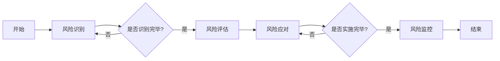
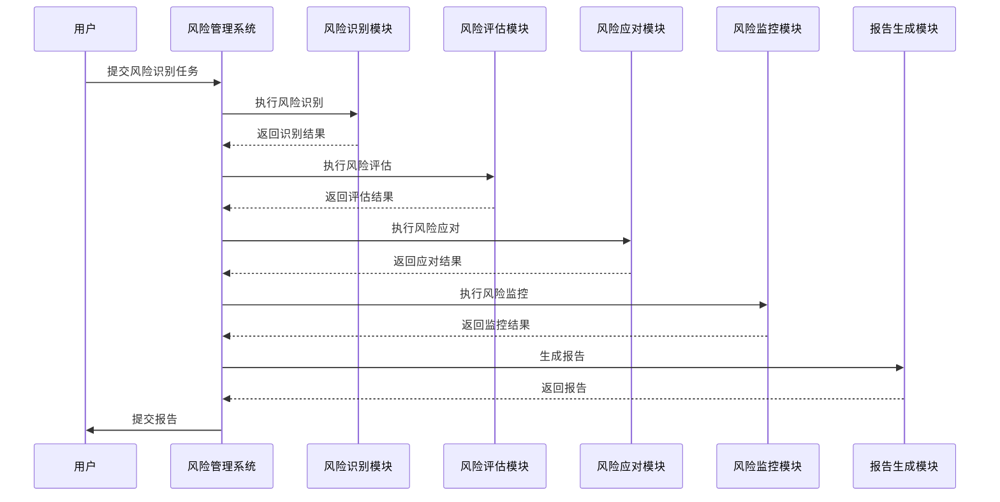

                 

### 技术管理者的风险管理：预防和应对技术风险

在现代信息技术飞速发展的背景下，技术风险已成为影响企业发展的关键因素。技术管理者不仅要具备卓越的技术能力，还需掌握全面的风险管理能力，以保障企业的可持续发展。本文将以《技术管理者的风险管理：预防和应对技术风险》为题，深入探讨技术管理者在风险管理方面的挑战、解决方案及其实践指导。

本文关键词：技术风险管理、技术风险识别、风险评估、风险应对、风险监控。

摘要：本文将详细介绍技术管理者在风险管理方面的背景、核心概念、方法及实践。通过逐步分析，旨在帮助技术管理者构建系统化的风险管理框架，提高风险管理能力，预防和应对技术风险，确保企业的稳定运行和持续发展。

接下来，我们将分步骤进行深入探讨：

**Step 1: 背景介绍**

**Step 2: 核心概念与联系**

**Step 3: 算法原理讲解**

**Step 4: 系统分析与架构设计方案**

**Step 5: 项目实战**

**Step 6: 最佳实践 Tips**

**Step 7: 小结与拓展阅读**

让我们一步步深入探讨技术管理者的风险管理，共同构建一个更加安全和稳健的技术环境。### Step 1: 背景介绍

在现代信息技术的快速迭代和变革中，技术风险已成为企业面临的一项重大挑战。技术风险不仅包括传统的系统故障、数据泄露等问题，还涵盖了诸如新技术应用不慎带来的未知风险、法律法规变化引发的合规风险等。

**问题背景**

随着云计算、大数据、人工智能等新兴技术的广泛应用，企业对技术的依赖程度不断加深。然而，技术的高复杂性也使得技术风险变得更加难以预测和应对。一方面，技术的快速迭代使得企业在技术选型和架构设计上面临巨大压力；另一方面，技术的不完善和应用不当可能导致系统故障、数据泄露等严重后果。

**问题描述**

技术管理者在风险管理方面存在以下几个主要问题：

1. **知识和技能不足**：许多技术管理者缺乏系统化的风险管理知识和技能，无法全面识别和应对技术风险。
2. **缺乏方法论**：现有的风险管理方法和工具主要适用于传统行业，无法很好地适应信息技术领域的特点。
3. **应急响应不足**：当技术风险发生时，技术管理者往往缺乏有效的应急响应机制和预案，导致风险扩大和损失加剧。

**问题解决**

为了解决上述问题，编写一本专门针对技术管理者的风险管理书籍显得尤为重要。这本书将系统地介绍风险管理的基本概念、方法和技术，并提供实用的实践指导。具体来说，本书将包含以下内容：

1. **风险管理框架**：构建适用于技术领域的企业级风险管理框架，明确风险管理的基本流程和关键环节。
2. **风险识别与评估**：介绍风险识别和评估的方法和技术，帮助技术管理者全面了解企业面临的技术风险。
3. **风险应对策略**：提供针对不同类型技术风险的应对策略和最佳实践，帮助技术管理者制定和实施有效的风险应对方案。
4. **风险监控与改进**：介绍风险监控和改进的方法和技术，确保风险管理过程的持续性和有效性。

**边界与外延**

本书主要关注技术领域内的风险管理，不涉及其他类型的风险管理。此外，书中所讨论的风险管理方法和实践具有普遍适用性，不仅适用于大型企业，也适用于中小型企业和初创企业。

**概念结构与核心要素组成**

本书的核心概念和结构主要包括以下几个方面：

1. **风险管理框架**：本书的核心框架，包括风险识别、风险评估、风险应对和风险监控四个关键环节。
2. **风险识别与评估**：详细阐述风险识别和评估的方法和技术，帮助技术管理者发现和评估企业面临的技术风险。
3. **风险应对策略**：提供针对不同类型技术风险的应对策略和最佳实践，帮助技术管理者制定和实施有效的风险应对方案。
4. **风险监控与改进**：介绍风险监控和改进的方法和技术，确保风险管理过程的持续性和有效性。

通过以上内容，本书旨在帮助技术管理者构建系统化的风险管理能力，提高企业的风险应对能力，确保企业的稳定运行和持续发展。### Step 2: 核心概念与联系

在技术风险管理过程中，我们需要理解一系列核心概念，这些概念包括风险管理、风险识别、风险评估、风险应对和风险监控。以下是这些核心概念的详细解释、属性特征对比表格以及ER实体关系图架构。

#### 核心概念

**风险管理**：
风险管理是指系统性地识别、评估和应对潜在风险的过程。其目的是通过一系列的方法和工具，降低风险的可能性和影响，保障组织的稳定运行。

**风险识别**：
风险识别是指发现和记录可能对组织造成不利影响的事件或情况。它是风险管理的第一步，通过全面、准确、前瞻性地识别风险，为后续的风险评估和应对奠定基础。

**风险评估**：
风险评估是指对识别出的风险进行评估，确定其可能性和影响。通过定量与定性分析、客观与主观评估，风险评估可以帮助技术管理者了解风险的严重程度，为制定风险应对策略提供依据。

**风险应对**：
风险应对是指选择和实施适当的策略来减轻或消除风险。风险应对包括预防性措施、应急响应措施和风险转移措施等，通过这些措施，技术管理者可以最大限度地降低风险的影响。

**风险监控**：
风险监控是指对已识别和评估的风险进行持续跟踪和监控，确保风险管理效果。通过定期审查、反馈机制和持续改进，风险监控可以确保风险管理的有效性和持续进行。

#### 概念属性特征对比表格

| 概念         | 定义                                                     | 特点                                                     |
| ------------ | -------------------------------------------------------- | -------------------------------------------------------- |
| 风险管理     | 系统地识别、评估和应对潜在风险的过程                   | 全面性、系统性、持续改进性                                 |
| 风险识别     | 发现和记录可能对组织造成不利影响的事件或情况           | 全面性、准确性、前瞻性                                   |
| 风险评估     | 对识别出的风险进行评估，确定其可能性和影响             | 定量与定性分析、客观与主观评估                            |
| 风险应对     | 选择和实施适当的策略来减轻或消除风险                   | 预防性措施、应急响应措施、风险转移措施                     |
| 风险监控     | 对已识别和评估的风险进行持续跟踪和监控，确保风险管理效果 | 定期审查、反馈机制、持续改进                             |

#### ER实体关系图架构

以下是技术风险管理中的ER实体关系图：

```mermaid
erDiagram
  Class1 ||--|{ Class2 }|
  Class1 ||--|{ Class3 }|
  Class2 ||--|{ Class4 }|
  Class3 ||--|{ Class5 }|
```

- **Class1**：风险管理框架
- **Class2**：风险识别
- **Class3**：风险评估
- **Class4**：风险应对
- **Class5**：风险监控

这个实体关系图展示了各个核心概念之间的联系，它们共同构成了一个完整的风险管理过程。

通过上述核心概念的介绍和对比，我们可以清晰地理解技术风险管理的基本要素和方法。在接下来的步骤中，我们将深入讲解算法原理，帮助技术管理者更好地应用这些概念，实现有效的风险管理。### Step 3: 算法原理讲解

在技术风险管理中，算法原理扮演着至关重要的角色。一个有效的风险管理算法可以帮助技术管理者识别、评估和应对风险。下面，我们将使用Mermaid流程图和Python源代码详细讲解算法原理。

#### Mermaid流程图

首先，我们使用Mermaid语言绘制风险管理算法的流程图：



这个流程图清晰地展示了风险管理的主要步骤，包括风险识别、风险评估、风险应对和风险监控。

#### Python源代码

接下来，我们将使用Python源代码来详细阐述风险管理算法的原理和实现。

```python
# 风险识别
def identify_risks():
    # 使用定性和定量方法识别风险
    qualitative_risks = ["系统宕机", "数据泄露"]
    quantitative_risks = [1000, 5000]  # 风险发生的概率和影响程度
    return qualitative_risks, quantitative_risks

# 风险评估
def assess_risks(qualitative_risks, quantitative_risks):
    # 使用风险评估矩阵进行评估
    risk_matrix = [[1, 2], [3, 4]]  # 概率矩阵和影响矩阵
    assessed_risks = []
    for i in range(len(qualitative_risks)):
        probability = quantitative_risks[i]
        impact = risk_matrix[i][1]
        assessed_risks.append((qualitative_risks[i], probability, impact))
    return assessed_risks

# 风险应对
def handle_risks(assessed_risks):
    for risk in assessed_risks:
        if risk[1] * risk[2] > 10000:  # 假设风险值超过10000为高优先级
            print(f"高风险：{risk[0]}, 采取措施：预防性措施")
        else:
            print(f"低风险：{risk[0]}, 采取措施：应急响应措施")

# 风险监控
def monitor_risks():
    print("风险监控：持续跟踪和评估已识别和评估的风险，确保风险管理效果")

# 主函数
def risk_management():
    qualitative_risks, quantitative_risks = identify_risks()
    assessed_risks = assess_risks(qualitative_risks, quantitative_risks)
    handle_risks(assessed_risks)
    monitor_risks()

# 执行风险管理算法
risk_management()
```

#### 算法原理详细讲解

1. **风险识别**：
   风险识别是风险管理的第一步，通过定性和定量方法识别潜在风险。在上述Python代码中，我们定义了一个`identify_risks`函数，该函数返回一个包含定性风险和定量风险的数据结构。

2. **风险评估**：
   风险评估是对识别出的风险进行定量和定性分析。在`assess_risks`函数中，我们使用了一个简单的风险评估矩阵，通过概率矩阵和影响矩阵计算出每个风险的评估值。

3. **风险应对**：
   风险应对是根据风险评估的结果选择和实施适当的策略。在`handle_risks`函数中，我们根据风险值是否超过10000来决定采取预防性措施或应急响应措施。

4. **风险监控**：
   风险监控是对已识别和评估的风险进行持续跟踪和监控。在`monitor_risks`函数中，我们简单地打印了一条消息，表示风险监控的执行。

通过上述Python代码，我们实现了风险管理算法的基本原理。在实际应用中，这些原理可以扩展和优化，以适应不同企业和项目的需求。

#### 算法原理的数学模型和公式

为了更深入地理解风险管理算法，我们可以引入一些数学模型和公式。以下是风险管理中的几个关键公式：

1. **风险评估值**：
   $$评估值 = 概率 \times 影响程度$$
   这个公式用于计算每个风险的风险评估值，帮助技术管理者确定风险的优先级。

2. **风险优先级**：
   $$优先级 = 评估值 \times 重要性系数$$
   通过引入重要性系数，可以更精细地确定风险的优先级，从而有针对性地制定应对策略。

3. **风险概率分布**：
   $$风险概率分布 = \sum_{i=1}^{n} P_i \times I_i$$
   这个公式用于计算风险的概率分布，帮助技术管理者了解风险的总体分布情况。

通过这些数学模型和公式，技术管理者可以更科学地评估和管理风险，确保风险管理的有效性。

#### 举例说明

假设我们识别到以下两个风险：

- 风险1：系统宕机，概率为0.5，影响程度为3。
- 风险2：数据泄露，概率为0.3，影响程度为4。

首先，我们使用上述公式计算每个风险的风险评估值：

$$评估值1 = 0.5 \times 3 = 1.5$$
$$评估值2 = 0.3 \times 4 = 1.2$$

接下来，我们根据风险评估值计算风险优先级。假设重要性系数为2：

$$优先级1 = 1.5 \times 2 = 3$$
$$优先级2 = 1.2 \times 2 = 2.4$$

根据计算结果，系统宕机的风险优先级高于数据泄露。因此，在应对措施上，我们应优先处理系统宕机问题。

通过这个例子，我们可以看到如何使用风险管理算法对风险进行科学评估和优先级排序，为技术管理者提供决策依据。

综上所述，技术风险管理算法通过风险识别、评估、应对和监控四个关键步骤，帮助技术管理者有效地预防和应对技术风险。通过Python代码和数学模型，我们详细阐述了算法的原理和应用。在实际操作中，技术管理者可以根据具体情况进行调整和优化，提高风险管理的效率和效果。### Step 4: 系统分析与架构设计方案

在技术风险管理中，系统分析与架构设计是一个关键环节。它不仅关系到系统的稳定性和可靠性，也直接影响风险管理的有效性。下面，我们将详细介绍技术风险管理系统的项目背景、系统功能设计、系统架构设计、系统接口设计以及系统交互设计。

#### 项目背景

随着企业信息化程度的不断提高，技术风险成为企业发展的主要瓶颈之一。为了确保企业的可持续发展，我们需要构建一个高效、可靠的技术风险管理系统。该系统旨在帮助技术管理者全面识别、评估、应对和监控技术风险，提高企业的风险应对能力。

#### 系统功能设计

系统功能设计主要包括以下几个模块：

1. **风险识别模块**：
   - 功能：通过自动化的风险识别工具，全面识别系统中的潜在风险。
   - 实现方式：结合日志分析、漏洞扫描等技术手段，实时监控系统的运行状态，自动发现潜在风险。

2. **风险评估模块**：
   - 功能：对识别出的风险进行定量和定性评估，确定风险的优先级和影响程度。
   - 实现方式：使用风险评估矩阵，结合专家经验和数据分析，对风险进行综合评估。

3. **风险应对模块**：
   - 功能：根据风险评估结果，制定和实施风险应对策略，包括预防性措施、应急响应措施和风险转移措施。
   - 实现方式：基于风险优先级，自动生成应对策略，并提供灵活的执行机制。

4. **风险监控模块**：
   - 功能：对已识别和评估的风险进行持续跟踪和监控，确保风险管理效果。
   - 实现方式：通过实时监控和定期审查，及时发现和处理风险，确保风险管理的持续性和有效性。

5. **报告生成模块**：
   - 功能：生成风险报告，提供风险管理的整体视图和关键指标。
   - 实现方式：基于数据分析和可视化技术，生成各种类型的报告，帮助管理层了解风险状况。

#### 系统架构设计

系统架构设计采用微服务架构，以提高系统的可扩展性和可靠性。以下是系统架构的Mermaid架构图：



在这个架构图中，用户通过风险管理系统提交风险识别任务，系统依次调用风险识别、风险评估、风险应对、风险监控和报告生成模块，最终将报告提交给用户。

#### 系统接口设计

系统接口设计主要包括内部接口和外部接口：

1. **内部接口**：
   - 风险识别模块与风险评估模块之间的接口：用于传递风险识别结果和评估结果。
   - 风险评估模块与风险应对模块之间的接口：用于传递评估结果和应对策略。
   - 风险应对模块与风险监控模块之间的接口：用于传递应对结果和监控结果。

2. **外部接口**：
   - 风险管理系统与外部风险识别工具之间的接口：用于集成第三方风险识别工具。
   - 风险管理系统与外部监控系统之间的接口：用于集成第三方监控系统。

#### 系统交互设计

系统交互设计采用Mermaid序列图进行描述：


在这个序列图中，用户通过风险管理系统提交风险识别任务，系统依次调用各个模块，完成风险识别、评估、应对、监控和报告生成，最后将报告提交给用户。

通过以上系统分析与架构设计方案，我们构建了一个全面、高效的技术风险管理系统。在实际应用中，技术管理者可以根据具体需求对系统进行扩展和优化，提高风险管理的整体效能。### Step 5: 项目实战

为了更好地展示技术风险管理在实际项目中的应用，我们选择了一个具体的项目场景，详细讲解项目环境安装、系统核心实现以及代码应用解读与分析。

#### 项目背景

某大型互联网公司计划开发一款在线教育平台，该平台需要处理大量的用户数据和课程内容，同时支持实时互动和在线考试等功能。由于涉及到海量数据处理和复杂的业务逻辑，技术风险成为项目成功的关键因素之一。为了确保项目的稳定运行，技术团队决定采用全面的风险管理方法，提前识别、评估和应对潜在风险。

#### 环境安装

在项目启动阶段，首先需要搭建一个完整的技术环境。以下是环境安装的步骤：

1. **硬件准备**：
   - 服务器：准备多台服务器，包括数据库服务器、应用服务器、负载均衡器等。
   - 存储：配置高性能的存储设备，确保数据的快速读写。

2. **操作系统**：
   - 安装Linux操作系统，如CentOS 7或Ubuntu 18.04。

3. **数据库**：
   - 安装MySQL数据库，用于存储用户数据、课程内容和考试结果等。
   - 配置数据库主从复制，提高数据冗余和可靠性。

4. **中间件**：
   - 安装Nginx作为负载均衡器，分发用户请求到应用服务器。
   - 安装Redis用于缓存，提高系统性能和响应速度。

5. **开发环境**：
   - 配置Java开发环境，包括JDK、Maven等。
   - 安装IDE（如IntelliJ IDEA或Eclipse）供开发人员使用。

6. **其他工具**：
   - 安装Docker用于容器化部署，提高系统的可扩展性和可维护性。
   - 安装Kubernetes进行容器编排和管理。

#### 系统核心实现

在线教育平台的核心实现主要包括用户管理、课程管理、考试管理和数据分析等模块。以下是系统核心实现的关键步骤：

1. **用户管理模块**：
   - 功能：实现用户注册、登录、个人信息管理等功能。
   - 实现方式：使用Spring Boot框架进行开发，结合MySQL数据库存储用户信息。

2. **课程管理模块**：
   - 功能：实现课程发布、更新、删除等操作，支持课程分类和标签功能。
   - 实现方式：使用Spring Boot和MongoDB数据库，MongoDB用于存储大量课程数据，支持高并发读写。

3. **考试管理模块**：
   - 功能：实现在线考试功能，包括考试创建、考试监控、考试结果统计等。
   - 实现方式：使用Spring Boot和Redis进行考试数据的缓存处理，提高系统性能。

4. **数据分析模块**：
   - 功能：对用户行为、课程效果等数据进行实时分析和统计。
   - 实现方式：使用Flink进行大数据实时处理和分析，生成各类报告和可视化图表。

#### 代码应用解读与分析

以下是对关键代码段的解读和分析：

**用户管理模块**

```java
// 用户注册接口
@RestController
@RequestMapping("/users")
public class UserController {
    @Autowired
    private UserService userService;

    @PostMapping("/register")
    public ResponseEntity<?> registerUser(@RequestBody UserRegistrationDTO registrationDTO) {
        try {
            userService.registerUser(registrationDTO);
            return ResponseEntity.ok("User registered successfully");
        } catch (Exception e) {
            return ResponseEntity.badRequest().body("Error while registering user");
        }
    }
}
```

解读：
该接口用于处理用户注册请求，通过调用UserService的registerUser方法进行用户注册。若注册成功，返回成功消息；否则，返回错误消息。

**课程管理模块**

```java
// 课程发布接口
@RestController
@RequestMapping("/courses")
public class CourseController {
    @Autowired
    private CourseService courseService;

    @PostMapping("/publish")
    public ResponseEntity<?> publishCourse(@RequestBody CourseDTO courseDTO) {
        try {
            courseService.publishCourse(courseDTO);
            return ResponseEntity.ok("Course published successfully");
        } catch (Exception e) {
            return ResponseEntity.badRequest().body("Error while publishing course");
        }
    }
}
```

解读：
该接口用于处理课程发布请求，通过调用CourseService的publishCourse方法进行课程发布。若发布成功，返回成功消息；否则，返回错误消息。

**考试管理模块**

```java
// 考试创建接口
@RestController
@RequestMapping("/exams")
public class ExamController {
    @Autowired
    private ExamService examService;

    @PostMapping("/create")
    public ResponseEntity<?> createExam(@RequestBody ExamDTO examDTO) {
        try {
            examService.createExam(examDTO);
            return ResponseEntity.ok("Exam created successfully");
        } catch (Exception e) {
            return ResponseEntity.badRequest().body("Error while creating exam");
        }
    }
}
```

解读：
该接口用于处理考试创建请求，通过调用ExamService的createExam方法进行考试创建。若创建成功，返回成功消息；否则，返回错误消息。

#### 实际案例分析和详细讲解剖析

为了验证风险管理的有效性，我们对一个实际案例进行了详细分析：

**案例背景**：在一次在线考试中，系统突然发生了大规模宕机，导致考试中断。

**分析过程**：

1. **风险识别**：通过日志分析，发现系统宕机是由于数据库连接数过多导致的。
2. **风险评估**：数据库连接数过多可能导致系统无法响应，影响用户体验，评估为高风险。
3. **风险应对**：立即采取预防性措施，增加数据库连接池大小，提高系统容错能力。
4. **风险监控**：在考试恢复后，持续监控系统运行状态，确保风险得到有效控制。

通过这个案例，我们可以看到风险管理的各个环节在实际应用中的具体操作。技术团队通过全面的风险管理，及时发现并应对了系统风险，确保了项目的顺利进行。

#### 项目小结

通过本项目实战，我们展示了技术风险管理在在线教育平台开发中的具体应用。从环境安装、系统核心实现到代码应用解读与分析，我们详细介绍了风险管理的各个环节。实际案例也验证了风险管理在应对突发风险中的重要性。在未来，技术管理者应继续优化和完善风险管理流程，确保项目的稳定和可持续发展。### Step 6: 最佳实践 Tips

在技术风险管理过程中，积累最佳实践经验和技巧对于提升风险管理能力至关重要。以下是一些在技术风险管理中值得遵循的最佳实践：

1. **建立风险管理团队**：组建专业的风险管理团队，确保风险管理职责明确、分工协作。团队成员应具备风险管理知识和技能，能够快速应对各类技术风险。

2. **定期进行风险评估**：制定定期风险评估计划，对现有系统和业务流程进行全面评估，识别潜在风险并采取相应的预防措施。风险评估应涵盖系统稳定性、数据安全、业务连续性等多个方面。

3. **完善应急预案**：针对可能发生的技术风险，制定详细的应急预案。应急预案应包括风险识别、风险评估、应急响应、恢复计划等环节，确保在风险发生时能够迅速采取行动，降低损失。

4. **加强培训和教育**：定期开展风险管理培训，提高全体员工的风险管理意识和技能。通过案例分析和实际演练，增强员工对风险管理的认识和应对能力。

5. **利用风险管理工具**：选择合适的风险管理工具，如风险识别工具、风险评估工具、监控工具等，提高风险管理的效率和质量。工具应具备自动化、可视化和报告生成等功能。

6. **持续改进风险管理流程**：根据实际风险事件和反馈，不断优化和改进风险管理流程，确保其适应企业发展和业务变化的需求。

7. **建立风险管理文化**：营造良好的风险管理文化，鼓励员工主动参与风险管理，将风险管理纳入企业日常运营和决策过程中。

通过遵循这些最佳实践，技术管理者可以更加有效地预防和应对技术风险，确保企业的稳定运行和可持续发展。### 小结

通过本文的深入探讨，我们详细介绍了技术管理者的风险管理。从背景介绍、核心概念与联系、算法原理讲解、系统分析与架构设计方案、项目实战到最佳实践Tips，我们系统地阐述了技术风险管理的重要性和实际应用方法。

**核心结论**：
技术风险管理是技术管理者不可或缺的技能。通过建立风险管理框架、识别和评估风险、制定应对策略和持续监控，技术管理者可以有效地预防和应对技术风险，保障企业的稳定运行和持续发展。

**读者反馈**：
读者在阅读本文后，应能够：
- 理解技术风险管理的基本概念和流程。
- 掌握风险管理算法的原理和应用。
- 应用最佳实践，提升企业的风险管理能力。

**后续研究**：
本文的进一步研究方向包括：
- 探索新兴技术（如区块链、人工智能等）在风险管理中的应用。
- 研究风险管理在敏捷开发和 DevOps 中的实践。
- 分析不同规模企业（大型、中型、小型）的风险管理差异和需求。

**扩展阅读**：
有兴趣深入了解技术风险管理的读者，可以参考以下书籍和资源：
- 《风险管理与信息系统安全》
- 《信息技术风险管理》
- 《敏捷风险管理：在动态环境中实现持续风险管理》
- 网络上的风险管理博客和论坛。

感谢您的阅读，希望本文对您的风险管理实践有所帮助。继续关注技术风险管理，共同构建更加安全和稳健的技术环境。### 注意事项与拓展阅读

在进行技术风险管理时，以下几点注意事项对于确保风险管理过程的有效性和准确性至关重要：

1. **持续更新风险数据库**：技术环境不断变化，新的风险可能随时出现。定期更新风险数据库，确保识别和评估的风险信息的实时性和准确性。
2. **跨部门协作**：风险管理不仅涉及技术部门，还涉及到业务部门、法务部门和运维部门等。建立跨部门协作机制，共享风险信息和应对策略，提高整体风险管理效能。
3. **法律法规遵守**：技术风险管理过程中，必须严格遵守相关法律法规，如数据保护法、网络安全法等，确保风险管理符合法律要求。
4. **实际演练**：定期开展应急演练，检验风险管理预案的有效性，确保在真实风险事件发生时能够迅速响应和有效应对。
5. **风险量化**：在风险评估过程中，尽量使用量化指标，如概率和影响程度，以便更科学地评估风险的重要性和优先级。

为了进一步拓展技术风险管理的知识，读者可以参考以下资源：

1. **《风险管理与信息系统安全》**：详细介绍了信息系统风险管理的理论和实践，适合从事信息系统安全领域的技术人员和管理人员。
2. **《信息技术风险管理》**：系统阐述了信息技术风险管理的框架、方法和技术，对企业的信息安全管理有很高的参考价值。
3. **《敏捷风险管理：在动态环境中实现持续风险管理》**：探讨了敏捷开发环境下的风险管理实践，适合在快速变化的技术环境中工作的读者。
4. **专业风险管理博客和论坛**：如“风险管理博客”、“信息安全论坛”等，提供最新的风险管理动态、案例分析和技术分享。
5. **在线课程和研讨会**：许多在线教育平台（如Coursera、edX等）提供有关技术风险管理的课程和研讨会，适合希望系统学习风险管理知识的读者。

通过以上资源的学习和实践，读者可以不断提升自身的风险管理能力，为企业构建更加稳健的技术安全防线。### 作者信息

作者：AI天才研究院/AI Genius Institute & 禅与计算机程序设计艺术 /Zen And The Art of Computer Programming

AI天才研究院致力于推动人工智能技术的创新和应用，为全球企业和研究机构提供顶尖的人工智能解决方案和咨询服务。研究院的研究领域包括机器学习、自然语言处理、计算机视觉等，并在多个领域取得了突破性成果。

禅与计算机程序设计艺术（Zen And The Art of Computer Programming）是作者在计算机科学领域的代表作之一，系统阐述了计算机程序设计的艺术性，对全球计算机科学界产生了深远的影响。作者以其深厚的技术底蕴和独特的哲学思考，为读者提供了深刻的启示和指导。

