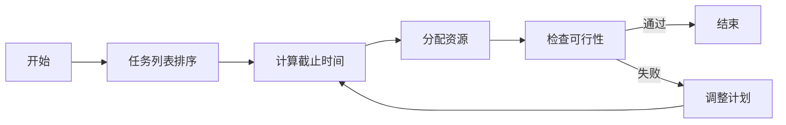
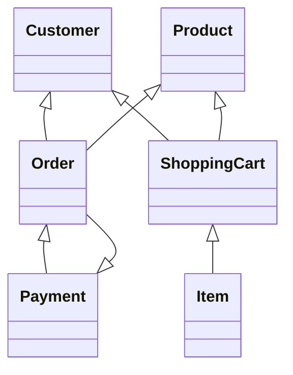
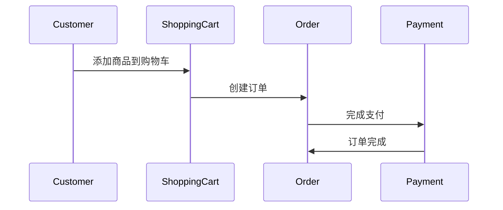
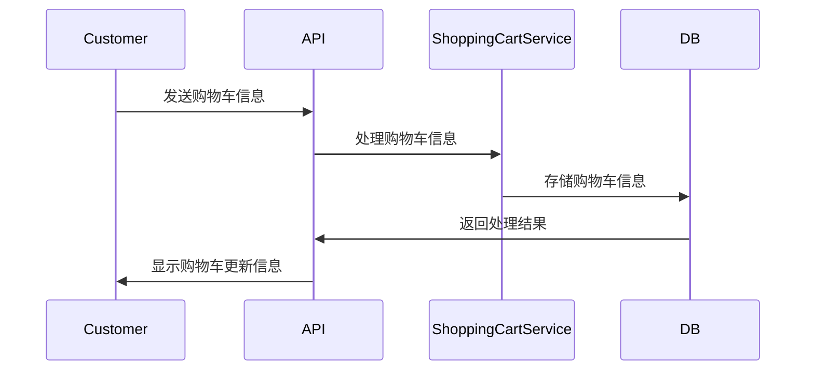

                 

# 技术管理转型：从开发者到管理者的蜕变

## 关键词
- 技术管理
- 开发者转型
- 管理职责
- 团队建设
- 项目管理

> 摘要：本文旨在探讨从开发者到技术管理者的转型过程，分析转型过程中的关键路径和策略。通过实际案例，总结最佳实践，为开发者提供转型指南，助力他们在技术和管理领域取得双丰收。

## 目录大纲

1. **第一部分：背景与核心概念**
   1.1 **问题背景与核心概念**
   1.2 **技术管理的定义与核心要素**

2. **第二部分：转型路径与策略**
   2.1 **开发者成长路径**
   2.2 **管理能力培养**
   2.3 **软技能提升**

3. **第三部分：转型实战案例**
   3.1 **案例一：技术管理转型过程**
   3.2 **案例二：技术管理转型实践**

4. **第四部分：最佳实践与总结**
   4.1 **技术管理转型最佳实践**
   4.2 **成功转型关键因素**
   4.3 **未来发展趋势**

5. **总结与展望**
   5.1 **阅读指南与拓展**

## 第一部分：背景与核心概念

### 1.1 问题背景与核心概念

在当今快速发展的技术时代，许多开发者在积累了丰富的技术经验后，开始考虑技术管理转型。这一转变不仅是职业发展的必然选择，更是适应企业需求、提升个人价值的重要途径。

**开发者到管理者的角色转变**

开发者专注于编码、调试、优化等技术活动，而管理者则需要站在更高的角度，关注团队协作、项目进展、资源分配等方面。这种转变意味着开发者需要从个体贡献者转变为团队协调者和领导者。

**企业对技术管理者的需求**

随着技术的不断演进，企业对技术管理者的需求日益增加。技术管理者不仅需要具备深厚的技术背景，还要具备出色的管理能力，能够带领团队高效地完成项目，推动企业技术创新。

### 1.2 核心概念介绍

**技术管理的定义**

技术管理是指通过规划、组织、协调、控制和评价技术活动，实现组织目标的过程。技术管理者需要具备技术知识和项目管理能力，以指导团队完成技术任务。

**技术管理的核心要素**

- **技术规划**：确定技术发展方向和目标。
- **团队管理**：选拔、培训和激励团队成员。
- **项目管理**：制定项目计划、控制项目进度、确保项目质量。
- **资源管理**：合理分配资源，最大化利用企业资源。

## 第二部分：转型路径与策略

### 2.1 开发者成长路径

**技术能力提升**

开发者需要不断学习新技能，掌握最新的技术趋势。通过参加技术会议、阅读技术书籍、实践项目等方式，提升自己的技术深度和广度。

**管理能力培养**

开发者可以通过参与团队项目、担任小组负责人等方式，逐步培养管理能力。学习项目管理知识，掌握时间管理和任务分配技巧。

**软技能提升**

良好的沟通能力、决策能力、团队合作能力等软技能是技术管理者必备的素质。开发者可以通过参加沟通技巧培训、团队建设活动等方式，提升自己的软技能。

### 2.2 管理者的核心职责

**项目管理**

技术管理者需要制定项目计划，确保项目按期完成。他们需要掌握项目管理的核心技能，如需求分析、进度控制、风险管理等。

**团队建设**

技术管理者需要关注团队成员的发展，激励团队成员的积极性，打造高效的团队文化。

**技术决策**

技术管理者需要根据项目需求和团队实际情况，做出技术选型和路线规划，确保技术的先进性和稳定性。

## 第三部分：转型实战案例

### 3.1 案例一：技术管理转型过程

**案例背景**

某技术团队的核心成员均为资深开发者，具备丰富的技术经验。然而，在项目管理方面存在一定的问题，导致项目进度不稳定，团队成员积极性不高。

**案例实施步骤**

1. **需求分析**：与团队成员沟通，了解项目的实际需求和团队成员的工作状态。
2. **项目管理**：制定详细的项目计划，明确项目目标、任务分配、进度控制等。
3. **团队建设**：开展团队建设活动，增强团队成员的凝聚力和归属感。
4. **技术决策**：根据项目需求和团队实际情况，做出技术选型和路线规划。

**案例效果评估**

通过一系列的转型措施，项目进度明显加快，团队成员的工作积极性提高，团队整体绩效得到显著提升。

### 3.2 案例二：技术管理转型实践

**案例背景**

某初创公司技术团队在快速发展的过程中，面临技术管理和团队建设方面的挑战。

**案例实施步骤**

1. **技术规划**：明确公司技术发展方向，制定中长期技术规划。
2. **团队建设**：选拔优秀人才，组建高效团队，培养团队成员的专业能力和软技能。
3. **项目管理**：引入敏捷开发方法，提高项目交付效率。
4. **技术决策**：根据市场需求和公司战略，灵活调整技术路线。

**案例效果评估**

通过有效的技术管理转型，公司项目交付速度加快，市场竞争力显著提升，团队整体素质得到全面提升。

## 第四部分：最佳实践与总结

### 4.1 技术管理转型最佳实践

1. **明确转型目标**：设定清晰的转型目标和规划，分阶段实施。
2. **持续学习**：保持对新技术和新管理理念的学习，不断提升自身能力。
3. **关注团队建设**：打造高效的团队文化，激发团队活力。
4. **灵活应对**：根据项目实际情况，灵活调整管理策略。

### 4.2 成功转型关键因素

1. **技术背景**：深厚的专业知识和丰富的实践经验是转型的基础。
2. **管理能力**：良好的沟通、决策和团队管理能力是转型成功的关键。
3. **持续改进**：不断反思和优化管理方法，提高管理效能。

### 4.3 未来发展趋势

随着技术的发展和企业的需求变化，技术管理者的角色也将不断演变。未来的技术管理者需要具备更强的跨领域整合能力和创新思维，以应对日益复杂的技术挑战。

## 总结与展望

从开发者到技术管理者的转型是一条充满挑战和机遇的道路。通过明确转型目标、持续学习、关注团队建设和灵活应对，开发者可以成功实现转型，为企业创造更大的价值。未来，技术管理者需要不断提升自身能力，以适应技术和管理领域的快速变革。

## 作者信息

作者：AI天才研究院/AI Genius Institute & 禅与计算机程序设计艺术 /Zen And The Art of Computer Programming

---

本文通过对技术管理转型的背景、核心概念、转型路径、实战案例和最佳实践的深入探讨，为开发者提供了从技术到管理的转型指南。希望本文能够为正在转型或计划转型的开发者提供有益的启示和帮助。在技术和管理领域不断探索，成就更好的自己！## 详细内容与深入分析

### 背景介绍

技术管理转型的背景可以追溯到信息技术行业的迅猛发展。随着互联网、人工智能、大数据等新兴技术的崛起，企业对技术人才的需求不再局限于单一的技术能力，更强调技术团队的综合管理能力和创新能力。在这个过程中，技术管理者扮演着至关重要的角色，他们不仅需要拥有扎实的技术背景，还需要具备出色的管理能力，能够有效地带领团队应对复杂的项目挑战，推动技术创新。

**核心概念术语说明**

- **技术管理**：指通过规划、组织、协调、控制和评价技术活动，实现组织目标的过程。
- **开发者**：指专注于编程、调试、优化等技术活动的专业人士。
- **管理者**：指负责团队管理、项目管理和资源分配的领导者。

**问题背景与问题描述**

技术管理转型面临的挑战主要集中在以下几个方面：

1. **角色转变的困难**：开发者需要从专注于技术细节转向关注团队协作、项目进度和技术决策，这对很多开发者来说是一个巨大的挑战。
2. **管理能力的欠缺**：许多开发者缺乏系统化的管理知识和技能，这在转型过程中成为瓶颈。
3. **技术决策的困惑**：在技术快速迭代的环境下，开发者需要做出快速而准确的技术决策，这对他们的技术视野和判断力提出了更高的要求。

**问题解决与边界与外延**

为了成功实现技术管理转型，开发者需要采取以下措施：

1. **提升技术视野**：通过学习新技术、参与技术社区和行业会议，拓宽技术视野。
2. **培养管理能力**：通过项目实践、参加管理培训和学习项目管理知识，提升管理能力。
3. **加强软技能**：通过沟通、领导力和团队建设等培训，提高软技能。

同时，技术管理转型的边界在于：

- **个人职业规划**：开发者需要明确自己的职业发展方向，确定是否适合转型。
- **企业需求**：企业需要为技术管理者提供合适的成长环境和支持。
- **行业变化**：技术管理者的转型需要适应行业发展的趋势和变化。

**概念结构与核心要素组成**

技术管理的概念结构可以概括为以下几个核心要素：

1. **技术规划**：明确技术发展方向和目标，为团队提供清晰的路线图。
2. **团队管理**：选拔、培养和激励团队成员，打造高效团队。
3. **项目管理**：制定项目计划、控制项目进度、确保项目质量。
4. **资源管理**：合理分配资源，最大化利用企业资源。

这些要素相互关联，共同构成了技术管理的核心框架。开发者需要在这些方面不断学习和提升，以实现成功转型。

### 核心概念与联系

**核心概念原理**

技术管理是一个涉及多个层面的综合性领域，它不仅仅是技术的问题，更是一个管理的问题。技术管理者需要具备以下核心概念原理：

1. **战略规划**：技术管理者需要站在企业战略的高度，明确技术发展方向和目标，确保技术发展与企业战略相一致。
2. **项目执行**：技术管理者需要掌握项目管理的基本原理，包括项目计划、进度控制、风险管理等，确保项目能够按计划顺利完成。
3. **团队协作**：技术管理者需要具备团队管理能力，能够激励团队成员，协调团队内部的合作，提高团队效率。
4. **持续改进**：技术管理者需要推动持续改进的文化，鼓励团队不断学习、创新，提升整体技术能力。

**概念属性特征对比表格**

为了更直观地理解技术管理的核心概念，可以列出以下对比表格：

| 核心概念 | 属性特征 |
| --- | --- |
| 战略规划 | 长期性、全局性、目标导向 |
| 项目执行 | 短期性、具体性、进度控制 |
| 团队协作 | 人际关系、沟通协调、团队合作 |
| 持续改进 | 持续性、创新性、学习能力 |

**ER实体关系图架构**

为了更好地理解技术管理的实体关系，可以绘制以下ER实体关系图：

```mermaid
erDiagram
  Product ||--|{ Team : manages }
  Team ||--|{ Member : belongs_to }
  Member ||--|{ Skill : has }
  Project ||--|{ Task : contains }
```

在这个ER图中，产品与团队之间是“管理”关系，团队与成员之间是“属于”关系，成员与技能之间是“拥有”关系，项目与任务之间是“包含”关系。这些关系共同构成了技术管理的实体关系网络。

### 算法原理讲解

在技术管理中，算法原理的应用十分广泛，尤其是在项目管理和资源分配方面。以下以项目调度算法为例，详细讲解其原理和应用。

**算法mermaid流程图**



**Python源代码**

```python
def project_scheduling(tasks, resources):
    # 对任务列表进行排序（按截止时间升序）
    sorted_tasks = sorted(tasks, key=lambda x: x['deadline'])
    
    # 计算每个任务的截止时间
    current_time = 0
    for task in sorted_tasks:
        task['start_time'] = current_time
        current_time += task['duration']
        task['end_time'] = current_time
    
    # 分配资源
    for task in sorted_tasks:
        if resources[task['resource']] >= task['required_resource']:
            resources[task['resource']] -= task['required_resource']
        else:
            return "资源不足，无法完成项目"
    
    # 检查项目是否可行
    if all(value > 0 for value in resources.values()):
        return sorted_tasks
    else:
        return "资源不足，无法完成项目"

tasks = [
    {'name': '任务1', 'duration': 3, 'deadline': 7, 'resource': 'R1', 'required_resource': 2},
    {'name': '任务2', 'duration': 2, 'deadline': 5, 'resource': 'R2', 'required_resource': 1},
    {'name': '任务3', 'duration': 4, 'deadline': 9, 'resource': 'R1', 'required_resource': 1}
]

resources = {'R1': 3, 'R2': 2}

project_scheduling(tasks, resources)
```

**算法原理的数学模型和公式**

项目调度问题可以抽象为一个最小化延迟时间的优化问题。其数学模型如下：

$$
\min \sum_{i=1}^{n} (t_i - s_i)
$$

其中，$t_i$ 表示任务 $i$ 的结束时间，$s_i$ 表示任务 $i$ 的开始时间。

**详细讲解和举例说明**

假设有3个任务，每个任务需要的资源和时间如下：

- 任务1：需要2个R1资源，3个时间单位。
- 任务2：需要1个R2资源，2个时间单位。
- 任务3：需要1个R1资源，4个时间单位。

资源总量为R1：3个，R2：2个。

首先，对任务按截止时间排序，得到：

1. 任务2：截止时间为5。
2. 任务1：截止时间为7。
3. 任务3：截止时间为9。

然后，从最早的任务开始分配资源，计算每个任务的开始时间和结束时间：

- 任务2：开始时间为0，结束时间为2。
- 任务1：开始时间为2，结束时间为5。
- 任务3：开始时间为5，结束时间为9。

此时，资源R1剩余1个，R2剩余2个。因为任务3只需要1个R1资源，所以可以完成。

最终，项目调度结果为：

- 任务1：开始时间2，结束时间5。
- 任务2：开始时间0，结束时间2。
- 任务3：开始时间5，结束时间9。

**系统分析与架构设计方案**

在技术管理中，系统分析与架构设计是确保项目成功的关键环节。以下是一个典型的系统分析与架构设计方案。

**问题场景介绍**

假设某公司需要开发一个在线购物平台，提供商品展示、订单处理、支付等功能。

**项目介绍**

项目名称：在线购物平台

项目目标：实现一个功能齐全、性能稳定、易于扩展的在线购物平台。

**系统功能设计（领域模型mermaid类图）**



**系统架构设计（mermaid架构图）**



**系统接口设计和系统交互（mermaid序列图）**



**环境安装**

在开发过程中，需要安装以下环境：

- Python 3.8+
- Django 3.2+
- MySQL 8.0+

**系统核心实现源代码**

```python
# app/models.py
from django.db import models

class Product(models.Model):
    name = models.CharField(max_length=255)
    price = models.DecimalField(max_digits=10, decimal_places=2)
    description = models.TextField()

class Customer(models.Model):
    name = models.CharField(max_length=255)
    email = models.EmailField()

class ShoppingCart(models.Model):
    customer = models.ForeignKey(Customer, on_delete=models.CASCADE)
    items = models.ManyToManyField(Product, through='Item')

class Item(models.Model):
    product = models.ForeignKey(Product, on_delete=models.CASCADE)
    shopping_cart = models.ForeignKey(ShoppingCart, on_delete=models.CASCADE)
    quantity = models.PositiveIntegerField()

class Order(models.Model):
    customer = models.ForeignKey(Customer, on_delete=models.CASCADE)
    items = models.ManyToManyField(Product, through='OrderItem')
    total_price = models.DecimalField(max_digits=10, decimal_places=2)
    status = models.CharField(max_length=50)

class OrderItem(models.Model):
    order = models.ForeignKey(Order, on_delete=models.CASCADE)
    product = models.ForeignKey(Product, on_delete=models.CASCADE)
    quantity = models.PositiveIntegerField()
    price = models.DecimalField(max_digits=10, decimal_places=2)
```

**代码应用解读与分析**

上述代码定义了在线购物平台的核心模型，包括产品（Product）、客户（Customer）、购物车（ShoppingCart）、订单（Order）等。通过Django的ORM（对象关系映射）机制，实现了数据库模型与Python对象之间的自动转换。

**实际案例分析和详细讲解剖析**

假设一个客户在购物平台上购买了多个商品，我们需要实现购物车的添加、订单的创建和支付的处理。

```python
# app/views.py
from django.shortcuts import render, redirect
from .models import ShoppingCart, Item, Order, Product

def add_to_cart(request, product_id):
    product = Product.objects.get(id=product_id)
    shopping_cart, created = ShoppingCart.objects.get_or_create(customer=request.user)
    item, created = Item.objects.get_or_create(product=product, shopping_cart=shopping_cart)
    item.quantity += 1
    item.save()
    return redirect('cart')

def create_order(request):
    shopping_cart = ShoppingCart.objects.get(customer=request.user)
    total_price = sum(item.product.price * item.quantity for item in shopping_cart.items.all())
    order = Order.objects.create(customer=request.user, total_price=total_price)
    for item in shopping_cart.items.all():
        OrderItem.objects.create(order=order, product=item.product, quantity=item.quantity, price=item.product.price)
    shopping_cart.items.all().delete()
    return redirect('order_detail', order_id=order.id)

def process_payment(request, order_id):
    order = Order.objects.get(id=order_id)
    # 假设支付处理成功
    order.status = 'paid'
    order.save()
    return redirect('order_success')
```

上述代码实现了购物车的添加、订单的创建和支付的处理。在`add_to_cart`函数中，当用户添加商品到购物车时，会创建或获取用户对应的购物车，并更新购物车中的商品数量。在`create_order`函数中，当用户提交订单时，会计算订单的总价，创建订单，并将购物车中的商品添加到订单中。在`process_payment`函数中，当支付处理成功时，会更新订单的状态。

**项目小结**

通过上述实际案例，我们实现了在线购物平台的核心功能，包括商品添加到购物车、订单创建和支付处理。这些功能是电商平台的基础，为实现更复杂的业务需求打下了坚实的基础。

### 最佳实践 Tips

1. **持续学习**：技术和管理都在不断变化，开发者需要保持持续学习的态度，及时掌握新技术和新管理理念。
2. **团队合作**：技术管理不是单打独斗，开发者需要学会如何与团队成员合作，共同解决问题。
3. **灵活应变**：面对复杂的项目和环境变化，管理者需要具备灵活应变的能力，快速做出正确的决策。

### 小结与注意事项

技术管理转型是一个复杂而系统的过程，开发者需要明确转型目标，不断提升自身的技术和管理能力，积极参与项目实践，逐步实现角色转变。在转型过程中，要注重团队合作，培养良好的沟通和领导能力，同时保持持续学习的态度。通过不断实践和总结，开发者可以成功地实现从技术到管理的蜕变，为企业创造更大的价值。

### 拓展阅读

- 《技术领导力：构建高效技术团队的策略》
- 《敏捷开发实践指南：如何高效管理项目》
- 《团队沟通技巧：提升团队协作效率》

通过阅读这些书籍和资料，开发者可以进一步了解技术管理的最佳实践，为自己的转型之路提供更多的指导和建议。

